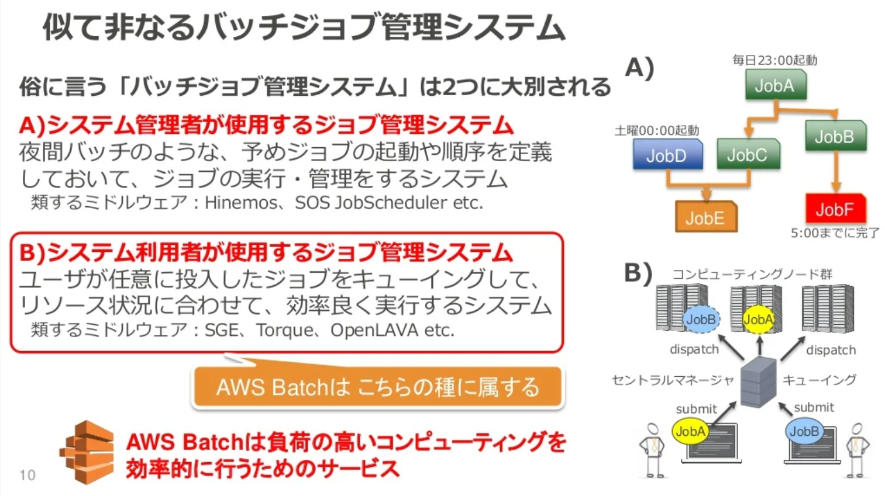
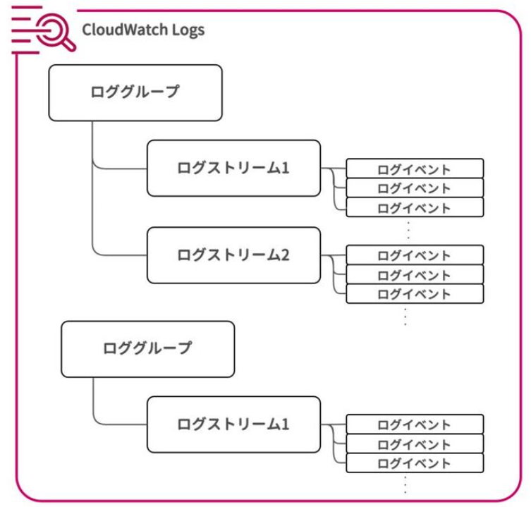
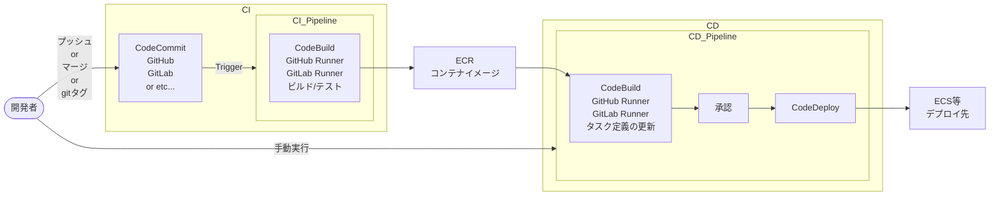

<page-title/>

::: warning 免責事項

- 有志で作成したドキュメントである。フューチャーには多様なプロジェクトが存在し、それぞれの状況に合わせて工夫された開発プロセスや高度な開発支援環境が存在する。本ガイドラインはフューチャーの全ての部署／プロジェクトで適用されているわけではなく、有志が観点を持ち寄って新たに整理したものである
- 相容れない部分があればその領域を書き換えて利用することを想定している。プロジェクト固有の背景や要件への配慮は、ガイドライン利用者が最終的に判断すること。本ガイドラインに必ず従うことは求めておらず、設計案の提示と、それらの評価観点を利用者に提供することを主目的としている
- 掲載内容および利用に際して発生した問題、それに伴う損害については、フューチャー株式会社は一切の責務を負わないものとする。掲載している情報は予告なく変更する場合がある

:::

# はじめに

技術選定におけるクラウドファーストは標準となって久しく、新規開発・システム更改いずれにおいても、クラウド環境利用を検討しないシーンはない。一方、ほぼすべてのシステムがクラウド上に構築される中、毎回フルスクラッチで設計することは非効率的である。設計者は、そのシステムに固有の要件・特性をどう満たすのかの設計に心血を注ぐべきで、例えば、システム間差異が少ないコンポーネントの設計に時間を多く割くべきではない。

本ガイドラインは、設計者が車輪の再発明に陥らず、真に必要な設計に集中できることを目的にまとめられた。具体的には、システム間差異の少ない設計のベストプラクティスを提供することで、設計者が考慮しなければならない作業の多くを肩代わりし、設計品質の向上を支援する。ただし、本ガイドラインは個別のシステム設計を代替するものではなく、あらゆる要件に適合する万能な解決策でもない。あくまで設計者が価値ある設計に注力するための判断材料を提供するツールである。

# 前提条件

本ガイドラインは、クラウドサービスのうち、AWSが採用されたシステムの設計で活用されることを想定している。また、利用するサービス選定には、できる限りマネージドサービスを利用することで、運用・保守のコストを下げるというポリシーがあるとする。

# マルチアカウントを利用した環境分離パターン

AWSにおける最も強力かつ、基本的な環境境界がAWSアカウントである。

Well-architected Frameworkのセキュリティの柱においても、AWSアカウントの分離が強く推奨されている。

- [AWS アカウントの管理と分離 \- セキュリティの柱](https://docs.aws.amazon.com/ja_jp/wellarchitected/latest/security-pillar/aws-account-management-and-separation.html)

マルチアカウントの設計は、アカウント分離の単位が最も重要である。デプロイメント環境ごと（開発・検証・本番など）に分離することは大前提とした上で、アカウントを跨いで適用すべき施策・一部アカウントのみに適用すべき施策を特定し、各施策に応じた設計が必要である。当然すべてのシステムの要件を満たせる「銀の弾丸」パターンはないが、共通化したい・すべきコンポーネントはある程度パターンが決まっているため、どのような共通化コンポーネントがあるかを整理することで、必要な設計を導き出すことができる。

そのために考慮すべき要件例を以下に示す。

| 項目                                        | 詳細                                                                                                                                                                                      |
| :------------------------------------------ | :---------------------------------------------------------------------------------------------------------------------------------------------------------------------------------------- |
| 各環境へのアクセス権付与                    | IAMユーザーをどのように集中管理させたいか？                                                                                                                                               |
| 監査・GRC（Governance Risk and Compliance） | 内部・外部の監査人へのアクセス権付与や操作ログ・設定変更履歴の保全の仕組みそのものを共通化したいか？                                                                                      |
| セキュリティ監視                            | 監視対象のログの連携や攻撃証跡保全の仕組みを共通化したいか？                                                                                                                              |
| 既存NWとの接続                              | ・社内NWや開発拠点、DC等から閉域接続やVPN接続が必要か？<br>・プライベートIPアドレスの空き状況やコスト面などの要請から接続に必要なリソース(DirectConnectやTransit Gateway)を共用が必要か？ |
| 外部NWとの接続                              | ライセンスやセキュリティ統制、コストの観点から、インターネットや外部システムへのアクセス点の作成や穴開けをFWなどで集中管理させたいか？                                                    |
| 共通利用する資材                            | 実行するバイナリやコンテナイメージを共通のレジストリに保管したいか？                                                                                                                      |

上記を考慮し、システム単体での共通化の要否の整理をすると共に、複数システムで共同利用すべきかを併せて検討する必要がある。特に、将来的に共通基盤化につなげる意図があるコンポーネントについては、分離・移行の難易度を下げるためにも、当初の段階からアカウントごと分離しておくべきである。

さらに、ガバナンスや法令・基準への適合範囲を狭めるために、あえて環境を一部切り出したい要件も存在する。そのような要件がある場合は、デプロイメント環境としては1つであっても複数アカウントに跨がってリソースを構築するパターンも考慮する。具体的には、下記のような要件がある。

| 項目                           | 詳細                                                                                                                                                                                                                                                                                                           |
| :----------------------------- | :------------------------------------------------------------------------------------------------------------------------------------------------------------------------------------------------------------------------------------------------------------------------------------------------------------- |
| **データ・プライバシーの要件** | ・PCI-DSSなどの基準への適合のため、決済処理などPCI-DSSの対象となるリソース群は『法令・基準適合アカウント』に分離して配置する必要がある場合<br>・国・地域のプライバシー法制（GDPR・CCPA・中国個人情報保護法など）に合わせて、特定の国や地域にあるリージョンから別のリージョンへのデータ持ち出しを禁止したい場合 |

推奨は以下の通り。

- Organizationのルートアカウント/Payerアカウントにはリソースは配置せず、Organizationの管理のみで利用する
- 開発・検証・本番などの環境面ごとにアカウントを分離する
  - データ・プライバシー要件からデータ分離が必要な場合はアカウント単位でデータを分離する
- IAM管理アカウントを作成し、IAMユーザーはそのアカウント配下に作成する
  - 将来的な環境移管を見据え、Identity Centerは利用しない
    - Identity Centerの構成を保ったまま環境移管するためには、Payerアカウントごとの移管する必要があり、移管先のAWSのパートナー資格によっては移管できない場合がある。その場合、アカウント移管時はIdentity Centerからの移行が必要になるため、当初からIAMユーザーを作成するアカウントを作成すると良い
  - 各環境へはクロスアカウントで委任を設定したロールへスイッチする
  - IAM管理アカウント以外にはIAMユーザーは作成できないようSCPで制御する
- 監査・ログ管理アカウントを作成する
  - ログアクセスする際は各アカウントへのアクセス権を付与するのではなく、監査・ログ管理アカウントにアクセス権を付与する（AWSの仕様上クロスアカウントでのログ出力ができない場合は、個別にログ転送を行う）
- セキュリティサービス用アカウントを作成する
  - AWS Organizationとの統合するためのアカウントを作成する
  - 具体的に構築すべきサービスは [すべてのアカウントが対応すべきセキュリティ対策](#すべてのアカウントが対応すべきセキュリティ対策) 章を参照
- 必要に応じて既存NWやインターネット接続用のアカウントを作成する
  - 既存NWや運用拠点との接続はVPC毎に接続する構成は複雑になるため、ネットワーク用のアカウントを作成して、ハブアンドスポーク型のネットワークを構築する（メッシュ型のネットワークは構築しない）
  - 同様に外部NWやインターネットへの接続に関しても、複数アカウントからドメインレベルでの制御やNAT利用がある場合はコスト面で優位性があるネットワーク用のアカウントを作成する
- アカウントを所属させるOUはできるだけネストした構成を避けること。ワークロード用でひとつ、共通コンポーネント毎にそれぞれのOUを作成する
  - SCPは通常のポリシーとは異なり、アカウントに設定されたSCPとツリー上位のポリシーの論理和、かつコンフリクトを起こす条件についてはツリー上位のポリシ－が先勝ちする形で評価が行われる
  - 設定の検証を簡易化するためにも、安易にOUをネストしないことを推奨する

::: tip マルチアカウントの作成パターン

推奨事項に則った標準的なマルチアカウントの作成パターンを以下に示す。

| OU           | アカウント           | 必須 | 説明                                                                                 | 代表的なリソース                                                   | 備考                                                                                                                                                   |
| ------------ | -------------------- | :--: | ------------------------------------------------------------------------------------ | ------------------------------------------------------------------ | ------------------------------------------------------------------------------------------------------------------------------------------------------ |
| ワークロード | 開発                 |  ✅️  | 開発用リソースを配置する                                                             | VPC、ECS、RDS                                                      |                                                                                                                                                        |
|              | 検証                 |  ✅️  | 検証用リソースを配置する                                                             | 同上                                                               |                                                                                                                                                        |
|              | 本番                 |  ✅️  | 本番用リソースを配置する                                                             | 同上                                                               |                                                                                                                                                        |
|              | 法令・基準適合       |      | PCI-DSS、各国のプライバシー法制などの要件遵守のために関係するリソースのみを配置する  | RDS、S3など                                                        | 監査要件の対象を絞ることで、保管期間や監査対象を削減し、コスト最適化につながる また、適切なSCPを適用することでアカウント単位でのガードレールを適用する |
| ユーザー管理 | IAM管理              |  ✅️  | 他アカウントへAssumeRoleするIAMユーザーを作成する                                    | IAMユーザー                                                        | IAM Identity Centerを利用しない場合                                                                                                                    |
| セキュリティ | 監査・ログ管理       |  ✅️  | 将来的な監査やトレーサビリティチェック、フォレンジックに必要なログを配置する         | Cloudtrail、VPC Flow Log、Config                                   | 当該アカウントへのログ集積を許可するクロスアカウントポリシーを適用する                                                                                 |
|              | セキュリティサービス |  ✅️  | アカウントまたぎで利用するセキュリティサービスを配置する                             | Security Hub CSPM、Macie、GuardDuty                                | 当該アカウントからのアクセスを許可するクロスアカウントポリシーを適用する                                                                               |
| 共通サービス | ネットワーク         |      | 既存のDCと接続するリソースや、インターネットへのアクセス制御を行うリソースを配置する | Transit Gateway、Direct Connect、NAT Gateway、Network Firewallなど | オンプレミス環境との専用線接続や、複数アカウントで共通のインターネット出口が必要な場合に作成する                                                       |

:::

::: tip Control Towerを使うべきか？  
AWSマネージドでクロスアカウント構成を作成するサービスにControl Towerが存在する。詳細に設計しなくとも自動で必要なリソースが生成される一方で、一度Control Towerで管理を開始したOrganizationは、管理を解除する（廃止する）ための公式な手順が存在せず、元に戻すことが極めて困難である。そのためサンドボックス的な利用で、将来的なカスタマイズが不要な場合でのみ利用することを推奨する。

特に、環境構築後に環境そのものを引き渡す場合、引き渡し先での統制とControl Towerとでコンフリクトする懸念があるため、利用すべきではない。

一方、共通基盤としてControl Towerを整備している企業や公共団体もあり、その場合は利用するアカウントの統制方法に合わせて環境を利用する。  
:::

# すべてのアカウントが対応すべきセキュリティ対策

AWSのセキュリティ設計の指針として、セキュリティの柱 \- AWS Well-Architected フレームワークや、CIS Amazon Web Services Foundations Benchmarkなど、有用なガイドラインが複数公開されている。そのため、システムの特性にそった適切なガイドラインを選択し、記載された対応を実施することで、技術的な観点でのセキュリティ対策は一定のレベルで実装できる。

本番環境に対してこれらのガイドラインベースでリッチなセキュリティ対策を実装していても、開発環境や社内検証環境には十分なセキュリティ対策がとれていないシステムがあるのではないかとの思いがある。そのため「すべてのアカウントが対応すべきセキュリティ対策」と題して、システムの特性や規模によらずリスク低減のために最低限行うべき「コスパの良い」対策とその実装方法を記す。なお、セキュリティに関して要件が別途定められている場合は、その要件への対応を優先すること。

## SecurityHubでの統合管理

SecurityHubは、アカウントやリージョンを横断してセキュリティ状況を一元的に把握した管理が可能なサービスである。各セキュリティサービスの検知結果を集約して表示できるほか、AWS Configに対して検知ルールを配布し、セキュリティグループの過剰な開放などリスクの高い設定値を検出できる。

主な考慮事項や論点としては以下がある。

- 設定値評価のベースライン（セキュリティ基準）に何を選択すべきか
  - パラメータ評価を有効化する際に、ベースラインとなるガイドラインをセキュリティ基準として設定できる。選択できるセキュリティ基準は次の通りで、要件に適したものを選択する必要がある

  | セキュリティ基準名                              | 概要                                                                                                                       |
  | :---------------------------------------------- | :------------------------------------------------------------------------------------------------------------------------- |
  | AWS 基礎セキュリティのベストプラクティス v1.0.0 | AWSによって制定されたセキュリティ基準であり、組織の規模や領域にかかわらず、遵守すべき基準として作成されたもの              |
  | CIS AWS Foundations Benchmark v1.2.0            | 米国のCISによって策定されたガイドラインであり、業種業界を問わず広く活用されている                                          |
  | CIS AWS Foundations Benchmark v1.4.0            | 同上                                                                                                                       |
  | CIS AWS Foundations Benchmark v3.0.0            | 同上                                                                                                                       |
  | NIST Special Publication 800-53 Revision 5      | 米国政府が政府内の情報システム向けに作成したガイドライン                                                                   |
  | PCI DSS v3.2.1                                  | クレジットカード業界における情報セキュリティ基準であり、カード所有者データを保存、処理、または送信する組織に適用される     |
  | PCI DSS v4.0.1                                  | 同上                                                                                                                       |
  | AWS リソースタグ付け標準 v1.0.0                 | リソースにアタッチされたタグの設定状況のみをスコープとしたセキュリティ基準であり、タグが設定されていないリソースを検知する |

- 集約アカウントを設定するか
  - Organizations配下の各アカウントの準拠状況を、1つのアカウントのSecurityHubコンソール上に集約して表示できる
- 対応プロセスの定義
  - SecurityHubの有効化後、検知結果に対して対応するかリスクを受容するか運用の中で判断する必要がある。検知結果は自動的に重要度が設定され、重要度は重要/高/中/低がある
  - 重要度に応じて、対応期限を定めての実施が一般的である

  | 重要度 | AWSによる定義                                                      | 検知ルールの例                                                                                                                                       |
  | :----- | :----------------------------------------------------------------- | :--------------------------------------------------------------------------------------------------------------------------------------------------- |
  | 重要   | この問題は、さらに悪化しないように<br>直ちに修復する必要があります | [EC2.19] セキュリティグループは、リスクの高いポートへの無制限アクセスを許可してはいけません                                                          |
  |        |                                                                    | [S3.19] S3 アクセスポイントではブロックパブリックアクセス設定を有効にする必要があります                                                              |
  |        |                                                                    | [RDS.2] RDS DB インスタンスは、PubliclyAccessible 設定によって判断される、パブリックアクセスを禁止する必要があります                                 |
  |        |                                                                    | [IAM.4] IAM ルートユーザーアクセスキーが存在してはいけません                                                                                         |
  | 高     | この問題は短期的な優先事項として<br>対処する必要があります         | [EC2.9] Amazon EC2 インスタンスは、パブリック IPv4 アドレスを未設定にすることをお勧めします                                                          |
  |        |                                                                    | [EC2.2] VPC のデフォルトのセキュリティグループでは、インバウンドトラフィックまたはアウトバウンドトラフィックを許可しないようにすることをお勧めします |
  | 中     | この問題は、中期的な優先事項として<br>対処する必要があります       | [IAM.5] コンソールパスワードを使用するすべての IAM ユーザーに対して MFA を有効にする必要があります                                                   |
  |        |                                                                    | [EC2.7] EBS のデフォルト暗号化を有効にすることをお勧めします                                                                                         |
  |        |                                                                    | [EC2.6] すべての VPC で VPC フローログ記録を有効にすることをお勧めします                                                                             |
  | 低     | この問題には、独自のアクションは<br>必要ありません                 | [IAM.24] IAM ロールにはタグを付ける必要があります                                                                                                    |
  |        |                                                                    | [EC2.12] 未使用の Amazon EC2 EIP を削除することをお勧めします                                                                                        |

推奨は以下の通り。

- Security Hub CSPMは全デプロイメント環境（開発、検証、本番など）で有効にする
- セキュリティ基準は、求められる要件があればそれに従い選択する。明確な要件がない場合は、「AWS 基礎セキュリティのベストプラクティス v1.0.0」と「CIS AWS Foundations Benchmark v3.0.0」を有効化する
  - 前者は、組織の規模や領域にかかわらず遵守すべき基準としてAWSにより作成されており、監視対象の種別が幅広いため有効化する
  - 後者は、第三者機関によって作成された基礎的なガイドラインであり、業種業界を問わず標準として利用されているため有効化する
- 集約管理アカウントを設定し、Organizations内の全アカウントとリージョンのセキュリティ準拠状況を1つのコンソールで管理する。集約先はセキュリティ管理アカウントとする
- 重要度が「重要」 の検知結果が検知され、想定外の設定変更であった場合は、即座に修正対応を完了させる。重要度「高」の検知結果の場合は、翌営業日を目途に対応する
- 定期的な監視運用がされていない環境（開発環境など）では、重要度が「重要」 「高」 の検知はslackやチケット管理システムへ即時通知する。重要度が中・低の検知項目に対しては、月次などの頻度で内容を確認しリスクを受容するか、バックログとして対応計画を立てるかの判断（棚卸し）を実施する

## CloudTrailで監査ログを取得する

CloudTrailは、AWSマネジメントコンソール、AWS CLI、AWS SDK、AWS APIで実行されたアクションのログを記録するサービスである。監査対応やインシデント発生時の追跡調査において、CloudTrailが取得したログは必須となることが多い。CloudTraiの証跡機能を利用することで、長期間にわたってログをS3に保管もできる。

主な考慮事項や論点としては以下がある。

- どのログを証跡として取得し保管するか
  - CloudTrailが取得するログは、以下の4つのイベントに分類される。証跡作成画面でそれぞれのイベントを選択することで、証跡として保管される。
  - 取得対象のログは、それぞれ調整ができる

  | イベント種別                       | 概要                                                                 | イベントの例                                         | コスト                                                                   |
  | :--------------------------------- | :------------------------------------------------------------------- | :--------------------------------------------------- | :----------------------------------------------------------------------- |
  | 管理イベント                       | AWS上のリソースに関するイベントを記録する                            | S3バケット自体の作成/削除                            | 配信される管理イベント 100,000 あたり 2.00 USD                           |
  | データイベント                     | リソース内で実行されるイベントを記録する                             | S3バケット内のオブジェクトの作成/削除                | 配信されたデータイベント 100,000 件あたり 0.10 USD                       |
  | ネットワークアクティビティイベント | VPCエンドポイント経由で実行されたイベントを記録する                  | VPCエンドポイントを経由して、S3に対してAPIを実行する | 配信されたネットワークアクティビティイベント 100,000 件のあたり 0.10 USD |
  | Insightsイベント                   | 通常時と比較し、イベント実行頻度やエラー率に異常があった場合記録する | 大量のS3バケットの作成/削除                          | インサイトタイプごとに分析された 100,000 件のイベントあたり 0.35 USD     |

- 取得したログをどのように取得し管理すべきか
  - 改ざん防止をどのように実現するか
  - ログ保管バケットをどこに作成するか
  - ログの保管期間をどのように定めるか

推奨は以下の通り。

- 管理イベント、データイベント、ネットワークアクティビティイベントを証跡として取得する
  - データイベントについては、すべて取得するとログ量が膨大になりコスト増に繋がる。必要に応じ、イベントセレクター機能を利用して取得するログ種別を調整する。AWSサービスが実行したイベントの除外、マネジメントコンソール経由でのイベントのみの記録など、柔軟に設定ができる
  - ネットワークアクティビティイベントについては、環境内に存在するVPCエンドポイントに対するログ記録を有効化する。データイベント同様に、イベントセレクターを用いて調整する
- ログの改ざん防止のため、以下の対策を実施する
  - 証跡作成時にログファイルの検証を有効化する
    - 定期的にログファイルのハッシュ値が自動的に記録され、改ざんされていないことの確認に利用できる
  - 証跡の保管先は、ログ保管用アカウントのS3バケットとする。ログ保管用アカウントの詳細は、 [マルチアカウントを利用した環境分離パターン](#マルチアカウントを利用した環境分離パターン) を参照する
- ログ保管期間は、監査基準をもとに定める。明確な基準がない場合は、最低1年間の保管を推奨する。ログの保管期間については、[取り扱う情報の機密性や種別、各種監査基準やセキュリティ基準への対応の仕方](#取り扱う情報の機密性や種別各種監査基準やセキュリティ基準への対応の仕方) を参照して検討する
  - デフォルト推奨値の1年間の論拠はPCI-DSS。少なくとも1年の保管と規定されている（EUのプライバシー法であるGDPR準拠を基準にすると1年半である）

::: tip Insightsイベントの取得について
Insightsイベントは、イベントの実行頻度やエラー率の異常な増加を検出するサービスであり、監査ログの取得よりも攻撃/障害の検知において有効な機能である。
また、取得対象のログの細かな調整できず、環境によってはコスト増に繋がる。そのため、監査ログの取得という観点では、有効化を推奨とはしない。
:::

## GuardDutyで脅威を検知する

GuardDutyを有効化することでネットワークアクティビティやデータイベントを継続的に監視・分析し、悪意のあるアクティビティや不正な挙動を検知できる。

設定にあたっての考慮事項、論点として以下がある。

- 保護プランの選定
  - 保護プランを選択することで、検知対象を追加できる。例えば、RDSへの不正なログイン試行はデフォルトでは検知対象外だが、RDS Protectionを有効化することで検知できる

    | 保護プラン                | 機能                                                                                                                                                                                                |
    | :------------------------ | :-------------------------------------------------------------------------------------------------------------------------------------------------------------------------------------------------- |
    | S3 Protection             | S3に対する不正な操作を検知する                                                                                                                                                                      |
    | EKS Protection            | (確認中)                                                                                                                                                                                            |
    | 拡張脅威検出              | 複数のイベントの関連性を分析し、攻撃がどの段階まで進行しているかを検知する。<br>保護プランの中で唯一、重要度がCriticalの検知結果を出力する                                                          |
    | ランタイムモニタリング    | CloudTrailにログが出力されないECSやEC2上の操作を分析し脅威を検出する。<br>ただしエージェントレスではなく、EC2へのエージェント導入、ECSへのサイドカーコンテナ作成、VPCエンドポイントの作成などが必要 |
    | EC2 の Malware Protection | EC2において脅威が検知された際に、EBSボリュームのスキャンを行い、マルウェアを検出する                                                                                                                |
    | S3 の Malware Protection  | S3上のファイルに対してマルウェアスキャンを行う                                                                                                                                                      |
    | RDS Protection            | RDSに対する不正なログイン試行を検知する                                                                                                                                                             |
    | Lambda 保護               | Lambdaが不審な通信先と通信を行っていることを検知する                                                                                                                                                |

推奨は以下の通り。

- 保護プランはすべて有効化する
  - 監視対象のサービスが存在しない場合や、別途対策がとられている場合は有効化不要
  - 例えば、EC2やECSに別のアンチマルウェアサービスを導入している場合、ランタイムモニタリングは不要である
- Organizationsと統合し、管理アカウントから保護プランを設定する
  - 子アカウント上での保護プランの設定漏れを防ぐため
- 検出結果はS3にエクスポートする
  - S3に保管しない場合、90日で検知結果は削除されるため、監査の観点でS3に出力を推奨する

## Inspectorで脆弱性管理を行う

Inspectorには、自動スキャンとCISスキャンの2種類の機能がある。

自動スキャンは、EC2、ECR、Lambdaに対して、OSやライブラリに含まれる既知の脆弱性のスキャンを行う機能である。Lambdaに対しては、既知の脆弱性の検知に加えて、関数内のアプリケーションのコードをスキャンし、ユーザ自身のコード実装不備により生じた脆弱性を検知もできる。

| 自動スキャン対象    | 脆弱性検知の対象                           | 評価指標    |
| :------------------ | :----------------------------------------- | :---------- |
| EC2(Linux)          | OSパッケージ、プログラミング言語パッケージ | CVSS V3     |
| EC2(Windows)        | OSパッケージ                               | CVSS V3     |
| ECR（標準スキャン） | OSパッケージ                               | CVSS V2     |
| ECR（拡張スキャン） | OSパッケージ、プログラミング言語パッケージ | CVSS V2, V3 |
| Lambda              | （確認中）                                 | （確認中）  |

次に、CISスキャンは、EC2を対象としてOSのパラメータをCISベンチマークの基準として監査し、パラメータの設定不備により生じた脆弱性を検知する機能である。先述のSecurityHubでもCISベンチマークを基準とした監査が可能だが、SecurityHubはAWSのパラメータを対象としており、EC2内のOSは対象としていない点で違いがある。

設定、運用にあたっての考慮事項、論点として以下がある。

- EC2のスキャン形式をHybridとするかAgent-basedとするか
- ECRのスキャン設定を基本スキャンとするか拡張スキャンとするか
- 検知された脆弱性への対応優先度をどのように定義するか

推奨は以下の通り。

- Inspectorを有効として、検知結果をSecurityHubに連携する
- EC2スキャン形式は、より網羅性の高いHybridとする
- ECRスキャン形式は拡張スキャンとする
- FutureVulsを導入していない環境では、脆弱性の対応優先度は環境の露出度が高く、資産の重要度が高い環境から優先して対応する
- FutureVulsを導入している環境では、FutureVuls側のスコアで決定する
  - InspectorはCVSSスコアのみを脆弱性のスコアリングに利用しており、多くの脆弱性の重要度が最高値となる。FutureVulsにて、CVSS以外の基準も利用し脆弱性に優先度付けを行う

::: warning Inspectorを用いて脆弱性管理を行う際の注意事項

- Aurora上のPostgreSQLやMySQL、Elasticache上のRedisにもバージョニングの設定があり、バージョンによってそれぞれ脆弱性が存在する。しかし、これらはInspector、および後述のVulsでの脆弱性管理の対象とならない
- マイナーバージョンアップデートの自動化設定の有効化を設定する、AWSサポートページの定期的な確認を運用項目に追加するなど、別途対応が必要となる

:::

::: info 参考  
[PostgreSQL設計ガイドライン](/documents/forDB/postgresql_guidelines.html#%E3%83%8F%E3%82%99%E3%83%BC%E3%82%B7%E3%82%99%E3%83%A7%E3%83%B3) にPostgreSQLのサポートについての記述もある。  
:::

## Amazon MacieでS3バケットを監視する

Amazon MacieはS3の監視サービスであり、S3バケット公開状況、暗号化状況を監視するポリシー監視機能と、S3バケット内に保存された機密データの自動検出機能がある。

前者の検出結果タイプは以下の通りで、公開されている状況を詳細に把握できる。

| 検出結果タイプ                              | AWSによる定義                                                                                                                                                                                                                |
| :------------------------------------------ | :--------------------------------------------------------------------------------------------------------------------------------------------------------------------------------------------------------------------------- |
| Policy:IAMUser/S3BlockPublicAccessDisabled  | バケットレベルのパブリックアクセスブロック設定がバケットに対し無効になりました。                                                                                                                                             |
| Policy:IAMUser/S3BucketEncryptionDisabled   | バケットのデフォルトの暗号化設定は、Amazon S3 マネージドキーを使用して新しいオブジェクトを自動的に暗号化するデフォルトの Amazon S3 暗号化動作にリセットされました。                                                          |
| Policy:IAMUser/S3BucketPublic               | 匿名ユーザーまたはすべての認証された AWS Identity and Access Management (IAM) ID によるアクセスを許可するように、バケットの ACL またはバケットポリシーが変更されました。                                                     |
| Policy:IAMUser/S3BucketReplicatedExternally | レプリケーションが有効になっており、組織の外部 (一部ではない) の バケットからバケットにオブジェクト AWS アカウント をレプリケートするように設定されています。                                                                |
| Policy:IAMUser/S3BucketSharedExternally     | バケットの ACL またはバケットポリシーが変更され、組織の外部 (一部ではない) AWS アカウントとバケットを共有できるようになりました。                                                                                            |
| Policy:IAMUser/S3BucketSharedWithCloudFront | バケットポリシーが変更され、バケットを Amazon CloudFront オリジンアクセスアイデンティティ (OAI)、CloudFront オリジンアクセスコントロール (OAC)、または CloudFront OAI と CloudFront OAC の両方と共有できるようになりました。 |

後者の機密データ検出機能は、AWSによって事前に用意された検知ルールであるマネージドデータ識別子を用いることで、S3バケット内に保管されたアクセスキーや個人情報を検出できる。ただし、事前定義されたルールに、日本特有の個人情報（マイナンバー、郵便番号等）のルールは用意されておらず、検知のためにはカスタムデータ識別子の設定が必要となる。

推奨は以下の通り。

- Organizationsと統合し、セキュリティサービス管理用のアカウントから各アカウントへ設定を展開する
- Macieを有効化しポリシー監視する。また、機密データの自動検出機能を有効化する
- 機密データの自動検出機能について
  - マネージドデータ識別子を検知ルールとして利用する
  - 機密情報を保管することが事前に想定されており、堅牢化や監視が行われているS3バケットは、対象から除外することを検討する
- 検出結果をSecurityHubに連携する

# 取り扱う情報の機密性や種別、各種監査基準やセキュリティ基準への対応の仕方

組織は、リスク低減・監査対応・ステークホルダーへの説明責任といった目的のため、準拠すべき監査基準やセキュリティ基準を定めている。しかし、プロジェクトによってはこれらの基準が明確に定義されていない場合もある。

取り扱う情報の機密性や対象となるシステム・データの重要性に応じて、適用するセキュリティ基準と対策のレベルを決定するが、何も決まっていない案件向けに推奨値を記載する。

また、セキュリティ基準への対応は、以下の2つの軸で設計する必要がある。

- **基盤監査**: 基盤やサービスの設定値が、基準に準拠できているかを確認する。AWS ConfigやSecurity Hub CSPMなどのマネージドサービスにより、多くの項目を自動的に検出可能
- **情報監査**: 扱う情報の機密性に応じて、基準に適合した適切な保管・管理ができているかを確認する

情報監査はマネージドサービスによる自動検出が難しいため、本章ではその設計手法を説明する。

## 基盤監査設計

### セキュリティ基準への監査設計で活用できるサービス

どのセキュリティ基準に対応するにも、まずは以下サービス全ての有効化が望ましい。有効化したサービスは自動でアラート状況や監査記録をSecurityHubに転送し、監査チェックの範囲が広がる。ただし、有効化＝費用追加となるため、無効化のままの方が良いケースも存在する。よって、利用状況を確認し、下記表の「活用判断」列に該当する環境においては無効にするかを検討する。

| No  | サービス名              | 主な監査の活用内容                                                                                                                                             | 活用判断                                                                                                                                                                                                                                                                 |
| :-- | :---------------------- | :------------------------------------------------------------------------------------------------------------------------------------------------------------- | :----------------------------------------------------------------------------------------------------------------------------------------------------------------------------------------------------------------------------------------------------------------------- |
| 1   | AWS SecurityHub         | ・セキュリティ状況の一元的な可視化と管理（No2～7のアラート統合管理）<br> ・セキュリティ基準への準拠状況を自動チェック                                          | 必須                                                                                                                                                                                                                                                                     |
| 2   | AWS Config              | ・リソース設定の継続的な記録<br> ・コンプライアンス違反の自動修復                                                                                              | 必須                                                                                                                                                                                                                                                                     |
| 3   | Amazon Inspector        | インスタンス/コンテナイメージ/lambda等の脆弱性管理                                                                                                             | ・EC2インスタンスやコンテナベースのワークロードを一切利用していない場合は要検討<br> ・手動での脆弱性管理やサードパーティ製のスキャンツール（Vuls等）を使っている場合は要検討（lambda等のVuls対象外のものもあるため、網羅的に脆弱性管理可能かを確認した上で判断すること） |
| 4   | Amazon GuardDuty        | マルウェアの活動、不正アクセス、偵察行為などの脅威を検出                                                                                                       | ・ごく小規模で、外部からのアクセスがほとんどない場合は要検討<br> ・サードパーティ製の脅威検出システムを使っている場合は要検討（併用が望ましい）                                                                                                                          |
| 5   | Amazon Macie            | ・S3バケット内の機密データの検出と保護<br> ・S3バケットの公開情報等を評価                                                                                      | ・S3を全く利用していない場合は要検討<br> ・S3を利用しているが、機密情報は一切含まれていない場合は要検討                                                                                                                                                                  |
| 6   | AWS Firewall Manager    | ・組織全体のファイアウォールルール（AWS WAFルール、セキュリティグループ等）を一元的に設定・管理<br> ・通信ポリシーに準拠していないリソースや設定を検出         | ・AWSアカウントが少数で、手動でのファイアウォール管理で問題ない規模の場合は要検討<br> ・ファイアウォールリソース（WAF、SGなど）が小規模で、手動管理で問題ない場合は要検討                                                                                                |
| 7   | AWS IAM Access Analyzer | ・外部エンティティ（他のAWSアカウント、パブリックアクセスなど）からの意図しないアクセスを検出<br> ・長期ログインしていないユーザアカウントからのログインを検出 | ・IAMポリシーの管理がシンプルで、手動での確認が容易なごく小規模な環境では要検討                                                                                                                                                                                          |

::: warning S3を全く使用していないアカウントとは？
AWS Direct Connect専用のアカウントなどS3が存在しないことはありえる。また、EC2は利用するがS3を利用しないシステムも世の中には存在する。そのようなS3を一切利用しない場合は、Macieを有効にしなくても良い。
:::

### SecurityHubで管理できるセキュリティ基準と、選定

担当する会社/組織のセキュリティレベルや、扱っている情報を元に準拠するセキュリティ基準を有効にする。セキュリティ基準は下表がある。

【凡例：セキュリティ強度】

- ◯: 基礎的なセキュリティレベルを確保する基準
- ◎: より厳格な統制を求める基準。特定の業界や規制対象のシステムで要求される
- (+): 上記に加え、特に技術的な要件や手続きが詳細に規定されていることを示す

| No  | セキュリティ基準名                              | セキュリティ強度 | 概要                                                                                                                   |
| :-- | :---------------------------------------------- | :--------------- | :--------------------------------------------------------------------------------------------------------------------- |
| 1   | AWS 基礎セキュリティのベストプラクティス v1.0.0 | ◯(-)             | AWSによって制定されたセキュリティ基準であり、組織の規模や領域にかかわらず、遵守すべき基準として作成されたもの          |
| 2   | CIS AWS Foundations Benchmark v1.2.0            | ◯                | 米国のCISによって策定されたガイドラインであり、業種業界を問わず広く活用されている                                      |
| 3   | CIS AWS Foundations Benchmark v1.4.0            | ◯                |                                                                                                                        |
| 4   | CIS AWS Foundations Benchmark v3.0.0            | ◯                |                                                                                                                        |
| 5   | NIST Special Publication 800-53 Revision 5      | ◎                | 米国政府が政府内の情報システム向けに作成したガイドライン                                                               |
| 6   | PCI DSS v3.2.1                                  | ◎(+)             | クレジットカード業界における情報セキュリティ基準であり、カード所有者データを保存、処理、または送信する組織に適用される |
| 7   | PCI DSS v4.0.1                                  | ◎(+)             |                                                                                                                        |

推奨は以下の通り。

- 特別な要件がない場合は、業種業界を問わず世界標準で活用されていて、かつ、セキュリティ強度を広い範囲で総合的に向上させることができるNo1、4を有効にする
- 業種・業態によっては他のセキュリティ基準も有効にする
  - 例: 省庁向け案件の場合は、No5も有効にする
  - 例: クレジットカードによる決済を要するシステムも含まれる場合はNo7も有効にする

::: tip バージョン違いのセキュリティ基準について  
基本的に最新版だけで良い。運用中に新たなバージョンが増えたときは旧版：新版を同時にチェックし、段階的に新版へ移行していけるようにすると良い。  
:::

### 検知対応

セキュリティ基準を設定すると2時間以内にチェックが完了し、重要度（重要・高・中・低）毎に検知ができる。検知内容を以下のパターンに分類する。

| パターン | 重要度   | パターンの説明                                                       | 対応例                                                                                                        |
| :------- | :------- | :------------------------------------------------------------------- | :------------------------------------------------------------------------------------------------------------ |
| A        | 重要、高 | 早急に対応が必要であり、設定値を見直す                               | 1ヶ月以内に「解決済み」にする                                                                                 |
| B        | 重要、高 | 対応が必要であるが、当環境において例外的に許容しなくてはいけないもの | 例外の理由を記録し「無効化」にする                                                                            |
| C        | 重要、高 | 対応が必要だが、設計上回避が難しいもの                               | 回避が難しい理由を記録、および暫定対策を検討し、1ヶ月以内に実施する その後、「抑制済み」にする                |
| D        | 中       | 対応が必要だが、急ぎではないので計画を立てて解消していくもの         | 「通知済み」にし、別途で半年以内に対応するスケジュールを定める                                                |
| E        | 低       | 一旦、許容する                                                       | 公式リファレンスでも「独自のアクションは必要ありません」と明記されており、低→中となるまでは許容する方針で良い |

推奨は以下の通り。

- 「重要」 「高」の検知項目を必須対応とし、「中」以下は計画的（半年以内など）に対応する
  - 重要なのは、運用が形骸化せず実効性を持たせる設計にすることである
  - 対応が追いつかず、アラートが蓄積し、運用者にプレッシャーが掛かるのは避ける必要がある

::: tip 開発環境、検証環境の基盤監査設計について

本番環境と同等の厳密さを求めると、現実的に開発のスピードを損なうため多少の加減は必要である。

具体的には、No1、4を有効にし、パターンA、B、Cのみ分類・対応すると良い。

また、開発・検証環境では誤って “誰でもアクセス可” とするようなポリシーを作成してしまった。というような操作ミスから、3日以内にサイバー攻撃を受けて多大な被害が出てしまう事例が多々あるため、毎日張り付きで監視するよりも「重要」 「高」のアラートを即時アラートメールとして受け取れるように設定することを推奨する。

【参考】

- [【アップデート】Security Hub 通知のフィルタルールを EventBridge から簡単に作成できます](https://dev.classmethod.jp/articles/simplified-rule-creation-for-securityhub-in-eventbridge/)
- [【AWS】SecurityHubの検出結果をメール通知する方法](https://note.com/hiroyu0510/n/n1eb3e8ba372a)

:::

::: info 参考
[コントロールの結果を生成および更新する \- AWS Security Hub](https://docs.aws.amazon.com/ja_jp/securityhub/latest/userguide/controls-findings-create-update.html)
:::

## 情報監査設計

### 各リソース一覧に機密性レベルをラベリングする

各基準が適用されるAWSリソース（アカウント、VPC、サブネット、EC2、S3バケット、RDS等）を明確に定義し、一覧化する。

その後に各リソースへデータの機密性レベル（公開、社外秘、機密、極秘、個人情報、特定個人情報、カード会員データ）等の分類基準を明確にする。これら、データの分類・ラベリングは多くのセキュリティガイドラインにおいて、データの適切な保護と管理のために不可欠な要素として求められるため、設計の初期段階で実施すべきである。これが監査対象の全体像となる。

【機密性レベル例】

| 機密性レベル          | 説明                                                     | 具体例                                                                               |
| :-------------------- | :------------------------------------------------------- | :----------------------------------------------------------------------------------- |
| 公開                  | 誰でもアクセスして良い情報                               | 企業のWebサイトで公開されている情報（製品カタログ、プレスリリース等）                |
| 社外秘                | 外部に公開してはならない情報                             | 顧客との打合せ資料、顧客リスト（企業名のみ）等                                       |
| 機密                  | 漏洩した場合に企業の競争力や信頼を損なう可能性のある情報 | 財務情報、技術情報、個人情報を含む顧客情報等                                         |
| 極秘                  | 漏洩した場合に企業の存続に関わる可能性のある情報         | 企業の合併・買収計画、高度な技術情報等                                               |
| 個人情報/特定個人情報 | 特定の個人を識別できる情報                               | 氏名、住所、生年月日、電話番号、メールアドレス、クレジットカード番号、マイナンバー等 |

【アウトプット例】

| リソース | 名称（ホスト名）     | 主な監査対象ファイル                              | 機密性レベル          |
| :------- | :------------------- | :------------------------------------------------ | :-------------------- |
| EC2      | Official_Website     | サイトソースコード、ドキュメント（JPEG、pdfなど） | 公開                  |
|          | Internal_File_Server | 設計書、提案書など                                | 機密、極秘            |
| S3       | Tmp_Bucket           | 一時ファイル、公開ファイルなど                    | 公開                  |
|          | Tokyo_Bucket         | ファイル（Office、PDFなど）                       | 社外秘                |
|          | Osaka_Bucket         | ファイル（Office、PDFなど）                       | 社外秘                |
| RDS      | Customer_master      | 個人情報、テーブル/カラム情報                     | 個人情報/特定個人情報 |
| …        | …                    |                                                   | …                     |

### ラベリング毎にデータの取り扱い要件を確認する

ラベリングされた各リソースに対して、セキュリティガイドラインは以下のような項目を要求する。しかし、そのほとんどに明確な値は記されていない。そのため、各組織が自身のビジネスニーズに基づいて決定し文書化する必要がある。

よって、全ての要求に沿う形で定型化することは難しいが、事前に最低限決めておく必要があると考えられる必須項目および関連する値を示す。

1. **データの保管**
   - 保管中のデータに対する定期的なバックアップを実施する（頻度・保管場所・定期的なテストと復旧手順の確認など）
2. **アクセス制御**
   - 最小権限の原則に基づき、データへのアクセスを必要最小限のユーザに限定する
     - 職務や役割に基づき、アクセスが許可される機密性レベルを定義など
3. **データの暗号化**
   - 保管中および転送中のデータを暗号化し、不正アクセス時の情報漏洩を防ぐ
     - 暗号方式（暗号強度）
   - 暗号鍵の適切な管理と定期的な更新など
     - 管理方式
     - パスワードローテーションなど
4. **データの削除**
   - 不要になったデータを安全に削除し、復元不能な状態にするなど
5. **監査とログ管理**
   - データへのアクセスや変更に関するログを記録し、定期的に監査する
   - ログを安全に保管し、改ざんや不正アクセスから保護する
   - 要求される監査期間に応じることができる期間を保管するなど

【例: 各種ガイドラインでの要求事項（※章は参考となる主だったものを記載。記載した章の付近にも類似した要求内容があるため、合わせて確認すること）】

| 分類           | 項目   | ISMS（ISO 27001）                                                                                                | NIST                                                                                                      | PCI DSS                                                                             | HIPAA                                                                                                                                                                         |
| :------------- | :----- | :--------------------------------------------------------------------------------------------------------------- | :-------------------------------------------------------------------------------------------------------- | :---------------------------------------------------------------------------------- | :---------------------------------------------------------------------------------------------------------------------------------------------------------------------------- |
| 説明           | 特徴   | リスクベースで情報セキュリティを管理する国際規格。特定の技術や手順に限定されず、汎用的な枠組みを提供する点が特徴 | 暗号方式や鍵長、鍵管理に関してより具体的な推奨事項や要件を示している点が特徴                              | 監査頻度、技術要件に関してより具体的な推奨事項や要件を示している点が特徴            | 米国の医療保険制度改革法。保護対象の医療情報（PHI）の取り扱いについて、プライバシーとセキュリティに関する厳格な規則を定めている点が特徴                                       |
| データの保管   | 文書名 | ISO/IEC 27001:2022 の管理策                                                                                      | NIST SP 800-53 Rev. 5                                                                                     | PCI DSS v4.0                                                                        | HIPAA                                                                                                                                                                         |
|                | 章     | A.8.13                                                                                                           | CP-9 SYSTEM BACKUP                                                                                        | 12.10<br> ※明確なバックアップ要件は無い                                             | CFR Part 164 Subpart C <br>※明確なバックアップ要件は無い                                                                                                                      |
| アクセス制御   | 文書名 | ISO/IEC 27001:2022 の管理策                                                                                      | NIST SP 800-53 Rev. 5                                                                                     | PCI DSS v4.0                                                                        | HIPAA                                                                                                                                                                         |
|                | 章     | A.5.1、A.5.15、A.5.17、A.5.18                                                                                    | ACファミリー（Access Control）                                                                            | 7、8                                                                                | CFR Part 164.308、164.312                                                                                                                                                     |
| データの暗号化 | 文書名 | ISO/IEC 27001:2022 の管理策                                                                                      | 暗号方式：NIST SP 800-131<br>管理方式：800-57<br>パスワードローテーション：800-63B                        | PCI DSS v4.0                                                                        | HIPAA                                                                                                                                                                         |
|                | 章     | A.8.24                                                                                                           | SCファミリー（System and Communications Protection）<br>IAファミリー（Identification and Authentication） | 暗号方式：3.7.2、4.2.1<br>管理方式：3.5.1、3.6.1<br>パスワードローテーション：8.3.9 | 暗号方式： CFR Part 164.312<br>管理方式： CFR Part 164.306 <br>※明確な管理方式要件は無い <br>パスワードローテーション： 164.308<br> ※明確なパスワードローテーション要件は無い |
| データの削除   | 文書名 | ISO/IEC 27001:2022 の管理策                                                                                      | NIST SP 800-53、800-88、800-92                                                                            | PCI DSS v4.0                                                                        | HIPAA                                                                                                                                                                         |
|                | 章     | A5.10、A8.10                                                                                                     | AUファミリー（Audit and Accountability）                                                                  | 3.1.1、9.5.2                                                                        | CFR Part 164.310、164.316                                                                                                                                                     |
| 監査とログ管理 | 文書名 | ISO/IEC 27001:2022 の管理策                                                                                      | NIST SP 800-53、800-88、800-92                                                                            | PCI DSS v4.0                                                                        | HIPAA                                                                                                                                                                         |
|                | 章     | A8.15、A8.16                                                                                                     | AUファミリー（Audit and Accountability）                                                                  | 10.2、10.3、10.4、10.5.1                                                            | CFR Part 164.310、164.312、164.316                                                                                                                                            |

【例: より具体的な基準値を設けているNISTに準拠したアウトプット】

| #   | 名称                 | 機密性レベル          | 保管頻度 | 保管場所  | アクセス制御                                                                                                                                                       | 暗号方式（暗号強度） | 暗号管理方式 | パスワードローテーション | データの削除                              | 監査ログ取得 | 監査間隔     | 監査ログ保持期限 |
| :-- | :------------------- | :-------------------- | :------- | :-------- | :----------------------------------------------------------------------------------------------------------------------------------------------------------------- | :------------------- | :----------- | :----------------------- | :---------------------------------------- | :----------- | :----------- | :--------------- |
| EC2 | Official_Website     | 公開                  | 日次     | 東京/大阪 | 特段無し。管理Web画面においては別途：IP制御、MFA、強固なPWなどが必要                                                                                               | 暗号化無し           | 管理無し     | 無し※１                  | 特段無し                                  | 有り         | 月次         | 1年              |
|     | Internal_File_Server | 機密、極秘            | 日次     | 東京/大阪 | Aグループ：a,b,cフォルダを閲覧・書込可能 <br>Bグループ：b,cフォルダを閲覧・書込可能 <br>Cグループ：cフォルダを閲覧・書込可能 <br>Dグループ：cフォルダを閲覧可能※２ | AES-GCM（256bit）    | 一元管理方式 | 無し※１                  | 特段無し                                  | 有り         | 月次         | 1年              |
| S3  | Tmp_Bucket           | 公開                  | 無し     | 無し      | 特段無し                                                                                                                                                           | 暗号化無し           | 管理無し     | 無し※１                  | 3日間隔で削除                             | 有り         | リアルタイム | 3日              |
|     | Tokyo_Bucket         | 社外秘                | 日次     | 東京/大阪 | Aグループ：a,b,cバケットを閲覧・書込可能 <br>Bグループ：b,cバケットを閲覧・書込可能 <br>Cグループ：cバケットを閲覧・書込可能 <br>Dグループ：cバケットを閲覧可能※２ | AES-GCM（256bit）    | 一元管理方式 | 有り※１                  | 特段無し                                  | 有り         | リアルタイム | 1年              |
|     | Osaka_Bucket         | 社外秘                | 日次     | 東京/大阪 | Aグループ：a,b,cバケットを閲覧・書込可能 <br>Bグループ：b,cバケットを閲覧・書込可能 <br>Cグループ：cバケットを閲覧・書込可能 <br>Dグループ：cバケットを閲覧可能※２ | AES-GCM（256bit）    | 一元管理方式 | 有り※１                  | 特段無し                                  | 有り         | リアルタイム | 1年              |
| RDS | Customer_master      | 個人情報/特定個人情報 | 日次     | 東京/大阪 | Aグループ：a,b,cテーブルを閲覧・書込可能 <br>Bグループ：閲覧・書込不可 <br>Cグループ：閲覧・書込不可 <br>Dグループ：閲覧・書込不可※２                              | AES-GCM（256bit）    | 一元管理方式 | 無し※１                  | 利用目的の達成を確認したら遅延なく消去※３ | 有り         | リアルタイム | 1年              |
| …   | …                    | …                     | …        |           | …                                                                                                                                                                  | …                    |              |                          | …                                         | …            |              |                  |

- ※1：最新のNISTでは、パスワードの定期変更非推奨のガイダンスが示されている。これはユーザーが記憶するパスワードを指しており「頻繁な変更を強制されると、予測可能で弱いパスワードを設定しがちであり、かえってセキュリティが低下する」というユーザー行動の観察に基づいている。よって、システム的に自動でローテーション実装ができる場合は漏洩時のリスクを低減するため、定期的なローテーションした方が良いと考える。ユーザーが記憶しなければいけないパスワード（ローカル/ドメイン、特定アプリケーション等）には十分なパスワード強度、MFA利用などを活用することで、ローテーション無しとする方針でも良いと考える
- ※2：ユーザー/グループ毎に、職務内容 x 役職 x 部署 x 機密性レベルを総合的に考えて設定する
- ※3：個人情報保護法では消去期間の明確な指定はありません。”遅延なく” という表現は、仮に「会員登録を必要とするサービスを退会した際にも一定期間は再度問い合わせなどがありえるため、会員情報を一定期間残す」等を許すものである。不要と判断したタイミングで消去する必要がある

### 取り扱い要件に対して、実装方法を検討する

#### データの保管

| #          | サービス概要                                                                                                     | 実装内容                                                                                                                                           |
| ---------- | ---------------------------------------------------------------------------------------------------------------- | -------------------------------------------------------------------------------------------------------------------------------------------------- |
| AWS Backup | EC2インスタンス、EBSボリューム、RDSデータベースなど、様々なAWSリソースのバックアップ設定や実行を一元的に管理する | 先に記載した [監査対象リソース](#各リソース一覧に機密性レベルをラベリングする) 毎にバックアップ頻度および保存先リージョンを設定する                |
| S3         | バックアップの保存先                                                                                             | 定めた保存先リージョンにそれぞれ何のファイルが保存されているかが明白なバケットを作成し、AWS バックアップで実行されたバックアップファイルを保存する |

#### アクセス制御

| #                                                       | サービス概要                                                                                                | 実装内容                                                                                                                                                                    |
| ------------------------------------------------------- | ----------------------------------------------------------------------------------------------------------- | --------------------------------------------------------------------------------------------------------------------------------------------------------------------------- |
| IAM                                                     | 「誰が」 「何のリソースに対して」 「どのような操作を」 「どのような条件下で」 「許可/拒否するか」を付与する | 個人に対して、各種リソースへの必要な操作のみに絞ったIAMポリシーを付与できるようにする                                                                                       |
| 各種ポリシー（S3バケットポリシー、KMSキーポリシーなど） | 「誰が」 「このリソースに対して」 「どのような操作を」 「どのような条件下で」 「許可/拒否するか」を付与する | 各種リソースに対して、アクセスに必要なアカウントを許可するポリシーを付与できるようにする クロスアカウントアクセスや、パブリックアクセス等を用いる場合は本ポリシーで制御する |

#### データの暗号化

| #                             | サービス概要                                                                                   | 実装内容                                                                                                                                 |
| ----------------------------- | ---------------------------------------------------------------------------------------------- | ---------------------------------------------------------------------------------------------------------------------------------------- |
| KMS（Key Management Service） | 保存データを暗号化するためのキーを発行・管理する。キーへのアクセス制御を行い、利用者を限定する | データ暗号については、基本的に以下で良い<br> ・キータイプ：対称キー<br> ・キー仕様：SYMMETRIC_DEFAULT<br> ・リージョン：単一リージョン※1 |
| S3                            | 特殊なコンプライアンス要件がある場合に、強度の高い暗号化する                                   | 金融サービス業界、医療業界、政府機関等の要件に多層暗号化が含まれる場合は、DSSE-KMSの利用を検討する※2                                     |

- ※1: 基本的に単一リージョンで良い。DR戦略でマルチリージョンを必須とする場合や、グローバル展開をしていて各リージョンにサービスを持つ組織はマルチリージョンを検討する
- ※2: 基本的にデフォルト（SSE-KMS）で十分な保護が得られるため、使われるケースは少ない。また、各種ガイドラインで多層暗号化を必須とするものは現時点でない（推奨はある）よって、高度なセキュリティ対策を求められるケースに検討すれば良い

#### データの削除

| #                         | サービス概要                                                                                                                                   | 実装内容                                                                                                                                      |
| ------------------------- | ---------------------------------------------------------------------------------------------------------------------------------------------- | --------------------------------------------------------------------------------------------------------------------------------------------- |
| AWS Backup                | バックアップしたデータのライフサイクルを定めます。また、バックアップサービスで作成・管理されたバックアップデータのライフサイクルを一元管理する | バックアップルールにて、改廃日数を登録する                                                                                                    |
| S3 ライフサイクルポリシー | S3に保管されたデータをライフサイクルポリシーに基づいてデータを削除する ※1                                                                      | S3のライフサイクルルールにて、改廃日数を登録する 個人情報を含むデータにおいては、利用目的の達成を確認したら遅延なく消去できる仕組みを検討する |

- ※1：AWS バックアップに用いるS3バケットは、S3ライフサイクルを登録することは非推奨。バックアップで作成したリカバリデータはライフサイクルで設定し、ログやファイル等のライフサイクルはS3ライフサイクルポリシーで設定するような役割分担をすること

#### ログ管理

| #          | サービス概要   | 実装内容                                                                                                                                                                                     |
| ---------- | -------------- | -------------------------------------------------------------------------------------------------------------------------------------------------------------------------------------------- |
| S3         | ログを保管する | 基本的には、低コストでの長期保管かつ高可用性が得られるS3保管が望ましい。何のログが保存されているかが明白なバケットを作成し、保管する。                                                       |
| CloudWatch |                | ログ容量に対して費用が何十倍単位で変わるため、長期保管には向いていない。ただし、即時ログ検索ができるメリットはあるため、数週間〜数ヶ月程度のログ保管で十分な要件の場合、CloudWatchでも良い。 |

#### ログ監査

ログ監査においては、「AWSサービスを使った監査」と「サードパーティ製の監査」がある。

（更新予定）

### 定期的な監査対応

一度設定した対策も、時間の経過とともに変化する状況（新しい脅威、技術の進化、法規制の変更など）に対応できなくなる可能性があるため、データの安全性・信頼性、そして法令遵守を継続的に確保するためには定期的な監査が不可欠である。

本章で設計した各リソースは、それぞれシステム管理部門が異なることもあるが、監査部門が横断的に情報管理し、監査できる運用フローを設計する。

# コストの最適化

AWSを利用する上でコストは切っても切り離せないテーマである。

AWSのコストは、システムのデータ量やアクセス頻度だけでなく、採用するアーキテクチャそのものに大きく左右される。そのため、コスト最適化は設計段階から考慮すべきである。

## 課金体系

多くのサービスが何かしらの形で従量課金型となっているため、まずは各サービスの課金体系を理解することが肝要である。課金体系は大きく以下のようなパターンがあり、組み合わせにより料金が定まる。

AWSは１カ月単位で請求がかかるため、全てのサービスにおいて時間の概念が存在する。また、サービスによっては無料のものも存在するが、他のサービスと組み合わせが前提となっているようなサービスの場合がほとんどである。

【課金体系の例】

| #                                                                                                                              | 課金方式 |          |          |      |
| :----------------------------------------------------------------------------------------------------------------------------- | :------- | :------- | :------- | :--- |
| サービス                                                                                                                       | 時間     | スペック | データ量 | 回数 |
| IAM (IAMを通じてアクセスした各サービスが有料の場合が多い)                                                                      | 無料     | 無料     | 無料     | 無料 |
| VPC (関連サービスによる課金有り) <br>・例: ENIやEIPの利用による課金 <br>・例: ログの有効化等による配信先サービス利用による課金 | 無料     | 無料     | 無料     | 無料 |
| EC2(インスタンス)                                                                                                              | 有料     | 有料     | ー       | ー   |
| EC2(EBS)                                                                                                                       | 有料     | 有料     | ー       | ー   |
| Lambda                                                                                                                         | 有料     | 有料     | ー       | ー   |
| S3                                                                                                                             | 有料     | 有料     | 有料     | 有料 |

## 見える化

AWSのコストの可視化方法はいくつかある。前章にもあるように、利用するシステムの種類毎や検証環境、本番環境等の用途に応じてアカウントを分けて設計する事も1つの手段である。その他、1つのアカウントの中でのコストの見える化には、タグを用いるパターンが多い。

AWSにおけるタグは、各サービスリソースに対して属性情報を付与ができ、コストの見える化にも活用できる。見える化をするためには、以下のような分け方が一般的には考えられる。

【分割単位の例】

- **組織**: 会社、部門、プロジェクト
- **環境**: 本番、検証、開発
- **用途**: システム種別
- **機能**: フロントエンド、バックエンドなど

推奨は以下の通り。

- アカウントを「組織 × 環境 × システム種別」で分ける。ただし、システム種別はタグを用いた代用も可とする
  - 一般的に企業組織では、部門・目的ごとに予算設定される。多くのAWSのサービスはタグで費用の可視化ができるが、ネットワーク通信料など一部は不可である。これらの費用を共通費用として、「タグで按分された割合に基づき按分する」 「一律均等に按分する」などをあらかじめ取り決めすれば問題はないが、負担割合の考え方はシビアになる可能性が高い。そのため、厳密に区分けが可能なアカウントを用いる
  - 組織の中で1部門が管理する範囲内(予算の出所が同じ)であれば、その中でタグを用いた按分をすることで、「大まかな費用での按分」が許容される場合が多いため、システム種別はタグで代替することもありえる

::: tip コストの「最適化」ではなく、「最小化」を目指したい場合は
純粋にコストの「最小化」を目指す場合は、1アカウントの中で全てを管理する方が、総支払額は最も安価になる可能性がある。ただしその場合は、セキュリティ・運用のリスク管理・コストの責任分解といった、ガバナンス上の課題を別途解決する必要がある。
最低限、対応すべきアカウント構成は[マルチアカウントを利用した環境分離パターン](#マルチアカウントを利用した環境分離パターン) に従うことを推奨する。
:::

::: info 参考  
[タグキー | AWSインフラ命名規約](https://future-architect.github.io/coding-standards/documents/forAWSResource/AWS%E3%82%A4%E3%83%B3%E3%83%95%E3%83%A9%E3%83%AA%E3%82%BD%E3%83%BC%E3%82%B9%E5%91%BD%E5%90%8D%E8%A6%8F%E7%B4%84.html#%E3%82%BF%E3%82%AF%E3%82%99%E3%82%AD%E3%83%BC) にタグについての推奨事項が記載されている。  
:::

## コストの削減

コスト最適化を目指すにあたって、代表的なコスト低減の内容を紹介する。

### リセラーの活用

AWSとの直接契約ではなく、リセラーを活用すると下記のような特典が付くことも多い。

- 請求金額が数％低減する

推奨は以下の通り。

- AWSの請求代行を行うリセラーを活用する

::: warning リセラー利用の注意点
リセラー毎に各種ルールがあり、本来意図した利用ができない可能性もありえる。そのため事前の確認と今後の利用計画に支障が無いか確認が必要である。

一般的にリセラー経由とする事で発生しやすい事象として以下がある。

- サポートの一次受けはリセラーが担うため、ダイレクトなAWSサポートではなくなる
- 利用費用の正確な金額がわかりくい(AWSのコンソールの金額と差異が発生する)
- AWSアカウントのrootユーザをリセラーが保持する場合もある

:::

### コンピューティングにおけるSavingsPlansの活用

AWSの公式ドキュメントに記載されている下記がまとまっている。

| #                                                          | Compute Savings Plans | EC2 Instance Savings Plans | コンバーティブル RI | スタンダード RI |
| :--------------------------------------------------------- | :-------------------- | :------------------------- | :------------------ | :-------------- |
| オンデマンドからの削減                                     | 最大 66%              | 最大 72%                   | 最大 66%            | 最大 72%        |
| 金銭的コミットメント（※）と引き換えの低価格                | ✅️                    | ✅️                         | —                   | —               |
| すべてのインスタンスファミリーに自動的に価格を適用         | ✅️                    | —                          | —                   | —               |
| すべてのインスタンスサイズに自動的に価格を適用             | ✅️                    | ✅️                         | —                   | —               |
| すべてのテナンシーや OS に自動的に価格を適用               | ✅️                    | ✅️                         | —                   | —               |
| Fargate を使用して Amazon ECS と Amazon EKS に自動的に適用 | ✅️                    | —                          | —                   | —               |
| Lambda に自動的に適用                                      | ✅️                    | —                          | —                   | —               |
| AWS リージョン間で料金を自動的に適用する                   | ✅️                    | —                          | —                   | —               |
| 1 年または 3 年の期間オプション                            | ✅️                    | ✅️                         | ✅️                  | ✅️              |

※金銭的コミットメントとは: 「1時間あたり10ドル分を1年間利用する」といったように、一定期間にわたる一定量の使用量を約束（コミット）すること。この約束と引き換えに、オンデマンド料金よりも大幅な割引が適用される

推奨は以下のとおり。

- Compute Savings Plans の適用を第一の選択肢とする
  - 最大割引率はEC2Instance Savings PlansやスタンダードRIと比較して劣るものの、FargateやLambda等を含めカバー範囲が広いため
- 「プラン適用期間中は構成が変わらない」かつ、利用がEC2の場合は、EC2Instance Savings Plansも候補として検討する
  - SavingsPlansは事前のコミットメントによってオンデマンド価格よりも低価格で提供される仕組みであるため

::: info 参考  
[Compute Savings Plans とリザーブドインスタンス](https://docs.aws.amazon.com/ja_jp/savingsplans/latest/userguide/sp-ris.html)  
:::

### ストレージ(S3)におけるストレージクラスとライフサイクルポリシーの活用

S3には、標準提供されているストレージクラス以外に、要求されるアクセス頻度、応答速度、冗長性に応じた各種ストレージクラスが用意されている。基本的には、アクセス頻度が低く応答時間が長くても問題ないほどストレージ単価は安価になるが、データ取り出し料金が発生する場合もある。データのライフサイクルやワークロードに併せて適切なクラスを選択する。

| ストレージクラス              | 対象                                                                                                                         | 耐久性        | 可用性                         | Availability Zone | 最小ストレージ期間 | 請求可能な最小オブジェクトサイズ | その他の考慮事項                                                                                                  |
| :---------------------------- | :--------------------------------------------------------------------------------------------------------------------------- | :------------ | :----------------------------- | :---------------- | :----------------- | :------------------------------- | :---------------------------------------------------------------------------------------------------------------- |
| S3 Standard                   | ミリ秒アクセスで頻繁にアクセスされたデータ (月に 2 回以上)                                                                   | 99.999999999% | 99.99%                         | \>= 3             | なし               | なし                             | なし                                                                                                              |
| S3 Standard–IA                | 存続期間が長く、ミリ秒単位のアクセスデータであまり頻繁にアクセスされない (1回/月)                                            | 99.999999999% | 99.9%                          | \>= 3             | 30 日間            | 128 KB                           | GB 単位の取り出し料金が適用される                                                                                 |
| S3 Intelligent-Tiering        | 認識されていない、変更されている、または予測不可能なアクセスパターンを持つデータ                                             | 99.999999999% | 99.9%                          | \>= 3             | なし               | なし                             | オブジェクトごとのモニタリングとオートメーションの料金が適用される。取り出し料はありません                        |
| S3 One Zone-IA                | 再作成可能で、ミリ秒単位でアクセスされたデータでアクセス頻度が低く（1回/月）                                                 | 99.999999999% | 99.5%                          | 1                 | 30 日間            | 128 KB                           | GB 単位の取り出し料金が適用される。アベイラビリティーゾーンの損失においては回復性がありません                     |
| S3 Express One Zone           | 単一の AWS アベイラビリティーゾーン内のレイテンシの影響を受けやすいアプリケーションに対する 1 桁のミリ秒単位のデータアクセス | 99.999999999% | 99.95%                         | 1                 | なし               | なし                             | S3 Express One Zoneのオブジェクトは、選択した単一の AWS アベイラビリティーゾーンに保存される                      |
| S3 Glacier Instant Retrieval  | 存続期間が長く、ミリ秒のアクセスで四半期に一度アクセスされるアーカイブデータ                                                 | 99.999999999% | 99.9%                          | \>= 3             | 90 日間            | 128 KB                           | GB 単位の取り出し料金が適用される                                                                                 |
| S3 Glacier Flexible Retrieval | 存続期間が長く、取得時間は分から数時間になり、1回/年アクセスされたアーカイブデータ                                           | 99.999999999% | 99.99％ (オブジェクトを復元後) | \>= 3             | 90 日間            | NA\*                             | GB 単位の取り出し料金が適用される。これらにアクセスする前に、まずアーカイブされたオブジェクトを復元する必要がある |
| S3 Glacier Deep Archive       | 存続期間が長く、1回/年 未満でアクセスされ、取得時間は何時間に渡ってアクセスされるアーカイブデータ                            | 99.999999999% | 99.99％ (オブジェクトを復元後) | \>= 3             | 180 日間           | NA\*\*                           | GB 単位の取り出し料金が適用される。これらにアクセスする前に、まずアーカイブされたオブジェクトを復元する必要がある |
| 低冗長化ストレージ 非推奨     | 重要ではない、ミリ秒単位で頻繁にアクセスされるデータ                                                                         | 99.99%        | 99.99%                         | \>= 3             | なし               | なし                             | なし                                                                                                              |

使い分けの例としては、Webを公開する際の静的コンテンツの配置場所として利用するならば、高レスポンスのストレージクラスを採用する(ただし、一般的にはCloudFront等のCDN配置をする事も多いため構成に合わせて選択する)。また、普段アクセスをしないもの(バックアップ用途のファイルや一定の期間を過ぎたログ等)は低レスポンスのストレージクラスを選択することが多い。

推奨は以下の通り。

- Intelligent-Tiering の選択を第一の選択肢とする
  - 各S3バケットの利用用途や各データの保持期限等を厳格に定義できる場合は、種類毎にストレージクラスの使い分けとS3のライフサイクルポリシーを用いて、自身でデータの改廃およびストレージクラス変更を制御することで費用の低減は可能である。しかし、設定の複雑化を招き、運用上の負担になる可能性が高い
  - Intelligent-Tieringでは一定の定義に基づいて、S3上のファイルを各ストレージクラスへと移動させる動作、およびストレージクラスとしてどれを利用するか？ が選択可能なため、システム上、運用上の挙動もコントロールが可能

::: warning Intelligent-Tieringの注意点  
Intelligent-Tieringは、128KB未満の小さなオブジェクトを低頻度アクセス階層へは移動させず、常に高頻度アクセス階層に配置されない。そのため、サイズが小さく、大量のファイルを保存する場合は、別のストレージの利用を検討する必要がある。  
:::

::: info 参考  
[Amazon S3 ストレージクラスの理解と管理 \- Amazon Simple Storage Service](https://docs.aws.amazon.com/ja_jp/AmazonS3/latest/userguide/storage-class-intro.html)  
:::

::: warning S3 Glacier Flexible RetrievalとS3 Glacier Deep Archiveの注意点  
S3 Glacier Flexible RetrievalとS3 Glacier Deep Archiveは、オブジェクトごとに40KBの追加メタデータが付与され、32KBは各ストレージクラス、8KBはS3 Standardの料金が発生する。
そのため、サイズが小さいファイルを保存する場合は、ログを1つのファイルにまとめることを検討する必要がある。
:::

::: info 参考  
[長期データストレージとしての S3 Glacier ストレージクラスを理解する](https://docs.aws.amazon.com/ja_jp/AmazonS3/latest/userguide/glacier-storage-classes.html)  
:::

# 踏み台サーバ

踏み台サーバーとは、RDSのような内部リソースへのアクセスを安全に仲介し、かつ重大な手動操作の監査証跡を確実に残すことを目的とした、中継用のサーバーである。目的のサーバーへの中継点となることから踏み台サーバー（ジャンプサーバー）、また、内部の重要なリソースを守る要塞の役割を持つことからBastion（バスティオン）サーバーとも呼ばれる。

【踏み台で行う作業例】

- curlなどを用いた疎通確認
- RDSへのデータ調査/データパッチ
- Terraformなどのインフラ操作

大きく、設計パターンは以下の3案が考えられる。

| #                  | （1）EC2踏み台サーバー                                                                                   | （2）セッション Manager                                        | （3）EC2 Instance Connect Endpoint                                                                      |
| :----------------- | :------------------------------------------------------------------------------------------------------- | :------------------------------------------------------------- | :------------------------------------------------------------------------------------------------------ |
| 説明               | パブリックサブネットにEC2を配置または、ALB経由でアクセスする方式。セキュリティグループで接続元を絞り込む | SSM Agentを介してプライベートサブネット内のEC2に接続する方式   | VPCエンドポイント経由で、踏み台サーバーレスで、SSHネイティブに接続が可能な方式                          |
| IAM制御            | ❌️アクセス制御はOS/鍵                                                                                    | ✅️あり                                                         | ✅️あり                                                                                                  |
| インバウンドポート | ❌️SSH(22)など開放する必要                                                                                | ✅️不要                                                         | ✅️不要                                                                                                  |
| SSHキー管理        | ❌️サーバー/クライアントで必要                                                                            | ✅️不要                                                         | ✅️不要（IAM認証に基づき一時的な鍵が利用されるため、永続的なキーペアの管理が不要である）                 |
| 踏み台サーバー管理 | ❌️OSパッチ、監視等が必要                                                                                 | ✅️不要                                                         | ✅️不要                                                                                                  |
| ファイル転送       | ✅️SCP/SFTPなど                                                                                           | ✅️S3経由など一手間かかる。プラグインを入れればSSH（SCPも可能） | ✅️SCPなど                                                                                               |
| RDS接続            | ✅️SSHトンネリング                                                                                        | ✅️ポートフォワード                                             | ⚠️ 直接のポートフォワーディング機能はない。そのため、一度EIC Endpoint経由でEC2に接続、SSHトンネルの必要 |
| セッションログ     | ⚠️OSレベルで設定必要                                                                                     | ✅️CloudWatch/S3など標準機能                                    | ⚠️CloudTrailでは接続の成功/失敗ログのみ。コマンドログは別途EC2上のOSレベルで取得する必要がある          |
| 利用費用           | ✅️ALB、EC2インスタンス費用                                                                               | ✅️EC2費用のみ。ssm費用は基本無料                               | ⚠️EICエンドポイント自体の利用料（時間単価＋データ処理量）が発生。RDS接続時は別途、EC2が必要             |

推奨は以下の通り。

- 原則、（2）を利用する
  - IAMによるユーザーごとのアクセス制御やSSHキーペア管理の廃止といった運用メリットがあるため
  - 実行コマンドを含めた操作ログ（セッションログ）を標準で取得できる監査上の優位性と、RDSなどへのポートフォワーディング機能を持つ利便性があるため

# アプリ特性に応じたアーキテクチャパターン

## SPAのホスティング

[フロントエンド設計ガイドライン \> ホスティング](/documents/forWebFrontend/web_frontend_guidelines.html#%E3%83%9B%E3%82%B9%E3%83%86%E3%82%A3%E3%83%B3%E3%82%AF%E3%82%99%E6%96%B9%E5%BC%8F) 章に準じる。

## API Gateway設計

Amazon API Gatewayは、APIの作成、管理、自動スケーリング、セキュリティ（認証・認可・レート制限）、API利用状況モニタリングなどの機能を提供するフルマネージドサービスである。

主な考慮事項や論点に以下がある。

- **API Gatewayの利用是非**
  - API Gatewayの利用を検討する際、API Gateway自体を利用是非やKongなどのサードパーティ製APIゲートウェイを利用するかを検討する必要がある
- **Custom Authorizerを利用すべきかどうか**
  - アプリケーション側で、認可処理を実装すべきか、Custom Authorizer側で実装すべきか
- **OpenAPI定義をAPI Gatewayの構築に利用するかどうか**
  - 後述
- **CORS対応をAPI Gateway側かアプリケーション側のどちらの役割とするか**
  - 後述
- **入力のバリデーションをAPIゲートウェイ側で行うか、アプリケーション側で行うか**
  - 後述

API Gatewayの運用として、先に上げたようにOpenAPI定義ファイル（`api.yaml`）を、API Gatewayのリリース構築に用いるかどうかはチームによって方針が揺れやすい。まず、`api.yaml` に [x-amazon-apigateway-integration](https://docs.aws.amazon.com/ja_jp/apigateway/latest/developerguide/api-gateway-swagger-extensions-integration.html) の拡張項目を追加することで、TerraformなどのIaC経由ではなくスキーマ情報を元にインフラの設定が可能となる。

しかし、API Gatewayをデプロイメント環境ごとに作成する場合は、 `api.yaml` も環境毎に作成するかIaC側で一工夫が必要であり、検討すべき内容が多い。`api.yaml` はアプリチームが開発するとして1ファイルに留めたい（拡張項目の追加は必要最低限にしたい）、しかしCORSやバリデーションなどはコスト最適化の観点からできる限りAPI Gateway側に寄せたいといった要件をバランスさせると、下表の2つの手法が考えられる。

| #                    | （1）松: できる限りAPI Gatewayに寄せる                                                              | （2）竹: CORSのみAPI Gatewayに寄せ、入力バリデーションは諦める                                                                              | （3）梅: アプリケーション側で実装                                      |
| :------------------- | :-------------------------------------------------------------------------------------------------- | :------------------------------------------------------------------------------------------------------------------------------------------ | :--------------------------------------------------------------------- |
| 説明                 | `x-amazon-apigateway-integration` には記載する。環境差異はTerraform側のテンプレート機能を利用する   | `x-amazon-apigateway-integration` には記載せず、マッピング情報はTerraform側で記述する方法。ルーティングは `{proxy+}` などでパススルーさせる | `{proxy+}でパススルーし、CORSもアプリケーションで実装する`             |
| OAS定義              | `❌️api.yaml` に専用設定を追加する必要があり、学習コストが高い                                       | ✅️独自な設定が入らないためシンプル                                                                                                          | ✅️独自な設定が入らないためシンプル                                     |
| 入力のバリデーション | `✅️入力バリデーションの設定でAPI Gatewayにて対応可能`                                               | ❌️パススルーされるため、アプリケーション側で実施することになる                                                                              | ❌️パススルーされるため、アプリケーション側で実施することになる         |
| CORS                 | ✅️{proxy+}とOPTIONS指定で、API Gateway側で実行可能                                                  | ✅️{proxy+}とOPTIONS指定で、API Gateway側で実行可能なように、Terraform定義を追加                                                             | ❌️アプリケーション側で実行させる。Terraform側でCORSの記述は無くなる    |
| チーム役割分担       | ⚠️`api.yaml` にインフラ定義も混在し、担当範囲が不明確になる懸念がある                               | ✅️インフラとアプリチームが分離している場合、役割分担が明確になりやすい                                                                      | ✅️インフラとアプリチームが分離している場合、役割分担が明確になりやすい |
| Terraform構築の手間  | ✅️OAS側に寄せられる分シンプルになる。バリデーション定義の命名一致は気をつける必要がある             | ⚠️CORS対応の定義がやや煩雑                                                                                                                  | ✅️シンプルに保てる                                                     |
| デプロイ難易度       | ❌️`api.yaml` をインフラ構築でも利用するため、アプリ・インフラで整合性を保ってデプロイする必要がある | ✅️インフラ・アプリ間で、リリース順序に依存関係は無い                                                                                        | ✅️インフラ・アプリ間で、リリース順序に依存関係は無い                   |

【（1）のOAS定義（`api.yaml`）とTerraformコードの例】

```yaml
# api.yaml
openapi: 3.0.1
info:
  title: ECS Backend Integration API
  version: 1.0.0

x-amazon-apigateway-request-validators:
  allParamsValidator:
    validateRequestBody: true
    validateRequestParameters: true

paths:
  /orders:
    post:
      summary: 注文を受け付ける
      description: 注文を受け付ける
      x-amazon-apigateway-request-validator: allParamsValidator
      requestBody:
        $ref: '#/components/requestBodies/CreateOrderRequest'
      responses:
        '201':
          description: 成功
        '400':
          description: 入力が不正
        '500':
          description: 内部エラー
      x-amazon-apigateway-integration:
        type: "http_proxy"
        uri: "${stageVariables.backendPrivateUrl}" # https://<ALBのプライベートDNS名> などを指定
        httpMethod: "POST"
        connectionType: "VPC_LINK"
        connectionId: "${stageVariables.vpcLinkId}"
        passthroughBehavior: "when_no_match"
        timeoutInMillis: 29000
        payloadFormatVersion: "1.0"
```

```tf
resource "aws_api_gateway_rest_api" "foo" {
  name        = "foo"
  description = "foo api gaetway"

  body = file("${path.module}/api.yaml")

  # ... 省略 ...
}

resource "aws_api_gateway_request_validator" "all_params" {
  name                     = "allParamsValidator"
  rest_api_id              = aws_api_gateway_rest_api.this.id
  validate_request_body    = true
  validate_request_parameters = true
}
```

また、よくある動作モデルを複数選択でき、Web APIとして利用する場合は以下の2種類から選択することが多い。

| #                    | REST API                                                       | HTTP API                                                                                                                                       |
| :------------------- | :------------------------------------------------------------- | :--------------------------------------------------------------------------------------------------------------------------------------------- |
| 説明                 | 多機能なモデル                                                 | より機能を絞って低レイテンシ・低コストなモデル                                                                                                 |
| GA時期               | 2015年7月                                                      | 2020年4月                                                                                                                                      |
| 利用費用             | ⚠️比較すると高い(リクエスト数、データ転送量、キャッシュサイズ) | ✅️低価格 (リクエスト、データ転送)                                                                                                              |
| レイテンシ           | ⚠️比較すると高い                                               | ✅️低い                                                                                                                                         |
| キャッシュ           | ✅️レスポンスのキャッシュが可能。TTL設定可能                    | ❌️無し（CloudFrontなど組み合わせの必要）                                                                                                       |
| バージョニング       | ✅️ステージ変数（例: dev, staging, prod）等で詳細な管理が可能   | ⚠️シンプルなステージ管理($defaultなど)                                                                                                         |
| 認証                 | ✅️IAM, Cognito, Lambdaオーソライザー, APIキー                  | ✅️IAM, JWTオーソライザー(OIDC/Cognito), Lambdaオーソライザー                                                                                   |
| WAF統合              | ✅️                                                             | ❌️不可。Public APIの場合、L7レベルの防御が必須な場合はノックアウト要因になりえる                                                               |
| レートリミット       | ✅️APIキーによる使用量プランで管理                              | ⚠️アカウント/ルートレベルでの制限。API利用者ごとの細かい流量制御が必須となるマルチテナント型のSaaS構築などの場合は、ノックアウト要因になりえる |
| 実行時間上限         | ⚠️29秒(バックエンド統合タイムアウト)                           | ⚠️29秒(バックエンド統合タイムアウト)                                                                                                           |
| ペイロードサイズ上限 | ⚠️10MB                                                         | ⚠️10MB                                                                                                                                         |
| OpenAPI Spec         | ✅️2.0、3.0 のインポート/エクスポートに対応※1                   | ✅️3.0 のインポート/エクスポートに対応※1                                                                                                        |
| CORS設定             | ✅️可能                                                         | ✅️可能                                                                                                                                         |
| WebSocket対応        | ❌️非対応                                                       | ✅️サポートあり                                                                                                                                 |

※1 [Amazon API Gateway に関する重要な注意点](https://docs.aws.amazon.com/ja_jp/apigateway/latest/developerguide/api-gateway-known-issues.html#api-gateway-known-issues-rest-apis) に記載があるように、exampleタグがサポートされていないなど制約がある点に注意する

推奨は以下の通り。

- 自システム内のAPI連携であれば、API Gatewayは原則、利用しない
  - 構成要素をシンプルに留め、かつ費用を抑えるため
- API Gatewayで要件を満たせない場合のみ、kongなどサードパーティ製のプロダクトの導入検討を行う
  - マネージドサービスに寄せることで、保守運用の難易度・コストを低減させる狙いのため
- システム的な境界で、特にレートリミットが必要な場合は、API Gatewayを利用する
  - 個別の実装が困難であるため
- Custom Aurhorizerによる認可は、できる限り行わず標準の仕組み（Cognitoユーザープールオーソライザー、JWTオーソライザー）を用いる
  - 開発・運用コストを低く抑えるため
  - 標準で対応できない場合のみ、Custom Authorizerを利用しても良い。Lambda起動によるレイテンシのペナルティや、コスト面が気になる場合はアプリケーション側で認可処理をしても良い
- APIのパスルーティングは、原則バックエンド側のアプリケーションで実装する
  - Lambdaの場合も、Single purpose LambdaではなくLambdalithで構築することで、アプリケーション側の変更意図でインフラ変更なしに柔軟に変更可能とすることを推奨する
- OpenAPI Specifitaionは、API Gatewayの構築ではTerraformなどで直接利用せず、（2）竹案の「CORSのみAPI Gatewayに寄せ、入力バリデーションは諦める」を採用する
  - アプリ、インフラの責任分界点を明確にするため。`api.yaml` は純粋なインタフェース定義とし、インフラはルーティングや統合、CORSといった横断的な設定に責務とする
  - CORS対応は正常パスで必ずリクエストが到達するため、後続のコンピューティング資源が動作することを抑えられ、コスト最適化に有効
  - 入力バリデーションは、API Gateway層でブロックできると有効だが、プライベートAPIであればバリデーションエラーの発生頻度が低いと考えられる。また、パブリックAPIでも前段のWAFなどで大量アクセスがブロックする機能配置と考えると、費用対効果が低いと判断

::: info 参考

- [Request validation for REST APIs in API Gateway](https://docs.aws.amazon.com/apigateway/latest/developerguide/api-gateway-method-request-validation.html#api-gateway-request-validation-basic-definitions)
- [REST API と HTTP API のどちらかを選択する \- Amazon API Gateway](https://docs.aws.amazon.com/ja_jp/apigateway/latest/developerguide/http-api-vs-rest.html)
- [API Gateway で HTTP API の OpenAPI 定義を使用する](https://docs.aws.amazon.com/ja_jp/apigateway/latest/developerguide/http-api-open-api.html)
- [Amazon API Gateway のクォータと重要な注意点](https://docs.aws.amazon.com/ja_jp/apigateway/latest/developerguide/limits.html)

:::

## CloudFront+WAF

AWS CloudFrontは、AWSが提供するコンテンツデリバリーネットワーク (CDN) サービスである。主な利点は以下の通りである。

- レイテンシの改善: 世界中に分散配置されたエッジロケーションへコンテンツやAPIレスポンスをキャッシュし、ユーザーに最も近い拠点から配信することで、応答速度を大幅に改善する
- オリジンサーバーの負荷軽減: キャッシュから応答することで、オリジンサーバーへのアクセスを削減する
- セキュリティの強化: DDoS攻撃に対する大規模な吸収・緩和機能を提供する。さらにAWS WAFと組み合わせることで、アプリケーション層への攻撃に対する防御を強化できる

注意として、ユーザーによって可視性の制御が必要なコンテンツ（Web APIレスポンスも含む）は、キャッシュが可能かどうか適切に判断することが必要である。

本節ではWeb APIにおけるCloudFrontの利用について説明する。静的コンテンツ（HTML、CSS、JavaScript、画像、動画など）については考慮の範囲外とする。

CloudFrontを利用しない場合は、API Gateway（またはALB）をWAF・Shield（Adv） と組み合わせて公開すると考えられる。下表はこの構成とセキュリティ面で比較しまとめた。

| #                           | （1）API GW/ALB \+ WAF \+ Shield | （2）CloudFront \+ WAF \+ Shield                                    |
| :-------------------------- | :------------------------------- | :------------------------------------------------------------------ |
| 攻撃を防ぐ層                | AWSリージョン内                  | グローバルなエッジロケーション（（1）よりユーザーに近い場所で稼働） |
| オリジンへの影響            | ❌️攻撃がリージョンに到達         | ✅️フィルタリングされたトラフィックのみ到達                          |
| L3/L4攻撃耐性（ボリューム） | ✅️高い。Shield                   | ✅️大規模攻撃に対しても強い。Shield \+ エッジ分散                    |
| L7攻撃耐性 (レート制限等)   | ✅️WAF \+ Shield                  | ✅️WAF \+ Shield                                                     |

推奨は以下の通り。

- インターネット公開API（B2Cサービスで利用）
  - 原則、CloudFrontを利用する
    - もし、静的コンテンツの配信にCloudFrontを利用している場合は、Web APIもCloudFrontを利用することでCORS発生を抑制でき、システム的なトラフィックも統一できる
    - スケーラビリティ、DDoS対策などセキュリティ対策を向上できる
    - キャッシュ可能なデータが少ない場合や、サービスが国内限定だった場合には、CloudFrontなしでオリジンへのアクセスが十分高速だと考えられる。しかし上記のDDoS攻撃に対する防御境界をユーザーに最も近いエッジ層へ前進させるというセキュリティ上の大きな利点があるため、導入を検討する
  - 原則、WAF、Shield Standard以上を利用する
    - Shield Advの導入は費用対効果を考慮して検討する（1年コミット型、固定費＋従量課金であるため）
- インターネット公開API（B2Bサービスで利用、パートナー向けAPI提供）
  - もし、静的コンテンツの配信に、CloudFrontを利用している場合は、Web APIもCloudFrontを利用する
    - 同一ドメインとすることで、CORSの発生を抑えることができる
  - もし、静的コンテンツ配信方法が決まっていない場合は、サービスの可用性要件・セキュリティ要件・SLAなどを加味して、CloudFrontの導入是非を検討する。例えば、以下のいずれかに該当する場合は、CloudFrontの導入を推奨する
    - 高い可用性（例: 99.99％以上のSLA）が求められる場合
    - 不特定多数のパートナーからのアクセスが想定され、DDoS対策の強化が必要な場合
    - 国外からのアクセス要件があり、地理的な応答性能が求められる場合
  - 同時に、WAF、Shield Standard の導入も検討する
- 非公開API（社内サービス向けや、VPC内のサービス連携用途など）
  - 原則、CloudFrontの利用は不要とする
    - VPC内や専用線を経由した社内ネットワークなど、アクセス元が限定的であるため、CDNの主なメリットである地理的なレイテンシ削減の効果が得られにくい。直接ALBなどにアクセスさせる構成の方がシンプル、低費用の可能性が高いため
    - 業務システムの場合、キャッシュが可能なWeb APIレスポンスは少ないと考えられるため（ユーザーの権限制御は細かく設定されることが多いため）

## ロードバランサー選定

Web APIアプリケーションがECS上で稼働するコンテナアプリケーションの場合、ロードバランサーを利用して構築する。ALBが一般的であると言えるが、NLBと比較が必要な場面もあると考えられる。また、API GatewayもECS Service Discoveryを利用することで、ALBなどを経由せず直接ECSに連携が可能であるため、比較対象とする。

| #                           | （1）ALB                                                       | （2）NLB                                                                                          | （3）API Gateway                                                                                                                                                                  |
| :-------------------------- | :------------------------------------------------------------- | :------------------------------------------------------------------------------------------------ | :-------------------------------------------------------------------------------------------------------------------------------------------------------------------------------- |
| 説明                        | L7（HTTPやgRPCなど）の負荷分散を行え、高度なルーティングも可能 | L4（TCP/UDPなど）の負荷分散が行え、静的IPアドレスの維持や突発的なトラフィック変動への対応に優れる | VPC Link、ECSサービスディスカバリに接続することで、簡易的なロードバランシングやルーティングの役割も担う構成が可能（API Gateway \-\> ALB \-\>ECS といったALBの要素無しに連携可能） |
| 課金モデル                  | 時間料金 \+ LCU料金(接続数、帯域)                              | 時間料金 \+ NLCU料金(接続数、帯域）                                                               | リクエスト料金 \+ データ転送量                                                                                                                                                    |
| SLA                         | ✅️99.99％ (複数AZ構成時)                                       | ✅️99.99％ (複数AZ構成時)                                                                          | ✅️99.95%                                                                                                                                                                          |
| レイテンシ                  | ✅️低い（NLBには劣る）                                          | ✅️最速である                                                                                      | ⚠️ALB/NLBより大きくなる傾向                                                                                                                                                       |
| 最大タイムアウト            | ✅️アイドルタイムアウト4000秒                                   | ✅️TCPアイドルタイムアウト設定可能（最大6000秒）。UDPは120秒                                       | ⚠️29秒（統合タイムアウト。申請により緩和可能）                                                                                                                                    |
| WAF統合                     | ✅️                                                             | ⚠️CloudFront経由で可能                                                                            | ✅️                                                                                                                                                                                |
| ヘッダーベース ルーティング | ✅️リスナールールで設定                                         | ❌️L4であるため                                                                                    | ✅️                                                                                                                                                                                |
| スティッキー セッション     | ✅️ターゲットグループで設定                                     | ❌️L4であるため                                                                                    | ❌️                                                                                                                                                                                |
| WebSocket対応               | ✅️                                                             | ✅️L4レベルでの転送                                                                                | ✅️                                                                                                                                                                                |
| OIDC連携                    | ✅️リスナールールの認証アクション                               | ❌️L4であるため                                                                                    | ✅️Lambda Authorizerの利用                                                                                                                                                         |
| ヘルスチェック              | ✅️L7ターゲットグループ単位で、アクティブチェック               | ✅️L4 (TCP接続) または L7 (HTTP/HTTPS)ターゲットグループ単位で、アクティブチェック。               | ⚠️API Gateway自体は行わない。ECS Service Discovery (Cloud Map連携) 経由であるため、反映ラグの懸念                                                                                 |
| スケーリング/暖機申請       | ✅️サポート経由で暖機申請可能                                   | ✅️暖機申請不可だが、仕組み上、急激なトラフィック増に対応可能                                      | ❌️不可。クォータ緩和申請のみ                                                                                                                                                      |
| 構築コスト                  | ✅️比較的シンプル                                               | ✅️比較的シンプル                                                                                  | ⚠️Private Endpoint, Resource Policy, VPC Link等、設定項目が多い                                                                                                                   |

推奨は以下の通り。

- ECSなどで動作するWeb APIに対するロードバランサーとして、（1）を選択する
  - （2）は、低レイテンシ性が強く求められるといった特殊な条件が存在する場合に、利用を検討する
  - （3）は、API Gatewayの機能（レートリミットなど）が求められる場合に、LB要素を減らしても問題ないと考えられる場合に検討しても良いが、LBと比較して詳細なヘルスチェック機能が限定的であること設定項目の複雑さ、緩和が可能とは言えタイムアウトの制限があるため、通常は選択しない

::: tip API Gatewayのタイムアウト  
[Amazon API Gateway 統合のタイムアウト制限が 29 秒から引き上げ](https://aws.amazon.com/jp/about-aws/whats-new/2024/06/amazon-api-gateway-integration-timeout-limit-29-seconds/) にあるように、申請でタイムアウト上限の引き上げが可能になった。引き上げによってアカウントレベルのスロットルクォータ制限の引き下げが必要になる場合があるとのことで、注意が必要である。  
引き上げ値としては、 バージニア北部で300,000ミリ秒（300秒）、オレゴンで900,000ミリ秒（900秒）とのことで、300秒程度まで可能と推測される。
:::

::: tip NLBのタイムアウト値
2024年11月のアップデートでNLBのTCPアイドルのタイムアウトは 60 ～ 6000 秒の範囲内で調整可能となった。従来は350秒固定であったが、このアップデートでALBを上回るようになった。

- [NLB で設定可能な TCP アイドルタイムアウトの導入](https://aws.amazon.com/jp/blogs/news/introducing-nlb-tcp-configurable-idle-timeout/)

:::

## Web APIコンピューティング選定

Web APIサーバのコンピューティングをどのサービスで稼働させるかについて、よく利用されるパターンを下表にまとめる。

なお、App Runnerは内部で保持しているLB側の取得可能なログ項目や、オートスケーリングが同時実行数だけであるなど、制御できる項目が少なく制約が多いため考慮外としている。

| #                  | （1）Lambda                                                                                               | （2）ECS on Fargate                                                                   | （3）ECS on EC2                                                   | （4）EKS                                 | （5）EC2                                 |
| :----------------- | :-------------------------------------------------------------------------------------------------------- | :------------------------------------------------------------------------------------ | :---------------------------------------------------------------- | :--------------------------------------- | :--------------------------------------- |
| VPC対応            | ✅️可能                                                                                                    | ✅️可能                                                                                | ✅️可能                                                            | ✅️可能                                   | ✅️可能                                   |
| 実行時間制限       | ⚠️API Gatewayと組み合わせる場合は29秒（緩和あり）。Lambda Function URLで15分。ALBバックエンドの場合は66分 | ⚠️ALB利用の場合約66分                                                                 | ⚠️ALB利用の場合約66分                                             | ⚠️ALB利用の場合約66分                    | ⚠️ALB利用の場合約66分                    |
| 同時実行数の上限   | ⚠️アカウントレベルで同時実行数に上限があり。上限緩和申請が可能                                            | ✅️特に制約なし                                                                        | ✅️特に制約なし                                                    | ✅️特に制約なし                           | ✅️特に制約なし                           |
| 拡張性             | ✅️リクエスト数に応じて自動スケール可能                                                                    | ✅️自動スケール可能                                                                    | ✅️自動スケール可能（EC2に対してもAuto Scalingグループを設定）     | ✅️自動スケール可能                       | ✅️自動スケール可能                       |
| 起動オーバーヘッド | ⚠️Javaの場合は起動遅延あり。緩和策あり。Python、Goの場合は早い                                            | ✅️イメージ取得、EIPアタッチなどのオーバーヘッドがあるが、常駐型の場合は影響がほぼ無し | ✅️イメージキャッシュが効く。常駐型の場合は影響がほぼ無し          | ✅️常駐する                               | ✅️常駐する                               |
| 運用管理           | ✅️マネージドサービス                                                                                      | ✅️コンテナイメージの管理、タスク定義の更新などが                                      | ⚠️OS、コンテナランタイム、ECSエージェントなどの管理が必要である。 | ⚠️Kubernetesクラスタの管理（知識）が必要 | ❌️OS、コンテナランタイムなどの管理が必要 |
| CI/CD容易性        | ✅️容易                                                                                                    | ✅️容易                                                                                | ✅️容易                                                            | ✅️容易                                   | ⚠️作り込みが必要                         |
| 割引（※1）         | 3年コミットで最大66%                                                                                      | 3年コミットで最大50%                                                                  | 3年コミットで66%                                                  | on EC2、on Fargateでそれぞれに依存       | 3年コミットで66%                         |
| 課金モデル         | リクエスト数と関数の実行時間                                                                              | インスタンス費用                                                                      | インスタンス費用                                                  | インスタンス費用                         | インスタンス費用                         |
| 料金（※2）         | 5.4万円/月                                                                                                | 2.6万円/月                                                                            | 2.3万円/月                                                        | 3.7万円/月                               | 2.3万円/月                               |

- ※1 基本的にCompute Savig Plansの数値を出している。Reserved Instancesがあるものはより高い割引率になるが、柔軟性に劣るため選択しないとする
- ※2 費用の試算については以下の条件としている。あくまで、概算としての参考値である。
  - 10-18時は100TPS、その他の時間帯は10TPSとする
  - 1リクエストあたり 0.2秒
  - インスタンス指定可能なものはm7i.xlarge。コンテナアプリは 4vCPU、8GBメモリ のリソースが必要とする
  - 東京リージョン
  - x86
  - RI無し。また、スケールダウンで0台にすることは無いとする
  - 1$ \= 150円
  - CloudWatchLogsやELBなどのコストは考慮外としている。

Lambdaの場合の試算は以下（※2025年4月時点）。

- メモリ1GBとする
- ピーク時のリクエスト数/日: 100リクエスト/秒 \* 28,800秒 \= 2,880,000リクエスト
- オフピーク時のリクエスト数/日: 10リクエスト/秒 \* 57,600秒 \= 576,000リクエスト
- 合計リクエスト数/日: 2,880,000 \+ 576,000 \= 3,456,000リクエスト
- 合計リクエスト数/月: 3,456,000リクエスト/日 \* 30日/月 \= 103,680,000リクエスト/月
- 請求対象リクエスト数: 103,680,000 \- 1,000,000 (無料枠) \= 102,680,000 リクエスト
- 1リクエストあたりのコンピューティング (GB秒): 1 GB \* 0.2 秒 \= 0.2 GB秒
- 合計コンピューティング時間/月: 103,680,000リクエスト/月 \* 0.2 GB秒/リクエスト \= 20,736,000 GB秒/月
- リクエスト料金: (102,680,000 / 1,000,000) _ $0.20 \= 102.68 _ $0.20 \= $20.54
- 請求対象コンピューティング時間: 41,472,000 \- 400,000 (無料枠) \= 20,336,000 GB秒
- コンピューティング料金: 20,336,000 GB秒 \* $0.0000166667/GB秒 ≈ $338.93
- 合計月額費用 (オンデマンド): $20.54 \+ $338.93 \= $359.47
- 日本円換算 (目安): $705.08 \* 150円/ドル ≈ 53,920.5円

ECS on Fargateの試算は以下（※2025年4月時点）。

- vCPU料金: 約 $0.050 USD / vCPU / 時間
- メモリ料金: 約 $0.0055 USD / GB / 時間
- (0.05 \* 4 \+ 0.0055 \* 8\) \* 730 \= 178.12 USD / 月
- $178.12 \* 150円/ドル ≈ 26,718 円 / 月

ECS on EC2の試算は以下（※2025年4月時点）。

- m7i.xlargeはオンデマンド費用が、約 $0.2117 USD / 時間
- $0.2117/時間 \* 730 時間/月 ≈ $154.54 USD / 月
- 月額費用 (日本円換算 \- 目安 @150円/ドル): $154.54 \* 150円/ドル ≈ 23,181 円 / 月

EKSの試算は以下（※2025年4月時点）。

- EKSコントロールプレーン料金: 約 $0.10 USD / 時間 / クラスタ
- 月額コントロールプレーン費用: $0.10/時間 _ 730時間/月 \= $73_ 150円/ドル ≈ 10,950 円 / 月
- EKS on Fargateモードとする
- コストはECS on Fargateと同じ、26,718円
- 26,718円 \+ 10,950円 ≈ 37,668 円 / 月

EC2の試算は以下。

- ECS on EC2と同じである

推奨は以下の通り。

- Lambdaはアクセスパターンに偏りがある場合に有効だが、API Gatewayと組み合わせた場合のタイムアウト制限や、一部の言語での立ち上がりの遅さなどがネックであるため、大きな理由がない場合は非推奨とする
  - アクセス特性に偏りがあり、時間帯が読めない場合。また相乗りできるコンピューティングが存在しない場合はLambdaの課金モデルが有効であると推測できるため、採用を検討する
  - 逆に、本節で説明した常時リクエストが発生するようなワークロードには適切でない可能性が高い。コスト的にはメモリサイズを最適化することでもっと下げることができるが、API呼び出し数の上振れで課金額が見積もり超過する懸念がある
- Fargateは想像以上に性能が出ないといった事象がいくつか発生しており、何かハマった場合に ECS on EC2へ乗り換える計画も込みにしておく
- 特に理由がなければ、Fargateではなく、ECS on EC2 を選択する（コスト的なメリットのため）
  - 例えば、EC2を利用するとウィルスチェックや脆弱性診断など、運用保守上の工数が大幅に増えるなどがある場合
- EKSは技術選定方針が可搬性などを意識して Kubernetes上で動かすなどの条件がある場合に選択する
- EC2は、CI/CDや保守性などに影響があるため、通常利用しない

::: info 参考  
[ソニーにおける App Runner 導入事例と生の体験談の紹介 / Case study and real experience of using App Runner in Sony products \- Speaker Deck](https://speakerdeck.com/kenjiyoneyama/case-study-and-real-experience-of-using-app-runner-in-sony-products) にAppRunnerの制約について記載がある。  
:::

## ECS間通信

ECSのサービス同士の通信では、コスト、レイテンシ、構成のシンプルさの観点から、ALBを経由しない通信方式を採用した方が良い場合がある。各方式を下表で比較する。

| #              | （1）ALB                                                                  | （2）ECS Service Discovery                                                                              | （3）ECS Service Connect                                                                         | （4）VPC Lattice                                                                                                                       |
| :------------- | :------------------------------------------------------------------------ | :------------------------------------------------------------------------------------------------------ | :----------------------------------------------------------------------------------------------- | :------------------------------------------------------------------------------------------------------------------------------------- |
| 概要           | ALBを利用して公開する標準的な方式。外部公開する場合は公式で推奨されている | Cloud Mapを用いて、DNSやAPIでタスクのIPアドレス等を解決し、タスク間で直接通信する                       | ECSが管理するプロキシがサービス間の通信を仲介・管理する                                          | Amazon ECS サービスを VPC Lattice ターゲットグループに関連付ける方法。クロスVPC/アカウント接続時には構成をシンプルに保てる可能性がある |
| 利用開始時期   | 2016年 (ALB自体)                                                          | 2018年 (Cloud Map自体)                                                                                  | 2022年後半 (re:Invent 2022発表)                                                                  | 2023年初頭                                                                                                                             |
| レイテンシ     | ⚠️LBを経由するためNWホップが1つ追加される                                 | ✅️DNS解決後、タスク間で直接通信するため、理論上は最も低い                                               | ⚠️ECS管理のプロキシを経由するため、（1）と（2）の中間                                            | ⚠️VPC Latticeのサービスネットワークコンポーネントを経由                                                                                |
| 可用性 (SLA)   | ✅️ALB自体にSLA (例: 99.99％) あり                                         | ✅️Cloud Map自体にSLA (例: 99.99％)                                                                      | ✅️ECSのSLAに準拠                                                                                 | ✅️SLA（99.99％）                                                                                                                       |
| 利用費用       | ⚠️ALBの稼働時間とLCUで課金                                                | ✅️Cloud Mapの登録リソース数とDNSクエリ数で課金。ALBより安価な傾向                                       | ✅️Service Connect機能自体に追加費用はなし(2025年4月現在)                                         | ⚠️稼働時間、データ処理量(GB)、リクエスト数で課金                                                                                       |
| 通信の可観測性 | ✅️CloudWatchメトリクス、アクセスログ、X-Ray連携が可能                     | ❌️サービス間の通信自体の詳細なメトリクスは自動収集されない                                              | ✅️接続ごとのトラフィックメトリクス(リクエスト数、レイテンシ、エラー率など)やログを自動で収集可能 | ✅️リクエスト/レスポンス数、レイテンシ、エラーなどの詳細なメトリクスやアクセスログを取得可能                                            |
| 負荷分散       | ✅️ラウンドロビン、最小コネクション等 の仕組みがあり                       | ⚠️DNSラウンドロビン (Aレコードの場合) 。SRVレコードを使用する場合はクライアント側での振り分け実装が必要 | ✅️クライアントサイド負荷分散 (ラウンドロビン等) をECS管理のプロキシが自動的に実行                | ✅️重み付けルーティングを含む負荷分散                                                                                                   |
| 自動リトライ   | ❌️アプリケーション側でのリトライロジックの実装が必須                      | ❌️アプリケーション側でのリトライロジックの実装が必須                                                    | ✅️プロキシが自動でリトライを実行する                                                             | ❌️アプリケーション側でのリトライロジックの実装が必須                                                                                   |

推奨は以下の通り。

- 原則、（1）を利用する
  - 利用費用、レイテンシは（3）に比べて割高になるが、構成をシンプルにできる可能性が高いため
  - システム構成次第だが、業務システムをサービスオリエンテッドなマイクロサービスアーキテクチャで構築することは稀で、通常はモノリス（モジュラモノリスを含む）で構築することがほとんどだと考えられる。そのため、マイクロサービス間の通信が膨大になり、その費用やレイテンシが問題になることは少ないと考えられる
  - 複数のサービスが存在して、サービスA \-\> サービスB を呼び出したとして、サービスBもフロントエンドから呼び出される場合はALBが存在すると、アクセスパスをALB経由に統一したほうが構成上、シンプルにできる可能性も高いため
- マイクロサービスアーキテクチャを採用し、サービス間の通信が非常に多くなるような状況の場合は、ECS間の通信は（3）を採用する
  - もし、極限までレイテンシを下げるといった要件があれば、（2）を検討する。この場合、サービスの切り離し時のDNS更新速度も含めて安定的に動作するかは、別途検証してから検討する
- （4）はVPC間でのサービス連携時に有利な可能性があるが、通常利用しない

::: info 参考

- [Amazon ECS の 10 周年を祝う: 10 年間にわたるコンテナ化イノベーションの推進](https://aws.amazon.com/jp/blogs/news/celebrating-10-years-of-amazon-ecs-powering-a-decade-of-containerized-innovation/)
- [改めてECSサービス間通信を整理する \- NRIネットコムBlog](https://tech.nri-net.com/entry/ecs_service_to_service_communication)
- [Interconnect Amazon ECS services](https://docs.aws.amazon.com/AmazonECS/latest/developerguide/interconnecting-services.html)
- [Use Amazon VPC Lattice to connect, observe, and secure your Amazon ECS services](https://docs.aws.amazon.com/AmazonECS/latest/developerguide/ecs-vpc-lattice.html)
- [Amazon VPC Latticeサービスレベルアグリーメント](https://aws.amazon.com/jp/vpc/lattice/sla/)
- [re:Invent 2023: AWSが解説するAmazon VPC Latticeのアーキテクチャパターンとベストプラクティス](https://zenn.dev/kiiwami/articles/9d518bc8da1e0471)

:::

## バッチコンピューティング選定

本ガイドラインにおけるバッチ処理とは、業務システムのバックエンドで稼働するプログラムであり、例えば倉庫システムへの出荷指図処理のように、特定のトリガーに基づいて複数のタスクをまとめて実行するものを指す。本章で検討するバッチ処理は、Airflowのようなワークフローエンジンから呼び出し管理されることを前提とする。

バッチ設計ガイドラインの[バッチ実行モデル（AWS）](/documents/forBatch/batch_guidelines.html#%E3%83%90%E3%83%83%E3%83%81%E5%AE%9F%E8%A1%8C%E3%83%A2%E3%83%87%E3%83%AB%EF%BC%88aws%EF%BC%89)によれば、3つの選択肢が存在する。

1. スタンドアローンタスク
2. ファンクション呼び出し
3. Web API呼び出し

本ガイドラインでは、上記1のスタンドアローンタスクを選択した上で、アプリケーションの管理をコンテナで行う必要があるという前提条件の下で、これらのタスクをどのサービス上で実行するか検討する。よく議論に上がるサービスを下表に示す。

| #              | （1）AWS Batch                                                  | （2）ECS on EC2                                           | （3）ECS on Fargate                     | （4）EKS                           |
| :------------- | :-------------------------------------------------------------- | :-------------------------------------------------------- | :-------------------------------------- | :--------------------------------- |
| 起動レイテンシ | ❌️キューイングするため遅延する懸念                              | ✅️イメージがキャッシュできる分有利。EIPアタッチ時間が必要 | ⚠️（2）に比べるとイメージの取得分、不利 | ✅️EC2選択 / ⚠️Fargate選択          |
| 終了検知       | ⚠️DescribeJobsのポーリングまたはEventBridge経由でのイベント取得 | ✅️EventBridge経由でイベント取得                           | ✅️EventBridge経由でイベント取得         | ✅️いくつかの実現手段があり         |
| 流量制御       | ✅️AWS Batch側の機能で実現                                       | ❌️スクラッチ                                              | ❌️スクラッチ                            | ✅️いくつかの実現手段があり         |
| 拡張性         | ✅️自動調整                                                      | ✅️オートスケーリンググループ                              | ✅️自動調整                              | ✅️Autoscaler設定                   |
| 運用管理       | ⚠️EC2/Spot選択 / ✅️Fargate選択                                  | ❌️ EC2管理必要                                            | ✅️不要                                  | ⚠️EC2選択 / ✅️Fargate選択          |
| コスト最適化   | ✅️スポットインスタンス活用                                      | ⚠️RI/SP/スポットインスタンス活用可能                      | ⚠️SP/Fargate Spot                       | ⚠️コントロールプレーン料金が上乗せ |

一般的に、AWS Batchは、HPC（ハイパフォーマンスコンピューティング）や機械学習のジョブのように、例えばゲノム解析や気象シミュレーション、画像認識モデルのトレーニングなど、大量の計算リソースを必要とするバッチ処理に適している。独自のジョブキューを持ち、ジョブのスケジューリングやリトライ制御を自動で行うことが可能である。そのため、ユースケースとしては下図にある「システム利用者が使用するジョブ管理システム」としての用途に最適化したサービスである。



※画像は [https://www.slideshare.net/slideshow/aws-black-belt-online-seminar-2017-aws-batch/71904597](https://www.slideshare.net/slideshow/aws-black-belt-online-seminar-2017-aws-batch/71904597) より引用

推奨は以下の通り。

- （1）AWS Batchは、スポットインスタンスを活用することでコスト競争力が高いが、ジョブキューイングによる数分レベルの遅延が発生する可能性があるため、バッチウィンドウが厳しい場合がある夜間ジョブの稼働には不適切と判断し、採用しない
- （2）ECS on EC2 または （3）ECS on Fargate を選択する
  - （2）ECS on EC2 は、コンテナイメージキャッシュが働き、起動速度の面で有利である。また、価格も（3）ECS on Fargate に比べて割安である
  - EC2の管理に運用上の負荷（OSパッチ適用、セキュリティ設定、AMI管理など）が許容できる場合は、起動速度とコストの面で有利な （2）ECS on EC2 を原則として選択する
- （4）EKS は、技術選定方針としてアプリケーションの可搬性を重視し、Kubernetes上で動作させる必要がある場合に選択する

## ジョブキュー選定

システム内のバッチ処理を同時実行数の流量制御などを目的に非同期的に呼び出す場合、ジョブキューを利用する。AWSマネージドサービスにおいては、以下の3つの選択肢がある。

| #                               | （1）SQS                                                 | （2）Kinesis Data Streams                                             | （3）EventBridge                                                                               |
| :------------------------------ | :------------------------------------------------------- | :-------------------------------------------------------------------- | :--------------------------------------------------------------------------------------------- |
| 概要                            | フルマネージドなメッセージキューイング                   | フルマネージドなデータストリーミングサービス。Publish/Subscribeモデル | サーバーレスのイベントバスサービス。イベントをルーティングし、ターゲットを連携させることが可能 |
| GAの時期                        | 2006年                                                   | 2013年                                                                | 2019年                                                                                         |
| 課金モデル                      | リクエスト数、データ転送量                               | シャード時間、書き込みデータ量など                                    | 発行されたイベント数、ルール数、API宛先など                                                    |
| QoS                             | Standard: At-least-once、FIFO: Exactly-once              | At-least-once                                                         | At-least-once(ターゲットへの配信)                                                              |
| コンシューマモデル              | 競合コンシューマ (メッセージは1コンシューマが処理・削除) | 複数コンシューマが同じデータを読める                                  | パブリッシュ/サブスクライブに近い (イベントを複数ターゲットにルーティング)                     |
| SLAの有無                       | ✅️月間稼働率 99.9％など ※キュータイプ次第                | ✅️月間稼働率 99.9％など                                               | ✅️月間稼働率 99.99％など ※イベント配信                                                         |
| DLQの有無                       | ✅️あり (SQSキューとして設定可能)                         | ⚠️ストリーム自体にはなく、Lambdaなどでは設定可能                      | ✅️ターゲット呼び出し失敗時にSQSを設定可能                                                      |
| 最大保持期間                    | ⚠️14日間 (デフォルト4日)                                 | ⚠️365日間 (デフォルト24時間)                                          | ✅️アーカイブ機能で指定期間(無期限も可)保存可能                                                 |
| FIFO対応                        | ✅️FIFOキュー                                             | ✅️シャード単位では順序保証あり                                        | ❌️イベントバス自体は順序保証なし                                                               |
| メッセージ/レコードの最大サイズ | ⚠️256 KB                                                 | ⚠️1 MB                                                                | ⚠️256 KB (カスタムイベント)                                                                    |
| スケーリング                    | ✅️自動（コンシューマ増減）                               | ✅️自動/手動（シャード数で指定）                                       | ✅️自動（イベント量）                                                                           |

なお、類似の選択肢としてAmazon MQ（RabbitMQ）も存在するが、インスタンスタイプでの課金モデルやBlack Belt資料から既存システムで利用している場合の移行で用いるような旨の説明があるため、比較から除外している。

また、Amazon SNSもイベント通知に利用できるサービスだが、主に多数のサブスクライバーへのファンアウト型通知を目的としており、メッセージの永続性やコンシューマによる処理管理といったジョブキューの特性や、EventBridgeが提供する高度なイベントルーティング機能とは役割が異なるため、今回の選定からは除外している。

推奨は以下の通り。

- ジョブキューとして、SQSを選択することが自然である
  - メッセージは1コンシューマが処理、削除するシンプルなモデルであり、複数のコンシューマが同じメッセージを処理する必要が無いため
  - 必要に応じて、FIFOキューなどの選択も可能
- 保持期限が比較的短いため、DLQは最大の14日を指定し、必要に応じてDB（Auroraなど）にメッセージを保存する
- Amazon MQは既存システムが利用している場合で、単純移行する場合に利用する

::: info 参考

- SQS: SLA [https://aws.amazon.com/jp/messaging/sla/?did=sla_card\&trk=sla_card](https://aws.amazon.com/jp/messaging/sla/?did=sla_card&trk=sla_card)
- Kinesis Data Streams: [Amazon Kinesis Data Streams で 99.9% のサービスレベルアグリーメント (SLA) を発表](https://aws.amazon.com/jp/about-aws/whats-new/2019/01/amazon-kinesis-data-streams-announces-99-9-service-level-agreement/)
- Event Bridge: SLA: [https://aws.amazon.com/jp/eventbridge/sla/?did=sla_card\&trk=sla_card](https://aws.amazon.com/jp/eventbridge/sla/?did=sla_card&trk=sla_card)
- [[AWS Black Belt Online Seminar] Amazon MQ](https://d1.awsstatic.com/webinars/jp/pdf/services/20210317_AWS-BlackBelt_AmazonMQ%20210317a.pdf) にキューイングサービスの選定フローが存在する

:::

## スケジューラ

バッチ設計ガイドラインの[スケジューラ選定](/documents/forBatch/batch_guidelines.html#%E3%83%95%E3%82%9A%E3%83%AD%E3%82%BF%E3%82%99%E3%82%AF%E3%83%88%E9%81%B8%E5%AE%9A-aws)を参照すること。

# CloudWatch

## CloudWatch Logs ロググループ設計

CloudWatch Logsとは、AWSのサービスやアプリケーションのログを一元的に収集・モニタリング・分析できるマネージドサービスである 。主な構成要素は以下である。



※[https://speakerdeck.com/iselegant/cloudwatch-design-and-operation-bible?slide=62](https://speakerdeck.com/iselegant/cloudwatch-design-and-operation-bible?slide=62) より。

- **ログイベント**: アプリケーションやリソースにより出力された個々のログレコード
- **ログストリーム**: 同一ソースから生成された一連のログイベント。Lambda関数であれば異なるインスタンスになれば別のログストリームになる
- **ロググループ**: 複数のログストリームをまとめる概念 。ロググループ単位で、保持期間、モニタリング設定（メトリクスフィルターやアラーム）、アクセス制御を行う。Lambda関数の場合は、`/aws/lambda/<関数名>` というロググループが自動的に作成される

ロググループは一般的に、サービスとロググループを1対1で作成する方針が多いが、主に保守運用などでログ検索をしやすいように、関連性が強い複数のアプリケーションで生成するロググループを1つに集約したほうが良いのではないか、といった意見もしばしばでる（もちろん、設計によっては逆にノイズが増えることも考えられる）。逆にエラーログや監査ログといった特定の種類のログのみ、異なるロググループに分離して管理（例：保持期間やアクセス権限を個別に設定）したほうが良いのではないか、といった意見が出ることがある。

まず、ロググループの主な制約を以下にあげる。

- ロググループ数は1カウント、1リージョンあたり、100万まで（事実上、上限はない）
- PutLogEventsのクォータはアカウント/リージョン単位で5,000 TPSであり、ロググループ単位の制約は存在しない
- タグの設定はロググループ単位でのみ設定可能。ログストリーム単位は不可であるため、ロググループを共有時のコスト按分は困難
- ロググループあたり、サブスクリプションフィルターは2つまで（緩和不可）
- ログの検索は、ストリーム単体・ロググループ単位の2パターンだが、CloudWatch Logs Insightsのクロスロググループ検索機能でロググループ横断の検索が比較的容易になった（最大 50 個のロググループまで可能）

ロググループを集約する場合のデメリットは以下が考えられる。

- 構造化ロギング（JSON Lines）のレイアウトを複数のアプリケーションで統制を取る必要がある
- あるアプリケーションが大量のログを出力してしまうと、他のアプリケーションのログ検索に悪影響がある
- 機微な情報をログ出力してしまった場合のアクセス制御や対処が行いにくい

推奨は以下の通り。

- 原則、アプリケーションに対しては、1つのアプリケーション（サービス）:ロググループ=1:1とする
  - ロググループ集約による、サブスクリプションフィルターの上限などが厳しくなる可能性があり、コスト分析でもマイナス。CloudWatch Logs Insightsのクロスロググループ検索でロググループ横断の調査の手間も緩和されたため
  - サービス:ロググループ=1:Nにも原則行わないが、ログ保持期限などのコスト最適化（改廃タイミング（例：監査ログは7年、デバッグログは30日など）や低頻度アクセス化など）でどうしても必要であれば許容する
- インフラの場合は、AWSの各種サービス（VPCフローログ、RDS監査ログ、ELBアクセスログなど）ごとにロググループを分ける

::: info 参考

- [Amazon CloudWatch Logs の概念](https://docs.aws.amazon.com/ja_jp/AmazonCloudWatch/latest/logs/CloudWatchLogsConcepts.html)
- [CloudWatch Logs クォータ \- Amazon CloudWatch Logs](https://docs.aws.amazon.com/ja_jp/AmazonCloudWatch/latest/logs/cloudwatch_limits_cwl.html)

:::

## CloudWatch Metrics メトリクス監視

メトリクスは、大きく以下の2種類で利用できる。

- 対象の状態を定期的に観察するモニタリング
- 異常の検知を目的とした監視
  - 即対応が必要なもの（ERROR）と、数営業日以内に対応が必要なもの（WARN）などに分類できるとする

本章では、「監視」としてどの項目を対象にすべきか、サービスごとに指針をまとめる。

::: tip
AWSサービス自体の異常の監視は、[AWS Health](https://docs.aws.amazon.com/ja_jp/health/latest/ug/what-is-aws-health.html)の通知を確認して行う。 具体的には、Amazon EventBridge にて AWS Health イベントをトリガーとするルールを作成し、Slackなどを通じてアラート通知を行う設定を有効化する。
:::

### Aurora PostgreSQL

[PostgreSQL設計ガイドライン \> 監視 \> メトリクス監視項目](/documents/forDB/postgresql_guidelines.html#%E3%83%A1%E3%83%88%E3%83%AA%E3%82%AF%E3%82%B9%E7%9B%A3%E8%A6%96%E9%A0%85%E7%9B%AE) を参照。

### APIGateway

[Amazon API Gateway のディメンションとメトリクス](https://docs.aws.amazon.com/ja_jp/apigateway/latest/developerguide/api-gateway-metrics-and-dimensions.html) から、以下の8つのメトリクスが取得可能である。

| No  | Name               | Unit         | 監視対象 | Memo                                                                                                                                         |
| :-- | :----------------- | :----------- | :------- | :------------------------------------------------------------------------------------------------------------------------------------------- |
| 1   | Count              | Count        | \-       | API へのリクエスト総数。トラフィック量の把握に利用                                                                                           |
| 2   | Latency            | Milliseconds | ❓️       | API Gateway がリクエストを受け取ってからレスポンスを返すまでの総時間（エンドツーエンドレイテンシ）。性能監視に利用                           |
| 3   | IntegrationLatency | Milliseconds | \-       | API Gateway がECSなどのバックエンドにリクエストを送信してからレスポンスを受け取るまでの時間。バックエンド処理の遅延調査に役立つ              |
| 4   | 4XXError           | Count        | \-       | クライアント側のエラー（認証エラー、リクエスト不正、メソッド未許可など）の数。急増時はクライアント側の問題や設定不備の可能性                 |
| 5   | 5XXError           | Count        | ❓️       | サーバー側のエラー（バックエンド処理エラー、API Gateway内部エラーなど）の数。サービスの可用性を示す                                          |
| 6   | CacheHitCount      | Count        | \-       | API キャッシュが有効な場合に、キャッシュからレスポンスを返したリクエスト数。キャッシュの有効性を測る指標                                     |
| 7   | CacheMissCount     | Count        | \-       | API キャッシュが有効な場合に、キャッシュにヒットせずバックエンドにアクセスしたリクエスト数。CacheHitCount と合わせてキャッシュ効率を確認可能 |
| 8   | ThrottledRequests  | Count        | \-       | スロットリングによって拒否されたリクエスト数。制限緩和やクライアントへの流量調整の検討に利用                                                 |

推奨は以下の通り。

- SLO・機能要件などで、可用性が決められている場合、5を監視対象とする
  - `5XXError/Count` の比率でしきい値を設ける
  - WARNレベル以下
- SLO・機能要件などで、性能が決められている場合、2を監視対象とする
  - `Latency` を90％タイルで1秒以内といった条件で監視対象とする
  - WARNレベル以下
- 上記の取り決めが重要でなければ、ヘルスチェックなどの外形監視することで代替し、API Gatewayのメトリスク監視は行わない

### ALB

[Application Load Balancer の CloudWatch メトリクス \- エラスティックロードバランシング](https://docs.aws.amazon.com/ja_jp/elasticloadbalancing/latest/application/load-balancer-cloudwatch-metrics.html) によると、以下の分類が存在する。

| カテゴリ                   | 説明                                                                                          | 主なメトリクス例 (一部)                                                                                            |
| :------------------------- | :-------------------------------------------------------------------------------------------- | :----------------------------------------------------------------------------------------------------------------- |
| ロードバランサー           | ALB全体の処理量、接続数、エラー、性能、LCU消費量などを示す                                    | ・RequestCount ・ActiveConnectionCount ・ProcessedBytes ・HTTPCode_ELB_4XX_Count 〜 5XX_Count ・ConsumedLCUs       |
| ターゲット                 | ALBがリクエストを転送する先のターゲットグループ内のターゲットの応答性やエラーを示す           | ・RequestCountPerTarget ・TargetResponseTime ・HTTPCode_Target_2XX_Count 〜 5XX_Count ・TargetConnectionErrorCount |
| ターゲットグループの正常性 | ターゲットグループ内のターゲットがヘルスチェックに成功しているか、正常/異常数を示す           | ・HealthyHostCount ・UnHealthyHostCount                                                                            |
| Lambda 関数                | ターゲットとしてLambda関数を使用している場合に、ALBとLambda関数間のやり取りやエラー状況を示す | ・LambdaTargetProcessedBytes ・LambdaUserErrorCount                                                                |
| ユーザー認証               | ALBの認証機能（Amazon CognitoやOIDC IdPなど）に関する成功、失敗、エラーを示す                 | ・ELBAuthError ・ELBAuthFailure                                                                                    |

ALB関連で監視対象となり得る主要なメトリクスを下表にまとめる。

| No  | Category           | Name                           | Unit    | 監視対象 | Memo                                                                                                                                |
| :-- | :----------------- | :----------------------------- | :------ | :------- | :---------------------------------------------------------------------------------------------------------------------------------- |
| 1   | ターゲットグループ | HealthyHostCount               | Count   | ✅️       | ターゲットグループ毎に、正常なホストが指定数（例: 3）を下回っていないか監視。サービスの冗長性維持を確認可                           |
| 2   |                    | UnHealthyHostCount             | Count   |          | ターゲットグループ毎に、異常なホストが増加していないかに利用可                                                                      |
| 3   |                    | TargetConnectionErrorCount     | Count   | ❓️       | ALBからターゲットへの接続エラー。ネットワークやターゲットプロセス起動前の問題を示唆し、アプリログでは検知できない                   |
| 4   |                    | TargetResponseTime             | Seconds |          | ターゲットの応答時間。バックエンドのパフォーマンス確認                                                                              |
| 5   | ロードバランサー   | HTTPCode_ELB_5XX_Count         | Count   |          | ALB自体が原因で発生した5xxエラー。正常なターゲットがいない場合やALB内部エラー等。アプリログでは検知できないLBレベルの問題を示すため |
| 6   |                    | TargetTLSNegotiationErrorCount | Count   |          | ALBとターゲット間のTLSネゴシエーションエラー。証明書不一致など、インフラ/設定レベルの問題を示唆                                     |
| 7   |                    | RequestCount                   | Count   | ❓️       | リクエスト総数。通常アラート対象ではないが、極端な増減（ゼロ等）は異常の兆候となりうる                                              |
| 8   |                    | ActiveConnectionCount          | Count   |          | アクティブな接続数。RequestCount同様、負荷状況の把握や極端な変動は異常の兆候となりうる                                              |

推奨は以下の通り。

- ALBのみの監視だけではなく、別途エンドツーエンドのDeep Health Checkアプリケーションによる監視を行う
- `SLOについてはAPI Gateway章と重複のため省略`
- `HealthyHostCount` では、必要な冗長性を保持しているか監視する
- `HTTPCode_ELB_5XX_Count` はリクエスト総数からの割合で監視しても良いが、アプリに寄るDeep Heahth Checkで担保されているとして、省略しても良い
- `RequestCount` は常時稼働しているサービスである場合は、設定しておくと早期発見ができてベターである

### ECS

以下のドキュメントから、ECSの取得可能なメトリクスは、下表のように整理できる。

- [Amazon ECS CloudWatch メトリクス \- Amazon Elastic Container Service](https://docs.aws.amazon.com/ja_jp/AmazonECS/latest/developerguide/available-metrics.html)
- [「Amazon ECS Container Insights メトリクス」 \- Amazon CloudWatch](https://docs.aws.amazon.com/ja_jp/AmazonCloudWatch/latest/monitoring/Container-Insights-metrics-ECS.html)
- [Amazon ECS で EC2 インスタンスレベルのメトリクスを収集するための CloudWatch エージェントのデプロイ](https://docs.aws.amazon.com/ja_jp/AmazonCloudWatch/latest/monitoring/deploy-container-insights-ECS-instancelevel.html)

| #                          | デフォルトメトリクス                                                        | Container Insights メトリクス                                                | EC2 インスタンスレベル メトリクス                                                    |
| :------------------------- | :-------------------------------------------------------------------------- | :--------------------------------------------------------------------------- | :----------------------------------------------------------------------------------- |
| 説明                       | ECSの基本的なメトリクス                                                     | 有効化により収集される詳細パフォーマンスメトリクス。パフォーマンスログも収集 | EC2起動タイプ時に基盤EC2インスタンスから収集されるメトリクス。ホストOSのリソース状況 |
| 例                         | CPUUtilization (Service)、MemoryUtilization (Service)、RunningTaskCountなど | RunningTaskCount、PendingTaskCount、CpuUtilized (Task/Container)など         | CPUUtilization (ホスト)、MemoryUtilization (ホスト)、DiskReadOps/WriteOpsなど        |
| 粒度 (Granularity)         | クラスタレベル,サービスレベル                                               | クラスタレベル, サービスレベル, タスクレベル, コンテナレベル                 | インスタンスレベル                                                                   |
| on EC2対応                 | ✅️                                                                          | ✅️                                                                           | ✅️                                                                                   |
| on Fargate対応             | ✅️                                                                          | ✅️                                                                           | ❌️                                                                                   |
| セットアップ (Setup)       | ✅️不要                                                                      | ⚠️クラスタ毎に有効化が必要                                                   | ⚠️基本は自動。詳細(メモリ等)はCloudWatch Agent設定が必要                             |
| 追加費用 (Additional Cost) | ✅️無し                                                                      | ⚠️あり (収集メトリクス/ログ数に基づく従量課金)                               | ⚠️Agent経由の高頻度は課金あり                                                        |

利用頻度が高いと思われる主要なメトリクスを下表にまとめる。

| No  | 分類                 | 粒度     | Name                                 | Unit         | Target | Memo                                                                                                                        |
| --- | :------------------- | :------- | :----------------------------------- | :----------- | :----- | :-------------------------------------------------------------------------------------------------------------------------- |
| 1   | デフォルトメトリクス | クラスタ | CPUUtilization                       | %            | \-     | クラスタ全体のCPU使用率                                                                                                     |
| 2   |                      |          | MemoryUtilization                    | %            | \-     | クラスタ全体のメモリ使用率                                                                                                  |
| 3   |                      | サービス | CPUUtilization                       | %            | \-     | サービスに属するタスクの平均CPU使用率                                                                                       |
| 4   |                      |          | MemoryUtilization                    | %            | \-     | サービスに属するタスクの平均メモリ使用率                                                                                    |
| 5   | Container Insights   | コンテナ | RunningTaskCount                     | Count        | \-     | サービスで現在実行中のタスク数。DesiredTaskCount (設定値) と比較し、サービスの可用性確認で利用することが多い                |
| 6   |                      |          | PendingTaskCount                     | Count        | \-     | サービスで起動待ち（保留中）のタスク数。0より大きい状態が続く場合、クラスタリソース不足やイメージ取得失敗などの可能性       |
| 7   |                      |          | CpuUtilized (Task/Container)         | %            | \-     | タスク/コンテナ単位のCPU使用率（タスク定義のCPU制限に対する割合）                                                           |
| 8   |                      |          | MemoryUtilized (Task/Container)      | %            | \-     | タスク/コンテナ単位のメモリ使用率（タスク定義のメモリ制限に対する割合）                                                     |
| 9   |                      |          | NetworkRxBytes / NetworkTxBytes      | Bytes/Second | \-     | タスク/コンテナ単位のネットワーク送受信レート（NW I/Oボトルネック調査時などで利用）                                         |
| 10  |                      |          | StorageReadBytes / StorageWriteBytes | Bytes/Second | \-     | タスク/コンテナ単位のディスクI/Oレート (EFS/FSxなどのマウントボリューム利用時)。ストレージI/Oがボトルネック調査時などで利用 |

推奨は以下の通り。

- 監視という意味ではLBからのヘルスチェックに寄せる。そのため、キャパシティプランニングやコスト最適化の観点ではメトリクス収集は行っても良いが、監視項目としては上記メトリクスで推奨項目は存在しない
  - `CPUUtilization などをオートスケーリングの実行条件にすることはありえる。あくまで監視項目としての話であることに注意する`

### Kinesis Data Streams

「[Amazon CloudWatch による Amazon Kinesis Data Streams サービスを監視する](https://docs.aws.amazon.com/ja_jp/streams/latest/dev/monitoring-with-cloudwatch.html)」 によると、Kinesis Data Streamsには以下2種類のメトリクスが取得できる。

- ストリームレベル
- シャードレベル

監視対象としては、「ストリームレベル」のみに対して行うとし、下表にまとめる。

| No  | Name                                     | Unit         | 監視対象 | Memo                                                                                                                                               |
| :-- | :--------------------------------------- | :----------- | :------- | :------------------------------------------------------------------------------------------------------------------------------------------------- |
| 1   | GetRecords.Bytes                         | Bytes        |          | GetRecords で取得されたバイト数                                                                                                                    |
| 2   | GetRecords.IteratorAgeMilliseconds       | Milliseconds | ✅️       | GetRecords で返された最後のレコードの現在の時刻からの経過時間。保持期間 (デフォルト24 時間、最大で 7 日)から逆算して、データ欠損しない値を指定する |
| 3   | GetRecords.Latency                       | Milliseconds |          | GetRecords のレイテンシ                                                                                                                            |
| 4   | GetRecords.Records                       | Count        |          | GetRecords で取得されたレコード数                                                                                                                  |
| 5   | GetRecords.Success                       | Count        |          | 成功した GetRecords 数                                                                                                                             |
| 6   | IncomingBytes                            | Bytes        |          | 成功した Put バイト数                                                                                                                              |
| 7   | IncomingRecords                          | Count        |          | 成功した Put レコード数                                                                                                                            |
| 8   | PutRecord.Bytes                          | Bytes        |          | 成功した PutRecord のバイト数                                                                                                                      |
| 9   | PutRecord.Latency                        | Milliseconds |          | PutRecord のレイテンシ                                                                                                                             |
| 10  | PutRecord.Seccess                        | Count        |          | 成功した PutRecord 数                                                                                                                              |
| 11  | PutRecords.Bytes                         | Bytes        |          | 成功した PutRecords のバイト数                                                                                                                     |
| 12  | PutRecords.Latency                       | Milliseconds |          | PutRecords のレイテンシ                                                                                                                            |
| 13  | PutRecords.Records                       | Count        |          | 成功した PutRecords のレコード数                                                                                                                   |
| 14  | PutRecords.Success                       | Count        |          | 成功した PutRecords の数                                                                                                                           |
| 15  | PutRecords.TotalRecords                  | Count        |          | PutRecords のレコード総数                                                                                                                          |
| 16  | PutRecords.SuccessfulRecords             | Count        |          | PutRecords の正常なレコード数                                                                                                                      |
| 17  | PutRecords.FailedRecords                 | Count        |          | PutRecords の拒否されたレコード数                                                                                                                  |
| 18  | PutRecords.ThrottledRecords              | Count        |          | PutRecords のスロットリングされたレコード数                                                                                                        |
| 19  | ReadProvisionedThroughputExceeded        | Count        | ✅️       | スロットリングされた GetRecords 数。シャードの読み込み上限に達したかを確認                                                                         |
| 20  | SubscribeToShard.RateExceeded            | Count        |          | スロットリングされた SubscribeToShard 数                                                                                                           |
| 21  | SubscribeToShard.Success                 | Count        |          | 成功した SubscribeToShard 数                                                                                                                       |
| 22  | SubscribeToShardEvent.Bytes              | Bytes        |          | 拡張ファンアウトコンシューマに送信されたバイト数                                                                                                   |
| 23  | SubscribeToShardEvent.MillisBehindLatest | Milliseconds |          | コンシューマ送信イベントの最新からの遅延時間                                                                                                       |
| 24  | SubscribeToShardEvent.Records            | Count        |          | 拡張ファンアウトコンシューマに送信されたレコード数                                                                                                 |
| 25  | SubscribeToShardEvent.Success            | Count        |          | 成功した SubscribeToShard イベントの数                                                                                                             |
| 26  | WriteProvisionedThroughputExceeded       | Count        | ✅️       | スロットリングされた PutRecord と PutRecords 数。シャードの書き込み上限に達したかを確認                                                            |

推奨は以下の通り。

- `GetRecords.IteratorAgeMilliseconds` は保持期限の50％を超過した場合にWARN、80%以上でERRORにする
- `ReadProvisionedThroughputExceeded` や `WriteProvisionedThroughputExceeded` は Average で0.8 以上（※しきい値は任意に変更可）でWARNまたはERRORにするといった対応を加える
  - 対応としては、流量確認・オンデマンドの場合はシャード追加などを行う

### SQS

[Amazon SQS で利用可能な CloudWatchメトリクス \- Amazon Simple Queue Service](https://docs.aws.amazon.com/ja_jp/AWSSimpleQueueService/latest/SQSDeveloperGuide/sqs-available-cloudwatch-metrics.html) によると、11のメトリクス項目が取得できる。

| No  | Name                                          | Unit    | 監視対象 | Memo                                                                                                                                                                               |
| :-- | :-------------------------------------------- | :------ | :------- | :--------------------------------------------------------------------------------------------------------------------------------------------------------------------------------- |
| 1   | ApproximateAgeOfOldestMessage                 | Seconds | ✅️       | 最も古い未削除メッセージの経過期間。処理遅延やコンシューマの停止/性能不足を示す指標となる                                                                                          |
| 2   | ApproximateNumberOfGroupsWithInflightMessages | Count   |          | **FIFOキュー専用**。インフライト（コンシューマが受信済みかつ未削除）メッセージを含むメッセージグループの概数。コンシューマの並列処理状況の把握に利用                               |
| 3   | ApproximateNumberOfMessagesDelayed            | Count   |          | 遅延タイマーが切れていないメッセージ数。遅延キューを利用している場合の状況把握に利用                                                                                               |
| 4   | ApproximateNumberOfMessagesNotVisible         | Count   |          | 処理中（インフライト）メッセージ数                                                                                                                                                 |
| 5   | ApproximateNumberOfMessagesVisible            | Count   | ❓️       | コンシューマが取得可能な状態にある未処理のメッセージ数（バックログ）。増加傾向は処理能力不足などの可能性を示す                                                                     |
| 6   | NumberOfEmptyReceives                         | Count   |          | メッセージを返さなかった ReceiveMessage API 呼び出し数。これが高い場合、非効率なポーリングを示唆し、コスト増やスロットリングの原因になりえる。ロングポーリングなどの検討にも繋がる |
| 7   | NumberOfDeduplicatedSentMessages              | Count   |          | **FIFOキュー専用**。重複排除期間内に送信され、重複として破棄されたメッセージの数                                                                                                   |
| 8   | NumberOfMessagesDeleted                       | Count   |          | キューから削除されたメッセージ数                                                                                                                                                   |
| 9   | NumberOfMessagesReceived                      | Count   |          | ReceiveMessage で返されたメッセージ数。コンシューマ側のスループット（処理量）を示す                                                                                                |
| 10  | NumberOfMessagesSent                          | Count   |          | キューに正常に追加されたメッセージ数。プロデューサ側のスループット（投入量）を示す。NumberOfMessagesReceived / NumberOfMessagesSent で処理スループットを把握可能                   |
| 11  | SentMessageSize                               | Bytes   |          | キューに追加されたメッセージのサイズ                                                                                                                                               |

なお、Kinesis Data StreamsのIteratorAge のように、キューに登録してから処理済み（削除される）までの時間を直接監視できない。そのため、例えば平均で30分以内に処理されているといった監視を標準メトリクスの組み合わせでは実現できない。

推奨は以下の通り。

- `ApproximateAgeOfOldestMessage` はキューの保持期限に応じて設定する
  - 保持期限はデフォルト4日、60秒～14日間まで設定でき、例えば残り3割になったらWARNまたはERRORを出すことを検討する
- `ApproximateNumberOfMessagesVisible`
  - DLQに入ったことを把握したい場合に、監視する
  - 未処理メッセージ数が、一定のしきい値での確認が可能であれば設定する。例えば5分間で1度でも100を超えた場合はNGとする、といった方針をたてることができるかどうかである

::: info 参考  
[SQSデッドレターキューにメッセージが入ったことを検知するメトリクスはどれが良いのか | DevelopersIO](https://dev.classmethod.jp/articles/sqs-dead-letter-queue-metrics-for-alert/)  
:::

### Step Functions

[Amazon CloudWatch を使用した Step Functions メトリクスのモニタリング](https://docs.aws.amazon.com/ja_jp/step-functions/latest/dg/procedure-cw-metrics.html) によると、バージョンまたはエイリアスを持つステートマシンのメトリクスは7項目取得可能である。

| No  | Name                | Unit         | 監視対象 | Memo                                         |
| :-- | :------------------ | :----------- | :------- | :------------------------------------------- |
| 1   | ExecutionTime       | Milliseconds |          | 実行のスタート時点から終了時点までの間隔     |
| 2   | ExecutionThrottled  | Count        | ✅️       | スロットリングされた StateEntered イベント数 |
| 3   | ExecutionsAborted   | Count        |          | 中断数または終了数                           |
| 4   | ExecutionsFailed    | Count        |          | 失敗数                                       |
| 5   | ExecutionsStarted   | Count        |          | スタート数                                   |
| 6   | ExecutionsSucceeded | Count        |          | 正常終了数                                   |
| 7   | ExecutionsTimedOut  | Count        |          | タイムアウト数                               |

推奨は以下の通り。

- 各タスクの異常終了はアプリケーション側のログ監視などで検知できるとし、Step Functions側の `ExecutionsFailed` などは監視項目に入れない
- `ExecutionsTimedOut` のタイムアウトの検知も、アプリケーション側で設定する前提とし、監視項目に入れない
- `ExecutionTime` で実行時間などを監視できるが、ステートマシンごとに求められる要件が異なるため、設定不可。必要な場合はアプリ側で門限チェックの仕組みを考える
- `ExecutionThrottled` はステートマシンがAPIレート制限に達している可能性があることを早期に検知するために設定する。検知した場合はAWSサポートへのService Quota（上限緩和）申請を検討する（※リクエスト自体が正しく、流量調整も不可の場合）

::: info 参考  
[Step Functions(ステートマシン)が出力するCloudWatchメトリクスを確認してみた | DevelopersIO](https://dev.classmethod.jp/articles/step-functions-cloudwatch/)  
:::

### S3

[メトリクスとディメンション \- Amazon Simple Storage Service](https://docs.aws.amazon.com/ja_jp/AmazonS3/latest/userguide/metrics-dimensions.html#s3-cloudwatch-metrics) によると、S3は以下のメトリクス種別が存在する。

- ストレージメトリクス
- リクエストメトリクス（※💰️有効化で追加費用が発生）
- レプリケーションメトリクス（※💰️有効化で追加費用が発生）
- S3 Storage Lens のメトリクス（※💰️有効化で追加費用が発生）
- アカウントのS3 使用状況メトリクス

本ガイドラインでは、バケット単位の監視について説明する。数が多いため、主要なメトリクスのみ抜粋した。

| No  | Category                   | Name                         | Unit         | Target | Memo                                                                                                                     |
| --- | :------------------------- | :--------------------------- | :----------- | :----- | :----------------------------------------------------------------------------------------------------------------------- |
| 1   | ストレージメトリクス       | BucketSizeBytes              | Bytes        | ❓️     | バケットの合計サイズ                                                                                                     |
| 2   |                            | NumberOfObjects              | Count        |        | バケット内のオブジェクト総数                                                                                             |
| 3   | リクエストメトリクス       | AllRequests                  | Count        |        | 全てのHTTPメソッドのリクエスト総数                                                                                       |
| 4   |                            | GetRequests                  | Count        |        | GETおよびSELECTリクエストの数                                                                                            |
| 5   |                            | PutRequests                  | Count        |        | PUT, POST, COPYリクエストの数                                                                                            |
| 6   |                            | 4xxErrors                    | Count        |        | クライアントエラー (403 Forbidden, 404 Not Found など) の合計数                                                          |
| 7   |                            | 5xxErrors                    | Count        |        | サーバーエラー (500 InternalError, 503 ServiceUnavailable など) の合計数                                                 |
| 8   |                            | FirstByteLatency             | Milliseconds |        | S3がリクエストを受信してから、レスポンスの最初のバイトをクライアントに送信し始めるまでの時間                             |
| 9   |                            | TotalRequestLatency          | Milliseconds |        | S3がリクエストを受信してから、リクエストが完了するまでの合計時間                                                         |
| 10  | レプリケーションメトリクス | BytesPendingReplication      | Bytes        |        | レプリケーション未完了のオブジェクトの合計サイズ                                                                         |
| 11  |                            | OperationsPendingReplication | Count        |        | レプリケート未完了のオブジェクトの数                                                                                     |
| 12  |                            | ReplicationLatency           | Seconds      | ❓️     | ソースバケットでのオブジェクト変更から、レプリケーション完了までの最大時間。 RPO（目標復旧時点）の達成状況の確認時に使用 |

推奨は以下の通り。

- `BucketSizeBytes` はコスト目的で、想定される容量\*バッファ係数をかけた値をしきい値に設けても良い
  - Billingの請求で分かる部分もあるが、切り分けを早くできること・早期に検知できれば影響を最小限に抑えることなどが可能であるため
- リクエストメトリクスは通常監視しなくても良い。S3を呼び出しているWeb APIなどのレイテンシをまず監視すると考えられるため
  - より、ユーザー体験に直結しやすいエンドツーエンドの監視が可能であれば、そちらに寄せるべきであるため
  - Web API単位でレイテンシが悪化した際の、切り分け情報としてS3に閉じたレイテンシを取得していても良いが、追加費用もかかることから積極的な推奨はしない
- レプリケーションメトリクスは、通常監視対象外として良い
  - S3レプリケーション自体はAWSマネージドな機能であるため、厳密に監視する意味が低い。しかし、ビジネス継続計画（BCP）で定められた目標復旧時点（RPO）が15分以内である必要がある場合、ReplicationLatencyが15分を超えていないか確認することは重要であるため、目標値の厳しさによっては追加で監視する

### DynamoDB

[DynamoDB のメトリクスとディメンション によると、32のメトリクス項目が存在する。](https://docs.aws.amazon.com/ja_jp/amazondynamodb/latest/developerguide/metrics-dimensions.html)

| No  | Name                                        | Unit         | 監視対象 | Memo                                                                                                                  |
| --- | :------------------------------------------ | :----------- | :------- | :-------------------------------------------------------------------------------------------------------------------- |
| 1   | AccountMaxReads                             | Count        |          | アカウントレベルの読み取りスループット上限                                                                            |
| 2   | AccountMaxWrites                            | Count        |          | アカウントレベルの書き込みスループット上限                                                                            |
| 3   | AccountMaxTableLevelReads                   | Count        | ❓️       | テーブルレベルの読み取りスループット上限。使用率計算 (ConsumedReadCapacityUnits / AccountMaxTableLevelReads) に使用   |
| 4   | AccountMaxTableLevelWrites                  | Count        | ❓️       | テーブルレベルの書き込みスループット上限。使用率計算 (ConsumedWriteCapacityUnits / AccountMaxTableLevelWrites) に使用 |
| 5   | ConsumedReadCapacityUnits                   | Count        | ❓️       | 消費された読み取りキャパシティーユニット（RCU）                                                                       |
| 6   | ConsumedWriteCapacityUnits                  | Count        | ❓️       | 消費された書き込みキャパシティーユニット（WCU）                                                                       |
| 7   | ProvisionedReadCapacityUnits                | Count        |          | 設定された読み取りキャパシティーユニット                                                                              |
| 8   | ProvisionedWriteCapacityUnits               | Count        |          | 設定された書き込みキャパシティーユニット                                                                              |
| 9   | ReadThrottleEvents                          | Count        |          | 読取りリクエストのスロットリングイベント数。ThrottledRequests に含まれる                                              |
| 10  | WriteThrottleEvents                         | Count        |          | 書き込みリクエストのスロットリングイベント数。ThrottledRequests に含まれる                                            |
| 11  | ConsumedChangeDataCaptureUnits              | Count        |          | DynamoDB Streamsで消費されたユニット                                                                                  |
| 12  | OnlineIndexConsumedWriteCapacity            | Count        |          | GSI作成/削除時に消費される書き込みキャパシティ                                                                        |
| 13  | OnlineIndexPercentageProgress               | Percent      |          | GSI作成/削除の進捗率 (％)                                                                                             |
| 14  | OnlineIndexThrottleEvents                   | Count        |          | GSI作成/削除時のスロットリングイベント数                                                                              |
| 15  | PendingReplicationCount                     | Count        | ❓️       | グローバルテーブルで、まだレプリケートされていない項目数                                                              |
| 16  | ReturnedItemCount                           | Count        |          | Query/Scan オペレーションで返された項目数                                                                             |
| 17  | ReturnedRecordsCount                        | Count        |          | DynamoDB Streams から取得されたレコード数                                                                             |
| 18  | TimeToLiveDeletedItemCount                  | Count        |          | TTLによって削除された項目数                                                                                           |
| 19  | ThrottledPutRecordCount                     | Count        | ❓️       | DynamoDB Streams への PutRecord がスロットリングされた回数                                                            |
| 20  | ThrottledRequests                           | Count        | ✅️       | 読み取り/書き込み両方を含むスロットリング総数                                                                         |
| 21  | TransactionConflict                         | Count        |          | トランザクション中の競合発生数。アプリログ監視で代替可能                                                              |
| 22  | ConditionalCheckFailedRequests              | Count        |          | 条件付き書き込み/削除が条件不一致で失敗した回数。アプリログ監視で代替可能。                                           |
| 23  | SystemErrors                                | Count        | ⚠️       | DynamoDBサービス側の内部エラー。AWS側の問題を示唆するため、発生時は調査が必要                                         |
| 24  | UserErrors                                  | Count        |          | 権限不足などのユーザー起因によるエラー。アプリログ監視で代替可能。                                                    |
| 25  | AccountProvisionedReadCapacityUtilization   | Percent      |          | アカウント全体の読み取りキャパシティ使用率 (％)                                                                       |
| 26  | AccountProvisionedWriteCapacityUtilization  | Percent      |          | アカウント全体の書き込みキャパシティ使用率 (％)                                                                       |
| 27  | MaxProvisionedTableReadCapacityUtilization  | Percent      |          | テーブル単位の読み取りキャパシティ最大使用率 (％)                                                                     |
| 28  | MaxProvisionedTableWriteCapacityUtilization | Percent      |          | テーブル単位の書き込みキャパシティ最大使用率 (％)                                                                     |
| 29  | AgeOfOldestUnreplicatedRecord               | Milliseconds | ❓️       | グローバルテーブル/Streamsで、最も古い未処理/未レプリケートレコードの経過時間                                         |
| 30  | ReplicationLatency                          | Milliseconds | ❓️       | グローバルテーブルで、項目書き込みから特定レプリカに表示されるまでの時間                                              |
| 31  | SuccessfulRequestLatency                    | Milliseconds |          | 成功したリクエストのレイテンシ                                                                                        |
| 32  | ReturnedBytes                               | Bytes        |          | Query/Scan オペレーションで返されたデータの合計サイズ                                                                 |

推奨は以下の通り。

- `ThrottledRequests`
  - オンデマンド・プロビジョンドモードに関わらず、スロットリングについては監視する
- プロビジョンドモードの場合、`ConsumedReadCapacityUnits/AccountMaxTableLevelReads` や `ConsumedWriteCapacityUnits/AccountMaxTableLevelWrites` を監視して、想定以内に収まっているか監視する
- DynamoDB Streamsを利用している場合
  - `ThrottledPutRecordCount` を確認する
  - `AgeOfOldestUnreplicatedRecord` で一定間隔（30分など）、未処理が滞留していないことを確認する
- グローバルテーブルを用いている場合
  - `PendingReplicationCount` , `AgeOfOldestUnreplicatedRecord` , `ReplicationLatency` は要件に応じて監視項目に加える
- `SystemErrors`
  - 検知自体はアプリケーション側で確認できるため、省略しても良い
  - 公式ドキュメントでは、このメトリクスが0でない場合、調査することを推奨とある。しかし、発生してもアプリケーション側のリトライで救済可能な場合が多く、調査にも少なからず工数がかかることから必ずしも監視対象に加える必要は無いとする

::: info 参考

- [Amazon CloudWatch で DynamoDB のメトリクスをモニタリングする](https://docs.aws.amazon.com/ja_jp/amazondynamodb/latest/developerguide/Monitoring-metrics-with-Amazon-CloudWatch.html) に、`SystemErrors` が0であるべきという記述がある

:::

# CI/CD

CI/CD（継続的インテグレーション/継続的デリバリー/デプロイ）は、アプリケーションの開発からデプロイまでのプロセスを自動化・高速化し、開発効率を向上させるための手法である。特にクラウド環境では、複数環境の管理やIaC、マネージドサービスの活用といった観点から導入するケースが多い。

AWSでCI/CDを行うためのサービスには主に以下の選択肢がある。

| ツール                         | 概要                             | 特徴                                                                                                                                                                   |
| :----------------------------- | :------------------------------- | :--------------------------------------------------------------------------------------------------------------------------------------------------------------------- |
| GitHub Actions                 | GitHubに統合されたCI/CDツール    | GitHubとの親和性が高く、利用者が多くCICDサービスとして人気のあるサービス。特に小規模～中規模プロジェクトで多くの採用事例があるため情報が豊富                           |
| AWS CodePipeline AWS CodeBuild | AWS利用に最適化されたCI/CDツール | AWSに統合されており、IAM、ECR、S3との統合がスムーズであるが、やや柔軟性に欠ける                                                                                        |
| Jenkins                        | オンプレミス型のCI/CDツール      | かつてのデファクトスタンダードであり、今でも利用されている。プラグインが豊富で、情報量が多い。メンテナンスが比較的大変な傾向がある（セキュリティ・プラグイン管理など） |
| GitLab CI/CD                   | GitLab一体型のCI/CDサービス      | オールイン開発プラットフォームの思想を持つサービスで、CI/CDが中核機能として組み込まれている。DockerやKubernetesとの親和性が高い                                        |

AWSでCI/CDを構成する際に使用されるアーティファクトの格納先は以下のようなものがある。

| サービス                        | 概要                       | 特徴                                                                                                         |
| :------------------------------ | :------------------------- | :----------------------------------------------------------------------------------------------------------- |
| S3                              | オブジェクトストレージ     | 静的ファイルの保管に最適                                                                                     |
| CodeArtifact                    | パッケージ向けのリポジトリ | 閉域ネットワーク内で依存パッケージの管理が可能なレジストリ                                                   |
| ECR                             | コンテナレジストリサービス | ビルドしたECSやEKSへデプロイするコンテナイメージを管理する                                                   |
| Systems Manager Parameter Store | パラメータや環境変数を管理 | デプロイ時に注入する設定を保管する。直接アーティファクトを保管するサービスではないが、CDフェーズで使用される |

推奨は以下の通り。

- 利用するソースコードリポジトリに対応したCI/CDサービスを利用することを推奨する
  - 例：GitHubを使用する場合、GitHub Actions、GitLabを使用する場合、GitLab CI/CDを使用することが望ましい
- AWS CodeCommit は新規ユーザー利用を一度停止していることから、原則、新規の採用を控える
  - コンプライアンス要件等でデータの保管場所をAWSに限定する必要がある場合のミラーリング/バックアップ用途としての利用は許容する
- 運用負荷を考慮し、JenkinsではなくマネージドなCI/CDサービスの利用を推奨する
- 上記より、GitHubとGitHub Actions または GitLabとGitLab CI/CDサービスのどちらかを推奨する

::: info 参考
2024.7.31 [AWS CodeCommit リポジトリを他の Git プロバイダーに移行する方法](https://aws.amazon.com/jp/blogs/news/aws-codecommit-returns-to-general-availability/)にて、CodeCommitは新規利用が停止され段階的に廃止する方針だと発表された。しかし、2025.11.24 [AWS CodeCommit の今後について](https://aws.amazon.com/jp/blogs/news/aws-codecommit-returns-to-general-availability/) にて一般提供（GA）に戻すという発表があった。
:::

## CI/CD各パイプラインの連携について

CI/CDを実装するにあたって、CIとCDの各パイプラインの連携方法は、CIとCDのパイプラインを統合して実装するケース、分けて実装するケースが考えられる。

どちらもメリット/デメリットが存在するが、エンタープライズ向けの開発においてはデプロイ前の手動承認プロセスは必須となる。ただし開発環境に限っては、CIとCDを統合して開発効率を上げる仕組みも考えられることから開発の効率を高めることが出来るため、有効な選択肢となる。

| #    | （1）CIとCDを分離する方式                                                                                                                       | （2）CIとCDを統合する方式                                                       | （3）環境に応じて組み合わせる方式 （開発環境は統合/本番やステージ環境は分離）                                   |
| :--- | :---------------------------------------------------------------------------------------------------------------------------------------------- | :------------------------------------------------------------------------------ | :-------------------------------------------------------------------------------------------------------------- |
| Pros | ✅️分けることにより、パイプラインごとの債務が明確になる<br> ✅️CIパイプラインで作成した成果物を複数環境にデプロイするなど、複数環境に対応しやすい | ✅️シンプルな構成となり一つのパイプラインで完結する<br> ✅️小規模開発に向いている | ✅️本番環境はデプロイ前の安全性を保ったまま、開発環境での効率的なデプロイが可能（分離/統合のメリット掛け合わせ） |
| Cons | ❌️構成がやや複雑になる<br> ❌️管理が必要なパイプラインが増える                                                                                   | ❌️複数環境へのデプロイなど、柔軟な制御が難しい                                  | ❌️運用/構成がやや複雑となる<br> ❌️環境ごとの差分に注意が必要                                                    |

推奨は以下の通り。

- [Gitブランチフロー規約](/documents/forGitBranch/git_branch_standards.html#%E3%83%95%E3%82%99%E3%83%A9%E3%83%B3%E3%83%81%E6%88%A6%E7%95%A5%E3%81%AE%E9%81%B8%E5%AE%9A) におけるブランチ戦略に沿った運用を行う想定で（3）環境に応じて組み合わせる方式を推奨する。

## 構成例

CI/CDを実現するにあたって、一般的な構成例を以下に示す。

統合する方式の場合、下図の手動実行が不要となる。



## テストについて

CI/CDパイプラインにおいて、品質を継続的に保証するために自動テストの導入が重要である。

全ての自動テストをCI上で組み込むことが理想であるが、実行時間が長期化することで開発上のボトルネックになる懸念がある。そのため、テストの実行時間に応じてCICDパイプラインの中では高速なテスト（単体テストなど）を実行し、結合テストやE2Eテストなど、外部リソースへの接続が必要で時間のかかるテストは、パイプラインとは別に日次などの定期的なスケジュールで実行するなどの検討をすることも選択肢として考えられる。

| #                    | （1）全てのテストをパイプラインに組み込む       | （2）時間のかかるテストを切り出し、定期的に実行する | （3）時間のかからない基本的なケースのみパイプラインで実行する |
| :------------------- | :---------------------------------------------- | :-------------------------------------------------- | :------------------------------------------------------------ |
| パイプライン実行時間 | ❌ 長時間化しやすい                             | ✅ 短縮できる                                       | ✅ 短縮できる                                                 |
| 管理の一元化         | ✅ すべてのテストをパイプラインで一元管理できる | ❌ パイプライン外の管理が別途必要になる             | ❌ パイプライン外のテストに依存する                           |
| 設定の柔軟性         | ❌ 個別設定が難しい                             | ✅ 時間のかかるテストに特化した個別設定が可能       | ❌ 個別設定が難しい                                           |

推奨は以下の通り。

- 可能な限りテストを自動化し、基本的に（1）の方針を第一の選択とする
  - チーム開発では、デグレ防止・品質を優先させたいため
- どうしても時間がかかるテストには（2）の方式で分離する
  - 特に改修頻度は少なく品質が安定していて、実行時間が高いテストを定期実行側に移すことで、開発生産性と品質のバランスを取る

# 謝辞

このアーキテクチャガイドラインの作成には多くの方々にご協力いただいた。心より感謝申し上げる。

- **作成者**: 神崎林太郎、真野隼記、天明昂輝、田中駿悟、保谷安胤、洞内惇
- **レビュアー**: 前原応光、村瀬善則
