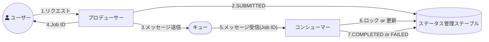

<page-title/>

::: warning 免責事項

- 有志で作成したドキュメントである。フューチャーには多様なプロジェクトが存在し、それぞれの状況に合わせて工夫された開発プロセスや高度な開発支援環境が存在する。本ガイドラインはフューチャーの全ての部署／プロジェクトで適用されているわけではなく、有志が観点を持ち寄って新たに整理したものである
- 相容れない部分があればその領域を書き換えて利用することを想定している。プロジェクト固有の背景や要件への配慮は、ガイドライン利用者が最終的に判断すること。本ガイドラインに必ず従うことは求めておらず、設計案の提示と、それらの評価観点を利用者に提供することを主目的としている
- 掲載内容および利用に際して発生した問題、それに伴う損害については、フューチャー株式会社は一切の責務を負わないものとする。掲載している情報は予告なく変更する場合がある

:::

# はじめに

かつて、非同期処理は専門的なメッセージングミドルウェアを必要とする、一部のミッションクリティカルなシステムで採用される特別な技術と言えた。今やクラウドネイティブなサービス（例：AWS SQSなど）の登場で状況は様変わりし、応答時間の長い処理のオフロードなどを目的に、非同期処理を取り入れることは珍しくない。一方で、非同期特有の難しさは変わらず、「処理のトレース」 「デバッグ」 「リラン」が困難であり、データストアにまたがる場合のデータの整合性担保や障害発生時のリカバリは難易度が高い。

本ガイドラインは、非同期導入時のメリットを享受しつつ、「本質的な難しさ」を回避または適切に管理するための実務的な設計論点と指針を提供する。堅牢で運用しやすい非同期システムを設計するための一助になれば幸いである。

# 適用範囲

本ガイドラインが対象とするスコープは、バックエンドシステムにおける以下のような非同期メッセージングを用いた処理に限る。

- Web APIやバッチ処理からのトリガーによる非同期メッセージやキューと、その後のコンシューマー処理
- ストリーミング処理は関連する領域であるが、タイムウィンドウなど特有の処理については深くは触れない

以下は含まれない。

- 各プログラミング言語で準備されている非同期処理の実装方法。例えばJavaScriptでのasync/await、Javaでのスレッド/仮想スレッド、Goのgoroutineなどには触れない
- ブラウザのサービスワーカー

バックエンドの隣接した関連領域のドキュメントには、[バッチ設計ガイドライン](/documents/forBatch/batch_guidelines.html)、[I/F設計ガイドライン](/documents/forIF/if_guidelines.html)、[Web API設計ガイドライン](/documents/forWebAPI/web_api_guidelines.html)、ストリーミング設計ガイドライン（※作成予定）がある。

# 用語

非同期処理には、メッセージキューのサービスを利用する。そうした種別や、プロダクトごとに呼び名が様々存在する。

| 分類                  | キュー                                                                    | Pub/Sub                                                                    | ストリーミング                                                                      |
| :-------------------- | :------------------------------------------------------------------------ | :------------------------------------------------------------------------- | :---------------------------------------------------------------------------------- |
| 説明                  | 1:1型。1つのメッセージが1つの受信者に処理される。メッセージは処理後に削除 | 1:N型。1つのメッセージを複数のワーカーが受け取る。メッセージは処理後に削除 | 1:N型。複数のワーカーが異なる読み取り位置から再生可能。メッセージは指定期間、永続化 |
| 具体例                | SQS, RabbitMQ                                                             | SNS、MQTT                                                                  | Kafka、Kinesis                                                                      |
| 送信者                | プロデューサー                                                            | パブリッシャー                                                             | プロデューサー                                                                      |
| 受信者                | コンシューマー                                                            | サブスクライバー                                                           | コンシューマー                                                                      |
| メッセージ格納場所    | キュー                                                                    | トピック                                                                   | トピック/ストリーム                                                                 |
| データ単位            | メッセージ                                                                | メッセージ/Notification/イベント                                           | レコード/イベント                                                                   |
| 順序性保証/グループ化 | Message Group ID (SQS FIFOキューの場合)                                   | \-                                                                         | パーティション                                                                      |
| 読み取り位置          | Visibility Timeout                                                        | \-                                                                         | オフセット/シーケンス番号                                                           |

上表のように非同期処理で利用される技術や製品によって用語は様々であるが、本ガイドラインでは、一貫性を保つために以下の用語を使用する。


- **プロデューサー:** メッセージの送信側のコンポーネント
- **コンシューマー:** メッセージを受信して処理するコンポーネント
- **メッセージ:** プロデューサーとコンシューマー間でやり取りされるデータの単位
- **キュー**: メッセージを中継するサービス

# 非同期化の判断基準

非同期処理は同期処理と比較して処理のトレースやデバッグの難易度が上がり、運用・保守コストは増大する。そのため、安易に導入するのではなく必要最低限の範囲で検討することが重要である。

ある処理を非同期化するかどうかは、次の観点と検討フローで判断する。


## 処理時間と応答性

ある処理の処理時間が長く、呼び出し元が同期的な応答を待つことができない場合は非同期化を検討する。

例えば、ファイルのダウンロードの要求を受け付けてからダウンロードファイルを長時間生成する場合が該当する。同期的に生成するとエンドユーザーを待たせるため UX が低下する恐れがある。この場合、メッセージをキューに登録し呼び出し元には即時応答を返す。ファイルの生成処理は非同期処理として裏側で行い、処理完了後に呼び出し元へ通知することで、UX を最適化できる。

なお、応答時間の長い処理が呼ばれることは業務上限定的であり、呼ばれた場合に業務運用上の工夫で応答時間の長さが許容できる場合は、非同期化は不要と判断もできる。

## 負荷の平準化

ある処理が突発的に、大量に呼び出される可能性がある場合、負荷を時間的に分散するために非同期化を検討する。この場合、メッセージをキューに登録し実処理は非同期処理として裏側で行うことで、バーストによる負荷を平準化しつつスループットを最適化できる。

なお、バーストの規模と時期が予測でき、事前のリソース増強で運用上対応できる場合は、非同期化は不要と判断もできる。

## レジリエンスの向上

ある処理が、外部のシステムや複数のデータストアに依存している場合に、依存している部分の処理をメインの処理とは独立して切り離せる場合は、非同期化を検討する。

例えば、あるメイン処理の終了処理として、外部システムの Web API 呼び出し、処理結果を通知する場合が該当する。このようなケースでは Web API 呼び出しを非同期化することで、外部システムがダウンしていたとしてもメインの処理を継続させ、システムの継続性を高めることができる。

またDBにあるデータを登録した後、オブジェクトストレージにもデータを登録するケースなども該当する。どちらかの処理が失敗した場合にデータが不整合な状態で残り続ける（どちらか一方にしかデータが存在しない）ことを許容できない場合は、キューを介してデータストアへの書き込みを直列化し、非同期処理側で適切なリトライを行うことで、結果的なデータの整合性を担保できる。

なお、外部システムがダウンしていた場合でも運用作業としての復旧が許容できる場合は、非同期化は不要と判断もできる。

# 同期・非同期の使い分け

[前章](#非同期化の判断基準) の判断基準で述べた通り、非同期処理はシステム全体の複雑性を上げる。逆に言うと可能な限り同期処理に寄せることで開発性・運用性を高めることができる。

しかし、この「同期によるシンプルさ」を過信し、本来分離すべき処理まで同期的に実行すると、障害を引き起こす可能性がある。

## ケーススタディ：同期処理による保険申込みの障害

保険申し込みのコールセンターを例に説明する（※説明のため架空の設定である）。入電した電話を同期的にオペレーターに振り分けるシステムが稼働していた。

1. オペレーターへの電話の振り分け
2. 通話録音データの暗号化
3. 通話記録レポートのDB保存

平常時は問題なかったが、入電が集中するキャンペーンのピークタイムにおいて、2の遅延が重なりWebサーバーのリソースが枯渇した。結果として、本来最優先すべき1の処理までがタイムアウトし、電話が一切受け付けられなくなるという障害に発展する。この障害は、2, 3を非同期化していれば、防ぐことができたはずである。

例が示すように、非同期化の判断ポイントは 「非機能要件定義」における「将来想定」での「ピーク時のアクセス数」から導き出せる「スループット」と「負荷の平準化」である。この時、通話データの暗号化やDB保存といった重い処理が、要件を満たすことができるかをまず机上で仮説を立てるべき（同期で大丈夫 or 非同期化が必要）である。その上で、[負荷テスト](#負荷テスト) にあるように、実機検証し、性能を担保する。

# 非同期から非同期の呼び出し

コンシューマーが、その処理の一部として、さらに別の非同期処理を呼び出すと、非同期処理が連鎖する。主なモチベーションに以下がある。

- **並列化による性能改善**: 親タスクから多数の子タスクを並列実行することで性能を向上させる
- **リカバリ単位の分割**: 一連の長いビジネスプロセスを、複数の独立したトランザクションに分割し、障害時の影響範囲を限定、リカバリしやすくする
- **外部システム連携**: 非同期処理の途中で、応答に時間のかかる外部APIなどを呼び出し、メインの非同期処理への影響を局所化する

このトレードオフとして、処理のトレーシングや障害発生時の原因特定をさらに複雑化させる要因となり得る。

推奨は以下の通り。

- 同期処理から非同期処理を呼び出す時と同じく、入れ子となる非同期処理の採用も必要最小限に留める
  - 非同期処理が連鎖する程、開発効率やトレーサビリティは低下する傾向があるため
  - 以下の目的で非同期の連鎖を検討している場合は、代替手段で解決できないか再考する（オーバーエンジニアリングの可能性があるため）
    - **流量制御が目的の場合:**: 後続処理を守るためにキューを分けてクッションにするのではなく、[流量制御](#流量制御) の章にある通り、コンシューマー自体の同時実行数やスループット制限（Lambdaの予約済み同時実行数など）で制御できないか検討する。構成要素が増えるほど運用コストが増大するため、設定値での解決を優先する
    - **データ整合性が目的の場合（外部API連携など）**: 外部API呼び出しの成功結果を記録するためだけに非同期を分けるのではなく、同一コンシューマー内で「API呼び出し → 成功後に自DBコミット」という一連の流れで完結できないか検討する。トランザクション管理が単一で済むのであれば、その方が整合性担保の難易度は低い
- 非同期から非同期を呼び出す基準としては、**前段と後続でイベント処理の粒度が変わるケース**は許容する
  - **呼び出し元より粒度が「大きく」なるケース（集約）**
    - **（例）ECサイト：** 注文（同期）→ 在庫引当（非同期1）→ **倉庫内のピッキング指示（非同期2）**
    - **理由：** 引当の都度ピッキング指示を出すより、一定数近隣のロケーションからのピッキングが溜まった時点でまとめて指示をする方が効率的なため。ただし、この場合は別プロセスでポーリングさせピッキングが溜まった時点での指示を第一に考える
  - **呼び出し元より粒度が「細かく」なるケース（分散）**
    - **（例）月次決済：** 締め処理（同期）→ 請求額計算（非同期1）→ **個々のユーザ決済実行（非同期2）**
    - **理由：** 複数のユーザーに対する決済処理を「非同期1」の中で順次ループ処理すると、1件の失敗や遅延が全体の完了を遅らせるリスクがあるため、個別に分割して実行する

判断フローの例を示す。


# バッチから非同期呼び出し

非同期処理の呼び出しは、ユーザーの操作イベント経由だけではなく、バッチ処理から呼びだされる場合もありえる。[バッチ設計ガイドライン](https://future-architect.github.io/arch-guidelines/documents/forBatch/batch_guidelines.html#%E9%9D%9E%E5%90%8C%E6%9C%9F%E3%82%BF%E3%82%B9%E3%82%AF) を参照すること。

# キュー環境

非同期処理に利用するキューの実行環境は以下の3パターンの方式がある。

| \#             | （1）フルマネージド                            | （2）マネージドランタイム                          | （3）セルフホスト                                  |
| :------------- | :--------------------------------------------- | :------------------------------------------------- | :------------------------------------------------- |
| 例             | Amazon SQS / Cloud Pub/Sub / Azure Service Bus | Amazon MQ / Azure Service BusのAMQP1.0互換         | RabbitMQまたはApache ActiveMQをECSやEC2にデプロイ  |
| 分類           | プロプライエタリ                               | オープンソース/標準プロトコル互換                  | オープンソース（ミドルウェア）                     |
| AMQP互換       | なし                                           | あり                                               | あり                                               |
| 可用性・拡張性 | ✅️高い                                         | ✅️高い                                             | ⚠️実装依存                                         |
| 設計コスト     | ✅️低い                                         | ⚠️やや高い                                         | ❌️高い                                             |
| 運用コスト     | ✅️インスタンス管理等が不要で使用に応じた課金   | ❌️インスタンスの管理が必要となり起動中は課金が発生 | ❌️インスタンスの管理が必要となり起動中は課金が発生 |

推奨は以下の通り。

- （1）を推奨する
- 以下の場合は（2）または（3）を採用するケースもある
  - オンプレミスまたはマルチクラウド環境に構築する場合
  - ベンダーロックインを回避すべき要件がある場合
  - 既に存在するRabbitMQまたはActiveMQのサーバーをクラウドシフトする場合

選定フローのイメージは以下の通り。


# プロトコル

現代のクラウド環境における非同期設計では、AMQP (Advanced Message Queuing Protocol) や MQTT (Message Queuing Telemetry Transport) といった古典的なメッセージングプロトコルそのものを開発者が直接意識する場面は稀である。

AWS SQSやSNSは、AWS SDKを介した HTTPS APIコールによって操作されるため、プロトコルレベルの詳細は抽象化されている。AMQP、MQTT、Kafkaプロトコルなどを選択するかどうかは、どのプロトコルを使用するかどうかではなく、どのメッセージングプロダクトの選定をするかに等しい。そのため、プロトコル選定は本ガイドラインでは設計上の論点として取り扱わない。

# QoS

キューにおけるQoS（Quality of Service）とは、以下の3レベルで表現される。なお、すべてのレベルで順序保証がされるわけではない。

| レベル        | 説明                                              | リスク                                                                                     |
| :------------ | :------------------------------------------------ | :----------------------------------------------------------------------------------------- |
| At most once  | メッセージが1回以下（0回または1回）送信されること | ❌️メッセージ欠損がありえる                                                                 |
| At least once | メッセージが少なくとも1回は送信されること         | ❌️コンシューマーが2回以上重複して起動されることがありえる                                  |
| Exactly once  | メッセージがちょうど1回送信されること             | ✅️メッセージの受け渡しは1回であるが、送信側が2重で送信した場合に重複排除されるわけではない |

推奨は以下の通り。

- QoSを選択できる場合、欠損がありえるため At most onceを利用しない
- 少なくとも、At least once以上のレベルを用いる。費用観点で、At least onceを選択することを最初の選択肢とする
- QoSに関わらず、タスクは冪等に作る（At least onceでは重複起動がありえる。Exactly onceであっても、ジョブのリカバリなどで重複して起動されることはありえるため）

# PostgreSQLやRedisのPub/Sub機能を用いた非同期

PostgreSQLの `NOTIFY/LISTEN` やRedisの `PUBLISH/SUBSCRIBE` は、DBやキャッシュサーバーにがすでに存在している場合、SQSなどが追加のインフラ構築なしで非同期化を実現できるため軽量な非同期通信の仕組みとして魅力的に映る。注意として、これらの機能はメッセージの永続性が存在しないという点がある。例えば、コンシューマーが何らかのプロセス障害か、ネットワーク切断の間に発行されたメッセージは、キューに保持されない。復旧時にも再取得ができない。そのため、コンシューマー側を冗長構成にしておき、ステータス管理テーブルなどを用いた排他制御を行い重複排除する必要がある。

| 比較観点         | SQS                       | PostgreSQL                                        | Redis                                             |
| :--------------- | :------------------------ | :------------------------------------------------ | :------------------------------------------------ |
| 説明             | ガイドライン推奨の方式    | PostgreSQLのNOTIFY/LISTENを用いる方式             | RedisのPUBLISH/SUBSCRIBEを用いる方式              |
| 配信保証         | ✅️At-Least-Once (最低1回) | ⚠️At-Most-Once (最大1回)                          | ⚠️At-Most-Once (最大1回)                          |
| メッセージ永続性 | ✅ あり (最大14日間)      | ❌ なし。コンシューマー停止時メッセージ欠損の懸念 | ❌ なし。コンシューマー停止時メッセージ欠損の懸念 |

推奨は以下の通り。

- 業務ロジックの非同期実行は「確実に処理される」必要があり、この実行基盤に PostgreSQL NOTIFY/LISTEN および Redis PUBLISH/SUBSCRIBE は使用しない
  - 特にRedisは通常、コストが高くこれに依存するメリットは小さいため
  - PostgreSQLのPub/Subについて、Amazon RDSにおいてリードレプリカで利用できない制約があるなど、拡張性での懸念もある
- ただし、PostgreSQL Pub/Subを用いた実行フレームワークやサービスなど、内部で用いておりそれらの品質が保証されている場合はその限りではない。非推奨というのは、直接これらの機能をSQSの代わりに利用することを指している

::: tip Redis Streams  
RedisにはPUBLISH/SUBSCRIBE（揮発性）とは別に、Streamsという永続的な（Kafkaに似た）データ構造が存在する。これを利用すれば永続的なキューも可能である。

- [Redis Streams | Docs](https://redis.io/docs/latest/develop/data-types/streams/)

:::

# 順序保障

多くの標準的なキュー（AWS SQS の標準キューなど）は、スループットを最大化するためにメッセージの処理順序を「ベストエフォート」としており、厳密な順序を保証していない。しかし、非同期処理においてメッセージ処理の順序保証が必要となった場合は設計方式を検討する必要がある。

順序制御に関する設計方式は以下の2パターンがある。

| \#               | （1）FIFOキューの利用                                                                                        | （2）アプリケーション側での制御 (標準キュー利用)                                                              |
| :--------------- | :----------------------------------------------------------------------------------------------------------- | :------------------------------------------------------------------------------------------------------------ |
| 概要             | キュー自体がメッセージの順序を保証 (例: AWS SQS FIFOキュー)                                                  | 標準キューを使い、メッセージにシーケンス番号等を付与して、コンシューマー側で順序を判定・制御                  |
| 順序の厳密性     | ✅️高い                                                                                                       | ⚠️実装に依存                                                                                                  |
| スケーラビリティ | ✅️高い                                                                                                       | ❌️低い                                                                                                        |
| スループット     | ✅️高い（標準キューより低いが、適切なメッセージグループ定義ができていればアプリケーションの実装より高くなる） | ⚠️実装に依存 （キュー自体はFIFOキューと比較して高いが、アプリケーション側の実装によって低くなる可能性が高い） |
| 設計コスト       | ✅️低い （メッセージグループなど制御単位の設計は必要）                                                        | ❌️非常に複雑となる                                                                                            |
| 運用コスト       | ✅️標準キューと比べてやや高い<br>（ただし、AWS SQSの場合は数千万リクエスト/月程度でないと影響はない）         | ⚠️実装に依存                                                                                                  |
| 制約             | サービスやミドルウェアがFIFOに対応している必要がある                                                         | 実装次第であり制約は特にない                                                                                  |

推奨は以下の通り。

- 原則として、可能な限り順序制御を必要としない設計（冪等性の確保や、メッセージの独立性）を目指す
- 「厳密な順序保証が必要な場合」は（1）を採用する
  - SQS FIFOを採用する場合、MessageGroupId の設計がスループットの鍵であることを認識し、順序保証が必要な最小単位でグループ化すること
- （2）は「FIFOキューが利用不可能なレガシー環境かつアプリケーション処理上で冪等性が担保できない場合」でなければ非推奨とする
- 復旧可能性の「ある」エラーへの対応は [リトライ](#リトライ) 章の通りコンシューマー側で対応する

復旧可能性の「ない」エラーへの対応について、**SQS FIFOで厳密な順序保証が必要な場合はDLQを使用してはならない**。 FIFOキューでDLQを利用すると、エラーメッセージがDLQに移動した時点で、後続のメッセージのロックが解除され処理が開始される。つまり、エラーとなった処理がスキップされた状態で後続が動くため、業務上の厳密な順序性が崩れることになる。

復旧可能性の「ない」エラーへの対応については、以下の2つの戦略が考えられる。

| 設計案               | （1）エラーが発生したら即時停止 \+ 手動介入                                                                                                                                                                                      | （2）エラーが発生したメッセージをスキップ                                                                                                                                    |
| :------------------- | :------------------------------------------------------------------------------------------------------------------------------------------------------------------------------------------------------------------------------- | :--------------------------------------------------------------------------------------------------------------------------------------------------------------------------- |
| 概要                 | 永続的エラーと判断したら即時アラートして、運用にてリカバリ対応を行う                                                                                                                                                             | エラーが発生したメッセージは諦める（別途リカバリする）が、後続の正常なメッセージの処理は止めない                                                                             |
| 処理方式             | ・コンシューマー側は永続的なエラーと判断した時点でエラー通知する<br> ・運用側はアラート通知を受けて復旧させる（メッセージはDLQに移動させず、削除もしないのでリカバリが終わるまでコンシューマー側で異常終了が継続することになる） | ・コンシューマー側は永続的なエラーと判断したメッセージの内容をデータベースやログなどに保存して、DLQに送信する<br>・後続メッセージの処理が再開される。DLQは適切にリカバリする |
| 順序の厳密性         | あり                                                                                                                                                                                                                             | なし                                                                                                                                                                         |
| 可用性・スループット | ❌️低い                                                                                                                                                                                                                           | ✅️高い                                                                                                                                                                       |
| 運用コスト           | ❌️非常に高い                                                                                                                                                                                                                     | ✅️比較して低い                                                                                                                                                               |

推奨は以下の通り。

- （2）を選択できるよう、結果整合性を業務要件として調整する
- 業務要件上、厳格な順序制御が必要となるケースでは（1）での対応が必須となる
  - この場合、何か1つでもエラーになるとそれ以降の処理がブロッキングされるため、早期のリカバリが求められる。運用負荷は非常に高くなるためできる限り緩和できないか考える

::: info 参考
[Amazon SQS でのデッドレターキューの使用](https://docs.aws.amazon.com/ja_jp/AWSSimpleQueueService/latest/SQSDeveloperGuide/sqs-dead-letter-queues.html) に、「メッセージまたは操作の正確な順序を維持する必要がある場合は、FIFOキューでデッドレターキューを使用しないでください」とある。
:::

# 重複排除と冪等性

原則として、メッセージを受信するコンシューマーの処理は冪等にすることを推奨する。キューが重複排除の仕組みを持っている場合は積極的に利用すべきであるが、プロデューサー側での送信処理の重複などを考慮すると完全な重複排除できないものとして考えるべきである。

SQSを利用する場合の重複排除（Exactly once）の仕組みには以下の選択肢がある。

| \#             | （1）FIFOキュー                                                                                      | （2）標準キュー \+ 冪等コンシューマー          |
| :------------- | :--------------------------------------------------------------------------------------------------- | :--------------------------------------------- |
| 仕組み         | 「メッセージ重複排除ID」または「コンテンツベースの重複排除」の利用                                   | コンシューマー側での重複チェック処理などの実装 |
| 重複排除の主体 | SQS                                                                                                  | コンシューマー                                 |
| 重複排除期間   | 5分間                                                                                                | 永続的                                         |
| スループット   | ✅️高い（標準キューには劣る）                                                                         | ✅️非常に高い                                   |
| 構築コスト     | ✅️低い（キューのオプションまたは送信時のID付与のみ）                                                 | ⚠️実装次第（冪等性を担保するロジックが必要）   |
| 費用           | ✅️標準キューと比べてやや高い<br>（ただし、AWS SQSの場合は数千万リクエスト/月程度でないと影響はない） | ✅️低い                                         |

推奨は以下の通り。

- 原則、（1）を採用する。FIFOキュー利用によるクラウド利用費用の増加は多くのケースで誤差レベルであると考えられるため
- スループットが重視されるケース（数千～数万TPS）や[SQS FIFOキューの重複排除ウィンドウである5分間](https://docs.aws.amazon.com/ja_jp/AWSSimpleQueueService/latest/SQSDeveloperGuide/using-messagededuplicationid-property.html)を超える必要があるケースは（2）を採用する

# リトライ

メッセージ処理がエラーで失敗した場合に、処理を再試行するための戦略は次の通り。

**復旧可能性のあるエラーへの対応**:

- 外部Web APIの呼び出し時のタイムアウトなど、一時的な障害で復旧が見込まれる場合は、リトライ戦略（回数や間隔）を定めて再試行する

- 一般的に、リトライ回数を重ねるごとに間隔を長くするエクスポネンシャルバックオフなどの戦略が有効である。採用するメッセージングサービスやプロダクトがエクスポネンシャルバックオフをサポートしている場合は、利用することを推奨する。SQSを採用する場合、リトライ間隔はVisibility Timeoutでの制御となり、エクスポネンシャルバックオフを実現する場合は、処理ロジックの中でタイムアウト値を都度制御（ChangeMessageVisibility）しなければならない。そのため実装コストに見合う効果が得られると判断できる場合のみ、エクスポネンシャルバックオフを採用することとする。

**復旧可能性のないエラーへの対応**:

- 内部ロジックのエラーやメッセージそのもののバリデーションエラーなど、何度リトライしても成功しないエラーの場合は、無駄なリソース消費やシステム全体への影響を防ぐために、リトライを打ち切ってメッセージをDLQに移動させる。

# メッセージロックのタイムアウト

メッセージロックのタイムアウトとは、キューにおいてコンシューマーがメッセージを取得し処理している間、そのメッセージを他のコンシューマーから見えなくし重複処理を防ぐための時間制限のことである。Amazon SQSでは、このメッセージロックのタイムアウトを「Visibility Timeout：可視性タイムアウト」と呼ぶ。

設定の主体:

- 本設定は、キューの定義またはコンシューマー側で行う。プロデューサーの指定は不可
- キュー定義: キュー作成時にデフォルト値として指定できる
- コンシューマー側: メッセージ受信時に動的にタイムアウト値を指定できる。処理中にAPI（`ChangeMessageVisibility`）を呼び出して延長もできる

タイムアウト設定のトレードオフ:

- **短すぎる場合:** メッセージの処理中にタイムアウトを迎えた場合、他のコンシューマーが同じメッセージを取得して処理を開始してしまうため、処理が重複して実行されてしまう
- **長すぎる場合:** メッセージの処理中に、一時的なエラー（ネットワークエラーなど）が発生した場合などは、コンシューマーは処理を中断し、メッセージをキューに戻すことでリトライを試みることが一般的である。タイムアウト値が長いと、この再試行が許可されるまでの時間が長くなるため、リカバリまでの時間が長くなり、メッセージが滞留することで全体のスループットが低下する

推奨は以下の通り。

- 根本的にメッセージの処理時間を厳密に予測することは難しいため、処理が重複起動しても問題ないよう、冪等な設計を大前提とする
- 個々の処理ごとにタイムアウト値をきめ細かく最適化したいケースは稀であるため、システムとして基準となるタイムアウト値（例：SQSのデフォルト30秒）を定め、その値では明らかに問題となる処理のみを個別にチューニングするアプローチを推奨する
- タイムアウト値は、メッセージの最大処理時間を算出した上で、一定の安全マージンを加算した値を初期値とすることが望ましい
- メッセージによって処理時間に極端なばらつきがある（特定のメッセージのみ処理時間が非常に長い）など処理時間が予測できない場合は、処理中に一定間隔（例：タイムアウト値の半分）でキューサービスに対し「ロック時間の延長」をリクエスト（例：SQSの`ChangeMessageVisibility`）するハートビート機構の導入を検討する
- 冪等な設計が困難であり、ビジネス影響上万が一にも重複起動が許容できない場合は、タイムアウト値へ達する前に処理をロールバックする強制的なキャンセル機構を導入するか、前述のハートビート機構の導入を検討する

# メッセージ送信の信頼性

プロデューサー側で自領域のDB更新とキューへのメッセージ送信の整合性をどのように保つかが課題となる。例えば、キューの送信には成功したが自領域のDBのコミットに失敗してしまうことが考えられる。この場合、コンシューマーは起動するが処理対象のデータが存在しないため不整合となる。これはファントムメッセージと呼ばれる。


これは、単純に順序を逆転しても解決しない。むしろ、一部処理が成功したと見せかけて後続のコンシューマーが起動しないというメッセージロストが発生する分、事態は悪化しているとも言える。


代表的な対応案にトランザクションアウトボックスパターンがある。

::: info トランザクションアウトボックスパターン

1. 各コンシューマーは自身の担う業務ロジック処理と、処理完了を示すステータス更新を1トランザクションで実施する。
2. 後続コンシューマーへのメッセージ連携は、別のトランザクションで行う。

これにより、1→2の順序性の担保と、2単体でのリトライが可能となる。
:::

ファントムメッセージが発生する直接ディスパッチ方式と、トランザクションアウトボックスパターンのポーリング版、CDC版を下表で比較する。

| \#                       | （1）直接ディスパッチ                                          | （2）アウトボックス (ポーリング・リレー)                                                | （3）アウトボックス (CDC・リレー)                                                      |
| :----------------------- | :------------------------------------------------------------- | :-------------------------------------------------------------------------------------- | :------------------------------------------------------------------------------------- |
| 図                       |  |  |  |
| 処理概要                 | メッセージ送信 → DBコミット                                    | DBコミット → (別プロセス) → ポーリング → メッセージ送信                                 | DBコミット → (CDC) → イベント → メッセージ送信                                         |
| 信頼性                   | ❌                                                             | ✅                                                                                      | ✅                                                                                     |
| クラッシュ時の主なリスク | ❌ファントムメッセージの懸念                                   | ✅ リレーの送信失敗時は、次回のポーリングで自動リトライされる                           | ✅ リレーのリトライCDCがトリガーしたLambda等のリトライ機構で処理される                 |
| 実装コスト               | ✅ 低                                                          | ⚠️中 ポーリングバッチの実装/運用が必要                                                  | ❌ 高 CDCパイプライン(Debezium/DMS等)の構築/運用が必要                                 |
| レイテンシ               | ✅ 低                                                          | ⚠️ 中～高（ポーリング間隔に依存）                                                       | ✅ 低                                                                                  |
| DB負荷                   | ✅ 低                                                          | ⚠️ 中（定期的なポーリングスキャンが発生）                                               | ✅ 低（トランザクションログベース）                                                    |

推奨は以下の通り。

- （1）を採用する
  - ファントムメッセージについては、[ステータス管理テーブル](#ステータス管理テーブル) をプロデューサー側が登録＋コンシューマー側でレコードチェックすれば不正検知ができるため。ステータス管理テーブルを用意しない場合は、(2)のような仕組みの導入を検討する
- （2）は実行順序を保証し柔軟に制御する必要がある場合に採用を検討する。(3)は仕組みが重厚になりすぎるため非推奨とする

# 非同期処理ステータス設計

非同期処理は実行状況をログなどから追うことはたいへんであるため、キューにメッセージを送受信する前後で、DBにステータス管理テーブルを作成し、書き込む方式にすると運用上の利便性が高まる。

## ステータス管理テーブル

ステータス管理テーブルには、プロデューサーがキューへの送信前とコンシューマーが終了時にアクセスすることで、進捗状況を明らかにできる。これにより、保守運用者が、DB検索から非同期タスクの実行状況を把握できる。

一般的な設計事項は以下の通り。

- コンシューマーが処理開始時にステータステーブルを確認し、ジョブIDが実行中か処理済みになっていないかチェックする
  - もし、未処理、実行中、異常終了などのステータスのレコードが無ければ、INFO/WARNログを出して正常終了させる
  - あるいは、ロックが取れなければ、多重実行されたとして自処理はINFOログをだして正常終了させる
- コンシューマーが異常終了時は、通常業務テーブルはロールバックすることが自然であるため、ステータス管理テーブルの値をFAILEDにする場合は、自律型トランザクションでコミットさせる必要がある



推奨は以下の通り。

- 非同期の処理ステータス管理テーブルを作成し、DBで状況を把握できるようにする
- プロデューサー、コンシューマーがキューの前後で適切にこれらを処理する
- キーとなるジョブIDはトレースIDとは通常、別に採番する
  - 非同期が連鎖した場合には、一意制約になるため
  - トレースIDは紐づけ用に、ステータス管理テーブルの属性に持たせる
- RUNNINGを自律型トランザクションでコミットする必要はない。実装が楽な行ロックを推奨する

## 命名規則

各ステータスの区分値についての方針を決めておくと、複数のシステムを横断的に保守運用する際の認知負荷を下げることができる。

主要なバッチ処理系での表現は下表である。

| \#                       | AWS Batch         | Google Cloud Batch | Azure Batch | Hitachi JP1                | Spring Batch |
| :----------------------- | :---------------- | :----------------- | :---------- | :------------------------- | :----------- |
| 先行タスク・リソース待機 | SUBMITTED         | PENDING            | Active      | 開始時刻待ち, 先行終了待ち | \-           |
| 実行可能                 | RUNNABLE          | ASSIGNED           | Preparing   | キューイング               | STARTING     |
| 実行中                   | STARTING, RUNNING | RUNNING            | Running     | 実行中                     | STARTED      |
| 成功/完了                | SUCCEEDED         | SUCCEEDED          | Completed   | 正常終了                   | COMPLETED    |
| 失敗/エラー              | FAILED            | FAILED             | Completed   | 異常終了                   | FAILED       |
| 停止/キャンセル          | \-                | (UNEXECUTED)       | \-          | 強制終了                   | STOPPED      |
| 保留/中断                | \-                | \-                 | \-          | 保留中                     | \-           |

主要な区分値の遷移図は以下。


推奨は以下の通り。

- ステータスの命名規則を定め、一貫して利用する
- 特にこだわりがなければ、Google Cloud Batchの語彙（PENDING、RUNNING、SUCCEEDED、FAILEDなど）を用いる
  - 比較的、簡易な単語で構成されており、またよく見ている並びによる見間違え（STARTING, STARTEDなど）が無いため
- 設計変更でステータスをSUCCEEDED1, SUCCEEDED2 のように増やしたくなる場合は、処理自体を分割したほうがよい
- 保留/中断は先行処理の待機を除いて、非同期処理それ自体が保留となるステータスは作らない
  - 重複排除と冪等性 及び 順序制御 を前提に、呼び出し側で処理の実施有無をコントロールすべきであるため

# 予約

特定の時刻に非同期処理を開始したいという需要がある。このためプロデューサーがメッセージを即時キューに入れるのではなく、適切なタイミングまで待機させる設計が必要となる場合がある。

例えば、以下のようなユースケースが考えられる。

- メールなどの予約送信（Slackのようなチャットツールへの予約投稿（チャットサービス側に予約機能が無い想定）

このスケジューリングの責務をどこに持たせるかで以下の2パターンが考えられる。

| 設計案     | （1）外部スケジューラー                                                                                                                                                              | （2）ステータス管理テーブルのポーリング                                                                                                                                                |
| :--------- | :----------------------------------------------------------------------------------------------------------------------------------------------------------------------------------- | :------------------------------------------------------------------------------------------------------------------------------------------------------------------------------------- |
| 説明       | 毎日N時実行、毎月M日実行など、特定の日時や条件が決まっている定期バッチを、各クラウドプロバイダが提供するサービスをはじめ、各製品に備わっている予約機能を用いて非同期処理を開始する。 | 特定条件を満たすジョブを判定できるよう、たとえば条件が時間ならば`execute_at` カラムを管理テーブルに用意する。別プロセスで定期的に `WHERE execute_at <= NOW()` を検索してキューに積む。 |
| 実装コスト | ✅️ 低 (出来合いの設定ウィザードを使える)                                                                                                                                             | ✅️ 低 (開始条件次第ではあるが)                                                                                                                                                         |
| 柔軟性     | ❌️ 低 (cron式のような限定された条件のみ)                                                                                                                                             | ✅️ 高 (DB/アプリの記述で割と何でもできる)                                                                                                                                              |

推奨は以下の通り。

- （2）を採用する
- 条件に合致した後キューまでのタイミングは別プロセスの動作間隔によるので厳密性を要求するとコストが高くなる。一方で（1）の場合でも数分程度のラグが生じうるため、予約機能の実装に際してはある程度の妥協が必要である
- 非同期処理の内部で実際の処理を特定の時刻まで待機したり、処理の途中で特定の時間まで sleep loop したりするべきではない。予約を含めたスケジューリングは非同期処理をキックする側の責務として分離すべきである
  - 待機中にジョブがクラッシュした場合、リトライ制御が煩雑になるため。また、待機中もスレッドやメモリ、DBコネクションなどのリソースを占有し続けるおそれがある


# キャンセル

キャンセルは保留/中断とは異なり、ステータスの遷移図で終端に位置する想定であるため、再実行は不可となる。

非同期タスクのキャンセル要件は、以下のようなユースケースで出ることがある。

1. **ユーザー操作による取り消し**: エンドユーザーが、UI上で実行リクエストした長時間処理（例: レポート生成など）を、完了を待たずに「キャンセル」ボタンを押した場合
2. **システムメンテナンス**: サービス停止やデプロイに伴い、現在キューに溜まっているジョブの処理を安全に停止させたい場合

非同期のキャンセル要件は、対応可能なステータスの組み合わせを考えるとシンプルである。通常、以下の2パターンが考えられる。

1. `PENDING`（待機中）のみにキャンセル可能とする方針
   1. 下表の（1）で対応
2. `PENDING`（待機中）と`RUNNING`（実行中）の両方、キャンセル可能とする方針
   1. 下表の（1）（2）の両方で対応

| 設計案     | （1）実行前ステータスチェック                                                                                                        | （2）協調的キャンセル                                                                                                                     |
| :--------- | :----------------------------------------------------------------------------------------------------------------------------------- | :---------------------------------------------------------------------------------------------------------------------------------------- |
| 対象       | PENDING のジョブ                                                                                                                     | RUNNING 中のジョブ                                                                                                                        |
| 説明       | キャンセルAPIがステータスを CANCELED に変更する。コンシューマーは処理開始直前にステータスを確認し、CANCELED ならば処理をスキップする | RUNNING 中のコンシューマーが、処理の途中で定期的にDBのステータスがCANCELED になってないか確認し、キャンセル済みであれば処理をスキップする |
| 実装難易度 | ✅️低                                                                                                                                 | ❌️高（処理中に定期的なポーリングロジックの実装が必要で、非直感的かつテストもややこしい）                                                  |
| 応答性     | ✅️即時（実行前に停止）                                                                                                               | ⚠️遅延（ポーリング間隔次第）                                                                                                              |

推奨は以下の通り。

- 非同期のキャンセル要件が、本当に必要なのか確認する
  - 実行時間が長いタスクをキャンセルすることによるメリットは、多くはシステム稼働費の削減である。具体的にキャンセルされる数の見込みによっては、キャンセルを作り込まない方が良い判断もありえる
  - UI/UX上はキャンセルとしての振る舞いができれば、バックエンドの非同期処理自体のキャンセルが不要にできる可能性もある
- キャンセルを実現する場合も、できれば（1）のみで済ませられないか検討する
  - （2）の実装は非常にコストが高いため、AIモデルの学習や動画のエンコードで数時間必要といったワークロードでない限り、中断するメリットは低いと考えられる
- もし、（2）が必要になったとしても、 `RUNNING` 中のキャンセル可能な機能対象は絞り込む
  - 定期的なポーリングは、共通ライブラリ化（別スレッドやgoroutine）などである程度代替可能だが、テストでの検証などが追加コストが高くなるため、対象は抑えた方が良い

# 通知

非同期処理が終了したかどうかを、エンドユーザーへ通知すべきという要求事項には以下がある。

- **即時性**: ユーザーは処理完了をどの程度、リアルタイムで知る必要があるか。別の作業ついでに確認する程度で良いか（≒プッシュ通知は不要）
- **ユーザーの状態**: ユーザーは完了を画面上で待機しているか、それとも別の画面で操作しているかなど

主な実現手段は以下の設計パターンがある。

| \#           | （1）ポーリング方式                                                                                | （2）プッシュ通知方式                                                                                                       | （3）オンデマンド確認方式                                                                  |
| :----------- | :------------------------------------------------------------------------------------------------- | :-------------------------------------------------------------------------------------------------------------------------- | :----------------------------------------------------------------------------------------- |
| 説明         | ブラウザやアプリがポーリングでステータスを確認する方式。ユーザーが画面を開いて待っている前提に近い | 処理完了時にサーバー側が、クライアントにWebSocketやモバイルデバイスに通知をプッシュする方式。画面を開いていなくても通知可能 | ユーザーが「ジョブ一覧」や「通知一覧」のような専用ページを、自らのタイミングで確認する方式 |
| 即時性       | ⚠️ポーリング間隔分の遅延が発生                                                                     | ✅リアルタイムに通知できる                                                                                                  | ❌ (低)ユーザーの操作に依存する                                                            |
| 実装コスト   | ⚠️UI側のポーリング・タイムアウト制御ロジックが必要                                                 | ❌ (高) WebSocket, AWS SNS, FCM/APNsといった通知基盤の設計・運用コストが高い                                                | ✅ (低) ステータス一覧APIの実装のみで済む                                                  |
| サーバー費用 | ✅️ポーリングリクエスト程度                                                                         | ❌ (高) WebSocketコネクションの常時維持や、SNS/FCM連携の費用                                                                | ✅ (低) ユーザーが必要な時のみに、リクエストが発生                                         |

推奨は以下の通り。

- （1）（3）を第一に検討する
  - プッシュは構築コストが大きく、ユーザーとしても通知で業務が中断されるため、本当に必要な場合のみに適用すべきである
- 処理時間が数分程度と短い場合は、Cに加えAを採用する
  - UX向上のため
- （1）を選択する場合は、ポーリング間隔に指数関数的バックオフを導入するなど、無駄なリクエストを削減する工夫を入れる
- （2）を選択する場合、ポーリングのタイムアウトを入れる場合は、Cとの併用が必要である
- （2）を選ぶ場合も、メールやチャットツール（Slack、Teams）などアプリ通知以外の選択肢も同時に検討する（この場合、Webとアプリで同じ通知の仕組みで共用できるため）
- （3）の実装は、ステータス管理テーブルを参照すること楽であるが、アプリケーション要件の表示項目については、別テーブルで管理を推奨する
  - アプリ要件の変更で、ERD変更が生じた場合の影響度を、局所化させるため

# 同期待ち合わせ

非同期処理は元々、呼び出し元と実行側を分離するものである。しかし、処理自体は非同期化しつつも呼び出し元はその処理が完了するまで待機し、結果を同期的に受け取りたい以下のようなユースケースがある。本ガイドラインではこれを「同期待ち合わせ」と呼ぶ。

- 平準化目的で非同期化した高負荷な計算処理
  - 例えば、保険料見積もりのような、数万件のシミュレーションや複雑な数理モデルの実行を伴い、CPUとメモリを一時的かつ大量に消費する場合、それ専用のサーバーで実行する
  - Web APIの同期呼び出しで行った場合、バーストでシステムが不安定になるため、キューを経由した非同期で処理を行いたい
  - 保険料見積もり結果は即時、ユーザーに通知させたいため、結果が出てすぐユーザーに通知するため待機する必要がある

本節では、以下のようにエンドユーザー側のポーリングは考慮せず、システム内での待ち合わせのみを範囲とする。


この場合、どのようにプロデューサーが処理完了の応答を受け取るかは、大きく以下の2方式が考えられる。

| \#         | （1）リプライキュー方式                                                                                                                                                                                                                              | （2）DBポーリング方式                                                                                  |
| :--------- | :--------------------------------------------------------------------------------------------------------------------------------------------------------------------------------------------------------------------------------------------------- | :----------------------------------------------------------------------------------------------------- |
| 説明       | Enterprise Integration Patternsにおける[Request-Replyパターン](https://www.enterpriseintegrationpatterns.com/patterns/messaging/RequestReply.html)。Producerが要求メッセージに「応答先キュー名」と「相関ID」を指定し、そのキューを監視して応答を待つ | 「ステータス管理テーブル」を利用する。プロデューサーが成功/失敗 ステータスになるまでDBをポーリングする |
| 実装コスト | ❌️高い。応答用キューの管理、相関IDによる紐付け、タイムアウト処理の配慮が必要                                                                                                                                                                         | ⚠️中。ステータス管理テーブルが前提。プロデューサー側にポーリングとタイムアウトのロジックが必要         |
| 即時性     | ✅️高い。応答メッセージが来たら即座に検知できる                                                                                                                                                                                                       | ⚠️中。検知までにポーリング間隔分の遅延                                                                 |
| インフラ   | ⚠️応答専用のキューが別途必要                                                                                                                                                                                                                         | ✅️ステータス管理テーブルを再利用できる                                                                 |
| 耐障害性   | ✅️プロデューサーが応答待機中に落ちても、キューによるデータ保護が働く                                                                                                                                                                                 | ✅️高。ステータスはDBに永続化されるため、プロデューサーが落ちても再ポーリングが可能                     |

推奨は以下の通り。

- （1）（2）の設計案自体を無くせないかまず検討する。例えば、[エンドユーザー向け非同期終了の通知](#エンドユーザー向け非同期終了の通知) 節にあるように、クライアントからのポーリングに書き換えることが最もシンプルである。即時性が犠牲になるが構築難易度が上がるため、よほどの業務効果が無い限りは非推奨である
- 即時性などの要件のため同期待ち合わせする必要がある場合は、（1）（2）案から選択する
- 前述した「ステータス管理テーブル」を導入する前提であれば、（2）を第一の選択肢とする
  - 「ステータス管理テーブル」を再利用でき、DBをそのままポーリングするだけであり設計・運用をシンプルにできるため
- どのケースであっても、タイムアウトの設計が必要。例えば方式Bであれば、ポーリングのキャンセルが必要
  - バックエンド内での待ち合わせをやめ、クライアントに応答を返す設計が必要
  - タイムアウト後に、応答が来た場合のハンドリングも検討が必要

::: tip SQS temporary Queue Client  
応答キューを実装する場合、AWS SQS temporary Queue Clientライブラリを利用すると、 応答用の一時キューの作成・管理・削除を自動化できる。

- [Amazon SQS一時キュー \- Amazon Simple Queue Service](https://docs.aws.amazon.com/ja_jp/AWSSimpleQueueService/latest/SQSDeveloperGuide/sqs-temporary-queues.html)

:::

# データ整合性

マイクロサービスアーキテクチャや、SaaS連携と同様に、非同期処理でも「データ整合性」をどのように保つかが問題になりやすい。

例えば、下図の様なユーザーがサインアップした際、以下のように複数SaaS連携を含む顧客登録フローを想定する。

1. 自社DBにユーザーを作成
2. 顧客管理（Salesforceなど）に顧客レコードを作成
3. 決済基盤SaaS に請求アカウントを作成

この時、3の非同期部分がエラー発生し、かつ回復不能の場合は、データ不整合が継続してしまう。


上記のような場合で、データ整合性を担保する主な方式は下表の通り。

| \#           | （1）Sagaパターン                                                     | （2）手動リカバリ                                                                    |
| :----------- | :-------------------------------------------------------------------- | :----------------------------------------------------------------------------------- |
| 説明         | 失敗したら、取り消す処理（補償トランザクション）を走らせる            | 失敗したら「人を呼ぶ」                                                               |
| 説明         | A→B→Cと進み、Cで失敗したら、Bの取消処理→Aの取消処理を実行して元に戻す | エラー時はアラートを上げ、不整合な状態を許容し、運用担当者がデータパッチ等で修正する |
| データ整合性 | ✅️高 。APIに取り消し機能が必要。副作用が残る場合あり                  | ✅高。複雑な業務判断が必要な場合に有効                                               |
| 実装コスト   | ❌高。元に戻すロジックが難しい                                        | ✅低。検知のみ                                                                       |
| 運用コスト   | ✅️低い。自動化できるため                                              | ⚠️リカバリ                                                                           |

Sagaパターンは以下のフローである。補償トンザクションは簡略表示のため決済ワーカーで行っている。本来はキューを経由した処理に切り出すべきである。


推奨は以下の通り。

- Saga以前に設計上の工夫で非同期箇所減らすことができないか検討する
  - 例えば、決済基盤への決済アカウント作成までは同期で行い、顧客管理への連携側を非同期化とする。Salesforce連携が万が一遅延しても、売上には影響しないため許容するという判断する。これにより、顧客管理側への登録が失敗しても、補償トランザクションで打ち消すのではなく、その後の運用や救済ジョブで顧客管理側へ後で登録するという一方通行で済ませる
- 在庫引当のように、失敗したまま放置すると他社の機会損失となり、業務上許容できないようなケースでのみ、（1）を採用する
- Sagaパターンを実現するための取り消しAPIの準備が難しい場合や、発生頻度が低いとされる場合は（2）で様子を見ることも検討する
  - 例えば、非同期でのメール送信は取り消すことができない。そのため、別のメールで「取り消しました」と送信するしか無い
  - Sagaは複雑な実装のためバグの出る可能性が高い。またレアケースであれば、人間による判断の方がトータルコストは安くなる可能性が高い
- （1）（2）のどちらであっても、[リトライ](#リトライ) を組み込むことで発生頻度を減らす工夫を必須で行う

# 流量制御

現代のクラウドサービスやKafkaなど拡張性が高いプロダクトを利用する前提では、プロデューサー側のメッセージ送信処理にレートリミットのような制限（バックプレッシャー）を設ける必要はなく、またキューが溢れないようにブロッキングされることは無い。

一方でコンシューマー側については、以下の理由で同時実行数を制限（≒流量調整）する必要がある。

1. DBの負荷軽減（スパイクした処理で、DBやシステム全体が不安定になることを防ぎたい）
2. ある特定のタスクで、あるリソースが占有されてしまい、他のタスクが起動されないといった占有を防ぐ

コンシューマーがメッセージを受け取る方式は、大きく常駐型 と イベント駆動型 に分けられ、それぞれ流量制御の方式が異なる。

|          | （1）常駐型（ポーリング型）                                                                | （2）イベント駆動型（プッシュ型）                                                                                                   |
| :------- | :----------------------------------------------------------------------------------------- | :---------------------------------------------------------------------------------------------------------------------------------- |
| 図       |                                     |                                                                |
| 説明     | コンシューマーがキューに対し、メッセージを能動的にポーリングし、同期的に処理する構成を指す | （Lambda Event Source Mappingなどのサービス基盤の）ポーリング担当が別のワーカー（実質的にはコンシューマー）にメッセージを割り当てる |
| 構成例   | 常駐プロセスであるECSタスク、SQLのReceiveMessage APIを呼び出す                             | SQS \+ Lambdaや、SQS \+ Lambda \+ ECSスタンドアローンタスク（EventBridge Pipesでも同様）                                            |
| 拡張性   | 常駐プロセス数を増やすことでスケールアウトさせる                                           | 事実上プッシュ的に動くため自動でスケールする                                                                                        |
| 縮退性   | 常駐プロセスをスケールインさせる必要があり大掛かり                                         | タスク処理をLambdaのような基盤で動かせれば柔軟に縮退できる                                                                          |
| 流量制御 | 比較的容易                                                                                 | 一定の工夫が必要なパターンがある                                                                                                    |

（1）の場合は、コンシューマー数:処理スレッド数=1:1 とすることが基本であるため、流量調整はサービス数のスケールイン/アウトで調整できる。

（2）の場合は実質的にプッシュ型のようにコンシューマーが起動されるため、意図しない並列数の高まりによる過負荷に気をつける必要がある。以下の方式が考えられる。

| \#         | （2-1）処理リソース制限                                                                                                             | （2-2）実行時に同時実行数を確認                                                                  |
| :--------- | :---------------------------------------------------------------------------------------------------------------------------------- | :----------------------------------------------------------------------------------------------- |
| 説明       | コンシューマーを実行する基盤（Lambda, ECSクラスタ）のリソースや同時実行数に上限を設定する方式                                       | 起動時に現在の同時実行数を確認して、上限の場合はスリープやリトライさせるか、キューに書き戻す方式 |
| 厳密性     | ⚠️Lambdaの場合は関数単位で「予約済み同時実行数」で並列数を制御できる。ECSクラスタの場合は全体のリソース上限となり厳密な設定は難しい | ✅️厳密に行える                                                                                   |
| 設計コスト | ✅️低い（インフラ設定）                                                                                                              | ⚠️制御ロジックがやや複雑                                                                         |
| 制約       | ✅️特に無い                                                                                                                          | ❌️ECSの場合、describe APIのレートリミットの懸念                                                  |

推奨は以下の通り。

- 実行時間の制約が問題なければ、（2）を第一の選択肢とする
  - Lambdaの場合（2-1）「予約された同時実行」で関数単位に流量調整が可能でありコスト効率も高いため
  - Lambdaから `ecs run task` を呼び出すような構成は、Lambdaの同時実行数を制限しても、最終的にDBなどにアクセスするECSタスクの総数を直接制御できない（クラスタのリソースを絞ることで擬似的に制限は可能だが）できる限り採用しない。ECSを利用する場合は（2-2）ではなく（1）の方式を検討する
  - その他の構成においても、（1）や（2-1）が不可な場合に初めて、（2-2）の方式を検討する
- Lambdaの実行時間に懸念がある場合、（1）を採用する

::: tip 参考

> 関連するダウンストリームが高負荷になる可能性を低減するために、Lambda は関数レベルで予約済み同時実行数（Reserved concurrency）、イベントソースレベルで最大同時実行数（Maximum concurrency）を設定

[Amazon SQS をイベントソースとした AWS Lambda 関数のより高速なポーリングスケールアップの紹介](https://aws.amazon.com/jp/blogs/news/introducing-faster-polling-scale-up-for-aws-lambda-functions-configured-with-amazon-sqs/)  
:::

# 性能

非同期処理における性能は大きく分けて「ロジックの並列化（ファンアウト）」と「コンシューマースケーリング」の2つが存在する。

1. **ファンイン・ファンアウト**: ある親タスクが、複数の異なるサブタスクに処理を分割・委任するパターン
2. **コンシューマースケーリング**: キューへ流入するメッセージ量に応じて、同一の処理を行うコンシューマーの計算リソースを増減させるパターン

## ファンイン・ファンアウト

1つの重い処理を、複数の独立したサブタスクに分割して並列実行し、必要であれば最後にその結果を合流（ファンイン）することを指す。ファンアウトの実装は比較的容易であるが、ファンインの待ち合わせにはいくつか構成案がある。

| \#         | A: DBポーリング                                                                  | B: オーケストレータ利用                                                                   |
| :--------- | :------------------------------------------------------------------------------- | :---------------------------------------------------------------------------------------- |
| 説明       | 親タスクがDBに子タスクを登録。後続処理がDBをポーリングし、全子タスクの完了を待つ | AWS Step Functions の Parallel ステートなどを使い、分岐と合流のロジックを宣言的に定義する |
| 実装コスト | ⚠️中。ステータス管理テーブルの設計とポーリングロジックが必要                     | ⚠️中。Step Functionsの学習コスト                                                          |
| 堅牢性     | ✅高。DBに状態が永続化される                                                     | ✅️高。AWSが状態遷移とエラー/リトライを管理するため                                        |
| 可視性     | ✅️高。SQLで確認可能                                                              | ✅️実行履歴で視覚的に確認可能                                                              |

推奨事項は以下の通り。

1. ファンインが不要な場合は、AWSであればSNSを用いたファンアウトを推奨する
   - 1つのイベントをSNSトピックに発行し、サブタスクごとに用意したSQSキューで購読する
2. ファンインが必須な場合、（B）の利用を第一に検討する
   - Parallel ステートは、ファンアウト/ファンインのロジック、リトライ、エラーハンドリング（例: 1つでも失敗したらすべて中止）を宣言的に記述でき実装難易度を下げることができるため
3. Step Functionsが何かしらの理由で採用できない場合は、Aの方式を検討する

## コンシューマースケーリング

キューへのメッセージ流入量の変動に応じて、コンシューマーの計算リソースを動的に増減させることで性能を改善させることができる。逆に流量が減った場合は、コンシューマーの数を減らす（スケールイン）させることで、コスト最適化ができる。スケールアウトしすぎた結果、DBや外部APIなどの依存先に影響を与えることも考慮が必要であるため、[流量調整](#流量制御) の章と関連がある。

スケーリングについては、以下の設計案が考えられる。

| 方式     | A: 手動                                                                  | B: メトリクスベース                                                                                                                                              | C: サーバーレス                                                                       |
| :------- | :----------------------------------------------------------------------- | :--------------------------------------------------------------------------------------------------------------------------------------------------------------- | :------------------------------------------------------------------------------------ |
| 説明     | ECSタスク数などを3など固定で運用する。負荷増減時に運用者が手動で変更する | キューの深さ（ApproximateNumberOfMessagesVisible）や「最も古いメッセージの滞留時間（ApproximateAgeOfOldestMessage）をトリガーに、ECSサービス数を自動で増減させる | SQSイベントソースマッピング \+ Lambda。メッセージ量に応じてLambdaが自動でスケールする |
| 費用     | ❌低い。ピーク時に合わせると平常時の無駄が大きい。                       | ✅高い。負荷に追従する。                                                                                                                                         | ✅️高い。ゼロスケールも可能                                                            |
| 応答性   | ⚠️低い。スパイク負荷時にキューが滞留する。                               | ⚠️中。スケールアウト（タスク起動）までに数分かかる                                                                                                               | ✅高い。Lambdaのスケールアウトは非常に数秒レベル                                      |
| 流量制御 | ✅容易。タスク数が物理的な上限となる                                     | ✅容易。最大タスク数を設定可能                                                                                                                                   | ✅️Lambdaの「予約された同時実行数」で制御できる                                        |

推奨は以下の通り。

1. Cを第一に選択する
   - SQS \+ Lambda のイベントソースマッピングは、容易さ・ゼロスケール・費用効率が良いため
   - Lambdaの実行時間制限（最大15分）やリソース制限に収まる処理であれば、積極的に採用すべきである。
   - Lambdaの場合、コールドスタートがレイテンシの影響が無視できない場合は、「Provisioned Concurrency（プロビジョニングされた同時実行数）」の設定を検討する
2. Lambdaの実行時間制限に許容できない場合、Bを検討する
   - Aは実現が容易であるが、クラウドの弾力性を活かしているとは言い切れないため、できる限りBを目指しコスト最適化を目指す
3. どの方式であれ、最大同時実行数を設定する。[流量調整](#流量制御)で述べた通り、依存先を保護することがスケーリングより優先すべきである

# セキュリティ

非同期処理におけるセキュリティは、インフラ全般のセキュリティ事項と強く重複する。[AWS設計ガイドライン](https://future-architect.github.io/arch-guidelines/documents/forAWS/) における基本的な対策は実施することを前提とする。また、利用するキューは [キュー環境](#キュー環境) の推奨にある通り、マネージドサービスを前提とする。もし、その他のミドルウェアを利用する場合は、ユーザー名・パスワードの管理を、AWSであればSystem Manager やKMSなどで機密情報管理をする必要がある。

推奨は以下の通り。

- SQSへのメッセージ登録は、必ずWeb APIサーバーを経由させるなどの構成を取り、直接メッセージングサービスを外部に露出させない
- インフラレベルの基本的なアクセス制御を実施する
  - 最小権限の原則に従い、必要なサービスのみがキューへの登録/参照の権限を付与する
  - VPCエンドポイントを利用し、インターネットに露出させない
  - サーバーサイド暗号化を有効にする（SQSであればSSE-SQSなど。コンプライアンス要件次第でSSE-KMSにする）
- ペイロードには、機密情報を入れない
  - 例えば、個人情報（PII）などをそのまま含めない
  - 暗号化したDBなどに格納し、コンシューマーからはペイロードに含めたキー経由で参照渡し的に取得してもらう
- クライアントサイドの暗号化
  - ペイロードに直接、機密情報が含まれておらず、IDやキーだけであったとしても、PCI-DSSの場合は暗号化を求められる可能性があるため、個別に対応を検討する
  - 特に設定されたコンプライアンス要件がない場合は対応不要とする
- コンシューマーは、不正なメッセージを処理してしまわないようにバリデーションを実施する
  - AsyncAPIやJSON Schemaレベルのチェックや、ビジネス上の意味論的に問題ないデータのみを処理する

# トレーシング

非同期処理が複数のサービスやキューをまたいで連鎖すると、障害調査や性能ボトルネックの調査などの難易度が高まる。そのため、トレースID（トランザクションID）を非同期処理の呼び出し時に設定し、それらを引き回すことで紐づけを容易にするという、分散トレーシングは必須であるとされる。

推奨は以下の通り。

- 非同期処理の呼び出し時に、トレースIDの設定は必須とする
- トレースIDは、呼び出し元のシステムなど、なるべくシステムの上流で採番する（Web APIであれば、API Gatewayなどの層。バッチであればバッチ実行時に採番する）
- トレースIDは、UUID v4かv7を用いる
  - 基本的には推測困難性は不要だと考えられるため、v7で良いと考えられる
- トレースIDは、非同期処理・それらから呼び出される別の非同期処理などの全てのログ項目や、DBのシステム共通項目で必須とする
- トレースIDは、ペイロードの本文に含めず、できる限りメッセージのメタデータとして付与させる（例えば、HTTPヘッダーやSQSのメッセージ属性）
  - リラン、リカバリ時に切り替えさせることができるようにしたいため
- 各プログラムから、トレースIDの引き回しは、JavaであればMDC (Mapped Diagnostic Context)や、Goであればcontext などの機能を利用する（[ログ設計ガイドライン](https://future-architect.github.io/arch-guidelines/documents/forLog/log_guidelines.html#%E3%83%A1%E3%83%83%E3%82%BB%E3%83%BC%E3%82%B7%E3%82%99%E3%81%AE%E6%9B%B8%E3%81%8D%E6%96%B9)を参照する）

::: tip AWS X-Rayを利用する  
AWS環境で非同期処理のトレーシングを行う場合、[AWS X-Ray](https://aws.amazon.com/jp/xray/)の利用を推奨する。

この場合アプリケーションのSDK（例: AWS X-Ray SDK for Java）を導入し、設定を有効化するだけで、SDKが自動的にトレースID（X-Rayでは `Trace ID`、 `Segment ID` と呼ばれる）の採番と引き回しを行う。特にSQSとの連携では、プロデューサーの `SendMessage` 側で自動的に `Trace ID` がメッセージ属性に追加され、コンシューマーの `ReceiveMessage` 側でSDKがそれを自動的に読み取り、トレースの親子関係を連結してくれる。これにより、開発者が手動でIDを引き回す実装（MDCへの設定など）の多くを省略でき、X-Rayのコンソール上でサービスマップや処理のボトルネックを可視化できるようになる。この場合は、スクラッチで採番したトレースIDは、以下のように別名で追加して紐づける。ALBの場合は自動で`X-Amzn-Trace-Id` が付与され、API Gatewayの「X-Ray トレースを有効にする」ことで有効になる。X-Rayを利用する場合は、自前でのトレースID採番を止め、AWS側の自動採番を用いることを推奨する。

```java
XRay.putAnnotation("CorrelationID", <紐づけ用のキー>);
```

:::

## トレーシングの親子関係

トレースIDは、ユーザーのリクエストから始まる一連の処理全体を紐づけるIDである。OpenTelemetryなどの分散トレーシングシステムの文脈では、トレースを構成する個々の作業単位をスパンと呼ぶ。ある親スパンが子スパンを呼び出すという親子関係も定義されている。親子関係が存在することで、例えばファンアウトのような分岐構造を把握できる。


```txt
Trace: T1
[Span A: Order API (Root)] ---------------------------------
     [Span B: Shipping Consumer] -----------------------
     [Span C: Email Consumer] ---------------------------
```

親子関係を記録することで、トレースID(T1)だけでは分からなかった「API(A)が2つのConsumer(B, C)を並列で呼び出した」という分岐構造（ファンアウト）が可視化される。

このような管理手法以外に、トレースIDを「親ID\_子供ID\_孫ID\_…」のように区切り文字で結合して保持するという直感的だが少し原始的な設計案も考えられる。これはキーが長大になりすぎることのデメリットもよく伺う。

推奨は以下の通り。

- 原則、分散トレーシングの考えに乗っ取り、親子関係を管理したい場合は、SpanID, ParentSpanIDを導入する
- 非同期の実行管理テーブルに、trace_id, span_id, parent_span_id を列として持たせる。起動順序を特定したい場合、これらの情報を元にSQLで再帰CTEなどのクエリを利用してトレースする
- トレーシング基盤が存在する場合は、 W3C Trace Contextなどが定める標準（\`traceparent\`ヘッダなど）に従い紐づけ情報を連携する

# 監視

非同期システムは、処理がバックグラウンドで行われるため、稼働状況の把握が難しい。そのため、処理の遅延・停止・失敗などの問題発生の検知と、原因を特定するため監視設計は、同期システム以上に重要である。

## 監視種別

監視対象のメトリクスは、大きく分けて「（1） インフラメトリクス」と「（2） アプリケーションメトリクス」の2つに大別できる。

| 設計案     | （1）インフラメトリクス監視                                                                                                      | （2）アプリケーションメトリクス監視                                                                                            |
| :--------- | :------------------------------------------------------------------------------------------------------------------------------- | :----------------------------------------------------------------------------------------------------------------------------- |
| 説明       | クラウドサービスが提供するキューやコンシューマーの基本的なメトリクス（メッセージ数、最古メッセージの経過時間など）を監視する方式 | プロデューサー/コンシューマーのアプリケーションコード内に、処理時間や成功/失敗率といったカスタムメトリクスやログを埋め込む方式 |
| 目的       | インフラの健全性                                                                                                                 | ビジネスロジックの健全性                                                                                                       |
| 検知対象   | キューの滞留、コンシューマーの停止                                                                                               | 処理レイテンシ、エラー率、スループット                                                                                         |
| 実装コスト | ✅ 低い （インフラ設定のみ）                                                                                                     | ⚠️ 中 （コードへの計装が必要）                                                                                                 |

通常、（2）が必要になることは少ないと考えられる。なぜなら、非同期タスクの実行失敗は、（1）や適切なログ出力で検知可能であるためである。検知対象行のように、処理レイテンシやスループットなどの計測が必要な特殊なケースでのみ、（2）が必要となる。

推奨は以下の通り。

- （1）を必須とする
- 処理レイテンシやエラー率などのSLO/SLAが定義されている場合は、（2）の導入を “検討” する
  - SLO/SLAが定義されていても、基盤メトリクスのみでできる限り対応できないか検討する
  - もし、SLO/SLAを設定するような領域でない場合（例えば、業務システムで基本的には全てのエラーメッセージを処理する必要があるなど）であれば、（2）を導入せず（1）でカバーさせる

## DLQ監視

DLQに入るということはエラーが発生したことである。エラーの検知は、アプリ側でDLQに入れるタイミングでエラーログ出力させるか、インフラ側でキュー数を監視させるかの2方式が存在する。

| 観点           | （1） アプリケーションログによる検知                                                                                            | （2） DLQのメトリクス監視                                                                                           |
| :------------- | :------------------------------------------------------------------------------------------------------------------------------ | :------------------------------------------------------------------------------------------------------------------ |
| 説明           | コンシューマーが処理失敗を検知した際、アプリケーション側が詳細なエラーログを出力する。ログ監視がエラーレベルから検知&通知させる | クラウドサービスが提供するDLQのメトリクス（例: ApproximateNumberOfMessagesVisible）を監視し、\> 0になったらアラート |
| 検知タイミング | 処理失敗の即時 (リトライの最後だけログ出力と行った制御が行いにくい)                                                             | メッセージがDLQに格納された時点                                                                                     |
| 得られる情報   | ✅詳細を自由に出力可能                                                                                                          | ⚠️限定的。原因分析に追加調査が必要                                                                                  |
| 耐障害性       | ⚠️アプリのバグ（ログ出力前にクラッシュ等）で、障害を取りこぼすリスク                                                            | ✅高い                                                                                                              |

推奨は以下の通り。

- どちらの手法であっても、DLQの滞留時間（例えば、1日以上放置されているなど）のメトリクス監視は行う
- Lambdaなど処理自体のリトライで救済される可能性がある場合、（1）ではなく（2）で監視する
  - エラーが出たがリトライにより救済された場合、監視通知の偽陽であり、運用者として信頼しなくなる（無視する）ことで、他の障害検知フローが形骸化する懸念の方が深刻であるため
  - アプリ側のログはあくまで、INFOなどレベルを落として出力し、トレースID（トランザクションID）で紐づけて取得可能にしておく
- アプリ側で厳格に、リトライ回数を把握でき、リトライしても処理が失敗したと分かるようであれば（1）で監視し、（2）は行わない
  - アプリケーションログ経由のほうが、障害調査の効率を上げることができ、メッセージコードに紐づく運用などの高度化を目指すことができるため
  - アプリのクラッシュは、非同期タスク自体が未完了であるのでキューのデータ欠損はしないと考えられる。最悪、DLQの滞留チェックで検知可能

## 遅延監視

非同期処理が円滑に行われていることを保証するために、以下の観点で状況を把握できる必要がある。

- **レイテンシ**: メッセージがキューに滞留し、処理が遅延していないか。コンシューマー側の処理能力不足を検知
- **スループット**: システムは単位時間あたりにどのくらいのメッセージを詰まらずに流せているか。レイテンシは低いがプロデューサー側がメッセージを上手く送信できていない状態を検知

推奨は以下の通り。

- AWS設計ガイドラインの[SQS](https://future-architect.github.io/arch-guidelines/documents/forAWS/aws_guidelines.html#sqs)や[Kinesis Data Streams](https://future-architect.github.io/arch-guidelines/documents/forAWS/aws_guidelines.html#kinesis-data-streams)の監視項目を参考にする
- 処理遅延が許されない場合は、以下の考え方で監視する

SQSの場合、具体的な監視項目は以下を参考にする。

| 観点         | SQS/Lambdaの場合のメトリクス例                                                                                        |
| :----------- | :-------------------------------------------------------------------------------------------------------------------- |
| レイテンシ   | AgeOfOldestMessage<br>最も古いメッセージがキューに投入されてからの経過時間                                            |
| スループット | NumberOfMessagesDeleted/NumberOfMessagesSent<br>キューから削除されたメッセージ数/キューに正常に追加されたメッセージ数 |

# DLQ

DLQ（Dead Letter Queue: デッドレターキュー）とは、処理に失敗したメッセージを退避させるための特別なキューである。主に以下の目的がある。

1. **無限ループの防止:** 処理に失敗したメッセージが何度も再試行され、リソースを無限に浪費し続ける事態を防ぐ
2. **障害調査:** 処理に失敗したメッセージを隔離・保持することで、エラーの原因分析を容易にする
3. **手動リカバリ:** 根本原因（例: バグ修正、連携先障害の復旧）を解決した後、DLQに退避したメッセージをリランさせるための手段となる。どこかに永続化させておかないとリランに困るが、元のキューへは送信不可であるためDQLが必要となる

## DLQ構成

DLQには主に以下の2パターンの設計が考えられる。

| \#         | （1）単一のDLQ                                        | （2）キューごとのDLQ          |
| :--------- | :---------------------------------------------------- | :---------------------------- |
| 説明       | 全キューからの失敗メッセージを単一のDLQに集約する方式 | キューごとにDLQを構築する方式 |
| 構築コスト | ✅️DLQのインフラ数を抑えることができる                 | ⚠️メインのキュー:DLQ=1:1      |
| 設計コスト | ✅️単一であるためシンプル                              | ✅️1:1であるためシンプル       |
| リラン     | ❌️エラーがどのキューから発生したか特定する処理が必要  | ✅️1:1であるためシンプル       |

推奨は以下の通り。

- （2）を採用する
  - ソースキューごとにDLQを設定することがクラウド構築のベストプラクティスである（障害発生時の影響範囲の特定、リカバリ運用がシンプル）
  - 多くのマネージドサービスのキューが、データ量（メッセージ数）による従量課金がコストドライバーであるため（Amazon Kinesis Data Streamsはシャードでの課金もあるため、利用サービスごとに確認すること）
- 非同期処理の失敗で、リランが必要なものはDLQに登録する
  - DLQ自動転送機能は原則利用しない（アプリケーション側のフレームワーク相当の処理で明示的にエンキューさせる）。[リトライ](#リトライ) 章の推奨から、回復見込みがあるエラーのみ自動でリトライさせるべきという考えであるためである

## DLQリカバリ

デッドレターキューから再実行するためには、以下の方式が考えられる。

| \#         | （1）ソースキューに書き戻す                                                                   | （2）DLQからタスクを実行                                                    |
| :--------- | :-------------------------------------------------------------------------------------------- | :-------------------------------------------------------------------------- |
| 説明       | DLQから元のソースキューにメッセージを書き戻すことで、元のキューから非同期タスクを実行する方式 | 一時的に、ジョブ実行基盤からDLQを読み込ませる方式                           |
| 設計コスト | ✅️非同期ジョブの設計はDLQなどの意識が不要                                                     | ❌️ソースキューとDLQの2つの読み込みの考慮が必要                              |
| 運用コスト | ✅️メッセージだけ移し替えるだけであるため、インフラレベルの変更をせずリラン可能                | ❌️一時的にDLQ読み込みをさせる構成変更が必要で、リラン運用の手順が複雑である |

推奨は以下の通り。

- （1）を採用する
  - コンシューマーの実装をシンプルに保つことができる
- DLQからソースキューに転送する、リラン専用のジョブを作成しておく
  - リランのオペレーションを統一することで、運用性を向上させるため

## DLQのメッセージ保持方針

メッセージには通常、最大保持期間（例: AWS SQSでは最大14日間）が存在する。即時リカバリするような領域であれば問題ないが、解決までビジネス的な判断が必要であったり、監査要件で失敗したデータを長期間保持する必要がある場合は、DBやオブジェクトストレージにメッセージを保持しておく必要が出てくる。

DLQのメッセージ永続化について、主に以下の設計案がある。

| 設計案     | （1）DLQの保持期間に依存                                                          | （2）失敗時にDB/ストレージへ永続化                                                                             | （3）DLQから定期的にアーカイブ                                                                   |
| :--------- | :-------------------------------------------------------------------------------- | :------------------------------------------------------------------------------------------------------------- | :----------------------------------------------------------------------------------------------- |
| 説明       | クラウドサービスのDLQ機能のみを利用し、その保持期間（例: 14日間）を上限とする方式 | コンシューマーでの処理失敗を検知した時点で、メッセージ内容をDBやオブジェクトストレージ（S3など）に書き出す方式 | DLQを定期的にポーリングするバッチを用意し、メッセージが失効する前にDB/ストレージに退避させる方式 |
| 構築コスト | ✅ 低い (インフラ設定のみ)                                                        | ⚠️ 中 (アプリで実装が面倒)                                                                                     | ⚠️ 中 (アプリはシンプルになるが、アーカイブのバッチ処理が別途必要)                               |
| 調査コスト | ⚠️メッセージ本文の確認は手間が大きい                                              | ✅️DBでペイロードの確認が可能                                                                                   | ⚠️メッセージ本文の確認は手間が大きい                                                             |
| リラン性   | ✅ 低い                                                                           | ⚠️ 中 (データパッチ的なリカバリ運用が必要)                                                                     | ⚠️ 中 (データパッチ的なリカバリ運用が必要)                                                       |
| 保持期間   | ❌ 短い (サービスの制約に依存)                                                    | ✅ 無期限                                                                                                      | ✅ 無期限                                                                                        |

推奨は以下の通り。

- 原則、（1）を採用する。保持期間は最大（SQSであれば14日）を選択する
  - 基本的に業務判断が求められるようなリラン要件は存在しないと考えられるため
- 失敗データの解決に数週間以上かかる可能性がある場合は、（2）を選択する
  - ただし、非同期処理の全てではなく、解決に時間がかかる該当の機能のみの特殊対応とする

# テスト

※テスト全体計画に従って実施する。

非同期処理と言っても、ユニットテスト・結合テストなどは通常の機能開発と変わらない観点で行うべきである。

共通する主なテスト実行観点。

- 静的解析などでリンターの利用
- テスト自動化（xUnit）の利用
- CIでのリンター実行、回帰テスト

バッチにも共通するため、非同期に限った話ではないが、以下の観点はユニットテストでも確認する。

- 冪等性のテスト

非同期特有の事情として、キューを挟むため、プロデューサー・コンシューマー間の認識ミスで不具合が生じやすい。そのため、結合テストも自動化することが望ましい。例えば、Web API（プロデューサー） \-\> キュー \-\> コンシューマー の部分である。

- Testcontainerなどの利用しモックではなく本物のキューを用いて、結合テスト（E2Eテスト）を自動化する
- 結合テストは実行時間が長い（コストが大きい）ため、正常系だけに絞って実施する
- ただし、代表的な1機能に限り、DLQへの転送もテスト化（処理失敗でN回のリトライ後、DLQに正しく転送されているか）することが望ましい

## 負荷テスト

※テスト全体計画に従って実施する。

非同期特有の事情として、キューへの投入後、コンシューマー処理が非機能要件定義で定めた性能が出ているかを確かめる必要がある。この際、Web API側からラッシュテストを行うことで、Web APIの性能テストも一緒に実行できるため楽である。一方で、単体素性能を確認したい場合は、キューにメッセージを直接投入することで、余計なノイズを無くして性能を測ることができる。

推奨は以下の通り。

- 本番想定の負荷を一定期間（例: 15分など）かけて以下を検証する
  - コンシューマーアプリが、非機能要件を満たす想定した処理量をさばけているか
  - 利用するDBなどのミドルウェアのCPU、I/O、メモリなどのリソースが想定を下回っているか
- オートスケールアウト、オートスケールインも設計上含まれているのであれば、このタイミングで検証する
- まず、直接キューにメッセージを送信してコンシューマーの性能を確認する、単体素性能のテストを実施してから、Web APIを経由した通しのテストを最後に実施する
  - 負荷試験環境のセットアップミスやアプリの設定ミスで、うまくキューからコンシューマーにメッセージが連携されないことも多々あり、最初から通しでテストすると負荷テストの着手が遅れがちのため
  - Web APIを経由することで、Web API側が思ったより性能が出ず、結果的にWeb APIで流量調整がなされてしまいコンシューマー側のテストにならず、不具合の検知が遅れるというリスク回避のため
- 単体素性能をシンプルに計測した後に、Web APIを通したテストも実施することで、非同期に切った意味があるか（Web APIの同期部分のレイテンシが小さく保てているか）を確認する

## 障害・運用テスト

※テスト全体計画に従って実施する。

監視で設定した内容が機能するか、障害テストで確認する必要がある。

推奨は以下の通り。

- メインキューからDLQに転送された場合、適切に検知・通知されるか確認する
- DLQからメインキューに書き戻すといった、運用手順が想定通りに行えるか検証する

# ドキュメント

非同期処理は、キューへのメッセージ登録が、事実上API呼び出しとして考えることができる。そのため、キューにどのようなペイロードを送信すべきか、インタフェース定義を記載することが望ましい。また、処理が非同期でぶつ切れになるため、機能単位の設計書レベルから全体像を掴むことが難しくなるため、どのようにイベントが伝播するか構成図で捉えられるようにすることが求められる。

推奨は以下の通り。

- （非同期に限った話ではないが）フロー図・インタフェース定義・機能定義書それぞれの紐づけは、機能IDで可能とする

## イベントフロー図

非同期処理を導入する場合、なぜ非同期なのかという設計意図は重要である。これが無いと、後々の運用メンバーが「同期」に戻すべきではないかと悩みが発生する。また、どのコンポーネントがどのキューに依存するかが分からないと、影響度調査などで大きな苦労を伴う（依存関係を調査する必要があり、時間がかかってしまう）。特にコンシューマーが別のキューにメッセージを送信するという、別の非同期が連鎖的に呼ばれる場合は複雑度が増すため、構成図を作成し全体像が分かるようにする必然性が増す。

推奨は以下の通り。

- 各イベントの連鎖が分かるようなイベントフロー図を構築するか、Web API機能設計書にPlantUMLや[mermaid.js](http://mermaid.js) でシーケンス図を書く
  - メッセージ種別が少なければシステム構成図でまとめても良い
  - 非同期が連鎖する場合は、イベントフロー図や上流のWeb API設計書のシーケン図を参照するようリンクを付ける
- まず「なぜ非同期なのか」という設計意図を記載する
  - 例: 「外部APIの遅延からUIを解放するため」「負荷平準化のため」

::: tip イベントフロー図とシーケンス図のサンプル  


シーケンス図のサンプル（meramid.js）。機能設計書であれば本来はビジネスロジックやDBへのCRUDを丁寧に書くべきであるが、サンプルのため割愛。


:::

## インタフェース定義

特定のWeb APIからのみキューに送信する場合、実質Web API定義に包含されるようなメッセージ定義となる。そのため、メッセージのインタフェース定義は余計な作業ではないかという意見もある。

推奨は以下の通り。

- 限られたWeb APIからのみしか、キューに送信されなかったとしても、メッセージのインタフェース定義を作成する
  - 一律、インタフェース定義を設けることで、抜け漏れを防ぎやすい
  - プロデューサーではなく、コンシューマー側との認識齟齬を防ぐことができるため。特にスキーマ変更が発生した場合のやり取りを定型的な手順にできるため
  - リランなど運用時への情報提供にも繋がるため
- キューに送信するメッセージのスキーマは、[AsyncAPI](https://www.asyncapi.com/)で記述する
  - JSON Schemaに比べてより表現力が豊富なため（JSON Schemaがペイロードの構造を定義できるが、AsyncAPIは「どのトピック/キューに」 「どの操作（Pub/Sub）で」 「どのペイロードスキーマ」を流すかといった、非同期特有のプロトコル全体を定義できるため）
  - 定義ファイルをGitで構成管理したり、コード生成に利用することで、インタフェース定義と実装の陳腐化を防ぐことができるため

::: tip AsyncAPI例

```yaml
asyncapi: "3.0.0"
info:
  title: Order Processing API
  version: "1.0.0"
  description: 注文作成から決済処理への非同期イベント連携定義

# 接続定義
servers:
  productionSqs:
    host: sqs.ap-northeast-1.amazonaws.com
    protocol: sqs
    description: AWS SQS (Tokyo Region)

# キュー定義
channels:
  order-created-queue:
    address: "https://sqs.ap-northeast-1.amazonaws.com/123456789012/order-created-queue"
    description: 注文が作成されたときにイベントが送信されるSQSキュー

    # 操作の定義
    operations:
      sendOrderCreated:
        action: "send"
        summary: (プロデューサー) 注文サービスが注文作成イベントを送信する
        messages:
          - $ref: "#/components/messages/OrderCreatedEvent"

      receiveOrderCreated:
        action: "receive"
        summary: (コンシューマー) 決済サービスがイベントを受信し処理する
        messages:
          - $ref: "#/components/messages/OrderCreatedEvent"

components:
  messages:
    OrderCreatedEvent:
      name: OrderCreatedEvent
      summary: 注文が作成されたことを示すイベント
      contentType: application/json
      payload:
        $ref: "#/components/schemas/OrderCreatedPayload"
      headers:
        type: object
        properties:
```

:::

## キュー定義

インフラレベルのキュー設定は、Terraformなどで管理されていれば、例えば保持期間などの情報はダブルメンテになるため、SSoT（信頼できる唯一の情報源）の観点から記載しない。一方で、IaCからは読み取れない、設計情報や、運用時に必要な情報は記載をまとめる必要がある。

キュー定義一覧例:

- 目的: 「どのキューが、どのビジネス処理のために、どのコンポーネント間で使われているか」を一覧化する

| キュー名           | ビジネス上の用途     | プロデューサー (機能ID)    | コンシューマー (機能ID)       | DLQ              |
| :----------------- | :------------------- | :------------------------- | :---------------------------- | :--------------- |
| order-queue        | 注文情報の非同期登録 | API-001 (注文API)          | Consumer-001 (注文処理タスク) | order-dlq        |
| payment-queue      | 決済処理の実行       | Consumer-001 (注文処理API) | Consumer-002 (決済処理タスク) | payment-dlq      |
| notification-queue | 完了通知の送信       | Consumer-002 (決済処理API) | Consumer-003 (通知タスク)     | notification-dlq |

DLQ運用一覧例:

- 目的: 障害発生時（DLQにメッセージが入った時）に、誰が、何をすべきか」を明確にすること

| DLQ名 （※）      | 担当者         | 手順概要                                                             | リカバリ手順                |
| :--------------- | :------------- | :------------------------------------------------------------------- | :-------------------------- |
| order-dlq        | EC開発チーム   | 顧客CSチームに連絡後、原因調査。バグ修正デプロイ後に手動でリドライブ | \[手順書Aへのリンク\] (...) |
| payment-dlq      | 決済基盤チーム | 決済GWの障害復旧を確認後、リランバッチを実行                         | \[手順書Bへのリンク\] (...) |
| notification-dlq | EC開発チーム   | 即時リカバリ不要。週次バッチでリトライ。7日経過後は消失を許容        | \[手順書Cへのリンク\] (...) |

※IaC側で記載されているのであれば、該当ファイルへのリンク化することが望ましい。DLQ転送条件やメッセージ保持期間もIaCファイルでカバーする。

## プロデューサー/コンシューマーの機能設計書

非同期プログラムそれぞれの設計書は、通常のビジネスロジック定義（Web API、バッチ、I/Fなど）と変わらないため、必要なCRUDやシーケンス図などを記載する。

::: info 参考

- [プログラム設計書 | Markdown設計ドキュメント規約](https://future-architect.github.io/arch-guidelines/documents/forMarkdown/markdown_design_document.html#%E3%83%95%E3%82%9A%E3%83%AD%E3%82%AF%E3%82%99%E3%83%A9%E3%83%A0%E8%A8%AD%E8%A8%88%E6%9B%B8-%E3%83%8F%E3%82%99%E3%83%83%E3%83%81%E3%80%81%E9%9D%9E%E5%90%8C%E6%9C%9F%E3%82%BF%E3%82%B9%E3%82%AF%E3%81%AA%E3%81%A8%E3%82%99)

:::

# 謝辞

このアーキテクチャガイドラインの作成には多くの方々にご協力いただいた。心より感謝申し上げる。

- 作成者: 真野隼記、武田大輝、亀井隆徳、佐藤尭彰、山口真明、坂本慎司、越島亮介、宮崎将太、澁川喜規
- レビュアー: 募集中
