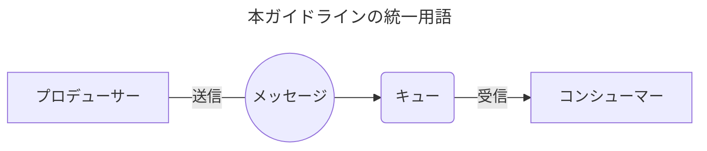

## はじめに

かつて、非同期処理は専門的なメッセージングミドルウェアを必要とする、一部のミッションクリティカルなシステムで採用される特別な技術と言えた。今やクラウドネイティブなサービス（例：AWS SQSなど）の登場で状況は様変わりし、応答時間の長い処理のオフロードなどを目的に、非同期処理を取り入れることは珍しくない。一方で、非同期特有の難しさは変わらず、「処理のトレース」 「デバッグ」 「リラン」が困難であり、データストアにまたがる場合のデータの整合性担保や障害発生時のリカバリは難易度が高い。

本ガイドラインは、非同期導入時のメリットを享受しつつ、「本質的な難しさ」を回避または適切に管理するための実務的な設計論点と指針を提供する。堅牢で運用しやすい非同期システムを設計するための一助になれば幸いである。

::: warning 免責事項

- 有志で作成したドキュメントである。フューチャーには多様なプロジェクトが存在し、それぞれの状況に合わせて工夫された開発プロセスや高度な開発支援環境が存在する。本ガイドラインはフューチャーの全ての部署／プロジェクトで適用されているわけではなく、有志が観点を持ち寄って新たに整理したものである
- 相容れない部分があればその領域を書き換えて利用することを想定している。プロジェクト固有の背景や要件への配慮は、ガイドライン利用者が最終的に判断すること。本ガイドラインに必ず従うことは求めておらず、設計案の提示と、それらの評価観点を利用者に提供することを主目的としている
- 掲載内容および利用に際して発生した問題、それに伴う損害については、フューチャー株式会社は一切の責務を負わないものとする。掲載している情報は予告なく変更する場合がある

:::

## 適用範囲

本ガイドラインが対象とするスコープは、バックエンドシステムにおける以下のような非同期メッセージングを用いた処理に限る。

- Web APIやバッチ処理からのトリガーによる非同期メッセージやキューと、その後のコンシューマー処理
- ストリーミング処理は関連する領域であるが、タイムウィンドウなど特有の処理については深くは触れない

以下は含まれない。

- 各プログラミング言語で準備されている非同期処理の実装方法。例えばJavaScriptでのasync/await、Javaでのスレッド/仮想スレッド、Goのgoroutineなどには触れない
- ブラウザのサービスワーカー

## 用語

非同期処理には、メッセージキューのサービスを利用する。そうした種別や、プロダクトごとに呼び名が様々存在する。

| 分類                  | キュー                                                                    | Pub/Sub                                                                    | ストリーミング                                                                      |
| :-------------------- | :------------------------------------------------------------------------ | :------------------------------------------------------------------------- | :---------------------------------------------------------------------------------- |
| 説明                  | 1:1型。1つのメッセージが1つの受信者に処理される。メッセージは処理後に削除 | 1:N型。1つのメッセージを複数のワーカーが受け取る。メッセージは処理後に削除 | 1:N型。複数のワーカーが異なる読み取り位置から再生可能。メッセージは指定期間、永続化 |
| 具体例                | SQS, RabbitMQ                                                             | SNS、MQTT                                                                  | Kafka、Kinesis                                                                      |
| 送信者                | プロデューサー                                                            | パブリッシャー                                                             | プロデューサー                                                                      |
| 受信者                | コンシューマー                                                            | サブスクライバー                                                           | コンシューマー                                                                      |
| メッセージ格納場所    | キュー                                                                    | トピック                                                                   | トピック/ストリーム                                                                 |
| データ単位            | メッセージ                                                                | メッセージ/Notification/イベント                                           | レコード/イベント                                                                   |
| 順序性保証/グループ化 | Message Group ID (SQS FIFOキューの場合)                                   | \-                                                                         | パーティション                                                                      |
| 読み取り位置          | Visibility Timeout                                                        | \-                                                                         | オフセット/シーケンス番号                                                           |

上表のように非同期処理で利用される技術や製品によって用語は様々であるが、本ガイドラインでは、一貫性を保つために以下の用語を使用する。

| 用語           | 説明                                                         |
| :------------- | :----------------------------------------------------------- |
| プロデューサー | メッセージの送信側のコンポーネント                           |
| コンシューマー | メッセージを受信して処理するコンポーネント                   |
| メッセージ     | プロデューサーとコンシューマー間でやり取りされるデータの単位 |
| キュー         | メッセージを中継するサービス                                 |

## 謝辞

このアーキテクチャガイドラインの作成には多くの方々にご協力いただいた。心より感謝申し上げる。

- **作成者**: 真野隼記、武田大輝、亀井隆徳、佐藤尭彰、山口真明、坂本慎司、越島亮介、宮崎将太、澁川喜規
- **レビュアー**: 募集中

## Articles

- 2026.2.20 [非同期設計ガイドラインを公開しました](https://future-architect.github.io/articles/20260220a/)

---

次のページ: [非同期設計ガイドライン](./async_guidelines.md)
