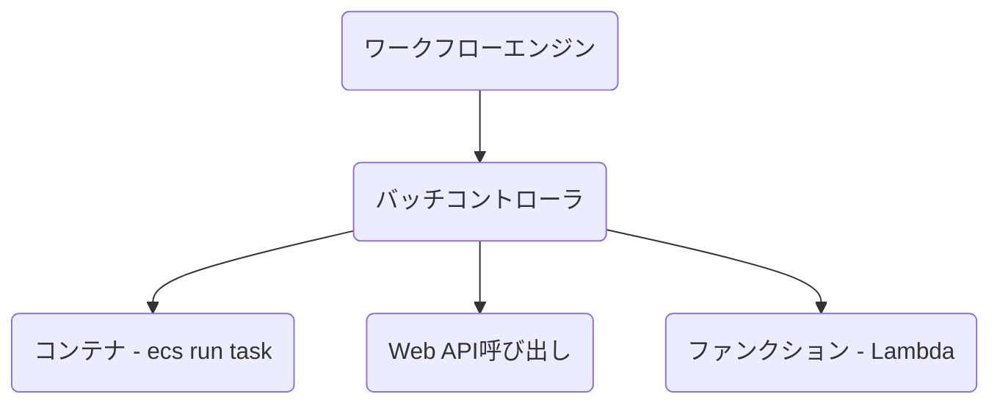
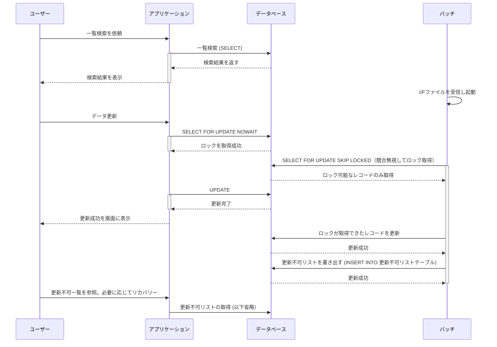

<page-title/>

本規約は、世の中のシステム開発プロジェクトのために無償で提供致します。  
ただし、掲載内容および利用に際して発生した問題、それに伴う損害については、フューチャー株式会社は一切の責務を負わないものとします。  
また、掲載している情報は予告なく変更することがございますので、あらかじめご了承下さい。

# はじめに

バッチ処理とは、大量のデータを一括で処理するための手法であり、システム開発において今なお重要な位置づけにある。バッチ処理の対義語は逐次処理（リアルタイム処理・ストリーム処理とも呼ぶ）であるが、業務イベントが発生する度に何かしらの処理を実行することを指す。逐次処理の方が処理結果を即時確認できるが、それがユーザー体験（UX）の向上に繋がらない場合や、開発コストの低減（基本的には逐次処理の方が設計・運用の難易度が高い）、コンピュータ資源を下げたい場合やバッチ処理が選択されることが多い

バッチ処理は基本的に大抵どのシステムでも存在するが、その規模や複雑度、システムにおける重要度は千差万別である。最も単純なケースではcronのようなスケジューラを用いて、バッチプログラムを単発起動で事足りるケースもある。より複雑なシステムでは、ワークフローエンジンを用いてDAGやジョブネットで管理すべきケースもある。

また、バッチ処理はバックグラウンドで起動するため、データ量によっては実行時間が数十分に達することもよくある。フロントエンドから呼ばれるWeb APIは1、2秒以内での応答速度を求められることと対象的である。そのため、バッチ処理はその特性上システム全体のパフォーマンスや運用効率に大きな影響を与える。本ガイドラインでは、バッチ処理設計におけるベストプラクティス、設計時の考慮点、運用における課題とその対策について詳述する。

# 定義

* バッチ処理: 大量のデータを一括で処理するプログラミングモデルのこと  
* バッチ設計: 本規約では、「バッチ処理を行うプログラムの設計」を指す  
* ジョブ: バックグラウンドで動かす1つ1つのタスクを定義・実行するための基本単位。AirflowでいうOperatorに該当。ジョブで行う処理は様々で、ヘルスチェックのWeb APIを呼び出し成功失敗の判定を行うだけのジョブもありえる。本ガイドラインではジョブからバッチ処理を呼び出すことを指すことが多い  
* ワークフロー: 相互に依存関係を持つ複数ジョブの流れを定義したもの。JP1ではジョブネット、AirflowではDAGに相当する  
* オンライン操作: 画面操作のこと

# 適用範囲

本規約は、バッチの設計、開発時に利用することを想定しているが、バックエンド領域で関連性が高いと考えられる以下の内容も含む。

* ジョブスケジューラ

以下の内容は含まない。

* [Web API設計ガイドライン | Future Enterprise Arch Guidelines](https://future-architect.github.io/arch-guidelines/documents/forWebAPI/web_api_guidelines.html) に含まれる内容  
* 「I/F設計ガイドライン（※作成予定）」に含まれる内容  
* 「非同期処理設計ガイドライン（※作成予定）」に含まれる内容

# 前提条件

対象とする技術は以下を想定している。

* AWS、Google Cloud、Azureなどのクラウドサービスを用いての開発  
  * 設計観点などの説明には、特にAWSを例に上げることが多い

# 免責事項

::: warning 有志で作成したドキュメントである

* フューチャーアーキテクトには多様なプロジェクトが存在し、それぞれの状況に合わせて工夫された開発プロセスや高度な開発支援環境が存在する。本規約はフューチャーアーキテクトの全ての部署／プロジェクトで適用されているわけではなく、有志が観点を持ち寄って新たに整理したものである  
* 相容れない部分があればその領域を書き換えて利用することを想定している
  * 例えば、現行システムがあればそれに沿った設計にすることで、現新比較など含めた品質担保が行いやすくなることが考えられる。こういったプロジェクト固有の背景や事情への配慮は、ガイドライン利用者が最終的に判断すること
* 本ガイドラインに必ず従うことは求めておらず、設計案の提示と比較するための観点を利用者に提供することを主目的としている

:::

# ワークフローエンジン

## 概要

ワークフローエンジンとは、一連のタスクを自動化し、事前に定義された順序に基づいて実行を管理するツールである。他にも、業務プロセスの承認フローを制御するようなツールもワークフローエンジンと呼ぶが、本ガイドラインでは前者をワークフローエンジンと呼ぶ。

ワークフローエンジンに求められる主な要件は以下である。

| 分類 | 項目 | 説明 |
| :---- | :---- | :---- |
| 起動制御 | 定時起動 | cronジョブのように、日次 20:00 といった起動が可能かどうか |
|  | サイクル起動 | 5分間隔といったスケジュール起動が可能かどうか |
|  | イベント起動 | オブジェクトストレージへのputイベントなどによる起動が可能かどうか |
|  | 繰越実行 | 前回のジョブが失敗で終了した場合に、次の起動条件を満たした場合に再実行するかどうか。サイクル起動などで制御したい場合がある |
|  | 追い越し実行 | 前回のジョブが実行中に、次の起動条件を満たした場合に実行するかどうか。サイクル起動やイベント起動での重複起動を防ぎたい場合 |
| フロー制御 | 順序制御 | タスク間に依存関係を作ることができるか |
|  | エラー制御 | 上流のタスクが失敗したら、下流のタスクを停止させることができるか |
|  | 並行分岐 | タスクAが終了後、タスクB、Cを2つとも起動させることができるか |
|  | 合流（待ち合わせ） | 並行分岐したフローのタスクが全て正常終了したことを待ち合わせて、別のタスクを起動させることができるか。定時起動と順序起動のAND条件も含む |
|  | 条件分岐（排他分岐） | タスクAの終了後に特定の条件に従って、タスクBまたはCを実行できるか |
|  | 並列実行（分散） | 例えば4並列などに分散実行ができるか。分散数は固定/動的の両方とする |
|  | 集約 | 分散実行された全タスクの成功を待ってから、次のタスクを実行できるか |
| パラメータ | タスク間パラメータ連携 | あるタスクで生成したパラメータを下流のタスクに引き継げるか |
| 構造化 | グループ化 | タスク定義をシステム種別などの単位でグルーピングして管理できるか。視認性や影響度調査のため |
|  | ネスト定義 | タスク定義をネストして表現することができるか。視認性や影響度調査のため |
| 可視化 | フロー定義ビューア | タスクの依存関係をビューアで確認できるか |
|  | 実行ビューア | タスクの実行状態をビューアで確認できるか。実行前、実行中、異常終了、正常終了などが区別できることが望ましい |
| 手動操作 | フローのリラン | 失敗したタスクが保続するフローを最初から再実行できるか |
|  | 個別タスクのリラン | 失敗したタスクだけをからリランできるか |
|  | 手動実行 | 成功/失敗を問わず、そのタスクだけを手動で実行できるか |
|  | パラメータ上書き | リラン/手動実行を問わず、実行時のパラメータを手動で上書きできるか |
|  | タスクの強制終了 | 予期せぬ長時間起動したタスクを終了させることができる |
|  | タスクの無効化 | タスクを一時的に停止でき、起動条件を満たしても、起動が無視される |
|  | タスクの有効化 | 停止されたタスクを再開できる。停止中に発生した起動は無視され、次の起動条件を満たすまで待機する。上流のタスクが正常終了済みであれば、下流タスクはそこから再開する |
|  | スキップ | 特定のタスクをフロー定義から一時的にスキップできるか（該当タスクの無効化＋次のタスクを手動再実行でも再現可能） |
| その他 | QoS | タスクの起動について抜け漏れはないか（At Least once 以上か） |
|  | 可用性 | ワークフローエンジンが単一障害点とならないように、可用性を高める仕組みが必要 |
|  | コード管理 | ワークフロー定義はコードで管理できるか（Gitでバージョン管理できるか） |

## プロダクト選定（AWS）

システム開発におけるワークフローエンジンは、保守運用性に大きく影響する。そのため、組織で統一した仕組みを導入することが望ましい。例えば、すでに存在する保守運用体制がJP1のような製品を利用しており、構築したシステムやサービスの運用引き継ぎが将来的に現行の保守体制に行われるのであれば、利用するワークフローエンジンも統一させることが自然である。

一方で、新規事業開発やデータエンジニアリングのように、細かいサイクルで試行錯誤が求められる領域ではより軽量なワークフローエンジンを導入することが有効な場面もある。AWSではStepFunctions、Airflow（MWAA: Amazon Managed Workflows for Apache Airflow)  が比較されることが多い。

▼製品比較 ※2025年2月時点

| 分類 | 項目 | StepFunctions | Airflow |
| :---- | :---- | :---- | :---- |
| 起動制御 | 定時起動 | ✅️Event Brigeと組み合わせ | ✅️\`schedule\_interval\` |
|  | サイクル起動 | ✅️Event Brigeと組み合わせ | ✅️\`schedule\_interval\` |
|  | イベント起動 | ✅️ | ✅️Task Sensor |
|  | 繰越実行 | ❌️個別開発（外部DBを利用した状態管理など） | ✅️ \``` depends_on_past=true` や `trigger_rule` `` |
|  | 追い越し実行 | ✅️ステート名で制御 | ✅️ \``` depends_on_past=true` `` |
| フロー制御 | 順序制御 | ✅️ | ✅️DAG定義 |
|  | エラー制御 | ✅️Retry、Catch | ✅️ |
|  | 並行分岐 | ✅️Parallelステート | ✅️DAG定義 |
|  | 合流（待ち合わせ） | ✅️Parallelステート | ✅️DAG定義 |
|  | 条件分岐（排他分岐） | ✅️Choiceステート | ✅️BranchOperator |
|  | 並列実行（分散） | ✅️Parallelステート | ✅️DAG定義 |
|  | 集約 | ✅️Parallel、Mapステート | ✅️DAG定義 |
| パラメータ | タスク間パラメータ連携 | ✅️XComなど | ✅️`InputPath` `ResultPath` など |
| 構造化 | グループ化 | ✅️ステートマシン分離 | ✅️\`TaskGroup\` |
|  | ネスト定義 | ✅️Nested Workflows | ✅️\`TaskGroup\` |
| 可視化 | フロー定義ビューア | ✅️AWSコンソール | ✅️Web UIある |
|  | 実行ビューア | ✅️AWSコンソール | ✅️Web UIある |
| 手動操作 | フローのリラン | ✅️ | ✅️ |
|  | 個別タスクのリラン | ✅️[2024年にサポート](https://aws.amazon.com/jp/about-aws/whats-new/2023/11/aws-step-functions-restarting-workflows-failure/) | ✅️ |
|  | 手動実行 | ⚠️最初のタスクからのみ実行可能 | ✅️ |
|  | パラメータ上書き | ✅️ | ✅️ |
|  | タスクの強制終了 | ✅️ | ✅️ |
|  | タスクの無効化 | ❌️ | ❌️条件文で制御 |
|  | タスクの有効化 | ❌️ | ❌️条件文で制御 |
|  | タスクのスキップ | ❌️ | ❌️条件文で制御 |
| その他 | QoS | ✅️At Least Once | ✅️At Least once |
|  | コード管理 | ✅️JSON/YAML | ✅️Python |

推奨は以下。

* 保守運用体制への引き継ぎがあり、JP1などの製品がすでに導入されているのであれば、既存製品の利用を第一に検討する  
* 構築対象の領域が、ジョブが少なく依存関係も存在しない場合、AWSの場合はStep Functions や Airflow の導入を検討する  
* 原則、Airflowを推奨するが、複雑なタスク間の依存関係がなく、コスト要件が厳しい場合は、Step Functionsの利用も検討する

## ワークフローが存在しない場合（AWS）

システム特性によっては、ワークフローの「概要」節で求められるようなタスク定義が不要な場合がある。例えば、1日1回、あるタスクが起動できればよく、タスク間の依存関係（フロー）が存在しないケースである。このような場合は、AWSではEventBridge Schedulerで ECS（`ecs run task`） などを呼ぶという軽量な手法もある。このようなケースでは、Airflowのようなワークフローエンジンは牛刀かもしれず、EventBridgeから直接ECSを呼び出すか、Step Functionsを経由させるといった軽量な手法が採用されることが多い。

| \# | ①EventBridge Scheduler | ②Step Functions |
| :---- | :---- | :---- |
| 説明 | スケジューラからECSやLambdaを呼び出す形式 | スケジューラからStep Functionsのステートマシンを呼び出し、内部的にECSやLambdaを呼び出す形式 |
| 構築コスト | ✅️最小限の構成となる | ❌️余計なインフラリソースが増える |
| クラウド費用 | ✅️最小限の構成となるため | ⚠️Step Functionsのコストは安いとはいえ、追加費用が発生する |
| 拡張性 | ⚠️Step Functionsでラップする必要 | ✅️後々、依存関係が追加される場合には便利 |
| リラン操作 | ✅️スケジューラ経由のリランは不可。ECSやLambdaの画面から再実行する | ✅️Step Functionsのステートマシン（タスク）を再実行する |

推奨は以下。

* 現時点で、依存関係が存在しない場合、①を利用する  
  * アプリ終了後に通知を飛ばしたいといった要件程度であれば、アプリ側でロジックを追加すればよい  
  * まだ発生していない拡張要件への備え、早すぎる最適化であるため  
* 将来的な、依存したタスクの追加が判明している場合は、②を採用する  
  * 後で切り替えることも現実的な作業量で可能だが、面倒には違いないため  
* ①、②の構成が混在することは許容する（ハイブリッド型）  
  * リランの操作方法が、ジョブごとに異なってしまうが、運用マニュアルでカバーすること  
  * そもそもが、ジョブ数が少なくシンプルという前提があるため  
  * もし、大多数が単発ジョブしか存在しないが、数が多く運用の一貫性を図りたい場合は、②に統一する方式を取る

## ジョブ間パラメータ動的連携（AWS）

あるジョブで動的に生成したパラメータを、後続のジョブに連携したい場合がある。Lambdaの同期呼び出しの場合は直接戻り値を取得できるが、`ecs run task` の場合は非同期呼び出しのため、DBやオブジェクトストレージを経由するなどの工夫が必要である。この時、ワークフローの重複起動を考慮すると、ワークフロー実行毎に一意のID（リクエストIDやトランザクションIDと呼ぶ場合もある。以降はトランザクションIDと呼ぶ）を生成し、ワークフローの各ジョブで共有する必要がある。

トランザクションIDの発行と共有について、以下の設計パターンが考えられる。

| \# | ①アプリ制御 | ②ワークフローエンジン制御 |
| :---- | :---- | :---- |
| 説明 | できる限りアプリケーションで制御する方法。トランザクションIDの採番や、ジョブ実行時に利用すべきトランザクションIDの特定をアプリケーションで行う。特定したトランザクションIDを元に、DBやオブジェクトストレージなどを検索し、パラメータを取得する。リランや重複起動への対処など考慮点が多数ある | ワークフローエンジン上で検索用のトランザクションIDを発行し、各ジョブに連携する。各ジョブはトランザクションIDをキーにパラメータ連携する。Airflowでは `dag_run.run_id` を用いるか、UUID発行 & XComの利用を利用 |
| 開発コスト | ❌️アプリ側の考慮点が多く、枯れるまで一定の動作実績が必要な場合が多い。フレームワーク化が必要なことが多い | ✅️Airflowなどでは一般的な設計 |
| 品質 | ⚠️独自実装部分が多く複雑である | ✅️各アプリロジックはシンプルに抑えられる |
| 運用性 | ⚠️独自の設計方針に従う。学習コスト高 | ✅️より一般的な運用方針に従う。ナレッジの転用が可能 |
| 移植性 | ✅️アプリに閉じて設計が可能。移植しやすい | ❌️ワークフローエンジンに依存する |

推奨は以下。

* 原則、②を採用する  
  * ワークフローエンジンへの依存度は高くなるが、アプリ側に寄せると開発コストが高くなるため  
  * ワークフローエンジンにこういった機能を寄せることは、特殊ではないため

## 動的なワークフロー

ワークフローの定義を動的に組み替えたい場合がある。例えば、あるジョブの実行結果に応じて、後続のジョブの実行数が可変になるような場合がある。AirflowやStep Functions の場合は、それぞれ `expand()` や `Map` ステートで対応できる。アプリケーション側での制御も不可能ではないが、フロー制御がアプリケーションとワークフローエンジンの2箇所で行うことになり、複雑になる傾向がある。

| \# | ①アプリ制御 | ②ワークフローエンジン制御 |
| :---- | :---- | :---- |
| 説明 | ジョブ呼び出しを、ラップするようなアプリケーションを作成し、その実行基盤上で次に呼び出すジョブを制御する方法。ワークフローエンジン経由ではないジョブ呼び出しが追加される | ワークフローエンジン側の機能で対応する |
| 開発コスト | ❌️アプリ側の考慮点が多く、枯れるまで一定の動作実績が必要な場合が多い。フレームワーク化が必要なことが多い | ✅️Airflowなどでは一般的な設計 |
| 品質 | ❌️独自実装部分が多く複雑である | ✅️各アプリロジックはシンプルに抑えられる |
| 運用性 | ❌️運用の一貫性がなくなる | ✅️より一般的な運用方針に従う。ナレッジの転用が可能。エンジン側が提供するビューアなどで実行結果を確認可能 |
| 移植性 | ✅️アプリに閉じて設計が可能。移植しやすい | ❌️ワークフローエンジンに依存する |

推奨は以下。

* ワークフローエンジンの機能を用いて制御する  
* もし、ワークフローエンジン上で不可である場合は、アプリ制御する（しかない）

# ワークフローエンジン導入パターン

ワークフローエンジンをどこに構築し、だれが運用するか、運用ルールが作成済みか確認する必要がある。大きな考慮ポイントとして、ワークフローエンジンをシステムで専用・共用を決める必要がある。

| \# | 占有 | 共有 |
| :---- | :---- | :---- |
| 説明 | 1システムで1ワークフローエンジンを用意するパターン | 複数のシステムで共用するパターン |
| 利用コスト | ❌️JP1のようにライセンスが必要な場合、調達コストが上がる❌️サーバ利用運用がそれぞれ必要 | ✅️ライセンス数を抑えることができる ✅️サーバ数を抑えることができる |
| 構築コスト | ✅️各チームで自律的に利用可能 | ⚠️他チームと共用するためルールが厳しくなる傾向がある ⚠️権限管理などの設計、運用ルールが必要 |
| セキュリティ | ✅️システム単位で権限分離 | ❌️他チームのワークフローが参照できてしまうことや、誤操作の懸念 |
| 分離性 | ✅️システムごとに分離 | ❌️ノイジーネイバーの懸念 |

推奨は以下。

* 組織のシステム化方針などで、「共有」が決まっている場合は従う（運用ルールはどのようになっているか確認する）  
* 「共有」が決まっていないが、「JP1」などのプロダクトを利用する必要がある場合は、「占有」方式を採用できないかを第一に検討する。コスト（ライセンス）などの都合で難しい場合は、運用ルールの整備を並行させる  
* 利用するワークフローエンジンが、AirflowやStep Functionsの場合は、「専用」で構築する

::: tip 環境ごとにワークフローエンジンを構築すべきか  
デプロイメント環境ごとにクラウドアカウントは分離すべきである。  
AirflowやStep Functionsを採用した場合は、権限などの観点からもデプロイメント環境ごとにワークフローエンジンを構築することが望ましい。  
:::

# ワークフロー設計

主な設計観点として以下の項目がある

1. ワークフロー命名規則  
2. ネスト階層数  
3. フロー間の依存設定

## ワークフロー命名規則

ワークフローの命名は保守運用性に直結する。`dag1` や `task1` といった連番ではなく、 目的や役割が明確な命名をすべきである。ワークフローエンジンは[ワークフローエンジン導入パターン](#ワークフローエンジン導入パターン) 章の通り、システムごとに構築する前提であればシステム名などのプレフィックス・サフィックスは付与する必要はない。

推奨は以下。

* 表示名: {メインの機能名}  
  * 日本語にしても良い  
* ID: {メインの機能名}  
  * `calc_order など`

✅️発注量計算を行うワークフローの命名

```text
calc_order
```

❌️不適切なワークフローの命名

```text
dev_myproject_calc_order_v1
```

## ネスト設計

ワークフローは、AirflowではTaskのグループ化・JP1ではジョブネットを用いることでネストさせることで抽象的に管理ができる。

全体のタスク数の規模や複雑度に大きく依存するが、一般的にネストを深くしすぎると、運用時の操作性が複雑になる点や、過度な抽象化で具体的に何を行っているかの把握が難しくなるというトレードオフが存在する。

推奨は以下。

* 原則、最大のネスト数を3階層に抑える（※基準となる数値はチームごとに決めて良い）  
* ワークフローはできる限りフラットに管理し、見通しが悪くなってきた場合でネスト化を検討する  
* ネスト化は、処理レイヤー（例えばファイル受信、加工・ファイル送信など）や、機能分類など、関連性がある場合に用いる（良い命名ができる場合にのみ留める）  
* リランのしやすさを考慮して、ネストの設計を考慮する  
  * 例えば、処理レイヤー（ファイル受信など）単位でネスト化すると、リランは全ファイル種別を再取り込みする、という意味合いが生まれる  
  * あるファイル種別のみリランしたいことを考えると、処理レイヤーではなく機能分類の方が、ネスト化として望ましい可能性がある  
* ネスト化させる場合、レベル感が同一のタスクのみとする（例えば、特定のタスクのみ際立って実行時間が長い場合は、分離することを検討する）

以下の場合はネストしたワークフローは作成しない。

* 全体のタスク数が20未満と少ない場合（※基準となる数値はチームごとに決めて良い）  
* ネスト対象のタスク数が、2以下である場合（※基準となる数値はチームごとに決めて良い）  
* ネストしたタスクの集合を示す、良い命名ができない場合

<div class="img-bg-transparent">

| ✅️例: 機能分類でネスト化 | ❌️例: 関連性の高いが処理レイヤーでネスト化  | ❌️例: レベル感が不揃いのネスト化 |
| :---- | :---- | :---- |
| 関連度の高いタスクを集約し視認性を上げ、リランはファイル種別単位で行うことを想定 | 関連度の高いタスクを集約し視認性を上げているが、リランのユースケースとして、全ファイル種別をやり直すことは考えにくい | マスタ取り込みに改廃処理が存在し名称と不一致。サマリ作成にMVIEWリフレッシュがありレベル感が不一致。受注予測と発注量を束ねた名称の抽象度が高すぎる |
| [![][nest_by_feature_png]][nest_by_feature_editor_link] | [![][nest_by_layer_png]][nest_by_layer_editor_link] | [![][nest_by_odd_png]][nest_by_odd_editor_link] |

</div>

[nest_by_feature_png]: https://mermaid.ink/img/pako:eNqNk89L40AUx_-V8E4RoqRtfh-EJFUrsqf1tAQkNqMN2EmJCailh00OW_Sgl1UE9SbIrgjLIuuKu_vHjNbuf7HTSVfThqpzynvv-973w-RNG-qBh8CA9dBtNbjlqoM5ekyeJD9J8o0kNyQ9J-kdSb_2r3887H2ecnAm2YxXs56H_UOS7PZ_35GPf8wVklyT9IykX-5_nfS6B2YmHhzPD1E98gPMLVvPWYvP93Pm1HNpjh8bNlK1uOnpWW4uSyDsvchljXNZr3HZo1xWznm-wJWv2oxr_m1c9jiX_RpXdZTLzjkvFLjy1SrjWihw1ejAo973i_vbbu_mctiwyD8e39Lk30_7_Yvu49XRML_Ek_SSpKdsI7qZy9NGmMzhLetQVE76QUXlpCt72ZeNqRWVRd9JyqJvXlljweLw9liw5GAQoInCput79IW1B0UHogZqIgcM-umhNTfeiBxwcIdK3TgK3m_jOhhRGCMBwiBeb4Cx5m5s0ihueW6Eqr5Lt6j5X9Jy8YcgeAqR50dB-C570exhC_RhD9yHE-l_R6EdxDgCoySyfjDasAWGJs8oakUqS6Kul3VVqQiwDUZZpmm5VNIlURbFkqpJHQF2mKM4IyuaqlYUXRYVTdLKnX9cGMwn?type=png
[nest_by_feature_editor_link]: https://mermaid.live/edit#pako:eNqNk89L40AUx_-V8E4RoqRtfh-EJFUrsqf1tAQkNqMN2EmJCailh00OW_Sgl1UE9SbIrgjLIuuKu_vHjNbuf7HTSVfThqpzynvv-973w-RNG-qBh8CA9dBtNbjlqoM5ekyeJD9J8o0kNyQ9J-kdSb_2r3887H2ecnAm2YxXs56H_UOS7PZ_35GPf8wVklyT9IykX-5_nfS6B2YmHhzPD1E98gPMLVvPWYvP93Pm1HNpjh8bNlK1uOnpWW4uSyDsvchljXNZr3HZo1xWznm-wJWv2oxr_m1c9jiX_RpXdZTLzjkvFLjy1SrjWihw1ejAo973i_vbbu_mctiwyD8e39Lk30_7_Yvu49XRML_Ek_SSpKdsI7qZy9NGmMzhLetQVE76QUXlpCt72ZeNqRWVRd9JyqJvXlljweLw9liw5GAQoInCput79IW1B0UHogZqIgcM-umhNTfeiBxwcIdK3TgK3m_jOhhRGCMBwiBeb4Cx5m5s0ihueW6Eqr5Lt6j5X9Jy8YcgeAqR50dB-C570exhC_RhD9yHE-l_R6EdxDgCoySyfjDasAWGJs8oakUqS6Kul3VVqQiwDUZZpmm5VNIlURbFkqpJHQF2mKM4IyuaqlYUXRYVTdLKnX9cGMwn

[nest_by_layer_png]: https://mermaid.ink/img/pako:eNqFkstKw0AUhl8lnFUKqaRNc2kWQi_eEFd2JdnEZtoGbFJiAmrpwmRh0YVuVAR1JxQtgkjxgtqHmVrrWzi5aFtbdFY55_vPzM-fU4eiqSGQoWyptQpVyCsGRU6Gxu4Tdu-w-4i9K-y9YO9m0Hl4PziOKUYo2XTWwxnsXQbi7vvhCXb3B28veLcbavyj6RYq2rppUIXssJulR9VUJjZEuXGUHUH5cZSLEDK0SVduxzfmXfdez_vNo__8zNG_BsYszU_QUVcLE3SKsUVi_bR_3-o9N_uP7Ygv0R9nz6T5uXc4aDU_bk-j_jKNvTb2LoLgm-GlP8FnqHh89q_Up6JwaFoov837wsXIdFAsRWaDYhkYqCKrquoa2Zq6jxSwK6iKFJDJp4ZKqrNhK6AYDSJVHdtc3TaKINuWgxiwTKdcAbmkbmySyqlpqo3yukr-WfVbUlONNdP8KZGm26a1Em5psKwMWVb_9ehGEjKycqZj2CCLwTjIddgCWeJnBJFLJVNsOp1MiwLHwDbISZ60-UQinWJ5lk2IUqrBwE7wIDvDC5IocoIkSBIvcZzY-AJcM0WT?type=png
[nest_by_layer_editor_link]: https://mermaid.live/edit#pako:eNqFkk1LAkEYx7_KMqcV9AvsIVi1UqRTnmIvkzPqgjsj6-whxEM7h5Y62KUkqG6BlAQRkonlhxlftm_R7Au-U3Pa5_n9Z_jx7NMEJYow0EDFhvWqUswaRJFHV4X7Kdw34Q4EfxJ8JPiL3_-YXt0kDBJFGs5pdEfwxzA8nrZvhXvpf4_E-TjKBAeZNi4xkxKlmF520-pqWtETS5RZR-kVlF1HmRhhgrat3H4gxp8nX_cz7_o_n31148Ka0sEWXbU63KI7xHJSvTN7706G3mzQi3lend8NZfPnou13vflrJ-4XVMF7gj-Eg_eiRxeD15VUau-vqe9E0aVdQ9mUD4K5WDos8rFsWBRAEljYtqCJ5NY0A2QAVsUWNoAmPxEuQ6fGDGCQloxCh9HjM1ICGrMdnAQ2dSpVoJVhrSErp44gw1kTyn9mLbp1SE4oXdYYmYzaR9Gehuva-gXvSSpn

[nest_by_odd_png]: https://mermaid.ink/img/pako:eNqNU8tq20AU_RUx2cggB9t6egoFP9LGBK8aUijaqNbIEpUlI41oUuNFpEVNu0gWSUOh7a4Q2tBSSsijafMxEzvuX3QkJY4cm6QDAzP3nHvnnJm5PdBydQQgaHta12RW66rD0FFhSXhCwh8kPCbRZxKdkejr-PBo-HY3pzopxQ-epzkk-pSQz4db70j4ZvznjGyep5x46JaHWthyHWa1ehOtslk2U8ndQLVpqJqB6tNQLQOtsaOdk-GviOpI1HzPQQhNq23adOKUhxx9Vn14GBuIvlz8_jAabN-ne4m9lTAl_dEMmlX_eAbNGmiyzbXG0lMKkmiXRAckol6O6O3TGv9nZbw_uPy2d5-DZXqHe6Of-xeng9HxwZzS8Wiwl-9PKenv66206t0SVthE8MfkowxSc5OPUmHy-Yd3_ZK5UJo073FuX2JMzFpfTiKNdJMCSWTlWlDL1ny_jgxmYogxLNuGC0bZ4HzsuS8QXOB5_mqdf2np2IRCd_0B4EAHeR3N0mnH9OJqKsAm6iAVQLrUkaEFNlaB6vQpVQuw-2TDaQGIvQBxwHODtgmgodk-3QVdXcOobmn08TrXlK7mPHPdyRbpFna9ZtqhSaNytFHj068q0jdAXs0NHAygnKQD2APrACrioiTzQkkolMulsizxHNgAsCTSsFgsloWCWCgUZUXoc-BVcmBhUZQUWeYlRVIUUeF5uf8PejCm6g?type=png
[nest_by_odd_editor_link]: https://mermaid.live/edit#pako:eNqNU8tKw0AU_ZUwblJoV3XjCEJrfRTpSlGQbMZm0gTTpCQTVMSFmYVFF7rwgaDuBFFRRMS2Vv2Y6cu_cJLRNrVFHRiYuefcyzl37myCvK1iAEHBQSVdWsgolsRXSmZ-lfkPzK8weslondGbztNzc-8opliC4norIofRi5D83tw_Zv5u563Ott8FJ1iq4eA8MWxLWkj3omk5ypZSsR402Q-lI1CmH5qMQIty67DafKFcR6jmPgYh1I2CbvJNBA9b6qB6_ykwQK8br2et8sFfuqfkHwl90qcH0Kj6mQE0aiAn5xazU0scZPSI0VtGuZdn3n1e439WOlfl9t3JXw5meQ9PWo9XjVq5VbkdUjpYWbl9WuOkj519UfV3CXNyKPg8HJSyMNcdlJSUSEz8NiVDIZE07HF-NjEgRq3PhpGsuAggjMx9C8qbyHUzWJO6hiTNME04oo1pcZc49iqGI8lk8uucWDNUosPR0vo4iIMidorIUPmP2QyqKYDouIgVAPlRxRryTKIAxdriVOQRe37DygNIHA_HgWN7BR1ADZkuv3klFRGcMRB_vGI3WkLWsm337lg1iO3kxB8Nv-rWJx5Oi74

\[参考\] [JP1ジョブ設計のポイント（初級） | フューチャー技術ブログ](https://future-architect.github.io/articles/20210204/)

## フロー間の依存関係

フローAが終了後に、フローBを呼び出したい場合がある。結合度が高い場合はA、Bを統合するということも考えられるが、業務的な区切りを表現したいなど、分離させたまま管理したい場合も多い。この時、フロー同士の依存関係をどのように表現、管理するかいくつかの方式が考えられる。

| \# | ①ワークフローエンジンのイベント通知 | ②外部データストア経由 |
| :---- | :---- | :---- |
| 説明 | 上流のフローの完了を下流のフローが監視するか、上流のフローの最後に下流のフローの起動を呼び出す方式 | DAG間で直接依存関係を持たせず、データストア（S3, GCS, DBなど）を介してデータを連携する方式 |
| 例 | Airflowでは `ExternalTaskSensor` や `TriggerDagRunOperator`、JP1ではイベント送信が該当 | オブジェクトストレージへのputイベントなどが該当 |
| 視認性 | ✅️ワークフローエンジン側のビューアなどで依存関係が表示され便利 | ❌️ビューア上は依存関係が表示されない |
| 柔軟性 | ⚠️連携対象のフローを明示的に指定する必要があるため、結合度が上がる | ✅️各DAGは独立性を高くしてデプロイが可能である |
| 運用性 | ✅️リランや手動実行などの運用は通常の差が無い | ⚠️リランはデータストアへの操作が必要になり、運用難易度が上がる。ただしリラン用のタスクを作成すれば緩和可能 |
| 保守対象 | ✅️インフラ対象としては最小限 | ❌️外部データストアのインフラ管理対象が増える |

推奨は以下。

* 原則、①を採用する  
  * Airflowであれば実装コストが低い（外部データストアを経由させるほうが、手数が増える）  
* ①を採用し、上流のフローから下流のフローを明示的に呼び出す場合は、ネストの深いところではなく浅い層から呼び出す  
  * 依存関係を明示的にし、視認性を上げるため

# バッチコントローラ

バッチコントローラとは本ガイドライン独自の用語である。これを利用すると、ワークフローエンジンからバッチ処理を呼び出す際に、バッチコントローラを経由して、コンピューティングリソースを起動する構成を取ることができる。この時、透過的な計算資源の呼び出し・流量制御・リトライ・タスクの終了判定などを責務として持つことも多い。これにより、ワークフローエンジンの責務を小さくし、バッチ呼び出しの統制を効かせることができる。

▼バッチコントローライメージ  



バッチコントローラの導入の是非について、観点を下表でまとめる。

| \# | ①バッチコントローラあり構成 | ②バッチコントローラレス構成 |
| :---- | :---- | :---- |
| 説明 | バッチ処理を実行するためのコンピューティングリソースの呼び出しを、バッチコントローラ経由で行う構成。バッチコントローラは任意の言語で実装できるため、技術スタックを揃えたい場合には有利 | ワークフローエンジンから直接、コンピューティングエンジンを呼び出す方式。SDKをワークフローエンジン側にインストールする必要がある。AirflowであればPythonでの実装量が増える傾向がある |
| 開発生産性 | ⚠️バッチコントローラ側に定義情報の登録が必要となることが多く、ワークフローエンジンのフロー定義以外の設定が必要 | ✅️フロー定義は一箇所になる |
| 開発難易度 | ✅️バッチコントローラにバッチ呼び出しを集約可 | ⚠️各ワークフロー定義にて、振り分けやリトライなどの制御を入れる必要がある。Airflowでは関数化などで緩和可能 |
| 運用性 | ⚠️バッチコントローラ分、障害ポイントが増える | ✅️必要最小限の構成 |
| 費用 | ❌️バッチコントローラ分のリソースが追加で必要。バッチコントローラがSPOFにならないように冗長構成を取ることや、バッチコントローラはDBを必要となることが多い | ✅️必要最小限の構成 |

推奨は以下。

* ②の方式を採用する  
  * Airflowであれば、コンピューティングの呼び出しやリランなどの制御が比較的容易  
  * レイヤーを減らすことで、管理対象を減らすことができる

# バッチ実行モデル（AWS） {#バッチ実行モデル（aws）}

バッチの実行基盤は、AWSであれば以下3つから選定されることが多い。

| \# | ①スタンドアロンタスク | ②ファンクション呼び出し | ③Web API呼び出し |
| :---- | :---- | :---- | :---- |
| 分類 | ワンショット | ワンショット | 常駐サーバ |
| 説明 | バッチ処理用のプロセスを起動させる方式。ここではコンテナアプリを動かすことを想定 | バッチ処理をサーバレスのファンクションで呼び出す方式。スタンドアロンタスクに近い | バッチ処理をWeb APIサーバ上で動かす方式 |
| AWSでの例 | `ecs run task` | `lambda invoke` | ECS上のWeb APIを呼び出し |
| 実行時間制限 | ✅️無限（非同期のため） | ❌️15分 | ⚠️ALBのアイドルタイムアウトの場合60分 |
| 起動のオーバーヘッド | ❌️数秒程度（FargateかつVPC内の場合は1分程度見ておくと良い） | ⚠️数百ms程度 | ✅️常駐モデルでは無視できる程度。コールドスタートの場合は数秒程度 |
| GPU利用 | ⚠️Fargeteの場合は利用不可。EC2モードの場合は可能 | ❌️利用不可 | ⚠️Fargeteの場合は利用不可。EC2モードの場合は可能だが、GPU資源の取り合いが懸念 |
| 費用モデル | ✅️利用分のみ | ✅️利用分のみ | ✅️オートスケーリングでゼロにできる |
| RI | ✅️Savings Plans | ✅️Savings Plans | ✅️Savings Plans |
| 終了判定 | ⚠️非同期実行のため `ecs describe tasks` で判定（API呼び出し数に制限あり） | ✅️同期呼び出しが可能（戻り値も取得可能） | ✅️リクエスト/リプライの同期呼び出し |
| 分離性 | ✅️リソースの独立性は高い | ✅️リソースの独立性は高い | ⚠️サーバリソースを共有している |
| リスク | ❓️東京リージョンでは時間帯によってリソースを確保できない可能性がある。EC2起動で緩和可能 | ❓️東京リージョンでは時間帯によってリソース確保ができないユーザーが出たという噂があった | ❓️東京リージョンでは時間帯によってスケールアウトするためのリソースを確保できない可能性がある。最小設定で緩和可能 |

それぞれ、実行モデルが異なるため、システム特性によって使い分ける必要がある。

推奨は以下。

* Airflow上で直接ビジネスロジックを動かすことは、スケーラビリティの観点から、原則禁止とし、①～③のモデルから選択する  
* バッチ処理の実行時間が分単位（3分以上など）の場合は、①を推奨する  
  * 実行時間の制限が無いため、初期以降やリカバリーなどで定常運用より大きいデータサイズでもタイムアウトせずに実行できる点が良い  
  * 終了判定を行うためのAPIの利用数制限があるため、大規模システムでは回避するための実装が必要になるかもしれないので注意する  
* バッチ処理の実行時間が3分未満やバッチウィンドウが秒単位でシビアな場合でかつ、実行頻度が高い場合は③を検討する  
  * スタンドアロンタスクの起動オーバーヘッドを許容できない場合  
  * 実行時間の制約が60分はバッチ処理では超えることが多々あるため、呼び出しの粒度は予め入力データを分割するなどで工夫する  
* ②はできる限り選択しない  
  * マイクロバッチなど、起動間隔が1分以下など短い場合に有効  
  * とにかくコストを抑えたいといった特殊な場合に有効

::: tip GPU利用について  
機械学習のトレーニングにはSageMakerを利用することも検討する。より大規模でリソース効率を高めたい場合は、AWS Batchを利用する考えもある。  
:::

# I/Fファイル取り込み

I/Fファイルとはシステム間のデータ連携で利用されるCSVなどのファイルのことを指し、それを自システムに取り込むバッチ処理の設計について説明する。I/Fはオブジェクトストレージを共有して行われるとする。本ガイドラインでは、オブジェクトストレージは自システム側のクラウドアカウント上で構築されるとし、連携システム側が書き込みする前提とする。なお、このファイル取り込み処理を本ガイドラインでは、「受信」と呼ぶ。

いくつかの観点で分類分けはできるが、連携頻度軸で大別すると、以下の2種類が存在する。

* 随時（連携先システムの何かしらの業務イベントが発生の都度連携）  
* 定時（1日N回、決められた時間帯に連携）

## 随時連携

随時連携の場合は、取り込みタイミングは以下の2方式がある。

| \# | ①イベント起動 | ②ポーリング |
| :---- | :---- | :---- |
| 説明 | オブジェクトストレージの書き込みイベントを元に、受信タスクを起動する | N分間隔でオブジェクトストレージに未処理ファイルが存在しないか監視する方式 |
| 鮮度 | ✅️イベント駆動で処理できるため低遅延（通常、数秒以内にイベントが配信される）にできる | ❌️最大でポーリング間隔分、遅延が発生 |
| インフラ要素 | ⚠️書き込みイベントを取得用のキュー、ワークフロー呼び出しの仕組みが必要 | ✅️ワークフローエンジンからポーリングが可能 |
| 開発難易度 | ❌️イベントの順序制御などの考慮が必要。異常発生時に以降のファイル取り込みを停止させるといった制御が必要な場合は特に面倒 | ✅️順序性は担保しやすい。キューイングの連携が無いため難易度が低い |
| 運用性 | ✅️リラン可能 | ✅️リラン可能 |

推奨は以下。

* 取り込みまでの遅延が許容できる場合は、構成がシンプルとなる②を採用することで開発難易度を下げることができる  
* なるべく遅延を減らしたい要件の場合のみ①を採用する

::: tip AWS S3のputイベントの欠損  
かつて、S3のイベント通知が欠損する可能性があり、ポーリング処理と合せ技が必要な時代があった（どうせポーリングが必要であるため、リアルタイム性が求めなければポーリングに寄せることもあった）。

ドキュメント上もAt Least Onceであると強調されているため、依存した作りで問題ないと考えられる。

* [Amazon S3のイベント通知は「稀に失われる」から「少なくとも1回配信」になっていました | DevelopersIO](https://dev.classmethod.jp/articles/amazon-s3-event-notifications-at-least-once/)  
* [Amazon S3 Event Notifications \- Amazon Simple Storage Service](https://docs.aws.amazon.com/AmazonS3/latest/userguide/EventNotifications.html)

:::

## 定時連携

定時連携とは、決められた時刻にI/Fファイルが連携される取り決めの場合のことを指す。

随時連携と異なり、本来連携されるはずであったI/Fファイルが定刻になっても未連携だった場合に、対向システムに問い合わせる必要があるため未着チェックが必要である。そのため、下表に示す通り、①の手段は採用しにくく、②と組み合わせる必要がある。①のメリットは低遅延だが、そもそも定時連携の時点でそれが優先されることは少なく、②を採用することが多い。本ガイドラインでも②を前提とする。

| \# | ①イベント起動 | ②定時起動 |
| :---- | :---- | :---- |
| 説明 | オブジェクトストレージの書き込みイベントを元に、受信タスクを起動する | I/Fファイル連携の門限後の、定められた時間にスケジュール起動する方式 |
| 機能要件 | ❌️未着チェックの実装が行いにくく、定時起動との組み合わせが必要 | ✅️未着チェックを行いやすい |
| 鮮度 | ❓️遅延は少ないが、そもそも定時連携の時点で遅延が発生しうるため、イベント起動するメリットは少ないはずである | ⚠️I/Fファイル到着後、定時起動までの間隔の遅延が発生。一定間隔ポーリングさせるなどで緩和可能 |
| 誤送信時の制御 | ❌️対向システムが誤った時間帯に連携してきたファイルは、むしろ取り込みをしないほうが良い場面がある。イベント起動にしてしまうと、こうした制御が逆に面倒である | ✅️決められた時間に存在するファイルのみに対象を絞ることができる |

主な注意点を上げる。

* 未着チェックの関係上、連携したいデータがゼロ件であったとしても空ファイルを連携する仕様となるよう、対向システムと調整する  
  * もし、不可能な場合は未着チェックを諦める事になる（システム間のデータ連携が予期せぬ不具合で停止しても、検知が遅れる（対向システム側の監視に委ねられる）ことを許容する必要がある）  
* 対向システムと未着チェック検知時の運用ルールを詰める  
  * 問い合わせ先の確認後、手動で送信してもらう取り決めにするなど  
* 未着チェックには少し余裕を持たせる場合がある  
  * 20時に連携予定のファイルだったとしても5分到着を待つ場合もある。例えばなるべく早く取り込みたいが、対向システム側のデータ処理量が大きい場合に多少遅延する場合である。この場合は、定刻から5分間は1分ごとにオブジェクトストレージをポーリングするなどでリトライし、それでも未着だった場合に、エラーログを出し監視通知すると良い  
  * いちいち、システムで通知を出すと運用が大変であるため、自動化できる運用はアプリケーションロジックに組み込んでも良い

## その他の考慮点

その他、I/Fファイル連携には以下のような考慮点がある。

* I/F連携ファイルのオブジェクトキー命名規則  
* 差分連携/全件連携（洗替）  
* 親子ファイルの待ち合わせ  
* 取り込み完了した場合に、オブジェクトを移動させるかどうか  
* All or Nothing か 部分取り込みを許容するか  
* 入力ファイルのバリデーション  
* 巨大なファイルの場合にチューニング  
* ファイル連携以外を採用すべきケース  
* 前回分の未処理ファイルが存在した場合の考慮

上記は「I/F連携ガイドライン」に記載予定である。

# 定時起動ジョブ

定時起動ジョブとは、1日1回、週に1回、月に1回など定められた日時で起動するジョブのことである。

推奨は以下。

* 起動時間は、可能であれば業務時間帯に設定すると、運用性が高い  
  * あくまで可能であればだが、いつでも実行して良いジョブであれば、ユーザーが少ないとはいえ夜間帯に実行すると、システム運用が大変である  
  * 業務のクリティカル度にも寄るが、実行時間の自由度が高い場合、運用観点では通常の業務時間帯（9-17時など）に起動させたほうが、何か合ったときのリカバリー体制が取れやすく、運用者フレンドリーである（※通常、夜間帯は頭が働かないため）  
* 起動時間は、バッチウィンドウとリカバリー用のバッファでバランスを取る  
  * 例えば、10分程度で終わるジョブを、17時までにジョブを実行させなければならない場合、16:45分起動にすると異常終了した際のリカバリーは不可能になる。そのため、門限を遵守する場合は、最低でも16:30に起動しておきたい（できれば16時起動にしておきたい）  
  * 業務調整が難しい場合は、16時起動のジョブ（大部分のデータを処理）と、16:45起動ジョブ（16時以降に蓄積したデータを処理）の2つに分割するなどの考慮ができないか検討する  
* 月次に1回など周期が大きい場合は、週次など間隔を狭めてアプリケーション側で空振りさせて、動作確認しやすくする  
  * ジョブが正しく起動するかの確認に便利である  
  * ワークフローエンジン上でスキップ判定をすると、テスト性が良くないためアプリケーション側でスキップすることを推奨する  
* 処理対象がゼロ件の場合の挙動を定義する  
  * スキップで良い場合、INFOログでその旨を出力する。結合テスト時などで、出力先のDBテーブルに書き込みがゼロ件だった場合に、調査したいことは意外と多いため、切り分け可能な材料を提供すると良い  
  * ゼロ件がありえない場合は、エラーログ出力＋通知を出す  
* 同一時間帯に起動時間が集中しないように、微妙にずらす  
  * システムタイムチャート（※後述）から、定時起動ジョブの起動時間が集中しすぎると、DB負荷高騰などが考えられる。そのため、各ジョブの起動時間・実行時間・バッチウィンドウを考慮して、集中しないようにする  
  * 例えば数分程度、起動時間をずらすのもありである

# サイクルジョブ

サイクルジョブとは定時起動ジョブの一種であるが、10分など比較的短い間隔で起動するジョブのことを指す。

以下の注意点が存在する。

* 重複起動の制御（前回起動したジョブが残ったまま、次のジョブを起動しないようにするかどうか）  
  * 重複起動を許容しない場合、前回ジョブ終了後にすぐ次のジョブを起動させるかどうか  
  * すぐに次のジョブを起動させた場合、その次はそこから10分後にするかどうか  
* ジョブが異常終了した場合に、次回起動を許可するかどうかを、設計で定義する必要がある  
  * 起動タイミングで受け持つ対象が決まっているような場合には、異常終了したジョブをリカバリーしてから次のジョブを動かす必要があることも考えられる

推奨は以下の通り

* 利用する業務日付について[日替わり](#日替わり) 章を確認し、サイクルジョブ独自で日付管理するかどうかの要否を決めること  
* 重複起動について  
* 重複起動を許容しない（追い抜きさせない）  
* 次のジョブは、起動中のジョブが終了済みかつ、予め指定したスケジュールを満たした場合に起動する  
  * スケジュールはジョブ実行でずらさないことで、運用をシンプルにする  
* 異常終了時の次回起動  
  * 前回異常終了しても、次回はそのまま次のジョブを起動すれば良い設計にすると運用が楽である（リラン操作が不要になるため）  
  * もし、前回異常終了のまま、次のジョブ起動を許容しない場合は、アプリケーション側でも判定ロジックを追加する  
    * 誤って手動や設定ミスで実行してしまった場合に、フェイルセーフさせると安心・安全である  
* エラーになったら次回ジョブ起動を止めないとならない場合は、以下のようなフロー制御が考えられる

▼1hごとに起動するサイクルジョブで、エラー発生時に次回ジョブを必ず停止する必要がある場合の設定例

```txt
①時起動ジョブ⇛②時起動ジョブ⇛③時起動ジョブ⇛④⇛⑤⇛⑥⇛⑦⇛⑧⇛⑨⇛⑩⇛⑪⇛⑫⇛⑬⇛⑭⇛⑮⇛⑯⇛⑰⇛⑱⇛⑲⇛⑳⇛㉑⇛㉒⇛㉓
```

※上記のように1hごとに起動するジョブを、愚直に24個用意する。（前ジョブが正常終了＋指定された起動時間になった）という条件とすることで、必ず前のジョブが正常終了しないと、後続のジョブは起動されない

# 非同期タスク

非同期タスクとは、タスクの終了を待たず呼び出された後はバックグラウンドで実行されるタスクである。マイクロサービスアーキテクチャやイベント駆動型アーキテクチャの普及に伴い、こうした非同期ジョブの活用も広がってきており、キューイング（AWSにおけるSQS）などを経由して呼び出される場合や、サーバレスでスタンドアロンタスクを非同期呼び出しされる場合が該当する。バッチ処理の実行も非同期で呼び出される場合がある。実行環境については[バッチ実行モデル](#バッチ実行モデル（AWS）) の章を参考にすること。本章では非同期の呼び出し方についての方針をまとめる。

## 画面操作による非同期ジョブ呼び出し

重い処理を非同期化することで、ユーザーの待機時間を短くしてUXを上げることができる。例えば、帳票作成処理・アップロードファイルの取り込み（エンコーディングなど）を非同期化することがある。

処理方式や注意点は、 [Web API設計ガイドライン \> 非同期](https://future-architect.github.io/arch-guidelines/documents/forWebAPI/web_api_guidelines.html#%E9%9D%9E%E5%90%8C%E6%9C%9F) を参考にすること。

## ワークフローエンジンから非同期ジョブ呼び出し

ワークフローエンジンからキューイングサービスの利用有無に関わらず、非同期タスクを呼び出すことは多々ある。AWSの `ecs run task` はそもそも非同期呼び出しであり、終了の判定には `ecs describe tasks` などを用いてポーリング監視するか、アプリケーションレベルで終了イベントを何かしらの手法でコールバックする必要がある。

<div class="img-bg-transparent">

| \# | ①ポーリング | ②コールバック | ③イベント通知 |
| :---- | :---- | :---- | :---- |
| 図 | [![][wf_async_polling_png]][wf_async_polling_editor] | [![][wf_async_callback_png]][wf_async_task_callback_editor] | [![][wf_async_event_png]][wf_async_event_png_editor] |
| 説明 | ワークフローエンジンからみて、非同期タスクの状態をポーリングして監視する手法 | アプリケーション側から、ワークフローエンジンのREST APIを呼び出し、次のタスクを呼び出す手法。REST APIの代わりにキューイングシステムを経由して、ファンションなどからREST APIを呼び出す構成もコールバックの一種とする | タスク終了を何かしらイベント連携サービス（AWSの場合はEventBridge）が取得できる場合、イベントの変化をワークフローエンジンが受信し、それによって終了を把握する方法 |
| 即時性 | ❌️ポーリング分遅延があり | ✅️随時連携が可能 | ✅️随時連携が可能 |
| 信頼性 | ⚠️タスクが突如、異常終了した場合にワークフローエンジン側からの検知が難しい | ❌️タスク異常終了時の検知および、コールバックの到達保証など障害ポイントが多い | ✅️イベントハブへの連携が、クラウドベンダー側の責務であれば確実性が高い |
| 制限 | `⚠️ecs describe tasks` の場合は、API呼び出しのレート制限があるため、大規模システムでは採用しにくい。回避策としてアプリケーション側にオブジェクトストレージやDBにレコードを登録し、それをポーリングするという方式が考えられる | ✅️なし | ✅️なし。`ecs describe tasks` の呼び出し回数は削減できる |
| 結合度 | ⚠️オブジェクトストレージに状態を保存すると、外部サービスとの依存性が増える。ネイティブの状態取得サービスのみを利用する場合、結合度は下がる | ⚠️コールバック呼び出し分、ワークフローエンジンと各タスクの結合度が増す | ⚠️イベントハブの連携分、ロックイン度が高まる |
| セキュリティ | ✅️なし | ❌️ワークフローエンジン側のREST APIを呼び出し可能とするネットワーク設計/権限設計が必要 | ✅️なし |
| リソース | ⚠️ポーリング中にリソースを占有してしまう懸念がある。tipに記載した緩和策がある | ✅️なし | ⚠️イベント受信待機でリソースを占有してしまう懸念がある。tipに記載した緩和策がある |

</div>

[wf_async_polling_png]: https://mermaid.ink/img/pako:eNptkUtLw0AQx79KmHMsadM8uodCfR0EvSgIksvSbNtAk63pBtTSQxL0YD2IUEGwiidFfIHUF6IfZrXqt3CbWFF0D7Mzy-8_82enBWVqE0DQJMsB8cpk0sFVH7uWJ4nTwD5zyk4De0xanJ6ScFPi8SWPH3kkYpfH50l-wuNrHt2J-FdWmklU0TOP7oWq9JeYW_hFjFteygwHjhWLogOSPnoHr9tbg_1DHh6_929fO92UqVPakN760cvDBg_3eNTh4ZNAeNwbGotPE2NXKfuzp7iRlFgW7C4PL942bwbrHR7t_Cslnv3b09wCkgZnR9-mhTC1BTK4xHexY4s_bQ1FFrAacYkFSKQ2qeCgziywvLZAccDo_KpXBsT8gMjg06BaA1TB9aaogoaN2WghI0R82RKl3yWxHUb92XSHySplqPrD6V8dhXXiT9DAY4CMRA6oBSuATC2jG2o-l1cKhVzB0FUZVgHlNPGsZbOFvKIpStYw820Z1pKBSkbTTcNQdVM3Tc1UVaP9CZBD6NA?type=png
[wf_async_polling_editor]: https://mermaid.live/edit#pako:eNptkc9Kw0AQxl9l2XN9gT0UKupBsBcLguSyJNs2kOzGZHOQ0kM26MF6EKGCYBVPimgVpP5D9GHGpvoWThKslrqH2Znl981-zHSorRxBGY3EViykLZZc3gq5b0mCJ-Chdm034FKTjZVlwiMC6S2kr2Aw9iG9KfJLSO_BPGGcl9VWC5V5B_OMqto8UW_MEIuWLJn8w4VqFTsw8jU4HR_sZydnkFx8jh7HvX7JeEoFZDIyHy-7kByD6UHyhgikg9xYelUYuyvZvz3xZqSwjOwRJMPJ3kO20wNz-K9USGfWU73BSHZ9PjWNwtIWrVBfhD53HZxpJxdZVLeFLyzKMHVEk8eetqglu4jyWKv1bWlTpsNYVGio4labsib3IqziwOH6ZyHTV5zZplK_tXBcrcK1covFMrvfK3bNpA

[wf_async_callback_png]: https://mermaid.ink/img/pako:eNptkU1LAlEUhv_KcNajjM6ndyGMhdAiCGoVs7k4Vx3QGbveoUxcOEItalGBC6GPZUFUC4lKhH7MbaT-RdeZDKXu4nDO5X3eF87pQiVwCSBok72Q-BWy7uEaxU3Hl8RrYcq8itfCPpPssoTbEh888cGUR6IO-eAh6e_4YMyjV1H_Ujt2QkXvPHoTlP2PorSiKDl-qhF5mWJRGKAlnEcXX1fX8dnp7PKG928_n1_ik2GqF0mZOWCXkRQ_nn5MjmajiPfvbY9WG8G-ZG9tCDo-n_L-OD6e8P5oNae0lFMSytQbZGgS2sSeK3bUnRMOsDppEgeQaF1SxWGDOeD4PSHFIQu2O34FEKMhkYEGYa0OqIobbTGFLRezxYIXErGD3SD4HYnrsYBupjdJTiNDjc7TfxyJ7xK6FoQ-A2QmOKAuHACy9KxhqlpeUwqFfME0VBk6gPK6-NZzuYKm6IqSMy2tJ8NhEqhkdcMyTdWwDMvSLVU1e988h87O?type=png
[wf_async_task_callback_editor]: https://mermaid.live/edit#pako:eNptkc9Kw0AQxl9l2XP7AjkUNkjBgyDoSfayJJs2kGTjZoNI6SEb0IM9qNBDwT9HBVEPRdRS8GHGFH0Lpwlqi-5hmFm-33zwzYB6ypfUoZncz2XiyY1Q9LSIeULwpUKb0AtTkRjCukRkBMpHKOdgsY6hvK_7WyinYF-w_qV2WU3ZN7CvSLF_FO6awuVJo0G_dqeDC5wVHOz55-VVdTpaXFxDcfPx9FydjBs9OrWXAOs6pHoYvc-OFhMLxR0LdRCpA8K2N5GuzuZQTKvjGRSTdR93xcdFZbObtmgsdSxCHzMaLAlOTV_GklMHW18GIo8MpzwZolTkRu0cJh51jM5li2qV9_rUCUSU4ZSnvjDfAf_8Ygh7Sv3O0g-N0lvNVerjDL8AgyKzog

[wf_async_event_png]: https://mermaid.ink/img/pako:eNp1kltLG0EUgP_Kcp4srLLJZi-ZByFpE_Lik4GA7MuQHeOCu5tuZkENAXcXxUvEIhip2EqLpaVQ-1DsRYr-mHGN_Red3TWSoM7DMHP4vnPOXLrQdE0CCDrktU-cJnll4ZaHbcMR-Ghjj1pNq40dKjSqAu4ILPrOor8s5PMhi76l6y8s-sHC33x-bFVqqRWesehtgkVbLNpn0eAxWS9l5DUL__D8pSeI8gRRNpyMaVSnp2dn6yU0ZrPw4N-79_Gb_u3JKQs-3138incPM7xeSvBKbRwfXoQ3l5sTbfIE68HN9YdMqtQSqVGdqBGcD3d-3m7sxmfbcX-QGsfD00_CVHze5-lePLT3rMmdeH8QXx2x4IitB6M2DoYfL---7o359fKYX-ZEdiIQwSaejS2TP2E34Q2gS8QmBiC-NMki9pepAYbT4yj2qTu_6jQBUc8nIniu31oCtIiXO3znt01MR-__EOU3v-C69kghpkVdby77M-nXEaHlJeXvUxLHJN5L13coIC3VAXVhBZCuzKiaXMgXpGIxX9RUWYRVQHmFh5VcrliQFEnKaXqhJ8JaWlCaUVRd02RVV3Vd0WVZ6_0HIV8pbg?type=png
[wf_async_event_png_editor]: https://mermaid.live/edit#pako:eNp1kltLG0EUgP_Kcp4srLLJZi-ZByFpE_Lik4GA7MuQHeOCu5tuZkENAXcXxUvEIhip2EqLpaVQ-1DsRYr-mHGN_Red3TWSoM7DMHP4vnPOXLrQdE0CCDrktU-cJnll4ZaHbcMR-Ghjj1pNq40dKjSqAu4ILPrOor8s5PMhi76l6y8s-sHC33x-bFVqqRWesehtgkVbLNpn0eAxWS9l5DUL__D8pSeI8gRRNpyMaVSnp2dn6yU0ZrPw4N-79_Gb_u3JKQs-3138incPM7xeSvBKbRwfXoQ3l5sTbfIE68HN9YdMqtQSqVGdqBGcD3d-3m7sxmfbcX-QGsfD00_CVHze5-lePLT3rMmdeH8QXx2x4IitB6M2DoYfL---7o359fKYX-ZEdiIQwSaejS2TP2E34Q2gS8QmBiC-NMki9pepAYbT4yj2qTu_6jQBUc8nIniu31oCtIiXO3znt01MR-__EOU3v-C69kghpkVdby77M-nXEaHlJeXvUxLHJN5L13coIC3VAXVhBZCuzKiaXMgXpGIxX9RUWYRVQHmFh5VcrliQFEnKaXqhJ8JaWlCaUVRd02RVV3Vd0WVZ6_0HIV8pbg

推奨は以下。

* ①の方式を採用する  
  * バッチ処理である以上、一定の遅延は許容されることが多い  
  * よりシンプルな構成が可能であるため  
* もし、机上計算でAPI呼び出し数がネックになる場合は、③を導入する

::: tip  
Airflowについてリソース占有の緩和策について  
[MWAAでのリソース管理：Deferrable Operatorsによるワーカースロット解放の実践 \- Qiita](https://qiita.com/yust0724/items/3136179e4646db4430c5)  
:::

## あるジョブから非同期ジョブ呼び出し

あるジョブ（同期/非同期を問わない）から非同期ジョブを呼び出すと、ワークフローエンジンからの制御が行いにくい（リランなどの運用も特殊になる）。そのため原則、非推奨とする。代替として、ワークフローエンジン側からの呼び出しに変えられないか検討する。

## あるジョブから同期ジョブ呼び出し

あるジョブ（同期/非同期を問わない）からの同期ジョブ呼び出しは、DBトランザクションが分離するため2相コミットとなる。エラー時のハンドリングやリカバリーが難しくなることが多いため（※同期ジョブ側を冪等にすることで緩和は可能）、原則、非推奨とする。代替として、ワークフローエンジン側からの呼び出しに変えるか、同期ジョブのロジックを関数呼び出し化できないか検討する。

# 日替わり {#日替わり}

## 業務日付

業務日付とは、特定の業務において一定のルールに基づく変わり目を持つ日付であり、多くの場合で暦日とは異なる日替わりタイミングを持つ。例えば、暦日上N+1日の夜間にN日分の集計処理をする場合、バッチ機能が参照する日付を暦日ではなく業務日付とすることで、バッチ機能の起動タイミングに関わらず処理対象データを特定させることができる。

::: tip  
暦日を直接参照するパターンでN+1日にN日分の処理を行う場合、暦日-1日という指定をどこかで行う必要がある。この場合は起動タイミングをN日に変更しようとすると改修が必要になってしまう。  
:::

動作イメージとして、一連の夜間バッチが完了した後、業務日付切り替え機能からN+1日に更新することで業務日付を切り替える（DBであれば業務日付の値をUPDATEする）。


本ガイドラインでは業務日付として呼称するが、広い意味では必ずしも「業務」範疇で使用する日付である必要はなく、バッチ日付と呼称する場合もある。

## 業務日付の管理場所

業務日付の管理場所について、システムグローバルに参照できるのであればオブジェクトストレージ、RDB、KVS、DWH等いずれの方法でも問題は発生しないが、本ガイドラインではRDBで管理する前提とする。SQLの扱いやすさから通常、DBテーブルに保持することが多いため。

## 業務日付管理パターン

業務日付管理のパターンとして、暦日を直接参照する最も簡単なパターンから、機能ごとに業務日付を切り替える複雑な管理パターンまで考えられる。

### 暦日（システム日付を使用）

最も簡単なパターンとして、システム日付を使用して暦日を参照する方式がある。起動タイミングと処理対象データのズレが考えられない簡易なシステムであれば、あえて業務日付を管理しなくて良いケースも考えられる

原則、この方式は非推奨とする。ジョブのリカバリーのため、翌日に前日のデータを処理したいといったことが難しくなるため。  
万が一採用する場合は、テストや後々の仕様変更に備え、参照日付を変更できるよう日付取得関数は共通化する。システムテストやリランのため、環境変数（例えば `BIZ_YMD` があればそれを利用するといった）仕組みを予め備えておくと良い。

### オンラインとバッチで分離するパターン

オンライン機能とバッチで参照する日付をコントロールしたい場合、業務日付マスタのPKとして業務日付区分を定義するパターンが考えられる。オンライン機能は暦日と同様の日替わりタイミングとし、バッチ機能は一連のジョブフローが完了した後で業務日付を切り替える。オンラインは開局させ業務継続させたいが、一部のバッチだけは翌日の日中時間帯にリランさせるといった運用が可能となるため、通常、分離して管理することが望ましい。

また派生パターンとして、オンライン機能ではシステム日付を使用、バッチ機能のみ業務日付マスタを参照するパターンも考えられる（下図に示す）。どういったタイミングで締めになるかが不透明であれば、両方とも業務日付マスタとして管理すべきだが、暦日と同じにして良い場合は以下のようなパターンも選択可能である。


::: warning オンライン業務日付更新ジョブの起動方式として、起動に時間がかかる実行モデルを採用する場合、意図した更新タイミングから数分遅延し得る点に注意する。

例えばECSスタンドアロンタスク（`ecs run task`）で業務日付を更新する場合、タスク起動指示から実際に処理が開始されるまでは数分のラグが発生する。その分を予見して数分前に起動したとしても、数秒の誤差は発生してしまう。この遅延を許容できない場合はシステム日付を使用するか、Web API等の遅延が少ない処理方式を採用すると良い。  
:::

### 機能グループ毎に分離するパターン

さらに詳細に業務日付を管理したいパターンとして、機能グループ（たとえばサブシステムなど）を定義し、グループ毎に業務日付を切り替えるケースも考えられる。

例として、以下3種類が存在する場合を考える。

* 暦日通りの日替わりタイミングを持つ業務日付を参照するオンライン機能  
* 処理遅延などに備え、業務日付切り替えを遅らせたい深夜集計バッチ機能  
* 暦日とは別タイミングで業務日付を遅延無く切り替えたいサイクルバッチ機能  
  * 深夜集計バッチとサイクルバッチには依存関係が無いものとする

まず、バッチ全体で同一の業務日付を参照するケースを考える（悪い例である）。

* 集計処理→業務日付切り替えのジョブは順序制御、業務日付切り替えジョブには起動時刻設定を行い、合流設定とする。このケースではAM4:00に時刻設定を行う  
  * 順序制御をすることで、集計処理が遅延したとしても途中で業務日付が切り替わるようなことは無くなる  
  * また、起動時刻を設定することで、想定より早く集計処理が完了した場合でも、意図したタイミングで業務日付が切り替わる  
* サイクルバッチは集計処理と同様の業務日付を参照しており、**集計処理に遅延がない場合**はAM4:00に参照する業務日付が次の日付に切り替わる


一方で、集計処理が遅延してしまった場合、AM4:00付近で起動するサイクルバッチはN+1日として起動するべきところ、N日として起動されてしまうことになる。


この問題を解消するパターンとして、機能グループ毎に業務日付を定義するパターン（良い例である）が考えられる。

* 集計バッチとサイクルバッチで業務日付を分け、サイクルバッチ業務日付はAM4:00に切り替わるようジョブ設定を行う  
* それぞれの業務日付が独立することで、ジョブ遅延による影響を受けない構成とすることができる

| | |
|-|-|
|  | |

なお、このケースでも一部の業務日付をシステム日付とするなどの派生パターンを考える事もできる。適宜使い分けること。

### タイムゾーン毎に分離するパターン

２つ以上のタイムゾーンを扱う場合、タイムゾーン別の業務日付管理を検討する必要がある。

RDBを業務日付の管理場所とする場合は、PKにタイムゾーンを追加することで業務日付を分割することができる。前述した機能グループ毎の業務日付分割が必要な場合は、さらにPKに機能グループIDを追加することで、更に詳細な業務日付制御が可能となる。ただし、業務日付の取り扱いが複雑になりすぎるとアプリケーション品質に影響する可能性が増加するため、必要最低限度の制御とするよう留意する。

▼管理イメージの例（記載簡略化のためオンライン業務日付=暦日として記載する）  

| | |
|-|-|
| |  |

# オンラインとの排他制御

オンライン中に実行されるバッチ処理を「オンライン中バッチ」（※現場によっては「オン中バッチ」とも呼ぶ）と定義する。

2C／2Bのアプリは画面の閉局が通常は存在しないため、定期メンテナンス時間で実行されるジョブ以外は、全てオンライン中バッチとも言える。例えば、以下のようなユースケースが存在する。

* ユーザーが商品在庫を手動で調整している最中にバッチ処理で自動在庫補充が行われる  
* ECでユーザーから注文が入ったタイミングでちょうど商品在庫の自動発注のバッチが動いた  
* 従業員のロール変更を登録している最中に、バッチ処理でリストが更新される

バッチ起動のトリガーは例えば、例えば以下が考えられる。

* システムI/Fファイルを日中オンライン開局中に受信し、テーブルを更新するバッチが起動  
* ユーザーが一括取り込みファイル（数千～数万件程度）をアップロードし、一括で更新するバッチが起動  
* WMS（倉庫管理システム）への発送配送指示の締め時間になった

オンライン中バッチのうち、考慮が必要なケースを下表で記載する。

| 項目 | 1.通常バッチ | 2.オンライン中バッチA | 3.オンライン中バッチB | 4.オンライン中バッチC |
| :---- | :---- | :---- | :---- | :---- |
| 条件: 同一時間帯に起動 | ー | ✔ | ✔ | ✔ |
| 条件: 同一テーブル更新 | ー | ー | ✔ | ✔ |
| 条件: 同一カラム更新 | ー | ー | ー | ✔ |
| 排他制御の要否 | 不要 | 不要 | 4と同様にするか、lock\_noの更新無しでレコードを更新する。バッチ同士の多重起動は別で制御するか冪等な作りとする | 個別検討が必要（※後述） |

3については、排他制御をシンプルにするためテーブルを分割するのも手である（例えば、バッチはテーブルロック、オンラインは行ロックなど排他制御の粒度が異なる場合は、区別したほうが業務効率を上げることができる可能性がある）。

4の対応方法としては大別すると以下2つがある。

| \# | 1.バッチの起動スケジュール調整 | 2.排他制御を加える |
| :---- | :---- | :---- |
| 説明 | 業務システムであれば閉局中にできないか検討する。2C／2Bアプリであればメンテナンス期間にバッチを実行できないか検討する。 | オンライン側とバッチ側の排他制御を加える |
| UX/業務効率性 | ❌️業務遂行時間への制約が生じる可能性や、バッチ処理実行で得られるはずだったユーザビリティやデータ鮮度が犠牲になってしまう | ✅️適切な排他制御を加えることで、整合性を守りつつ業務効率を上げることができる |
| 対応工数 | ✅️システム的な対応は最小限にできる | ❌️状況に適した排他制御方針を設計、テストする必要がある |

1が難しい場合は、2の対応を検討する。次のような対応案がある。

|   | 1.常にバッチで上書き | 2.部分更新+NGリスト表示 |
| :---- | :---- | :---- |
| 説明 | バッチは操作するユーザーが当然いないため、バッチでの更新を常に優先して、後勝ちで更新する。場合によっては起動時にテーブルロックを取得し、悲観ロックする | バッチ起動時にロックが取れなかった、あるいはバッチ起動時刻より最終更新時刻が新しい場合はスキップする |
| Pro | ✅️実装がシンプル | ✅️ユーザー入力がバッチ競合で登録できない点は救済可能 ✅️競合が無いレコードに対しての処理は遂行できる |
| Cons | ❌️ユーザーの入力情報がバッチ競合で登録不可になる可能性 ❌️更新内容がバッチで知らず知らずのうち上書きされるおそれがあり、それらの通知やリカバリーの有無などの設計や業務調整が必要となる可能性 | ❌️スキップした一覧を表示する画面の準備や、業務運用が必要 |

それぞれ詳細を説明する。

## 常にバッチで上書き

オンライン側の更新フローではSELECT FOR UPDATEをしてもらう。ロックが競合した場合は、常にバッチが勝つように、画面側はNO WAITを指定する。バッチ側は一定期間（例えば数分）WAITするようにする。待ち時間はバッチウィンドウを加味して決定する。

バッチ処理でオンライン処理と同じデータを編集する場合は、更新前にSELECT FOR UPDATEを取り、かつ画面側でも方式2とすることで、バッチ実行中のオンライン変更を禁止（待たせる）ことができる。

PostgreSQLにおいてデフォルトではタイムアウトは無限であるため、オンライン側ではNO WAIT（ないしは数秒）、バッチ側ではオンラインタイムアウト時間まで待機させると良い。これにより、バッチ実行前にたまたまオンラインで変更があったとしても、楽観的ロックによる失敗をリトライする実装無しでバッチ処理を継続させることができる（※バッチの書き込みを常に優先させて良い場合）。

ロックをバッチ・オンラインのどちらで取得したかでケース1・ケース2のような排他制御となる。

<div class="img-bg-transparent">

| ケース1: バッチがロックを先取り                  | ケース2: オンラインがロックを先取り                 |
| :----------------------------------------------- | :-------------------------------------------------- |
| [![][bach_lock_first_img]][batch_lock_first_url] | [![][online_lock_first_img]][online_lock_first_url] |

</div>

[bach_lock_first_img]: https://mermaid.ink/img/pako:eNqVlF1LG0EUhv_KMFcKSvF2L4SkiSC0tdRIoezNsDuaBbObbnYLRQR3B1qpQkWMIdQ2VVJtK_0Qv21JfszZzab_ovORpqarkO7FMDM87znvnjMzS9hwTIo1XKFPfWobNGeRBZeUdBvxr0xczzKsMrE9NFehLiIVBGwf2E8Iz_iYpjLlsoTCPWA1YJ8hPJL0ObADYMdpQS6rgr6UWBtYXU4u02SWeEZRwRvAGLBAtxUlrY1PTorsGoouVrr7B53mTnKyB-Fm1Hr7633PqXAnuFx2EEMjs_l7-buFUYURw7OeEY8KXu1wl-P9BEqTnG503u3wBN32FgR1xZl0UKt2lXOhlzMNTd-ZAlaFcBfCJrBDHiR-XYvauxDUuqfn8Vo1rRSWlUk0NfMIzT3MZQr5f-xKetBwLyGwL6Jk4TeZajtu1VJ-e-Kb8nbenHS2v08MnU3x8df16OrFxLCJetrox4foYg1WAhWE-00u-fjqT5Vv6nj_9PQ1tzU9VUH0YOZxZrowVN_7RVQVjJtHnWoNjSSHZ_HGKgTrSf0q2WrwHkLQkmMDwo_APnFvo9esiHjCv4aGUf7nARM_CeExsIa8IqvDn5BrItW52xqHx3CJuiVimfzZWBKUjr0iLVEda3xq0nniL3o61u1ljhLfc2af2wbWPNenY9h1_IUi1ubJYoWv_LLJI_fenP4uv-5PHOfvmpqW57j31UMl36vl30Q__RE?type=png
[batch_lock_first_url]: https://mermaid.live/edit#pako:eNqVlF1LG0EUhv_KMFcKSvF2L4SkiSC0tdRIoezNsDuaBbObbnYLRQR3B1qpQkWMIdQ2VVJtK_0Qv21JfszZzab_ovORpqarkO7FMDM87znvnjMzS9hwTIo1XKFPfWobNGeRBZeUdBvxr0xczzKsMrE9NFehLiIVBGwf2E8Iz_iYpjLlsoTCPWA1YJ8hPJL0ObADYMdpQS6rgr6UWBtYXU4u02SWeEZRwRvAGLBAtxUlrY1PTorsGoouVrr7B53mTnKyB-Fm1Hr7633PqXAnuFx2EEMjs_l7-buFUYURw7OeEY8KXu1wl-P9BEqTnG503u3wBN32FgR1xZl0UKt2lXOhlzMNTd-ZAlaFcBfCJrBDHiR-XYvauxDUuqfn8Vo1rRSWlUk0NfMIzT3MZQr5f-xKetBwLyGwL6Jk4TeZajtu1VJ-e-Kb8nbenHS2v08MnU3x8df16OrFxLCJetrox4foYg1WAhWE-00u-fjqT5Vv6nj_9PQ1tzU9VUH0YOZxZrowVN_7RVQVjJtHnWoNjSSHZ_HGKgTrSf0q2WrwHkLQkmMDwo_APnFvo9esiHjCv4aGUf7nARM_CeExsIa8IqvDn5BrItW52xqHx3CJuiVimfzZWBKUjr0iLVEda3xq0nniL3o61u1ljhLfc2af2wbWPNenY9h1_IUi1ubJYoWv_LLJI_fenP4uv-5PHOfvmpqW57j31UMl36vl30Q__RE
[online_lock_first_img]: https://mermaid.ink/img/pako:eNqNlO9r00AYx_-VcK8UNnyfF4PWdjBQJ65DkLw5ktsaWJOYJoKMgcmhTluwSNcy3KytZVWHv3BzOkv7xzxN2r7av-DlrutaG6QhhMvlc9_n-zxP7raRamoEyShPHrrEUElKx5s2zimGxC4L246u6hY2HGk9T2wJ5yWgR0Db4P9kz1kqYVkc8htAq0A_gf-d02dAW0B_zC5IJYXoc451ge7zwe9ZMokdNSvgElAK1FMMQXFri0tLUXRZ6v16Mjhqhc2D_kkD_Ne9zuHw3chp5C7iUslpTLq2lr6Vvpm5LjCsOvoj7JCIFzPM5eI4gFjTPy2Fbw9YgEG3DN7-RIAIjCzNkvUP_ea5IDUyHUXMihwjAT6SpZUby0D3wK-D3wR6zESCV9Vetw5edXB6FhT24mswrmf45iSsfPtPGUTi0vLqPWn9biqRSUt3Vu8nVjJzVQLo56gT_lfuqxJ0quFuKXhZmy_F2PAX7d2x6qD1Pix3wGN3K-g8DT_WLtov_jHG5S61JxMTcvM1lBcp-FLsnT-Ltx7XW75I5MvS75f_DA8b4B1fNjku26t6ecVhpcCTY80tgleLbt8TouxT0CpMGx39D5NRZ6yOaoEWUI7YOaxrbF9vR5SCnCzJEQXJbKiRDexuOQpSjB2GYtcx1x4bKpId2yULyDbdzSySN_BWnr25lsaUR4fCeJbtxwemefVONN0x7dviJOEHys5fP03Y1A?type=png
[online_lock_first_url]: https://mermaid.live/edit#pako:eNqNlO9r00AYx_-VcK8UNnyfF4PWdjBQJ65DkLw5ktsaWJOYJoKMgcmhTluwSNcy3KytZVWHv3BzOkv7xzxN2r7av-DlrutaG6QhhMvlc9_n-zxP7raRamoEyShPHrrEUElKx5s2zimGxC4L246u6hY2HGk9T2wJ5yWgR0Db4P9kz1kqYVkc8htAq0A_gf-d02dAW0B_zC5IJYXoc451ge7zwe9ZMokdNSvgElAK1FMMQXFri0tLUXRZ6v16Mjhqhc2D_kkD_Ne9zuHw3chp5C7iUslpTLq2lr6Vvpm5LjCsOvoj7JCIFzPM5eI4gFjTPy2Fbw9YgEG3DN7-RIAIjCzNkvUP_ea5IDUyHUXMihwjAT6SpZUby0D3wK-D3wR6zESCV9Vetw5edXB6FhT24mswrmf45iSsfPtPGUTi0vLqPWn9biqRSUt3Vu8nVjJzVQLo56gT_lfuqxJ0quFuKXhZmy_F2PAX7d2x6qD1Pix3wGN3K-g8DT_WLtov_jHG5S61JxMTcvM1lBcp-FLsnT-Ltx7XW75I5MvS75f_DA8b4B1fNjku26t6ecVhpcCTY80tgleLbt8TouxT0CpMGx39D5NRZ6yOaoEWUI7YOaxrbF9vR5SCnCzJEQXJbKiRDexuOQpSjB2GYtcx1x4bKpId2yULyDbdzSySN_BWnr25lsaUR4fCeJbtxwemefVONN0x7dviJOEHys5fP03Y1A

ケース1に該当すると、ユーザーは入力したフォーム内容が無効化されるため、発生頻度の想定や再入力支援（入力値をLocal Storageなどに記録しておくなど）を検討すること。

## 部分更新+NGリスト表示

オンライン側の更新フローではSELECT FOR UPDATEをしてもらう。ロックが競合した場合は、バッチ側は対象レコードをスキップし、ロックが取れたレコードのみを更新する。このパターンの場合は、ユーザー操作で更新したレコードを、バッチでなるべく上書きしたくない背景が考えられるので、特定の更新日時以降のレコードは一律更新をスキップするなどの合わせ技な要件になることが考えられる。

また、更新が失敗したレコードのリカバリーを諦めるか、復帰業務を追加するか、次回ジョブで救済するかといった判断が必要となる。



\[参考\]

* [図解でなっとく！トラブル知らずのシステム設計　エラー制御・排他制御編](https://www.amazon.co.jp/dp/B07B649FBM) 9話にバッチ処理の排他制御が詳しく説明されているため、お勧めである

# パラメータ

[Twelve-Factor App](https://12factor.net/ja/) にも記載されている通り、デプロイメント環境等によって値の変わり得るパラメータやチューニングパラメータはコード上で宣言せず、環境変数としてワークフローエンジンから渡すか、envファイル等で管理することが望ましい。環境変数化しておくと、どの箇所が変更可能であるかより明示的であるため保守運用フレンドリーでもある。また、あるジョブが動いたことによって決まるような動的なパラメータのような存在もあり、これらをどのように受け渡すか手法を統一しておかないと、影響度調査や改修などの運用コストが高くなる。リラン操作を簡易にするためには、ワークフローエンジンからパラメータを上書きできるようにすると便利な場合もある。

このように、ジョブに受け渡すパラメータを、どのような種類であればどこに管理するかという方針を決めておく必要がある。

<div class="img-bg-transparent">


</div>

## パラメータの管理

パラメータの特性に応じて管理場所の使い分けを行う必要がある。

### ワークフロー起動時のパラメータ

外部プログラムや管理画面から実行時にパラメータを受け取る。

* 管理対象  
  * 実行の度に変動し、ワークフロー全体で利用するパラメータの連携に利用する  
* 理由  
  * リトライ時にパラメータを一部修正して実行可能であるため。  
  * 時刻といった時間によって変動する情報をワークフロー内で固定して扱うため  
* 利用方針  
  * 外部プログラムとの結合度が高くなることを避けるため、パラメータ数は最小化する  
  * パラメータ数が動的に変わる場合は、リスト形式でパラメータを渡して全量をバッチ処理に引き渡すような方式を検討する  
* 例  
  * 処理対象日付、処理対象ファイル名

### ジョブ間での後続連携

依存関係を持つ上流ジョブからパラメータを受け取る。

* 管理対象  
  * 後続のジョブの処理対象を特定するキー情報の連携に利用する。  
* 理由  
  * ジョブの結果によって後続ジョブで利用するデータが動的に変動する場合、DBに保存しない一時的な情報及びDBに保存するデータのキー情報を引き渡す必要があるため  
* 利用方針  
  * タスク間での依存度が高くなることを避けるため、ジョブ間で連携するパラメータ数は最小化する  
* 例  
  * 中間ファイル名、中間テーブルのキー情報

### ワークフローエンジンの環境変数（AirflowのVariables等）

すべてのワークフローから参照可能な値を指す。

* 管理対象  
  * 複数のワークフローで共通して利用するパラメータの管理に利用する。  
  * デプロイメント環境ごとに異なる情報（エンドポイント等）の管理や、デフォルトのリトライ回数やタイムアウト設定の保持、特定の機能を有効化・無効化するためのフラグなど、用途は様々である。  
* 理由  
  * Twelve-Factor Appなど、業界標準の考え方に準拠するため。  
* 利用方針  
  * Git等で変更履歴を管理し、容易にデプロイ可能な環境を構築することを推奨する  
  * 秘匿情報を含む情報の場合はCSPストレージシステム（AWS Secrets Manager等）の利用を検討する  
* 例  
  * タスク定義のARN、ログレベル

### ワークフロー内部定数（AirflowのDAGのparms等）

単一のワークフロー内で利用する静的なパラメータを指す。

* 管理対象  
* ワークフローやタスク固有のパラメータの管理に利用する。理由  
  * ワークフローやタスク固有のパラメータを環境変数等で保持するとワークフロー数の増加に伴い環境変数等が肥大化する恐れがあるため個別定義する  
* 利用方針  
  * パラメータ値を変更する場合にワークフロー定義のデプロイを許容できる程度の変更頻度であるパラメータのみ利用する  
  * 変更頻度の高いパラメータは環境変数やリクエストパラメータとして管理することを検討する  
* 例  
  * リトライ回数、タイムアウト設定

### コード上の定数

アプリケーションのみで利用する定数を指す。当然ながら、パラメータを変更するためにはアプリケーションのリリースが必要となる。

* 管理対象  
  * アプリケーションの起動中に変更されることはないパラメータの管理に利用する。  
  * デプロイメント環境でも変化しない、全環境同一で良い値であることを前提とする。  
* 理由  
  * 変更が無い値は環境変数化を無くすことで、管理コストを減らすため。  
* 利用方針  
  * アプリケーションのリリース無しに変更する必要がある値はDBに保持するか、環境変数を利用しワークフローエンジンから受け取る方式とする。  
* 例  
  * 出力ディレクトリ名

### DB

アプリケーションから参照可能なパラメータを管理する。DBの値を更新することでアプリケーションのリリースなしにパラメータを変更可能である（ただし、DBのデータパッチは何かしら承認フローを設定することが望ましい）。

* 管理対象  
  * ユーザー操作やバッチ処理等によって更新されるパラメータの管理に利用する  
* 理由  
  * アプリケーションの操作やバッチ処理によって変動したパラメータを用いてバッチ処理を実行する場合、最新の値を取得する必要がある。この場合はデータ操作の容易性やトランザクション管理の観点からDBの利用を推奨する  
* 利用方針  
  * ワークフローエンジンの負荷・データ整合性・保守性の観点から大量のデータを後続ジョブに引き継ぐ場合は、キー情報のみジョブ間での後続連携を行い、実データは後続ジョブから直接取得する方針とする  
  * 複数の業務処理から同一のテーブルを参照・更新する場合は、デッドロックやロックの競合による遅延に配慮した設計を行う  
* 例  
  * 各種マスタ情報、中間テーブル

### CSPストレージシステム（AWS Secrets Manager等）

アプリケーションから参照可能なパラメータを管理する。認証情報の管理にAWS Secrets Managerといったサービスを利用することを想定する。暗号化要件が厳しい場合など、DBでの管理が不可能な場合はパラメータの特性に応じてストレージを使い分ける方針とします。

* 管理対象  
  * 要件に応じてDB外に保存する情報の管理に利用する  
* 理由
  * セキュリティや性能、コストといった要件に応じて適切なストレージシステムを選択する必要がある  
* 利用方針  
  * 紐づく情報（認証情報のID、S3のキー等）をDBに保存しアプリケーションから容易に利用できるものとする。  
  * データの登録・更新時はDBとその他ストレージシステムの2箇所を更新する必要がある。そのため、データの整合性担保に配慮した設計を行う  
* 例  
  * クライアントID、クライアントシークレット、画像データ、大規模ファイル

## バッチ処理起動時のパラメータの指定

前節の通り、デプロイメント環境別の設定は原則、環境変数を利用することを推奨する。

Amazon ECSを利用する場合、コンテナ起動時には事前に定義したタスク定義と呼ばれるテンプレートを利用し、一部のパラメータを上書きすることで柔軟な実行が可能である。環境変数を上書きすることで、同一イメージを利用するタスク定義を異なる設定値で起動することが可能である。

* ネットワーク設定  
* ロール  
* コンピューティングリソースの種類（EC2 or Fargate）  
* 実行環境のスペック  
* 実行引数  
* 環境変数

環境変数以外の値の上書きは下記のようなデメリットが考えられるため、非推奨とする。

* 管理の複雑さ  
  * どの設定がいつ使用されたのかを把握しづらくなり、設定の追跡や管理が複雑となる。  
  * IaCでインフラ設定をコード化している場合、インフラでの設定値が実態と乖離する  
  * 動的に実行環境の種類やスペックを変更できるようにすると、コストの管理が煩雑になる。  
* セキュリティリスク  
  * ロールやネットワーク設定などを動的に変更可能とすることでセキュリティリスクが高まる。  
  * 実行引数で特定の環境や設定を強制することで、依存するライブラリやパッケージの動作の不正な変更や、特定のセキュリティ対策が無効化される可能性がある。例えば、デバッグモードを有効にするなどの設定は、本番環境では情報露出の原因になり得る。

# ジョブ設計

本章ではジョブの実装レベルで留意すべき点をまとめる。

## 業務日付の利用

[日替わり](#日替わり)章の通り、利用する日付は業務日付を利用すること。

PostgreSQLの場合、パーティション・プルーニングを有効にするため、SQLのプレースホルダーで明示的に業務日付をバインドする必要があることも多い。そのため、業務日付は共通処理などで簡易に取得可能にしておくと良い。

## 冪等性

業務日付やパラメータが同一であれば、処理結果が同じであるようにジョブを設計する。それにより、2回以上起動しても問題ないようにする。誤操作の場合もあるし、ワークフローの先頭からリランしたい場合の運用コストを軽減できるためである。

具体的には以下のような実装を行う。

* 処理対象のレコードにステータス列を追加し、処理後に完了ステータスに更新する。抽出条件では未処理のみに絞るようにする  
* 処理結果の書き込みにはSQLのMerge文相当の動きをさせる（あるいは、最初に今回利用するワークフロー上のトランザクションIDに紐づくレコードをDELETEしてからINSERTする）

冪等というのは、あくまで実行結果を永続化するDBなどのデータストアの状態が、何度実行しても同じ結果になるということを指す。ジョブのアプリケーションそのものの挙動は異なって良い（2回目はスキップして終了という処理にしても、冪等と呼ぶ）。

## 入力チェック

各バッチ処理において、起動条件を満たすかどうかの入力チェックは必要であるが、対応レベルは濃淡がある。

推奨は以下。

* ジョブ間連携で用いる動的なパラメータや、入力引数  
  * 連携値の妥当性をチェックする必要がある。例えば、前ジョブの実装不備などで想定外の値が連携された場合は、異常終了させる（Fail Fast）  
  * 最低でも、単体テストで動作確認する  
  * ワークフローエンジン上で指定できるもの  
* 環境変数  
  * ビルド、リリース時に決定する環境変数であれば、アプリケーション上で、明示的にチェックする必要はない（正しく値が設定された前提とする）  
  * リリース後の動作確認で十分であると考えられるため  
  * アプリロジックとして存在しないため、単体テストは不要  
  * ただし、ワークフローエンジン上で、環境変数を切り替えるものは入力チェックする  
* 入力ファイル  
  * 「I/F設計ガイドライン（※作成予定」を参照  
* 処理対象データ  
  * 前ジョブや自システムが作成したトラン、マスタ、中間テーブルを指す  
  * 基本的に自システム側のデータは正しいという前提でアプリケーションを組むため、ジョブ起動時に積極的なデータ不整合チェックは行わない  
  * もし、手入力データがロードされることや、データパッチで不整合がすでに混入している場合は、各ジョブではなく別途データクレンジング作業を行い、根本から解決する  
  * ただし、データ不整合によりテーブル結合落ちが生じると、処理対象が想定外に欠損し業務要件が達成できたか不明瞭で、プログラムとして脆弱である。そのため、対策としてSQLのテーブル結合は原則、外部結合を用いる。もし、データ不整合を検知した場合には、実行時例外で停止または、ERROR/WARNログを出すといった消極的なチェックで運用者にフィードバックして対処する  
* 処理結果のデータ  
  * 自ジョブの実行結果のデータをアプリ上で検証する必要はない  
  * 単体テストを含めた、テストプロセスで担保すべきである

## ログ出力

バッチ処理でも適切なログを出力することで、何か課題が生じた際に解析の手がかりとなり、保守運用時コストを低減させることができる。

推奨は以下。

* 起動・終了はログ出力する  
  * 機能ID、バージョン、実行時間、パラメータなど決められた項目を出力することでトレースしやすくする  
  * 何かしらの共通機能側で設定できると良い  
* 処理件数をログ出力する  
  * 特に。0件でスキップしたのであれば、その旨もINFOログに出す  
  * 結合テスト時などで、出力先のDBテーブルに書き込みがゼロ件だった場合に、調査したいことは意外と多い  
* 進行中のログ  
  * 大量件数をループで処理する場合は進行状況が分かるように、例えば1万件ごとにログが出すと良い（入力の処理件数と合わせると、大体の終了時間の見込みが立てられるため）  
  * バッチ処理がロック待ちなど何かしらの理由でハングしてしまったのか、進んでいるか見極めたい場合がある  
* ループ処理でのログ出力はセーブする  
  * Amazon CloudWatch Logsなどは思いの外コストが高いため、例えば数千件オーダーから1行ずつログ出力すると、想定外の費用となる  
  * ループ内ではなく外にするか、1万件ごとにログ出力するなど工夫をする

## コネクションプール

[バッチ実行モデル](#バッチ実行モデル（aws）) 章で紹介した、Web APIのような常駐モデルでバッチ処理の実体を動かす場合は、コネクションプールの利用が必須である。逆に、スタンドアロンタスクの場合は、プロセスの寿命がバッチ処理実行と同一であるため、コネクションプールする意味は無い（むしろプール数分、余計なコネクション作成処理負荷をDBに与えるため悪影響がある）。

スタンドアロンタスクの場合は、Amazon RDS Proxy のようなデータベースプロキシを経由させることで、DB負荷を下げることができる。ジョブの同時実行数、DB負荷、クラウド費用などをバランスして導入を検討すること。

なお、Web API呼び出しでもTCPコネクションの再利用が効果的な場合が多い。この場合は、TCP Keep alive も注意して設定する。

## 性能

### バッチインサート

ループ中でN+1クエリにならないように注意する。

SQLを用いたデータ登録時は、基本的にはBatch（Bulk）インサートを用いる。バッチサイズは1000件ごとなどPJごとに固有値を定数（グローバル変数）で管理する。Amazon DynamoDBのようなKVSの場合も、同様のバッチAPIを備えているため、原則利用可能な箇所は全てバッチAPIを利用する。

SQLの場合、バッチUPDATEが連発する場合は、一時表にバッチインサートしてから、MERGE文にした方が早い可能性もある。データ量が多いと分かっている場合は、アーキテクトやDBAと相談の上、検討すること。

Web APIへの要求に対しても、提供されている場合はバッチAPIを利用する。もし提供されていない場合は、1 WebAPI要求を20msと仮置きして、最大の想定件数をかけ合わせて、バッチウィンドウに収まるか机上検証する。

### 大量データロード

例えば、PostgreSQLにはCOPYのように、ファイルを高速にテーブルに登録するコマンドが存在する。数百～数千万件オーダーでかつ、バッチウィンドウが厳しい場合は、これらの手法が採用できないか検討する。

### バッチ処理の並列化

バッチ処理のプログラム内でWeb API呼び出しする場合、並列化したい場合がある。ただし、処理レコード単位で並列化すると多重度が高くなりすぎ、依存先のWeb APIサーバ負荷が高まりすぎる懸念があるため、4並列までにするといった絞り込みを検討する。

なお、連携先のWeb APIに対して流量制御可能なリバースプロキシを追加設置する案も考えられる。アプリケーション側から外部のWeb APIに向けたリクエスト数を、割り当てた上限を超過するとスロットリングで防ぎ、アプリケーションとしては適切に待機させることで流量調整が可能である。流量調整に対する強制力が強く、アプリケーション側の実装がシンプルになるメリットと、構成要素が追加となる点・インフラ費用が増加するデメリットがあり、両者のバランスを判断して検討する。

\[参考\] [Amazon API Gatewayのスロットリングについて調査してみた | DevelopersIO](https://dev.classmethod.jp/articles/apigateway-throttling-test/)

なお、DBアクセスをプログラミング内で並列化することは非推奨である。理由として、SQLコネクションが異なるためトランザクションが異なり、ジョブの成功/失敗とDBトランザクションが不一致となることで、リランなどの操作が特殊となり、運用性が下がるためである。

### ジョブ並列化

バッチ処理のアプリケーション内で並列化するのではなく、ワークフローエンジンから呼び出すジョブ自体を並列化するという対応方針も考えられる。ジョブを分割するとそれ単位でリラン可能となるため、運用上その方が好ましい場合は、プログラミング内の並列化にこだわりすぎず、ジョブ自体の並列化を検討する。

:::tip  
Airflowを利用する場合は [Pools](https://airflow.apache.org/docs/apache-airflow/stable/administration-and-deployment/pools.html) 機能を用いて同時実行数を制限することが可能である。  
:::

## 省メモリ

入力データが大量データの場合に、全てメモリに抱えるとOOMエラーやOOMキラーによりプロセスが強制終了される懸念がある。

そのため、大量データを扱うバッチ処理では、原則ストリーミング的にデータを扱い、逐次処理する必要がある。

また、場合によっては配列（リスト、Go言語ではスライス）を再利用することで、GCに優しい実装を意識すると良い。

# テスト

特にバッチの文脈で特徴的なテスト観点を記載する。なお、一般的なソフトウェアテストの範疇といえる観点（例えば、境界値やカバレッジなど）については省略する。

| テストフェーズ | テスト観点 | 詳細 |
| :---- | :---- | :---- |
| 単体テスト | 全般 | ・ワークフローエンジンでの実装（分岐やロジック）は可能な限り減らす。一般に、ワークフローエンジンの実装はテストコードによるUTが困難なため ・どうしても実装が必要な場合はfunctionとして分離し、テストコードによるUT可能な構成とする |
|  | 冪等性 | 冪等性を確認するテストケースを必ず追加する |
|  | 0件処理 | 特にIF受信機能の場合、0件データを受信した場合のテストケースを必ず追加する |
| 性能テスト | メトリクス | バッチの処理時間のほか、データベースのRead/WriteIOPs/CPU/メモリは必ず確認する |
|  | バッチサイズ | 大量件数の処理テストで期待する性能が得られない場合、バッチサイズ（一度にDB書き込みを行う件数）の調整を試みる。DBサイジング次第ではバッチサイズによって書き込み速度が変わる。処理量によってはジョブ実行時間に大きく影響があるため |
|  | オンラインピークとの重なり | ロングランテストを行う場合、オンラインでの業務/サービスピークとバッチ実行タイミングが重なった場合に著しく性能が劣化しないか確認する |
|  | ウィルススキャンとの重なり | EC2ベースの環境の場合は、ウィルススキャンが実行されたタイミングで著しく性能が劣化しないか確認する |
| 障害テスト | 未起動検知 | ・AWS等クラウドプラットフォーム側のリソース確保ができてない等で、バッチ自体が起動しないケースが考えられる場合、それを検知できるかどうか ・起動ログをDBに書き込んでおき、定期でそれらを確認するなどが対策として考えられる |
|  | 遅延検知 | 想定されるバッチウィンドウを超過した場合に通知が必要な場合、遅延検知のテストケースを必ず組み込む |
| シナリオテスト | 日回しテスト | ・暦通り連続して起動した場合に不整合が発生しないかどうか、日回しテストを行って確認する ・データ改廃や、月次タイミングでしか起動しないバッチはテスト密度が薄くなる傾向にあるので、日回しテストで確実に実行する |

# リリース

バッチ処理のリリースについては、B/Gデプロイやカナリアリリースのような段階的なリリースを行うことはできない。そのため、インプレースデプロイ（一括で資材を置き換える）のみとなる。

推奨は以下。

* リリース周りのプロセスは、[Gitブランチフロー規約](https://future-architect.github.io/arch-guidelines/documents/forGitBranch/git_branch_standards.html) を参考に整備する（開発環境、検証環境で動作確認を取ってから、本番環境にデプロイするなど）  
* いざというときのために、前回のバージョンに、切り戻せるようにしておく  
* もし、影響範囲が大きい重要なジョブを大きく改修した場合は、データバックアップを取っておくと良い

## ワークフローで依存関係があるジョブのデプロイ

例えば、A1⇛B1⇛C1 というワークフローで定期的（サイクル的）に実行されるジョブがあるとする。機能改修がありA2、B2、C2に更新したいが、A\~Cで利用するワークテーブルの列名変更があり、同期を取ってリリースする必要がある。この場合に、ナイーブにA、B、Cの順番でデプロイすると、A2 の実行結果をB1が処理できないためエラーで落ちてしまう。同様にB2の実行結果はC1が処理できないため、エラーで落ちてしまう。

最も簡易的なリリース方式としては、ワークフローを停止して静止点を確保してデプロイすることである。メンテナンスウィンドウを週に数時間程度、確保してこれを行うことが多い。しかし、リリース頻度によっては無停止が求められる場合がある。また、データ層を意識したリリース手順は作業者の負荷が大きく、作業ミスを誘発しやすい。

このような場合は、以下のルールを守って改修してもらうと良い。

* 後方互換性があるように改修する。例えば、A1⇛B2 や、B1⇛C2がエラーにならないようにする  
  * リリースは、C、B、Aの順番で行う（下流から行う）  
  * そのためそれぞれ、B2はA1という古いバージョンのデータを処理できる必要がある  
* ERD変更で言えば、列名の削除は行わず、追加のみを許容する  
* もし、列の削除を行いたい場合は、A2、B2、C2のリリースが終わった、その次のリリースでデータ移行+ERD変更を行う

もし、B・Cが従来バージョンと全く互換性がない場合は、D、Eとしてリリースする方法も考えられる。しかし、これはワークフロー自体が追加となり、リリース手順が複雑かつリハなどのコストも高いことから、なるべく避けるように改修してもらうと良い。

```txt
A1 
   ＼ B1 ⇛ C1（★有効）
   ＼ D1 ⇛ E1（無効）

--- リリースタイミングで切り替え ---

A1 
   ＼ B1 ⇛ C1（無効）
   ＼ D1 ⇛ E1（★有効）
```

# ドキュメント

バッチ処理がいつ、どのようなタイミングで起動し、それぞれの依存関係を把握し、門限がいつでそれぞれのバッチウィンドウ（バッチ処理を動かしても良い最大の期間）がどれくらいかを把握することは、保守運用の観点で非常に重要である。これを「システムタイムチャート」 「バッチスケジュール表」 「ジョブバーチャート」 などと呼ぶ。本ガイドラインでは「システムタイムチャート」と呼ぶ。

▼簡易版: システムタイムチャートの例

```mermaid
gantt
    dateFormat  HH:mm:ss
    axisFormat %H:%M
    tickInterval 15minute

    JOB001      :a1, 01:55:00, 15m
    JOB002      :a2, after a1, 25m
    JOB003      :a3, after a1, 40m
    JOB004      :a4, 02:35:30, 10m
    JOB005      :a5, after a3, 15m
    JOB006      :a6, after a5, 5m
    JOB007      :a7, after a5, 10m
    JOB008      :a8, after a5, 15m
    JOB009      :a9, after a8, 10m
    JOB010      :a10, after a9, 20m
```



最低限、どのジョブがどのように動くかを記載する。形式は「ガントチャート」 や「バーチャート」で記載する。門限となるイベント（例えば、開局や対向システムへのデータ送信の門限など）を記載すると良い。上図はmermaid.js で記載しているため、ジョブ間の依存関係を線で表現できないが、本来は記載したほうが分かりやすい。draw.io など別の作画ツールの利用も検討すると良い。PlantUMLではガントチャートに依存関係を書けるようである。

こういったシステムタイムチャートは以下のようなユースケースがある。

* あるジョブが失敗した場合、影響を受けるジョブと業務が何か把握して、暫定対応案の検討、エスカレーション、アナウンスを行いたい  
* 新規にジョブを追加する場合、どれくらい時間的余力があるか確認したい

推奨は以下。

* ジョブ間に依存関係が発生する場合は、システムタイムチャートを作成しておく  
  * 必要に応じて、ジョブの依存関係や定時起動などの起動条件を追記する

\[参考\]

* [EXCELでバッチジョブのバーチャートを作る \- makaishiの日記](https://makaishi.hatenadiary.org/entry/20110216/1297868544)  
* [PlantUML でガントチャートを試した](https://zenn.dev/hokorobi/articles/573541863e7d0d6ac75b)

[image7]: <data:image/png;base64,iVBORw0KGgoAAAANSUhEUgAABVAAAAQZCAIAAACsPLYPAACAAElEQVR4XuzdfbAdZ33geTOVylbmn2RrZrdqKrOZra1Jbar4I1N1YxAuEAjicoDINrWFgbWDSyQkDhtnecuQxFvcZTypICdUkpoIIpxkomwcIhDhJQzGgCEaxwQFA5YB82JZ9jWSLVkStpFly5asu+37oCetfjvdV9Lt08/z+dSvXFKfPuf06fNyz7fP0fUFywAAAEByLqguAAAAAKZP8AMAAECCBD8AAAAkSPADAABAggQ/AAAAJEjwAwAAQIIEPwAAACRI8AMAAECCBD8AAAAkSPADAABAggQ/AAAAJEjwAwAAQIIEPwAAACRI8AMAAECCBD8AAAAkSPADAABAggQ/AAAAJEjwAwAAQIIEPwAAACRI8AMAAECCBD8AAAAkSPADAABAggQ/AAAAJEjwAwAAQIIEPwAAACRI8AMAAECCBD8AAAAkSPADAABAggQ/AAAAJEjwAwAAQIIEPwAAACRI8AMAAECCBD8AAAAkSPADAABAggQ/AAAAJEjwAwAAQIIEPwAAACRI8AMAAECCBD8AAAAkSPADAABAggQ/AAAAJEjwAwAAQIIEPwAAACRI8AMAAECCBD8AAAAkSPADAABAggQ/AAAAJEjwAwAAQIIEPwAAACRI8AMAAECCBD8AAAAkSPADAABAggQ/AAAAJEjwAwAAQIIEPwAAACRI8AMAAECCBD8AAAAkSPADAABAggQ/AAAAJEjwAwAAQIIEPwAAACRI8AMAAECCBD8AAAAkSPADAABAggQ/AAAAJEjwAwAAQIIEPwAAACRI8AMAAECCBD8AAAAkSPADAABAggQ/AAAAJEjwAwAAQIIEPwAAACRI8AMAAECCBD8AAAAkSPADAABAggQ/AAAAJEjwAwAAQIIEPwAAACRI8AMAAECCBD8AAAAkSPADAABAggQ/AAAAJEjwAwAAQIIEPwAAACRI8AMAAECCBD8AAAAkSPADAABAggQ/AAAAJEjwAwAAQIIEPwAAACRI8AMAAECCBD8AAAAkSPADAABAggQ/AAAAJEjwAwAAQIIEPwAAACRI8AMAAECCBD8AAAAkSPADAABAggQ/AAAAJEjwAwAAQIIEPwAAACRI8AMAAECCBD8AAAAkSPADAABAggQ/AAAAJEjwAwAAQIIEPwAAACRI8AMAAECCBD8AAAAkSPADAABAggQ/AAAAJEjwAwAAQIIEPwAAACRI8AMAAECCBD8AAAAkSPADAABAggQ/AAAAJEjwAwAAQIIEPwAAACRI8AMAAECCBD8AAAAkSPADAABAggQ/AAAAJEjwAwAAQIIEPwAAACRI8AMAAECCBD8AAAAkSPADAABAggQ/AAAAJEjwAwAAQIIEPwAAACRI8AMAAECCBD8AAAAkSPADAABAggQ/AAAAJEjwAwAAQIIEPwAAACRI8AMAAECCBD8AAAAkSPADAABAggQ/AAAAJEjwAwAAQIIEPwAAACRI8AMAAECCBD8AAAAkSPADAABAggQ/AAAAJEjwAwAAQIIEPwAAACRI8AMAAECCBD8AAAAkSPADAABAggQ/AAAAJEjwAwAAQIIEPwAAACRI8AMAAECCBD8AAAAkSPADAABAggQ/AAAAJEjwAwAAQIIEPwAAACRI8AMAAECCBD8AAAAkSPADAABAggQ/AAAAJEjwAwAAQIIEPwAAACRI8AMAAECCBD8AAAAkSPADAABAggQ/AAAAJEjwAwAAQIIEPwAAACRI8AMAAECCBD8AAAAkSPADAABAggQ/AAAAJEjwAwAAQIIEPwAAACRI8AMAAECCBD8AAAAkSPADAABAggQ/AAAAJEjwAwAAQIIEPwAAACRI8AMAAECCBD8AAAAkSPADAABAggQ/AAAAJEjwAwAAQIIEPwAAACRI8AMAAECCBD8AAAAkSPADAABAggQ/AAAAJEjwAwAAQIIEPwAAACRI8AMAAECCBD8AAAAkSPADAABAggQ/AAAAJEjwAwAAQIIEPwAAACRI8AMAAECCBD8AAAAkSPADAABAggQ/AAAAJEjwAwAAQIIEPwAAACRI8AMAAECCBD8AAAAkSPADAABAggQ/AAAAJEjwAwAAQIIEPwAAACRI8AMAAECCBD8AAAAkSPADAABAggQ/AAAAJEjwAwAAQIIEPwAAACRI8AMAAECCBD8AAAAkSPADAABAggQ/AAAAJEjwAwAAQIIE//l16tSpxx878diRp42Zk3n80ROnTlUfqFDx1JPPfP971QePMXGOPnrimZNeStL09PFnjj7irYtpneLpf/JEIk//lR92Hu2mdYq3zc88M/lHu+A/j4pHyb13PX7PV4/u2f24MXMy4QH56OGnq49XOO2h+5/8zleOFi9f9cePMWHuufPZ+d7Bp6qPHibu4e8eL57+9XvcmDjFc794kBx5aPJP/4fue/aHXf0GGhPnnq8++4B/5OFpv20W/OfL44+dLF5E9u19+tCh5cOHjZmj2X/f08WD8/vfO1F91MLKG6C9Xz92YP/J+iPHmPLsv//ZV5JHD037bRBlBx84fu9djz/0XU9/M2MefODE1Jv/wb1P3vu1Yw/5YWdmzb6Vt82PHZ7w22bBf7488O1jD9xzvP6gMWYepnhw3n/3seqjluw9+fizRyoPPvRM/TFjTH327X1679e8kiTiqSefKZ7+D373RP2ONqY++5dO7Lnz8Yn+I8Fj33/2h92BB/2wM73mu/c+tffrE/5hJ/jPi+Ll79k3zV5HzLzOgQef/VHnn+BS8b2DTxc/0uoPGGMa5+EDp4pXkqeOP1N9JDFB3z9yYs9dnv6m9xx69un/xNGT1UfSFBx56Km933iieouMaZmDB549Hvr0U1P9YSf4z4uiowS/mec5+NCzr1wnnhb8nOHwQ0/dd7f3QKbvPHzw2R92x5+Y6nsgyh499PS9XxP8ZsDc89Wjxx6b5Pecjzz41P3f9MPO9J2HDz77tvmpJ6f6w07wnxeC38z5CH4aCX4zaAR/SgS/GTqC32Qygp8Ggt/M+Qh+Ggl+M2gEf0oEvxk6gt9kMoKfBoLfzPkIfhoJfjNoBH9KBL8ZOoLfZDKCnwaC38z5CH4aCX4zaAR/SgS/GTqC32Qygp8Ggt/M+Qh+Ggl+M2gEf0oEvxk6gt9kMoKfBoLfzPkIfhoJfjNoBH9KBL8ZOoLfZDKCnwaC38z5CH4aCX4zaAR/SgS/GTqC32Qygp8Ggt/M+Qh+Ggl+M2gEf0oEvxk6gt9kMoKfBoLfzPkIfhoJfjNoBH9KBL8ZOoLfZDKCnwaC38z5CH4aCX4zaAR/SgS/GTqC32Qygp8Ggt/M+Qh+Ggl+M2gEf0oEvxk6gt9kMoKfBoLfzPkIfhoJfjNoBH9KBL8ZOoLfZDKCnwaC38z5CH4aCX4zaAR/SgS/GTqC32Qygp8Ggt/M+Qh+Ggl+M2gEf0oEvxk6gt9kMoKfBoLfzPkIfhoJfjNoBH9KBL8ZOoLfZDKCnwaC38z5CH4aCX4zaAR/SgS/GTqC32Qygp8Ggt/M+Qh+Ggl+M2gEf0oEvxk6gt9kMoKfBoLfzPkIfhoJfjNoBH9KBL8ZOoLfZDKCnwaC38z5CH4aCX4zaAR/SgS/GTqC32Qygp8Ggt/M+Qh+Ggl+M2gEf0oEvxk6gt9kMoKfBoLfzPkIfhoJfjNoBH9KBL8ZOoLfZDKCnwaC38z5CH4aCX4zaAR/SgS/GTqC32Qygp8Ggt/M+Qh+Ggl+M2gEf0oEvxk6gt9kMoKfBoLfzPkIfhoJfjNoBH9KBL8ZOoLfZDKCnwaC38z5CH4aCX4zaAR/SgS/GTqC32Qygp8Ggt/M+Qh+Ggl+M2gEf0oEvxk6gt9kMoKfBoLfzPkIfhoJ/knPa17z+mKWlo5edNGL3/nOd9dXOOcj+FMi+M3QEfwmkxH8NBD8Zs5H8NNI8E96brrp4z/yI//y1lvvKOa5z/3pb3zjwfo653YEf0oEvxk6gt9kMoKfBhMN/uLd4b/9tz9x0UUvXlo6Wj/VpDSCn0bzGfzhI+vXvOb19ZNGnLBVxWvmGnR1zynvqPBpf32dczuCPyVpBP+tt97xIz/yL9fmGy7lyfMdlOAfd8Jr/iiPuuLnSzi+XD8pyRH8NBgU/OHpesEQN9308frlnP0UF1tceM8fk8Vq1c1qN1fviVc3Yeeses+Hs898Ua6/Rz/L620bwU+j+Qz+4klRPAt+6Zd+rfvp0zj159ThlZevs3+ncjbB3/i87njrFvZATz1fw8/JCP6UpBH8g57d4ehA9SlU0+cCB72DSmYE/7gz6PBW/9yYeYEZHt4S/DRYRfD3fNcYMvuc59/hfi8E9ffNM6f+FrbPFZWdqxeUs7zeXbu+HV5Y+/zgb5vwhuCC2j1Y3K3h6orHwHOf+9Plyz8n11sfwU+jOQz+8KI39MWn/JwqXl0rz7jiaRWejD1feBtn0Et3ZYYGf89Z++QQ/ClJIPjD8/2ff5A3GfQOKvz8nfn60+cNRuOFbN9+82//9n+uL5/KCP5xZ+ax4MZHXdv0/6E28zO/eCH//b/f9a/+1f9UPumnfuq5f/qn2w8ePFm/2HkewU+DKQZ/90Hx8D5y0AtHmPpRwP5vauvnPefTf2PihLtg0FkqE98ZxPfl5SaJoVI519lfb3kEP43mLfj71H58QpVfwcLC8BRre04dPv1uqfvy22bQS3dl2l5viy1p29Q+03gc4byO4E9JAsHf/QxaxTuonmdpe0aHaXsHdeDAiVe96rU/+ZM/9c1vHqifaxIj+Eecm07/0pb6SYd7H6taxVm6v1YQ3tDGn4xh5ZD6Zf/pP/1+/bzzPIKfBuc1+Due3que7mfv4d4/8+oTnvnll4/+jT2fwR/PtbodEqdy1cUenvkYOCfXG0bw02iugr9njb/m9L8krLxMFX+Y+Zw6fPp1ZhWvq4NeuivT9kpe3JbVXWCYtos9fyP4UzL14J95wCu+VtRPapyeb0JW/Q7qttu+9qM/+mPFSTfe+IH6uSYxgn+sqb+7rkx4OnQ8LOvT5wky821z5ahB+Gtc/6GHnv6DP3j/v/gX/+I//Ief2bPne/Wzz+0IfhpMK/hnPnsP93sVaJz6D8I+Vxem58/as5n+G1Ofme8tztOck+sV/DSak+CPx7ZmvlmpPB1W/exYxUtr3Mhg0JW2hX2fA38d03ax528Ef0omHfzhDUPHK8ag91phwjHH7qd2n3cRbe+g/uN/XPyxH/sf//W//p9/9mdfsX//k/Uzzv8I/rHmNZ1fZjncfpipbcJPz44jCGFm/qysHGioBP/h009Vwb/GBP95cf6Cv+3HxtnMzPeIZxPe9ZeGPj8dw5zN9fac/hszaIpdWimQma+h52TK19s9gp9G8xD84SnT551K40ccq27+xileGV7+8ssaX3IrL92hDbpfS8tnbHzZuanzK5rd03Gx528Ef0qmG/yNLwWVqXzwOHN6rr/qd1Df/OaBn/zJn3rjG68tsv9Hf/THbrvta/Xzzv8I/lFm5qNuUFn0X7/Pj9dKp1SCf+/eR9/2tv/nh3/4f/iLv/hw/bzzPIKfBoOCv//0fEIOmpmvGodrh+v6T+MG939X2vZj8hxO/43pP2F3lS8z3JAL+v2m31V/xFe/3o4R/DQaN/jjM6VP8De+vIQZ+slGx4SLanzT37gB4c1N97WHm9n4ilr/SlT/OZvzrnoEf0omGvzltwodlT7oZSFcZuPLS3nO5h3UjTd+4Id/+Ic/8Ynbbr75C8Ufiuyvn3f+R/Cv/cSibvwZFKbjidA44YB197OjT+3X37fHn4nRT/zE//rf/ts/1M875yP4aXCegr/PE6lb+XWh45WiPGG1PqVan8ZXnP6NfW5vb+P035ie071XZ8ZAWOG5z/3pf/qn79RP7Zju662P4KfRWMEfnxrhydjnrXn3OvXvFq1i6i9B5el40oUzXtD0Lv9w59umcMb+79LKc05u8tAR/CmZYvBX3mZ87GOff/nLL4vvAeKzbOjP+pn90/H0r69Wf2Lu2/fES196SfhW8969jy4sPH+iv7pP8K/lVB51xRvFxcXN8dFe/sEx6MdB+JHU/XOn+wduZbXyD7629+1vetPbHnro6folzO0Ifhqcp+BvO068igmvGt1P7zB9XgjapvLFnjD9f+52v9s+J9N/Y3pO402uTNt7+rZ3Bn2mz/WWR/DTaO2DP7yxvuDML6fMfG8R3kN0vxgOesdTn5lv6Geu0PZMf03np4Ldp7bNGrxaNo7gT8nkgj887BtfB8qZUTwv3vrW67pfUsoTXn861j/7d1CVT/WLPzznOc/Zvv3m+iXM+Qj+tZzXtPy7/fCADA/a4mH/+7//vvJRsO6Jz5SO9d/Z75un4flYWTNcftzs/fuf/NjHPv/v/t3/dsHUflel4KfB+Qj+mW8uz8c0Pnt7TuW4e5z+jb0Gb2H7b0yfCenS9hahe+Lr9SrOvorrFfw0WrPgD8/uC1q+htMd/P1fGVbd/OH52H3e1b0mt70wxun4/L9jhh7yO1cj+FMyueCfOeUQ6njSlSe8+Lz1rdeFMzYeTeg5be+gDh069Yu/+H8VwV9kf1gS+v9Vr3rtgQMn6pczzyP452risar6o65xYo2HI2J9fqp2TON70Urwh/noRz/3Qz/0Qxs3/h8TesALfhqcj+BvfCKd1zmbBG37OXd4SGP3f1u/6um/MTPnbO6gGD+rOPvqrlfw02jNgr97uoN/UNyuovn71H5crfFVrmNmbs8qXvfC7jqbMln1CP6UpBf8hzvfjdQn/DyNT6Xw155HCirT8Q7qy1/e+2/+zY+HMCub4q/uE/zzNv3fE4aDy/FnTfhrz2dKfcKPofqTpTH4GxfO+Qh+Gpzz4K/8EFqD6fhZNXPCM7ntTW3/xl7FG9+h039jOiZsZ9vtnTnhRXYVZz+b6xX8NJr/4C+eqr/0S7826MXwNUO+JB9evvqsv4rgn/nxfpiOm1+ftrdZazOCPyXpBX//2m97zxOeX0PfJLRdWph3v/u/rAR+g0GvbPMwgn+upn/tN/7g6H733jGNlxamse23b7/5Oc95zrT+b5SCnwbnMPhXXYNnM+H52fNVozLhad/x87V/Y08i+Ff3biBM/GC/8VWye87meg8LflrMf/Cvbno2/6AP9FYR/D03o+dLX3wBGTESBH9KEgv+ygeYHdN9XGDoT9vud1DhV/TVP8wP5ypOKlaon2tuR/DPyQz6BKjjuMDQ5o/Http+blaCvyj8ovZ//Mf/l+Isv//776uvP7cj+Glw9sEffsAEjc/J8zTxHWT/n21xwg/XC2a9++zf2D3f9faZuG1Ddez88IrZvU7bxDcEq7h1Z3O9cQQ/jVIN/vCy0/bSFN+y9H+XE8/VFgn1eeesL/NXVr6g/bU0bnD/az9PI/hTkkzwx5+wbc+g8nR8OBknvIWY+XTr8w4qfLb50pdesm/fGa+04Uk9uV/dJ/hHn/jjoONRFyc8NbofyfFhPPNHcHg72v1zLT4ZK172sp+b1rEtwU+D1QV/fNJe0OPnyjmfeIhh6FWXn8x9friWb2YffV7C1mzKG9/9Gtc4sdUvmPX2ojJneb31Efw0SjX4Gye+rblg+Ove4YHBH4Kh/y2KT/nKWeJryDl5HTj7EfwpSSD44xOkz7uRQR9mdjd/z3dQBw6ceNWrXlus9p73/En91PBV/2n96j7BP+LEj7L6vE+OP1P6PDW6m7/8tr9xhbaVg3//7//3LVu2VQ54zf8IfhqsLvjHmvCS0fNnXpxygvZ5+Zj6xLcRg0I9THxRHrqTD5/d9XaM4KdRDsF/rl67+gd/ePM09LqKcxWX/7GPff5w6T1Tn6tbyxH8KZl08IcXjT7lU15/0ItMsXJx+Z/73JcrC1f3wz2NEfyjzKBjVXH9QW8jww+gyrfu44GAoT/OEhjBT4NpBb/JcAQ/jeYk+M1URvCnZNLBb0YZwW8yGcFPA8Fv5nwEP40Evxk0gj8lgt8MHcFvMhnBTwPBb+Z8BD+NBL8ZNII/JYLfDB3BbzIZwU8DwW/mfAQ/jQS/GTSCPyWC3wwdwW8yGcFPA8Fv5nwEP40Evxk0gj8lgt8MHcFvMhnBTwPBb+Z8BD+NBL8ZNII/JYLfDB3BbzIZwU8DwW/mfAQ/jQS/GTSCPyWC3wwdwW8yGcFPA8Fv5nwEP40Evxk0gj8lgt8MHcFvMhnBTwPBb+Z8BD+NBL8ZNII/JYLfDB3BbzIZwU8DwW/mfAQ/jQS/GTSCPyWC3wwdwW8yGcFPA8Fv5nwEP40Evxk0gj8lgt8MHcFvMhnBTwPBb+Z8BD+NBL8ZNII/JYLfDB3BbzIZwU8DwW/mfAQ/jQS/GTSCPyWC3wwdwW8yGcFPA8Fv5nwEP40Evxk0gj8lgt8MHcFvMhnBTwPBb+Z8BD+NBL8ZNII/JYLfDB3BbzIZwU8DwW/mfAQ/jQS/GTSCPyWC3wwdwW8yGcFPA8Fv5nwEP40Evxk0gj8lgt8MHcFvMhnBTwPBb+Z8BD+NBL8ZNII/JYLfDB3BbzIZwU8DwW/mfAQ/jQS/GTSCPyWC3wwdwW8yGcFPA8Fv5nwEP40Evxk0gj8lgt8MHcFvMhnBTwPBb+Z8BD+NBL8ZNII/JYLfDB3BbzIZwU8DwW/mfAQ/jQS/GTSCPyWC3wwdwW8yGcFPA8Fv5nwEP40Evxk0gj8lgt8MHcFvMhnBTwPBb+Z8BD+NBL8ZNII/JYLfDB3BbzIZwU8DwW/mfAQ/jQS/GTSCPyWC3wwdwW8yGcFPA8Fv5nwEP40Evxk0gj8lgt8MHcFvMhnBTwPBb+Z8BD+NBL8ZNII/JYLfDB3BbzIZwU8DwW/mfAQ/jQS/GTSCPyWC3wwdwW8yGcFPs+JF8KF9J+uPGGPmYYoHZ/HKdWqqL1ycL8U7/r1f947f9J0fHDp8yktJCo4+cuKeO4/W72VjGucHx/uOTfLp/8hBh7fMgDn44LQ/JxP858uDe5+8/1tP1h8xxszDFA/OfXuerD5qyd7Tx599A/fgAyfqjxlj6rP0neMPfPuJ6sOIaXrmmeUi+Pfd93T9jjamPg/sOX7f149VH0YT8dSTz/abH3am5yx9+/h3vzPhH3aC/3wpXkruvevx+7755EP7Tj584JQxczLFA7Ko/T27H/ctXBodfvCp4m3Qd+996uBDz9QfP8aEObD/5P3ffrJ4qDxx9GT1McRkPfLw08V9WoTcwQc9/U3rHHjwmQfuOV48VI4+Msnv8wfhh92+vU8feNAbddM6xQ+7ovaLh8qTj0/4h53gP4+K5n9w77Pvh4yZq9m350m1T4dHDz193zeO1R85xpTnu9954snHvZKk5vvfO3H/3Z7+ZsYsfevYsccm3D/Bow8/+6/Y6rfOmPLsu2fyP+wE/3l36tTyiadPmbOZo4+cCE+573/v6fqpZtA888xU/wESa+zkieqDJ9s5cuDZD4KKefLYM/VT8xyvJGnz9I/z6OFnv/VQzLHvn6yfmuc8czKpp79He5wjD/3gh93xJ/yw+8Gk8euuBD8T8MTRZ3/D3MqP2wl/eQyYqEcP/eAd/4nJ/sIeYHXiRw6+GUfyHnn4B8F/8oQfdkkR/EyA4AdGJPghW4KffAj+VAl+JkDwAyMS/JAtwU8+BH+qBD8TIPiBEQl+yJbgJx+CP1WCnwkQ/MCIBD9kS/CTD8GfKsHPBAh+YESCH7Il+MmH4E+V4GcCBD8wIsEP2RL85EPwp0rwMwGCHxiR4IdsCX7yIfhTJfiZAMEPjEjwQ7YEP/kQ/KkS/EyA4AdGJPghW4KffAj+VAl+JkDwAyMS/JAtwU8+BH+qBD8TIPiBEQl+yJbgJx+CP1WCnwkQ/MCIBD9kS/CTD8GfKsHPBAh+YESCH7Il+MmH4E+V4GcCBD8wIsEP2RL85EPwp0rwMwGCHxiR4IdsCX7yIfhTJfiZAMEPjEjwQ7YEP/kQ/KkS/EyA4AdGJPghW4KffAj+VAl+JkDwAyMS/JAtwU8+BH+qBD8TIPiBEQl+yJbgJx+CP1WCnwkQ/MCIBD9kS/CTD8GfKsHPBAh+YESCH7Il+MmH4E+V4GcCBD8wIsEP2RL85EPwp0rwMwGCHxiR4IdsCX7yIfhTJfiZAMEPjEjwQ7YEP/kQ/KkS/EyA4AdGNG/Bv3Pnzg0bNtx9993VE3o7duzYNddcs7CwUPy3+HNYuG3btssuu+zQoUNnrgtZE/zkQ/CnSvAzAYIf6kKzlYNtzSwuLp5lcHYosnN1F17J4O4qLk5dGOLF61/yqY/cEYO/2APlPV9cS3FdxWXGP1fOXtyoeNVnr3LTikQvQr1yjZUrrd/e0PYFwQ8dBD/5EPypEvxMgOCHuhCWPUsyfqI708wLDHl5ng40nM1RjKHB33Fqxc1/97kY/G11HSwuLpbjf/n07pq5V/soLqR6fWd+RB91X2nlaEUk+KFO8JMPwZ8qwc8ECH6oK7KtGn9nKlaonqddKO0+vdeYnWWNF3LkyJF3vetdR48erSzv7ueyxostW5vgD0tmfsLfGPz9b2zUeKtnbnwl+LsP98QbIvihTvCTD8GfKsHPBAh+qOhOvtCcg4K/51m6v1YQOrMxGm+55ZaLLrro9ttvrywvG/rxfv2QRyX4K6culOI27sDG1aJwW85V8HcIt73jPi3rvveXZ11p/RP+xp3QdnbIiuAnH4I/VYKfCRD8UBZyriPOQ78NCrbFHv8sf2aQtx01OH78+LXXXlts0nXXXXfy5MnKqVHY7JjKQ1UyuLuKu0+taAz+Sh7HLQ87oXJS930R7tDKjg0LG/fGzI0fGvxB/IS/++yQFcFPPgR/qgQ/EyD4oawt2KLwrfvGVmwUSrse6hXbZv06vbYDDbt3737Zy152xRVXXHLJJXv37q2cGoRO7r5d3UcE1jj4z9Un/JXDKOGvYf3iQhq/LlHf+MYDEOUrDbuuUVwt3qiZ2wz5EPzkQ/CnSvAzAYIfoqLKGiMwCsXYvU5Zz/W7YztYbPqawKlTpzZv3vza17727//+79evX799+/byqUHYhuLyr7zyynKLhmMQ8TPzcOFLS0vV86+YaPDXD6PEzi/Hf7ic8s6JivVnHgMqHzuIK5cvv7x85jZDPgQ/+RD8qRL8TIDghyAWdUelh+AMqdzH4sqHw90l36f2QyXWs3P//v0bN27csmXL0aNHN62o/Oq+WPsLZ34oHTu/7arDFxnKKsFfOXWhdDnl4G9cc6F0aecv+NtOXVxRWRiVNz6obE9d221cOL3Pw70QrrRtqyBDgp98CP5UCX4mQPBDpfCXlpbKuVuOw/onxh1CB3a05XLvfyAQVqtX4vbt21/4whd+9atfLf68devWdevWlX91X/zgunL54TDEzG0rq2RwvYrLKsFfX7O8sDH4486PVhH8jVc9U/1cfYK/+xP+8p+7txmyIvjJh+BPleBnAgQ/tBVd+ePxIgJ37NixoffH+/Ej9I71t/X7X7WFRKyvWflUf/fu3evXr9+8efOpU/9czpVrD8cgiotaWlqKnzn3scbB3/0Jf/lAwELTcZCg5+4N4ibVN7j+8CgH/HKP4C/fBMEPkeAnH4I/VYKfCRD8MFP8wL9nQIbAK3pvy5YtC6X/X93qLLb8u4Dbb7993bp1W7duDX8N/b9x48b9+/efueIPlL9NEHK0Z/DHm79w+vhFvYrLzl/wVy6tO56HBn9YeWfp+/lhSZ/gj2epCOuUN7t7myErgp98CP5UCX4mQPBDH23VXRfyLyZi+Gv/8qwIsV0v85MnT1533XVn1uUPNP7qvrAZcfu7g7/yQfriinL0NiZuY+QPCv7Gi42Kbag0fHc8N151m3jJ9XPNDP6y+sqVhd3bDFkR/ORD8KdK8DMBgh9m6l/7jX0e+rl/fEaNlxbs2bPn4osvriRxUA/O5VqIdgd/RX3lehWXVYK/un0rGoM/nL18dUUeX3XVVfGKKreiO57DqT1vY3Eh4ZLrN22x9v9uCHdo4+OhsoXLtY0Mf208L+RG8JMPwZ8qwc8ECH7oEPKsI27LOo4LDG3+EL0LLbW/vPIr+hZqH+aHc61fv3737t3l5ctNIdpfvYHrS8oqwd+x5nJT8G8r/WbEpaWlIvjDltfzvr6kIhxu6FghCvdd8d/6Bof77ozDFaX7Jd5Tja5Z+Wcd5eMFHQcLIDeCn3wI/lQJfiZA8EOjGHJ9OjlUXPf39kOdLrQcESgL8dnRyUeOHLniiisuvvjiPXv2VE4KXwoo/+q+IGxhn9tSEc5YOe5Qr+Ky7lMrKsEfrq6c6DHat9X+Tf7M4F8u5XrHbg+Xs2PHjnAH9d/4usqBlfoWDto5kDbBTz4Ef6oEPxMg+KEiFGbP1I/HBbqzM+hu/vInyY0rRLfccsuFF1745je/+amnnqqcFL7q3/ar+8KhhDb1EA27ov4tg+5q7T61Yut7/zwGf+PBheWVoxg33HBDve3rOd2mvG+D8h7eeeav2a+v0F95DxfXeOmll1YeRYu1fyAA2RL85EPwp0rwMwGCH6KQhf1jtS1QOxSlVxTgjh07KgvDgYA+7bpmitvVtiu6k7771OXa1+Df87s3Fi9BRfAvrvxavuraK4rLLJdz+CJDiOqOK+ojbEzleusHCBoVW1VfMz4ewn0d2j4eRVpY7aEESI/gJx+CP1WCnwkQ/MCIHj30dHgJiv+GH8iE4Ccfgj9Vgp8JEPzAiAQ/ZEvwkw/BnyrBzwQIfmBEgh+yJfjJh+BPleBnAgQ/MCLBD9kS/ORD8KdK8DMBgh8YkeCHbAl+8iH4UyX4mQDBD4xI8EO2BD/5EPypEvxMgOAHRiT4IVuCn3wI/lQJfiZA8AMjEvyQLcFPPgR/qgQ/EyD4gREJfsiW4Ccfgj9Vgp8JEPzAiAQ/ZEvwkw/BnyrBzwQIfmBEgh+yJfjJh+BPleBnAgQ/MCLBD9kS/ORD8KdK8DMBgh8YkeCHbAl+8iH4UyX4mQDBD4xI8EO2BD/5EPypEvxMgOAHRiT4IVuCn3wI/lQJfiZA8AMjEvyQLcFPPgR/qgQ/EyD4gREJfsiW4Ccfgj9Vgp8JEPzAiAQ/ZEvwkw/BnyrBzwQIfmBEgh+yJfjJh+BPleBnAgQ/MCLBD9kS/ORD8KdK8DMBgh8YkeCHbAl+8iH4UyX4mQDBD4xI8EO2BD/5EPypEvxMgOAHRiT4IT0LCwtXX331pz/96eoJZxL85EPwp0rwMwGCHxiR4If0LJx26aWXbt++/Zlnmnte8JMPwZ8qwc8ECH5gRIIf0hODv7Bu3boXv/jFW7duPXLkSGU1wU8+BH+qBD8TIPiBEQl+SE85+IOLLrqo+O+73/3uPXv2xNUEP/kQ/KkS/EyA4AdGJPghPdXcP+0FL3hB8d+3ve1tX/rSl5YFPzkR/KkS/ExADP5f+eVf/RkAgLNTDf0zPe95z1tY+a1+H//IzYKfTAj+VAl+JqAc/BsB1tYrX/HzP3fJK4v5+Z+vngRMVDXxz7Ru3briv7/5m7/5pS/eJfjJhOBPleBnAnylHxiRr/RDeqqJf1pM/W984xvLvtJPTgR/qgQ/EyD4gREJfkhPNfRrqR8IfvIh+FMl+JkAwQ+MSPBDemamfiD4yYfgT5XgZwIEPzAiwQ/pmZn6geAnH4I/VYKfCRD8wIgEP6RnZuoHgp98CP5UCX4mQPADIxL8kJ6ZqR8IfvIh+FMl+JkAwQ+MSPBDtgQ/+RD8qRL8TIDgB0Yk+CFbgp98CP5UCX4mQPADIxL8kC3BTz4Ef6oEPxMg+IERCX7IluAnH4I/VYKfCRD8wIgEP2RL8JMPwZ8qwc8ECH5gRIIfsiX4yYfgT5XgZwIEPzAiwQ/ZEvzkQ/CnSvAzAYIfGJHgh2wJfvIh+FMl+JkAwQ+MSPBDtgQ/+RD8qRL8TIDgB0Yk+CFbgp98CP5UCX4mQPADIxL8kC3BTz4Ef6oEPxMg+IERCX7IluAnH4I/VYKfCRD8wIgEP2RL8JMPwZ8qwc8ECH5gRIIfsiX4yYfgT5XgZwIEPzAiwQ/ZEvzkQ/CnSvAzAYIfGJHgh2wJfvIh+FMl+JkAwQ+MSPBDtgQ/+RD8qRL8TIDgB0Yk+CFbgp98CP5UCX4mQPADIxL8kC3BTz4Ef6oEPxMg+IERCX7IluAnH4I/VYKfCRD8wIgE/xo7duzYNddcs23btsrynTt3btiw4e67764sZ3KKu3JhYaH4b/WE+SP4yYfgT5XgZwIEPzCiqQT/4uLiZZdddujQoeoJ51lR5uc23ooLrN+QcBSgUPyhvDwKDTnI6g4fzOdxh3Dz60dJeirO2PNGFVdUuXeKPxdLioffP6+0vFxcVHGBbdsT7+LiXNV7paT+MFh7gp98CP5UCX4mQPADI5pE8DdGV4fu0IpmXmDo8HMYZuGGhMMHiyvC8raen7mFdeEqFlZ1kCJ0bM82rijOcumll1bOOPSOa3M2wT/zYErZzTffXNz8ygbXjxd0HH4KV3f2N3ltCH7yIfhTJfiZAMEPjGgSwR8+Zu/QM+eiosf6ZG1bh0eNF3L8+PHrr79+//79leXhMERIwZDWO3bsOLaiflhhdV8LP5tiD3E+9LzlQxjF3VS5Iw6tKBYurDbXg0HBHw95zNQY7fXrqhy2CDu57a5Z3R03FsFPPgR/qgQ/EyD4gRHNf/B391WIsUHB3/Ms3Z9Oh0pvzOPdu3evX79++/bt5YXF+kXexxR89sP905ccD2fEyBz0oXQUUrNtg7v1rP14BKR8LTtPfw2+HP8VZ3MkYrkpwnta3Z4sbl04S9jscJMb1S85nHdpaanPQYdV75BzRfCTD8GfKsHPBAh+YERzHvwzgy0k2aDKDYHd2KVli+1f215uP2pw6tSpzZs3F5e/adOmo0ePlk9aLjV5LL14OKP8yXD9O+TdeuZ6m541Hnd15baH+6hPjYc9P+jOClYd/OW9evbigYDqCad1H5yaQ4KffAj+VAl+JkDwAyOa8+CPv/+sesJpQ1MwJFl3ti33CMW2Aw379+/fuHHjlVdeuW7dul27dlVOXa4dbiguIW58OKk4b/dVl4Xt7L9+XbiE7p28XDvyMvNATJvu7020iTdzoelD9TZ97uuZd3TZzOBfLP2rjUkQ/ORD8KdK8DMBgh8Y0TwHf58PusuflvfRZ/0Qit0HEdq+JrB9+/ZLLrnktttuK7J/8+bNp05V9+riivIfKqcOKsZBvVoRor1nQtfvi1U3f5viVrTd8PJhnXDvxL+2ibcuHECJwlXECwk3amlpqXr+JoudwR8vM96KcG+26bioNSP4yYfgT5XgZwIEPzCiuQ3+clEvtlR62/fq24TL7A7FPrUfYrL+qfjRo0c3bdr0jne84/jx49ddd13R/JVf3bet9IWFnWf+H+DCbQn/Bn7m59LRqoM/7Iqe5Vnu7bKh+79D979KaNyAkNON1x5rv3Ku2OQLTTut/D2C4sLLF9IhXn5xlksvvXRD0/c+5pbgJx+CP1WCnwkQ/MCI5jP4y4VfpOCOHTtip5UDb1Du9v+Cd71sK8Jq9a67/fbb161b98lPfrL48y233HLhhRfGX90XgrbUiT8Qj2gsnHm99SWNBu2BIFxyOFefYu9eZ3Vf0a8rH9+p67hfwhnrh07qlxZvePfWhs6vrxMvtnEzdq4cptm5chCnft65JfjJh+BPleBnAgQ/MKI5DP7yx+AVsdkKO3bs6AjRilhrHeuHZmv8hLksBGF9zZMnT5Y/1Q//mP/aa689fvx4ebVKT3Z8oSCs2bHBy0OCv/HD7e6YDxY7f3nh8rlo/o6eD2ausK30Lw4WV5RPDWcvNnJpaakx5svagj88LMOjrr43Fld+F0NlV5QfrnXdu31tCH7yIfhTJfiZAMEPjGgOg3+m0G8Lvf+vZiHDQq0t9PgFdd3CR8r1+NyzZ8/FF19cNH9R/sun+3/9+vW7d+8OK4SPf2NzFlt+1VVXlbdkZlrX9Qn+sMGN2zwz+Ls/eI/OpvnDTeg+78zg71C+CW0xX9a4TjhcEi5ksf1f8p/NfhiF4Ccfgj9Vgp8JEPzAiKYY/Mvt1V0XUi2GdPhrzyMFdaE8G3tv69atoasr4q/uK7a2OGOxGaEnQxxWWjos7L95fYK/Q3fwh33VM19X17p9an/5LIK/sn8aY76ivk7lpnV886K8ZvkrFW1WfcedK4KffAj+VAl+JkDwAyOaYvD3r/3GPg9Vtorcary04MiRI1dcccWZNfcDl19++cGDB5dPf9U89mT4Q+OtaDwW0Oh8B3/lOwjdOv55QqPFfr+nYPksgn/xzE/j6zFfV1mn7aobv/tQD/62u6b71DUj+MmH4E+V4GcCBD8womkFf4ixemg16jgusIrmD3Xa1sbhV/RV/j98xZ/f9a53FcuLU2PDl3syHAJYPvOfoA9yXoN/FXo2/9DvWbRV90yV4O+jckSm4+z1LzUIfphbgj9Vgp8JEPzAiCYU/CG545fzO/T5Ynw8djAzI8OBg46uPn78+LXXXrtu3brbb7+9clJxliL4i1PvvPPOSy+9tNiexg+Zl5aWQtMu9Ph+e9m8Bf/yyiZ13EdnczNn3lN1oasH3cDwMOt+8LQR/DC3BH+qBD8TIPiBEc1/8Ic0WuiX+sung61PT3Y3f/wWQNsK0e7du9evX//a1772kUceqZwUvupf/tV9jcFf1v+4xvJKCa8uTYPzEfyN4kGTmTuz0aqDPwi7tE3cgeGuCX8N19hxNzWqB3/1ys4k+GHNCP5UCX4mQPADI5rn4B/6xftV5Gux5tvf/vaiJMtniQcChvZeHzODP+j46D5uXjDzojqsYo8NEj/P73n8os1ZBn9P21Z+q2J5V5SPU3SIG1YP/sZ7cHnWqWtG8JMPwZ8qwc8ECH5gRPMc/MB5JfjJh+BPleBnAgQ/MCLBD9kS/ORD8KdK8DMBgh8YkeCHbAl+8iH4UyX4mQDBD4xI8EO2BD/5EPypEvxMgOAHRiT4IVuCn3wI/lQJfiZA8AMjEvyQLcFPPgR/qgQ/EyD4gREJfsiW4Ccfgj9Vgp8JEPzAiAQ/ZEvwkw/BnyrBzwQIfmBEgh+yJfjJh+BPleBnAgQ/MCLBD9kS/ORD8KdK8DMBgh8YkeCHbAl+8iH4UyX4mQDBD4xI8EO2BD/5EPypEvxMgOAHRiT4IVuCn3wI/lQJfiZA8AMjEvyQLcFPPgR/qgQ/EyD4gREJfsiW4Ccfgj9Vgp8JEPzAiAQ/ZEvwkw/BnyrBzwQIfmBEgh+yJfjJh+BPleBnAgQ/MCLBD9kS/ORD8KdK8DMBgh8YkeCHbAl+8iH4UyX4mQDBD4xI8EO2BD/5EPypEvxMgOAHRjQ0+G+66abqImCaBD/5EPypEvxMgOAHRtQ/+IvUf9nLXrZu3brqCcA0CX7yIfhTJfiZAMEPjKhP8MfUX1hYuOiii6onA9Mk+MmH4E+V4GcCBD8wou7gL6d+8PznP7+6EjBNgp98CP5UCX4mQPADI2oL/nrqR+XVgOkS/ORD8KdK8DMBgh8YUT34O1I/OPMCgKkS/ORD8KdK8DMBgh8YUTn4Z6Z+8F9W3HPPPfFC/vRP/zQsLP8O/927d4eFhT179sTlN954Y/fK9957b1z+/ve/Pyz867/+67jwzjvvbFx569atYeEHPvCBuPCrX/1q98p/8zd/Exd+5StfiSvv3bs3Lv+TP/mTsHD79u1x4Ze//OW48n333ReXv+997+te+f7774/L3/ve94aFH/zgBxtXXlpaisu3bNkSFn7oQx+KC++4447ulXfs2BEXfulLX4orP/DAA/WVP/zhD8eF//RP/xRX/u53vxuX//Ef/3F95V27dsWV9+3bF5fHhX/7t3/buPL+/fvDwlOnTjWu/MUvfrG+8jPPPBMXfuQjH4kr/+M//mNc/uCDD9ZX/uhHPxpX/sIXvhCXP/TQQ2HhyZMn48KPfexjceXbb7+9vvKJEydmrnzgwIH6yh//+Mfjyv/wD/8Qlx88eDAsfPrpp+PCv/u7v4sr33bbbfWVn3rqqbjwE5/4ROPKDz/8cH3lD3/o44KfTAj+VAl+JkDwAyMKwf//3fiJX/mVaxZW/ol+te9bfOYzn4kX8rM/+7Nh4atf/eq4sMjduPJnP/vZuPylL31pWPia17wmLiyqO6586623xuUbNmwIC1/3utfFhUX8x5U///nPx+UveclL6ivfdNNNceWdO3fG5evXrw8Lr7zyyrjwr/7qrxpXftGLXhQW/sIv/EJc+Jd/+Zdx5aKs4vIXvvCFYeHrX//6uHDbtm1x5aIG4/KLLrooLLz66qvjwr/4i7+IKxdRGpe/4AUvCAs3bdoUF/75n/95XLnI3bg83pVveMMb4sI/+7M/iysX1R2XP+95zwsLf/EXfzEuvPHGG+PKRfzH5RdeeGFY+MY3vjEufP/73x9XvuOOO+LyuPCXf/mX48KtW7fG5V/+8pfDwiLL48Jrrrkmrvy+970vLv/KV75SX/lXf/VX48pbtmyJy++8886wsCjtuPBNb3pT48q7d+8OC4sejgt/7dd+La5c5HFcftddd4WFx48fjwuvvfbauPIf/dEfxeVf//rXw8Inn3wyLvz1X//1uPIf/uEfxuXf+MY3wsJjx47FhW9+85vjyn/wB38Ql3/zm98MCx9//PG48C1veUtc+T3veU9c/q1vfSss/P73vx8X/t+//lbBTyYEf6oEPxMg+IERlT/hL9LrHe94x8LKr+KPSVB3y4r4uWWhqO6wsJyyS0tLYWFl5c997nPdK8fPLQtF/K9i5XIk33///d0rlyO5vHL8RLRt5fvuu69x5c9+9rNh4Re/+MXGlQ8dOhSXf+Yzn6mvvHfv3u6Vy61+7733xpUPHz4cl3/605/uXvnIkSOrWzkuLB8FGLTynj176iufOnUqLvzSl74UV77nnnvi8u9973v1lcvHF8orP/LII2HhM88807jyd77zne6V48GIysqPPvpo98rf/va36yufPHly5sqPPfZYfeV4mKNt5RMnTjSuXER+98pfuO0OwU8mBH+qBD8TIPiBEdX/DX9Rbps3b/6Zn/mZtuw/8wKAqfJv+MmH4E+V4GcCBD8wonrwB4888sj73//+DRs21L/kX14NmC7BTz4Ef6oEPxMg+IERtQV/9KEPfejyyy8X/JAewU8+BH+qBD8TIPiBEc0M/uCzn/3sG97whoWV3+pXPQ2YJsFPPgR/qgQ/EyD4gRH1DP4g/Fa/6lJgmgQ/+RD8qRL8TIDgB0Y0KPiBlAh+8iH4UyX4mQDBD4xI8EO2BD/5EPypEvxMgOAHRiT4IVuCn3wI/lQJfiZA8AMjEvyQLcFPPgR/qgQ/EyD4gREJfsiW4Ccfgj9Vgp8JEPzAiAQ/ZEvwkw/BnyrBzwQIfmBEgh+yJfjJh+BPleBnAgQ/MCLBD9kS/ORD8KdK8DMBgh8YkeCHbAl+8iH4UyX4mQDBD4xI8EO2BD/5EPypEvxMgOAHRiT4IVuCn3wI/lQJfiZA8AMjEvyQLcFPPgR/qgQ/EyD4gREJfsiW4Ccfgj9Vgp8JEPzAiAQ/ZEvwkw/BnyrBzwQIfmBEgh+yJfjJh+BPleBnAgQ/MCLBD9kS/ORD8KdK8DMBgh8YkeCHbAl+8iH4UyX4mQDBD4xI8EO2BD/5EPypEvxMgOAHRiT4IVuCn3wI/lQJfiZA8AMjEvyQLcFPPgR/qgQ/EyD4p+jQoUOXXXbZzp07K8u3bdu2YcOGu+++u7I8Onbs2DXXXLO4uFhZXpyxWF6cGv4aVqtffkWxQvfVTVpxu4pbN3MnnFvhni3ujuoJ6RL8kC3BTz4Ef6oEPxMwreAv6mthYWGNG2z5dPvVO3ksM4O/OKlYoVitskI50cvrxOAPl9xzJw8N/nAcoXxFQ8s2nKvPHRGuq3z5xbkWOlVucts+PK/67JZw06pbP0ufnTYKwQ/ZEvzkQ/CnSvAzAdMK/iJa+jdYODowU58LLAJsoRaEI5oZ/HfccUc9jGMDx6ovhPwON7AQA77471VXXRX2TM89WdZ4IKB8vKZP2db1P+ITbmx9MyrfZQhLFlb2Q2XNYu9V1gwa90afR1Fh9+7dH/vYx8KfZx6AqOtzwyvirYs3ZNeuXR/84AdPnZqXNxyCH7Il+MmH4E+V4GcCJhT84WP2agOV1OuuWyi3mc1ZzuM2jRdSZNUtt9xSXVrTeLsaP48triWE5czgD39eKCViOS9jncZDAPUMLgd/Xfnr7m3/TKCunNA9gz8eiZipflFhwyopXmx5PBAQLryx1dvu9J0rKo+0eL+ULqDBt771rUsvvfQrX/lK+OviijPWaFfe4f2FO71yLQcOHHjd61536623lheOSPBDtgQ/+RD8qRL8TMBUgn9mVRYnDQ3+nmdZ7PxaQYjGem0ePXp006ZN11577fHjxysnRfGz4uIPxWYUNRg3JqRaPcLDOn2Cf+YeK6sn687aF9rDBYZNKkdvvKJ4+CCepaySrG3BXyxp2+awu+q3ukNbJ4d7rbJ7y+LNr+d9fUl979UVD4O3vvWtv/Ebv3HixA+eaIsrzlipXdsNaRPui7aH9/bt21/5ylc+8MAD1RPGIPghW4KffAj+VAl+JmAqwV9O2brGz3K7hYKaWVwzI7PtqMHtt9++bt269evX7969u3JSEJI+XnI9I8M65RsVO79P8Nc1floekjvsjcaTgsoeXix9Vl8+shCuor5h5YMFYUk9+MM6Cy0fudcvYajGm19W3phY4/X7pb6kT/CHx8MnP/nJuCReRR+Dgj/c0o4L37t37yWXXPLe9753Hr7YL/ghW4KffAj+VAl+JmASwT+zdkI99q/B7s8/o3CxHeHUdqDh5MmT11133aWXXlpcxe/93u+VTwoWa4cJ6hkZLNbSetvpf4S/c+V7AfVQr4j7bVvTr+IvV26bcHXxZlbujnLwLzfdtOWmT9QrwR9WqO/JaPHM4yN1M48IlLO8ss2Vjbm79G2L+v1SXzIz+MPjoWjsorQrJ/W5BzsegWXxiEnHTgjCmpdffvnBgwerp605wQ/ZEvzkQ/CnSvAzAfMf/KGIurt0Z79/jR/1WX9mQC63f01gz549F1988fbt24vMu+KKK44cOVI+NVx7pV3borFS14srYvCfue6MKg5RXRF2QuVYwPLKRYWTutu4vkL4azmJY9OWryJeTji1foygLOyxcAAlbnk8S7jVCythXFxs2/3VP/i3lf5ZQT3v60va7rto3759r3jFK66++urHHnusetq50+cRG11//fUXXnhh20NlLQl+yJbgJx+CP1WCnwmY8+AvF3VHpS82farcJlxmdxf1bKeQ0PVq2rp1axF4Rebdcsstz3/+88u/ui+0ZezJaLHld8KHLanc6u7gr194UKn68iXHk8LCcKOWlpbOOH/tLogrV3ZCOafDn69aUb72cBPK3d4mXOlC7fP/2Pn1/VbesHj54c7q0PjQqud9fcnM4L/99tuLun7zm9/81FNPVU87d3o+aIOwNxq/frLGBD9kS/CTD8GfKsHPBMxz8Ffy8uabb65X3HJ7QjcKUdQdmeECZ4ZTWK1eekeOHLniiive8Y53nDx5cv/+/Rs3biz/6r56Li7XPmEuK8dz1Bj8MaHrmxQ0Fm8M/vDX+rZF5aztf4RlceXXECwtLVVatOMml4UNq9wX4ZBN99YG5b1d3v7KXq1sTDyUUFesU78HZwZ/uBU9H6KrNij4P/nJTxab9KY3vemJJ56onra2BD9kS/CTD8GfKsHPBMxt8Ieoq3+IvVz6yDdEVP/4XD7dch3r9wzR5dMVV1+z/Kl++MfbF1988Z49e8KpjXFYb8goVFz5WuLNr+ycsMe2bNnStt+29fiEP64cTm28nLAP6ze87u7T/xi+3qJ99nM8e1wSLidce8dOi1YX/GXbar8HsX69jfdp2fXXXx8eq+WFHYcV2jTeHVF9J3cIj6KeK59Xgh+yJfjJh+BPleBnAuY2+GeKH2gv9IvP5dOJtWPHjnDG7nzqFuq63kvHjx+/9tprN27cuH///rCkKP8LL7xw69at4a/1tF5u/z7/8pkf5scrXVpaigujxdO/0r/t0uJVx13XGMNB+XorC/85QJtUsjaot2hHY7cJZ4kXUg/vukrwV7f1TI0bEx4z5RtVv9763quoX0hd+V6rHI/oqb6TOwh+YHSCn3wI/lQJfiZgusG/3F7ddaGFFk5HfvxrY+PNFMqzsTZ37969fv36MzpyRfzVffU47E7fuH65wOs1Xr6Q0HI9D2dsWxH2ZGWbK9sZqjWob233fVFv0e5bXVe/hHp411WCP96iSlG3bUxY/va3v31D6UsT9eut36cVW7ZsWegM/sr2CH4gB4KffAj+VAl+JmC6wd9dmGVtfd7nc9e6tksrnDp1avPmzbGKy+JvRL+79jX18ke7FeE2toVoOekrzbl4+tP+uEJZuW+31b6yXhfWjxdYb8X6kop6i3Y3dn152BXlm1wP77qzDP64c8rnrV/vzOC/6aabFjofaZU7eg2C/8Mf/nCxSeE3TVRPW1uCH7Il+MmH4E+V4GcCJhr823r/FrTu4wJDmz+UbVtnhl/R1/j/4SuC/7rrrgtxVS78jt7uuI2V4K8fFwhLKueNzVzu28a27DgGEYRLKDbvhhtuCH+o13JZvUXbGrtteT34+zib4C/v1bB+OPsqgn/Xrl3r1q3r+A15i2ceoKnfKWFJfbeU1Xdyh/Do2rJlS/WENSf4IVuCn3wI/lQJfiZgcsEfknuh31fWQ893Z1Ion5mZFPKvrcCD7du3Fyts3rz51KkzXs0PHjx4+eWXx1/dF8Is3Ir69cZT2w4ELJ8Z/OHP9a0KO6p822NVVvq2WDNsRrzYtsssizuk8VZU1Fu0sbE7li+fvjf73O9B5S5rDP64TmVv1/dAPMsqgj8cCbr66qsfe+yx6mkrt6tygWsQ/Ndff/26det27dpVPWHNCX7IluAnH4I/VYKfCZhK8JcjuU/yhdztzrCou/lDZ3asEBw9enTTpk2NERW/6h9/dV+jeCyj+4qWS8Ff79KycLtCJZY/r26L6rABYfeW/xyVIz9ecvmuadvyeou2bXn9OEVZZQPq4gWGyyn+Gq664+hJXbiW+rYF8W4q636khf9Zwyte8Yp9+/aVl4c7qL5t9eBvu8vK6udq88QTT7zpTW+qfxVlFIIfsiX4yYfgT5XgZwImEfwhufuUTFD/yHSmIqWKcy0tLVUWzmy5UYT8u/nmm6+Z9alvcaNuuOGGIgUXz/yWfrhpdeV14lnKK3dfXTmGy2vWg3+53zasTjwgUllSvaaaYp0vfOELlV+yULGKT/gLX/ziF1/4whfGTQrHFDoepfWd03YV5X3ecYFl+/bte8UrXtF9+GnNCH7IluAnH4I/VYKfCZhE8MPUnThx4rd+67fi73EY1y233PLqV7/6wIED1RPGIPghW4KffAj+VAl+JkDww9p48MEHN23a9LWvfa16wto6cuTI1Vdffeutt1ZPGIngh2wJfvIh+FMl+JkAwQ9rZu/evaOX9q5duz7zmc9Ufq/kiAQ/ZEvwkw/BnyrBzwQIfmBEgh+yJfjJh+BPleBnAgQ/MCLBD9kS/ORD8KdK8DMBgh8YkeCHbAl+8iH4UyX4mQDBD4xI8EO2BD/5EPypEvxMgOAHRiT4IVuCn3wI/lQJfiZA8AMjEvyQLcFPPgR/qgQ/EyD4gREJfsiW4Ccfgj9Vgp8JEPzAiAQ/ZEvwkw/BnyrBzwQIfmBEgh+yJfjJh+BPleBnAgQ/MCLBD9kS/ORD8KdK8DMBgh8YkeCHbAl+8iH4UyX4mQDBD4xI8EO2BD/5EPypEvxMgOAHRiT4IVuCn3wI/lQJfiZA8AMjEvyQLcFPPgR/qgQ/EyD4gREJfsiW4Ccfgj9Vgp8JEPzAiAQ/ZEvwkw/BnyrBzwQIfmBEgh+yJfjJh+BPleBnAgQ/MCLBD9kS/ORD8KdK8DMBg4L/ox/96MaNG6tLAVZL8EO2BD/5EPypEvxMQM/gD6l/4YrqaQCrJfghW4KffAj+VAl+JmBm8MfUXzitugbAagl+yJbgJx+CP1WCnwnoCP566gt+4NwS/JAtwU8+BH+qBD8T0Bj8H/nIRxpTPyidG+CsCH7IluAnH4I/VYKfCagEf3fqB98HOEf23XdE8EOeBD/5EPypEvxMQAz+7R/48MzUBzi3/t93/mfBD3kS/ORD8KdK8DMBMfh3f+Xu3/md3ynef1900UXVt+Rn+j8BzhHBD9kS/ORD8KdK8DMBla/0P/zww1u2bHnRi160bt26auifVr0IgNXyb/ghW4KffAj+VAl+JqDxl/adOHHiAx/4wCtf+cpq668onRvgrAh+yJbgJx+CP1WCnwloDP7oU5/61FVXXVVE/vOe9zzBD5xzgh+yJfjJh+BPleBnArqDP9i1a9db3vKWIvVf8IIXCH7gHBL8kC3BTz4Ef6oEPxPQJ/iDb3/72+G3+lVPAFgtwQ/ZEvzkQ/CnSvAzAf2DH+CcE/yQLcFPPgR/qgQ/EyD4gREJfsiW4Ccfgj9Vgp8JEPzAiAQ/ZEvwkw/BnyrBzwQIfmBEgh+yJfjJh+BPleBnAgQ/MCLBD9kS/ORD8KdK8DMBgh8YkeCHbAl+8iH4UyX4mQDBD4xI8EO2BD/5EPypEvxMgOAHRiT4IVuCn3wI/lQJfiZA8AMjEvyQLcFPPgR/qgQ/EyD4gREJfsiW4Ccfgj9Vgp8JEPzAiAQ/ZEvwkw/BnyrBzwQIfmBEgh+yJfjJh+BPleBnAgQ/MCLBD9kS/ORD8KdK8DMBgh8YkeCHbAl+8iH4UyX4mQDBD4xI8EO2BD/5EPypEvxMgOAHRiT4IVuCn3wI/lQJfiZA8AMjEvyQLcFPPgR/qgQ/EyD4gREJfsiW4Ccfgj9Vgp8JEPzAiAQ/ZEvwkw/BnyrBzwQIfmBEgh+yJfjJh+BPleBnAgQ/MCLBD9kS/ORD8KdK8Kfs7rvvvvTSS4v/VpYvLi5edtllhw4dqiyPipOKFbZt21ZZvrgi/rVY7aqrrqpf/jmXavAfO3bsmmuuqe/nnTt3btiwYQ127DkUHjPlhwckQ/BDtgQ/+RD8qUoz+GcG7XlSlNvCwkJRa9UTRjIz+IsNLoKzyM7KCsXyuAPL68TgLy5zw4r6hZeF1epBWxG6d6HdL7/xV+76wsMzg7/Y8wsr+3/mBc7cpLVR3s9R2PjG+yUIN3OQjnuq2IaOU6PQ85WLLed9930dnhqVM1YWVjh2wPwQ/JAtwU8+BH+qEgz+oZ80FmtWU6PJzAsMnVbvtxHNDP6bb765HmlhBxZVGRKufPPjvoo3s1itI017xmRQr9+4pM8n/GFrw3aG+6LxLmv78kL92s+3uJ+Xz/zqRFvPN96cbrHS2w5CzTy4UFdsRly/8ShAWc9dWnmgdtx9MArBD9kS/ORD8KcqweDv/tiwMChvllcKp0+1tnVa1Hghx48fv/766/fv319ZXtd4+fVwXS4l2czgD3+OG1b5YLzSdcUGlLs0qAT/Yr+jJwtNCVpP7rCkWPMlL/nBcYey8vWWa3+5sxjnJPjDjgpbGDZ+x44dx1bUDxvFby7EJX2Ei6086mYmetS4Nyo7tnLMovLMKpaHCykfOQrCVsWzxzXDGTvuPhiF4IdsCX7yIfhTlVrwh7RoS6MQGIOCv+dZwmptiRICpjH4d+/evX79+u3bt1eWl4VDGOHs5TSKfV6P8BhaM4O/LYAb1aNuW8s/CggnNd7kNvXkjku+esfXX37Jz3/qI3eET/grQRh6uLwT4p5pU7+99Zt2/hTXUuT9wumGX1wRToqHq+IWhtsydNvq+6RuFZccnl9x22KxNz6KKhlfd2jlOybh9pY3Q/AzbwQ/ZEvwkw/Bn6qkgn9mwFQ+B+4jBFjbEYSonNB1bUcNTp06tXnz5uLyN23adPTo0fJJQbhF5WyuV3H9VsfO7xP8dYtNn9KHPRAysvGkiu4jII1i65aF7fzu/Qde8XMbP/Bfb6kHf/hzTM1wlOGOO+5oK8bGNF1e2+APYpPH+zcergonhR079LhJuIF9zlK+lp52tvw2wfLytkddm3Cr43293H4fwVgEP2RL8JMPwZ+qpIK/HsMVoXD6h0RIkZkdODOcwuXU+3P//v0bN2688sor161bt2vXrsqpIWXbPvQurVj9RDT00s6Vf4Qf0itsYYdyxS2uOH3ZZ3xtu6f6cYq6+hGB+k2LS0Lwv+d3bwzB3xaEYT8Xyzs+Im47b+VWr41wjCPu22IDykcuipOKx0Z5hW7xXu6zfp/Hdv2Bvdh0WKSytxv3ZLg5UbyZ5cNVxcJwxnjgo3wJMCLBD9kS/ORD8KcqneDf1uOD0MV+/xo/6rN+jMzqCSWVrou2b99+ySWX3HbbbUX2b968+dSpM55djbeosbiWz/yINX7oHYO/vObMGl9s/4S/0nLhouq3K9ze4qo3lP7ldkj3cJawpFgtLInnagv+ww9///VXvvEt114Xgr8xCEPJh51TvpZGlfur4wDBeRX3Z2XHxlMXZn0tv6ze523i/gkHFKJwXWH3Lpw+DLS0tBTOFfZwXDk+hCoxX9G9PYtNT7HGhTAiwQ/ZEvzkQ/CnKpHgLxd1Wy2Ug7ByUqNwmd0l36f2Q1zVP5Y/evTopk2b3vGOdxw/fvy6664rmr/8q/saL7mjSxs/h+8I/o6bVonP8iXHk8LCShAGMf/Ku7pc4I3bv9wZ/E8cPfme372xaP5DBx9bbvpiedtO7qljx54/5du788x/7h52b9jtG2Z9Dh/1DP7yfVF+DMTOb7uQcM+GjYkPrXCueHeELW97aJWVH0JhyWLpSFPjBsBYBD9kS/CTD8GfqhSCf7FU+EVF7NixI3ZLuZR65lAQMqY7tMIFzmybsFo9Jm+//fZ169Z98pOfLP58yy23XHjhheVf3Vev3+WWT7aDxtBqDP7YdW23rtxdUQz+8Nf6tgVhhcqNDXug41xBPFJQFoP/Ux+54+WX/PxX7vjacu1rDuWCbdw5M/UP/sXOX3/QU7izzryh/7zxYR+W78r6kkZ9HuHxqiurxXu2bSfEM5aDf+fKcYqF0qf9jY/D5dqdu23l2/ttj0CYN4IfsiX4yYfgT9Xkg78xjIPYMIUdO3Zc1vvj/UrbVE9esbP2IXOjUJL1NU+ePFn+VD/8Y/5rr732+PHjYYXGHOq4sWGbyxUXEqt+1WHLt2zZUj8pWFwR/1q+5MpJ4dSrrroqXE7Iv/LmlfOyY+OD+gpxSRH8d33h4ddf+cbrfvudlaSMezgc6Nm58psL4hGfDuUo7Rn84apnrtZf5XrDltdrefn0mvWHRFmf4K/fg+Fcxe1aWlrq2AnhvrjhhhvKwf/2t7+9+Gv8Tft1jbelruf+h7EIfsiW4Ccfgj9Vkw/+mULPLDSlb6MQdYXwP07rbtSZQnXXs2fPnj0XX3xx0fxF+S+f7v/169fv3r07rFAPs+4oKn+YH25ysWb9E/7YjcWNaru0eNWxnONOWKwdhqhfRfmkDaVfVVjv+Yr6CuXgL159PvBfb3nJSzYUkVleLR5lCFfXnbv1qwi6923U8yhPH2GzY2MXl3nVVVeVN2xx+FcJ+gR/RXh8hrN074RieThqUw7++HiLu6VyOKa/PncfjEXwQ7YEP/kQ/KlKP/iX26u7LlRHDK3w11U3Xgiwxk9lt27dGg5DVMRf3deY1h1FFNcvl1i9xssXsq3plwK2Cb0XblFF4w2sfxjeFttRfYVK8N/1hYff+MZfWWi5K7v3T1C/iqC7dYM+n7H3F8r50OnDLmF3VTY+LOx/H4V7p3sPlFXW77MTVh38i2f+O5HyCvEy470Tl5QuAMYk+CFbgp98CP5UpR/8/Ws/9E+lNELADOqooPHSgiNHjlxxxRXl/okuv/zygwcPhrOX07Q7xtpKrx785eMIMws2JnSxwg033NCYym3KERi0xXYUVwgbFnZIY/A37oe4tZW2bFPZmPKeabSt6fjIYul/pDfI4op4t4Y/NF5U47GARm0PgzaVm9z9GAvagr+6c0+Ltyjc3uXT19IY/HFJn2M3sJYEP2RL8JMPwZ+qlIM/dmOfcug4LrCK5l9cac7/v717j7W0ru89jk3jSfuPnrTnJE172pOTmmPiH20yIjBctPVStQE7nlpstULipWDBlIvaijqhLbUEELVFjscbk0AalONxDNTaUzAq4+m0UC5quQyODNeB2YA4wLCZGeY8Mz95XPM8v7X28+yZPc96vr/XK58Ynb3W2mvvWZfnvdae7bSATL+ir/H/w1f993PPPbf68+qje1r1tXb6D3inz5W95o3gbwdh+pPGeetWn+yu9ju3s/uwvpDmB6ZLfwVJ+qT1SwAp+C/6yKdf8Yq9v30g+3fRpRJnvOjQ/uZMStet8dH0Okj7z5dUN/zk97BO4uwrC13M/hLa1i71GkfbtOCvr3D7dpLUX10d/PU3oR386fTtP4ShCH4oluCnHII/qrDBv3ZfBk+ru0kpPGYnVv3aQbtkGupqndZdTz/99Omnn37kkUdu2LCh8aHqLFXw17+6r36hYVXuPe36ozO+xskqSz3cvv6NlE1faR11kwm9bt9vVt8zcbHTLnPPc5cz+7taS5fT/kLqPq+C/+8+/7Xqev7jP1yX/rx9yZPXdtq74vUFNv48SbeZxpez5M1j7ZT/G8gZ6m9g9kWTLVu2pHTP/r3P0Df403esV1fXN+9VE78UY3nBX38TGsG/dt8PTUxeJgxO8EOxBD/lEPxRRQv+1DCzM3hSarwuWTW7+SfjPHuC2i233HLccce9+c1vfuyxxxofSj/qP/mr+7Lq6FryatdNlb4t065Y+iakUJyMxnSudkBO9na2vWt1uE4z7SoldZ//3699vTpx1fxP/mhn+tDaVmZPXtvbbrstvffe+BbNDv49+/891trfgUnpLL2yuZYN/knpr2b2da4tL5LTp5imcYGNOE86Bv/kxaakT1/X5F9K4/3/9uXAIAQ/FEvwUw7BH1Wc4K9TbXae1ZbRadUpzz777CpCJs9SvxAwI9uGkoI/ldWMb0v6ui655JJ2f06rwfo07bMcRCkFq3r/gz94yz/8nxuqB6A6+Pe0fuq7/fJEernhG/u0r/lBtLzS3tP5u1d/Ic0PTNz8Vu6rmzQt+Osr0Jau9tp96rNMfuHpL64+/fK+k7CiBD8US/BTDsEfVZzgJ7D0b/gbwc+cWPbrHTAWgh+KJfgph+CPSvAzAoIfGJDgh2IJfsoh+KMS/IyA4AcGJPihWIKfcgj+qAQ/IyD4gQEJfiiW4Kccgj8qwc8ICH5gQIIfiiX4KYfgj0rwMwKCHxiQ4IdiCX7KIfijEvyMgOAHBiT4oViCn3II/qgEPyMg+IEBCX4oluCnHII/KsHPCAh+YECCH4ol+CmH4I9K8DMCgh8YkOCHYgl+yiH4oxL8jIDgBwYk+KFYgp9yCP6oBD8jIPiBAQl+KJbgpxyCPyrBzwgIfmBAgh+KJfgph+CPSvAzAoIfGJDgh2IJfsoh+KMS/IyA4AcGJPihWIKfcgj+qAQ/IyD4gQEJfiiW4Kccgj8qwc8ICH5gQIIfiiX4KYfgj0rwMwKCHxiQ4IdiCX7KIfijEvyMgOAHBiT4oViCn3II/qgEPyMg+IEBCX4oluCnHII/KsHPCAh+YECCH4ol+CmH4I9K8DMCgh8YkOCHYgl+yiH4oxL8jIDgBwYk+KFYgp9yCP6oBD8jIPiBAQl+KJbgpxyCPyrBzwh0D/677rpr48aN11577TXXXPPFL35x3bp1n/rUpz760Y+ed955H/zgB88888xTTz31j//4j88+++wPfehDH/nIRz7+8Y9/9rOf/fKXv7xhw4bbb799YWGheYlA8QQ/FEvwUw7BH5XgZwSywb9ly5aq0q+44oqq29/97nf/9m//9qqD5Hd/93fPPvvsv/3bv7366qtvv/32iSsClEjwQ7EEP+UQ/FEJfkagDv5Pf+pzp59++po1a5qNvs9RRx31xje+8ZRTTjnjjDPOOeec884776Mf/einPvWpdevWffGLX7zmmmuuu+66jRs3btiw4Z/+6Z++8pWvXHnllZ///OcvvfTSCy644Nxzz33f+9532mmnveUtb1m9evXkxVb/813vetcll1xy/fXXN68ZUADBD8US/JRD8Ecl+BmBOvjffeppKcLf8IY3nHrqqX/xF3/x2c9+9qtf/eott9yybdu25tkOwP33379hw4bLL7/8jDPOOProo+v4P+644z7ykY/cdNNNzTMAcQl+KJbgpxyCPyrBzwjUwX/n7Xdv3bq1+eGVt3Hjxosuuuj444+vy/+Nb3zjF77whSeeeKJ5UiAcwQ/FEvyUQ/BHJfgZgey/4R/EjTfeeN555x1zzDEp+4866qgLLrjgkUceaZ4OCETwQ7EEP+UQ/FEJfkZgfoI/WVxcvOaaa0477cf/vqBy0UUXNU8ERCH4oViCn3II/qgEPyMwb8Ff27x588knn5ya/6STTnrssceapwDGT/BDsQQ/5RD8UQl+RmBugz/5whe+cOyxx1bNf/zxx99zzz3NDwMjJ/ihWIKfcgj+qAQ/IzDnwV/Ztm3bmWeeWTX/q1/96s2bNzc/DIyZ4IdiCX7KIfijEvyMwPwHf3LWWWdVzX/yySc3PwCMmeCHYgl+yiH4oxL8jMBYgv9HP/rRa17zmqr5v/a1rzU/BoyW4IdiCX7KIfijEvyMwFiCv7Jhw4Yq+N/xjnc0PwCMluCHYgl+yiH4oxL8jMCIgr+yZs2aqvkfeuih5geAcRL8UCzBTzkEf1SCnxEYV/C/973vrYL/29/+dvMDwDgJfiiW4Kccgj8qwc8IjCv4L7300ir4169f3/wAME6CH4ol+CmH4I9K8DMC4wr+D3/4w35vH0Qi+KFYgp9yCP6oBD8jMK7gP/7446vgv/nmm5sfAMZJ8EOxBD/lEPxRCX5GYETBv7CwUNX+Mcccs7i42PwYME6CH4ol+CmH4I9K8DMCIwr+c845pwr+v/qrv2p+ABgtwQ/FEvyUQ/BHJfgZgbEE/+WXX17V/lFHHbVt27bmx4DREvxQLMFPOQR/VIKfERhF8G/cuHHVPp/73OeaHwPGTPBDsQQ/5RD8UQl+RmDOg3/37t3r1q1bvXp1Vfvnn39+88PAyAl+KJbgpxyCPyrBzwgsGfwPP/zwl770pdNPP735gZW3adOmP/zDP0zv7V9xxRXNDwPjJ/ihWIKfcgj+qAQ/IzAt+KvY/vznP//Wt741/cv5l770pZMfXWmLi4t/8zd/87KXvaz67EcfffT111/fPAUQguCHYgl+yiH4oxL8jEAj+G+44YaPfexj6f/uPv0gfXLkkUc2z7kyvvvd755//vmvetWr0gsN1X/3W/ogMMEPxRL8lEPwRyX4GYEq+L/3L49c/plrPvTBta94xStSZtedX6viv3nOg2rr1q2f+cxn1qxZkz5dFfyXXHLJwsJC83RALIIfiiX4KYfgj0rwM9fSP84/5Y9Ofeleh1f2b/z9NM98MNx9993r16//y7/8y7rzK6eeeurf//3fN08KBCX4oViCn3II/qgEPyPw8Yv/dqLrp7r11lsP5P32Rx999I477vjmN7952WWXrV279qSTTjr22GMnL/9tb3vbunXrHn744eY5gdAEPxRL8FMOwR+V4GcEntq+68t/963jf3vNEUccMVng0xx33HGvfe1r16xZ85a3vOWd73zne97znj/90z8999xzL7jggk9+8pOf+MQnzj///Crp3/ve95522mknn3zy61//+uZF7PPKV77yjDPO+NznPnfjjTcuLi42rxZQBsEPxRL8lEPwRyX4GYH6l/ZdeMHFzSifcNFFF5111llvf/vbTzzxxBNOOOHVr3710Ucf3TxRzrHHHpteIHjrW9962mmnfeITn7juuusefPDB5vUAiiT4oViCn3II/qgEPyMw+Vv6N27c+Du/8zvZX9rXPNtznnzyyW3btt1zzz133HHHTTfddMstt9x555333XffI488smPHjuapAfYn+KFYgp9yCP6oBD8j0Pi/5atcfHHmrf79zwRwcAh+KJbgpxyCPyrBzwi0g7/y7W9/+4QTTli9erXaB1aU4IdiCX7KIfijEvyMQDb4K88+++yFF14o+IEVJfihWIKfcgj+qAQ/IzAt+JPrr7/+9a9/ffNPAQ4SwQ/FEvyUQ/BHJfgZgdnBD7CiBD8US/BTDsEfleBnBAQ/MCDBD8US/JRD8Ecl+BkBwQ8MSPBDsQQ/5RD8UQl+RkDwAwMS/FAswU85BH9Ugp8REPzAgAQ/FEvwUw7BH5XgZwQEPzAgwQ/FEvyUQ/BHJfgZAcEPDEjwQ7EEP+UQ/FEJfkZA8AMDEvxQLMFPOQR/VIKfERD8wIAEPxRL8FMOwR+V4GcEBD8wIMEPxRL8lEPwRyX4GQHBDwxI8EOxBD/lEPxRCX5GQPADAxL8UCzBTzkEf1SCnxEQ/MCABD8US/BTDsEfleBnBAQ/MCDBD8US/JRD8Ecl+BkBwQ8MSPBDsQQ/5RD8UQl+RkDwAwMS/FAswU85BH9Ugp8REPzAgAQ/FEvwUw7BH5XgZwQEPzAgwQ/FEvyUQ/BHJfgZAcEPDEjwQ7EEP+UQ/FEJfkZA8AMDEvxQLMFPOQR/VIKfERD8wIAEPxRL8FMOwR+V4GcEBD8wIMEPxRL8lEPwRyX4GQHBDwxI8EOxBD/lEPxRCX5GQPADAxL8UCzBTzkEf1SCnxEQ/MCABD8US/BTDsEfleBnBAQ/MCDBD8US/JRD8Ecl+BkBwQ8MSPBDsQQ/5RD8UQl+RkDwAwMS/FAswU85BH9Ugp8REPzAgAQ/FEvwUw7BH5XgZwQEPzAgwQ/FEvyUQ/BHJfgZAcEPDEjwQ7EEP+UQ/FEJfkZA8AMDEvxQLMFPOQR/VIKfERD8wIAE/1xZt27dG97whm3btjU/0Fl13uoSVq1atXbt2voPq/9+yimnPPnkkz85HQh+SiL4oxL8jIDgBwY0J8FfFekBhu7yVIFdtfE3vvGN5gcOhmV8UY3g//d///ff+I3fWNUyeYXTlzAptX11IXXhC36yBD/lEPxRCX5GQPADA5qH4E9vSk++Iz1bdcpG4mYteYFVAFcZ3LfJO+r1RWW/oux500sA2Vco0peTPZfgJ0vwUw7BH5XgZwQEPzCgeQj+9nvUDX1jterbqoqrNm5+YH9VNjc/0/7qC9m0adPrXve6+s9f9rKX/f7v//4//uM/7t79k0ya9m5824wvZ8kf6W8Ef/0D/Fl1/At+sgQ/5RD8UQl+RkDwAwMaPPhnvGW957mg7RWrHc8y+x349G55HfzZmD/88MMvv/zy5jn3mX3hM/QN/knZd/izL6Zkz06BBD/lEPxRCX5GQPADAxo2+FOjzojz1Le9yrnjP8tfO/Mf2DdeNUhXo/6fO3fu/NKXvrR69eqTTjrp8ccfb55533Xo8iMGbQc9+JP6Hf4ZZ6dAgp9yCP6oBD8jIPiBAQ0b/Ev2bfqp++pkzQ9M0SjzadLFzujexgsN7YtNrwhkgz9deDa8a9NeEWh8Q1LD7//2/F6T1zz7Hn6STjb5QoDgZ5LgpxyCPyrBzwgIfmBAAwb/tOidtLbbv8avdTl9it7ZLyI0fkygEfzbt2//5Cc/+fKXv/zaa6/d72zPvRBQnfiEE06YbO/06dJrAZXqNFu2bElhny588sRJ9Yc33HDDtDfta9Ulpys2Gfbpagh+ZhP8lEPwRyX4GQHBDwxoqOCfLOppld7xX+PX0mXOLvkutZ8KefKd9naTr1mz5qabbtr/fPv9Cr3JqK47P/tlTsq+w79k8P/kau0vXYd0rdKXLPiZJPgph+CPSvAzAoIfGNAgwT9Z+FWOXnXVVXVOT+Z96uSOddr+qfu2dIGza39P7mfy28FfOfzwwz/2sY/t3Pnjh+50mkbST/5M/pKfd89yg3/2O/yT/13wM0nwUw7BH5XgZwQEPzCgQx/8jaadtHbi/47+qquu6v72fv3W+ozTV5W75Bvse1q/nz9pvJqwuLh4ww03rFmzpmr+r33ta/W5Gkmf3nuv/nzLli31e+xZ9fekS/BPBvyeDsE/+YULfiYJfsoh+KMS/IyA4AcGdOiDf0npDfZVHX4APklxW7nqqqtW7fvn8dlXEzpKld6I8+yPD/zrv/7rMccc8/73v3/Xrl0Tp/2xxk8xLBn86cLTZ0+qP6nO2CX467M0pNNMvogg+Jkk+CmH4I9K8DMCgh8Y0BwG/54p1Z2VCrYRtB1fKWhLrzW0f0wgG/zZP0zW7f/7CJcM/rXP/d/mLeMd/lr2xI0/FPxMEvyUQ/BHJfgZAcEPDGgOg7977Wf7vP7x/r5Zm720JNv2GzZsOPLII//kT/5kcXFx4rTNxt7TLfjT6bPB3/i8kz+iP6n9efe0Cr/6nyeccEL7vJRJ8FMOwR+V4GcEBD8woLkK/pSsHVt9xusCy2j+tft+fUC29ve0gr8q/Kr2q3I+/PDDr7rqqsaJs+E9Q/1Vr9un8U8S0ssQDfVXXX+lWel1hMkvatqLBZRJ8FMOwR+V4GcEBD8woPkJ/pTcXf4Ffqrc2eE6WdHNj+0vvXCwauarAyn4J1s6ec973rN9+/bmqXO/53+G9K57/X9V0OU7kNV+oaH9A/ztFxQomeCnHII/KsHPCAh+YECDB3/d0h1DNL0u0KWlZzf/5Hvj2RNMagT/4Ycf/qY3venqq69++umnmyd9Tv3Zp6m/3nX7/5r9VZ1/W2FD4zNWF3LCCSdMfqPSCab9FAMFEvyUQ/BHJfgZAcEPDGjA4O/7g/fp9L16tTrl2WefXRX15FnqMO7yqsFKy/4GvuyP8TekFwXap6xfvKg+Wn3t6Quvf4pheS8lEJXgpxyCPyrBzwgIfmBAAwY/MCzBTzkEf1SCnxEQ/MCABD8US/BTDsEfleBnBAQ/MCDBD8US/JRD8Ecl+BkBwQ8MSPBDsQQ/5RD8UQl+RkDwAwMS/FAswU85BH9Ugp8REPzAgAQ/FEvwUw7BH5XgZwQEPzAgwQ/FEvyUQ/BHJfgZAcEPDEjwQ7EEP+UQ/FEJfkZA8AMDEvxQLMFPOQR/VIKfERD8wIAEPxRL8FMOwR+V4GcEBD8wIMEPxRL8lEPwRyX4GQHBDwxI8EOxBD/lEPxRCX5GQPADAxL8UCzBTzkEf1SCnxEQ/MCABD8US/BTDsEfleBnBAQ/MCDBD8US/JRD8Ecl+BkBwQ8MSPBDsQQ/5RD8UQl+RkDwAwMS/FAswU85BH9Ugp8REPzAgAQ/FEvwUw7BH5XgZwQEPzAgwQ/FEvyUQ/BHJfgZAcEPDEjwQ7EEP+UQ/FEJfkZA8AMDEvxQLMFPOQR/VIKfERD8wIAEPxRL8BPA7/3e761fv775py2CPyrBzwgIfmBAgh+KJfgJYNWqVUccccRrXvOayy677Mknn2x++DmCPyrBzwgIfmBAgh+KJfgJYNVzjjrqqCOPPPLiiy++9957mycS/HEJfkZA8AMDEvxQLMFPAHXwJ6tXr67+80Mf+tCtt946eTLBH5XgZwQEPzAgwQ/FEvwE0Aj+5Mgjj6z+85RTTvnGN76RTib4oxL8jEAd/O9/3wfOATi03nf2n73n3e+v9oE/a34IiO397/1Auvv/2Z86AmGsmq3f8qY3vWn9+vWCPyrBzwjUwf9H7zq1+RAFAAAs11FHHfWKV7zi0ks+e9u/Pib44xH8jEAd/Bv/37/dAnBobfjmjVd/8Z+r/duNNzc/BoT2zxv+Ld39b/iXm5ofg5Fo9v2EI444okr9yy67bOfOnd7hj0rwMwL+DT8wIP+GH4rl3/ATQLPy90nv6qfUTycT/FEJfkZA8AMDEvxQLMFPAEumfiL4oxL8jIDgBwYk+KFYgp8Alkz9RPBHJfgZAcEPDEjwQ7EEPwEsmfqJ4I9K8DMCgh8YkOCHYgl+Algy9RPBH5XgZwQEPzAgwQ/FEvwEsGTqJ4I/KsHPCAh+YECCH4ol+CmH4I9K8DMCgh8YkOCHYgl+yiH4oxL8jIDgBwYk+KFYgp9yCP6oBD8jIPiBAQl+KJbgpxyCPyrBzwgIfmBAgh+KJfgph+CPSvAzAoIfGJDgh2IJfsoh+KMS/IyA4AcGJPihWIKfcgj+qAQ/IyD4gQEJfiiW4Kccgj8qwc8ICH5gQIIfiiX4KYfgj0rwMwKCHxiQ4IdiCX7KIfijEvyMgOAHBiT4oViCn3II/qgEPyMg+IEBCX4oluCnHII/KsHPCAh+YECCH4ol+CmH4I9K8DMCgh8YkOCHYgl+yiH4oxL8jIDgBwYk+KFYgp9yCP6oBD8jIPiBAQl+KJbgpxyCPyrBv+KefHzXjx59xg5kCw88nR6AFh7Y0f6o9doTj+989lmP4yzhmad3b3/MY9ePt3XLjvQQ9Ni2xfZHy9zeRxL5E9TOxeruv7P9l17mHr73x0cgj2x19//xnvjhrt27ghxIPPP0s27t9bbe/VS6tf/Qk91ze+LxXQGOmgX/CvrRozvvuuWJ6m7z/VufsAPZXTc/semW7dXuusU380CXbpA/XHimeXuF52zdsvcAt3r4at9+ylx6/Nn3ENT8ULHbdNP2TTdvf+xhjyTRpL6tnnbbf+llzt2/vU037T2WeOTBxeatZ2w82TXm1t5e9WRXfTd+uG3cT3aCf6U88fjenwG79/uLCwt7zOZo2/bct3nvzydvf8y/jyDjwR/s+P53ntx6/67mLcds/91/995HkrEfBjHp4XsXq0PbB+9197cl9sCWvUe5j24d8d2/erLb/F1Pdrb07vvB3ie7x8f8VpngXyn33PHUljufbt9ozOZhWzY9veW2p5q3WoqXfl/G1gccAFmn3fv9xeqIuXkzYpyeeXp3dfd/QO1bt91/9zObbt4+0p92Tk92Dz24u/11mbVXPdn9YMxPdoJ/RTy7+9m9B81eNbR5XXXjvNMvZaHl0a2LP/jeU+0bjFl2D23d+2T3zNMeSSJ4/JFnvn/rE+2/ZbPstm3be/evyrl5SxqDR7c+s/l7T7a/KLPsHt73ZLdzcaxPdoJ/Rezetfdm8dADXji0Od1DD+59J8evHKdh4cHFH/y74Leue/ihvU92fnt5DD/c9sz3vyOBrMc23bT9ycdH+c8DH3lg8e7bPNlZ1z380N7D5sUdY32yE/wrQvDbnE/wkyX4rdcEfySC3/pO8FshE/xkCH6b8wl+sgS/9Zrgj0TwW98Jfitkgp8MwW9zPsFPluC3XhP8kQh+6zvBb4VM8JMh+G3OJ/jJEvzWa4I/EsFvfSf4rZAJfjIEv835BD9Zgt96TfBHIvit7wS/FTLBT4bgtzmf4CdL8FuvCf5IBL/1neC3Qib4yRD8NucT/GQJfus1wR+J4Le+E/xWyAQ/GYLf5nyCnyzBb70m+CMR/NZ3gt8KmeAnQ/DbnE/wkyX4rdcEfySC3/pO8FshE/xkCH6b8wl+sgS/9Zrgj0TwW98Jfitkgp8MwW9zPsFPluC3XhP8kQh+6zvBb4VM8JMh+G3OJ/jJEvzWa4I/EsFvfSf4rZAJfjIEv835BD9Zgt96TfBHIvit7wS/FTLBT4bgtzmf4CdL8FuvCf5IBL/1neC3Qib4yRD8NucT/GQJfus1wR+J4Le+E/xWyAQ/GYLf5nyCnyzBb70m+CMR/NZ3gt8KmeAnQ/DbnE/wkyX4rdcEfySC3/pO8FshE/xkCH6b8wl+sgS/9Zrgj0TwW98Jfitkgp8MwW9zPsFPluC3XhP8kQh+6zvBb4VM8JMh+G3OJ/jJEvzWa4I/EsFvfSf4rZAJfjIEv835BD9Zgt96TfBHIvit7wS/FTLBT4bgtzmf4CdL8FuvCf5IBL/1neC3Qib4yRD8NucT/GQJfus1wR+J4Le+E/xWyAQ/GYLf5nyCnyzBb70m+CMR/NZ3gt8KmeAnQ/DbnE/wkyX4rdcEfySC3/pO8FshE/xkCH6b8wl+sgS/9Zrgj0TwW98Jfitkgp8MwW9zPsFPluAf9U488W3VtmzZvnr1yz/84b9un+CgT/BHIvit7wS/FTLBT4bgtzmf4CdL8I96V1zxlZ/5mZ+99tobqr3kJb/2ve890D7NwZ3gj0TwW98Jfitkgp+MkQZ/dXT4S7/0y6tXv3zLlu3tj1qkCX6y5jP401vWJ574tvaHBly6VtVj5iHo6o6b/Eald/vbpzm4E/yRxAj+a6+94Wd+5mcPzU+4TK7MIyjBP+zSY/4gt7rq+SW9vtz+UMgJfjJ6BX+6ux7WxxVXfKV9OQe+6mKrC+/4NFmdrHm1ppurY+LlLX1zlv2dT2df8kG5fYx+gJ932gQ/WfMZ/NWdoroXvOMdp82++2TXvk8t7Hv4OvAjlQMJ/uz9esahW/oOdNTxMfygTPBHEiP4e92706sDzbtQS5cL7HUEFWaCf9j1enmre24seYEFvrwl+MlYRvB3PGpMmX3Q82+h2wNB+7h5ybUPYbt8okkH6wHlAD/vxo13pAfWLk/805YOCA5r/Q1Wf63p01W3gZe85NcmL/+gfN72BD9Zcxj86UGv74PP5H2qenRt3OOqu1W6M3Z84M2u10N3Y32Dv+MOfXII/kgCBH+6v//kiTyn1xFUev5d8vGnywFG9kKuvPKrH/jAX7b/fCwT/MNuydeCs7e6aev+pLbke371hXzzm7f+3M/9p8kPvfjFL/nMZ6586KFd7Yud5wl+MsYY/LNfFE/Hkb0eONLarwJ2P6htn/egr/uVqZf+CnqdpbH6yKA+Lp9skjpUGuc68M87OcFP1rwFf5far+9Qk49g6Q/TXWzafWrhuaOl2Zc/bb0euhub9nhbXZNpV7XLsq8jrOgEfyQBgn/2PWgZR1AdzzLtHp027Qhq69ada9a8+UUvevFtt21tn2sUE/wD7ornfmlL+0MLnV+rWsZZZv9YQTqgrZ8Z04lT6k/68z+/sH3eeZ7gJ2NFg3/G3XvZm33vXej8nNdeuudPPnx0b+z5DP76XMv7htRrfOrqO7zkbeCgfN40wU/WXAV/xxo/8bl/Sdh4mKr+y5L3qYXnHmeW8bja66G7sWmP5NXXsrwLTJt2sSs3wR/J2IN/yRe86seK9oey63gQsuwjqG996zsveMELqw99+tN/1z7XKCb4h1r76LqxdHeYcbNsr8sdZMnD5sarBul/1qd/8MFnLr74f/3UT/3Ur//6S++669H22ed2gp+McQX/kvfehW6PAtm1nwi7fLq0js+1B7LuV6a9JY8tVmgH5fMKfrLmJPjr17aWPFhp3B2Wfe9YxkNrfSWTXp90Wth3eeFvxqZd7MpN8Ecy6uBPBwwzHjF6HWulpdccZ9+1uxxFTDuCet/71r7whf/x53/+P7/qVa+///4d7TPO/wT/UDtx5g+zLEx/mWna0rPnjFcQ0pZ8rmy80NAI/oXn7qqC/xAT/Cti5YJ/2tPGgWzJY8QDCe/2Q0OXZ8e0A/m8Hdf9yvRa9S1tFMiSj6EHZZOfd/YEP1nzEPzpLtPlSCX7Fseymz+76pHhda97Q/Yht/HQndpg9mPp5BmzDztXzPwRzdmbcbErN8EfyXiDP/tQ0Fjjjccl1/H0yz6Cuu22rS960Yvf+c7Tq+x/wQte+K1vfad93vmf4B9kS97qepVF99N3eXptdEoj+Ddv/uFZZ33w+c//D5dd9r/b553nCX4yegV/93W8Q/bako8aC62X67ove4W7H5VOe5o8iOt+ZbovfbsmLzN9IYd1+02/y36Lr/15Z0zwkzVs8Nf3lC7Bn314Sev7zsaMpYvKHvRnr0A6uJn92dOXmX1Ebf9IVPcdyHmXPcEfyUiDf/JQYUal93pYSJeZfXiZ3IEcQX3603/3/Oc//+qrv/XVr367+i9V9rfPO/8T/Id+dVFnn4PSZtwRsksvWM++d3Sp/fZxe/2cWPvlX/6v11xzffu8cz7BT8YKBX+XO9Jsk48LMx4pJpdO1qVU28s+4nRv7IP79WbX/cp03Ozv6pIxkE7wkpf82r/8y53tj87Y7M/bnuAna6jgr+8a6c7Y5dB89mnaP1u0jLUfgiY3406XznhY7ih/YeZhUzpj96O0yR2UL7nvBH8kYwz+xmHG+vVff93r3lAfA9T3sr7P9Uv2z4y7f/tk7Tvmffc99Zu/+Vvpp5o3b/7hqlVHjPRX9wn+Q7nGra46UFy79vz61j75xNHr6SA9Jc1+3pn9hNs42eQT37Tj9ne/+6wHH3ymfQlzO8FPxgoF/7TXiZex9Kgx++6d1uWBYNoaP9iT1v15d/bR9kFZ9yvTcdkvubFpx/TTjgy6rMvnnZzgJ+vQB386sD5s/x9OWfLYIh1DzH4w7HXE096SB/RLnmDaPf3Eme8Kzv7otB2CR8vsBH8kowv+dLPPPg5MZkZ1vzjzzHNmP6RMLj3+zDj9gR9BNd7Vr/7L8573vCuv/Gr7EuZ8gv9Q7sQp/24/3SDTjba62V944aWTr4LNXn1PmXH6D3f7ydN0f2ycMl1+fbXvv3/H+vVf/5Vf+W+Hje13VQp+MlYi+Jc8uFyJZe+9Hdd43b1e98Y+BIew3a9Ml6V0mXaIMHv14/Uyzr6Mzyv4yTpkwZ/u3YdN+TGc2cHf/ZFh2c2f7o+zz7u8x+RpD4z1Zrz/P2N9X/I7WBP8kYwu+JfcZAjNuNNNLj34nHnmOemM2VcTOm7aEdS2bc++/e1/XAV/lf3pT1L/r1nz5q1bd7YvZ54n+Odq9WtV7VtddnWNp1fEujyrzlj2WLQR/Glf/vJ1P/3TP3388f9jRDd4wU/GSgR/9o60ojuQBJ32PLfQp7G7H9Yve92vzJI7kL+gOn6WcfblfV7BT9YhC/7Zmx38veJ2Gc3fpfbrk2Uf5WZsyeuzjMe99O06kDJZ9gR/JPGCf2Hm0Uh76fm0viul/9nxlYLGZhxB3Xjj5l/4hV9MYTZpjL+6T/DP27ofE6YXl+vnmvQ/O95T2ktPQ+07Szb4s3845xP8ZBz04G88CR2CzXiuWnLpnjztoLZ7Yy/jwLfvul+ZGUvXc9rXu+TSg+wyzn4gn1fwkzX/wV/dVd/xjtN6PRie2OeH5NPDV5fTLyP4l3x7P23Gl9/etMOsQzPBH0m84O9e+9OOedL9q+9BwrRLS/vrv/6bfYGf0euRbR4m+Odq3Ws/+8Qx++h9xrKXlpZt+yuv/Orznve8cf2/UQp+Mg5i8C+7Bg9k6f7Z8VGjsXS3n/H82r2xRxH8yzsaSKvf2M8+Ss7egXzeBcHPFPMf/Mtbx+bv9YbeMoK/49Xo+NBXP4AMGAmCP5Jgwd94A3PGZr8u0PfZdvYRVPoVfe0389O5qg9VJ2ifa24n+Odkvd4BmvG6QN/mr1/bmva82Qj+qvCr2v/FX/wv1VkuvPDS9unndoKfjAMP/vQEk2Tvkyu0+giy+3NbvfTkethSR5/dG7vjUW+X1detrxnf/PSIOfs001YfECzjqzuQz1tP8JMVNfjTw860h6b6kKX7UU59rmmR0N6Hl/ph/saJD5v+WFpf4e6ffYUm+CMJE/z1M+y0e9DkZrw5WS8dQix5d+tyBJXe2/zN3/yt++7b75E23alH96v7BP/gq58OZtzq6qW7xuxbcn0zXvIpOB2Ozn5eq++MDa985WvH9dqW4CdjecFf32kP6/C8ctBXv8TQ91NP3pm7PLlOfplddHkIO2SbvPKzH+Oyq1v9sKUOLxo7wM/bnuAnK2rwZ1cf1hzW/3FvoWfwp2Do/hXVd/nGWerHkIPyOHDgE/yRBAj++g7S5Wik15uZs5u/4xHU1q0716x5c3Wyiy76n+2Pph/1H9ev7hP8A65+K6vLcXL9nNLlrjG7+ScP+7MnmHbi5Fd/9b9fcsm6xgte8z/BT8bygn+opYeMjs959SYTtMvDx9hXH0b0CvW0+kG57zd54cA+74wJfrJKCP6D9djVPfjTwVPfz1Wdq7r89eu/vjBxzNTl0x3KCf5IRh386UGjS/lMnr7Xg0x14uryr7vuxsYfLu/JPcYE/yDr9VpVffpeh5HpCajxU/f1CwF9n84CTPCTMa7gtwIn+Mmak+C3sUzwRzLq4LdBJvitkAl+MgS/zfkEP1mC33pN8Eci+K3vBL8VMsFPhuC3OZ/gJ0vwW68J/kgEv/Wd4LdCJvjJEPw25xP8ZAl+6zXBH4ngt74T/FbIBD8Zgt/mfIKfLMFvvSb4IxH81neC3wqZ4CdD8NucT/CTJfit1wR/JILf+k7wWyET/GQIfpvzCX6yBL/1muCPRPBb3wl+K2SCnwzBb3M+wU+W4LdeE/yRCH7rO8FvhUzwkyH4bc4n+MkS/NZrgj8SwW99J/itkAl+MgS/zfkEP1mC33pN8Eci+K3vBL8VMsFPhuC3OZ/gJ0vwW68J/kgEv/Wd4LdCJvjJEPw25xP8ZAl+6zXBH4ngt74T/FbIBD8Zgt/mfIKfLMFvvSb4IxH81neC3wqZ4CdD8NucT/CTJfit1wR/JILf+k7wWyET/GQIfpvzCX6yBL/1muCPRPBb3wl+K2SCnwzBb3M+wU+W4LdeE/yRCH7rO8FvhUzwkyH4bc4n+MkS/NZrgj8SwW99J/itkAl+MgS/zfkEP1mC33pN8Eci+K3vBL8VMsFPhuC3OZ/gJ0vwW68J/kgEv/Wd4LdCJvjJEPw25xP8ZAl+6zXBH4ngt74T/FbIBD8Zgt/mfIKfLMFvvSb4IxH81neC3wqZ4CdD8NucT/CTJfit1wR/JILf+k7wWyET/GQIfpvzCX6yBL/1muCPRPBb3wl+K2SCnwzBb3M+wU+W4LdeE/yRCH7rO8FvhUzwkyH4bc4n+MkS/NZrgj8SwW99J/itkAl+MgS/zfkEP1mC33pN8Eci+K3vBL8VMsFPhuC3OZ/gJ0vwW68J/kgEv/Wd4LdCJvjJEPw25xP8ZAl+6zXBH4ngt74T/FbIBD951YPgg/ftat9izOZh1Y2zeuTavVvws5/HHn5m83cd8VvXbX3AS4dxbH9s56abt7f/ls2yS6/37XhyV/OWNAaPPrTo5S3rvof2Pdnt2jnWJzvBv1Ie2Lzj7tt3tG8xZvOw6sZ5/11PNW+1FG/x6b1PaQ/cs7N9mzFrb8udT2+57cnmzYhx2rXr2U03bb/vB8+0/6LN2rv3+4ubvzvWu//iDk921mNb7txx750jPmwW/Culeii565Yn7r5tx9b7dj20dbfZnGzr/bu23LFj081+Cpe8hQcWq8Og+zYvPvRg88ZjVu/B6pHkzqerm8pTPxrl+3tkPfbQ3rt/FXJbH2j+jZv9ZA/svmfT3rv/9sdG+fP8ybb7934Jnuxs9tJh894nu+0jfrIT/Cuoav7773qquomYzdWqm6XaZ4bHHt77vk37lmM2uXvueGrUB0BkPb7wzA++5+5vS2zL7U898fjo7/57/xXbd55of3Vmk7v3zh07nhj3YbPgX3G7dz+7c9FsXrZ711j/ARKH2M5nmjces3oeSWLb5e5v0zfef8mc5dZuMxbjyU7wAwAAQECCHwAAAAIS/AAAABCQ4AcAAICABD8AAAAEJPgBAAAgIMEPAAAAAQl+AAAACEjwAwAAQECCHwAAAAIS/AAAABCQ4AcAAICABD8AAAAEJPgBAAAgIMEPAAAAAQl+AAAACEjwAwAAQECCHwAAAAIS/AAAABCQ4AcAAICABD8AAAAEJPgBAAAgIMEPAAAAAQl+AAAACEjwAwAAQECCHwAAAAIS/AAAABCQ4AcAAICABD8AAAAEJPgBAAAgIMEPAAAAAQl+AAAACEjwAwAAQECCHwAAAAIS/AAAABCQ4AcAAICABD8AAAAEJKTOoCEAAATUSURBVPgBAAAgIMEPAAAAAQl+AAAACEjwAwAAQECCHwAAAAIS/AAAABCQ4AcAAICABD8AAAAEJPgBAAAgIMEPAAAAAQl+AAAACEjwAwAAQECCHwAAAAIS/AAAABCQ4AcAAICABD8AAAAEJPgBAAAgIMEPAAAAAQl+AAAACEjwAwAAQECCHwAAAAIS/AAAABCQ4AcAAICABD8AAAAEJPgBAAAgIMEPAAAAAQl+AAAACEjwAwAAQECCHwAAAAIS/AAAABCQ4AcAAICABD8AAAAEJPgBAAAgIMEPAAAAAQl+AAAACEjwAwAAQECCHwAAAAIS/AAAABCQ4AcAAICABD8AAAAEJPgBAAAgIMEPAAAAAQl+AAAACEjwAwAAQECCHwAAAAIS/AAAABCQ4AcAAICABD8AAAAEJPgBAAAgIMEPAAAAAQl+AAAACEjwAwAAQECCHwAAAAIS/AAAABCQ4AcAAICABD8AAAAEJPgBAAAgIMEPAAAAAQl+AAAACEjwAwAAQECCHwAAAAIS/AAAABCQ4AcAAICABD8AAAAEJPgBAAAgIMEPAAAAAQl+AAAACEjwAwAAQECCHwAAAAIS/AAAABCQ4AcAAICABD8AAAAEJPgBAAAgIMEPAAAAAQl+AAAACEjwAwAAQECCHwAAAAIS/AAAABCQ4AcAAICABD8AAAAEJPgBAAAgIMEPAAAAAQl+AAAACEjwAwAAQECCHwAAAAIS/AAAABCQ4AcAAICABD8AAAAEJPgBAAAgIMEPAAAAAQl+AAAACEjwAwAAQECCHwAAAAIS/AAAABCQ4AcAAICABD8AAAAEJPgBAAAgIMEPAAAAAQl+AAAACEjwAwAAQECCHwAAAAIS/AAAABCQ4AcAAICABD8AAAAEJPgBAAAgIMEPAAAAAQl+AAAACEjwAwAAQECCHwAAAAIS/AAAABCQ4AcAAICABD8AAAAEJPgBAAAgIMEPAAAAAQl+AAAACEjwAwAAQECCHwAAAAIS/AAAABCQ4AcAAICABD8AAAAEJPgBAAAgIMEPAAAAAQl+AAAACEjwAwAAQECCHwAAAAIS/AAAABCQ4AcAAICABD8AAAAEJPgBAAAgIMEPAAAAAQl+AAAACEjwAwAAQECCHwAAAAIS/AAAABCQ4AcAAICABD8AAAAEJPgBAAAgIMEPAAAAAQl+AAAACEjwAwAAQECCHwAAAAIS/AAAABCQ4AcAAICABD8AAAAEJPgBAAAgIMEPAAAAAQl+AAAACEjwAwAAQECCHwAAAAIS/AAAABCQ4AcAAICABD8AAAAEJPgBAAAgIMEPAAAAAQl+AAAACEjwAwAAQECCHwAAAAIS/AAAABCQ4AcAAICABD8AAAAEJPgBAAAgIMEPAAAAAQl+AAAACEjwAwAAQECCHwAAAAIS/AAAABCQ4AcAAICABD8AAAAEJPgBAAAgIMEPAAAAAQl+AAAACEjwAwAAQECCHwAAAAIS/AAAABCQ4AcAAICABD8AAAAEJPgBAAAgIMEPAAAAAQl+AAAACEjwAwAAQECCHwAAAAIS/AAAABCQ4AcAAICABD8AAAAEJPgBAAAgIMEPAAAAAQl+AAAACEjwAwAAQECCHwAAAAIS/AAAABCQ4AcAAICABD8AAAAEJPgBAAAgoP8Pun7GLNjxfMIAAAAASUVORK5CYII=>
