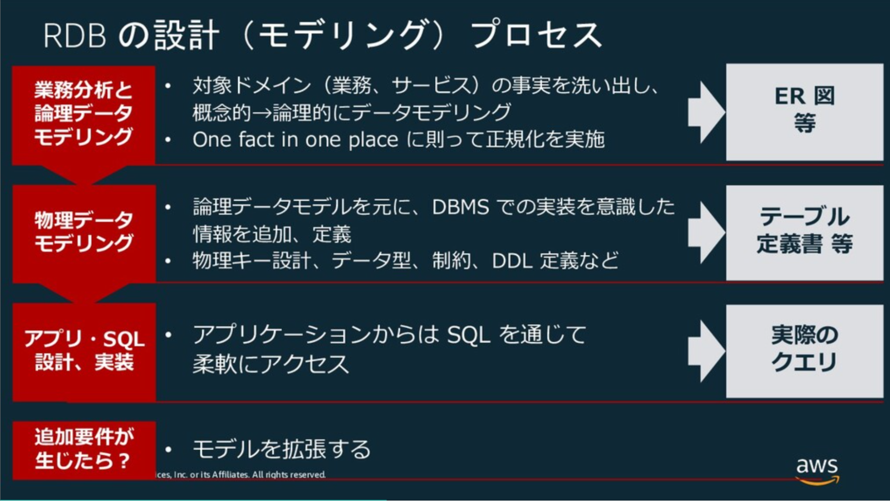
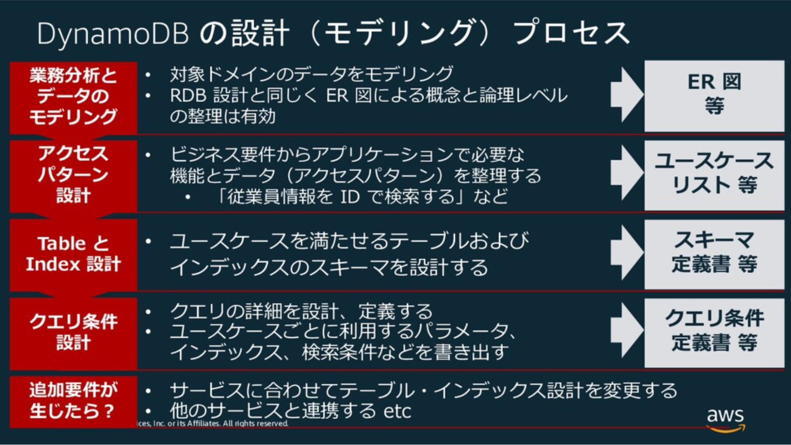
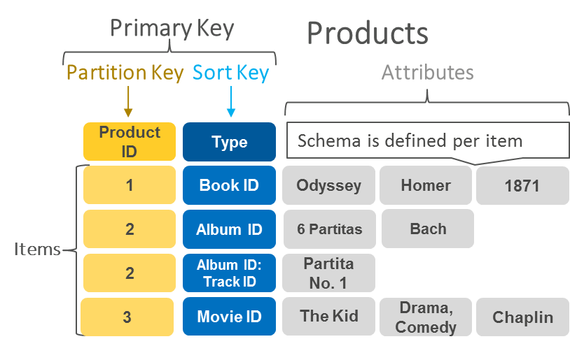
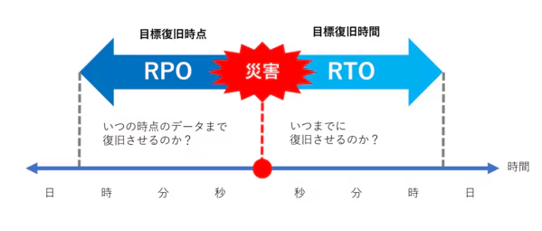
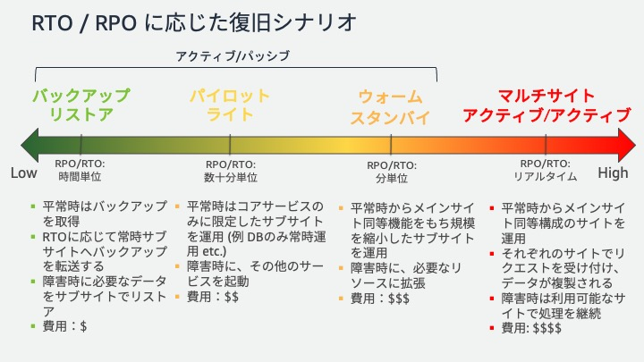

<page-title/>

本ガイドラインは、世の中のシステム開発プロジェクトのために無償で提供する。ただし、掲載内容および利用に際して発生した問題、それに伴う損害については、フューチャー株式会社は一切の責務を負わないものとする。また、掲載している情報は予告なく変更する場合があるため、あらかじめご了承ください。

::: warning 免責事項: 有志で作成したドキュメントである

- フューチャーには多様なプロジェクトが存在し、それぞれの状況に合わせて工夫された開発プロセスや高度な開発支援環境が存在する。本ガイドラインはフューチャーの全ての部署／プロジェクトで適用されているわけではなく、有志が観点を持ち寄って新たに整理したものである
- 相容れない部分があればその領域を書き換えて利用することを想定している
  - プロジェクト固有の背景や要件への配慮は、ガイドライン利用者が最終的に判断すること
- 本ガイドラインに必ず従うことは求めておらず、設計案の提示と、それらの評価観点を利用者に提供することを主目的としている

:::

# はじめに

AWS が提供するフルマネージドな NoSQLデータベースサービスである、DynamoDBの技術選定・命名・データモデリング・パーティショニング・性能・費用・監視・運用・セキュリティなどの考慮すべき設計事項と推奨案をまとめる。

## 適用範囲

DynamoDB を利用してシステムを構築する全てのエンジニアおよびアーキテクトを対象とする。業務システムの開発を想定しており、開発スピードの優先度が高いPoCや、学習目的の趣味の開発は除く。数名以上の開発チームがあり、運用保守まで見据え、安定して動作することが求められるとする。

対象外となる事項は以下の通り。

- DynamoDB の詳細なAPIリファレンスや具体的なコーディング実装例を網羅するものではない。それらについては、AWS公式ドキュメントや各プログラミング言語のSDKドキュメントを参照すること
- DynamoDBをセッションストレージのような、限定的な用途で使うようなケース。本ガイドラインの内容も参考になると思うが、要件に対して過剰な設計になる可能性がある
- 特定のビジネス領域やアプリケーション固有の要件に特化した設計判断については、本ガイドラインの原則を踏まえつつ、各プロジェクトで個別検討すること
- DynamoDBを利用する前提として、AWSそのものの命名や設計が必要になる。[AWSインフラ命名規約](https://future-architect.github.io/coding-standards/documents/forAWSResource/AWS%E3%82%A4%E3%83%B3%E3%83%95%E3%83%A9%E3%83%AA%E3%82%BD%E3%83%BC%E3%82%B9%E5%91%BD%E5%90%8D%E8%A6%8F%E7%B4%84.html) や[AWS設計ガイドライン](https://future-architect.github.io/arch-guidelines/documents/forAWS/aws_guidelines.html) を参考にすること
- インフラ構築はTerraformなどのプロビジョニングツールの利用を推奨する。[Terraform設計ガイドライン](https://future-architect.github.io/arch-guidelines/documents/forTerraform/terraform_guidelines.html) を参考にすること

## 用語

- **読み込みキャパシティユニット（RCU）**: 1秒あたりに読み込み可能なデータ量の単位
- **書き込みキャパシティユニット（WCU）**: 1秒あたりに書き込み可能なデータ量の単位
- **カバードクエリ**: クエリ対象のすべての属性がインデックスに射影（プロジェクション）されており、テーブル本体への読み込み無しで結果を返せるクエリ
- **TTL (Time To Live)**: アイテムに有効期限のタイムスタンプを設定し、期限が切れたアイテムを自動的にテーブルから削除する機能
- **未処理のアイテム (UnprocessedItems)**: BatchGetItemやBatchWriteItemなどのバッチ処理で、プロビジョニングされたスループットの不足などにより、処理しきれなかったアイテム
- **条件付き書き込み (Conditional Writes)**: 特定の条件が満たされた場合にのみ書き込み操作を実行する仕組み
- **冪等性**: 同じ処理を複数回実行しても、結果が常に同じになる性質
- **DLQ (デッドレターキュー)**: 処理に失敗したメッセージやイベントを隔離するためのキュー

# DynamoDB選定

DynamoDBは、フルマネージドで高い拡張性を持つ反面、性能を最大化するために機能が意図的に絞り込まれており、RDBMSとは全く異なるクセの強い特性を持つ。技術選定ではそれらを理解した上での、慎重な判断が求められる。

DynamoDBとRDBMSの特性や用途は以下の通り。

- **DynamoDBの特性と用途**
  - 予測可能なアクセスパターンに対して、大規模なトラフィックでも安定した低遅延を提供できる
  - ECのカート、IoTのデータ収集など、シンプルなキーで高速に読み書きする要件がビジネス価値に直結する用途に向く。性能と拡張性を最大化するために、クエリの柔軟性を犠牲にしているとも言える
- **RDBMSの特性と用途**
  - SQLによるクエリの柔軟性と、厳格なトランザクションによる一貫性に強みを持つRDBMS（Amazon Aurora PostgreSQLなど）は、データの関連性が複雑な業務システムや、多角的なデータ分析・集計が求められる要件に向く
  - 正規化されたデータモデルとJOINは、将来の未知の要求に対する変化対応力を担保する

推奨は以下の通り。

- 以下のいずれかの要件に該当する場合、それはDynamoDBの採用のノックアウト要件である。そのため、原則、RDBMSを選択または併用を検討する
  1. 将来にわたる全てのアクセスパターンを、設計段階で定義できない場合。ビジネス要件の変更に伴い、未知の検索・集計要件が発生する可能性が高いシステムの場合、途方もない開発/運用コスト、インフラ費用がかかり技術的負債となる
     - S3 Export \+ Athenaで緩和も可能だが、リアルタイム性はなく、データ転送やクエリ実行にもコストと手間がかかる点は変わらない
  2. BIツールやデータサイエンティストによるアドホックなクエリ要求や、エンドユーザーによる組み合わせの検索条件が求められる場合。GSIなどでカバーできる範囲もあるが、結果整合性であるため一貫性での課題もあり、SQLを利用できるRDBMS優位
  3. 複数のデータ集約をまたがる、厳格な一貫性が求められるアトミックな操作が必要な場合。DynamoDBもトランザクションはあるが、最大100アイテムという制限がある。また、RDBMSのような悲観的ロック（行ロック）とは異なり、競合発生時のエラーハンドリングがアプリケーション側に求められる

::: tip 適材適所で判断する  
システムの全てのデータストアを単一技術で統一する必要はない。コアとなるSoR（System of Record）はRDBMS、キャッシュはDynamoDBといったように、機能要件ごとに最適なデータストアを組み合わせる、ポリグロットパーシステンスは常に考慮に入れる。  
:::

::: tip 迷ったらRDBMSを選定する  
技術選定で確信が持てない場合、特に業務システムにおいては、まずRDBMSで実現できないかを検討すると安全である。DynamoDBは「RDBMSでは解決できない明確な課題（特に拡張性や遅延）」が存在する場合に採用を検討する、という判断手順が良い。  
:::

::: tip DynamoDBとAuroraとの併用の是非  
大量のINSERT/UPDATEが発生するというユースケース（ECや証券など）でAurora（PostgreSQL） 側の負荷軽減のため、DynamoDBでリクエストを受け止めDynamoDB StreamsなどでAuroraに反映するシステム構成を考えたい場合があるが、この場合も安易にDynamoDBの導入は行わない方が良い。

例えば、過去のプロジェクトでは、適切なインスタンスサイズとクエリチューニングを前提として、秒間700トランザアクション（1トランザクションあたり3SQL程度）をAurora（PostgreSQL）で処理できた実績もある。高負荷を理由に単純にDynamoDBを導入するのではなく、まずはRDBMSで対応可能かを見極めるべきである。構成をシンプルにすることで、相当量の設計開発/運用コストを減らせるためである。負荷軽減を目的に部分的なDynamoDB導入を検討する場合は、負荷試験などを通して必要性を慎重に見極めるべきである。

注意点を紹介する。

- DynamoDBとAurora間でデータ反映が非同期（結果整合性）となるため、遅延や障害時にデータ不整合となるリスクを内包する。例えば、在庫数といったDynamoDBとAurora間で強い一貫性が求められるような業務特性へフィットさせることが難しい
- NoSQLとRDBのデータモデルの差異や実装上の課題は多い。特に、倉庫在庫棚卸しのような絶対値での在庫数を洗替する処理などで、RDB側に加えられた大量のレコード更新を、DynamoDB側へ反映させるような双方向同期の要件がある場合は、データ整合性の担保が難しいため適さない

なお、DynamoDBを ”正” としてメインのデータストアとして導入する場合は、こうしたデータ整合性の問題が発生しないため、この限りではない。  
:::

# 命名規則

DynamoDBの命名規則は、AWSリソース全般の命名規約と、データ属性に関する2つの側面から定義する。

- テーブルやインデックスといったAWSリソース: [AWSインフラ命名規約](https://future-architect.github.io/coding-standards/documents/forAWSResource/AWS%E3%82%A4%E3%83%B3%E3%83%95%E3%83%A9%E3%83%AA%E3%82%BD%E3%83%BC%E3%82%B9%E5%91%BD%E5%90%8D%E8%A6%8F%E7%B4%84.html) に準拠し、リソースの役割と環境を明確に識別できるようにする。
- アイテムの属性: [PostgreSQL設計ガイドライン](/documents/forDB/postgresql_guidelines.html) の命名規約を適用する。これにより、データモデルの可読性と一貫性を担保する。

この2つを組み合わせることで、インフラ層からデータ層まで一貫した思想に基づいた命名を実現する。

推奨は以下の通り。

- テーブル名
  - 「AWSインフラ命名規約」に準拠する。基本的なフォーマットと例は以下の通り。単語の区切り文字はハイフン(`-`)とする。

```sh
{env}-{product}-{usage}

# 例1: ステージング環境のfugaプロダクトにおけるユーザーテーブル
stg-fuga-user

# 例2: 本番環境のhogeプロダクトにおけるユーザーアクセスログテーブル
prod-fuga-user-access-log
```

- 属性名
  - 「PostgreSQL設計ガイドライン」の命名規約に準拠する
  - 主要なルールをDynamoDBの文脈に合わせて適用する
  - 基本
    - `snake_case`を採用する。(例: `user_name`, `created_at`)
    - 予約語（例: key, type, size など）は避ける。やむを得ず使用する場合は式属性名で対応する。
- プライマリーキー
  - そのキーが何を示すか明確な名前をつける。(例: `user_id`, `order_id`)
- グローバルセカンダリインデックス(GSI)名
  - gsi1, gsi2, …のように、汎用的な連番で命名する。キーの属性名を組み合わせた `user_id-created_at-index`のような命名は非推奨とする
    - GSIのキー構成や射影する属性は、将来の要件変更に伴い変更される可能性があるため

::: tip 属性名の長さはアイテムの合計サイズに影響する
[DynamoDB のコストを最小限に抑える | AWS re:Post](https://repost.aws/ja/knowledge-center/dynamodb-minimize-costs) にコスト観点で、「短い属性名を使用する」というプラクティスがある。
属性名を短くするとストレージコストや、RCU/WCUを抑えることができる可能性がある。そのため、DynamoDBの公式ドキュメントの例示では `snake_case` ではなく `CamelCase` を利用することが多いと考えられる。
本ガイドラインでは、多少のコスト削減よりRDBに親しんだ開発運用者への混乱を少しでも抑えるという思想で、 `snake_case` を推奨している。
:::

# データモデリング

## 設計アプローチ

DynamoDBのスキーマレスであり、物理的なスキーマ変更自体は柔軟に行うことができる。しかし、誤った設計を行うと、ホットパーティションやScan利用が必須となり、設計が根本から破綻する可能性がある。そのためRDBMSと同レベルの、緻密な設計が求められる。

一方で、DynamoDBのデータモデリングの手順はRDBMSとは異なる。RDBMSであればデータ構造を正規化し、データ構造がビジネス要件を満たしていればクエリはSQL上の結合などで吸収できるため、柔軟性は高い。一方でDynamoDBは基本的に結合ができないため、どのようなデータアクセスが行われるかを分析し、最終的なデータ構造を決める必要がある。これは [https://www.slideshare.net/slideshow/db-20190905/171086391](https://www.slideshare.net/slideshow/db-20190905/171086391) や [DynamoDB の基礎と設計 / DynamoDB Design Practice \- Speaker Deck](https://speakerdeck.com/_kensh/dynamodb-design-practice) などAWS公式ドキュメントでも述べられている。

|      | RDBMS                                                                                                        | DynamoDB                                                                                                                 |
| :--- | :----------------------------------------------------------------------------------------------------------- | :----------------------------------------------------------------------------------------------------------------------- |
| 説明 | データの構造と正規化に重点を置いてデータモデルを設計する。その後でアプリケーション設計（クエリの作成）を行う | アプリケーションがデータをどのように利用するか、すなわち「アクセスパターン」の分析と、データモデルを同時に行う必要がある |
| 図   |                                                                          |                                                                                 |

推奨は以下の通り。

- DynamoDBのデータモデリング設計手順は、公式のモデリングプロセスに従い、下表のようなツールを利用する

| ステップ                                            | 成果物                                         | 利用ツール例                   |
| :-------------------------------------------------- | :--------------------------------------------- | :----------------------------- |
| ①対象業務領域のデータモデリング                     | ERD                                            | A5:SQL Mk-2など                |
| ②ユースケースとそれぞれのアクセスパターンの洗い出し | 業務（ユースケース）一覧、機能一覧、基本設計書 | スプレッドシート、Markdownなど |
| ③スキーマ設計                                       | テーブル定義書、インデックス定義書             | Markdownなど                   |

- 一般的に、③のスキーマ設計は②のユースケースが分かるまで開始すべきではない。①までに留めておく必要がある。もし、ユースケースが不明瞭である場合は、DynamoDBだけではなく、RDBMSへの切り替えや併用を検討する
- AWSが推奨する、クエリ条件設計は、少なくとも条件付き更新/トランザクションが求められる、特殊なアクセスパターンに絞って確実に実施する
- ユースケース一覧は、下記Tipsの内容を参考にした形式とする

::: tip IoTメーターのデータモデリング例

①のモデリング結果から、以下の3テーブルが存在するとする。

| テーブル名          | 用途                                                   | プライマリーキー   | ソートキー                           | 属性例                                                                            |
| :------------------ | :----------------------------------------------------- | :----------------- | :----------------------------------- | :-------------------------------------------------------------------------------- |
| MeterMeasurements   | 各種メーターから定期的に送信される時系列の測定値を保存 | MeterID (例: 001\) | Timestamp (例: YYYY-MM-DDTHH:MM:SSZ) | MeterType (ELECTRIC, WATER, GAS), Value（想定値）, Unit（単位）                   |
| MeterStatus         | メーターの最新の状態情報を保存                         | MeterID            | CurrentStatus (固定値 CURRENT)       | MeterType (ELECTRIC, WATER, GAS), BatteryLevel, CommunicationStatus, WarningFlags |
| MeterConfigurations | 各種メーターの設定変更の履歴を保存                     | MeterID            | Timestamp (例: YYYY-MM-DDTHH:MM:SSZ) | MeterType (ELECTRIC, WATER, GAS), ParameterName, NewValue, AppliedBy              |

②のアクセスパターンの洗い出しは以下のように一覧化することを指す（※ユースケースは、ID管理した方が良い）。もちろん、1つのユースケースで複数のテーブルにアクセスすることもありえる。

| ユースケース                             | 対象テーブル        | アクセスキー                                 | CRUD |
| :--------------------------------------- | :------------------ | :------------------------------------------- | :--- |
| 最新状況（測定値、メーター状態）の取得   | MeterMeasurements   | MeterID、Timestamp (降順ソート、Limit: 1\)   | R    |
|                                          | MeterStatus         | MeterID、CurrentStatus                       | R    |
| 期間指定で測定値の取得                   | MeterMeasurements   | MeterID、Timestampの範囲                     | R    |
| 設定変更履歴の取得                       | MeterConfigurations | MeterID、Timestampの範囲またはプレフィックス | R    |
| 特定のステータスを持つメーターの一覧取得 | MeterStatus         | StatusType、StatusValue (例: BATTERY\#LOW)   | R    |
| メーターの設定変更                       | MeterConfigurations | MeterID、Timestamp                           | C    |

:::

::: info 参考

- [DynamoDB 用の NoSQL](https://docs.aws.amazon.com/ja_jp/amazondynamodb/latest/developerguide/bp-general-nosql-design.html)
- [DynamoDB でリレーショナルデータをモデル化するための最初のステップ](https://docs.aws.amazon.com/ja_jp/amazondynamodb/latest/developerguide/bp-modeling-nosql.html)
- [DynamoDB でリレーショナルデータをモデル化する例](https://docs.aws.amazon.com/ja_jp/amazondynamodb/latest/developerguide/bp-modeling-nosql-B.html)
- [DynamoDB で時系列データを処理するベストプラクティス。](https://docs.aws.amazon.com/ja_jp/amazondynamodb/latest/developerguide/bp-time-series.html)
- [\[レポート\]DynamoDBデータモデリング (CMY304) \#reinvent | DevelopersIO](https://dev.classmethod.jp/articles/dynamodb-data-modeling-cmy304/#%E3%83%87%E3%83%BC%E3%82%BF%E3%83%A2%E3%83%87%E3%83%AA%E3%83%B3%E3%82%B0%E4%BE%8B)
- [DynamoDBのテーブル設計に最適！NoSQL WorkbenchのData modelerで今度こそDynamoDBを使いこなす！ | DevelopersIO](https://dev.classmethod.jp/articles/dynamodb-nosql-workbench-datamodeling/)

:::

## シングルテーブル/マルチテーブル

シングルテーブル設計とは、RDBMSのようにエンティティごと（例: Users, Orders, Products）にテーブルを分割するのではなく、関連する複数のエンティティを1つのテーブルに格納する設計方法である。これにより、「隣接リストパターン」などのテクニックを用いて、RDBのJOINのように1回のQuery呼び出しで、例えばユーザーとその注文履歴をまとめて取得するといった処理が可能になった。

この設計パターンが広まった背景には、過去のDynamoDBが持っていた以下のような制約がある。

- 過去はオンデマンドキャパシティモードが存在せず、プロビジョニングモードのみだった
  - テーブルを細かく分割すると、アクセス頻度の低いテーブルでも最低限のRCU/WCUを確保する必要があり、無駄なコストが発生しがちであった。また、各テーブルのアクセスパターンは異なるため、個別にピーク性能を予測してプロビジョニングするのは困難だった
  - シングルテーブルでテーブルを集約することで、RCU/WCUを共有、平準化できるというメリットがあった
- 過去、1つのAWSアカウント・リージョンで作成できるテーブル数に256個の上限があった
  - 今のようにAWSアカウントを用途ごとに分割することも少なかったので、よりテーブル数を節約する必要があった

現在では、オンデマンドモードの登場とテーブル数上限の変更（2500個まで）により、上記の制約は大きく緩和された。そのため、シングルテーブルを積極的に推す理由は減り、プロダクト特性で2つのパターンを使い分ける時代になっている。

| 観点                      | シングルテーブル設計                                                           | マルチテーブル設計                                                                         |
| :------------------------ | :----------------------------------------------------------------------------- | :----------------------------------------------------------------------------------------- |
| 学習コスト                | ❌RDBMSと概念の乖離が大きい                                                    | ✅ エンティティごとにテーブルが分かれており、理解しやすい                                  |
| GSI設計                   | ⚠️上限20に近づきやすい傾向                                                     | ✅️個別最適な設計が可能                                                                    |
| 性能                      | ✅関連データを1回のクエリで取得可能なため、高い                                | ⚠️複数のエンティティ取得には、複数のAPIコールが必要                                        |
| キャパシティ ユニット調整 | ✅️一律のプロビジョニングが可能                                                | ✅️あるエンティティのみプロビジョニングモードで動かすなど、柔軟な対応が可能                |
| セキュリティ              | ⚠️IAMポリシーでのアクセス制御が複雑となる                                      | ✅テーブル単位でのIAMポリシー設定が容易                                                    |
| 拡張性                    | ❌新しいエンティティ追加に対して、大規模なデータ移行が必要になる場合もありえる | ✅新しいエンティティはテーブル追加であり、既存影響はない                                   |
| バックアップ              | ⚠️バックアップはAll or Nothingになる。特定のエンティティだけを対象にできない   | ✅エンティティ単位でのバックアップやPITR（ポイントインタイムリカバリ）が可能               |
| OLAP連携（ScanやExport）  | ⚠️テーブル全体になるため、余計なレコードが入る場合があり非効率                 | ✅️エンティティ単位で可能                                                                  |
| 費用分析                  | ⚠️各エンティティの費用内訳が不明瞭                                             | ✅テーブル単位で費用が明確に分離され、分析が容易                                           |
| テーブルクラス            | ⚠️エンティティごとの使い分けが不可                                             | ⚠️アクセス頻度が低い場合に、低頻度アクセスストレージクラスを有効にするといった最適化が可能 |
| 監視                      | ✅️メトリクスなどの作成数を抑えられる                                          | ⚠️エンティティ単位でメトリクスなどを作成、費用増加要因にはなる                             |

また、シングルテーブル設計において1Queryで取得できるというのも、BatchGetItemsを用いれば1リクエストかつRCUも同等である。シングルテーブル設計では、キーにプレフィックスを付与して区別するため容量増加になり、GSIなどの余計なRCU/WCUが発生しうることを考慮すると、費用面でプラスになるとは一律に言い難くなっている。

推奨は以下の通り。

- マルチテーブル設計を第一に検討する
  - 開発速度、メンテナンス性、学習コストの観点が理由。特に顧客説明、新規参画者へのオンボーディング、引き継ぎ時などで大きなコストが発生する
  - ドキュメントを詳しく作成したとしても、理解できない・とても苦しむ人が出てきて大変になるため
- 以下のように尖った要件を満たす必要がある場合のみ、シングルテーブル設計を検討する
  - 超低レイテンシが必須のシステム: 広告配信やリアルタイムゲームのバックエンドなど、リクエストのたびに複数のエンティティをミリ秒単位で取得する必要がある。
- シングルテーブルを採用する場合も、全てを1テーブルに集約するのではなく、必要最小限の数に留める

::: tip 隣接リストデザインパターン  
シングルテーブル設計を実現するための代表的なテクニック。1つのテーブル内でエンティティ間の階層関係（1対多）を表現し、関連データをまとめて取得するために使われます。  
:::

::: info 参考

- [AWS Week in Review – 2022 年 3 月 14 日 | Amazon Web Services](https://aws.amazon.com/jp/blogs/news/aws-week-in-review-march-14-2022/)
- [DynamoDB のデータモデリングの基盤](https://docs.aws.amazon.com/ja_jp/amazondynamodb/latest/developerguide/data-modeling-foundations.html)
- [Amazon DynamoDB におけるシングルテーブル vs マルチテーブル設計 | Amazon Web Services ブログ](https://aws.amazon.com/jp/blogs/news/single-table-vs-multi-table-design-in-amazon-dynamodb/)
- [https://pages.awscloud.com/rs/112-TZM-766/images/DOL_09_AWSSummit_JP_2024.pdf?version=0](https://pages.awscloud.com/rs/112-TZM-766/images/DOL_09_AWSSummit_JP_2024.pdf?version=0)
- [DynamoDB、シングルテーブルにするか否か \- maybe daily dev notes](https://tmokmss.hatenablog.com/entry/20220528/1653672966)
- [AWS DynamoDB: シングルテーブル設計 vs マルチテーブル設計 \- Qiita](https://qiita.com/kazuya-sugawara/items/4f1c1d3147e82f9829ac)
- [DynamoDBのシングルテーブル設計：現実解 \- Momento](https://www.gomomento.com/jp/resources/blog-jp/single-table-design-for-dynamodb-the-reality/)

:::

## プライマリーキーの設計

DynamoDBのプライマリーキーには以下の2パターンが存在する。

- 「パーティションキー（PK）」のみの単一のキー
  - 以前は、ハッシュキーと呼ばれた
  - DynamoDBの物理的なパーティションのどこに保存されるかを決定するキー。負荷分散の要になるため、各パーティションへのアクセスが均一になるように設計する
  - パーティションキーのみで一意である必要がある
- 「パーティションキー」と「ソートキー（SK）」の複合キー
  - パーティションキーとソートキーで一意である必要がある
  - RDBMSと異なり、3つ以上のキーは指定できない。その場合は `#` などで文字列連結したキーを独自に作成することとなる

どちらの場合も、パーティションキーによって実データが複数ノードに分散される。アクセスが特定のパーティションキーに集中すると性能ネックになるため、カーディナリティが高いキーを選定する必要がある。

推奨は以下の通り。

- 基本的に、複合キーを積極的に活用する。特に時系列データにはPKにID、SKにタイムスタンプを指定すると良い
  - Queryにより、同一パーティションキー内でソートキーの範囲を指定（例：特定の日時以降のデータを取得）するなど、効果的な検索が可能となる
- 連番をパーティションキーにする場合、性能劣化に注意する
  - 単調増加の連番の場合、同一パーティションに書き込まれる傾向がある。もし、これをキーにする場合は処理性能が要件を満たすか確認する
- タイムスタンプを利用する場合は、ソートキーにISO 8601形式（YYYY-MM-DDTHH:MM:SSZ）を使用する
  - 形式やタイムゾーンも、システムで固定する（検索ミスを無くすため）
  - UNIXタイムスタンプより可読性が高く、またBetweenなどのクエリ条件も直感的に指定しやすいため
- 数値をソートキーにする場合、数値型と文字列型の特性を理解して選択する
  - 数値型はBETWEEN や \>, \< といった比較演算子 など、範囲指定する場合にマッチする
  - 文字列型で大小関係を維持したい場合は0埋め（例："01", "02", "10"）する必要がある。ステータスコードのような固定長の区分値は、文字列型で管理することが望ましい
- 3項目以上の複合キーにする場合は、ソートキー側を文字列連結することを第一に考える
  - パーティションキーは必ず特定する必要があるため（特定できない場合は、テーブルフルScanになるため）
  - ソートキーを \[属性1\]\#\[属性2\] のように連結しておけば、begins_with 演算子を利用して前方一致での柔軟な検索が可能になるため

::: tip パーティションキーやソートキーには、List・Map・Set型は利用できない  
プライマリーキーやインデックスのキーにはプリミティブなデータ型（Number, String, Binary）のみサポートしている。これらのコレクションはLSI、GSIのキー属性で利用できない。
:::

::: info 参考  
PK、SKなどの関係性は、 [【AWS Database Blog】DynamoDB におけるパーティションキー設計の手引き](https://aws.typepad.com/sajp/2017/02/choosing-the-right-dynamodb-partition-key.html) にある図が分かりやすい。  

:::

# インデックス設計

## インデックスの使い分け

DynamoDBのインデックスは、ローカルセカンダリインデックス（LSI）とグローバルセカンダリインデックス（GSI）の2種類がある。

| \#                   | GSI                                                                                   | LSI                                                             |
| :------------------- | :------------------------------------------------------------------------------------ | :-------------------------------------------------------------- |
| プライマリーキー     | ベーステーブルとは異なるPKとSKを持つことが可能                                        | ベーステーブルと同じPKである必要があるが、異なるSKにはできる    |
| 作成数               | 1テーブルあたり20まで作成可能                                                         | 1テーブルあたり5まで作成可能                                    |
| 変更/削除            | テーブル作成後も変更・削除が可能                                                      | **テーブル作成時にのみ定義可能、後からの変更削除は不可**        |
| 整合性               | 結果整合性（反映は非同期。PutItem後にGSIに対してGet/Queryすると未反映の可能性がある） | 強い整合性（同期的に反映される）                                |
| キャパシティ         | ベーステーブルとは独立したRCU/WCUを消費する                                           | ベーステーブルのRCU/WCUを共有する                               |
| スパースインデックス | 利用可能                                                                              | 利用可能（LSIのSK属性を持たない項目はインデックスに含まれない） |
| サイズ制限           | 制限なし                                                                              | パーティションキーごとに10GBまで                                |

LSIとGSIのどちらを活用するべきかという議論はよく発生する。

推奨は以下の通り。

- 原則、GSIの利用を第一に検討する
  - 後から自由に追加・削除できるため（多少ではあるが）設計上の柔軟性を確保できるため
  - データ反映に遅延が生じる（結果整合性）になるが、完全にそれらを許容できない場合はDynamoDBをそもそも選択すべきではないため
- LSIは以下の条件を全て満たす場合に利用する
  - 条件
    - 強い整合性が必要である
    - ベーステーブルと同じパーティションキーに対するクエリである
    - ベーステーブルとは異なるソート順が必要である
  - 例
    - 「あるユーザーの注文履歴を、注文日ではなく配送状況でソートしたい。データ登録後すぐに検索するユースケースがある」など
  - LSIはテーブル初期構築時のみでしか定義できないため、将来のクエリ要件を全て把握する必要がある点に注意する
- GSIの利用数は、費用の観点からなるべく絞るように設計する
  - 将来使うかもしれない、という曖昧な理由でインデックスを作成しない。 必要になった時点で（GSIであれば）追加する
- GSIのスパースインデックスは利用が可能であれば、積極的に活用する
  - 費用、性能面で有利であるため
- GSIオーバーロード
  - マルチテーブルの設計を推奨しているため、原則、利用しない

::: tip スパースインデックスとは  
インデックスキーとして定義した属性が存在しない場合、その項目はインデックスの対象外となり、インデックスが作成されなくなる。これを利用して、意図的に「特定のステータスを持つアイテム」や「フラグが立っているアイテム」だけをインデックス化する手法が「スパースインデックス」である。例えば、OrderStatusが 'PENDING' の項目のみを検索したい場合、処理が完了したアイテムからOrderStatus属性自体を削除する。これにより、GSIには'PENDING'のアイテムのみが含まれることになり、インデックスが非常に小さく（スパースに）なる。

参考: [スパースインデックスの利用 \- Amazon DynamoDB](https://docs.aws.amazon.com/ja_jp/amazondynamodb/latest/developerguide/bp-indexes-general-sparse-indexes.html)  
:::

::: warning GSIはnullにするとエラーになる件  
GSIのプライマリーキー（PK/SK）に設定する属性には、Null型や空のバイナリ/文字列を設定することはできない（実行時に、ValidationExceptionエラーになる）。スパースインデックスを実現したい場合は、Nullをセットするのではなく、アイテムからその属性自体を含めない（削除する）必要がある。  
:::

::: info 参考  
[DynamoDB のセカンダリインデックスの一般的なガイドライン](https://docs.aws.amazon.com/ja_jp/amazondynamodb/latest/developerguide/bp-indexes-general.html)  
:::

## 複合キー

複数の属性値を特定の区切り文字（例: \#）で連結し、単一の文字列としてPKやSKに格納する設計パターンは、DynamoDBでは複合キーやコンポジットキーと呼ばれる。RDBMSではまずお目にかかれないが、DynamoDB界隈では一般的である。基本的にはPKは完全一致が必要であるため、SK側を複合キーにし、範囲検索に対応したり、1つのインデックスで複数の属性に対する絞り込みやソートを表現し、GSIの数を減らすことができる。

説明のため、ECサイトの注文 (Orders) テーブルのクエリ要件の例と設計案を紹介する。

1. あるユーザー (UserID) の注文を、ステータス (OrderStatus) で絞り込み、日付 (OrderDate) 順に取得したい
2. あるステータス (OrderStatus) の全注文を、日付 (OrderDate) 順に取得したい

それぞれの設計例を示す。

| \#       | 要件1の設計案                                                                | 要件2の設計案                                                                                                                              |
| :------- | :--------------------------------------------------------------------------- | :----------------------------------------------------------------------------------------------------------------------------------------- |
| GSI PK   | UserID                                                                       | OrderStatus                                                                                                                                |
| GSI SK   | OrderStatus\#OrderDate                                                       | OrderDate                                                                                                                                  |
| クエリ例 | PK \= 'user-123' AND\<br\>SK begins_with 'SHIPPING_PENDING\#'                | PK \= 'COMPLETED' AND\<br\>SK between '2025-08-01' AND '2025-08-31'                                                                        |
| メモ     | 特定ユーザーに紐づくデータを、ステータスで絞り込み日付順に効率よく取得できる | ユーザーを横断して、特定のステータスのデータを効率よく取得できる。<br>ただし、IDを追加の検索条件にするとFilterExpressionとなり、効率は低下 |

推奨は以下の通り。

- 区切り文字は `#` を利用する
- フォーマットを統一する
  - 日付はISO 8601形式にする
  - 数値は原則、ゼロ埋めで固定長にする。複合キーの場合は数値の属性も必ず文字列型になるため
- 複合キーを作る場合も、単体の属性も項目として定義する
  - フィルター条件などで利用する可能性があるためや、S3出力時の分析性を高めるため
- データモデルではなく、クエリファーストで設計する
  - ユースケースに紐づくクエリを実現するために、PKとSKの構造を逆引き的に考える設計アプローチを遵守する
- SKの複合化を第一に検討する
  - PKはアクセスパターンのグルーピング単位としてシンプルに保ち、SKで階層的な絞り込みを行うことで、理解のしやすさを維持する
  - 要件1の設計案（`PK=UserID`, `SK=OrderStatus#OrderDate`）はこの典型例
- PKの複合化は、検索条件がセットで必須の場合に限定する
  - PKの場合は完全一致が原則であり、複合化する場合はそれぞれのキーが常にセットで必須入力であることを確認する
- 汎用GSI（Overloading）は利用しない
  - `GSI1_PK` のような汎用的なキー名を用意し、格納する値の種類を動的に変えることで、1つのGSIで多種多様なクエリを捌く最適化パターンもある。しかし、設計とアプリケーションロジックが極めて複雑になり可読性・保守性が低下するため、避けるべきである。顧客説明や引き継ぎが難しく、技術的な負債になる

::: info 参考  
[DynamoDB テーブルの複合キーを作成するためのベストプラクティス | AWS re:Post](https://repost.aws/ja/knowledge-center/dynamodb-create-composite-key)  
:::

## インデックスの射影（プロジェクション）

インデックスの射影（Projection）とは、GSI/LSIにベーステーブルのどの属性をコピーして含めるかを定義する設定である。適切な設定により、クエリ応答速度や費用削減に繋げることができる。

設定は以下3種類から選択できる。

| \#                 | KEYS_ONLY                                                                        | INCLUDE                                                                      | ALL                                                                              |
| :----------------- | :------------------------------------------------------------------------------- | :--------------------------------------------------------------------------- | :------------------------------------------------------------------------------- |
| 説明               | インデックスキーとベーステーブルのPKのみを射影する                               | キー属性に加え、指定した一部の属性を射影する                                 | ベーステーブルの全属性を射影する                                                 |
| ストレージ費用     | ✅インデックス自身のキー情報のみを保持するため最小                               | ⚠️設定次第で増加                                                             | ❌テーブルの完全な複製に近いため、最大                                           |
| 書き込み費用 (WCU) | ✅インデックスキーが更新されない限り、WCU消費は発生しない                        | ⚠️射影した属性が更新された場合に追加のWCUを消費する                          | ❌ベーステーブルのどの属性が更新されてもインデックスの書き込みが発生             |
| 読み込み費用 (RCU) | ❌ほとんどのケースでカバードクエリにならず、ベーステーブルへの追加読み込みが必須 | ✅カバードクエリを実現することで、高性能かつRCU消費も最適化できる            | ✅常にカバードクエリとなり、追加読み込みが一切発生しないため、読み込み性能は最高 |
| 柔軟性             | ❌クエリで必要な属性が少しでも増えると、すぐに性能問題に直面しやすい             | ⚠️事前にクエリパターンを分析する必要があるが、変更も射影属性を追加で対応可能 | ✅クエリ要件の変更に非常に強い                                                   |

KEYS_ONLYからINCLUDEのように、射影タイプ自体を変更することはできない。INCLUDEにした場合に、作成済みのGSIに対して、INCLUDEで含める属性を後から追加したり、削除することはできる。

推奨は以下の通り。

- 原則、INCLUDE の採用を第一に検討する
  - クエリパターンを分析し、必要最小限の属性をINCLUDEで射影し、インデックスへのクエリだけで処理が完結する「カバードクエリ」を実現し、性能向上とRCU消費の抑制を目指す
- GSIの設計時には、そのGSIが「どのクエリに使われることを意図しているか」の設計意図を明示的に定義し、ドキュメント化する
  - 意図しないユースケースでの利用を検知する
- GSIを利用する側のアプリケーションコードでは、必ず`ProjectionExpression`を使用して、実際に利用する属性のみを明示的に取得する
  - 将来インデックスの射影属性が変更されても、アプリケーションが意図せず大きなペイロードを受け取ることを防ぐことができる
- 新しい検索要件（異なる属性セットが必要）が出てきた場合は、既存のGSIの射影属性の追加で対応できないか検討する
- KEYS_ONLY を採用するケース
  - インデックスの目的が「特定のアイテムの存在確認」や「プライマリーキーのリスト取得」のみで、それ以外の属性は不要な場合に採用する
  - 例: 「特定のステータスを持つ注文IDの一覧だけが欲しい」といったユースケース
- ALL は原則、採用しない
  - ALLはコストインパクトが非常に大きいため
  - 許容されるケースは以下を総合的に判断となるが、アーキテクトによる個別レビューと承認を必須とする
    - アイテムのサイズが非常に小さい
    - 読み込みパフォーマンスが極めて重要で、書き込み頻度が低いテーブル
    - 射影する属性の数が多く、INCLUDEで個別に指定するのが煩雑な場合

::: tip 一律ALLにするという選択肢  
KEY_ONLYやINCLUDEの射影にした場合、RDBMSとのメンタルモデルとは乖離が大きくアプリ開発者が混乱することも多い。例えば、DynamoDBで属性追加になった場合、GSI経由で取得する場合はその属性がINCLUDEの射影対象に入っていないため、取得不可といった事象にハマることが多い。そのため、費用を犠牲にしてでも一律ALLで倒すという設計判断もありえる。実際、複数のプロジェクトでALLに寄せた設計を採用した実績がある。  
なお、システム共通項目だけ取り除き、残りの全属性をINCLUDE対象にするという方針も考えられるが、これは項目追加時に、INCLUDE側の属性に追加することが忘れやすいというデメリットがありオススメしない。INCLUDE設定で、明示的に項目除外設定ができれば嬉しいが、そういったオプションは存在しない。  
:::

## データ型

DynamoDBはテーブルの属性に対して、様々なデータ型がサポートされている。

| 分類         | データ型   | 型番   | 説明                                                                                               |
| :----------- | :--------- | :----- | :------------------------------------------------------------------------------------------------- |
| スカラー     | String     | `S`    | プライマリーキー（PK/SK）、複合キー、ステータス、名前、日付（ISO 8601形式）など                    |
|              | Number     | `N`    | 価格、数量、スコア、Unixエポック秒、アトミックカウンターなど                                       |
|              | Boolean    | `BOOL` | `true`または`false`の2値状態を表現。フラグなど                                                     |
|              | Binary     | `B`    | バイナリデータ（小さな画像、圧縮データなど）                                                       |
|              | Null       | `NULL` | スパースインデックスを作成する際などに利用                                                         |
| ドキュメント | List       | `L`    | リスト                                                                                             |
|              | Map        | `M`    | ネストされた属性（例: `address`マップに`zipcode`, `city`を含む）が表現できる                       |
| セット       | String Set | `SS`   | 文字列のセット。タグ、カテゴリID、関連商品IDなど、順序を問わず一意な値の集合を管理したい場合に利用 |
|              | Number Set | `NS`   | 数値のセット                                                                                       |

#### 推奨は以下の通り。

- コード、区分、UUIDはString型を用いる
  - String型は最も基本的な型であり、特に避ける理由はない
- 数量、数値、連番、金額はNumber型で保持する
  - Stringにする場合は、0埋めなど固定長にしないと比較演算子などの検索条件が指定できない。その場合、データサイズが増えメリットがない
- フラグはBoolean型を用いる
  - DynamoDBにおいては文字列の `"0"`/`"1"` を用いる意味は特にないため、直感的なBoolean型を利用することが自然
- 日付・時刻は String (ISO 8601形式) で表現する
  - DynamoDBには日付型が存在しない
  - 例: `YYYY-MM-DD` や `YYYY-MM-DDTHH:MM:SS.sssZ` (例: `2025-08-05T21:33:00.123Z`)
  - 辞書順のソートと時系列のソートが一致するため、SKとして利用しやすく可読性も高いため

- バイナリは、原則利用しない
  - サムネイル画像など、ごく小さな場合のみ許容する
  - 原則、S3にバイナリは格納し、パス情報のみを保持する（400KB制限と、ストレージコストとWCU/RCU消費を減らすため）
- TTL（Time To Live）利用の場合は、Number型を用いる
  - Unixエポック秒（秒単位）かつNumber型の属性が必要となるため
- ドキュメントやセット型の利用は、最小限に抑える
  - DynamoDBの各アイテムには400KBのサイズ上限があるため、履歴情報などを保持すると制限に引っかかる可能性がある。この場合は、SK違いで別アイテムとして格納すること
  - コレクション内の検索をKeyConditionExpressionなどで行うことはできないため（GSI化もできない。トップレベルの属性に昇格させる必要がある）
  - 検索に用いず、ユーザー設定値など固定的に書き換えできる場合のみ、List、Set、Mapを利用する

::: info 参考  
[Amazon DynamoDB でサポートされるデータ型と命名規則](https://docs.aws.amazon.com/ja_jp/amazondynamodb/latest/developerguide/HowItWorks.NamingRulesDataTypes.html)  
:::

## データの圧縮

DynamoDBアイテムのコスト削減と400KB制限の緩和を目的とした、GZIPなどを用いたデータ圧縮の技法が存在する。

圧縮を行うことで生じる、主なデメリットは以下の通り。

- 圧縮・解凍処理のため、クライアント側のCPU負荷が増加
- NW転送量は減るものの、アプリケーション側の圧縮・解凍分、レイテンシが増加する懸念
- 圧縮した属性に対して、FilterExpression などのクエリが不可となる
- AWSコンソール上などでの可読性が低下

推奨は以下の通り。

- 原則、圧縮は適用しない
  - 検索キーとしない大きな属性（ユーザーの自己紹介文や商品詳細説明など、サイズが大きいテキストデータなど）や、どうしても400KB制限の回避が必要な場合のみに限って許容する。この場合もソートキーを分けるなど、別アイテムで逃げることができないか検討する
- どうしても圧縮を行う場合は、全ての属性（あるいは全てのアイテム）に一律適用するのではなく、必要最小限に局所化する
  - 巨大データかつ検索に用いない属性に絞って行い、バイナリ（Binary）型の属性に格納する

## 共通カラム

DynamoDBの場合も、原則、[共通カラム | テーブル論理設計 | PostgreSQL設計ガイドライン](https://future-architect.github.io/arch-guidelines/documents/forDB/postgresql_guidelines.html#%E5%85%B1%E9%80%9A%E3%82%AB%E3%83%A9%E3%83%A0) に従う。ただし、patched_at, patched_by, patched_id は、データパッチ運用時に利用するものであり、アプリケーション設計からは除外する。DynamoDBはスキーマレスであるため、後から属性を追加することができる。

また、TTLを利用した改廃を行う場合は、最初から `ttl` 属性を付与しておくこと。

# API利用

主要なAPI操作に関する注意事項・推奨事項をまとめる。

## レコードの書き込み

アイテムの書き込みには、主に`PutItem`と`UpdateItem`の2つのAPIがある。

- `PutItem`: 新規作成または既存アイテムの上書き時に使用する。一部属性だけを変更する場合に、`PutItem`を使うと指定しなかった属性は削除される
- `UpdateItem`: 特定の属性を部分的に変更する際に使用する。更新対象のアイテムが存在しない場合、自動的に新規作成(Upsert)される。属性の追加、削除、値の変更、リストやマップ内の要素の操作などが可能。ADDアクションを用いることで、アトミックなカウンター操作も実現できる。複数の属性を更新したり、複雑な条件式を設定したりする場合、UpdateExpressionの記述が複雑になりがち。アイテム全体を読み込んでから書き戻す「Read-Modify-Write」サイクルをアプリケーション側で実装する必要がないため、レイテンシ向上とRCU/WCUの消費を抑えられる

推奨は以下の通り。

- `UpdateItem`で可能な更新処理の場合は、`UpdateItem`の利用を第一に考える
  - インクリメント/デクリメントなどのアトミックカウンターや、既存の属性値に基づいて更新を行う際は、競合条件の防止とパフォーマンス向上のため`GetItem`と`PutItem`を組み合わせた「Read-Modify-Write」サイクルではなく、`UpdateItem`の`ADD`や`SET`アクションを利用する
- `UpdateItem`はアイテムが存在しなかった場合に意図しないレコードが作成される可能性があるため、 `attribute_not_exists(PK)`を利用する
- アイテムを新規作成する場合や既存のアイテムを完全に新しいデータで上書きする場合にのみ`PutItem`を利用する
- 大量のデータをバッチで更新する場合は `BatchWriteItem`の利用を検討する

## 複数レコードの書き込み

DynamoDBに複数のレコードを書き込む場合、`PutItem`を繰り返し呼び出す方法と、`BatchWriteItem`を利用する方法がある。`BatchWriteItem`は一度のリクエストで最大25アイテム、かつ合計16MBまで書き込むことができ、NWラウンドトリップ数を削減することで性能向上が期待できる。`BatchWriteItem`は個々の操作に対して`ConditionExpression`（条件付き書き込み）をサポートしないため、アイテムの存在確認や特定の条件を満たす場合のみの書き込みには適さない。

BatchWriteItemを利用する場合、サイズチェックを行う必要はない。DynamoDBの各アイテムは最大400KBという制限があるため、1回の`BatchWriteItem`リクエストで送信できる最大25アイテムの合計サイズは、理論上最大10MBである。 (400KB×25 \= 10MB)。これは、APIの制限である16MBを常に下回るため、サイズ超過を心配する必要はない。

::: warning 未処理のアイテムに注意  
`BatchWriteItem` は未処理のアイテム（UnprocessedItems）を返す可能性があるため、リトライロジックを全てのバッチ呼び出しで必ず実装する。  
:::

::: warning WHERE句による一括更新の困難さ  
RDBMSでは、WHERE句を用いて特定の条件に合致する複数のレコードを一括で更新することが一般的である。しかし、DynamoDBではプライマリーキーに基づかない条件での一括更新は直接サポートされていないため、以下の手順が必要である。

1. `Scan`または`Query`で更新対象を検索し、そのプライマリーキーや属性を取得
2. 検索で得られたプライマリーキーに基づいて、各アイテムに対してUpdate、DeleteItem、BatchWriteItemなどを呼び出す

`BatchWriteItem` のバッチリクエストには `ConditionExpression` を含めることができない。そのため、もし個々のアイテムの更新に条件付きロジック（例: 「Aという値の場合のみ更新する」）が必要な場合、必要なリトライやエラーハンドリングを加えた上で UpdateItem を繰り返す必要がある。こうしたスクリプトをちょっとしたデータパッチの際にも開発する必要があり、大変である。  
:::

::: tip 条件付き書き込み (Conditional Writes)  
DynamoDBの書き込み操作（PutItem, UpdateItem, DeleteItem）では、ConditionExpressionを使用して、特定の条件が満たされた場合にのみ操作を実行する、データ一貫性を保つ仕組みがある。主なユースケースは以下がある。

- 楽観ロック
  - バージョン番号などの属性を`ConditionExpression`でチェックすることで、楽観ロックを実現する
- 新規作成の排他制御
  - アイテムが存在しない場合のみ`PutItem`を実行し、不正な上書きを防ぐ（例: `attribute_not_exists(PK)`）
- 特定のビジネスロジックに基づく書き込み制御
- 在庫数が0より大きい場合のみ`UpdateItem`で在庫を減らすといった制御
- 特定のステータス（例: 承認待ち）の場合のみ、ステータスを「承認済み」に更新するといった制御

:::

## 複数レコードの一括取得

プライマリーキーを指定できる場合は、`BatchGetItem`を利用して、異なるテーブルを含む最大100アイテムまでを、単一のリクエストで効率的に取得できる。ただし、トランザクションは保証しない。パーティションキーが指定できる場合は、`Query`も利用できる。

推奨は以下の通り。

- Queryとフィルターの組み合わせでアイテムを検索するか、プライマリーキー完全指定でBatchGetItemを利用するか選択できる場合は、よりRCUが抑えられる BatchGetItemを利用する

::: warning Scanは原則、利用しない  
Scan操作は、テーブルまたはセカンダリインデックスの全アイテムを読み込むため、非常にコストが高い。FilterExpressionを指定したとしても、Scan操作後にフィルターされるため、RCUを消費してしまう。Queryに置き換えられないかデータモデルを再検討する。Scanを許容する場合は、テーブルエクスポートなど運用目的やテーブルサイズが小さい場合にのみ許容する。もし、利用する場合はQuery同様、プロジェクション式を設定する。  
:::

::: warning ページングによる取得漏れに注意する
Query、Scanは、一度に返せる結果が1MBまでという制約がある。超過した場合は LastEvaluatedKey を使用してページング処理をクライアント側で行う必要がある。これを怠ると、データの取りこぼしがあり得るため注意する。  
:::

::: tip プロジェクション式を活用し応答に含める属性を明示的に指定する  
`Query`を用いる場合は、プロジェクション式 (`ProjectionExpression`）を使用して、必ず応答に含める属性を明示的に指定する。不要な属性の読み込みを回避し、性能向上が期待できる。ただし、RCUは返されるデータ量ではなく、アイテムサイズに基づき計算されるためRCU削減効果はない（[AWS CLIのリファレンス](https://docs.aws.amazon.com/cli/latest/reference/dynamodb/query.html#description)より）。  
::::

::: tip ソート順の指定が可能  
データの取得順序を制御したい場合、ソートキーに対してScanIndexForwardパラメータ（デフォルトはtrueで昇順、falseで降順）で指定可能である。  
:::

## 結果整合性・強力な整合性の読み込み (Consistent Reads)

DynamoDBは、デフォルトで「結果整合性読み込み（Eventually Consistent Reads）」であるため、書き込み後すぐに読み込むと変更が反映されていない場合がある。「強力な整合性読み込み（Strongly Consistent Reads）」の指定もできるが、レイテンシとRCUが増加する。

推奨は以下の通り。

- 性能・費用の観点から、「結果整合性読み込み」を第一に利用する
- 書き込み直後にその書き込み内容を確実に読み込む必要がある場合（Write-then-Readパターンなど）は、「強力な整合性読み込み」を利用する
  - 例: 在庫を更新した直後に最新の在庫数を表示する場合など、データの即時性がビジネス上のクリティカルな要件となるシナリオ
  - ただし、「結果整合性読み込み」と比較してRCUを倍消費するため、最小限の利用に留める

# DynamoDB Streams

DynamoDB Streamsとは、DynamoDBテーブル内のアイテムレベルの変更（作成、更新、削除）をキャプチャし、変更内容を起点としてストリーム処理を実装できる機能である。DynamoDB Streams利用の是非は本章では触れず、主要な設計課題について解説する。

::: info 参考  
DynamoDB Streamsの起動は、アイテムの変更であるため、属性の変更がないPutItemをしてもトリガーされない点に注意である。ストリームの再送（リプレイ）をしたい場合は、 `rerun_at:日次` などの項目を追加し、アイテムに変更を加える必要がある。

参考: [オレのDynamoDB Streamsが再着火しないわけがない | フューチャー技術ブログ](https://future-architect.github.io/articles/20210122/)  
::::

## ストリームビュータイプ

ストリームビュータイプは、DynamoDBテーブルのデータが変更された際に、ストリームレコードにどの詳細度で情報を書き込むかの設定である。次の4種類から選択する。

| 観点                 | KEYS_ONLY                                                                                                          | NEW_IMAGE                   | OLD_IMAGE                   | NEW_AND_OLD_IMAGES                                                            |
| :------------------- | :----------------------------------------------------------------------------------------------------------------- | :-------------------------- | :-------------------------- | :---------------------------------------------------------------------------- |
| 説明                 | 変更後アイテムのプライマリーキーのみ                                                                               | 変更後アイテムの全属性      | 変更前アイテムの全属性      | 変更「前と後」アイテムの全属性                                                |
| 費用                 | ⚠️下流のLambdaなどでGetItemすればベーステーブルへのRCUが別途必要で高くつく                                         | ✅️良い                     | ✅️良い                     | ✅️ペイロードが増える分、コンシューマーの実行時間がごく僅かに増える懸念はある |
| 下流ロジックの複雑さ | ❌️下流で、GetItemすればその分の複雑度は上がる。キャッシュの無効化や通知などプライマリーキーのみで良ければ問題なし | ✅️要件を満たせれば問題なし | ✅️要件を満たせれば問題なし | ✅️要件を満たせれば問題なし                                                   |
| Lambdaバッチサイズ※1 | ✅️最大化                                                                                                          | ⚠️                          | ⚠️                          | ❌️ペイロードが増える分、最も少なくなる懸念                                   |

※1 DynamoDB StreamsからLambdaを起動させる場合の、入力レコードの数（1〜10,000まで指定可能）。Lambdaの入力サイズが6MBまでであるため、DynamoDBのアイテムサイズが大きい場合は、バッチサイズが希望より小さくなるかもしれない。バッチウィンドウ、バッチサイズ、6MBのどれかの条件を満たした場合、Lambdaが起動される。

ビュータイプの途中変更は不可で、一度ストリームを無効化にして新しいストリームを作成する必要がある。この際、データ欠損が発生しうるため、ベーステーブルの更新を停止させるか、切り替え途中に発生した更新情報を何かしらの手法で救済する必要がある。

また、DynamoDB Streamsのコスト構造は以下である。

1. Lambda以外の場合は、GetRecordsによるストリーム読み込み回数に対する課金
2. DynamoDB Streamsで保有するストレージ容量に対する課金
3. （加えて）DynamoDB Streamsのメトリクスや、コンシューマー側のコンピューティング費用などその他の費用
   - バッチサイズの関係上、Lambdaの呼び出し回数が増えればコスト増。またデシリアライズなどで余分に処理時間がかかる可能性

主な設計手法として以下のパターンが考えられる。

| 観点               | 方針A：一律 NEW_AND_OLD_IMAGES                                                                                                                        | 方針B：適切なタイプを都度選択                                                                                           |
| :----------------- | :---------------------------------------------------------------------------------------------------------------------------------------------------- | :---------------------------------------------------------------------------------------------------------------------- |
| 要件変更への柔軟性 | ✅ 途中で変更前データが必要になっても対応可能                                                                                                         | ❌ビュータイプの変更は困難（単純切り替えでは、データ欠損リスクあり）。GetItemでは最新値しか取れず、要件を満たせない懸念 |
| 費用               | ✅️誤差レベルで増える可能性がある（Lambda呼び出し回数、実行時間）                                                                                     | ✅最適化される                                                                                                          |
| Lambdaバッチサイズ | ⚠️アイテムの平均サイズによってはLambdaのバッチサイズの上限6MBに引っかかりにくい。例えば、平均200KBの場合、新旧で400KBになるため、15レコードほどになる | ✅️最適化したスループットを出しやすい                                                                                   |
| 設計原則           | ❌「最小権限の原則」に反して、後続の処理に不要なデータ（多くは、過去データ）を常に渡す可能性                                                          | ✅ 「最小権限の原則」を遵守でき、その目的に必要最小限のデータのみを連携可能                                             |

推奨は以下の通り。

- 原則、一律 `NEW_AND_OLD_IMAGES` を設定する
  - 特にコンシューマーがLambdaの場合は、コスト影響が大きくないと推測できる（ペイロードが増えることによる変換コストも誤差レベルと考えられる）。ストレージコストはDynamoDB Streamsの場合は24時間と短く、大きく影響はないと想定
- DynamoDBの各アイテムのサイズが数百KBなどと大きく、処理性能のチューニングが必要な場合のみ、`NEW_IMAGE` などに個別調整する
  - 仮にアイテムの平均サイズが200KBだと、 `NEW_AND_OLD_IMAGES` で2倍の400KB。Lambdaのリクエストペイロードが6MB上限なので、6MB / 400KB \= 15 レコードのバッチサイズとなり、スループットが思ったより出ない懸念がある。また、この平均サイズの場合は、DynamoDB Streamsのストレージ費用削減効果も期待できる
  - 上記はレコードサイズが極端に大きな例であり、より一般的なアイテムサイズだと考えられる数KBでは差は無視できると考えられる

::: info 参考

- [DynamoDB Streams の使用状況を評価する](https://docs.aws.amazon.com/ja_jp/amazondynamodb/latest/developerguide/CostOptimization_StreamsUsage.html)
- [CreateEventSourceMapping \- AWS Lambda](https://docs.aws.amazon.com/ja_jp/lambda/latest/api/API_CreateEventSourceMapping.html#SSS-CreateEventSourceMapping-request-BatchSize) に、関数に送信する各バッチ内の最大レコード数（デフォルトで 100、最大 10,000）と、同期呼び出しのペイロード上限 (6 MB) までといった制約が記載されている
- [Troubleshoot DynamoDB Streams in Lambda functions | AWS re:Post](https://repost.aws/knowledge-center/lambda-functions-fix-dynamodb-streams) に、DynamoDB Streams Lambdaの起動条件について説明がある

:::

## ストリーミングオプション

DynamoDB Streamsには2つのストリームオプションが提供されている。

| \#                    | ①DynamoDB Streams               | ②Kinesis Data Streams                                                                     |
| :-------------------- | :------------------------------ | :---------------------------------------------------------------------------------------- |
| 説明                  | DynamoDBにネイティブのCDC機能   | Kinesis Data StreamsをCDCの出力先として指定するパターン                                   |
| 保持期間              | ⚠️24時間                        | ✅24時間〜1年                                                                             |
| コンシューマー数      | ⚠️1シャードごとに最大2          | ✅1シャードごとに最大5。ファンアウトで最大20                                              |
| 性能拡張性            | ✅️シャード数に連動してスケール | ✅テーブルと独立して、Kinesisストリーム自体のシャード数を増やしてスケールさせることが可能 |
| 費用                  | ✅️安い                         | ❌️シャード時間、PUTペイロードユニットなど追加費用                                        |
| レコードの順序制御    | ✅️発生した順序を守る           | ⚠️異なる順序になる可能性がある                                                            |
| QoS（レコードの重複） | ✅️Exactly Once                 | ⚠️At Least Once                                                                           |

推奨は以下の通り。

- 原則、①を選択する
  - 過去のフューチャー採用実績から、性能を含め課題が出ることが少なかった。費用メリットがあるため
  - 保持期限の短さは、Iterator Ageなどの監視でカバーし、監査目的のデータ保持は別のデータストアで行うべきであるため
- 以下の場合は、Kinesis Data Streamsの採用を検討する
  - DynamoDBテーブルへの書き込みが非常に高頻度で、性能懸念が考えられる場合
  - ただし、この場合はLambdaをファンアウトさせる（例えば、LambdaからSQS、SNSトピックに振り分け、後続に複数のLambdaを並列で起動させる）ことでカバーできないか考える。Kinesisより安価な可能性がある

::: info 参考  
[Amazon DynamoDB の変更データキャプチャ](https://docs.aws.amazon.com/ja_jp/amazondynamodb/latest/developerguide/streamsmain.html)  
:::

::: tip 監視  
DynamoDB Streamsタイプを選択した場合、IteratorAgeメトリクスを必ず監視し、一定の値を超えたらアラートが飛ぶように設定する。保持期限が24時間であるため、Iterator Ageが24時間以上になると論理的にはデータ欠損してしまうため。Kinesis Data Streams については  
[Kinesis Data Streams | CloudWatch Metrics メトリクス監視 | AWS設計ガイドライン](https://future-architect.github.io/arch-guidelines/documents/forAWS/aws_guidelines.html#kinesis-data-streams) を参考に監視設定を行う。  
:::

## コンシューマー

ストリームオプションで、DynamoDB Streams コンシューマーアプリケーションは大別すると以下の2パターンである。

1. Lambda
2. ECS上で、AWS SDK を使用した個別アプリケーション

DynamoDB Streamsは、GetRecords（最大1,000 件または1MBの応答）のリクエスト数で課金される。ただし、Lambdaの場合はこの読み取りリクエストが無料になる（Lambda自体のコンピューティング費用は課金される）。

推奨は以下の通り。

- 原則、コンシューマーアプリはLambdaを利用する
  - 特に、ストリームオプションがDynamoDB Streamsの場合はコストメリットがあるため
  - ECSなどと比較して、インフラ的な保守要素を減らすことができるため

::: tip イベントフィルタリングの活用  
Lambdaトリガーにはイベントフィルタリング機能がある。例えば、{"eventName": \["INSERT"\]}と設定すれば、作成時のみにLambda呼び出しを絞ることができ、節約となる。  
:::

## エラーハンドリング

DynamoDB StreamsをLambdaで処理する際のエラーハンドリングについて説明する。デフォルトでは、Lambdaが受け取ったレコードのバッチ（例: 100件の変更データ）のうち、1件の処理に失敗しただけでも、バッチ全体が成功するまで何度も再試行される。この挙動のため、1件の不正レコードが原因で、後続の正常レコード全てが影響を受けてしまう。対応としては以下3パターンが考えられる。

| \#                         | ①個別のエラー処理                                         | ②バッチを二分して再試行                                                                          | ③DLQ指定                                                              |
| :------------------------- | :-------------------------------------------------------- | :----------------------------------------------------------------------------------------------- | :-------------------------------------------------------------------- |
| 説明                       | エラーハンドリングして失敗レコードはログ出力やDLQ送信する | BisectBatchOnFunctionError のトリガー設定を有効にすることで、AWSが自動で問題のレコードを特定する | On-failureデスティネーションとしてSQSキュー（DLQ）を指定する          |
| エラーの隔離               | ✅️不正レコードを柔軟に制御可能                           | ✅️失敗したレコードのみが最終的にエラーとなる                                                    | ✅失敗したイベント全体を後から分析・再処理可能                        |
| 正常レコードの部分取り込み | ✅️可能                                                   | ✅️可能                                                                                          | ⚠️すでに成功済みのレコードもDLQに入るため、重複排除などの仕組みが必要 |
| 性能                       | ✅️個別実装のため、高くできる                             | ⚠️問題レコードの特定まで複数回の再試行が実行されるため、即時性は低い                             | ⚠️DLQの監視とリカバリ次第                                             |

推奨は以下の通り。

- ②と③を組み合わせる
  - Bisect Batch \+ DLQとすることで、コードを変更することなく、問題のあるレコードを効率的に特定してくれる
  - 数回の再試行でも成功しなかった、本当に処理不能なレコードのみDLQに送られるため、メインのストリーム処理がブロッキングされることがなくなり、失敗したイベントは後から調査＆リカバリが可能

::: warning 冪等性の確保  
すべての処理は、複数回実行されても結果が同じになるように設計する。  
例えば、イベントIDなどを記録し重複チェックしたり、Upsert/Mergeを用いる。  
:::

::: warning デッドレターキュー（DLQ）の運用計画  
エラーをDLQに隔離するだけでなく、その後の運用フローが必要である。例: 「DLQにメッセージが届いたら、インシデント管理システムに起票する」→「Slackにも通知する」 →手順書に沿ってリカバリするといった流れと、それを行う担当者（体制）を決めておく。  
:::

# 他のデータストアとの組み合わせ

AWSのPurpose-Built（目的別）データベースの考え方は、用途に合わせて複数のデータストアサービスを併用する意味がある。各機能のニーズに特化したデータベースをそれぞれ採用することで、システム全体の性能、拡張性、信頼性を最大化できる。

## OLAP連携

DynamoDBからDWHやデータレイクといったOLAP系のシステムへデータ連携が必要な場合がある。主要な方式には以下がある。

| 観点             | ①S3増分エクスポート                              | ②DynamoDB Streams                                   | ③Glueジョブ                                                        |
| :--------------- | :----------------------------------------------- | :-------------------------------------------------- | :----------------------------------------------------------------- |
| データ鮮度       | ⚠️バッチ（数分〜数時間）                         | ✅ ニアリアルタイム（秒〜分）                       | ❌バッチ（ジョブ実行時の断面）                                     |
| 費用             | ✅WCU/RCUの消費ゼロ。S3ストレージ課金            | ✅️Lambda費用                                       | ❌大。テーブルスキャンでRCUを大きく消費。Glueの実行時間（DPU）費用 |
| データ変換能力   | ❌なし。DynamoDB JSON形式                        | ⚠️中。後続のLambdaで変換可能                        | ✅高。Spark ETLで複雑な変換・集計・結合が可能                      |
| 削除データの扱い | ✅可能                                           | ✅可能。REMOVEイベントとしてストリームに流れる      | ❌不可。スキャン時点で存在しないデータは取得できない               |
| 実装の容易さ     | ✅️簡単。PITR有効化とエクスポートAPI呼び出しのみ | ✅️簡単。ストリームを有効化し、Lambdaトリガーを設定 | ⚠️中。Glueジョブのスクリプト開発と実行管理が必要                   |
| 主な制約         | PITRが有効である必要                             | DynamoDB Streamsの保持期限24時間など                | テーブルフルスキャンによるRCU消費が大きすぎることがネック          |

推奨は以下の通り。

- 原則、S3増分エクスポートを第一に検討する
  - 費用が最も安く、Glueジョブなど後でETL処理を追加しやすいため
  - どうしても、即時反映が必要な場合のみ、②を採用する
- ③は、ソーステーブルへのRCU負荷が非常に大きいため、原則利用しない
  - 削除されたデータを追跡できず、データレイク側との差分整合性が取れなくなる懸念もある

::: tip DynamoDBデータ形式を変換する  
DynamoDBの[エクスポートデータ形式](https://docs.aws.amazon.com/ja_jp/amazondynamodb/latest/developerguide/S3DataExport.Output.html)は、分析クエリには不向きであるため、GlueジョブなどでApache Parquet（Apache Iceberg）などに変換することで効率を上げることができる。これにより、鮮度は劣るもののSQLによるデータ調査などが行いやすいメリットがある。  
:::

::: tip スキーマ変更への対応  
アプリケーションの改修によって新しい属性が追加された場合、OLAPシステム側の追従方法を考慮する必要がある。AthenaやRedshift Spectrumからのクエリは、Glueクローラーで定期的にスキャンさせることで、自動でスキーマ変更に追随できる。  
:::

::: info 参考

- [Amazon DynamoDB の S3 への増分エクスポートについての発表](https://aws.amazon.com/jp/about-aws/whats-new/2023/09/incremental-export-s3-amazon-dynamodb/)
- [Amazon DynamoDB の増分エクスポートを使用した継続的なデータ保持](https://aws.amazon.com/jp/blogs/news/use-amazon-dynamodb-incremental-exports-to-drive-continuous-data-retention/)
- [https://aws.amazon.com/jp/blogs/database/use-amazon-dynamodb-incremental-export-to-update-apache-iceberg-tables/](https://aws.amazon.com/jp/blogs/database/use-amazon-dynamodb-incremental-export-to-update-apache-iceberg-tables/)

:::

## 全文検索サービス連携

サービスの成長とともに、以下のような全文検索のような複雑な全文検索要件に対応する必要が出てくる場合がある。

- **関連度スコアリング**: 検索キーワードとの関連性が高い順に結果を並べ替える
- **形態素解析**: 単語の区切りを正しく認識し、検索精度を向上させる（例：「東京都」を「東京」と「都」に分割）
- **柔軟な検索**: あいまい検索、類義語検索、オートコンプリートなど

対応方針としては大きく3つ考えられる。

| \#       | ①OpenSearch連携                                                      | ②DynamoDB転置インデックス                                             | ③Aurora PostgreSQL連携                                                                     |
| :------- | :------------------------------------------------------------------- | :-------------------------------------------------------------------- | :----------------------------------------------------------------------------------------- |
| 説明     | DynamoDBのデータを、OpenSearch Serviceに同期し、検索処理をオフロード | GSIを使い、検索キーワードをPKとした転置インデックスを擬似的に作成する | DynamoDBのデータをRDBであるAuroraに同期し、拡張機能（`pg_bigm`など）を使って全文検索を行う |
| 検索機能 | ✅ 非常に高機能                                                      | ❌ 単一キーワードのみ                                                 | ✅️高機能。`pg_bigm`によるN-gram方式の全文検索や、`pg_trgm`によるあいまい検索が可能        |
| 性能     | ✅ 非常に高い                                                        | ✅️ Queryのため高速                                                   | ✅ 高い                                                                                    |
| 費用     | ⚠️OpenSearchクラスタの運用費が別途必要                               | ⚠️GSIの追加書き込み（WCU）とストレージコストが増加                    | ⚠️Auroraクラスタの運用費が別途必要                                                         |

特に①、③を利用する場合は、データストアへの連携方針として以下の2方式が考えられる。

1. DynamoDB Streamsで同期
   - 非同期的な反映になるが、システム安定度や拡張性は増す
2. アプリケーション側で両投げ
   - 反映タイミングを制御しやすいが、アプリケーションロジック側にリトライなどが入り複雑化
   - アプリケーション上のテストは行いやすい、ローカル環境は作りやすい

推奨は以下の通り。

- 本格的な全文検索にはOpenSearch Serviceを利用する
  - OpenSearch Serviceを利用する場合は、アプリからの両投げを推奨する。ローカル環境の構築の容易さ、テストのしやすさなどが理由。そのうえで、拡張性などが必要な場合は、DynamoDB Streamsの採用を考える
- DynamoDB単体で複雑な検索条件に対応しすぎない
  - 検索条件の追加には、基本的にはGSIで対応することになる。Scanを使う必要がある場合は、設計が破綻したことを示すため、他のデータストアとの併用を検討する
  - GSIで転置インデックスを実装することも可能だが、形態素解析などを自前で行う必要があり運用コストが高い。また、関連度スコアリングや、AND/OR検索の複数キーワード対応、あいまい検索などの実装ハードルも高い。RCU/WCUコストも想定外に膨れ上がる

# SDK

## Go言語

GoでDynamoDBを操作する場合、大別すると以下3つの選択肢がある。

1. 公式のAWS SDK(aws-sdk-go-v2)を利用する
2. [guregu/dynamo](https://github.com/guregu/dynamo)
3. [Go CDK](https://gocloud.dev/)（旧gocloud）

| \#                 | AWS SDK                       | guregu/dynamo                                                   | Go CDK (docstore)                                                      |
| :----------------- | :---------------------------- | :-------------------------------------------------------------- | :--------------------------------------------------------------------- |
| 説明               | 公式のAWS SDK for Go v2のこと | 公式SDKをラップし、より高レベルで直感的な操作を提供する         | Googleが中心となって開発する、マルチクラウド対応を目的としたライブラリ |
| 機能網羅性         | ✅高い                        | ✅️ほぼ全ての操作が可能（テーブル作成など管理系の操作は対象外） | ❌抽象化のため低い                                                     |
| 開発生産性         | ❌低い                        | ✅高い                                                          | ✅高い                                                                 |
| マルチクラウド対応 | ❌ なし                       | ❌ なし                                                         | ✅ あり                                                                |

推奨は以下の通り。

- 原則、`guregu/dynamo` を選択する
  - 開発生産性が高く、機能的な網羅も高い。フューチャー社内実績も多く品質が高いと評判が良いため
- `guregu/dynamo` がサポートしていない機能（管理系の機能や、例えばDAXのネイティブ利用など）のみ、公式SDKを利用する
- Go CDKは、クラウドベンダーロックインに対する要求度が高い場合に限り、導入を検討する

::: info 参考

- [DynamoDB×Go連載\#1 GoでDynamoDBでおなじみのguregu/dynamoを利用する | フューチャー技術ブログ](https://future-architect.github.io/articles/20200225/)
- [DynamoDB×Go連載\#2 AWS SDKによるDynamoDBの基本操作 | フューチャー技術ブログ](https://future-architect.github.io/articles/20200227/)
- [DynamoDB×Go\#3 Go CDKでどこまでいける？機能を調べてみた | フューチャー技術ブログ](https://future-architect.github.io/articles/20200228/)

:::

# テスト

### ローカルモック

ローカルモックの選択肢として代表的なものには[DynamoDB local](https://docs.aws.amazon.com/ja_jp/amazondynamodb/latest/developerguide/DynamoDBLocal.html) および [LocalStack](https://docs.localstack.cloud/aws/services/dynamodb/) がある。Local Stackは内部的にDynamoDB localを使用しているため、機能自体に大きな差はないが、TTLのサポートやリソースブラウザ（GUI）の提供など、DynamoDB localにはない機能も提供している。

| \#                           | DynamoDB local                                                                                      | LocalStack                                                                 |
| :--------------------------- | :-------------------------------------------------------------------------------------------------- | :------------------------------------------------------------------------- |
| 説明                         | AWSが公式に提供するDynamoDBのエミュレータ                                                           | LocalStack社が提供するエミュレータ。内部的にはDynamoDB localを使用している |
| 起動                         | JAR / Docker                                                                                        | Docker                                                                     |
| プロビジョニングスループット | ❌ 非サポート                                                                                       | ❌ 非サポート                                                              |
| DynamoDB Streams             | ✅ サポート                                                                                         | ✅ サポート                                                                |
| TTL                          | ❌ 非サポート                                                                                       | ✅ サポート                                                                |
| GUI                          | ❌ 提供なし（[dynamodb-admin](https://github.com/aaronshaf/dynamodb-admin)等のGUIと組み合わせ可能） | ✅ 提供                                                                    |

推奨は以下の通り。

- 単体テストでは、テスト効率の観点から本物のDynamoDBに接続する代わりに、原則、ローカルモックを使用する
- 第一に公式のDynamoDB localの使用を検討する
- ただし他のAWSサービス（例. S3 、SQS、Lambda）のエミュレータとしてLocalStackを使用する場合、ツールを統合するという観点から LocalStackの利用を推奨する

### DynamoDB Streamsとの統合

DynamoDB local および LocalStackはDynamoDB Streamsをサポートしているが、DynamoDB StreamsをトリガーとしたLambda等の起動をローカルでエミュレートするには工夫が必要となる。

- LambdaのエミュレータとしてLocalStack Lambdaを使用する場合
  - ローカルのストリームARNに対してイベントソースマッピングを設定できるため、シームレスな統合が可能となる
- LocalStack Lambdaを使用しない場合
  - 自前でDynamoDB Streamsのクライアントを作成し、ストリームの変更をポーリングすることで（AWS SAM Local等との）統合を実現する形になる

推奨は以下の通り。

- DynamoDB Streamsを多用するアーキテクチャにおいては、LocalStack Lambda / LocalStack Dynamo をはじめ、LocalStackを中心的なモックツールとすること

::: info 参考

- https://www.isoroot.jp/blog/7753/
- https://qiita.com/waterada/items/7f99adb4b1485b521e59

:::

# 性能

## キャパシティモード

DynamoDBは、テーブルへの読み書き要求を処理するためのスループットキャパシティを管理する方法として、2つの異なるモードを提供している。

| \#                           | プロビジョンドモード                                                                                                                                                                                                                                                                                                                                                                                                               | オンデマンドモード                                                                                                                                                                                                                                                                                                              |
| :--------------------------- | :--------------------------------------------------------------------------------------------------------------------------------------------------------------------------------------------------------------------------------------------------------------------------------------------------------------------------------------------------------------------------------------------------------------------------------- | :------------------------------------------------------------------------------------------------------------------------------------------------------------------------------------------------------------------------------------------------------------------------------------------------------------------------------ |
| **説明**                     | ・1秒あたりの読み込み/書き込みスループットをそれぞれRCU/WCUとして事前に定義する<br> ・設定されたキャパシティを超えるリクエストはスロットリングされ、エラーとして返却される <br>・AutoScaling機能を用いることで、トラフィック量に応じて事前定義したキャパシティを自動的に増減させることが可能 <br>・ただしAutoScalingはCloudWatchのアラーム起点で動作するため数分のリードタイムがあり、瞬間的なスパイクに即座に反応することは難しい | ・キャパシティを事前定義せず、リクエスト量に応じて自動的に必要なスループットを確保する <br>・本モードは、以前観測されたピークトラフィックの2倍までのリクエストに即座に対応できるバースト能力を持つ<br> ・ただし、これを超える極端なスパイクが発生した場合には、オンデマンドモードであってもスロットリングが発生する可能性がある |
| **費用**                     | ・事前に割り当てたキャパシティに対する時間単位の課金 <br>・リクエスト単位の単価はオンデマンドモードよりも安価に設定されている ・長期利用にはリザーブドキャパシティによる割引もある                                                                                                                                                                                                                                                 | ・実際に実行された読み書きリクエスト単位の従量課金 ・アイドル時間にはコストが発生しない                                                                                                                                                                                                                                         |
| **バーストキャパシティ機能** | 過去5分間（300秒）に使用されなかったキャパシティを蓄積し、一時的ではあるがプロビジョニングされたレベルを超えるトラフィックスパイクを処理することができる                                                                                                                                                                                                                                                                           | この機能はオンデマンドモードでは利用できない                                                                                                                                                                                                                                                                                    |

推奨は以下の通り。

- 原則、オンデマンドモードを利用する
- リザーブドキャパシティによる割引を利用してとにかく費用を抑えたい場合にはプロビジョンモードでも良いが、その際はトラフィック量の見通しが立っていることが前提となる

::: tip アダプティブキャパシティ機能

- 全テーブルに対して自動的に有効化される
- 特定パーティションへアクセスが集中した場合、該当パーティションのキャパシティを自動的に増加させスロットリングを緩和する
- ただしホットパーティションの検知から本機能の発動までは5～30分程度かかるため、ホットパーティションを発生させないための設計を行っておくことは大前提である

:::

## Amazon DynamoDB Accelerator(DAX)

読み取りリクエストが非常に多いワークロードやマイクロ秒レベルのレイテンシが安定して求められるようなアプリケーションにおいては、キャッシュ層を導入することが有効な手段となりうる。この際に利用できる機能がDAXである。

| #                | 内容                                                                                                                                                                       |
| :--------------- | :------------------------------------------------------------------------------------------------------------------------------------------------------------------------- |
| 概要             | ・DAXはDynamoDBのために設計されたフルマネージドインメモリキャッシュ <br>・アプリケーションとDynamoDBの間に配置されるキャッシュクラスタ                                     |
| キャッシュの中身 | ・アイテムキャッシュとして `GetItem` と `BatchGetItem` の結果をキャッシュ <br>・クエリキャッシュとして `Query` と `Scan` の結果をキャッシュ                                |
| メリット         | ・読み取りリクエストの応答性能を大きく向上させる<br> ・DAXが処理したリクエストはRCUを消費しないため、CUコストを削減できる                                                  |
| デメリット       | ・DAX利用に追加のコストが発生する <br>・DAXを経由することで書き込みレイテンシはわずかに増加する<br> ・テーブル本体の更新とキャッシュの更新にわずかながらタイムラグが生じる |

推奨は以下の通り。

- 基本的にはDAXを利用せずに性能要求を満たすよう設計・構築する
- ただし、ミリ秒単位を下回る超低レイテンシが求められるケースなどでは利用を検討する

# コスト

DynamoDBを利用する上での課金項目や発生費用について記載する。

コストが発生する主な要素を下表に示す。

| 課金項目               | 説明                                                                                                                               | 注意点                                                                        |
| :--------------------- | :--------------------------------------------------------------------------------------------------------------------------------- | :---------------------------------------------------------------------------- |
| データストレージ料金   | テーブルに保存しているデータ量に応じてコストが発生する                                                                             | ストレージ単価のみに着目するとAuroraの2.3倍程度、S3の11倍程度のコスト差がある |
| 書き込み/読み込み料金  | データの書き込みと読み込みの量に応じてコストが発生する。<br>料金体系は「プロビジョンド」と「オンデマンド」の2種類が存在する        | Scanオペレーションはテーブル全体を読み込むため、コストが高くなりがちで注意    |
| DynamoDB Streams       | ストリームからのデータ読み込みに対してコストが発生する                                                                             |                                                                               |
| バックアップとリストア | オンデマンドバックアップやポイントインタイムリカバリ機能を利用した場合、<br>そのストレージ量やリストア操作に応じてコストが発生する |                                                                               |
| グローバルテーブル     | レプリケーションされる書き込みやデータ転送量に応じてコストが発生する                                                               |                                                                               |
| データ転送             | DynamoDBからインターネットへのデータ転送量に応じてコストが発生する                                                                 | リージョンを跨ぐ転送は転送元、転送先の両方でコストが発生する                  |

::: tip 削除コストの節約  
TTL(Time to Live)でアイテムを削除する際にはコストは発生しない。TTLを利用しない場合には書き込みと読み込みに対してコストが発生する。そのため、時間経過と共にアイテムを削除した方が、都合の良いテーブルであれば積極的に利用する。  
:::

::: tip テーブルクラス  
下記2つのテーブルクラスが提供されており、テーブルの利用特性によってコスト低減が期待できる。なお、テーブルクラスはテーブル作成後に変更することが可能。

- DynamoDB 標準
- DynamoDB 標準 \- 低頻度アクセス

低頻度アクセスのストレージ単価は標準と比較して60%低い。しかし書き込みと読み込みに関しては25%割高となる。

高速に読み書きすることが求められるが普段はアクセスされない傾向にあるテーブルであれば、低頻度アクセスに変更することでコストの節約が期待できる。例えば月毎に作成されるテーブルで、直近1か月のデータは頻繁に読み込まれるが、1年以上前のデータへは滅多にアクセスされない場合などに有効。  
:::

::: tip ポイントインタイムリカバリ(PITR)に掛かるコスト  
PITRに掛かるコストは下記の2つ。

- **継続的バックアップのコスト**: PITRするためにはテーブルのデータの継続的なバックアップが必要で、2025年9月時点の価格で$0.228/GB-月 掛かる(東京リージョンの場合)。このコストはPITRが有効である期間において毎月発生する
- **リストア実施のコスト**: リストアを実施する際に1回発生し、コスト体系はテーブルのデータサイズに依存する。2025年9月時点の価格で$0.171/GB 掛かる(東京リージョンの場合)

ここまでがPITRに掛かるコストであり、リストア後は通常のDynamoDBテーブルとしてコストが掛かる。  
:::

# 可用性

## 日常保護（運用ミス対策）

### テーブルの誤削除への備え

DynamoDBには誤操作によるテーブル削除を防ぐために、「削除保護機能」が存在する。EC2 や RDS の削除保護機能と同様、IAMなどの権限を持っていても、削除保護機能を無効にしない限り削除が行えないようにできるため、誤操作の防止に有効である。

推奨は以下の通り。

- 原則、全てのデプロイメント環境の、全てのテーブルに対して有効にする

::: tip 他のガイドラインとの整合性  
[削除保護 | Terraform設計ガイドライン](https://future-architect.github.io/arch-guidelines/documents/forTerraform/terraform_guidelines.html#%E5%89%8A%E9%99%A4%E4%BF%9D%E8%AD%B7) にも「削除保護」が提供されている場合、原則有効にすると記載があり、整合性がある。  
:::

::: info 参考

- [DynamoDB テーブルの基本的なオペレーション](https://docs.aws.amazon.com/ja_jp/amazondynamodb/latest/developerguide/WorkingWithTables.Basics.html#WorkingWithTables.Basics.DeletionProtection)
- [皆さん待望の削除保護機能が Amazon DynamoDB でサポートされました | DevelopersIO](https://dev.classmethod.jp/articles/amazon-dynamodb-now-supports-delete-protection/)

:::

### 偶発的データ損失への備え

開発者の誤操作によるデータ削除やアプリケーションの不具合によるデータ破損などのインシデントは、起こしてはならないものである。しかし発生してしまった場合への備えは多くの業務システムで考えておくべきである。ポイントインタイムリカバリ (PITR: Point-in-Time Recovery)を有効にすると、過去35日以内の任意の秒単位の状態にテーブルを復元できる。性能への影響は無く、基本的にリストアは新テーブル作成で復元する。そのため、完了後に必要に応じて環境変数切り替えと、リストアまでに変更されたデータの反映などの対応が必要となる。PITRは誤操作によるデータ損失を救済できるセーフティネットとして有効だが、ストレージ使用量による課金が発生する。

推奨は以下の通り。

- 原則、PITRは全てのマスタ・トラン系のテーブルで有効にする
  - 一時的なワークテーブルであれば、PITRは不要にしても良い
  - 費用などの観点で、別経路でリストア可能なバックアップが取れているのであれば、不要にしても良い（例えば、DymamoDB Streams経路でS3などにバックアップが時系列で蓄積されている、など）
- 期間は最大値（35日）を一律設定とする
  - 「[テーブルのサイズに基づいて PITR の料金を請求します。復旧期間を (35 日から 1 日などに) 変更しても、料金は削減されません。選択した復旧期間に関係なく、コストは変わりません](https://docs.aws.amazon.com/ja_jp/amazondynamodb/latest/developerguide/PointInTimeRecovery_Howitworks.html)」とあるため、コスト観点で短くする意味があまりない
  - ただし、一定期間に、更新/削除&登録が大量に繰り返されるなど特殊なワークロードの場合は、費用観点で期間を最適化することはありえる
  - また、コンプライアンス要件で、「ユーザー退会時に7日以内にユーザー情報を完全削除する」、といった対応が必要な場合は、PITRもそれに合わせる必要がある

::: info 参考  
[DynamoDB でポイントインタイムリカバリを有効にする](https://docs.aws.amazon.com/ja_jp/amazondynamodb/latest/developerguide/PointInTimeRecovery_Howitworks.html)  
:::

## DR

DynamoDBには可用性について以下の選択肢がある。

- **構成シングルリージョン**: DynamoDBは自動的に複数AZにデータを複製し、AZ障害への耐性がある。リージョン全体の障害で数分～数時間のデータ損失が発生する可能性がある
- **グローバルテーブル**: 複数のリージョンにアクティブ-アクティブ構成でテーブルを複製する。リージョン障害時にリージョン切り替えでサービス継続が可能。追加費用が発生する。可用性SLAを99.999%

これらの選択は、DR（Disaster Recovery、災害回復）計画から策定する。DR対策は、リージョン障害が発生した場合の許容ダウンタイム (RTO: Recovery Time Objective、回復時間目標) とデータ損失 (RPO: Recovery Point Objective、回復ポイント目標) を元に行う。



RPO/RTOの値により決定する、復旧シナリオの対応パターンは以下の通り。

| \#           | アクティブスタンバイ                                                                                        |                                                                                                                                    |                                                                                                                      | アクティブアクティブ                                                                                                                |
| :----------- | :---------------------------------------------------------------------------------------------------------- | :--------------------------------------------------------------------------------------------------------------------------------- | :------------------------------------------------------------------------------------------------------------------- | :---------------------------------------------------------------------------------------------------------------------------------- |
| 復旧シナリオ | ①バックアップ・リストア                                                                                     | ②パイロットライト                                                                                                                  | ③ウォームスタンバイ                                                                                                  | ④マルチサイト                                                                                                                       |
| 説明         | On-DemandバックアップやPITRを使い、データを別リージョンに復元する。頻繁なバックアップスケジューリングが必要 | セカンダリリージョンに空テーブルを待機させ、障害時にデータをレプリケートして起動する。コストを抑えつつ中程度の回復速度を提供できる | セカンダリリージョンにスケールダウンしたアクティブ環境を維持する。リアルタイム同期と自動フェイルオーバーを実装が必要 | Global Tablesを使い、複数リージョンにレプリケートする。競合解決のため、アプリケーションはローカルエンドポイントのみ使用するなど注意 |
| RPO          | 数時間（バックアップ間隔依存）                                                                              | 数分                                                                                                                               | 数分                                                                                                                 | 秒単位                                                                                                                              |
| RTO          | 数時間（復元時間）                                                                                          | 数十分                                                                                                                             | 数分                                                                                                                 | ほぼゼロ                                                                                                                            |
| 主な実装技術 | On-Demandバックアップ, PITR, クロスリージョンコピー                                                         | Global Tablesの部分利用など                                                                                                        | DynamoDB Streams, Lambda, Route 53                                                                                   | Global Tables                                                                                                                       |
| コスト       | 低                                                                                                          | 中                                                                                                                                 | 中〜高                                                                                                               | 高い。データ転送コストにも注意する                                                                                                  |

推奨は以下の通り。

- RPO、RTOに基づき復旧シナリオを選択する
- もし、明確な復旧計画を立てるようなプロダクト特性やプロダクトフェーズでなければ、①から初めて成長に応じて②に移行する

::: info 参考  

画像は [事業継続性が求められる基幹システムの DR 戦略 | Amazon Web Services](https://aws.amazon.com/jp/blogs/news/disaster-recovery-strategy-in-the-cloud/) より

[REL 13 災害対策 (DR) はどのように計画するのですか? \- AWS Well-Architected Framework](https://docs.aws.amazon.com/ja_jp/wellarchitected/2022-03-31/framework/w44aac19b9c11c13.html) も参考になる。  
:::

# 監視

DynamoDB | CloudWatch Metrics メトリクス監視 | [AWS設計ガイドライン](https://future-architect.github.io/arch-guidelines/documents/forAWS/aws_guidelines.html#dynamodb) を参照すること。

# セキュリティ

## アクセス制御（IAM）

適切な権限設定を行うことで、情報漏洩やデータ改ざんリスクを軽減できる。

推奨は以下の通り。

- 最小権限の原則を追求する
  - 開発者に対する権限は、本当に必要な操作のみに絞る（例えば、本番データ調査が必要であればGetItemのみ、データパッチする必要があるユーザーのみPutItemを付与など）
  - アプリケーションに対しての権限付与は、少なくともDynamoDBを操作するアプリケーションのみに `dynamodb:*` 権限を付与する
  - テーブル単位xAPI単位などの細かい粒度制御は、アプリケーションの環境変数との整合性をチェックするツールなどの開発とセットで検討する。手動でのメンテナンスは設定ミスを誘発するため、行わない

::: warning マルチテナントの場合は、アイテムレベルのアクセス制御を実装する  
マルチテナントではデータ分離が強く求められる。そのため、アイテムレベルのアクセス制御（Row-Level Securityに相当） をIAMポリシーで強制することが望ましい。

【実装例】パーティションキーに、テナントIDを含め、IAMポリシーのCondition句とポリシー変数を使い、「リクエスト元のユーザーIDと、アクセスしようとしているアイテムのパーティションキーが一致する場合のみ、操作を許可する」というルールを課す。AssumeRole時のセッションタグにUserIDを設定しているイメージ。

```json
{
  "Version": "2012-10-17",
  "Statement": [
    {
      "Effect": "Allow",
      "Action": ["dynamodb:*"],
      "Resource": "arn:aws:dynamodb:REGION:ACCOUNT_ID:table/YourTable",
      "Condition": {
        "ForAllValues:StringEquals": {
          "dynamodb:LeadingKeys": ["${aws:PrincipalTag/UserID}"]
        }
      }
    }
  ]
}
```

:::

::: tip 環境識別子で絞り込む  
デプロイメント環境は、dev、stg、 prodごとに作成することが、AWS設計ガイドラインでも求められている。これに従う場合も、本ガイドラインでは命名規則は ${ENV}\_TableName といったプレフィックスを付与する方針である。そのため、IAMポリシーのResource句でワイルドカードを使い、特定のプレフィックスを持つテーブルへのみ許可するようにする。これにより、例えば開発用のIAMロールが、誤って本番テーブルを操作してしまうといったヒューマンエラーのリスクを軽減できる。

```json

  "Version": "2012-10-17",
  "Statement": [
    {
      "Effect": "Allow",
      "Action": "dynamodb:*",
      "Resource": "arn:aws:dynamodb:REGION:ACCOUNT_ID:table/${env}_*"
    }
  ]
}
```

:::

## 暗号化

DynamoDBテーブルの暗号化設定は、以下の3つのキーで行うことができる。

| AWS所有キー                            | AWSマネージドキー                                                       | カスタマー管理キー（CMKs）                                                                                            |
| :------------------------------------- | :---------------------------------------------------------------------- | :-------------------------------------------------------------------------------------------------------------------- |
| デフォルト。追加料金なしで暗号化できる | KMSで管理されるキー。監査証跡（CloudTrail）でキーの使用状況を追跡できる | ユーザーが自身で管理するKMSキー。キーのローテーションや無効化を能動的に制御でき、任意のコンプライアンス要件に対応可能 |

DynamoDBテーブルの暗号化は透過的に復号化されるため、例えば、AWSの管理者すら平文を読めなくする必要がある場合は、クライアントサイドで暗号化する必要がある（この場合、DynamoDBでのフィルターなどは行えなくなる）。

推奨は以下の通り。

- 特別なコンプライアンス要件をまず確認する
  - 例えば、PCI-DSS対応を行う場合、AWSマネージドキーにする必要がある
- もし、遵守すべきコンプライアンス要件が無ければ、AWS所有キーでの暗号化で十分とし、KMS・カスタマー管理キーでの暗号化は不要とする
  - インフラコスト・管理コストを下げることができるため

::: info 参考

- [保管時の DynamoDB 暗号化](https://docs.aws.amazon.com/ja_jp/amazondynamodb/latest/developerguide/EncryptionAtRest.html)
- [Payment Card Industry Data Security Standard (PCI DSS) v4.0 on AWS](https://d1.awsstatic.com/whitepapers/compliance/pci-dss-compliance-on-aws-v4-102023.pdf)
  - 「You should use KMS Customer Managed Keys (CMKs) for encryption of account data」とあるように、PCI DSSではカスタマーCMKsが求められる

:::

## ネットワークセキュリティ

意図しないネットワークからのアクセスを遮断することで、セキュリティを強化できる。

推奨は以下の通り。

- 原則、VPCエンドポイントを利用する
- VPCエンドポイントポリシーの利用は推奨しない
  - IAM設定側に寄せることで、定義を一元管理する方が直感的で分かりやすいため
  - VPCエンドポイントで制御する場合、複数の経路を考えてそれらが間違いなく動くようにしなければならないため、複雑性が増し、何か変更を加えた時の影響範囲が増えてしまうため

## 監査

インシデント発生時に、誰が・いつ・何をしたか、原因調査を可能とする。

推奨は以下の通り。

- AWS CloudTrailを有効化し、DynamoDBへのAPIコール（コントロールプレーン操作とデータプレーン操作）をすべて記録する
  - 「誰がテーブルを作成したか」「誰がどのアイテムにアクセスしたか」を監査可能とする
  - アプリケーションでのデータプレーンの操作は出力を抑制し、ユーザー操作は全て出力すると言った濃淡を付けたい場合は、CloudTrailレイヤーでは対応できないため、CloudTrail \-\> EventBridgeでフィルタリングする

# 移行

## DynamoDB から Cassandra

TBD

# 謝辞

このアーキテクチャガイドラインの作成にご協力いただいた皆様に、心より感謝申し上げる。

- **作成者**: 真野隼記、後藤玲雄、武田大輝、村田靖拓、村瀬善則、宮崎将太、市川燿、山本竜玄、澁川喜規
- **レビュアー**: 八木雅斗、大江聖太郎

皆様のご尽力なしには、本ガイドラインは完成しなかった。深く感謝する。
