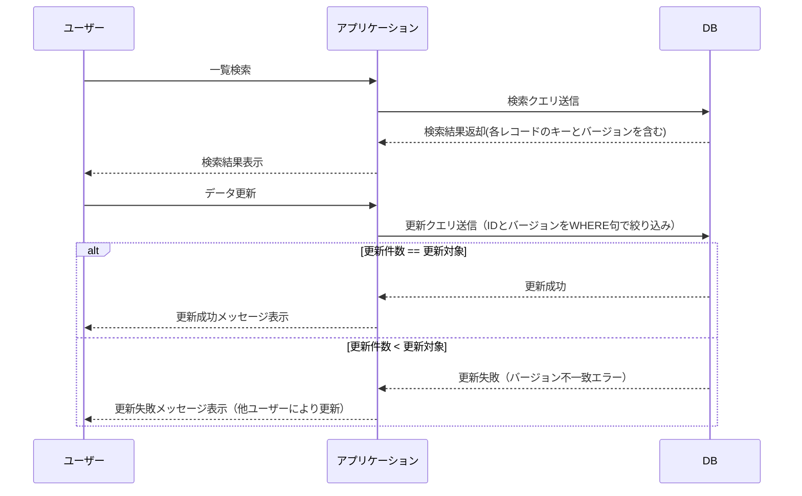
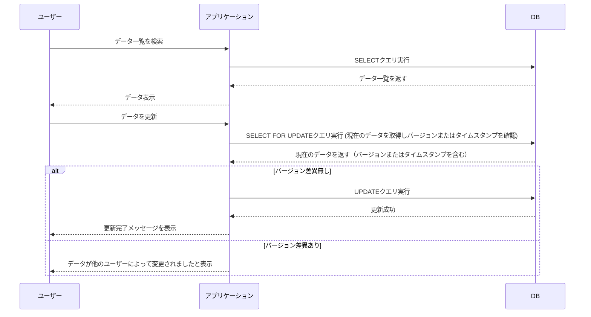
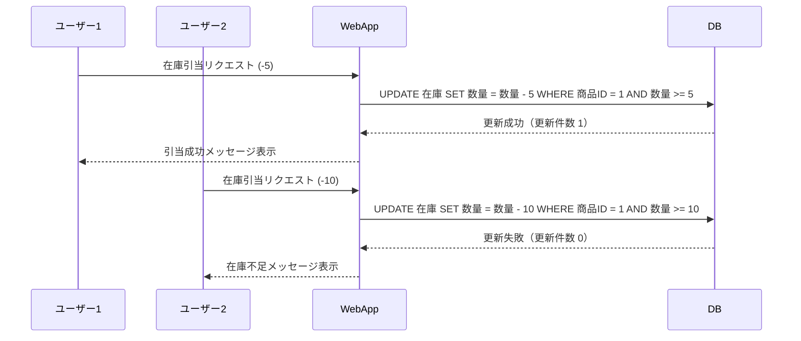
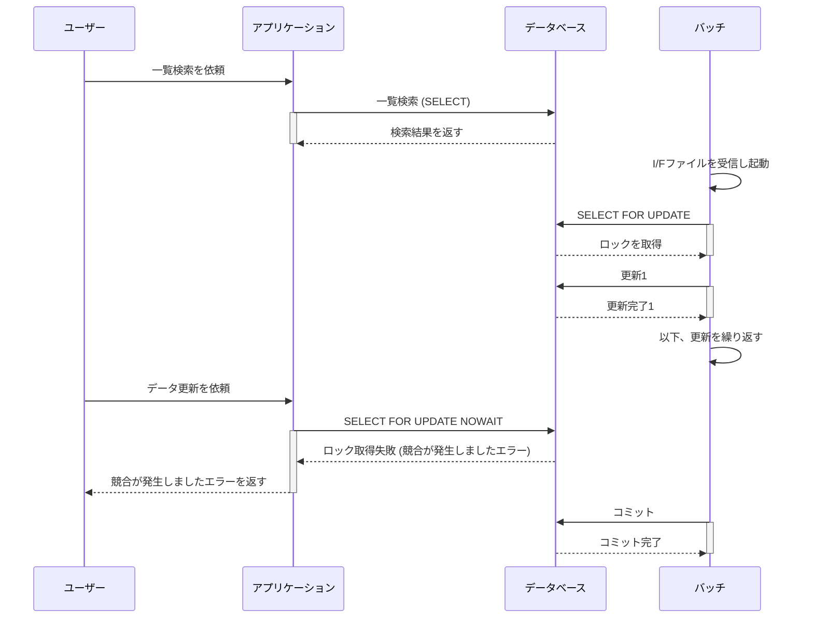
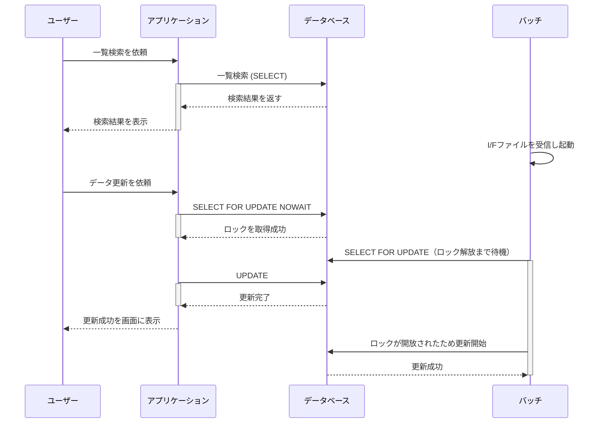
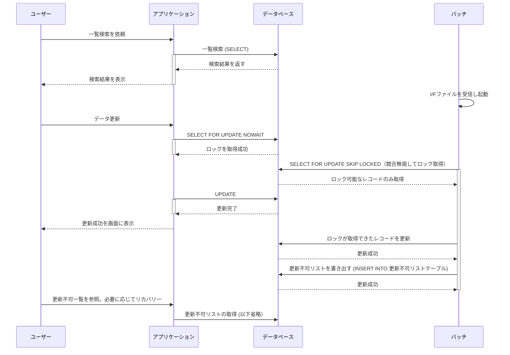
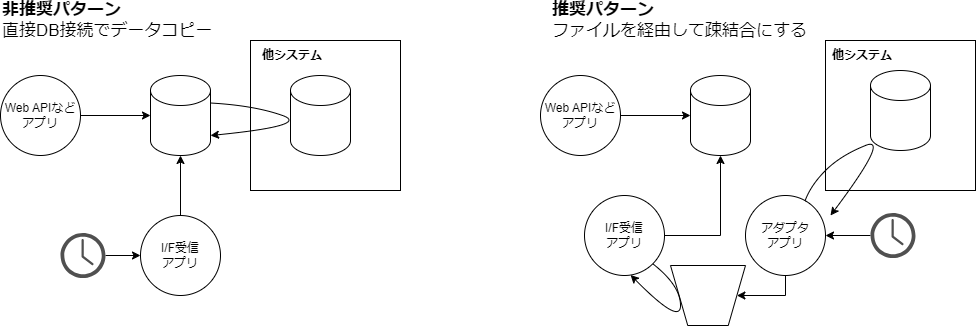
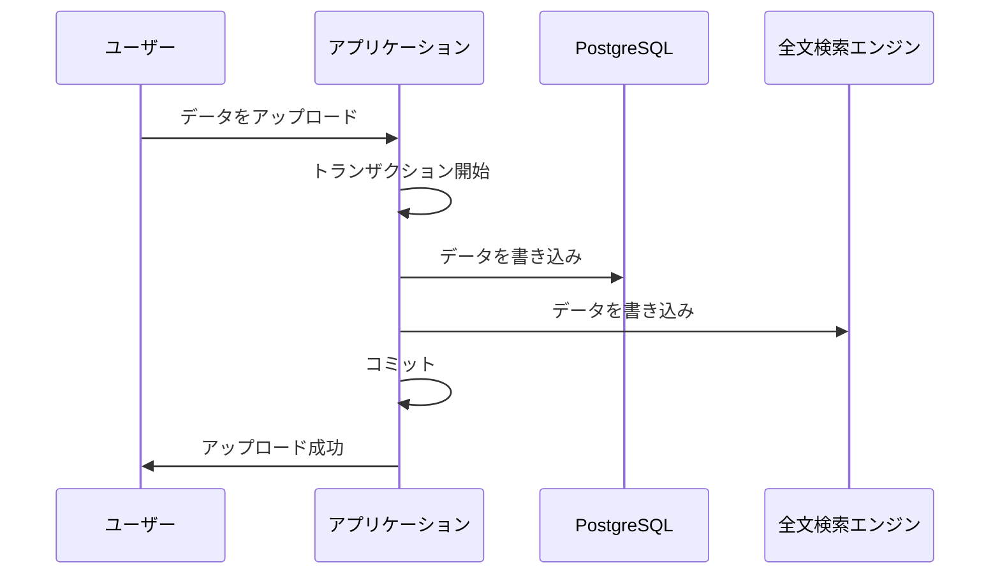
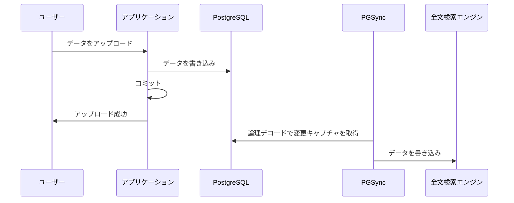

<page-title/>

本規約は、世の中のシステム開発プロジェクトのために無償で提供致します。

ただし、掲載内容および利用に際して発生した問題、それに伴う損害については、フューチャー株式会社は一切の責務を負わないものとします。

また、掲載している情報は予告なく変更することがございますので、あらかじめご了承下さい。

# はじめに

本規約はPostgreSQLを使用する開発者向けに、DBのテーブルやカラムの命名・型桁・制約などのスキーマ管理に加え、履歴・排他制御・マルチテナント対応などアプリケーション設計を含む内容についての設計標準を紹介する。

以下の目的・意図で作成するものとする。

- DB設計の主な論点／設計項目／設計観点を提供することで、開発者の考慮漏れを防ぐとともに、チームでの設計上の合意形成を手助けする
- システム開発における標準ラインとなる設計手法を提供することでナレッジやツールの横展開を容易にする

# 適用範囲

作成にあたって以下の想定を持つ。

- 利用データベース：PostgreSQL
- ワークロード： OLTP（オンライントランザクション処理）の業務システム開発
- 主にクラウド上のマネージドサービスの利用（Amazon Auroraを利用など）

# 免責事項

::: warning 有志で作成したドキュメントである

- フューチャーアーキテクトには多様なプロジェクトが存在し、それぞれの状況に合わせて工夫された開発プロセスや高度な開発支援環境が存在する。本規約はフューチャーアーキテクトの全ての部署／プロジェクトで適用されているわけではなく、有志が観点を持ち寄って新たに整理したものである
- 相容れない部分があればその領域を書き換えて利用することを想定している

:::

# テーブル種別

DBで利用するテーブルを、以下のような分類で捉えるとチーム内で認識が一致しやすい。本規約では次のような名称を利用する。

1. トランザクションテーブル（トラン）
   - 日々発生するイベント、契約、指示、やり取りや操作などを記録するテーブル
   - 例） 販売システムにおける売上履歴や、銀行の取引履歴などが該当
   - 改廃あり（保持期間：比較的長い）
2. マスタテーブル (マスタ)
   - システムにおけるリファレンスに該当するデータ
   - 例） 顧客テーブル、商品テーブル
   - 顧客が増えるというイベントは日々発生するが、帳簿としての利用ではないため顧客マスタと呼称させることが多い
   - 改廃無し
3. ワークテーブル （ワーク）
   - トランやマスタに反映するためや、帳票や画面出力するために中間的に利用される
   - 例）バッチ処理の中間結果の保存目的
   - 例）複雑なクエリを実行する際の中間結果の保存
   - 改廃あり（保持期間：短い）
4. サマリテーブル(サマリ)
   - 日次、週次、月次などの統計をバッチによって集計して作成する。経営情報のビューの高速化のために利用する
   - 例）月別売上実績サマリ
   - 例）日別在庫分析サマリ
   - 改廃あり（保持期間：比較的長い）

ワークテーブルの派生として、以下のようなテーブルが存在する。

- I/F受信ワークテーブル
- I/F送信ワークテーブル

# 正規化

原則、第3正規形を基本とする。

非正規化については、データ整合性の観点から極めて慎重に取り扱いを検討する。例えば以下の場合に非正規化を検討する。

- インデックス設計、実行計画の最適化では対応できないほど、応答要件が厳しいクエリが存在し、リレーションの結合回数を減らすために、非正規化が有効な選択肢である場合

# 命名

## バリュードメイン

DB設計における「ドメイン」は定義域とも呼ばれ、その属性が取りうる値の集合を示す。例えば、`NUMERIC(10, 2)` というデータ型は、定義域の1つの形態である。他にも、性別区分などの区分値を示す定義域のようなものがある。ドメインと呼ぶこともあるが、Webのドメインや、ドメイン駆動開発のドメインなどと区別がややこしいため、ここではISO 11179での呼称であるバリュードメインと呼ぶ（一般には型ドメインと呼ぶことも多い）。

バリュードメインを整理することで、個々のカラムのデータ型設計の揺れを減らすことができる。例えば、顧客コードというドメインを作成し、請求先顧客コード／取引先顧客コードといった具体的なカラムと紐づけることで、データ型の揺れを減らすことができる。またそういったメタデータをデータサイエンティストが利用することで、データ利活用を促進できる可能性がある。

本規約では、個別のカラムやデータ型の設計を行うと同時に、バリュードメインを整備していくことを推奨する。

参考:

- [ERエディタで型ドメインを使う A5:SQL Mk-2](https://a5m2.mmatsubara.com/tips/er_domain/)
- [ドメイン管理のデータモデリングにおける重要性 \#データモデリング - Qiita](https://qiita.com/abe_masanori/items/371d61048b7654cf4be5)

## 論物変換

PostgreSQLの識別子（テーブル名、カラム名、シーケンス名、インデックス名、制約名、関数名など）の最大は[PostgreSQL 文書 4.1.1. 識別子とキーワード](https://www.postgresql.jp/docs/16/sql-syntax-lexical.html#SQL-SYNTAX-IDENTIFIERS) によると63文字である。業務システムでは、専門用語の組み合わせで長くなる傾向がある（例: 配送センター別商品在庫数量: `inventory_quantity_by_distributioncenter`）。業務用語とのマッピングは後述する論物変換辞書で行うが、その際は、なるべく短く簡潔な名称になるよう設計する。

論物変換とは論理名を物理名に変換する行為を示す。名称揺れ/翻訳揺れが無いよう、辞書を用意し文言管理をする。辞書は論理名と物理名の対応がなされていれば形式を問わない。

例）

```csv
ID,id
記事,article
ヘッダ,header
タイトル,title
内容,content
```

辞書では分解不可能な粒度の単語から順に定義し、固有名詞としての登録は可能な限り避ける。例えば、「商品一覧」という単語を辞書で定義する場合、「商品」「一覧」を単語として登録し、「商品一覧」は登録しない。

「商品一覧」のように、単語の合成で構成される用語を辞書に登録してしまうと、一部の物理名が変わった際に二重メンテナンスが必要になってしまい、命名揺れからプロダクト品質の低下につながってしまう危険性がある。ただし、変換対象の単語が専門的、または論物変換結果が著しく長大になった場合に、短縮したい場合は、分解可能な粒度であっても一語として登録する。

```sh
#OKパターン
商品,item
一覧,list

#NGパターン
商品,item
一覧,list
商品一覧,item_list
```

#### 論物変換ツール

ER図がA5M2により作成されていれば、下記ツールにより論物変換が可能である。

- [https://github.com/future-architect/a5er-dictionary](https://github.com/future-architect/a5er-dictionary)

CSV形式で論理名と物理名の対応表を作成する。

## 区分値

区分値とは、DMBOKでは参照データ（リファレンスデータ）とほぼ同義で、例えば性別コードのような意味のある値の集合のことを指す。画面上のプルダウンで選択できる検索条件や、業務上の意思決定を行うためのレポート作成の集計軸などで扱われる。

区分値の例:

- 購入区分「`00:未購入` `01:購入済` `02:予約済`」
- 性別区分「`0:不明` `1:男性` `2:女性` `9適用不能`」

区分値の管理手法として以下の2つがある。

|                        | 説明                                                                                                                     | 例                               |
| :--------------------- | :----------------------------------------------------------------------------------------------------------------------- | :------------------------------- |
| 連番コード値で管理     | 01、02などのコード値と、業務上の区別したい状態を紐づける。<br>初期値を00としたり、90を不明にするなど体系を持つことがある | 購入区分] `00:未購入` `90:不明`  |
| 意味のある文字列で管理 | 未購入を00ではなく、unpurchasedといった文字列で管理する方法                                                              | サイズ区分: `L:Large` `M:Medium` |

それぞれの特徴を下表でまとめる。

|                                   | 連番コード値                                                             | 意味のある文字列            |
| :-------------------------------- | :----------------------------------------------------------------------- | :-------------------------- |
| DB容量増加による性能劣化/費用増加 | ✅️優れている                                                            | ⚠️富豪的と言える            |
| キャッチアップコスト              | ⚠️主要な区分は慣れれば覚えるが、当初は理解しにくい                       | ✅️直感的に理解できる       |
| 視認性                            | ✅️桁が揃っている                                                        | ❓️人による                 |
| 拡張性                            | ✅️容易                                                                  | ✅️容易                     |
| 入力ミス                          | ✅️typoミスは抑えられる                                                  | ⚠️typoなどが発生しやすい    |
| データサイエンティストの利用      | ⚠️常に最新のドキュメントを連携する必要があり、変更管理時の運用設計も必要 | ✅️項目値である程度判断可能 |

本規約の推奨は以下。

- 「連番コードでの管理」とする。費用／性能の観点と、typoミスを減らすことで品質／生産性を安定させることを優先したいためである

区分値の管理には、RDM（Reference Data Management）を導入することもある。システム開発においては、区分値一覧のような設計ドキュメントを作成し管理することも多い。開発上は以下やその組み合わせで利用することが考えられる。

|                                | 説明                                                                                                                                                                                       | Pros/Cons                                                                                                                    |
| :----------------------------- | :----------------------------------------------------------------------------------------------------------------------------------------------------------------------------------------- | :--------------------------------------------------------------------------------------------------------------------------- |
| 1.ソースコードで管理           | 区分値や表示名称をソースコードやJSON/YAMLなどの定義ファイルで管理する方法。定義ファイルを正とする場合はコード生成と組み合わせる。<br>2または3と組み合わせて利用可。CI/CD環境との相性が良い | ・バージョン管理が容易<br>・データ基盤／データサイエンティストに向けて信頼できるドキュメントを提供し続ける必要がある         |
| 2.区分値管理テーブルで一括管理 | 区分値グループコードと、区分値コードで管理する方法                                                                                                                                         | ・区分値テーブルのメンテナンスコスト<br>・データサイエンティスト側がに区分値特定の手間がかかる                               |
| 3.区分値別に参照テーブルを作成 | 区分値ごとにテーブルを作成して管理する方法                                                                                                                                                 | ・区分値の種別追加でテーブル追加になり開発の手間がある<br>・そのままデータ基盤に連携すれば、メタデータ連携の手間などを省ける |

本規約の推奨は以下。

- 「1.ソースコードで管理」を利用することで、開発効率を上げる
- データ基盤連携時には、「3.区分値別に参照テーブルを作成」することで、データ利活用を促進する工夫を取る

参考:

- [区分値 (Classification) | DBFlute](https://dbflute.seasar.org/ja/manual/function/genbafit/implfit/classification/index.html)
- [DBで区分値などのCODEは数値ではなく文字列を利用するべき](https://zenn.dev/tonbi_attack/articles/fb796ac3cf9720)
- [【データマネジメント】参照データとマスタデータについて解説 | データエンジニアのTech blog](https://data-engineer-tech.com/datamanagement-reference-and-master/)

## 物理名の命名ポリシー

業務用語をローマ字表現にするか、英訳するかはチームごとのポリシーを持って決定する。そのうえで「論物変換辞書」を運用し、揺れを無くすように命名する。

昨今はデータ利活用の観点から、対象のシステムだけに特化した名称にするのではなく、全社データガバナンスの観点から、体系を合わせて命名することが好ましい。本規約で記載する以降の内容も、対象企業内のデータガバナンス／統一的な設計ポリシーがあればそちらを優先し適用する必要がある。

## テーブル種別の識別子

商品マスタを `item_master` `m_item` のどちらにするかといった揺れをはじめとして、保守運用性のためには、命名規則を作り統制を取ることが望ましい。本規約では以下の方針を取る。

- テーブル種別がプレフィックスで識別可能とする
- プレフィックスは最大文字数の制約からなるべく短い識別子とする（下表）
- 最大文字数の制約から、テーブル名は複数形にしない
  - 例: orders -> order
  - 例: employees -> employee

| テーブル種別     | 識別子 | 例           | 備考               |
| :--------------- | :----- | :----------- | :----------------- |
| マスタ           | `m_`   | `m_item`     | `master`の略       |
| トラン           | `t_`   | `t_sale`     | `transaction`の略  |
| ワーク           | `w_`   | `w_item`     | `work`の略         |
| 受信ワーク       | `wr_`  | `wr_item`    | `work receive`の略 |
| 配信ワーク       | `ws_`  | `ws_item`    | `work send`の略    |
| ビュー           | `v_`   | `v_m_item`   | `view` の略        |
| マテリアルビュー | `mv_`  | `mv_m_item`  | `mview`の略        |
| 一時表           | `tmp_` | `tmp_item`   | `temporary`の略    |
| サマリ           | `s_`   | `s_sale`     | `summary`の略      |
| 履歴             | `h_`   | `hist_sales` | `history`の略      |

::: tip 期間の粒度が異なるサマリテーブル

日次サマリ、週次サマリ、月次サマリなど異なる粒度のサマリテーブルが複数存在する場合は、それぞれ`day` `week` `month` から先頭1文字をもらって、 `sd_` `sw_` `sm_` などとルールを決めて区別すると良い。

:::

## カラム名

全社データガバナンスのポリシーを優先して命名する。もし、存在しない場合は、バリュードメインに応じて、論物変換辞書を作成してマッピングすべきである。その上で、以下のような命名ルールを作成することを推奨する。

**【命名ルールの例】**

| 対象           | ルール例                         | 備考                                                                                                                                                                                            |
| :------------- | :------------------------------- | :---------------------------------------------------------------------------------------------------------------------------------------------------------------------------------------------- |
| 日付           | `{カラム}_date`                  | order_dateなど                                                                                                                                                                                  |
| タイムスタンプ | `{カラム}_at`                    | ordered_atなど                                                                                                                                                                                  |
| 名称           | `{カラム}_name`                  | item_nameなど                                                                                                                                                                                   |
| ID             | `{カラム}_id`                    | item_idなど。IDは重複がない数値やUUIDなどのサロゲートキーで、基本的に画面などに出ないもの                                                                                                       |
| コード         | `{カラム}_code`                  | item_codeなど。コードは商品コードなどのナチュラルキー（ビジネスキー）で画面などに表示される可能性があるもの。<br>重複がない方が望ましいが、ISBNなどのようにビジネスルール上再利用の可能性がある |
| フラグ         | `is_{カラム}`<br> `has_{カラム}` | is_expired                                                                                                                                                                                      |
| 区分           | `{カラム}_typ`                   | item_category_typ                                                                                                                                                                               |
| 整数           | `{カラム}_min`<br> `{カラム}_km` | route_distance_kmなど。単位を記載する                                                                                                                                                           |
| 数量           | `{カラム}_count`                 | order_countなど。発注数などの想定                                                                                                                                                               |

参考:

- [How we style our dbt models | dbt Developer Hub](https://docs.getdbt.com/best-practices/how-we-style/1-how-we-style-our-dbt-models)

## インデックス名

インデックスは通常、アプリケーション開発や運用時に明示的に指定することは減っており、命名規則を設けるメリットは減ってきている。一方で、以下の場合は名称を指定することがある。

| 操作内容                       | SQL例                                                                                 |
| :----------------------------- | :------------------------------------------------------------------------------------ |
| インデックスのリビルド         | `REINDEX INDEX your_index_name;`                                                      |
| ヒント句でのインデックス名指定 | `SELECT /*+ Index(your_index_name) */ * FROM your_table WHERE your_column = 'value';` |
| インデックス項目の追加、削除   | `ALTER INDEX your_index_name …;`                                                      |

また、インデックス名はスキーマ内で一意である必要があるため、名称の構成要素にテーブル名を持たせることが望ましい。

そのため、以下のような命名規則を作ることが望ましい。例として紹介する。

**【命名ルールの例】**

1. `pk_{テーブル名}`
2. `uk_{テーブル名}`
3. `idx_{連番}_{テーブル名}`

::: warning 文字数制限が厳しい要件がある場合
物理名が長くなりがちな業界、業務領域がある。そのような条件に一致する場合はなるべくプレフィックスを短くすることを推奨する。特にインデックスはPKやUKより長くなるため、`i{連番}_{テーブル名}` といった体系を採る方が防御的である。
:::

## シーケンス名

シーケンスは、開発／運用時に名称を明示的に指定し操作することは減っている。例えばシーケンスでは、IDENTITY列での自動採番や、TRUNCATE時のシーケンスリセットオプションを利用すれば、直接シーケンスオブジェクトを意識することは減ってきている。

一方で以下のようなケースは引き続き、シーケンス名を指定する場合があり、何かしら命名規則に従っていることが望ましい。

| 操作内容                                                       | SQL例                                                  |
| :------------------------------------------------------------- | :----------------------------------------------------- |
| データ移行でシーケンス値を明示的に進める                       | `ALTER SEQUENCE your_sequence_name RESTART WITH 3000;` |
| テーブル名／カラム名変更に合わせて、シーケンス名もリネームする | `ALTER SEQUENCE name RENAME TO new_name:`              |

命名規則は以下のような2つの方針が考えられる。1の場合は、テーブル名／カラム名それぞれ29文字を超過した場合、オミットされることに留意が必要である。

1. `seq_{テーブル名}_{カラム名}`
2. `seq_{テーブル名}_{連番}` ★推奨

本規約では(2)のテーブル名と連番で管理することを推奨する。

# インデックス

基本方針としては以下の方針とする。

- 最初から様々な機能を使い込んでいくのではなく、シンプルに保つ
- 必要になったタイミングで、各種のチューニング（設定）を行う

理由としては以下である。

- 例えば、後述する部分インデックスなどは、設定しなくても要件を満たせる場合がある。その場合、あえて部分インデックスにした意図が不明瞭になる。また、設計者によって使う／使わないの揺れが生じ、統制が取れなくなる

## インデックス種別

PostgreSQL 16時点では、以下のインデックス作成方法を選択できる

- B-tree、btree（デフォルト）
- Hash、hash
- GiST、gist
- SP-GiST、spgist
- GIN、gin
- BRIN、brin
- bloom

[PostgreSQL 16.4文書](https://www.postgresql.jp/docs/16/indexes-types.html)に使い分けについては以下のように記載がある（btree, hash以外は省略）

1. `<` `<=` `=` `>=` `>` や `between` 、 `in` を用いたクエリを利用する場合、**btreeを用いる**
2. 等価比較のみ `=` にアクセスが絞られる場合は `hash` を用いる

本規約では `btree` の利用を推奨する。 `hash` を含めそれ以外の利用は非推奨とする。 `hash` は等価条件 `=` の場合に有利だが、業務処理では大半の場合ORDER BYが必要となり、ソートのために `hash` インデックスの利用ができないためである。

## インデックス設計

インデックスの追加は書き込み性能に悪影響を及ぼすため、むやみに追加せず、必要最小限に抑える方針を取ること。

また、使用していないインデックスを定期的に削除することを推奨する。複数ノード存在する場合は、マスタ、リードレプリカそれぞれで確認すること（リードレプリカでは使用していないが、マスタでのみ利用していたり、その逆はよくあるため）。

注意点は以下である。

- PostgreSQL 17時点では、Oracleと異なり複数パーティションにまたがるインデックス（いわゆる、グローバルインデックス）が未対応。全てローカルインデックスとなる

インデックスは文脈とその特徴によって次節で表現する名称で呼ぶことがある。

利用方針を下表でまとめる。

| 名称                       | 利用方針                                             | 主な注意点                                                       |
| :------------------------- | :--------------------------------------------------- | :--------------------------------------------------------------- |
| １．複数列インデックス     | 任意                                                 | 4列以上の場合は有識者確認                                        |
| ２．ユニークインデックス   | 一意制約より優先して利用                             | デフォルトはNULL許容                                             |
| ３．式インデックス         | 原則利用禁止。個別カラムにインデックス追加で代替する | 乱用すると運用者が混乱する可能性                                 |
| ４．部分インデックス       | 原則利用禁止。チューニング時に必要に応じて利用する   | クエリパターンとカーディナリティ見極めが重要                     |
| ５．カバリングインデックス | 同上                                                 | インデックスサイズ増大懸念や、テーブルのワークロード見極めが必要 |
| ６．付加列インデックス     | 同上                                                 | 同上                                                             |

### １．複数列インデックス

複数の列にまたがるインデックスのことを強調したい場合に、複数列インデックスと表現することがある。1列のみのインデックスは、単一列インデックスと呼ぶ（参考: [11.3. 複数列インデックス](https://www.postgresql.jp/document/16/html/indexes-multicolumn.html)）

注意事項は下記。

- パーティションキーはインデックス項目に含める必要はない
- 公式ドキュメントには4列以上のインデックスは不適切の可能性がある（[11.3. 複数列インデックス](https://www.postgresql.jp/document/16/html/indexes-multicolumn.html)）と記載があり、本規約でも4つ以上の複数列インデックスを用いる場合は、アーキテクト／DBA確認を推奨する

### ２．ユニークインデックス

UNIQUE制約をつけたインデックスのことを強調したい場合に、ユニークインデックスと呼ぶことがある（参考: <https://www.postgresql.jp/docs/16/indexes-unique.html>）。

```sql
CREATE UNIQUE INDEX name ON table (column [, ...]);
```

一意制約と機能上は同じである（一意制約も暗黙的にユニークインデックスが作成される）。本規約における両者の使い分けは以下である。

- 一意制約ではなくユニークインデックスを用いる
  - 一意制約の方がデータモデルとして一意であることがより明示的であるが、ユニークインデックスの構成カラムの変更などの作業を考えると、ユニークインデックスの方が保守性で有利と考えられるため
  - 後述するオプション・部分インデックス・式インデックスなどと組み合わせたいなど特殊対応が必要になる場合は、そもそもユニークインデックスで対応する必要がある

利用について、以下に注意する。

- パーティションテーブルの場合は、ユニークインデックスにパーティションキーを追加する必要がある（付与しないと作成する際に実行時エラーになる）
- デフォルトでは、NULLの重複は許容される。許容しない場合はNULLS NOT DISTINCTを追加する
- 後述する、文字列型のデフォルト値を空文字にする方針だと、NULLとは異なり重複は許容されない

```sql
-- NULL許容しないユニークインデックス
CREATE UNIQUE INDEX idx1_example ON sample (name) NULLS NOT DISTINCT;
```

### ３．式に対するインデックス（関数インデックス）

式インデックスは、式や関数の結果に基づいたインデックスである。例えば、受注で `unit_price（単価）` と `quantity（数量）` があり、これらの積に対してインデックスを作成できる。

```sql
CREATE INDEX idx01_total_amount ON orders ((unit_price * quantity));
```

式インデックスを使わない場合は、`total_ammout` カラムを追加しインデックスを貼り、アプリケーション側で行った計算結果を保存することになる。

以下に比較表を示す。

|                    | 式インデックス                                                                                                                                                                     | 個別カラムにインデックス追加                                                |
| :----------------- | :--------------------------------------------------------------------------------------------------------------------------------------------------------------------------------- | :-------------------------------------------------------------------------- |
| DB負荷             | ⚠️データ更新時にインデックス更新が走るため、式の内容によっては高くなる                                                                                                             | ✅️アプリ側にオフロードするため、スケールする                               |
| ストレージ容量     | ✅️                                                                                                                                                                                | ⚠️計算結果を保存するカラム分、追加で容量が必要                              |
| データ整合性の維持 | ✅️DB側でインデックスが自動で更新されることを強制付けられる                                                                                                                        | ⚠️アプリケーション側で担保する必要がある                                    |
| 保守性             | ⚠️複雑な計算結果の値を後で確認したい場合に不便である。後々、別の式の結果をインデックスに乗せたい場合、既存の式インデックスに気が付かず、カラム追加する方針を取ってしまう懸念がある | ✅️開発者が意識しやすい。データがカラムに振り下ろされているので確認しやすい |

本規約の推奨は以下。

- 式インデックスは原則、利用禁止
  - 開発者にとって設計手法の揺れをなくすという観点に立つと、式インデックスにするか、個別カラムにするか判断基準を設けることが難しく、開発者によって揺れる懸念があるため
- リリース前後などでどうしても改修が難しいなどの場面で、最後の手段として式インデックスの利用を検討する。その際は利用について設計ドキュメントに注意書きを残すこと

### ４．部分インデックス

部分インデックスは、特定の条件にマッチする行だけに対してインデックスを作成する方法で、インデックスサイズを小さく抑えることができる。

```sql
-- orderテーブルで、statusが完了になっているレコードのみに部分インデックスを貼る例
CREATE INDEX idx_completed_orders ON order (order_date) WHERE status = 'completed';
```

本規約の推奨は以下。

- 最初から適用せず、チューニングが必要になったタイミングで利用する
  - シンプルな構成を維持することで、設計の揺れを減らす／ハマりどころを減らす／チューニング条件を明瞭にするため
- データのカーディナリティとチューニングしたいSQLクエリをよく見極めた上で利用する
- アーキテクト／DBAと相談の上で利用する

### ５．カバリングインデックス

カバリングインデックスは、クエリで必要とされるすべてのカラムの値を保持したインデックスを指す。いわゆる、 Index-only-scan になると実表を見なくて済むため、性能を向上させることができる。

本規約の推奨は以下。

- 原則、カバリングインデックスの利用禁止（最初からこれに頼った設計にしない）
- どうしても性能を出す必要がある処理（画面検索などでシビアな要件がある）の場合に限り導入を検討する

理由は以下である。

- インデックスサイズが想定以上に大きくなること
- インデックス更新コストが増加すること
- Index-only-scan になるための条件として、可視性マップ（VM：Visibility Map）で各ページのビットが立っている必要がある（更新が多いテーブルの場合、直近VACUUMされている必要がある）など、クエリ単体以外の考慮が必要
- 後述する、付加列インデックスの方が細かい調整が効く分有利であるため

### ６．付加列インデックス

付加列インデックスは、カバリングインデックスの一種と言える。

検索用列に加え、値を返すだけの列もインデックスに含めることできる（つまり、付加された列は、ソートや検索には使用されない）。PostgreSQL 11以降で利用でき、次のようにINCLUDEを用いて指定する。

```sql
CREATE INDEX idx_employee_with_include ON employees (first_name) INCLUDE (last_name, department);
```

参考: [https://www.postgresql.jp/docs/16/sql-createindex.html](https://www.postgresql.jp/docs/16/sql-createindex.html#:~:text=%E3%81%8C%E5%BF%85%E9%A0%88%E3%81%A7%E3%81%99%E3%80%82-,INCLUDE,-%E3%82%AA%E3%83%97%E3%82%B7%E3%83%A7%E3%83%B3%E3%81%AEINCLUDE) の「INCLUDE」オプション

カバリングインデックスと比較して以下の点で有利である。

- 検索列としては必要ない列をインクルード列として追加できるため、インデックスのサイズを最小化しつつ、Index-only-scanを狙うことができる

課題や制約としては、カバリングインデックスと同様であるため、本規約としては原則利用禁止とする。

万が一必要になった場合は、性能チューニングの最後の手段として、アーキテクト／DBAと相談の上で利用する。

参考: [パフォーマンスを考慮したIndex定義設計 | TECHSCORE BLOG](https://www.techscore.com/blog/2019/12/25/performance_index/)

# カラム

## 生成列

生成列は他の列から計算されるビューのようなものである。 生成列には格納と仮想の2種類があり、PostgreSQLは格納生成列のみサポートされている。

- 格納生成列は実際にストレージが割り当てられる、マテリアライズドビューに似ている
- 仮想生成列は列の参照時に計算される、ビューに似ている

以下の特徴がある。

- 生成列に関して、明示的にINSERT/UPDATEができない（DEFAULTキーワードの指定は可能）
- 現行の行のみを指定できる
- 生成式はほかの生成列を参照できない
- 生成列はパーティションキーにできない
- 概念的には、生成列はBEFOREトリガーが走った後に更新される

主なユースケース例は以下である。

- 単価・数量カラムで「金額」を生成
- 氏名カラムから、「フルネーム」を生成
- JSON項目のある要素を、別カラムとして生成する（下に例を記載）
- pg_bigmで部分一致検索用途に、小文字変換した検索用のカラムを追加

```sql
-- JSONBを含むテーブル
CREATE TABLE json_data_table (
    id BIGSERIAL PRIMARY KEY,
    data JSONB NOT NULL,
    name TEXT GENERATED ALWAYS AS (data ->> 'name') STORED,
    age INTEGER GENERATED ALWAYS AS ((data ->> 'age')::INTEGER) STORED
);

-- データの挿入
INSERT INTO json_data_table (data) VALUES ('{"name": "John Doe", "age": 30}');
INSERT INTO json_data_table (data) VALUES ('{"name": "Jane Doe", "age": 25}');

-- 参照
SELECT id, name, age FROM json_data_table;
 id |   name   | age
----+----------+-----
  1 | John Doe |  30
  2 | Jane Doe |  25
```

本規約の方針は以下。

- DB論理設計については「導出属性」章の考え方に準じる
- 生成列は、原則利用しない
  - 生成列で実現したい要件は、ビジネス要件に近くアプリケーションライフサイクルに近いため
  - 生成列の式変更のリリース作業が難しいため（AccessExclusiveLockと全レコード探査を必要とするため）

参考:

- [5.3. 生成列](https://www.postgresql.jp/docs/16/ddl-generated-columns.html)
- [Is it possible to add a GENERATED COLUMN to a large table without locking/downtime on postgres? - Database Administrators Stack Exchange](https://dba.stackexchange.com/questions/324349/is-it-possible-to-add-a-generated-column-to-a-large-table-without-locking-downti)

## データ型

PostgreSQLにはユーザーが使用可能な豊富な[データ型](https://www.prisma.io/dataguide/postgresql/introduction-to-data-types)が存在する。そのうえで、システムで利用するポリシーを統一することで開発生産性／保守性を高めることができる。例えば、商品コードを数値型、社員コードを文字列型で定義した場合、「コード値」でありながら型が揺れることとなり、DB利用者が少なからず混乱してしまう。設計の一貫性を保つため、以下の方針とする。

本規約は、利用するデータ型種別数をなるべく絞り込む方針を推奨する。理由は以下である。

- 設計者によってどの型を利用するか、判断のゆらぎをなるべく減らすため
- DBスキーマからコード生成する場合や、独自ツールを開発するうえで、ハマりうる事項をなるべく減らすため
- 多少の非効率さ（データ容量、処理性能）より、業務システムでは上記の設計品質の安定性、開発生産性を重視するため

【凡例】✅️:必須で付与する

| カラム値種別       | データ型                                   | 非NULL | Default | 説明                                                                                                                                                                                                                                                                                                                                                                                                                                                                                                                                                    |
| :----------------- | :----------------------------------------- | :----- | :------ | :------------------------------------------------------------------------------------------------------------------------------------------------------------------------------------------------------------------------------------------------------------------------------------------------------------------------------------------------------------------------------------------------------------------------------------------------------------------------------------------------------------------------------------------------------ |
| コード             | `varchar(n)`                               |        |         | 商品コード、支店コードなど。 コード値が数字であっても、文字列として扱う。                                                                                                                                                                                                                                                                                                                                                                                                                                                                               |
| 区分               | `varchar(n)`                               | ✔     |         | 値が数字だとしても、区分はコードの一種として扱うため文字列とする（例: 性別区分: `Not known:0` `Male:1` `Female:2` `Not applicable:9`）。 上記ISO 5218で定義されている区分値については、数字以外取りうることが無いため、idとして格納するほうが本来効率的である（参考: [文字列型の使い分け - Let's POSTGRES](https://lets.postgresql.jp/documents/technical/text-processing/1)）。一方で、業務区分値は現時点で数字のみだったとしても、将来的に変化する可能性は否定できない。安全側に倒し、一部の非効率さより設計の一貫性を重視するため、varcharを用いる。 |
| 日時               | `timestamptz` (`timestamp with time zone`) |        |         | タイムゾーン付きを選択する。                                                                                                                                                                                                                                                                                                                                                                                                                                                                                                                            |
| 日付（yyyy-MM-dd） | `date`                                     |        |         | `date` ではなく `varchar(10)` を用いる流派もあるが、好みの問題である。より入る値が明示的となるdate型を利用する。 なお、日付項目はパーティションキーとして利用することが多いが、date、varcharのどちらを利用しても機能としては問題ない。パーティションキーの場合はNOT NULL制約を付ける。                                                                                                                                                                                                                                                                  |
| 年月（yyyy-MM）    | `varchar(7)`                               |        |         | 月次パーティションを作成する場合に利用することが多いカラムである。パーティションキーの場合は`NOT NULL`制約を付ける。 ハイフンをいれるかどうかだが、PostgreSQLのデフォルト日付フォーマットが `yyyy-MM-dd` の拡張書式であるため、それに合わせる                                                                                                                                                                                                                                                                                                           |
| 数量               | `bigint` `integer`                         |        |         | 在庫数／受発注数／入出荷数など。連番がbigserialを用いる規則であるため、それに相当するカラムの場合はbigintを利用する。 なお、業務およびシステム上、integerで事足りる場合はこれらを利用することも許容する。デフォルト値は0にしない                                                                                                                                                                                                                                                                                                                        |
| 連番               | `bigint`                                   | ✔     |         | `intetger`/`serial`の場合、一巡によりシーケンスのリセットや後々`bigint`/`bigserial`に切り替えるなどの作業が発生する懸念がある。安全側に倒すため`bigint`を用いる。IDENTITY列にすることで`serial`は利用しないl                                                                                                                                                                                                                                                                                                                                            |
| 係数               | `numeric(p, s)`                            |        |         | 割引率／消費税率 など。floatは利用しない。要件次第だがデフォルト値は0にしない                                                                                                                                                                                                                                                                                                                                                                                                                                                                           |
| 金額／計算結果     | `numeric(p, s)`                            |        |         | 支払金額／請求金額／使用量など、正確な計算結果の格納が求められる場合。要件次第だがデフォルト値は0にしない                                                                                                                                                                                                                                                                                                                                                                                                                                               |
| 文字列             | `varchar(n)`                               |        |         | 名称／説明文など。textは桁数が不明となり、システム間連携やデータサイズ見積もりで扱いにくいため、使用しない                                                                                                                                                                                                                                                                                                                                                                                                                                              |
| フラグ             | `boolean`                                  | ✔     | false   | 必ず`NOT NULL`制約を付与する。MySQLではbooleanはtinyint型に置き換えられる。tinyintは0と1以外の値を格納することが可能なので、厳密なboolean型を扱うには挿入・更新時に値チェックが必要になることから、MySQLではbooleanの利用は考慮が必要である。PostgreSQLでは上記の問題ないとして推奨する。 フラグの表現として、`char(1)`やsmallintで表現する流派もあるが、入力値が明確になるという点でbooleanを用いる。「boolean型を別の型にできないか考える」章も参考にする                                                                                             |
| UUID               | `uuid`                                     |        |         | `UUID`型か`varchar(36)`の選択があるが、`UUID`型の場合は16byteで済み、性能／コスト上のメリットが大きい。なお、`gen_random_uuid()`も`UUID`型である                                                                                                                                                                                                                                                                                                                                                                                                        |
| 配列               | `[]`                                       |        |         | 原則、配列は正規化を行い利用しない。もし、利用する場合は`json`/`jsonb  `型と同様の利用方針とする。                                                                                                                                                                                                                                                                                                                                                                                                                                                      |
| 構造化データ       | `json` `jsonb`                             |        |         | 原則JSONデータは正規化を行い、`json`/`jsonb`型は利用しない。 ただし、次の1、2のような場合は許容する 1️⃣外部のWeb API応答の生データをログ的に保存したい 2️⃣システム間連携で、自システムで利用せず横流しするだけの場合<br> ※JSON型は挿入が高速、JSONB型は検索が高速であるため、例えば2️⃣のケースではJSON型を利用する                                                                                                                                                                                                                                         |

なお、次のデータ型は利用しない。理由は以下。

- `timestamp`（ timestamp **without** time zone）
  - 代わりに `timestamptz`（timestamp **with** time zone）を用いる
  - Web APIなど異なるタイムゾーンの日時情報の入力があり、アプリケーション側でタイムゾーンの正規化が行われなかったとしても正しい時間で保存／利用できるため
  - 海外拠点でのアプリケーション利用など、異なるタイムゾーンでの利用時にも対応しやすくなるため
- `char`
  - 代わりに `varchar(n)` を用いる
  - データサイズの削減メリットがあり、対象のカラム値が最小桁数＝最大桁数 である場合に、明示するという目的で`char` を利用をしたい場合がある
  - テストデータ投入・データパッチ・アプリケーション不備等が原因で、桁不足があると末尾にスペースが入る。それにより動作検証でハマる事が多い
  - 本規約では後者の開発生産性観点を優先とし、利用を禁止とする
- `text` および長さの指定がない `varchar`
  - 代わりに長さを指定したvarcharを用いる
  - [Don't Do This - PostgreSQL wiki](https://wiki.postgresql.org/wiki/Don%27t_Do_This#Don.27t_use_varchar.28n.29_by_default) には、`varchar` ではなく `text` を使おうととあるが、これに従わず本規約では禁止とする。
  - システム開発、特に基幹系やそれに近い領域であると、システム間の連携が通常であり、連携用のWeb APIやファイルのスキーマ定義が求められる。その際に桁数の上限が存在しないとすると、連携先システムの都合（採用しているDBなどの制約）によっては対処ができない場合があるため
  - 桁数があると、テーブルサイズの見積もりにも役立つ
  - `text` 型にindexを貼ると、データサイズによってはエラーになるため、通常インデックスを貼る用途は無いと考えられるが、万が一利用する場合は注意する（<https://zenn.dev/onozaty/articles/postgresql-text-index>）
- `serial`
  - 代わりに `bigint`（IDENTITYカラム）を用いる
  - 当初は呼び出し数が少ないと想定しても、想定以上のアクセス数が来ることや稼働が続くと、`integer`/`serial`で不足するケースも否定できない
  - シーケンス値が1周すると、アプリケーション改修が大変になることが多いこと。型を `integer`/`serial` -> `bigint`/`bigserial` に変更する運用の難易度が高いため。最初から保護主義的に `bigint` を採用する
  - `serial` の代わりに、よりSQL標準であるIDENTITY列を利用する
- `smallint`
  - 代わりに `integer` または `bigint` を用いる
  - 設計者に選択させる余地をできる限り減らすため
- `float`
  - 代わりに `double` を用いる
  - ドキュメント（[PostgreSQL: Documentation: 17: 8.1. Numeric Types](https://www.postgresql.org/docs/current/datatype-numeric.html)）によると、`float` 型の精度は小数点6桁程度、`double` 型は15桁程度。DBの型がJavaやGoなどの型にマッピングされることが多く、計算結果の精度の影響することを考えると、最初からdouble型を利用し、精度落ちを事前に回避する方針とする
- `money`（通貨）型
  - 代わりに桁数と適切な精度を設定した `numeric` を用いる

::: tip `integer` ではなく `bigint` に統一すべきかどうか
整数型はintegerとbigintを使い分けることが本規約の推奨だが、設計の揺れを防ぐためや、考慮漏れなどで`integer` から `bigint` への型変更を完全に避けるために、多少のオーバーヘッドを犠牲に`bigint` に統一する考え方もある。これについては意見が分かれることが多く、採用についてはシステムのワークロードや設計上のトレードオフを考慮して検討すること。
:::

::: warning char(n) 型にハマる

`char(n)` 型はカラム値が桁数未満の場合に、半角スペースでパディングされる仕様がある（桁数超過の場合はエラーになるが、桁数以下の場合はエラーにならない）。
そのため、単体テストデータの比較などで、見た目は正しいが半角スペースの存在で値が不一致となり、テストが落ちてしまうことがある。初心者が良く陥るミスの1つであるが、初見殺しである。

以下に例を示す。

```sql
CREATE TABLE sales_category (
    code_id SERIAL PRIMARY KEY,
    category_code CHAR(8) -- 固定長8文字
);

-- ダミーデータ登録（5文字）
INSERT INTO sales_category (category_code) VALUES ('DUMMY');
```

SQLで検索すると、表示上は `DUMMY` に見えるが、`CONCAT()` で文字列結合すると半角スペースが3桁でパディングされた値に `123` が追加されていることがわかる。

```sql
# SELECT category_code, CONCAT(category_code, '123') FROM sales_category;
 category_code |  concat
---------------+-----------
 DUMMY         | DUMMY   123
(1 row)
```

回避策としては正しく宣言された桁数（先程の例では8文字）でテストデータを登録することが考えられるが、開発者の負荷が高まってしまう。そのため `varchar(n)` を変わりに使い、発生原因を根本から無くすことを推奨する。

:::

参考: [Don't Do This - PostgreSQL wiki](https://wiki.postgresql.org/wiki/Don%27t_Do_This)

## IDENTITY列

PostgreSQL 10から、挿入する列に数値を割り当てるための構文「GENERATED AS IDENTITY」構文が追加された。SERIAL／BIGSERIAL型と似ているが、SQL標準準拠である点が異なる。

以下が定義例である。

```sql
CREATE TABLE color (
    color_id BIGINT GENERATED ALWAYS AS IDENTITY PRIMARY KEY,
    color_name VARCHAR NOT NULL
);
```

また、IDENTITY列には、`BY DEFAULT` `ALWAYS` のオプションがある。

| 名称           | 説明                                                                                                               | 備考                                                           |
| :------------- | :----------------------------------------------------------------------------------------------------------------- | :------------------------------------------------------------- |
| `BY DEFAULT`   | アプリケーション側で明示的に値を指定可能。`SERIAL`／`BIGSERIAL` と同等の挙動                                       | アプリケーション側からの誤登録がより起こりやすい懸念           |
| `ALWAYS` ※推奨 | アプリケーション側で明示的に指定が不可。ただし、INSERT文に、`OVERRIDING SYSTEM VALUE` を明示的に記載すれば登録可能 | COPYを利用した場合は、IDENTITY列に明示的に値を指定しても登録可 |

本規約の方針としては以下である。

- `SERIAL`/`BIGSERIAL`ではなく、よりSQL標準準拠なIDENTITY列を積極的に利用
- `ALWAYS`オプションを利用することで、アプリケーション側からの誤登録を防ぐ

次のように、`DEFAULT` キーワードを指定して、明示的なクエリを記載可能だが、`DEFAULT` の記載は禁止とする。

例: color_idにDEFAULTを指定

```sql
INSERT INTO color (color_id, color_name) OVERRIDING SYSTEM VALUE VALUES (DEFAULT, 'Black');
```

利用時の注意事項:

- テーブル名、カラム名がそれぞれ29文字以上の場合、シーケンス名がオミットされて作成される。29文字超過時に自動生成された命名を利用するか、明示的にシーケンス名を変えるのか、一律体系を変えるのかはチームごとにポリシーを作成し統一すること

参考:

- [PostgreSQL 10 に関する技術情報](https://www.sraoss.co.jp/tech-blog/pgsql/10-0/)
- [PostgreSQL: Documentation: 17: 5.3. Identity Columns](https://www.postgresql.org/docs/current/ddl-identity-columns.html)
- [PostgreSQLで連番を自動生成するIDENTITY列。SERIALとどちらを使うべきか | フューチャー技術ブログ](https://future-architect.github.io/articles/20241113a/)

## 文字列のデフォルト値

文字列型のデフォルト値については、以下の3流派が存在する。

1. NULL／空文字の併用（何もしない）
2. 空文字のみに限定（NOT NULL制約を付与）
3. NULLのみに限定（CHECK制約を付与）

| 方式                 | デフォルト値 | 制約                        | 備考                                                                          |
| :------------------- | :----------- | :-------------------------- | :---------------------------------------------------------------------------- |
| １．何もしない       | 任意         | なにもしない                | 空文字／NULLを併用するパターン。SQLで文字列結合する際にエスケープの考慮が必要 |
| ２．空文字のみに限定 | 空文字       | NOT NULL制約                | WHERE句では IS NULLを使わないよう注意                                         |
| ３．NULLのみに限定   | NULL         | CHECK制約で空文字を拒否する | Oracle DBの挙動に近づけたい場合。原則禁止とする                               |

新規構築（≒Oracle DBを利用したシステムのリプレイスではない）であれば、1または2を選択することが合理的であるため、3については比較から除外する。

これらの対応が求められた背景を具体例とともに説明する。

- `項目A || 項目B` とした場合、1の場合はどちらかがNULLだと連結結果もNULLとなる
- 回避するためには、 `coalesce(項目A) || coalesce(項目B)` や `concat(項目A, 項目B)` といった処理が必要
- デフォルト値を空文字にした場合、`項目A || 項目B`としても、空文字でない方の項目の値が取得可能となり、機能横断的な考慮（≒NULL許容のカラムを文字列結合している全クエリで、適切な関数を使っているかのチェック）が不要にできる

1、2の手法のメリット、デメリットを下表にまとめる。

| 観点           | １．何もしない                          | ２．空文字のみに限定                                                                 |
| :------------- | :-------------------------------------- | :----------------------------------------------------------------------------------- |
| 文字列結合     | `concat(項目A, 項目B)` などのエスケープ | `項目A \|\| 項目B` で実装可                                                          |
| 初期値の比較   | `IS NULL`／`IS NOT NULL` を指定         | `= ''` `<> ''` などを指定する。数値や日付型は IS NULL などなので使い分けの注意が必要 |
| ストレージ容量 | 有利                                    | 空文字という値を確保するメタデータ分、わずかに不利                                   |

本規約では、より品質が安定すると考えられる2の手法を推奨する。理由は以下である。

- NOT NULLの文字列カラムと、NULLを許容するカラムで回避処理の有無を開発者が個別に判断するのは抜け漏れが生じる懸念があるし、レビュアーの負荷も大きい
- NOT NULLの文字列カラムも含めて、一律エスケープさせるのは手間がかかり、可読性も低いと考えられるため
- INSERT／UPDATE時にNULLを空文字にエスケープする処理は、アプリケーション側のフレームワークなどで一律でカバーしやすいため

何かしらの事情で2ではなく1の手法を採用する場合は、 SQLによる文字列結合は一律`concat()` を用い、 `||` での文字列結合を禁止することを推奨する。

```sql
select concat('hello', ' ', null, 'world');
   concat
-------------
 hello world
(1 row)
```

文字列型を空文字にする場合は、以下の点に注意する。

- 文字列カラムがNOT NULLからデフォルト値を空文字にした場合に、ユニークインデックスがあると、NULLとは異なり重複が許容されない。通常NULLになりえる項目を含んだユニークインデックスを作成することは無いと考えられるが留意すること

```sql
-- sampleテーブルにユニークインデックスを追加
postgres=# CREATE TABLE sample (
  id serial PRIMARY KEY,
  name varchar(10)
);
CREATE TABLE
postgres=# CREATE UNIQUE INDEX sample_name_idx ON sample (name);
CREATE INDEX

-- 空文字の場合は、重複を許容しない
postgres=# INSERT INTO sample (name) VALUES ('');
INSERT 0 1
postgres=# INSERT INTO sample (name) VALUES ('');
ERROR:  duplicate key value violates unique constraint "sample_name_idx"
DETAIL:  Key (name)=() already exists.

-- NULLの場合は許容される
postgres=# INSERT INTO sample (name) VALUES (null);
INSERT 0 1
postgres=# INSERT INTO sample (name) VALUES (null);
INSERT 0 1
```

この挙動はOracleと異なる。OralceではNULL値でも重複を許容しない。PostgreSQLにてOracle風の動作をさせたい場合は、`NULLS NOT DISTINCT` オプションを利用する必要がある。

## JSON型

JSONデータ型には `json` `jsonb`型の2種類が存在し、それぞれの特徴は以下である。

|                    | １．json | ２．jsonb               |
| :----------------- | :------- | :---------------------- |
| 導入バージョン     | 9.2      | 9.4                     |
| 得意なワークロード | 挿入     | 検索                    |
| インデックス作成   | 非対応   | 対応（GINインデックス） |
| 重複キー           | 保持する | 最後のキーのみ保持      |
| キーの順序         | 保持     | 保持しない              |

ユースケースとしては次のようなケースが考えられる。

- ログ保存: アプリのJSON Lines形式のログをDBに格納したいケース。通常はAWS CloudWatch Logs、S3などにログを格納すると想定するが、運用保守観点で部分的にログをDBに格納したいケースが考えられる。外部のWeb API応答の生データをログ的に保存したい場合も該当する
- システム間連携で、自システムで利用せず横流しするだけの場合
- 設定データ保存: 取り出して表示するだけの設定データやテンプレート

### JSONデータ型の利用方針

原則、構造化データは正規化して格納する方針であるため`json` `jsonb`型の利用は非推奨とする。一方で、システム上は直接利用せず、画面や外部システムで横流しするだけのようなケースは`json` `jsonb`型の利用を許容する。json型の方が挿入速度で有利であるが、jonb型の方がバイナリ形式であるため、データ容量を抑えられる可能性があるため、処理性能とストレージ費用のどちらを優先するかで判断する。

バリデーションについて、以下のようにCHECK制約を付けることは可能であるが、性能劣化の懸念やスキーママイグレーション時のALTERによるテーブルロックなど、運用の難易度が上がることが多い。

```sql
CREATE TABLE api_response_log (
    id bigserial PRIMARY KEY,
    data jsonb,
    CHECK (jsonb_typeof(data->'age') = 'number' AND jsonb_typeof(data->'name') = 'string')
);
```

また、外部キー制約を指定できないなどの制限もある。

そのため、JSONのスキーマのバリデーションは、アプリケーション側でJSON Schemaなどを用いて実施することを必須とする。

その他、利用上の注意点は以下である。

- `json` `jsonb`型カラムのスキーマについては、別途テーブル定義書にJSON Schemaのパスなどリンクし、ドキュメントで管理する（野放図にしない）
- 入力のチェックは、PostgreSQLのCHECK制約ではなく、アプリケーション側で行う
- `json` `jsonb`型カラムに対して、途中でインデックスを貼りたくなった場合、正規化する。原則インデックスで検索させない
  - 正規化がシステム側の制御下にない場合（例えば、プラグインなどの仕組み、3rdパーティ製のツールとの連携など）は、例外として別途検討する

# 独自型

## DOMAIN

CREATE DOMAINで新しいデータドメイン（特別な制約（設定可能な値集合に対する制限）を持つ）を作成できる。DOMAINの利用によりデータの整合性を保ち、コードの再利用性と読みやすさを向上させることができる。

```sql
-- 正の数値を持つドメインとテーブルを作成
CREATE DOMAIN posint AS integer CHECK (VALUE > 0);
CREATE TABLE example (id posint);

-- 成功
INSERT INTO example VALUES(1);
-- 失敗
INSERT INTO example VALUES(-1);
```

便利なDOMAINであるが、以下の観点から利用は禁止とする。

- DOMAINを何かしらの理由で変更が必要になった場合、ALTER DOMAINで定義が変更可能であるが、該当のDOMAINを利用しているテーブルが新しい制約に準拠しているかチェックするため、テーブルロックがかかってしまうため、メンテナンスウィンドウが必要となる
- ドメインをvarcharなどの基本型に戻す場合は、ALTER TALBEを行うことになるが、`ACCESS EXCLUSIVE`ロックを取ってしまい、メンテナンスウィンドウが必要となる
- DOMAINの内容はビジネスロジックと密接であることが多く、リリースライフサイクルがアプリケーションコード側と一致することが多い。通常、DBのスキーママイグレーションとアプリケーションでは、アプリケーション側のリリースのほうが容易であるため、アプリケーション側にバリデーションを寄せる
  - データ整合性に対する全てのバリデーションをDB層に寄せることはそもそも不可能であり、アプリケーション側でバリデーション処理が残るのであればそちらに寄せる設計ポリシーにすることは妥当である
- データ移行など大量データの取り扱いで性能劣化の懸念がある

## ENUM

以下のように、独自のENUM型を作成しカラムの制約として利用できる。

```sql
CREATE TYPE order_state AS ENUM ('Pending', 'Processing', 'Shipped', 'Delivered');

CREATE TABLE order (
    order_id SERIAL PRIMARY KEY,
    customer_id INTEGER NOT NULL,
    order_date TIMESTAMPTZ NOT NULL,
    order_status order_state NOT NULL
);
```

適切にENUMを利用することで、DB層で整合性が保たれメリットも大きい。

ENUMのメンテナンスは作業内容によって以下の制約がある。

|                          | 作業内容                                                                                                                                                                                                                                                                                                                                                                                                              | メンテナンスウィンドウ                             |
| :----------------------- | :-------------------------------------------------------------------------------------------------------------------------------------------------------------------------------------------------------------------------------------------------------------------------------------------------------------------------------------------------------------------------------------------------------------------- | :------------------------------------------------- |
| １．ENUMの区分値リネーム | ALTER TYPE name ADD VALUE …                                                                                                                                                                                                                                                                                                                                                                                           | 瞬時                                               |
| ２．ENUMの区分値追加     | ALTER TYPE name RENAME VALUE…                                                                                                                                                                                                                                                                                                                                                                                         | 瞬時                                               |
| ３．ENUMの区分値削除     | ALTER TYPEで削除する構文が提供されていないため、元のENUMをリネーム、新規でENUM作成、ALTER TABLEで変更。<br>-- ENUMをリネーム<br> ALTER TYPE order RENAME TO order_old;<br> -- 区分値を減らしたENUMを作成<br> CREATE TYPE order_state AS ENUM ('Pending', 'Processing', 'Shipped');<br> -- テーブル側のカラムの方変更<br> ALTER TABLE order ALTER COLUMN order_status TYPE mood USING order_status::text::order_state; | ALTER TABLEで、ACCESS EXLUSIVEロックを取ってしまう |

ENUMの削除の代わりに、CHECK制約で代替することも考えられる。CHECK制約の場合は、区分値の削除時でもロックを限定的にできる（※NOT VALID、VALIDATEを利用すれば）ためである。その場合はCHECK制約側の利用ポリシーに依存する。

本規約としては以下の方針を取る。

- 原則利用を禁止する
  - 区分値の削除のメンテナンスが大変であるため
- 区分値削除が必ず発生しないカラムに関しての、限定的な利用はDBA／アーキと相談の上で利用を許容する
  - 同じ区分値だが、ENUMを使うカラム・使わないカラムが揺れないように、ポリシーを決定の上で検討すること

参考:

- [ALTER TYPE](https://www.postgresql.jp/docs/16/sql-altertype.html)
- [Native enums or CHECK constraints in PostgreSQL? | The Making of Close](https://making.close.com/posts/native-enums-or-check-constraints-in-postgresql)

## ltree

ltreeとは、格納されているデータのラベルを階層型ツリー構造で表すためのデータ型である。PostgreSQL拡張を有効にすると利用できる。Amazon RDS、Google CloudSQLなどで利用可能である。

本規約では、こうした特定のPostgreSQL拡張を有効にすることで利用できるデータ型については以下の方針とする。

- 新規開発者の負荷が高いため通常利用しない
- 性能・開発生産性上、大きなメリットがある場合は、アーキ／DBAと相談して決定する

参考: [Postgresqlのltreeを活用した階層構造の便利な利用法 - RAKUS Developers Blog | ラクス エンジニアブログ](https://tech-blog.rakus.co.jp/entry/20241008/postgresql)

# 制約

## 主キー制約

利用について制限はない。データモデルに即して適切に設定すること。
「一意制約」「ユニークインデックス」の章と関連があるため、参照すること。

## 外部キー制約

外部キー制約を用いることで、列の値が他テーブルの値と一致しなければならないことを指定することで、テーブル間の参照整合性を維持できる。アプリケーションではなく、DB層でデータ整合性を守れるため利点は大きい。

以下は売上ヘッダ／売上明細で外部キー制約を使った例である。

```sql
CREATE TABLE sales_header (
    sales_id BIGINT GENERATED ALWAYS AS IDENTITY PRIMARY KEY,
    sales_date DATE NOT NULL,
    customer_id BIGINT NOT NULL,
    total_amount NUMERIC(10, 2) NOT NULL,
    created_at TIMESTAMP DEFAULT CURRENT_TIMESTAMP
);

CREATE TABLE sales_detail (
    detail_id BIGINT GENERATED ALWAYS AS IDENTITY PRIMARY KEY,
    sales_id BIGINT NOT NULL,
    sales_item_id BIGINT NOT NULL,
    quantity INT NOT NULL,
    sales_unit_price NUMERIC(10, 2) NOT NULL,
    amount NUMERIC(10, 2) NOT NULL,
    created_at TIMESTAMP DEFAULT CURRENT_TIMESTAMP,
    CONSTRAINT fk_sales_detail_sales_header FOREIGN KEY (sales_id)
        REFERENCES sales_header(sales_id)
);
```

本規約では以下の方針とする。

- 論理DB設計までは、論理設計として外部キー制約を作成は推奨
- 実テーブルへのデプロイは非推奨とする

理由は以下。

| 観点                            | 説明                                                                                                                                                                                                                                                                                                                                                          |
| :------------------------------ | :------------------------------------------------------------------------------------------------------------------------------------------------------------------------------------------------------------------------------------------------------------------------------------------------------------------------------------------------------------ |
| 設計の揺れや間違い              | 外部キー参照の設計に揺れが生じやすい点がある。例えば、外部キー参照を付ける／付けないの判断基準を明確に設けることが難しい                                                                                                                                                                                                                                      |
| 適切に設計を貫くコスト          | 「関連がある=外部キー制約をかける」が適切ではない。例えばユーザアカウントと注文履歴は関連はあるものの、ユーザアカウントを削除した場合にも注文履歴は監査上残しておきたい場合がある。この例は分かりやすいが、より複雑なドメインでは設計ミスが発生しやすくなる（もちろん常に有識者をアサインし判断すべきだが、PJライフサイクルによっては不在になることもある）。 |
| 単体/性能テスト時のデータ登録   | 例えば、売上ヘッダ/売上明細の親子テーブルが存在するが、親または子しか参照していない機能をテストする場合にも、どちらのテーブルに対してダミーデータを登録する手間がかかる。回避するためにはテスト時のみ外部キーなど制約を外す運用が必要だが、これを非推奨としたい前提がある。                                                                                   |
| データ移行                      | 特に初期データ移行などCOPYで大量データを扱う際に課題になりやすい。外部キー制約を一時的に外すという手間がある。                                                                                                                                                                                                                                                |
| 誤ったCASCADE理解による事故懸念 | ON DELETE、ON UPDATEなどの挙動を理解しないと、誤ったデータ削除をしてしまう懸念がある                                                                                                                                                                                                                                                                          |
| インデックス作成有無のハマり    | 外部キー制約をつけた場合に、参照先／元の両方にインデックス追加が必要。これは教育やツール（Linter）などで回避可能だが、ケアできない場合は性能劣化の懸念がある                                                                                                                                                                                                  |

参考: [PostgreSQLアンチパターン：外部キー制約の更新コストを見くびる - Qiita](https://qiita.com/masudakz/items/ecbfc0f4ace2a7cef0f0)

## NOT NULL制約

利用について制限はない。データモデルに即して適切に設定すること。

詳細は、「データ型」章を参照すること。

## 検査制約（CHECK制約）

以下のようなCHECK制約を用いることで、データ整合性を保証するとともに、許容される値の範囲や条件の設計意図を明確に示すことができる。

```sql
CREATE TABLE event (
    event_id bigserial PRIMARY KEY,
    start_date date NOT NULL,
    end_date date NOT NULL,
    CHECK (start_date < end_date)
);

CREATE TABLE contact (
    contract_id bigserial PRIMARY KEY,
    phone_number varchar(11) CHECK (phone_number ~ '^\d{3}-\d{3}-\d{4}$')
);
```

適切にCHECK制約を利用することで、DB層で整合性が保たれメリットも大きい。しかし、DOMAINの章と同様の観点から、本規約では利用を禁止する。

## 一意制約

一意制約を作成すると、内部的にはユニークインデックスが作成される。

方針は以下。

- 一意制約ではなく、ユニークインデックスを利用する。理由は、一意制約対象のカラムの追加／削除などのメンテナンスはゼロにできないと考えられるため、一意制約で暗黙的に作成されるインデックスではなく、明示的に作成されるべきと考えられるため

「ユニークインデックス」の章を参照する。

## 排他制約

排他制約（EXCLUDE制約）は、主に空間／範囲の重複を排除するために利用する。一般的によく上げられる、典型的なユースケースは、会議室予約システムにおける同じ部屋が同じ時間帯の予約を不可とすることである。

```sql
CREATE TABLE room_bookings (
    id BIGSERIAL PRIMARY KEY,
    room_id BIGINT,
    start_time TIMESTAMPTZ,
    end_time TIMESTAMPTZ,
    EXCLUDE USING gist (
        room_id WITH =,
        tstzrange(start_time, end_time) WITH &&
    )
);
```

業務システム開発においては、マスタテーブルの適用開始日／終了日での利用が考えられる。

利用方針は以下とする。

- 適用開始日／終了日を持つカラムにおいては、積極的に利用する
- PostGISなど空間データについては、機能要件を踏まえ適切に導入を検討する

# 関数

一般的事実に基づいた普遍的な処理または、業務的に普遍的に近い処理であれば利用を許容する。テーブルを参照した関数の作成は禁止とする。理由はテーブルを参照すると、システム全体の依存関係の把握が困難になるためや、予期せぬ依存関係のためリリースによる障害を誘発する懸念があるためである。

例えば、以下のようなOracleとの互換性のために関数宣言することは許容する（Oracleデータベースで開発されたシステムの資産流用などを想定）。

```sql
-- 参考: https://aws.amazon.com/jp/blogs/news/converting-the-sysdate-function-from-oracle-to-postgresql/
CREATE OR REPLACE FUNCTION <<Your schema>>.sysdate()
RETURNS TIMESTAMP WITHOUT TIME ZONE
AS
$BODY$
    SELECT clock_timestamp() AT TIME ZONE '<<DB Timezone>>';
$BODY$
LANGUAGE sql;
```

その他として、データ構造上避けられないビジネス共通ロジック的な処理も許容する。例えば、SKUコードが体系を持っていて、品番／カラー／サイズを取得するようなヘルパー関数である。

create or replace function を用いた関数の更新は、ロックが取られメンテナンスウィンドウを確保できない場合のリリースが難しいことにも留意する。

# トリガー

以下のような運用上の課題が出やすいため、原則使用しない。最後に差し迫った際に利用する奥の手とし、ビジネスロジックの実装では原則利用しない。

- トリガーやトリガーが呼び出している関数の、デプロイにはロックを伴うため、メンテナンスウィンドウを確保する必要がある
- トリガーやトリガーが呼び出している関数が依存しているテーブル／カラムの定義が変更されたが、メンテナンスの追随を見落とすとスキーマ変更後の再稼働で、実行時エラーになり得る（業務影響があるシステム障害に繋がりやすい）
- データ移行など大量データを登録する必要がある場合、トリガーにより処理性能が劣化する場合がある
- トリガーの実行により、思わぬテーブルロック／行ロックが生じた場合、解析に時間がかかる
- アプリケーション開発者からは見えにくいため、責任分界点が曖昧となり品質担保の観点から課題となりやすい

上記方針を元に、一般的によくあるトリガーのユースケースと、本規約での対応方針を下表でまとめる。

| ユースケース                           | 本規約での対応方針                                                                                                                                                                                                                                      |
| :------------------------------------- | :------------------------------------------------------------------------------------------------------------------------------------------------------------------------------------------------------------------------------------------------------ |
| 1.作成日時などシステム項目の登録       | アプリケーション側で明示的に登録する。それにより単体テストで検証可能な項目とする                                                                                                                                                                        |
| 2.レコード物理削除時の別テーブルへ退避 | 別テーブルへの退避までがアプリケーション要件と見なす。そのためアプリケーション側で明示的に退避ロジックを記載し、単体テスト対象とする。                                                                                                                  |
| 3.変更履歴を別テーブルへ残す           | 変更履歴を別テーブルに残すことが、アプリケーション要件と見なす。そのためアプリケーション側で明示的に退避ロジックを記載し、単体テストの対象とする。 もし、監査などアプリケーション要件ではない場合から来ている要件の場合は、個別に利用の是非を判断する。 |
| 4.データ整合性チェック                 | データが挿入／更新前に特定の業務要件を満たしているかチェックしたい場合がある。業務条件そのものであり、リリースライフサイクルがDB層ではなくアプリケーション層と異なるため、トリガーではなくアプリケーション側で実装する。                                |
| 5.参照整合性の維持                     | 4と同様に、業務要件を満たすように依存家計あるテーブルのカラムを追加／更新／削除したい場合がある。4と同様の理由で、アプリケーション側で実装する。                                                                                                        |

上記方針ではシステム要件を達成できないか大きな困難が生じるケース、あるいはトリガーを導入することで著しく品質や開発生産性が向上するなどの場合など、ごく限られた場面でのみトリガーの利用を検討する。

参考: https://qiita.com/thankkingdom/items/80f898d3b93010ab7653

# Pub/Sub

PostgreSQLにはAWS KinesisやGoogle Cloud Pub/SubのようなPub/Sub機能が備わっている。システムを非常にシンプルに構成できる可能性があり、通知やイベント駆動の非同期ジョブの実行に有用だと考えられる。利用についてはアーキテクト／DBAと相談の上、検討する。

参考: [PostgreSQLのPub/Sub機能とJavaのクライアント実装 | フューチャー技術ブログ](https://future-architect.github.io/articles/20240628a/)

# テーブル物理設計

## パーティション設計

PostgreSQL 10以降は、「宣言的パーティショニング」が利用可能となり、従来のトリガー関数を用いた実装が不要となり、利用時の敷居が下がった。PostgreSQL 11以前のパーティショニングでは、パーティション数が多すぎると実行計画作成に時間がかかりすぎることで性能が劣化する可能性があり、100以下が推奨だった。PostgreSQL 12以降はパーティション数が多い場合でも、**興味がある**パーティションテーブルのみを参照するように実行計画の作成が改善された。

参考:

- [パーティショニングの概要｜PostgreSQLインサイド : 富士通](https://www.fujitsu.com/jp/products/software/resources/feature-stories/postgres/article-index/partitioning-overview/)
- [PostgreSQL 12は ここがスゴイ！ ～性能改善やpluggable storage engineなどの新機能を徹底解説～ （NTTデータ テクノロジーカンファレンス 2019講演資料）](https://www.slideshare.net/slideshow/postgresql12-performance-improvement-pluggable-storage-engine-ntt-sawada/175323517#8)

PostgreSQL 13ではパーティション結合時の改善、14では更新／削除時のパーティションプルーニング運用性向上など、機能改善が続いている。

一方で、複数パーティションを参照しうるクエリの実行計画は、引き続き実行計画作成に時間がかかることは変わらない。そのため、大量のパーティションを作成することは非推奨とする。トータルのデータ量次第であるが、本規約では引き続きパーティション数を100程度に保つことを推奨とする。

#### パーティションの制約

[5.11. テーブルのパーティショニング](https://www.postgresql.jp/docs/16/ddl-partitioning.html#DDL-PARTITIONING-DECLARATIVE-LIMITATIONS) を参照する。

特に、以下の点に注意する。

- PostgreSQL 17時点では、パーティションキーを含まない「グローバルインデックス」を作成できない

過去に存在した制約も存在するが、アップデートで改善した内容も多いので注意する。

- PostgreSQL 10以前は、パーティションにまたがるUPDATEやINSERT ON CONFLICTが不可だった。PostgreSQL 11以降はパーティション間の行の移動が可能となった。

#### パーティションキー

「日付（年月日）」カラムでのパーティション化を最初に検討する。この際、保持期間が最大100日となることが許容できない場合は、月次でのパーティション化（100ヶ月≒8年4ヶ月）を検討する。パーティションキーの更新があると、負荷が高くなってしまうため、避けること

#### パーティション化対象テーブル

データ量が巨大（数百万レコード以上）かつ、データ改廃が必要になるトランザクションテーブルはパーティション化する。DELETE改廃ではなく、DROPでパーティションごと改廃することで、自動バキュームを誘発せず効率的である。

#### パーティション化手法

パーティション化手法には、PostgreSQL 10では「レンジ (範囲)」「リスト」、PostgreSQL 11に追加された「ハッシュ」の3種類が存在する。日次パーティションや月次パーティションを取る場合は、「レンジ」を用いること。

```sql
CREATE TABLE item_order
(
    order_id varchar(10) NOT NULL,
    order_date date  NOT NULL,
    name     varchar(12) NOT NULL,
    CONSTRAINT item_order_PKC PRIMARY KEY (order_date, order_id)
) PARTITION BY RANGE (order_date);

CREATE TABLE item_order_20241026 PARTITION OF item_order
    FOR VALUES FROM ('2024-10-26') TO ('2024-10-27');
CREATE TABLE item_order_20221027 PARTITION OF item_order
    FOR VALUES FROM ('2024-10-27') TO ('2024-10-28');
CREATE TABLE item_order_20221028 PARTITION OF item_order
    FOR VALUES FROM ('2024-10-28') TO ('2024-10-29');
```

「リスト」 「ハッシュ」のパーティション化は、それぞれに適した要件があれば、適時採用する。パーティションごとの件数の偏りが起こらないよう、できる限り実データを用いて検証する。

以下にそれぞれの特徴をまとめる。

| 手法     | 説明                                                                                 | パーティションキー例                       |
| :------- | :----------------------------------------------------------------------------------- | :----------------------------------------- |
| レンジ   | 指定された範囲に基づいてパーティショニング振り分けを実行                             | 帳票作成日、帳票作成年月                   |
| リスト   | 値のリストによってパーティショニング振り分けを実行                                   | 店舗グループ地域コード、商品カテゴリコード |
| ハッシュ | パーティション対象のキーのハッシュ値に対して、指定された分割数の剰余で振り分けを実施 | テナントID、顧客ID                         |

#### コンポジットパーティション

複数のパーティションを組み合わせた、コンポジットパーティション（サブパーティション）の構成を取ることも可能だが、パーティショニング数を著しく増やす要因にもなるため、原則利用しない。データ改廃については親パーティション単位で行い、参照性能についてはテーブル設計／インデックス設計を上手く設計することで回避できることが多いためである。

#### 継承を用いたパーティション

パーティショニングはテーブルの継承を使用して実装可能であり、以下のメリットがある。

- 子テーブルは親テーブルに存在しない列を持てる
- ユーザーが選択した方法に従って範囲、リスト、ハッシュ以外の分割が可能

本規約の方針は以下：

- 継承を用いたパーティショニングは禁止

参考: [5.11. テーブルのパーティショニング](https://www.postgresql.jp/document/16/html/ddl-partitioning.html#DDL-PARTITIONING-USING-INHERITANCE)

#### パーティション追加メンテナンス

[PostgreSQLエンタープライズ・コンソーシアム WG2(移行WG) 2022年度活動成果報告 PostgreSQLのパーティショニング運用](https://www.pgecons.org/wp-content/uploads/2023/05/PGECons_2022_WG2_Seminar_presentation_20230524.pdf) によれば、パーティションの追加 方法は以下の2種類が考えられる。

|            | （1）CREATE TABLE              | （2）ATTACH                      |
| :--------- | :----------------------------- | :------------------------------- |
| メリット   | 1SQLでパーティション追加できる | 複数のSQLを用いる                |
| デメリット | テーブルロックが発生する       | ロックによる業務影響は発生しない |

2.ATTACHの例

```sql
-- ①パーティションの元のテーブルを作成
create table PART_T_P2023_03 (like PART_T including
defaults including constraints) with ( FILLFACTOR = 80);

-- ②パーティションテーブルに①をパーティションとして組み込みを行う。
alter table PART_T attach partition PART_T_P2023_03
for values from ('2023-03-01') to ('2023-04-01’);
```

メンテナンスウィンドウを確保できない場合は、2のATTACHによる手法を用いること。

#### パーティション削除メンテナンス

[5.11. テーブルのパーティショニング](https://www.postgresql.jp/docs/16/ddl-partitioning.html) から、パーティションの削除運用には以下の3つの手法が考えられる。

| No  | 手順                                                                                                                                                     |
| :-- | :------------------------------------------------------------------------------------------------------------------------------------------------------- |
| 1   | -- 直接drop<br> DROP TABLE measurement_y2006m02;                                                                                                         |
| 2   | -- detachしてからdrop<br> ALTER TABLE measurement DETACH PARTITION measurement_y2006m02; その後にDROPする。                                              |
| 3   | -- concurrentlyオプション付きでdetachしてから、drop<br> ALTER TABLE measurement DETACH PARTITION measurement_y2006m02 CONCURRENTLY;<br> その後にDROPする |

1, 2の方法は、親テーブルには`ACCESS EXCLUSIVE`ロックを必要とする。メンテナンスウィンドウを確保できない場合は、3の手法を取る。

## 一時テーブル

`create temporary table` を用いて作成する一時表は、セッション（トランザクション）の終わりで自動的に削除されるテーブルである。処理の中間データを一時的に保存し、複雑なクエリの性能改善や実行計画を安定させたいケースで効果的である。

主に以下のようなユースケースで用いる。

- 大量データのUpsertをする際に、一時テーブルへCOPY→insert into on conflict do updateの流れで高速化したい場合
- 画面検索条件に応じて、一時表にレコードを絞り込んだ駆動表を作り、検索性能の高速化や実行計画を安定化させる

以下にある全ての条件を満たす場合に利用可能とする方針とする。

- 一時テーブルを利用することで、処理性能が高速化する
- オンラインで利用し、バッチでは利用しない（バッチではスロークエリ時のSQLの実行計画などの再現に困るため）
- 該当のセッション（トランザクション）でのみ利用し、消えても問題ない

利用について以下の点に注意する。

- デフォルトではセッションの終了で、領域が開放されるので、常駐プロセス＋コネクションプールしている場合、コネクション数とその最大容量まで、一時バッファ（temp_buffers）のメモリ領域を確保し続けるため、サイジングに注意する
- 一時テーブルを用いた後続のクエリがスロークエリになった際、一時テーブルのデータが消えているため性能調査の難易度が上がってしまう。実表に変える改修コストが存在するため（トランザクションIDなど一意となるカラムを追加するなど）、後々性能チューニングの発生を見込んでいる場合は、実表への切り替えを意識した対応を検討する

一時表はデフォルトの挙動で、セッション単位でデータが保持されるため、`ON COMMIT DELETE ROWS` でトランザクション終了時にDELETE（実体はTRUNCATE）することを推奨する。

```sql
-- 一時表の作成
CREATE TEMP TABLE IF NOT EXISTS tmp_usage ON COMMIT DELETE ROWS AS SELECT * FROM usage WHERE 0 = 1;
```

一時表の替わりに実表を用いる場合、日付などでパーティション化を行い、カラムにUUIDや改廃のための日付カラムを追加し他のトランザクションからのデータ競合に注意する必要がある。これはDBの計算資源を余分に消費する上、パーティションメンテナンスの保守運用コストもかかるため、画面で利用されるテーブルにおいては実表で実現するのではなく、一時テーブルの利用を推奨する。

一方でバッチでは、スロークエリ時の性能調査時の再現の容易性を重視し、ワークテーブルを利用することを推奨する。

一時表的なワークテーブルの扱いは、以下の点に注意する。

- ワークテーブルに駆動となるデータをインサートした場合、トランザクション未コミットの場合は統計上が更新されない。そのため、同一トランザクション内では実行計画が想定外になることがある
- 未コミットでもANALYZEで統計情報を更新できるが、1セッションでしかANALYZEを利用できないため、オンラインなど並列で動作させる必要がある場合は難しい

## VIEW

VIEWは特定の列のフィルタリングや、複数の結合など複雑なSQLの簡略化に便利である。
作成／利用についてVIEWの共通ルールは以下とする。

利用方針:

- ネストした宣言は禁止（VIEWやMVIEWを元に別のVIEWすることの禁止）
- カラム定義は必要最小限とする（FROM句の全カラムを定義しようとしない）
- （任意）VIEWで結合するテーブルに、適切なインデックスを作成する
- 定期的に棚卸しを実施し、どこにも利用されていないVIEWは削除する
- **3箇所**以上（**※各チームで具体的な値は書き換え推奨**）から利用されている場合に限って作成を許容する
- PostgreSQL 9.3以降で、「更新可能VIEW」が使え、FROM句に1テーブルのみを指定するなどの条件を満たせば、VIEWに対してUPDATE／DELETEなどを実行できる。本規約では各アプリケーションから発行されるSQLの解析観点などから、VIEWの更新は原則禁止とする。
  - [PostgreSQL 9.3の新機能: 更新可能VIEW | Let's POSTGRES](https://lets.postgresql.jp/documents/technical/9.3/updatable_view/1)
- CREATE TEMPORARY VIEWを利用することで、そのセッションのみ有効なVIEWを作成できるが、本規約では原則禁止とする。理由は以下である
  - 発行したSQLが、スロークエリなどで検知されてもそれ単体で実行ができず、調査や性能チューニングのコストが上がるため

##### VIEWと実行計画

クエリプランナーはVIEWの定義を展開し、基になるテーブルに対して効率的な実行計画を生成するため、直接元テーブルを使用した場合と同様の条件でインデックスが使用された実行計画が作成される。言うまでもなく、MVIEWと異なりVIEW自体にインデックスは作成できないため、アクセスパターンに応じて元テーブルのインデックスを確認すること。

## MVIEW

MVIEW（MATERIALIZED VIEW）は、VIEWと似ているが、SQLクエリの結果を物理的に保存する点が異なる。そのため、大量データの集計や複雑なクエリに対してキャッシュとして利用できる。

VIEWと共通する利用方針は以下。

- ネストした宣言は禁止（VIEWやMVIEWを元に別のMVIEWすることの禁止）
- カラム定義は必要最小限とする（FROM句の全カラムを定義しようとしない）
- （任意）MVIEWで結合するテーブルに、適切なインデックスを作成する
- 定期的に棚卸しを実施し、どこにも利用されていないMVIEWは削除する

MVIEW独自の利用方針は以下。

- MVIEWの利用は、元テーブルの更新についてMVIEWのデータ整合性が許容できること。また、アプリケーションの高速化に大きく寄与できる場合に限る
- MVIEWのリフレッシュ時刻／間隔は、テーブル一覧などの設計書に記載し、ドキュメント化を行う
- MVIEWはPostgreSQL 17時点では、全件リフレッシュしか対応していないため、元テーブルの更新で差分が出た場合の書き換えに時間がかかってしまう
  - 増分ビューメンテナンスは開発コミュニティによって議論中である。参考: [PostgreSQL のマテリアライズドビューを高速に最新化する：＜コミュニティへの機能提案と拡張モジュール pg_ivm ＞](https://www.sraoss.co.jp/tech-blog/pgsql/postgresql_ivm/)
- メンテナンスウィンドウを確保できない場合、CONCURRENTLY オプションをつけることで、リフレッシュ中もSELECT可能とする。指定しない場合は、`ACCESS EXCLUSIVE`ロックを取得してしまう

MVIEWの増分ビューメンテナンスは、 `pg_ivm` 拡張を用いることで実現できる。本規約での利用方針については、`pg_ivm` の動作検証が未実施につき、記載を割愛する。

|                  | 対応状況（2024年10月時点） | 備考                                                                        |
| :--------------- | :------------------------- | :-------------------------------------------------------------------------- |
| Google Cloud SQL | ✔                         | [2024.10.4から対応](https://cloud.google.com/release-notes#October_29_2024) |
| Amazon RDS       | ー                         |                                                                             |
| Amazon Aurora    | ー                         |                                                                             |
| Azure Database   | ー                         |                                                                             |

MVIEWの代わりに、独自で実表としてサマリテーブルを用意するかどうかの設計判断について以下で説明する。

- 実テーブルをTRUNCATE + INSERT SELECTすることで、REFRESH MATERIALIZED VIEW相当の振る舞いをさせることは可能
- TRUNCATEすることで、サマリテーブルが0件になってしまう余地があること（あるいはロックのための参照すら待たされること）。DELETEを用いると余計なVACUUMEでリソースを消費してしまうこと。また、MVIEWという公式が提供する機能を用いることで、設計意図を開発者に明確に伝えるという意味で、実表ではなくMVIEWを用いることを推奨する（MVIEWであるためそのテーブルがアプリケーションから更新不可で、参照専用であることが伝えられる）
  - トランザクション内でTRUNCATEを利用するか、別名でサマリテーブルを作成、トランザクション内のALTERで新旧を切り替えてしまえば上記を防ぐことが可能。ただし、テーブルのロックは取ってしまう
- なお、MVIEWもインデックスを作成可能であり、インデックス観点で実表を利用する理由にはならない。パーティションテーブル化はできないため、パーティションごとにデータを洗い替える必要がある場合は、実表にする必要がある

### 継承

PostgreSQLはテーブルの継承（[5.10. 継承](https://www.postgresql.jp/docs/16/ddl-inherit.html)）が行え、以下のような特徴がある。

- 親テーブル上の検査制約と非NULL制約は、NO INHERIT句を指定しない限り、子テーブルに自動的に継承される
- 他の種類の制約（一意性制約、主キー、外部キー制約）は継承されない
- テーブルは1つ以上の親テーブルから継承可能で、列の和を取る

例えば、システム共通項目を定義したベーステーブルと、それを継承した受注テーブルなどの関係を作ることができる。

```sql
-- 基本のテーブル（システム共通の項目）
CREATE TABLE base_table (
    created_at TIMESTAMP NOT NULL,
    created_by VARCHAR(50) NOT NULL,
    created_tx_id VARCHAR(50) NOT NULL,
    updated_at TIMESTAMP NOT NULL,
    updated_by VARCHAR(50) NOT NULL,
    updated_tx_id VARCHAR(50) NOT NULL,
    version INTEGER DEFAULT 1 NOT NULL,
    patch_id INTEGER,
    patched_by VARCHAR(50)
);

-- 業務テーブル（base_table を継承）
CREATE TABLE orders (
    id BIGSERIAL PRIMARY KEY GENERATED ALWAYS AS IDENTITY,
    product_id BIGINT NOT NULL,
    quantity INTEGER NOT NULL,
    amount NUMERIC(10, 2) NOT NULL,
    customer_id VARCHAR(50) NOT NULL
) INHERITS (base_table);
```

本規約では以下の方針と理由とする。

- テーブル間の継承は利用しない
  - 継承を利用することでテーブル間の関係が複雑になるため
  - レビューが難しくなるため

## ナチュラルキー／サロゲートキー

ナチュラルキー（ビジネスキー）、サロゲートキー（代理キー）の主な特徴を下表にまとめる。

| 観点                     | ナチュラルキー                                    | サロゲートキー                                                                                         |
| :----------------------- | :------------------------------------------------ | :----------------------------------------------------------------------------------------------------- |
| 概要                     | 業務上、一意となる項目の組合せを主キーとする      | 連番やUUIDを採番し主キーとする                                                                         |
| データモデルの表現力     | ✅️業務上の概念と一致させやすい                   | ⚠️ナチュラルキーにユニークインデックスを貼ることで代替だが、主キーだけでは業務データの把握が行いにくい |
| カラム数                 | ✅️業務キーのみ                                   | ⚠️サロゲートキー分が増える                                                                             |
| 開発生産性               | ⚠️業務キー項目が多いとSQL条件句が冗長になりやすい | ✅️SQLがシンプルで生産性、品質を一定にしやすい                                                         |
| 業務キーのコード体系変更 | ❌️ PK更新となり性能課題になりやすい              | ✅️サロゲートキーであれば回避できる                                                                    |
| 業務キーの増減           | ❌️ 結合処理全般に条件追加                        | ✅️影響を局所化できる                                                                                  |

本規約の方針としては以下。

- トランテーブルはサロゲートキーを用いる
  - 例えば受注テーブルで、「得意先コード＋連番」でも一意性は担保できるが、受注IDをシーケンスやUUIDで採番する
- マスタテーブルは条件によってはナチュラルキー可だが、確信が持てない場合はサロゲートキーを採用する
  - 業務キー自体の更新（M\&Aやブランド再編などで商品コード体系を変えたいなど）の可能性がゼロではない場合、サロゲートキーを利用
  - 2B、2C向けのアプリ開発で、試行錯誤を繰り返す仮説検証型のプロセスで開発しているなど、業務キーの増減が読めない場合は、サロゲートキーを利用
  - 業務が安定しており、変更が発生しないと確信できる場合はナチュラルキーをPKとする。例えば、社員番号の再利用しない会社の社員マスタは、社員番号をPKとする
  - 複数の事業部があり、それぞれで固有のナチュラルキー採番を採用している場合は、意図せぬ重複の可能性がある。部門コード、支社コードなどをすべてのテーブルに持たせて、そのキーとの複合主キーにするなどの対応が必要になる可能性がある。後述のマルチテナントについても参照のこと。
- 複合キーについては後述する

適用期間付きデータについて、サロゲートキーを用いるが複合主キーとしたい場合もある。

【例】

- 商品マスタ: 商品ID＋適用終了日 で主キー
- 単価マスタ: 単価ID＋適用終了日 で主キー
  - 単価IDの代わりに、例えば「商品ID＋取引先ID」を採用も可能だが、主キーの粒度が変わるような要件変更が発生する可能性がゼロでは無いとし、非推奨とする

本規約の推奨は以下。

- 別テーブルサロゲートキー＋適用終了日でPKを取ることができる場合も、フロントエンドからの扱いやすさを考慮し、一律別のサロゲートキーを払い出し、複合キーを用いない
- 商品マスタであれば、商品IDでPK。商品コード＋適用終了日でユニークキー制約とする

なお、以下のようなケースでは、サロゲートキーを採用してもナチュラルキーにユニークインデックスを作成できない。

- 過去のISBNコードのように、ナチュラルキーの再利用がありえるケース
  - この場合はインデックスからUNIQUEオプションを外すしかない

参考:

- [サロゲートキーと複合主キー | DBFlute](https://dbflute.seasar.org/ja/manual/topic/dbdesign/surrogatekey.html)

## 連番／UUID

連番はDBシーケンスにより採番され、シリアル型やIDENTITYカラムで利用される値のことを指す。UUIDは UUID v7（時刻順序を考慮したユニーク識別子）の利用を前提とする。UUID v1、 v4はDBMSによっては生成順とソート順の相関がなくパフォーマンスに影響（B-treeと相性が悪くインサート効率が低い。検索も直近データの参照が多いと考えられるため効率が悪いことが多いと推測できる）があるため、利用しない。

|                         | 連番                                                                              | UUID v7                                                                                                                                                                                                   |
| :---------------------- | :-------------------------------------------------------------------------------- | :-------------------------------------------------------------------------------------------------------------------------------------------------------------------------------------------------------- |
| 概要                    | シーケンスで採番する。CACHEオプションで高速化できるが順序不同となる               | 発行されるIDが時系列順なので、UUIDv4に比べてパフォーマンスの改善が期待できる                                                                                                                              |
| キーの生成場所          | DB側で自動採番させる（シーケンスを明示的に指名して値を取得も可能）                | アプリ側（Webフロントエンド/バックエンド）で生成可能。拡張を入れればDB側でも可能。ID生成がSPOFになってパフォーマンス状のネックになることがない                                                            |
| シャーディング との相性 | ⚠️良くない（採番を中央集権的に管理する必要がある）                                | ✅️DBMS側にアクセスせずにキーを確定させることができるため、シャーディングに使いやすい。X（元Twitter）のSnowflakeもID生成が1つのDBに集中しないように分散して作っても問題がないように作られたが、それと同様 |
| データサイズ            | ✅️64ビット                                                                       | ⚠️128ビット。0-fまでの文字表現で32文字、base64で22文字                                                                                                                                                    |
| キーの予測性            | ⚠️ビジネス規模の推測ができてしまう懸念                                            | ✅️困難なためWeb URLに表示されても安全性が高い                                                                                                                                                            |
| 結論                    | 単一DB（クラスター）前提では、連番が適している。ただし、URL要素への利用は懸念あり | シャーディング前提ではUUIDの利用が適している                                                                                                                                                              |

本規約の推奨は以下。

- 単一DB（または単一DBクラスター）前提であれば、連番を用いる
- （将来的に）シャーディングを前提とするのであればUUID v7を利用
- もし、2B／2C向けのアプリケーションでインターネット公開する場合は、連番をURLに利用せず、検索用にpublic_id_idカラムを作成しユニークインデックスを作成、UUIDをBase64などで変換したキーを作成する

参考:

- [PostgreSQLでauto increment VS UUID VS ULIDのパフォーマンス比較 - TerraDrone Tech](https://terra-drone.net/tech/postgresql%E3%81%A7auto-increment-vs-uuid-vs-ulid%E3%81%AE%E3%83%91%E3%83%95%E3%82%A9%E3%83%BC%E3%83%9E%E3%83%B3%E3%82%B9%E6%AF%94%E8%BC%83/)
- [データベースでユニークキーにUUIDを使うメリットは何ですか？連番やタイムスタンプまたは複合などではいけないのでしょうか？どうも視認性が悪く使いにくく感じますし連番でも衝突しない気もします。 - Quora](https://jp.quora.com/%E3%83%87%E3%83%BC%E3%82%BF%E3%83%99%E3%83%BC%E3%82%B9%E3%81%A7%E3%83%A6%E3%83%8B%E3%83%BC%E3%82%AF%E3%82%AD%E3%83%BC%E3%81%ABUUID%E3%82%92%E4%BD%BF%E3%81%86%E3%83%A1%E3%83%AA%E3%83%83%E3%83%88%E3%81%AF%E4%BD%95)
- [連番IDを使うと会社が潰れる。(訳: 連番とUUIDのベンチマークを取ってみた❤️）](https://zenn.dev/uncode_jp/articles/dcf20a2c5b0d76#%E7%B5%90%E6%9E%9C)

## 共通カラム

データ調査／トラブルシューティング／データ移行などのシステム運用での利用を想定し、すべてのテーブルに共通のカラムを付与する。「システム共通カラム」 「お約束カラム」などと呼ばれることもあるが、ここでは「共通カラム」と呼称する。一律設定することで、システム運用の統制を取るとともに、テーブルの設計コストを抑えることができる。

項目として以下がある。**命名はあくまで例示であり、各システムの命名方針に従うこと**。lock_noだけは画面更新での排他制御で利用する目的だが、画面での操作を目的としない場合であっても、検討余地を減らすため一律付与する。

| 分類     | 項目名         | 論理名                 | 作成 | 更新 | 備考                                                                                            |
| :------- | :------------- | :--------------------- | :--- | :--- | :---------------------------------------------------------------------------------------------- |
| 作成     | created_at     | 作成日時               | ✔   |      |                                                                                                 |
|          | created_by     | 作成者                 | ✔   |      | 画面操作の場合は、ログインユーザIDを登録する、バッチ起動の場合はcreated_pgm_cdと同値            |
|          | created_pgm_cd | 作成プログラムコード   | ✔   |      | 機能やプログラムを一意に識別する値を登録する。                                                  |
|          | created_tx_id  | 作成トランザクションID | ✔   |      | アプリケーション側で採番された、Web APIやバッチ処理の呼び出しそれぞれで一意となるIDを登録する。 |
| 更新     | updated_at     | 更新日時               | ✔   | ✔   | INSERT時にも登録                                                                                |
|          | updated_by     | 更新者                 | ✔   | ✔   | INSERT時にも登録                                                                                |
|          | updated_pgm_cd | 更新プログラムコード   | ✔   | ✔   | INSERT時にも登録                                                                                |
|          | updated_tx_id  | 更新トランザクションID | ✔   | ✔   | INSERT時にも登録                                                                                |
| 排他制御 | lock_no        | ロック番号             | ✔   | ✔   | INSERT時にも登録(デフォルト値: 1\)                                                              |
| パッチ   | patched_at     | パッチ日時             |      |      | データパッチ作業がない限り、NULL値                                                              |
|          | patched_by     | パッチ実行者           |      |      | データパッチ作業がない限り、NULL値。 作業者が特定できる値を登録する。                           |
|          | patched_id     | パッチID               |      |      | データパッチ作業がない限り、NULL値。 課題管理システムのチケット番号を登録する                   |

テーブル設計における、共通カラムは以下のルールを守る。

- 原則、全テーブルに付与する
- 追記のみ（更新がない）テーブルであっても、「更新」 「排他制御」 「パッチ」分類のカラムも付与する
- 一律的に付与することで、万が一アプリケーションやシステム運用で更新処理やデータパッチが行われた場合の、記録漏れを防ぎことをカラムが増えるという冗長性より優先とし、ガバナンスを図るため

アプリケーションコードからの利用については以下のルールを守る。

- 共通カラムをアプリケーションロジックで利用（参照）しない
  - （例1）商品マスタの、最終更新日、更新ユーザーIDといった表示項目に、共通カラムを利用しない。要件で必要な場合は、別途カラム定義する
  - （例2）直近5営業日に変更があった商品を検索する際に、共通カラムを利用しない。要件で必要な場合は、別途カラムを定義する

::: tip info updated_at や updated_by くらいは画面表示に利用してもよいのは？
最終更新日時、最終更新といった項目を、画面表示するユースケースは多く、item_updated_at、 item_updated_by などアプリケーションカラムを追加することで設計上の冗長さを感じることが多い。
そのため、updated_at、 updated_by だけであれば、共通カラムのアプリケーション利用を許容しても良いのでは？ という意見もあるが、以下の観点で非推奨としている。

- 共通カラムに複数の意味を持たせない（システム運用で利用する以外の意味を持たせない）
- 異なる設計上のライフサイクルである項目を混ぜない（共通カラムは不変的、業務カラムは業務要件の変更で可変）

共通カラムを画面などアプリケーションで利用すると、例えば以下のようなバッドケースがありえる。

- 画面要件で、ユーザー操作に限った最終更新日時にしたい（バッチ処理の変更は無視したい）といった変更があると、対応できない（項目追加＋データ移行＋アプリ改修が発生する）
- 画面要件で、最終的に操作した更新ユーザーIDではなく、何かしらの業務における申請ユーザーIDにしたいといった変更があると、対応できない（項目追加＋データ移行＋アプリ改修が発生する）

また、当初限定した共通カラムの利用が、徐々に別の共通カラムにも広がってしまいガバナンスの欠如に繋がるため、一律利用を禁止とする。
:::

データパッチを行う際は、以下のルールとする。

- 共通カラムのうち、patched_at, patched_by, patched_id のみを更新し、updated_xxx、revision などは更新しない
  - データパッチ操作とシステムによる操作を分離し、データパッチ操作によりシステム側の証跡を残すようにするため

実装上の注意として以下がある。

- 作成日時、更新日時は `CURRENT_TIMESTAMP` を利用せず、アプリケーションからプレースホルダーを用いてバインドする
  - created_at, updated_at についても単体テストの検証項目とすることで、 テスト品質を高めるため
- レコードを作成する場合は、created_xxx など作成系だけではなく、 updated_xxx など更新系の共通カラムも登録する

作成者／更新者、プログラムコード、トランザクションIDについての注意:

- 本規約で想定する共通カラムは列数が多く、データ容量も大きくなってしまう傾向があるため、登録/更新性能が低下する懸念がある
- そのため、共通カラムで利用する値は、**なるべく短い項目長にする**ことが望ましい。良くない例として、プログラムコードを、「機能ID_IF連携先コード\_データ種別\_ファイル名」など100文字を超える値としてしまう例がある。運用上便利かもしれないが、DB観点では好ましくないため必要最低限にすること。トランザクションIDもUUIDを想定しているが、より短い桁数での採番することが望ましい

チューニング観点での共通カラムの取り外し:

- 先述の通り、シビアに性能が求められるワークロードの場合、共通カラムのオーバーヘッドが大きくなる。例えば、追記だけで更新が存在しないワークテーブルへの書き込みを最適化したい場合、必要に応じて更新部分の共通カラムを取り除くことも考えられる
- 本規約として、なるべく一律共通カラムを付与することで設計余地を減らすことを重視するが、性能などどうしても超えなければならない課題がある場合は、状況に応じて共通カラムをなくすという判断を否定する訳では無い

# テーブル論理設計

## スナップショット属性

受注時に、商品の単価を商品マスタから受注明細にコピーする場合がある。この振り下ろされたカラムを、スナップショット属性と呼ぶ。スナップショット属性は以下のルールとする。

- 「商品単価」とそのままの名称にせず、「受注商品単価」といったように、別名にする

スナップショット属性を用いることで、マスタ変更などで契約時と異なった値になった場合でも正しく当時の記録を残すことができる。

## 導出属性

導出属性とは同じテーブルの中で、「その値が他のカラムから計算可能である」値のことを指す。例えば受注テーブルの合計金額は {単価×数量} から導くことができるため、導出属性である。導出属性について下表で特徴をまとめる。

|                                  | 導出属性の利用                      | 参照時に動的に計算                                                     |
| :------------------------------- | :---------------------------------- | :--------------------------------------------------------------------- |
| データ使用量                     | ⚠️不利である                        | ✅️カラム追加無しで済む                                                |
| 登録／更新性能                   | ⚠️                                  | ✅️影響無し                                                            |
| 検索性能                         | ✅️キャッシュの役割                 | ⚠️参照の毎に計算コストが掛かる                                         |
| ビジネスロジックの管理           | ✅️登録／更新時に寄せることができる | ⚠️複数の参照があった場合、計算ロジックが複数クエリに記載する懸念がある |
| 設計意図の明確化                 | ❓️                                 | ー                                                                     |
| データサイエンティストへの連携性 | ✅️分析しやすい                     | ⚠️計算ロジックは自明でない場合や、仕様変更があった場合に大変           |

本規約では、導出属性は以下の条件の場合に作成する方針とする。

- 画面、帳票上に表示される項目であり、重要な意味をもつ価格などのカラム
- その値を出すための計算が複雑なビジネスロジックがあり、データサイエンティスト視点で、別カラムに振り下ろしておいた方が好ましいケース

参考: [できるエンジニアになるためのちょい上DB術/第2章 概念設計](https://www.edifist.co.jp/lecture/dbdesign/02_03/03/)

## boolean型を別の型にできないか考える

例えば、`boolean` 型の `is_verified` ではなく `timestamp with time zone` 型の `verified_at`を用いることで、確認有無に加えて確認した時間も同時に保持できる。

本規約の推奨は以下。

- できるかぎり `boolean` 型を避け、別の型で表現できないか検討する

| 検討パターン             | Before例     | After例                                              |
| :----------------------- | :----------- | :--------------------------------------------------- |
| （1）boolean型を日時型に | is_verified  | verified_at（nullable, timestamp with time zone）    |
| （2）boolean型を区分値に | is_completed | status（varchar型、デフォルト値を未処理0などにする） |
| （3）boolean型を数値型に | has_comments | comment_count（integer型）                           |

注意として、（3）のパターンはコメント追加の度に `comment_count` を更新する必要があり、`has_comments`より更新処理の負荷が上がるトレードオフがある。

## 業務日付管理

システム日付とは別に**業務日付**を管理することで、業務運用の正確性を向上させ、システム全体の柔軟性と信頼性を高めることができる。

業務日付管理には以下の目的／メリットが存在する。

- 店舗の営業時間が26時などの場合に、コンピューターの持つ日付（システム日付）とずれた営業日単位で登録／集計を可能とするため
- 日をまたぐバッチ処理や画面操作（システムメンテナンスなどを想定）に対して、データ整合性を保ちやすくなる
- 障害調査や結合テスト／負荷検証などで、特定の日付におけるテストを再現しやすくできる

本規約での推奨は以下。

- バッチ処理／オンライン処理ともに、業務日付を利用する
  - オンライン開局中に、前日のバッチ処理のリカバリーを可能するため、オンライン用とバッチ用で業務日付を分離できる定義が望ましい
- システムがマイクロサービスで構成されている場合は、各マイクロサービス単位（≒DB単位）で管理する
- モジュラモノリス構成の場合、各サブシステムで業務日付を保持するかどうかは、業務要件に応じて設計する。将来的にマイクロサービスへの切り出しの可能性が高い場合は、最初からサブシステム単位で業務日付を保持する
- 業務日付はパーティションキーなどに利用される
- システム日付はシステム共通項目の作成日時や、受注日時など、実際に生成されたシステム日時を登録する場合に利用する
  - そのため、業務日付と受注日時の日付ズレがありえる
- 業務日付は、業務日付管理テーブルに登録する
- 業務日付管理テーブルの更新は、ジョブワークフローエンジン上で適切なバッチ処理により自動化する
  - 例えば、バッチ処理であればその業務日付内に終わらせるバッチ処理終了後に、日替わりジョブを呼び出す。オンライン業務日付は、閉局があれば閉局のタイミングで呼び出す
- 複数システム間連携では各サブシステムが同一業務日付でのDB操作を行えるように、最上流のシステムで業務日付を取得し、サブシステム連携時に引数でこの業務日付を渡して持ち回るようにする。最上位システムでは業務日付管理テーブルとのJOINは許可するが、サブシステムでは引数で渡されたものを正として利用する。

以下のような場合は、業務日付を利用しなくても良い。

- 複雑なバッチ処理が存在しない、シンプルなアプリ
- パーティションテーブルが存在しないか、あってもデータ量がごく限定的なアプリ

業務日付管理テーブルの例を以下に記載する。サブシステム単位の制御が必要な場合は、これにサブシステムコードなどをキーに追加する。

```sql
sql
CREATE TABLE m_biz_date (
    id BIGINT PRIMARY KEY GENERATED ALWAYS AS IDENTITY,
    biz_date DATE NOT NULL COMMENT '業務日付',
    category VARCHAR(50) NOT NULL COMMENT 'バッチまたはオンライン',
    UNIQUE (biz_date, category)
) COMMENT='業務日付管理テーブル';
```

## 適用期間付きデータ

以下のように、開始日（start_date）/終了日（end_date）付きのテーブルを、適用期間付きテーブルと呼ぶ。

```sql
CREATE TABLE unit_price (
    unit_price_id BIGINT GENERATED BY DEFAULT AS IDENTITY PRIMARY KEY,
    item_id VARCHAR(50) NOT NULL,
    unit_price NUMERIC(10, 2) NOT NULL,
    start_date DATE NOT NULL,
    end_date DATE NOT NULL,
    CONSTRAINT unique_item_end_date UNIQUE (item_id, end_date),
    EXCLUDE USING gist (
        item_id WITH =,
        daterange(start_date, end_date, '[]') WITH &&
    )
);
```

例えばインフレで仕入れコストが上がった結果、来月からの販売単価を変更することは良く起こり得る。そういった場合に、開始日／終了日を設定することで期間を表現して対応する。なお、開始日／終了日の条件で指定する日付に何を指定するかは業務要件で整理する（例えば、システム日付ではなく、受注日／出荷予定日にするかなど）。

本規約では以下の方針とする。

- サロゲートキーをPKとする
- 一意制約には、start_dateではなく、end_dateを指定する。これにより最新のレコード取得をインデックスアクセス可能とする
- 排他制約を設定し、期間の重なりを防ぐ（重なりの漏れは防げないので注意）
- 適用開始日の最小は、`-infinity` を、 最大は `infinity` を指定する（これにより、開始日／終了日はNOT NULL制約を付ける）
- 適用開始日／終了日の代わりに範囲型（tsrangeなど）を適用できるが、使用しない

例えば、以下のようなデータとなる。

```sh
 unit_price_id | item_id | unit_price | start_date |  end_date
---------------+---------+------------+------------+------------
             3 | 301     |     100.00 | -infinity  | 2022-12-31
             4 | 301     |     150.00 | 2023-01-01 | 2023-12-31
             5 | 301     |     200.00 | 2024-01-01 | infinity
```

参考: [8.5. 日付/時刻データ型](https://www.postgresql.jp/docs/16/datatype-datetime.html#DATATYPE-DATETIME-SPECIAL-VALUES)

## 世代管理

ここでいう世代とは、適用期間付きデータとは別の概念で、更新した値の過去バージョンを参照可能にすることを指す。例えば、単価マスタの例では下表における、2023-01-01 ～ 2023-12-31の単価を150円から160円に更新した時に、過去バージョンを参照できるようにすることを指す。バージョン管理／履歴管理とも呼ぶことがあるが、適用期間付データも履歴と呼ぶことがあり混在しやすいので、本紙では「世代」と呼称する。また、本紙では世代管理の対象を「マスタ」のみに絞って記述する。

適用期間付きデータかつ、世代管理が必要な場合の例を上げる。

| 商品コード | 単価    | 開始日     | 終了日     | 世代番号      |
| :--------- | :------ | :--------- | :--------- | :------------ |
| 301        | 100     | -inifinity | 2022-12-31 | 1             |
| 301        | **150** | 2023-01-01 | 2023-12-31 | **1**         |
| 301        | **160** | 2023-01-01 | 2023-12-31 | **2（最新）** |
| 301        | 200     | 2024-01-01 | inifinity  | 1             |

実現方法として、主に2方式がある。

|              | （1）単一テーブルで世代番号管理                                                                                | （2）履歴テーブル管理                                                                                |
| :----------- | :------------------------------------------------------------------------------------------------------------- | :--------------------------------------------------------------------------------------------------- |
| 概要         | 同一テーブルに過去世代のレコ－ドも保持する方法。過去の世代も同時にアクセスするユースケースが多い場合には直感的 | メインのテーブルには、最新世代のみ保持し、履歴テーブル側に過去世代を持つ。履歴テーブルは追記オンリー |
| 排他制約     | ⚠️排他制約を貼りにくい（is_latestなどのカラム追加などの工夫）                                                  | ✅️メインのテーブルに対しては問題無し                                                                |
| 最新版の取得 | ⚠️不利（最新版に最新フラグを付与する方式もある）                                                               | ✅️有利                                                                                              |
| 改廃         | ⚠️DELETE改廃かつ、アプリ側との排他制御の考慮が必要                                                             | ✅️DELETE改廃になるが、メインテーブルとの排他制御は考えなくて済む                                    |
| その他       | is_latestカラムを追加する場合、INSERTと同時にUPDATEが必要                                                      | 追加情報を振り下ろしやすい                                                                           |

本規約では以下の方針とする。

- 排他制約による整合性担保しやすい、(2)の履歴テーブル管理を推奨

履歴テーブル側の更新方法は以下の2種類が考えられるが、アプリケーション側での操作を推奨する。

1. 同一トランザクションかつアプリケーションで登録
   1. 履歴テーブルとトランテーブルを同時更新する
   2. アプリケーション側で実施、履歴テーブルも単体テストの検証対象
2. トリガー
   1. トリガーの使用は非推奨

::: tip 単一テーブルで世代管理番号の排他制約

以下のように、最新世代のレコードのみis_latest=trueとするようなテーブル定義をすれば、排他制御もis_latest=true のときの部分インデックスで実現できる。

```sql
CREATE TABLE unit_price (
    unit_price_id BIGINT GENERATED ALWAYS AS IDENTITY PRIMARY KEY,
    item_id VARCHAR(50) NOT NULL,
    unit_price NUMERIC(10, 2) NOT NULL,
    start_date DATE NOT NULL,
    end_date DATE NOT NULL,
    version INT NOT NULL,
    is_latest BOOLEAN NOT NULL,
    EXCLUDE USING GIST (
        item_id WITH =,
        tsrange(start_date, end_date) WITH &&
    ) WHERE (is_latest),
    CONSTRAINT unique_item_version_start_date UNIQUE (item_id, start_date, version)
);
```

一方で、同一item_id、start_dateで複数のis_latest=trueレコードを防ぐことが制約上できず、テーブル定義としてやや複雑度が上がるため、適用期間と世代管理はテーブルを分離することで役割を分けることを本規約では推奨している。
:::

## 論理削除

論理削除フラグは、SQLアンチパターン「とりあえず削除フラグ」にあるように避けることが一般的に推奨される。本規約でも同じ立場である。よく言及されるように、以下のような不都合がある。

- クエリの条件にdeleted_flg が増えることとなり、可読性／保守性が低下
- 性能劣化の懸念
- 一意制約など整合性を維持しにくくなる

論理削除したい場合は、以下の流れで検討を実施する。

1. 論理削除ではなく、より業務的に意味をなすカラム名に設計する。例えば以下のようなカラムにすることが考えられる
   - 社員マスタにおいて、「退職フラグ」
   - メッセージ通知トランにおいて、「既読フラグ」
   - キャンペーントランにおいて、「有効期間切れフラグ」
   - 商品マスタにおいて、「廃盤フラグ」
   - 承認依頼において「ステータス区分」
2. 本当に削除する要件の場合
   - 物理削除（DELETE）を行い、必要に応じてアーカイブテーブルにINSERTする
   - アーカイブするかどうかの是非は、削除データの復元要件（誤操作時の救済）や、ユーザーが監査などの目的で削除データを参照する可能性の有無に依存する。ECなどでユーザーの解約にともなる削除は、GDPRなど法律やビジネス上の要求でアーカイブ無しでの物理削除が求められるケースもある

参考:

- [SQLアンチパターン 幻の第26章「とりあえず削除フラグ」](https://www.slideshare.net/slideshow/ronsakucasual/52256922)
- [論理削除という名の死亡フラグ](https://ledsun.hatenablog.com/entry/2015/03/27/015203)
- [論理削除が奪うもの](https://dekasasaki.tumblr.com/post/69487259373/%E8%AB%96%E7%90%86%E5%89%8A%E9%99%A4%E3%81%8C%E5%A5%AA%E3%81%86%E3%82%82%E3%81%AE)
- [https://qiita.com/Jxck/items/156d0a231c6968f2a474](https://qiita.com/Jxck/items/156d0a231c6968f2a474)

# クライアント管理

## コネクションプール

コネクションプールは、DBとの接続をあらかじめ確保しておき、それを再利用する仕組みである。Webサーバーなど常駐型のアプリケーションがDBに接続する際、毎回新しい接続を確立するのではなく、プールから既存の接続を取得して使用することで、コネクション生成時の負荷を軽減し、応答時間を短縮できる。

コネクションプールの設定値を決定する際には、アプリケーションの特性やDBの負荷状況などを考慮して設定する必要がある。最終的には本番相当のシナリオで性能試験を行ったうえで設定値の妥当性を担保することが望ましい。

| 項目           | 推奨                                                                                                                                                                                                                         |
| :------------- | :--------------------------------------------------------------------------------------------------------------------------------------------------------------------------------------------------------------------------- |
| 最小アイドル数 | コネクションプールのアイドル状態で保持する接続数を設定する。通常のリクエスト量に対して対応できる接続数を最低限として設定する                                                                                                 |
| 最大接続数     | コネクションプールが確保できる最大の接続。ピーク時にも耐えられる接続数を設定する。過度に大きな値はDBそのものに影響を及ぼすため、避ける                                                                                       |
| 最大待機時間   | コネクションプールから接続を取得する際に、接続が空くまでの最大待機時間を設定する                                                                                                                                             |
| 最大寿命       | コネクションプールが生存する最大時間。コネクションを期限なく使い続けるのではなく、定期的にコネクション自体をリフレッシュすることで、意図せず不安定になったコネクションを破棄し、自立的な復旧が可能になるため、必須で設定する |

なお、プロセスが短命なバッチ処理の場合は、利用するDBアクセスが通常1つであるため、アプリケーションでコネクションプールを利用しないほうが効率的である。小さなバッチ処理が大量に起動するような場合は、RDSプロキシのようにミドルウェア側にコネクションプールを持たせることも検討する。

参考: [Re: Configuring sql.DB for Better Performance](http://dsas.blog.klab.org/archives/2018-02/configure-sql-db.html)

## O／Rマッパ

O/Rマッパ（Object-Relational Mapping）はプログラミング言語のオブジェクトとDBテーブルを対応付ける仕組みで、これを用いることで以下のメリットがある。

- SQLを書かずに済む
- 画面から複数の検索条件を指定できる場合に、サーバー上で動的にクエリを作成しやすい

本規約の方針を次に上げる:

- SQLを記載しないタイプのO/Rマッパ（クエリビルダー）は利用しない
  - クエリ結果をその言語のオブジェクトなどにマッピングするライブラリの利用は問題ない
- 動的なクエリ作成は、2Way-SQLの利用を推奨する
- バッチなど、動的なクエリを作成する必要がない場合は、sqlc などSQLを解析してコードを生成できるツールの利用を推奨する

理由は以下である。

- スロークエリが発生した場合に、O/Rマッパを利用しているとDBAなど必ずしもその言語／フレームワークに精通しているとは限らない専門家が、チューニングを実施しにくい
- O/Rマッパの関連テーブルの扱いでトラブルになった時に検知しにくい。そういった機能の有無を調査する必要がある。一口にO/Rマッパといっても、期待値がメンバーで揺れやすい
- コードレビュー時にレビュアーが、O/Rマッパの発行したクエリを確認しにくい
- ヒント句による実行計画の制御が行いにくい

結合しない（単一テーブル操作）のSELECT/INSERTなどの操作は許容したいという声も多いが、以下の観点から否定する。

- 単一テーブル操作が、SQL／O/Rマッパでの実装が揺れる可能性がある。揺れさせない場合、単一テーブル時はO/Rマッパの使用を強制することになり開発ルールが増える
- 将来的なのDB切り替えを伴うリプレイスでの、SQL自動変換対象のスコープを絞るため
- 実装方針を寄せない場合、影響度調査などのコストがあがる（静的解析などの手間も）ため、許容できない
  - 例えば、どのアプリケーションが、どのテーブル×カラムを利用しているか調査したい場面も多い。実装方針が統一されているとLinterだけではなく、こういった解析ツールの手間も減る
- 単一テーブル操作がO/Rマッパ実装を許容した場合、保守運用フェーズなど、プロジェクトライフサイクルの最後までテーブル結合が必要になったタイミングでSQLにリライトすることが守られるかと言うと疑問であるため

## SQLチューニング方針

SQLの書き方は [https://future-architect.github.io/coding-standards/documents/forSQL/](https://future-architect.github.io/coding-standards/documents/forSQL/) に準じる。

ヒント句については以下の方針とする。

- 開発時に全クエリに記載せず、原則プランナーが作成する実行計画に委ねる
- もし、実行計画が何かしらの理由で想定通りにならない、安定しないなどの理由で固定化したい場合に限り、ヒント句、後述のSET、WITH句（CTE(Common Table Expressions)によるクエリの書き換え）で固定化する

理由は以下である。

- ヒント句を知ったばかりの時は、できる限りヒント句による調整を行いたくなってしまうが、SQLクエリの保守運用性が低下するため
  - なぜそのヒント句を付けたか、引き継ぎされたメンバーが混乱する
  - クエリ改修時に、ヒント句と整合性を保つことが難しいため

ヒント句を記載したが上手く効かない場合は、SETでのパラメータ調整をしたくなる場合がある。例えば、Nested Loop Joinに限定したい場合に、マージジョイン、ハッシュジョインの無効化できる。書き方としては、SETで実行時パラメータとして渡すか、SQLでの記載の3種類が存在する。本規約では3を推奨する。

| 手法                            | 例                                                                                                                                      | 説明                                                                                         |
| :------------------------------ | :-------------------------------------------------------------------------------------------------------------------------------------- | :------------------------------------------------------------------------------------------- |
| １．アプリからSET LOCAL呼び出し | SET LOCAL enable_mergejoin = off;<br> SET LOCAL enable_hashjoin = off;                                                                  | SQLクエリチューニング時に調整しにくい。                                                      |
| ２．SQL中でSET LOCAL            | SET LOCAL enable_mergejoin = off;<br> SET LOCAL enable_hashjoin = off;<br> SELECT xxx FROM （省略）                                     | SQLクエリチューニングでは問題ないが、コード生成などツール面でハマる可能性がある              |
| ３．SQLヒント句上に記載 ☆推奨   | /_+<br> Set(enable_mergejoin off)<br> Set(enable_hashjoin off)<br> Leading((a b))<br> NestLoop(a b)<br> _/<br> SELECT xxx FROM （省略） | SQLクエリチューニングに適し、ツール面でハマる可能性が低い（SQLコメントとして解釈されるため） |

参考:

- [PostgreSQL 10からNested Loop Joinを選びにくい - そーだいなるらくがき帳](https://soudai.hatenablog.com/entry/2020/11/09/173851)
- [パフォーマンスチューニング9つの技 ～はじめに～｜PostgreSQLインサイド : 富士通](https://www.fujitsu.com/jp/products/software/resources/feature-stories/postgres/article-index/tuningrule9-introduction/)
- [SET](https://www.postgresql.jp/document/16/html/sql-set.html)

# 海外対応

## 国際化

国際化対応アプリケーションを実装する場合は多言語化がどのレベルで必要なのかを考慮する必要がある。また、アプリケーション内部でのみ対応すればよいのか、データも多言語化が必要なのかを考える必要がある。

例えば、ユーザーインタフェースなどの多言語化だけであれば、アプリケーションにi18nのビューライブラリを利用してメッセージの切り替えだけ実装すれば対応でき、DBへの変更は不要。

商品マスタなどで最終的なアプリケーションユーザーに表示される商品名、説明文がマスタに入っている場合は対応が必要だが、もし次のような対応が可能であればDB上の対応は不要。

- アメリカ向け、日本向け、中国向けなど、動作する場所ごとにDBインスタンスが完全に分かれており、各国のサービスは単一の言語のみをサポートする場合
- 同一DBインスタンスであるが、英語圏向け商品、日本語圏向け商品を（実態は同一であっても）別の商品として登録する場合

ただし、これらの場合も商品マスタを上流のシステムから取り込むときに、必要なラベル情報を選択して取り込むなどの対応は必要となる。

1つのDBで複数言語に対応し、自由に切り替えられるようにする（日本語でも英語でも同一エンティティの商品にアクセスする必要がある）場合は、表示ラベルマスタなどのテーブルを定義し、元のマスタテーブルから表示用のラベル情報を正規化して分離し、フロントエンドに返すときに結合して返す。

表示言語の選択はWebアプリケーションの場合は、 Accept-Languageヘッダーフィールドの言語を使うことで対応できるが、非同期処理の通知メール送信などがある場合は、必要なタイミングで情報が得られないため、ユーザーマスタに利用したい言語を持たせる必要がある。あるいは、対応する言語数が2つ程度であれば、日本語・英語併記のメール文面にしてしまうことも可能。

## タイムゾーン管理

オライリーから出版されている「ソフトウェア設計のトレードオフと誤り」によると、時間を持つ情報があるシステムは時刻情報とともに、その時のアクションを行ったユーザーのタイムゾーン情報を持つべきと紹介している。

例えば、8:00に商品購入したとして、UTCに変換してDBに登録してしまうと、もし夏時間が始まってからそのログを見た時に、9:00と出てしまうことになる。ユーザーの感覚は「そのときの時計の時刻」が正であるため、結果の改ざんに見えてしまう問題が発生する。

PostgreSQLのタイムゾーン付きのタイムスタンプのデータは、内部的にUTCに変換してしまうため、この用途では使えないため、このフィールドとは別にタイムゾーン情報を持たせる必要がある。

下記のテーブル例では、購入日時（purchased_at）をアプリ側でUTCに変換後、utc_offsetを用いて購入時のタイムゾーン（オフセット）で復元してユーザーに表示する必要がある。

```sql
-- 商品購入履歴テーブル
CREATE TABLE hist_purchase (
    purchase_id BIGSERIAL PRIMARY KEY,
    item_id BIGINT NOT NULL,             -- 商品ID
    quantity INT NOT NULL,               -- 購入数
    unit_price NUMERIC(10, 2) NOT NULL,  -- 単価
    purchased_at TIMESTAMPTZ NOT NULL,   -- UTC時間で保存
    utc_offset INTERVAL NOT NULL         -- UTCオフセット（-08:00 などの情報）
);
```

夏時間は廃止方向なので、厳密に対応しない、というのもビジネス判断として可能性がある。その場合はUTCに変換して、ブラウザなどの表示側でローカル時間に変換する方法で十分である。また、バッチ処理の時間をどのタイムゾーンの0:00でやるか、というロジックが必要になった場合、サーバーが仕向け地ごとに立っているのでなければ、ユーザーごとのタイムゾーン情報をユーザーマスタに追加する必要がある。ただし、現在はソーシャルゲーム等ではUTCの時刻を扱って地域差を考慮しないケースも増えてきているため、用途によっては不要である。

# マルチテナント

B2Bサービス開発においては、通常マルチテナント設計を求められる。基本的にはテナント間のデータを分離する必要があり、あるテナントが別のデータにアクセス可能な状態になりえることは許容できない。

## テナント分離設計

大きな設計ポイントとして、どの粒度でテナントを分離するかがある。主に以下の4パターンが存在する。

| 分類           | No  | 方式                                                          |
| :------------- | :-- | :------------------------------------------------------------ |
| サイロモデル   | 1   | テナントをインスタンスで分離                                  |
| ブリッジモデル | 2   | テナントをDBで分離                                            |
|                | 3   | テナントをスキーマで分離                                      |
| プールモデル   | 4   | テナントを単一テーブルで管理しRow Level Security（RLS）で分離 |

::: tip
MySQLやSQLiteの場合はスキーマが存在しないなど、他RDBMSで設計の転用ができない可能性がある。
:::

::: tip
サイロモデル、ブリッジモデル、プールモデルは、[AWS でのマルチテナントストレージモデルの構築](https://d1.awsstatic.com/whitepapers/ja_JP/Multi_Tenant_SaaS_Storage_Strategies.pdf) の「SaaS パーティション分割モデル」章を参考にしている。
:::

| 分類         | 観点                            | インスタンス分割                                    | DB分割                                                         | スキーマ分割                                            | RLS分離                                                    |
| :----------- | :------------------------------ | :-------------------------------------------------- | :------------------------------------------------------------- | :------------------------------------------------------ | :--------------------------------------------------------- |
| リソース     | ノイジーネイバー対策            | ✅️                                                 | ❌️コネクション数制御                                          | ❌️弱い。DBユーザー共有                                 | ❌️弱い。DBユーザー共有                                    |
|              | リソースの平準化 （費用最適化） | ❌️完全分離                                         | ✅️同一インスタンスで平準化できるため                          | ✅️同一インスタンスで平準化できるため                   | ✅️同一インスタンスで平準化できるため                      |
| 性能         | コネクションプール共有          | ❌️テナントごとに異なるコネクション                 | **❌️**DB単位にコネクションを作成するため                      | ✅️SET LOCAL ROLEでテナント単位にロールを切り替えた前提 | ✅️current_setting()などからテナントIDを指定する方式ならば |
| セキュリティ | 権限の分離性                    | ✅️                                                 | ✅️                                                            | ⚠️きちんと制御すれば                                    | ⚠️きちんと制御すれば                                       |
|              | アプリユーザ権限                | ー                                                  | ー                                                             | ⚠️SET ROLE 権限が追加                                   | ー                                                         |
| 拡張性       | リソースの柔軟性                | ✅️特定のテナントのみ増強可能                       | ⚠️しにくい                                                     | ⚠️しにくい                                              | ⚠️しにくい                                                 |
|              | スケールアウト                  | ✅️最初からスケールアウト済み                       | ✅️ シャーディングで対応可能                                   | ✅️ シャーディングで対応可能                            | ✅️ シャーディングで対応可能                               |
|              | テナントグループの設計コスト    | ✅️無し                                             | ⚠️あり                                                         | ⚠️あり                                                  | ⚠️あり                                                     |
| 保守運用     | DB拡張                          | ⚠️pg_hintなどの拡張機能もDB単位でセットアップが必要 | ⚠️pg_hintなど拡張機能はDB単位で設定が必要                      | ✅️                                                     | ✅️                                                        |
|              | アップグレード粒度              | ✅テナント単位                                      | ⚠️複数テナントまとめて対応                                     | ⚠️複数テナントまとめて対応                              | ⚠️複数テナントまとめて対応                                 |
|              | マスタ配信コスト                | ❌️テナント毎に連携                                 | ❌️テナント毎に連携                                            | ✅️共有用のスキーマを参照することが可能                 | ✅️                                                        |
|              | スキーマ管理コスト              | ❌️テナント毎に適用                                 | ❌️テナント毎に適用                                            | ⚠️テナント毎。スキーマ共有で緩和可能                    | ✅️ERD変更が少なくて済む                                   |
| 可用性       | 性能監視                        | ⚠️                                                  | ⚠️pg_stat_activityなどのカタログはDB単位のため、横断検索が不可 | ✅️                                                     | ✅️                                                        |
|              | バックアップ                    | ✅️テナント単位                                     | ⚠️インスタンス単位なので、複数テナントが混ざる                 | ⚠️インスタンス単位なので、複数テナントが混ざる          | ⚠️インスタンス単位なので、複数テナントが混ざる             |

::: tip
スキーマ分離の方式について補足する。マルチテナントにおいては以下のように3つの分離パターンが考えられる。

| 観点                 | 1.スキーマ単位でDBユーザー                                                 | 2.単一ユーザー＋search_pathで切り替え                                                     | 3.単一ユーザー＋SET ROLEで切り替え                                  |
| :------------------- | :------------------------------------------------------------------------- | :---------------------------------------------------------------------------------------- | :------------------------------------------------------------------ |
| 概要                 | テナント毎にスキーマで分離、それぞれのDBユーザーを作成。DB接続時に切り替え | DBユーザーは各テナントで共有し、接続後にSET search_path TO tenant_1; といった形で切り替え | DBユーザーは各テナントで共有し、SET LOCAL ROLE tenant_1; で切り替え |
| セキュリティの分離性 | ✅️                                                                        | ⚠️スキーマ指定で他テナントのデータが参照可                                                | ✅️最初にSET ROLEすることで厳密な制御が可能                         |
| コネクションプール   | ❌️テナント単位で作る必要                                                  | ✅️複数テナントで共有可能                                                                 | ✅️複数テナントで共有可能                                           |

もっともバランスが取れた「3.単一ユーザー＋SET ROLE」の方式を採用する。
:::

::: tip ノイジーネイバー問題に対するリソース制限
アプリケーション側で、テナント毎に適切なRate Limitをかけることで、間接的にDB負荷を平準化させることも同時に検討する。

なお、コネクションプールせずに、DB接続の都度コネクション接続する方式であれば、DBユーザーを共有してもテナントごとにコネクション数による制限も可能だが、コネクション作成コストはPostgreSQL 17時点では重い処理のため考慮していない。
:::

::: tip RDSプロキシの利用
アプリケーション側で都度コネクションを張る方式を利用すると、DBサーバー側の負荷が高いと考えられる。その場合、RDSプロキシを導入することで緩和は可能。アプリケーションとRDSプロキシ間は都度コネクションを張るが、RDSプロキシとDBサーバー間はコネクションプールされた状態であるためである。各プロキシは最大200まで接続先を持てるため、仮にテナント数が2000であれば、RDSプロキシは最低でも10必要となる。この場合、あるテナントに接続するときにどのRDSプロキシを経由するかは、アプリケーション側で機械的に振り分けるようにする。
:::

本規約の推奨は以下。

- 費用の許容度が高く、ノイジーネイバーの問題をゼロにする強い制約があればインスタンス分離する（しかない）
- テナント数が多大であれば、スキーマ適用コストを抑えるためにRLSを採用する

なお、あるテナントのみ独自のカラムを追加することは非推奨とする。あるテナントのみトライアル機能を提供することはありえるが、最終的にはテナント間で、スキーマに差は発生させるべきではない。

## マルチテナントのシャーディング

テナント分離方式に、「インスタンス分割」以外の3つの方式を採用した場合、テナント数の規模によってはDBシャーディングが必要になってくる。この場合はどのような粒度でテナントを相乗り／分割するかによって、リソースの効率性を上げ、ノイジーネイバー問題を抑えることが可能となる。

テナントの振り分けは、パーティションと同じようにハッシュ、IDの範囲などの方式が考えられる。

以下のような設計案が考えられる。

| 設計案               | 1.テナントIDハッシュ／範囲                                                   | 2.大口のみ分離+残りは設計1                                                         |
| :------------------- | :--------------------------------------------------------------------------- | :--------------------------------------------------------------------------------- |
| 概要                 | 機械的にハッシュで振り分け。各テナントでリソースの偏りが大きくない場合に有効 | 大口顧客のみDBを分離し、小口顧客はDB共有で対応                                     |
| ノイジーネイバー対策 | 確実ではないが平準化される                                                   | 特定の大口顧客を分離するため、リスクが多少軽減                                     |
| 設計コスト           | ✅️機械的に対応可能                                                          | ⚠️何をもって大口顧客とするか定義が曖昧かつ、顧客のサービス利用実体の変化追随が大変 |
| アップグレード運用   | 各テナントを意識せず、各DBノード単位で実施                                   | 大口のみリリース時期をずらすなど個別調整が可能                                     |

本規約の推奨は以下:

- 基本的にはテナント毎に区別せず、テナントIDを用いての機械的にシャーディングを行う
- あるテナントのみが非常に大きいなどで機械的なシャーディングが不可な場合のみ、特殊ロジックを入れる

# 排他制御

排他制御とは、複数のトランザクションが同時に同じデータにアクセスする際に、データの一貫性や整合性を保つための制御方法のことを指し、データの競合や不整合を防ぐことを目的とする。

## トランザクション分離レベル

トランザクションの分離レベルは、標準SQLでは下表で規定されている。

| 分離レベル       | 説明                                                                                                                                     | 補足                   |
| :--------------- | :--------------------------------------------------------------------------------------------------------------------------------------- | :--------------------- |
| READ UNCOMMITTED | 未コミットの変更を読み取る可能性                                                                                                         | PostgreSQLでは利用不可 |
| READ COMMITTED   | コミット済みの変更のみを読み取る。                                                                                                       | デフォルト             |
| REPEATABLE READ  | トランザクション開始〜 終了 まで一貫した読み取りが保証される。ファントムリードは防げない                                                 |                        |
| SERIALIZABLE     | トランザクションは完全にシリアル化され、同時に実行された複数のトランザクションが順序づけられるかのように扱われ、一貫性が最も保証される。 |                        |

本規約では、PostgreSQLデフォルトである「READ COMMITTED」での動作を推奨とする。理由は以下である。

- 理由1: SELECT FOR UPDATEで排他ロックを取ることで、業務処理で必要な整合性を守ることができる
- 理由2: PostgreSQLでは「REPEATABLE READ」以上のレベルにすると、MySQL よりも積極的・予防的に競合エラーを起こすようになっているため
  - 参考: https://qiita.com/mpyw/items/14925c499b689a0cbc59

「REPEATABLE READ」を利用する方針としては以下のいずれかの条件に一致する場合とする。

- 条件1: WHERE 句に含まれるサブクエリの SELECT から自己参照が発生する場合（ほぼ業務上、利用することはは無い想定）

```sql
-- WHERE 条件のフィールドを UPDATE するのって，明示的にロックしてなくても安全？全パターン調べてみました！ #MySQL - Qiita より引用
UPDATE products
SET remaining_amount=remaining_amount-1
WHERE EXISTS(
  SELECT * FROM (
    SELECT * FROM products WHERE id=1 AND remaining_amount>0
  ) tmp
);
```

- 条件2: 複雑なレポート生成など、トランザクション中での数値計算の整合性を保ちたい場合（ほぼ業務上、利用することはは無い想定）。ただし、ファントムリードは防げないため、REAPEATABLE READを信用しすぎずないこと。また本当に業務要件で求められる整合性はよく整理する。

参考: [SQLトランザクション分離 実践ガイド | POSTD](https://postd.cc/practical-guide-sql-isolation/)

## アプリケーション排他制御

バッチ処理の同時実行数制御などは、共有ファイルを用いた手法が存在するが、本規約の対象外とする。DBを用いてのロック手法には以下の2種類が存在する。

| ロック手法       | 説明                                                                                                                                                                                          | 主な特徴                                                                                                                                                                                |
| :--------------- | :-------------------------------------------------------------------------------------------------------------------------------------------------------------------------------------------- | :-------------------------------------------------------------------------------------------------------------------------------------------------------------------------------------- |
| 楽観的ロック     | データを変更する前にロックを取得せず、更新時にデータのバージョンを確認し、競合がないことを確認し整合性を担保する                                                                              | 主に読み取りが多いシナリオで効率的。競合が発生した場合、トランザクションをリトライする必要がある≒**変更内容を再入力してもらうことが許容できるか**の考慮が必要                           |
| 悲観的ロック     | データ変更前にロックを取得し、他のトランザクションが該当レコードにアクセス不可にさせる手法だが、Webシステムでは通常、実現が難しい。ロック／ロック解放もアプリケーションで実装する必要がある。 | 変更前に検知できるため、競合を確実に回避可能（手戻りを無くせる）。長時間ロックを保持してしまうとユーザビリティが低下する懸念                                                            |
| DBによる行ロック | UPDATEなどの更新処理で`RowExclusiveLock`を取るため、他のトランザクションからの更新を待たせることができる。そのことから更新条件や更新結果を上手く扱うと整合性を担保できる                      | SQL単発のため最も効率的。一方で更新条件、更新件数などの結果で、業務上正しく更新できたか判定する必要がある。在庫引当のような数量の更新では有効、マスタの設定変更のようなケースには不向き |

本規約での方針は以下。

- 複数のユーザーやバッチ処理が、あるテーブルのレコードを同時に変更しうる場合は、上記ロックを取得して競合を防ぐ（ユーザー間の別のだれかの変更を誤って上書きしないようにする）
- 楽観的ロックを優先的に採用する
- 業務上不可欠でなければ（入力中データの破棄がどうしても許容できない限り）悲観的ロックな思想の画面設計を可能な限り避ける
- DBによる行ロックは在庫の引き当てなど性能上クリティカルになりえる処理においてのみ検討する

#### 楽観的ロック

以下の2案の設計方式があり、案2が推奨である。

<div class="img-bg-transparent">

| 項目     | １．条件にバージョンを指定しUPDATEの更新件数で比較                                                                                                                                                                        | ２．更新直前でSELECT FOR UPDATEしバージョンを比較 ☆推奨                                                                                                                                                                                                        |
| :------- | :------------------------------------------------------------------------------------------------------------------------------------------------------------------------------------------------------------------------ | :------------------------------------------------------------------------------------------------------------------------------------------------------------------------------------------------------------------------------------------------------------- |
| フロー図 | [![][lock_update_count_img]][lock_update_count_url]                                                                                                                                                                       | [![][lock_select_for_update_img]][lock_select_for_update_url]                                                                                                                                                                                                  |
| 説明     | 更新レコードのPK＋バージョンを指定してUPDATE。更新件数 \< 想定件数 だった場合にROLLBACKする。そのため件数一致を必ずアプリケーション上で行う必要がある。                                                                   | 更新直前にSELECT FOR UPDATEで行の排他ロックを取り、取得したレコードのバージョンを比較。異なった場合はROLLBACK                                                                                                                                                  |
| 注意     | ・更新時にロック番号の加算を必ず行う必要                                                                                                                                                                                  | ・更新時にロック番号の加算を必ず行う必要<br>・SELECT FOR UPDATEで行ロックを取る際は、デットロックを防ぐため、ロックを取るテーブルの順序、レコードのソート順（PK順など）を決め、全てのアプリケーションがそれに従う必要                                          |
| Pros     | SELECT FOR UPDATE分のDBアクセスを減らせる                                                                                                                                                                                 | ・ロックするテーブル順さえ守れば、1よりエラーハンドリングがシンプル<br> ・競合した場合は1より早く検知できるため、フィードバックを早めることができる。UPDATE処理が長い場合はUXが高められる<br> ・バッチと同一時間帯・同一データを更新する要件の場合に相性が良い |
| Cons     | ・更新件数のハンドリングを確実に行う必要がある。特に複数テーブルを更新する場合は、都度件数チェックが必要となる<br> ・UPDATE処理が長い場合、他のトランザクションの更新が走ってしまう余地が生まれそれを取り消すコストがある | ・1よりわずかにスループット性能上不利                                                                                                                                                                                                                          |

</div>

[lock_update_count_img]: https://mermaid.ink/img/pako:eNqlVMtO20AU_RVrVkUKP2AVFpGR2kU37aJS5c0oHsBSYqdmvEAIKZ6pREBCtSoeiyKqoEDoEyICjZqIfMy1nXTFL3Q8E4KbBmipLVkz1-ece--Z0V1BBdciSEdL5LVPnAIxbLzg4ZLpaOIpY4_aBbuMHaoBPwLeBXYhvhP-sgPgu8A_AWtK2HfgDeBnfyKNvOmkbxrPamrTs7O3yuha1K4MjhpJfa_fOhiSb8FKISOvawoM7ATYsYD9rARRr6a4Rl6bvjufIvfPw2R_b9Dbijdbj-LwDfAvwM5SJF-H4Buwr-k6EPKhpLcVHdi7OPwMrDJ1X6myiIwLY4lrx_36jwf5BXxNBnrJ-1ayc5rRuNc2SRiz7apbfWpMbPTlk7nnc_HbQwga_fN9YBuDS-FI76q7rvLhIh1KRp2LZPtUm5kZ7uOTy0FzeCB_eSiSl1TDeOPDDe-f3M0oAK8B58A6qqNrs1NJUlwiv1f9-D-LjuvNZHtX2DjmYNTeTK_2Wku6_VH8Gjn3sN5Uoom9iexRZydLgkDc0qo4NMUdpSaOhXKoRLwSti0xHVbSsInoIikRE-liaZF57BepiUxnVUCxT90Xy04B6dTzSQ55rr-wiPR5LIzMIb9sYXo9WkZRMQ5eue7Nnlg2db1nah7JsbT6Cwrohpc?type=png
[lock_update_count_url]: https://mermaid.live/edit#pako:eNqlVMtO20AU_RVrVkUKP2AVFpGR2kU37aJS5c0oHsBSYqdmvEAIKZ6pREBCtSoeiyKqoEDoEyICjZqIfMy1nXTFL3Q8E4KbBmipLVkz1-ece--Z0V1BBdciSEdL5LVPnAIxbLzg4ZLpaOIpY4_aBbuMHaoBPwLeBXYhvhP-sgPgu8A_AWtK2HfgDeBnfyKNvOmkbxrPamrTs7O3yuha1K4MjhpJfa_fOhiSb8FKISOvawoM7ATYsYD9rARRr6a4Rl6bvjufIvfPw2R_b9Dbijdbj-LwDfAvwM5SJF-H4Buwr-k6EPKhpLcVHdi7OPwMrDJ1X6myiIwLY4lrx_36jwf5BXxNBnrJ-1ayc5rRuNc2SRiz7apbfWpMbPTlk7nnc_HbQwga_fN9YBuDS-FI76q7rvLhIh1KRp2LZPtUm5kZ7uOTy0FzeCB_eSiSl1TDeOPDDe-f3M0oAK8B58A6qqNrs1NJUlwiv1f9-D-LjuvNZHtX2DjmYNTeTK_2Wku6_VH8Gjn3sN5Uoom9iexRZydLgkDc0qo4NMUdpSaOhXKoRLwSti0xHVbSsInoIikRE-liaZF57BepiUxnVUCxT90Xy04B6dTzSQ55rr-wiPR5LIzMIb9sYXo9WkZRMQ5eue7Nnlg2db1nah7JsbT6Cwrohpc
[lock_select_for_update_img]: https://mermaid.ink/img/pako:eNqVk2Fr2kAYx79KuFcb2C-QF4W5OBA2Otb6ZuTNYa5tQBMXkxejFHp3sNniqJRVGSs4nVixYDtW1s6K_TCPMXnXr7BLYk116WAJhMvd757n__zvnh2UNzWCZFQm7xxi5Imi4y0LF1VDEk8JW7ae10vYsKVcmVgSLkvAu8BHwH6JbwKVDRnWBt4A3gf2I4SvgJ8C__k3r6QDXkmrRvAGq0GeldXVXFYWqT6Gu28n13t-9xTY0bRz4l22Z2BWYEpaltYzLzPPN4CdA-uJnO6g6beqEaOkVx6N5d9-BvplHivgROoHpN_qeZ3hv5UFmr5eTusXiZqkF2tvpNxr5dlGZkme9MQ7HLsnPaCDh7Hcw7o7bgAV3tXCyevIOKBjoE2g5yHWAf4N2O9gLJaE0ezIaw_9_qeny1UnJokKvxtV_jeJWzsDtnc32r93BBdsaSmIezXwji-A9kUREbTgS6IZMRcrj1ydVmruQXMhzvycIsIdVCfDD8BbwDmwm5kUUeTs8IJdpFAmj-lkwA6S48eW0erkph6aGF99oMKLCtDvQLtuZ1-IAXoMrBqa2Ah97C1oMDSUQkViFbGuiX7bCaZVZG-TIlGRLIYa2cROwVaRauwKFDu2uf7eyCPZthySQpbpbG0jeROLYlLIKWnYvm_W-axoqbemGf8TTbdN61XU4WGj7_4B8ZTyqQ?type=png
[lock_select_for_update_url]: https://mermaid.live/edit#pako:eNqVk2Fr2kAYx79KuFcb2C-QF4W5OBA2Otb6ZuTNYa5tQBMXkxejFHp3sNniqJRVGSs4nVixYDtW1s6K_TCPMXnXr7BLYk116WAJhMvd757n__zvnh2UNzWCZFQm7xxi5Imi4y0LF1VDEk8JW7ae10vYsKVcmVgSLkvAu8BHwH6JbwKVDRnWBt4A3gf2I4SvgJ8C__k3r6QDXkmrRvAGq0GeldXVXFYWqT6Gu28n13t-9xTY0bRz4l22Z2BWYEpaltYzLzPPN4CdA-uJnO6g6beqEaOkVx6N5d9-BvplHivgROoHpN_qeZ3hv5UFmr5eTusXiZqkF2tvpNxr5dlGZkme9MQ7HLsnPaCDh7Hcw7o7bgAV3tXCyevIOKBjoE2g5yHWAf4N2O9gLJaE0ezIaw_9_qeny1UnJokKvxtV_jeJWzsDtnc32r93BBdsaSmIezXwji-A9kUREbTgS6IZMRcrj1ydVmruQXMhzvycIsIdVCfDD8BbwDmwm5kUUeTs8IJdpFAmj-lkwA6S48eW0erkph6aGF99oMKLCtDvQLtuZ1-IAXoMrBqa2Ah97C1oMDSUQkViFbGuiX7bCaZVZG-TIlGRLIYa2cROwVaRauwKFDu2uf7eyCPZthySQpbpbG0jeROLYlLIKWnYvm_W-axoqbemGf8TTbdN61XU4WGj7_4B8ZTyqQ

なお、ロックについては以下のオプションがある。画面からの要求に対するロックはNOWAITを指定することが多いが、要件に合わせて待機時間を調整する。

| オプション                       | SQL例                                                                         | 説明                                                                 |
| :------------------------------- | :---------------------------------------------------------------------------- | :------------------------------------------------------------------- |
| オプション無し                   | `SELECT * FROM sales WHERE id = 1 for update;`                                | デフォルトで待機時間は無限                                           |
| タイムアウト指定                 | `SET LOCAL lock_timeout = 5000; SELECT * FROM sales WHERE id = 1 for update;` | ミリ秒単位で待機時間を指定                                           |
| 待機時間無し                     | `SELECT * FROM sales WHERE id = 1 for update NOWAIT;`                         | 待機時間無し（ロック未取得の場合即時エラー）                         |
| ロック取得不可レコードはスキップ | `SELECT * FROM sales WHERE id = 1 for update SKIP LOCKED;`                    | ロック取得不可のレコードはスキップし、その他のレコードはロックを取る |

::: tip
ロック番号はバージョン番号と呼ぶこともある。
ロック番号の代わりに、最終更新日時で比較することもあるが、より厳密に制御できるロック番号の利用を推奨する。
:::

<details>
<summary>UML（折りたたみ）</summary>

方式1



方式2



</details>

#### 悲観的ロック

3層型C/Sアプリケーションにおいて、最初の一覧表示時点でSELECT FOR UPDATEで行ロックを取得して悲観的ロックを実現できない。HTTPリクエスト／レスポンスでDBトランザクション境界を超えるためである。そのため、SELECT FOR UPDATEは「楽観的ロック」節の方式2にあるような使用方法となる。

もし、3層型C/Sアプリケーションにおいて画面表示時点で悲観的ロックが必要になるような要件があった場合は、要件の調整を推奨する。もし、どうしても業務上必要である場合は、ロックテーブルを作成し、行ロックのような仕組みをアプリケーション上で再現する必要がある。その際はロックの解放をどのようなタイミングで行うかも同時に設計する必要がある。

参考: [Webアプリケーションにおける誤った悲観ロックの実装方法（Q\&A形式）](https://satob.hatenablog.com/entry/2023/08/20/223055)

#### DBによる行ロック

処理フローを下図に示す。



上図ではユーザー2の在庫不足により、在庫引当が失敗したとする。この場合は、在庫不足である旨をユーザー2に通知し、業務判断を委ねることを想定する。ユーザー1とユーザー2の処理が全く同時であったとしても、PostgreSQL上で`RowExclusiveLock`を先取りした側の処理が優先され、もう片方は待機することになる。

「DBによる行ロック」が適用できないケースは多い。

- マスタメンテナンスのように、前回の値が重要であるケース（後勝ちでの上書きが許容できないケース）
- 仮受付 -> 受付 -> 完了 といったステータス遷移を伴う更新

特に理由がない場合は、楽観的ロックによる実装を推奨する。

参考:

- [WHERE 条件のフィールドを UPDATE するのって，明示的にロックしてなくても安全？全パターン調べてみました！ - Qiita](https://qiita.com/mpyw/items/14925c499b689a0cbc59)
- [データベースの排他制御](https://fintan.jp/wp-content/uploads/2022/03/Database-Exclusion-Control.pdf)
- [https://terasolunaorg.github.io/guideline/5.9.0.RELEASE/ja/ArchitectureInDetail/DataAccessDetail/ExclusionControl.html](https://terasolunaorg.github.io/guideline/5.9.0.RELEASE/ja/ArchitectureInDetail/DataAccessDetail/ExclusionControl.html#id4)

#### オンライン中バッチ

本規約ではオンライン中に実行されるバッチ処理をオンライン中バッチと定義する。2C／2Bのアプリは画面の閉局が通常は存在しないため、定期メンテナンス時間で実行されるジョブ以外は、全てオンライン中バッチとも言える。例えば、以下のようなユースケースが存在する。

- ユーザーが商品在庫を手動で調整している最中にバッチ処理で自動在庫補充が行われる
- 従業員のロール変更を登録している最中に、バッチ処理でリストが更新される

バッチ起動のトリガーは例えば、例えば以下が考えられる。

- システムI/Fファイルを日中オンライン開局中に受信し、テーブルを更新するバッチが起動
- ユーザーが一括取り込みファイル（数千～数万件程度）をアップロードし、一括で更新するバッチが起動

オンライン中バッチのうち、考慮が必要なケースを下表で記載する。

| 項目                   | 1.通常バッチ | 2.オンライン中バッチA | 3.オンライン中バッチB                                                                                            | 4.オンライン中バッチC   |
| :--------------------- | :----------- | :-------------------- | :--------------------------------------------------------------------------------------------------------------- | :---------------------- |
| 条件: 同一時間帯に起動 | ー           | ✔                    | ✔                                                                                                               | ✔                      |
| 条件: 同一テーブル更新 | ー           | ー                    | ✔                                                                                                               | ✔                      |
| 条件: 同一カラム更新   | ー           | ー                    | ー                                                                                                               | ✔                      |
| 排他制御の要否         | 不要         | 不要                  | 4と同様にするか、lock_noの更新無しでレコードを更新する。<br>バッチ同士の多重起動は別で制御するか冪等な作りとする | 個別検討が必要（※後述） |

4の対応方法としては大別すると以下2つがある。

| 対応方法                       | 説明                                                                                                                                                                                   |
| :----------------------------- | :------------------------------------------------------------------------------------------------------------------------------------------------------------------------------------- |
| 1.バッチの起動スケジュール調整 | 例えば業務システムであれば閉局中に、2C／2Bアプリであればメンテナンス期間にバッチを実行できないか検討する。<br>バッチ処理実行で得られるはずだったユーザビリティやデータ鮮度が犠牲になる |
| 2.排他制御を加える             | オンライン側とバッチ側の排他制御を加える                                                                                                                                               |

1が難しい場合は、2の対応を検討する。次のような対応案がある。

|      | 1.常にバッチで上書き                                                                                                             | 2.部分更新+NGリスト表示                                                                              |
| :--- | :------------------------------------------------------------------------------------------------------------------------------- | :--------------------------------------------------------------------------------------------------- |
| 説明 | バッチはリラン対応者がいないため、バッチでの更新を常に優先して、後勝ちで更新する。<br>場合によっては起動時にテーブルロックを取得 | バッチ起動時にロックが取れなかった、あるいはバッチ起動時刻より最終更新時刻が新しい場合はスキップする |
| Pro  | ・実装がシンプル                                                                                                                 |                                                                                                      |
| Cons | ・更新内容がバッチで知らず知らずのうち上書きされるおそれ<br>・タイミングによっては競合により、画面入力したデータが消えてしまう   | ・NGリストを表示する画面と業務運用が必要 ・挙動の厳密な定義付けが難しい                              |

それぞれ詳細を説明する。

##### (1) 常にバッチで上書き

オンライン側の更新フローではSELECT FOR UPDATEをしてもらう。ロックが競合した場合は、常にバッチが勝つように、画面側はNO WAITを指定する。バッチ側は一定期間（例えば数分）WAITするようにする。

このパターンでは、オンライン／バッチの両方が同一テーブルを更新する場合にも、対応しやすいためより汎用的である。バッチ処理でオンライン処理と同じデータを編集する場合は、更新前にSELECT FOR UPDATEを取り、かつ画面側でも方式2とすることで、バッチ実行中のオンライン変更を禁止（待たせる）ことができる。PostgreSQLにおいてデフォルトではタイムアウトは無限であるため、オンライン側ではNO WAIT（ないしは数秒）、バッチ側ではオンラインタイムアウト時間まで待機させると良い。これにより、バッチ実行前にたまたまオンラインで変更があったとしても、楽観的ロックによる失敗をリトライする実装無しでバッチ処理を継続させることができる（※バッチの書き込みを常に優先させて良い場合）。

<div class="img-bg-transparent">

| ケース1: バッチがロックを先取り                  | ケース2: オンラインがロックを先取り                 |
| :----------------------------------------------- | :-------------------------------------------------- |
| [![][bach_lock_first_img]][batch_lock_first_url] | [![][online_lock_first_img]][online_lock_first_url] |

</div>

[bach_lock_first_img]: https://mermaid.ink/img/pako:eNqVlF1LG0EUhv_KMFcKSvF2L4SkiSC0tdRIoezNsDuaBbObbnYLRQR3B1qpQkWMIdQ2VVJtK_0Qv21JfszZzab_ovORpqarkO7FMDM87znvnjMzS9hwTIo1XKFPfWobNGeRBZeUdBvxr0xczzKsMrE9NFehLiIVBGwf2E8Iz_iYpjLlsoTCPWA1YJ8hPJL0ObADYMdpQS6rgr6UWBtYXU4u02SWeEZRwRvAGLBAtxUlrY1PTorsGoouVrr7B53mTnKyB-Fm1Hr7633PqXAnuFx2EEMjs_l7-buFUYURw7OeEY8KXu1wl-P9BEqTnG503u3wBN32FgR1xZl0UKt2lXOhlzMNTd-ZAlaFcBfCJrBDHiR-XYvauxDUuqfn8Vo1rRSWlUk0NfMIzT3MZQr5f-xKetBwLyGwL6Jk4TeZajtu1VJ-e-Kb8nbenHS2v08MnU3x8df16OrFxLCJetrox4foYg1WAhWE-00u-fjqT5Vv6nj_9PQ1tzU9VUH0YOZxZrowVN_7RVQVjJtHnWoNjSSHZ_HGKgTrSf0q2WrwHkLQkmMDwo_APnFvo9esiHjCv4aGUf7nARM_CeExsIa8IqvDn5BrItW52xqHx3CJuiVimfzZWBKUjr0iLVEda3xq0nniL3o61u1ljhLfc2af2wbWPNenY9h1_IUi1ubJYoWv_LLJI_fenP4uv-5PHOfvmpqW57j31UMl36vl30Q__RE?type=png
[batch_lock_first_url]: https://mermaid.live/edit#pako:eNqVlF1LG0EUhv_KMFcKSvF2L4SkiSC0tdRIoezNsDuaBbObbnYLRQR3B1qpQkWMIdQ2VVJtK_0Qv21JfszZzab_ovORpqarkO7FMDM87znvnjMzS9hwTIo1XKFPfWobNGeRBZeUdBvxr0xczzKsMrE9NFehLiIVBGwf2E8Iz_iYpjLlsoTCPWA1YJ8hPJL0ObADYMdpQS6rgr6UWBtYXU4u02SWeEZRwRvAGLBAtxUlrY1PTorsGoouVrr7B53mTnKyB-Fm1Hr7633PqXAnuFx2EEMjs_l7-buFUYURw7OeEY8KXu1wl-P9BEqTnG503u3wBN32FgR1xZl0UKt2lXOhlzMNTd-ZAlaFcBfCJrBDHiR-XYvauxDUuqfn8Vo1rRSWlUk0NfMIzT3MZQr5f-xKetBwLyGwL6Jk4TeZajtu1VJ-e-Kb8nbenHS2v08MnU3x8df16OrFxLCJetrox4foYg1WAhWE-00u-fjqT5Vv6nj_9PQ1tzU9VUH0YOZxZrowVN_7RVQVjJtHnWoNjSSHZ_HGKgTrSf0q2WrwHkLQkmMDwo_APnFvo9esiHjCv4aGUf7nARM_CeExsIa8IqvDn5BrItW52xqHx3CJuiVimfzZWBKUjr0iLVEda3xq0nniL3o61u1ljhLfc2af2wbWPNenY9h1_IUi1ubJYoWv_LLJI_fenP4uv-5PHOfvmpqW57j31UMl36vl30Q__RE
[online_lock_first_img]: https://mermaid.ink/img/pako:eNqNlO9r00AYx_-VcK8UNnyfF4PWdjBQJ65DkLw5ktsaWJOYJoKMgcmhTluwSNcy3KytZVWHv3BzOkv7xzxN2r7av-DlrutaG6QhhMvlc9_n-zxP7raRamoEyShPHrrEUElKx5s2zimGxC4L246u6hY2HGk9T2wJ5yWgR0Db4P9kz1kqYVkc8htAq0A_gf-d02dAW0B_zC5IJYXoc451ge7zwe9ZMokdNSvgElAK1FMMQXFri0tLUXRZ6v16Mjhqhc2D_kkD_Ne9zuHw3chp5C7iUslpTLq2lr6Vvpm5LjCsOvoj7JCIFzPM5eI4gFjTPy2Fbw9YgEG3DN7-RIAIjCzNkvUP_ea5IDUyHUXMihwjAT6SpZUby0D3wK-D3wR6zESCV9Vetw5edXB6FhT24mswrmf45iSsfPtPGUTi0vLqPWn9biqRSUt3Vu8nVjJzVQLo56gT_lfuqxJ0quFuKXhZmy_F2PAX7d2x6qD1Pix3wGN3K-g8DT_WLtov_jHG5S61JxMTcvM1lBcp-FLsnT-Ltx7XW75I5MvS75f_DA8b4B1fNjku26t6ecVhpcCTY80tgleLbt8TouxT0CpMGx39D5NRZ6yOaoEWUI7YOaxrbF9vR5SCnCzJEQXJbKiRDexuOQpSjB2GYtcx1x4bKpId2yULyDbdzSySN_BWnr25lsaUR4fCeJbtxwemefVONN0x7dviJOEHys5fP03Y1A?type=png
[online_lock_first_url]: https://mermaid.live/edit#pako:eNqNlO9r00AYx_-VcK8UNnyfF4PWdjBQJ65DkLw5ktsaWJOYJoKMgcmhTluwSNcy3KytZVWHv3BzOkv7xzxN2r7av-DlrutaG6QhhMvlc9_n-zxP7raRamoEyShPHrrEUElKx5s2zimGxC4L246u6hY2HGk9T2wJ5yWgR0Db4P9kz1kqYVkc8htAq0A_gf-d02dAW0B_zC5IJYXoc451ge7zwe9ZMokdNSvgElAK1FMMQXFri0tLUXRZ6v16Mjhqhc2D_kkD_Ne9zuHw3chp5C7iUslpTLq2lr6Vvpm5LjCsOvoj7JCIFzPM5eI4gFjTPy2Fbw9YgEG3DN7-RIAIjCzNkvUP_ea5IDUyHUXMihwjAT6SpZUby0D3wK-D3wR6zESCV9Vetw5edXB6FhT24mswrmf45iSsfPtPGUTi0vLqPWn9biqRSUt3Vu8nVjJzVQLo56gT_lfuqxJ0quFuKXhZmy_F2PAX7d2x6qD1Pix3wGN3K-g8DT_WLtov_jHG5S61JxMTcvM1lBcp-FLsnT-Ltx7XW75I5MvS75f_DA8b4B1fNjku26t6ecVhpcCTY80tgleLbt8TouxT0CpMGx39D5NRZ6yOaoEWUI7YOaxrbF9vR5SCnCzJEQXJbKiRDexuOQpSjB2GYtcx1x4bKpId2yULyDbdzSySN_BWnr25lsaUR4fCeJbtxwemefVONN0x7dviJOEHys5fP03Y1A

<details>
<summary>UML（折りたたみ）</summary>

ケース1



ケース2



</details>

##### (2) 部分更新+NGリスト表示

オンライン側の更新フローではSELECT FOR UPDATEをしてもらう。ロックが競合した場合は、バッチ側は対象レコードをスキップし、ロックが取れたレコードのみを更新する。このパターンの場合は、ユーザー操作で更新したレコードを、バッチでなるべく上書きしたくない背景が考えられるので、特定の更新日時以降のレコードは一律更新をスキップするなどの合わせ技な要件になることが考えられる。

また、更新が失敗したレコードのリカバリーを諦めるか、リカバリー業務を追加するかの判断が必要となる。



# テスト

## テスト定義と方針

DBを含んだテストは以下のように１〜３の分類に分けることができる。

| 項目                   | １．DB単体テスト         | ２．アプリ単体テスト                    | ３．E2Eテスト                                                                                                   |
| :--------------------- | :----------------------- | :-------------------------------------- | :-------------------------------------------------------------------------------------------------------------- |
| 説明                   | クエリや関数の単体テスト | Web APIやバッチのアプリケーションテスト | 画面からの一気通貫のテスト。<br>1画面操作＝1Web API要求とは限らないため、トランザクション境界を超える必要がある |
| ツール例               | pgTAP                    | 各言語のxUnitライブラリ                 | Playwright                                                                                                      |
| トランザクションの扱い | Rollback                 | Rollback                                | Commit                                                                                                          |
| テストスコープ／サイズ | Integration/Medium       | Integration/Medium                      | E2E/Medium                                                                                                      |

本規約では、以下の方針とする。

- 本規約ではトリガーや関数に大きなロジックを持たせず、アプリケーション側に寄せる方針である。そのため、DB単体テストは実施しない方針とする。代わりに、アプリケーション側の単体テストを実施する
- アプリケーション側の単体テストは、DBに対してモックを利用せずローカルマシン上にPostgreSQLプロセスを起動させそれに対してアクセスするとする（必要に応じて、Dockerなどコンテナ上で動かすようにチームでの開発環境を整える）
- E2Eテストは実行時間がかかり保守コストも高いため、費用対効果を鑑みて追加する

参考: [Test Sizes](https://testing.googleblog.com/2010/12/test-sizes.html)

## 各テストにおけるトランザクションの扱い方

本規約で推奨する各テストにおけるトランザクション制御方法は以下。

| テスト分類       | テストケース毎の動作                                                                                                             | 並列実行                 | 備考                                                                                                                                                                 |
| :--------------- | :------------------------------------------------------------------------------------------------------------------------------- | :----------------------- | :------------------------------------------------------------------------------------------------------------------------------------------------------------------- |
| アプリ単体テスト | 1.BEGIN;<br> 2.利用テーブルの全レコードをDELETE<br> 3.事前データ登録<br> 4.テストコード実行<br> 5.事後データ検証<br> 6.ROLLBACK; | テストプロセスの並列化   | 3の条件で4を複数実行したい場合は、3の時点でSAVEPOINTを設定する。なお、アプリ上でTRUNCATEなどを実行されると、AccessExclusiveLockが取られ並列実行不可/効果限定的となる |
| E2Eテスト        | 1.利用テーブルの全レコードをTRUNCATE<br> 2.事前データ登録<br> 3.COMMIT<br> 3.E2Eテストコード実行                                 | DB、アプリセットで並列化 | 構成上、トランザクションによるRollbackは不可であり、DBを共有すると並列テストは不可となる                                                                             |

テストはCIでこまめに動かすことを想定すると、テスト時間が長いことにより開発リードタイムが伸びる懸念がある。そのため、テスト実行時間をなるべく短くなるように工夫することと、並列で動かせる割合を増やすことを意識する。

# スキーママイグレーション

## スキーマ変更の対応手順

巨大なテーブル（多くはパーティションテーブル）に対してのスキーマ変更は、時間がかかりすぎることへの懸念や、適用中に思わぬ`ACCESS EXCLUSIVE`ロックを取得してバックグラウンドのアプリケーションが動かなくなるなどリスクがある。いくつかのスキーマ変更に対しては、リスクを抑える手順が存在するため、まとめる。

| 項目                       | 手順                                                                                                                                                                                                                                                                                                                                                                                                             | ロック                                       | 全レコード探査                 | 備考                                                                                                                                                                                                                                                            |
| :------------------------- | :--------------------------------------------------------------------------------------------------------------------------------------------------------------------------------------------------------------------------------------------------------------------------------------------------------------------------------------------------------------------------------------------------------------- | :------------------------------------------- | :----------------------------- | :-------------------------------------------------------------------------------------------------------------------------------------------------------------------------------------------------------------------------------------------------------------- |
| テーブル名変更             | ALTER TABLE {テーブル名} RENAME TO {テーブル名};                                                                                                                                                                                                                                                                                                                                                                 | AccessExclusive                              |                                |                                                                                                                                                                                                                                                                 |
| カラム名変更               | ALTER TABLE {テーブル名} RENAME COLUMN {カラム名} TO {カラム名};                                                                                                                                                                                                                                                                                                                                                 | AccessExclusive                              |                                |                                                                                                                                                                                                                                                                 |
| 文字列カラムの桁数を上げる | ALTER TABLE {テーブル名} ALTER COLUMN {カラム名} TYPE VARCHAR(桁数);                                                                                                                                                                                                                                                                                                                                             | AccessExclusiveLock                          |                                | パーティションの子テーブル単位での実行は不可。一瞬で終わる                                                                                                                                                                                                      |
| 数値型カラムの桁数を上げる | ALTER TABLE {テーブル名} ALTER COLUMN {カラム名} TYPE NUMERIC(桁, 精度)                                                                                                                                                                                                                                                                                                                                          | AccessExclusiveLock                          | ✔                             | パーティションの子テーブル単位での実行は不可。おそらくレコードを見ている? 低速な場合は、新規カラム追加、データコピー、古いカラムを削除、新規カラムをリネームの手順も取れるが、一時的にカラムが存在しなくなる                                                    |
| デフォルト値無しカラム追加 | -- カラム追加<br> ALTER TABLE {テーブル名} ALTER COLUMN {カラム名} SET DEFAULT {デフォルト値}; <br>-- アップデート<br> UPDATE …                                                                                                                                                                                                                                                                                  | AccessExclusive                              |                                | カラム追加後のUPDATEは、静止点が取れるのであれば別テーブルで作成しSELECT INSERTでデータ登録。リネームで切り替えが安心である。                                                                                                                                   |
| デフォルト値ありカラム追加 | ALTER TABLE {テーブル名} ALTER COLUMN {カラム名} SET DEFAULT {デフォルト値};                                                                                                                                                                                                                                                                                                                                     | AccessExclusive                              |                                | PostgreSQL 11でALTER時にはデフォルト値のUPDATEは行なわない仕様に改善されたため                                                                                                                                                                                  |
| NOT NULL制約の追加         | -- (1) CHECK制約を追加<br> ALTER TABLE {テーブル名} ADD CONSTRAINT {検査名} CHECK ({カラム名} IS NOT NULL) NOT VALID;<br> -- (2) CHECK制約の既存行への適用<br> ALTER TABLE {テーブル名} VALIDATE CONSTRAINT {検査名};<br> -- (3) NOT NULL制約を追加 ALTER TABLE {テーブル名} ALTER COLUMN {カラム名} SET NOT NULL;<br> -- (4) 不要になったCHECK制約を削除<br> ALTER TABLE {テーブル名} DROP CONSTRAINT {検査名}; | AccessExclusive<br>+ShareUpdateExclusiveLock | ✔ShareUpdateExclusiveLockの際 | PostgreSQL 12以降で可能。直接ALTER TABLE ALTER COLUMN SET NOT NULLすると、AccessExclusive＋全探査になる                                                                                                                                                         |
| インデックス新規追加       | １．各パーティションテーブルに対して、CREATE INDEX CONCURRENTLY <br>２．親テーブルにCREATE INDEXする                                                                                                                                                                                                                                                                                                             | 1:ロック無し 2:ShareLock                     | ✔1の場合 2は無し              | 親テーブルにはCONCURRENTLYオプションを指定できない。CONCURRENTLYオプション無しだと、ShareLock（書き込みロック）を取る。回避策は子パーティションテーブルにCONCURRENTLYオプションを付けてインデックスを作成してから、親テーブルにインデックスを作成する方法がある |
| インデックス項目追加       | １．ALTER INDEX {インデックス名} RENAME TO {インデックス名}\_old;<br> ２．CREATE INDEX CONCURRENTLY {インデックス名} ON {テーブル名}(カラム1, カラム2);<br> ３．DROP INDEX {1でリネームしたインデックス名};                                                                                                                                                                                                      |                                              |                                | 同名で作成する場合はDROP & CREATEになるが、リメームしてから同名でCREATEしても良い。ヒント句などでインデックス名を指定している場合に便利。パーティションテーブルの場合は、新規追加と同じ手順を組み合わせて実施する                                               |

参考:

- [PostgreSQL 11でALTER TABLE ... NOT NULL DEFAULTが簡単になっていた | 株式会社ヌーラボ(Nulab inc.)](https://nulab.com/ja/blog/nulab/alter-table-not-null-default-on-postgresql-11/)
- [A Missing Link in Postgres 11: Fast Column Creation with Defaults — brandur.org](https://brandur.org/postgres-default#under-the-hood)
- [令和最新版: PostgreSQLの安全なSET NOT NULL | Wantedly Engineer Blog](https://www.wantedly.com/companies/wantedly/post_articles/433252)
- [CREATE INDEX](https://www.postgresql.jp/document/16/html/sql-createindex.html#SQL-CREATEINDEX-CONCURRENTLY)

## スキーママイグレーションツール

スキーママイグレーションツールを利用することで、テーブル定義変更の取りこぼしを防ぎ手順の標準化ができる。以下に主要なツールとその特徴を上げる。

| ツール名                                                   | 説明                                                                                                                                                                                           |
| :--------------------------------------------------------- | :--------------------------------------------------------------------------------------------------------------------------------------------------------------------------------------------- |
| [Flyway](https://github.com/flyway/flyway)                 | マイグレーションファイルを手動で準備し、適用はFlywayのプロセスに任せる。実行履歴はflyway_schema_historyというテーブルに記録される。                                                            |
| [sqldef](https://github.com/sqldef/sqldef)                 | DDLファイルと実際のスキーマを比較し、その差分に基づいて自動的にマイグレーションスクリプトを生成できる。MySQLなど複数のDBに対応                                                                 |
| [pg-schema-diff](https://github.com/stripe/pg-schema-diff) | スキーマファイルとDB間の差分から、DDLを作成する。なるべくダウンタイムを極小化するDDLを生成する（前説のNOT NULL制約の追加のような手順をツール側が作成してくれる）。名前の通り、PostgreSQLに対応 |

本規約としては、各ツール側の進化も著しくある断面で推奨を出すことは難しいため、具体的なマイグレーションツールの指定は行わず、利用法の例のみを紹介する。

### 利用例

1. Flywayとpg-schema-diffの2つを利用
2. DBの理想的な状態をddl.sqlファイルに記述し、Gitコミットする
3. pg-schema-diffで、ALTER文などが記載されたマイグレーションファイルを作成する
4. 3で作成したファイルをチェックし、必要に応じて修正する
5. 4で確認したファイルを、Flywayのマイグレーションファイルとして保存する

リリース時にFlywayを実行して各環境のマイグレーションを実行する

# バージョン

PostgreSQLは概ね、次の方針でバージョンアップが公開されている。

|                          | 頻度      | 内容                       |
| :----------------------- | :-------- | :------------------------- |
| メジャーバージョンアップ | 1回/年    | 機能追加                   |
| マイナーバージョンアップ | 1回/3ヶ月 | バグ修正、セキュリティ対応 |

メジャーバージョンが最初に公開され**5 年間**はマイナーバージョンが公開されサポートされる。

参考:

- [PostgreSQL: Roadmap](https://www.postgresql.org/developer/roadmap/)
- [PostgreSQL: Versioning Policy](https://www.postgresql.org/support/versioning/)

## LTS（AWS）

Amazon Auroraにおいて特定のバージョンが長期サポート (LTS) として指定される。LTSはリリースされてから少なくとも3年間利用可能と定義されている（参考: [Aurora PostgreSQL 長期サポート (LTS) リリースの使用](https://docs.aws.amazon.com/ja_jp/AmazonRDS/latest/AuroraUserGuide/AuroraPostgreSQL.Updates.LTS.html)）。

[Release calendars for Aurora PostgreSQL](https://docs.aws.amazon.com/AmazonRDS/latest/AuroraPostgreSQLReleaseNotes/aurorapostgresql-release-calendar.html) より、2024年10月時点のLTSは下表の通り。

| バージョン | コミュニティリリース日 | Auroraリリース日 | EOL       |
| :--------- | :--------------------- | :--------------- | :-------- |
| 14.6 (LTS) | 2022/10/10             | 2023/1/23        | 2027/2/28 |
| 13.9 (LTS) | 2022/10/10             | 2023/1/23        | 2026/2/28 |
| 12.9 (LTS) | 2021/10/11             | 2022/1/25        | 2025/2/28 |

LTSバージョンを利用するメリットは以下のような点がある。

- 同じバージョンを長く使用することが可能（通常より12ヶ月以上長くなる）
- 期間の終了通知は6ヶ月前のため、余裕を持って影響調査などの対応が可

なお、Amazon Auroraにおける特定のマイナーバージョンは、少なくても12ヶ月利用可能であるとされる。

- [Amazon Aurora バージョン](https://docs.aws.amazon.com/ja_jp/AmazonRDS/latest/AuroraUserGuide/Aurora.VersionPolicy.html#Aurora.VersionPolicy.MajorVersionLifetime)

採用するバージョンについては、次章「バージョンアップグレードポリシー」次第で変わるため、本章での記載は割愛する。

## バージョンアップグレードポリシー

Amazon Auroraにおいて、バージョンアップデートについては以下の3つの方針が考えられる。

| 方針                                 | 説明                                                                                                                                                                                                                | メジャーアップデート | マイナーアップデート | 備考                                                                                                                                          |
| :----------------------------------- | :------------------------------------------------------------------------------------------------------------------------------------------------------------------------------------------------------------------ | :------------------- | :------------------- | :-------------------------------------------------------------------------------------------------------------------------------------------- |
| １．LTS運用 （塩漬け）               | ・LTSバージョンに固定して運用する<br>・サポート期限が切れるタイミングで、最新LTSにアップグレードする                                                                                                                | 消極的               | 消極的               | ・見かけの運用コストは最小だが、将来の対応コストは最大化する                                                                                  |
| ２．定期的にマイナーアップデート     | ・メジャーアップデートは基本的に実施しない<br>・マイナーアップデートは1回/四半期～1回/半期 など定期的に実施<br> ・該当メジャーバージョンのサポート終了が1年以内になったタイミングで、メジャーバージョンアップを実施 | 消極的               | 積極的               | ・定期的にバージョンアップするため、LTSを選択する理由は無い<br> ・アップデート作業の実績を積みやすい<br> ・運用保守という枠組みで実施しやすい |
| ３．定期的にメジャーバージョンアップ | ・2に追加して、メジャーバージョンアップを1回/年など定期的に実施                                                                                                                                                     | 積極的               | 積極的               | ・定期的にバージョンアップするため、LTSを選択する理由は無い<br> ・新機能を利用しやすくなり開発生産性は上げやすい                              |

本規約では、運用保守の定常オペレーションとして方針2を推奨する。

理由は以下である。

- マイナーアップデートでセキュリティの修正が入るため、システム統制上、塩漬けではなく定期的にアップデートすることが望ましい
- LTS運用を想定していても、あるアップデートの適用が必要であるケースが生じると破綻する。途中から定期的にバージョンアップ運用が入ると計画、体制上に課題が出やすいため
- 塩漬けにすると、アップデート作業が2、3年に1回など忘れた頃にやってきて、事故リスクが増えてしまいがちである。そのため、数ヶ月など定期的に必ずアップデートするような運用が理想的であるため
- プロダクトが枯れ、開発体制が縮小されたタイミングでも1年に1回などアップデートできるように経験や文化を蓄積していくべきであるため
- メジャーバージョンが公開されて少なくても5年間は、マイナーバージョンが公開されサポートされるため、工数がかかるメジャーバージョンアップの間隔を伸ばせる

## アップグレード手法

アップグレード手法は以下2点がある。

|                              | 説明                                                                                                                                                                                              | 利点                                                                         |
| :--------------------------- | :------------------------------------------------------------------------------------------------------------------------------------------------------------------------------------------------ | :--------------------------------------------------------------------------- |
| 自動アップグレード           | マイナーバージョン、パッチバージョンの変更を自動で適用する。Auroraのクラスター作成時に設定したメンテナンスウィンドウの期間中に実施する。 メジャーバージョンの自動アップグレード機能は存在しない。 | 保守工数が最小化される                                                       |
| 手動でのアップグレード ★推奨 | 自動アップグレードを無効化し、手動で実施                                                                                                                                                          | 差分をリリースノートから確認して影響度調査をするなど、計画上、堅い運用が可能 |

本規約では、自動アップグレードを無効化した、手動でのアップデートを推奨する。

理由は以下である。

- 事前に影響度調査の期間確保の調整を行いやすい
- チーム内でDBのバージョンアップグレードを実施する合意形成が取りやすい
- 何か問題が生じた際の初動を早くしやすい（自動アップグレードの場合、適用タイミングを忘れがちで、原因分析に時間がかかる場合がある）

アップデートそれぞれの検証ポイントをまとめる。

|                           | 説明                                                                                                                                       | 自動テスト 動作検証 | ステージング環境 動作検証 | スロークエリ 調査 | 拡張 動作検証 | メンテナンスウィンドウ確保 |
| :------------------------ | :----------------------------------------------------------------------------------------------------------------------------------------- | :------------------ | :------------------------ | :---------------- | :------------ | :------------------------- |
| メジャー バージョンアップ | 下位互換性が無い変更が入るかもしれないため、動作検証、アプリケーション改修を含めた移行切り替え計画や、影響度調査が必要                     | ✔                  | ✔                        | ✔                | ✔            | ✔                         |
| マイナー バージョンアップ | 動作変更を含まない修正とされるが、かならず事前に自動テストの実施、ステージング環境での一通りの検証を実施してデグレードが無いことを確認する | ✔                  | ✔                        |                   |               | ✔                         |
| パッチ バージョンアップ   | 定期の手動アップデート時に、パッチバージョンしか上がっていない場合。                                                                       | ✔                  |                           |                   |               |                            |

## メジャーバージョンアップ方針

PostgreSQLのメジャーバージョンが公開され、5年以上経過するとマイナーバージョンの更新がなくなりサポート外となる。利用するクラウドサービスとしても利用継続が不可（あるいは延長サポートが必要となり、通常費用が高くなる）となるため、定期的にメジャーバージョンアップを行う必要がある。

そのため、当初の計画としてメジャーバージョンアップの実施間隔（3～5年間隔など）・アップグレード先のバージョンなどを盛り込んでおくことが望ましい。

**【例】メジャーバージョンアップ方針**

|                      | 値                       | 説明                                                                                                                                                                                  |
| :------------------- | :----------------------- | :------------------------------------------------------------------------------------------------------------------------------------------------------------------------------------ |
| バージョンアップ間隔 | 3年                      |                                                                                                                                                                                       |
| バージョンアップ時期 | xxxx年3月                | 業務上の閑散期                                                                                                                                                                        |
| バージョンアップ先   | 検証時の、最新バージョン | 原則、最新バージョンを移行先とする。 複数のバージョンを一足飛びで上げることにより、拡張機能の対応状況を含め課題がある場合は、リスクを抑える目的で最新-1のバージョンでの移行も検討する |

## バージョンアップグレード手順

「移行計画」を策定し実施すること。主に以下のような観点がある。

1. アップグレードの背景や目的
2. アップグレード先のバージョン
3. リリースノート調査
4. 影響度の確認対象
   1. DBスキーマ、トリガー、関数など
   2. アプリケーション（DBアクセスライブラリ）
   3. アプリケーション利用クエリ
   4. DB拡張
5. テスト環境の決定
6. テスト確認項目
   1. 機能互換性
   2. データ整合性
   3. 性能
   4. 使用リソース
7. アップデート手順
8. 移行リハ実施計画／振り返り
9. 作業スケジュール、メンテナンスウィンドウの調整
10. 当日の実施スケジュール
11. 実施後の監視項目、体制
12. 切り戻しプラン策定

参考:

- [PostgreSQLとMySQLのメジャーバージョンアップのためのチートシート作った - そーだいなるらくがき帳](https://soudai.hatenablog.com/entry/2023/10/07/142819)
- [Amazon Aurora PostgreSQL DB クラスターのアップグレード](https://docs.aws.amazon.com/ja_jp/AmazonRDS/latest/AuroraUserGuide/USER_UpgradeDBInstance.PostgreSQL.html)

# 拡張機能

以下のPostgreSQL拡張機能を推奨とする。

| 拡張機能                       | 必須 | RDS | Google | Azure | 説明                                                                                                                                                                                                                         |
| :----------------------------- | :--- | :-- | :----- | :---- | :--------------------------------------------------------------------------------------------------------------------------------------------------------------------------------------------------------------------------- |
| pg_stat_statements             | ✔   | 🆗  | 🆗     | 🆗    | 実行統計を収集するための拡張機能で、性能改善に役立つ                                                                                                                                                                         |
| pg_hint_plan                   | ✔   | 🆗  | 🆗     | 🆗    | ヒント句により実行計画を制御可能になる                                                                                                                                                                                       |
| auto_explain                   | ✔   | 🆗  | 🆗     | 🆗    | 自動的に実行計画をログに記録する。特にスロークエリの分析に有用                                                                                                                                                               |
| pgAudit                        | ✔   | 🆗  | 🆗     | 🆗    | pg_auditはPostgreSQLの監査機能を強化する。DBの操作ログを詳細に記録することが可能                                                                                                                                             |
| aws_s3                         |      | 🆗  | ❌️    | ❌️   | **AWS環境のみ**。S3と連携用途。バックアップ／リストアが容易となる。AWS利用の場合はほぼ必須。データ移行時で利用することも多い。                                                                                               |
| pg_bigm （ピージーバイグラム） |      | 🆗  | 🆗     | ❌️   | 全文検索で利用。より少ないインデックスサイズで対応可能。 2,3文字の簡単な全文検索で良いなら、pg_bigmで事足りる要件も多い。 RDSでは2021年4月から利用可                                                                         |
| PGroonga                       |      | ❌️ | ❌️    | ❌️   | 全文検索で利用。pg_bigmより高速で動作するとされる。日本語より厳しい業務要件の場合は採用を検討する。 [https://groonga.org/ja/blog/2023/04/13/pgroonga-3.0.0.html](https://groonga.org/ja/blog/2023/04/13/pgroonga-3.0.0.html) |

参考:

- [RDS Proxy環境下でpg_hint_planを導入する際の注意点](https://future-architect.github.io/articles/20230411a)
- [Amazon RDS for PostgreSQL で pg_bigm 拡張によるフルテキストの高速な検索が可能に](https://aws.amazon.com/jp/about-aws/whats-new/2021/04/amazon-rds-for-postgresql-supports-pg-bigm-extension-for-faster-full-text-search/)
- [Amazon RDS for Postgre の拡張機能バージョンSQL](https://docs.aws.amazon.com/ja_jp/AmazonRDS/latest/PostgreSQLReleaseNotes/postgresql-extensions.html)
- [Extension versions for Amazon Aurora PostgreSQL](https://docs.aws.amazon.com/AmazonRDS/latest/AuroraPostgreSQLReleaseNotes/AuroraPostgreSQL.Extensions.html)
- [pg_bigmで全文検索する｜PostgreSQLインサイド : 富士通](https://www.fujitsu.com/jp/products/software/resources/feature-stories/postgres/article-index/pg-bigm/)
- [PostgreSQL Extensions on Cloud](https://www.pgextensions.org/) : 各クラウドサービスで使える拡張機能の一覧サイト

## 全文検索サービスとの棲み分け

2024年10月時点では、PGroongaはAmazon RDS（Aurora）で利用できない。そのため、 `pg_bigm` で業務要件が達成できない場合は、Elasticsearch（OpenSearch）など外部サービスとの連携が必要となる。

機能比較の概要を下表に示す。

| 機能                                                                        | pg_bigm | Elasticsearch                    |
| :-------------------------------------------------------------------------- | :------ | :------------------------------- |
| 処理方式                                                                    | 2-gram  | 様々（2-gram、形態素解析など）   |
| 全文検索 部分一致検索                                                       | ✅️     | ✅️                              |
| あいまい検索 （字やタイプミスを含む検索を許容）                             | ⚠️      | ✅️得意（Levenshtein距離を使用） |
| 検索結果順位のスコアリング （リレバンススコアリングなど）                   | ⚠️      | ✅️得意                          |
| サジェスト機能 （入力中のキーワードに対するオートコンプリートやサジェスト） | ⚠️      | ✅️                              |

あるカラムについて部分一致検索したいといった要求事項であれば、 `pg_bigm` で対応した方が、システム構成要素を増やすことがないため推奨とする。一方で、UI/UXなどの観点からあいまい検索への対応や、検索結果順位などが重要である場合はElasticsearch（OpenSearch）など別の全文検索エンジンの導入を検討する。

また、pg_bigmで中間一致検索したい場合は対象カラムにGINインデックスを作成する必要がある。

# VACUUM

VACUUMには大きく分けて次の2種類がある。

|             | 説明                                                                                               | ディスク領域の縮小 | ロック                                                       |
| :---------- | :------------------------------------------------------------------------------------------------- | :----------------- | :----------------------------------------------------------- |
| VACUUM      | ゴミ箱化された行を回収し、空いたスペースを他のDB操作で再利用可能とする。自動バキュームで実行される | ❌️                | 参照／更新が可能（VACUUM対象のページはロックが取られている） |
| VACUUM FULL | テーブル全体を再編成し、空いているディスク領域を解放する。                                         | ✅️                | `ACCESS EXCLUSIVE` ロックにより、参照／更新が不可            |

本規約では、原則VACUUMを実行し、テーブルのアクセスが不可となるVACUUM FULLは実行しない方針とする。また、VACUUMの実行は手動では実行せず、自動バキュームに任せることを推奨する。

手動でVACUUMを実行する必要があるユースケースは以下である。

- 更新／削除が多いテーブルの、自動バキュームの実行が、改廃ジョブなどと被って実行に失敗した場合、すぐVACUUMをしたい場合

VACUUM FULLは以下のような特殊なワークロードのテーブルに対して、必要が生じた場合に限り利用する。

- 特定のテーブルが使用されていない行でいっぱいになり、再びそれほど大きくならないと想定される場合（一時的に更新／削除が大量に行われ、かつ自動VACUUMが動かなかったとされる場合）

参考:

- [Amazon RDS for PostgreSQL 環境の自動バキュームを理解する | Amazon Web Services ブログ](https://aws.amazon.com/jp/blogs/news/understanding-autovacuum-in-amazon-rds-for-postgresql-environments/)
- [Cloud SQL for PostgreSQL - VACUUM について深く掘り下げるためのよくある質問と回答](https://cloud.google.com/blog/ja/products/databases/deep-dive-into-postgresql-vacuum-garbage-collector)

# ロケール

（本章は諸情で省略する）

# パラメータ

## fillfactor

fillfactorは、テーブルやインデックスに新しいデータを挿入する際に、ページにどれだけ空きスペースを残すかを設定するパラメータである。値を小さくすると、挿入時に使用できる領域は減る一方で、更新時には新しいページを作成せず空き領域を利用することで、更新性能を向上させることができる。

方針:

- 追記のみのテーブルはfillfactor=100を設定（データパッチも通常、行わないと想定）
- その他、fillfactor=90（テーブルの場合はデフォルト100である）

例えば、追記のみ（Insertのみで、Update/Deleteを行わない）のワークテーブルなどは、fillfactor=100にする。

```sql
-- テーブルおよびPKにfillfactor=100%を指定
CREATE TABLE w_user (
    user_id serial PRIMARY KEY,
    user_name text,
    email text
) WITH (fillfactor = 100);

ALTER INDEX w_user_pkey SET (fillfactor = 100);
```

なお、インデックスについても同様で追記のみであればfillfactor=100、そうでなければ90とする。デフォルト値は90でありテーブルとは異なる。

## shared_buffers

PostgreSQLの共有メモリバッファの調整には `shared_buffers` を利用するが、AWS RDSなどマネージドサービスでは推奨の設定値で調整されており（例えば、RDS DB インスタンスは合計メモリの 25％、 Auroraは50%～75%）、本規約では特別の理由が無い限りプロバイダ提供の初期値から変更する必要がないとする。

- https://repost.aws/ja/knowledge-center/rds-aurora-postgresql-shared-buffers

## work_mem

`work_mem` はクエリ実行時に、ソート（ORDER BYやDISTINCT）やハッシュデータ（ハッシュ結合などで発生）を格納する際に用いられるメモリ量である。クエリ実行時に、この `work_mem` を超過し、スワップが発生するため性能劣化の懸念がある。

Amazon Auroraについてはデフォルト値を推奨する。性能検証などで特定のクエリ（例えばソート時にディスクアクセスしてしまい性能劣化するなど）にどうしても調整が必要であれば、`SET LOCAL work_mem TO parameter_value;` で、そのセッションのみで変更する。値の変更はアーキテクト／DBAに相談の上で実施すること。DBクラスターのパラメータグループの設定値自体は変更しないこと。

参考: [Aurora PostgreSQL のメモリパラメータの調整](https://docs.aws.amazon.com/ja_jp/AmazonRDS/latest/AuroraUserGuide/AuroraPostgreSQL.BestPractices.Tuning-memory-parameters.html)

## plan_cache_mode

`plan_cache_mode` は クエリプランキャッシュの動作を制御するために使用され、設定値は3種ある。

| 設置値                 | 説明                                                   | 有効なユースケース                                                   |
| :--------------------- | :----------------------------------------------------- | :------------------------------------------------------------------- |
| `auto`（デフォルト値） | キャッシュを使用するかどうかDBMS側の判断に委ねる       | 大半のケース                                                         |
| `force_custom_plan`    | クエリの引数ごとにプランが作成され、キャッシュされない | 引数の値により、実行計画を変動させた方が性能上有利な可能性がある場合 |
| `force_generic_plan`   | どの引数に対しても同じプランが使用される               | 引数により実行計画に差が無い、同じクエリが大量に呼ばれる場合         |

基本的にはデフォルト値である `auto` でよいが、以下に示す2つの考慮ポイントを踏まえて適切な設定値を選択することが望ましい。

- 100超えパーティションが存在する場合（パーティションによってデータの偏りが大きい場合は、`force_custom_plan`、逆に同じ実行計画で良い場合は `force_generic_plan`）
- N回目以降にSQL応答性能が劣化する場合（毎回同じ実行計画を強制したい場合は、 `force_generic_plan`）
  - 一度、汎用実行計画が選択されると、以降その実行計画が採用される

## その他のパラメータ

AWS RDS／Auroraの場合は、原則デフォルトパラメータ値を利用する。性能検証などで課題が見つかり次第、アーキテクト／DBAと相談の上パラメータを変更する。

# インスタンスタイプ（AWS）

適切なインスタンスタイプを選択することで、費用を抑えることができる。

下表の方針とする。

|                        | 推奨値 | 説明                                                                                                                                                                             |
| :--------------------- | :----- | :------------------------------------------------------------------------------------------------------------------------------------------------------------------------------- |
| インスタンスファミリー | r      | メモリ使用量が高いワークロードで利用されることが多いため                                                                                                                         |
| 世代                   | 7      | 原則、該当のリージョンで利用可能な最新のバージョンを用いる。コストパフォーマンスが通常高いため。ただし、RI（リザーブドインスタンス）の割引率なども観点に加え、トータルで選択する |
| プロセッサファミリー   | g      | Gravitonの意味。コストパフォーマンスが高いとされるため                                                                                                                           |
| インスタンスサイズ     | large  | largeでもそれなりの性能が出るため、スタートはlargeとする。性能テストで必要なサイズまで上げることで決めていく                                                                     |

2024年11月時点では、`db.r7g.large` から性能テストに応じて、`db.r7g.8large` などに上げていく。

参考

- [Amazon Aurora が、さらに 15 のリージョンで R7g Graviton3 ベースのインスタンスファミリーのサポートを開始 - AWS](https://aws.amazon.com/jp/about-aws/whats-new/2024/09/amazon-aurora-r7g-graviton3-based-instance-family-additional-regions/)
- [東京リージョンのAuroraにGraviton3(r7g)が来たぞー！簡単な性能検証結果と注意すべき点 - CyberAgent SRG \#ca_srg](https://ca-srg.dev/0c67e9d729ea43589c814e80254d5b10)

# スケーリング戦略（AWS）

DBの処理性能を向上させるためには、パラメータやSQLクエリのチューニングを行うことで改善できる。DBの処理能力（スケール）そのものを向上させるためには、一般的に以下2つの方法がある。各種チューニングで対応できない場合、DBをスケールさせる必要がある。

|                                         | 説明                                                                                                                        | 増強する内容                                                                                                                                                  |
| :-------------------------------------- | :-------------------------------------------------------------------------------------------------------------------------- | :------------------------------------------------------------------------------------------------------------------------------------------------------------ |
| （1）スケールアップ（垂直スケーリング） | DBインスタンスのリソースを増強して処理性能を高める方法。無限にCPU性能やメモリ量を増やせるわけではなく、上限がある。         | ・DBインスタンスタイプを上げ、CPU、メモリの処理性能を上げる<br> ・ストレージ容量を上げる<br> ・ネットワーク帯域が詰まっている場合、インスタンスタイプを上げる |
| （2）スケールアウト（水平スケーリング） | 複数のDBインスタンスを追加して負荷分散する方法。一般的には上限が無いが、例えばAmazon Auroraのリードレプリカは15の上限がある | ・リードレプリカを追加する<br> ・シャーディングを行う                                                                                                         |

それぞれのスケール手段をどのように取り入れるか、Amazon Auroraを例に以下に示す。基本的にはスケールアウトで対応する。スケールアウトで解決できない場合、スケールアップで対応する。ただし、シャーディングはシステム影響度が甚大であるため、通常選択しない。

- クラスターボリューム不足
  - データ量に応じて動的に拡張／縮小するため、自動でスケールアップ／スケールダウンさせる
- ローカルストレージ容量不足の場合
  - スケールアップ（インスタンスタイプを上げる）ことで、増強する
  - ローカルストレージを監視し、しきい値を超えた場合に、不要なログなどを削除できない場合に実施
- 読み込み性能が不足
  - リードレプリカを増やす（スケールアウト）させる
  - 逆にリードレプリカのCPU、メモリ負荷などから稼働率が低い場合は、リードレプリカを減らす（スケールインさせる）
- 書き込み処理性能が不足
  - スケールアップ（インスタンスタイプを上げる）で対応する

参考:

- https://aws.amazon.com/jp/rds/aurora/faqs

# dblink／fdw

PostgreSQLで他DBに接続する（接続される）手法として、以下の2手法が存在する。本章における連携先DBは他システムを想定しており、DWHへの接続は「DWH連携」章を参照すること。

| 手法                                                                    | 説明                                                                                                                    | 主な制約                                                                                                 |
| :---------------------------------------------------------------------- | :---------------------------------------------------------------------------------------------------------------------- | :------------------------------------------------------------------------------------------------------- |
| （1）dblink                                                             | PostgreSQLがクライアントとなり別のDBに接続する                                                                          | ・プッシュダウンができないため、データ転送量が増える                                                     |
| （2）FDW(Foreign Data Wrapper) postgres_fdw、mysql_fdw、oracle_fdw など | dblinkと機能重複があるが、より透過的で標準に準拠した構文を利用可能かつ、性能が良いとされる。postgres_fdwは9.3以降から。 | ・リモートサーバーでのクエリ実行計画が予測困難であり、期待どおりのパフォーマンスが得られないことがある。 |

参考:

- [dblink](https://www.postgresql.jp/docs/16/contrib-dblink-function.html)
- [F.35. postgres_fdw](https://www.postgresql.jp/docs/16/postgres-fdw.html)
- [Oracleデータベースリンクを postgres_fdw に移行してみよう！ケース別の比較もしてみた](https://www.ntt-tx.co.jp/column/postgresql_blog/221121/)
- [外部データとの連携 ～FDWで様々なデータソースとつなぐ～ | Let's POSTGRES](https://lets.postgresql.jp/documents/technical/fdw)

本規約として、dblinkおよびfdwに対する方針は以下である。

- 原則利用しない（接続する／接続されるを問わず）
- もし、DB間のデータ連携が必要な場合は、システム間I/F（ファイル）連携を作成する
  - 理由: dblinkやfdwは[Enterprise Integration Patterの共有DB](https://www.enterpriseintegrationpatterns.com/patterns/messaging/SharedDataBaseIntegration.html) に相当するデメリットが生じるため。例えば、スキーマレベルで密結合になるため、メンテナンスウィンドウ確保が難しいこと、スキーマ変更時の影響度調査の難易度が上がる、依存先のDB障害で連鎖的に自システム側も障害となりえるため可用性が下がる、依存先のDBのバージョンアップやシステム刷新で課題が生じるなど、運用観点がある
- データ鮮度が重要であれば、Web APIを作成する
- 自システム側DBのテーブルをdblink/fdwで接続させることはさらに強く禁止とする
- 何かしらの理由で連携先システムがI/F連携を作成できないなどで、避けようがない場合は、参照のみに限るなど利用パターンを極力絞る構成を取る。更新は強く禁止する。参照のみの場合は、リードレプリカに接続してもらう
- 同様に、自システム側のテーブルの更新されるような接続も、強く避けるようにする
- 上記の場合も、dblink／fdwを利用せず、自システム側のアプリケーションからI/Fファイルを作成し、システム移行時の接点を極小化する方針とする（下図を参考）
- 上記全てを理解した上で、DB経由での接続する場合（例えば、1ショットの初期データ移行など）はdblinkではなくpostgres_fdwを利用する
- もし、postgres_fdwを利用する場合は、 `FDW_XXX` といったプレフィックスをテーブル名に付与したビューを作成（利用する項目やレコードは、必要最小限に絞る）、該当テーブルのみにアクセス権限を絞ったロールを作成し、なるべく結合度を下げる工夫をすること

図: dblink/fdw をなるべく行わない連携方式

<div class="img-bg-transparent">



</div>

# リードレプリカ

Amazon RDSやGoogle Cloud SQLではリードレプリカというマスタからレプリケーションされた読み込み専用のDBを提供する機能がある。

※2024.10.17にAmazon Aurora PostgreSQLでリードレプリカの「ローカル書き込み転送機能」がサポートされたため、正確にはリードレプリカに対して読み込み／書き込みの両方のリクエストを透過的に行うことができる（※2024.10.17時点では、Aurora PostgreSQL バージョン 14.13、15.8、16.4 以降でのサポートであるため、LTS運用を採用している場合は利用できない点に注意）

- [Amazon Aurora PostgreSQL がローカル書き込み転送のサポートを開始 - AWS](https://aws.amazon.com/jp/about-aws/whats-new/2024/10/amazon-aurora-postgresql-local-write-forwarding/)

マスタ／リードレプリカの構成を採用した際に、アプリケーション側から利用する方針は以下が考えられる。

| 方針案                                                            | 説明                                                                                                                                                     | マスタDBの負荷軽減 | ローカル書き込み転送機能利用 | 設計判断の容易さ |
| :---------------------------------------------------------------- | :------------------------------------------------------------------------------------------------------------------------------------------------------- | :----------------- | :--------------------------- | :--------------- |
| （1）アプリケーションからはリードレプリカを使用しない             | リードレプリカは可用性観点（フェイルオーバー）での利用を想定し、アプリケーションから接続しない。ただし、運用時のデータ調査などはリードレプリカに接続する | ⚠️                 | ー                           | ✅️              |
| （2）参照のみリードレプリカを使用する                             | Web APIなどでGETメソッドの場合はリードレプリカを利用する。                                                                                               | ✅️                | ー                           | ✅️              |
| （3）参照が大多数の処理であれば、リードレプリカ／マスタを併用する | 2のケースに加え、例えばI/F送信や帳票作成など、大部分のクエリはリードレプリカを用い、最後に管理テーブルにINSERTする場合にマスタを利用する                 | ✅️                | ✅️                          | ⚠️               |

本規約では、マスタ、リードレプリカは以下の使い分けを行う2の方針を推奨する。3を採用する場合は、現在運用しているバージョンがローカル書き込み転送機能に対応しているか確認する。

また、以下に注意する。

- アクセスする場合は、DNS経由でアクセスし、フェイルオーバーに対応できるようにする

以下に、Goでマスタとリードレプリカごとにコネクションプールを保持する例を示す。例えばWeb APIサーバーを構築しているとして、GETメソッドでDB参照しか行わない場合は、`readReplicaDB` を用いる。POST／PUT／DELETEなどDB書き込みを伴う場合は、`masterDB` を利用するイメージである。

```go
var (
	masterDB      *sql.DB
	readReplicaDB *sql.DB
)

func initDB() {
	var err error
	masterDB, err = sql.Open("postgres", "user=youruser password=yourpassword host=master-db-host dbname=yourdb sslmode=disable")
	if err != nil {
		log.Fatalf("connect to master DB: %v", err)
	}

	readReplicaDB, err = sql.Open("postgres", "user=youruser password=yourpassword host=read-replica-db-host dbname=yourdb sslmode=disable")
	if err != nil {
		log.Fatalf("connect to read replica DB: %v", err)
	}
}

func getDBConnection(method string) *sql.DB {
	if method == http.MethodGet {
		return readReplicaDB
	}
	return masterDB
}

func handle(w http.ResponseWriter, r *http.Request) {
	db := getDBConnection(r.Method)
	// … 省略 …
}
```

## 一覧検索が直後で行われた時に、古いデータを返さないか

プライマリーからリードレプリカへの反映には遅延が存在する。RDSとAuroraでは仕組みが異なるため、遅延の大きさには差がある。

| 対象   | リードレプリカへの連携の仕組み                                                   |
| :----- | :------------------------------------------------------------------------------- |
| RDS    | 非同期レプリケーション。ワークロード次第だが、数百ミリ秒～数秒程度のち塩がある   |
| Aurora | ボリュームの共有。レプリカ側のキャッシュを削除するため、数十ミリ秒程度ラグがある |

Auroraについては、ラグが非常に小さく、データ更新→再検索で課題が出るケースはワークロードにもよるがほとんど聞かない。仮にごく稀に古いデータが参照されても、画面をリロードしてもらう方針で調整することも多い。

RDSは、節題のような懸念が考えられる。

- プライマリーでデータ更新→すぐにレプリカでデータ検索して画面表示（例えば、一覧検索）すると、ラグ（遅延）により古いデータが表示されてしまう

対策として以下の案が考えられる。

| 対応案                                                      | プライマリーDB負荷軽減 | フロントエンド開発工数                                                 | 応答速度                                                       |
| :---------------------------------------------------------- | :--------------------- | :--------------------------------------------------------------------- | :------------------------------------------------------------- |
| （1）GETも常にプライマリーDBを利用                          | ❌️                    | ⚠️更新が一覧検索画面で行われた場合、面倒                               | ✅️DB負荷で遅延の可能性                                        |
| （2）更新操作のレスポンスに表示対象のレコードを返す         | ✅️                    | ⚠️独自の作り込みが必要。他のユーザーによる更新があった場合、整合性に難 | ✅️                                                            |
| （3）GET時にプライマリーDBから参照するオプションを追加      | ✅️                    | ✅️オプション追加するだけ                                              | ✅️                                                            |
| （4）再検索時にSleepを入れる                                | ✅️                    | ✅️容易                                                                | ❌️Sleep時間の見積もりが難しく、安全に期すと待ち時間が長くなる |
| （5）更新時刻が想定より古い場合は、クライアント側でリトライ | ✅️                    | ⚠️リトライ条件や処理の追加が必要。かつテストがしにくい                 | ⚠️リトライ回数によっては長くなる。                             |

本規約の推奨は以下。

- Auroraは原則対策しない。どうしても業務上、データの整合性が求められる場合や、不都合がある場合のみ、RDSと同様の対策を採る
- RDSについては「3.GET時にプライマリーDBから参照するオプションを追加」を採用するなど対策を検討する

参考:

- [よくある質問 - Amazon Aurora | AWS](https://aws.amazon.com/jp/rds/aurora/faqs/)
- [【Aurora】Auroraのレプリカ遅延とは何か - 地方エンジニアの学習日記](https://ryuichi1208.hateblo.jp/entry/2024/05/21/084901)

# キャッシュ

## バッファキャッシュ

どのテーブルのブロックをバッファキャッシュに載せるかは、PostgreSQL側に任せることが通常であるが、以下のような場合に明示的に指定した方が良い場合がある。

- PostgreSQLサーバーを再起動した場合で、普段よく使うマスタテーブルなどのキャッシュがないため想定外に初回の画面応答が劣化／タイムアウトした
- 夜間に実行されたバッチ処理で、画面からの要求で用いるテーブルのキャッシュが落ちたことで、翌日の初回画面応答が劣化／タイムアウトした

それらの場合、以下の拡張機能を用いることでテーブルやインデックスのキャッシュウォーミングができる。

- [pg_prewarm](https://www.postgresql.jp/document/16/html/pgprewarm.html)
- pg_buffercache

pg_prewarmには以下の実行モードがあり、概要と推奨を下表に示す。

|          | 概要                                                                         | 推奨                 |
| :------- | :--------------------------------------------------------------------------- | :------------------- |
| buffer   | 指定したテーブルやインデックスの全ブロックを共有バッファにロードする。       | ✅️ 扱いが容易なため |
| prefetch | OSに非同期のプリフェッチをリクエストし、共有バッファキャッシュにロードする。 |                      |
| read     | ディスクから直接ファイルを読み込む。バッファキャッシュを利用しない           |                      |

実行例は以下である。

```sql
-- 確実にキャッシュに乗せたいテーブルは最後尾の行に追加する
SELECT pg_prewarm('item', 'buffer');
SELECT pg_prewarm('color', 'buffer');
SELECT pg_prewarm(size', 'buffer');
```

テーブルがキャッシュに載っているか確認するには、 `pg_buffercache` から確認ができる。

```sql
SELECT
    c.relname,
    count(*) AS buffers
FROM
    pg_buffercache b
JOIN
    pg_class c ON b.relfilenode = pg_relation_filenode(c.oid)
JOIN
    pg_database d ON (b.reldatabase = d.oid AND d.datname = current_database())
WHERE
    c.relname = 'my_table'
GROUP BY
    c.relname
ORDER BY
    buffers DESC;
```

参考:

- [F.30. pg_prewarm — リレーションデータをバッファキャッシュにプリロードする](https://www.postgresql.jp/document/16/html/pgprewarm.html)
- [PostgreSQL共有バッファと関連ツール | PPT](https://www.slideshare.net/slideshow/postgresql-38768325/38768325)

## ミドルウェアによるリモートキャッシュ

性能観点で、リソース増強などのスケールアップや、リードレプリカを増やすなどのスケールアウトの手段が有効でない場合、アプリケーションから見たDBの前段にキャッシュサーバー（Redisなど）を配備した構成を取ることがある。


本規約として、なるべくキャッシュサーバーを導入しないチューニングを推奨する。理由は以下である。

- データ整合性の担保が難しい
  - キャッシュとDBの値の整合性をどのように保つか、あるいは不整合を許容する場合にフォールバックする仕組みを考慮するなど、DB単一の構成よりも難易度が高まる
  - キャッシュの無効化、更新タイミング、キャッシュとDBの参照方針を決める必要がある
- キャッシュの管理とインフラの複雑性による、負荷が高まる
  - 構成要素が1つ増えることにより、運用／監視の運用負荷があがる
  - 開発時においても、ローカルでの構築対象が増え、テスト時の検証対象も増加し、開発生産性にネガティブな影響がある
- リードレプリカによるスケールアウト
  - Amazon Auroraなど、読み取り専用のリードレプリカでスケールアウトできるサービスが増えており、キャッシュサーバーの導入が適するケースが減っていると考えられる

一方で、次のようなDBに対して明らかな高負荷に繋がると考えられるケースは引き続き、キャッシュサーバーの導入を検討する

1. リードヘビーなワークロード
   - ECサイトなどで、特にメディア掲載時やキャンペーン時にアクセス数が大きくスパイクするようなサービスなど
2. セッション管理
   - ユーザーセッション管理で、読み取りによる負荷が高い場合
3. 計算結果や集計結果のキャッシュ
   - ダッシュボードアプリケーションでのリアルタイム集計結果のキャッシュ

もし、キャッシュサーバーを利用する方針になった場合、キャッシュへの保存処理方針を次から選択する必要があるがある。

- Read Through（Lazy Caching、Read Aside）
- Write Through
- Write Behind

※他にも、Write Backのようにキャッシュのみに書き込み、DBには非同期で永続化する方式もあるが、データ欠損のリスクは業務システムで許容できないと考えられるので、省略する。

<div class="img-bg-transparent">


</div>

::: tip
本来のRead Throughは、CDNのようにキャッシュ機構から透過的にアクセスし、呼び出し元が意識することなくキャッシュを利用する（≒インラインキャッシュ）仕組みである。上図のRead Throughはそれと区別するため、Read Asde（または、Cache Aside）と呼ぶことも多い。本紙では上記を区別せず、Read Throughとデフォルメして表現している。
:::

それぞれの特徴を下表にまとめる。

|                      | 概要                                                                                     | Pro                                                                                                                                                             | Cons                                                                                                                                                                                                                  |
| :------------------- | :--------------------------------------------------------------------------------------- | :-------------------------------------------------------------------------------------------------------------------------------------------------------------- | :-------------------------------------------------------------------------------------------------------------------------------------------------------------------------------------------------------------------- |
| Read Through         | キャッシュにデータが存在しない場合、DB参照して値をキャッシュに保存、値を呼び出し元に返す | ・クライアントは常にキャッシュを通してデータを取得するため、操作が単純かつ統一的                                                                                | ・初回アクセス時にキャッシュミスが発生、DBアクセスが発生するため、遅延が生じる ・キャッシュが古いデータを保持している可能性があり、TTL設計が必須                                                                      |
| Write Through ★推奨1 | DB書き込みと同時にキャッシュにも書き込む                                                 | ・キャッシュが最新の状態を維持可能 ・読み取りが高速                                                                                                             | ・書き込みがキャッシュサーバーとDBの2フェーズコミットとなるため、整合性の維持の設計が必要                                                                                                                             |
| Write Behind ★推奨2  | 定期間隔でキャッシュにDBのデータを書き込む                                               | ・キャッシュ対象を集計結果など時間がかかる処理でもアプリの読み取り／書き込みに影響無しで行える ・アプリケーションからはキャッシュに書き込む操作を意識せずに済む | ・非同期更新になるためキャッシュとDBで整合性差異が発生する ・一定間隔で起動するジョブ用のスケジューラやプロセスが必要となり、インフラレベルの構成要素が増えること、単体テストの事前データ登録する対象が増えることなど |

本規約では、「Write Through」「Write Behind」方式のいずれかを推奨する。理由は以下である。

- 「Read Through」の課題であるキャッシュとDBの整合性差異の許容が通常難しいため
- 「Write through」はキャッシュが常に最新である想定であり、アプリ設計の難易度を比較的下げることができるため。また、キャッシュを配備する目的が参照処理の高速化とすると、読み取り性能に悪影響が少ないことが利点である
- 「Write Behind」は、集計処理（例えば、何かしらの集計軸を元にした在庫数計算など）など時間かかる処理を、非同期で切り出すことでアプリ性能に影響を与えずキャッシュに載せやすいメリットがある。データ整合性差異が出るため、最終的にはDBを正としてビジネスロジックを実装する必要がある

#### キャッシュの破棄ポリシー

- TTLを適切に設定する
- LRU（Least Recently Used. 直近に参照した時刻が一番古いものを捨てる）などのポリシーで、もっとも効果的なものを推奨とする

# データ連携方式

## マスタデータ配布

あるシステムがメンテナンスするマスタデータを他のシステムで利用することはしばしば発生する。この時、該当のレコードを複数のシステムが編集したい場合は、マスタデータ管理（MDM）のような仕組みを検討することが多いが、下流のシステムが参照しか必要としない場合も多い。本節ではこのような場合の連携方式を考える。

以下のような連携パターン方式が考えられる。

| 手法                 | 説明                                                                 | 主な課題や制約                                                                                                                                                    |
| :------------------- | :------------------------------------------------------------------- | :---------------------------------------------------------------------------------------------------------------------------------------------------------------- |
| （1）DBリンク        | dblink/fdwを用いた、DB共有を行う                                     | システム間の結合度が大きく、将来的な負債に陥りやすい                                                                                                              |
| （2）バッチ          | 定期的に連携先システム向けにマスタデータを抽出したファイルを作成する | 鮮度問題（遅延が大きい）                                                                                                                                          |
| （3）非同期（Push）  | マスタデータの変更があったタイミングで、非同期で差分を連携する       | 実装難度が高い（データ整合性を担保することが難しい）                                                                                                              |
| （4）Web API（Pull） | 他システムが利用する際に、Web API形式でマスタを参照してもらう        | 参照レコード数が大きい場合は、性能劣化の懸念。チューニングのため結局呼び出し元でキャッシュ（腹持ち）になりがち。Web API呼び出しが随時になる場合は、結合度が高まる |

本規約では、以下の方針とする。

- 1, 4の手法は非推奨
  - 性能／システム結合度の問題が看過しにくい
- 2また3の手法を選択、組み合わせることを推奨する
  - 枯れた手法である2を推奨。要件に応じて3を組み合わせる

2については下表で示すような手法がある。要件次第であるが、数百万件レベルであれば全件反映を採用する。

| 分類 | 抽出方法           | 説明                                                                                    |
| :--- | :----------------- | :-------------------------------------------------------------------------------------- |
| 全件 | -                  | 件数が少ない場合は、一番楽。連携先は受信の都度マスタテーブルを洗替する（TRUNCATE+COPY） |
| 差分 | 最終更新日でSELECT | 定時起動のバッチ処理で実現                                                              |

差分／全件に問わず、以下の点に注意する。

- 関連した複数テーブルを連携する場合、実行タイミングによっては不整合データを含むことがある
  - マスタ配信テーブルなどを作成し、整合性が保てたデータのみを連携するなどの工夫が必要
- テーブルのジョインを行った連携ファイルにはできる限りしない
  - 連携先の要望に応えると、連携先が増えるたびにファイル数が増えることになるため

3については、下表で示すような手法がある。リアルタイム性が必要な場合は、CDCなどイベント駆動の処理方式を採用する。

| 手法       | 説明                                                                                                                        |
| :--------- | :-------------------------------------------------------------------------------------------------------------------------- |
| CDC利用    | AWS DMS、Debeziumなどの利用し随時反映する                                                                                   |
| ミニバッチ | 1時間単位など、定時起動のバッチから最終更新日でSELECTする。DB負荷が問題になることもあるため、リードレプリカからの参照が必須 |

## 全文検索エンジン連携

DB（PostgreSQL）と全文検索エンジン（例: Opensearch）の2つのデータストアを利用する場合の、データ連携方式について記載する。

構成の前提は以下:

- データ永続のプライマリーデータストアはPostgreSQL（正のデータはPostgreSQL）
- 全文検索エンジンはプライマリーデータストアのデータの一部をコピーし、検索処理がオフロードされる構成

PostgreSQLから全文検索エンジンへのデータコピーを「同期／非同期」のどちらで行うかによって、2つの方式（※詳細は後述）が考えられる。

本規約では、できる限り「1.同期」で行うことを推奨する。同期がレイテンシなど何かしらの制約で実現が難しい場合は、「2.非同期」の設計を検討する。

### 1. 同期

アプリケーション上で、PostgreSQLと全文検索エンジンに両投げする方式である。アプリケーションは多少煩雑になるが、アプリケーションの責任分界点は明確で、ローカルを含めた各環境でのテストもしやすいメリットがある。



### 2. 非同期

通常、全文検索エンジンはデータ登録が高速であるため、「1.同期」の全文検索において、キューイングシステム（例えばAWS SQS）を経由する意味があまりない。追加でRedisが必要となるが、PostgreSQLの[論理レコード](https://www.postgresql.org/docs/current/logicaldecoding.html)を利用した、PGSyncを利用した構成案も考えられる。



参考:

- [GitHub - toluaina/pgsync: Postgres to Elasticsearch/OpenSearch sync](https://github.com/toluaina/pgsync)
- [ECS 外部デプロイコントローラーで PGSync と Elasticsearch を安全にデプロイする - ミツモア Tech blog](https://engineering.meetsmore.com/entry/2023/12/07/143025)

## OLAP連携

業務システムによっては同じシステムドメインにOLAP（DWH）が存在することも多い。例えば、経営管理のように集計処理を多用し、BIで随時レポートが作成される場合は、OLTP／OLAPでDBを分離する設計が取られることもある。本節ではこのような場合の連携方式を考える。

| 手法                              | 説明                                                                                 | 主な課題や制約                                                                                           |
| :-------------------------------- | :----------------------------------------------------------------------------------- | :------------------------------------------------------------------------------------------------------- |
| （1）アプリで両方投げ             | OLTP、OLAPの両DBにアプリケーションから両投げする                                     | OLAP側の性能に引きずられ、レイテンシ／スループットの性能劣化の懸念がある。キューイングを挟むケースも含む |
| （2）同期アプリをバッチ実行       | 定期的にOLAPに連携用のファイルを作成し、投入する                                     | リアルタイムに新製品の売上動向などを確認したいなどの場合に、鮮度が課題になる事が多い                     |
| （3）定時でOLAPから外部表でロード | dblink/fdwを活用し、OLAP側からOLTPのテーブルをSELECTし、OLAP側のテーブルにINSERTする | 依存度が高まるが、実装コストは低い                                                                       |

本規約の方針は以下。

- OLAPがそのドメインでしか利用しないのであれば、3の方式を許容
- 後々、データ基盤に育ってくるようであれば、依存度を下げるため2にする
- 1はデータ鮮度がどうしても必要な場合にのみ採用する
- AWSを利用している場合は後述のゼロETL導入を検討する

## ゼロETL（AWS）

AWSを利用している状況であり、RDS/Redshiftの構成であればゼロETLによりOLAP連携ができないか検討する。

- [Amazon Redshift との Aurora ゼロ ETL 統合での作業](https://docs.aws.amazon.com/ja_jp/AmazonRDS/latest/AuroraUserGuide/zero-etl.html)

ゼロETLはRDSやDynamoDBが更新されてからほぼリアルタイムにRedshiftにデータを同期する仕組みであり、AWS設定のみで導入できる。

2024年12月時点で以下のゼロETLがGAされている。
※対応リージョンが限定されている可能性があるので都度確認が必要である。

- Aurora MySQL
- Aurora PostgreSQL
- RDS MySQL
- DynamoDB

参考: [Amazon Aurora PostgreSQL および Amazon DynamoDB の Amazon Redshift とのゼロ ETL 統合の一般提供を開始 | Amazon Web Services](https://aws.amazon.com/jp/blogs/news/amazon-aurora-postgresql-and-amazon-dynamodb-zero-etl-integrations-with-amazon-redshift-now-generally-available/)

# 改廃

## 保持期限

業務要件に応じて設計する。テーブル種別単位にポリシーを作成した上で、テーブル毎の個別要件に対応する。以下に記載例する。

**ポリシー例**：

| テーブル種別  | 保持期限 | パーティショニング | 備考     |
| :------------ | :------- | :----------------- | :------- |
| マスタ        | 無期限   | ー                 | 改廃無し |
| トラン        | 3年      | 年月               |          |
| 中間ワーク    | 7日      | 日次               |          |
| I/F受信ワーク | 7日      | 日次               |          |
| I/F送信ワーク | 7日      | 日次               |          |
| ・・・        |          |                    |          |

保持期限の長さは、法令を含む業務要件を満たした後は、ストレージ費用／運用性（何かしら調査で過去データを確認したいケースもあると考えられる）のバランスを見て設計する。

## 改廃方法

トランやワークテーブルは、法律上／業務要件などの観点で保持期間が決まり、それを超過した場合に社内ポリシーに応じてデータを削除することで、運用性の維持やストレージコストの低減などを狙うことができる。

データ改廃には以下2種類の方法が考えられる。

1. パーティション改廃
2. DELETE改廃

基本的には、トランやワークテーブルにはパーティションが定義されているように設計されているとし、パーティション改廃を用いる。もし、パーティションが指定不可のテーブルでかつ、改廃が必要な場合に限り、DELETE改廃を実施する。

万が一、DELETE改廃をする場合、必要に応じて以下の運用を検討する。

- 統計情報の更新を実施
  - DELETE操作により大量の行が削除された場合、統計情報が古くなり、意図しない実行計画が選択され性能劣化する可能性がある。
- インデックス再作成を実施
  - DELETE操作によってインデックスに未使用のエントリが残ることにより、性能劣化する可能性がある。ストレージ容量も開放されないため、メンテナンスウィンドウが取れるのであればVACUUMを明示的に行う方が有利な場合がある
  - 数百万件を超えるような巨大なインデックスのみに絞って個別対応する想定。パーティショニングされている場合、1パーティショニングあたりが数百万件となるテーブルを想定

```sql
-- 統計情報の最新化
ANALYZE users;

-- バキュームとANALYZEの両方を実行
VACUUM ANALYZE users;
```

以下の点に注意する。

各テーブルの保持期限、改廃方法、改廃タイミングについては、以下のような項目をテーブル一覧などの設計ドキュメントにまとめる。

|         | 保持期限 | 改廃方法           | 自動化 | ジョブ実行タイミング | 改廃条件                              | ANAYZE | Full VACUUM |
| :------ | :------- | :----------------- | :----- | :------------------- | :------------------------------------ | :----- | :---------- |
| トランA | 3年      | パーティション改廃 | ✔     | 月次（25日23時）     | 保持期限超過                          |        | ✔          |
| トランB | 3年      | DELETE改廃         | ✔     | 月次（25日23時）     | 保持期限超過 && persistence_flg=false | ✔     |             |
| ・・・  |          |                    |        |                      |                                       |        |             |

# 監視

システムの中で最も重要な構成要素であるDBを適切な状態に保つため、メトリクスを収集することで、障害の予防やいち早い検知が求められる。本章ではPostgreSQL監視のための、対象項目・しきい値・通知レベル・実施手順といった一連の流れを記載する。

## ログ監視

PostgreSQLのサーバーサイドのメッセージを深刻度（下表を参考）ごとに制御できる。

| 深刻度           | 使用方法                                                                 | ログ出力 | 監視対象 |
| :--------------- | :----------------------------------------------------------------------- | :------- | :------- |
| DEBUG1 .. DEBUG5 | 開発者が使用する連続的かつより詳細な情報を提供。                         | ー       | ー       |
| INFO             | VACUUM VERBOSEの出力などの、ユーザーによって暗黙的に要求された情報を提供 | ー       | ー       |
| NOTICE           | 長い識別子の切り詰めに関する注意など、ユーザーの補助になる情報を提供     | ー       | ー       |
| WARNING          | トランザクションブロック外でのCOMMITの様な、ユーザーへの警告を提供       | ー       | ー       |
| ERROR            | 現在のコマンドを中断させる原因となったエラーを報告                       | ✔       | ー       |
| LOG              | チェックポイントの活動の様な、管理者に関心のある情報を報告               | ー       | ー       |
| FATAL            | 現在のセッションを中断させる原因となったエラーを報告                     | ✔       | ー       |
| PANIC            | 全てのDBセッションを中断させる原因となったエラーを報告                   | ✔       | ー       |

本規約ではサーバーメッセージのログ管理について以下の方針とする。

- ERROR以上をログ出力させる
- サーバーのメッセージログを監視対象としない
  - アプリケーション側でDBアクセスがあれば検知可能であるため
  - もし、メッセージ監視も行う場合は、アプリケーション側との重複検知を考慮して設計に加える

参考:

- [20.8. エラー報告とログ取得](https://www.postgresql.jp/docs/16/runtime-config-logging.html)

## メトリクス監視項目

推奨する監視項目を下表に示す。監視対象はAmazon Auroraを前提に記載する。

| 分類     | 項目               | 監視対象            | しきい値                                | 備考                                                                                                                                                   |
| :------- | :----------------- | :------------------ | :-------------------------------------- | :----------------------------------------------------------------------------------------------------------------------------------------------------- |
| 性能     | スロークエリ       | pg_stat_statements  | オンライン1分、バッチで10分など区別する | アプリケーション側で遅延チェック／門限チェックを入れる場合は、機能重複するため除外しても良い                                                           |
| リソース | CPU使用率          | CPUUtilization      | 一定間隔で90％以上が継続した場合        | 発生頻度に応じて調整                                                                                                                                   |
|          | メモリ使用量       | FreeableMemory      | 一定間隔で5％未満が継続した場合         | 同上                                                                                                                                                   |
|          | ストレージ空き容量 | FreeLocalStorage    | 10％未満になった場合                    | インスタンスタイプを上げないと、自動拡張されないため監視対象とする。                                                                                   |
|          | ストレージ容量     | VolumeBytesUsed     | 予算見積もりで用いたデータ容量          | 自動拡張されるがコスト要因となるため、見積もりから大きく上振れ監視する。保守運用者により大きなテーブルがコピーを取られているなどを早めに検知する       |
|          | コネクション数     | DatabaseConnections | max_connections \* 0.95 などの値        |                                                                                                                                                        |
|          | コネクション滞留   | pg_stat_activity    | 3分など                                 | 定期ポーリングして、メンテナンスユーザーのコネクションが残り続けてないかチェックする。自動でコネクションをKillするかどうかは運用計画と合わせて検討する |

pg_stat_activity を利用したコネクション滞留は、例えば、下記のようなクエリで検知ができる。

```sql
SELECT pid,
       usename,
       application_name,
       client_addr,
       state,
       backend_start,
       now() - backend_start AS connection_duration
FROM pg_stat_activity
usename LIKE 'foo_ope_%' -- メンテナンスユーザー名に絞り込み
  AND now() - backend_start > interval '3 minutes';
```

参考:

- [Auroraの監視項目](https://dev.classmethod.jp/articles/amazon-aurora-monitoring/)
- [データベースシステムの監視 ～監視の概要～｜PostgreSQLインサイド : 富士通](https://www.fujitsu.com/jp/products/software/resources/feature-stories/postgres/article-index/monitoring-overview/)
- [AWS RDSを監視するための重要なメトリクス Top 5 – Sysdig](https://sysdig.jp/blog/top-5-key-metrics-for-monitoring-aws-rds/)
- [Amazon Aurora の Amazon CloudWatch メトリクス](https://docs.aws.amazon.com/ja_jp/AmazonRDS/latest/AuroraUserGuide/Aurora.AuroraMonitoring.Metrics.html)

なお、DBの死活監視は、アプリケーション側でDeep Health Checkなどの外形監視が行われているとして、DB単体のサービス監視は実施しない想定とする。

上記メトリクス監視をスキップして良いケースが考えられる。

- スロークエリやCPU／メモリ使用率など性能目的の監視については、バッチ主体のシステムであれば「門限チェック」で代替可能であればスキップしても良い
- 自動拡張可能な「ストレージ容量」は、別途Billingのコスト監視をしている場合は外しても良い
- 「コネクション数」はバッチやWeb APIの性能監視やアプリケーション側のエラーログで確認が取れている場合は、スキップしても良い

Aurora Serverless v2の監視については以下を参考にする。

- [Aurora Serverless v2の監視項目](https://dev.classmethod.jp/articles/monitor-amazon-aurora-serverless-v2-metrics/)

## 通知方式（AWS）

CloudWatch Metricsの場合は、CloudWatchアラームを設定することで必要な通知や課題管理システムへの起票を行う。コネクション滞留チェックのような、 `pg_stat_activity` を参照するような場合は、通常のアプリケーションと同様に、WARN／ERRORレベルでログを出力し、ログ監視側で通知や起票を行うと、監視周りの処理ルートが統一されるためお勧めである。

通知後のアクションや終了条件は、設定と同時に決める。それにより通知はされたがアクションがなされないといった監視運用の形骸化を防ぐ。

| 項目               | 主な発生理由                                                     | アクション例                                                                                                                                 |
| :----------------- | :--------------------------------------------------------------- | :------------------------------------------------------------------------------------------------------------------------------------------- |
| CPU使用率          | 特定のクエリにより処理がスパイクし、他のアプリケーションに悪影響 | どの機能やクエリが問題を起こしたか確認し、対策を取る。翌営業日に再現しなければクローズ                                                       |
| ストレージ空き容量 | 10％未満になった場合                                             | ログ改廃などの設定を確認。正常な場合はインスタンスタイプを上げる。コスト影響があるので利害関係者に共有する。翌営業日に再現しなければクローズ |

## スロークエリの追跡

監視とは別にスロークエリをトレース可能にしておくことで、運用性が向上する。

例えば、以下のようなケースがある。

- あるジョブが想定時間通りに終わらなかったが、ジョブ中で複数のクエリが実行されており、各々はスロークエリの監視検知されなかった
- アプリケーション側で処理遅延を検知したので、原因分析にSQLの状態を確認したい

それに備え、スロークエリをトレース可能にしておく。以下の設定を行っておく。postgresql.conf（Amazon RDSの場合はパラメータグループ）に設定する

|                               | 設定例 | 備考                                           |
| :---------------------------- | :----- | :--------------------------------------------- |
| log_min_duration_statement    | 300000 | 5分以上のクエリをログに出す                    |
| auto_explain.log_min_duration | 300000 | 5分以上のクエリの実行計画を出す                |
| auto_explain.log_format       | text   | text形式で出す。その他はjson/xmlなどを指定可能 |

なお、「拡張機能」で紹介した `pg_stat_statements` を活用することでクエリの分析を合わせて実施することも可能。

参考:

- [20.8. エラー報告とログ取得](https://www.postgresql.jp/docs/16/runtime-config-logging.html#GUC-LOG-MIN-DURATION-STATEMENT)
- [Amazon Aurora PostgreSQL のパラメータ](https://docs.aws.amazon.com/ja_jp/AmazonRDS/latest/AuroraUserGuide/AuroraPostgreSQL.Reference.ParameterGroups.html)
- https://docs.aws.amazon.com/ja_jp/AmazonRDS/latest/UserGuide/USER_PerfInsights.UsingDashboard.AnalyzeDBLoad.AdditionalMetrics.PostgreSQL.html

## ログイン失敗の検知（AWS）

ログインにN回失敗したら通知を出すなどの仕組みは、RDSとCloudWatch Logsのフィルター／アラーム
の組み合わせで実現できる。厳密な回数に意味はなく普段と異なったアクティビティを検知する目的であれば、GuardDuty RDS Protectionを利用することで代用も考えられる。

参考:

- [Amazon RDS for PostgreSQL DB インスタンスへのログインに失敗したことを追跡する方法を教えてください。](https://repost.aws/ja/knowledge-center/track-failed-login-rds-postgresql)
- [Amazon GuardDuty RDS Protection の具体的な検出タイプを調査しました | DevelopersIO](https://dev.classmethod.jp/articles/guardduty-rds-protection-finding-types/)

# 権限管理

## ロール設計

PostgreSQLのロールはDB権限を持つことができ、通常DBユーザーに付与することで使用する。また、以下のような特徴を持つ。

- ロールを別のロールに付与できる
- ロール自体もパスワードを持ち、ユーザーとしてログインさせることもできる

本規約として以下の方針とする。

- ロールをユーザーとしての使用は禁止する（必ずユーザーに振り下ろす）
  - ユーザーにロールを付与する、ロールベースアクセスコントロールとする
- ロールの継承は許可するが、ネストが深くなると権限状態の把握が難しくなるケースがあるため、厳密にやりすぎない
  - 例えば、メンテナロールに読み取り専用ロールを継承させて作成できるが、読み取り専用ロールの権限がスキーマ1つなどでシンプルであれば、継承せずフラットに管理する

以下は、ロールの継承における**非推奨**な例である。

```sql
-- ベースとなる読み取り専用ロール
--  デフォルトで WITH NOLOGIN オプション相当なので、ログイン不可
CREATE ROLE foo_readonly;
GRANT SELECT ON ALL TABLES IN SCHEMA foo TO foo_ope_readonly;
GRANT SELECT ON ALL SEQUENCES IN SCHEMA foo TO foo_ope_readonly;

-- 管理者ロール（読み取り専用ロールを継承しているが、可読性を含む管理メリットがさほど無いため非推奨）
CREATE ROLE foo_ope_maintainer;
GRANT foo_ope_readonly TO foo_ope_maintainer;
GRANT SELECT, INSERT, UPDATE, DELETE, TRUNCATE ON ALL TABLES IN SCHEMA foo TO foo_ope_maintainer;
GRANT SELECT, USAGE ON SEQUENCE ON ALL SEQUENCES IN SCHEMA foo TO foo_ope_maintainer;
```

ロールの作成単位は以下の方針とする。

- 「最小権限の原則」に従い、各ロールの権限を実用の範囲内で絞り込む
- 保守運用ユーザーも、管理者（DBA）と、DDLデプロイまたはデータパッチを適用する担当者、データ調査を目的とした読み取り専用など、属性ごとに分離

下表はロール例である。fooはスキーマ名とする。

| 名称               | 役割                                  | 説明                                                                                                                                                                                                                                                                                       |
| :----------------- | :------------------------------------ | :----------------------------------------------------------------------------------------------------------------------------------------------------------------------------------------------------------------------------------------------------------------------------------------- |
| foo_app            | アプリケーションで使用するロール      | もし、アプリケーション種別単位（Web API、Batch、I/F受信、I/F送信など）で権限レベルを分離する場合は、foo_app_webapi などというロールを作成する。 パスワードなどは暗号化され保持され（AWSではSecrets Managerなど）、厳格に管理される前提と、テーブル単位で細かく権限制御しすぎないようにする |
| foo_ope_admin      | 管理者ロール                          | ユーザー作成、ロール付与を含む全操作が可能                                                                                                                                                                                                                                                 |
| foo_ope_maintainer | メンテナンスロール リリース担当者向け | DDL、データ更新、データ参照が可能                                                                                                                                                                                                                                                          |
| foo_ope_readonly   | メンテナンスロール 読み取り専用       | データ参照が可能                                                                                                                                                                                                                                                                           |

## DBユーザー管理

以下の方針とする。

- アプリケーションユーザーと、保守運用ユーザーは分離
- ユーザーへの権限付与は、必ずロールを経由して行う（ロールベースアクセスコントロール）
- 監査観点から、保守運用者ユーザーはなるべく細かい粒度で作成する

保守運用者が用いるユーザーの払い出し単位は、以下のような方針が考えられる。

| 案                                           | 説明                                                                                                                                                                 | 判例                                                                                                                                           |
| :------------------------------------------- | :------------------------------------------------------------------------------------------------------------------------------------------------------------------- | :--------------------------------------------------------------------------------------------------------------------------------------------- |
| （1）個人単位で払い出し ※推奨                | 保守運用者1人ずつに払い出す方式。J-SOXに従うなど厳格に管理する必要がある場合に用いる。メンテナンスロール以上を付与する場合は、同時に読み取り専用のユーザーも作成する | {スキーマ}_ope_{会社名}_名称<br> {スキーマ}\_ope_{会社名}\_名称\_readonly<br> ---<br> foo_ope_future_mano91<br> foo_ope_future_mano91_readonly |
| （2）組織単位で払い出し ※1と組み合わせて利用 | 部署／会社などの組織単位で作成する。例えばメインで開発する会社と、一部外部の開発会社に依頼した場合を想定する。                                                       | {スキーマ}_ope_{会社名}<br> {スキーマ}_ope_{会社名}\_readonly                                                                                  |
| （3）アカウント共有 ※原則禁止                | ロールごとに1つのユーザーを作成して共有する方式                                                                                                                      | foo_ope_maintener foo_ope_readonly                                                                                                             |

本規約として、基本的には1で管理し、人の入れ替わりが激しく実用に耐えない場合のみ2を組み合わせて利用する。

参考: [PostgreSQL ユーザーとロールの管理 | Amazon Web Services ブログ](https://aws.amazon.com/jp/blogs/news/managing-postgresql-users-and-roles/)

::: tip 踏み台サーバーとの組み合わせ
踏み台サーバーはユーザー単位で払い出し、DBユーザーは案2の組織単位を利用するハイブリッドな構成を取得することも多い。この場合は、踏み台サーバーの操作ログと、DB側の監査ログを突き合わせて、作業者を特定する必要がある。DBユーザー側のアカウント管理を省力化できるメリットがある。
:::

::: tip AWSの場合はIAMに寄せる方式について
DBユーザーが共有することになるため、IAMに寄せる方式の場合は監査上問題が無いように設計が必要である（参考: [IAM データベース認証 - Amazon Aurora](https://docs.aws.amazon.com/ja_jp/AmazonRDS/latest/AuroraUserGuide/UsingWithRDS.IAMDBAuth.html)）。
:::

# 監査

本規約では、「だれが」、「いつ」、「どのリソースに対して」、「どの操作」をして、「どうなったか」を監査ログという形で記録し、不審なアクセスを早期に発見、管理、検証可能とする仕組み構築する方針とする。

また、取得した監査ログを定期的に監視することで、被害を事前に防止し、万が一情報漏洩が発生したとしても早期の原因分析・影響範囲の特定できる。それにより、その後の被害を最小に抑えることに繋がる。

## 監査ログ取得方法

Amazon Aurora PostgreSQLにおける監査ログの取得方法は、3種類存在する。

|                                           | 説明                                                                                                                         | Pro                                                            | Cons                                                                                                                           |
| :---------------------------------------- | :--------------------------------------------------------------------------------------------------------------------------- | :------------------------------------------------------------- | :----------------------------------------------------------------------------------------------------------------------------- |
| （1）log_statement=all                    | postgresql.confに設定する。 DDL／DMLの全クエリをログ出力する。設定値には、none／ddl／mod／allが存在する                      | ・設定が容易                                                   | ・接続情報やスキーマ名などが出力されない<br> ・性能影響が大きい<br> ・ロールやオブジェクトに対する絞り込みができず、調査が困難 |
| （2）pgAudit ★推奨                        | 拡張機能を用いた方法                                                                                                         | ・PostgreSQLで一般的な仕組みであるため、ナレッジ転用がしやすい | ・性能影響を抑えるため、監査対象のイベントの見極めが必要<br> ・ログがDBのストレージを使用するため、要監視                      |
| （3）データベースアクティビティストリーム | AWS側で提供された仕組み。アクティビティログをKinesisデータストリームに準リアルタイムでプッシュするため、後続の作り込みが楽。 | ・性能影響が少ない <br>・Kinesis経由で連携がシームレス         | ・ベンダーロックイン                                                                                                           |

本規約では、既存のノウハウが転用しやすく有識者も多いとされる、「2.pgAudit」の利用を推奨する。

## DB監査対象

DBに対して全てのアクティビティログを出力すると、ストレージ費用高となり、またいざというときの調査時にノイズにもなる。監査ログ対象は以下の方針とする。

- アプリケーションで用いるDBユーザーはREAD／WRITEなど、通常使用するコマンドは対象外とする。理由はアプリケーションのサーバーサイドログ側でも必要なログを出力しているという前提を置いているため（もし、存在しない場合は追加で加える必要がある）
- アプリケーションが、通常行わないと想定しているコマンドは、対象に加える（例えば、アプリケーションからDDLを流すなど）
- ただし、権限上、実行が不可能な操作については、対象から除外し調査を容易とする
- 運用保守など手動でクエリを実行しうるDBユーザーに対して、原則全てを取得する

#### 監視コマンド

pgAuditは2つの監査ログ取得方法が存在する。1、2の併用も可能。

|                       | 説明                                                                                                              | 指定対象         |
| :-------------------- | :---------------------------------------------------------------------------------------------------------------- | :--------------- |
| （1）セッション監査   | DBユーザー単位で、参照／更新などのクラスで監査ログ出力の有効／無効化が可能。DBユーザー×テーブル粒度の調整は不可。 | DBユーザー単位   |
| （2）オブジェクト監査 | テーブル、列単位で監査ログ出力の有効／無効化が可能。DBユーザー×テーブル粒度の調整は不可。                         | テーブル、列単位 |

基本的にはセッション監査のみを利用する方針とする。オブジェクト監査は、セッション監査でログ量が膨大になりえる場合に利用を検討する。

セッション監査のコマンド一覧は [https://github.com/pgaudit/pgaudit?tab=readme-ov-file\#pgauditlog](https://github.com/pgaudit/pgaudit?tab=readme-ov-file#pgauditlog) から以下の通り。

| 設定値   | 説明             | 例                                      |
| :------- | :--------------- | :-------------------------------------- |
| READ     | 参照             | SELECT、COPY                            |
| WRITE    | 更新             | INSERT、UPDATE、DELETE、TRUNCATE、COPY  |
| FUNCTION | 関数呼び出し     | DO                                      |
| ROLE     | ロール権限の操作 | GRANT、REVOKE、CREATE/ALTER/DROP ROLE   |
| DDL      | ロール以外のDDL  | CREATE TABLE                            |
| MISC     | その他のコマンド | DISCARD、FETCH、CHECKPOINT、VACUUM、SET |
| MISC_SET | SET系            | SET ROLE                                |
| ALL      | 全て             |                                         |

これを踏まえ、以下のように監査出力項目を定義する。下表はあくまで「設計例」であり、実際の設定値は要件や監査方針に従い調整すること。

【判例】「✅️」監査有効、「⚙️」実行可能「-」権限上不可

| DBユーザー種別                                  | READ | WRITE | FUNCTION | ROLE | DDL | MISC | MISC_SET | 備考                                                                                   |
| :---------------------------------------------- | :--- | :---- | :------- | :--- | :-- | :--- | :------- | :------------------------------------------------------------------------------------- |
| １．アプリケーションユーザー                    | ⚙️   | ⚙️    | ⚙️       | -    | ✅️ | -    | -        | READ/WRITEは通常利用が想定されるため除外。その他は権限上、許可している場合は対象とする |
| ２．外部アプリケーションユーザー （dblink/fdw） | ⚙️   | -     | -        | -    | -   | -    | -        | ロールとして参照のみを渡している前提のため。                                           |
| ３．運用保守ユーザー                            | ✅️  | ✅️   | ✅️      | ✅️  | ✅️ | ✅️  | ✅️      | ALLを指定する                                                                          |
| ４．運用保守 データ調査用ユーザー               | ✅️  | -     | -        | -    | -   | -    | -        | 権限上、READしか許容されないため。                                                     |

## 監査ログの通知

監査ログの出力と同じ粒度で通知する必要はなく、何かしらアクションが必要な場合のみ通知する。例えば、PIIなど機微な情報が含まれるテーブルを、運用保守データ調査ユーザーが参照した場合に、それらが事前申請に含まれているかといったチェックをしたいといった運用がある場合に、通知する。

AWSであれば、以下のような構成が考えられる。

1. Aurora
2. CloudWatch Logs
3. サブスクリプションフィルター
4. Lambda（だれが、どのようなテーブルに、何をしたかといった情報から通知対象をフィルター）
5. Slackやメールへ通知

参考:

- [pgAudit を使用してデータベースのアクティビティを記録する - Amazon Relational Database Service](https://docs.aws.amazon.com/ja_jp/AmazonRDS/latest/UserGuide/Appendix.PostgreSQL.CommonDBATasks.pgaudit.html)
- [データベースアクティビティストリームを使用した Amazon Aurora のモニタリング](https://docs.aws.amazon.com/ja_jp/AmazonRDS/latest/AuroraUserGuide/DBActivityStreams.html)
- [pgAudit を使用して RDS for PostgreSQL DB インスタンスを監査する | AWS re:Post](https://repost.aws/ja/knowledge-center/rds-postgresql-pgaudit)
- [第4回 データベース監視のススメ［DB監査ログ取得編］ | gihyo.jp](https://gihyo.jp/admin/feature/01/detabase-security/0004)
- [pgaudit で PostgreSQL のオブジェクト監査をやってみよう！ | NTTテクノクロスブログ](https://www.ntt-tx.co.jp/column/postgresql_blog/240403/)

# BCP/DR

本規約におけるBCP、DRは以下を指す。

| 名称                          | 説明                                                                                                               |
| :---------------------------- | :----------------------------------------------------------------------------------------------------------------- |
| BCP: Business Continuity Plan | 災害やテロ、パンデミックなどの緊急事態が発生した際に損害を最小限にし、事業の継続や復旧を図るための計画のこと       |
| DR: Disaster Recovery         | 災害復旧のことでシステムが壊滅的な状況になった際に損害が最小限で済むように備えること、速やかに復旧させる対策のこと |

事業の継続性のために、例えば災害を想定するとどこまで考慮するかが観点となる。

| 想定する緊急事態             | 対策                                       | 対応コスト | 対応必須 |
| :--------------------------- | :----------------------------------------- | :--------- | :------- |
| DC内のサーバーが障害         | オートヒーリング                           | 低         | ✔       |
| 落雷、竜巻でDCが停電／破損   | マルチAZで構成を組む                       | 低         | ✔       |
| 関東一帯で天災               | 東京／大阪のマルチリージョン構成           | 中～高     | ❓️      |
| 関東／関西で同時多発的な天災 | シンガポールなど海外のマルチリージョン構成 | 中～高     | ❓️      |

本規約の推奨としては以下である。

- オートヒーリング／マルチAZ 構成をできる限り構築する（SPOFはつくらない）
- マルチリージョン構成は、各プロジェクトで決める

理由は以下である。

- システムとしてどのレベルまで担保する方針にするかは、BCP計画次第でありシステムだけで閉じる話ではない（例えばビジネスが関東でのみ展開されている場合に、マルチリージョン構成を取るとバランスを欠く）
- マルチリージョン構成は設計コスト／クラウド費用が通常、高くなるため

## 復旧要件

RPO、RTOを定義し、それにより復旧シナリオを4パターンに分類して検討を進めること。

| 名称                          | 説明                                                                 |
| :---------------------------- | :------------------------------------------------------------------- |
| RPO：Recovery Point Objective | 目標復旧時点。どの時点までデータを戻す必要があるかということ         |
| RTO：Recovery Time Objective  | 目標復旧時間。システムの復旧にどれぐらい時間をかけられるかということ |

復旧シナリオは下図の通り。


※上記画像は、[事業継続性が求められる基幹システムの DR 戦略 | Amazon Web Services](https://aws.amazon.com/jp/blogs/news/disaster-recovery-strategy-in-the-cloud/) より引用

参考: [REL 13 災害対策 (DR) はどのように計画するのですか? - AWS Well-Architected Framework](https://docs.aws.amazon.com/ja_jp/wellarchitected/2022-03-31/framework/w44aac19b9c11c13.html)

## バックアップ／リストア

この節では、あるBCP計画に基づく一例を示す。

DR対策でRTO／RPOが以下のように決まったとする。

- RTO 4時間
- RPO 4時間

復旧の要件から、復旧シナリオは「バックアップ／リストア」に決めることができたとする。

Amazon RDS（Aurora） PostgreSQLにおいては、以下のデータバックアップ方法がある。

|                             | 説明                                                    |
| :-------------------------- | :------------------------------------------------------ |
| （1）自動バックアップ ★推奨 | 指定した日時（1\~35日）に戻すことができる機能           |
| （2）手動スナップショット   | 1の保持期間外のデータを保存するために行ったバックアップ |

本規約では、基本的には自動バックアップを利用し、範囲外の断面を保存したい場合に手動スナップショットを利用する方針とする。

## 世代管理

世代管理とは、直近のデータだけでなく、それ以前のデータも保存するバックアップ方法のことを指す。RPOとしては直近の断面でリストアすることを想定するが、別の断面でのリストアも可能にしておくことで、リスクヘッジできる。誤操作でデータを書き換え発覚が数週間経過した後の場合や、ランサムウェアによるデータ汚染などを想定している。

推奨事項:

- コストとの兼ね合いであるが、直近保持（日次3世代など）以外の断面でバックアップ（週次4世代など）取得する
  - 上記の場合は自動バックアップで3日、手動スナップショットを週次で実行する
- 手動バックアップしたデータを、別のリージョンにコピーする

理由としては下記である。

- DRリカバリーとしては直近世代のデータでリカバリー。何かしらのデータ汚染が発生したシナリオにおけるリカバリーは、直近であれば自動バックアップから、長期間経過して検知した場合は手動スナップショットからリストアできるため
- 手動バックアップを取るということは、データの安全性へ強い配慮があることから、マルチリージョンで保持し、信頼性を高める。S3間のデータコピーは手間がそこまでかからないため

::: tip バックアップの順序に気をつける
例えば、バックアップ開始前に古いバックアップを消すと、規定する世代数未満しか保持できていない瞬間が生まれてしまう。実行順序に気をつけること。
:::

参考:

- [Amazon Aurora バックアップストレージの使用状況を確認する - Amazon Aurora](https://docs.aws.amazon.com/ja_jp/AmazonRDS/latest/AuroraUserGuide/aurora-storage-backup.html)
- [【バックアップ基礎知識】世代管理とは｜何世代まで取るのがおすすめか](https://business.ntt-east.co.jp/service/coworkstorage/column/sedaikanri/index.html)
