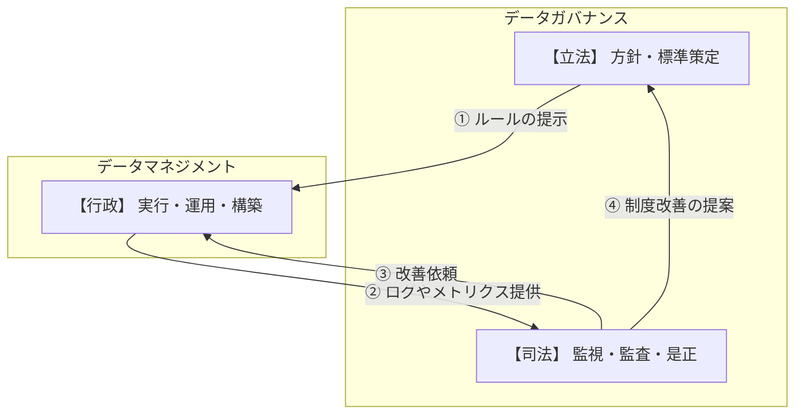
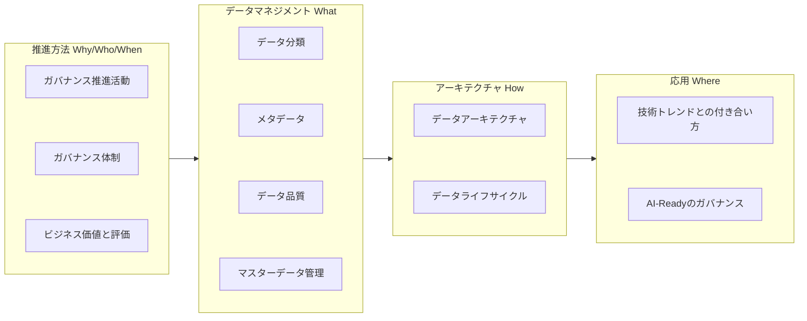
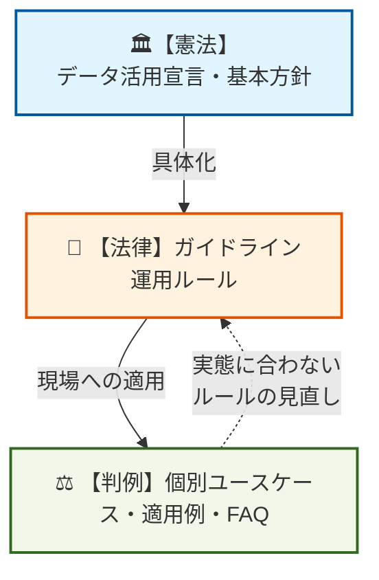
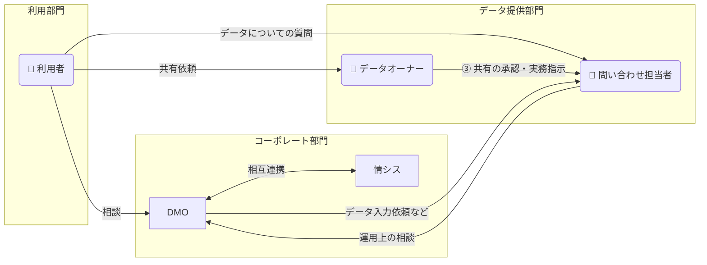
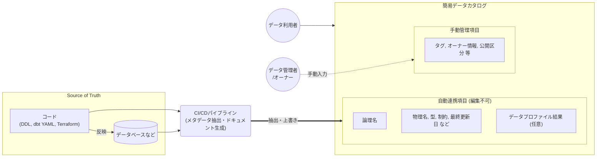
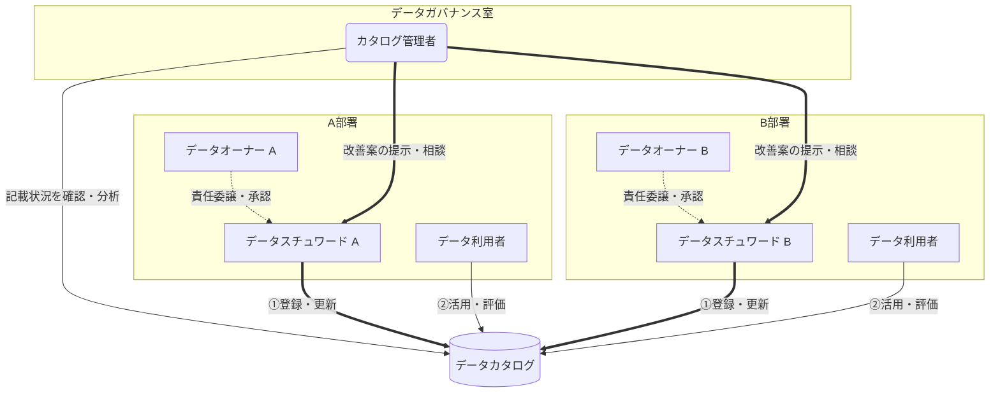
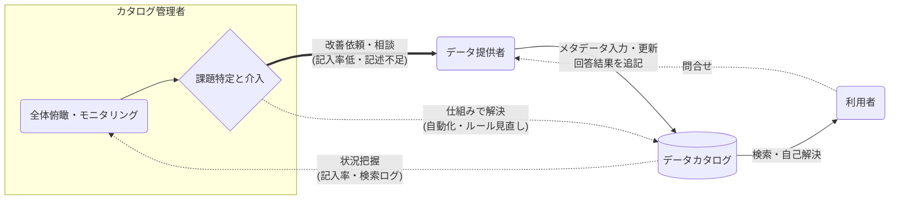
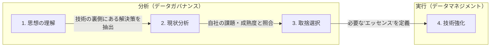

<page-title/>

::: warning 免責事項

- 有志で作成したドキュメントである。フューチャーには多様なプロジェクトが存在し、それぞれの状況に合わせて工夫された開発プロセスや高度な開発支援環境が存在する。本ガイドラインはフューチャーの全ての部署／プロジェクトで適用されているわけではなく、有志が観点を持ち寄って新たに整理したものである
- 相容れない部分があればその領域を書き換えて利用することを想定している。プロジェクト固有の背景や要件への配慮は、ガイドライン利用者が最終的に判断すること。本ガイドラインに必ず従うことは求めておらず、設計案の提示と、それらの評価観点を利用者に提供することを主目的としている
- 掲載内容および利用に際して発生した問題、それに伴う損害については、フューチャー株式会社は一切の責務を負わないものとする。掲載している情報は予告なく変更する場合がある

:::

2010年代のビッグデータブームを経て、データレイクやDWHの構築が進んだ。しかし、多くの企業では部門ごとにデータが分断（サイロ化）されているなどの理由で、データは蓄積されているが十分に活用できる状態にない。さらに、昨今のAI技術を活用するためには、データの標準化、品質、メタデータなどの文脈整理を従来以上に求められる。また、無秩序なデータの利用促進は契約違反、セキュリティ・コンプライアンス上のリスクを生む懸念がある。

データガバナンスの役割は、攻め（価値創出）と守り（統制）を両立させ、データが継続的に価値を生み出す資産に変えることにある。

本ガイドラインは、フューチャーが手掛ける多様なプロジェクトにおいて、よく議論になる論点を整理したものである。企業の競争優位を生み出すデータガバナンスの設計と実行を支援する指針として、役立つ部分があれば幸いである。

# データガバナンスとは

データガバナンスとは、データをビジネス資産として最大限に活用できるよう、「誰が、どのデータに対して、どのような権限と責任を持ち、どう管理するか」というルールと体制を定義し、継続的に監督・評価する仕組みである。

単なる「ルール作り」ではなく、以下の3つのバランスを最適化する「意思決定の枠組み」を指す。

- **品質**: 信頼できるデータであること
- **統制**: 法令やセキュリティを遵守していること
- **利便性**: 必要な人が、必要な時に、必要なデータを使えること

## データマネジメントとデータガバナンス

両者は混同されやすいが、本ガイドラインでは以下のように定義して区別する。

| 項目     | データガバナンス                                 | データマネジメント                                |
| :------- | :----------------------------------------------- | :------------------------------------------------ |
| 役割     | 何をすべきかの方針・ルール策定と監視             | どう実現するかの具体的活動・実装                  |
| 位置付け | 意思決定・評価・監督                             | 実行・構築・運用                                  |
| 実務例   | データ品質基準の策定、アクセス権限ポリシーの定義 | ETLの実装、DBのバックアップ、マスタデータの名寄せ |

データガバナンスが「立法・司法」を担い、データマネジメントが「行政」を担う三権分立の関係に近い。適切なガバナンスなきマネジメントは秩序を乱し、マネジメントなきガバナンスは形骸化する。本ガイドラインでは、この両輪をアーキテクチャにどう組み込むかを解説する。

::: tip ガバナンスを形骸化させないための要諦  
❌️**よくある失敗: ルールの丸投げ**
ガバナンスチームが方針だけを提示し、具体的な運用を現場（各事業部など）に一任した場合、現場の実態と合わず「ルールが無視される」か「対応優先度を極端に下げられる」結果に終わる。

✅️**成功に向けて運用の具体化まで伴走する**  
データガバナンス側は「方針を作って終わり」ではなく、データマネジメント側とすり合わせしながら、方針に準拠した具体的な運用フロー（簡単な手順書や申請フォーム）の作成まで踏み込むこと。現場が迷わず実行できるまで伴走しなければならない。  
:::

::: info 参考  
[データマネジメント設計ガイドライン](https://future-architect.github.io/arch-guidelines/documents/forDataManagement/datamanagement_guidelines.html) も合わせて参照すること。  
:::

## 本ガイドラインの構成

本ガイドラインは、読者がデータガバナンスの全体像を体系的に理解できるよう、物理的な章立てはフラットに記載しつつも、論理的には4つのグループで構成されている。

1. **推進方法（Why / Who / When）:** なぜガバナンスを推進し、どんなビジネス価値を生むのか（Why）。誰がそのルールを作り推進するのか（Who）。そして、組織の成熟度に合わせて「いつ」どのルールを段階的に適用していくのか（When）という戦略と体制を定義する
2. **データマネジメント（What）:** データ分類、メタデータ、データ品質、マスタ管理といった、具体的に何を管理対象とするのか（What）、各領域の指針を定める
3. **アーキテクチャ（How）:** データ基盤への連携方針やライフサイクルなど、定めたルールをシステムとしてどのように実現・運用するのか（How）を定義する
4. **応用（Where）:** 最新の技術トレンドや生成AIに対して、このガバナンスをどこへ適用し、将来的にどう発展させていくのか（Where）を示す

全体像と各章の論理的なマッピングは以下の通りである。

# ガバナンス推進活動

データガバナンスの活動で、最初に細かな運用ルールやツール選定から入るのは悪手である。また、ガバナンスを単なる「制限・統制」と捉え、リスク回避ばかりに気を取られて利活用を阻害するのは本末転倒である。

本章では、ガバナンスを「データを安心して武器として使うためのルール作り」と再定義し、それを組織にどう根付かせ、どう段階的に拡大していくべきかのロードマップを解説する。

## ガバナンス活動の考え方

データガバナンスとは「制限・統制」であると捉えられがちだが、本来は「データを安心して武器として使うためのルール作り」である。両者のバランスを言語化し、社内のコンセンサスを得ることが活動の前提である。

- **守りのガバナンス（リスクの極小化）**
  - **観点:** 個人情報保護、セキュリティインシデントの防止、法規制（GDPR等）への対応
  - **考え方:** 「誰が、どのデータに、どこまでアクセスしてよいか」を厳格に定義し、企業の信頼失墜や損害賠償リスクを防ぐ。これは既存のセキュリティルールと密接に連携する
- **攻めのガバナンス（ビジネス価値の最大化）**
  - **観点:** データの品質担保、サイロの破壊、AIや高度分析の精度向上
  - 考え方: 「ゴミデータからはゴミしか生まれない（Garbage In, Garbage Out）」。営業が入力したデータをマーケティングが信じて使えるよう、データの定義と品質基準（鮮度や正確性）を揃え、売上向上や意思決定スピードの加速に繋げる

## ボトムアップアプローチ

トップダウンで最初から精緻なデータガバナンスのルール（特に権限制御など）を作り上げようとすると、大半が「重厚で牛刀」なものになってしまう。

なぜなら、初期段階では具体的なユースケースが不明確であり、正確なリスク評価ができないためである。その状態で判断を迫られれば、担当者は「安全か、より安全でないか」の二者択一において、後者を選ぶことはできず、必然的に安全側に倒す、つまり過剰に厳しいルールにするしか選択肢がないためである。結果として理想的に作られたルールは、実態と乖離が大きくなり利活用の停滞やルールの形骸化を招いてしまう。

データ利活用の本来の目的は、業務体験を向上させつつ生産性や付加価値が高い働き方を実現することである。リスク回避ばかりに気を取られ、ルールを厳しくしすぎてこれらを阻害するのは本末転倒である。

推奨は以下の通り。

- 特に立ち上げ期は、安全性と透明性を確保するための必要最小限なルールのみを制定する、スモールスタートとする
- 最初から完璧で精緻なルールを作ることは行わない。「守るべきところは守りつつ、安心・安全にデータ活用できるよう現場に寄り添う」
- 現場に寄り添う進化型のルールとする。実務に合わせて継続的にブラッシュアップする姿勢を基本とする

::: tip ❌️よくある失敗例: 守り偏重
リスクを潰そうと守りばかりを強化した結果、現場がデータにアクセスするまでに何重もの承認が必要となり、現場から面倒だと思われてしまいフェードアウト。

**処方箋**  
初期は攻め（ビジネス価値）の割合を80％に設定するなど、最低限の法令遵守に絞ってルールを作る。まずは「使えるデータ」を現場に届けることを優先する。  
:::

## ガバナンス活動の第一歩

データガバナンスを国家の「立法」に例えるならば、最初に策定すべきはルールの土台となる「憲法」である。その下に具体的な法律（運用ルールやマニュアル）があり、日々の業務における判例（ユースケースやFAQ）が積み重なっていく、という階層構造をイメージすると良い。

まずは組織全体で合意できる「目指すべき姿」を言語化した「データ活用宣言」や「データガバナンス基本方針」を作成し、経営層の本気度を全社に示すことが第一歩となる。

::: tip 先行企業の事例：三菱電機グループの「データ活用宣言」  
優れた先行事例として、三菱電機グループが制定している「[データ活用宣言](https://www.mitsubishielectric.co.jp/serendie/stories/19/)」が挙げられる。同社は「データ資産価値の最大化（データ活用によりインサイトを得る、データ活用の文化を醸成するなど）」という攻めの姿勢と、「データの適切な取扱い（データを入手する・共有する・守るなど）」という守りの姿勢を両輪として明文化している。このように、宣言（憲法）の次に「データ活用マネジメント基本方針書（法律）」を整備するアプローチは、非常に理にかなっている。  
:::

## データガバナンスにおける憲法の制定

組織の憲法として掲げる大方針の例として、以下のような「10ヶ条」を組織のカルチャーに合わせて定義し、全社に発信すると良い。最初はこれくらいシンプルな方が現場に浸透しやすい。これはあくまで例であり、「データ活用宣言」のような形式にしても良い。

1. **データは資産**: データは「部門の所有物」ではなく「全社の共有資産」である
2. **データ駆動文化の醸成**: 「勘と経験」を否定しない。客観的なデータと掛け合わせて最強の武器にする
3. **データの民主化**: データは一部の専門家のものではない。現場の全員が自律的にアクセスできる環境を作る
4. **挑戦心**: 「とりあえずやってみる」の精神。データを用いた小さな失敗と挑戦を称賛する
5. **ビジネス価値への還元**: 「データ分析して終わり」にしない。使われてビジネスに貢献して初めて価値が出る
6. **当事者意識**: データ品質は全員で育てる。入力者から利用者まで、リレーのようにデータの鮮度と正確性を守り抜く
7. **攻めのガバナンス**: ルールは「縛る」ためのブレーキではなく、安全に「加速」させるためのシートベルトである
8. **守りの徹底**: 大胆に攻めるためにこそ、個人情報や機密情報などの「急所」は全員で徹底的に守り抜こう
9. **AI-Ready**: AIが迷わず読めるコンテキストをデータに持たせ、常に新たな技術へアップデートし続ける
10. **相互リスペクト**: データ提供側と利用側は対立しない。互いの業務と痛みを理解し、常に対話で課題を解決する

あるいは、よりシンプルに意識改革を促すため、以下のような3つのコア・バリューのようなBefore/Afterの形で宣言を定義するのも有効だと考えられる。

- **【所有から共有へ】** データを自部門に囲い込む文化から、全社横断でオープンに共有する文化へ
- **【統制から促進へ】** ガバナンスを「制限するブレーキ」から、「安全に使えるアクセル」へ
- **【感覚から事実へ】** 長年の勘や声の大きさに頼る意思決定から、データを共通言語としたファクトベースの意思決定へ

この「憲法」を、経営陣を含めた組織全体で合意し共通認識を作る。その上で組織体制や細かい法律（運用ルール）の整備へと進める。

## 必要最小限のガードレール定義

10箇条のような大方針の次には、安全性と透明性を確保するための必要最小限なルール（ガードレール）を作ることが望ましい。ガードレールを明文化することで、利用者に対して「この範囲内であれば会社が安全を保証する」という心理的な安心感を与え、個々の判断コストを削減できる。これにより、リスクを恐れて活用を躊躇する心理的ハードルを下げ、全社的なデータ利活用の加速へと繋げられる。

- **絶対的な禁止事項:** 企業としての信頼失墜や法的リスクに直結する “絶対NG” を定義する
  - **受託・外部データの目的外利用禁止**：顧客から預かったデータや、特定の目的で契約・購入した外部データ（SaaSの統計情報や外部調査データなど）を、元の契約範囲を超えて二次利用したり、別プロジェクトに流用したりすることを禁止する
  - **未公開情報の機密保持**：インサイダー取引規制に抵触する恐れのある未公開の財務情報や、未発表の経営戦略に関するデータの二次利用・加工・共有を制限する
  - **個人情報の非匿名化利用の制限**：分析目的であっても、個人を特定できる情報（氏名、詳細な住所等）をそのまま扱うことは原則禁止とし、適切なマスキングや統計化処理を必須とする。
- **安全な利用経路の提示**: 何がダメかだけではなく、どうすれば安全に使えるかの道筋を示す。すべてのデータを一律に保護するのではなく、データ分類（極秘・社内・公開等）を定義し、「L1（公開）データであれば、事前申請なしで誰でも自由に二次利用してよい」といったお墨付きのルールを設ける。これが利用者の最大の安心感に繋がる（詳細は [データ分類](#データ分類) 章で扱う）
- **エスカレーションパスの明確化**: 「このデータを使っていいか」と迷った際、現場の担当者が自分自身で法的・倫理的なリスクを抱え込まないためのセーフティネットを設ける。最終的なアクセス承認の権限を持つ「データオーナー」を明確にし、「オーナーの許可さえ得れば、利用者の責任は免責される」という体制を構築する（詳細は [データオーナー](#データオーナー) 節で扱う）

## 社内の成熟度に合わせたガバナンスの段階的進化

ガバナンスは一度作って終わりではなく、社内のデータリテラシーやスキルの成熟度に合わせて、段階的に進化していくべきである。利用の実態を観測、分析しながら、攻めと守りのバランスを変えていく。

成熟度は単なる感覚ではなく、以下のような定量的な指標で把握する。

- **BI活用**: 公開されたダッシュボード数、PV数、アクティブユーザー数
- **基盤利用**: データ基盤のテーブル数、クエリ実行数
- **ナレッジ管理**: データカタログのPV数、アクティブユーザー数、登録テーブル数、ビジネスメタデータの記入率

これらの数が増え、利活用が本格化してきたタイミングこそが、新たなルールを適用すべき時期である。現場から上がる具体的なユースケース（要望・要求）に都度応えながら、実務を阻害しない範囲で「安全と再利用性のためのルール」を組み込んでいく。

社内の課題レベルに応じて、策定すべきルールの優先順位は次のように遷移する。

| 成熟度フェーズ | 課題例                                                | ルール例                                                 | ルールの目的                                   |
| :------------- | :---------------------------------------------------- | :------------------------------------------------------- | :--------------------------------------------- |
| 初期           | ・データの持ち出しが不安 ・誰が責任者か不明           | ・個人情報の取り扱い ・アクセス権管理                    | セキュリティ・法務面メインのリスク回避         |
| 導入期         | ・データの所在地不明 ・用語がバラバラ                 | ・データ所在の登録 ・項目名の定義 ・データオーナーの指定 | メタデータの整備による探す手間の削減           |
| 成長期         | ・データの値が不正確で分析に使えない                  | ・更新頻度の保証 ・名寄せ基準                            | データ品質・信頼性の担保における分析精度の向上 |
| 成熟期         | ・過剰なルールによるスピード低下 ・統制ルールの形骸化 | ・データリネージ ・自動クレンジング                      | 高度な運用ルールの整備によるDXの高速化         |

::: info 参考  
監視すべきメトリクスについては [利用状況を観測する](#利用状況を観測する)節 を参考にする。
:::

## ガバナンス適用の展開計画

「すべてのデータを統制する」という幻想を捨て、ガバナンスの適用範囲はまずは摩擦の少ない領域で成功体験（ショーケース）を作ることから始める。展開に当たっては、以下のロードマップを基本として「機能軸」と「組織軸」を掛け合わせ、段階的に拡大していく。

1. **ローカル（特定ユースケース）**
   1. **対象:** 意欲の高い特定事業部内のデータのみ
   2. **目的:** 摩擦を抑え、最速で「データで儲かった・コストが下がった」という実績を作る
   3. **組織軸の視点**: 最初の部署で得られた運用ノウハウを「標準テンプレート」化し、次工程への展開準備を整える。
2. **全社（国内グループや事業部間）**
   1. **対象:** 複数事業部を跨ぐデータ（顧客マスタ、主要な取引データ）
   2. **目的**: 本格的なデータカタログ整備や全社データリテラシー教育に投資する。共通マスタの統制と、各部門の自由な分析領域（データマート）の線引きを行う
   3. **機能軸の視点**: 不整合による損失が大きい重要データから着手する。一方で、各業務特有の取引データは現場の柔軟性を優先し、全社共通ルールは最小限に留める。
3. **グローバル（海外拠点）**
   1. **対象:** 経営管理上に不可欠な最重要KPIと、最小限のグローバル共通マスタのみ
   2. **目的:** グローバルの意思決定スピード向上
   3. **注意点:** 各国の商習慣や法規制（GDPR等）が異なるため、ローカルの取引データまでグローバルで統一しようとすると失敗しやすい。「中央でガチガチに統制するデータ」と「各国ローカルに委ねるデータ（共通ガードレールのみ）」を厳格に切り離す
4. **ゴール（理想状態）**
   1. **対象:** 全社のあらゆるデータドメイン
   2. **状態:** 全社で共通言語（マスタ）が通じ、各現場のデータオーナー・スチュWordが自律的に自組織のデータに責任を持って管理・活用している状態。DMOの役割は直接的な統制から共通基盤の提供と支援（センター・オブ・エクセレンス）へと移行する

## ビジネス価値と評価

データガバナンスおよびデータ利活用の推進において、その投資対効果（ROI）を経営層へ明確に提示できない活動は、持続的な発展を望めない。また、企業の競争優位を生みだすためのデータ利活用には、効果的な評価指標（KPI）に基づいたPDCAサイクルを回すことが求められる。  
ここでのガバナンス評価とは、単なる管理状況の確認に留まらず、「データがどのようにビジネス価値へと変換されているか」を多角的に捉えるプロセスである。

本ガイドラインでは、データからビジネス価値がつくられるプロセスを可視化するため、効果的な評価指標を以下の3つの階層に分けて考えることを推奨する。

1. データ資産の健全性
2. データ利用率
3. ビジネスインパクト

## データ資産の健全性

データ資産の健全性とは、競争優位の源泉となるデータの「信頼性」を測る指標である。これらはデータ分析の土台であり、改善することで、意思決定の精度の向上に繋がる。逆に、正確性や網羅性が欠けたデータは「負債」となり、後続のすべての分析を誤らせる。そのため、これらはガバナンスの成否を分ける重要指標となる。

- **データ網羅率・正確性・鮮度:** ビジネス上の意思決定や業務プロセスに必要なデータが、欠落なく保持されているか、また、データが観測対象の事実を正しく反映し、かつ意思決定に間に合うタイミングで更新されているかの指標である。[データ品質](#データ品質) 章の方針に基づき管理、可視化する
- **メタデータ充填率:** データの定義が明確で、誰でもその意味を正しく理解できる状態にあるかの指標である。 [メタデータ](#メタデータ) 章の方針に基づき管理、可視化する

## データ利用率

データの利用状態を測る指標である。競合よりも早く、試行回数を増やすことで、より多くの仮説検証を実施して成功率を高めることに繋がる。いかに早く現場がデータに辿り着けるかが、組織の機動力を測る指標となる。また、結果としてデータのアクセス数、BIダッシュボードがどれくらい増えたかが重要である。

- **データ取得時間:** ビジネス部門の分析者が、必要なデータを見つけて利用を開始するまでにかかる時間。この指標の計測には、部分的にではあるが、アクセス権限申請の承認リードタイムや、カタログツールの検索回数などから効果を試算すると良い
- **データ準備コストの削減率:** 分析作業全体のうち、データの前処理に費やされる工数の削減割合。既存に存在する特に他部門のデータマートなどを流用できた場合に、削減できたと主張しやすい
- **データアクセス数**: BI無しでデータ利用していることも考えられる。テーブルへの直接のデータ利用率を確認する
- **BI活用率:** 現場でデータを活用できている指標として、BIダッシュボード数やそのアクセス数（利用率）は重要である

## ビジネスインパクト

データガバナンスによって、実際にどれだけ業務効果があったかを伝えることは重要である。一方でデータガバナンスの立場では、個別具体のデータ活用案件の業務効果は直接把握することは難しいため、工夫が必要である。

- 各個別案件から、業務効果についての実績を収集する
  - データを活用した施策（在庫最適化など）が、最終的にどれだけの財務的インパクト（売上向上、コスト削減）をもたらしたかを実績として残せるとベスト
  - 財務インパクトがない場合でも、データ利活用を元にした新規サービスや、競争優位に繋がるような競合との差別化をもたらした場合も、経営として関心が強いことが多い

::: info 【参考】データガバナンス成熟度モデル  
各指標のスコアに基づき、組織としてのデータ管理能力が現在どの段階にあるかを格付けするのが「データガバナンス成熟度モデル」である 。これは単なる点数付けではなく、組織が「属人的な対応」から脱却し、「データが自律的に価値を生む状態」へ進化するための道標として参考になる。  
例えば「データ健全性はレベル3を維持しつつ、データアクセシビリティとビジネス価値創出をレベル4へ引き上げる」といった目標設定が、競争優位性を生む近道とされる。

| レベル  | 具体的な状況                                                     | 「データ健全性」についての例                                                                     | 「データアクセシビリティ」についての例                             | 「ビジネス価値創出」についての例                                                                      |
| :------ | :--------------------------------------------------------------- | :----------------------------------------------------------------------------------------------- | :----------------------------------------------------------------- | :---------------------------------------------------------------------------------------------------- |
| レベル1 | 担当者が個人のスキルでデータを管理している。プロセスは属人的。   | データの不備をユーザーが手動で見つけ、個別に修正している。統一的ルールはない。                   | 必要なデータを得るために、誰に頼めばいいか分からず数週間かかる。   | データ活用は行われているが、それが利益にどう繋がっているか誰も説明できない。                          |
| レベル2 | 特定のプロジェクト単位でルールが決まっており、管理されている。   | 特定のプロジェクトや部署内で、データの整合性チェックルールが存在する。                           | データ抽出の依頼手順が決まっており、特定のIT担当者が対応している。 | 特定の施策で、限定的に効果を測定している。                                                            |
| レベル3 | 全社共通の標準プロセスが定義され、組織として運用されている。     | 全社共通の「データ品質基準（正確性・網羅性など）」が定義され、全部門で同じ基準で評価されている。 | データカタログが整備され、誰でも必要な場所を検索できる。           | ビジネスKPIと連動したデータ活用計画が運用される。ビジネス部門とIT部門が共通の「価値」を定義している。 |
| レベル4 | プロセスのパフォーマンスが定量的に測定・管理されている。         | 品質スコアが自動測定・可視化されて「データ品質ダッシュボード」で全社に公開されている。           | セルフサービスBIが定着し、現場が即座に分析できる。                 | データ活用によるROIが定量化され、投資判断の主要な根拠として機能している。                             |
| レベル5 | 継続的な改善プロセスが定着し、自動化や新技術の導入が進んでいる。 | AI等が自動でデータ不備を検知・補正し続ける仕組みが構築されている。                               | 必要なデータがリアルタイムで提供され、待機時間がゼロ。             | AI等がデータから次の施策や新サービスを提案してくる仕組みが構築されている。                            |

成熟度モデルを活用したガバナンス評価の取り組みは、経産省の策定するDX認定やDX銘柄を目指す場合にも一考の価値がある。

- DX認定: 企業がDXを推進するための「体制」が整っているかを、国（情報処理推進機構：IPA）が認定する。[https://www.ipa.go.jp/digital/dx-nintei/about.html](https://www.ipa.go.jp/digital/dx-nintei/about.html)
- DX銘柄: 東京証券取引所に上場している企業の中から、DXによって「革新的なビジネスモデルを構築」し、「企業価値を向上」させている企業を選定する制度。[https://www.meti.go.jp/policy/it_policy/investment/keiei_meigara/dx_meigara.html](https://www.meti.go.jp/policy/it_policy/investment/keiei_meigara/dx_meigara.html)

:::

# ガバナンス体制

## 誰がガバナンスを主導すべきか

ガバナンス（全社ルール・統制）の旗振り役は、最初から最後までコーポレート部門（DMO: Data Management OfficeやIT部門等）が担う必要がある。しかし、そのルールをどの領域に、どの程度の強さで適用していくかといった推進は、成熟度に応じてシフトさせるのが現実的である。

ガバナンスの主導権は、最初から最後まで1つの部門が固定で持つべきではない。DMOの成熟度に応じて、主導する部門を意図的にシフトさせるのが現実的である。

- **立ち上げ期: 特定事業部のユースケース主導**
  - **体制**: コーポレート部門が旗振りしつつも、実ビジネスの課題を持つ事業部門（営業、マーケティングなど）を主役に据える
  - **理由:** 初期フェーズ最大の壁である「データ問い合わせ対応や、メタデータ提供の負荷（負のインセンティブ）」を突破するため。自らの業務課題（売上向上や工数削減）を解決するという旨味（Quick Win）がなければ、現場は絶対に動かない
  - **アプローチ：** ガバナンスを緩めに設定し、特定のユースケース実現に直結するデータ整備のみに集中する
- **拡大/定着期: コーポレート主導の全社統制**
  - **体制**: コーポレート部門が本来の「全社横断の統制役」として前面に出る
  - **理由：** 立ち上げ期に作られた仕組みが部門をサイロに陥るのを防ぎ、他部門とのデータ連携や全社的なコスト最適化を図るため
  - **アプローチ：** 成功事例を横展開するタイミングで、全社共通のルールをコーポレート主導で敷いていく

::: tip 例: コーポレート主導へのシフトとなる契機

- **例（1）複数部門間での「データ連携ニーズ」と「定義の矛盾」が発生した時**
  - 他部門からデータ利用の要望が出始め、「優良顧客」などの定義やコードが部門間で衝突した時。一部門の権限では解決できないため、コーポレート主導による部門横断の全社共通ルールの標準化が必要
- **例（2）ツールや基盤の「二重投資（シャドーIT）」の兆候が見えた時**
  - 各部門が独自の予算でBIツール等を導入し始めた時。コスト肥大化とセキュリティリスク（野良データの散在）を防ぐため、全社共通アーキテクチャへ統合することが大義名分となる
- **例（3）データ運用が「現場の手に余る（属人化の限界）」状態になった時**
  - 現場が構築したデータ処理がインフラ化し、日々の運用（手動クレンジング等）で担当者が疲弊し始めた時。コーポレートが定常運用として巻き取ることで、現場をビジネス活用に専念させる
- **例（4）経営層から「全社横断の統合ダッシュボード」の要求が出た時**
  - 現場の成功事例を見た経営トップから「全事業部横並びで指標を見たい」とトップダウンの指示が出た時。この圧力を強力な追い風とし、一気に全社横断の組織へと格上げする

:::

## DMO組織体制と役割定義

複数部門が関わるデータ活用では、入力負荷やコスト負担、データ定義の解釈などを巡る利害対立が必ず発生する。そのため練り込んだガバナンス方針を定めても、対立を現場レベルで調整し、実務へと落とし込む役割がなければ、方針は形骸化する。

本節ではルールを運用に載せるための組織形態と各々の役割を定義する。

### DMOの組織のあり方

DMO機能の実装にあたり、その役割をどこに実装するかは2つの進め方がある。

- DMOの役割を既存の情報システム部門に担わせる
- DMOとして、独立した新組織を組成する

システムの構築（IT視点）とデータによる事業変革（ビジネス視点）では、必要なスキルセットと社内での立ち回り方が異なるため、組織として何を主目的とするかを基準に意思決定する。

| 比較軸       | 既存部門の拡張型                                                                                                                                           | 新規DMO独立型                                                                                                                         |
| :----------- | :--------------------------------------------------------------------------------------------------------------------------------------------------------- | :------------------------------------------------------------------------------------------------------------------------------------ |
| 主目的       | データ基盤の安定構築と「守りのガバナンス」の徹底                                                                                                           | データを用いた「攻め」の事業変革とビジネス価値創出                                                                                    |
| 適したケース | 既存情シスが現場の業務プロセスまで深く入り込めている組織                                                                                                   | 既存情シスがインフラ保守・要件通りのシステム開発に留まっている組織                                                                    |
| メリット     | ・既存のIT予算や決裁ルートを使えるため、立ち上げが早い ・既存のセキュリティルールやインフラ基盤との親和性が高い                                            | ・システム保守など既存業務に引っ張られず、データ利活用に専念できる ・IT部門と事業部門の中立的な立場で、部門間の利害調整がしやすい     |
| 懸念点       | ・情シスの日常業務（ヘルプデスクや障害対応）に忙殺され、DMO活動が後回しになる ・立派な基盤を作って終わりになり、現場への定着（チェンジマネジメント）が弱い | ・既存情シスとの間でどこまでがシステム管轄で、どこからがデータ管轄かの線引に手間取りやすい ・新たな人員確保と予算獲得のハードルが高い |

::: tip 独立組成を推奨するケース  
 全社的なデータ利活用を確実に定着させたい場合、新規DMOの独立組成を推奨する。既存情シスとDMOとでは「ミッション」と「求められるスキル」が相反するためである。

- 既存情シス（兼務）の限界: 第一のミッションがシステムの安定稼働とIT統制であるため、日々のヘルプデスク業務や障害対応に忙殺され、DMO活動がフェードアウトしやすい
- DMOに求められる役割: 業務部門の利害調整（例: 入力負荷と業務効率化のトレードオフ解消）や評価制度の設計などのチェンジマネジメントが求められる。これは要件定義とシステム開発を得意とする従来の情シスの職能とは異なる

したがって、データ基盤の構築や保守は既存情シスが担い、データ活用の推進や利害調整は専任のDMOが担うという役割分担が、確実な方法である。  
 :::

### 組織図を作成するタイミング

DMOの組織図は、最初から立派なものを描いてはならない。実態のない名ばかり組織になるのを防ぐため、データ活用の成熟度に合わせて進化させる。

| フェーズ   | 組織図の方針                                   | 体制・アプローチ                                                                                                                                                                                                                                                                                                                                     |
| :--------- | :--------------------------------------------- | :--------------------------------------------------------------------------------------------------------------------------------------------------------------------------------------------------------------------------------------------------------------------------------------------------------------------------------------------------- |
| 立ち上げ期 | 階層的な組織図は作らない（役割や連携図は作る） | 最初から「◯◯部」といった固定の組織図を作ると形骸化しやすい。最初は特定のユースケースに関わるメンバーを集めた「タスクフォース（兼務チーム、バーチャルチーム）」として開始し、実務を通じてルールを揉む。ただし、実務を回す上で誰が、どの部署にデータ是正の依頼を出すかといった関係性は簡易的な図として準備したほうが混乱しにくいし、依頼も出しやすい。 |
| 拡大期     | 正式に描く                                     | 複数部門間でデータを相互利用し始めた段階で、初めて役員クラスを巻き込んだ全社的な「データガバナンス委員会」と「DMO事務局」の正式な組織図を定義する。                                                                                                                                                                                                  |

::: info 例: 立ち上げ期の関係図  
正式な組織図ではなく実務上の役割分担は図示した方が、認識齟齬が出にくくなる。

:::

### 役割定義の最小構成

DMBOK（データマネジメント知識体系）に記載されているような、数十に及ぶ細かな役割定義は、立ち上げ期の現場に混乱を招いてしまう。実践的には、以下の4つの役割のみ定義し、RACI（実行責任、説明責任、相談先、報告先）を割り当てると良い。

| ロール                           | 説明                                                                                                                                                       |
| :------------------------------- | :--------------------------------------------------------------------------------------------------------------------------------------------------------- |
| DMOリード（推進責任者）          | ビジネス要件とIT要件を翻訳し、部門間の利害調整を泥臭く行う推進役かつ調整役。                                                                               |
| データオーナー（決定権者）       | そのデータを使ってビジネスに責任を持つ業務部門の長（例：顧客データなら営業本部長）。IT部門に押し付けてはならない。データ品質と利用権限の最終決定権を持つ。 |
| データスチュワード（現場実務者） | オーナーの下でデータ定義書の作成やデータ問い合わせ対応などを行う現場の担当者。                                                                             |
| データエンジニア                 | DMOやスチュWordの要求に基づき、データ基盤を構築・運用するIT担当者。                                                                                        |

### 既存セキュリティ部門との境界線

DMOや新たな役割を定義する際、既存の情報セキュリティ部門が定めたルールを重複（上書き）して策定する必要はない。両者の管轄領域を金庫の鍵と金庫の中身に例え、以下のように整理すると良い。

- **情報セキュリティ部門**: 鍵をどう守るか（ネットワークやシステムの物理的・技術的防衛、アクセス制御の基盤）を担う
- **DMO**: 金庫の中身であるデータの業務的な意味は何か、誰がどんな目的で使ってよいかという業務ポリシーを定義する

両者は連携し、DMOが定めた業務的なアクセスポリシーを、セキュリティ部門がシステムに実装するという役割分担となる。

### データ提供のインセンティブ設計

複数部門間でのデータ利用での壁は、データ提供の手間である。全社のためにと現場（データスチュワード）にデータ入力やクレンジングの負担を強いても、そのメリットは経営層や他部門しか享受できない。結果として提供側は疲弊し、適当なデータを入力するようになる。全社のためにという精神論は通用しない。現場が自発的に動くためのインセンティブを設計し、入力者と受益者の非対称を解消する必要がある。

- **業務への直接フィードバック**
  - 入力負担を強いる前に、「このデータを入れると、自部門の業務がこう楽になる（例：精度の高い営業アタックリストの自動生成など）」という果実（ダッシュボード等）を真っ先に提供する
- **評価への組み込み**
  - データの品質維持や他部門へのデータ提供による全社貢献を、ボランティアとして扱わず、部門や個人の人事評価（KPI・MBO）に明確に組み込む
  - 同時に貢献活動を見える化することは組織制度の変更無しで行えるためクイックに取り組むと良い。[利用状況を観測する](#利用状況を観測する) を参考にする
- **負のインセンティブ排除**
  - SFA入力等の徹底的な自動化やシステム連携により、現場の「手作業による入力」を極力排除し、自動化の対応によるデータ提供側の負荷を下げる

## データオーナー

データ利活用を安全かつ継続的に進めるためには、「誰がそのデータに責任を持っているのか」を明確にする必要がある。ここでは、その役割を「データオーナー」と定義する。データオーナーは、そのデータを生み出し、ビジネスに活用している業務部門の責任者が担う。主な役割は次の通り。

- **データ分類の設定**: そのデータの全社公開可否や機密レベルを決定する
- **共有依頼の承認判断**: L2（内部限定共有）やL3（厳格管理）データに対して、他部署から利用申請があった際の共有可否を判断する
- **ビジネスメタデータの最終責任**: データカタログに記載する説明や業務ルールを記述する（データスチュワードと分担してよい）
- **問い合わせ対応**: 利用者からのデータ仕様に関するエスカレーション先となる（データスチュワードと分担しても良い）
- **DMOからの依頼対応**: ビジネスメタデータ入力など、DMOから作業依頼の対応責任を持つ

::: tip 運用のポイント: 実務の委譲  
実務上、多忙なデータオーナー（例: 部門長クラス）がすべての問い合わせ対応やメタデータ入力をこなすのは非現実的である。そのため、現場のデータ担当者（データスチュワード）を任命し、実作業は一次対応を移譲することが望ましい。  
:::

### データオーナーの選定方法

単一の部署が入力し、利用もその部署だけであればオーナーの特定は容易である。しかし、実際の業務プロセスでは「複数の部署で1つのレコードを更新する」「各部署からデータを集めて取りまとめているだけの部署がある」というケースも多く、オーナーの特定は容易ではない。特に「データ発生源側がデータオーナーである」といったルールでは、反発が起きやすい。実際の各部署の立場を考えると、自分たちが作成・更新していない行や列を含むデータの、責任を持てと言われても心理的・実務的に抵抗があるためである。

オーナー選定には次の判断基準がある。

- そのデータのビジネスロジック（集計ルール）を定義した部署
  - 「データを入力した部署」や「システムを保守しているIT部門」ではならない。それはデータオーナーから作業を移譲されているだけである
- アクセス申請の可否や、データ分類（公開タイプ）を決定できる部門
  - 例: 別部署からアクセス申請が来た時に、そのOK/NGを判定できる人（組織）がデータオーナーになっているか
  - 例: データ分類を「全社公開」レベルに広く上げても良いと考えた時、その判断をできる人が（組織）がデータオーナーになっているか

::: tip よくある複雑なケースと解決方針

- **事例**: 経営企画や経理部門が、中期経営計画の策定のために各事業部からデータを集約している。集計ロジックは経理が指定し、各事業部はそれに従ってデータを渡している
- **判定**: データ生成は各事業部だが、集計ロジックを定義し、そのデータを使って最終的な中経の作成というビジネス責任を負うのは経理である。したがって、この集計データのオーナーは「経理部門」に設定するのが適切である
- **運用の補足**: もちろん、実務的に経理に集計ロジックではなく、各事業部のデータの中身について問い合わせても回答は難しいため、それについては各事業部側にデータ問い合わせをディスパッチする運用をセットで定義する

:::

### データオーナーを決定するタイミング

データオーナーの選定は、最初から全データに対して行う必要はない。フェーズや状況によって次の優先順位で決定していく。

- **データ基盤連携の開始時**: 新規であればデータカタログに登録するタイミングとセットで、個別具体的にデータオーナーやデータスチュワードをアサインするルールとする
- **すでに連携済みのデータでオーナーが不在のもの:** 他部署から「アクセス申請」や「問い合わせ」が発生したタイミング（必要に迫られた時点）で、暫定オーナーを協議して設定するオンデマンド方式を検討する。これにより、使われていないデータのオーナー探しにリソースを浪費することを防ぐ

::: tip ガバナンス状況の可視化とKPI設定  
「データオーナーの決定率」などをメトリクス管理すると良い。できれば組織ごとに入力率を比較して可視化すると良いが、データを保有する組織がすなわち、データオーナーであることもあり、鶏卵の関係になりやすい。その場合は、実務的には回らないがより大きな括りの組織（課、部、事業所など）ではなく、「本部」などの粒度で入力し、その単位で進捗を競わせることで、本部内のどの「部署」が真のオーナーかという特定作業を促進させる。  
:::

## 費用負担

データ利活用を全社で推進する際、避けて通れないのが、だれがコストを払うのかという費用負担の問題である。

1. **データ基盤のインフラ費用**: SnowflakeやBigQueryなど、データの蓄積・分析基盤そのものにかかるクラウド費用
2. **源泉システムの改修費用**: データ利用部門の項目追加などの要求により、データ提供部門の業務システム側で発生するベンダー改修費用

::: warning 組織の按分文化や慣習を優先する  
本節ではこの問題を解決するための推奨方針を提示するが、費用負担の考え方は、各企業が長年培ってきた予算管理の文化や按分の慣習に強く依存する。そのため、まず「自組織の既存の按分文化や慣習を優先する」ことを大前提とする。その上で以下の推奨方針を適宜調整して適用を検討する。  
:::

### データ基盤のインフラ維持・従量課金コスト

クラウド型データ基盤の費用は、利用量（クエリ量やデータ保存量）に応じて変動する。このインフラ費用の負担については、データ利活用の成熟度に合わせて方針を切り替えることを推奨する。

| フェーズ           | 推奨される負担方針               | 採用の理由                                                                                                                                                                                                                                       |
| :----------------- | :------------------------------- | :----------------------------------------------------------------------------------------------------------------------------------------------------------------------------------------------------------------------------------------------- |
| 立ち上げ期〜成長期 | コーポレート部門が共通予算で負担 | 最初から利用量に応じた按分（請求）を行うと、各部署が課金を恐れて活用を躊躇し、「データの民主化」や「とりあえずやってみる」という挑戦の文化が根付かなくなる懸念のため。また、実績がない初期段階では各部署が予算確保のための見積もりを行いにくい。 |
| 成長期～成熟期     | 各部署への受益者負担で按分する   | 全社での利用が定着し、インフラ費用がコーポレート予算を圧迫し始めた段階で移行する。ダッシュボードやデータ基盤の利用が定着し、業務上の効果が実証された後であれば納得感を得やすく、コスト意識を持った効率的な活用も期待できる。                     |

### 源泉システムの改修費用

データ利用部門がより高度な分析のために項目追加を要求し、データ提供部門の源泉システム（ERPなど）を改修する必要が生じた場合、その改修費用を誰が持つかは揉めやすい。この場合、その改修による改善が、全社的なメリットをもたらすか（全体最適か）を基準として、コーポレート予算を適用するかどうかを判断することを推奨する。

1. **全社メリットがある場合**
   - **条件**: 要求されたデータの追加や改修が、将来的に他の部署の分析にも広く活用できる汎用的なものであるか、全社的なデータの品質向上（例：顧客コードの標準化対応など）に直結する場合
   - **方針**: 例え発端が特定部門の要求であっても、将来的な全社メリットへの投資とみなし、コーポレート部門が改修予算を負担する。これにより、データ提供部門の不満を抑え、改修をスムーズに推進する
2. **全社メリットが見出せない場合**
   - **条件**: 特定の部署の、極めて局所的な業務要件や一時的なキャンペーン分析など、その部署しか使わず他部署への波及効果が薄い項目の場合
   - **方針**: コーポレート予算は適用せず、原則としてデータ利用側が自身の事業部予算を確保し、その中で改修費用を負担する受益者負担を原則とする

これにより、データ提供部門の「他部署のために自部署の予算を削られる」という不満を抑え、全体最適に資する改修をスムーズに推進することが可能となる。

# データ分類

データ利活用を全社で推進する際、最大のボトルネックとなるのはデータ提供側の「自分の部署のデータを出して、もし情報漏洩や目的外利用が起きたら誰が責任を取るのか？」という恐怖である。提供側と利用者側で1つ1つの個別交渉をさせては、業務負荷が大きく、データ提供者側が共有依頼をスルーしてしまう懸念がある。これではデータ利活用は進まない。

そのため、データ提供の業務的・心理的ハードルを下げる必要があり、ガバナンス組織がトップダウンで「この条件を満たせば全社公開してよい」「このデータは二次利用厳禁とする」というお墨付きを与えなければならない。これを実現する枠組みが「データ分類」である。

その特性上、データガバナンスの “憲法” を定めた後、具体的に取り上げるデータ利活用のユースケースを調査/円滑化するのと並行して、これの策定に取り組むべきである。

## 4種類のデータ分類例

データガバナンスの初期段階においては、ISMSのような機密区分（極秘・秘・社外秘など）をそのまま流用するのではなく、データ提供者が直感的に判断できる信号機のような分かりやすい3段階の共有レベルに、検索回避のための『非公開』を加えた4段階の定義など、データ活用の実態に合わせて個別の分類定義を検討すると良い。

| 共有レベル      | データの条件（例）                                                                                               | 共有ルール（お墨付きの内容）                                                                                            | 承認フロー                                          |
| :-------------- | :--------------------------------------------------------------------------------------------------------------- | :---------------------------------------------------------------------------------------------------------------------- | :-------------------------------------------------- |
| ❌️ L4: 利用禁止 | ・受託データなど、契約の縛りで二次利用が禁止のデータ                                                             | **【二次利用が完全に不可】** データが存在すること自体は提示し、存在有無の問い合わせをスキップさせる用途のためだけに設置 | **承認フローが存在しない**                          |
| 🔴 L3: 厳格     | ・個人情報 ・未公開の財務/人事情報 ・特定のNDAに基づく社外データ                                                 | **【原則、二次利用不可】** 特定のプロジェクトメンバーのみアクセス可。データ基盤での他部署への共有や結合は原則禁止       | **厳格な個別審査** （業務上の必然性が必要）         |
| 🟡 L2: 内部限定 | ・他部署の詳細な業務データ ・未加工だが個人情報を含まない明細 ・一部の原価や取引情報                             | **【用途を限定して利用可】** 申請された業務目的（分析やレポート作成）の範囲内でのみ二次利用を許可する                   | **データオーナーの承認** （＋利用側上長の承認など） |
| 🟢 L1: 全社公開 | ・個人情報（PII）を含まない ・全社共通のマスタ ・集計済みの統計・サマリデータ ・マスキング済みのトランザクション | **【二次利用 歓迎】** データ基盤上で全社員が自由に検索・参照してよい。利用目的も問わない                                | **承認不要**                                        |

全てのデータをL3（要承認）にしてしまえばデータ提供側は安全だが、それでは利活用は進まない。DMOの腕の見せ所は、ユースケース（データ利用要望）に対して、「L3（生データ）の個人情報をマスキング・匿名化し、L2（内部限定共有）にすることや、L2の明細データを集計することで粒度を下げて、L1（全社公開OK）に落とし利用者に開放するか」を設計する点にある。

運用にあたっての、推奨や注意点は以下の通り。

- 原則、L1を推奨し、とりあえずL2を防ぐ
  - 現場はリスク回避のため、とりあえずL2にしておくということが横行しやすい。しかし、アクセス許可申請の可否判断や、データ問い合わせ依頼などの業務負荷も馬鹿にならない。できる限りL1にしておくことで、対応コストを減らすことができる
- データカタログ表示による自己解決
  - データ分類は、データカタログ上で表示させることで、利用者が問い合わせなしに利用可否について判定できる
  - データ提供者側にもメリットがある
- ユースケース（需要）なき事前加工は行わない
  - L3のデータを安全なL1に加工して開放することは尊いが、具体的な分析ニーズやビジネス課題がないまま、闇雲に全データをL1に加工しても骨折り損になるリスクが高い。必ずこのデータをこう使いたいという需要が発生したタイミングで行うこと

## データ分類を補完する用途制約フラグ

データ分類はアクセス可能範囲の制御には有効だが、使用方法に関する制約を表現できない。たとえば L1（全社利用可能）に分類されるデータであっても、顧客との契約（NDA 等）や著作権などの制約によりAIの学習データとしての利用が禁止されている場合がある。そのため、データの使用方法に関する制約については、データ分類とは別軸のフラグをメタデータとして付与することを推奨する。

付与するべきフラグの一例として、「二次利用不可」「推論不可」「学習不可」などが挙げられる。  
ただし、闇雲にフラグを付与するのではなく、どのようなフラグが必要か、必要に応じて法務（リーガル）部門と協力しながら必要なフラグを定義する。

- 顧客との契約（NDA・利用規約等）で学習利用が禁止されている
- 個人情報保護法上、学習目的での利用に本人同意が取れていない
- その他、社内ポリシーにより学習利用を制限すべきと判断されたデータ

フラグを設けた上で、データ登録・提出時に、データオーナーに対し、これらのフラグの要否判断とマークを依頼する。

## データのマスキング {#データのマスキング}

L3（厳格管理）や L2 に分類されたデータに対しても、適切なマスキング（匿名化・仮名加工）を施すことで、個人や機密情報の特定可能性を除去することで、データ分類をより広い安全レベル（L1など）に引き下げることができる。これにより、安全に二次利用の範囲を広げる。

### マスキングポリシーの策定

「何をマスキングするか（対象）」と「どのようにマスキングするか（手法）」を定めないと、データオーナーは「どう処理すればよいかわからない」ためにデータ分類を L3 のまま据え置く傾向があり、結果としてデータの利活用が進まなくなる。また、対象の判断基準がないと、現場ごとに判断がぶれてしまい、データ利用者への連携時にデータ提供者との余計な個別交渉が発生してしまう恐れがある。

これらを防ぐため、PII等の機微な情報に対するマスキング基準を、データ分類によらない全社の共通ポリシーとして定めておく必要がある。構造化データにおいては、どの項目をマスキング対象となる機微情報とするかは、いくつかのパターンがある。例えば、アクセスログ分析など個人情報の特定は防ぐ必要があるのは分かりやすいが、社員の給与情報などは “だれが” が分かっても良いが、それが持つ属性の一部を隠す必要がある。5W1Hの軸であてはめて整理すると混乱しにくい。

**表: 5W1Hに基づく対象と基本方針**

| 秘匿対象の分類 | 対象カテゴリ                      | 概要・リスク                                                 | 具体例                       |
| :------------- | :-------------------------------- | :----------------------------------------------------------- | :--------------------------- |
| Who 識別情報   | （1） 直接識別子                  | 単体で個人を特定できる情報。                                 | 氏名、詳細な住所、電話番号   |
|                | （2） 間接識別子                  | 他の情報と組み合わせることで個人を特定しうる情報。           | 生年月日、郵便番号、年齢     |
|                | （3） 業務固有の識別情報          | システム上の結合キーとして利用される情報。                   | 顧客コード、社員番号         |
| What 機微属性  | （4） 要配慮個人情報              | 法令上、極めて厳格な保護が求められる情報。                   | 病歴、信条、犯罪歴           |
|                | （5） 人事・労務機密情報          | 他部署に公開されることで社内ハレーションの要因となる情報。   | 給与、人事評価               |
|                | （6） 営業機密                    | 公開により価格交渉力の低下など、営業上の不利益が生じる情報。 | 単価、原価、利益率           |
| When 時間      | （7） 行動履歴機密                | 詳細すぎる時間は、個人を特定する「指紋」になり得る。         | ミリ秒単位のログ、入退室時刻 |
| Where 空間     | （8） 位置・ネットワーク機密      | 他と照合されることで強力な間接識別子となる空間情報。         | GPS緯度経度、IPアドレス      |
| How 手段       | （9） 手段・決済プロセス機密      | セキュリティ基準に直結し、不正利用の温床となる情報。         | クレカ番号、デバイスID       |
| Why 背景       | （10） 自由記述・コンテキスト機密 | 予期せぬ個人情報や営業機密が混入するリスクが極めて高い。     | アンケート自由記述、日報メモ |

::: tip 企業機密情報（インサイダー情報等）の扱い  
未公開の財務データやM\&A検討情報などの「企業機密情報」は、一部の項目をマスキングして他部署に公開する用途には適さない。これらはデータ分類（L3：厳格管理）によるアクセス制御で厳格に守るか、インサイダーに抵触しない四半期の全社サマリ等へと集計（アグリゲーション）した上で公開する。  
:::

::: info 法規制の参照  
マスキングポリシーの策定にあたっては、「[個人情報の保護に関する法律についてのガイドライン](https://www.ppc.go.jp/personalinfo/legal/guidelines_tsusoku/#a2-2)」等の最新法令を参照すること。  
 :::

#### マスキング手法

データオーナーがマスキング手法を判断しやすいよう、以下のようなマスキング手法と用途を定義しておく。

大原則として分析に不要な項目は、まずNull化や列削除を検討すること。ハッシュ化や一般化は分析の有用性を残すための処理だが、推測リスクがゼロになるわけではない。特定を防ぐ最も確実な方法は「最初から持たないこと」である。

**表: マスキング手法**

| 手法カテゴリ       | 処理内容                                                                                        | ユースケース                                                                    | 運用上の注意点                                                                                 |
| :----------------- | :---------------------------------------------------------------------------------------------- | :------------------------------------------------------------------------------ | :--------------------------------------------------------------------------------------------- |
| Null化・列削除     | 値をNULL化にするか、列自体を連携対象から除外する。                                              | 【不要な情報の破棄】 （1）直接識別子、（4）要配慮個人情報、（10）自由記述・メモ | 情報が完全に失われるため、後から元のデータ基盤からは復元できない。                             |
| 一般化             | 丸め。連続値や分類を、より大きな枠に丸める（年齢→年代、年収→ゾーン）。                          | 【間接識別子・機微属性の秘匿】 （2）間接識別子、（5）人事機密、（6）営業機密    | 粒度が細かすぎると、他の列との組み合わせで個人が特定される恐れがある（k-匿名性の考慮が必要）。 |
|                    | 切り捨て。時間や日付などの末尾情報を切り捨てる（10:14:36→10時台等）。                           | 【時空間の秘匿】 （7）行動履歴(When)                                            | 分析に必要な時間の粒度（日次、月次など）を事前に定義しておく必要がある。                       |
|                    | 抽象化。固有の名称などを、上位のカテゴリ概念に置き換える（iOS 16.4→iOS等）。                    | 【手段の秘匿】 （9）決済プロセス機密(How)                                       | 分析軸として意味のあるカテゴリ階層を設計する必要がある。                                       |
| 部分マスキング     | 文字列の一部を別の文字で伏字にする（クレカの\*\*\*\*-1234、IPの192.168.1.\*等）。               | 【フォーマットを保つ秘匿】 （8）位置・NW機密、（9）決済プロセス機密(How)        | 元の文字列のフォーマット（桁数など）を維持したまま連携したい場合にのみ用いる。                 |
| ハッシュ化・仮名化 | SHA-256等の不可逆な値へ変換する。                                                               | 【キーとしての秘匿】 （1）直接識別子、（3）業務固有の識別情報                   | 元の値のパターンが少ない列（性別等）は推測リスクがあるため、ソルト（乱数）の付与が必須となる。 |
|                    | 仮名化。ランダムな文字列や、別の無意味なID体系へ置換する。                                      | 【キーとしての秘匿】 （3）業務固有の識別情報                                    | ハッシュ化と異なり、対応表（シークレット）を厳密に管理すれば元に戻すことも可能。               |
| 変換               | 差分変換。元の値を破棄し、基準点からの差分情報に変換する（ログ時刻→登録からの経過日数等）。     | 【高度な分析用途の秘匿】 （7）行動履歴(When)                                    | 単純なマスキング機能では対応できないため、ETL処理等で事前の変換ロジック構築が必要になる。      |
|                    | メタデータ変換。生のテキスト等を破棄し、分析可能なフラグ等に変換する（自由記述→感情スコア等）。 | 【高度な分析用途の秘匿】 （10）コンテキスト機密(Why)                            | 単純なマスキング機能では対応できず、自然言語処理などの事前加工が必要になる場合がある。         |
| ダミーデータ       | 架空値への置換。架空の値（Faker等で生成）に差し替える。                                         | 【開発・テスト用】 本番データを開発環境へ安全に複製したい場合                   | データ間の相関関係（年齢と年収の比例等）が失われるため、ビジネス分析やAI学習には使えない。     |

実際にマスキング運用を回すにあたっては、データオーナーの負荷を下げ、個別交渉を減らすために以下のルールを徹底する。

- ユースケース駆動でのマスキング加工
  - データ連携時の初期段階から、全てのテーブルに対しマスキング対象列を定義させることは非現実的である。闇雲に全データのマスキング加工を行うのではなく、「このデータをこう使いたい」という具体的な需要が発生したタイミングでマスキングを実施する。これはデータ分類における「ユースケースなき事前加工は行わない」と同じ考え方である
- マスキング列の指定はデータオーナーの責務とする
  - 業務固有の機微データ（例: 特定のコード体系と部署情報の組み合わせで個人が特定可能になる等）はデータオーナーにしか判断ができないため
- マスキング後の状態でデータ分類を決定してもらう
  - マスキング対象列を適切に指定することで、データ分類の降格が可能になる。データオーナーは「マスキング後の状態」を前提にデータ分類を決定する。これにより、データ利用者との個別交渉なしに、安全にデータを公開できる範囲が広がる
- マスキングの自動処理
  - データオーナーの負担を減らすため、マスキング必要列は、システム側で自動的にマスキングされる仕組みにする
- データカタログでマスキング情報を可視化する
  - データ分類と同様に、マスキング対象列の情報をデータカタログ上で表示することで、データ利用者が問い合わせなしに利用可否を判断できるようにする

### 非構造な文書データの扱い

上述のマスキングポリシーは、列単位でマスキング対象を特定できる構造化データを前提としている。

非構造化データ（テキスト文書、メール、議事録、PDF等）は、個人情報がテキスト中の任意の箇所に出現し得るため、同じアプローチでは対応できない。

非構造化データのマスキングが求められるユースケースとしては、以下のようなものが考えられる。

- メール本文をAIに読ませ、分析に使いたい
- 議事録や報告書をナレッジベース化したい
- 顧客から受領したPDFをデータ基盤に連携したい

これらのデータに対しては、以下の流れでの対応を推奨する。

1. まず非構造化データを構造化できないかを考える
   1. 必要な情報を構造化して抽出し、構造化データとしてしまえば、既存の構造化データと同じマスキングポリシーを適用できる
   2. 文書によってスキーマはあるはずなので、出力のテンプレート（スキーマ）は定義する
2. テキスト全体を維持したい場合は、データ分類でL3などによる防御にするか、NLPでマスキングなど個別検討する
   1. 議事録全体をAIのナレッジにしたいなど、文章の文脈そのものに価値があるものは、構造化抽出が不適切である
   2. この場合、マスキングなどによるL1化（全社公開）が必要な場合は、NLP処理で個人名などをマスキングするしかない。しかし、検知漏れや過剰検知のリスクをゼロにすることは難しいため、人手によるチェックを入れるか、漏れリスクを許容するかのビジネス判断が求められる

# メタデータ

利用者の「欲しいデータがどこにあるか分からない」「カラムの業務的な意味が分からない」といった悩みを解決しないと、データは結局使われないか、データオーナーへの問い合わせが殺到してしまう。

メタデータを適切に管理することで、データの意味や所在、鮮度といった「データについてのデータ」を明文化し、利用者が誰にも聞かずに自律的にデータを理解して活用できる「探せる・分かる状態」を作ることができる。

## descriptionの記入について

専門のデータカタログツールを導入せずとも、SnowflakeやBigQueryなどのデータ基盤ではテーブルの `description` を使えば、ビジネスメタデータを十分管理できる。例えば、BigQueryではテーブルのdescriptionは16KB（16,384文字）、列のdescriptionは1KB（1,024文字）格納でき十分な文量を記述できる。

推奨は以下の通り。

- データカタログなどのツール導入以前として、`description` を最初から必ず記入するルールとする
  - `description` を後から記入してもらう運用は困難であるため。ETLなどで別のデータソースから受信している場合は、元テーブルにdescription をこのタイミングで入力してもらうなど利用方針を作っておく
- `description` は最低限、テーブルやカラムの日本語名を記入する
  - ✅️Good: カラム:employee_id, description: 従業員ID（退職者含む）
  - ❌️Bad: カラム:employee_id, description:(説明無し)
- 完璧を求めすぎない
  - descriptionを記入することで、将来的な問い合わせ件数を減らすという、自分を守るためにも有効であるし、AI利活用の面でも重要である。しかし、どこまで記載を求めれば求めるほど負荷が上がり、データ提供側の部署の負担が大きくなるため、日本語名を入力してもらう以上の要求は慎重になるべきである
  - データのサンプル値や、データプロファイル（最小値、最大値、中央値、平均値）などの結果で、値の説明は代替できることもあるため

::: info 参考

- [割り当てと上限 | BigQuery | Google Cloud Documentation](https://docs.cloud.google.com/bigquery/quotas?hl=ja)

:::

## 簡易データカタログを提供する

データカタログとは特定の製品を指すのではなく、データ利用者が必要な情報にアクセスできる状態にするためのツールを指すとする。そのため、初期段階ではNotion、Googleドキュメント、Confluenceなど社内で標準的に使われているドキュメントツールを、カタログの出力先として利用すれば、それは簡易にデータカタログとして扱える。

簡易データカタログの場合、正となるデータはBigQuery（INFORMATION_SCHEMA）、DDL、Terraformコード、dbtのYAMLファイルなどであり、論理名などの変更は開発プロセスに則って行う。これらを入力にドキュメントツールへCI/CDなどで自動出力する流れとなる。

推奨は次の通り。

- 簡易データカタログは、データ基盤利用の最初から構築する（ツールは何でも良い）
  - 基本的に、コードや実機を正にする
  - 基本的には、閲覧/検索用途にする
- 簡易データカタログ側を “正” にする項目があっても良い
  - 任意のタグ付けなど。この場合は、簡易データカタログ側の履歴管理や、変更管理（更新権限の粒度など）は限界があるため、要求レベルを下げたり、運用ルールでカバーする方向となる
  - `この場合でも、description に該当する項目は、編集不可能にする（CI/CD実行の度に、変更は上書きさせる）`
- データ利活用のための管理項目も、簡易データカタログに合わせて管理すると楽である
  - 例えば、アクセス権限申請の要否を判断するデータオーナーや、問い合わせ担当者（データスチュアート）。所属部署や、データ分類（「全社公開」「プライベート」など）
- システム表示項目は、システムから取得できる項目から必要最小限とし、あまり出力しすぎない
  - 利用者の認知負荷を下げるため
  - 項目は次のようなベーシックなものをベースに考える
    - 「物理名」「論理名」「型」「PK」「外部キー」「NOT NULL」「パーティションキー」など
- データプロファイル結果を利用する
  - 機密データでなければ、データプロファイル結果も掲載できると、ユーザーフレンドリーである。初見のユーザーからすると情報量が多いため、折りたたみで表示するなど、一覧性とのバランスは考慮すると良い
- 簡易データカタログ側には、CI/CDが動いた時間（更新日時）を出力した方が良い
  - ちゃんと同期が取れていることが分かるようにするため

もっとも利用者が慣れた社内標準的なドキュメントツールでまず利用実態をMVP的に評価することで、後続の製品選定の確度を高めることができるため、専用ツールの導入を第一に検討しないことがお勧めである。

## 最終更新日時の注意

データカタログの「最終更新日」という表記には注意が必要である。以下の複数の意味が含まれるためである。

- 源泉側でテーブルにInsert/Update/Deleteなど更新が発生した日時
- データ基盤に該当のテーブルが連携された日時
- データカタログに登録された、メタデータが更新された日時

利用者にとっては、自分が分析しようとしているデータが、いつ時点の鮮度なのかを把握することの優先度は高い。もしカタログ上に単に最終更新日時とだけ表記されていると、データ自体は1ヶ月前の古いままなのに、昨日descriptionを追記しただけで最新のデータだと誤認してしまうと、誤った意思決定に繋がる恐れがある。

推奨は以下の通り。

- UI上のラベルを明確に分離・定義する
  - 簡易ポータルやカタログ画面では「最終更新日」という曖昧な表現を避け、利用者が混同しないようラベルを分割して明記する。
  - 最新連携日時: データ基盤のテーブルに最新の実データがロード（反映）された日時。利用者が最も知りたい情報である。
  - メタデータ更新日時:: カタログの説明文（description）やタグが更新された日時。メタデータの形骸化を監視するために用いる。
- 業務的な鮮度を補足する
  - バッチ処理で連携されている場合、「今朝6時に連携されたデータは、昨日の23:59時点までの業務データである」といったズレが生じる。可能であれば、「前日締めのデータを保持」といった業務的な意味をメタデータに追記しておくと、よりユーザーフレンドリーである

## 専門のデータカタログツールの導入タイミング

専門のデータカタログツールは利用費用や運用コストが高いことが多い。導入が早すぎるとデータ管理者側の負担が増し、利用可能なデータの登録に及び腰になる。遅すぎると問い合わせ対応でデータ管理者が疲弊し、データ総数を増やすどころでは無くなってしまう。

導入に際しては最初から「高度なデータリネージ機能」や「AI自動タグ付け」といったフルスペックを求めない方が良い。高機能なツールは運用に乗せるまでの設定が重く、立ち上げ期にはオーバースペックとなり「導入しただけで使われない」失敗に陥りやすい。

次の様な兆候があった場合に導入を検討することを推奨する。

- テーブル数が数百を超え、スプレッドシートなどの検索性や一覧性の限界に達した場合
  - ファイル分割などで延命もできるが、それ自体が利便性を下げてしまうため
- データリネージなどの可視化が必要になった場合
  - データの由来や、利用先のトレースを行い、コンプライアンス対応など横断的なチェックが必要になった場合
  - データ作成元についての質問や、影響範囲など依存関係の調査は時間がかかるため
- データについての問い合わせ件数が増え、データ管理者の業務を圧迫し始めた時
  - 「このデータはある？」や「このカラムの意味は何か？」といったやりとりが増えてきた場合
  - 以前と同じ質問をFAQとしてまとめようとしているタイミング
- 属人化の兆し
  - 特定の有識者に聞かないとデータの正体が分からず、ボトルネックになった場合
- データ利用者の拡大
  - エンジニア以外の企画職や営業職が、BIやSQLを触る機会が増え、データの民主化が開始した場合
- 利用者側の方がデータに詳しい場合が出てきた場合
  - 利用者側が `description` などを直接、管理したいと言った要望が上がってきたとき
- メタデータの表示/変更などの細かい権限管理や承認フロー管理が求められた場合
  - 承認フローについては、社内標準のツールで代用しても良いが、権限管理は鬼門である

もし、 `description` の記入率や品質が悪い場合は、それを改善することで問い合わせ数を減らすことも可能になると考えられる。また、利用者視点での追加情報も、簡易データカタログ側で編集可能な任意列を追加することでカバーできることも多い。データカタログ界隈は進化が激しい領域であるため、できる限り社内標準ツールで逃げ、判断を後ろ倒しにすることも悪くない選択肢である。

## 管理対象と優先度

基本的に、データ基盤上の全てのデータをデータカタログ化の対象にすべきである。もし、優先度を付けるのであれば、利活用される可能性が高いデータを優先すべきである。

- マスタデータ
  - 基本的にマスタデータは分析軸となり得るため、優先的にメンテナンスすべきだと考える
- イベントデータ（トランザクションデータ）
  - メインとなる分析対象のため
- 機密データ
  - 個人情報、新規製品開発、未公開の財務情報などインサイダーに関わるデータ
  - 誤って公開されないように、ビジネスメタデータレベルでも明確に区別しておき、少しでもリスクを軽減する

逆に優先度が低いと考えられるのは以下。

- 他部署へデータ共有していないデータ
  - 自分の部署のみが利用するなど、利用先が限定されている場合、データカタログに記入する必然性は低い。問い合わせ先だけあれば、運用で回避できると考えられる

## 入力責任

ビジネスメタデータは、最終的にだれがオーナーシップを持つかで成否が決まる。また、方針の提示だけで後は「各チームにお任せ」スタイルでは基本的に前に進まない。そのため、入力を推進する旗振り役が必須である。

データカタログに関する、ロールごとの主な役割を以下に示す。

- データ提供者（データオーナー）の責務
  - ビジネスメタデータの入力・問い合わせ対応
  - データオーナーはそのデータの公開範囲の決定や、アクセス承認の判断をする責務がある。通常、忙しいのでメタデータ管理の実務は、データスチュワードに移譲しても良い
  - 問い合わせに対する回答は、カタログの「FAQ」や「説明文（descriptionなど）」に転記し、再発を防ぐ
- データカタログ利用者
  - お客様ではなく、コミュニティの一員としての振る舞いを期待する。そのため、まず記載内容を読むことを徹底する。カタログ内容を読まず、直接データオーナーへの問い合わせは禁止する
  - 記載内容のフィードバック（分かりにくい部分や改善案の提示）、口コミ、評価（助かったなど）を行い、提供者側の貢献を可視化する。カタログを読んだうえで、不明点を問い合わせ（規定のルールに則ることで、ログを蓄積する。これも立派な貢献活動である）
- カタログ管理者（推進者）
  - ビジネスメタデータの全体記入状況の確認、分析
  - チームごとに、記入が不完全、記入率が低い場合は推進依頼
    - もっと良い書き方が無いか提示、良い書き方のサンプルを示す
    - 自チームのメタデータ記入を率先して行い、背中を見せる
    - 「メタデータ記入祭り」などのイベント/勉強会を開催してリードする
  - ブロッキング要素があれば、解消に向けてアクション、方針を決める
  - 利用者視点で、不足している管理項目が無いか、過剰な状況提供になっていないか確認
  - 提供者視点で、業務負荷が過剰に高くなっていないか確認。システムで自動化することで省力化できる余地が無いか検討
  - ※後述する、[利用状況を観測する](#利用状況を観測する) 節の可視化も活用しながら実施する

ビジネスメタデータ記入により、「未来の自分の待ち時間を減らす」や「よくある質問としてカタログに還元される」という次のような正のサイクルが維持される。このサイクルの中でどこに課題があるかは、カタログ管理者（推進者）のような横断的・俯瞰的立場で行うしかない。

カタログ管理者が間に入り介入することで、以下のような「正のサイクル」を回すことができる。

例えば、「あるテーブルへの問い合わせが月に5件発生している」ことを管理者が検知した場合、オーナーへ「よくある質問としてカタログに追記しませんか？」と提案する。結果として翌月からの問い合わせがゼロになり、利用者の待ち時間も、オーナーの対応時間も減る。この実体験が、メタデータ入力を継続するためのモチベーションとなる。

## 自動化による持続可能性の向上

ビジネスメタデータの入力は、[入力責任](#入力責任) 節にあるように、推進側・入力側の双方の負荷が高く、利用者のフィードバックも欠かせないため実行コストが高いものである。さらに、手動メンテナンスは必ず陳腐化するため継続的な人的投資が必要となる。

そのため、基本原則はAIにベットし、テクノロジーで補完する方針に立つことが現実的である。AIの記載内容は担当者による記載内容に比べ、不正確かつ冗長になりがちであるため、上手く使い分ける。

- MUSTライン
  - 実際のテーブル定義、スキーマ情報から取得できる内容は全て自動化する（人手を介さない）
- 準MUSTライン
  - データプロファイル結果を表示する（総件数や、各列の最大、最小、平均、中央値など）
  - サンプルデータの表示（実データを見たほうが100倍早く理解できる場合も多い）
- WANTライン
  - 実行ログからの補完した、リネージ
  - よく結合して用いられるテーブルの上位10テーブルを表示するなど
- チャレンジライン
  - テーブル説明をAIによる自動生成・補助
  - この場合、「✨️AIによるテーブル説明文の自動生成」 といったラベルを用意し、人間による編集部分と区別するようにする

## ツール選定

データマネジメント設計ガイドラインの[ツール選定の評価軸の例](https://future-architect.github.io/arch-guidelines/documents/forDataManagement/datamanagement_guidelines.html#%E3%83%86%E3%82%99%E3%83%BC%E3%82%BF%E3%82%AB%E3%82%BF%E3%83%AD%E3%82%AF%E3%82%99%E3%81%AE%E5%B0%8E%E5%85%A5%E3%81%AB%E5%90%91%E3%81%91%E3%81%A6)を参考にする。

## 利用状況を観測する

データ活用を推進する組織が、勘や経験則で施策を打っても説得力が無い。ガバナンスチーム自らが、カタログの利用ログやメタデータの統計情報を集計し、それを元にアクションを提示することで、データ駆動組織としてあるべき背中を見せる必要がある。

推奨は次の通り。

- カタログの利用ログやメタデータの統計情報を集計し、ダッシュボード化して公開する
  - 「もっとデータを記述してください」という依頼ではなく「記述率が〇〇％の部署は、他部署からのデータ利用申請がX倍多い」といったファクトベースで提案できると説得力が向上する。また、一律100％の記入ではなく、x日までに記入率90％以上を狙っていく、といった社内キャンペーンも打ち出しやすい
  - 施策を評価しやすくするため（ROIが測定しやすい）
  - 使われていないデータ、メンテナンスされていないデータを定量的に検出し、破棄の判断材料とするため
- DMOのダッシュボードや、それに用いたテーブルもデータカタログに登録する
  - descriptionやその他ビジネスメタデータも適切に入力することで、各部署に背中を見せ、透明性を上げる

実際に、現状を把握するために、次の4つの観点でデータカタログについて観測すると良い。

**表：データカタログと基盤の観測メトリクス**

| 観点（目的）                                                              | 監視指標（メトリクス）         | 概要・監視内容                                                                                                                                                         |
| :------------------------------------------------------------------------ | :----------------------------- | :--------------------------------------------------------------------------------------------------------------------------------------------------------------------- |
| 1. データ資産の登録状況 （データがどのような状態で存在しているか把握） | テーブル総数とデータ分類の割合 | 全テーブル数に対する「L1（全社公開）」「L2（内部限定）」「L3（厳格管理）」の比率。「L3」ばかりのデータ鎖国になっていないか、野良テーブルが散乱していないかを監視する。 |
|                                                                           | BIダッシュボード資産数         | BIツールのダッシュボード総数と、その公開範囲の割合。テーブルと同様に資産の広がりを把握する。                                                                           |
| 2. 品質の健全性 （探せる・使える状態か）                               | メタデータ記入率               | 全カラムのうち `description`（日本語論理名）が埋まっている割合。この数値が低いと検索にヒットせずカタログが無価値化する。AI利活用の精度にも直結する最重要KPI。          |
|                                                                           | 鮮度維持率                     | ビジネスメタデータの「最終更新日」が1年以上前のテーブル数。メタデータが実体と乖離し、形骸化しているリスクを検知する。                                                  |
| 3. 利用のアクティビティ （実際に使われているか）                       | カタログ利用状況               | データカタログ自体へのアクセスユーザー数（Weekly/Monthly）の推移。                                                                                                     |
|                                                                           | テーブルアクセス数             | 実際にクエリが投げられている回数が多い「人気テーブル」と、長期間クエリされていない「不人気テーブル」を可視化し、データの棚卸しに繋げる。                               |
|                                                                           | BIダッシュボード閲覧数         | 作られたものの、誰にも見られていない「幽霊ダッシュボード（PV数ゼロ）」を検出し、資産の整理を促す。                                                                     |
| 4. 民主化の浸透度 （サイロの破壊）                                     | クロスドメイン利用率           | 「部署Aが提供したデータ」を「部署Bのユーザー」が利用しているクエリの数と比率。データカタログとガバナンス導入の真価（組織の壁の突破）を示す最重要指標。                 |

上記のような実体を把握できるようにすることは、データガバナンス組織の存在意義を経営陣に報告するときにも必要になってくる。活動のROIが分からないと、活動を継続してよいか誰にも判断できないため、数値ベースでの素材をできる限り準備しておくことも重要である。

## データリネージ

データリネージとは、データがどの源泉システムから抽出され、どのような加工処理を経て、最終的にどのダッシュボード等で利用されているかを示す「データのつながり」の可視化である。システムから自動取得される「テクニカルメタデータ」の1つでもあり、データガバナンスの攻めと守りの両面で不可欠である。

- **守りのユースケース（影響調査）**
  - データソースの源泉テーブルを定義変更する際、誰が（どの部署が）このデータに依存しているかを特定するためのツールとして利用する
  - 具体的な変更プロセスについてはデータマネジメントガイドライン \> データソースの変更・削除ポリシー 節を参照
- **攻めのユースケース（信頼性の確認）**
  - データ利用者が、カタログで見つけたデータに対して「このデータは信頼できるシステムから来ているか？」「どの加工処理を経ているか？」を自己解決し、データへの信頼度を高めるために利用する。

リネージ情報は手動での維持が困難であるため、dbt等のデータ変換ツールやBIツールのクエリログからシステム的に自動生成・可視化できるアーキテクチャを推奨する。

# データ品質

データ利活用が進み、ダッシュボードなどが増えてくると、より高品質なデータが求められるようになる。逆に言うと、データ品質について、全社一律、最初から完璧なデータは目指さなくてもよく、現実的でもない。組織の成熟度に応じて段階的な品質目標、合意形成を考えていく必要がある。

## 業務利用のデータ品質

前提として、データ発生源（ソースシステム）において、現在正常に業務が遂行できているのであれば、そのデータは「一次利用としての最低限の品質を満たしている」とみなせる。そのため、データガバナンスとして、現場の業務システムに対して一方的なデータクレンジングや品質改善を要求する必要はない。強い理由もなく、入力ルールやデータクレンジング強化を要求すると、反発を招くだけである。

## 二次利用のデータ品質

（源泉、データレイク層における）データ品質の課題の多くは、他部署がそのデータを利用する場面で発生する。

- **例1: 表記揺れ**
  - 工場の検査工程では、歩留まり低下の理由を「キズ」「かすれ」「A社部品不良」など備考欄にフリーテキストで入力しており、現場の班長は文脈で理解できている。しかし、本社の調達部門が「サプライヤー別の不良率」を全社横断で集計しようとすると、表記揺れやフォーマットの不統一により名寄せできず、分析品質を満たさない
- **例2: 時間軸のズレ**
  - 工場側は「夜勤帯（翌午前2時）」の製造実績を「前日の日付（シフト日）」として登録して生産管理業務を回しているが、全社SCM部門が「物流のトラック手配データ（暦日基準）」と連携しようとすると、日付がズレてしまい正しいリードタイム分析ができない
- **例3: 粒度のズレ**
  - 工場側は、経理処理や発注管理のために、資材の消費量を「日次のライン単位」で合算（サマリ）して連携し、業務を完遂している。しかし、本社の原価企画部門が「製品（シリアル）ごとの正確な製造原価」を算出して利益分析しようとすると、個別の部品投入明細データが存在せず、「データが粗すぎて分析に使えない」と評価されてしまう

これらはデータ発生源側が悪いのではなく、二次利用の目的と不一致した場合に生じる。どのような二次利用のユースケースがあるかは、予め予測できない。そのため、データ発生源側にデータ品質要求をデータガバナンス側が出すのは困難である。

推奨は以下の通り。

- 二次利用のデータ品質は、分析ニーズによる課題発生時に、データ提供側・データ利用側を巻き込み直接協議して改善に努める
  - ガバナンスチームが品質基準を一律に強制・ルール化することは行わない（不可能であるため）
- 提供側と利用側で要件（必要な粒度やキー項目）をすり合わせた上で、対応についてはケースバイケースで行う
  - データ発生源側の入力業務を変更することはリードタイムがかかり業務負荷も大きいため、費用対効果を見極める
  - 通常、二次利用向けのデータ基盤への連携時やその内部で吸収・解決することを基本としてスピードを上げる
- 当事者間で合意した品質定義（項目の入力定義など）や、データ基盤への連携頻度などは、データカタログ上のビジネスメタデータに必ず明記する
  - 将来の別の利用者に対する説明を代替し、問い合わせコストを減らすため

## 実効性のあるSLA運用

データ提供契約（Data Contract）や数値目標（SLA）を設定し、データ提供側に品質について保証するという技術トレンドが存在する。しかし、現実としてこれらをそのまま利用しようとしても、（特に源泉、データレイク層においては）現場とのギャップは大きい。

- そもそもデータ品質が低ければ、データ提供側部署の業務で問題が出る。そのため何かしら補正が働きデータ基盤連携時には業務利用に耐えられるデータ品質となっている
- 二次利用向けに、データ提供側部署で利用しない項目が存在しても、通常はシステム側の入力チェックなどで保証されている。あえてData Contractなどを導入するほどなのか疑問
- 実装ミスのようなものはテストで品質保証すべきであり、システム障害はITインフラ的な監視、対応すべき

そのため、データ提供側と利用側の間で合意すべきは、「欠損率〇％以下」といったデータ中身の品質指標にすべきではないという意見も出ることが多い。一方で、業務システムで担保されている品質を前提とし、ガバナンスとして注力すべきは「システム間連携を安全かつ継続的に行うための運用ルール」と考えることができる。

推奨は以下の通り。

- 欠損値や重複、フォーマット異常などデータの中身に関する事象については、原則として数値目標（SLA）を設定しない
  - 提供側にSLAの定義・監視・保証を強いることは費用対効果が悪いため
  - ソースシステム側の入力チェック（システム制約）で防ぐことが前提とするため
  - それでも発生するノイズについては、利用側（データ基盤側）のクレンジング処理で吸収する方が、双方にとって自律性が高く健全な関係性であるため
- 「変更管理」と「連携の確実性」に関しては、データカタログにSLA（契約事項）として明記する
  - スキーマ変更時の事前通知ルール
    - カラムの追加・削除、型変更、マスタコードの体系変更など、二次利用側のパイプラインを停止させる可能性がある破壊的変更を行う際の、原則〇ヶ月前までの事前通知義務
    - 通常は、後方互換性があるようにカラム追加のみとしたり、並行稼働期間を持たせることを推奨
  - 連携頻度と遅延時の連絡
    - 「毎日午前6時までに前日分データを連携する」といった連携頻度を明記する
    - システム障害等で連携が遅延・欠損した場合の連絡フローを明記する（社内Slackチャンネルで通知など）
  - ライフサイクル
    - そのデータの提供をいつまで保証するか（システムリプレイス等に伴う提供終了の条件）
    - 終了予定があれば、XXXX年x月y日にEOLである旨を明記する
  - 対象は、カタログ運用が定着し、複数の二次利用者が存在するなど、実運用上で必要性が生じた重要データから順次設定する。初期から全データにSLAを強制することはない

::: tip マート層やデータプロダクトに対するData Contractの適用  
上述の方針は業務システムからの生データ（Bronze層）に対するものであるが、特定の分析や業務目的のために意図的に加工・集計され、全社へデータプロダクトとして提供されるマートテーブル（Gold層）については考え方が全く異なる。

これらのデータは、他部門の重要なKPIダッシュボードやAIによる自動意思決定に直接組み込まれるため、提供部門が明確な責任を持ち、中身の品質を含めた厳密なData Contractを締結することが求められる。

- SLAの明文化: カタログ上に指標の計算ロジック、欠損の上限割合、データの鮮度を明記する
- 自動テストとサーキットブレーカーの導入: dbt等のデータ変換ツールが備えるテスト機能（Data Quality Test）を連携パイプラインに組み込む。テストに失敗した場合は、不完全なデータを下流のダッシュボードへ連携させないようパイプラインを自動停止させ、品質低下を未然に防ぐ

:::

# マスタデータ管理

企業内に散在する顧客、商品、従業員などのマスタデータを一元的に管理するマスタデータ管理（MDM）は、一種の理想形である。しかし現実としては、全社のコード体系を統一するようなMDMの大規模導入は費用対効果での説明が難しい。既存の業務プロセスやシステムへの影響が大きく、技術的にも社内調整としてもハードルが高い。

そのため、理想論に固執せず業務で適用可能性が高い方式を採るべきである。

## データ利活用施策とマスタ統合を作業分離する

マスタデータが綺麗に統合されるまで、全社的なデータ利活用を待つと、いつまで経ってもDX推進はできない。

推奨は以下の通り。

- データの利活用促進プロジェクトと、業務システムを含めた全社MDMの導入検討は、**別のライフサイクルとして非同期的に進行させる**
- まずは後述の仮想統合を用いてデータ利活用を素早く行い、その過程で業務的な課題が顕在化した領域に対してのみ、後追いで物理的なマスタ統合への投資を検討する

## マスタ統合の進め方

マスタの統合は、莫大なコストをかけて「すべてのコード体系を1つにする」ことではなく、「必要なデータ同士を紐付ける」ことから小さく始めるべきである。

1. データ基盤での仮想統合を行う
   1. **説明**: 最初から各業務システムのコード体系（例：システムAの10桁の商品コードと、システムBの13桁の商品コード）の統一を目指さない
   2. **アクション:** 既存システムのコード体系は変更せず、データ基盤側に各システムのキーを紐付ける、マッピングテーブルを用意する
2. 業務課題ベースで、部分的にMDMの導入を検討する
   1. **説明**: 1の運用を続ける中で、「マスタの二重入力で現場が疲弊している」「システム間でコードがズレて誤発注等の業務実害が出ている」といった業務的な課題が明確に顕在化した領域にのみ、MDMツールの導入を検討する
   2. **アクション:** 「商品マスタ」や「顧客マスタ」など、費用対効果が証明できる特定のドメインに絞って小さく導入を検討する

ステップ2を継続的に適用することで、業務上必要なレベルのマスタ統制は十分に達成される。すべてのシステムの内部コード体系を物理的に1つにするという抜本的なMDM導入は、ROIが合わないため原則として目指さなくてよいと考えられる。

## 統合対象の絞り込み

マスタ統合の成功確率を上げるためには、統合する項目を極小化するという割り切りが必要である。

- **主要キーの統合に特化する**
  - バリューチェインを横断して追跡するため、**絶対に欠かせない主要なキーコードのみ** を確実に紐付けることに注力する
  - 例
    - 製造業: ロット番号や部品番号など
    - 小売業: 店舗コードや商品コードなど
- **その他の属性情報の統合は諦める**
  - 主要キーさえ紐付けることができれば、各システムが独自に持っている付帯情報（ローカルな分類コードや、特定の部署しか使わない備考欄など）の統合は、費用対効果が合わないため思い切って統合を諦める（≒ 現状を許容する）ことも視野に入れる

# データアーキテクチャ

::: tip アーキテクトとの早期連携の重要性  
データガバナンスにおける「最小権限の原則」「データリネージの取得」「監査ログの保持」といった要求は、データ基盤のアーキテクチャ設計（権限モデルやストレージ設計）に直接的かつ大きな影響を与える。

基盤の設計が固まった後にガバナンス要件を提示しても、対応に時間を要するか手戻りになることも多い。そのため、ガバナンス推進者は基盤構築の初期段階からシステムアーキテクトと要件をすり合わせる必要がある。  
:::

## データ基盤への連携方針

データ連携対象の範囲として、「将来に備えて主要なバリューチェイン上にあるトランザクション/マスタデータを連携して集約すべき」か「 費用対効果を重視し、目的が明確なデータのみを連携すべきである」 かは大きな論点となる。

推奨は以下の通り。

- 明確なユースケースやロードマップなきデータ連携は原則行わない。
- 理由1: データ提供側には「データカタログへの説明記入」や「利用者からの問い合わせ対応」といった運用負荷があり、用途が無いとその活動の正当化が難しいため（無視されるとデータカタログを含めた全体運用が割れ窓理論的に形骸化しやすい）
- 理由2: 需要がないデータを連携する、開発工数やストレージ費用などの維持管理コストを削減したいため

### 個別システムとの棲み分けの原則

SaaS（Salesforce、SAPなど）に標準で備わった分析機能が拡充されつつある中、必ずしもデータ基盤を利用しなくても良い状況が整いつつある。そのため、データ利活用を進める立場として、データ基盤の利用と個別システム側のどちらの利用を推奨していくか考える必要がある。

推奨は以下の通り。

- そのシステム内で完結する分析要件であれば、データ基盤には連携せず、各業務システムのローカルな分析機能を使うことを第一に検討する
  - むやみにデータ基盤へデータをコピーしても、二重管理による鮮度の低下や運用コストが発生するため
- データ基盤への連携条件は、必然性がある場合に限る
  - 以降の節で詳細を解説する

::: tip ロックイン観点でのローカルでの分析  
特定のSaaS内の独自仕様のレポート機能に依存しすぎると、将来のシステム刷新時におけるベンダーロックインのリスクがある。しかし、経営層や他部門が見る全社的なコアKPIや、企業の競争力に直結する長期的なトレンド分析まで特定のSaaSに依存すると、将来的なシステム刷新時にロジックが移行できなくなるベンダーロックインのリスクが大きくなる。そのため、使い分けが必要となる。

- **業務レベルの分析:** SaaSローカルの機能を使い倒し、スピードとコスト効率を優先する。
- **全社レベルのコア指標:** 対象を絞り、データ基盤側へ抽出する。その際、SaaS固有のローカルなデータモデルのままではなく、エンタープライズデータモデル（全社共通の標準定義）に変換して保持する。

:::

### 重要データのトップダウン的な連携

需要がないと連携しないという原則を厳格に適用すると、データ基盤（データカタログ）に何のデータも存在しないため、利用者がどんな分析ができるかアイデアを思いつかない、鶏と卵のジレンマに陥る。

データの民主化を進めるためには、利用者の想像力を刺激するショーケース的な呼び水が必要だという仮説から、企業のバリューチェインの根幹を成す主要なトランザクションや全社共通マスタに限り、明確な分析ユースケースが顕在化していなくても経営・DMO主導での例外的に連携を考えたい場面が多い。

- **先行連携の目的**
  - 「自社には今、このようなデータが存在している」という事実をデータカタログ上で可視化し、現場部門の「このデータとあのデータを掛け合わせれば、新しいインサイトが得られるのではないか？」という**潜在的な分析ニーズを喚起する**こと
- **データ提供側へのガバナンス作業の免除**
  - 分析ニーズはないため、データ提供部門へは「メタデータ記入」や「問い合わせ対応」などの運用負荷は特例で免除する
  - 主要なテーブルであれば、通常テーブル設計書が存在するはずなので、必要に応じてDMO側が巻き取って代理入力することも検討する
- **需要発生時の正式化**
  - カタログを見た利用者から「このデータを使って本格的にダッシュボードを作りたい」という**具体的な需要が発生したタイミングで初めて**、データオーナーと協議し、メタデータの拡充といった「正規のガバナンス対象」へと引き上げる

一方で、将来の全社横断分析で限りなく不可欠であると言えるコアデータの整理/定義もそれなりにハードな仕事である。製造業におけるエンジニアリングチェイン（PLM等）やサプライチェイン（ERP等）、小売業の全社売上明細などであるが、口でいうほど容易ではなく、それぞれのどのシステムで保有され、だれの持ち物であるかを調べるのも一苦労することが多い。

そのため、ショーケース的に連携データ（データカタログ）の拡充を図るのであれば、いくつかパイロット的な分析タスクフォースを立ち上げ、それを通してデータ基盤の活用実績を増やすことが何よりてっとり早い。トップダウン的な連携は時間がかかるものであるため、ボトムアップ的な活動と並行で走らせると良い。

### データ基盤への連携条

データ基盤へ連携すべき条件は、各業務システムの枠組みでは解決できない次の5つのようなユースケースに限る。

1. **システム横断のクロス分析を行いたい**
   - 例: 「営業支援システムの商談データ」と「カスタマーサポートへの問い合わせ履歴」と「ERPの最終売上データ」を掛け合わせて、「どのような問い合わせをした顧客が将来的に解約しやすいか」や「優良顧客に対するサポートコストの採算性」を分析したい場合
   - 理由: 単一のSaaS内では他システムのデータを持てないため、データ基盤での結合が必須となる。個別システム同士を接続するのはシステム間連携がスパゲティ状態になるため原則禁止
2. **自社独自の高度なAI/メーリングリストモデルを適用する場合**
   - 例: 業務システムのデータを使って、自社のデータサイエンティストが独自に開発した高度な需要予測モデルや離反予測モデルを回したい場合。
   - 理由: SaaS内蔵の汎用AIではなく、Python等の高度な分析環境や機械学習基盤と密結合させるためには、一度データをクラウド上のデータ基盤に引き出す必要がある
3. **全社統合マスタへの名寄せ・クレンジングが必要な場合（※ただし暫定対応に限る）**
   - 例: 営業支援システムに手入力された顧客名を、データ基盤上で全社共通の顧客コードに名寄せし、他の取引データと紐付けてクロス分析したい場合
   - ガバナンス上の強い注意点
     - データ基盤側でのクレンジングの実装は可能だが、これはあくまで「各システムが共通マスタを使っていない」という現状に対する対症療法である。本来のあるべき姿は、源泉システムの入力画面を改修し、全社共通マスタから選択すべきである。この対応を怠ると類似のクレンジングが複数箇所に発生し技術的負債となりえる。そのため、この目的でのデータ連携は、源泉システム側の改修により根本解決するまでの暫定措置とするか、どうしても源泉改修が難しい場合の特例的な最終手段としておく
4. **ライセンスを持たない全社へのデータ共有**
   - 例: 営業支援システムの営業成績ダッシュボードを、全工場の生産担当者（例えば、数千人など）にもリアルタイムに共有したい場合
   - 理由: 閲覧だけのために全社員へSaaSの高額なライセンスを付与するのは非現実的。データ基盤に連携し、全社共通のBIツール等から配信することでコストを抑える
5. **大量の履歴やスナップショット保持が必要な場合**
   - 例: 「毎月末日時点」の営業支援システムの全商談パイプラインや、在庫の過去断面をN年分保持し、前年同月とのトレンド比較や推移分析を行いたい場合
   - 理由: SaaSにも履歴管理機能は存在するが、SaaSのストレージは概ね高額であり、複雑な集計クエリの利用はシステム負荷を上げ、SaaS側のクォータや業務影響のリスクがあるため。ローカルでオブジェクトストレージに出力して分析でも良いが、IT統制としてデータ基盤を使う話になることも多い

## データ基盤におけるマスタデータ生成の是非

データ基盤には各システムからデータが集約されるため、「名寄せやクレンジングを行い、データ基盤側で全社統一の統合マスタ（ゴールデンレコード）を生み出して一元管理したい」という要求がしばしば発生する。すでにデータ基盤に集まっているデータを利用することの利便性は高いが、ガバナンス上のデータの責任境界（オーナーシップ）とシステムの役割（SoR=基幹系とSoI=情報系）が曖昧になるなど統制上の懸念がある。

推奨は以下の通り。

- データ基盤内で、統合マスタを作ることは問題ない（複数の源泉データを、ルールに基づき名寄せして作成する）
  - クロスセル分析やBIでの集計など、高度な分析には欠かせないため
- データ基盤上の統合マスタを、”正” として業務目的に利用するSoR化は避ける
  - **理由1:** 顧客の住所変更などのデータ修正を、データ基盤に対して直接行うことは避けるべきであるため
  - **理由2:** SLAの低いデータ基盤を絶対的な「正」として基幹系がリアルタイム参照すると、データ基盤の停止が全社の業務停止に直結するため

## 基幹系へのデータ還流方針

従来、データ基盤（DWH/データレイク）は基幹系システムからデータを受け取る一方通行の関係だった。しかし、近年では以下のようなニーズから、データ基盤で生成されたデータを基幹系へ戻すデータ還流（リバースETL）のニーズも増えてきている。

- **統合マスタの利用:** 散在するシステムからデータを集約・クレンジングし、データ基盤上で作成したゴールデンレコードを各基幹系で再利用したい、前節の例
- **AI/MLスコアリングの反映:** データ基盤上の機械学習モデルで算出した「需要予測」や「レコメンド」を、生産管理や営業支援システムに取り込み、実業務を自動化したい
- **横断的ビジネスロジック:** 複数システムを跨ぐ複雑な集計結果を、個別の基幹系に実装するコストを避け、データ基盤側で一括計算したい

ここで高い稼働率（SLA）を求められる基幹系が、それより低いSLAで運用されることが多いデータ基盤に依存してよいかといった点が課題になりやすい。対応パターンは主に3つ存在する。

| パターン    | 概要                                                                             | リスク                                                                         |
| :---------- | :------------------------------------------------------------------------------- | :----------------------------------------------------------------------------- |
| A. 密結合   | 基幹系の処理中にデータ基盤のAPIやDBを同期的に呼び出す                            | データ基盤の瞬断や遅延が、基幹系の業務停止（例: 工場のライン停止等）に直結する |
| B. 直接参照 | 基幹系がデータ基盤のテーブルを直接参照する（ビュー経由等）                       | 基幹系のパフォーマンスがデータ基盤の負荷に左右され、責任境界が曖昧になる       |
| C. 疎結合   | データ基盤から基幹系側のDB等へデータを物理コピーし、基幹系は自系データを参照する | データの鮮度にタイムラグが生じる                                               |

データガバナンスとして推奨する基本方針は以下の通り。

- 「基幹系がデータ基盤に依存すること」自体は禁止すべきで無い
- 「依存の仕方の設計（疎結合性）」と「責任境界」に厳格なルールを設けるべきである

推奨する方針は次の通り。

1. **データ基盤が止まっても業務は止まらない設計とする**
   - データ基盤から還流されたデータは、必ず基幹系システムが管理するストレージやDBに一度保存する。データ基盤がダウンしても、基幹系は「最後に受け取ったデータ」を用いて動作を継続できる、縮退運転（フォールバック）可能な設計とする
   - データ基盤側の責務を最小化するため、連携データの最終的な取得は、基幹システム側がプルする役割分担とする
   - もし、縮退運転が不可能な場合、データ基盤への依存を禁止する
2. **責任境界の明確化する**
   - **データ基盤:** データの加工精度と還流処理の実行に責任を持つ。不用意なリリースで障害を引き起こさないように、構成管理などは基幹システム側のポリシーを参考にレベルを上げる。例えばリリース日やリリース判定の品質チェックなど
   - **基幹系:** 還流されたデータが届かない、または古い場合の業務継続」に責任を持つ
3. **鮮度の合意する**
   - データ還流にはバッチ間隔などで必ず遅延が生じる。このタイムラグがビジネス上許容できるかを事前に定義し、リアルタイム性が不可欠な場合は、データ基盤を経由しない「基幹系同士の直接連携」を採用する方針とする

**※補足:** 「基幹系へのデータ還流」方針は、データ基盤で生成したマスタを基幹系システムへコピーし、基幹系システムのデータベース内で保持させる。そのため、データ基盤自体を「正」として直接参照させることはない。そのため、「データ基盤におけるマスタデータ生成の是非」節と矛盾しない。

# データライフサイクル

## 組織変更/人事異動

組織変更や人事異動は、データガバナンスにおける鬼門である。適切に対応できなければ、異動前の部署の機密データが見え続けてしまうというセキュリティリスクや、退職・異動によりデータオーナーが不在となり、誰も仕様が分からない放置テーブルが生まれてしまう。

突然の休職や退職などは避けられるものではないため、完璧な手動引き継ぎを現場に期待できない。そのため、システム的な仕組みとルールの両輪で対応する必要がある。

### 組織データの自動連携

データ基盤側で独自にユーザーを管理し、権限を手動で付与・剥奪する運用は持続可能性が無い。ID基盤（Entra IDやOktaなどのIdP）を”正” とし、人事異動が発令されたタイミングでデータ基盤側のグループ所属が自動的に連携されることが必要である。

### 個別承認された権限の扱い

データオーナーから「個人」として例外的にアクセスを個別承認された権限は、組織異動のタイミングで剥奪して良いか一律の判定は難しい。最低でも以下のルールとすることを推奨する。

- **個別承認権限の有効期限化:** 個別にアクセス権を付与する場合、無期限とするのではなく「半年間」など有効期限を設ける
- **並行稼働期間の確保:** 4月などの大規模な組織改編の際、即日で旧組織の権限を剥奪すると、実務の引き継ぎ業務が停止してしまう。そのため、情報システム部門が定める標準的なアカウント移行期間（例：発令日から2週間〜1ヶ月程度）に合わせ、その期間中は「旧組織の権限と新組織の権限を併せ持つ」並行期間として許容するなど整合性を保つ。この扱いは、データマネジメント側の負担が大きいため、準備期間も含めて現実的かはよく確認し、良い着地点を探る

### オーナー/スチュWordの引き継ぎ

異動や退職の際、業務の引き継ぎは行われても「データカタログ上のオーナー権限」の引き継ぎは高確率で忘れられる。これを防ぐためには、事後検知の仕組みが不可欠である。

- **引き継ぎのルール化:** 異動・退職時のチェックリストに、自身がオーナー/スチュワードとなっているデータの権限委譲を組み込む
- **システム的な検知とアラート:** データカタログに登録されているオーナー・スチュワードのメールアドレスと、最新の人事マスタを定期的に突き合わせるスクリプトをDMO側で用意する
  - **退職検知:** 存在しないIDがオーナーになっているテーブルを「孤児データ」として検知する
  - **異動検知:** オーナーの所属部門コードが、データカタログ登録時の部門コードから変更されている場合を検知する
- **検知後のアクション:** 孤児データや不整合を検知した場合、DMOから該当データの「旧主管部門の部門長」宛に、新オーナーを選出するようアラートを自動通知する運用を回す

### 部署の統廃合による主管部門の変更

部署自体が消滅・統合した場合、それに紐づくアクセス権限グループも再マッピングが必要になる。

- 組織改編が予定されている場合、DMOは事前に旧部署が所有していたデータ資産をどの新設部署が引き継ぐかの棚卸しとマッピングを、関係部門の部門長と相談して決めておく
- もし、どの部署にも紐づかないデータが存在した場合に備え、未所属のデータ資産が存在した場合、アラートを出す運用とする。この場合、便宜的にオーナーはDMOにして引き取り、新規のアクセス申請を停止（凍結）する。一定期間（例：半年）引き取り手が現れなければ「不要データ」とみなし、物理削除の対象とすることなどを検討する

# **技術トレンドとの付き合い方**

データガバナンスの領域では、データメッシュ、ゼロETL、データレイクハウスといった新しいキーワードが次々と登場し、それぞれ魅力的に感じる。しかし、データガバナンスの担当者として重要なのは、技術そのものを導入することではない。その裏側にある思想（パラダイム）を理解し、自社のデータガバナンスを進化させる糧とすることであり、技術トレンドそのものを取り入れることがゴールではない。しかしながら、技術的な進化を見過ごすと時代にあったデータガバナンスにもならないため、知識をアップデートしつつ向き合う必要がある。

技術トレンドに対しては次の1\~4の流れで向き合うことを推奨する。

1. **思想の理解:** その技術が解決しようとしている「本質的な課題」は何か見極める？（例：データメッシュなら）、

   | トピック       | データガバナンスとして考えること                                                                               | データマネジメントとして考えること                                                          |
   | :------------- | :------------------------------------------------------------------------------------------------------------- | :------------------------------------------------------------------------------------------ |
   | データメッシュ | 中央集権から分散型の統制を変化させ、中央組織のボトルネック解消すること。これを自社が必要としているか           | 具体的なドメイン間通信のプロトコル、セルフサービス基盤のTerraformコード、カタログ製品の選定 |
   | Zero ETL       | データの複製から発生源での直接参照による、鮮度要求の変化やコストを低減する効果がある。しかし境界が不明瞭になる | 特定のクラウドサービス（BigQuery/Snowflake等）の連携設定、コネクタの実装。                  |
   | レイクハウス   | 用途別（DWH/レイク）の分離から、非構造化と構造化データを同一基盤で扱うことによる統制の向上                     | Sparkのチューニング、Iceberg/Delta Lakeのストレージ設計。                                   |
   | AI-Ready       | AI利用を促進するデータガバナンス。学習させてよいデータの許諾管理などの観点を持つこと                           | ベクトルデータベースの選定、埋め込みモデル（Embedding）の選定・実装。                       |

2. **現状分析:** 自社にその課題は存在するか？ また、その思想を受け入れる準備（組織文化、技術成熟度、組織的なオーナーシップなど）はあるか？
3. **取捨選択:** トレンドの中から、自社のデータガバナンスを成長させることができる要素のみ取り入れる
   - 例: 「データメッシュが流行っているからドメイン駆動にする」のではなく、「ビジネスのスピードを上げるためにデータ責任を各現場に移譲する（ガバナンスの変更）」
4. **技術強化**: 3の帰結として、具体的な技術トレンド（データメッシュアーキテクチャ）を採用する

技術強化の部分は目新しさもあり目立つが、上流の分析フェーズの考え方の方が遥かに重要である。トレンドに振り回されないように注意すること。

# AI-Readyのガバナンス

従来のデータガバナンスが「人間がデータを理解し、判断を支援すること」をゴールに、全社的なデータの民主化と信頼性の確保を推進してきたのに対し、AI-Readyなガバナンスは、そこにAIという利用者が加わる。そのため、従来のデータガバナンスに加えて、下表のようにAIからも利用しやすい環境を整備する必要がある。

| 分類         | Before: 従来のデータガバナンス | After: AI-Readyなガバナンス    | 差分                                                                                                          |
| :----------- | :----------------------------- | :----------------------------- | :------------------------------------------------------------------------------------------------------------ |
| 解釈性の拡張 | 人間向けのメタデータ管理       | AI向けのコンテキスト付与       | 文書等の非構造化データへベクトル化用タグ付与や、AIが検索・抽出するための「意味的な構造化」の推進              |
| 統制の動的化 | 静的なルールによる「壁」       | 不確実性に対応するガードレール | AIへの投入可否（学習/推論）のフラグ管理や、AIベンダーの規約変更・著作権解釈に合わせたルールの動的アップデート |
| 責任の再定義 | プロセスの透明性               | AIの出力に対する結果責任       | AIの回答やアクションに対する責任の所在を定義する。誤答時の是正のため、学習データとモデルの紐付けを強化        |
| 品質の再定義 | 事実の正確性                   | AIへの適合性                   | 事実の正しさに加え、データのバイアスの監視や、AIが処理しやすいデータ分布・形式への変換精度の担保              |

## AI-Readyなデータガバナンスへの拡張戦略

AI-Readyなガバナンスでは、AIによる生産性の向上とリスク管理を同時に実現する必要がある。DMOは、企業のビジネス観点（稼ぐ・削る・防ぐ）に基づくと、以下の役割を担う。

| ビジネス視点 | DMOが応えるべき要求            | 具体的なガバナンス実務の例                                                                           |
| :----------- | :----------------------------- | :--------------------------------------------------------------------------------------------------- |
| 削る         | 生成AIによる業務生産性の向上   | AIが安全にアクセスできるデータ範囲の定義と、利用申請プロセスの迅速化                                 |
| 防ぐ         | 権利侵害や情報漏洩のリスク回避 | AIデータ利用ガイドラインの策定と、技術的ガードレール（フィルタリング等）の定義                       |
| 稼ぐ         | 社内ナレッジのAI活用（RAG等）  | AIが誤解しないための詳細なメタデータ付与と、社内マニュアルやナレッジなどの非構造化データの構造化支援 |
|              | 最新AIツールの迅速な導入       | AIモデルの特性に合わせたデータ連携仕様の評価と、新モデルへの切り替えに伴うデータ検証                 |

### AI活用のためのガードレール

AI利用におけるルールが全くない状態では、機密情報の意図せぬ学習利用やハルシネーションによる誤った意思決定のリスクがある。一方で過度な禁止は機会損失を招く。ルールを定める真の目的は、現場が「躊躇なくAIの恩恵を享受できる環境」を作ることにある。

業務や扱うデータによってリスクは異なるため、まずは以下の3つの区分で「ガードレール」を整備することを推奨する。

| 区分                   | AIのユースケース例                           | 明確化するルールの例                                                                               |
| :--------------------- | :------------------------------------------- | :------------------------------------------------------------------------------------------------- |
| 全社共通ルール         | ChatGPTやGemini等の汎用AI利用                | ・入力データの学習利用オフ設定 ・個人情報や機密情報の入力禁止 ・人間によるファクトチェックの義務化 |
| 専門業務向けルール     | GitHub Copilot等の開発支援、AI搭載業務ツール | ・著作権・ライセンス侵害の防止 ・AI生成物の人間によるコードレビュー                                |
| 社内データ利活用ルール | RAG（検索拡張生成）や独自ナレッジ活用        | ・元データの閲覧権限の継承 ・参照元データの明示 ・データの鮮度・ライフサイクル管理                 |

### データのAI解釈性向上

社内ナレッジをAIに読み込ませる際、人間向けのデータをそのまま利用すると、次の課題で精度低下を招く。

1. **コンテキストの欠如**: AIは資料の作成背景や適用範囲などの文脈を推測できないため、的外れな情報を引用してしまう
2. **解釈不能なレイアウト**: 複雑な表組みや図解、構造化されていない長い文章は、AIにとって意味のない記号の羅列となり、誤読を招く
3. **情報の新旧混在**: 膨大なデータの中から、どれが現在有効であるかをAI自身で判断することは困難である

対策として次のアクションを推進する。

| 区分                         | 具体的なアクション例                                     | 現場側のアクション例                                                                                                                                |
| :--------------------------- | :------------------------------------------------------- | :-------------------------------------------------------------------------------------------------------------------------------------------------- |
| 文脈の補完（メタデータ付与） | AIがデータの定義や関連性を正しく理解するための説明書作成 | ・データカタログ（用途、計算ロジック）の整備 ・カラムの意味や値についての説明をDescriptionに記載する ・データのカテゴリや機密レベルをラベル付けする |
| レイアウトの構造化           | AIが抽出しやすいドキュメント形式やディレクトリ構成の提示 | ・ドキュメントの親子関係（見出し・リスト）の明示化 ・ディレクトリ階層への意味持たせ                                                                 |
| 鮮度管理の徹底               | タグやフォルダ配置を利用した最新データの区別             | ・「最新版タグ」の付与と古いデータのアーカイブ ・回答根拠を明確にするためのトレーサビリティ確保                                                     |

## AI利活用における法律・契約上の前提整理

AI利活用を始める前に、DMOがまず確認すべきは「法令」と「契約」の2軸でデータ利用の境界線を確定させることである。これを無視して進めることは、法的紛争や利用停止などのリスクを招く。実際にこれらのルールを定義・運用するにあたっては、法務部門と協力しながら進める。

DMOはこの結果に基づき、データカタログへ以下のような属性の付与を推進し、システム的に権限制御が正しく行われている状態を実現する。

1. **AI投入可否属性**: 「汎用AIへの入力可/不可」「特定プロジェクトAIのみ可」等のステータス管理
2. **学習利用フラグ**: モデルの重み更新（学習）に利用してよいかどうかの明示的なフラグ管理
3. **証跡の管理**: どの契約・法令根拠に基づき判断されたかのリファレンス（契約書番号等）の紐付け

### 法令

不特定多数の個人から収集したデータや、自社の営業秘密を扱う際に遵守すべき設定を確認する。

- **個人情報保護法**
  - 取得時の利用目的の範囲内であるか
  - 外部AIサービスへのデータ提供が、法上の「委託」や「第三者提供」の要件を適切に満たしているかを確認する
- **不正競争防止法（営業秘密の保持）**
  - 自社の独自ノウハウ（営業秘密）を外部AIに入力する場合、そのAIサービスが入力データを学習に再利用しない設定（オプトアウト等）になっているかを確認する
  - **リスク**: 入力データがAIモデルに取り込まれ、他者の回答として出力される状態になると、法的な「秘密管理性」が失われ、将来的な流出時に差し止め請求等の法的保護が受けられなくなる恐れがある
- **利用規約・プライバシーポリシー（公表事項）**
  - ユーザーに対し、AIの学習や精度向上のためにデータを利用することを適切に公表しているか
  - ユーザーによる利用拒否（オプトアウト）の権利を規約上で約束していないか

### 契約

AI利活用における制約は、取引先との契約内容に依存する場合が多い。以下に、一般的な契約区分における、データガバナンスの観点からの代表的な確認例を示す。これらはあくまで例示であり、具体的な判断については法務部門の確認を仰ぐこと。

| 契約の種類              | AI利活用における代表的な確認ポイント（例）           | データガバナンス上の留意点                                                                                  |
| :---------------------- | :--------------------------------------------------- | :---------------------------------------------------------------------------------------------------------- |
| NDA（秘密保持契約）     | 秘密情報の「目的外利用」や「複製・加工」の禁止範囲。 | 預かったデータをAIに入力すること自体が、契約上の機密保持義務や複製禁止条項に抵触しないか。                  |
| 基本契約 / 業務委託契約 | 成果物および加工データの権利帰属。                   | 顧客データを用いてAIをチューニングした場合、その学習済みモデルや推論結果の権利が自社に帰属するか。          |
| 個別注文書 / 特約       | 特定データに対する利用制限の指定。                   | 特定プロジェクト限定で受領したデータを、全社的なナレッジ共有AI（RAG等）に連携することが禁止されていないか。 |

::: info 参照すべき法律・ガイドライン一覧

| 名称                                                       | 概要                                                                                    |
| :--------------------------------------------------------- | :-------------------------------------------------------------------------------------- |
| 個人情報保護法                                             | 利用目的の範囲内確認、委託先の監督（第25条）、安全管理措置（第23条）等。最大1億円の罰金 |
| 不正競争防止法                                             | 営業秘密の「秘密管理性」要件。外部AI入力により法的保護が損なわれるリスクあり            |
| AI事業者ガイドライン（経産省・総務省）                     | AI利用者が講じるべきプライバシー保護・透明性等の対策を提示（罰則なし）                  |
| 生成AIサービスの利用に関する注意喚起（個人情報保護委員会） | 利用目的の範囲内確認、学習利用有無の確認等を求める（罰則なし）                          |

:::

## AI学習利用における基盤設計

社内データの推論利用（RAG等）と、モデルの重み自体を更新する学習利用（ファインチューニング等）では、求められるガバナンスの強度が異なる。特に学習利用においては、データがモデルの一部として不可逆的に取り込まれる可能性があるため、通常の分析基盤とは異なる特有の設計要件を考慮する必要がある。

管理コストの増大を避けるため、原則としては既存の分析基盤を活用する。しかし、以下の必然的な理由が生じた場合に限り、学習専用のデータレイクや環境の分離を検討する。

- **再現性のためのバージョン管理**: どの時点のデータで学習されたかを再現するために、スナップショットの保存やデータのバージョニングが求められる場合がある。分析用とはライフサイクルが異なり、同一基盤では管理が煩雑になる場合がある
- **加工度の違い**: 学習では加工前の生データや、特徴量エンジニアリングによる独自の前処理が必要になることがあり、分析用とはパイプラインが大きく異なる場合がある
- **マルチテナント**: テナント間で学習時の計算資源が共有されないよう、物理的な隔離が求められる場合

いずれの場合も、管理コストが増大するため、上記のような具体的かつ必然的な理由がある場合にのみ採用する。

::: tip 高度な安全管理措置：Airlock機能の検討  
機密性の高いデータを扱う学習環境においては、物理的なAirlock（エアロック）環境の構築が有効である。これは、外部からのプログラム持ち込みや解析結果の持ち出しを、ウィルススキャンや目視による審査を介してのみ許可する仕組みである。これにより、「機密データが含まれる環境」と「外部ネットワーク」を論理的・物理的に遮断したまま、安全に解析作業やモデルの学習が可能になる。  
:::

## AI利活用を段階的に推進するためのロードマップ

AI-Readyなガバナンスへの転換は一朝一夕には完成しない。DMOは「法律・契約の整備」「ガードレールの構築」「AI適合性の向上」といった要素を、リスクを抑えつつ効果を早期に創出できるよう、以下の3つのフェーズに分けて段階的に実行する。

### フェーズ1: 最低限のAI利用を安全に始める

まず、組織としてAIを安全に使い始めるための最低限の基盤を整える。

| やること               | 観点         | 詳細                                                                          |
| :--------------------- | :----------- | :---------------------------------------------------------------------------- |
| 法律・契約上の前提整理 | 安全         | 個人情報保護法や契約（NDAなど）に基づき、全社的にAI投入可能な範囲を特定する。 |
| AI ホワイトリスト策定  | 安全 \+ 継続 | 安全性が確認されたAIサービスやモデルを定義し、推奨ツールとして公開する。      |
| 全社共通ルールの浸透   | ガードレール | 学習オフ設定の徹底や入力禁止データの周知など、最低限のルールを徹底する。      |

### フェーズ2: AIに渡せるデータの範囲を広げる

AIに渡せるデータの範囲を広げると同時に、回答の精度を実務レベルまで引き上げる。

| やること                                   | 観点         | 詳細                                                                                                                                         |
| :----------------------------------------- | :----------- | :------------------------------------------------------------------------------------------------------------------------------------------- |
| メタデータの拡充                           | コンテキスト | テーブルの description 等のメタデータを拡充する。 AI の思考能力に大きく影響するため、場合によっては Phase 1 の早い段階で行うことも検討する。 |
| マスキング基準の策定                       | 安全         | データ分類と連動させ、どのデータにマスキングを求めるかの判断基準を整備する。                                                                 |
| データをローカルへ持ち出す際のルールの整備 | 安全         | ローカル持ち出し時の管理ルールと申請フローを設計し、「ルールが無いから使えない」を解消する。                                                 |
| 非構造化データのガバナンス                 | コンテキスト | 非構造化データのデータ分類、AI-Ready な品質基準の策定、整備優先度付けを行う。                                                                |

### フェーズ3: 継続的改善

モデルのカスタマイズを開始し、AIによる成果を全社的な資産へと昇華させる。

| やること                 | 観点   | 具体的な内容                                                                                 |
| :----------------------- | :----- | :------------------------------------------------------------------------------------------- |
| 学習利用の運用開始       | 継続   | 学習利用フラグに基づき、安全性が担保されたデータによるモデルの高度化を開始する。             |
| AI適合性の継続的評価     | 品質   | AIの回答精度やバイアスを定期モニタリングし、源泉データの不備をカタログへフィードバックする。 |
| 非構造化データの全社統制 | 解釈性 | 社内のあらゆるマニュアルやナレッジをAI-Readyな形式で蓄積・更新し続ける体制を確立する。       |

# 謝辞

このアーキテクチャガイドラインの作成には多くの方々にご協力いただいた。心より感謝申し上げる。

- 作成者: 真野隼記、加藤剛、柴田健太、市川裕也、曽田弘規、藤田春佳
- レビュアー: 中神孝士
