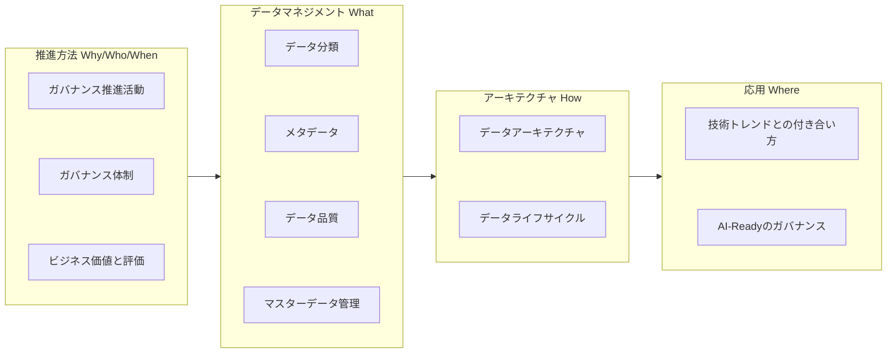

## はじめに

2010年代のビッグデータブームを経て、データレイクやDWHの構築が進んだ。しかし、多くの企業では部門ごとにデータが分断（サイロ化）されているなどの理由で、データは蓄積されているが十分に活用できる状態にない。さらに、昨今のAI技術を活用するためには、データの標準化、品質、メタデータなどの文脈整理を従来以上に求められる。また、無秩序なデータの利用促進は契約違反、セキュリティ・コンプライアンス上のリスクを生む懸念がある。

データガバナンスの役割は、攻め（価値創出）と守り（統制）を両立させ、データが継続的に価値を生み出す資産に変えることにある。

本ガイドラインは、フューチャーが手掛ける多様なプロジェクトにおいて、よく議論になる論点を整理したものである。企業の競争優位を生み出すデータガバナンスの設計と実行を支援する指針として、役立つ部分があれば幸いである。

::: warning 免責事項

- 有志で作成したドキュメントである。フューチャーには多様なプロジェクトが存在し、それぞれの状況に合わせて工夫された開発プロセスや高度な開発支援環境が存在する。本ガイドラインはフューチャーの全ての部署／プロジェクトで適用されているわけではなく、有志が観点を持ち寄って新たに整理したものである
- 相容れない部分があればその領域を書き換えて利用することを想定している。プロジェクト固有の背景や要件への配慮は、ガイドライン利用者が最終的に判断すること。本ガイドラインに必ず従うことは求めておらず、設計案の提示と、それらの評価観点を利用者に提供することを主目的としている
- 掲載内容および利用に際して発生した問題、それに伴う損害については、フューチャー株式会社は一切の責務を負わないものとする。掲載している情報は予告なく変更する場合がある

:::

## 本ガイドラインの構成

本ガイドラインは、読者がデータガバナンスの全体像を体系的に理解できるよう、物理的な章立てはフラットに記載しつつも、論理的には4つのグループで構成されている。

1. **推進方法（Why / Who / When）:** なぜガバナンスを推進し、どんなビジネス価値を生むのか（Why）。誰がそのルールを作り推進するのか（Who）。そして、組織の成熟度に合わせて「いつ」どのルールを段階的に適用していくのか（When）という戦略と体制を定義する
2. **データマネジメント（What）:** データ分類、メタデータ、データ品質、マスタ管理といった、具体的に何を管理対象とするのか（What）、各領域の指針を定める
3. **アーキテクチャ（How）:** データ基盤への連携方針やライフサイクルなど、定めたルールをシステムとしてどのように実現・運用するのか（How）を定義する
4. **応用（Where）:** 最新の技術トレンドや生成AIに対して、このガバナンスをどこへ適用し、将来的にどう発展させていくのか（Where）を示す

全体像と各章の論理的なマッピングは以下の通りである。

## 謝辞

このアーキテクチャガイドラインの作成には多くの方々にご協力いただいた。心より感謝申し上げる。

- **作成者**: 真野隼記、加藤剛、柴田健太、市川裕也、曽田弘規、藤田春佳
- **レビュアー**: 中神孝士

## Articles

- 2026.07.23 [データガバナンス設計ガイドラインを公開しました](https://future-architect.github.io/articles/20260723a/)

次のページ: [データガバナンス設計ガイドライン](./data_governance_guidelines.md)

