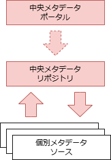

<page-title/>

本ガイドラインは、世の中のシステム開発プロジェクトのために無償で提供致します。  
ただし、掲載内容および利用に際して発生した問題、それに伴う損害については、フューチャー株式会社は一切の責務を負わないものとします。  
また、掲載している情報は予告なく変更することがございますので、あらかじめご了承下さい。

# はじめに

データマネジメントは、適切なデータ利活用を促進するための活動である。

データは様々な業務やシステムから生成され、その出力先や形式も様々である。情報流出などセキュリティ対応のため、権限を持った社員のみアクセス可能とすることが鉄則であるが、必要以上に権限を絞り過ぎると組織内のデータ流通が阻害され、競争力が低下する懸念がある。一方で適切な権限設定を個々人の判断に委ねることが難しいのも実情である。そのため、組織のデータリテラシーやデータ利活用の成熟度に合わせて適切な方針や仕組みが求められており、昨今の生成AIブームでその重要性はさらに増している。

本ガイドラインはデータマネジメントの設計における主要な論点や方針をまとめる。それによりデータマネジメント設計者が悩むポイントを軽減し、同時に議論のベースラインを提供する。本ガイドラインがデータマネジメント担当者やデータ基盤構築を行うデータエンジニアの道標となれば幸いである。

# 前提条件

基本的なアクセス管理ポリシーなど、何かしらのセキュリティポリシーは存在するが、データマネジメントに特化したポリシーの策定や運用が始まったばかりの組織を前提とする。

また、組織で利用する統一的なデータ基盤は未構築であるような状況を想定する。

# 適用範囲

特定システムやサービスのDB設計ではなく、組織全体で用いるデータマネジメントを対象とする。

また、データベースに格納されたテーブルデータや、CSV、JSONファイルなど、システムで保持するような構造化されたデータを主に扱い、Google Workspace、SharePoint、BOXなどに格納されたオフィス文書や画像などの非構造ファイルの扱いは、各章で明記しない限りは触れないとする。

データマネジメントの知識体系として、DAMA-DMBOK第２版（以下DMBOK2）があり、以下のような11領域の分類が有名である。


本ガイドラインでは上記を網羅的に説明するものでも、この分類に完全に従うものではない。主にデータ基盤やその周辺システムの構築を通して、必要なデータマネジメント方針をまとめたものである。

# 免責事項

::: warning 有志で作成したドキュメントである

- フューチャーアーキテクトには多様なプロジェクトが存在し、それぞれの状況に合わせて工夫された開発プロセスや高度な開発支援環境が存在する。本ガイドラインはフューチャーアーキテクトの全ての部署／プロジェクトで適用されているわけではなく、有志が観点を持ち寄って新たに整理したものである
- 相容れない部分があればその領域を書き換えて利用することを想定している
  - こういったプロジェクト固有の背景や要件への配慮は、ガイドライン利用者が最終的に判断すること
- 本ガイドラインに必ず従うことは求めておらず、設計案の提示と比較するための観点を利用者に提供することを主目的としている

:::

また、データマネジメントは特定の技術を指す用語では無いが、技術要素としてAWSを例に上げることが多い。

# 用語定義

- ビジネスユーザー
  - データ基盤利用者のうち、業務部門のことを指す。業務の効率化、分析、調査などを行う。ITエンジニアとは限らない
- データ資産
  - 分析や可視化を通して業務改善や新規事業に活かせると考えられるデータ
  - 構造データ、半構造データ、非構造データを問わない
- 構造データ
  - リレーショナルデータベース（RDBMS）のように、スキーマ（データの構造）をデータ書き込み時に定義・適用するデータ（Schema On Write）
- 半構造データ
  - オブジェクトストレージなどに保存されているCSV、JSON、Parquetなどのように、データ自体に構造情報（タグなど）を含むが、厳密なスキーマ定義は読み込み時に行われるデータ（Schema On Read）
- 非構造データ
  - 画像・音声・動画やオフィス系のファイルを指す
- データソース
  - データの発生源。本書では概ねシステム化されていることを前提とする

# データマネジメントにおける重要な視点

データマネジメントとは、ビジネス価値を最大化させるため、データを重要な情報資産として捉え、その生成・収集から活用・廃棄に至るライフサイクル全体を通じて、データ品質の維持・向上を基礎とした、継続的かつ組織的な管理活動である。

特に「継続的、組織的な活動」という点が重要であり、一時的な取り組みではなく、組織全体で継続してこそ大きな成果に繋がる。


画像は [「データマネジメント実践ガイドブック」についてのお知らせ｜デジタル庁](https://digital-gov.note.jp/n/n9500f124ce41)　より引用

# データマネジメントの導入シナリオ

データマネジメントには様々な設計手法やガバナンスすべき観点が存在し、立ち上げ期にどこまで想定して設計すべきか悩ましいことが多い。

データの利活用を促進するにあたり、以下を重視すること。

- 業務部門のユーザーが、データ分析の小さな成功体験（例：日常業務に関するKPIの可視化、手作業で行っていたレポート作成の自動化など）を積み重ねやすくすること
  - 成功体験が増えると、ユースケースが具体的かつ種類が増え、やるべきことが明確になる
  - 成功体験が増えると、信頼関係が構築しやすいため、取り扱うデータ資産を増やし、データ品質強化にも繋げやすい（さらなるデータ利活用へのサイクルを回しやすい）
  - 将来的な拡張性に過度に固執せず、システム構成を不必要に複雑化させないこと
- ニーズから始めて育てていく
  - データ活用にニーズ ⇛ データ基盤の構築 ⇛さらなるニーズ ⇛ データマネジメントを改善/強化
  - 最初から、多くを求めすぎない（用途が想定しにくいデータ資産を、データ基盤に最初から追加するのは負荷が大きすぎることも多い）
- 最低限のガバナンスを見極める
  - 権限制御はどのような場面でもMUSTなことが多いが、例えば、初期段階では連携するデータ項目を限定し（例：個人情報や機密性の高い項目を除外する）、関連するリスクや管理工数を低減したシンプルなモデルから開始することも有効である

# データガバナンスモデル {#データガバナンスモデル}

データマネジメントを実現していくにあたり、目指すデータガバナンスモデルにより必要となる組織体制やシステムアーキテクチャは大きく異なる。そのため、まずは自組織がどのモデルを目指すかを明確化する必要がある。どのようなモデルを目指すかは、データマネジメントに関する課題やデータマネジメントに対する組織の成熟度や現行の構成などが判断材料となる。

| #                | 分散型ガバナンス                                                                             | 中央集権型ガバナンス（データレイク型）                                       | 連合型ガバナンス（データメッシュ型）                                                                  |
| :--------------- | :------------------------------------------------------------------------------------------- | :--------------------------------------------------------------------------- | :---------------------------------------------------------------------------------------------------- |
| 概要             | ドメイン毎に独自のガバナンスでデータを管理する                                               | ドメインのデータを中央に集約し統一したガバナンスでデータ管理を行う           | ドメイン側でデータを管理するが中央で整備したガバナンスでデータを一元管理する                          |
| 図               |                                                       |                                   |                                                                |
| **ガバナンス**   |                                                                                              |                                                                              |                                                                                                       |
| 品質・整合性     | ⚠️全社的な視点での品質や整合性の維持は難しく、ばらつきが出やすい                             | ✅️一元管理により、データ品質基準の統一や整合性の確保が容易                  | ✅️全社的な品質基準を定めつつ、ドメインごとの特性に応じた管理も可能                                   |
| セキュリティ     | ⚠️全社的なセキュリティポリシーの適用が困難になる可能性                                       | ✅️一元的な対策を実施できるため統制しやすい                                  | ✅️全社的なポリシーを基本とすることで対応を効率化できる。ドメインごとの状況に配慮が必要               |
| **データ活用**   |                                                                                              |                                                                              |                                                                                                       |
| 現場の自由度     | ✅️現場のニーズに合わせて、部門内で自律的・柔軟に行動できる                                  | ⚠️中央へのデータ利用申請や承認により、スピードが低下する可能性               | ✅️定められたガイドラインやルールの中で、現場部門がある程度の裁量を持ってデータ活用を進めることが可能 |
| 部門横断の対応力 | ❌️データが部門ごとにサイロ化しているため、部門横断なデータ分析が困難                        | ✅️データが一元管理されているため、部門横断対応が容易                        | ✅️データカタログ整備や標準化されたアクセス方法により、組織全体でのデータの発見・理解・再利用が促進   |
| **組織運営**     |                                                                                              |                                                                              |                                                                                                       |
| 部門の自律性     | ✅️各部門がデータに関する意思決定権を持ち、自律的に活動できる                                | ❌️データに関する権限や責任が中央組織に集中し、現場部門の自律性は低い        | ✅️全社的な方針やガイドラインのもとで、現場のスピード感と全社的な整合性のバランスを取ることが可能     |
| 中央組織の負担   | ✅️無し                                                                                      | ❌️データ管理に関する責任と作業負荷が中央組織に集中しやすい                  | ⚠️中央組織と各部門双方に役割と責任が生じる。連携・調整のためのコミュニケーションコストも必要          |
| **システム**     |                                                                                              |                                                                              |                                                                                                       |
| 拡張性           | ✅️各部門が独立してシステムを拡張でき、対応しやすい（システム間の連携は別）                  | ❌️中央が高負荷・密結合になりやすく、性能ネックの懸念                        | ✅️ドメインごとに疎結合にできるため組織が成長しても柔軟に対応可                                       |
| 標準化           | ❌️部門ごとにデータモデルや運用手順が異なるため、全社的な標準化は困難                        | ✅️中央で統一されたデータモデル、運用手順、ツールなどを導入しやすい          | ✅️全社レベルでの標準（データ形式、APIなど）を定めつつ、ドメイン固有の事情に合わせた拡張が可能        |
| 導入・運用コスト | ⚠️初期コストは低いが、後々データ連携・統合が高コスト化する懸念。部門ごとの投資が重複する懸念 | ⚠️中央集権的な大規模システムへの初期投資が必要。また中央組織の運用負荷が高い | ❌️データメッシュ等の実現には高度な技術と設計が必要で、導入・運用コストが高くなる傾向                 |

推奨は以下の通り。

- 組織成熟度に合わせてガバナンスモデルを選択、進化させる
- データ活用の文化が現場部門に根付いており、部門ごとに異なるKPIや固有のユースケースが存在し、独自のデータ管理ニーズが高い場合は、分散型ガバナンスが適している
  - 特に、変化の速いビジネスやアジャイルな組織、特定のユースケースに特化して迅速に価値を出したい場合に有効である
- データガバナンス体制が未整備な初期段階や、組織規模が比較的小規模で中央管理が現実的な範囲の場合、中央集権型ガバナンスを選択する
  - 金融、医療など、法規制対応や厳格なデータ統制が求められる業界や、トップダウンで全社的なデータ戦略を強力に推進したい場合にも有効
- データガバナンスの重要性を組織全体で認識し、継続的な投資・改善を行え、データ活用が組織全体で進んでおり、データドリブンな意思決定文化がある場合は、連合型ガバナンスを選択する
  - 組織規模が大きい、複数の事業部門を持つ、グローバル展開しているなど、多様なニーズが存在し、中央集権の統制力と分散の柔軟性のバランスを取りたい場合に有効である

# データ活用における課題と解決策（ユースケース）

企業におけるデータ活用関連の活動については大まかに以下の4つのフェーズに分割できる。


1. **データ探索**： データ活用するために保持されているデータを発見または検索する
2. **データ準備**： 探索したデータを活用できる状態に加工し、分析基盤で扱える状態にする
3. **データ活用**： ダッシュボード化や部門を横断してデータ分析を行ったり、データ駆動の業務プロセスを確立する
4. **データ運用**： データ自体やデータ基盤のガバナンスの維持・運用を行う

下記にそれぞれのフェーズにおいて発生しがちな課題や解決策およびユースケースを例示する。

▼データ活用における課題と解決策

| #      | a. データ探索                                                                                                     | b. データ準備                                                                                             |                                                                                               | c.データ活用                                                                                                                                                               |                                                                                                                                                                              | d.データ運用                                                                                                                                                                             |
| :----- | :---------------------------------------------------------------------------------------------------------------- | :-------------------------------------------------------------------------------------------------------- | :-------------------------------------------------------------------------------------------- | :------------------------------------------------------------------------------------------------------------------------------------------------------------------------- | :--------------------------------------------------------------------------------------------------------------------------------------------------------------------------- | :--------------------------------------------------------------------------------------------------------------------------------------------------------------------------------------- |
| #      | 可視化                                                                                                            | 品質向上                                                                                                  | 分析基盤準備                                                                                  | 業務活用                                                                                                                                                                   | 文化醸成                                                                                                                                                                     | コスト最適化                                                                                                                                                                             |
| 課題   | データの可視化・統合ができていない                                                                                | データの品質が低く、活用が困難                                                                            | 分析基盤がなく、データを活用できない                                                          | 分析結果を業務に活かせていない                                                                                                                                             | データ活用の文化・人材が不足している                                                                                                                                         | データ基盤の拡大により運用コストが増大                                                                                                                                                   |
| 説明   | ・データが部門ごとにサイロ化しており一元管理できていない<br> ・どのデータがどこにあるのか分からず、活用が進まない | ・欠損・誤記・重複データが多く、信頼性が低い<br> ・フォーマットが統一されておらず、データ連携・分析が困難 | ・BIツールが未導入でデータ分析が進まない<br> ・施策の効果測定ができず、データに基づいていない | ・データによる意思決定がされていない<br> ・施策の効果検証ができず、PDCAが回らない<br> ・分析結果が施策に反映されず、ビジネス成果につながらない                             | ・データ活用に対する意識が低く、業務に活かされていない ・データリテラシーが不足し、データの読み方・使い方が分からない ・経営層・現場のデータ活用に対する認識の乖離           | ・データ量の増加に伴い、ストレージ・計算コストが増加 ・分析ジョブが非効率で、不要な計算リソースを消費 ・コスト管理ができておらず、無駄な支出が発生                                       |
| 解決策 | データ統合基盤（データレイク・DWH）の構築<br>・データカタログの導入                                               | ・データクレンジング・標準化（ETL、データ品質ツール）<br> ・データ品質モニタリングを構築                  | ・DWH・BIを導入<br> ・ダッシュボードでリアルタイムでKPIを可視化                               | ・AI・データ活用施策を業務に実装<br> ・ダッシュボードをKPI管理に活用し、施策の効果をリアルタイム監視<br> ・データを活用した意思決定プロセスを標準化（例：A/Bテストの導入） | ・データリテラシー教育を実施し人材育成<br> ・データドリブン経営を推進し、データ活用を企業文化に根付かせる <br>・内製化支援プログラムを導入し、社内でのデータ活用スキルを強化 | ・サーバレスアーキテクチャを採用し、従量課金モデルでコスト最適化 <br>・クエリ最適化（例：不要なデータスキャンを削減）<br> ・コストモニタリングツールを導入し、継続的な監視と最適化を実施 |

▼データ活用のユースケース例

| #                    | a. データ探索                                                                                                    | b. データ準備                                                                                                    |                                                                                          | c.データ活用                                                                                   |                                                                                            | d.データ運用                                                                     |
| :------------------- | :--------------------------------------------------------------------------------------------------------------- | :--------------------------------------------------------------------------------------------------------------- | :--------------------------------------------------------------------------------------- | :--------------------------------------------------------------------------------------------- | :----------------------------------------------------------------------------------------- | :------------------------------------------------------------------------------- |
| #                    | 可視化                                                                                                           | 品質向上                                                                                                         | 分析基盤準備                                                                             | 業務活用                                                                                       | 文化醸成                                                                                   | コスト最適化                                                                     |
| ユースケース         | ・生産・在庫データをリアルタイムで可視化し、需給調整を効率化<br>・顧客データを統合し、マーケティング施策を最適化 | ・センサーデータの欠損値補完により異常検知精度を向上<br>・顧客データのクレンジングによるターゲティングの精度向上 | ・売上予測モデルの導入による需給最適化<br>・クレジットスコア分析による与信判断の精度向上 | ・ECサイトの購買データを分析し、レコメンド最適化<br>・物流データの活用による配送ルートの最適化 | ・社内のデータ活用トレーニングによるリテラシー向上<br>・データドリブンな意思決定文化の醸成 | ・クラウド利用最適化によるコスト削減<br>・サーバレス技術の活用による運用負荷軽減 |
| 効果を確認すべきKPI  | 統合済みデータの割合、可視化されたデータの割合                                                                   | 欠損・誤記・重複率などのデータ品質スコア、標準化済みデータの割合                                                 | BI利用率、レポート作成時間の短縮率                                                       | CVR向上、在庫回転率改善、異常検知率向上                                                        | BIツール利用率、データ分析案件数                                                           | クラウドコスト削減率（前年比コスト削減 ％）                                      |
| **適用業界**         |                                                                                                                  |                                                                                                                  |                                                                                          |                                                                                                |                                                                                            |                                                                                  |
| - 製造業             | ✅（生産管理、品質管理）                                                                                         | ✅（工程管理、品質保証）                                                                                         | ✅（生産最適化、在庫管理）                                                               | ✅（異常検知、需要予測）                                                                       | ✅                                                                                         | ✅                                                                               |
| - 小売・EC           | ✅（売上分析、商品管理）                                                                                         | -                                                                                                                | ✅（売上予測、顧客セグメント分析）                                                       | ✅（マーケティング施策、パーソナライズ）                                                       | ✅                                                                                         | ✅                                                                               |
| - 金融               | ✅（リスク管理、顧客分析）                                                                                       | ✅（クレジット審査、不正検知）                                                                                   | ✅（ポートフォリオ分析、信用リスク管理）                                                 | ✅（カスタマーサポート、投資分析）                                                             | ✅                                                                                         | ✅                                                                               |
| - ヘルスケア         | ✅（医療データ管理、診療分析）                                                                                   | ✅（電子カルテ管理、診断支援）                                                                                   | ✅（治療効果分析、患者予測）                                                             | -                                                                                              | ✅                                                                                         | ✅                                                                               |
| - 物流               | ✅（配送管理、在庫最適化）                                                                                       | ✅（配送計画、倉庫管理）                                                                                         | -                                                                                        | ✅（ルート最適化、需要予測）                                                                   | ✅                                                                                         | ✅                                                                               |
| - エネルギー         | ✅（需要予測、設備管理）                                                                                         | -                                                                                                                | ✅（発電量最適化、設備監視）                                                             | -                                                                                              | ✅                                                                                         | ✅                                                                               |
| - 公共機関           | -                                                                                                                | ✅（行政データ管理、統計分析）                                                                                   | -                                                                                        | -                                                                                              | ✅                                                                                         | ✅                                                                               |
| 適用バリューチェーン | 経営管理、IT戦略、サプライチェーン管理                                                                           | IT管理、オペレーション管理、リスク管理                                                                           | 経営管理、財務、マーケティング                                                           | 販売、サプライチェーン、カスタマーサポート                                                     | 全プロセス                                                                                 | IT運用、データ分析                                                               |

これらを参考に、**具体的な業務プロセスを検討しデータドリブンの業務を確立することを推奨する。**

# データメッシュ

[データガバナンスモデル](#データガバナンスモデル) で記載した連合型ガバナンスを採用する場合、全体的なアーキテクチャとしてはデータメッシュ構成となることが多い。  
データメッシュに関してはアーキテクチャを考える上で意識すべきポイントがある。以下に記載する。

1. ドメイン主導の自律型アーキテクチャ
   - データは、それを最も良く理解し、活用するビジネスドメインによって所有・管理されるべきという考え方
   - 中央集権的なデータ管理ではなく、各ドメインが自律的にデータプロダクトを開発・提供することを重視する
   - これにより、データの専門性が向上し、変化への迅速な対応が可能になる
2. プロダクトとしてのデータ
   - データを単なる情報の集まりではなく、他のドメインやユーザーが利用可能なプロダクトとして扱う考え方
   - データプロダクトは、発見可能性、理解可能性、信頼性、安全性、相互運用性を備えている必要がある
   - これにより、データの品質と価値が向上し、再利用が促進される
3. セルフサービス型データ基盤
   - データエンジニアリングの専門知識がなくても、各ドメインがデータプロダクトを開発・提供できるような基盤を提供する考え方
   - データインフラ、ツール、プラットフォームなどをセルフサービスで利用できるようにすることで、データ活用の民主化を推進する
   - これにより、データエンジニアリングのボトルネックを解消し、データ活用のスピードを向上させる
4. ガバナンスの統一
   - 分散型のデータ管理であっても、全社的なデータガバナンスを維持するための仕組みを確立する考え方
   - データの標準化、セキュリティ、プライバシー、コンプライアンスなど、共通のルールやポリシーを定義し、各ドメインが遵守する
   - これにより、データの整合性を保ちながら、分散型のデータ管理を安全かつ効率的に行うことができる

▼データメッシュ構成における検討ポイントとアーキテクチャ全体像  


推奨は以下の通り。

- [ガバナンスモデル](#データガバナンスモデル) の章に記載した通り、データメッシュ構成を適用する場合はデータを活用する組織や仕組みがある程度成熟している必要がある（組織全体でデータガバナンスの考え方が浸透している、ドメイン側でデータ活用する文化やデータドリブンな意思決定が浸透している　など）ため、条件を満たしていない場合は無理に導入しない
- データメッシュ構成はあくまでも1つの方法論であるため、どのようなガバナンスモデルを目指すと今の課題が解決するのか？ データメッシュ構成でないと課題が解決しないのか、管理対象データ種や量はどのくらいなのかなどを吟味しながらガバナンスモデルや全体構成を考える
- データメッシュ構成を検討する場合は、様々なクラウドやサービスに配置されたデータソースに対応する必要もあるため、データメッシュ構成にする必要性がなければデータレイク型（中央集権型ガバナンス）で検討する

なお、これ以降の本ガイドラインは、データメッシュではなく「中央集権型ガバナンス」 「中央のデータ基盤が1つある」前提で記述する。

# ロール定義

データガバナンスを効かせつつ、オペレーションを行なっていくためには、役割を定め、責任を明確化することが必要となる。必要なロールは組織のデータ利活用の成熟度や、組織・データの規模にも依存するが、データ基盤を運用するにあたって最低限設定することを推奨するロールを下記で表す。専任であることは必須ではないが、各ロールに対してそれぞれ1名以上を配置することが望ましい。

| ロール名           | 説明                                                             | 主な作業                                                                                                                                                                    | 求められるスキル                                                                                                   |
| :----------------- | :--------------------------------------------------------------- | :-------------------------------------------------------------------------------------------------------------------------------------------------------------------------- | :----------------------------------------------------------------------------------------------------------------- |
| データ基盤管理者   | データ基盤のルールを策定し、周知・監査を行いガバナンスを効かせる | ・データ管理ポリシー、ガイドラインの策定 ・データ品質の統制、コンプライアンス遵守の推進<br> ・アクセス権の管理 ・監視、監査の実施                                           | ・ポリシーやガイドラインを決めることができる推進力<br> ・リスク評価と改善の打ち手の実行力<br> ・各ロールとの調整力 |
| データエンジニア   | データ基盤の構築、運用を行う                                     | ・データモデルの設計、構築<br> ・データ基盤のインフラ設計構築、運用<br> ・データ収集、変換、蓄積のためのデータパイプラインの開発、保守<br> ・データ基盤の実際のアクセス管理 | ・SaaS、クラウドインフラの設計・構築<br> ・プログラミングスキル（Python、SQLなど）                                 |
| データスチュワード | データを利活用しやすいように、データやメタデータを維持管理する   | ・データの管理者として特定のデータセットの品質、セキュリティ、利用を推進<br> ・データ利用のためのメタデータの登録<br> ・データコンシューマからのフィードバック収集          | ・データやメタデータに対する業務知識                                                                               |
| データコンシューマ | データを元に現状の分析分析や予測を行い、業務を推進する           | ・データ可視化、分析、レポート作成<br> ・業務への適用<br> ・データ利活用における問題点の提示                                                                                | ・データを業務適用させるための業務知識<br> ・BI利用経験                                                            |

各ロールを設定することを推奨するが、下記の場合はデータスチュワード不在を許容する。

- データコンシューマのシステム知識が豊富であり、テーブル本体や、テーブル定義書を読んで理解することが可能
- データの参照方式がパターン化されており、新規のデータ利用が発生しない

またどうしても人が足りない場合はデータ基盤管理者をデータエンジニア、スチュWordが兼任することを許容する。ただし兼任としてしまうことで、データエンジニア、データスチュワードの行うデータマネジメントに対して、ガバナンスを効かせづらくなってしまうことが懸念点としてあげられる。


各ロールの役割の一例を図示する。

データエンジニアがデータ基盤の技術的な側面、データスチュワードがデータを利活用するためのビジネス的な側面に焦点をあてる。


## 組織規模やデータ利活用の成熟度によるロールの変化

最低限のロールは上記に記載した通りだが、必要なロールは組織規模やデータ利活用の成熟度によって変化しうる。

たとえば組織規模に応じて扱うデータ量が増えたり、データ利活用の成熟度によって専門的な分析が必要になるため、データコンシューマの中でもデータ分析、ダッシュボード作成に特化したデータアナリストや、MLに特化したデータサイエンティストなど、スペシャリストを専任で置く必要が出てくる。

組織規模やデータ利活用の成熟度によるロールの変化の例は下記の通り。

### 小規模組織（スモールスタート）

多くの場合リソースが限られるため、さまざまなタスクを処理できるゼネラリストである必要がある。初期のデータチームは、データソースのソフトウェアエンジニア、ビジネスエキスパート、データアナリスト、およびデータ駆動型の考え方を持つリーダーで構成される 。チームが成長するにつれて、データエンジニアまたはデータコンシューマ（アナリスト）が専任で採用される。

▼ロール例

- データ基盤管理者
- データエンジニア
- データスチュワード（メンバーのスキルに応じて省略可能）
- データコンシューマ

### 中規模組織

さまざまな事業部門（営業、マーケティング、運用）に専任のデータアナリストを配置したり、MLに特化したデータサイエンティストを配置する可能性がある。またデータエンジニアリングチームを拡大する可能性がある 。

▼ロール例

- データ基盤管理者
- データエンジニア
- データスチュワード
- データアナリスト（データ可視化、分析に特化）
- データサイエンティスト（MLが必要な場合）
- 業務ユーザー

### 大規模組織

大規模組織の場合は、多くの場合今までの組織構造の延長ではなく、分散型またはフェデレーション型のモデルを実装し、事業部門内にデータチームを配置することが求められる。一方で統制の機能は中央にもち、全体の調整を行う。

▼ロール例

- 中央
  - データ基盤管理者
  - データ品質管理者
  - データカタログ管理者
  - セキュリティスペシャリスト
  - データエンジニア
- 事業部
  - データアーキテクト
  - データエンジニア
  - データオーナー
  - データスチュワード
  - データアナリスト
  - データサイエンティスト
  - 業務ユーザー

同じロール名でも人によって想定する役割に差があるため、都度定義すること。

ここでは最初に定義した最低限のロールを、より詳細、専門化させたロールとして再定義する。

| ロール名           | 詳細ロール                 | 説明                                                                                                                                                   |
| :----------------- | :------------------------- | :----------------------------------------------------------------------------------------------------------------------------------------------------- |
| データ基盤管理者   | データ基盤管理者           | データ基盤全体の戦略、計画、実行の統括を行う                                                                                                           |
|                    | データ品質管理者           | データ品質において責任を負い、基準の作成、統制やデータ品質監視ツールの導入・運用を行う                                                                 |
|                    | データカタログ管理者       | データカタログにおいて責任を負い、適切なメタデータの設計、データカタログ品質の担保、データカタログの利用促進を行う                                     |
|                    | セキュリティスペシャリスト | データ基盤のセキュリティに対して責任を負い、適切なアクセス方法の設計、運用やアクセス権の管理を行う                                                     |
| データエンジニア   | データアーキテクト         | データ基盤のアーキテクチャ設計、データモデル設計、データフロー設計を実施する                                                                           |
|                    | データエンジニア           | データアーキテクトが検討した設計を踏襲し、データ基盤の構築、運用保守を実施する                                                                         |
| データスチュワード | データオーナー             | 自領域のデータセットの責任者として、データ品質、セキュリティ、利用に対して責任を負う。ポリシーを策定し、データスチュワードの作業の方向づけ、承認を行う |
|                    | データスチュワード         | 自領域のデータのデータ品質、セキュリティ、利用の管理運用を行う。データオーナーの策定したポリシーを遵守するように、具体的なデータ管理を行う             |
| データコンシューマ | データアナリスト           | 業務ユーザーからの要望を元にデータの分析、可視化を行う                                                                                                 |
|                    | データサイエンティスト     | ML/AIを使用した高度な分析する                                                                                                                          |
|                    | 業務ユーザー               | BIを使用して分析を行なったり、データアナリスト、サイエンティストの行なった分析結果を元に業務に適用する                                                 |

推奨は以下の通り。

- データ活用の開始期でどのようなデータ利活用するか不明な場合は、小規模組織のロールを最低限定義して利用する
- データ活用方法が見えてきてから、ボトルネックとなっている各ロールの専任化を進める。その際に役割を詳細ロール化する必要があれば実施する
- 分散型、フェデレーションの構成をとる大きな組織の場合は、大規模組織の構成を採用する
- チームに応じて必要な役割や強化すべき役割が異なるため、本ガイドラインは1つの参考例として用い、それぞれでロールを設計し、各ロールを定義する

# オペレーション定義

オペレーションを定義することで下記のメリットがある。

- 作業内容およびその担当者を定義することで作業内容が明確化され、その責任の所在を明らかにできる
- 作業内容がドキュメント化されることで、担当者が変わった場合でも引き継ぎの重複、漏れを防ぐことができる
- 具体的な作業手順を記載することで、作業品質が上がる。また何か問題が発生した場合もその作業手順の改善を行うことで対応できる

網羅性や粒度が論点となるが、このガイドラインでは下記を推奨とする。

- 運用を行う上での主要なオペレーションが記載されており、その担当ロールのオペレーションの一覧が記載された状態を目指す
- 各オペレーションにおける具体的な手順の記載は必須とせず、対応回数が多いものや対応難度が高いものからドキュメント化する
- 自動化できるオペレーションは自動化を行うようにする
- 定期的に見直しを行い、改善点があれば反映を実施する

オペレーション一覧の例を記載する。

それぞれのオペレーションの担当は、上記で定義したロールに対応させる。

| 担当ロール         | オペレーション                     | 説明                                                                                                                                                                     |
| :----------------- | :--------------------------------- | :----------------------------------------------------------------------------------------------------------------------------------------------------------------------- |
| データ基盤管理者   | データガバナンスポリシー策定・運用 | データガバナンスポリシー、ルールを策定し、組織全体で遵守されるように推進する                                                                                             |
|                    | データ標準化                       | データの命名規則、形式、分類方法などを標準化し、データの一貫性を確保するように推進する                                                                                   |
|                    | データカタログ管理                 | データスチュワードと協力してデータカタログの入力ルールを定義し、データの検索性や理解容易性を向上するよう推進する                                                         |
|                    | データ品質管理                     | データスチュワードと協力してデータ品質に関するルールを策定し、データ品質チェックを実施する。データ品質に問題が発生した場合、データスチュワードに原因調査、改善を依頼する |
|                    | アクセス権限管理                   | データに対するアクセス要求の承認、権限管理を行うよう推進する                                                                                                             |
| データエンジニア   | データモデリング                   | データ分析がしやすいデータモデルの設計、構築を行う                                                                                                                       |
|                    | データパイプライン構築・運用       | データ収集、変換、蓄積のためのデータパイプラインの開発、運用を行う                                                                                                       |
|                    | データ基盤構築・運用               | データ基盤のインフラ、ソフトウェアの構築、運用、保守を行う                                                                                                               |
| データスチュワード | データ登録・更新                   | 担当するデータの登録、更新、削除を行う。データ品質を担保するためにクレンジングを実施する                                                                                 |
|                    | メタデータ管理                     | データの内容、形式、取得元、更新頻度、利用目的、アクセス権限など定義されたメタデータを、データカタログに登録、修正を行う                                                 |
|                    | データ品質管理                     | データ品質問題が発生した場合の原因調査、改善を行う                                                                                                                       |
|                    | データ問い合わせ対応               | データコンシューマからの問い合わせの一次対応を実施する                                                                                                                   |
| データコンシューマ | データ検索・発見                   | データカタログを検索し、必要なデータを発見する。メタデータを参照することで、データの内容、品質、利用条件などを理解する                                                   |
|                    | データアクセス                     | 必要に応じてアクセス権を依頼した上で、データにアクセスする                                                                                                               |
|                    | データ分析・活用                   | データ分析、レポート作成、機械学習などにデータを利用する                                                                                                                 |

# ワークフロー定義

ワークフロー定義も実施することでオペレーション定義同様、役割と責任の明確化や作業の標準化を実施できる。

推奨は以下の通り。

- ガバナンスを効かせるために、監査・承認が入るフローとすること
- 複数のアクターが存在し、認識齟齬が生じやすいため、下表のようなシーケンス図を作成し認識を合わせること
- ロールの変更やオペレーションの変更にともない、シーケンス図にも定期的に更新をかけること

下表の（1） ～ （3）はワークフローの例である。

| #                   | シーケンス図                                     | 説明・ポイント                                                                                                                                                                                                                                               |
| :------------------ | :----------------------------------------------- | :----------------------------------------------------------------------------------------------------------------------------------------------------------------------------------------------------------------------------------------------------------- |
| （1）新規データ登録 | [![][create_metadata_png]][create_metadata_link] | 新規にデータをデータ基盤にデータ、メタデータを登録する<br>**ポイント:** データスチュワードがデータエンジニアと登録可否の相談を行うことで、似たようなデータが登録されることを防ぐ                                                                             |
| （2）データ共有     | [![][share_data_png]][share_data_link]           | データコンシューマがデータを探索、アクセス権限がないオブジェクトにアクセスする<br>**ポイント:** データスチュワードが間に入る必要がない場合は、全社でアクセス権限付与や削除に関する標準的なルールを定めた上で、直接、基盤管理者に依頼を行うことも検討して良い |
| （3）データ品質不備 | [![][data_quality_png]][data_quality_link]       | データ品質に問題があり、データコンシューマから報告あるいはデータ基盤上のデータ品質チェックでアラートが上がり、対応を実施する                                                                                                                                 |

[create_metadata_png]: https://mermaid.ink/img/pako:eNq1VstO20AU_ZVo1gEF8rDjBZtWYlGVLrqrsrHiASIROzV2VRohxbYIQQWRVlVf0AYoRC2IQEslKKTkY26cx4pf6NgOiWMch9CwsWzPmXPOvXPv6KZRXOAwYtA8fi5jPo4fJtgZkU3GeJ-PjUuC6ANtGbQyqBVQT0A7AfUUtD3jj_aVPF1xf0BTTNCRiVtxBX03yc5Aew3qjgtCL5zXN3brpe16PtvILBmIFCtKiXgixfKSExfjDYC315GJCQ-TjK_2_rhRXO9AlFL900Vz9Vf18ktzq2wpEJOJF6yE-4XrsdxtoysNTGefJa2vH-n5ouFk46xxsNzyMCc5cU8eGQu-nvkd6Rd7f76BwuiXSoPbLZU3isIjJJu-VQO9ZQdnAu0NqLugfQDth_lyQsiqfzdrufxwMw3axU0tS0gvrVbPs83M53phzxLl8OBJ8zq3drTqgYHVDkE9hgyBb5ufXUbvQNxuXlvUBr232s55Y3_Nu1Bc7gZfz1X347WViCl4B45bhNGHtV-tVCul2uE3KxdX5ZxeWWoUFVAO9MomKB9BKV6VV1o5st8JhhvlEpQCKEcOWxYjKKvXXPv61m89n7NY_qfl7Sm1--4w37J2B29Vp3CH59YNM_SmcTq5_8bRs2s3e2dYjXF_zYF5rvfl5tLoeG4eOy_RqcnhXspTk6TbiGT93U9Q39ZOL0DJ2bvN6zC7pVzGkAHVWvlxr2SnOvKjJBaTbIIjI13a2BdD0ixO4hhiyCuHp1l5ToqhGL9IoKwsCU8X-DhiJFHGfiQK8swsYqZZkmI_klMcUWvNg9cQMns9E4T2J-YSZGh7bI2Q5iTpRzOiod5iJO6x-ECQeQkxlLkdMWn0EjF0eDRCBUPjoUA0Oh6lIkE_WkDMeJj8Do-NRUOBcCAwRtGhRT96ZQoGRsMRmqKCETpC02E6GKQW_wFCYzlY?type=png
[create_metadata_link]: https://mermaid.live/edit#pako:eNq1VstO20AU_ZVo1gEF8rDjBZtWYlGVLrqrsrHiASIROzV2VRohxbYIQQWRVlVf0AYoRC2IQEslKKTkY26cx4pf6NgOiWMch9CwsWzPmXPOvXPv6KZRXOAwYtA8fi5jPo4fJtgZkU3GeJ-PjUuC6ANtGbQyqBVQT0A7AfUUtD3jj_aVPF1xf0BTTNCRiVtxBX03yc5Aew3qjgtCL5zXN3brpe16PtvILBmIFCtKiXgixfKSExfjDYC315GJCQ-TjK_2_rhRXO9AlFL900Vz9Vf18ktzq2wpEJOJF6yE-4XrsdxtoysNTGefJa2vH-n5ouFk46xxsNzyMCc5cU8eGQu-nvkd6Rd7f76BwuiXSoPbLZU3isIjJJu-VQO9ZQdnAu0NqLugfQDth_lyQsiqfzdrufxwMw3axU0tS0gvrVbPs83M53phzxLl8OBJ8zq3drTqgYHVDkE9hgyBb5ufXUbvQNxuXlvUBr232s55Y3_Nu1Bc7gZfz1X347WViCl4B45bhNGHtV-tVCul2uE3KxdX5ZxeWWoUFVAO9MomKB9BKV6VV1o5st8JhhvlEpQCKEcOWxYjKKvXXPv61m89n7NY_qfl7Sm1--4w37J2B29Vp3CH59YNM_SmcTq5_8bRs2s3e2dYjXF_zYF5rvfl5tLoeG4eOy_RqcnhXspTk6TbiGT93U9Q39ZOL0DJ2bvN6zC7pVzGkAHVWvlxr2SnOvKjJBaTbIIjI13a2BdD0ixO4hhiyCuHp1l5ToqhGL9IoKwsCU8X-DhiJFHGfiQK8swsYqZZkmI_klMcUWvNg9cQMns9E4T2J-YSZGh7bI2Q5iTpRzOiod5iJO6x-ECQeQkxlLkdMWn0EjF0eDRCBUPjoUA0Oh6lIkE_WkDMeJj8Do-NRUOBcCAwRtGhRT96ZQoGRsMRmqKCETpC02E6GKQW_wFCYzlY
[share_data_png]: https://mermaid.ink/img/pako:eNqVVctu00AU_RVr1k5x4jh2ZtENbFmxQ95Y9jS1lNjBtRElikRtNVCJh8WqqKW0UUE8RIpUEDSN2o8ZJ25X_QXGD2jiOLazsTwzZ86598zcuR0g6woCEGygRxbSZHRPlRqG1BI1ipJkUzco7DzHzgjbl9g-xc4ptn9j52Mw4xyQb4BrS4apympb0sxp9Lfg63zH9o9gj32GnR52DlOJydpWyHoSEu-kgMYfhv7esT848t3e1bPtOV27j-0TbJ8TsgiUFE2NMmIVtQCQnWhpdTU3NzjN8XZyvO__7MepqI8lExVzJxdUmo0lJVhIReL-L3dysH8zeoGdo5Aq3nQzCi1W0DKRLetR8lCn3Jm8cb2LPe_i_fXhaJFBaXciYzlPOxIb97bHgzO8NfD7w6uvr5biTPd555LwUHeosfspJkx3dT6dMPGmGVMEo8LBJIoBzlz_yecv1-9c73zX-_P61uI0k1Nqilq4GuhnFtniKJL6ubVK5WBKmWZMS48HL71hL-KcPpgiISwyIu-qFdFfeARz9yCnziKCmZfnNrXsg09Ns8jjkqjjvOyCdaQpgAYtZLQkVSHtphNMisBcRy0kAkh-FbQmWU1TBKLWJVDJMvUHm5oMoGlYiAaGbjXWAVyTmhtkZLUVIhT3qn8Q8rQ_1PX_Q6SopIPcj9pb2OVo0DAC9ZiRxISMu7qlmQDy4XYAO-AJgAK3UuPZaqXK1OuVOl9jabAJYIUj01y5XK8yHMOUeaHapcHTUJBZ4WoCz7M1oSYInMCyfPcvTMEi2Q?type=png
[share_data_link]: https://mermaid.live/edit#pako:eNqVVctu00AU_RVr1k5x4jh2ZtENbFmxQ95Y9jS1lNjBtRElikRtNVCJh8WqqKW0UUE8RIpUEDSN2o8ZJ25X_QXGD2jiOLazsTwzZ86598zcuR0g6woCEGygRxbSZHRPlRqG1BI1ipJkUzco7DzHzgjbl9g-xc4ptn9j52Mw4xyQb4BrS4apympb0sxp9Lfg63zH9o9gj32GnR52DlOJydpWyHoSEu-kgMYfhv7esT848t3e1bPtOV27j-0TbJ8TsgiUFE2NMmIVtQCQnWhpdTU3NzjN8XZyvO__7MepqI8lExVzJxdUmo0lJVhIReL-L3dysH8zeoGdo5Aq3nQzCi1W0DKRLetR8lCn3Jm8cb2LPe_i_fXhaJFBaXciYzlPOxIb97bHgzO8NfD7w6uvr5biTPd555LwUHeosfspJkx3dT6dMPGmGVMEo8LBJIoBzlz_yecv1-9c73zX-_P61uI0k1Nqilq4GuhnFtniKJL6ubVK5WBKmWZMS48HL71hL-KcPpgiISwyIu-qFdFfeARz9yCnziKCmZfnNrXsg09Ns8jjkqjjvOyCdaQpgAYtZLQkVSHtphNMisBcRy0kAkh-FbQmWU1TBKLWJVDJMvUHm5oMoGlYiAaGbjXWAVyTmhtkZLUVIhT3qn8Q8rQ_1PX_Q6SopIPcj9pb2OVo0DAC9ZiRxISMu7qlmQDy4XYAO-AJgAK3UuPZaqXK1OuVOl9jabAJYIUj01y5XK8yHMOUeaHapcHTUJBZ4WoCz7M1oSYInMCyfPcvTMEi2Q
[data_quality_png]: https://mermaid.ink/img/pako:eNqVVF1r2lAY_ityrl3xKybmojDaXQ4GvRu5OZijDWji4glbJ0KTdF23tbTdR8fYh7a1uBWmFAdrXVd_zGvU_oudJCox08FyEd4czvM87_PkPaeCsppMkIjK5JFB1CxZVXBex0VJjbAHZ6mmR1YxxSuaWjaKRI_gcgTs52Bfg9UDqwN2B6yfYJ-5K_YX9g4j1yh5jHU5BLwC2_RQbQ_4Ioy6p-YVlfyl99XTuwT7FVgnYcyDAqY5TS_elYuKOgN0at3hx8awdTw82B5tPvOBJaxTJauUsEpn4HOQkjrWKtDIXNNg7jrv9m-Pd8F6PWh8GtbOfID7BOO7s7wcyEQM6LwxR51zMFtTGqd-4Ry-9GlIoUzCPbG9YTSL1GqCbYPVBrP5z4YmZsMN-Uz9yz3H-uAqWCdgf_Ns7oxbUWW_CMAWuhqd9wa1X7BpTlf6vdbg-2kwzfAksM5HzdPBRZcVYO6ByVLZGnth8dR_OAc7s15mu5hMTqANsA_BaoD93vXiFh2_jf7N59v69SzZBP7_bE6rNjj6vYBtYUQL2YK_f17mY8bJZAUofQIwb8CsgdkevL1yjrbc7Fq7_e72dLRQFDFcESsyO_4VV0BCdJ0UiYREVsokh40ClZCkVtlWbFBtbUPNIpHqBokiXTPy60jMYTaaUWSUZEwnd8dkCztZDzVt-klkhZ3U-_514906UZTXXfUxI7NJ9BXNUCkSeQ-OxAp6gkSBW0rzyVQiFctkEhk-nYyiDSQmOLbMxeOZVIyLxeK8kKpG0VNPMLbEpQWeT6aFtCBwQjLJV_8AEAlXHw?type=png
[data_quality_link]: https://mermaid.live/edit#pako:eNqVVF1r2lAY_ityrl3xKybmojDaXQ4GvRu5OZijDWji4glbJ0KTdF23tbTdR8fYh7a1uBWmFAdrXVd_zGvU_oudJCox08FyEd4czvM87_PkPaeCsppMkIjK5JFB1CxZVXBex0VJjbAHZ6mmR1YxxSuaWjaKRI_gcgTs52Bfg9UDqwN2B6yfYJ-5K_YX9g4j1yh5jHU5BLwC2_RQbQ_4Ioy6p-YVlfyl99XTuwT7FVgnYcyDAqY5TS_elYuKOgN0at3hx8awdTw82B5tPvOBJaxTJauUsEpn4HOQkjrWKtDIXNNg7jrv9m-Pd8F6PWh8GtbOfID7BOO7s7wcyEQM6LwxR51zMFtTGqd-4Ry-9GlIoUzCPbG9YTSL1GqCbYPVBrP5z4YmZsMN-Uz9yz3H-uAqWCdgf_Ns7oxbUWW_CMAWuhqd9wa1X7BpTlf6vdbg-2kwzfAksM5HzdPBRZcVYO6ByVLZGnth8dR_OAc7s15mu5hMTqANsA_BaoD93vXiFh2_jf7N59v69SzZBP7_bE6rNjj6vYBtYUQL2YK_f17mY8bJZAUofQIwb8CsgdkevL1yjrbc7Fq7_e72dLRQFDFcESsyO_4VV0BCdJ0UiYREVsokh40ClZCkVtlWbFBtbUPNIpHqBokiXTPy60jMYTaaUWSUZEwnd8dkCztZDzVt-klkhZ3U-_514906UZTXXfUxI7NJ9BXNUCkSeQ-OxAp6gkSBW0rzyVQiFctkEhk-nYyiDSQmOLbMxeOZVIyLxeK8kKpG0VNPMLbEpQWeT6aFtCBwQjLJV_8AEAlXHw

特に、ビジネスユーザー側の操作が必要な部分は慎重に設計する。データ利用者側のニーズがあっても、データ生成者側から見ると自分たちの業務が楽になるわけではないと認識されてしまうと協力が進まないため、負荷が偏りすぎていないか・自動化で低減できないか・大義やメリットを説くといったことを合わせて考える。

# データカタログ

データカタログは、組織内に点在するデータ資産のメタデータを統合的に管理し、データガバナンスを強化しながら、その利活用を促進することを目的に導入する。

データマネジメント知識体系ガイド第二版（第12章 メタデータ管理）では、メタデータ管理の「ビジネス上の意義」を次のように定義する。

- データのコンテキストを提供、データ品質の測定を可能にしてデータへの信頼性を向上させる
- 戦略的な情報（例えばマスタデータ）を多様な用途に利用できるようにし、その価値を高める
- 冗長なデータとプロセスを特定し、業務効率を向上させる
- 古いデータや間違ったデータの利用を防止する
- データを活用した調査に要する時間を短縮する
- データ利用者とIＴ専門家の間のコミュニケーションを改善する
- 影響分析が正確になり、プロジェクト失敗のリスクを減らせる
- システム開発のライフサイクル時間を短縮し、製品の市場投入を早める
- データのコンテキスト、履歴、発生元を全て記録することにより、トレーニングコストを削減しスタッフ交代の影響を軽減する
- 法規制遵守を支援する

メタデータ管理基盤のひとつであるデータカタログは、これらの意義を追及する際に利用するツールとして位置づけられる。

## データカタログの射程

### ユースケース

データカタログのユースケースは、その位置付けから、「カタログの管理」 「共有データの利活用促進」 「共有データのガバナンス強化」に分けて考えることができる。

- カタログの整備
  - データ資産のオーナーシップを持つデータオーナーは、データ資産を共有可能なデータとして登録できる状態に整備し、これをデータカタログに登録する（カタログ管理）
  - データカタログの要件に基づき、リネージやデータ品質など、共有データに紐づくメタデータを統合する（メタデータ統合）
  - 組織内に既にカタログデータが存在している場合は、その利活用を試みる（カタログデータ収集）
- 利活用促進
  - 共有データを利用するデータコンシューマは、データカタログに登録されている共有データから用途に適合するものを探索し、利用する共有データを特定する（カタログ検索、利用データ特定）
  - データコンシューマは、特定した共有データのデータオーナーとの間で利用契約を結ぶ。利用契約が承認された後、データオーナーはデータコンシューマに対して共有データに対するアクセス権限を付与し、データコンシューマは利用を開始する（共有データ利用手続き）
  - 統合したメタデータを外部システムに連携する（メタデータ配信）
- ガバナンス強化
  - データガバナンス担当者は、データカタログに登録されている共有データを対象に、例えばアクセス権の付与状況、利用契約締結状況、データ品質の観点から分析し、その管理・統制を図る（共有データ監査）

データカタログはこれらのユースケースを円滑に回すための機能を提供する。

利活用の推進とガバナンスの強化は両輪になり、いずれも利活用文化の醸成と併せて進めていくことになろう。そのため、利用状況を客観的に把握するためのKPIを設定し、状況を見極めながら関与するアクターを少しずつ広げていくことを推奨する。また、データ利活用に求められるスキルを向上させる施策の実施も忘れてはならない。

### メタデータ

データカタログで管理する対象のメタデータは、組織で管理する「ビジネスメタデータ」 「テクニカルメタデータ」 「オペレーショナルメタデータ」から、要件に適合する項目を選別して構成する。

例えばメタデータには下表の分類が存在する。

| 大分類                      | 小分類                   | 優先度 | 例                                                                                                                                                                                                                                                        |
| :-------------------------- | :----------------------- | :----- | :-------------------------------------------------------------------------------------------------------------------------------------------------------------------------------------------------------------------------------------------------------- |
| ビジネス メタデータ         | データ定義               | 高     | ・業務ルール、計算方法、および導出方法<br>・業務上、参照/更新されるタイミング<br>・データの出所とデータリネージ<br>・データが参照するマスタテーブル<br>・データモデルと物理的資産の関係を示すドキュメント                                                 |
|                             | データオーナー           | 高     | ステークホルダーの連絡先情報                                                                                                                                                                                                                              |
|                             | 利用規約                 | 中     | ・セキュリティ／プライバシーレベル<br>・利用上のルール、注意事項、既知の問題項                                                                                                                                                                            |
|                             | 利用者フィードバック     | 低     | 利用者による評価コメント、レーティング結果                                                                                                                                                                                                                |
| テクニカル メタデータ       | データ構造               | 高     | ・データベース上のテーブルとカラムの名称、プロパティ<br>・ISO規格やJIS規格などデータ構造が従う標準                                                                                                                                                        |
|                             | データ共有状態           | 高     | アクセス権限の付与状態                                                                                                                                                                                                                                    |
|                             | ジョブ仕様               | 低     | ・データCRUDルール<br>・ETLジョブの名称・説明・仕様、ジョブスケジュールや依存関係<br>・更新間隔                                                                                                                                                           |
|                             | データ品質               | 低     | ・データ品質の規則と測定結果                                                                                                                                                                                                                              |
| オペレーショナル メタデータ | 運用ログ                 | 低     | ・バッチプログラムのジョブ実行ログ、エラーログ<br>・レポートとクエリのアクセスパターン、頻度、および実行時間<br>・データ利用状況分析、データアクセス権付与状況分析、データ品質分析の結果                                                                  |
|                             | アプリケーション運用仕様 | 低     | ・バッチ処理のスケジュール<br>・リリース計画、現在適用しているパッチのバージョン<br>・バックアップ、アーカイブ保存（永年保存）、RPO（目標復旧時点）、RTO（目標復旧時間）などの規定<br>・SLAの要件と規定<br>・年率データ容量増加率<br>・保持期限・改廃条件 |

メタデータの種類は多岐に渡り、その整備には人的コストもかかる。また、メタデータの収集手段も、現状、百花繚乱の状態にあり、「王道」が整っている状況ではない。そのため、データカタログの導入目的、組織の成熟度、メタデータの整備状況を鑑み、身の丈に合ったメタデータ要件を定義する。

データカタログ導入における推奨は以下の通り。

- カタログ化の対象範囲を効果が得られやすい共有データに絞るなど優先度付けをする
- ビジネスメタデータの必須項目を最小限に決める（メタデータ分類表「優先度」に推奨する優先度を示す）
- 自動化で集められる範囲のメタデータを統合するところからはじめる
- 導入後にも要件が変更しやすいカテゴリ、例えばデータ品質に関わるメタデータの収集や、業務プロセスの変更を伴うワークフロー統合についてはあとにまわしにすることを検討する

### メタデータソース

カタログに紐づくデータの所在やデータ品質、リネージなどのメタデータは複数のシステムで生成・管理されているため、単一のシステムで管理されるわけではない。そのため、メタデータごとに、集める戦略（メタデータ集中管理戦略）を採るのか、参照する戦略（メタデータ分散管理戦略）を採るのか、決めていく必要がある。メタデータソースとしては、DBMS・オブジェクトストレージ・カタログサービス・データ品質ツール・ETL・構成管理ツール・MDM・モデリングツール・BIなどが考えられる。

推奨は以下の通り。

- ビジネス的な効果を得やすい領域かつ、「メタデータが集めやすいメタデータソース」などから、少しずつ範囲を広げる
  - 例えば3大クラウドベンダーによるオブジェクトストレージやRDBMS、API Connectorが充実しているSaaSアプリケーションは連携しやすい

## アーキテクチャ

メタデータを統合管理するためのアーキテクチャ（メタデータアーキテクチャ）は、DMBOK2において4種類（「集中型」 「分散型」 「ハイブリッド型」 「双方向型」）が提案されており、メタデータ統合管理基盤の一種であるデータカタログについてもこの考え方が適用できる。

| 比較軸               | （1）集中型                                                                                 | （2）分散型                                                                                     | （3）ハイブリッド型                                                                            | （4）双方向型                                                                                                                                |
| :------------------- | ------------------------------------------------------------------------------------------- | ----------------------------------------------------------------------------------------------- | ---------------------------------------------------------------------------------------------- | -------------------------------------------------------------------------------------------------------------------------------------------- |
| 概念図               |                                                      |                                                           |                                                          |                                                                                                 |
| 構成                 | 個別メタデータソースのコピーデータを中央に保持する                                          | 中央メタデータポータルは、個別メタデータソースを参照する                                        | 個別メタデータソースからの **必要十分な** コピーデータを中央に保持。中央も **独自に編集** 可能 | 個別メタデータソースのコピーデータを中央に保持。中央でもメタデータの編集が可能で、 **編集されたメタデータを個別側に戻す（同期）** ことが可能 |
| 特徴                 | リポジトリとクエリが同一システムに存在するため、迅速なメタデータの検索が可能                | メタデータはそのソースから随時取得されるため、常に最新かつ有効                                  | 集中型と分散型、双方の特徴を兼ね備える                                                         | 集中型と同等の特徴を持つ                                                                                                                     |
| データ一貫性         | ✅️データベース構造が分離されるため、システムが疎結合である                                 | ❌️参照するためであるため、メタデータソースの独自仕様の影響を受ける                             | ⚠️集中型の欠点と分散型の利点を併せ持つ                                                         | ✅️集中型の利点を持つ                                                                                                                        |
| 独自メタデータ保有   | ❌️個別メタデータソースから収集のみ。メタデータの品質は関係するソースシステムのみに依存する | ❌️参照するだけであるため、メタデータの品質は関係するソースシステムのみに依存する               | ✅️中央側で独自のメタデータ項目を保有可能                                                      | ✅️中央で編集されたメタデータを個別メタデータソースに戻すことが可能                                                                          |
| 可用性               | ✅️メタデータソースから独立しているため、信頼性が高い                                       | ❌️メタデータソースの信頼性に直接影響を受ける                                                   | ⚠️集中型の欠点と分散型の利点を併せ持つ                                                         | ✅️集中型と同等の利点を持つ                                                                                                                  |
| メタデータ連携コスト | ❌️ソースメタデータの変更をリポジトリに迅速に反映するために複雑な処理が必要る               | ✅️自動化されたメタデータクエリ処理の開発がより簡単になり、手動介入を最小限に抑えることができる | ⚠️集中型の欠点と分散型の利点を併せ持つ                                                         | ❌️集中型と同等の欠点を持つ                                                                                                                  |
| 導入コスト           | ❌️拡張部分の保守運用で、負担が増大する懸念。抽出部分が特別対応が必要な可能性               | ✅️独自システムからのメタデータ要求はクエリのみであるため、実装コストは最小限                   | ⚠️集中型の欠点と分散型の利点を併せ持つ                                                         | ❌️集中型と同等の欠点を持つ                                                                                                                  |
| 維持コスト           | ❌️集中型リポジトリの保守運用コストが掛かる                                                 | ✅️メタデータのレプリケーションや同期処理が不要でバッチ処理が削減される                         | ⚠️集中型の欠点と分散型の利点を併せ持つ                                                         | ❌️集中型と同等の欠点を持つ                                                                                                                  |

推奨は以下の通り。

- （3）を選択する
  - データカタログは独自のメタデータを保管する必要があることから、必然的に（3） または （4）に絞られる
  - （4）は中央メタデータリポジトリと個別メタデータソースの双方で変更管理を実施する必要があるため、運用ルールをきめ細かく設計しなければならず、導入のハードルが高くなる

## カタログデータモデル

データカタログ全体のデータ構成・構造を表明・表現するカタログデータモデルは、定めた「ユースケース」 「メタデータ」 「メタデータソース」 「アーキテクチャ」からデータ要件を抽出し、作成する。

▼UMLによるカタログデータモデルの例


推奨は以下の通り。

- UMLでモデリングを実施する
  - モデリングの手法は、機能間・システム間の関係を表すハイレベルな概念モデルと、属性やプロセスを表すローレベルな論理モデル・物理モデルの双方を表現でき、かつ、組織内で広く利用されているものであれば特別な指定はないが、描画ツールの普及状況や、概念間の関係を表現する際の表現力の高さを評価した
- 用語集を作成する
  - モデリングを進めていくなかで実施しておくことを推奨する
  - データカタログは組織内で広く利用されていくことを目指すため、ユーザーの職種や所属の違いによる用語の取扱の誤差をなくし、誤った用語を利用することに伴う発見性の低下を抑えたい。そのためにも、モデリング作業で概念や属性の定義に採用した用語を用語集のような形でとりまとめておき、これを目にとまる場所に配置しておくことが肝要になる

::: tip 属性の検討では、過去の蓄積、例えばW3CのDCATや、一般社団法人データ社会推進協議会によるデータカタログ作成ガイドラインが参考になる。

- [Data Catalog Vocabulary (DCAT) \- Version 2](https://www.w3.org/TR/vocab-dcat-2/) | W3C （[日本語版](https://www.asahi-net.or.jp/~ax2s-kmtn/internet/rdf/REC-vocab-dcat-2-20200204.html)）
- [データカタログ作成ガイドライン V3.1](https://data-society-alliance.org/wp-content/uploads/2023/03/230331-D97-DataCatalogGuidelineV31-gl-tecst.pdf) | 一般社団法人データ社会推進協議会

これらはいずれも組織間のデータ交換と汎用性に重点が置かれているため、組織間のデータ交換を目指す場合には有効だが、組織内のデータ交換では求められる要件が異なり、組織にあった保守性・利便性・セキュリティ・プライバシーを考慮した設計が求められる。他にも、図書館情報学やDAMA-DMBOKの知見を参考にできる。

:::

## データカタログの導入に向けて

データカタログを導入する適切なタイミングはいつか？ これを検討するにあたって、ピーター・エイキンによる、組織が置かれているデータ利活用のフェーズを定義するフレームワーク（DMBOKピラミッド）を基準に置き、データカタログを導入する適切なフェーズを考察する。

| フェーズ | 組織が置かれているデータ利活用の状態                                                                                                                                                                   |
| :------: | ------------------------------------------------------------------------------------------------------------------------------------------------------------------------------------------------------ |
|    1     | システムが構築され、データが蓄積され始める                                                                                                                                                             |
|    2     | データ品質に問題があることに気付く。より高品質のデータを取得し、様々なシステムがどのようにデータを連動しているか明確にするため、信頼性の高いメタデータと一貫したデータアーキテクチャの必要性に気がつく |
|    3     | データ品質、メタデータ、アーキテクチャの管理は統制をとるべき実務であり、そのためにはデータマネジメント活動に構造的なサポートを提供するガバナンスが必要だと気がつく                                     |
|    4     | 組織は適切に管理されたデータから得られる恩恵を活かし、分析能力を高める                                                                                                                                 |

※ DMBOKピラミッドの解説 | DMBOK2より引用

推奨は以下の通り。

- データカタログの導入時期は、フェーズ2から3に移行するタイミングで検討する
  - 導入目的は「共有データの利活用促進」 「共有データのガバナンス強化」であるため、フェーズ2から3の移行時期に検討を開始し、フェーズ3を成熟させる目的で導入する
- データカタログツールは切り替えることを前提に選定する
  - データカタログは要件定義・ツール選定・導入・運用にかかるコストが高い一方で、組織におけるデータ利活用の成熟に伴い、データカタログに対する要件も変わりゆく
  - データカタログ製品には栄枯盛衰があり、今後もより使いやすいツールが出てくる可能性も高い

::: tip ツール選定の評価軸の例

- カタログ記述の対応言語
  - 英語圏のツールが大勢を占める。日本語にはハイコンテキストな表現が多く、検索性を高めるためには独自の辞書を用意する必要性があることから（ユーザーにとって必要なデータが見つけられなければ導入する意味がない）、日本語対応が必要な場合は評価軸のトップに置くことになる
- カタログデータのポータビリティ
  - ツールの移行を視野に入れると必須。カタログデータにポータビリティがなければ、特定ツールにロックされる
- メタデータ収集用コネクタの種類
  - データカタログはビジネスの根幹ではないため、個別開発は極力少なくしたい。そのためにも、組織が利用しているストレージに対してどこまでのコネクタが用意されているか、評価のポイントに入れておきたい
- APIの機能性
  - どうしても個別開発が必要な場合はAPIを利用することになる。要件を叶えるために必要なAPIの機能が揃っているか、評価のポイントに入れておきたい
- 個別開発の範囲
  - 上記全てのポイントを総括し、全体としてどの程度の個別開発が必要になるか、評価のポイントに入れておきたい
- 保守・運用性
  - ツールの導入に伴い、その運用が新たな業務として発生する。そのため、自組織で扱えるものなのか、評価しておきたい
- ライセンスなどの費用
  - ライセンス費用をドル換算で支払う場合は、為替変動も考慮して評価しておきたい

往々にして要件に満額回答させるツールを選定することは難しい。要件ごとに優先度を設定し、場合によってはツールのカスタマイズの範囲内に適合させる（要件を変える）、そのような柔軟性を持っておくことが賢明だろう。

:::

# データレイヤー設計

一般的に、データ基盤上のデータ資産に対して、論理的なグループでレイヤー（層）設計を行い、それぞれの層に対しての目的を分け、利用用途を制限することで拡張性やセキュリティ性を高めることができる。

一般的には、以下の3つのレイヤーに分けることが多い。

1. データレイク層
2. データウェアハウス層（一般的に呼ばれるDWH製品のことを必ずしも指さないので注意）
3. データマート層


※画像は [データレイクの概念について理解する \- connecting the dots](https://ktksq.hatenablog.com/entry/datalake) より引用

それぞれの層の狙いは以下の通り。

- レイク層
  - 様々なデータソースからのデータを一元的に生データの形で保存
  - データの欠損や誤りを後から修正可能としたり、別の観点で集計可能とする
  - PIIなどセンシティブなデータも保管されるため、一般的にビジネスユーザーの直接参照は禁じることが多い
- データウェアハウス層
  - 特定の用途に合わせて構造化・変換したデータを提供、多様な分析ニーズに対応
  - 概ね、データクレンジング（標準化）したデータを提供（例えば、「売上」といっても消費税込み/無しや、割戻を差し引くかどうかなど、指標が異なる場合がある）
  - センシティブなデータに関しては適切なマスキングなどを施し、権限付与したデータサイエンティストなどの担当者が利用することが多い
- マート層
  - ユースケース（BIダッシュボードやレポートなど）に併せて1:1で作成
  - 業務観点で分析に足る粒度（例えば日次、週次、月次などの時系列や、商品・SKUなどの商品軸、店舗・地域など空間軸）に絞って作成する
  - BIなどを通じて、業務部門のユーザーが利用することが多い

分析対象がシンプルなデータ構造を持つ場合、マート層を無くしデータウェアハウス層に対して直接BIで接続するような構成も考えられる。一方で機密性の高い列などの区別が入ってくると、権限設定などで統制が取りにくいので、マート層相当のテーブルをビューとして提供するパターンもある。

この3層アーキテクチャと類似として、databricks社が提唱するメダリオンアーキテクチャ（マルチホップアーキテクチャ）と呼ぶこともある。どちらも思想は同様とし、本ガイドラインでは区別しない。また、前述のレイク層、データウェアハウス層、マート層という用語を用いる。

1. ブロンズレイヤー（未加工データ）
2. シルバーレイヤー（クレンジング・適合済みデータ）
3. ゴールドレイヤー（ビジネスレベルのキュレート済みテーブル）


※画像は [メダリオンアーキテクチャとは | Databricks](https://www.databricks.com/jp/glossary/medallion-architecture) から引用

データレイヤーの数は3つが上限というわけではなく、課題に対する対応としてさらに細かく分割することもしばしばある。例えば、項目のデータ型や物理名を標準形式にクレンジング＋マスキング＋品質テストを施したレイヤーを追加することもある。


※画像は [タイミーデータ基盤のモデリング設計について \- Timee Product Team Blog](https://tech.timee.co.jp/entry/2023/10/23/143322) より引用

推奨は以下の通り。

- データ基盤には原則、3層のデータモデルを採用する
- 原則、データマート層は、ユースケースと1:1で作成する
  - リネージを用いた影響度調査を把握しやすくするため、オーナーを明確にするため
- データウェアハウス層から直接、BIの接続はNG
  - 最低でも、マート層にビューを作成する
  - データサイエンティストなど、限られたユーザーのみがアクセスする
- もし、スピード最優先とする場合は、レイク層から直接データマート層を作成する
  - データ型などは統一できても、データの意味（※売上の例）を何に寄せるかは決めきれない場合がある
  - 分析ニーズを逃さないようにし、素早く業務効果を得ることを優先
- レイク層は、システム管理者やデータエンジニアのみがアクセスする
  - データサイエンティストも原則、アクセス不可とする

# ETL

## ETLとELTの違い

ETLとELTは、データウェアハウスやデータレイクにデータを統合するためのプロセスだが、その処理順序やそれぞれメリット/デメリットがある。

下記表にETLとELTの主な特徴を記載する。

▼（表）ETLとELTの違い

| 評価観点                | ETL                                                                                                                                                                                                                                 | ELT                                                                                                                                                                                                                                           |
| :---------------------- | :---------------------------------------------------------------------------------------------------------------------------------------------------------------------------------------------------------------------------------- | :-------------------------------------------------------------------------------------------------------------------------------------------------------------------------------------------------------------------------------------------- |
| 処理順序                | （1）様々なデータソースからデータを抽出 （2）抽出したデータをデータウェアハウスに適した形式に変換・加工 （3）変換後のデータをデータウェアハウスに格納                                                                               | （1）様々なデータソースからデータを抽出 （2）抽出したデータをそのままデータレイクやデータウェアハウスに格納 （3）必要に応じて、格納されたデータを変換・加工                                                                                   |
| データ品質              | ✅️ 変換時にクレンジングや整合性チェックを行うため、品質を高めやすい                                                                                                                                                                | ⚠️ 未加工で格納するため、品質はデータソースに依存、後続処理での維持管理が重要となる                                                                                                                                                           |
| セキュリティ            | ✅️ 変換時にマスキングや暗号化が可能なため、データ漏洩リスクを低減可能                                                                                                                                                              | ⚠️ 未加工データを格納するため、アクセス制御など格納先での対策がより重要となる                                                                                                                                                                 |
| 性能 (分析時)           | ✅️ 格納時にデータが最適化済みであるため分析性能を向上させやすい                                                                                                                                                                    | ⚠️ 変換を伴う分析の場合、処理性能は格納先のエンジン性能に依存する                                                                                                                                                                             |
| 性能 (格納時)           | ⚠️ 変換処理を伴うためロードに時間を要する                                                                                                                                                                                           | ✅️ 変換を後回しにするためロード時間を短縮可能                                                                                                                                                                                                |
| 柔軟性 (分析ニーズ)     | ❌️ 事前に定義した変換に縛られ、多様な分析への即時対応は困難                                                                                                                                                                        | ✅️ 未加工データを保持するため、後から多様な分析要件に柔軟に対応可能                                                                                                                                                                          |
| 柔軟性 (ソース追加)     | ❌️ 新規データソースごとに変換ロジックの設計・開発が必要                                                                                                                                                                            | ✅️ とりあえずデータをロードできるため、比較的迅速な対応が可能                                                                                                                                                                                |
| 保守性                  | ⚠️ 変換ロジックの開発・変更に専門知識と工数を要する                                                                                                                                                                                 | ⚠️ 開発は後回しにできるが、変換ロジック開発にはETLと同等の作業が発生                                                                                                                                                                          |
| インフラ (処理リソース) | ❌️ DWH/データレイク外に専用のETL処理サーバが必要となることが多い                                                                                                                                                                   | ✅️ 格納先(DWH/データレイク)のコンピューティングリソースを活用できる                                                                                                                                                                          |
| インフラ (ストレージ)   | ✅️ 必要なデータのみ格納するため、ストレージ効率が良い                                                                                                                                                                              | ❌️ 未加工の生データをそのまま格納するため、大容量のストレージが必要となる                                                                                                                                                                    |
| 適しているケース        | ・厳格なデータ品質管理やセキュリティ要件が求められる場合<br> ・事前に変換ロジックが明確な構造データを扱う場合<br> ・ターゲットDWHの処理性能が低い、または変換処理の負荷をかけたくない場合<br> ・既存のDWH環境へのデータ投入する場合 | ・大量の多様なデータ(非構造データ含む)を迅速に取り込みたい場合<br> ・将来の分析ニーズが未確定で、柔軟なデータ探索を行いたい場合<br> ・スケーラブルで高性能なクラウドDWH/データレイクを活用する場合<br> ・データロード時間の短縮を重視する場合 |

推奨は以下の通り。

- ETL、ELTそれぞれ異なるメリットとデメリットを持つため、一律の推奨はできない
- データの種類、分析要件、セキュリティ要件などを考慮して、最適な手法を選択すること

## ゼロETL

ゼロETLとは、従来のETLプロセスにおけるデータパイプライン構築の必要性を大幅に削減、あるいは排除することを目指すデータ統合アプローチである。  
以下に、ゼロETLの主な特徴と利点を記載する。

ゼロETLの主な特徴は以下の通り。

- ETLパイプラインの削減または排除
  - 従来のような複雑なETL処理を伴うことなく、データソースからデータウェアハウスやデータレイクハウスへの直接的なデータ統合を可能にする
- 迅速なデータインジェスト
  - データウェアハウスやデータレイクハウスへのデータの取り込みを高速化し、リアルタイムに近いデータ分析を可能にする
- 柔軟性と適応性
  - 変化するビジネス要件やデータソースに柔軟に対応できる、俊敏性の高いデータ統合を実現する
- データソースとデータウェアハウスの直接的な統合
  - Change Data Capture（CDC)という技術を用いることで、データソースで変更があったデータを、リアルタイムに近い形でデータウェアハウス等に転送し統合する

ゼロETLの利点は以下の通り。

- 開発・メンテナンスの簡素化
  - ETLパイプラインの構築・管理にかかる時間とコストを削減しやすい
- リアルタイム分析の実現
  - 最新のデータを迅速に分析に利用でき、ビジネス上の意思決定を加速しやすい
- データ活用の促進
  - データ統合の障壁を下げることで、より多くのユーザーがデータにアクセスし、活用できるようしやすい

ゼロETLの適用が難しいケースは以下の通り。

- 複雑なデータ変換が必要な場合
  - ゼロETLは主にデータの抽出とロードに重点を置いており複雑なデータ変換処理には適していない
  - 高度なデータクレンジング、複雑なビジネスロジックに基づく変換、複数のデータソースを組み合わせた複雑なデータ統合が必要な場合は、従来のETLプロセスが依然として必要となる場合がある
- 厳格なデータ品質管理が求められる場合
  - ゼロETLはデータをそのままロードするため、データ品質の維持管理が重要になる
  - 厳格なデータ品質基準を満たすためには、ロード後のデータ検証や変換プロセスを別途構築する必要がある
- レガシーシステムや互換性のないデータソースとの連携
  - ゼロETLは、比較的新しいクラウドデータプラットフォームやデータベースに最適化されている
  - レガシーシステムや特定のベンダー固有のデータソースなど、互換性のないシステムとの連携は困難である
- セキュリティとコンプライアンスの要件が厳しい場合
  - 未加工のデータが直接ロードされるため、セキュリティリスクが増大する可能性がある
  - 特に、機密性の高いデータを扱う場合や、厳格なコンプライアンス要件を満たす必要がある場合は、追加のセキュリティ対策が必要となる
- 大量の非構造データを扱う場合
  - ゼロETLは、構造データの処理に最適化されている
  - 大量の非構造データを扱う場合は、適切なデータ処理と分析のための追加のプロセスが必要になる場合がある

推奨は以下の通り。

- ゼロETLは比較的新しい技術であるため、システム要件・制限事項を十分に理解した上で検討を進める
  - 要件にフィットすれば推奨するが、一律推奨するという段階ではないと、本ガイドラインは判断している

# MDM

あるアプリケーションで作成・管理するマスタデータを、別のアプリケーションに共有することがある。これにより、提供元（先）アプリケーションの仕様変更に伴う調整が必要になり、提供先数と比例してその調整コストが増大する。また、マスタデータの提供先が提供元よりも高い品質を要するような、主従が逆転する場合も出てくる。同じ意味を持つマスタデータを複数の部門で保有することで、システム間のデータ構造と値に不整合を生じさせ、その結果、データ管理のコストと業務上のリスクを高める。

MDM（マスタデータ管理）は、顧客、製品、組織など、組織全体で共有されるべき重要なデータ（マスタデータ）を、一貫性のある形で管理し品質を高める取り組みである。これにより、データ管理コストの削減と業務上のリスクを低減するとともに、信頼できるマスタデータに基づいたデータ分析を実現する。

MDMの目的をまとめると次のようになる（DMBOK2から抜粋）。

- 組織の業務プロセス全体にわたり、完全で一貫性があり、最新で信頼できるマスタデータと参照データを持つことを保証する
- 業務機能・アプリケーションに対して、統合管理されたマスタデータと参照データを共有する
- データ標準、共通データモデル、統合パターンを使用することを通し、データの利用と統合の複雑さを軽減する

## 管理対象

MDMの管理対象にはマスタデータと参照データがある。

- マスタデータ
  - 人・組織、顧客、製品、法令など、業務活動に関連する共通概念を抽象化したデータ
  - 識別子もここに含まれる
  - エンティティのデータモデルと値を管理する
- 参照データ（区分値など）
  - 分類データ、RDFのような概念間の関係を表すオントロジデータ、業界参照データ、地理データなど、データベース内のデータと外部組織の情報とを関連付けるために使用されるデータ
  - ドメイン値の定義、項目の定義、ドメイン間関係の定義を管理する

MDMの要件を定めるに際してはDMBOK2の視点が参考になる。

- 組織の中で繰り返し参照されているデータは？
- そのデータはどこにあるのか？
- そのデータはどのように定義・構造化されているのか？
- そのデータはどのように作成・収集され、保存され、利用可能になり、アクセスされているのか？
- そのデータが組織内のシステムを移動する際にどのように変化するのか？

MDMを利用するためにはこれを利用するシステムのアーキテクチャ変更が伴うため、最初の一歩で全てを対象とすることは推奨できない。まずは次のような観点でターゲットを絞り、ガバナンス体制を強化しながら徐々に広げていくことを推奨する。

- どのデータをMDMの対象とすれば、最も効果的にデータ分析の質を高められるか？
- どのデータをMDMの対象とすれば、最も効果的にデータ管理コストを低減できるか？

## 共有アーキテクチャ

マスタデータを共有するMDMシステムのアーキテクチャには、ゴールデンマスタ（組織内で最も信頼性が高い唯一のマスタ）を周辺のシステムで分散管理する「分散型」と、中央のシステムで集中管理する「中央参照型」 「中央管理型」がある。

| #              | 分散型                                                                                                                                                       | 中央参照型                                                                       | 中央管理型                                                                                                                             |
| :------------- | ------------------------------------------------------------------------------------------------------------------------------------------------------------ | -------------------------------------------------------------------------------- | -------------------------------------------------------------------------------------------------------------------------------------- |
| 概念図         |                                                                                                                                 |                                                     |                                                                                               |
| 概要           | マスタデータの管理を分散する形態。中央にマスタデータの提供情報を提供するレジストリを置き、各システムはレジストリからマスタデータを共有するシステムを見つける | マスタデータを中央で集中管理する形態。周辺システムは中央のマスタデータを参照する | 中央で集中管理されたマスタデータを周辺システムがコピーして利用する形態。周辺システムは中央のマスタデータをローカルにコピーして参照する |
| 中央の役割     | マスタデータレジストリの共有                                                                                                                                 | ゴールデンマスタデータの管理・共有                                               | ゴールデンマスタデータの管理・共有                                                                                                     |
| 可用性         | ✅️中央の可用性に依存しない                                                                                                                                  | ❌️中央の可用性に依存する                                                        | ✅️中央の可用性に依存しない                                                                                                            |
| 中央運用コスト | ✅️中央にマスタ管理の機能を置く必要がない                                                                                                                    | ❌️中央にマスタ管理の機能を置く必要がある                                        | ❌️中央にマスタ管理の機能を置く必要がある                                                                                              |
| 周辺運用コスト | ❌️周辺にマスタ管理の機能を置く必要がある                                                                                                                    | ✅️周辺にマスタ管理の機能を置く必要がない                                        | ✅️周辺にマスタ管理の機能を置く必要がない                                                                                              |
| 全体複雑性     | ❌️ゴールデンマスタの管理システムが複数存在するため、全体として複雑性が増す                                                                                  | ✅️ゴールデンマスタを中央で管理するため、全体構成はシンプルになる                | ✅️ゴールデンマスタを中央で管理するため、全体構成はシンプルになる                                                                      |
| 即時性         | ✅️共有元の変更が共有先に即時反映される                                                                                                                      | ✅️中央の変更が周辺に即時反映される                                              | ❌️中央の変更を周辺が取り込む必要がある                                                                                                |

中央にリソースを投下することが難しい小規模な組織であれば分散型を採らざるを得ないが、周辺運用コスト、全体複雑性の観点で勧めることはできない。2つの選択肢が残るが、単一障害点をなくすためにも、ここでは中央管理型の採用を推奨する。

MDMシステムの実装手段にも「スクラッチ型」 「SaaS型」 「ハイブリッド型」の3形態がある。

| #            | スクラッチ型                                                                | SaaS型                                                                      | ハイブリッド型                                                                  |
| :----------- | --------------------------------------------------------------------------- | --------------------------------------------------------------------------- | ------------------------------------------------------------------------------- |
| 概要         | 自社のITインフラ上にMDMシステムを構築・運用する形態                         | クラウドベンダーが提供するMDMサービスをサブスクリプション形式で利用する形態 | SaaSサービスに一部スクラッチのサービスと組み合わせる形態                        |
| 導入期間     | ❌️開発に伴い、導入までの期間が長くなる                                     | ✅️迅速な導入が可能                                                         | ✅️迅速な導入が可能                                                             |
| 導入コスト   | ❌️開発・調達に伴い、導入コストが高くなる傾向がある                         | ✅️初期投資を抑えることができる                                             | ✅️初期投資を抑えることができる                                                 |
| 運用コスト   | ❌️ハードウェア・ソフトウェアの管理やメンテナンスに伴う運用コストが高くなる | ✅️インフラの管理やメンテナンスが不要                                       | ❌️システム連携が複雑になる可能性がある ❌️システム管理が煩雑になる可能性がある |
| 拡張性       | ✅️既存システムとの連携や拡張の自由度が高い                                 | ⚠️クラウドベンダーのサービス性による                                        | ✅️既存システムとの連携や拡張の自由度が高い ✅️段階的なクラウド移行が可能       |
| セキュリティ | ✅️セキュリティポリシーを自社で厳格に管理できる                             | ❌️クラウドベンダーのセキュリティポリシーに依存する                         | ⚠️オンプレミスについてはセキュリティポリシーを自社で厳格に管理できる            |

推奨は以下の通り。

- SaaS型の導入することを推奨する
  - MDMシステムは組織のデータ特性やIT戦略、予算などを加味して選定することになるが、ビジネスのコアではないことから、導入期間と導入コスト・運用コストの観点を重視する
- SaaS型導入後、MDMシステムに対する要件の変化に応じて、ハイブリッド型に移行を検討する

## マスタデータ管理プロセス

MDMシステム導入後のマスタデータを管理するプロセスの全体像を以下に示す。


1. データモデル管理
   - 組織内で統一されたマスタの粒度・属性を定義する
2. データ取得
   - マスタの管理者を定める
   - マスタ値の取得元を定める
   - マスタ値を入力する
3. データ検証
   - 入力されたデータの品質を確認して保証する
   - サービス性向上のための属性を追加する
4. エンティティ解決（名寄せ）
   - エンティティを解決する
   - エンティティのID体系を確立する
5. データ共有
   - マスタデータの共有を開始する
6. データ運用
   - マスタデータの変更を管理する
   - マスタデータの移動を監視する

「4.a.エンティティを解決する」では、「名前は同じだがメールアドレスが異なる」 「メールアドレスは同じだがクレジットカード番号が異なる」など、実世界に存在する実体に対して複数の参照があった際、それらを別のレコード（エンティティ）として管理するのか、同じレコード（エンティティ）として管理するのかを解決する意思決定を行う。

以下、プロセスごとに考慮しておいたほうがよいであろうポイントを列記する。

- 1.a.組織内で統一されたマスタの粒度・属性を定義する
  - ここで定義する粒度・属性は組織全体で意味をなす必要があるため、個別の用途に引きずられないよう注意を払う
- 3.a.入力されたデータの品質を確認して保証する
  - データに一貫性を持たせるために、データの欠落、フォーマットの誤りなどがあれば、この段階で検証・修正し、データの品質を保証する
- 6.a.マスタデータの変更を管理する
  - 参照されるマスタデータは共有リソースであるため、共有を開始する前に、変更時のルールを定める
- 6.a.マスタデータの移動を監視する
  - マスタデータに誤りがあった場合に備え、組織内でマスタデータがどのように利用されているのか（リネージ）を把握する

なお、マスタデータ管理においてもガバナンスの取り組みは不可欠で、これがなければ単にMDMシステムを導入するだけに終わってしまうこと（利用・用途が広がらない）について、留意する必要がある。

# データ品質

データに基いたビジネス上の意思決定や業務改善、さらにAI・機械学習でさらに高度な利用が模索されている。しかし、データ品質が悪いといくらモデルが良くても誤った結果に繋がりかねない。しばしば、「Garbage in, Garbage out」（ゴミからはゴミしか生まれない）とも言われ、これを防ぐには洗練されたデータクレンジングの仕組みや、ロバストなモデル設計に投資するのではなく、まず根本となるデータ品質を高く保つことが効果的である。

## だれにとってのデータ品質か

ここで定義するデータ品質は、「データ利用者」の要求・要件を満たすために必要とされるとする。例えば、利用者がまだ存在せず、具体的ユースケースが存在しない場合は、詳細なデータ品質を定義することは難しい。例えば、ビジネス上の目的が大雑把な傾向を知りたいという用途であれば、多少の鮮度の遅れやレコードの欠損は許容できるかもしれない。逆に、金融取引のデータのようにわずかなデータの誤りや遅延が大きな損失に繋がる可能性がある領域や、医療データのように機密性や倫理性も重要なデータ品質の要素となる場合もある。

最初から厳格側に倒すようなデータ品質を定義すると、計測した上でそのデータ品質を下回った場合の運用が必要となり、業務負荷が大きい。一方で何も条件を提示しないと利用者側としてそのデータの利用を尻込みしてしまう懸念もあり、ジレンマとなる。そのため、最低限守るべき品質と、業務要件に応じて追加で設定すべき品質に分ける方針で考えるべきである。観点について次節で説明する。

## データ品質の観点

データ品質を測る統一的な評価基準は存在しないが、よく利用されるいくつかの標準が存在する。

- ISO/IEC 25012（データ品質の評価）で規定された15項目
  - 1\. 正確性 (Accuracy) 2\. 完全性(Completeness) 3\. 一貫性(Consistency) 4\. 信憑性(Credibility) 5\. 最新性(Currentness) 6\. アクセシビリティ(Accessibility) 7\. 標準適合性(Compliance) 8\. 機密性(Confidentiality) 9\. 効率性(Efficiency) 10\. 精度(Precision) 11\. 追跡可能性(Traceability) 12\. 理解性(Understandability) 13\. 可用性(Availability) 14\. 移植性(Portability) 15\. 回復性(Recoverability)
  - デジタル庁 | [データ品質管理ガイドブック（β版）](https://cio.go.jp/guides)もこれをベースにしている
- DAMA-DMBOK (Data Management Body of Knowledge) データ品質の評価軸で記載がある8項目
  - 1.正確性 (Accuracy) 2.完全性 (Completeness) 3.一貫性 (Consistency) 4.有効性 (Validity) 5.適時性 (Timeliness) 6.一意性 (Uniqueness) 7.整合性 (Integrity) 8.妥当性（Validity）

ISO/IEC・DMBOK版のどちらの評価基準を採用するかという話ではない。どちらも項目が示す内容は類似しているため、どちらを参考に使っても良い。

以下の評価観点については、本ガイドラインの他章と重複するため、本章での説明を割愛する。

- 可用性、移植性、回復性
  - データ基盤のインフラ的な冗長構成やデータバックアップと重複
- 追跡可能性
  - データリネージや監査と重複
- 機密性
  - 認可や権限制御と重複
- 理解性(Understandability)
  - エンタープライズデータモデリングによる組織全体の論理名、物理名の統一や、データが理解、分析しやすいように区分値の説明やデータカタログで補足説明があるかという点
  - データアーキテクチャ（レイク層からDWH層へ連携時の正規化）や、データカタログの章と重複

また、以下の項目については、本ガイドラインの議論の対象外とする。

- 正確性
  - 「顧客の年齢が実際の年齢と一致しているか」 「測定機器で計測された数値が実際の物理量を正確に表している」といった入力精度のもっともらしさについては、連携元システムで考慮、担保されているとする
- 完全性
  - 「必須入力の項目が全て揃っているか」の観点
  - 連携元システムで考慮、担保されているとする
- 一貫性
  - 同じデータが異なる場所で同じ値を持ち、矛盾がないか。異なるシステム間で不整合が存在しないかということで、「異なるシステム間」で不整合がないことを示す
  - 連携元システムで考慮、担保されているとする
- 信憑性
  - データの由来の明らかさはリネージで、改ざん防止への対策は、連携元システムで考慮、担保されているとする
- アクセシビリティ
  - 「データを受け取った人がそのデータを活用できるようにする必要がある」などの観点。特殊な文字コードなどが使われていないかなどを指す
  - 連携元システムで考慮、担保されているとする
- 標準適合性
  - 「月日が西暦ではなく和暦で表記されている」などの観点
  - 連携元システムで考慮、担保されているとする。もしシステム間で統制が取れていない場合は、DWH層への登録時に正規化する
- 効率性
  - 「データに全角と半角が混在するなど、データとデータを結び付ける際に正規化が必要となる」などの観点
  - 連携元システムで考慮、担保されているとする
- 移植性
  - データ基盤そのものの移植性については、採用する技術選定などに依存するため、省略する
- 精度
  - 「有効桁数などが十分である」といった観点
  - 連携元システムで考慮、担保されているとする

上記を総合し、本章で説明する評価観点は以下となる。

- 妥当性
  - データが定義されたルールや制約（型、桁数、範囲、コード値など）を満たしているか。ここでは一意性も含むとする
  - 異なるシステムが由来のデータ間の整合性については、一貫性が該当すると考えられるが（コード値がマスタに含まれているかチェックは、マスタオブマスタのシステムと業務イベントの発生源のシステムが異なる場合に行う必要がある）、レイク層では検知できずDWH層への登録時に、NULLレコードとして集計可能であるため、妥当性に該当するとここでは定義する
- 最新性
  - 適時性 (Timeliness)とも呼ばれる。指定された頻度・日時で連携されているか。鮮度ともよく表現される

\[参考\]

- [データの品質、 どう測る？](https://www.sci-japan.or.jp/vc-files/member/secure/speakers/20201013.pdf)
- [データマネジメントの要！データ品質管理のことはじめ 第1回 データ品質管理とは](https://www.intellilink.co.jp/column/dx/2023/050800.aspx)
- [データマネジメントの要！データ品質管理のことはじめ 第2回 データ品質管理の進め方](https://www.intellilink.co.jp/column/dx/2023/052200.aspx)
- [【DMBOKで学ぶ】データ品質 | 楽水](https://rakusui.org/data_quality/)
- [データの品質モデル（ISO/IEC 25012）について \- 千里霧中](https://goyoki.hatenablog.com/entry/2013/12/19/213502)

## 基礎品質、付加価値品質

妥当性、最新性についてやろうと思えば際限なくチェック処理の追加や連携頻度を改善できるが、計測・評価・改善の運用を行う業務負荷が高いため、利用者側のニーズが存在しない場合は費用対効果が悪い（データオーナー側の納得感が無いため、継続性もない）。そのため、現在の組織のデータ利用度の成熟度や利用者側のニーズにあわせて、必要な基準のみを追加で取り入れていく必要がある。

手法として、以下のようにデータ品質を2つのカテゴリに分けて分類することを推奨する。

| #            | 1.基礎品質                                                                                                                                                                                                                                                                                  | 2.付加価値品質                                                                                                                                                                                              |
| :----------- | :------------------------------------------------------------------------------------------------------------------------------------------------------------------------------------------------------------------------------------------------------------------------------------------ | :---------------------------------------------------------------------------------------------------------------------------------------------------------------------------------------------------------- |
| 別名         | Foundation Quality                                                                                                                                                                                                                                                                          | Added-value Quality                                                                                                                                                                                         |
| 説明         | システム的に最低限満たすべき基本的な品質。特にデータ基盤のレイク層への入力時に担保しておくべきことである。DWH層、マート層では積極的にチェックしない（採用プロダクトによるスキーマチェック程度）の想定で、レイク層で担保されていれば必然的にそれ移行の層で基礎品質が最低限備わっているとする | ビジネス的な意思決定を守るために行う、業務的な意味を込めたチェック                                                                                                                                          |
| 主な実施時期 | レイク層への登録時                                                                                                                                                                                                                                                                          | DWH層・マート層（特にマート層）への登録前後                                                                                                                                                                 |
| 主な実施者   | 連携元システム（データ基盤連携時のETL）                                                                                                                                                                                                                                                     | データ基盤（データプロファイルや内部ETL（dbtなど））                                                                                                                                                        |
| 妥当性       | 型・桁・精度・最大値・最小値・区分値・NOT NULLなどスキーマレベルのチェックなどが該当する                                                                                                                                                                                                    | NULLレコード比率や分散など、データプロファイルで行うチェックに相当する。業務要件に合わせて、入力データ不備や内部ロジック不備などで誤った結果とならないように、ETLの単体テストなどとは別に、整合性を検証する |
| 最新性       | 日次や週次で定義し、その連携頻度を守る（遅延した場合は利用者に連絡する）                                                                                                                                                                                                                    | 利用者側の要望にあわせて、連携頻度をさらに細かく調整できないか調整                                                                                                                                          |

それぞれ推奨は以下の通り。

- 基礎品質
  - 全てのデータ資産に対してデータ基盤連携時に定義し、原則ここで記載した内容を守るようにする
  - 違反した場合に検知可能とし、データオーナー側に修正依頼などの業務運用を設計する
  - 最新性は仮説ベースで望ましいとされる頻度や、連携元システムに都合の良い頻度、タイミングとする
- 付加価値品質
  - 最初から定義せず、マート層のテーブルに対して業務要件に応じて追加していく
  - 特にマート層のテーブルが他システムに対してリバースETLせず、ダッシュボードや帳票として出力し、業務利用される場合は、業務観点から守るべきデータ条件を追加したほうが安全である

## データプロファイリング

データプロファイリングとは、データ品質の評価・データの理解促進などを目的に、データの内容、構造、品質などを分析する健康診断のようなプロセスである。プロファイリング結果をデータ分析者が確認することで、データの取りうる値や品質について理解を支援する。また、プロファイリング結果を定期的にモニタリングすることで、後述するData Contract作成のインプットにすることもできる。

一般的には以下のような手法がある。

| 手法                | 説明                                                                                                                                                                         |
| :------------------ | :--------------------------------------------------------------------------------------------------------------------------------------------------------------------------- |
| （1）列分析         | 各カラムの、データ型（数値、文字列、日付など）・統計情報（頻度、最小値、最大値、平均値、標準偏差など）、列内の欠損値（Null）の割合、一意性（重複数）、テーブルサイズ（行数） |
| （2）値ルール分析   | 特定カラムの内容の組み合わせなどでビジネスルールに沿っているかなどの妥当性                                                                                                   |
| （3）参照整合性分析 | 外部キー制約、テーブル間の整合性                                                                                                                                             |

データプロファイリングの追加タイミングとして、大きく2つの考え方がある。

| #                  | a.プロアクティブ型                                                                              | b.リアクティブ型                                                                                  |
| :----------------- | :---------------------------------------------------------------------------------------------- | :------------------------------------------------------------------------------------------------ |
| 説明               | データ連携の初期段階からデータプロファイリングを取得する方針                                    | データ利用者の具体的なニーズに基づいてプロファイリングを実施する方針                              |
| 立ち上がり工数     | ❌️最初からデータプロファイリングを準備するのは、連携元システム・データ基盤として負荷が高い     | ✅️利用が始まってから実施可能                                                                     |
| 計画性             | ✅️要員計画は立案しやすい                                                                       | ⚠️要望ベースであり、いつタスクが追加になるか読めにくく、要員計画に困る可能性                      |
| ガバナンスの一貫性 | ✅️データプロファイリング結果が存在したり、存在しなかったりするテーブルの混在を防ぐことができる | ❌️バラバラであり、利用者からすると欲しいデータのプロファイリングが無いことで利用をためらう可能性 |
| データ品質の意識   | ✅️データ品質への意識を早期に醸成できる                                                         | ⚠️利用者側からの要求ベースであり、組織的な品質への意識が高まるか未知数                            |

基本的には aのモデルが望ましいが、全てのデータ資産に対して過剰なプロファイリングをしてしまうと費用対効果が下がる。また、現実的に作業に投下できるリソースに制限がある上で、データプロファイリングばかりに投資はできず、優先度が低くなってしまうことも多い。

推奨は以下の通り。

- （1）の基礎的なプロファイリングは、a型で進め、結果をレポートなどで確認可能とする
  - 「基礎品質」を守っているか把握できるようにする
  - DWH層のテーブル・マート層のテーブル（≒データプロダクト）は、データ基盤上で生み出されているため直接、業務利用されておらず信頼性が担保されているとは言い切れない。そのためデータプロファイルを実施し品質を確認する。それにより品質劣化を早期に検知し、またいつから劣化し始めたか調査材料を提供できるようにする
  - レイク層の連携元システムで業務利用されているテーブルは、データの信頼性が高いため、データプロファイリングする必要は本来低い。しかし、DWH層・マート層が品質劣化した場合に、原因がレイク層にあるのかどうかを区別できるようにしておくと利点が大きい
- （2） （3）は「付加価値品質」としてb型で進める
- 運用段階では、上記のプロファイリングを定期的に実施し、後述するData Contractと連携させデータ品質の維持・向上を図る

## データコントラクト

例えば連携元システム（データソース）で予期せぬスキーマの変更が発生した場合、データ基盤側のデータ加工パイプラインが不用意に停止してしまう可能性がある。発生原因は連携元システムであるため、連携元システム側で提供ルールを設け、それを守れた場合のみ連携するといった取り決めを作る必要がある。変更があるときは事前に通知するなどの運用を考える。こういったルールを Data Contract（データコントラクト） と呼ぶ。

(テクニカル|ビジネス)メタデータ と類似する点もある。違いを下表にまとめる。

| #      | メタデータ                               | データコントラクト                                                                 |
| :----- | :--------------------------------------- | :--------------------------------------------------------------------------------- |
| 目的   | データの理解、検索、利用、管理を支援     | データプロバイダとデータコンシューマ間の合意形成、データに関する期待値のずれを防ぐ |
| 対象   | データ資産全体                           | 特定のデータ交換                                                                   |
| 利用者 | 幅広い関係者                             | データプロバイダとデータコンシューマ                                               |
| 内容   | テクニカルメタデータ＋ビジネスメタデータ | スキーマ定義、セマンティクス、データ品質要件、SLA、バージョン情報、連絡先など      |

メタデータはDataContract作成のインプットになる。Data Contractで定義された内容はメタデータの一部として管理できる。

データコントラクトを実現するためのツールはいくつか存在する。OSSベースでは以下などがある。

- [Data Contract CLI](https://cli.datacontract.com/)
- [dbt](https://docs.getdbt.com/docs/collaborate/govern/model-contracts)

データコントラクトで定める主な項目は以下である。

- データの仕様
  - 必須項目、フォーマット、更新頻度、許容される欠損率など
- 責任分担
  - 誰がデータの品質を保証し、問題発生時にどう対応するか
- SLA（サービスレベル合意）
  - データ提供のタイミングや可用性
  - 例: 「毎朝9時までにCSV形式で全件更新データを渡す。ただし、10％以上の欠損がある場合は通知する」など

Data Contract CLIでは、Data Contract Specification（データコントラクト仕様）というYAML形式のファイルで、データコントラクトを記述できる。標準化された記述形式であれば、認識齟齬を発生しにくく、記載漏れも静的解析でチェックしやすいため発生しにくい。また、ファイルであるためバージョン管理（変更管理）も容易である。

▼例: Data Contract Specificationサンプル

```yaml
# 管理情報系
id: urn:datacontract:customer-data
version: 1.0.0
owner: marketing-team@example.com
description: "顧客データを毎日更新するための契約。接続には部門認可が必要。"

# スキーマ系
schema:
  type: table
  fields:
    - name: customer_id
      type: string
      required: true
      description: "一意の顧客識別子"
    - name: purchase_date
      type: date
      required: true
    - name: amount
      type: double
      required: false

# 品質ルール
quality:
  - type: completeness
    field: customer_id
    threshold: 100% # 欠損を許容しない
  - type: timeliness
    description: "データは毎日9時までに更新"
    max_delay: 1 hour

# SLA
sla:
  frequency: daily
  availability: 99.9%
  latency: 2 hours

# データソース情報
source:
  type: database
  name: "Example Database" # 具体的な接続先を省略
  table: customers
  access:
    description: "接続にはIT部門による認可が必要です。アクセス申請はownerに連絡してください。"
    managed_by: "it-team@example.com"

# 契約条件
terms:
  provider: "IT部門がデータを準備し、アクセス権限を管理"
  consumer: "マーケティング部門は利用前にIT部門にアクセス申請する"
```

その他のデータコントラクトツールであっても、上記相当の項目を記述していくことで、約束事を明文化していくことが重要である。

仮にData Contract CLIを利用する場合、連携データに対してデータソース側のシステムと、データ基盤のどちらで実行するか迷う場合がある。原則的にはデータソース側で実行するのがシンプルであるが、手を入れるのが難しいと言った場面も多い。その場合はデータ基盤のレイク層で実行する場合もある（違反した場合は、下流のデータパイプラインを止めるなどの制御が必要な場合もある）。

推奨は以下の通り。

- 実際にData Contract CLIなどのツールを動かすかどうか以前に、「Data Contract Specification」で定義されたような情報は事前に定義し、利用者とデータ基盤側で認識を合わせるべきである
  - データソース側のデータオーナーに対して、問い合わせを減らす効果もある
- もし、データ連携数が増大することにより複雑度が増し、合意形成された内容が守られないことが増えた場合は、データコントラクトによるチェックを追加することを検討する
  - 遵守されていることを保証するために、チェック処理を実行する
  - もし、事前に定義した内容が実体と乖離した場合は、データオーナー側への問い合わせ数が増大してしまうため、定義（ドキュメント）と実体が一致するような仕組みとする
- 一度に全データ資産に対して導入するのではなく、主要なデータフローに絞って1つずつ導入していき、推進計画を立案して実行する

\[参考\]

- [Data Contractの概要](https://zenn.dev/yohei/articles/2024-04-15-data-contract)
- [しなやかなデータ連携に向けたdatacontract-cliへの貢献について紹介します](https://product.10x.co.jp/entry/2025/01/27/200416)

## データ品質強化による影響度

データプロファイリングやデータコントラクトにより、データ品質を改善させたとしても、それ自体はデータに対する変化であるため下流のサービスや業務に影響がある。そのため、実際に改善策をリリースする前に以下の対応が必要である。

- 影響範囲調査
  - データリネージを元に、影響度調査
- アナウンス
  - 該当しそうな部署、担当者に対して事前にアナウンスする
  - アナウンス時には、原因が何で、どのような手法で改善し、どの程度数値が変わるかをセットで提示する

# 認証

データ基盤に対する認証について、大きく2つの手法が考えられる。

1. データ基盤独自の認証
2. 既存IdP（Azure ADやGoogle Workspaceなど）との連携で、シングルサインオン（SSO）

推奨は以下の通り。

- 認証は、組織内のセキュリティポリシーが存在することが多いため、基本的にそれに準拠する
  - データマネジメント観点で、セキュリティポリシーを上書きすることは通常行わない
- 原則、2の既存IdP連携を選択する
- もし、2が不可能な場合は1を選択するが、多要素認証（MFA）、不正アクセス検知、ユーザーの棚卸しなどの要件定義を実施する
- 認証と認可は明確に分離する。認可（権限制御）はデータ基盤側で行う
  - IdPから取得した属性情報（所属部署や役職など）を元に、データ基盤側でロールに割り当てる（[権限制御](#権限制御) 章を参照）

# 権限制御 {#権限制御}

権限制御とは、どのユーザーがどのデータにアクセスできるかを制御する仕組みである。主に以下の目的がある。

- セキュリティ
  - 許可されたユーザーのみが機密情報にアクセス可能とし、データ流出を防ぐ、影響範囲を極小化する
- コンプライアンス
  - データ保護に関する法律や規制に遵守するため
- 人為的ミス軽減
  - 適切に編集権限を付与することで、作業ミスの発生を減らす

権限制御は重要であるが、ゼロリスクを求めるあまり厳格にし過ぎると利便性が下がり、使われないか迂回されてしまい陳腐化してしまう。逆に緩くしすぎると許容できないリスクを引き受ける事となり、継続性は無い。そのため業務要件を満たしつつ、同時に組織として運用が可能な制御モデルや方式を選択する必要がある。

本章では、具体的な実現手段については深く触れない。それより、あるべき（To Beの）制御モデルを選択するための判断材料を提供する。To Beの権限制御モデルを決め、それに応じて具体的なプロダクト選定や処理方式設計を行う。もし、To Beのモデルの実現が難しそうであれば、組織で流通させるデータプロダクトの範囲外とするかなどの調整を取ることや、一部の要件を緩和させるといった意思決定を取れば良く、そのためにもTo Beの権限制御モデルの構想は重要である。

## アクセス制御対象 {#アクセス制御対象}

アクセスを制御したい対象として、大別すると以下の3種類が存在する。

1. 実データの参照・ダウンロード
2. 実データのプレビュー
3. データカタログ（メタデータ）

それぞれについて、どのような粒度を制御対象とするか、またアクセスのレベル分けを行うかの定義する必要がある。注意としてそれぞれ独立して権限制御しないとならない点である（例えば、3はアクセス可能だが1、2は不可という状態がありえる点がある）。

あるデータAに対する概念レベルの主な制御パターンを下表に示す。（6）はシステム管理者としての特殊な権限であり、通常（1）〜（5）のレベルをビジネスユーザーに割り当てる。

| #                   | 実データ | プレビュー | データカタログ | 説明                                                                                                                                                                                       |
| :------------------ | :------- | :--------- | :------------- | :----------------------------------------------------------------------------------------------------------------------------------------------------------------------------------------- |
| （1）存在秘匿       | ❌️      | ❌️        | ❌️            | データの存在そのものを秘匿したい（機密が存在するということ自体を隠したい）場合。例えば、研究開発の分野では、新製品を開発していること自体を隠蔽したい場合が良くある                         |
| （2）検索可能       | ❌️      | ❌️        | ✅️READ        | どのようなデータがあるか、検索は可能だが、実データ参照は不可                                                                                                                               |
| （3）プレビュー可能 | ❌️      | ✅️        | ✅️READ        | 検索+プレビューは可能だが、実データ参照は不可                                                                                                                                              |
| （4）分析可能       | ✅️READ  | ✅️        | ✅️READ        | 実データに対してPython、SQL、表計算ツール、BIツールなどを用いた分析が可能                                                                                                                  |
| （5）編集可能       | ✅️READ  | ✅️        | 📝WRITE        | データカタログ自体の編集が可能                                                                                                                                                             |
| （6）管理者         | 📝WRITE  | ✅️        | 📝WRITE        | 通常、システム管理者など限られた特権ユーザーのみ対象。実データの直接書き換えは、データの完全性や信頼性を毀損させるため、利用者側には開放せず、データ発生源のシステム側から書き換えてもらう |

概念上は上記のような組み合わせとなるが、実データ・データカタログそれぞれで、さらに細かい権限制御のレベル分けが存在するため、より踏み込んで定義する必要がある。

また、プレビュー要件が不要であれば、（2）、（3）の区別は不要となる。プレビューのアクセス制御をデータカタログと同一視してよいのであれば、(3) のパターンは消すことができる。プレビューについては後述する。

## 実データに対する参照権限の制御方式

本節では構造データを前提に説明する。非構造データの場合は、ファイルまたはあるディレクトリ配下がテーブルに該当すると考えられるが、それ以外の概念はそのままでは一致しないため、別途パターン出しを行う必要があるためこの章では非構造データは対象外とする。

あるユーザーAに対して行う、実データアクセスの参照権限の方式は、下表のパターンが考えられる。「表」 「行」 「列」それぞれの列はテーブル粒度・行粒度・列粒度の制御ができるかを示す。また、（3）、（4）、（5）の制御レベルは暗黙的にテーブル単位でのアクセス制御を行いたいはずである、という前提を置いている。

| パターン            | 表  | 行  | 列  | 説明                                                                                                                                                                                                                                      |
| :------------------ | :-- | :-- | :-- | :---------------------------------------------------------------------------------------------------------------------------------------------------------------------------------------------------------------------------------------- |
| （1）スキーマレベル | ❌️ | ❌️ | ❌️ | スキーマやそれに準ずる管理項目値（メタデータの値）に対して、参照の可否を制御するパターン。BigQueryではDataSetに該当する。ごく限られたデータ・利用者の場合に有効                                                                           |
| （2）テーブルレベル | ✅️ | ❌️ | ❌️ | テーブル単位で参照の可否を制御する                                                                                                                                                                                                        |
| （3）列レベル       | ✅️ | ❌️ | ✅️ | 機密性の高い情報を含んだ列を非表示にしたり、マスキングして表示するパターン。VIEW、MVIEWの利用で（2）に代替できる場合がある                                                                                                                |
| （4）行レベル       | ✅️ | ✅️ | ❌️ | ある特定の列の値が一定条件を満たすか否かで、参照の可否を制御するパターン。例えば、作成されてから1年経過したら参照OKにしたいといった場合がある。行レベルの場合は、マスキングする意味はない。VIEW、MVIEWの利用で（2）に代替できる場合がある |
| （5）行・列レベル   | ✅️ | ✅️ | ✅️ | （3）、（4）を組み合わせたケース。VIEW、MVIEWの利用で（2）に代替できる場合がある                                                                                                                                                          |

例えば、（5）のパターンはデータ資産に対して下表のa〜eのいずれかの設定することができる。

| #                            | 例                                                                  |
| :--------------------------- | :------------------------------------------------------------------ |
| a.参照不可                   | データ資産の内容を一切、確認することができない                      |
| b.許可された行と列のみ参照可 | 例えば、直近1年間を除いた過去データのうち、金額以外の列を参照できる |
| c.許可された行のみ参照可     | 例えば、直近1年間を除いた過去データのみ参照できる                   |
| d.許可された列のみ参照可     | 全期間アクセス可能だが、金額など一部の列は参照できない              |
| e.全て参照可                 | 内容を全て確認できる                                                |

推奨は以下の通り。

- （1）は通常は選択しない
  - 全社的なデータ利活用する上で、実用に耐えられないと考えられるため
  - ある部署やチームのみ試行展開的に用いたい場合は許容するが、あくまで過渡期での利用である
- 最低でも（2）以上を選択する
  - テーブル単位で、参照権限付与の可否を考えることが自然である事が多い
- （3）、（4）、（5）は、パターンが少なければVIEWやMVIEWで対応できないか検討する
  - （2）のレベルで概念を統一したほうが、設計や運用がシンプルとなり、ミスが発生しにくいため
  - VIEWやMVIEWにすると、別テーブル扱いにできるため個別の権限制御が可能である。ビジネスメタデータの引き継ぎなどは自動化できるツールや設計を行うことがセットである

注意点は以下の通り。

- リスク観点であるべきを追求すると、（3）、（4）、（5）のより細かい制御に目がいきがちである。しかし、厳しい方面に倒しすぎるとデータ共有までのリードタイムが長くなり、本来の目的であるデータ利活用が阻害され、本末転倒な状態を生み出してしまう場合も多い
- そもそも、データを共有し活用していくという思想であれば、本当に厳しくする必要があるか改めて確認する

### 列レベル可視性の制御 {#列レベル可視性の制御}

もし、列レベルの制御するのであれば、できればVIEW、MVIEWなどで別テーブル化して対応すると、事実上テーブルレベルの制御に落とし込めるため、運用や設計をシンプルにできるので、可能であればVIEW化をお勧めする。もし、列レベルで可視性を制御が必要な場合、方式は以下の2通りある。

| #      | （1）非表示                           | （2）マスキング                                                                                                                             |
| :----- | :------------------------------------ | :------------------------------------------------------------------------------------------------------------------------------------------ |
| 説明   | 列そのものを定義から排除する方式      | 列定義は存在するが、値を「●●●」などとマスキング（黒塗り）する方式。完全に値をマスキングするが、数文字目以降をマスキングするなどの濃淡がある |
| 機密性 | ✅️高い                               | ✅️高い                                                                                                                                     |
| 秘匿性 | ✅️ユーザーは列の存在自体に気付かない | ❌️マスキング文字が表示されるため、列が存在すること自体に気がつくことができる                                                               |

推奨は以下の通り。

- 秘匿性が重要な列は（1）を選択する
  - 例: 人事データの給与情報などは、通常開示することは無いため隠す方が余計なやり取りが発生しない
- 利用者が適切な権限申請を行えば、参照可能にしても良い列であれば（2）を選択する。データ分析者としては分析の手がかりが多ければ多いほど嬉しいため、(2) の方が分析フレンドリーである
  - 例: 仕入単価や利益率など

類似したトピックとして、ある列に対して生の値はデータ共有できないが、意味を丸めた値にしたり、k-匿名化・I-多様性、t-近似性することでデータ共有が可能となる場合もある。これは別列として定義することであり、扱いには注意が必要であるが、こうした手法が存在することについては留意すると良い。

注意点は以下の通り。

- （1）を選択した場合、データカタログ側の列粒度のビジネスメタデータもセットで秘匿する必要がある
  - こういった制御が可能なプロダクトは少なく、作り込みも難しい場合が多いため、できれば避けるべきである

### 列レベル可視性の組み合わせによる、ロール数の爆発

あるデータ資産のテーブルに対して、以下のように複数の表示制御パターンを実現したい場合がある。

- テーブルAには、c1～c9の列がある
- c1～c5列: デフォルトのテーブル参照ロールr1で公開されている範囲
- c6、c7列: ロールr2が必要
- c8、c9列: ロールr3が必要
- Aさんにはr1の範囲のみを参照させたい
- Bさんにはr1+r2の範囲
- Cさんにはr1+r3の範囲
- Dさんにはr1+r2+r3の範囲

r2 ～ r3のロール設計は複数パターンが考えられる。設計によってはロール数が増大・複雑化するため作成方針を予め決めておくべきである。

| #          | （1）フラット                                                        | （2）構造化                                                                                        |
| :--------- | :------------------------------------------------------------------- | :------------------------------------------------------------------------------------------------- |
| 説明       | 表示制御したい単位で個別にロールを作成する方式。最小のロール数となる | ロールに親子関係を持たせ構造化する方式。ロール数が増えるが設計次第で運用コストを下げることができる |
| ロール数   | ✅️少なくて済む                                                      | ❌️増える                                                                                          |
| 設計難易度 | ✅️容易である                                                        | ⚠️明確な指針が作れなければ、効果減か逆に負債となる                                                 |
| 保守性     | ❌️低い                                                              | ✅️上手く構造化できると高い                                                                        |

推奨は以下の通り。

- 原則、（2）の構造化を検討する
  - 詳細は後述する
- 明確な作成指針（構造化するときにタイミング、しきい値などの条件、命名規則など）を見いだせない場合は（1）を採用する
  - 言語化できないと、設計者によって揺れが生じてしい、むしろ大きな負債になることが多い
- 構造化する際に、再利用可能な論理的な構造を見いだせない場合は（1）を採用する
  - 例えば、c6参照ロール、c7参照ロールという列単位の表示ロールから、c6c7表示ロールを作る意味はない（※c6c7表示ロールという名称を、業務的な用語などで言い換え抽象化できる場合は別である）

ロールの構造化は、各ロールのライフサイクルを鑑みて設計する。例えば、下記は `table_full_read` というロールと、全ての非公開列の参照権限を構造化したロールを作成している。これにより、列表示制御パターンが修正されても、`table_full_read` や `table1_all_secret_read` の層で吸収でき、Dさんのロール設定を変更する必要がなくなる。設定が変化しやすいと考えられる部分を、影響範囲を限定するために閉じ込めるように設計すると良い。


## プレビュー

プレビューとはデータ資産にどのようなデータが含まれているか事前に確認するため、データの一部（先頭行、先頭ページなど）を表示

する機能のことである。サンプルデータと似ているが、本ガイドラインでの定義では以下の違いがあるとする。

| #                | プレビュー                                                                                                                                                                                         | サンプルデータ                                                                                                                                                                                                           |
| :--------------- | :------------------------------------------------------------------------------------------------------------------------------------------------------------------------------------------------- | :----------------------------------------------------------------------------------------------------------------------------------------------------------------------------------------------------------------------- |
| 説明             | 実データの一部を表示する                                                                                                                                                                           | ユーザーが登録したサンプルデータを表示する機能                                                                                                                                                                           |
| 主な実現手段     | カタログのツールを経由して、プレビュー画面を表示させる。実データから部分的にデータを取り出し、オブジェクトストレージに格納+限られた時間だけ参照可能なURLを発行するモデルも、プレビューの一種とする | ビジネスメタデータのテーブル概要などに、表形式で直接記述する。カタログツールが対応していればサンプルファイルを添付する。サンプルデータは運用上、システム側が提案できると良いが、最終的にユーザーの意思決定で登録が決まる |
| 登録の手間       | ✅️「10行目まで」 「1ページまで」などの定義を行う                                                                                                                                                  | ⚠️ユーザーがサンプルデータを準備する手間がかかる。自動化で緩和可能                                                                                                                                                       |
| データの信頼度   | ✅️実データを参照できるため、信頼度が高い                                                                                                                                                          | ⚠️登録者によって揺れが大きい                                                                                                                                                                                             |
| 保守性           | ✅️実データアクセスのため、スキーマ変更に対して付随作業は無い                                                                                                                                      | ⚠️スナップショットのような形式のため、スキーマ変更時に追随するような運用が必要                                                                                                                                           |
| 検索性           | ⚠️通常、カタログ検索の対象外                                                                                                                                                                       | ✅️ビジネスメタデータの一種と見なせるため、検索性が良い                                                                                                                                                                  |
| 権限管理の利便性 | ⚠️カタログ参照可能でも、プレビュー権限が無いというバリエーションが発生しうる                                                                                                                       | ✅️ビジネスメタデータの一種と見なせるため、権限制御の概念も同様のモデルを適用可能                                                                                                                                        |

サンプルデータはデータカタログ項目の一種であるが、プレビューは実データに対するアクセスである。[アクセス制御対象](#アクセス制御対象) で示したように、カタログとプレビューは利用可能だが、実データアクセスが不可といった対応が考えられる。

（5）のパターンはデータ資産に対して下表のa〜eのいずれかの設定ができる（aのみが、プレビュー可否で分解できる）。通常は実データ参照が可能であれば、プレビューもセットで利用可能であるべきである。実データアクセスが可能であるのに、プレビュー利用不可という状態は権限管理の上では意味がない。

| #                                | プレビュー | プレビューの状態                                             |
| :------------------------------- | :--------- | :----------------------------------------------------------- |
| a-1.全件参照不可                 | ❌️        | データ資産の内容を一切、確認することができない               |
| a-2.全件参照不可（プレビュー可） | ✅️        | プレビューで一部のみ参照可能                                 |
| b.許可された行と列のみ参照可能   | ✅️        | 行・列の制約を満たした範囲の一部に限り、プレビューで表示可能 |
| c.許可された行のみ参照可能       | ✅️        | 行の制約を満たした範囲の一部に限り、プレビューで表示可能     |
| d.許可された行のみ参照可能       | ✅️        | 列の制約を満たした範囲の一部に限り、プレビューで表示可能     |
| e.全件参照可能                   | ✅️        | プレビューで表示可能                                         |

プレビューの権限単位について、データカタログと同一とみなすかどうかの設計観点がある。例えば、下表Aは（2）の状態は取らない方式である。Bは（3）の状態を選択できるため、あるデータ資産に対して4つの選択肢がある。

| #                   | A.データカタログ統合 |            |          | B.データカタログ分離 |            |          |
| :------------------ | :------------------- | :--------- | :------- | :------------------- | :--------- | :------- |
| #                   | 実データ             | プレビュー | カタログ | 実データ             | プレビュー | カタログ |
| （1）存在秘匿       | ❌️                  | ❌️        | ❌️      | ❌️                  | ❌️        | ❌️      |
| （2）検索可能       | ー                   | ー         | ー       | ❌️                  | ❌️        | ✅️READ  |
| （3）プレビュー可能 | ❌️                  | ✅️        | ✅️READ  | ❌️                  | ✅️        | ✅️READ  |
| （4）分析可能       | ✅️READ              | ✅️        | ✅️READ  | ✅️READ              | ✅️        | ✅️READ  |

推奨は以下の通り。

- プレビューは、ビジネスメタデータのサンプルデータで代用できないか検討する
  - サンプルデータを登録する手間はかかるが、システムによる自動化支援で緩和可能
  - スキーマ変更への追随作業は必要になるが、仮に完全に対応できなくても、どのようなデータが入っているかの事前確認としての役割は果たせることが多いため
- もし、プレビューが必要な場合、Aの方式が選択できないか検討する
  - プレビュー定義（構造データであればSQLなどの想定）で、データカタログと異なる制御が必要となる機微なデータは含めないように例えばマスキングなどで調整する運用にできないか検討する

## データカタログに対する参照権限の制御方式

データカタログには大別して、主にシステムから自動で連携されるべき「テクニカルメタデータ」と、主にユーザーによる入力で作成される「ビジネスメタデータ」の2種類が存在する。また、それぞれテーブルレベルと列レベルの粒度が存在すると考えられる。

| #            | テクニカルメタデータ                                 | ビジネスメタデータ                                   |
| :----------- | :--------------------------------------------------- | :--------------------------------------------------- |
| テーブル粒度 | 物理名、テーブルレベルリネージなど                   | テーブル論理名、発生業務、利用目的など               |
| 列粒度       | 物理名、列レベルリネージ、型、桁、最大値、最小値など | カラム論理名、値の単位、値の範囲、NULLになる条件など |

この組み合わせからアクセス制御パターンを導出するとする。なお、テクニカルメタデータから派生した、データ品質・データリネージなどより細かい粒度での検討も可能だが、本ガイドラインではモデルの簡略化のため考慮しないとする。プロジェクト固有の事情でそれらへの制御も必要な場合は、本ガイドラインの設計案に別途、追加すること。

あるデータ資産のデータカタログは、下表のいずれかの制御レベルを取りうると考えられる。

| #                         | テーブル粒度   |              | 列粒度         |              | 説明                                                                                                                                                                                                                                                                                                                         |
| :------------------------ | :------------- | :----------- | :------------- | :----------- | :--------------------------------------------------------------------------------------------------------------------------------------------------------------------------------------------------------------------------------------------------------------------------------------------------------------------------- |
| #                         | テクニカルメタ | ビジネスメタ | テクニカルメタ | ビジネスメタ |                                                                                                                                                                                                                                                                                                                              |
| （1）存在秘匿             | ❌️            | ❌️          | ❌️            | ❌️          | データ資産の存在自体を秘匿するパターン。カタログ検索結果に非表示とする。他のデータ資産のリネージからも隠蔽される必要がある                                                                                                                                                                                                   |
| （2）存在可視・内容不可視 | ✅️            | ⚠️           | ✅️            | ❌️          | カタログ検索結果に表示する。データ名・概要・データオーナーなど基本情報のみ表示。サンプルデータなどのアクセスは制限するなどのパターン。「こういったデータは存在するのか？」という問い合わせを減らしたい場合に有効である。また、カタログへの登録数（率）が可視化されている場合に、てっとり早くカウント数を増やしたい場合がある |
| （3）一部不可視           | ✅️            | ⚠️           | ✅️            | ⚠️           | 特定の項目のみ非表示にするパターン。定義によっては（2）と同レベルになる。例えば、データの所有部署のみが利用する内部メモは非表示にしたいが、その他の項目は表示して良いといった場合がある                                                                                                                                      |
| （4）フルオープン         | ✅️            | ✅️          | ✅️            | ✅️          | データ資産の全カタログ項目を参照可能な状態                                                                                                                                                                                                                                                                                   |

一般的に、データカタログについてはオープンにしていく方針を取るべきである。

- データ利用者に対して、そのテーブルを利用できそうか否かの判断材料をなるべく増やした方が良い
  - そもそも、メタデータにアクセスもできないと、参照権限の付与依頼を行うべきかどうかの判断もできないため
- ビジネスメタデータで項目レベルの可視性制御を行えたとしても、ユーザーが運用時にそれを意識してメタデータの保守をすることが困難であることが多い。そのため、データカタログは存在秘匿でない限りは全て参照されるとし、参照されても良い内容のみを記載するという区別がシンプルである

推奨は以下の通り。

- 4のみを採用できると一番良い
  - データカタログには機密情報を記述しない方針や、自部署の業務のみに用いるデータは、データ基盤に登録しないといった方針が貫ける場合に有効である（※組織内に流通可能なデータのみをデータカタログに共有するといったイメージである）
  - 1、2、3に該当するようなデータは、データ基盤に連携しないといった割り切りが可能か検討する
- 1、2、4は必要になることが多いためサポートを前提に検討を進める
  - 存在すら知られたくないデータ（業務）を持つ企業は多い
- 3 は無くすことができないか検討する
  - ビジネスメタデータで、一部の部署やメンバーのみに参照可能にする情報は登録しない運用にできないか検討する
    - 例えば、オーナー部署固有の業務情報については、カタログサービスの外側（シェアポイントやGoogle Workspaceのリンク先に記載するなど）に情報を記載し、そちら側で権限制御できないか検討する

### ビジネスメタデータの秘匿と不可視の区別

ビジネスメタデータ項目で「存在秘匿」する必要は薄いと考えられる。ビジネスメタデータの項目は、ある程度統制を取り標準化すると考えられるため、項目の存在そのものを秘匿する意味合いは薄いためである。ただし、プロダクトの機能上の都合で「存在秘匿」しかできなかったとしても、大きな不都合はないと考えられる。通常は、どちらかの手法で実現できると良いはずである。

### 列レベル可視性の制御による影響

[列レベル可視性の制御](#列レベル可視性の制御) で、列そのものを非表示にする制御を行った場合は、列レベルのデータカタログで該当列を除外する制御の追加が必要である。またサンプルデータなどテーブル粒度であっても該当の列が登場するようなメタデータは取り除く必要がある。マスキングを選択した場合もサンプルデータに対しては同様の対応が必要となる。この場合、サンプルデータはマスキングまたは除外済みのデータという厳しい側に倒したデータのみを提供するか、パターン別に提供する必要があるが、後者は設計・運用の両方の負荷が高い。

▼列の「存在秘匿」表示制御する際のサンプルデータ提供パターン

| #                        | （1）サンプルデータを複数用意                                                                                                             | （2）列削除済みデータのみ用意                                                                                                                    |
| :----------------------- | :---------------------------------------------------------------------------------------------------------------------------------------- | :----------------------------------------------------------------------------------------------------------------------------------------------- |
| 説明                     | 存在秘匿版のサンプルデータと、全列表示版のサンプルデータという複数種類用意し、厳格に権限管理する方法                                      | 最も権限が緩い条件のサンプルデータのみを提供する方法。どのようなデータが含まれているかをデータカタログの閲覧者に知らしめるには十分なケースがある |
| データ資産登録の業務負荷 | ❌️複数データパターンを登録する必要があり、高い。ただし、システム補助で緩和可能（全列登録た後で、システムで存在秘匿列をオミットするなど） | ✅️1データのみなので負荷は低い                                                                                                                   |
| 利用者メリット           | ✅️利便性が最も高い                                                                                                                       | ⚠️権限があるにも関わらず、一部の列が参照できない                                                                                                 |
| ロール運用負荷           | ⚠️サンプルデータ閲覧に関してもロール管理が必要となり、煩雑である                                                                          | ✅️ロール定義がシンプルになる                                                                                                                    |
| セキュリティリスク       | ⚠️ユーザー登録に移譲するため、誤ったデータパターンで登録してしまう懸念。システム補助で緩和可能                                            | ⚠️列削除を正しく行ってくれるかはユーザーに委任するため、誤ったデータパターンで登録してしまう懸念。システム補助で緩和可能                         |

▼列の「マスキング」表示制御する際のサンプルデータ提供パターン

| #            | （1）サンプルデータを複数用意                                                                          | （2）マスキング済みデータのみ用意                                                                                                                |
| :----------- | :----------------------------------------------------------------------------------------------------- | :----------------------------------------------------------------------------------------------------------------------------------------------- |
| 説明         | マスキング版のサンプルデータと、全列表示版のサンプルデータという複数種類用意し、厳格に権限管理する方法 | 最も権限が緩い条件のサンプルデータのみを提供する方法。どのようなデータが含まれているかをデータカタログの閲覧者に知らしめるには十分なケースがある |
| その他の観点 | 「存在秘匿」版と同等の観点、評価である                                                                 | 同左                                                                                                                                             |

推奨は以下の通り。

- 「列削除済み」 または 「マスキング済み」 の（2）の方式に寄せられないか検討する
- もし、（1）が必要な場合は、ユーザー登録の業務負荷が高いため、システムで自動化できないか検討する
  - サンプルデータをアップロードすると、自動で列権限に応じて加工処理を実行できないかである

## アクセス制御モデル

権限制御のうち、よく利用されるモデルを下表にまとめる。

| #                  | （1）ロールベースアクセス制御                                                                        | （2）属性ベースアクセス制御                                                                       | （3）任意アクセス制御                                                                        |
| :----------------- | :--------------------------------------------------------------------------------------------------- | :------------------------------------------------------------------------------------------------ | :------------------------------------------------------------------------------------------- |
| 図                 | [![][rbac_png]][rbac_link]                                                                           | [![][abac_png]][abac_link]                                                                        | [![][dac_png]][dac_link]                                                                     |
| 略称               | RBAC (Role-Based Access Control)                                                                     | ABAC (Attribute-Based Access Control)                                                             | DAC (Discretionary Access Control)                                                           |
| 説明               | ユーザーに役割（ロール）を割り当て、その役割に基づいてデータ資産へのアクセス権限を制御するモデル     | ユーザー・メタデータ・アクセス環境の属性に基づいてアクセス権限を制御するモデル。ロールも属性の1つ | 各オブジェクトには所有者があり、所有者はそのオブジェクトへのアクセス権を任意に設定するモデル |
| 動的な条件への対応 | ⚠️原則不可。時間帯ごとに異なるロールに更新するなど、煩雑な設計をすれば可能だが、設計が必要           | ✅️非常に得意。時間・場所・デバイスなど、あらゆる属性を条件にできるとされる                       | ❌️基本的に静的な評価となる                                                                  |
| 設定内容の保守性   | ⚠️比較的、直感的に理解ができる。大規模になるとロール数が膨大になり、管理が煩雑になる懸念あり         | ❌️ポリシーの数が多くなり、理解・管理が難しい                                                     | ❌️煩雑になりやすい。各リソースの所有者が個別に権限を設定するため、全体像の把握が難しい      |
| 組織変更対応       | ✅️部署などの組織ロールの付け替えで済ませる設計も可能                                                | ⚠️ポリシー設計次第だが、一筋縄でいかない可能性がある                                              | ❌️影響範囲の特定が難しい。各リソースの所有者に確認が必要                                    |
| 権限の一貫性       | ✅️保ちやすい                                                                                        | ⚠️ポリシー設計は揺れが生じやすく、ポリシーの標準化ポリシーを考える必要がある                      | ⚠️所有者の裁量に依存するため、統制を取りにくい                                               |
| セキュリティ       | ⚠️ロールの粒度が荒いと、不要な権限を付与してしまう懸念。ロールを細かくすると管理が煩雑になる懸念あり | ✅️最小権限の原則を実現しやすい                                                                   | ⚠️所有者の裁量に依存                                                                         |
| 製品対応           | ✅️広くサポートされている傾向がある                                                                  | ⚠️増加傾向にある（例えば主要クラウドのIAMは、ABACに近い機能が提供されている）                     | ❌️対応している製品が少ない                                                                  |

[rbac_png]: https://mermaid.ink/img/pako:eNplkbtOwzAUhl8lOhOV0ir3OB6QehMXiQkmSAbTuBepiavgSJSqSz2UF-AVKhBiYWAC8TAZEG-B46QoCA-Wz_n-3790zgpGLKaAYZKRxVS7GISpJk_34KoQu0K8F5s3eZtRS2u3D7W-7L6UXfGMtW_x-PXx2o0qx-Cvw6odvZqqYvjf3qvt3UrdFBRiW4iHYvMkq0LcS2El7SvpUZm3VXmfJGo10XEDXe_RUKGTBhrtUU-h0waKoxbokNAsIbNYDmdVCkPgU5rQELB8xnRM8jkPIUzXUkpyzs6X6Qgwz3KqQ8byyRTwmMxvZJUvYsLpYEbkkJO9ZEHSS8Z-SxrPOMvOqmWonehyJ2V6_SNNY5r1WZ5ywK6yA17BLWDkdjzfdizHCAIr8D1bhyVgy5Vt1zQDx3ANw_SRs9bhTgUaHddDvm97yEPIRbbtr38An3u_Gg?type=png
[rbac_link]: https://mermaid.live/edit#pako:eNplkbtOwzAUhl8lOhOV0ir3OB6QehMXiQkmSAbTuBepiavgSJSqSz2UF-AVKhBiYWAC8TAZEG-B46QoCA-Wz_n-3790zgpGLKaAYZKRxVS7GISpJk_34KoQu0K8F5s3eZtRS2u3D7W-7L6UXfGMtW_x-PXx2o0qx-Cvw6odvZqqYvjf3qvt3UrdFBRiW4iHYvMkq0LcS2El7SvpUZm3VXmfJGo10XEDXe_RUKGTBhrtUU-h0waKoxbokNAsIbNYDmdVCkPgU5rQELB8xnRM8jkPIUzXUkpyzs6X6Qgwz3KqQ8byyRTwmMxvZJUvYsLpYEbkkJO9ZEHSS8Z-SxrPOMvOqmWonehyJ2V6_SNNY5r1WZ5ywK6yA17BLWDkdjzfdizHCAIr8D1bhyVgy5Vt1zQDx3ANw_SRs9bhTgUaHddDvm97yEPIRbbtr38An3u_Gg
[abac_png]: https://mermaid.ink/img/pako:eNptkEtLw0AQx79KmJNCWtPmvQXBth496cnEw9JsH9A8iAlY24Jsjh6UgkcFe6jVSy2CD3x8mTW1H8NtWj2Iexh2Zv7zG-bfhZrvEEDQCHHQFPaqtifwt2WxZMSSN0YfeTwQcrnNXjq9mp3c9ITyGksuWXLH6BPvzW8vPj-uGR2z5IHRZx7XS0tGxcpE7xnm5Q9jpalaX4P7dJj83y1n1fl4mp5NNmang_R81BO2LUaHjE4YfV1gSyCCS0IXtxx-RXcxaEPUJC6xAfGvQ-o4bkc22F6fS3Ec-bsdrwYoCmMiQujHjSagOm4f8iwOHByRagtzN9wfSYC9fd__TYnTivxwZ-laZp7IzVtsXxGJ55Cw4sdeBEjPxgF14QiQoeY1XVaKimSaRVPXZBE6gIoqL6uFgqlIqiQVdEPpi3CcLZTyqmbouqwZmmGohizr_W9ol6hx?type=png
[abac_link]: https://mermaid.live/edit#pako:eNptkEtLw0AQx79KmJNCWtPmvQXBth496cnEw9JsH9A8iAlY24Jsjh6UgkcFe6jVSy2CD3x8mTW1H8NtWj2Iexh2Zv7zG-bfhZrvEEDQCHHQFPaqtifwt2WxZMSSN0YfeTwQcrnNXjq9mp3c9ITyGksuWXLH6BPvzW8vPj-uGR2z5IHRZx7XS0tGxcpE7xnm5Q9jpalaX4P7dJj83y1n1fl4mp5NNmang_R81BO2LUaHjE4YfV1gSyCCS0IXtxx-RXcxaEPUJC6xAfGvQ-o4bkc22F6fS3Ec-bsdrwYoCmMiQujHjSagOm4f8iwOHByRagtzN9wfSYC9fd__TYnTivxwZ-laZp7IzVtsXxGJ55Cw4sdeBEjPxgF14QiQoeY1XVaKimSaRVPXZBE6gIoqL6uFgqlIqiQVdEPpi3CcLZTyqmbouqwZmmGohizr_W9ol6hx
[dac_png]: https://mermaid.ink/img/pako:eNqFkU9PwjAYxr_K8p40GWRbt7XrwYtcPakXHYfKyp-EbaR0iQgkZMQYLnr14MmD8Ua8GA0mfpgh4WNYBiokqD00fdvneX9tny5U4oADhZpgrbp2VPIjTY3jNhfmzmk2fMiGb1n6rGazvKsVCnu92WgwuxvNB5c9rcQkM5XoKhe9s_KP2do0Wytzlt5n6ThLJ1n6On98-rgZb-2ydoltTOtHfbbGRJtM9A_zly5L4nRyO3257i3f8tchAh1CLkLWCNQvdhdSH2Sdh9wHqpYBr7KkKX3wo76SskTGh52oAlSKhOsg4qRWB1plzbaqklbAJC81mEoj_JK0WHQSx98lDxoyFgfL1PLwdBXegr7qyKOAi_04iSRQnNuBduEcKHGKLka2ZRueZ3nYRTp0gFqO2nZM07MNxzBMTOy-Dhc50Cg6LsEYucQlxCEI4f4nj3verA?type=png
[dac_link]: https://mermaid.live/edit#pako:eNqFkU9PwjAYxr_K8p40GWRbt7XrwYtcPakXHYfKyp-EbaR0iQgkZMQYLnr14MmD8Ua8GA0mfpgh4WNYBiokqD00fdvneX9tny5U4oADhZpgrbp2VPIjTY3jNhfmzmk2fMiGb1n6rGazvKsVCnu92WgwuxvNB5c9rcQkM5XoKhe9s_KP2do0Wytzlt5n6ThLJ1n6On98-rgZb-2ydoltTOtHfbbGRJtM9A_zly5L4nRyO3257i3f8tchAh1CLkLWCNQvdhdSH2Sdh9wHqpYBr7KkKX3wo76SskTGh52oAlSKhOsg4qRWB1plzbaqklbAJC81mEoj_JK0WHQSx98lDxoyFgfL1PLwdBXegr7qyKOAi_04iSRQnNuBduEcKHGKLka2ZRueZ3nYRTp0gFqO2nZM07MNxzBMTOy-Dhc50Cg6LsEYucQlxCEI4f4nj3verA

推奨は以下の通り。

- 基本的には（1）を前提にする
- （2）はできる限り対応しない
  - 特に、時間・場所・デバイスなどを条件にして、アクセス有無を判定させない
  - 最低でも、テーブルのメタデータを元にした条件のみに留める
  - もし、テーブルのメタデータを前提にした制御を行いたい場合、メタデータを元にロールを払い出し、RBACのモデルで制御できないか考える
- （3）は原則、利用しない
  - 統制が取りにくいためである

## データ分類の定義 {#データ分類の定義}

[制御パターン別ロール設計](#制御パターン別ロール設計) で紹介するように、データ資産に対するアクセスパターンごとに分類を定義すると、要件整理に役立つ。データの特徴によってデータ分類が一意に決まり、それぞれどういった制御を行いたいか決められるようにする。

データ分類の類似として、情報セキュリティマネジメントシステム(ISMS)の機密性に応じた4段階の基準との対比がよくなされる。例えば、社内データを「公開（Public）」 「社外秘（Internal）」 「秘（Restricted）」 「極秘（Confidential）」 に分類して管理することはよく行われる。


※画像は [機密文書とは？知らなければ要注意な3つの意味と分類・管理方法](https://www.wanbishi.co.jp/datasolution/blog/confidential-documents.html) より引用。

データ基盤に対して、データマネジメント観点では概ね以下の対応を取ることが多い。

- 極秘
  - 漏洩すると組織の存続に危機的な影響を与えるレベル。ごく限られた人のみがアクセス可能
  - 経営戦略に関する最重要情報（未公開のM\&A情報）や、漏洩により人の生命・身体に危険が及ぶ可能性のある情報
  - 組織横断でデータ利活用を推進するという趣旨から外れるため、データ基盤にデータ連携しない
- 秘
  - 漏洩すると組織に重大な損害（信用の失墜、事業継続への支障、法的責任など）を与えるレベル。アクセスは関係者に限定
  - 重要な顧客情報、個人情報、未公開の財務情報、業績予想、特定の情報の取り扱い（秘密保持義務など）がある情報
  - 組織横断でデータ利活用を推進するという趣旨から外れるため、通常データ基盤にデータ連携しない
- 社外秘
  - 社内での利用を前提とし、社外への開示を原則禁止するレベル
  - データ利活用の主なターゲット
- 公開
  - 社内外問わず公開可能な情報
  - データ利活用の主なターゲット

下表はデータ分類定義の例である。

| 機密性レベル | データ流通 | データ分類               | データ連携 | カタログ登録 | カタログ検索 | 他部署共有 | 説明                                                                                                                                                                                                                                                                                                                                           |
| :----------- | :--------- | :----------------------- | :--------- | :----------- | :----------- | :--------- | :--------------------------------------------------------------------------------------------------------------------------------------------------------------------------------------------------------------------------------------------------------------------------------------------------------------------------------------------- |
| 公開～社外秘 | ↑高        | 全社公開                 | ✅️        | ✅️          | ✅️          | ✅️        | 組織の社員全員が参照可能なデータ。インターネット上に公開するデータも権限上は同等であるため、ここに含む                                                                                                                                                                                                                                         |
| 社外秘       | │          | 部署内公開               | ✅️        | ✅️          | ✅️          | ✅️        | 部署メンバーであれば参照できるデータ                                                                                                                                                                                                                                                                                                           |
| 社外秘～秘   | │          | 部署内公開秘匿列あり     | ✅️        | ✅️          | ✅️          | ✅️        | 機密情報、個人情報を含む列が存在する。秘匿列を除けば社外秘レベル                                                                                                                                                                                                                                                                               |
| 社外秘～秘   | │          | 部署内存在秘匿           | ✅️        | ✅️          | ⚠️           | ❌️        | 同一部署ユーザーのみ検索可能。他部署からの利用は原則禁止                                                                                                                                                                                                                                                                                       |
| 社外秘～秘   | │          | 部署管理者公開           | ✅️        | ✅️          | ✅️          | ✅️        | 部署内の管理者レベルのみが参照できるデータ                                                                                                                                                                                                                                                                                                     |
| 社外秘～秘   | │          | 部署管理者公開秘匿列あり | ✅️        | ✅️          | ✅️          | ✅️        | 機密情報、個人情報を含む列が存在する                                                                                                                                                                                                                                                                                                           |
| 社外秘～秘   | │          | 部署内管理者存在秘匿     | ✅️        | ✅️          | ⚠️           | ❌️        | 部署内の管理者レベルのみが検索可能。他部署からの利用は原則禁止                                                                                                                                                                                                                                                                                 |
| 社外秘～秘   | │          | 限定公開                 | ✅️        | ❌️          | ー           | ❌️        | 個人レベルの業務を自動化するなどの目的で利用されるデータ。基本的には他社共有は行われないか、係など最も小さなチーム単位でのみ共有される。正式な業務がまだ定着していない状態を想定する。この場合は、データカタログは作成されない（≒検索も不可となる）。作成者のみが参照可能                                                                      |
| 秘           | │          | カタログ公開のみ         | ❌️        | ✅️          | ✅️          | ❌️        | データ実体の連携は行わず、カタログデータ（ビジネスメタデータ）のみを登録するパターン。データが存在するが、共有不可の場合に存在だけを提示するなどの用途で利用                                                                                                                                                                                   |
| 秘～極秘     | ↓低        | 公開NG                   | ❌️        | ❌️          | ー           | ー         | 再利用禁止のデータ。理由としては、法規制・規約（二次利用不可の取り決めで収集したデータなど）・契約（受託業務で作成されたデータなど）がある。データ基盤へ、テクニカルメタデータ収集も禁止。アップロードも禁止。ただし、ユーザーが誤操作・故意に問わずアップロードしてしまうことは、防ぎようがない。検知後に手動で完全な物理削除を可能とする必要 |

データ分類は、デフォルトアクセス権限など権限管理の特徴に応じて定義すると整理しやすい。これらの扱いたいデータモデルを元に、具体的なロール設計に移ると良い。

推奨は以下の通り。

- なるべくデータ分類の定義数を減らし、シンプルなモデルを追求する
- 権限パターンを最初から細かく設定しすぎない（最初は大きくモデルを作成し、ニーズに併せてその後細かく切る）
  - レアケースは、限定公開で運用を回してもらうといった調整も検討する。例えば上の表における、管理者のみに絞る必要があるデータ種別が少なければ、限定公開で運用してもらうのも一手である

## 制御パターン別ロール設計 {#制御パターン別ロール設計}

条件に応じた、ロールベースアクセス制御を用いたロールの設計について説明する。

### シンプルな権限制御パターン

基本的にデータ資産は組織内でPublicに共有しつつ、一部のデータ資産は権限管理を行いたい（アクセスできるユーザーを絞りたい）場合を想定する。

要件は以下とする。

- データ分類は2種類
  - 組織全体に公開する、「Publicテーブル」
  - 権限を持ったユーザーのみが参照できる「限定公開テーブル」
- 実データへはテーブル単位の制御を行いたい
  - 行・列レベルの制御は行わない（要件があればVIEWなどで対応する）
- データカタログの権限パターンは1種類
  - フルオープンのみ（存在秘匿したいテーブルは存在しないとする）
- データカタログの編集は、オーナー権限を持つユーザーのみ可能
  - オーナー権限は、テーブルごとに付与する
- プレビューは、テーブル参照権限があれば利用可能
  - 基本的にはサンプルデータで代替してもらう想定

用意すべきロールは下表の通り。ロール数は最低でも `1+N+M` となる。

| #                                 | ロール数                           | 説明                                                                                           |
| :-------------------------------- | :--------------------------------- | :--------------------------------------------------------------------------------------------- |
| （1）Publicアクセス               | 1                                  | 全てのデータカタログの参照権限と、全てのPublicテーブルの参照権限                               |
| （2）各テーブル参照ロール         | N（=限定公開テーブルの数）         | それぞれの限定公開テーブルの数だけ作成する                                                     |
| （3）各テーブルのカタログ編集権限 | M（=全テーブル数。M \>= N である） | 全テーブルに対して、所有者が別個で存在する可能性があるため、テーブル単位で作成する必要がある。 |

▼シンプルモデル: ロールの概念イメージ


### 部署限定公開モデル

データ資産とユーザーの所属部署が同一であれば、デフォルトで参照を許容したいケース。

要件は以下とする。**太文字**がシンプルモデルとの差分である。

- データ分類は**3種類**
  - 組織全体に公開する、「Publicテーブル」
  - **所有部署と同一の部署所属であれば参照できる「部署内公開テーブル」**
  - 参照の権限承認を持つユーザーのみが参照可能な「限定公開テーブル」
- 実データへはテーブル単位の制御を行いたい
  - 行・列レベルの制御は行わない（要件があればVIEWなどで対応する）
  - **他部署ユーザーへの、部署内公開テーブルへのアクセスは、個別テーブル権限で付与する（部署ゲストロールといった管理は行わず、テーブル単位で権限付与し、最小権限の原則を守る）**
- データカタログの権限パターンは**2種類**
  - フルオープン
  - **存在秘匿（部署限定公開時に必須という訳では無く、バリエーションのために追加した要件である）**
- データカタログの編集は、オーナー権限を持つユーザーのみ可能
  - オーナー権限は、テーブルごとに付与する
- プレビューは、テーブル参照権限があれば利用可能
  - 基本的にはサンプルデータで代替してもらう想定

用意すべきロールは下表の通り。ロール数は最低でも`1+N+M+D+C` となる。

| #                                     | ロール数                               | 説明                                                                                                                                                       |
| :------------------------------------ | :------------------------------------- | :--------------------------------------------------------------------------------------------------------------------------------------------------------- |
| （1）Publicアクセス                   | 1                                      | 全てのPublicテーブルの参照権限と、**フルオープン設定のデータカタログの参照権限**                                                                           |
| （2）各テーブル参照ロール             | N（=限定公開テーブルの数）             | それぞれの限定公開テーブルの数だけ作成する                                                                                                                 |
| （3）各テーブルのカタログ編集権限     | M（=全テーブル数。M \>= N である）     | 全テーブルに対して、所有者が別個で存在する可能性があるため、テーブル単位で作成する必要がある。                                                             |
| **（4）部署ロール**                   | **D（=部署数）**                       | **部署ごとにデフォルトのアクセス権限を付与するために用意する。どのテーブルがどの部署に紐づいているかは、通常、ビジネスメタデータから判定する**             |
| **（5）存在秘匿データカタログロール** | **C（=存在秘匿するデータカタログ数）** | **可視性の制御のために必要。フルオープンのデータカタログは、Publicアクセスロールでカバーするため、非公開データカタログについてはデータ資産ごとに作成する** |

このパターンの特徴として、Publicアクセスで利用可能なテーブル数は少なく、部署ロールで利用可能なテーブルが増える傾向にある。ファイルサーバなどの既存業務がそういった権限制御になっている場合、イメージがつきやすく最初に設計しやすい方式である。部署内でも管理者など一部のメンバーのみアクセス可能なデータが存在する場合は、「限定公開テーブル」として作成し、個別に権限を付与することになる。

▼部署限定公開モデル: ロールの概念イメージ（※カタログ編集ロールは省略）


上図では、ユーザーBは部署Aに所属。ユーザーCは他部署所属であるイメージである。

::: tip 部署内共有テーブルのデータカタログ編集権限を、同一部署ユーザーに開放したい場合

部署所有のデータ資産である意識を強めたいなどの意図で、データカタログの編集権限は所属部署が同一のユーザーに開放する設定にしたい場合がある。基本的にメインでデータカタログの記載内容を保守するメンバーをアサインしたうえで、ユーザーに権限を移譲していくことは、持続的発展性の上でも好ましい。

部署限定公開モデル上は、「部署ロール」に対して部署内共有テーブルのデータカタログ編集を許可する権限を追加すれば良い。ロール数は増やさず対応が可能である。

:::

### 部署管理職限定モデル

同一部署に所属したユーザーであれば公開可能なデータと、同一部署所属かつ管理職以上（例えば課長以上など）でしか共有したくないデータ資産が存在する場合を想定する。

要件は以下とする。**太文字**が部署限定公開モデルとの差分である。

- データ分類は**4種類**
  - 組織全体に公開する、「Publicテーブル」
  - 所有部署と同一の部署所属であれば参照できる「部署内公開テーブル」
  - **所有部署と同一の部署所属かつ管理職ロールを保持すれば参照できる「部署管理者限定テーブル」**
  - 参照の権限承認を持つユーザーのみが参照可能な「限定公開テーブル」
- 実データへはテーブル単位の制御を行いたい
  - 行・列レベルの制御は行わない（要件があればVIEWなどで対応する）
  - 他部署ユーザーへの、部署内公開テーブル**及び部署管理者限定テーブル**へのアクセスは、個別テーブル権限で付与する（部署ゲストロールといった管理は行わず、テーブル単位で権限付与し、最小権限の原則を守る）
- データカタログの権限パターンは2種類
  - 存在秘匿 or フルオープン
    - **部署管理者限定テーブルのデータカタログは一般的にはフルオープンで良いが、存在秘匿する場合もある**
- データカタログの編集は、オーナー権限を持つユーザーのみ可能
  - オーナー権限は、テーブルごとに付与する
- プレビューは、テーブル参照権限があれば利用可能
  - 基本的にはサンプルデータで代替してもらう想定

用意すべきロールは下表の通り。ロール数は最低でも`1+N+M+2D+C` となる。

| #                                 | ロール数                           | 説明                                                                                                                                                   |
| :-------------------------------- | :--------------------------------- | :----------------------------------------------------------------------------------------------------------------------------------------------------- |
| （1）Publicアクセス               | 1                                  | 全てのPublicテーブルの参照権限と、フルオープン設定のデータカタログの参照権限                                                                           |
| （2）各テーブル参照ロール         | N（=限定公開テーブルの数）         | それぞれの限定公開テーブルの数だけ作成する                                                                                                             |
| （3）各テーブルのカタログ編集権限 | M（=全テーブル数。M \>= N である） | 全テーブルに対して、所有者が別個で存在する可能性があるため、テーブル単位で作成する必要がある。                                                         |
| （4）部署ロール                   | D（=部署数）                       | 部署ごとにデフォルトのアクセス権限を付与するために用意する。どのテーブルがどの部署に紐づいているかは、通常、ビジネスメタデータから判定する             |
| （5）存在秘匿データカタログロール | C（=存在秘匿するデータカタログ数） | 可視性の制御のために必要。フルオープンのデータカタログは、Publicアクセスロールでカバーするため、非公開データカタログについてはデータ資産ごとに作成する |
| **（6）部署管理職ロール**         | **D（=部署数）**                   | **部署ごとに管理職が存在する前提**                                                                                                                     |

▼部署管理職限定: ロールの概念イメージ（※カタログ編集ロールは省略）


上図では、ユーザーA、Bは部署Aに所属。ユーザーBは管理職。ユーザーCは他部署所属であるイメージである。

### 実データの列レベルの制御

機微な情報を含む機密列をマスキングして「Public」または 「部署内公開」とするが、機密列は権限を持ったユーザーのみに公開したい場合。列そのものの存在秘匿は行わず、値が非表示であれば良いとする。

要件は以下とする。**太文字**が部署限定公開モデルとの差分である。

- データ分類は3種類
  - 組織全体に公開する、「Publicテーブル」
  - 所有部署と同一の部署所属であれば参照できる「部署内公開テーブル」
  - 参照の権限承認を持つユーザーのみが参照可能な「限定公開テーブル」
- 実データへはテーブル単位の制御を行いたい
  - **列レベルの制御機能が必要**
  - **列の非表示はマスキングを用いる（≒列定義の存在可視、内容秘匿）**
  - 他部署ユーザーへの、部署内公開テーブルへのアクセスは、個別テーブル権限で付与する（部署ゲストロールといった管理は行わず、テーブル単位で権限付与し、最小権限の原則を守る）
- データカタログの権限パターンは2種類
  - 存在秘匿 or フルオープン
  - **列表示制御は「マスキング」であるため、データカタログの列情報は参照可能で良い**
- データカタログの編集は、オーナー権限を持つユーザーのみ可能
  - オーナー権限は、テーブルごとに付与する
- プレビューは、テーブル参照権限があれば利用可能
  - 基本的にはサンプルデータで代替してもらう想定
- **アクセスモデルそれぞれに対して、特定の列の参照に別の権限が必要な条件が追加される場合がある**
  - **組み合わせは下表を参考**
  - あるテーブルに対して、列表示制御を複数行うことは無いとする（テーブル1に対して、ユーザーAには 列a, bを非表示。ユーザーBには列a, cを非表示にするといった組み合わせは行わなくても良い）

▼列制御を行い場合のデータ分類のパターン

| No  | 条件               |         | 全ての列を参照する条件                                                                          |
| :-- | :----------------- | :------ | :---------------------------------------------------------------------------------------------- |
|     | アクセスモデル     | 列制限  |                                                                                                 |
| 1   | Publicテーブル     | ✅️あり | Publicロール                                                                                    |
| 2   |                    | ❌️なし | Publicロール+対象テーブルの列表示権限 または、対象テーブル参照権限+対象テーブルの列表示権限     |
| 3   | 部署内公開テーブル | ✅️あり | 対象の部署ロール                                                                                |
| 4   |                    | ❌️なし | 対象の部署ロール+対象テーブルの列表示権限 または、対象テーブル参照権限+対象テーブルの列表示権限 |
| 5   | 限定公開テーブル   | ✅️あり | 対象テーブルの参照権限                                                                          |
| 6   |                    | ❌️なし | 対象テーブルの参照権限+対象テーブルの列表示権限                                                 |

例として、Publicテーブルに対して列制限が行われた場合の動作を下表で示す。なお、他のアクセスモデルも同様の組み合わせとなる。

▼あるPublicモデルのデータ資産に対する、ロール設定の組み合わせと参照結果

| No  | Publicロール | 列表示ロール | 結果                                                            |
| :-- | :----------- | :----------- | :-------------------------------------------------------------- |
| 1   | ✅️          | ✅️          | ✅️全列表示                                                     |
| 2   | ✅️          | ❌️          | ⚠️機密列以外が表示                                              |
| 3   | ❌️          | ✅️          | ❌️参照不可（※ただし設計の決め次第で、✅️全列表示としても良い） |
| 4   | ❌️          | ❌️          | ❌️参照不可                                                     |

用意すべきロールは下表の通り。ロール数は最低でも`1+N+M+D+C+V` となる。

| #                                 | ロール数                           | 説明                                                                                                                                                                               |
| :-------------------------------- | :--------------------------------- | :--------------------------------------------------------------------------------------------------------------------------------------------------------------------------------- |
| （1）Publicアクセス               | 1                                  | 全てのPublicテーブルの参照権限と、フルオープン設定のデータカタログの参照権限                                                                                                       |
| （2）各テーブル参照ロール         | N（=限定公開テーブルの数）         | それぞれの限定公開テーブルの数だけ作成する                                                                                                                                         |
| （3）各テーブルのカタログ編集権限 | M（=全テーブル数。M \>= N である） | 全テーブルに対して、所有者が別個で存在する可能性があるため、テーブル単位で作成する必要がある。                                                                                     |
| （4）部署ロール                   | D（=部署数）                       | 部署ごとにデフォルトのアクセス権限を付与するために用意する。どのテーブルがどの部署に紐づいているかは、通常、ビジネスメタデータから判定する                                         |
| （5）存在秘匿データカタログロール | C（=存在秘匿するデータカタログ数） | 可視性の制御のために必要。フルオープンのデータカタログは、Publicアクセスロールでカバーするため、非公開データカタログについてはデータ資産ごとに作成する                             |
| （6）列表示ロール                 | V（=列表示制御するテーブル数）     | 列表示させるために必要なロール。つまり列制御したいテーブル数の数だけ必要である。1つのデータ資産に対して複数の表示制御パターンを入れると複雑化するため、1パターンに抑えるべきである |

※繰り返しだが、列非表示はマスキングであるため、データカタログに対して列非表示用のロールを追加する必要はない（実データはマスキングするが、データカタログの列定義は表示して良いため）。

\[参考\] [列レベルのアクセス制御の概要 | BigQuery | Google Cloud](https://cloud.google.com/bigquery/docs/column-level-security-intro?hl=ja) にBigQueryの列レベル制御の方法について書かれている

▼実データの列レベルの制御のイメージ（※カタログの参照・編集ロールは省略）


## 特別なユーザーを追加するモデル

全体を統括するマネージャー（部長クラスなど）や、監査役など、全てのテーブル参照権限を付与したい場合がある。このようなデータ利活用の一般的なモデルから外れたユーザーを作る場合は、以下の2通りの方法がある。

1. スーパーユーザーロールを作成し、特別なユーザーに付与
2. 特別なユーザーに対して、全ての「限定公開テーブルロール」 と 「存在秘匿データカタログロール」 など必要なロールを個別に付与する

1の方法はデータ資産側に対して参照を許可する設定が必要であるが、運用は楽である。一方で強力過ぎる余り、権限の見直しという点ではメンテナンスが行いにくい。2は階層的なロールを作成できるのであれば、現実的なロール数をユーザーに付与すれば良くなるため、メンテナンスが可能と考えられる。

▼方式2で階層的なロールを追加したイメージ（※存在秘匿データカタログのロールは省略）


推奨は以下の通り。

- 最小権限の原則に少しでも近づけるため、基本的には2の方法を選択できないか考える
- 付与するロールを階層的に作成し、個別に権限の取り外し・追加ができるようにする
  - できる限り、強すぎる権限を持ったユーザーは作らないようにしたいため
- ロールの階層については、4階層（※具体的な値は組織ごとに設定すること）までにするなど、ルールをもたせること

## ロール割り当ての自動化

RBACにおいて、ユーザーへのロール紐づけを、ロールの割当（付与）と呼ぶ。だれに、どのロールを割り当てるかは間違えやすく、認知負荷が重い作業であるため何かしらの入力を元に自動化することが望ましい。主な自動化のメリットを下にまとめる。

- **効率性**: 手作業による割り当ての時間を大幅に削減し、運用コストを下げる
- **正確性**: 人為的なミスを排除し、一貫性のあるロール割り当てを実現
- **セキュリティ**: 正確性を高めることで、誤った権限付与による情報流出などのリスク低減
- **監査正**: ロール割り当ての履歴を自動的に記録し、監査を容易にする。コンプライアンス要件にも対応しやすい
- **迅速性**: 組織変更や人事異動があった際に、迅速にロールを更新させる

一般的には、以下の入力を用いて自動的にロールを割り当てる設計とすることが多い。

- 社員・組織マスタ
  - マスタ上の従業員の役職、部署、所属などの情報を元にする
- Active Directory（AD）
  - ADのセキュリティグループ（や配布グループ）を利用する
  - SSOT（信頼できる唯一の情報源）として、社員・組織マスタが上流にあたる場合も多い
- ID基盤（認証基盤）
  - Microsoft Entra IDなど

一方で、完全にADなどに定義情報を寄せると、データマネジメントで扱いたいロールの数だけセキュリティグループや配布グループが増大してしまうため、管理上好ましくない場合がある（権限制御の方式次第では、テーブル数の数倍に膨らむ可能性がある）。それゆえ、以下のようなハイブリッドなアプローチを採用することが多い。

- 現在利用可能な所属部署などの情報は流用する
- データマネジメントで用いたいオリジナルのロールのデータ管理は、データ基盤側で行う
  - 例えば、テーブル毎のカタログ編集ロールや、限定公開テーブル用の参照権限ロールなどが該当する

▼ロール割り当てを自動化するデータフローの例


上記の例では、ADとデータカタログ（に含まれるビジネスメタデータ）を元に、ロールの自動作成および、ユーザーへのロール割当を行っている。上図では省略しているが、データ基盤側の 「ユーザー作成」 もADやID基盤（例: Microsoft Entra IDなど）を元に行うと良い。ユーザーの依頼・承認を伴う権限付与は後述する。

ロール作成処理の注意点は以下である。

- ADやデータカタログなど、何に由来して作成したロールなのかが分かるように、ロールの命名規則を体系化する
  - 例: `ad_foo` や `catalog_bar` といったプレフィックスを付けるルールを検討する

ロール割当処理の注意点は以下である。

- ADの属性変更したタイミングで、切り替えると業務引き継ぎなどで困る場合がある
  - この場合は、1ヶ月は引き継ぎ期間として過去のロールを保持したままにするなどの設計が必要となる場合がある

実行タイミングについて。

- ユーザーの期待値は、データ参照権限を付与すると、すぐデータが参照できるようになることがある
  - そのため、権限付与タイミングイベントから、ロール割当処理をリアルタイム連携できるようにすることが望ましい
  - 回避手段として、手動反映ボタンといったUIを用意することで凌ぐ案も良く提示される

## アクセス権限依頼

利用したいデータ資産の参照権限が存在しない場合、ユーザーは所有者に権限付与依頼を行い、所有者により承認・否認の判断をしてもらうことが一般的である。代表的なユーザーストーリーとして、データカタログを検索し欲しいデータが見つかったものの、参照権限が無かった場面である。

▼概念的な権限追加の依頼フロー


権限追加の依頼については、業務運用・監査の観点で以下が行えることが望ましい。

- 依頼一覧が確認できる
  - 承認、否認を問わず後から内容を確認できること
  - 過去に申請した依頼を参照できると、新しい利用者も流用しやすいメリットがある
- 利用者が申請時に、権限追加を求める理由（作業目的）を記入すること
  - プルダウンで申請理由を選択できるようにしておくと、後で分析しやすい
- データ所有者が、否認する場合は理由を明記すること
  - プルダウンで否認分類などの項目を用意できると、後で分析しやすいこと

また、権限追加依頼について、以下の要件が必要になる場合がある。それぞれ、MUST/WANT 要件のどちらにあるかは見極めると良い。

| 要件例                         | 説明                                                     | 回避策                                                                                                                     |
| :----------------------------- | :------------------------------------------------------- | :------------------------------------------------------------------------------------------------------------------------- |
| 複数人の承認が必要             | 一次承認者、最終承認者など複数の承認者を必要としたい場合 | データカタログ、データ基盤としての実装は難易度が高い。ワークフローサービスの導入も検討すると良い                           |
| 期限付きで参照権限を付与したい | 機密性が高いため、利用が終わったらすぐ権限を剥奪したい   | [権限の棚卸し](#権限の棚卸し) にあるように、自動ロックダウンの仕組みを導入することで、新しい作り込みを無くせないか検討する |

推奨は以下の通り。

- すでに組織として、何かしらのワークフローエンジン（JIRAやServiceNowなど）が入っていれば、それを利用できないか検討する
  - 慣れた社内ツールを用いることで、組織内の学習コストを抑える効果も見込める
- MVPとして必要最小限の構成、運用で始めるのであれば、利用するデータカタログツール内の機能範囲で始める
  - 例えば、あるべき姿として、複数人の承認が最終的に必要であっても、運用でカバーする（1名が別のコラボレーションツールで、確認してから承認するなど）

### データカタログで検索不可なデータ資産の権限追加依頼

データカタログで存在秘匿されているデータ資産については、権限依頼を行う導線が存在しない。これらのデータはデータ所有者側の責務で、データを必要とするユーザーにトップダウン的に権限を付与するなどの運用設計が必要である。

データカタログで存在秘匿されているデータ資産に対して、権限依頼を行えるかどうかは扱うデータカタログやデータ基盤のプロダクト次第となることが一般的である（リソースを示すURLの直接リンクから依頼を出せるような状況もありえるため）。あるべきとしては、存在秘匿されているものに対して、権限追加依頼を出せるような状態がおかしいと判断できるため、不可であると定義することが多い。

## 権限の棚卸し {#権限の棚卸し}

ユーザーの依頼ベースによる権限追加する運用は、追加することは良いが、権限削除のタイミングが難しい点が上げられる。データ利用が終わったタイミングで、権限削除の依頼をユーザーから言ってもらうような運用は、間違いなく形骸化するため、それに頼ってはならない。

対応案として、権限の自動剥奪（ロックアウト）がある。例えば、以下のような条件で行う。

- 依頼ベースで追加された権限を対象とする（ユーザーの属性ベースで付与された権限は除くとする）
- Nヶ月、利用実績がない権限は自動で取り外す
  - N=3など、短かくするほど最小権限の原則に従いやすいが、業務的に年1回の頻度で参照する業務などと相性は悪くなる
  - その場合は、再び権限追加依頼を出してもらうことになる

作り込みについては、アクセスログ/監査ログなどを参照する必要があるため、少し手間である。VIEWなどで間接的に参照している場合に、利用実績としてカウントするかどうかは、VIEWの権限をどう扱うかによる（実体テーブルとVIEWのロールが別であれば、別としてカウントするのが良い）。

権限削除をシステムで自動化すると、ユーザーの反発があると考え、利用者側に権限削除してよいかどうかのメールを出すことも考えられる。これは無視されたり、問い合わせによる対応コストが高いことが多いため、事前通告だけ行う程度に留めた方が良い。

▼ロックアウトフローの例


## 組織変更

目まぐるしく変わる外部環境への対応のため、組織変更や人事異動は必ずと言っても良いほど発生する。権限管理がそれらへの対応の足かせになってはならず、柔軟に対応できる仕組みであることが求められる。主に以下のようなユースケースがある。

- 組織変更
  - 部署統合により、所属部署が廃止された
  - 部署新設により、新しい部署が増えた（実際はある部署からスピンアウトのような形であるため、一部のテーブルの所属が変わるなど）
- 人事異動
  - ユーザーの所属していた部署が変更となる
    - データオーナー、承認者などの場合には、代理人を選定する必要がある
    - 当然ながら、代理人への業務引き継ぎを行って貰う必要がある
- 出向、休職、退職
  - 何かしらの理由で、担当者から外す必要がある場合
  - データの所有者や承認者の場合、だれも権限がないテーブルが発生してしまう
    - データマネジメント組織側で引き取っても扱いに困ってしまうため、対処が必要
    - 事前相談が可能な場合⇛引き継ぎ可能なユーザーの指名
    - 急病などで連絡不可の場合⇛一定期間保存して、その後破棄するか、所属部署に担当者を立てて引き取ってもらうルールするなど決める必要がある
- その他
  - M\&Aによる新しい部署やグループ会社が新設
  - ある部署が別子会社化。あるいは子会社を親会社に統合

部署・ユーザーが完全に新規追加されるだければ、権限設定上は大きな作業は発生しないと想定される。

一方で、既存の部署から所属ユーザーが移動するようなケースでの部署新設や、その逆に部署統合があれば、システム面でも大きな作業が発生する。特に「部署ロール」 のような組織型のロールは通常、ADなどのシステムから動的に作成するのではなく、静的に定義することが多いためである。ADなどの組織管理システムからどこまで権限付与や剥奪を自動化するかは、現状分析の上で設計する必要がある。

また、上流の組織管理システムの変更タイミングが、データマネジメント上の管理と整合しているかは確認する必要がある。組織切り替えは4/1だが、システム上はそれより早い（遅い）ということがありえる。データマネジメント上のデータ基盤などのアクセスもその日程に合わせてよいか、個別対応する必要があるかの要否は、分析が必要である。

データ移行についてはここでは詳細は述べないが、作業後の検証のために、設定のズレを検知できる仕組みを予め作成しておくことを推奨する。例えば以下のビジネスメタデータ項目を登録時に必須とする。

- データ資産の所属部署
- データ資産の所有者（または、承認者）
- ユーザーの所属部署

部署異動の後に、データ資産の所属部署≠ユーザーの所属部署 である場合、不整合としてレポートを出し、状況確認と対応を講ずるといった具合である。

## 書き込み権限

ビジネスユーザーに対して、データ基盤上の実データに関しては、手動で追記・更新するユースケースは存在しないはずである（ビジネス要求に従って開発されたETLツールを経由して行いたいことはありえる）。もし、データを編集したい場合は、データ元のシステム上のデータを画面経由などで書き換え、データ基盤に連携することで業務をシンプルにする（元システムとデータ基盤で、値の不一致も防ぐことができる）。

一方でデータカタログ上のビジネスメタデータはデータ所有者などに対しての編集権限は必須である。ただし、データ資産に対して最も詳しいのは、所有者ではなくその利用者であることも珍しくない。そのため、ビジネスメタデータの記載内容も、利用者に一部開放したほうが、より高付加価値な運用ができる可能性がある（データ資産をプロダクトとして見る場合は、利用者として評価（☆の入力）や口コミを書いて貰う場合もある）。

下記はシステムにおける、あるべきビジネスメタデータについてあるべき権限制御の設定例である。

- 評価
  - データカタログ閲覧者に登録権限付与
- 口コミ
  - データカタログ閲覧者に登録権限付与
- 問い合わせ
  - 内容についての問い合わせは、口コミと同様にコメントで投稿可能
- ビジネスメタデータの編集
  - 提案依頼を出すことができる
  - 提案依頼はデータ所有者が承認すれば反映できる（※GitHubのプルリクエストやQiitaの編集リクエストのような仕組み）

推奨は以下の通り。

- ビジネスメタデータの修正提案型にするとベターであることが多いが、データカタログがサポートしているかに依存する
  - To Be像と実際の運用をどのように着地させるかは別個で考えると良い
  - 例えば、編集履歴が残るのであれば、Wiki型でだれでも編集できるようにする運用に倒すのもありである（利用マニュアルや教育でカバーする想定）

## データリネージで下流にある場合の自動設定

データリネージで下流にあるデータ資産の列情報などのビジネスメタデータは親テーブルから自動で振り下ろすことで、運用負荷を下げることができないかよく議論にあがる。しかし、権限制御については自動振り下ろしが難しいと考えられるパターンが存在する。

[データ分類の定義](#データ分類の定義)で上げたサンプルの定義を用いて説明する

1. Publicテーブルと部署Aの「部署内公開テーブル」を用いて、部署Aのテーブルを作成する
   1. 「部署内公開テーブル」権限をデフォルトで付与して良さそう
2. Publicテーブルと部署Aの「部署内公開テーブル」に部署Bの「部署内公開テーブル」を結合して、部署Aのテーブルを作成する
   1. 部署Aの「部署内公開テーブル」権限を付与して良さそう
3. Publicテーブルと部署Aの「部署内公開テーブル」に部署Bの「部署管理者公開テーブル」を結合して、部署Aのテーブルを作成する
   1. 部署Aの「部署内公開テーブル権限」にすべきか、「部署内管理者テーブル権限」にすべきか、一律のルールは厳しい
4. 部署Bの「部署内公開テーブル」を元に、一部の列の値を加工した部署Aのテーブルを作成する
   1. そもそも、これを行わせてよいのかという議論が必要。[所属のロンダリング対策](#データ資産の所属ロンダリング対策) 章で触れる

推奨は以下の通り。

- 列情報などのメタデータの振り降ろしは、業務効率化に繋がるためになるべく自動化する
- 権限（項目）の自動振り降ろしは、予期せぬ事故に繋がるため自動化ルールを作ることは難しい
  - はっきり定義できない限りは、作成の都度権限設定を個別に定義していく運用にするほうが良い
- 新規に作成する（下流にある）データ資産のオーナーは、上流のデータ資産所有者ではなく、作成を主体としてリードした部署、担当者にするほうが自然
  - オーナーシップを持ちやすく、ビジネスメタデータなどの編集するインセンティブが湧くため

## データ資産の所属ロンダリング対策 {#データ資産の所属ロンダリング対策}

適切な権限制御を加えたテーブルに対して、別の部署がそのテーブルを流用し、より緩い権限でテーブルを公開してしまうと秩序が崩壊してしまう。具体的には下記のような例が考えられる。

- 「部署A内管理者公開テーブル1」を元に、一部の列の値を部署Bが使いやすい形に正規化した、部署B所属の「部署B内公開テーブル2」を作成する
  - 部署A時点では、管理者権限が必須だった。しかし、部署B版はほとんど項目が同じにも関わらず、管理者権限が不要である
  - 同様に、「部署内公開テーブル」をPublicテーブルにするなど、より緩い権限設定がなされるケースがある
- 「部署A内公開テーブル1」の秘匿設定した列が、部署Bにより該当列の列秘匿無しで「部署B内公開テーブル2」として公開されてしまった
  - 列秘匿設定ミスか、誤って秘匿列をテーブル2に追加してしまったケース

どちらのケースも、参照を許可した別部署により、元のテーブルより権限を緩く設定されている状態を指す。別の利用者としてはより緩い権限のテーブルから情報を取得できてしまう。これでは元データ所有者が考えた権限制御の方針が迂回され、データ管理方針が無実化してしまう。

対応としては別部署のデータ資産を用いて、自部門のデータ資産を新たに作成する場合に、下記のようなルールを設ける必要がある。

- 他部門データ資産を利用する場合は、集約などでキーの粒度を荒くして利用する
  - 他部門データ資産の範囲やキーの粒度を変えない利用は、原則NG（分析したい場合は元データ資産をそのまま参照して利用する）
  - BIや帳票など、最終成果物で元のキー粒度が必要なければ、辿れないように項目をオミットする
- もし、BIや帳票など、最終成果物で元のキー粒度が必要な場合
  - 元データの所有者と権限設定について相談する
  - BIの閲覧権限で、別部署の権限が必要なデータの参照を不用意に許可してしまわないようにする
  - 可能であれば、Publicなど公開範囲が緩いVIEWなどのテーブル定義をしてもらい、そちらを利用する

上記のような、部署横断での分析で、個別の権限承認が必要なパターンを増やせば増やすほど、扱いが複雑になり設定漏れを誘発しやすい。そのため、データ基盤上の権限管理は極力シンプルに、共有可能なデータプロダクトだけに絞っていく運用を目指すほうが好ましい。

## BIの閲覧権限との整合性

BI画面の閲覧権限と、データ基盤側の参照権限の整合性を取る必要がある。

例えば、テーブルの生データを参照できるようなBI画面を作成してしまうと、BI側の閲覧権限があれば、本来はデータ所有者の承認が必要なデータを参照できてしまう。こうした予期せぬ露出はガバナンス上、防ぐ必要がある。

対応としては、[データ資産の所属ロンダリング](#データ資産の所属ロンダリング対策)と同様にルールを設けるか検討する。

- 権限制御が必要なデータ資産をBIの入力とする場合は、集約してキーの粒度を適切に荒くする
- 表示に必要な項目だけに絞り、機微な列はBI側で取得させない

::: tip BIとデータマートの多重権限制御

Looker StudioとBigQueryのように、プロダクトによってはBIとデータ基盤側それぞれで権限を持てる場合がある（例えば、Looker Studioのダッシュボード閲覧権限と、BigQuery上のテーブル参照権限の両方があって初めて、ダッシュボード上のチャートが確認可能な場合など）。

セキュアであるとも言えるが、BIを閲覧したいビジネスユーザーからすると挙動が複雑であり、受け止められない場合が多い。この場合は、BIの参照権限があればその画面で利用しているテーブルの参照権限もあるというように、一元的な管理にすると良い。

:::

# 改廃

データ基盤の利用が進むと、利用していないデータ資産やBIダッシュボードなどが生まれる。これを定期的に削減することで、影響度調査などの保守性の向上・コスト削減・データガバナンスの改善などに繋げることができる。これは [権限の棚卸し](#権限の棚卸し) にも似ている。

基本的な流れとしては以下である。

- 削除候補の検出
  - アクセスログ・監査ログなどから、どのユーザーからも利用されていない、データ資産を検出するなどのルールを決める
  - 期間は、3ヶ月など定義する
  - 実施タイミングは、四半期に1回など定義する
- 候補をリストアップしたら、データ所有者に通知する
  - 削除を承認制にするか、通知制にするかを決める
- 削除
  - 直接物理削除する前に、テーブル名をリネームするなどを挟むことで、本当に利用していないか確認するリスクヘッジも考えられる

推奨は以下の通り。

- 利用されていないがビジネス的に重要かどうかで削除の是非を決める運用は陳腐化するため、シンプルに最終アクセス日時などから求める
  - 同時に、年に一度しか行わない業務などは必ず存在するために、ホワイトリストでスキップ可能にする仕組みにする
- もし、頻度こそ少ないものの、利用はされているがコスト（ストレージ費用など）が大きいものについては、個別で調整する（最初から自動化しない）
- 削除前のオーナーへの承認は、オーナー自体がその意思決定をできない場合は、とりあえず残して欲しいといった回答が連発しがちであるため、オーナー部署側と費用按分が行われ、インセンティブ設計ができていない場合は、通知制にする方が良い

# 監査

監査ログは、一般的に以下3つの観点で取得する。

- **セキュリティ**: 不正アクセス、情報漏洩、データ改ざんなどの脅威を早期に検知・対処し、安全性を高めるため
- **コンプライアンス遵守**: 法令や業界規制（個人情報保護法、SOX法など）で求められる監査証跡を提供するため
- **問題発生時の原因究明と改善**: 障害やデータ不整合が発生時に、原因の特定を可能とし、迅速な復旧と再発防止策の策定を可能とするため

監査ログの取得方法として、一般的に以下の項目が求められる。

- 5W1H（When, Where, Who, What, Why, How）
  - いつ・どこで（IPやユーザーエージェントなど）・だれが・どのデータに対して・どうした（参照した、更新した）
- 処理の成功/失敗
  - 権限がないデータ資産に対しての操作失敗も保存する
- 更新の場合は、変更前後のデータ
  - 機密カラムについては、出力しないように注意する必要がある

推奨は以下の通り。

- ETLなどアプリケーションで用いるDBユーザーのREAD／WRITEなど、通常使用するコマンドは対象外とする
  - アプリケーションのコードは適切なレビューやリリース承認を受けており、またアプリ側で必要なログを出している前提である
- 監査ログ対象は、BIやデータサイエンティストなど、アドホックに分析するユーザーを対象とする
- 全データレイヤーのデータ資産に対して取得し、網羅的であるようにする
- 法的要件、業界規制、社内ポリシーに基づいて、適切な保持期間を設定する
  - もし、要件を満たさない場合は、オブジェクトストレージなどにアーカイブする処理を追加する
- 監査ログが不正に改ざんされないよう、監査ログ自体へのアクセスも監査ログを出すようにする
- 監査ログへのアクセスは、監査担当者のみが行えるようにする

\[参考\] [PostgreSQL設計ガイドライン | 監査 | Future Enterprise Arch Guidelines](https://future-architect.github.io/arch-guidelines/documents/forDB/postgresql_guidelines.html#%E7%9B%A3%E6%9F%BB)
