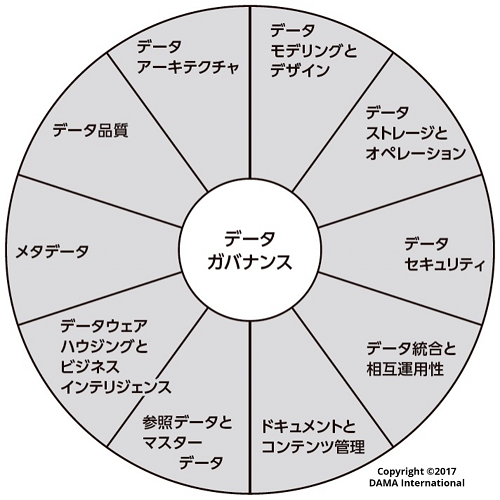

## はじめに

データマネジメントは、適切なデータ利活用を促進するための活動である。

データは様々な業務やシステムから生成され、その出力先や形式も様々である。情報流出などセキュリティ対応のため、権限を持った社員のみアクセス可能とすることが鉄則であるが、必要以上に権限を絞り過ぎると組織内のデータ流通が阻害され、競争力が低下する懸念がある。一方で適切な権限設定を個々人の判断に委ねることが難しいのも実情である。そのため、組織のデータリテラシーやデータ利活用の成熟度に合わせて適切な方針や仕組みが求められており、昨今の生成AIブームでその重要性はさらに増している。

本ガイドラインはデータマネジメントの設計における主要な論点や方針をまとめる。それによりデータマネジメント設計者が悩むポイントを軽減し、同時に議論のベースラインを提供する。本ガイドラインがデータマネジメント担当者やデータ基盤構築を行うデータエンジニアの道標となれば幸いである。

::: warning 免責事項

- 有志で作成したドキュメントである。フューチャーには多様なプロジェクトが存在し、それぞれの状況に合わせて工夫された開発プロセスや高度な開発支援環境が存在する。本ガイドラインはフューチャーの全ての部署／プロジェクトで適用されているわけではなく、有志が観点を持ち寄って新たに整理したものである
- 相容れない部分があればその領域を書き換えて利用することを想定している。プロジェクト固有の背景や要件への配慮は、ガイドライン利用者が最終的に判断すること。本ガイドラインに必ず従うことは求めておらず、設計案の提示と、それらの評価観点を利用者に提供することを主目的としている
- 掲載内容および利用に際して発生した問題、それに伴う損害については、フューチャー株式会社は一切の責務を負わないものとする。掲載している情報は予告なく変更する場合がある

:::

## 前提条件

基本的なアクセス管理ポリシーなど、何かしらのセキュリティポリシーは存在するが、データマネジメントに特化したポリシーの策定や運用が始まったばかりの組織を前提とし、組織で利用する統一的なデータ基盤は未構築であるような状況を想定する。

また、特定システムやサービスのDB設計ではなく、組織全体で用いるデータマネジメントを対象とする。また、データベースに格納されたテーブルデータや、CSV、JSONファイルなど、システムで保持するような構造化されたデータを主に扱い、Google Workspace、SharePoint、BOXなどに格納されたオフィス文書や画像などの非構造ファイルの扱いは、各章で明記しない限りは触れないとする。

データマネジメントの知識体系として、DAMA-DMBOK第２版（以下DMBOK2）があり、以下のような11領域の分類が有名である。

本ガイドラインでは上記を網羅的に説明するものでも、この分類に完全に従うものではない。主にデータ基盤やその周辺システムの構築を通して、必要なデータマネジメント方針をまとめたものである。

また、データマネジメントは特定の技術を指す用語では無いが、技術要素としてAWSを例に上げることが多い。

## 用語定義

| 用語             | 説明                                                                                                                                                                                 |
| :--------------- | :----------------------------------------------------------------------------------------------------------------------------------------------------------------------------------- |
| ビジネスユーザー | データ基盤利用者のうち、業務部門のことを指す。業務の効率化、分析、調査などを行う。ITエンジニアとは限らない                                                                           |
| データ資産       | 分析や可視化を通して業務改善や新規事業に活かせると考えられるデータ。構造データ、半構造データ、非構造データを問わない                                                                 |
| 構造データ       | リレーショナルデータベース（RDBMS）のように、スキーマ（データの構造）をデータ書き込み時に定義・適用するデータ（Schema On Write）                                                     |
| 半構造データ     | オブジェクトストレージなどに保存されているCSV、JSON、Parquetなどのように、データ自体に構造情報（タグなど）を含むが、厳密なスキーマ定義は読み込み時に行われるデータ（Schema On Read） |
| 非構造データ     | 画像・音声・動画やオフィス系のファイルを指す                                                                                                                                         |
| データソース     | データの発生源。本書では概ねシステム化されていることを前提とする                                                                                                                     |

## 謝辞

このアーキテクチャガイドラインの作成には多くの方々にご協力いただいた。心より感謝申し上げる。

- **作成者**: 真野隼記、中神孝士、佐々木伸悟、赤倉優蔵、古谷優子

## Articles

- 2025.12.29 [データマネジメント設計ガイドラインを公開しました](https://future-architect.github.io/articles/20251229a/)

---

次のページ: [データマネジメント設計ガイドライン](./datamanagement_guidelines.md)
