<page-title/>

本ガイドラインは、Gitブランチ管理の運用ルールをまとめる。

位置づけ・前提・免責事項は [Introduction](./index.md) を参照。

# 基本方針

一般的なGitブランチ運用のプラクティスに従い、本ガイドラインも以下の方針に則る。

- すべての機能開発や不具合修正に、`feature`ブランチを使用する
- プルリクエストを経由して`feature`ブランチの修正内容をマージする
- 永続ブランチは各環境にデプロイ可能となるよう整合性を保つ

# ブランチの種類

本ガイドラインで想定する、ブランチの種類とその役割を説明する。

| ブランチ名称 | 役割                         | ライフサイクル | 派生元ブランチ    | 命名規則                                                                    | 直プッシュ |
| ------------ | ---------------------------- | -------------- | ----------------- | --------------------------------------------------------------------------- | ---------- |
| `main`       | プロダクション環境との同期   | 永続的         | -                 | `main` 固定                                                                 | ❌️         |
| `feature`    | 特定機能の追加/変更          | 短命           | `main`／`develop` | `feature/${チケット番号}`: 詳細は[featureブランチ](#featureブランチ) を参照 | ✅️※1       |
| `develop`    | 開発の大元                   | 永続的         | `main`            | `develop` 固定。複数必要な場合は `develop2` と連番にする                    | ❌️         |
| `release`    | リリース作業用途             | 短命           | `develop`         | `release/${yyyymmdd}` や `release/${リリースバージョン}` など               | ❌️         |
| `hotfix`     | mainブランチに対する即時修正 | 短命           | `main`            | `hotfix/${チケット番号}`: featureブランチに準じる                           | ✅️         |
| `topic`      | 複数人での機能開発用途       | 短命           | `feature`         | `topic/${チケット番号}`: featureブランチに準じる                            | ✅️         |

※1: topicブランチを利用する場合は、派生させた`feature`ブランチへの直プッシュはNGとなる。

## mainブランチ

Gitリポジトリを新規作成するとデフォルトで作成されるブランチ。`master`から`main`に改名された経緯を持つ[^3]。

マージ毎にプロダクション環境へデプロイし同期を取る。

[^3]: [github/renaming: Guidance for changing the default branch name for GitHub repositories](https://github.com/github/renaming)

## featureブランチ

機能追加や変更作業のブランチで、主な特徴は以下である。

- ひとつの変更に対してひとつの`feature`ブランチを作成し、作業完了後に削除するため、開発中で最も使われる短命なブランチである
- 基本的に1人の開発者のみが利用する

<div class="img-bg-transparent">


</div>

以下の命名に従う。

- `feature/` のプレフィックスを付ける
- 課題管理システムと紐付けられるようなブランチ名にする

```sh
# OK（課題管理システムの課題番号をブランチ名に利用）
feature/#12345

# OK（GitHub Issue や JIRA や Backlog のプロジェクトIDをブランチ名に利用）
feature/<PROJECTID>-9403

# NG（プレフィックスが無い）
fixtypo
```

## developブランチ

開発の中心となるブランチである。

<div class="img-bg-transparent">


</div>

## releaseブランチ

リリースするために使用するブランチで、主な特徴は以下である。

- リリース前の検証を開発と並行して実施する場合に利用する
- `release`ブランチではバグ修正、ドキュメント生成、その他のリリースに伴うタスクのみを実施する
- `main`ブランチのマージコミットにリリースタグを打ち、`main`ブランチを`develop`ブランチへマージ後、`release`ブランチを削除する

<div class="img-bg-transparent">

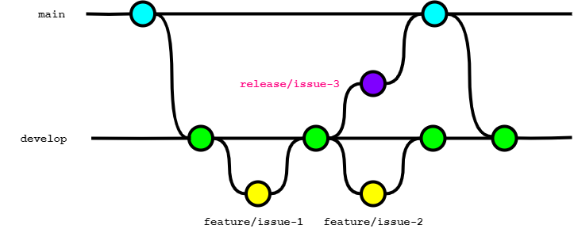

</div>

## hotfixブランチ

本番リリースに対して迅速にパッチを当てて修正する場合に使用するブランチで、主な特徴は以下である。

- 修正が完了すると`main`と`develop`の両方(あるいは進行中の`release`ブランチ)にマージされる
- `main`/`develop`ブランチがあると必要になる可能性がある。`main`/`feature`ブランチのみの運用では必須ではない（管理上の目的で`feature`と`hotfix`を分けることはあり得る）

<div class="img-bg-transparent">

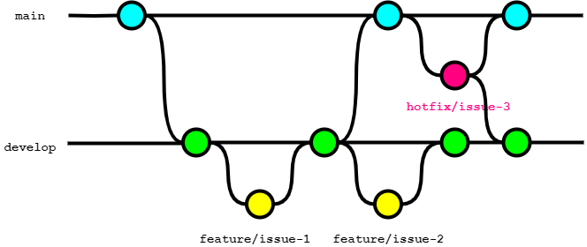

</div>

## topicブランチ

`feature`ブランチで実現する機能を複数人で開発する場合に使用するブランチである。

- `topic`ブランチが必要なケースでは、`feature`ブランチへの直接プッシュを行ってはならない
- GitHub Flowでは`feature`ブランチのことを`topic`ブランチと呼称する場合があるが、本ガイドラインでは`feature`ブランチから派生するブランチを`topic`ブランチと定義する

<div class="img-bg-transparent">

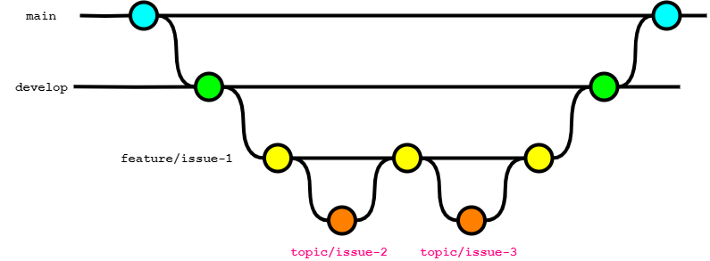

</div>

# ブランチ戦略の選定

ブランチ戦略は以下の方針で選定する。

- できるかぎりシンプルなモデルを選択し、運用コストを下げる
- プロジェクトのフェーズや体制に応じて、変更を許容する

有名なブランチ戦略として以下がある。

- [git-flow](https://nvie.com/posts/a-successful-git-branching-model/)
- [GitHub flow](https://docs.github.com/ja/get-started/using-github/github-flow)
- [GitLab Flow](https://docs.gitlab.co.jp/ee/topics/gitlab_flow.html)

本ガイドラインで推奨するブランチ戦略は次の2パターンであり、これをベースとして選択する。

| 名称                   | 利用ブランチ                                                                  | デフォルトブランチ | リリース作業ブランチ | 備考                                                                                                               |
| ---------------------- | ----------------------------------------------------------------------------- | ------------------ | -------------------- | ------------------------------------------------------------------------------------------------------------------ |
| Lite GitLab Flow<br>※1 | `main`<br>`develop`<br>`feature`<br>`topic`<br> `hotfix`                      | `develop`          | `develop`            | ・GitLab Flowからreleaseブランチを除いたパターン<br>・リリース作業時にdevelopマージを止められる場合に利用する      |
| GitLab Flow            | `main`<br>`develop`<br>`release` <br>`feature`<br>`topic` <br> `hotfix`<br>※2 | `develop`          | `release`            | ・リリース作業と開発作業が並行して行う必要があるか、<br>断面を指定して複数テスト環境にデプロイしたい場合に利用する |

- ※1: 特定の呼称はないためLite GitLab Flowと命名する
- ※2: 本ガイドラインでは、本来のGitLab Flowの呼称である `production`を`main`、`pre production`を`release`に言い換えている

# ブランチ戦略とデプロイメント環境

ブランチ戦略ごとに、デプロイメント環境に対応するブランチを整理する。プロダクション環境リリース前には、mainブランチでタグを打つこととする。

| 名称             | 開発環境 | ステージング環境 | プロダクション環境 | 備考                                                                                                                                                                                                                                                                                                                       |
| ---------------- | -------- | ---------------- | ------------------ | -------------------------------------------------------------------------------------------------------------------------------------------------------------------------------------------------------------------------------------------------------------------------------------------------------------------------- |
| Lite GitLab Flow | develop  | develop          | main               | ・開発環境へはdevelopマージをトリガーにCI/CDでデプロイを推奨する<br>・開発環境へのデプロイ漏れを防ぐため定期的にCI/CDでdevelop断面をリリースすることを推奨する<br>・動作確認など理由がある場合はfeatureブランチから直接開発環境へのデプロイも許容する<br>・ステージング環境は日次など定期的なCI/CDによるデプロイを推奨する |
| GitLab Flow      | develop  | release          | main               | ・開発環境へはdevelopマージをトリガーにCI/CDでデプロイを推奨する<br>・検証期間が長引きそうな場合は、PRレビュー承認後にfeatureブランチから開発環境へのデプロイを許容する                                                                                                                                                    |

# ブランチ戦略の拡張

次のような要件があった場合には、ベースとなるブランチ戦略を拡張する必要がある。

1. `develop`ブランチを複数作成する場合
2. 過去バージョンをサポートする場合

## developブランチを複数作成する場合

<div class="img-bg-transparent">

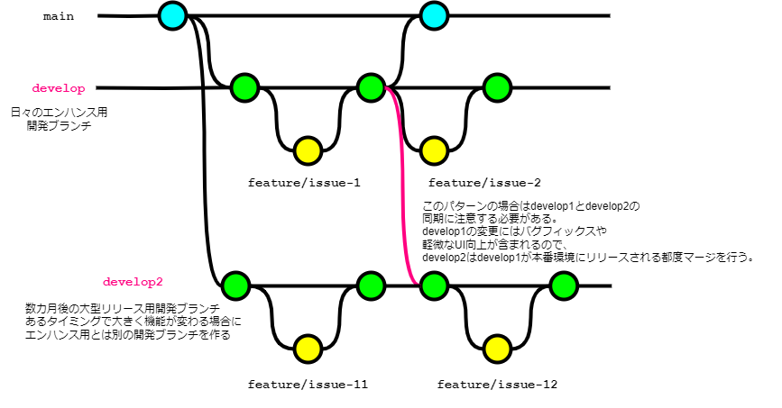

</div>

日々のエンハンス開発と並行して、数カ月後に大型の機能をリリースしたい場合がある。このときは複数リリースバージョンを並行して開発するため、 `develop`、`develop2` といった複数の`develop`ブランチを作る必要がある。

概要:

- `develop` の変更にはバグフィックスや軽微なUI向上が含まれ、日次／週次などの頻度でプロダクション環境へリリースされる
- `develop2` は`develop` ブランチの変更をすべて取り込んだ上で、大型機能を準備する必要がある

`develop2` 同期の注意点:

- リベースすると `develop2` を元にfeatureブランチを作成して開発している開発者が混乱するため、マージコミットを用いる
- 誤操作を避ける目的でcherry-pickは行わない
- `develop2` への同期は、 `develop` -> `main` ブランチに反映されるタイミングで行う（これにより、品質保証済みの変更のみ取り込める）

<div class="img-bg-transparent">


</div>

### develop2のリリース手順

1. `develop`から`develop2`へマージコミットする（2でコンフリクトが起こらないよう、前準備の意味合いで実施する）
2. `develop2`から`develop`にマージを行い、その後は通常のリリースフローに従う
3. 問題なくリリースが完了し次第、`develop2`を削除する

`develop`から`develop2`へマージ後、`develop2`を`main`ブランチに反映させる手順も考えられるが、`develop2`から`develop`へのマージとすると以下のメリットがある。

- プロダクション環境（=`develop`）との差分を把握できる
- より一般的な名称である `develop` ブランチのみ残るため、新規参画者フレンドリーである

## 過去バージョンをサポートする場合

<div class="img-bg-transparent">

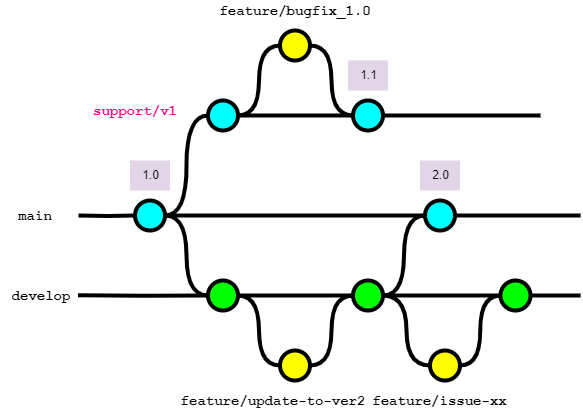

</div>

（社内外の）ライブラリでインタフェースの大型改善や仕様変更を受けて、メジャーバージョンを1→2に上げることがある。この時に過去バージョンもサポートする必要がある場合、バージョン別にsupportブランチを作成する。

概要:

- メインの更新はversion2（`main`ブランチ）に対して行っていくが、version1の利用ユーザーが存在する場合、バグfixやセキュリティアップデートを並行して行う
  - version1を示すブランチ（`support/v1`）を別途作成、そのブランチから`feature`ブランチを作成する
- featureブランチのマージ後、マイナーバージョン（あるいはパッチバージョン）を上げたタグをコミットし、リリースする
  - ※この例ではversion1とversion2が別リソースとして動いていることを前提としている。同一リソースで複数バージョンが稼働する場合はversion2のブランチで対応する必要がある

# マージ戦略の選定

マージ戦略とは、複数のブランチ間で生じた変更の取り込み方針を指す。

具体的には次の3ケースそれぞれで、「マージコミット」 「リベース」 「スカッシュマージ」のどれを採用するか判断する。

1. `develop`ブランチから`feature`ブランチへ変更を取り込む
2. `feature`ブランチから`develop`ブランチへ変更を取り込む
3. 永続ブランチ間で変更を取り込む

以下に影響を与えるため、Gitの利用開始前に決め、チームで統制を図ることが重要である。

- プロジェクトのコミット履歴の管理
- 開発プロセスの円滑な進行
- 最終的なソフトウェア品質

## developブランチからfeatureブランチへ変更を取り込む

`feature`ブランチでの作業中に`develop`ブランチが更新された場合、品質保証の観点で、その変更を`feature`ブランチに取り込んだ上でテストなどの検証作業を行う必要がある。

`develop`ブランチの変更を`feature`ブランチに取り込む方法は、下表の「マージコミット」 「リベース」の2つである。スカッシュマージはこのケースでは選択できない。

| 1. マージコミット                                                                                         | 2. リベース                                                                                                                             |
| --------------------------------------------------------------------------------------------------------- | --------------------------------------------------------------------------------------------------------------------------------------- |
| <div class="img-bg-transparent"> 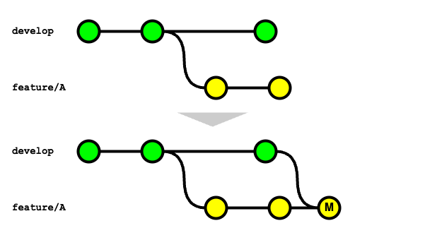 </div> | <div class="img-bg-transparent"> 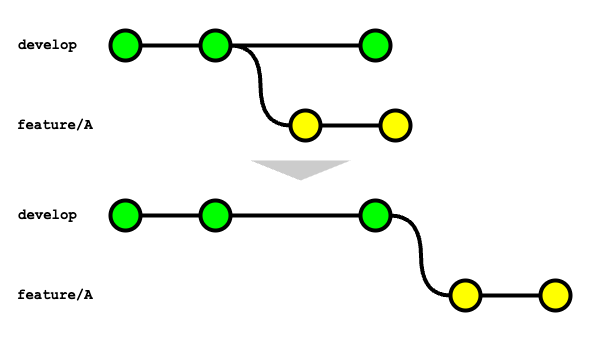 </div>                            |
| `git fetch & git merge`（≒ `git pull`）。マージコミットが作成される                                       | `git fetch & git rebase`（≒ `git pull --rebase`）。最新の開発ブランチの先頭から新たにコミットを作り直され、マージコミットは作成されない |

本ガイドラインの推奨は「1. マージコミット」である。

理由は次の通り。

- リベース方式は、設定すべき `rerere.enabled` オプションを有効にしても、1度解消したコンフリクトの再対応をゼロにできないため
- マージコミットが作成され履歴は複雑になるが、1度解消したコンフリクトの再対応がゼロにできる点を優先するため

::: tip リベース方式を採用する場合

もし、リベース方式を採用する場合は、以下を設定する。

1. `git pull` 時の挙動がリベースになるよう `git config pull.rebase true` を実行する
2. developブランチの変更を取り込む場合、同じコンフリクトの解消を何度も求められることを解消するため、`git config rerere.enabled true` を実行する

マージによる変更の取り込みが既存のブランチを変更しないのに対し、リベースは全く新しい（元のコミットIDとは別のコミットIDで）コミットを作成するため、次の1点に注意すること。

1. リモートにプッシュ済のブランチがあり、developブランチからさらに変更をリベースで取り込んだ場合、強制プッシュ（Force Push）が必要になる
   - `git push origin HEAD --force-with-lease --force-if-includes` とすることで、意図せずリモートブランチの変更を上書きしないようにする
     - `--force-with-lease`: ローカルのリモート追跡ブランチの ref とリモートの ref を比較し、ローカルの状態が最新でない場合（プッシュ先のリモートブランチに変更が入ったが、ローカルで `git fetch` していない場合）は、プッシュに失敗する。逆にいうと、プッシュ前に `git fetch` を実行済みの場合は、リモートの変更を上書きする形で強制プッシュができてしまうため、これを防ぐには `--force-if-includes` フラグを併用する
     - `--force-if-includes`: リモート追跡ブランチの変更がローカルに全て取り込まれていない場合は、プッシュに失敗する。これにより意図せず他の人のコミットを上書きすることを防ぎつつ、必要な変更を強制的にプッシュすることができる

:::

::: tip 強制プッシュでレビューコメントは消えるのか？

強制プッシュにより、レビューコメントが消えてしまわないかという懸念を聞くことがある。2024年7月に実施した調査結果では問題なかった。特にリベース方式では重要である。

- a.履歴保持: 強制プッシュを行い、GitHub投稿したレビューコメントが履歴として何かしらのページで取得できるかどうか。GitHubではConversationタブで確認
- b.行単位の紐づけ（該当行の変更なし）: レビューコメントが付けられた行とは別で変更し、強制プッシュしたときにレビューコメントの紐づけが残るかどうか。GitHubではFile changedタブで確認
- c.行単位の紐づけ（該当行の変更あり）: レビューコメントで付けられた行を修正し、強制プッシュ時の挙動。レビュー対応をしたとみなしレビューコメントのひも付きは解除されているべきである。GitHubではFile changedタブで確認

| サービス | a.履歴保持 | b.行単位の紐づけ（該当行の変更なし） | c.行単位の紐づけ（該当行の変更あり） |
| -------- | ---------- | ------------------------------------ | ------------------------------------ |
| GitHub   | 残る       | 残る                                 | 消える                               |
| GitLab   | 残る       | 残る                                 | 消える                               |

:::

### プルリクエスト作成前にアップストリームをプルする

`feature`ブランチの開発が終わりプルリクエストを作成する際には、改めてアップストリーム（`develop`ブランチ）の変更を取り込み、差分が無いことを確認すべきである。

理由は次の通り。

- レビュアーの負荷軽減のため
  - レビュアーがプルリクエストの差分以外の部分を参照した際に、それが古いバージョンであると、誤指摘、混乱してしまうなどの懸念がある
- マージ後の`develop`ブランチでテスト失敗するリスクを減らすため
  - コンフリクトせずにマージ可能だったとしても、何かしらの依存関係や整合性が狂い、マージ後のテストに失敗する可能性がある

### プルリクエストのレビュー依頼までにどこまでテストしておくべきか

`Lite GitLab Flow` `GitLab Flow` ともに、開発環境へはdevelopマージをトリガーにCI/CDでデプロイすることを推奨している。

そのため、プルリクエスト作成時点では開発環境（≒AWSなどクラウド環境の想定）へのデプロイ＋動作検証は不要である。

ローカルでの開発のみで品質担保は難しく手戻りが多い場合は、サンドボックス環境や開発環境にfeatureブランチからデプロイして動作検証する。開発環境を共有する場合は、デプロイタイミングの制御がチーム内で必要になるため、運用ルールを検討する必要がある。

### Terraformはレビュー依頼時点でどこまで確認しておくべきか

Terraformはplanが成功してもapplyが失敗することは多々あり（サブネットが足りなかった、force_destroy=trueの明示的な設定が必要だったなど）、レビューでの見極めは難しいことが多い。そのため、applyをどのタイミングで実施するかがチームの生産性の鍵となる。

大別すると以下の3方式が存在する。

1. マージ後にapply
   - PR -> CI（planを含む） -> レビュー -> developマージ -> apply(CI)
2. Approve後にapply
   - PR -> CI（planを含む） -> レビュー -> apply -> developマージ -> apply(CI)
3. レビュー依頼前にapply
   - apply -> PR -> CI(plan含む) -> レビュー -> developマージ -> apply(CI)

それぞれの特徴を下表にまとめる。

| 観点                 | （1）マージ後にapply                                                         | （2）Approve後にapply                                                             | （3）レビュー依頼前にapply                                                     |
| -------------------- | ---------------------------------------------------------------------------- | --------------------------------------------------------------------------------- | ------------------------------------------------------------------------------ |
| 説明                 | developブランチにマージ後にapply。アプリコードと同じメンタルモデルを共有可能 | レビュアー承認後にapply。featureブランチからapplyするため、あるべき姿からは外れる | レビュー依頼前にapplyで成功したことを確認する方式                              |
| developブランチ品質  | ❌️一時的にapplyが失敗するコードが混入するリスク                              | ✅️apply可能なコードのみに保つことができる                                         | ✅️apply可能なコードのみに保つことができる                                      |
| レビュー負荷         | ❌️applyの成否は不明なので心理的負荷あり                                      | ❌️applyの成否は不明なので心理的負荷あり                                           | ✅️applyが成功している前提で対応可能。apply結果をコンソールからも確認可能       |
| apply失敗時のコスト  | ❌️再度PRを作る必要があり手間                                                 | ✅️同一PRを流用できる                                                              | ✅️apply成功後にPR作成が可能                                                    |
| PRのトレーサビリティ | ❌️PRが割れると面倒                                                           | ✅️同一PRである                                                                    | ✅️同一PRである                                                                 |
| 環境のバッティング   | ✅️ない                                                                       | ⚠️Approveからdevelopマージまでの間に、他メンバーの作業と重複するとややこしい      | ❌️作業調整が必要                                                               |
| ガバナンス           | ✅️applyをCIのみに絞るなど自動化と相性が良い                                  | ⚠️レビュアー承認後のコードのみapply対象とできる                                   | ❌️ノーレビューのインフラ変更を適用するため、初学者が多いチームには適用が難しい |
| 結論                 | applyの成功率が高く維持できる場合に有効                                      | applyの成功率が低い場合に有効                                                     | 少数精鋭の場合に採用可能な、上級者向けの方式                                   |

本ガイドラインの推奨は以下。

- 新規参画者が多く統制を取りたい場合や、applyの成功率が高く維持できる場合は（1）を選択
- ある程度インフラメンバーが絞れ、かつapplyの失敗率が高くレビュー負荷も高くなってしまう懸念がある場合は（2）を選択
- インフラメンバーが少数精鋭（通常、同時の作業はほぼ発生しない）の場合は必要に応じて、（2）をベースにしながら（3）を取り入れて生産性を上げる

## featureブランチからdevelopブランチへ変更を取り込む

開発が完了したfeatureブランチをdevelopブランチに取り込む際は、GitHub（GitLab）上でプルリクエスト（以下、PR）を経由する運用とする。

developブランチにfeatureブランチの変更を取り込む方法は下表のように3パターン存在する。

|      | 1.マージコミット                                                                                                       | 2.リベース                                                                                                                     | 3.スカッシュマージ                                                                                                             |
| ---- | ---------------------------------------------------------------------------------------------------------------------- | ------------------------------------------------------------------------------------------------------------------------------ | ------------------------------------------------------------------------------------------------------------------------------ |
| 名称 | Create a merge commit                                                                                                  | Rebase and merge                                                                                                               | Squash and merge                                                                                                               |
| 流れ | <div class="img-bg-transparent"> 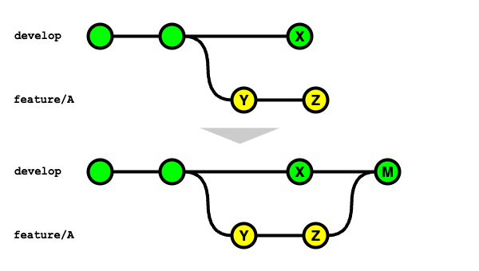 </div> | <div class="img-bg-transparent"> 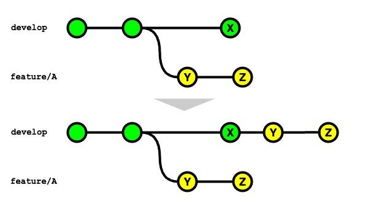 </div> | <div class="img-bg-transparent"> 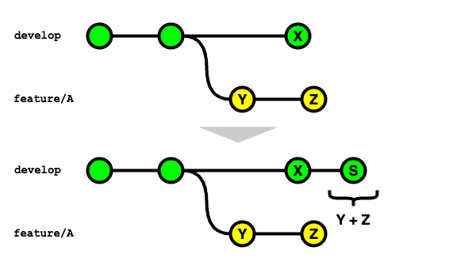 </div> |
| 説明 | `git merge --no-ff` で変更を取り込む                                                                                   | featureブランチを最新のdevelopブランチにリベースし、`git merge --ff` で変更を取り込む                                          | `git merge --squash` で変更を取り込む                                                                                          |
| 特徴 | developブランチにマージコミットが作成される                                                                            | マージコミットは作成されず、履歴が一直線になる                                                                                 | featureブランチで行った変更YとZを1つにまとめたコミットがdevelopブランチに作成される                                            |

::: tip GitLabを利用する場合

GitLabでも開発ブランチに機能ブランチの変更を取り込む方法は3種類ある。

ただし、マージリクエスト上のオプションによってコミット履歴が変わる点は注意である。

|      | 1. Merge commit                                                                                                                                      | 2. Merge commit with semi-linear history                                         | 3. Fast-forward merge                                                                                                                |
| ---- | ---------------------------------------------------------------------------------------------------------------------------------------------------- | -------------------------------------------------------------------------------- | ------------------------------------------------------------------------------------------------------------------------------------ |
| 流れ | <div class="img-bg-transparent">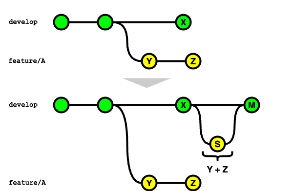 </div> | 省略                                                                             | 省略                                                                                                                                 |
| 説明 | GitHubにおける `Create a merge commit` と同様のマージ方法                                                                                            | `Merge commit` と同じコマンドを使用して、機能ブランチの変更を取り込む方法        | GitHubにおける `Rebase and merge` と同様のマージ方法                                                                                 |
| 注意 | `Squash commits` を選択してマージした場合、`squash commit` と `merge commit` の2つのコミットが作成される                                             | ソースブランチがターゲットブランチより古い場合はリベースしないとマージできない。 | マージリクエスト上で `Squash commits` を選択してマージした場合、GitHubにおける `Squash and merge` と同様のマージ方法になる（※補足1） |

（※補足1）マージ方法で Merge commit を選択して、マージリクエスト上で Squash commits オプションを選択してマージした場合は以下と同義である。

```bash
git checkout `git merge-base feature/A develop`
git merge --squash feature/A
SOURCE_SHA=`git rev-parse HEAD`
git checkout develop
git merge --no-ff $SOURCE_SHA
```

:::

本ガイドラインの推奨は、「スカッシュマージ」による方法である。

理由は次の通り。

- `feature`ブランチのコミットログが、汚れることは許容したいため
- `develop`ブランチの履歴をクリーンに保てるため
- PRをよりシンプルに保つインセンティブとしたいため（単一のコミットメッセージで表現できる程度の方がレビューコストも小さいため）

「スカッシュマージ」を行うと、変更元の`feature`ブランチのコミットをまとめたコミットが新たに作成される。そのため、元のfeatureブランチを再利用しPRを作成するとコンフリクトが発生する。マージ後はリモート/ローカルの双方で速やかに`feature`ブランチを削除するよう、以下の設定を加える。

- マージ後にfeatureブランチを自動削除する設定
  - リモート側: GitHubでは `Automatically delete head branches` を選択することで、マージ後に自動でブランチの削除が行われる（GitLabではプロジェクト設定で`Enable "Delete source branch" option by default` を選択する）
  - ローカル側: `git config --global fetch.prune true`: リモート側で削除されたブランチをローカル側でも削除する

「スカッシュマージ」で変更を取り込む場合、次の2点に注意すること。

1. 部分的なコミットの取り消しができない
   - 履歴上は1つのコミットになるため、マージ後に一部の変更だけの取り消しが不可能。そのためPRをなるべく小さなまとまりにする
2. Authorが失われる
   - `feature`ブランチにコミットを行った人がAuthorになるのではなく、「スカッシュマージ」を行った人がAuthorになる。OSS開発の場合など、厳密にコントリビューションを管理する必要がある場合は注意する
   - GitHubでは「スカッシュマージ」を行う場合、デフォルトでコミットメッセージに `co-authored-by` トレーラーが追加され、1つのコミットが複数の作成者へ帰属するようになっている[^2]。この記述は削除しないようにする

[^2]: [複数の作者を持つコミットを作成する - GitHub Docs](https://docs.github.com/ja/pull-requests/committing-changes-to-your-project/creating-and-editing-commits/creating-a-commit-with-multiple-authors)

### マージはだれが行うべきか

プルリクエストの承認（Approve）をもらった後、マージはレビュアー／レビュイーのどちらが行うべきか議論になる場合がある。

| 観点       | レビュアー派                                                              | レビュイー派                                                                        |
| ---------- | ------------------------------------------------------------------------- | ----------------------------------------------------------------------------------- |
| 説明       | 開発者の責務が、developブランチにマージするまでという役割分担の場合に有効 | 各開発者がその機能のリリースについて責任を負うモデルの場合に有効                    |
| 生産性     | ⚠️レビュアーがブロッキングになりがち                                      | ✅️高い。コメントはあるがApproveしたので、適時対応してマージして、といった運用が可能 |
| 統制       | ✅️レビュアーが管理しやすい                                                | ✅️メンバーの自主性に依存                                                            |
| 要求スキル | ✅️低い。中央で統制を行いやすい                                            | ⚠️開発メンバーの練度が求められる                                                    |

そのプルリクエストで実装した機能を、本番環境にデリバリーする責務をどちらに持たせるかという観点で、意思決定することが多い。

本ガイドラインの推奨は以下。

- プロダクトオーナー（業務側）などでリリースタイミングを完全にコントロールしたいといった分業制を取る場合は、レビュアーがマージする
- 各開発者により自律性を持たせ、アジャイル的に生産性を重視するのであれば、レビュイーがマージする

## 永続ブランチ間で変更を取り込む

永続ブランチ同士の変更を取り込むケースとして、`develop` ブランチを `main` ブランチや `release`ブランチにマージするといった場合がある。

ブランチ間の同期が取れないため「リベース」「スカッシュマージ」は選択できないため、「マージコミット」を採用する。

# ブランチ運用アンチパターン

ブランチ運用でよく課題に上がるパターンとその対応を紹介する。

## 追い抜きリリース

以下のような状況とする。

- 2つのチケット（issue-312、issue-394とする）があり、どちらも同じファイルの修正を含む
- 先にissue-312がdevelopにマージされ、その後に着手されたissue-394がマージされた
- 以下のような条件があるため、issue-394分を先にリリースしたい
  - issue-312のリリースは業務上の合意が得られていない（エンドユーザ操作に影響があるため、事前告知した日時でリリースしたいなど）
  - issue-394は不具合修正であり業務上の優先度が高いため、なるべく早くリリースしたい

<div class="img-bg-transparent">

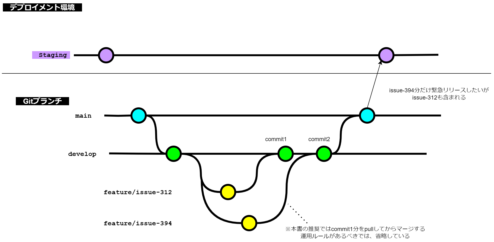

</div>

陥りがちな対策としては次の2点が考えられる。

1. issue-312をリバートする
2. issue-394のコミットのみをcherry pick してmainブランチにマージする

1のリバートはGitHubの機能で提供されていることもあり簡単に行える。しかし手戻りであることは間違いなく、コミットの履歴が汚れるため、保守運用の視点ではマイナスである。2のcherry pickは操作、管理ともに煩雑でミスが出やすいという課題がある。

処方箋だが、前提条件によって別の対応策が考えられる。

1. issue-312のマージがおかしいとするケース
   - 本来想定していたリリーススケジュールから見て、issue-312がdevelopにマージされている状態が正しくないのであれば、issue-312はdevelopにマージせず待機しておくべきだった
   - 誤ってissue-312をマージしてしまったことが原因であれば、リバートを行うことが正しい
2. issue-394のマージがおかしいとするケース
   - 本来想定していたリリーススケジュールを破って、issue-394を優先してリリースしたいというのであれば、`feature` ではなく `hotfix` ブランチで対応すべきであった

2の例を以下に図示する。

<div class="img-bg-transparent">

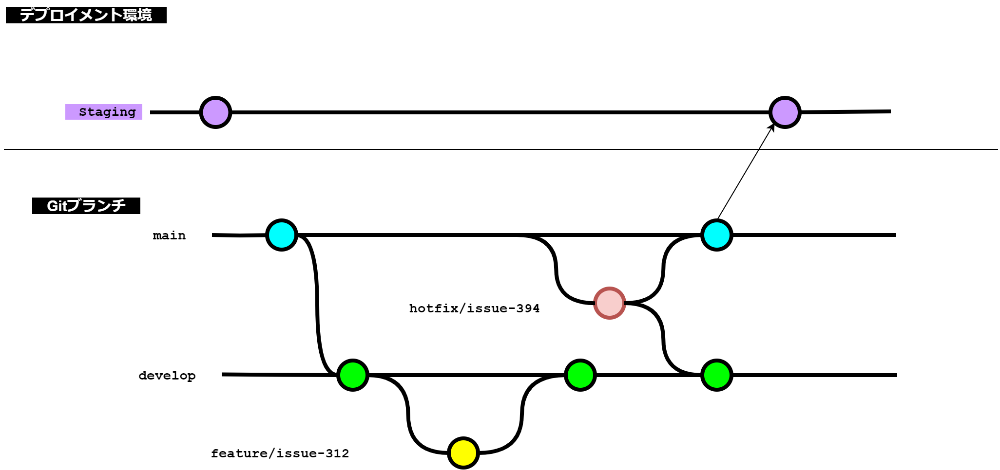

</div>

# ブランチ命名規則

ブランチ名の命名規則は、[ブランチの種類](#ブランチの種類) 章に従うこと。

# タグ規則

Gitには[タグ](https://git-scm.com/book/ja/v2/Git-%e3%81%ae%e5%9f%ba%e6%9c%ac-%e3%82%bf%e3%82%b0)機能があり、リリースポイントとしてタグを作成する運用とする。

これにより、リリースしたアプリケーションやライブラリに不具合があった場合の切り戻しや原因追求が容易になる。

## タグの運用ルール

- リリースごとに新しいバージョンを示したタグを発行する
- (推奨) GitHubなどの画面経由でタグを作成する
- mainブランチにてタグを作成する
- 入力間違えなどのケースを除き、一度タグをつけた後は削除しない
- 後述する「タグの命名規則」に従う

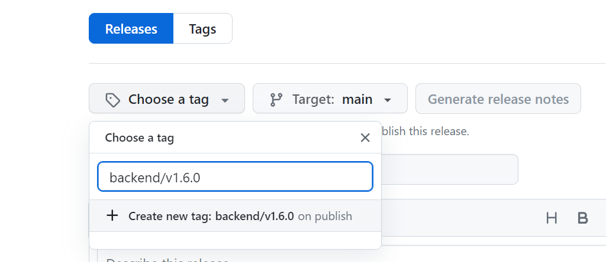

何かしらの理由で、コマンドラインからタグを作成する必要がある場合は、以下に注意する。画面経由・コマンドライン経由でのタグ作成は混ぜないようにし、運用手順は統一する。

- 軽量 (lightweight) 版ではなく、注釈付き (annotated) 版のタグを利用する

```sh
# OK（注釈付きタグを利用する）
$ git tag "v1.0.4" -m "v1.0.4 🐛Fix item api log"

# NG（軽量タグは利用しない）
$ git tag "v1.0.4"
```

::: warning タグが迷子になる？

タグはmainなど永続ブランチで作成する必要がある。例えばfeatureブランチでタグを作成し、`git push origin {tag_name}` でリモートにプッシュしたとしても、`rebase` でその紐付けが消えてしまう。なぜなら、タグはコミットのハッシュに付与されるラベルであり、`rebase` でコミットのハッシュが変わると、どのコミットに対するタグなのか分からなくなってしまうからである。
:::

## タグの命名規則

- `v1.2.4` などの [セマンティックバージョニング](https://semver.org/lang/ja/) を基本とする
- モノリポの場合は `frontend/v1.0.0`、`backend/v2.0.1` など領域ごとにプレフィックスを付与する形式を取る
  - プレフィックスにすることで、タグをリスト表示した場合の視認性が上がる

命名に従うと、次のようなコマンドで絞り込みできる。

```sh
$ git tag -l --sort=-version:refname "frontend/v*"
frontend/v2.0.0
frontend/v1.3.0
frontend/v1.2.0
frontend/v1.1.0
...
```

また、Gitクライアントによっては `/` を使うことでフォルダのように階層表示ができるため、プレフィックスの区切り文字は `-` ハイフンではなく、スラッシュとする。

## タグメッセージの規則

- (推奨) GitHubを利用中の場合、「[Generate release notes](https://docs.github.com/en/repositories/releasing-projects-on-github/automatically-generated-release-notes)」を用いて、タイトルや本文を自動生成する
- フロントエンド・バックエンドで整合性を保っているのであれば、メモ目的でバージョンを記載する運用を推奨とする
- 実用的な用途が思いつかない場合は、開発者視点での楽しみや、リリースの大きなマイルストーンの名称など、チームの関心事を記入することを推奨とする

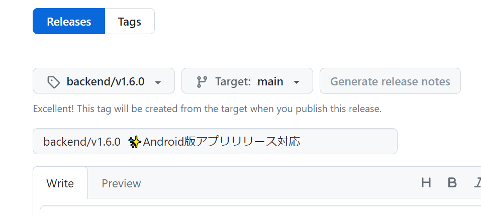

何かしらの理由で、コマンドラインからタグを作成する必要がある場合は、GitHub利用時の規則に合わせて次のように作成する。

入力例:

```sh
# OK
$ git tag -a backend/v1.8.0 -m "backend/v1.8.0"
$ git tag -a backend/v1.9.0 -m "backend/v1.9.0 🚀Release with frontend-v3.0.1"
$ git tag -a backend/v2.0.0 -m "backend/v2.0.0 ✨Android版アプリリリース対応"

# NG
$ git tag -a backend/v3.0.0 -m "🚀Release version v2.0.0"
```

## バージョンアップ規則

- 開発しているプロダクトがライブラリの場合、セマンティックバージョニングに厳密に従う
- 開発しているプロダクトがシステム（アプリケーション）の場合、その成熟度や初回リリースの区切りでバージョンアップを行うことを推奨する。適切なバージョンアップにより視認性が上がり、運用負荷を下げられる
  - 例1: 初回リリース、カットオーバーで `v1.0.0` に上げる
  - 例2: 稼働後1年以上経過し、中規模以上の大きな機能アップデートがあったので、 `v2.0.0` に上げる

# ラベル規則

IssueやPRを分類できるラベルの利用は自由とする。

PRに適切なラベルを設定し、 [自動生成リリースノート - GitHub Docs](https://docs.github.com/ja/repositories/releasing-projects-on-github/automatically-generated-release-notes) に記載があるように `.github/release.yml` へ設定することで、リリースノートの生成をラベル単位にグルーピングできる。

PRを後で探しやすくするための検索キーとしての位置づけと、リリースノート自動生成という観点でラベルを準備すること。

# コミットメッセージ規則

Gitのコミットメッセージは原則自由とする。理由は以下である。

- 通常、作業はチケット管理システムを駆動に開発するため、情報が重複する
- リリースノートの自動生成での扱いは、どちらかといえばラベルとPRのタイトルが重要
- メンバーによっては粒度の小さいコミットを好む場合も多く、運用の徹底化を図る負荷が高い

チーム規模や特性により、Gitのコミットメッセージのルール化にメリットが見込まれる場合は、 `Conventional Commits` をベースとした以下の規約を推奨する。

::: tip Conventional Commitsの勧め
コミットメッセージの書式をルール化することで、コミットの目的がわかりやすくなる、履歴からのトラッキングが容易になる利点がある。

本ガイドラインのコミットメッセージの書式としては、`Conventional Commits`をベースにした規約としている。

以下の形式でコミットメッセージを記載する。

```md
<type>: <subject> <gitmoji>
```

コミットメッセージはtype、subject、gitmojiの最大3つの要素から構成され、それぞれ後述する書式に従う。
このうちtypeとsubjectは必須とし、gitmojiはプロジェクトの運用にしたがい任意とする。

## type

typeは必須の要素であり、以下のいずれかを選択する。

| type       | 説明               |
| ---------- | ------------------ |
| `feat`     | 新機能の追加       |
| `fix`      | バグの修正         |
| `docs`     | ドキュメントの更新 |
| `refactor` | リファクタリング   |

## subject

subjectは必須の要素であり、変更内容を簡潔に記載する。
issue idは、PRから参照する運用を想定し、コミットメッセージの必須要素とはしない。

## gitmoji

gitmojiは任意の要素であり、変更内容を視認しやすくする絵文字を使用できる。

変更内容と絵文字の対応は厳密とせず、開発者が任意に選択する。

type(feat, fix, docs, refactorなど)に基づく、選択例を以下に示す。

```txt
 ==== Emojis ====
 :ambulance:  🚑致命的なバグ修正(fix)
 :bug:  🐛バグ修正(fix)
 :+1: 👍機能改善・機能修正(fix)
 :cop: 👮セキュリティ関連の修正(fix)
 :art: 🎨レイアウト関連の修正(fix)
 :green_heart: 💚テストやCIの修正・改善(fix)
 :wrench: 🔧設定ファイルの修正(fix)
 :building_construction: 🏗️アーキテクチャの変更(fix)
 :tada: 🎉大きな機能追加(feat)
 :sparkles: ✨部分的な機能追加(feat)
 :up:   🆙依存パッケージ等のアップデート(feat)
 :memo: 📝ドキュメント修正(docs)
 :bulb: 💡ソースコードへのコメント追加や修正(docs)
 :lipstick: 💄Lintエラーの修正やコードスタイルの修正(refactor)
 :recycle: ♻️リファクタリング(refactor)
 :fire: 🔥コードやファイルの削除(refactor)
 :rocket: 🚀パフォーマンス改善(refactor)
```

## コミットメッセージ例

上記のルールに従ったコミットメッセージのサンプルを以下に示す。

```txt
feat: カレンダー機能の追加 🎉
```

```txt
fix: メモリリークの修正 🚑
```

```txt
docs: デプロイフローをドキュメント化 📝
```

```txt
refactor: Lintエラーの修正 💄
```

:::
