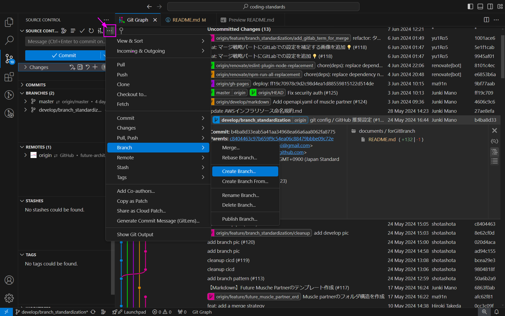

# VS CodeでのGit操作

利用頻度が高いとされるGitクライアントである、VS Code上でのGit操作を紹介する。

VSCode上でのGit操作は、サイドバーの "Source Control" から行うことができる。ほとんど全ての操作はコマンドパレットからも実行可能だが、説明は割愛する。

## リポジトリのクローン (`git clone`)

1. サイドバー > Explorer か Source Control > Clone Repository ボタンをクリック
2. URLを入力すると、リポジトリをクローンできる

| 1                                    | 2                                    |
| ------------------------------------ | ------------------------------------ |
|  |  |

## コミットグラフの表示

1. SOURCE CONTROL パネル > 黒丸のグラフアイコン (View Git Graph (git log)) をクリック
2. コミットグラフが表示される

| 1                                    | 2                                    |
| ------------------------------------ | ------------------------------------ |
|  |  |

白丸のグラフアイコン (Show Commit Graph) はGitLensのコミットグラフだが、冒頭の記述通り、Pro版でのみの提供となる。

## リモートのフェッチ／プル (`git fetch` / `git pull`)

以下のいずれかを操作すると、リモートリポジトリをフェッチできる。

- (a) SOURCE CONTROL パネル > 三点リーダーアイコン (More Actions...) をクリックし、 Fetch を選択
- (b) コミットグラフ > 雲アイコン (Fetch from Remote(s)) をクリック

| a, bの手順両方を記載                 |
| ------------------------------------ |
|  |

なお、フェッチ後に以下のようなダイアログが表示される場合があるが、 "Yes" を選択すると、自動で定期的にフェッチを行う。

## ブランチの作成／チェックアウト (`git branch` / `git checkout`)

以下のいずれかを操作すると、ブランチを作成できる。

- (a) SOURCE CONTROL パネル > 三点リーダーアイコン (More Actions...) をクリックし、Branch > Create Branch... を選択
  - 現在チェックアウトしているブランチから新規ブランチが作成されますが、Create Branch From... を選択すると、作成元のブランチを選択することができる
  - 作成したブランチに自動的にチェックアウトする
- (b) コミットグラフ > 作成元コミットの行上で右クリックし、Create Branch... を選択
  - "Check out" にチェックを入れると、作成したブランチにチェックアウトする

| a                                      | b                                      |
| -------------------------------------- | -------------------------------------- |
|  |  |

## ステージ／コミット／プッシュ (`git add` / `git commit` / `git push`)

1. SOURCE CONTROL パネル > 変更ファイルの行 > +アイコン (Stage Changes) をクリックすると、対象ファイルをステージできる（Changes > +アイコン (Stage All Changes) をクリックすると、すべての変更をステージする）
2. 必要な変更をステージ後、 SOURCE CONTROL パネル内でコミットメッセージを入力し、 Commit ボタンをクリックすると、コミットを作成できる

| 1                                  | 2                                    |
| ---------------------------------- | ------------------------------------ |
|  |  |

以下のa～cいずれかを操作すると、作成したコミットをリモートリポジトリにプッシュできる。

- (a) SOURCE CONTROL パネル > 三点リーダーアイコン (More Actions...) をクリックし、Push を選択
- (b) BRANCHES パネル > 対象ブランチの行 > 雲アイコン (Publish Branch) をクリック
- (c) コミットグラフ > 対象ブランチの上で右クリックし、Push Branch... を選択

| a                                  | b                                  | c                                  |
| ---------------------------------- | ---------------------------------- | ---------------------------------- |
|  |  |  |
