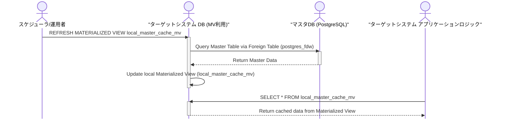
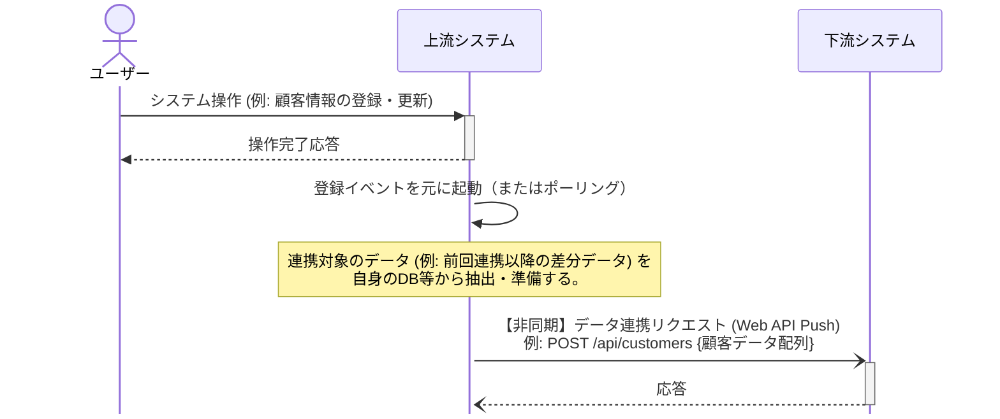
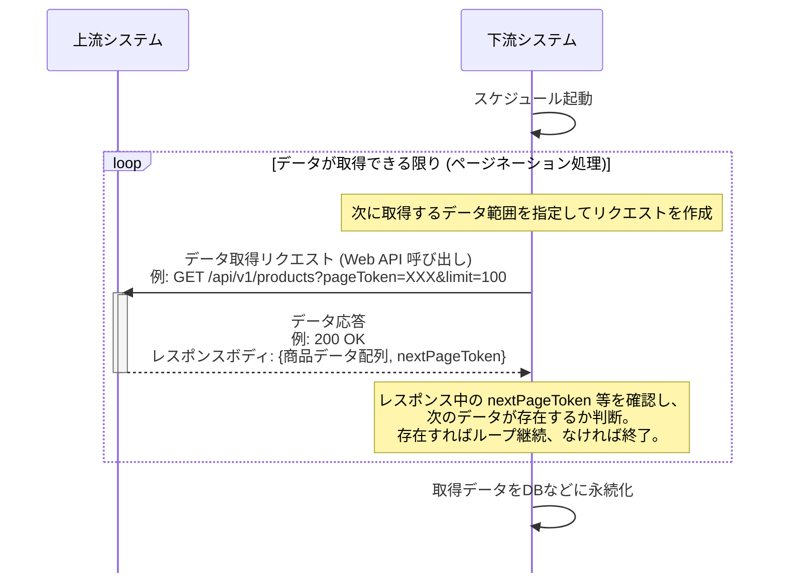
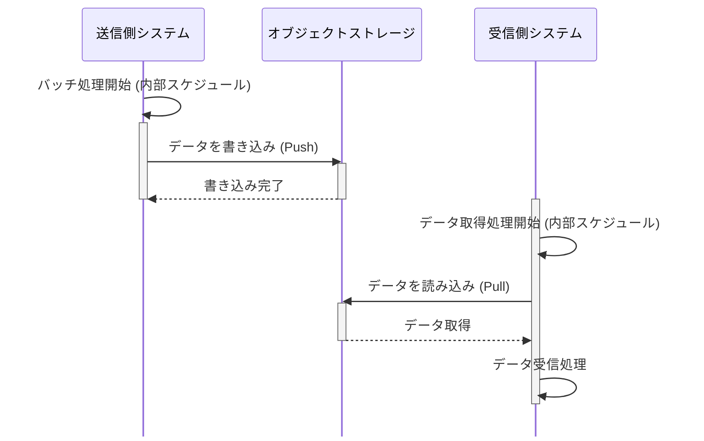
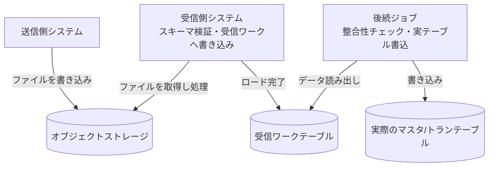
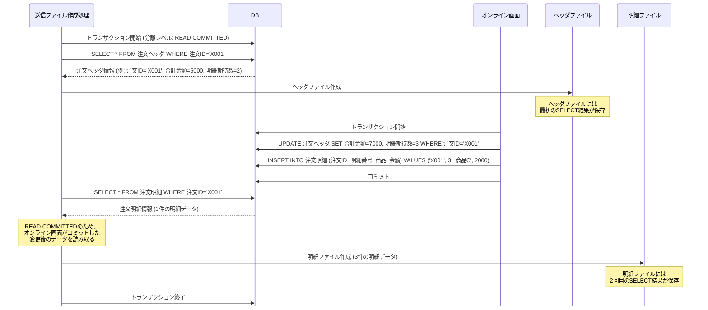

<page-title/>

::: warning 免責事項

- 有志で作成したドキュメントである。フューチャーには多様なプロジェクトが存在し、それぞれの状況に合わせて工夫された開発プロセスや高度な開発支援環境が存在する。本ガイドラインはフューチャーの全ての部署／プロジェクトで適用されているわけではなく、有志が観点を持ち寄って新たに整理したものである
- 相容れない部分があればその領域を書き換えて利用することを想定している。プロジェクト固有の背景や要件への配慮は、ガイドライン利用者が最終的に判断すること。本ガイドラインに必ず従うことは求めておらず、設計案の提示と、それらの評価観点を利用者に提供することを主目的としている
- 掲載内容および利用に際して発生した問題、それに伴う損害については、フューチャー株式会社は一切の責務を負わないものとする。掲載している情報は予告なく変更する場合がある

:::

# はじめに

I/Fとはインタフェースの略で、ここではシステム間のデータ連携における、システムインタフェースを指すとする。独立して稼働するシステム同士では、データ連携することで様々な処理を行う。例えば、基幹システム同士の連携では販売管理システムで入力された受注情報を、在庫管理システムや生産管理システムに連携することで、それぞれの業務を自動化できる。データ連携する先は必ずしも自社で運営するシステムにとどまらず、SaaSである場合もあれば、他社システムである場合もある。

本ガイドラインは、こうしたシステム間のデータ連携するためのI/F設計を説明する。システムI/Fにより、システムを外側から見た振る舞いを定義でき、またシステムあいだの依存関係（結合度）も変わってくる。適切なシステムI/Fを設計することで、システムの外部環境への変化に柔軟に対応し、システムの保守運用を最適化できる。

<div class="img-bg-transparent">


</div>

# 用語定義

- **I/F**: インタフェースの略。本ガイドラインでは特に明記しない限り、対向システム向けのインタフェースのことを指す
- **対向システム**: 自システムから見て、データ連携先（元）のシステムのこと
- **データ連携**: 他システムに自システムのデータを共有すること。ファイル・Web APIなどフォーマット、プロトコルにも依存しない、抽象化された概念であるとする
- **ファイル連携**: データ連携のうち、オブジェクトストレージ上などのファイルを共有することで行うこと
- **配信**: データ連携のうち、データを提供する側。送信とも言う
- **集信**: データ連携のうち、データを利用する側。受信とも言う
- **データ鮮度**: 連携先のデータをどれだけ速く、新しい状態で利用できるかのリアルタイム性のこと

# 前提条件

本ガイドラインはシステム間のI/F全般を対象とし、以下の領域を含む。

- システム同士のデータ連携全般。**特に基幹システム同士を指す**
- 自社内のシステム連携や、パートナー企業に対するシステム連携の両方
- ファイル連携、Web API連携、メッセージング、DBリンクなど
- 情報系（OLAP）やデータ基盤へのデータ連携 の一部の手法

逆に、以下の領域は含まない。

- 業務画面、管理画面などUIによる入出力
- 帳票出力
- 印刷
- メール、SMSなどのユーザー向けのメッセージ送信
- データパッチなど、保守運用者によるシステムへの直接操作
- パートナー企業向けのWeb API提供

また、以下の内容は含まない。

- [Web API設計ガイドライン](https://future-architect.github.io/arch-guidelines/documents/forWebAPI/web_api_guidelines.html) に含まれる内容
- [バッチ設計ガイドライン](https://future-architect.github.io/arch-guidelines/documents/forBatch/batch_guidelines.html) に含まれる内容
- 「非同期処理設計ガイドライン（※作成予定）」に含まれる内容

採用技術やシステム構成は以下を想定している。

- AWS、Google Cloud、Azureなどのクラウドサービスを用いての開発であること
  - オンプレミスでの構築にも応用できる内容も多いと考えているが、ガイドライン作成時に強く念頭に置いていない
- 各システムは独立したクラウドアカウントで構築されており、システム間のデータ連携は一種のクロスアカウント（クロスクラウド）でのやり取りとなること

# 統合パターン

基幹系システム間のデータ連携方式を検討する上で、エンタープライズ統合パターン（EIP）は以下の4パターンの分類が存在するとされる。

<div class="img-bg-transparent">

| \#               | （1）Shared Database                                                              | （2）Remote Procedure Invocation      | （3）Messaging                                                     | （4）File Transfer                                             |
| :--------------- | :-------------------------------------------------------------------------------- | :------------------------------------ | :----------------------------------------------------------------- | :------------------------------------------------------------- |
| 図               | [![][shareddb_png]][shareddb_link]                                                | [![][rpc_png]][rpc_link]              | [![][messaging_png]][messaging_link]                               | [![][file_png]][file_link]                                     |
| 手法             | DB共有                                                                            | RPC呼び出し                           | メッセージング連携                                                 | ファイル共有                                                   |
| 説明             | 複数のシステムが同じDBに直接アクセスする方式。DBリンク（fdw）を用いての連携も含む | Web APIを呼び出してデータ連携する方式 | メッセージキューやメッセージブローカーを経由してデータ連携する方式 | システム間でファイルを交換することによってデータを連携する方式 |
| 同期/非同期      | 非同期                                                                            | 同期                                  | 非同期                                                             | 非同期                                                         |
| データ鮮度       | ✅️高くできる可能性                                                                | ✅️高い                                | ✅️高い                                                             | ⚠️低くなる傾向                                                 |
| 結合度           | ❌️とても高い                                                                      | ⚠️密結合と言える                      | ✅️疎結合                                                           | ✅️疎結合                                                       |
| スケーラビリティ | ⚠️大量データの場合はロック競合のリスク                                            | ⚠️サーバ負荷が高く付く場合がある      | ⚠️サーバ負荷が高く付く場合がある                                   | ✅️バルクロードが得意                                           |

</div>

[shareddb_png]: https://mermaid.ink/img/pako:eNp1kT9Lw1AUxb9KuJNCrEnzmqZvKPTfIKiIqYtkeSSvbaBJ6uuLWEvBNqg4uLiJDs6Cg5MWxH6Yh6UfwyS2Vaxu98C5v3O5pw924FDA0KVHIfVtWnVJkxHP8iWpQxh3bbdDfC6ZvS6nXkkiXUmMXsRoLKILET2UVnwtwqhTLSfGj_Pn6f2ViC5F9CZGExHdpsP4b3b5N7ts-YlznrxRLC7YWPpmjm6md69ieD17j-WZtLa1a9b265sHe9VSvbae7BObu8eE0-VpP7Hlf7GzxycxnCywZm27VqmnPIeuEEEGjzKPuE78yH5isoC3qEctwPHo0AYJ29wCyx_EVhLywOz5NmDOQioDC8JmC3CDtLuxCjtOjJ63sLDEbzoMgqWkjssDtvNVXNqfDE2WpM-J1HcoqwShzwEX0nXAfTgBjDI5JW_kEdKRrudyqi5DD3BWRZm8phlaQVUKeVRA2kCG0zRQyeR0xTAMHRmKpqkoqw4-ARSB18w?type=png
[shareddb_link]: https://mermaid.live/edit#pako:eNp1kT9Lw1AUxb9KuJNCrEnzmqZvKPTfIKiIqYtkeSSvbaBJ6uuLWEvBNqg4uLiJDs6Cg5MWxH6Yh6UfwyS2Vaxu98C5v3O5pw924FDA0KVHIfVtWnVJkxHP8iWpQxh3bbdDfC6ZvS6nXkkiXUmMXsRoLKILET2UVnwtwqhTLSfGj_Pn6f2ViC5F9CZGExHdpsP4b3b5N7ts-YlznrxRLC7YWPpmjm6md69ieD17j-WZtLa1a9b265sHe9VSvbae7BObu8eE0-VpP7Hlf7GzxycxnCywZm27VqmnPIeuEEEGjzKPuE78yH5isoC3qEctwPHo0AYJ29wCyx_EVhLywOz5NmDOQioDC8JmC3CDtLuxCjtOjJ63sLDEbzoMgqWkjssDtvNVXNqfDE2WpM-J1HcoqwShzwEX0nXAfTgBjDI5JW_kEdKRrudyqi5DD3BWRZm8phlaQVUKeVRA2kCG0zRQyeR0xTAMHRmKpqkoqw4-ARSB18w
[rpc_png]: https://mermaid.ink/img/pako:eNptkctKw0AUhl8lnJVCWpLm0nQWQqtbV-4kmyGZtoEmqelErKULM1Bd1pUbFakiKooLES_0bQ61r-EkrUXEzTAH_v_7z2UAXuwzINBjeymLPLYV0FZCQzdSlC5NeOAFXRpxZaff4yysK7SnYPaG2QeKEYqrurKG2TOKe8xuMJugeEFxsv6_ufHX3MjNryimKMbylbbcuEwqbWwsbURB8YBiUghPUJyheMoxsszeUVzPTqd49DI7_sSjM0mUWtlRdlfELHqhHg_2KWc_jfwOapRWSXWizI5v5-PR_HX8dXmesx4LykU-V_ZRsHz2lwYqhCwJaeDLNQ5yjQu8zULmApFfnzVp2uEuuNFQSmnK451-5AHhScpUSOK01QbSpJ2erNKuL8nLG_xI5A5343hVMj_gcbK9OFtxPRVaSZ6-JLLIZ8lmnEYcSK2wAxnAARCrbGnVmq5blm3qlm05KvSBVHS7XDUMx9QqhqPrVdscqnBYBGply9Ycx7FNRzMM3azow299IuXB?type=png
[rpc_link]: https://mermaid.live/edit#pako:eNptkctKw0AUhl8lnJVCWpLm0nQWQqtbV-4kmyGZtoEmqelErKULM1Bd1pUbFakiKooLES_0bQ61r-EkrUXEzTAH_v_7z2UAXuwzINBjeymLPLYV0FZCQzdSlC5NeOAFXRpxZaff4yysK7SnYPaG2QeKEYqrurKG2TOKe8xuMJugeEFxsv6_ufHX3MjNryimKMbylbbcuEwqbWwsbURB8YBiUghPUJyheMoxsszeUVzPTqd49DI7_sSjM0mUWtlRdlfELHqhHg_2KWc_jfwOapRWSXWizI5v5-PR_HX8dXmesx4LykU-V_ZRsHz2lwYqhCwJaeDLNQ5yjQu8zULmApFfnzVp2uEuuNFQSmnK451-5AHhScpUSOK01QbSpJ2erNKuL8nLG_xI5A5343hVMj_gcbK9OFtxPRVaSZ6-JLLIZ8lmnEYcSK2wAxnAARCrbGnVmq5blm3qlm05KvSBVHS7XDUMx9QqhqPrVdscqnBYBGply9Ycx7FNRzMM3azow299IuXB
[messaging_png]: https://mermaid.ink/img/pako:eNqVks9u00AQxl_FmlOQTPDGf2L2UKkx10qg9FT5srGnyYrYG9a7iBBFAlvtjQtPQA8cOUPVSn2Y5cJbsHFMlabpgdvO6Pt-34x2VpCJHIFChe80lhm-4mwqWZGWjrNgUvGML1ipnPGyUlgcO6xyTP3T1NemuTTNt2On91pP5ryaoXy27znBqmJTfKNRY2tsrkzTmPrGNLem_mXqH6b5bt9O71QsePZiJMXbA5ht9Gg_euT0xnpSZZJPnjQl-6Zkz7Sxdas9PzraHZg-Hvfrn0-ff99d3a_chrJM8fdM4YNtt-DdjqV3exwEX3yx4Ae4Tr3p5fi4-yQ_-S9-cpCfbPk7_d0ocKFAWTCe27NZbYQpqBkWmAK1zxzPmZ6rFNJybaVMKzFelhlQJTW6IIWezoCes3llK73ILb67uX8S-4FnQtyXmHMl5Mn2TNtrdWEqN-kdEcscZSJ0qYCSQesHuoIPQMN-6A1fEhKGUUDCKIxdWAIdkKg_9P048AZ-TMgwCtYufGwTvX4YeXEcR0Hs-T4JBmT9F0XZPIs?type=png
[messaging_link]: https://mermaid.live/edit#pako:eNqVks9u00AQxl_FmlOQTPDGf2L2UKkx10qg9FT5srGnyYrYG9a7iBBFAlvtjQtPQA8cOUPVSn2Y5cJbsHFMlabpgdvO6Pt-34x2VpCJHIFChe80lhm-4mwqWZGWjrNgUvGML1ipnPGyUlgcO6xyTP3T1NemuTTNt2On91pP5ryaoXy27znBqmJTfKNRY2tsrkzTmPrGNLem_mXqH6b5bt9O71QsePZiJMXbA5ht9Gg_euT0xnpSZZJPnjQl-6Zkz7Sxdas9PzraHZg-Hvfrn0-ff99d3a_chrJM8fdM4YNtt-DdjqV3exwEX3yx4Ae4Tr3p5fi4-yQ_-S9-cpCfbPk7_d0ocKFAWTCe27NZbYQpqBkWmAK1zxzPmZ6rFNJybaVMKzFelhlQJTW6IIWezoCes3llK73ILb67uX8S-4FnQtyXmHMl5Mn2TNtrdWEqN-kdEcscZSJ0qYCSQesHuoIPQMN-6A1fEhKGUUDCKIxdWAIdkKg_9P048AZ-TMgwCtYufGwTvX4YeXEcR0Hs-T4JBmT9F0XZPIs
[file_png]: https://mermaid.ink/img/pako:eNqNkk1Lw0AQhv9KmJNCLEnz0XQPhVav4qE3yWVNpm2kSWqyKdZSkCyI4s2DXsWDgigePKgg_pnxh5j0Q7QU8bazPDPPsO-OwYt9BAYpHmQYebgV8G7CQzdSlAFPROAFAx4JpT1KBYZNhacK5S-Uv5E8IXndXOZ29vbRE20RJ7yLM_qe5CXlr5TfUf5E8nTafErygeR7cb_a1Fo2tdyoJOd7bDQav0xspeeC8huSkuQVycfSJs-Utc-Pc6b4XPCKlw7Xy5ncE8GQC_y9_E9f678-eUz5LcnnP30-rjaCCiEmIQ_8Io9xSbogehiiC6w4-tjhWV-44EaTAuWZiNujyAMmkgxVSOKs2wPW4f20qLJBoVyEuUCK992N4-8S_aAQb8_yn34DFbpJaZ9PxMjHZDPOIgGsPm0HNoZDYFbF0mp1Xbcs29Qt23JUGAGr6nalZhiOqVUNR9drtjlR4Wgq1CqWrTmOY5uOZhi6WdUnX1r7Ais?type=png
[file_link]: https://mermaid.live/edit#pako:eNqNkk1Lw0AQhv9KmJNCLEnz0XQPhVav4qE3yWVNpm2kSWqyKdZSkCyI4s2DXsWDgigePKgg_pnxh5j0Q7QU8bazPDPPsO-OwYt9BAYpHmQYebgV8G7CQzdSlAFPROAFAx4JpT1KBYZNhacK5S-Uv5E8IXndXOZ29vbRE20RJ7yLM_qe5CXlr5TfUf5E8nTafErygeR7cb_a1Fo2tdyoJOd7bDQav0xspeeC8huSkuQVycfSJs-Utc-Pc6b4XPCKlw7Xy5ncE8GQC_y9_E9f678-eUz5LcnnP30-rjaCCiEmIQ_8Io9xSbogehiiC6w4-tjhWV-44EaTAuWZiNujyAMmkgxVSOKs2wPW4f20qLJBoVyEuUCK992N4-8S_aAQb8_yn34DFbpJaZ9PxMjHZDPOIgGsPm0HNoZDYFbF0mp1Xbcs29Qt23JUGAGr6nalZhiOqVUNR9drtjlR4Wgq1CqWrTmOY5uOZhi6WdUnX1r7Ais

連携方式は上表のように以下の観点を以下にバランスさせるかにある。

1. **データ鮮度:** 連携先のデータをどれだけ速く、新しい状態で利用できるか（リアルタイム性）
2. **システム間の結合度:** 一方のシステムの変更や障害が、他方のシステムに与える影響の度合い。疎結合であるほど影響は少ない
3. **実装・運用の複雑性とコスト:** 連携方式を実現するための技術的な難易度、および運用開始後の監視や障害対応のコスト

推奨は以下の通り。

- 大量データの一括処理や、バッチを主体とするシステム間連携においては原則、（4）を利用する
  - 特に、組織間でかつ大量データ連携するのであれば性能上、一択である
  - 連携データがファイルという実体が存在するため、集配信の記録や管理、障害時の原因調査や再送も容易
  - 各システムは、対向システムの稼働状況に直接依存せず、定められた形式のファイルを、定められた場所に配置・取得する責務に集中できるため、結合度が低い
- （1）は複数のシステム間でDB共有することでのデメリットが大きいため採用しない
  - メンテナンスウィンドウの確保が難しい
  - スキーマ変更時の影響度が見えにくい（単一システム内で完結しない）
  - 予期せぬDB負荷の高騰や、意図しないロック競合による障害発生がありえる
- （2）は、モダンな印象と裏腹にシステム間が密結合となる
  - [RPC呼び出し](#RPC呼び出し) 章を参照
  - ただし、SaaSの機能を呼び出すなど、データ交換目的ではない場合は、この限りではない
- （3）はシステム間を疎結合に保ちつつ高いデータ鮮度を実現できるが、メッセージングサービス部分が運用難易度を高めるため、慎重になるべき
  - 再送の対応が難しい（複数システムがコンシューマにいた場合、他システムへも配信されてしまう）
  - AsyncAPI specificationなどのスキーマ管理が発達しているが、不正データが混入した場合のエラーハンドリングが難しい
  - 静止点が取りにくいため、データ不整合が発生した場合の調査が困難

::: info 参考

- [Enterprise Integration Patterns](https://www.enterpriseintegrationpatterns.com/)
- [Enterprise Integration Patterns: Designing, Building, and Deploying Messaging Solutions (Addison-Wesley Signature Series (Fowler))](https://www.amazon.co.jp/-/en/Gregor-Woolf-Bobby-Hohpe/dp/0321200683)

:::

# DB共有（Shared Database）

[連携パターン方針](#統合パターン) 章で説明した通り、DB共有によるデータ連携は非推奨である。

::: tip クラウド環境であればデータ交換用のDBインスタンスを起動する手も考えられる？  
DB共有の結合度を下げるために、データ交換用のDBインスタンスを別途、起動してそれを経由するという手法も考えられる。しかし、共有用DBへのデータロード、データ取得などの方式を検討する手間もあるし、何よりデータ連携のためだけにインスタンスを起動することで費用増になってしまう。停止タイミングのプロトコルを決める必要もあり、現実的では無い。  
:::

## DBリンク

DB共有は[統合パターン](#統合パターン) 章で述べた通り非推奨である。しかし、同一組織内のシステム間連携（マイクロサービス同士の連携も含む）では、マスタデータなどを配信する場合に、DBリンクを元にした配信したいという要求は強くある。この方式は、ファイル出力/取り込みや、API開発などのコストをかけずにデータ連携を実現できるため、一見すると魅力的に映る。



PostgreSQLのDBリンク機能（`postgres_fdw`など）を用いて外部DBのテーブルを参照し、その結果をマテリアライズド・ビュー（MVIEW）として自システム内に保持する方式である。定期的に以下のコマンドを実行し、MVIEWを更新することで、データを準リアルタイムに同期する。 `CONCURRENTLY` オプションを付与すれば、リフレッシュ中もMVIEWへのSELECTをブロックしない（更新速度は下がる）ようにできる。

```sql
REFRESH MATERIALIZED VIEW CONCURRENTLY schema_name.view_name;
```

この構成には以下のメリットがある。

- I/F連携仕様などの設計コスト、機能開発コストを無くすことができる
- MVIEWリフレッシュする場合のみ、マスタDBに負荷がかかるが、それ以外の場合に影響を無くすことができる
- マスタDB側のERD変更が合ったとしても、MVIEW更新時のクエリで吸収できる

制約としては以下がある。

- MVIEWリフレッシュ中にマスタDBを再起動すると、更新が失敗するため、再起動タイミングなどを各システムと調整が必要

推奨は以下の通り。

- 開発工数を浮かせることができ、非常に有用な手法ではあるが、原則利用しない
  - ファイル連携、DB連携などシステム間の連携パターンが複数あると、統制が取りにくく、影響範囲の調査や変更作業が困難になるなど、アーキテクチャ全体の複雑性を上げてしまうため
  - 運用を経て参照するテーブルが相互に増え、密結合になる懸念があるため。当初はマスタ参照のみの想定でも、運用を経て参照テーブルや結合条件が増え、MVIEWのSQLが複雑化することが考えられる。このSQL自体が実質的なI/Fとなり、容易に修正できないブラックボックスとなる懸念がある
  - 万が一のセキュリティ事故時の影響度範囲が限定しにくい（セキュリティホールにならないように、統制すべき対象が増える）ため。また、権限設定の設定ミスや、脆弱性を突かれた際の影響範囲が、単一システム内に留まらなくなる
  - 接続システム側が予期しないクエリを実行することで、接続先DBに対して高負荷を与えてしまうことが原理上に存在するため

# RPC呼び出し

RPCによるデータ連携は、現代的な解釈ではWeb APIを用いた連携に該当すると考えられる。さらにシステム間のデータ交換の文脈ではWebSocketやServer Sent Eventを用いたイベント駆動ではなく、同期的なリクエスト・レスポンスの利用が一般的である。RPC呼び出しは、リアルタイムにデータ連携できるという即時性のメリットと、同期処理に起因してシステム間の結合度が高まるというデメリットを、業務要件やシステム特性に照らしてどう評価するかが設計ポイントである。

また、具体的な連携パターンはデータが流れる向きによって以下に大別する。

1. 上流システムが起点となり、下流システム側のWeb APIに対してデータをプッシュ（配信）する
2. 下流システムが起点となり、上流システム側のWeb APIを呼び出してデータをプル（受信）する

## プッシュ型のWeb API連携

プッシュ型の場合は、業務イベントをトリガーにイベント駆動で別システムにデータを連携したいといった場合が多い。このような場合は、上流のシステムから下流のシステムに向けてWebフック的にプッシュ送信がなされる。この場合は仕組み上、全件データ連携には不向きであるため、差分データ連携となる。



この構成には以下のメリットがある。

- リアルタイムに下流のシステムに向けてデータ連携が可能
- Web APIベースでのやり取りであるため、システム間の連携があることを明示的にできる
- Web APIの連携仕様をOpenAPI Specificationなどでドキュメント化することで、標準的な仕様で管理でき、ブラックボックス化を防ぎやすい
- 下流側としてレコード単位のバリデーションを行いやすい

一方で、以下のようなデメリットも存在する。

- 上流システム側から、下流システムのWeb APIをネットワーク・権限的に呼び出せるようにしておく必要がある
- 下流側のシステムで障害が発生した場合、上流側のデータ連携処理を止める・再開する必要がある
- 下流システム側のメンテナンスウィンドウに、上流システム側が影響を受ける（メンテナンスウィンドウを知っておく必要がある）
- リプレイス時の柔軟性の欠如:
  - 上流システムをリプレイスする際、新システムから下流APIを呼び出すためには、下流側での接続元IPアドレス制限の変更など、調整や改修が必要。並行稼働期間中のデータ移行やテストの計画が複雑化する（切り替え過渡期やテストが難しい）
  - 下流システムをリプレイスする際は、上流システム側に、現・新両方のAPIへリクエストを送信（両投げ）してもらうか、切り替えタイミングを完全に同期させるといった、改修依頼を含む調整が必須となる
- ほぼ同時タイミングでイベントが発生した場合の順序保証が必要な場合があり、同時実行数などの考慮が必要な場合がある
- 下流システム側の都合で、連携タイミングを制御することが困難となる。例えば、バッチ起動などシステム負荷が高いタイミングは一時停止するといった対応を取りにくい
- アーキテクチャの構成的に、業務フロー上は上流に当たるシステムが、データ連携のために下流システムのWeb APIや稼働状況に依存してしまうことで、システムモデルが複雑化する傾向（システムの構成理解が難しくなり、変更時の影響範囲の見通しが下がる）

推奨は以下の通り。

- プッシュ型のWeb API連携は、密結合となるため採用しない
- 代案として、Web APIではなく、オブジェクトストレージを経由したファイル共有に切り替える
  - ファイルの出力頻度をN分間隔にするなど、データ鮮度の要件に合わせて調整する
  - 最低でも、キューイングシステムを経由した手法に取り替える
  - これにより、集信側の都合で制御が可能となり、システム的な結合度を下げることができる

## プル型のWeb API連携

プル型の場合は、データ発生源であるシステム側が、データ取得方法としてWeb APIを公開し、利用システム側の裁量に任せたいといった場合に採用されることがある。下流システム側の任意のタイミングで呼び出すことができ、部分的にデータ取得範囲も指定できることから自由度が高い。

マスタ配信など比較的静的なデータから、トランザクションデータまで特にデータ種別を限定せず利用される。なお、フロントエンドでのマッシュアップや、バックエンドAPIからデータをエンリッチメント（項目を付加）するパターンは本節の対象外で、あくまでシステム間データ連携に閉じた議題とする。



この構成には以下のメリットがある。

- **データ鮮度を向上させやすい**: 下流側が任意のタイミングで最新データを取得できる
- **必要なデータのみに絞り込むことができる**: クエリパラメータなどを用いて条件を絞り込むことで、効率的な取り込みが可能
- **セキュリティの適用しやすさ**: APIキー認証、OAuth認証など、標準的な認証・認可の仕組みを適用しやすい

一方で、以下のようなデメリットも存在する。

- 大量、全件のデータ取得する場合は、複数回のAPI呼び出しが必要となり、処理時間が高まる
- API呼び出しで必要なリソース（LB、コンピューティング、DB、ロギング、監視）が必要なため、コストが高い
- 開発/検証環境などでテストが行いにくい（検証用サーバを用意する必要がある）
- 下流システムが複数存在した場合し、全く同じAPI呼び出しが複数のクライアントから呼び出された場合、無駄に思える

推奨は以下の通り。

- 大量データ・全件データを毎回一括取得するようなデータ連携の場合は、ファイルI/F化する
  - 処理速度・クラウド費用の面で有利であるため
- 対向システムがWeb API経由のデータ連携しか許容しない場合や、下流システム側が取り込み対象を条件に指定して大きく絞り込みができる場合にのみ、プル型での取り込みを許容する
- 新規構築のI/Fの場合、まずファイルI/F化を第一に検討する
  - ファイルという明確な中間情報が存在することで、障害発生時の再処理の容易さ、リプレイス時の移行データ検証の確実性、責任分界点の明確化といった点で、API連携に比べて運用上の安定性に寄与するため

::: tip リアルタイム性と効率性を両立させるためのハイブリッド方式

ポーリング間隔を短くしすぎると、データに変更がない場合でも無駄な余計な問い合わせが発生し上流・下流双方の負荷となる。そのため、上流側でなにかしらデータ変更があった場合に、メッセージング経由で通知し、それをベースに下流がその通知を起点に上流のAPIをプルする。この方式にすると無駄なポーリングを排除しつつ、リアルタイムなデータ取得を実現する、双方の利点を組み合わせた、良いところ取りができる。

:::

# メッセージング連携（Messaging）

メッセージング連携は、データ発生をトリガーとしたリアルタイムなデータ連携を実現し、システム間を疎結合に構築できる手法である。特に、Publish/Subscribe（Pub/Sub）モデルを用いることで、1つのデータ発生イベントを複数の関係システムへ同時に通知でき、システム構成をシンプルに保つことが可能となる。

本章における論点は、このリアルタイム性や疎結合性といったメリットを享受するために、実装・運用において考慮すべき様々な技術的複雑性（順序保証、冪等性、エラーリカバリ等）にどう対処し、コストに見合う価値があるかを判断することにある。

一方で、システム間連携でメッセージングを用いる場合、以下のような課題も存在する。

- 順序保証が難しい
  - サービスによってはFIFO（First In, First Out）のサポートがあるが、費用が割高になってしまう
  - また、そうした設計が必要になることが多い（SQSのメッセージグループや、KinesisのメッセージIDとシャード）
  - メッセージ同士、依存関係があるデータ取り込みが必要な場合は設計難易度が高くなる
- At Least Onceになるため、冪等な取り込みが必要
  - 多くのメッセージングは、QoSがAt Least Once（一度以上の到達保証）であるため
- 初期データ移行およびリカバリ処理の複雑さ
  - 新規接続先を追加する場合、過去の全データをメッセージとして再送する必要があり、件数によっては時間的・費用的な負担となる
  - 大量データの場合は時間がかかるため、ファイルでバルクロードしたほうが効率的だが、結局必要になるのであれば、最初からファイルI/Fにした方が二重開発のコストを防ぐことができる
- メッセージングサービスの、接続数のハードリミットがある場合がある
  - 例えば、Kinesis Data Streamsの場合、データストリームごとに最大 20まで
- 連携先から、再送を求められた場合のリカバリが手間
  - 複数システムがコンシューマにいた場合、他システムへも配信されてしまう
  - 再送用のデータをバックアップ/リプレイする設計が別途必要

推奨は以下の通り。

- メッセージング連携で、メッセージそのものを連携データとして利用せず、ファイルI/FやWeb API呼び出しなど、他の連携方法を起動するための、「通知」として用いる
  - メッセージングの役割を通知に限定することで、順序性や冪等性の問題も緩和されるため
  - データ本体の連携は、大量データやリカバリに強いファイル連携が担うことで、両者の強みを補完できる
- データ鮮度に関する要件が数秒単位で非常に厳しい場合に限り、データ本体をメッセージングで連携を許容する

❌️ペイロードにデータ本体を含めたイメージ

```json
// 非推奨：データ本体をペイロードに含める例
{
  "eventType": "CUSTOMER_UPDATED",
  "customer": {
    "id": "CUST-001",
    "name": "株式会社Example",
    "address": "東京都...",
    "phone": "03-1234-5678",
    "rank": "A",
    "...": "..."
  }
}
```

✅️イベント通知に限定した例

```json
// 推奨: 通知情報のみ
{
  "eventType": "FILE_UPLOADED",
  "sourceSystem": "SalesSystem",
  "fileInfo": {
    "bucketName": "prod-foo-outbound-crm",
    "filePath": "/m_customer/dt=2025-06-10/m_customer_delta_20250613153012123_019001b5-3168-7c50-811e-322d55694d1c.csv",
    "recordCount": 1500
  },
  "eventTime": "2025-06-10T14:22:00Z"
}
```

::: warning システム内であればキューイング（メッセージング）の利用は問題ない  
オンラインからの非同期タスクや、イベントソーシングなどにキューイングやメッセージングサービスを利用することは問題ない。あくまで、システム間のデータ連携としてメッセージングを用いるかどうかという点のみを評価している。  
:::

::: info 参考  
メッセージング連携による非同期連携処理は 「非同期連携処理ガイドライン※作成予定」に記載する予定である。  
:::

# OLAP連携

OLAP連携する場合のI/F処理方式として以下3パターンを考える。

- **オブジェクトストレージ連携**  
  対向システムからオブジェクトストレージへデータをエクスポートし、OLAPへインポートするオーソドックスなI/F連携
- **レプリケーション連携**  
  各クラウドプロバイダーにて提供されるDWHへの自動レプリケーション機能。AWSではゼロETL、GoogleCloudではDatastream for BigQuery、AzureではAzure Synapse Linkとして提供される
- **フェデレーテッドクエリ連携**  
  DWHからRDBその他のデータソースに直接クエリを発行できる機能を総じて此処ではフェデレーテッドクエリ連携と呼称する。AWSではフェデレーテッドクエリやRedshiftSpectrum、GoogleCloudではFederated Query & External Tables、AzureではAzure Synapse Analytics: External Tables (PolyBase)として提供されている。レプリケーションとの相違点は、クラウドプロバイダーが提供する機能によって自動的にOLAPにデータ連携されるか、SQL等ユーザーのアクションで連携元データにアクセスするか

| \#                           | （1） オブジェクトストレージ連携                                                                            | （2）レプリケーション連携                                                                               | （3）フェデレーテッドクエリ連携                                                                                                                                  |
| :--------------------------- | :---------------------------------------------------------------------------------------------------------- | :------------------------------------------------------------------------------------------------------ | :--------------------------------------------------------------------------------------------------------------------------------------------------------------- |
| 処理概要                     | 対向システムからオブジェクトストレージへデータをエクスポートし、OLAPへインポートするオーソドックスなI/F連携 | データソースからDWHへの自動レプリケーション機能を利用する連携                                           | DWHからRDBその他のデータソースに直接クエリを発行できる機能を利用する連携                                                                                         |
| 連携元の多様性               | ✅️制約極小。多様なデータソースからのデータを受け入れ可能                                                    | ⚠️特定のデータソース（RDB、KVS等）のみがサポートされる                                                  | ⚠️or ✅️レプリケーション連携と比較すると多くの連携先を選択できる傾向にある。基本的にはオブジェクトストレージをクエリできるので、（1）同等と言って良いケースが多い |
| 対応フォーマット             | ✅️任意フォーマットに対応可                                                                                  | ✅️直接レプリケーションされるのでフォーマットという概念自体が薄い                                        | ⚠️オブジェクトストレージをデータソースとする場合は対応できるフォーマットに制限がある                                                                             |
| データ鮮度                   | ⚠️連携元でのエクスポート、OLAPへのインポートが必要であり、最短でも数分のタイムラグは発生する                | ✅️ニアリアルタイム (数秒)で連携可能                                                                     | ⚠️オブジェクトストレージよりはラグ無くデータ連携可能なものの、定期でクエリをキックする必要があり、連携は数分置きとなる                                           |
| 元スキーマ変更に対する堅牢さ | ✅️元データとは分離されるので、ETL処理にて吸収が可能                                                         | ❌️サービスによっては一度レプリケーションを解除する必要がある。AWS ZeroETLではDDL変更もDWH側へ伝播される | ❌️一部のデータ型や関数がサポートされず、スキーマ変更によりクエリ調整が必要になる可能性が高い                                                                     |
| 構築コスト                   | ❌️集配信双方でETLパイプライン設計、構築が必要となる                                                         | ✅️多くのサービスでソースとターゲットを指定、権限設定のみ。ETLパイプライン構築が不要                     | ⚠️基本は（1）同等だが、データソースがRDBやKVSの場合は配信側の構築コストが不要                                                                                    |
| ランニングコスト             | ⚠️ストレージ、コンピューティング、ETLツール費用、データ転送コストが必要                                     | ✅️直接統合料金なしだが、連携頻度を増やすとDWH側コストが増加する傾向にある                               | ⚠️サービスに依存する。AWSでは追加コストはほぼ発生しないが、GoogleCloudでは比較的高コストとなる可能性がある                                                       |
| 運用負荷                     | ⚠️集配信双方で ETLパイプラインの構築・運用・監視が必要                                                      | ✅️データ移動とパイプライン管理が自動化されている                                                        | ✅️配信側でのETLパイプライン管理不要。ただし、クエリ最適化とソースDBへの影響監視は必要                                                                            |

推奨は以下の通り。

- データ基盤への連携で、データソースがレプリケーション連携の対応範疇（RDBやKVS）の場合はレプリケーション連携を推奨する
- データソースが上記以外の場合、データフォーマットとして対応可能であればフェデレーテッドクエリ連携を推奨する

# ファイル共有（File Transfer）

## システム連携パターン

ファイル共有によるシステム間データ連携を設計する際、そのシステム構成（トポロジー）には大きく2つの方針が存在する。

2つの代表的な構成パターン「Hub & Spoke型」と「Peer to Peer (P2P) 型」を下表で比較する。

| \#                 | （1）Hub & Spoke 型                                                                                                                                       | （2）Peer to Peer (P2P) 型                                                                                         |
| :----------------- | :-------------------------------------------------------------------------------------------------------------------------------------------------------- | :----------------------------------------------------------------------------------------------------------------- |
| 図                 | [![][hubandscope_png]][hubandscope_link]                                                                                                                  | [![][peer2peer_png]][peer2peer_link]                                                                               |
| 説明               | 中央のハブがシステム間の連携を仲介する方式。スポーク間は互いに非依存。ハブがSPOF（Single Point of Failure: 単一障害点）になるため、高い可用性が求められる | システム同士がハブを介さずに直接1対1で連携する方式。接続により、対向システムに直接依存しやすい。メッシュ型とも言う |
| 開発コスト（初期） | ⚠️高め。ハブ構築コストがかかる場合がある                                                                                                                  | ✅️低め。単純な1対1連携から始められる                                                                               |
| 開発コスト（追加） | ✅️ハブと接続のみ                                                                                                                                          | ⚠️連携先ごとにI/F開発・テストが必要                                                                                |
| 再利用性           | ✅️ハブでの変換ロジック等を再利用しやすい。一度連携済みのデータを別システムに連携可能                                                                      | ❌️連携ロジックが個別ロジック化、再利用が難しくなる傾向                                                             |
| 保守運用性         | ✅️連携ロジックや管理がハブに集約。データ流通を把握しやすい                                                                                                | ❌️システム数増加で接続数が指数関数的に複雑化（スパゲッティ化）、全体像の把握が困難                                 |
| セキュリティ       | ✅️中央で統制を取りやすい                                                                                                                                  | ⚠️各連携経路で個別に設定・管理が必要                                                                               |

[hubandscope_png]: https://mermaid.ink/img/pako:eNqtUlFL21AU_ivhiKCQlKRJ0_QigjbCXvbknrb4EJObNixNyu0N2pXCkoAvfXBMVFgZKvqgyLrHMRn6Y65d8V8sTapLt8H2sPt0Lt93vnO-j9MDK7AxIHC8YMdqmoRyL3TD59L3LNxeYskhi89YfMGS64e359_f3bBknyVHK9tk9f52gLjfCeOTm8nwYtnwc5XNdvAar71i8RcWf2XJHktOubWtArY-j60Xsfo8Vi9i-jymF7GNeWxj63GbxUUuN8Ciywz_yJJvLP78cHTAotGf3B6y5FPKKZrhVgThF-PReP_4_u6ME4TVaW5PAf6FmgdQNPyftfViKP-i_TOmNJ34LueNRx8mt1fc0iy6-P1kOJpcD1h0wqIhiwfLeVeHdj2cbea4nocWLMvhO5Sko9GCLMuzWthxbdpE5fau4QMPLUxapmunF9ibqhhAm7iFDUBpaWPHDD1qgOH3U6oZ0mCz61uAKAkxDyQIG01Ajul10l_Ytk2KdddsELP1SGmb_ssgePpi26UBeZ5ffHb4PDTIdPpMEfs2JvUg9CmgWtYOqAe7gJRSRaxqVUVRFVWtVCSVhy6gsqSUqrKsyTVJrFWVmiL3eXiTDRRLFVXUNE1VNFGWJaUs9X8AsEp57Q?type=png
[hubandscope_link]: https://mermaid.live/edit#pako:eNqtUlFL21AU_ivhiKCQlKRJ0_QigjbCXvbknrb4EJObNixNyu0N2pXCkoAvfXBMVFgZKvqgyLrHMRn6Y65d8V8sTapLt8H2sPt0Lt93vnO-j9MDK7AxIHC8YMdqmoRyL3TD59L3LNxeYskhi89YfMGS64e359_f3bBknyVHK9tk9f52gLjfCeOTm8nwYtnwc5XNdvAar71i8RcWf2XJHktOubWtArY-j60Xsfo8Vi9i-jymF7GNeWxj63GbxUUuN8Ciywz_yJJvLP78cHTAotGf3B6y5FPKKZrhVgThF-PReP_4_u6ME4TVaW5PAf6FmgdQNPyftfViKP-i_TOmNJ34LueNRx8mt1fc0iy6-P1kOJpcD1h0wqIhiwfLeVeHdj2cbea4nocWLMvhO5Sko9GCLMuzWthxbdpE5fau4QMPLUxapmunF9ibqhhAm7iFDUBpaWPHDD1qgOH3U6oZ0mCz61uAKAkxDyQIG01Ajul10l_Ytk2KdddsELP1SGmb_ssgePpi26UBeZ5ffHb4PDTIdPpMEfs2JvUg9CmgWtYOqAe7gJRSRaxqVUVRFVWtVCSVhy6gsqSUqrKsyTVJrFWVmiL3eXiTDRRLFVXUNE1VNFGWJaUs9X8AsEp57Q
[peer2peer_png]: https://mermaid.ink/img/pako:eNqNk81OwkAQgF-lmYRbIS3dlrYxJtBy04vctBw2dPlJoCWljSIhgZJ4kSgxMcZ4kaAnriZGLz7MCoa3sIBQ6oXuaTffNzszm9kOlGyTgArlun1eqmLHZY5ODMuwmGAV2q3sGfXfqf9BB1d08Mxki1uSi5JcSLQo0UKiR4keknyU5IubGhIJZpfMRsPZZEr7w5-nt_nNKx3cU39M_Rc6mFL_btHrz24fvr_GtP9I_euwC-YgmWR25UVvMh99Msnk4aqX2KYW29Rjm_m1Gb4sE7OEPaIeV_xfgBa7NS1ea8uY_Saw0CBOA9fMYB47y0gD3CppEAPUYGuSMvbqrgGG1Q1U7Ll2oW2VQHUdj7Dg2F6lCmoZ11vByWua2CV6DVcc3NgoTWyd2vb2SMyaazvH6_lffQMWKs4y-9-NxDKJo9me5YKqrMJB7cAFqCglchk5g5CEJEkUeYmFNqhpHqUygiALCs8pGaQgocvC5SohlxIlTpZlCcmcIPAozXd_Ab6zcAI?type=png
[peer2peer_link]: https://mermaid.live/edit#pako:eNqNk81OwkAQgF-lmYRbIS3dlrYxJtBy04vctBw2dPlJoCWljSIhgZJ4kSgxMcZ4kaAnriZGLz7MCoa3sIBQ6oXuaTffNzszm9kOlGyTgArlun1eqmLHZY5ODMuwmGAV2q3sGfXfqf9BB1d08Mxki1uSi5JcSLQo0UKiR4keknyU5IubGhIJZpfMRsPZZEr7w5-nt_nNKx3cU39M_Rc6mFL_btHrz24fvr_GtP9I_euwC-YgmWR25UVvMh99Msnk4aqX2KYW29Rjm_m1Gb4sE7OEPaIeV_xfgBa7NS1ea8uY_Saw0CBOA9fMYB47y0gD3CppEAPUYGuSMvbqrgGG1Q1U7Ll2oW2VQHUdj7Dg2F6lCmoZ11vByWua2CV6DVcc3NgoTWyd2vb2SMyaazvH6_lffQMWKs4y-9-NxDKJo9me5YKqrMJB7cAFqCglchk5g5CEJEkUeYmFNqhpHqUygiALCs8pGaQgocvC5SohlxIlTpZlCcmcIPAozXd_Ab6zcAI

推奨は以下の通り。

- 他社連携の場合は、（2）の構成になる
  - 事実上、（1）は採用できない（ハブの所有は結局、どちらかの会社の持ち物になるため）
- 原則、（1）のようなハブシステムの導入を検討する（すでにあれば利用する）
  - 再利用性を重視し、個別システム向けに特化したデータを連携しない（データマネジメントにおける、データプロダクトを目指す）
- ハブには特定の業務知識に依存しない、汎用的な変換処理に限定した責務のみをもたせ、アプリケーション固有のビジネスロジックは、各スポークに持たせる
  - 機能配置の設計判断を簡易にし、実装場所を揺れさせないため
  - 例
    - フォーマット変換（例: CSV → Parquet）
    - 文字コード変換（例: Shift-JIS → UTF-8）
    - 圧縮・解凍（例: gzip）
    - 個人情報などの機微なデータのマスキングなど
- ハブ連携時には、できる限り標準フォーマットにする
  - 日付形式を統合、全社的なデータモデルの物理名やデータ型に寄せる
  - ファイル形式はできる限りCSV、Parquetなど決められたフォーマットに統一する
- ハブ側から配信側のスポークにファイルをプルせず、スポーク側からプッシュしてもらう
  - ハブ側は門限管理だけ行い、責任分界点をシンプルにするため
  - スポーク側のInboundを極力無くすことで、セキュリティ上のリスクポイントを減らすため
- ハブ側から集信側のスポークにファイルをプッシュせず、スポーク側からプルしてもらう
  - スポーク側の責務とすることで取り込みタイミングの柔軟性を持たせ、責任分界点をシンプルにするため
  - スポーク側のInboundを極力無くすことで、セキュリティ上のリスクポイントを減らすため

::: tip ハブを導入しない場合の構成  
データ連携用のハブシステムの導入が難しい状況も非常に多い。その場合は、（2）型でシステム間のデータ連携を取らざるを得ない。このときは、将来的なハブシステム導入を見越して、以下のような方針を取るとよい。

- ファイル形式の再利用性が高まるように、標準的なフォーマット（CSVファイルかつ、物理名などや項目値も標準的な形式）を作成し、できる限り準拠する
- [オブジェクトストレージの所有](#オブジェクトストレージの所有) 、[バケットの分離方式](#バケットの分離方式)、[ファイル集信の完了を示す操作](#ファイル集信の完了を示す操作) などの推奨ルールを守り、一貫性のある連携方式とする

:::

::: tip 本当にハブを利用すると再利用性が高まるか？  
対向システムのニーズがある、標準レイアウト・連携頻度を満たしたファイル連携定義にしなければ、ハブを経由したメッシュ連携になってしまう。例えば、システム間でそれぞれ1データ種別を交換する必要があるとする。この場合、システムAはデータ種別1をシステムB\~Fに連携し、他のシステムからデータ種別2 ～ 5を集信する必要がある。理想的には1ファイルの配信（と、5ファイルの集信）で良いはずである。しかし、データ鮮度やそれぞれの微妙に必要な項目が異なり、B・C・D・E・Fが標準レイアウトを受け入れてくれない場合、亜種を5パターン配信する必要がある。ハブを用いたとしても、下図のバッドケースに陥った場合は、各システム向けに配信ファイルを作成する必要があるため、データ配信は `n * (n-1)` となり、ハブを利用しない場合と変化はない。むしろハブを経由するだけ余計なインフラ費用が発生し、また構成の複雑度が高まってしまいマイナスである。

【配信ファイルの連携数】

<div class="img-bg-transparent">


</div>

そのため、それぞれのシステムの要求するデータ鮮度を満たしつつ、標準的なレイアウト（各システムごとに作り込まない形式）を1つに決め、対向システムの全てがそれを集信する取り決めをする必要がある。それを実現できて初めて連携数を抑えることができる。

なお、このレイアウト標準化の価値は、主に「配信側」の効率化に現れ、集信側にとってはメリットが少ない点が重要である。例えば、あるシステム（例：システムA）がデータを集信する立場の場合、連携元のシステムB、C、D・E・Fからデータを受け取る必要があれば、集信するファイルの数は5つとなる。このファイルのレイアウトが標準化されていようがいまいが、集信側としては開発・テストの手間はさほど変わらない。

つまり、ハブを介したレイアウト標準化の真の価値は、「一度作れば、どこへでも渡せる」という配信側の開発・運用コストの削減にある（集信側としても標準レイアウトを受け入れるのであれば早期にデータ連携を開始できるというメリットはある）。これを実現するためには、各システムが個別の要求を取り下げ、「標準レイアウト」を受け入れるという、組織的な合意形成（ガバナンス）が不可欠となる。

:::

::: info 参考  
[DXを成功に導くデータマネジメント データ資産価値向上と問題解決のための実務プロセス75 | 翔泳社](https://www.shoeisha.co.jp/book/detail/9784798171371)  
:::

## オブジェクトストレージの所有

データ連携でオブジェクトストレージを利用すると決まった場合、配信/集信それぞれでどちらのシステム（アカウント）側のオブジェクトストレージを利用するか、方針を決めるべきである。あるシステムの配信データは、別のシステムから見て集信データとなるため、配信データを配信側アカウント・集信側アカウント・第三者のアカウントの3つのうちのどのオブジェクトストレージを利用するかを決めれば良い。

| \#               | （1） 配信側(A)アカウント管理                                                                              | （2） 集信側(B)アカウント管理                                                                             | （3） 共有アカウント管理                                                               |
| :--------------- | :--------------------------------------------------------------------------------------------------------- | :-------------------------------------------------------------------------------------------------------- | :------------------------------------------------------------------------------------- |
| 説明             | システムAがバケットを提供、システムBが読み取り。B がAのバケットへのアクセス許可設定を行う。Aの負担が小さい | システムBがバケットを提供、システムAが書き込み。AがBのバケットへのアクセス許可設定を行う。Bの負担が小さい | 共有アカウントがバケットを提供、Aが書込、Bが読取。共有アカウントを管理するチームが必要 |
| 費用負担         | 配信側(A)が負う                                                                                            | 集信側(B)が負う                                                                                           | 共有アカウント管理者（コスト配分ルールが必要）                                         |
| 依存関係         | ✅️データフロー上、下流が上流のシステムに依存                                                               | ⚠️データフロー上、下流にあるシステムが上流システムに依存                                                  | ✅️ハブ構成で疎結合にできる                                                             |
| 再利用性         | ✅️新規に集信側が増えた場合                                                                                 | ❌️新規に集信側が増えた場合、配信側が全く同じファイルを複数の集信先に連携する必要がある                    | ✅️再利用性が高い                                                                       |
| ファイル到着検知 | ✅️可能だが、少し構成が複雑になる                                                                           | ✅️ファイル到着検知(S3イベント等)が自アカウント内で実装しやすい                                            | ✅️可能だが、少し構成が複雑になる                                                       |
| セキュリティ     | ✅️集信側（B）に参照権限を付与するのみ                                                                      | ⚠️配信側（A）に編集権限も必要で、誤操作のリスクがある                                                     | ⚠️配信側（A)には編集権限、集信側（B)には参照権限のみ                                   |
| 統制             | ⚠️個別システムごとにセキュリティポリシーを守る必要がある                                                   | ⚠️個別システムごとにセキュリティポリシーを守る必要がある                                                  | ✅️一元的なバケット管理が可能                                                           |
| 保守性           | ⚠️集信側が増える場合、Aの権限管理が複雑化する                                                              | ⚠️配信元が増える場合、Bの権限管理が複雑化する                                                             | ✅️新規システムは共有アカウントとの接続設定のみで済む                                   |

推奨は以下の通り。

- 自社内の連携で、Hub & Spoke 型の場合は、（3）を採用する（ハブ側が提供するオブジェクトストレージを利用する）
- Peer to Peer (P2P) 型の場合は、原則、（1）を採用する
  - ファイル形式のデータ共有サービスを提供しているといった、サービス志向の考えに乗っ取る
  - （2）は集信側のS3イベント連携構築が楽だが、（1）でも構築は不可能ではない

::: tip 配信側のオブジェクトストレージを用いることは、Web APIサーバ提供と同じメンタルモデルである  
Web APIを提供する場合は、当然ながら提供側のシステム内でWeb APIサーバを稼働させる。これは議論の余地がなく、リリースやIT統制（コスト管理、障害監視、監査など）から当たり前と言って良い。

オブジェクトストレージについては、利用費用が低廉かつマネージドサービスであるため認識が曖昧になりがちだが、本質的にはWeb APIサーバと同じく、ファイルのホスティングサービスと見なすことができる。そのように捉えることで、サービスの管理（コスト監視、障害監視、監査、改廃、バックアップなど）の責任主体は提供側で行うべきであると考えることが自然である。

:::

::: tip 上流システムが下流システムに依存することがもたらす問題点  
データフロー上の上流のシステムが、下流のシステムに依存することによって生じるデメリットは、システムリプレイス時を考えると想像しやすい。例えば、下流システム側がリプレイスする場合、上流システム側は配信ファイルの連携先を、現行・新に両投げする過渡期対応や、切り替える作業（段取り、実装、検証、リリースなど）が発生する。仮に上流側のバケットを、下流がプルするモデルであればこういった作業が発生せずに済むはずである。もし、現行のバケットをそのまま新でも流用することで回避することも考えられるが、命名規則や設定などが異なる場合はシステムの一貫性に欠け、保守運用観点でマイナスに働く。

逆に、上流側のシステムがリプレイスする場合は、上流側の現行・新のシステムの配信ファイルを下流に対して、両方から連携してもらい、移行計画に従い切り替えてもらう必要がある。下流が複数存在する場合はそういったタイミングの調整も難しく、どちらが主導権を持つべきか責務が不明瞭になりやすい。

システム間の依存関係を疎に保つためのファイル連携であり、そのメリットを将来にわたって最大限に享受するためには、目先の利便性や調整の容易さといった楽な方向に流されず、原理原則に基づきこだわりを持ってプロジェクトを推進したい。

:::

::: warning 配信側にオブジェクトストレージ（バケット）を準備してもらうことは難しい？  
集信側は配信側のシステムより、「後」に構築されることが大半である。そのため、配信側の開発チームの体制が縮小されている際に、集信側の要求でシステムI/Fを構築してもらうこともしばしばあり、配信側にとって構築コストが低い方式が好まれる傾向にある。

配信ファイル作成機能は配信側で作成してもらう必要があるが、S3バケットの作成は集信側で権限設定まで行って提供することで、配信側の作業量を減らすことができる。特に構築ベンダーが異なる場合は、おそらく開発体制がより厚いであろう集信側で作業を推進したほうがスムーズ（不確実性を減らしリスク軽減に繋がる）である場合も多い。

しかし、本節で述べた通り、システムの依存関係や役割分担などから原則、配信側でバケットを構築してもらうべきである。システム間連携が必要になるとわかったタイミングで、早期にそうした調整を行い、できる限り歪めないようにすることを心がけると良い。これらは後から修正することで得られる業務的なインセンティブが無く、費用対効果も提示しにくいため、構築後の構成変更は実質的に不可能である認識すべきである。  
:::

::: tip データレイクやデータ基盤へのデータ配信  
データレイクやデータ基盤へデータを配信する場合は、スポーク側のシステムが基盤側へプッシュすることが多い。これは個別システム側が基盤のシステム側を「利用」するという関係になるためである。システムの依存関係としても、個別システムが基盤システムに依存することは許されるが、基盤側が個別システムに依存することは避けたい。ただし、個別システム側の手を入れることが難しい場合は、基盤側がスケジュール起動でプルしてデータ取得することはありえる。  
:::

::: tip 署名付きURLを利用したよりセキュアなデータ連携  
オブジェクトストレージの署名付きURL（オブジェクトストレージへのアクセス権限を一時的に付与するためのURL）を用いることで、集信側に恒久的なIAM権限を付与する必要がなくなり、また特定のオブジェクトや利用期間を限定することでアクセス範囲を最小限に限定できる。ファイル集信タイミングは集信側でスケジュールすることが多いため、画面からのダウンロードと異なり、再取り込みを考慮した時間で長めに取ることが多い（60分～180分など）。署名付きURLはVPC間に閉じて連携できるが、通常インターネットオーバーのアクセスも許容してしまう。そのため、VPCピアリングなどの構成を取っている場合は、インターネットアクセスを不可にするポリシーとなっていることを再確認すること。

署名付きURLの利用は、IAMロールによるアクセス制御に比べて設定が複雑になるため、全ての連携で必須とするものではない。

しかし、Hub & Spoke型で不特定多数のシステムへのデータ提供する場合や、P2P型であっても特に機密性の高いデータ（個人情報、財務情報など）を扱う場合には、アクセス範囲を最小限に絞り込むための有効なセキュリティ強化策として検討する。署名付きURLの発行（連携）をWeb API経由にすると利便性が上がるが、同時にシステム間の結合度が上がるなどのデメリットもあるため注意する。セキュリティレベルとの兼ね合いで検討する。  
:::

::: info クロスアカウントのS3 putイベント通知  
配信側S3バケット →SNS（SQS）にイベント連携 →集信側でクロスアカウントのSNS（SQS）経由でイベントを取得できる。SNS/SQSともにクロスアカウント連携がネイティブでサポートされているため、比較的、構築難易度が低いと言える。

- [チュートリアル: 通知 (SNS トピックまたは SQS キュー) のバケットを設定する \- Amazon Simple Storage Service](https://docs.aws.amazon.com/ja_jp/AmazonS3/latest/userguide/ways-to-add-notification-config-to-bucket.html)
- [チュートリアル: クロスアカウント Amazon SQS キューをイベントソースとして使用する \- AWS Lambda](https://docs.aws.amazon.com/ja_jp/lambda/latest/dg/with-sqs-cross-account-example.html)
- [別のアカウントの Amazon SQS キューへ Amazon SNS メッセージを送信する](https://docs.aws.amazon.com/ja_jp/sns/latest/dg/sns-send-message-to-sqs-cross-account.html)

:::

## バケットの分離方式

バケットをどのような粒度で作成するか、様々な設計パターンが存在する。例えば、I/Fの集信/配信種別・連携先・ファイル種別やその組み合わせでバケットを分けることがありえる（差分/全件や出力ファイル形式ごとに分けることも考えられる）。バケットを細かい単位にするほうがIAM制御による分離制が高くなり、改廃などの設定もシンプルにできるが、ファイルの再利用性や利便性が低下しやすい。また、連携先やファイル種別が増えるたびにバケットを新規追加するインフラ作業が発生するため、スピード感を損なう懸念もある。

[オブジェクトストレージの所有](#オブジェクトストレージの所有) の章の推奨では、配信側のバケットを利用する方針であるため常に配信側のバケットを作る事となる。また、ファイル種別ごとに配信用のバケットを分離すると、バケット数が増えすぎてしまうことが懸念される。そのため連携先ごとにバケットを作成し分離するか、あるいは共有すべきかが残った論点である。

| \#               | （1）個別バケット方式                                                          | （2）共有バケット方式                                                                                                      |
| :--------------- | :----------------------------------------------------------------------------- | :------------------------------------------------------------------------------------------------------------------------- |
| 説明             | 連携先ごとにバケットを分離する方式                                             | 複数の集信先が同じバケットを用いて共有する方式。全ての連携先で同一のセキュリティ・運用ポリシーが適用できる場合に向いている |
| バケット名       | {env}-{systen_name}-{outbound}-{dest}                                          | {env}-{systen_name}-{outbound}                                                                                             |
| 例               | `stg-fuga-outbound-partner-a`                                                  | `stg-fuga-outbound`                                                                                                        |
| ファイル再利用性 | ⚠️配信ファイルを異なる連携先間で共有したい場合、単純には実現できない           | ✅️ある配信ファイルを複数の連携先が参照することが容易                                                                       |
| 利便性           | ❌️連携先が増えるごとにバケット作成・ポリシー設定の手間                         | ✅️バケット共有できる                                                                                                       |
| 柔軟性           | ✅️連携先ごとに異なる要件（暗号化、ライフサイクル、ストレージクラス等）を設定可 | ⚠️バケット全体で設定を共有するため、個別対応が難しい                                                                       |
| コスト監視       | ✅️連携先ごとの利用状況やコストの追跡が容易                                     | ⚠️将来的なコスト分析が必要になる場合、按分ロジックが必要となる                                                             |
| 上限制約         | ✅️発生しにくい                                                                 | ❌️AWSの場合、S3のバケットポリシーの上限が20KB                                                                              |
| セキュリティ     | ✅️ バケット単位でアクセス権を完全に分離可能で、情報漏洩時の影響範囲を最小化    | ⚠️フォルダ単位の複雑な権限設定が必要、設定ミスによる意図しないアクセス設定の懸念                                           |
| 障害の影響範囲   | ✅️限定的（設定ミスが発生しても、影響範囲は該当のバケットのみ）                 | ⚠️全体に波及                                                                                                               |

推奨は以下の通り。

- 集信用と配信用バケットは分離する
  - 連携先の都合などで自システム側に集信用のバケットを作成する場合、配信用バケットと一緒にせず分離して作成する
  - 与えるべき権限（参照/書込）が異なるため、バケットレベルで分離することが、設定ミスによるセキュリティリスクを低減する上で有効なため
- 配信用のバケットは（1）を選択する
  - 連携先ごとに分離することで、障害時の影響範囲を最小化し、バケットポリシーの上限(20KB)に達するリスクを回避するため
  - ファイルの再利用性（ファイル共有）については後述する
  - 利便性は、TerraformモジュールなどのIaC（Infrastructure as Code）で工夫することで提供スピードを向上させる

::: tip 共有バケット方式における権限分離の課題  
オブジェクトキーのプレフィックスに、連携先を示すコード値などを設定し区別することでバケット分離とほぼ同等の分離レベルが実現できる。しかしファイルを複数の連携先で再利用したい場合には、ひと手間が必要となる。連携先コードをプレフィックスに持たせない場合は、ファイル種別ごとに個別に権限を付与するか、オブジェクトにタグを付けて制御することになる。これはフォルダ構造と権限付与設定が直接紐づかないため、運用が煩雑化しやすい。

署名付きURLを発行する制御機能を提供し、それを経由してファイル連携する場合はこうした設計をシンプル化できる。ただし、あるシステムのみ署名付きURLを利用するシステム間連携を採用すると、システム全体を見たときの一貫性が損なわれるため、全体方針としてそれを用いた連携すべきか決めておく必要がある。  
:::

::: tip バケットの作成数の過去・現状の上限  
2024年11月にAWS アカウントあたりの作成可能なバケット数の上限（デフォルト値）が 10,000 に、上限緩和が100万に引き上げられた。それ以前では、デフォルトの上限が100、上限緩和が1000であり、連携数によって連携先ごとにバケットを作ることによるリスクがあったため、共有バケット方式が採用されることもあった。

【参考】  
[Amazon S3 が、AWS アカウントあたり最大 100 万バケットのサポートを開始](https://aws.amazon.com/jp/about-aws/whats-new/2024/11/amazon-s3-up-1-million-buckets-per-aws-account/)  
:::

::: info 参考  
バケット命名については [S3 Bucket | AWSインフラ命名規約](https://future-architect.github.io/coding-standards/documents/forAWSResource/AWS%E3%82%A4%E3%83%B3%E3%83%95%E3%83%A9%E3%83%AA%E3%82%BD%E3%83%BC%E3%82%B9%E5%91%BD%E5%90%8D%E8%A6%8F%E7%B4%84.html#s3-bucket) に方針がある。  
:::

## 個別バケット方式におけるファイルの同報配信

[バケット粒度](#バケットの分離方式) の節で連携先ごとにバケットを分離する「個別バケット方式」を推奨した。しかし、この方式では「同一のファイルを、複数の異なる連携先に送信（同報配信）したい」という要件への対応に課題がある。なお、（2）共有バケット方式でもオブジェクトのキーに連携先コードなどのプレフィックスを用いていない場合は同じ課題を持つ。

推奨は以下の通り。

- 連携先がバケット名やパスなどに明記されている状態で、他の連携先に対してアクセス権限を単純に付与してはならない
  - 名前と実体が不一致となり。命名規則が意味をなさないばかりか、運用時の混乱・誤解を生む
  - 例外的な権限設定が積み重なると、IAMポリシーの管理が複雑化し、意図しない過剰な権限付与や設定ミスに繋がり、セキュリティ事故を誘発する懸念
- ❌️悪い例: 連携先Aのバケット（例：stg-fuga-outbound-partner-a）のファイルを、連携先B（partner-b）にも読み取り権限を付与すること
- 複数の連携先に渡す必要がある場合、データコピーによる同報配信を行う
  - 連携先は、自身に割り当てられたバケットにのみアクセスすればよく、前章の「個別バケット方式」のメリットを維持可能
  - すべてのデータ連携が「決められたバケットにファイルが置かれる」という単一のモデルで完結し、見通しが良くなる
  - ストレージコストが高くなるが、I/Fファイルの場合は保持期間が短いことも多く、影響は限定的だと考えられる

::: tip 同報配信  
同じファイルを複数の連携先に配信することを、同報配信と呼ぶ。データ連携ハブが存在すれば、ハブが担当すべき機能である。ハブが存在しない場合、 [オブジェクトストレージの所有](#オブジェクトストレージの所有) や [バケットの分離方式](#バケットの分離方式) に準じた場合は、本節に従いデータコピーによるファイルの再利用を行う。  
:::

## ファイル集信の完了を示す操作

連携先が取り込みを完了させたことを示すために、オブジェクトを完了フォルダに移動させる場合がある。これには、主に以下の目的がある。

- **ファイルの取り込み状態を可視化するため**
  - 全てのファイルが正しく連携されたかどうかを、オブジェクトストレージのレベルで示すことで連携ミスを検知しやすくする
  - 本来はアプリケーションログや課題管理システムで連携漏れを検知すべきだが、冗長的にチェック可能とすることで信頼性を高める
- **多重取り込みの防止**
  - 集信側が同じファイルを誤って二重に取り込むことを防ぐための目印が必要
- **運用性の向上**
  - ファイルが「未処理」 「処理中」 「完了」のいずれの状態か、誰が見ても明確に把握でき、運用ミスを低減できる
- **配信側への通知**
  - 配信側が、ファイルが処理されたことを（必要であれば）知りたい場合がある。例えば、取り込み完了を確認して次回ファイルを出力するなどの要件が考えられる

ファイルの取り込み完了方式は主に以下の方針が考えられる。

| \#                  | （1）何もしない                                  | （2）移動/リネーム                                                                                                 | （3） 完了ファイル                                                                                                 | （4）オブジェクトタグ                                                        |
| :------------------ | :----------------------------------------------- | :----------------------------------------------------------------------------------------------------------------- | :----------------------------------------------------------------------------------------------------------------- | :--------------------------------------------------------------------------- |
| 説明                | 取り込み完了は、集信側のシステム側のDBで状態保持 | 取り込み済みを示す`archive/` などのフォルダ階層に移動させるか、ファイル名に .complete などの拡張子を末尾に追加する | 取り込みファイルが特定可能な名称で、完了ファイル（.completeなどの空ファイル）を配備。FTP連携時に行う場合があった。 | 取り込み対象のオブジェクトに、任意のタグを追加し、取り込み完了したことを示す |
| データ欠損耐性      | ✅️不正な書き換え、削除は発生しない               | ❌️連携先が誤操作でファイルの削除/編集をしてしまうリスク                                                            | ⚠️誤削除はないが書き換えリスクが残る                                                                               | ✅️誤操作によるリスクは発生しない                                             |
| 集信側性能          | ❌️処理済みかどうかロジックで判定する必要がある   | ✅️未処理フォルダのみを集信側がポーリングすれば良くなる                                                             | ❌️実体ファイルと完了ファイルの全てのlist-objects で絞り込む必要がある                                              | ❌️list-objects APIはタグで絞り込むことはできない                             |
| 可観測性            | ❌️処理済みかどうか区別不可                       | ✅️明確                                                                                                             | ⚠️やや煩雑                                                                                                         | ✅️明確                                                                       |
| 多重取り込み防止    | ❌️困難                                           | ✅️確実                                                                                                             | ⚠️可能                                                                                                             | ✅️確実                                                                       |
| 配信側への通知      | ❌️ 不可能                                        | ✅️                                                                                                                 | ✅️完了ファイルに任意の情報も付与可能                                                                               | ✅️タグに任意の情報も付与可能                                                 |
| 再送の運用性        | ✅️不要                                           | ⚠️未処理に戻す必要                                                                                                 | ⚠️完了ファイルを削除                                                                                               | ⚠️タグを未処理に戻す                                                         |
| 集信側のIAM権限要件 | `✅️s3:GetObject のみ`                            | `GetObject`, `PutObject`, `DeleteObject`                                                                           | `GetObject`, `PutObject`                                                                                           | `GetObject`, `PutObjectTagging`                                              |
| 費用                | ✅️最小                                           | ⚠️S3操作料金                                                                                                       | ⚠️S3操作料金                                                                                                       | ✅️S3操作・タグ料金                                                           |

一般的に（3）はFTP連携時の慣習に近く（4）の下位互換であるため、選ぶ理由はない。残りの（1）（2）（4）が選択肢となる。

主な論点として、配信側アカウントのバケットに書き込んだ配信ファイルを、集信側が操作することを許容するかで大きく立場が変わる。

- 否定派（配信側の独立性を重視する立場）の意見
  - 集信状態の管理は、本来集信側の責務である。配信側が提供するファイルは不変（Immutable）であるべきで、集信側による変更（移動・削除・タグ付け）も原則は許容すべきではない。特に（4）はまだしも（2）は許しがたい
    - 特に集信側に変更権限を付与することは、誤操作によるオリジナルファイルの破壊・損失リスクがありえる
    - 再送時になるべく手間がかからない（集信側の範囲に閉じて）方式にしたい（2）を推奨すると、未処理フォルダに移すという作業依頼が来かねない
    - 下流側がリプレイスする場合に、（2）を採用していた場合は `archive/` フォルダから集信する必要が出るなど、不整合が生じる
- 許容派（システム全体の運用性を重視する立場）の意見
  - 組織内のシステム全体として、正しくデータ同期がされているか、配信側・集信側の双方から把握できることが、障害発生医の調査を容易にでき全体最適の視点からベターである
  - 移動/リネームも COPY+DELETEというAPIを利用するだけであり、誤操作のリスクは少ない
  - 未取り込みファイルをlist-objects などでページング無しで取得でき、実装がシンプルかつ確実性がある

推奨は以下の通り。

- （4）の方式を選択する
  - オブジェクト自体を書き換えることがないためデータ欠損リスクが無く、処理状態を安全に表現できる
  - タグを用いることで、単純な完了/未完了だけでなく、処理日時、処理結果（SUCCESS/ERROR）、エラーメッセージといった、より豊富な情報を付与が可能
  - ファイルの移動を伴わないため、下流システムが並行稼働するようなリプレイス時においても、各システムは自身の処理状態をタグで判断でき、互いに影響を与えない
  - （1）は堅牢であるが、運用性が低いため避けるべきである
  - （2）は、下流側がリプレイスする場合に、対向システムが現行・新の2バージョンで並行稼働する場合に困る場合があることがネック
  - （3）は（4）の下位互換といえる
- 特に、連携先ごとにバケットやパス（キーのプレフィックス）で分離されていない方式である場合は、（4）を推奨する
  - 他のシステムが参照できるようにするため、（2）を採用するわけにはいかない
- 連携先ごとに、（2）や（4）を分けると、運用性が下がる（操作が混乱する）ため、少なくてもシステム内で統一した方針を採用する
- キー構成は [オブジェクトキー命名規則](#オブジェクトキー命名規則) の節の推奨に準じる

::: tip タグ設計案  
以下のように、キーと値を定義して利用する。

- `processing-status`: `unprocessed` | `processing` | `processed` | `error`
- `processed-timestamp`: `2025-06-13T15:30:00Z`

なお、集信側がリプレイスして新システムが並行稼働することも考慮すると、`v1-processing-status`、`v1-processed-timestamp` などのバージョンを示すプレフィックスを付けても良い。

:::

::: warning オブジェクトストレージを利用しない場合
オブジェクトストレージではなく、例えばFTPサーバを利用した場合は、（4）を採用できないためそれ以外の手法を選択する必要がある。このような場合は（2）を採用することも多い。
:::

## オブジェクトキー命名規則

オブジェクトストレージを利用したファイル連携の場合、オブジェクトキーの命名規則（パス構造）によって、プレフィックスを用いた検索、アクセス制御、調査のために適切な設計が求められる。例えば、プレフィックスに連携先コード（システム名、システムコードなど）を入れることによって、バケット共有時のアクセス制御設定は容易になるが、連携ファイルの再利用性は下がってしまう。また、随時連携の場合、ほぼ同時のタイミングで複数の配信ファイル作成処理が動いてしまう場合がある。ファイル名が重複しない命名でデータ欠損を防ぐ必要がある。

推奨は以下の通り。

- 連携先コードはキーに追加しない
  - [バケット粒度](#バケットの分離方式) の節の推奨に則ると、バケットで連携先が表現されるため
- Hive形式のパスにする
  - データ分析基盤（AWS Athena等）がパーティションを自動認識できるようになり、検索性能を上げることができるため
  - ✅️ `s3://{env}-{systen_name}-{outbound}-{dest}/{データ種別}/year=2025/month=06/day=13/…`
  - ✅️ `s3://{env}-{systen_name}-{outbound}-{dest}/{データ種別}/dt=2025-06-13/…`
  - ❌️ `s3://{env}-{systen_name}-{outbound}-{dest}/{データ種別}/20250613/…`
- 少なくとも、日単位の粒度の階層とする（月、週単位に丸めることは禁止）。さらに時間単位の階層を持たせるかどうかは、連携頻度・連携数で判断する
  - 1パーティションあたりのファイル数を適切に保ち、ページング無しでファイルが取得できる構造にする
- フォルダ階層については、業務日付テーブルで日替わりが管理されている場合、それらの業務日付を用いる
  - 物理日と業務日がずれる場合に、業務イベントに基づいた正確なデータ抽出を可能にするため
- オブジェクトのキーには、タイムスタンプを付与しソート可能にする
  - 処理順序の制御や障害調査時の時系列分析を容易にするため
- タイムスタンプは少なくても、ミリ秒単位まで付与する
  - 同一秒内に複数のファイルが生成された場合でも、ファイル名の重複を防ぎ、順序性を担保するため
- もし、随時連携の場合は、重複防止にUUID v7 などユニークなキーをファイル名に入れる
  - ファイル名の衝突を確実に防止できるため。もし、UUIDをファイル名に入れる場合は、秒までにしても良い

【推奨事項を適用したオブジェクトキーの例】

```sh
# バケット名
stg-foo-outbound-crmsystem/

# オブジェクトキー（フルパス）
m_customer/dt=2025-06-10/m_customer_delta_20250613153012123_019001b5-3168-7c50-811e-322d55694d1c.csv
```

::: tip Hiveパス形式のメリット  
Hiveスタイルのパスを利用すると、Athenaにて新しいパーティションを認識させる場合に、[MSCK REPAIR TABLE](https://docs.aws.amazon.com/ja_jp/athena/latest/ug/msck-repair-table.html) コマンドで済む。Hiveスタイルではない場合は、[ALTER TABLE ADD PARTITION](https://docs.aws.amazon.com/ja_jp/athena/latest/ug/alter-table-add-partition.html) を使用して手動でパーティションを追加する必要がある。MSCK REPAIR TABLEコマンドのほうがパーティションの詳細を意識せずに済むため、運用ミスが生じにくく保守性が高くなると言える。  
:::

::: info 参考  
[データのパーティション化 \- Amazon Athena](https://docs.aws.amazon.com/ja_jp/athena/latest/ug/partitions.html)  
:::

## 連携ファイル仕様

### 空ファイル連携

空ファイルを連携することで、集信側に対象件数が0件であったか、イベント連携が障害で停止しているか区別させることができる。それにより切り分けを容易にでき、運用性を向上させることができる。

推奨は以下の通り。

- 配信ファイル作成の連携スケジュールが定時（バッチ）、マイクロバッチ方式の場合、原則、抽出結果がゼロ件でも空ファイルを作成する
  - 連携先が、処理結果がゼロ件だったのか、連携自体が停止しているかの区別を可能とし、原因切り分けを容易にするため
  - 処理が動いたかどうかをモニタリングしやすくするため（特にシステムテスト時や稼働初期などの切り分けで重要）
- 空ファイルとは、CSVではデータ行が存在しない、ヘッダー行のみのファイルとする
  - 0バイトという意味ではない

::: warning イベント駆動連携の場合は空ファイル連携が不要  
イベント駆動連携では、空ファイルの配信は不要である。イベント駆動連携では「イベントの発生そのもの」が通知の役割を果たすため、イベントが発生しない（=データがない）状態を、あえて空ファイル等で通知する必要はないためである。もし、実現しようとすると、スケジュール起動で空ファイルを配信するジョブを追加することになる。正常に動作しているかどうかを示したいのであれば、 [差分連携の整合性](#差分連携の整合性) にあるように、チェックサムファイルと合わせることができないか考えられると良い。
:::

::: warning 空ファイル配信が不可能な場合
対向システムによっては空ファイル配信に対応していない場合がある。調整が不可の場合は、集信側での未着チェックを諦める事になる。システム間のデータ連携が予期せぬ不具合で停止しても、検知が遅れる（対向システム側の監視に委ねられる）ことを許容する必要がある。
:::

### バイナリ連携

商品マスタに画像ファイルを紐付ける、あるいは契約データにPDFファイルを添付するなど、構造化データと合わせて、非構造化データ（バイナリファイル）を連携させたいケースがある。

【商品マスタに画像ファイルをパスとして連携するレイアウトの例】

```csv
product_id,product_name,price,image_path
P001,高性能マウス,5000,"images/P001.jpg"
P002,メカニカルキーボード,15000,"images/P002.jpg"
```

パスで埋め込む以外にも、いくつか設計案が考えられる。

| \#                     | （1） Base64埋め込み                                     | （2）バイナリを別ファイル化                                                                          | （3）アーカイブファイル化                                                                | （4）オブジェクトストレージのURL参照                                                      |
| :--------------------- | :------------------------------------------------------- | :--------------------------------------------------------------------------------------------------- | :--------------------------------------------------------------------------------------- | :---------------------------------------------------------------------------------------- |
| 説明                   | Base64などにバイナリをエンコードし項目として埋め込む方法 | バイナリを別ファイル化しimages/ フォルダに格納。メインのファイルにはファイル名などパスを記述する方式 | ZIPなどでバイナリファイル、メインのテーブルをアーカイブする方式                          | バイナリは配信側のオブジェクトストレージに格納し、そのURLをメインのファイルに記載する方式 |
| ファイル管理           | ✅️単一ファイルにできる                                   | ⚠️複数ファイル管理（メインファイル＋バイナリ群）。整合性維持に注意が必要                             | ⚠️転送時は単一ファイルだが、利用するには展開が必要。アーカイブ内部構造の定義・管理が必要 | ✅️メインファイルは単一。バイナリデータはオブジェクトストレージ側で管理                    |
| メインファイルのサイズ | ❌️大 (エンコードで約33％増)                              | ✅️パスのみ                                                                                           | ✅️圧縮効果                                                                               | ✅️パスのみ                                                                                |
| サイズ上限             | ⚠️ S3は5TBまで                                           | ✅️                                                                                                   | ⚠️ S3は5TBまで                                                                           | ✅️                                                                                        |
| ファイル作成負荷       | ⚠️高い（Base64変換）                                     | ✅️パスのみ                                                                                           | ⚠️アーカイブ処理が重くなる                                                               | ✅️パスのみ                                                                                |
| パース処理負荷         | ⚠️巨大なバイナリファイルの場合はメモリを大量消費         | ✅️別ファイルなので処理しやすい                                                                       | ✅️展開後は、別ファイルなので処理しやすい                                                 | ✅️別ファイルなので処理しやすい                                                            |

推奨は以下の通り。

- 数KB～数MB程度の小さなバイナリデータ（例: アイコンなど）の場合は（1）を利用する
  - データサイズが小さい場合、ファイルサイズの増大やエンコード/デコードの負荷は問題になりにくい。複数ファイルを管理する手間を避け、単一ファイルで連携を完結できる手軽さのメリットが上回るため
- バイナリデータが数MB以上になるような、画像・動画・オフィスファイル・PDFの場合は、（4）を利用する
  - データサイズが大きい場合、Base64埋め込みはファイル全体の肥大化や処理性能の劣化を招く。バイナリ本体の管理をオブジェクトストレージに分離し、メインファイルではその参照情報のみを扱う本方式が、性能・管理性の両面で合理的であるため

::: tip オブジェクトストレージのバージョン不整合のリスク  
（4）の配信側のオブジェクトストレージにバイナリファイルをホストする方式の場合、バイナリデータを常に参照できるような権限を集信側に付与する必要がある。このとき、配信ファイル作成後に新しいバージョンに更新された場合は、集信側のシステムはファイル作成時と異なるバージョンのファイルを集信してしまう懸念がある。そのため、厳密にはバージョンも指定しての連携が望ましい。  
:::

::: tip 署名付きURLによるセキュアな連携  
（4）のオブジェクトストレージにバイナリファイルをホストする方式の場合、署名付きURLを利用するのも一手である。署名付きURLは最大7日間指定でき、集信側の最大取り込み遅延時間を考慮した期間を設定する。もり、再送する場合は再び、署名付きURLを発行する必要がある。

特にオフィスファイルは機微な情報が含まれる場合が多く、対向システムが全てのバイナリファイルを利用するわけではない場合、データ露出を最小限に抑えることは、セキュリティ性を向上させる。また、署名付きURLを用いることで、オブジェクトのバージョンも指定された形でURLを提供できるので、利便性も高まる（誤ったバージョン指定されるリスクを無くせるため）。

[署名付き URL を使用したオブジェクトのダウンロードおよびアップロード \- Amazon Simple Storage Service](https://docs.aws.amazon.com/ja_jp/AmazonS3/latest/userguide/using-presigned-url.html)  
:::

### 正規化

連携ファイルのレイアウト構造を設計する際、マスタデータ等の関連情報を含めて1ファイルに集約する非正規化するか、データ種別ごとにファイルを分割する正規化（DB設計における第3正規系と意味的に同義）のどちらを採用すべきか、という議論がある。最終的に連携先も正規化してテーブルに持つのであれば冗長性を廃した方が良いという意見もあれば、マスタ値の横持ちを許容した方が連携ファイル数を減らせるため保守運用性が高まるといった意見がある。なお、親子テーブルについては [マルチレイアウト](#マルチレイアウト) で説明するため、本節からは省く。

【非正規化の例（受注トランを、顧客名、商品名などを横持ちして1ファイル）】

```csv 注文
注文ID,注文日,顧客ID,顧客名,商品ID,商品名,単価,数量
O001,2025-06-10,C01,株式会社A,P101,商品X,1000,2
O002,2025-06-11,C02,有限会社B,P205,商品Y,500,5
```

【正規化した例】

受注トラン:

```csv
注文ID,注文日,顧客ID,商品ID,数量
O001,2025-06-10,C01,P101,2
O002,2025-06-11,C02,P205,5
```

顧客マスタ:

```csv
顧客ID,顧客名
C01,株式会社A
C02,有限会社B
```

商品マスタ:

```csv
商品ID,商品名,単価
P101,商品X,1000
P205,商品Y,500
```

下表で比較する。

| \#                         | （1）正規化                                                                              | （2）非正規化                                                                                      |
| :------------------------- | :--------------------------------------------------------------------------------------- | :------------------------------------------------------------------------------------------------- |
| 説明                       | できる限り項目を正規化し、冗長性を廃する方針。マスタファイルを別途連携する場合もありえる | 関連情報を1ファイルに集約、データの冗長性を許容する方式                                            |
| 機能数                     | ⚠️増える可能性があるが、すでにマスタ連携済みの場合は変化無し                             | ✅️少なくなる                                                                                       |
| RDB集信適正                | ✅️そのままの形式で集信可能                                                               | ❌️集信側がRDBの場合、逆に正規化の変換する手間がある                                                |
| KVS/DWH集信適正            | ⚠️非正規化で持つことが多いため、不適切な可能性がある                                     | ✅️そのままの形式で集信できる可能性                                                                 |
| 配信ファイルのデータ整合性 | ⚠️整合性を突き詰める場合、ワークテーブルを挟む必要                                       | ✅️同期を取りやすい                                                                                 |
| データ効率                 | ✅️正規化により小さくなる傾向                                                             | ⚠️冗長であるため増える傾向                                                                         |
| ファイル設計難易度         | ✅️容易                                                                                   | ✅️容易                                                                                             |
| 保守性                     | ✅️スキーマ変更の影響度がシンプル                                                         | ⚠️スキーマ変更時の影響範囲が広くなる（扱う項目数が増える分、項目変更の影響を受ける可能性が増える） |

推奨は以下の通り。

- 原則、（1）を選択する
  - 特に対向システムがRDBを利用している場合、ファイルを正規化して取り込むと考えられる。非正規化してしまうと逆に集信時に正規化処理の追加が必要となる。自システム側がRDBを利用している場合、そのデータを集信側に連携する以上、データ構造の表現力として同等のDBMSを採用していると考えることが自然であるため
  - （2）は、マスタのみ連携する必要が後々発生することが多く、手戻りになりえるため採用しない（自システム側でのみ保持するマスタなど、微妙なケースは部分的に2を採用しても良い）。正規化したデータは、他のシステムからも再利用可能性が高いため
- 例外的に、連携先が限定されており、将来的な拡張も見込まれず、かつ参照系の用途に限定される場合など、割り切った利用が許容される場合に限り、非正規化方式の採用を検討してもよい

::: warning 許容されるスナップショット属性と非推奨である非正規化の違い  
マスタ情報を冗長に保持する非正規化とよく似ているが異なる概念として「スナップショット属性」がある。

【具体例：注文時の商品単価】

- ある商品を「単価100円」で販売する注文データを作成したとする。後日、商品マスタの単価が「150円」に改定された場合を考える
- この時、過去の注文履歴を参照すると、その取引における単価は「100円」のままでなければならない。もし、注文履歴の単価がマスタ改定に追随して150円に変わってしまうと、売上金額の計算が狂い、会計上の不正データとなる

【スナップショット属性とは】

- 上記例の「注文時の単価」は、商品マスタの非正規化ではなく、取引が成立した「時点」の情報を固定して記録した、業務上必須な履歴である。この属性を「スナップショット属性」と呼ぶ
- 同様に、取引時点の「商品名」や「顧客の住所」なども、後日のマスタ変更に影響されるべきではない、スナップショット属性となりえる

【ガイドラインの推奨との関係】

本ガイドラインで非推奨としている非正規化は、あくまで参照の便宜のためだけに、マスタの値を冗長に保持することを指す。スナップショット属性のように、トランザクションファイルに発生時点の単価や商品名を含めることは、データの完全性を担保するために必須である。そのため、スナップショット属性を連携ファイルに含めつつ、マスタは正規化して配信することは両立し、矛盾はない。

参考: [スナップショット属性 | テーブル論理設計 | PostgreSQL設計ガイドライン](/documents/forDB/postgresql_guidelines.html#%E3%82%B9%E3%83%8A%E3%83%83%E3%83%95%E3%82%9A%E3%82%B7%E3%83%A7%E3%83%83%E3%83%88%E5%B1%9E%E6%80%A7)

:::

### マルチレイアウト

注文ヘッダーと注文明細のように、親子関係を持つデータをファイル連携する場合、その表現方法には複数の設計パターンが存在する。[正規化](#正規化) にあるように、非正規化（横持ち）もそのうちの1案である。この中にはマルチレイアウトと呼ばれる、1つのCSVファイル中に、複数のレコード種別を混在させるような設計もありえる。

【正規化したCSV例（ヘッダと明細）】

```csv
受注ID,受注日,顧客ID,顧客名,合計金額
SO-001,2025-06-06,C1234,株式会社ＡＢＣ,55000
SO-002,2025-06-06,C5678,ＸＹＺ工業,6000
```

```csv
受注ID,明細番号,商品ID,商品名,数量,単価,金額
SO-001,1,P-001,部品A,10,2000,20000
SO-001,2,P-002,部品B,5,7000,35000
SO-002,1,P-003,部品C,20,300,6000
```

【マルチレイアウトの例】

```csv
1,"SO-001","2025-06-06","C1234","株式会社ＡＢＣ",55000
2,"SO-001",1,"P-001","部品A",10,2000,20000
2,"SO-001",2,"P-002","部品B",5,7000,35000
1,"SO-002","2025-06-06","C5678","ＸＹＺ工業",6000
2,"SO-002",1,"P-003","部品C",20,300,6000
```

【マルチレイアウトCSVの項目定義を解説】

1項目目が1か2によって、以下のように項目数が変わる。

レコード種別: "1" (注文ヘッダー)

| 列番号 | 項目名       | データ型 | 備考                             |
| ------ | ------------ | -------- | -------------------------------- |
| 1      | レコード種別 | 数字     | **`1`** を固定で設定             |
| 2      | 注文番号     | 文字列   | この注文を一意に識別する番号     |
| 3      | 注文日       | 日付     | `YYYY-MM-DD` 形式                |
| 4      | 顧客コード   | 文字列   | 顧客を識別するコード             |
| 5      | 顧客名       | 文字列   |                                  |
| 6      | 合計金額     | 数字     | この注文の合計金額（明細の合計） |

レコード種別: "2" (注文明細)

| 列番号 | 項目名       | データ型 | 備考                               |
| :----- | ------------ | -------- | ---------------------------------- |
| 1      | レコード種別 | 数字     | **`2`** を固定で設定               |
| 2      | 注文番号     | 文字列   | ヘッダーと明細を紐付けるための番号 |
| 3      | 明細番号     | 数字     | 注文内での明細行番号 (1, 2, 3...)  |
| 4      | 商品コード   | 文字列   |                                    |
| 5      | 商品名       | 文字列   |                                    |
| 6      | 数量         | 数字     |                                    |
| 7      | 単価         | 数字     |                                    |
| 8      | 小計金額     | 数字     | `数量 * 単価`                      |

マルチレイアウトを利用することで、ヘッダー・明細という関連性の強いデータを、1つのファイルにまとめて集配信ができる。その一方で作成・読み取り処理が複雑となり、スキーマ構造がファイル内で一意とならないなどのデメリットがある。

以下にその他とりえる方式を比較する。

| \#           | （1）横持ち（非正規化）                                                    | （2）別ファイル（正規化）                                                              | （3）マルチレイアウト                                                                                                  |
| :----------- | :------------------------------------------------------------------------- | :------------------------------------------------------------------------------------- | :--------------------------------------------------------------------------------------------------------------------- |
| 説明         | 明細行にヘッダー行の項目を横持ちで追加する方式。シングルレイアウトにはなる | ヘッダーファイル、明細ファイルで別ファイルとして配信する。それぞれはシングルレイアウト | 複数のレコードタイプを1つのファイルに混在させる形式。1つ目の項目が識別子（レコード種別の区分値）となっていることが多い |
| 機能数       | ✅️1種類（見かけのI/F数は減る）                                             | ⚠️見かけ上のI/F数は増える                                                              | ✅️見かけのI/F数は減る                                                                                                  |
| 開発難易度   | ⚠️集信側で正規化処理が必要になる場合がある                                 | ✅️集配信ともにシンプル                                                                 | ⚠️複雑（特に集信）                                                                                                     |
| 性能         | ⚠️バルクロードは可能だが、項目数が多いため不利に働く                       | ✅️高い（バルクロードに最適）                                                           | ❌️バルクロード不可（アプリ取り込み）                                                                                   |
| データ整合性 | ✅️1SQLで作成するためデータの一貫性を保ちやすい                             | ⚠️ナイーブな実装ではSQLが分かれるため、整合性担保の工夫が必要                          | ✅️1SQLで作成するためデータの一貫性を保ちやすい                                                                         |
| データ効率   | ⚠️ヘッダー項目を明細行全てに横持ちにする分が冗長であるため                 | ✅️正規化されている                                                                     | ✅️正規化されている                                                                                                     |

推奨は以下の通り。

- 原則、（2）を利用する
  - 見かけの機能数は増えるが、設計開発難易度が低いため、スケジュールも立てやすく、開発効率と品質が向上しやすいため
  - 集信性能を上げやすい（バルクロードとの相性が良い）ため
  - 将来的にヘッダーまたは明細のどちらかに仕様変更があった場合でも、影響範囲が該当ファイルに限定され、保守性が高いため
  - 例: `orders.csv` と `order_details.csv` のような2ファイルにする（正確には [オブジェクトキー命名規則](#オブジェクトキー命名規則) に従うこと）
- （1）の横持ち（非正規化）は、前章「正規化」で述べた通り、データの冗長性や不整合のリスクがあるため非推奨である
- （3）は、バルクロードが困難であり、集信処理の個別開発が必要となるため、既存のレガシーシステムや業界標準フォーマットへの対応といった、やむを得ない理由がある場合にのみ採用する

### 固定長

固定長フォーマットは、メインフレームやCOBOLが全盛だった時代に広く採用され、当時のコンピュータは処理能力やメモリが限られており、CSVのような区切り文字を探索する処理は高コストだった。固定長は、バイト位置から直接アクセスでき、当時としては合理的な選択だった。大規模トランザクションを扱うようなシステムで標準的に利用され、現役で稼働しているシステムも多いため、レガシーシステムとの連携において現在でも固定長フォーマット連携が必要になる場合がある（集配信の両方が必要になる可能性がある）。

固定長は、ファイル内の各レコードが同じバイト長（文字数）を持ち、レコード内の各項目も事前に定義された固定の長さで表現される。例えば、数値であれば0埋め、文字であれば半角スペースなどでパディングされる。

【固定長の例（レコード長50バイト）】

```txt
     C0001株式会社ＡＢＣ　　　　20250606000001500000
    C12345ＸＹＺ工業有限会社　　20241215000000089500
```

【固定長例の項目定義の解説】

| No  | 項目名     | データ型 | データドメイン | バイト長 | 開始位置 | 終了位置 | パディング | パディング操作             | 例             |
| :-- | :--------- | :------- | :------------- | :------- | :------- | :------- | :--------- | :------------------------- | :------------- |
| 1   | 顧客コード | 文字 (X) | 半角英数字     | 10       | 1        | 10       | 右詰め     | 左側を半角スペースで埋める | C0001          |
| 2   | 顧客名     | 文字 (N) | 全角文字       | 20       | 11       | 30       | 左詰め     | 右側を全角スペースで埋める | 株式会社ＡＢＣ |
| 3   | 登録日     | 数字 (9) | YYYYMMDD       | 8        | 31       | 38       |            |                            | 20250606       |
| 4   | 年間購入額 | 数字 (9) | 数値           | 12       | 39       | 50       | 右詰め     | 左側をゼロで埋める         | 1500000        |

パディングを含め、固定長の主な注意点は以下の通り。

- テキスト・バイトのどちらの固定長にするのか、認識齟齬がないようにする
  - テキストの場合、マルチバイト文字（平仮名など）で文字数≠バイトするになるためである
- バイト数カウントは、出力する文字コード換算で行う
  - UTF-8換算だとずれる場合がある
- マルチバイト文字のパディング文字を何にするか確認する
  - 半角スペースの場合もあれば、全角スペースが求められる場合もある。全角スペースの場合、残り1バイト余った場合、半角スペースで埋めるべきなのか確認する
- 文字列型の場合、右詰め・左詰めのどちらにするか確認する
  - 大体は左詰めである
- 数値の符号がある場合、0埋めに気をつける
  - 例えば、5桁パディングの場合、 `-0010` とパディングすべきであり、 `00-10` とならないように注意する
  - 数値の場合は、ほぼ右詰めであると認識しておくと良い
- レコード終端を示す改行文字を含めるか否かを確認する
  - 改行コードありの方が、可読性やツール（grepやwcなどのUNIXコマンド）との親和性が高く、実装も容易である
- 利用できる文字コード
  - UTF-8 はおそらく利用できず、Shift_JIS (CP932) やホスト用の文字コード（EBCDIC）などとなる

推奨は以下の通り。

- モダンなシステム同士の連携では、新規設計での採用は原則禁止する
  - CSVなどに比べ、固定長はデータの可読性、開発保守性で劣るため採用する理由が無い
- レガシーシステムとの相互接続に限定して利用する
  - 多くの場合で、レガシーシステム側での改修が現実的ではないため、モダンなシステム側が合わせるべきである

### 圧縮

ファイル連携において、ストレージ費用やネットワーク転送量を削減する目的で、ファイルを圧縮すべきか否かは重要な設計論点である。

[バイナリ連携](#バイナリ連携) 章に記載したように、複数のファイルを1つのファイルとして送配信する場合に、アーカイブ（tarやZIPなど）が採用される場合があるが、本項では複数のファイルを束ねる用途ではなく、ストレージ費用の削減などを目的とした圧縮の是非について説明する。前提として、ファイル形式にCSVなどテキスト形式を採用しているものとする。なお、Parquetのような列指向フォーマットは、それ自体が高い圧縮率を持つため、議論の対象外とする。また、システム間のNW転送費用は、専用線やクラウド内部の通信では課金されないケースも多く、影響が限定的であるため、比較軸から除外する。

| \#             | （1）圧縮あり                                               | （2）圧縮なし                          |
| :------------- | :---------------------------------------------------------- | :------------------------------------- |
| CPU費用        | ⚠️配信側で圧縮処理、集信側で解凍処理の分、CPU利用時間が増加 | ✅️追加コストなし                       |
| ストレージ費用 | ✅️容量削減により                                            | ⚠️非圧縮のため元のファイルサイズのまま |
| 性能           | ⚠️集信側で解凍処理が追加する分、不利である                  | ✅️追加処理なし                         |
| 開発性         | ⚠️圧縮・解凍処理の実装・テスト                              | ✅️ 追加実装なし                        |
| 運用性         | ⚠️データ確認時に、都度解凍の手間が加わる                    | ✅️データ確認に解凍の手間なし           |

推奨は以下の通り。

- 原則、（2）を利用する
  - I/Fファイルの保持期間が一般的に、DBバックアップに比べて短いため、圧縮による費用最適化の効果が小さいため
  - 圧縮による開発性・運用性の低下を考えると、費用対効果が悪いと考えられるため
- なお、I/Fファイル自体を長期間バックアップし、それらのファイルサイズが大きい場合は保管時に別途圧縮することも検討する

::: tip PostgreSQLにおける圧縮ファイルとロード性能  
PostgreSQLネイティブの[COPY](https://www.postgresql.jp/document/17/html/sql-copy.html)には、圧縮されたファイルを直接読み取る機能は存在しない。[Amazon S3 から RDS for PostgreSQL DB インスタンスにデータをインポートする](https://docs.aws.amazon.com/ja_jp/AmazonRDS/latest/UserGuide/USER_PostgreSQL.S3Import.FileFormats.html#USER_PostgreSQL.S3Import.FileFormats.gzip) にあるように、aws_s3 拡張機能の table_import_from_s3 関数には、オプションを指定することでgzipファイルをインポートが可能だが、table_import_from_s3側で解凍していると考えられる。そのため、PostgreSQLエンジン側で最適化されたインポートは行われないため、速度的なメリットは存在しない。

参考:

- [postgres/src/backend/commands/copy.c at master](https://github.com/postgres/postgres/blob/master/src/backend/commands/copy.c)
- [Importing zipped CSV file into PostgreSQL \- Stack Overflow](https://stackoverflow.com/questions/41738829/importing-zipped-csv-file-into-postgresql)

:::

### ファイル形式

システム間のデータ連携は伝統的にCSVが広く使われてきた。しかし近年では、構造化ロギングにおいてよく利用される JSON Lines や、列指向フォーマットとして分析性能とストレージ効率が高いParquetなど様々なファイル形式が広がっており、CSV以外の選択肢も広がりつつある。

【JSON Lines (ndjson)の例（1行に1つのJSONオブジェクトを記述する形式。各行が独立しており、ストリーミング処理に適しているが、キー名は冗長）】

```json
{"product_id": "P001", "product_name": "高性能マウス", "price": 5000}
{"product_id": "P002", "product_name": "メカニカルキーボード", "price": 15000}
```

| \#                                            | CSV                                                                                   | JSON Lines (ndjson)                                           | Parquet                                                                                              |
| :-------------------------------------------- | :------------------------------------------------------------------------------------ | :------------------------------------------------------------ | :--------------------------------------------------------------------------------------------------- |
| データ形式                                    | テキスト                                                                              | テキスト                                                      | バイナリ                                                                                             |
| スキーマ定義                                  | 外部に定義                                                                            | 外部に定義（JSON Schema）                                     | 埋め込み                                                                                             |
| 処理速度（シリアライズ）                      | ✅️高速                                                                                | ✅️高速                                                        | ⚠️列指向への変換、辞書化、圧縮などを行うため、CPU負荷が高い                                          |
| 処理速度（デシリアライズ）                    | ✅️高速                                                                                | ⚠️各行のJSON文字列をパースする必要があり、CPU負荷が比較的高い | ✅️スキーマが埋め込まれているため高速。システム間連携では通常、全項目読み取るため列志向の恩恵は小さい |
| ファイルサイズ                                | ⚠️ キーの冗長性はないが、数値なども全てテキストで表現されるためバイナリより大きくなる | ❌️各レコードでキー名が繰り返されるため                        | ✅️列指向による高い圧縮効率（辞書エンコーディング等）で、大幅にサイズを削減                           |
| スキーマ進化                                  | ❌️弱い。項目の並び順の変更は破壊的変更。追加も末尾以外は困難                          | ✅️項目の追加・削除・並び順変更に強い                          | ✅️項目の追加・削除に安全に対応可能。列名でデータを参照するため並び順変更も問題ない                   |
| 運用性                                        | ✅️テキストのため可読性が高い                                                          | ✅️テキストのため可読性が高い                                  | ⚠️専用ツールが必要                                                                                   |
| RDBへの直接ロード                             | ✅️標準コマンドで対応するため容易                                                      | ⚠️JSONB型を活用し、数段階のSQLでロードする必要                | ❌️別途、開発が必要                                                                                   |
| クエリエンジンとの親和性（Amazon Athenaなど） | ⚠️連携可能、スキャンは非効率                                                          | ⚠️連携可能、スキャンは非効率                                  | ✅️ スキャン効率が高い                                                                                |

推奨は以下の通り。

- 原則、CSV形式を利用する
  - CSVは技術的に成熟しており、連携先がどのような技術スタックで構築されていても対応が可能と思われるため
  - RDBへのバルクロード（PostgreSQLでは `COPY`）が可能であり、性能課題になりやすい集信速度を上げることができるため
  - 組織内の既存データ連携はCSVが多いと推測され、その中で一部の連携だけ別のファイル形式を採用すると、全体の保守性が低下してしまうため
- なお、データレイクなどへ分析用途で連携する場合は、Parquetを利用してもよい

::: warning JSONではなくJSON Linesを対象にした理由  
一般的なJSON形式は、巨大なファイルを一度にメモリにロードしてパースする必要があり、リソース消費が激しくなるため、ストリーミング処理に適したJSON Linesを比較対象としている。  
:::

### CSV定義

CSV (Comma-Separated Values) は、カンマ (,) を区切り文字として各項目を区切り、改行でレコードを区切るデータ形式である。その起源は古く、表形式のデータを交換するため形式として、特定の標準化団体による厳格な統一仕様が存在しないまま普及した。結果として、アプリケーション（Excelなど）や各言語によって解釈が異なる「方言」が多数存在することとなった。そのため、システム間連携においては、どういった形式のCSVであるかを明確に定義することが求められる。

広く参照される仕様として RFC 4180 \- Common Format and MIME Type for Comma-Separated Values (CSV) Files（[日本語訳](https://tex2e.github.io/rfc-translater/html/rfc4180.html)）が存在する。しかし、これはCategoryが標準（Standard）ではなく、情報（Informational）でありあくまで参考情報といった位置づけであることに注意する。

RFC 4180に従った前提で、設計上さらに揺れが出やすい点を以下に列挙する。

- ファイル全体について
  - ヘッダー行の有無
  - ヘッダー行があった場合、項目の順序性は自由に変更してよいか、神経質に扱うべきか
  - コメント行を許容するかどうか（// や\#始まりをコメント行と見なす方言も存在する）
- データ項目
  - 区切り文字の定義（タブ、カンマ、パイプなど）。CSVをCharactor-Separated valuesと呼び、任意の文字を区切り文字として利用できると言う流派も存在する
  - 項目を囲む文字（通常はダブルクォーテーション "）をいつ、どのように使うか。常に囲むのか、必要な場合のみか
  - データ内に区切り文字・囲い文字・改行コードが含まれる場合の表現方法
    - エスケープの表現方法も、バックスラッシュや囲み文字を二重で表現するなど揺れがある
    - 改行コードはそのまま改行させる場合もあれば、 `\n` で表現する場合もある
  - 空の項目とNULL値の区別
  - 明示的に `null` を渡してくる表現もあるし、空文字と区別しない場合もある

推奨は以下の通り。

- 新規ファイル連携の場合、原則RFC 4180に従う（ベースラインとする）
  - CategoryがInformationalとは言え、これに従わない理由も特に存在せず、大抵のCSVパーサー、CSVライターのライブラリがサポートしているため
- 各種方言については以下の方針とする
  - ヘッダー行は必須
    - ファイル単体での可読性の向上と、集信側にとって列の順序への依存を緩和できるため
  - ヘッダー行は、物理名を記載する（論理名、つまり日本語にしない）
    - プログラムからの利用が容易になるため
  - コメント行は許容しない
    - データパッチなどの運用上利点があるかもしれないが、パーサーの互換性問題が大きいため
  - 区切り文字はカンマを利用
    - CSVの本来の定義であり、最も広くサポートされているため。
    - タブの視認性の高さやExcel貼り付けも容易というメリットを重視する場合は、一律タブにすることも許容する
  - 囲い文字はダブルクォートを利用
    - RFC 4180に準拠した最も標準的な囲み文字であるため。項目中にダブルクォートを含める場合は `””` と2つ連続させる
  - 囲い文字は、必要な場合のみ囲む（ただし使用するライブラリなどの都合で、難しい場合は常に囲んでも良い）
    - 多くのパーサーがどちらでも処理可能であり、ファイルサイズを不必要に増大させないため
  - 数値項目で、正の数を表現する場合に \+ 記号を付けない
  - 数値項目で、桁位置を示すのにカンマは利用しない。`1,000` ではなく `1000` とする
  - 日付や時刻は、ISO 8601形式に従う（`YYYY-MM-DD` など）
  - 空の項目は `,,` のように何も記述しないことで表現する
  - `NULL` は基本的に空文字と同等に扱う。もし、明示的に区別する必要がある場合は、`#NULL` などプロジェクトで合意した特定の文字で表現する。特に理由がない限りは、特殊ルールの適用するファイル種別を減らすこと
    - バルクロードなどの機能との互換性を維持するため

【エスケープ処理の具体例（項目内に特殊文字が含まれる場合）】

| 元データ         | CSVでの表現          | 説明                                                                   |
| :--------------- | :------------------- | :--------------------------------------------------------------------- |
| 株式会社 A,B,C   | "株式会社 A,B,C"     | カンマを含むため、フィールド全体を " で囲む。                          |
| 田中 "Taro" 龍一 | "田中 ""Taro"" 龍一" | " を含むため、" を "" と2つ連続させ、フィールド全体を " で囲む。       |
| 1行目\<br\>2行目 | "1行目 2行目"        | 改行を含むため、フィールド全体を " で囲む（改行コードはLF/CRLFのまま） |

### 文字コード

文字コードの取り扱い不備によって、文字化けや桁数違反などでシステム間連携ができないといった障害を引き起こす。昨今はUTF-8が広く使われるが、ファイルの先頭にBOM(Byte Order Mark: EF BB BF)が付与されることがあり、取り扱いを決める必要がある。また、連携先の制約で、レガシーな文字コード（Shift_JIS、EUC_JP、EBCDIC）などで配信/集信する必要もありえる。その場合は、どちらがUTF-8との文字コード変換するか機能配置の調整が必要である。Shift_JIS \-\> UTF-8 の変換は外字（特定のフォント環境でしか表示できない文字）などで無ければ、基本的には変換可能である。一方で、UTF-8 \-\> Shift_JIS 方向は、変換できない文字がある（例えば、サロゲートペア文字、JIS X 0213 (JIS2004) で追加された漢字など）。

推奨は以下の通り。

- 原則、UTF-8を用いる。特に新規ファイル連携では必須とする
  - 絵文字や特殊文字、JIS第3・第4水準漢字など、表現できる文字の種類が多く、デファクトスタンダードであるため
- BOM(Byte Order Mark)は付けない
  - 配信側は、UTF-8 BOMなしとする
  - 集信側はBOMが付いていたとしても、スキップして取り込み可能な仕様とする
    - ここの厳密性は運用上のメリットがなく、結局BOMを外して再取り込みするだけであるため自動化した方が良い
- レガシーな文字コードで連携が必要な場合は、新システム側で変換処理を受け持つ
  - 通常、レガシーな文字コードを扱うシステムの改修が難しいことが多く、調整が現実的ではないため
- UTF-8 \-\> Shift_JIS方向の変換が必要な場合、変換エラーが発生した場合の対応を定義する
  - 処理を中断する→ データの完全性を最優先し、対向システムと調整し元データを修正してもらう運用にする
  - 代替文字に置換→ ? などの代替文字に置換して処理を継続する。データの一部は欠落するが、処理の継続を優先
  - 文字を削除→ 変換不能な文字を単純に削除する

::: tip 過去のWindowsのメモ帳では、UTF-8保存で勝手にBOMをつけることが合った  
現在ではあまり聞かないが、運用者の環境によってはUTF-8保存で、エディタなどツール側が勝手にBOMをつけることがあった。そのため、集信側がナイーブな実装をしていると、桁数違反などで取り込みエラーが発生することがあった。  
:::

### 改行コード

一般的に改行コードは、OSによってデフォルト値が異なる。WindowsではCRLF、Linux/macOSではLF（0×0A）がよく使われる。RFC 4180ではCRLFを利用するとある。また、末尾の改行コードを入れるかどうかは議論になることがある。

推奨は以下の通り。

- 配信側は、CRLFを利用する
  - RFC 4180に準拠しない理由が見当たらないため
- 集信側は、LFでも読み取り可能にする
  - 厳密なチェックをしても運用上のメリットがなく、結局改行コードを変えて再取り込みするだけであるため自動化した方が楽である
  - 各言語でよく利用されるCSVパーサーのライブラリの実装の標準的な挙動に従うで良い
- 配信側は、末尾の改行コードを追加する
  - RFC 4180では任意であるが、ツールとの親和性（改行コードが無いと単純にcatでファイル連結したときに、最後の行と次のファイルの最初の行がつながってしまう点。また、git diff のノイズが減る可能性がある点）がある
- 集信側は、最終行の末尾に改行コードが存在しなくても、正常に処理できるように実装する
  - 厳密なチェックをしても、手動でのファイル修正や再連携といった不毛な運用コストが発生するだけであるため

### ソート順

連携ファイルのソート順は、純粋な配信ロジック・集信ロジックとしては重要ではないことが多い。各レコードに一意の識別子（例: 商品ID、取引先コード、注文番号など）が含まれていれば、ファイル内のレコードがどのような順序で並んでいても、集信側はキーによって対象データを特定できるためである。しかし、ソートには開発・テスト時の運用性を高める効果がある。ただ、RDBにおいてソート処理は決して無視できるほど軽い処理でもない。システム上不要である処理を運用目的で追加すべきか議論になる場合がある。

推奨は以下の通り。

- 配信側は、必ず特定のキーでソートしてファイルを出力する
  - 集配信のビジネスロジックでソートは不要であっても、単体テストや結合テストなどの検証時に便利であるため。ソートが無いと実行の度に並び順が不定であり、`diff` コマンドなどを用いた機械的な比較が行いにくい
- 連携仕様ドキュメントにソート条件を明記するが、保証はしないと強調する
  - 万が一、集信側がレコードの順序に依存した処理を実装すると結合度が高まってしまうため
  - 配信側の性能改善や運用改善でソート順を変更する余地は残しておきたいため
- 連携仕様のドキュメントには、ソート条件を記載するが、集信側がその順序性に依存してはならない旨を記載する
  - あくまで、配信側の都合であるため、ソート条件は仕様に明記する必要は本来ない
  - しかし、集信側開発ベンダーによっては、設計フォーマットに記入する設計プロセス上、問い合わせによる確認が行われる。問い合わせ数を減らすため記載しておく方が無用な確認コストを削減できる

::: tip レコードの処理順序が重要なケースとは  
例え、イベントの発生順に処理する必要がある時系列データであったとしても、レコードの処理順序が重要である場合は、集信側でレコードを任意の項目でソートすれば良い。そのため、ファイル内のソート順についてはさほど重要ではない事が多い。  
重要なのは、複数のファイル間の並び順であり、新しいファイルに本来前のファイルにあるべき古いレコードが含まれると、集信側では対応しきれないため、配信側として細かい注意が必要である。  
:::

### トレース用にシステム共通項目は残しておく

連携ファイルを設計する際、対向システムが直接利用する業務データ項目に加えて、データ調査するうえで必要な配信元システムの内部的な管理項目（主キー、作成/更新日時など）を含めておくと、いざという場面の調査で役立つことが多い。一方でファイルサイズが増大し、視認性も下がるため集信側から不要な項目を減らして欲しいと要求が出ることもある。

推奨は以下の通り。

- 元テーブルの主キー項目、作成/更新トランザクションID（`tx_id`）・作成/更新日時（`created_at`、`updated_at`）、更新番号（`lock_no`）などのシステム項目を必ず含める
  - 対向システム側が不要であるという意見が出たとしても、できるかぎり調整する
  - 目先のファイルサイズの増大や視認性の低下といったデメリットはあるが、障害発生時にこれらの項目がないことで被る損害（調査の長期化、データの信頼性低下）に比べれば、無視できるレベルである
  - 「連携ファイルの値は正しいが、DBの値は異なっている」といった事態が発生した場合、主キーや更新日時がなければ、データ突合作業は困難である。障害時のデータ調査は時間との勝負で心理的負担も大きく、その際にできるだけ多くの判断材料を提供すべきである

## データ鮮度

### 配信ファイル連携頻度

ファイルの連携頻度は、データ鮮度・システム負荷・運用性・コストといった複数の要素を考慮して設計する必要がある。連携頻度は、大きく「定時連携」と「随時連携」に大別され、さらに以下の4パターンに分類できる。

- 定時（1日N回、決められた時間帯に連携する）
  - バッチ連携
  - サイクルバッチ連携
- 随時（何かしらの業務イベントが発生の都度ファイルを連携する）
  - マイクロバッチ連携（準リアルタイム。発生から数十秒～数分程度の遅延）
  - イベント駆動連携（リアルタイム。発生から数秒～数十秒程度の遅延）

| \#           | 定時                                                                                                                         |                                                                                         | 随時                                                                                                     |                                                                                            |
| :----------- | :--------------------------------------------------------------------------------------------------------------------------- | :-------------------------------------------------------------------------------------- | :------------------------------------------------------------------------------------------------------- | :----------------------------------------------------------------------------------------- |
| \#           | （1）バッチ連携                                                                                                              | （2）サイクルバッチ連携                                                                 | （3）マイクロバッチ連携                                                                                  | （4）イベント駆動連携                                                                      |
| 説明         | 大量のデータをまとめて処理する。リアルタイム性は低いが、システム効率を上げやすい。処理の確実性や一貫性が求められる場合に有効 | 1h毎など比較的短い間隔で定期的に実行されるデータ連携。頻度によっては（3）の方式に近づく | イベントをある程度まとめて処理することで、リアルタイム性に配慮しつつ、イベント駆動の複雑さを低減する方式 | 業務イベント発生のたびにデータを連携する方式                                               |
| データ粒度   | 大きい                                                                                                                       | 大きい                                                                                  | 業務イベントの何件か集約                                                                                 | 最小粒度（業務イベント単位）                                                               |
| データ鮮度   | ⚠️低い                                                                                                                       | ⚠️低い                                                                                  | ✅️良い                                                                                                   | ✅️最も良い                                                                                 |
| 運用性       | ✅️スケジュールが固定されているため運用管理が容易                                                                             | ⚠️サイクルバッチ間隔が短い（数分単位など）になると、運用が難しくなる傾向                | ⚠️トリガー管理がやや煩雑。ファイル数が増大する傾向                                                       | ❌️トリガー管理がやや煩雑かつ、エラー検知やリカバリ難易度が高い傾向。ファイル数が最大である |
| インフラ費用 | ✅️スケールアウト/ダウンなどの仕組みで下げやすい。またバルクロードなど効率的な方式を採用しやすい                              | ⚠️連携頻度によっては増大する可能性                                                      | ⚠️イベントを小分けに集約することで、利用するサービスの費用を下げやすい                                   | ❌️一般的にコストが高い手法である                                                           |
| ピーク特性   | ❌️あり。オフピークに連携できるのであれば平準化になるが、バッチピークと重なると負荷高騰の懸念あり                             | ❌️あり。バッチピークの重なりは要考慮、要回避                                            | ✅️特性上、負荷は集中しにくい                                                                             | ✅️特性上、負荷は集中しにくい                                                               |

スケジュール起動が最も安価で単純な仕組みであるが、データ鮮度の問題がある。逆に言うとデータ鮮度の問題が無ければ連携頻度を落としたほうが、システム運用としてはコストが低いと言える。

推奨は以下の通り。

- 業務・システムの両面から、データ連携で本当に求められる要件を確認する（本当に遅延が許されないのか、遅延を減らすことで業務的な効果がどれくらいあるのかを確認する）
- 連携方式を選択する際は、（1）→（2）→（3）→（4）の順序で検討すること
  - データ鮮度の要件は低いほど、システムはシンプルかつ低コストで安定稼働させやすいため
- （1）
  - 1日1回ではなく、朝・夕など1日N回のスケジュール起動（つまり（2）の方式）で調整できる可能性もある
  - DWHへのデータ連携や、比較的更新頻度が低いマスタデータ同期などはこれで事足りる場合が多い
- （2）
  - 日次バッチで鮮度が不足する場合、（時次・分次）の採用を検討
- （3）
  - データ鮮度の要件が「数分以内」など、厳密なリアルタイム性を求められる場合に採用
  - 例: 店舗売上のリアルタイムダッシュボードのデータ更新や、IoTデバイスのセンサーデータ収集など
- （4）は、原則採用しない
  - マイクロバッチの間隔を短くすれば実質（4）と等価となるため
  - 厳密な1イベント単位の連携は、後述の通りシステム構成の複雑性を著しく増大させ、費用対効果に見合わないため

::: tip リアルタイム性の捉え方に注意  
業界や技術分野ごとに「リアルタイム処理」という意味合いは大きく異なるため注意が必要である。

例えば、自動車のエンジン制御や産業ロボットなどは、処理の遅延が重大な事故に直結するため、マイクロ秒～ミリ秒単位の厳密な同期や応答性が求められる。これは、ハードリアルタイムと呼ばれる。もう少し緩和した世界として一部の家電製品などは多少の遅延が許容され、ミリ秒～数百ミリ秒の制御で良い場合がある。ソフトリアルタイムと呼ばれる。金融の高頻度取引（HFT）の世界では、低遅延性が企業競争力に直結するためマイクロ秒（ナノ秒！）のしのぎ合いを繰り広げている分野もある。

業務システムの世界においては、一般的にリアルタイムは数秒程度の遅延を準リアルタイムではマイクロバッチ的な数十秒～数分程度（≒つまりバッチ処理ではない）の遅延を含むことが多い。出身業界によっては違和感を持つアーキテクトも多いと推測されるが、本ガイドラインもこれらの時間感覚を前提として記述されている。  
:::

::: warning ファイル数の増加に注意  
S3ではオブジェクト数の上限は存在しない。ただし、 `ListObjects` のページング無しで取得できる最大数が1000であるため、それを超えるとちょっとした調査が面倒である。また、Athenaなどとの統合時に、小さなファイルが大量に存在すると不効率である。そのため、Athenaなど後で検索するような運用・調査の作業が考えられる場合は、小さすぎるファイルはある一定の粒度に集約するなどの、Lambdaを追加するなどの考慮が必要となる。  
:::

#### バッチ/サイクルバッチ連携構成

定時連携（バッチ/サイクルバッチ）は、JP1やAirflowなどのワークフローエンジンに組み込まれているスケジューラ機能を用いることが多い。連携スケジュールは集配信の双方で日時を合意して決める必要がある。



推奨は以下の通り。

- オブジェクト（ファイル）のキー設計は [オブジェクトキー命名規則](#オブジェクトキー命名規則) に準じること
- 未着チェックを行うための連携ファイル配信の最大遅延時刻を定義する
- 連携対象のレコードが存在しなかった場合に、0件ファイル（空ファイル）を配信する仕様にする
- 大容量になりえる場合は、ストリーミング的に書き込む実装にする（メモリに全量を抱えない）
  - 普段はデータ量が少なくても、初期データ移行などで利用する場合はストリーミング的な実装にすると流用できる

※なお、配信/集信側に特化した設計考慮点については後述するため、推奨事項から除いている。

#### マイクロバッチ連携構成

マイクロバッチ連携のシステム構成は、データソースがAuroraのようなRDBか、DynamoDBのようなNoSQLかに大きく依存する。基本的には差分連携になると想定される。全件連系との使い分けは [差分連携](#差分連携) 章を参考にする。

##### Aurora PostgreSQL

主要な方式は下表が考えられる。

| \#         | （1）最終更新日時から抽出                                              | （2）Debezium利用                                                                        | （3）DMS利用                                                                                 |
| :--------- | :--------------------------------------------------------------------- | :--------------------------------------------------------------------------------------- | :------------------------------------------------------------------------------------------- |
| 説明       | システム共通項目であるupdated_atのような日時カラムを元に差分抽出       | PostgreSQLの変更データキャプチャ（CDC）を利用し、Debezium、Kinesis、Lambda経由で差分送信 | マネージドサービスのDatabase Migration Service（DMS）を用いて、Kinesis、Lambda経由で差分送信 |
| 設計負荷   | ⚠️特にDELETE（物理削除）の場合、差分検知が面倒                         | ⚠️Debeziumのサイジング、監視設定など                                                     | ⚠️DMSのサイジング、監視設定など                                                              |
| 運用負荷   | ✅️シンプル                                                             | ⚠️Debeziumを実行するECS運用コスト                                                        | ✅️マネージドサービスであるため                                                               |
| DB負荷     | ❌️updated_atにインデックス追加してもテーブルサイズ、頻度によっては高い | ✅️テーブル読み取りが不要                                                                 | ✅️テーブル読み取りが不要                                                                     |
| データ鮮度 | ⚠️ポーリング間隔に限界がきやすい                                       | ✅️即時連携が可能                                                                         | ✅️即時連携が可能                                                                             |
| 可搬性     | ✅️高い                                                                 | ✅️高い                                                                                   | ⚠️AWS特有のサービスのため                                                                    |
| 費用       | ⚠️Aurora I/O費用、差分抽出アプリの費用                                 | ⚠️Debezium、Kinesis、S3書き込みアプリ費用                                                | ⚠️DMSのインスタンスサイズに応じた課金                                                        |

CDCを用いた（2）（3）の方法は、イベント駆動連携に近しいが、Kinesis Data Streamsに取り込んだ後の、バッファリングと起動タイミングの制御により、限りなくマイクロバッチ的であると判断しこの分類にしている。

推奨は以下の通り。

- マイクロバッチの実行間隔が数分以内であれば、（1）は採用しない
  - バッチ連携の差分抽出では利用しても良い
  - 厳密にはテーブル量次第だが、例えば、2時間間隔のように連携頻度を落とせた場合は、（1）を選択すべきである
- 原則、（3）の利用を検討する
  - Debeziumの運用コスト、学習コストは軽いものではないという前提
  - DMSも費用は安くはないが、Debezium のECSインスタンス費用と比較するとそれほど大きく変わらない（詳細はワークロードやSaving Plansに依存）
- ファイル名、パス形式は、[バッチ連携構成](#バッチ/サイクルバッチ連携構成)と同じ推奨である
- マイクロバッチ方式の場合も、連携対象のレコードが存在しなかった場合に、0件ファイル（空ファイル）を配信する仕様にする
  - 遅延監視はしなくても良いが、ジョブの稼働を可視化することによって運用性が高まるため
- ファイルの追い抜きがないように注意する
  - 前ジョブが実行中に、次のジョブが起動しないように注意する

##### DynamoDB

DynamoDB の場合は、DynamoDB Streamsを用いて差分データをマネージドに取り扱うことができる。一方で、DynamoDB Streamsは、ハッシュキー＋ソートキーという構成では、同一ハッシュキーでもソートキーが異なるとファイル出力の順序制御が狂う可能性がある（参考にあるリンクを参照）。そのため、マスタデータのような場合は、DynamoDB Streamsを用いての連携が可能であるが、時系列の並び順が重要であるトランザクションデータ（センシングデータなど）では利用できない可能性がある

推奨は以下の通り。

- DynamoDB Streamsを用いたマイクロバッチ連携は、条件によっては利用できない可能性があるため注意する
- もし、順序制御が必要であれば、最終更新日時をGSI項目として、スケジューラで差分抽出する

::: info 参考

- [DynamoDB Streams の変更データキャプチャ \- Amazon DynamoDB](https://docs.aws.amazon.com/ja_jp/amazondynamodb/latest/developerguide/Streams.html)
- [DynamoDB Streamsは同一ハッシュキーでもソートキーが異なれば順序保証されない | フューチャー技術ブログ](https://future-architect.github.io/articles/20221020a/) にハッシュキー単位での順序制御について触れている
- [オレのDynamoDB Streamsが再着火しないわけがない | フューチャー技術ブログ](https://future-architect.github.io/articles/20210122/) に、再送について触れている

:::

#### イベント駆動連携構成

本ガイドラインでは、イベント駆動は、1件単位のデータ連携を指すとする。これはレイテンシが最速であるが、最小粒度のファイルが大量に作成される懸念がある。また、厳密にイベント連携を追求すると、RDBへの書き込み時のトリガーを用いることや、アプリケーション上で同期的に連携データを配信することも考えられるが、アプリケーションとデータ連携処理を密結合にし、保守性が低下する。CDCを利用した上で、レイテンシを追求しSQSやKinesisなどキューイングサービス無しで構築した場合は、データ欠損や追い抜きの懸念がある。そのため、キューイングサービスを経由する構成が必要となるが、これは事実上マイクロバッチ方式と大差が無くなる（事実上、バッファサイズを最小化したマイクロバッチとなる）。

推奨は以下の通り。

- 厳密なイベント駆動連携構成は採用せず、マイクロバッチ方式を採用する

### ファイル集信の起動方式

配信側がオブジェクトストレージにファイルを書き込んだ後、集信側はスケジュール（ポーリング）やイベント駆動によって集信処理を起動する必要がある。それらの方式によりデータ鮮度に差が生じる。

配信ファイルの連携頻度が定時連携・随時連携で考慮ポイントが変化するため、それぞれで説明する。

#### 定時連携時の集信起動

定時連携は、決められた時刻にI/Fファイルが連携される。随時連携と異なり、本来連携されるはずであったI/Fファイルが定刻になっても未連携だった場合に、対向システムに問い合わせる必要があるため未着チェックが必要である。そのため、下表に示す通り、（1）の手段は採用しにくく、（2）と組み合わせる必要がある（1）のメリットは低遅延だが、そもそも定時連携の時点でそれが優先されることは少なく、（2）を採用することが多い。

| \#           | （1）ファイル作成イベント駆動                                                                                                                                                                                     | （2）定時起動                                                                                 |
| :----------- | :---------------------------------------------------------------------------------------------------------------------------------------------------------------------------------------------------------------- | :-------------------------------------------------------------------------------------------- |
| 説明         | オブジェクトストレージの書き込みイベントを元に、集信タスクを起動する                                                                                                                                              | I/Fファイル連携の門限後の、定められた時間にスケジュール起動する方式                           |
| 機能要件     | ❌️未着チェックの実装が行いにくく、定時起動との組み合わせが必要                                                                                                                                                    | ✅️決められた時刻にファイルの存在を確認するため、未着チェックを行いやすい                      |
| 鮮度         | ❓️遅延は少ないが、そもそも定時連携の時点で遅延が発生しうるため、イベント起動するメリットは少ないはずである                                                                                                        | ⚠️I/Fファイル到着後、定時起動までの間隔の遅延が発生。一定間隔ポーリングさせるなどで緩和可能   |
| インフラ要素 | ⚠️書き込みイベントを取得用のキュー、ワークフロー呼び出しの仕組みが必要                                                                                                                                            | ✅️ワークフローエンジンからシンプルな呼び出しが可能                                            |
| 開発難易度   | ❌️イベントの順序制御などの考慮が必要。異常発生時に以降のファイル取り込みを停止させるといった制御が必要な場合は特に面倒<br>❌️At Least Onceで複数回発火する可能性があるため重複イベントの排除など冪等性の担保が必要 | ✅️決められた時刻に存在するファイルを一括で処理するため、順序性担保がしやすく、難易度が低い    |
| 運用性       | ❌️意図しない時間帯に誤連携されたファイルも即座に取り込んでしまう<br> ❌️サービス停止が行いにくい                                                                                                                   | ✅️決められた時間に存在するファイルのみに対象を絞ることができる<br> ✅️サービス停止が行いやすい |

推奨は以下の通り。

- 原則、（2）を利用する
  - 未着チェックとの相性の良さや、想定外の時間帯に誤送信された場合の取り込みを防ぐことができるため

#### 随時連携の集信起動

随時連携の場合は、起動方式は2方式がある。

| \#           | （1）ファイル作成イベント駆動                                                                                                                                                                                     | （2）ポーリング                                                           |
| :----------- | :---------------------------------------------------------------------------------------------------------------------------------------------------------------------------------------------------------------- | :------------------------------------------------------------------------ |
| 説明         | オブジェクトストレージの書き込みイベントを元に、集信タスクを起動する                                                                                                                                              | N分間隔でオブジェクトストレージに未処理ファイルが存在しないか監視する方式 |
| 機能要件     | ✅️随時連携の場合、未着チェックの実装は不要であるため、差は無い                                                                                                                                                    | ✅️差はでない                                                              |
| 鮮度         | ✅️イベント駆動で処理できるため低遅延（通常、数秒以内にイベントが配信される）にできる                                                                                                                              | ❌️最大でポーリング間隔分、遅延が発生                                      |
| インフラ要素 | ⚠️書き込みイベントを取得用のキュー、ワークフロー呼び出しの仕組みが必要                                                                                                                                            | ✅️ワークフローエンジンからポーリングが可能                                |
| 開発難易度   | ❌️イベントの順序制御などの考慮が必要。異常発生時に以降のファイル取り込みを停止させるといった制御が必要な場合は特に面倒<br>❌️At Least Onceで複数回発火する可能性があるため重複イベントの排除など冪等性の担保が必要 | ✅️順序性は担保しやすい。キューイングの連携が無いため難易度が低い          |
| 運用性       | ⚠️サービス停止が行いにくい                                                                                                                                                                                        | ✅️サービス停止が行いやすい                                                |

推奨は以下の通り。

- 取り込みまでの遅延が許容できる場合は、構成がシンプルとなる（2）を採用することで開発難易度を下げることができる
- なるべく遅延を減らしたい要件の場合のみ（1）を採用する
- 数分程度の遅延が許容できる場合 → (2)を選択
  - イベント通知に関わるインフラが不要で、構成がシンプルになる。開発・運用コストを低く抑えることができるため
- 数秒単位の低遅延が求められる場合 → (1)を選択する
  - ファイル到着後、即座に処理を開始できるため、データ鮮度を最大化でき、厳しい要件に対応しやすいため

::: tip AWS S3のputイベントの信頼性

かつて、S3のイベント通知が欠損する可能性があるとされ、ポーリング処理と合せ技が必要な時代があった（どうせポーリングが必要であるため、リアルタイム性が求めなければポーリングに寄せることもあった）。

現在はドキュメント上もAt Least Once（少なくとも1回は送信される）であると強調されているため、イベント通知に依存した作りで問題ないと考えられる。ただし、At Least Onceは、イベントが失われることはないが、稀に同じイベントが複数回配信される可能性があることを意味する。そのため、集信側が同じファイルを誤って二重に取り込まないよう、冪等性を担保した実装（重複実行防止の仕組み）を行うことが必要である。

なお、Google Cloud Storageも同様にAt Least Onceがうたわれている。

【参考】

- [Amazon S3のイベント通知は「稀に失われる」から「少なくとも1回配信」になっていました | DevelopersIO](https://dev.classmethod.jp/articles/amazon-s3-event-notifications-at-least-once/)
- [Amazon S3 Event Notifications \- Amazon Simple Storage Service](https://docs.aws.amazon.com/AmazonS3/latest/userguide/EventNotifications.html)
- [Google Cloud StorageのPub/Sub通知](https://cloud.google.com/storage/docs/pubsub-notifications?hl=ja#delivery_guarantees)

:::

## 差分連携

### 全件連携/差分連携

システム間のデータ連携において、マスタデータは全件連携を、トランデータは差分連携が多い。しかし、マスタデータの件数が大きい場合（例えば数千万件規模）となると、集信側としてデータ洗替の時間が確保しきれない場合があり、差分連携にすることが多い。また、連携頻度を短くしたい場合も、差分連携の必要性が高まる。

それぞれの処理の特徴を下表にまとめる。

| \#         | （1）全件連携                                                                                            | （2）差分連携                                                                                                                                     |
| :--------- | :------------------------------------------------------------------------------------------------------- | :------------------------------------------------------------------------------------------------------------------------------------------------ |
| 説明       | 連携対象の全データを毎回連携し、毎回洗い替えする方式                                                     | 前回連携以降に変更（追加/更新/削除）があったデータのみを連携する 。変更を検知する仕組み（タイムスタンプ、更新フラグ、変更履歴テーブルなど）が必要 |
| 性能       | ❌️連携データ量が比較的多く、連携に要する時間が長い                                                       | ✅️連携データ量が比較的少ないため、連携に要する時間が短い                                                                                          |
| 効率性     | ❌️DBへの負荷が比較的大きくなる                                                                           | ✅️システム（特にDB）への負荷が比較的小さい                                                                                                        |
| 保守性     | ✅️実装ロジックが比較的シンプル（変更検知ロジックが不要）                                                 | ❌️変更検知の仕組みを実装/維持する必要があり、プログラムが複雑になりがち                                                                           |
| データ品質 | ✅️連携の都度、配信元と同一の状態になるため、データの完全性が担保されやすい（欠損や不整合が発生しにくい） | ❌️変更検知漏れがあった際、データ不整合が徐々に蓄積していくリスクがある                                                                            |
| 運用性     | ✅️障害発生時のリカバリが比較的容易<br> ⚠️連携中は対象システムへのアクセス制限が必要になるケースもある    | ⚠️初回連携や障害リカバリ時には結局全件連携の仕組みが必要になることもある                                                                          |

推奨は以下の通り。

- 原則、（1）を第一の選択肢として採用する
  - 連携の都度、全データが配信元と同じ状態にリフレッシュされるため、仮に一部のデータで不整合が発生しても、次回の連携で自動的に修正されデータ品質を保ちやすいため
  - 差分抽出ロジック・差分適用ロジックが不要となり、開発・保守のコストを低く抑えることができるため
  - 初期データ移行や障害時のデータ洗替にて、該当機能がそのまま流用できるメリットがあるため
- （1）の採用時には、[差分連携の整合性](#差分連携の整合性) にて言及する差分連携の整合性チェック機構を組み込むこと
- （1）が要件上厳しい場合のみ、（2）を検討する
  - 例えば、巨大なマスタ連携など性能要件が厳しい場合や、そもそも数分間隔など高頻度な連携が必要なデータ鮮度が求められる場合など

### 差分連携の整合性

差分連携方式は、連携データ量を抑えられるメリットがある一方、配信漏れや集信ミスが発生した場合に不整合が自動で解消されず、時間と共に徐々に拡大していくという内在的なリスクがある。特に、請求金額や在庫数を扱うような業務領域においては、そういったズレが許容できないため集配信の双方で正しくデータ連携できているか保証する必要がある。これを実現するための仕組みは、差分連携とは別に考慮が必要である。

対応案としては以下が考えられる。

| \#           | （1）定期的にチェックサム比較                                                                                  | （2）定期的に全件ファイルを連携し比較                                                                                                        | （3）定期的に全件洗替                                                                                    |
| :----------- | :------------------------------------------------------------------------------------------------------------- | :------------------------------------------------------------------------------------------------------------------------------------------- | :------------------------------------------------------------------------------------------------------- |
| 説明         | 配信側と集信側で、連携ファイル群のチェックサム（または集計値）を算出＆比較し差異を検出する方式                 | 差分連携とは別に、定期的に全件データをファイル連携し、集信側で突き合わせて差異がないかを確認する方式                                         | 差分連携とは別に、定期的に全件データを配信し、集信側のデータを一度削除して全件データに置き換える方式     |
| 連携頻度     | ✅️チェックサムファイルの作成間隔を短くしやすい                                                                 | ✅️チェックサム方式と同等の頻度が可能                                                                                                         | ❌️全件洗い替えができないため差分連携をしていると考えると、間隔は短くできない                             |
| システム負荷 | ✅️ファイルの実体を転送しなくても済むため、比較的低い                                                           | ⚠️集信側の突き合わせ処理はそれなりにコストが高い                                                                                             | ❌️集信側のコストが高い（データ置き換え時にロックを取る場合が多い）                                       |
| チェック粒度 | ✅️時間単位・ファイル単位など自由                                                                               | ✅️時間単位・ファイル単位など自由                                                                                                             | ✅️置き換えるためチェックではない                                                                         |
| 確実性       | ⚠️チェックサムをハッシュではなく集計値を利用している場合は、本来は不正だがたまたま一致してしまうことがありえる | ✅️チェックサムでは検知できないような論理的な不整合（例えば、特定のレコードの特定項目の値が不正だが、ファイル全体としては一致）なども検知可能 | ✅️置き換えのため確実                                                                                     |
| 運用性       | ⚠️チェックサムが不一致の場合、差異の特定・リカバリに手間                                                       | ✅️行レベルで比較するため、差異の特定は容易                                                                                                   | ✅️リカバリの手順がシンプルで、差異検知ロジックが無いため潜在的な不備混入の可能性も低い                   |
| 副作用       | ✅️チェックのみであるため、これ単体での副作用はない                                                             | ✅️チェックのみであるため、これ単体での副作用はない                                                                                           | ❌️集信側ですでに別のロジックが実行済み（例えば発注指示などが配信済み）の場合には、洗替が不可な場合がある |

上記の表でも記載した部分と重複する部分もあるが、以下のトレードオフ構造となる。

- チェック頻度の間隔を短くしないと、万が一データ不整合が生じた場合に気づくまでの時間が遅延する
  - 短くするとシステム的な負荷が増大する
- チェックサムが最も実行コストが低いと考えられるが、不一致を検出した場合の差分の特定が難しい
  - 結局、全件ファイルとの突き合わせが必要となるのであれば、最初から全件突き合わせで良いのでは？ という思考に至る

推奨は以下の通り。

- 差分連携でデータ整合性を強く守る必要があるか、要件をよく分析する
  - 例えば、大まかな傾向だけを把握できれば良いようなレポート作成の用途であれば、整合性チェックをあえて実施しないことも考えられる
- データ整合性を守る必要がある場合、まず（3）の選択を第一に考える
  - 定期的に洗い替えすることで、差異を確実に潰し込める
  - ただし、実行間隔が短くできない（1日2回以上実施しようとするとシステム負荷が心配）場合や、洗替で生じた差分を知っておく必要がある場合は採用できない
- （3）が選択できない場合は、（1）を採用する
  - （1）で差異が出た場合、原因箇所を特定するために全件ファイルが必要になるため、運用上出力できるよう、配信元システムと調整しておく。可能であれば、全件ファイルも定期的に出力してもらうようし、差異特定を可能にする
- 多層的な対応は費用対効果を見て実施する
  - 数時間ごとに（1）チェックサムによる比較、日次で（2）全件比較、週次で（3）洗替をするなど、多層的な対策を取ることでより堅牢なデータ連携が可能となる。一方で実装コスト、保守コスト、インフラ費用の増大を招くため、無意味なチェックや洗替は極力抑え、できる限り1つの方式に絞り込む

::: warning チェックサムの信頼性を高めるための原則  
チェックサムは配信ファイルを入力源にするのではなく、別の経路で作成すること。

チェックサムは、大元であるDBから直接データを抽出（例えば、最終更新日時を元にクエリで抽出）して算出する。これにより配信ファイル自体の作成漏れを含むより広範囲な検証ができ、信頼性が高まる。  
:::

## バリデーション

### ファイル配信時のバリデーション

作成したファイルは、連携仕様に則って作成する必要がある。集信はシステムに取り込む際に必ずアプリケーション上でもバリデーションを実施する。配信についてもバリデーションする必要があるのかどうか、迷う場面がある。

推奨は以下の通り。

- 原則、バリデーションは行わない
  - 作成した配信ファイルが正しいことは、単体～システムテストなどのプロセスで確認されているはずであるため
  - 正しく動くことを確認したプログラムの出力結果を、さらに機能レベルで定義にあっているか確認することは無駄であるため

### ファイル集信時のバリデーション

「相手からの入力は信頼しない」という原則に基づき、集信側では厳格なバリデーションが必須となる。バリデーションは、以下の2段階で実施することを推奨する。

1. スキーマレベルの検証
   1. 型・桁・必須・区分値・正規表現・日付フォーマット・最大・最小など単項目レベルのチェック
2. ビジネスロジックレベルの検証
   1. 複数項目の相関チェックや、レコード同士の整合性チェック、マスタなど別テーブルとの整合性チェック

PostgreSQLなどのRDBMSを利用している場合は、1のチェックを明示的に行わなくてもインサート時にエラーになることで防ぐことができるが、違反した行と項目の特定コストが高くなる。

推奨は以下の通り。

- スキーマレベルの検証もアプリケーション側で実施する
  - RDBMSの制約エラーに頼るだけでは、エラー箇所（行番号、項目名）の特定が困難であるため
- どの行、どの項目がファイル連携定義に違反したか分かるようにメッセージを出力するようにする
  - 「ERROR: line 245, column "order_date": value "2025/06/11" does not match format "YYYY-MM-DD"」など
- ビジネスロジックレベルの検証はいったんDBにロードした後、後続のジョブでSQL利用して行う
  - 同一トランザクションでビジネスロジックレベルを検証し、違反が見つかった場合にロールバックされると調査データが牛我が面倒であるため

::: tip 集信ワークテーブルの活用  
I/Fファイルをそのままのレイアウトで格納するテーブルを、集信ワークテーブルと明示的に呼び分けることがある。例えば、商品マスタを他システムから集信する場合は、「商品マスタ集信ワーク」を作る。テーブル定義はシステム共通項目など管理用のカラムを追加する以外は、ファイルの項目定義に合わせた型・桁にする。これをスキーマレベルの検証を通過したファイルは集信ワークにコミットする。その後、別ジョブでビジネスロジックを検証し、適切なデータ変換をしたうえで商品マスタへ登録するフローにする。これにより、保守性の高いシステムが実現できる。



なお、ワークテーブルのカラムのデータ型は、ファイルの項目定義に合わせても良いが、一旦すべて可変長の文字列型（TEXT等）で受け入れ（型違反でも取り込みが可能となる）、後続のジョブで型変換と検証を同時に行うという設計も、有用でありよく採用される。システム運用者の実施作業をDBに寄せることで、手順の効率化や運用負担を減らすことができる。集信ワークを可変長文字列型にする場合は、スキーマレベルの検証を実施後、ビジネスロジックレベルの検証を同一トランザクション内で実施することになる。

テーブルプレフィックスの識別子については [PostgreSQL設計ガイドライン \> テーブル種別の識別子](https://future-architect.github.io/arch-guidelines/documents/forDB/postgresql_guidelines.html#%E3%83%86%E3%83%BC%E3%83%95%E3%82%99%E3%83%AB%E7%A8%AE%E5%88%A5%E3%81%AE%E8%AD%98%E5%88%A5%E5%AD%90) にも記載がある。

:::

## データ整合性

### 配信ファイル間のデータ整合性

複数のテーブルのそれぞれで配信ファイルを作成する際、条件によっては配信ファイル間の整合性が崩れる場合がある。例えば、注文ヘッダー・明細のように親子関係があるテーブルで、ヘッダーテーブルの配信ファイル作成と、明細テーブルの配信ファイル作成の途中に、別のプロセスによる更新処理が入ると、DB側のトランザクション分離レベルの設定（READ COMMITEDなど）などによっては、ヘッダーファイルと明細ファイルで件数や合計金額の不一致が生じうる。

【不整合の例】



集信側でデータ不整合を無視してもらう（例えば、常に明細を正とする）仕様にしてもらうことが楽ではあるが、それが可能であればそもそもヘッダーファイルを配信する仕様にはしないはずなので、非現実的である。また、無理に対応してもらえたとしても、システム間のデータ連携の仕様が複雑化してしまい、全体の品質低下にも繋がりうる。一般的には配信側でケアすべきである（そのデータに一番詳しいのは配信側であるため、機能配置上もあるべきだと考えられる）。

主要な対応案を以下に示す。DB側のトランザクション分離レベルを `SERIALIZABLE` にすることや、テーブルロックを取ることは、性能上非現実的であるため考慮しない。

1. 静止点が取れないか調整する
   1. オンライン画面や他のバッチ処理と競合しないタイミングを取れないか検討する
2. 作成日時（ `created_at` など） で、抽出対象を適切に絞り込める設計にできないか検討する
   1. 追記のみのテーブルであれば可能で、既存レコードへの更新がある場合は採用できない
3. 行ロック（ `SELECT FOR UPDATE` ）を最初に取得する
   1. 配信ファイル作成前に、複数のテーブルを結合した `SELECT` 文で `FOR UPDATE` を指定する
4. 処理前にスナップショットを作成する
   1. 一時テーブル（またはワークテーブルやMVIEW）に、ヘッダー・明細のデータをINSERT SELECTでコピーし、そのテーブルから2つのファイルを作成する。クエリは1本であるため整合性が保たれる（複数のクエリにすると意味がないため注意する）
5. ファイルレイアウトを、ヘッダー・明細を結合した1ファイルにできないか調整する
   1. [マルチレイアウト](#マルチレイアウト) 節にある通り、本ガイドラインでは非推奨である

推奨は以下の通り。

- 1→2→3→4→5の順番で検討する
- 4を採用する場合、データ調査をSQLで完結させることができるよう、実表のワークテーブル化を推奨する。しかし、規模感が小さなシステムであれば一時表を利用しても良い

### 集信ファイル間のデータ整合性（待ち合わせ）

集信側は以下のようなケースでは、複数のファイルを待ち合わせる必要がある。

- ヘッダー・明細のような親子関係にあるファイル
  - 両方揃って初めて取り込みが開始できる
- 複数のデータソースから関連データを集約したい場合
  - 例えば、キャンペーンサイトから出力される応募者のリストと、CRMシステムから応募者の資格（会員ランクや過去の購入履歴）をそれぞれ集信し、キャンペーン適用の是非や、特典付与ロジックに利用したい場合
- マスタ・トランの同期
  - POSに含まれる商品コードが最新の商品マスタの値を含むことから、集信側で商品マスタを更新してから、各店舗からのPOS売上実績を取り込む

どのような場合も、それぞれの集信ファイルと対になる集信ワークが存在する場合は、集信ワークまでは保存しても良い。それ以降は関連するファイルの集信が完了するまで待ち合わせる必要がある。これはワークフローエンジンで制御する必要がある。

推奨は以下の通り。

- 集信ファイルの待ち合わせだが、集信ファイルと対になる集信ワークテーブルまでは、ファイル到着した順に書き込む
- 全ての集信ワークに書き込みが完了したタイミング（待ち合わせ）の制御は、ワークフローエンジンで制御する

### 冪等性

一般的に、ジョブは冪等（何度繰り返しても同じ結果になること）な設計にすると、運用上優れているとされる。冪等であることで誤って多重実行されたとしても、同じ結果になるため、障害復旧時のリランの操作難易度を下げ、心理的なハードルも下げることができる。

一方で、ファイル作成処理においては、ファイル名にタイムスタンプやUUIDなどをつけることが多く、あえて重複を避ける設計であるためファイル出力部分に冪等性をもたせることが難しい。集信においてはマスタの洗替え等の場合は冪等であると言えるが、差分データで重複なデータが来た場合は、あえてMERGE文を用いた反映にしていない限りは一意制約で落ちてしまう。

推奨は以下の通り。

- 配信側
  - もし、配信ワークテーブルを作成している場合は、配信ワークにステータス列を追加し、処理済みだった場合は抽出対象外にすることを検討する。これによって、ファイルは複数作成されても、レコードは重複を除外できる
  - 配信ワークが作成されない場合は、こういった制御は難しいので特に考慮できることはない
- 集信側
  - 随時連携などで利用するようなキューイングサービスは、QoSがAt Least Onceであることが多いため重複したファイルが作成される可能性がありえる。そのため、RDBMSにはMERGE文での反映やアプリケーション側で重複排除するなど、すでに処理済みなレコードに対しても、冪等で処理できるようにしておく
  - 定時起動の場合は、INSERTで良い
    - ただし、どの行で落ちたかの原因調査が面倒であることが多いため、一律MERGEで集信させた方が運用性は高い

### 部分取り込み

I/Fファイル取り込みエラーが発生した際、受領したファイルに含まれるレコードの取り扱い方に2つのパターンがある。

| \#                 | （1）全件取り込み                                                                                                                                                                                      | （2）部分取り込み                                                                                                                                                                                     |
| :----------------- | :----------------------------------------------------------------------------------------------------------------------------------------------------------------------------------------------------- | :---------------------------------------------------------------------------------------------------------------------------------------------------------------------------------------------------- |
| 特徴               | ・受領したファイルに含まれる全てのレコードを取り込む ・1レコードでもエラーになった場合はすべて取り込まない                                                                                             | ・受領したファイルの中で一部レコードのみを取り込む ・エラーコードがあった場合、そのレコードを除いて取り込みを行う                                                                                     |
| データ整合性       | ✅️取り込み完了時点にてデータ不整合が発生しにくい                                                                                                                                                       | ❌️エラーコードが除外された状態でデータが取り込まれるため、一時的にデータ不整合が発生する可能性がある<br> ❌️除外されたエラーコードを適切に管理・追跡しないと、恒久的なデータ不整合に繋がるおそれがある |
| データ鮮度         | ❌️エラー頻発時には最新データがいつまでも取り込まれない                                                                                                                                                 | ✅️エラー以外の正常レコードは速やかに取り込まれ、利用可能になる                                                                                                                                        |
| 運用・リカバリ     | ✅️リカバリは対象ファイルを一括で処理すれば良いため手順が比較的シンプルになる<br> ✅️レコードの取り込みステータス把握が容易<br> ❌️再処理は全件を対象とするため、リソース負荷や処理時間がかかる場合がある | ✅️エラーになったレコードのみを修正・再処理すればよいため、影響範囲を限定できる<br> ❌️エラーコードの特定や修正の運用が煩雑になりがち                                                                   |
| ビジネスへの影響   | ✅️データの完全性が最優先される業務において、不完全なデータセットの混入を防ぐことができる<br> ❌️一部の軽微なエラーによって大半の正常データ取り込みがブロックされ、機会損失に繋がるおそれがある          | ✅️正常なデータは遅延なくシステムに反映されるため、データの鮮度を可能な限り高く維持できる<br> ⚠️部分的にデータが欠落した状態で業務が進行することを許容する判断が必要                                   |
| 開発・実装の複雑性 | ✅️取り込み処理やエラー時のロールバック処理など比較的シンプルに実装できる                                                                                                                               | ❌️エラーレコードの特定やハンドリングなど個々のロジックが複雑化しがちである                                                                                                                            |

推奨は以下の通り。

- 原則は（1）を採用する
- ただし、データ整合性よりもデータ鮮度を優先すべき業務仕様の場合には（2）も検討する

## 追い抜き制御

### ジョブ追い抜き制御

配信ファイル作成・集信ファイル取り込みのどちらにも共通する点として、前回のジョブが実行中、あるいは異常終了した場合での制御が必要な場合がある。

ファイルの配信・集信処理を定期的に実行する際、以下の観点でのジョブの実行制御は考慮すべき場合がある。

1. 追い抜き制御
   - あるジョブの実行がDB負荷高騰などの原因で想定外に遅延し、次回の起動時刻を迎えてしまった場合に、ジョブの多重起動を許容するかどうか
   - 許容した場合、後から起動した処理がデータ量によっては先に完了し、データの順序性が乱れる追い抜きが発生してしまう懸念がある
2. 異常終了時の後続処理
   - あるジョブが異常終了した場合、次回の定刻起動時に、後続のジョブを通常通り実行するか、あるいは手動での再実行を待つか

推奨は以下の通り。

- 重複起動を許容しない（追い抜きさせない）ように、ワークフローエンジン側の設定を調整する
  - 次のジョブは、起動中のジョブが終了済みかつ、予め指定したスケジュールを満たした場合に起動する
  - アプリケーション側で多重起動を意識した複雑な制御を実装するよりも、AirflowやJP1といったワークフローエンジンが標準で持つ多重起動防止機能（キューイング、排他制御など）を利用する方が、確実かつシンプルであるため
- 異常終了時は、前回異常終了しても、次回はそのまま次のジョブを起動すれば良い設計にする
  - ジョブの実行を都度止め、手動でのリランを必須とする運用は、オペレーターへの負担が大きいため、リラン操作が不要になる設計とする。そのためジョブ実行の冪等性が重要となる
- もし、前回異常終了のまま、次のジョブ起動を許容しない場合は、アプリケーション側でも判定ロジックを追加する
  - 誤って手動実行されてしまった場合の、誤動作を防ぐため、二重でチェックした方が良い

::: info 参考  
[バッチ設計ガイドライン \> サイクルジョブ](https://future-architect.github.io/arch-guidelines/documents/forBatch/batch_guidelines.html#%E3%82%B5%E3%82%A4%E3%82%AF%E3%83%AB%E3%82%B7%E3%82%99%E3%83%A7%E3%83%95%E3%82%99)章 の考慮事項に類似の記載がある。  
:::

### ファイル追い抜き制御

随時連携などで複数のファイルが連続して連携される場合、集信側の処理設計において、以下の2点の考慮が必要である。

1. 処理順序の保証
   - 配信側が出力した順序通りにファイルを取り込みすべきである
   - そうではないと、追い越しが発生し不整合なデータが生まれてしまう懸念がある
2. エラーの扱い
   - 処理の途中で不正なファイル（スキーマ不正、データ不整合など）を検知した場合、スキップして後続のファイル取り込みを行うべきか解消するまで取り込みを停止すべきか

推奨は以下の通り。

- ファイル処理順序について
  - 原則、配信ファイルにタイムスタンプ（やシーケンス番号）に基づき、古い順にソートして取り込む
    - 生成順に取り込むことで、配信側の意図した通りのデータ更新順序が保証され、追い抜きによるデータ不整合（例：古いデータで新しいデータを上書きしてしまう等）を確実に防止するため。これは、 [オブジェクトキー命名規則](#オブジェクトキー命名規則) の章で定義した命名ルールに従うことで実現される
- エラーの扱いについて
  - 途中で異常なファイルが見つかった場合は、システムとしては取り込みを停止する
    - フェイルセーフとして、誤った状態になりうるかもしれない場合は早めに落とすほうが安全であるため
    - 急ぎ連携先に通知し、復旧に向けて対応を練るようにする
  - 業務上の正常系として、取り込み不可なデータパターンが存在する場合は、正常動作としてスキップさせ、次のファイルを取り込みさせる
    - 例えば、連携データが複数の独立した単位（例：店舗やテナントなど）で構成されており、一部の単位のデータ不正が、他の正常な単位の処理を妨げるべきではない、と明確になっている場合

### 前回分の未処理ファイルが存在した場合の考慮

[ファイル追い抜き制御](#ファイル追い抜き制御) では、正常系におけるファイル処理の順序を定義した。しかし人為的ミス（処理遅延や障害、運用ミスなど）により、本来処理済みであるべき過去のファイルが未処理のまま残存しているという、例外的な状況もゼロではない。人的運用のミスは必ず生じるため、システム的にもそれらを考慮した振る舞いが求められる。また、運用ミスがない場合でも、随時連携の場合は前回ファイルの取り込み中に、次のファイルが連携されることもある。この場合は追い越し制御をするかどうかの検討が必要である。

#### 配信側

推奨は以下の通り。

- 配信側は、集信側が前回までの配信ファイルを集信完了したかどうかを意識しない（チェックしない）。そのため、前回連携時のファイルが取り込み完了済みだと想定してファイル配信する
  - 配信側の責務は、事前に合意した仕様のファイルを、定められた場所へ、定められた時刻に配置することに限定することで、責任分界点を明確にするため

::: tip 配信側で未処理ファイルのチェックをすることの危険性  
「移動/リネーム」で取り込み完了状態を表現している場合は、容易に完了済みかどうか判定ができる。そのため、配信側でも未処理ファイルが無いかチェックを実装するコストが低いため、万が一に備えチェック処理を追加することで、システム全体の安定度を高めることができる。しかし、システムの機能配置として余計なことを行いすぎると、システム同士の責任境界が曖昧になり、本来主体的にチェックすべき集信側が甘えることになり、長期的に見て良いことには繋がらない。  
:::

#### 集信側

集信側の未処理ファイルが存在した場合の挙動は、連携方式（全件/差分）と集信後のビジネスロジックに依存する。

全件連携の場合は、データを洗い替えることが目的であり、古いファイルをスキップして最新のファイルの取り込みが可能かもしれないが、ビジネスロジックによってはそれが許容できない可能性も含まれるため、一概に言えない。差分連携の場合は多くの場合は、追い越しでの取り込みが許容できないため、未処理ファイルがあった場合は、古いファイルから処理するかジョブとして異常終了してオペレーターによるリカバリに回すかのどちらかを判断することが多い。

推奨は以下の通り。

- 集信ジョブ起動時に、未処理ファイルのチェックは必ず実施する
- 全件連系の場合
  - 未処理ファイルが未取り込みによる、業務的影響度が未確定であるため、フェイルセーフとしてエラーで停止させる
  - 最新断面で洗替え可能かどうかは、一概に言えないし、古いマスタ断面で他のジョブが動いた可能性と、それによる影響度は調査しないと分からないはずである
  - リカバリ手順によっては、古いファイルから読み込ませ、後続ジョブを動かし、それらが完了した後に新しいファイルを動かすべき場面もあれば、古いファイルをスキップし、最新のファイルのみ読み込ませれば良い場合もある
- 差分連携
  - 原則、古いファイルから順番に処理させる
    - 差分連携において、処理順序の逆転（追い抜き）はデータの不整合に直結するため、確実でない場合は早期に失敗させるできである
  - もし、業務要件として古い差分ファイルのスキップが許容できる場合
    - ファイルの取り込みステータスを「スキップ」としてマークし、ログにスキップした旨を明示的に出力する

::: info 参考  
随時連携で前回の集信処理が実行中に、次の集信処理が起動してしまうことへの対応は、[追い抜き制御](#heading=h.w9pmk1iw2hq0) を参照する。  
:::

## セキュリティ

システム間のデータ連携は、システム境界を越えてのデータ移動・保管となるため、情報漏洩や不正アクセス、意図しない改ざんといったセキュリティリスクを内包する。データ交換用の一時的なファイルだからといって、対応を怠り、万が一の情報漏洩を引き起こすと事業に与える影響は、金銭的損失、社会的信用の失墜、法規制上の責任追及など、計り知れないものとなる。また、近年のDX推進によりデータ連携の経路は多様かつ複雑化しているため、一貫したセキュリティポリシーに基づき、リスク対策を講じるべきである。

原則的には以下の方針に沿って対策する。

- **データ最小化の原則**
  - そもそも連携データに不要な機密情報を含めない。連携する情報の範囲は、業務上必要不可欠な最小限に留める
- **多層防御**
  - 単一のセキュリティ対策に依存せず、アクセス制御、暗号化、監視といった複数の防御層を組み合わせることで、1つの防御層が突破されても、他の層で脅威を食い止められるように設計する

### 機密情報を含むI/Fファイルの取り扱い

通常のI/Fファイルと異なり、I/Fファイルに機密情報が含まれる場合は、次の点に留意しながら対策を検討する必要がある。

1. **機密情報の取り扱いの必要性が本当にあるか**
   - 最小化の原則: そもそも連携に不要な機密情報を含めない。選択できるのであればベストの解である
   - 非識別化: マスキング、匿名化、トークン化などを行う
2. **取り扱う機密情報の特定と分類**
   - 機密情報と言われる情報が具体的にどのような種類の情報なのかを明らかにし、機密性の度合いを分類する
   - 例
     - 特定個人情報
     - 個人情報
     - クレジットカード情報
     - 顧客情報　など
3. **準拠すべき法律、ガイドラインの確認**
   - 機密情報の種類に応じて準拠すべき法律や基準があるかどうかを確認する
   - 例
     - マイナンバー法
     - 個人情報保護法
     - PCIDSS
     - 顧客のセキュリティポリシー
     - 社内のセキュリティポリシー
4. **脅威の分析とリスク評価**
   - 取り扱う機密情報の種類と、ファイルI/Fの利用形態（内部システム連携、外部システム連携など）を考慮し、どのようなセキュリティ上の脅威が存在するかを分析する
   - 代表的な脅威の例
     - 不正アクセス
     - 改ざん
     - 情報漏洩
     - マルウェア感染
     - サービス妨害
     - サプライチェインリスク
     - 運用上のミス
   - 脅威を特定したら、それぞれの脅威が現実になった場合の影響度（業務停止、信用失墜、法的責任など）と発生可能性を評価し、対策の優先順位を決定する
5. **具体的なセキュリティ対策の設計**
   - リスク評価の結果に基づき、多層防御の考え方にもとづき具体的なセキュリティ対策を設計する
   - 対策例
     - ファイルや特定項目を暗号化する
     - バケット分離などでアクセス権を分離、影響範囲を限定する
     - 連携完了後、即時ファイルを改廃する

推奨は以下の通り。

- そもそも機密情報が業務上、本当に不可欠なのか、連携しないことで済ませられないかを第一に検討する
- 集信側で元の値を必要としない場合は、マスキング・ハッシュ化・匿名化などの非識別化処理を加える
  - 元の値との突合が必要な場合は、トークナイゼーション（元の値を別の無意味な文字列に置き換える）の利用を検討する
- 機密情報の連携が必須である場合、以下のようなセキュリティ対策を多層的に行う
  - 連携ファイルに機密情報が含まれているかどうかを、必ず設計書に明記する
  - ファイル自体の暗号化を実施する（AWS KMSなどを用いる）
    - 暗号化にはサーバサイド暗号化とクライアントサイド暗号化がある。CSPやシステム管理者に対して平文データへのアクセスを厳しく制限したい場合はクライアントサイド暗号化を推奨する。
    - サーバサイド暗号化を行う場合は、CSPマネージドの鍵ではなく、カスタマーマネージドな鍵（CMK）を用いることが望ましい。
  - バケットは物理的に分離し、連携先ごとに機密情報専用バケットを作成する。プレフィックスを用いた論理的な分離は、操作ミス、設定ミスなどのリスクを考慮し原則禁止とする
  - 機密情報専用バケットは、最小権限の原則に従い、厳しく運用する。また証跡管理や不正アクセス時の監視アラートを設定する
  - 保持期間はできる限り短く設定する（例えば、3日など）とし、ライフサイクルポリシーで自動的に削除する

## 性能

システム間データ連携は、印象とは裏腹に負荷が高いタスクであり、性能問題につながりやすい。特に数百万件を超えるような巨大なファイルの配信・集信がある場合は、バッチウィンドウを圧迫することが多い。

### 巨大なファイルの取り込み

大量件数のファイル集信は特に性能問題となることが多い。アプリケーション上からのバッチインサートは、肌感覚として1000件で500-1000ミリ秒程度かかると想定すると、100万件で500秒 ～ 1000秒（8分 ～ 16分程度）であり、要件（バッチウィンドウ）によっては厳しい数値と言える。RDMSにはこのような用途に対応したコマンドが用意されている。PostgreSQLにおいては `COPY` 句などがそれにあたる。

推奨は以下の通り。

- 巨大なファイル取り込みになりえる場合は、最初から `COPY` などバルクロード機能の利用を検討する
- `TRUNCATE` \+ `COPY` した後は、 `ANALYZE` を忘れないようにする
  - 大量にデータをロードした直後のテーブルは、統計情報が実態と乖離している事が多く、後続のSQLの実行計画が狂うことで性能劣化を引き起こすことがあるため
- もし、読み取り速度のチューニングが必要な場合は、一時的にインデックスを無効化し、インポート完了後に再作成することを検討する
- PostgreSQLの `COPY` に関しては、テキスト（CSV）よりバイナリフォーマットが数倍、性能が向上する可能性があるため、バッチウィンドウが厳しい場合は検討する
  - ファイルが特定のDBに強く依存し、可読性や汎用性が失われるため、性能が厳しい処理のみに絞ることを推奨する
- 性能検証などのチューニング機会をプロジェクトの早期に設ける
  - 性能問題はプロジェクトの後半で発覚することが多く、その時点での処理方式の変更は困難である。早期にボトルネックを特定し、対策を織り込むことが、リスク軽減に繋がらる

::: tip COPY句を用いたPostgreSQLへのロード時間  
列数やレコードサイズに大きく依存するが、大体1レコード、1KB、100万行だと30秒程度の時間がかかるという目安を持っておくと良い（テキスト形式の場合。なお、列数、DBサーバのスペック、インデックス設計で処理時間は大きく変動するため、単なる目安であり絶対的な値ではない）。つまり、1000万件だと5分程度ロードに時間を要する。このサイズのファイル集信が10を超えてくると、バッチウィンドウ的に間に合うか要考慮であるし、チューニングや処理方式の見直しが必要になるかもしれない。  
:::

::: tip COPYはバイナリフォーマットで3倍以上高速化する？  
データロードの性能向上が至上命題であるならば、ファイルの圧縮よりも、連携ファイル自体の形式をテキスト（CSV）からデータベース固有のバイナリ形式に変更する方が、遥かに効果的である場合が多い。

Timescale社のベンチマーク（[Benchmarking PostgreSQL Batch Ingest | Timescale](https://www.timescale.com/blog/benchmarking-postgresql-batch-ingest?hl=ja-JP#insert-values-and-unnest)）によれば、PostgreSQLにおいてテキスト形式でのインポートに比べ、バイナリ形式の `COPY` は3.5倍以上高速であると報告されている。バイナリ形式は可読性や他システムでの再利用性を下げるトレードオフがあるが、性能要件が非常に厳しい場合には検討の余地がある。  
:::

## 監視

### 門限チェック

配信側がファイルを正しく連携しているかどうかを、配信側・集信側のどちらでチェックすべきか議論になることがある。ファイルが正しく配信されることは当然ながら配信側の責務であるが、データ連携の成功を最終的に確認する責任は、そのデータを必要とする集信側の責任であるため、集信側が入力ファイルは正しい状態にあるかをチェックする方が堅牢であると言える。両方のシステムで正しく指定の場所・日時でファイルが連携しているかをチェックすることは冗長と言えなくもない。

集信側のシステムは、ファイルの存在チェックや門限チェックと呼ぶ場合もある。門限は、配信側がDB負荷高騰やシステム障害などで、ファイル作成処理が遅延した場合の意味を込めることができるため、本ガイドラインはこちらの名称を利用する。

推奨は以下の通り。

- 決められた時刻にファイル連携する仕様である場合は、集信側の門限チェックを必須で行う
  - 配信側のチェック処理がシステム障害で起動できていない場合にも検知できるため
  - 大きな障害が発生せずとも、ビジネス拡大に寄る処理件数の増大などの影響で、ファイルが指定日時に未到達な場合もありえるため
  - 集信側が監視すべきは、あらかじめシステム間で定めた契約に従い、定めた時刻にファイルが存在することをチェックすることである。これは配信側の内部的なチェックに依存することを防ぎ、システム同士の結合度を下げることできるため
- 配信側のチェック
  - ワークフロー上のクリティカルポイントに当たるジョブ（影響度が高く、遅延が発生しうる、重いバッチ処理）の遅延チェックは必ず行う
  - 配信ファイル作成ジョブそのものの遅延チェックを行うかどうかは必須ではない。対向システムが扱う業務的な影響度によっては、遅延する可能性が早めにあり得、業務調整が必要であればファイル作成処理に関係なくなるべく早期に検知できるタイミングでチェックを行う
- 対向システムと未着チェック検知時の運用ルールを詰める
  - 問い合わせ先の確認後、エスカレーションフロー、手動で再送手順など
- 未着チェックの遅延許容幅を定義する
  - 20時に連携予定のファイルだったとしても5分到着を待つ場合もある。例えばなるべく早く取り込みたいが、対向システム側のデータ処理量が大きい場合に多少遅延することがありえる。この場合は、定刻から5分間は1分ごとにオブジェクトストレージをポーリングするなどでリトライし、それでも未着だった場合に、エラーログを出し監視通知すると良い。これにより、一時的な遅延による不要なアラートで運用が疲弊することを防ぐ
  - いちいち、システムで通知を出すと運用が大変であるため、自動化できる運用はアプリケーションロジックに組み込んでも良い

::: tip 空ファイルの取り扱い  
門限チェックを正しく機能させるためには、連携対象データが0件の場合でも、配信側が必ず空ファイルを配置するという「空ファイル連携」のルールが前提となる。 [空ファイル連携](#空ファイル連携) を参照すること。  
:::

## 運用

システム間のデータ連携は通常自動化されるが、障害や人為的ミスによるファイルの再連携や、データ訂正といった非定型な運用はどうしても発生する。本章では、それらの事態に備えた設計・運用方針を説明する。

### 再送

配信側からプッシュ型の連携をする場合は、連携先のシステム運用上の都合で連携ファイルの再送を依頼されることがある。[オブジェクトストレージの所有](#オブジェクトストレージの所有) 節から、基本的にはプル型の構成を推奨しているため、再送という概念が存在しない（集信側で再取得してもらうのみである）。

対向システムの連携数によっては、思いがけない事象に遭遇する確率も上がるため、いざというときの保険のため保持期限はあまり短くせず少し長めに保持しておくと安心である（例えば、取り込み後2、3日で改廃するのではなく、1週間～1ヶ月にするなど）。ただし、機微な情報を含むファイルの場合は、セキュリティ観点からなるべく短い保持期間にした方が安全であるため、バランスを取ること。

::: warning 配信側がファイルの再作成が必要となる場合  
配信側が誤ったデータを含む連携をしてしまった場合は、適切なデータパッチなどの作業をした後で、ファイルの再作成が必要である。このとき、急ぎの作業であれば配信ファイルを手動で編集して、連携先に再取り込み依頼をかけても良いが、必ず自システム側でのDBの書き換えを忘れないように行い、データ差異を発生させないようにする。時間的制約が許容できれば、DB書き換え-\>ファイル再作成-\>再取り込み依頼 の流れを守った方が良い。  
:::

:::warning プッシュする必要がある場合の注意  
再送時する場合、元のファイルと区別可能にするため、別名にすること。ファイル名にタイムスタンプなどを利用する命名規則とすることで自然と区別が可能である。  
:::

### 誤送信の取り消しと再取り込み依頼

配信側が誤ったデータを含むファイルを連携してしまった場合、集信側がそのデータを取り込み済みか否かで対応が大きく異なる。

集信側が取り込む前の場合配下の流れが考えられる。

1. 集信側に連絡し、誤ったファイルの取り込み処理を待ってもらうよう依頼
2. 配信側は、誤ったファイルを削除する
3. 配信側は、正しいデータでファイルを再作成
4. 集信側に、再取り込み依頼

集信側が取り込み済みの場合は、次の1または2の個別対応となる。

1. 相互のシステムでデータパッチ（配信ファイルの再連携無し）
   - 不正なデータの削除を相互のシステムでデータパッチ対応する
   - 集信側の後続のビジネスロジックによっては影響度が大きく、調査も簡単でない場合がある
2. 補正データを再送する
   - 不正なデータを取り消すような連携方式が可能な場合、配信ファイルを再作成して、再度集信側に取り込んでもらう
   - 集信側として、これが可能かどうかはケースバイケースであるため、相談の上で執り行う
   - できる限りこちらを行うべきだが、補正データを作成する難易度が高い

もし、業務上、登録したデータの取り消しが行われる場合は、補正処理も考慮した機能設計の必要がある（あるいは取り消しが不可である期限を業務レベルから明確にする）。例えば、連携ファイルに「キャンセル区分」を持たせる、マイナス伝票を連携可能にするなど、補正処理を考慮した設計を行うこと。

## ライフサイクル

連携ファイルは、生成後の保管・保全・廃棄というライフサイクルの管理が必要である。

ライフサイクル管理の目的は、大きく分けて以下の2つである。

- 運用自動化とコスト効率の最適化
- コンプライアンスや監査要件の対応

### バックアップ

連携ファイルのバックアップを取ることで、ファイルの誤削除やシステム障害発生時の復旧などに役立てることができる。

推奨は以下の通り。

- オブジェクトストレージのバージョン管理機能を有効にする
  - 上書きや削除があっても、過去バージョンへの復元が容易になるため
- 別のオブジェクトストレージにコピーするといったバックアップは不要にする
  - DB側のバックアップは別途、取得している前提とする
  - ただし、DR/BCPの要件によってはクロスリージョンのデータコピーが検討する

### アーカイブ

オブジェクトストレージのライフサイクルポリシーを活用し、古いデータを自動的に安いストレージクラスに移すことでコスト最適化が行える。

推奨は以下の通り。

- [ストレージ(S3)におけるストレージクラスとライフサイクルポリシーの活用 | AWS設計ガイドライン](https://future-architect.github.io/arch-guidelines/documents/forAWS/aws_guidelines.html#%E3%82%B9%E3%83%88%E3%83%AC%E3%83%BC%E3%82%B7%E3%82%99-s3-%E3%81%AB%E3%81%8A%E3%81%91%E3%82%8B%E3%82%B9%E3%83%88%E3%83%AC%E3%83%BC%E3%82%B7%E3%82%99%E3%82%AF%E3%83%A9%E3%82%B9%E3%81%A8%E3%83%A9%E3%82%A4%E3%83%95%E3%82%B5%E3%82%A4%E3%82%AF%E3%83%AB%E3%83%9B%E3%82%9A%E3%83%AA%E3%82%B7%E3%83%BC%E3%81%AE%E6%B4%BB%E7%94%A8)に従い、`Intelligent-Tiering` を利用することで、運用コストを下げつつ、コスト最適化を図る
  - 自身でストレージクラス変更の制御はより大きなコストの低減が可能だが、設定の複雑化を招き、運用上の負担になる可能性が高いため実施しない

### 改廃

保持期限を超過した場合、配信ファイルは開発することでセキュリティリスク軽減と費用を抑えることができる。保持期限はサービスレベル定義（リラン可能な設定）や監査要件などを鑑みて決定する。

推奨は以下の通り。

- S3であればライフサイクルポリシーなどで、保持期限を超過したファイルを定期的に削除する
- 電子取引データ（EDIファイル等）の場合
  - 電子帳簿保存法など、関連法案を確認して保持期間を守る（原則、7年間）
    - EDI等で授受する取引情報は、電子帳簿保存法上の「電子取引」に該当し、法律でデータの原本保存が義務付けられているため
- 自組織内システム連携ファイルの場合
  - 基本的には法的・監査要件の対象外であり、データソースであるDBから再作成可能であれば、期間は7日～30日など短めにして良い

::: tip EDIと電子帳簿保存法  
EDIによる取引は、電子帳簿保存法上の「電子取引」に該当する。電子取引で授受した取引情報（注文書や請求書などに記載される情報）は、その電磁的記録（データ）をそのままの形での保存が法律で義務付けられている。そのため、組織間のI/Fファイルの保持期限は、原則として7年間であると考えられる（欠損金が生じた事業年度は10年間）。

DBに保存したデータをもって、元のI/Fファイルの保存に代えることが認められるためには、I/Fファイルと「完全に同一」の情報を、電子帳簿保存法の「真実性の確保」および「可視性の確保」の要件を満たした上で保存している必要がある。これは、DBに取り込む際に、システムの都合でデータを加工・要約したり、一部の情報を省略した場合はその条件を満たさなくなる。そのため、I/Fファイルを、削除や変更の許可がない追記専用に設定したS3の専用領域に保存しておくことが現実的である。  
:::

::: tip 保持期限の設定について  
同一組織内のシステム間I/Fファイルの保持期限については、データベース（RDSなど）のバックアップを”正” とするのであれば、S3側の保持期限については短くしても良いと考えることができる可能性もある。I/Fファイルだけではなくシステム全体の視点で設定する必要がある。  
:::

## ドキュメント

そのため、システムが持つ全てのデータ連携の概要を一元的に把握できる一覧として維持・管理が不可欠である。

::: warning 標準フォーマットに従う
連携ファイル仕様書は、各社の標準フォーマットがあると考えられるため、特に大きな理由が無ければそれに従うとよい。

もちろん、フューチャーにおいても標準のテンプレートが存在する。  
:::

### I/F一覧

システム間のデータ連携は、一度構築するとその仕様がブラックボックス化しやすい。連携仕様が個別の詳細設計書に散在していると、システム改修時の影響度調査に多大な時間を要し、調査漏れによる障害の原因ともなる。

そのため、I/F一覧は必ず作成および常に最新の状態に維持管理すること。

::: info 参考

成果物の例を示す。集配信で合わせて一覧管理することが多いと考えられるが、サンプルでは分けた例を示す。

【I/F一覧の例（集信）】

| 機能ID   | 機能名 | 連携システム | 形式    | 頻度 | 日時 | 未着チェック | 冪等 | Path Prefix      | 機密データ | 説明 |
| :------- | :----- | :----------- | :------ | :--- | :--- | :----------- | :--- | :--------------- | :--------- | :--- |
| IF_IN_01 | A集信  | Aシステム    | S3      | 日次 | 0:00 | ✅️           | ✅️   | prod-xxx-bucket/ | 無し       | …    |
| IF_IN_02 | B集信  | Bシステム    | Kinesis | 随時 | \-   | \-           | ✅️   | prod-xxx-kinesis | 無し       | …    |

【I/F一覧の例（配信）】

| 機能ID    | 機能名 | 連携システム | 形式 | 頻度 | 日時 | Path Prefix           | 機密データ | 説明 |
| :-------- | :----- | :----------- | :--- | :--- | :--- | :-------------------- | :--------- | :--- |
| IF_OUT_01 | X配信  | Xシステム    | S3   | 日次 | 0:00 | prod-system-x-bucket/ | 無し       | …    |

:::

### ファイル定義書

連携ファイル仕様をドキュメントとして記載することで、連携先との認識齟齬を無くしリスクを事前に低減させることができる。ただし、対向システムに対して定義書だけを渡して終わりではなく、可能であれば機微な情報を削った実ファイルをサンプルとして共有できるとなお良い。

::: info 参考
記載すべき項目のイメージを知りたい場合は [I/F 定義書 | Markdown設計ドキュメント規約](https://future-architect.github.io/arch-guidelines/documents/forMarkdown/markdown_design_document.html) を参考にすると良い。
:::

::: info
ファイル定義書として、[データマネジメント設計ガイドライン](/documents/forDataManagement/datamanagement_guidelines.html)で紹介した、Data Contract Specification を利用する手もある。スキーマ情報だけであれば、JSON Schemaを利用し対向システムに提供することもある。
:::

## テスト

データ連携I/Fを含む全てのテストは、プロジェクト全体における品質計画の一部として作成される、テスト計画に則って実施されるべきである。

本章では、具体的なテストケースを示すのではなく、I/Fのテスト計画に盛り込むべき要素と、特に考慮すべき観点を提示する。

### I/Fのテスト計画

テスト計画はフェース別（単体テスト、結合テスト、システムテストなど）、機能ブロック別（フロント、バックエンド、バッチ処理、I/F…etc）に漏れなく、ダブりがない（MECE）状態であることとし、プロジェクト内外で合意が必須である。

この中で、I/Fのテストは配信元、もしくは集信先のシステムと担当（会社、部門、チーム、人の何か）が異なる場合、テストスコープと責任分界点、スケジュール、体制、連絡先は互いに合意が必要である。

### テスト計画のアジェンダ案

以下にテスト計画のアジェンダ案を述べる。これらを参考にしてプロジェクトにあったテスト計画を作成すること。章の順序などは最初にスケジュールや体制などを記載することもあり、コアメンバーの関心事に応じて順次調整すること。

```md
# １．方針

## 目的・位置付け

システム全体の品質計画におけるI/Fテストの目的および全体工程における役割を明記する。

- I/Fテストの位置付け・役割
- I/Fテストで達成したい目的

## テスト対象

テスト対象を明記する。

- テスト対象のシステムの概要、役割、テスト対象の概要説明

## 前提・制約事項

テスト対象のシステム別に、テストケースおよび実施のインプットとなる制約事項をまとめる。

- 環境制約: 本番環境は利用できない、決済はシステムとは繋げない、日中以外関連やI/F先のシステムが動いていないなど、テスト実施における制約事項など
- 実施順序の制約: 開発完了、単体試験完了、内部結合（ITa）完了などの前提条件
- 人・工数・スケジュールの制約: テストに避ける人員・工数・実施できる期間など

## 環境

I/Fの経路上に存在するすべてのシステムが掲載された、構成図。

- インフラ構成
- 接している関連システム（外部システム、SaaS含む）
- 環境面（システ別に本番、検証、テスト、開発などの開発面を掲載する）

## 参照ドキュメント

機能・非機能要件の参照先となる設計資料と参照すべき章の説明。

# ２．テストスコープ

## テスト範囲

システム構成図上のテスト経路を確認。

- テスト対象のシステム（外部システム、SaaS含む）
- テスト対象の経路およびその向き
- I/F配信・集信の起点となり、テスト範囲の境界とすべきDB、ストレージ、キューなど

## システム単位の責任分解点

## テスト観点

|     大分類 |         中分類 |                                       確認項目 | 必須 |
| ---------: | -------------: | ---------------------------------------------: | ---: |
|   機能要件 |         正常系 |                 インプットデータのパターン網羅 |   ✅️ |
|            |                |               アウトプットデータのパターン網羅 |   ✅️ |
|            |                |         データ状態・区分値の複合パターンの網羅 |   ✅️ |
|            |                |       対応システムからのレスポンスパターン網羅 |   ✅️ |
|            | 準正常・異常系 |                   リクエスト・レスポンスエラー |      |
|            |                |                           冪等性（運用テスト） |   ✅️ |
|            |                |     大容量データ（性能試験で実施する場合不要） |   ✅️ |
| 非機能要件 |           性能 | レスポンスタイム（性能試験で実施する場合不要） |   ✅️ |
|            |                |     スループット（性能試験で実施する場合不要） |   ✅️ |
|            |         可用性 |               障害テスト（対向先のエラーなど） |      |
|            |   セキュリティ |               (具体的な非機能要件に基づく確認) |      |

# ３．テスト準備

## テストシナリオ・項目準備

何をどの粒度まで作成するかの定義

- テストシナリオ
- テストパターン表
- テスト項目

## データ準備

- 作成対象: システム別・I/F別の作成対象
- データ量: 作成されるI/Fの日付・レコード数などのデータ量
- 作成方法: 手動・ツール・本番データからのインポート・マスク方法・暗号化方法・データバリエーションを考慮した作成方法
- 機密情報の取り扱い方針: 詳細は [I/F設計ガイドライン](#セキュリティ) を参照
- システム別/I/F別の作成担当の定義

# ４．テスト実施

## 方針

- テスト実施中は障害の対応を行わない
- テスト中に発生した障害は対応期間を決めて改修する

## テスト実施方法・ツール

- 環境: クライアント直接・環境面への踏み台経由・コンソール実行
- ツール: なんのツールを利用するか

## テスト環境

- クライアント: OS/ブラウザ/端末のバージョン
- 接続先整理: URL/IPアドレスとそれぞれの接続方法
- 管理方法: 各種アカウントの追加・削除・更新の管理方針

# ５．管理

## トラッカー・チケット運用フロー

- テストの準備、実施、障害対応の発生からクローズまでのステータス定義・対応フロー
- エスカレーションフローの整理

## 進捗管理方針

- 完了とみなすチケットステータスの定義
- 進捗の確認タイミング（何時時点の断面とするか）

## 成果物・作成物

- テストシナリオ
- テストパターン表
- テスト項目
- データ
- テストエビデンス

## 体制・役割・連絡先

- 体制図
  - エスカレーション先
  - 責任者・担当者
- 連絡方法
  - 電話
  - メール
  - Teams/Slackなどのツールとチャンネル

## スケジュール

- マイルストーン（準備・テスト実施・障害対応・まとめ）までの比較的大きい粒度をまとめたテストスケジュール
```

# 謝辞

このアーキテクチャガイドラインの作成には多くの方々にご協力いただいた。心より感謝申し上げる。

- **作成者**: 真野隼記、宮崎将太、武田大輝、村田靖拓、山口真明、澁川喜規、山田勇一
- **レビュアー**: 井上拓、椎名祐介
