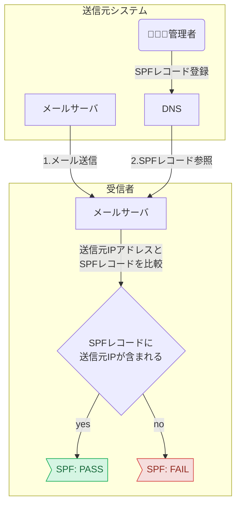
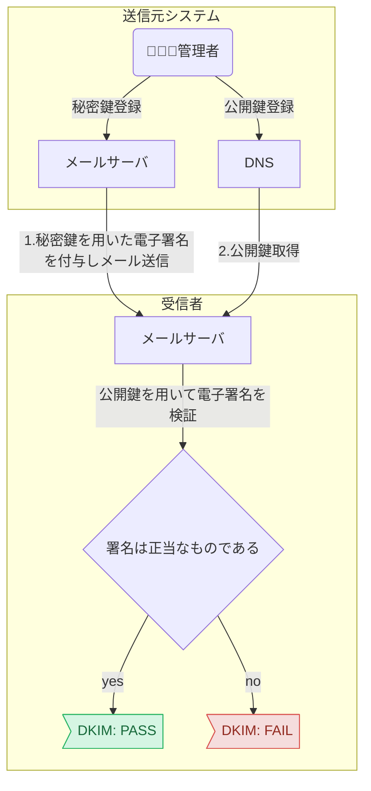
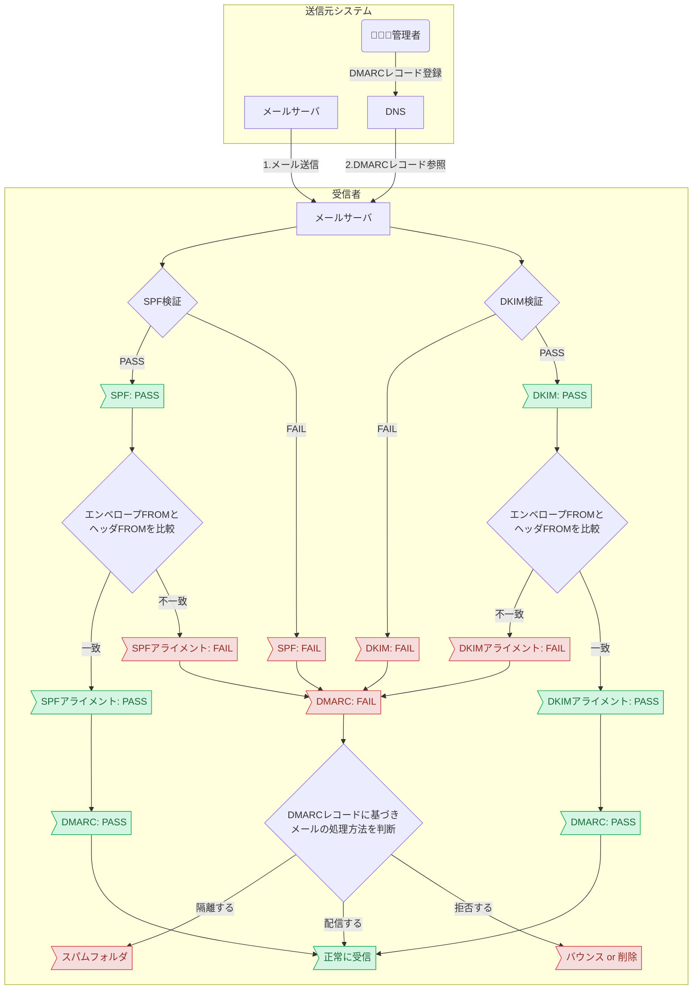
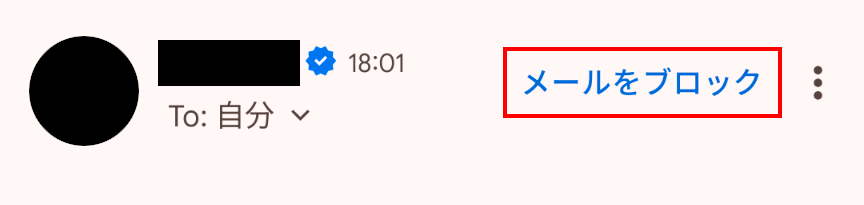
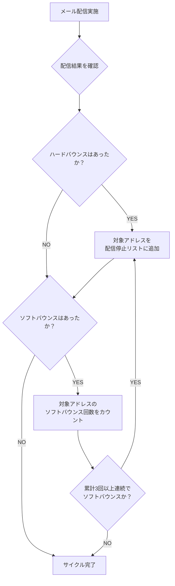
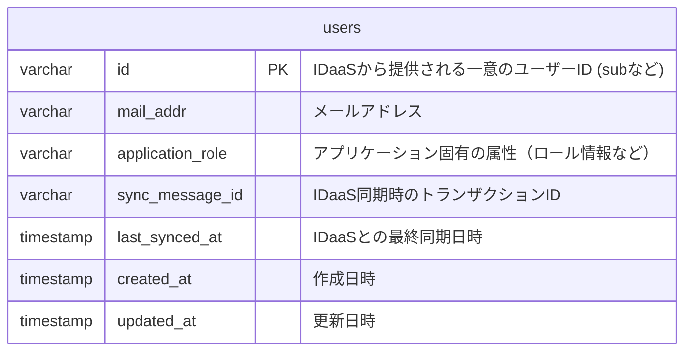
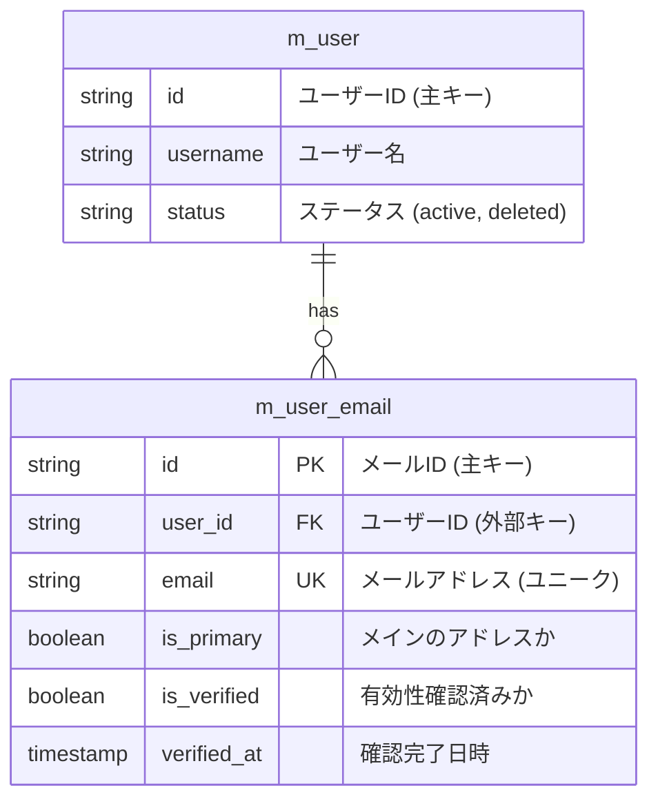
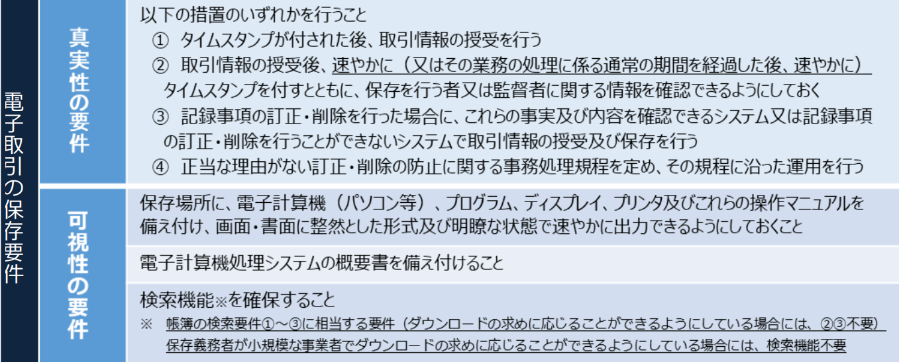
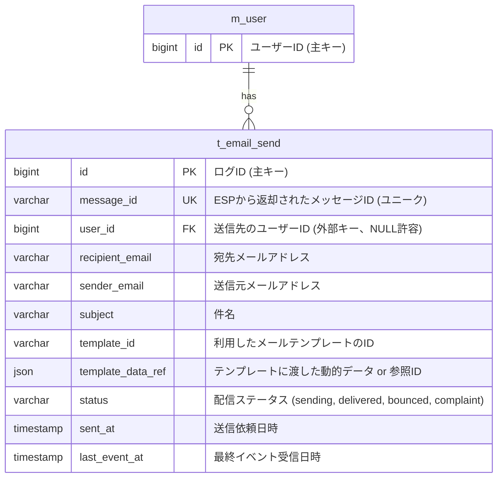

<page-title/>

本ガイドラインは、世の中のシステム開発プロジェクトのために無償で提供する。  
ただし、掲載内容および利用に際して発生した問題、それに伴う損害については、フューチャー株式会社（以下、フューチャー）は一切の責務を負わないものとする。  
また、掲載している情報は予告なく変更する場合があるため、あらかじめご了承いただきたい。

::: warning 免責事項: 有志で作成したドキュメントである

- フューチャーには多様なプロジェクトが存在し、それぞれの状況に合わせて工夫された開発プロセスや高度な開発支援環境が存在する。本ガイドラインはフューチャーの全ての部署／プロジェクトで適用されているわけではなく、有志が観点を持ち寄って新たに整理したものである
- 相容れない部分があればその領域を書き換えて利用することを想定している
  - プロジェクト固有の背景や要件への配慮は、ガイドライン利用者が最終的に判断すること
- 本ガイドラインに必ず従うことは求めておらず、設計案の提示と、それらの評価観点を利用者に提供することを主目的としている

:::

# はじめに

電子メールは、SMTP（Simple Mail Transfer Protocol）プロトコルが1980年代初頭に標準化されて以来、半世紀近くにわたり利用されている。多くのサービスで 「認証」 「販売促進」 「トランザクションの証明」 などにメールが用いられており、ユーザー体験にも直結する。

しかし、その長い歴史ゆえに、古典的な技術知識だけでは対応しきれない到達性の低下や遅延などの課題を引き起こしやすい。これはクラウドプロバイダーが提供するEメール送信サービスを用いても起こりえるため、モダンな環境下でも無視はできない。

そのため、SMTPプロトコルの理解に加えて、クラウドベースのメール配信サービスの特性を理解し、要件に応じて設計する能力が求められる。特に大規模なシステムでは信頼性・費用・保守運用制などの非機能要件も求められる。本ガイドラインは、メール送信で考慮すべき設計事項と推奨案をまとめる。

# 適用範囲

- コンシューマ（一般ユーザー）向けのメール送信を対象とする
  - ただし、同一用途で使われるLINEについては本ドキュメントでは触れない
- 電気通信事業法でいう「電気通信事業」に**該当しない**通信である、取引関係に伴う事務連絡や企業からユーザーへの広告宣伝を目的する
- システムからの自動送信メールを対象とする。手動送信でのメルマガ送信や営業メールは対象外とする
- 企業のシステム管理者向けのメール送信（例えば、障害通知など）については、参考にできる部分も多いと思われるが、強く意識していない
- ServiceNowやZendeskといったメールを含む問い合わせ管理のSaaSサービスの運用設計やサービス選定なども対象外とする
- 主要なクラウドサービス（AWS SES, Microsoft Azure Communication Services, Google Cloud, SendGridなど）を用いるとし、スクラッチやOSSなどでのSMTPサーバの構築や運用については、触れないとする

# 用語

- **トランザクションメール**: ログイン通知や注文完了通知といったユーザーのアクションや、サービスの重要な変更をきっかけに送信される企業にとって重要な通知。ユーザーとの信頼関係を構築し、アカウントのセキュリティを保つ上で重要である
- **マーケティングメール**: メールマガジンなどの広告・宣伝に用いるメール。販売促進や顧客との関係構築に重要なツールであるが、一歩間違えると迷惑メールとして認識され、逆にブランドイメージを下げてしまう
- **キャリアメール**: 国内携帯通信キャリア(docomo, au, Softbank, 楽天）を指す
- **ESP**: メール配信サービス（Email Service Provider）のこと。SendGridやAmazon SESなどが存在する

# ドメイン認証 {#ドメイン認証}

メールアドレスは、@前後でローカルパートとドメインに分けられ、例えば[`local-part@example.com`](mailto:local-part@example.com) のようなメールアドレスの場合、 `local-part`がローカルパートで、[`example.com`](http://example.com)がドメインである。システムから配信されるメールの場合、多くの受信者はローカルパートではなく、ドメイン部分を確認する事でメールの送信元と、その妥当性を確認する。

しかし、メールの仕様として送信者はドメイン部分を含め、受信者に通知するメールアドレスを任意に設定できるため、管理していないドメインからのメールであるかのように振る舞うこと、すなわちドメインのなりすましが可能である。ドメインのなりすましは、多くの場合悪意をもって行われる（フィッシング詐欺等）ため、メールの信頼性を高めるために、ドメイン認証（SPF、DKIM、DMARC）が求められる。

## SPF（Sender Policy Framework）

SPF（エスピーエフ）は、現在RFC 7208で標準化されている仕様で、ドメイン所有者がそのドメインを用いてメールを送信できる送信者(Sender)を限定する(Policy)ための仕組み(Framework)である。

具体的には、DNSに送信者として許可するホストのIPアドレスをSPFレコードとして記録しておく。受信者はメールに記載されているドメインを用いてDNSにSPFレコードを問い合わせ、送信元IPアドレスと照合することで、受信したメールがSPFに準拠したものであるかを判定できる。



SPFの導入にあたっては、以下のようなレコードをDNSに設定するのみで、メールサーバ側で必要な設定などは特に存在しない。

```txt
example.com. IN TXT "v=spf1 ip4:192.0.2.0 ip4:198.51.100.36 ip4:203.0.113.104 -all"
```

SPFレコードは複数の要素（ディレクティブと修飾子）から構成され、さらにディレクティブは限定子と機構と呼ばれるものから構成される。それぞれ、メールサーバの構成に応じて適切な値を設定する必要がある。

| 種別   | 名前          | 意味                                                                                                                                                                                                |
| :----- | :------------ | :-------------------------------------------------------------------------------------------------------------------------------------------------------------------------------------------------- |
| 限定子 | \+ (pass)     | 機構と一致する送信元は認証に成功する。限定子を明記しない場合、デフォルト値として設定される。                                                                                                        |
|        | \- (fail)     | 機構と一致する送信元は認証に失敗する。                                                                                                                                                              |
|        | \~ (softfail) | 機構と一致する送信元は認証に失敗するが、受信拒否を強く要求はしない。                                                                                                                                |
|        | ? (neutral)   | 機構と一致する送信元の認証結果を明示しない。                                                                                                                                                        |
| 機構   | all           | 常に一致する。                                                                                                                                                                                      |
|        | include       | 後続するドメインのSPFレコードを用いて認証する。                                                                                                                                                     |
|        | a             | 送信元IPアドレスが、後続するドメインのAレコード、あるいはAAAAレコードに含まれる場合、一致する。                                                                                                     |
|        | mx            | 送信元IPアドレスが、後続するドメインのMXレコードが指すホストのAレコード、あるいはAAAAレコードに含まれる場合、一致する。                                                                             |
|        | ptr           | （利用非推奨） 送信元IPアドレスから逆引きしたホストの、Aレコード、あるいはAAAAレコードが送信元IPアドレスを含む場合、一致する。                                                                      |
|        | ip4/ip6       | 送信元IPアドレスが、指定されたIPアドレス（CIDR表記による範囲指定可能）に含まれる場合、一致する。                                                                                                    |
|        | exists        | 後続するドメインに対する正引きが成功した場合、一致する。                                                                                                                                            |
| 修飾子 | redirect      | 後続するドメインのSPFレコードを用いて認証する。指定されたドメインのSPFレコードでの認証結果が失敗であった場合、include機構は後続する機構の評価を継続するが、redirect修飾子は以降の記述を評価しない。 |
|        | exp           | 認証が失敗した場合に、後続するドメインのTXTレコードを認証失敗の理由として扱う。                                                                                                                     |

設定値の推奨は以下の通り。

- ESPから設定値が提供された場合、その値を設定する
  - サービス提供者がそのサービスでメール送信に利用するIPアドレスを正確に把握・管理しており、その情報を集約したSPFレコードを提供しているため

## DKIM（DomainKeys Identified Mail）

DKIM(ディーキム)は、RFC 6376により定められた仕様で、ドメインに紐づけられた鍵(DomainKeys)を用いて、メール(Mail)の内容と送信者が正当であると証明する(Identified)。公開鍵暗号を用いた認証仕様で、まずDNSに公開鍵を登録しておく。その上で送信者はメール送信時にメールの内容から電子署名を作成し、メールヘッダに含める。受信者はDNSから公開鍵を取得し、電子署名を検証することで、内容と送信者の正当性を確認できる(検証に失敗した場合、なりすまし、あるいは受信経路での内容の改ざんが考えられる)。



DKIMを導入する場合、まずキーペアを作成し、以下のようなレコードを設定することでDNSに登録する。その上で、メール送信時に電子署名を作成、ヘッダに含めるよう、メールサーバ上で設定する。

```txt
selector._domainkey.example.com. IN TXT “v=DKIM1; k=rsa; h=sha256; p=xxxxxxx…;”
```

サブドメインの`selector`は、複数のキーペアを署名に用いる場合の識別子、セレクタとして記載する。値自体は任意であるが、1組のキーペアしか用いない場合も省略できないため、必ず指定する。

DKIMレコードは複数のタグと値の組み合わせで構成される。

| タグ | 意味                                                                                                                                                                                                                                                                                                                                                                | 必須/任意                                                                                                             |
| :--- | :------------------------------------------------------------------------------------------------------------------------------------------------------------------------------------------------------------------------------------------------------------------------------------------------------------------------------------------------------------------ | :-------------------------------------------------------------------------------------------------------------------- |
| v    | DKIMバージョン（2025年7月現在”DKIM1”のみ有効）                                                                                                                                                                                                                                                                                                                      | 任意（推奨） 省略時は`DKIM1`となる。                                                                                  |
| h    | 利用できるハッシュ方式（2025年7月現在`sha1`と`sha256`のみ有効）                                                                                                                                                                                                                                                                                                     | 任意（推奨） 省略時はすべてのハッシュ方式を許容するが、`sha1`が非推奨であるため、`sha256`の明示的な指定が推奨される。 |
| k    | 署名に用いられる鍵の型式（2025年7月現在`rsa`のみ有効）                                                                                                                                                                                                                                                                                                              | 任意（推奨）省略時は`rsa`となる。                                                                                     |
| n    | 管理者用のメモ領域                                                                                                                                                                                                                                                                                                                                                  | 任意                                                                                                                  |
| p    | 公開鍵（Base64でのエンコードが必要）                                                                                                                                                                                                                                                                                                                                | 必須                                                                                                                  |
| s    | DKIMレコードに登録されている公開鍵を利用できるサービス（2025年7月現在`email`と`*`のみ有効）                                                                                                                                                                                                                                                                         | 任意 省略時は`*`となる。                                                                                              |
| t    | DKIM認証時の挙動を指定するフラグ（2025年7月現在`y`と`s`のみ有効）<br> `y`: テストモードであり、署名の検証に失敗した場合も、未署名のメールと同等の扱いを要求する。<br> `s`: 送信元メールアドレスのドメインと、署名を行ったドメインが一致しない（サブドメインが用いられている）場合に認証を失敗させる。<br> なお、`y`と`s`はコロン”:”で区切ることで両方の指定が可能。 | 任意 省略時はフラグ未指定となる。                                                                                     |

※RFC 4871時点では`g`タグも定義されていたが、現在は非推奨となっている。

設定値の推奨は以下の通り。

- ESPを利用している場合、サービスからセレクタや公開鍵などの設定値が提示された場合は、その設定を必ず行う

::: tip SPF vs DKIM  
ここまでを整理すると、SPFは送信元の正当性担保、DKIMは送信元と内容の正当性担保している。そうすると、DKIMにさえ準拠していれば、SPFは不要なように思えるが、一般にSPFとDKIMは両方を設定するほうが良いとされる。それは、SPFとDKIMでは検証対象とするドメインの参照元が異なるためである。SPFは**エンベロープFROM**のドメインを検証する。エンベロープFROMとは、メールサーバ間のSMTP通信で`MAIL FROM`コマンドとして指定される送信元アドレスであり、通常は受信者に表示されず、エラーメールの返送先などに利用される。一方、DKIMは**DKIM-Signatureヘッダ**の`d=`タグに記載されたドメインを検証する。このドメインは、通常、受信者がメールクライアントで「差出人」として目にする**ヘッダFROM**と一致することが期待される。このように、それぞれがメールの異なる側面を保護するため、両方を設定することが推奨される。また、後述するDMARCはSPFおよびDKIMを前提とした仕組みであるため、DMARCを最大限活用するためにはSPF/DKIMの両方に準拠する必要がある。
:::

## DMARC（Domain-based Message Authentication, Reporting, and Conformance）

DMARC(ディーマーク)は、RFC 7489により定められた仕様で、ドメイン認証（Domain-based Message Authentication）の結果を用いて、送信者への認証結果の報告（Reporting）と、受信者へのメールの取り扱いへの準拠（Conformance）を要求する。DMARCはSPFおよびDKIMを前提とした仕組みであり、「SPFおよびSPFアライメント」あるいは「DKIMおよびDKIMアライメント」のいずれかを通過しなかったメールの取り扱い（受信拒否・隔離・受信）をメール送信者が指定できる。

SPF/DKIMアライメントとは、各認証に用いたドメインが、ヘッダFROM（主に受信者に表示されるメールアドレス）のドメインと一致しているかの検証を指す。SPFやDKIMは各ドメインが送信者によって管理されていることを保証する仕組みではあるが、ヘッダFROMとは異なるドメインで認証を行っている場合、SPF/DKIMに通過していたとしても、メール送信者の正当性（ヘッダFROMのドメイン管理者であるか）は全く担保されない。そのような状況を検知するため、ヘッダFROMのドメインと認証に用いられたドメインが一致していることの検証がSPF/DKIMアライメントである。SPF/DKIMアライメントを総称してDMARCアライメントと呼ぶ。



SPF/DKIM同様、設定はDNSに以下のようなレコードを登録することで行う。

```txt
_dmarc.example.com IN TXT “v=DMARC1; p=reject; rua=dmarc-report@example.com”
```

| タグ  | 意味                                                                                                                                                                                                                                                                                                                                                                                                   | 必須/任意                    |
| :---- | :----------------------------------------------------------------------------------------------------------------------------------------------------------------------------------------------------------------------------------------------------------------------------------------------------------------------------------------------------------------------------------------------------- | :--------------------------- |
| adkim | DKIMアライメントの判定モード<br> `r`: ヘッダFROMドメインがDKIM認証ドメインのサブドメインであっても許容する（relaxed mode）<br> `s`: ヘッダFROMドメインとDKIM認証ドメインが完全一致していない場合許容しない（strict mode）                                                                                                                                                                              | 任意 省略時は`r`となる。     |
| aspf  | SPFアライメントの判定モード<br> `r`: ヘッダFROMドメインがSPF認証ドメインのサブドメインであっても許容する（relaxed mode）<br> `s`: ヘッダFROMドメインとSPF認証ドメインが完全一致していない場合許容しない（strict mode）                                                                                                                                                                                 | 任意 省略時は`r`となる。     |
| fo    | フォレンジックレポート（失敗レポート）作成基準オプション<br> `0`: すべての認証が失敗した場合にレポートを作成する。<br> `1`: いずれかの認証が失敗した場合にレポートを作成する。<br> `d`: DKIM認証が失敗した場合にレポートを作成する（アライメントは考慮しない） <br>`s`: SPF認証が失敗した場合にレポートを作成する（アライメントは考慮しない）                                                          | 任意 省略時は`0`となる。     |
| p     | 認証が失敗した場合に要求するメールの取り扱いポリシー<br> `none`: 何も要求しない。<br> `quarantine`: 不審なメールとして取り扱うよう要求する。具体的な処理は受信者に依存する。<br> `reject`: メールの受信を拒否する。                                                                                                                                                                                    | 必須                         |
| pct   | DMARCポリシーが適用される割合（`0-100`）                                                                                                                                                                                                                                                                                                                                                               | 任意 省略時は`100`となる。   |
| rf    | フォレンジックレポートのフォーマット （2025年7月現在`afrf`のみ有効）                                                                                                                                                                                                                                                                                                                                   | 任意 省略時は`afrf`となる。  |
| ri    | アグリゲートレポート（集約レポート）作成間隔の要求値。<br>日次以上の頻度がベストエフォートされる                                                                                                                                                                                                                                                                                                       | 任意 省略時は`86400`となる。 |
| rua   | アグリゲートレポートの送信先。 [`mailto:dmarc-report@example.com`](mailto:dmarc-report@example.com)のように指定する。<br> DMARCレコードを登録したドメイン（`example.com`）と異なるドメインのメールアドレス宛に送信する場合は、<br>送信先ドメイン（`example.org`）のDNSに以下の様なレコードを登録する必要がある。<br> [`example.com`](http://example.com)`._report.dmarc.example.org IN TXT “v=DMARC1”` | 任意 省略時は未指定となる。  |
| ruf   | フォレンジックレポートの送信先 記法は`rua`タグと共通。                                                                                                                                                                                                                                                                                                                                                 | 任意 省略時は未指定となる。  |
| sp    | サブドメインから送信された認証失敗メールの取り扱いポリシー 記法は`p`タグと共通。 未指定の場合、`p`タグの設定値が適用される。                                                                                                                                                                                                                                                                           | 任意 省略時は未指定となる。  |
| v     | DMARCバージョン （2025年7月現在`DMARC1`のみ有効）                                                                                                                                                                                                                                                                                                                                                      | 必須                         |

SPFおよびDKIMを前提とした認証の仕組みである以上、必ずSPF/DKIMの設定が完了してからDMARCを設定する。設定伝播には時間がかかることがあるため、SPF/DKIM設定後、48時間以上経過してからDMARCを設定することが、[Googleにより推奨されている。](https://support.google.com/a/answer/10032473?hl=ja)

推奨は以下の通り。

- まず、`p=none`とした上で、ruaに適切なレポート送信先を設定、日次でレポートを確認、SPF/DKIMの設定が正常に行えていることを確認する
  - `ruf`は設定しても良いが、[Gmail](https://support.google.com/a/answer/2466580?hl=ja)や[Microsoft 365](https://learn.microsoft.com/ja-jp/defender-office-365/email-authentication-dmarc-configure#dmarc-for-inbound-mail-into-microsoft-365)などの主要サービスがフォレンジックレポートの送信に対応していないため、あまり参考になる情報は得られない可能性が高い
- 次に、`p=quarantine`、あるいは`p=reject`に設定したうえで、`pct`に`10`などの小さな値を設定し、引き続きレポートを確認する。加えて受信者（システムのユーザなど）から、「メールが届かなくなった」といった問い合わせが発生するようになっていないか注視する
  - `p=quarantine`は、認証失敗メールを迷惑メールフォルダなどに隔離するよう受信者に要求する。正当なメールが誤って認証に失敗した場合でも、受信者が救出できる可能性がある
  - `p=reject`とすると、認証に失敗したメールが配信されなくなるため、既にドメインのなりすましが行われているなど、認証失敗メールの配信を確実に防ぎたいなどの場合は`reject`を設定する
- 徐々に`pct`の値を大きくしていき、最終的に`100`（あるいは指定なし）まで引き上げる
  - `pct`の初期値・増加量は、設定の影響範囲と設定値変更の作業コストを鑑みて決定する

::: tip アグリゲートレポートの形式について

アグリゲートレポートは以下のような形式で配信される（[Googleの例示](https://support.google.com/a/answer/10032472)を引用・一部改変）。

```xml
<?xml version="1.0" encoding="UTF-8"?>
<feedback>
  <report_metadata>
    <org_name>example.com</org_name>
    <email>noreply-dmarc-support@example.com</email>
    <extra_contact_info>http://example.com/dmarc/support</extra_contact_info>
    <report_id>xxxxxxxxxxxxxxxx</report_id>
    <date_range>
      <begin>UNIX_TIME</begin>
      <end>UNIX_TIME</end>
    </date_range>
  </report_metadata>
  <policy_published>
    <domain>example.org</domain>
    <adkim>r</adkim>
    <aspf>r</aspf>
    <p>none</p>
    <sp>none</sp>
    <pct>100</pct>
  </policy_published>
  <record>
    <row>
      <source_ip>198.51.100.36</source_ip>
      <count>2</count>
      <policy_evaluated>
        <disposition>none</disposition>
        <dkim>fail</dkim>
        <spf>pass</spf>
      </policy_evaluated>
    </row>
    <identifiers>
      <header_from>example.org</header_from>
      <envelope_from>example.org</envelope_from>
    </identifiers>
    <auth_results>
      <dkim>
        <domain>example.jp</domain>
        <result>pass</result>
        <human_result></human_result>
      </dkim>
      <spf>
        <domain>example.org</domain>
        <result>pass</result>
      </spf>
    </auth_results>
  </record>
</feedback>
```

主要なタグの意味は以下の通り。

| 要素                                  | 説明                                                                                                                                                           |
| :------------------------------------ | :------------------------------------------------------------------------------------------------------------------------------------------------------------- |
| `<report_metadata>`                   | レポート作成者、すなわち受信サーバが作成した、レポート自体に関する情報                                                                                         |
| `<policy_published>`                  | 受信サーバが確認したDMARCポリシー。DMARCレコードの設定値に誤りがある場合、この項目が想定外の値となっている可能性があるため、正常に配信が行われない場合は要確認 |
| `<record>`                            | 各ドメイン認証の結果。送信元サーバのIPアドレスの数だけ含まれる                                                                                                 |
| ┗ `<source_ip>`                       | 送信元サーバのIPアドレス                                                                                                                                       |
| ┗ `<policy_evaluated>`                | DMARCポリシーの評価結果                                                                                                                                        |
| &nbsp;&nbsp;&nbsp;┗ `<disposition>`   | 評価の結果、メールをどのように処理したか                                                                                                                       |
| &nbsp;&nbsp;&nbsp;┗ `<dkim>`, `<spf>` | DKIM, SPFのアライメントチェックの結果（各ドメイン認証そのものの結果ではない）                                                                                  |
| ┗ `<identifiers>`                     | メールの送信者・宛先に関する情報                                                                                                                               |
| &nbsp;&nbsp;&nbsp;┗ `<header_from>`   | ヘッダFROMドメイン                                                                                                                                             |
| &nbsp;&nbsp;&nbsp;┗ `<envelope_from>` | エンベロープFROMドメイン                                                                                                                                       |
| ┗ `<auth_results>`                    | 各ドメイン認証の結果                                                                                                                                           |
| &nbsp;&nbsp;&nbsp;┗ `<dkim>`, `<spf>` | DKIM, SPFのドメイン認証の結果                                                                                                                                  |

アグリゲートレポートの厳密な仕様はRFC 7489のAppendix Cに定義されているが、必ずしも全ての受信サーバが準拠しているとは限らないため、適宜読み替えを行うこと（上記Googleの例においても、`minOccurs="1"`と定義されている項目が出現していない等、準拠していない項目が存在する）。

:::

::: tip ドッペルゲンガードメイン  
[`example.com`](http://example.com) に対する `exampl.com`や`example.co`など、正規のドメインに酷似していたり、タイプミス等で誤入力しやすいドメインをドッペルゲンガードメインと呼ぶ。攻撃者が企業のドメインのドッペルゲンガードメインを意図的に取得し、フィッシングメール等に用いることがある。

攻撃者は実際にドッペルゲンガードメインの管理者であるため、ここまで記載したドメイン認証は全て通過するフィッシングメールを送信できてしまう。受信者はドメインをよく確認する以外に、ドッペルゲンガードメインそのものに対する防御策を取り得ないため、詐欺の被害に遭う可能性がある。

新規でドメインを取得し、サービスに利用する場合は、悪用される恐れがあるドッペルゲンガードメインの所有者確認と、可能であれば攻撃者に取得される前に取得することを推奨する。  
:::

## 独自ドメイン利用時の注意

Amazon SESなどのメール送信サービスを利用する場合、SPF/DKIMがメールサービス側で設定されることにより、利用者側は特別な設定を行わずとも、認証を通過するメールが配送されることがある。ただし、それらの認証は、メール送信サービス側のドメインに対して行われるため、独自ドメインを用いてメールを送信する場合、DMARCアライメントが失敗してしまう。この場合、Gmailなど一部のメールクライアントでは「[amazonses.com](http://amazonses.com) 経由」のような表示がなされたり、場合によっては迷惑メールとして扱われる・受信拒否されてしまう。

推奨は以下の通り。

- 独自ドメイン利用時は、メール送信サービスが提供するドメイン認証設定を必ず利用する。ほとんどのメール送信サービスでは、サービス側が提示するレコードをDNSに登録することで、独自ドメインを用いてドメイン認証が行える（=DMARCアライメントが成功する）仕組みが提供されている

::: tip メールヘッダとの対応  
上記ドメイン認証の設定が完了している状態で配信されたメールには、以下のようなヘッダが記載されている（関係がある項目のみを抜粋）

```sh
Return-Path: <envelope@mail.example.com>
Received-SPF: pass (mx.example.org: domain of envelope@mail.example.com designates 192.0.2.0 as permitted sender) client-ip=192.0.2.0;
Authentication-Results: mx.example.org;
       dkim=pass header.i=@example.com header.s=selector header.b="xxxxxxxx";
       spf=pass (example.org: domain of envelope@mail.example.com designates 192.0.2.0 as permitted sender) smtp.mailfrom=envelope@mail.example.com;
       dmarc=pass (p=REJECT sp=REJECT dis=NONE) header.from=example.com
DKIM-Signature: v=1; a=rsa-sha256; q=dns/txt; c=relaxed/simple; s=selector; d=example.com; t=1753843200; h=From:To:Subject:Message-ID:Date:MIME-Version:Content-Type; bh=xxxxxxxx; b=xxxxxxxx
From: "送信者表示名" <sender@example.com>
```

`Authentication-Results`ヘッダからドメイン認証結果を確認できる。詳細な記法は受信サーバに依存して異なるが、基本的には`dkim=pass`のように、認証の名称と結果が合わせて記載されている。結果が`pass`である場合のみ、正常に認証が成功しており、それ以外の場合は失敗しているか、そもそも認証が行われていない。上記の例では、すべて`pass`となっているため、すべてのドメイン認証が成功しており、なりすましの可能性は低いと判断できる。

dmarc=pass: DMARC認証が成功したことを示す。これは、header.from のドメイン (example.com) に対し、SPFまたはDKIMの認証ドメインがアライメント（一致）チェックをパスしたことを意味する。この例では、DKIMの認証ドメイン (example.com) が header.from のドメインと一致しているため、DKIMアライメントに成功している。

SPFに関連するヘッダは`Return-Path`・`Received-SPF`の2つであり、これら2項目を見ると、どのようにSPF認証が行われたのかを見ることができる。`Return-Path`には、メールが正常に配信できなかった場合にエラーが返送される宛先である、エンベロープFROMと呼ばれるメールアドレスが記載されている。前述の通り、SPFではこのエンベロープFROMのドメインを用いて認証が行われる（なお、このヘッダは受信サーバにより自動的に記録される）。`Received-SPF`には、SPF認証の結果と、認証に用いたエンベロープFROMのメールアドレス、送信元のIPアドレスが記録されている。

DKIMに関連するヘッダは、`DKIM-Signature`である。複数のタグにより構成されており、送信サーバが設定した値が記録されている。dタグにDKIM認証に用いるドメイン、sタグにセレクタが記録されており、hタグには署名対象のフィールドが記録されている。

ドメイン認証の失敗によるメールの未達が課題となっている場合、上記ヘッダ項目を確認し、想定とは異なる設定となっていないか確認すると良い。  
:::

# Gmail送信者ガイドライン

2024年2月、[Gmailがメール送信者向けのガイドライン](https://support.google.com/a/answer/81126?hl=ja)を公開した。ガイドラインに沿わない場合、Gmailによる受信拒否や、迷惑メールフォルダへの振り分けが発生する可能性があるため、原則として全送信者が準拠するべきである。

| No. | 要件                                                                                                       | 全ての送信者の要件             | 1日あたり5,000通以上の送信が発生する場合の要件 |
| :-- | :--------------------------------------------------------------------------------------------------------- | :----------------------------- | :--------------------------------------------- |
| 1   | SPF/DKIMによる認証を通過させる                                                                             | **いずれか**の認証の通過が必要 | **両方**の認証の通過が必要                     |
| 2   | 正引きおよび逆引きDNSレコードを登録する                                                                    | 必要                           | 必要                                           |
| 3   | メール送信にTLS接続を使用する                                                                              | 必要                           | 必要                                           |
| 4   | 迷惑メール率を最大でも0.30％未満、可能な限り0.10％未満に維持する                                           | 必要                           | 必要                                           |
| 5   | Internet Message Format 標準（RFC 5322）に準拠したメール形式とする                                         | 必要                           | 必要                                           |
| 6   | ヘッダFromのGmailへのなりすましを行わない                                                                  | 必要                           | 必要                                           |
| 7   | （メール転送サーバやメーリングリストなど、定期的な転送がある場合）ARCヘッダ・List-idヘッダを設定する       | 必要                           | 必要                                           |
| 8   | DMARCによる認証を設定する                                                                                  | 不要                           | 必要                                           |
| 9   | DMARCアライメントに合格する                                                                                | 不要                           | 必要                                           |
| 10  | マーケティング目的・配信登録されたメールについては、ワンクリックで配信停止が行える機能をメール内に搭載する | 不要                           | 必要                                           |

推奨は以下の通り。

- 1日あたりのGmail宛のメール送信数が5,000件以上か否かにより、準拠するべき要件は異なるが、1日の送信件数に依らず、すべての要件に準拠する
  - 将来的な送信数の増加に備えるため・Gmail以外への配信率向上・迷惑メール報告率低下に繋がる要件であるため
- No.1、2、3、5は、メール送信サービスを利用する限り、ほとんどの場合サービス側で対応がなされているため、意識する必要はない
- No.4
  - 受信者による迷惑メール報告率が、0.10％未満である状態を維持し、一時的なスパイク時にも0.30％を超えないようにする
  - 手動での迷惑メール報告を防ぐ、直接的なアクションを送信者側で取ることは難しいため、迷惑メールと疑われるような件名・文面を避ける
  - Googleが提供するモニタリングツールである[Postmaster Tools](https://postmaster.google.com/)を活用し、迷惑メール率を継続的に監視しながらメールの内容を調整する。Gmailによる自動的な迷惑メール判定も迷惑メール率に影響するため、前述したドメイン認証の実施、後述するレピュテーションの維持を実施する
- No.6
  - Gmailガイドラインでは、特にGmail（[`gmail.com`](http://gmail.com)）へのなりすましを避ける（GmailのDMARCポリシーが`quarantine`であるため、DMARCアライメントに失敗した場合、正常に配信されない可能性が高い）よう記述されているが、Gmailに限らず、あらゆるドメインへのなりすましを行わないこと
- No.7
  - メールそのものの送信者ではなく、メール転送サーバやメーリングリストを管理している場合、送信者のドメインに対するドメイン認証の結果は転送時に失われてしまう。転送後も、送信者のドメイン認証結果を確認できるようにするため、各ドメイン認証の結果から作成した値を`ARC`ヘッダに設定する
  - メーリングリストを管理している場合は、メーリングリストを経由した配信であることが明らかになるよう、`List-id`ヘッダを設定する
- No.8,9
  - 前述のDMARC設定を行い、DMARCアライメントにも合格するよう、送信ドメインを設定する。2025年7月現在、ポリシーレベルの指定は無いため、十分な検証が行えていない場合は`p=none`でも問題ないが、前述の通り、様子を見ながら`quarantine/reject`に引き上げることを推奨する
- No.10
  - マーケティングメールを不要であると判断した時点で、即座に配信停止が行える経路をメール内に用意する
  - 本文内に配信停止方法を案内する事に加え、`List-Unsubscribe`ヘッダを付与し、ワンクリックで配信停止できる状況とすることを推奨する。2025年7月現在、[本要件を満たしていない場合であっても、自動的に受信拒否や迷惑メール判定が行われるわけではないと案内されている。](https://support.google.com/a/answer/14229414)が、トランザクションメールであっても受信者が不要と判断したときに、配信停止が容易でなければ「迷惑メール報告」ボタンを押す可能性が高くなる。これが繰り返されれば、レピュテーションが損なわれ、全てのメール配信に影響が及ぶため

::: tip List-Unsubscribeヘッダ  
（利用可否や詳細な挙動は受信者のクライアントアプリケーションに依存するが、少なくともGmailにおいては）`List-Unsubscribe`ヘッダを適切に設定することで、メール上部にワンクリックで配信停止が行える要素が表示される。



（SP版Gmailでの表示例）

`List-Unsubscribe`ヘッダには、配信停止リクエストをHTTPリクエストで受け取るためのURLか、メールで受け取るためのメールアドレスを記述する。クライアントアプリケーションに依存するが、リクエストボディやメール本文には、配信停止リクエストを行った受信者の情報は含まれないため、URLや宛先メールアドレスにパラメータとして受信者（あるいは配信停止の起因となったメール）の情報を含める必要がある。

また、受信者による配信停止リクエストから2日以内に、配信停止処理を完了させることが推奨されている。WEBCASなどのメール配信用サービスを利用している場合、`List-Unsubscribe`ヘッダの付与と、配信停止の仕組みが機能として用意されているケースがある。利用するサービスが対応している場合、当該機能の利用を推奨する（参考：[List-Unsubscribeヘッダ付与機能 | メール配信システムWEBCAS e-mail](https://www.webcas.jp/email/feature/list-unsubscribe/)）

:::

# レピュテーション

レピュテーションとは、メール送信者が受信側（ISP: インターネットサービスプロバイダやメールサーバ）から与えられる信頼性の評価のことであり、レピュテーションを高く維持することでユーザーにメールを確実に届けることができる。

主に以下の2種類が存在する。

- **IPレピュテーション**: メール送信に使用されるIP アドレスの評価
- **ドメインレピュテーション**: 送信者が利用するドメイン名の評価

レピュテーションは、受信側が迷惑メール（スパム）と正当なメールを区別するためにも用いられる。レピュテーションが低い場合、以下の影響がある。

- **迷惑メール判定**: 受信側で自動的に迷惑メールフォルダへ振り分けられる確率が高くなる
- **到達率低下**: ISPにより一部またはすべてのメールが受信拒否され、受信者にメールが一切届かなくなる

レピュテーションを高く維持するには、受信者にとって価値のあるメールを継続的に送り、信頼される送信者であり続ける必要がある。

- **安定した送信:** 適切な頻度で安定した量のメールを送信（例: 週に1〜2回の定期配信など）
- **質の高いコンテンツ**: 受信者の関心に沿ったコンテンツを提供し、高いエンゲージメント（開封やクリックなど）を維持
- **リストの健全性**: バウンス率や迷惑メール報告を低く抑えるため、常に送信リストをクリーンに保つ

しかし、新しく利用を開始するIPアドレスやドメインには、これまでの送信履歴がないため、ゼロから信頼を築くための特別な対応が必要となる。その対策が**ウォームアップ**である。

::: tip レピュテーション低下により発生するリスク  
レピュテーションが低いことで、社会問題となった事例もある。

- [神奈川県教育委員会 「Gmail届かない問題」の全貌 | 日経クロステック（xTECH）](https://xtech.nikkei.com/atcl/nxt/mag/nnw/18/041800013/101600083/)

また、SES（Simple Email Service）などのサービスを利用している場合は利用停止処分を受ける可能性もある。  
:::

## ウォームアップ

ウォームアップとは、新しくメール送信を開始するIP アドレスやドメインのレピュテーションを段階的に構築するプロセスのことである。

- **IP ウォームアップ:** 新しいIP アドレスでメール送信を始める際に、徐々に送信量を増やしてISP からの信頼を獲得する
- **ドメインウォームアップ:** 新しいドメインで送信を開始する場合に、そのドメインの信頼性を高めるプロセス

ISP は特にIP アドレス単位での信頼性を重視するため、新規のメール送信環境ではIPウォームアップが重要になる。対応の有無は、専用IPについてはメール送信履歴の有無や、共有IPによって異なる。

推奨は以下の通り。

- トランザクションメールとマーケティングメールのIPは分離し、それぞれ専用IPを利用する
  - マーケティングメールのレピューテーション低下で、トランザクションメールの到達性に影響を受けず、確実な配信が可能であるため
- 小〜中規模配信（月間10万通未満）の場合は、共有IPを利用する
  - ウォームアップ不要で即座に配信開始可能、コスト効率が良いため
- 大規模配信（月間10万通以上）の場合、専用IPを推奨する
  - 完全な制御が可能かつ、長期的な信頼性が高いため
  - 注意として、ウォームアップ期間（1〜2ヶ月）が必要
- ウォームアップ実施の有無は下表に従う

| 種類   | 状況             | ウォームアップの必要性 | 理由                                                           |
| :----- | :--------------- | :--------------------- | :------------------------------------------------------------- |
| 専用IP | 新規割り当て     | ✅️                    | 送信履歴がゼロのため、信頼性がない状態                         |
|        | 過去に使用歴あり | ⚠️場合によって実施     | 過去のレピュテーションに問題があるか確認が必要                 |
| 共有IP | ESP提供の既存IP  | ❌️                    | 既に他の送信者によって送信実績があり、ISP に信頼されているため |

::: tip 専用IPと共有IPの選択指針  
共有IPは手軽だが、他の送信者の行動（大量のスパム送信など）によってレピュテーションが低下するリスクを伴う。大量配信や、より高い到達率が求められる場合は、自社で完全にコントロールできる専用IPの利用が望ましい。  
:::

## IPプール

メール配信する上で、複数のIPアドレスを使い分ける設計も有効である。IPを分散して用いると以下の効果がある。

- **リスクの分散:** 1つのIPがブロックされても、他のIPで送信を継続可能
- **ウォームアップの効率化:** 複数のIPを段階的にウォームアップすることで、全体の送信量を早期に拡大
- **ISP制限の回避:** 各ISPが設定する1IP当たりの送信制限を分散により回避

IPをどのように使い分けるかはいくつかの戦略がある。

- **送信量で分散:** 1つのIPに負荷を集中させず、複数のIPで送信量を分散することで、ISPからの信頼を維持
- **用途別:** トランザクションメールとマーケティングメールで異なるIPを使用し、リスクを軽減
- **ISP別:** 特定のISPに特化したIPを用意し、そのISPの特性に合わせて送信する

推奨は以下の通り。

- 以下の条件のいずれかに一致する場合、複数IPを利用する
  - 月間送信量が100万通を超える場合
  - トランザクションメールとマーケティングメールの両方を大量送信する場合
  - 複数のブランドやサービスからメール送信する場合
- 以下の条件に一致する場合は、単一IPを用いる
  - 月間送信量が50万通未満の場合
  - 送信メールの種類が限定的な場合
  - リソースやコストを抑えたい場合

::: warning IPプール管理の注意点  
複数IPを使用する場合は、各IPのレピュテーションを個別に管理し、問題のあるIPが他のIPに悪影響を与えないよう注意が必要である。  
:::

::: tip IPウォームアップ手順

1. 事前準備
   - 送信リストの作成と精査: できる限り高エンゲージメントの受信者（開封・クリック率の高いユーザ）に限定
   - 送信スケジュールを計画する
2. 送信スケジュールの計画と実行
   - ISP からのフィードバックを注視しつつ、徐々に送信量を増やしていくことが重要です。急激な増加はスパム行為とみなされるリスクを高める
   - ウォームアップスケジュールの例（下表）を上げる。ISPの反応（ブロックや遅延の有無）を見ながら、状況に応じて柔軟に調整する。一般的には、前日の送信量の2倍を超えない範囲で、段階的に増やしていくのが安全とされている。実際の環境や送信内容、ISPの反応によって大幅に調整が必要な場合がある。重要なのは数値を厳密に守ることではなく、ISPからのフィードバックを注視しながら柔軟に対応することである。

   | ウォームアップ（日） | 1日当たりの総送信数 |
   | :------------------- | :------------------ |
   | 1                    | 50                  |
   | 2                    | 100                 |
   | 3                    | 200                 |
   | …                    |                     |
   | 30                   | 1,000,000           |

3. モニタリング
   - ウォームアップ期間中は、以下の指標を毎日モニタリングする。問題が検知された場合は、すぐさま送信を一時停止し、原因を調査・解決する必要がある。
     - ハードバウンス率: 1％未満、理想は0.5％未満に抑える（無効なアドレスは速やかにリストから削除）
     - 全体のバウンス率（ハード+ソフト）: 5％を超えないように注意する
     - スパム（迷惑メール）報告率: 0.1％未満を維持する
     - ISPのフィードバックツール（Google:Postmaster Tools、　Microsoft (Outlook):SNDS（Smart Network Data Services））
   - 上記の数値は一般的な目安である。業界や送信内容によって適切な閾値は異なる場合がある。重要なのは、自社の過去のデータと比較して異常な変化がないかを継続的に監視することである。

:::

::: tip ウォームアップ中の問題発生と対策  
モニタリング指標が悪化した場合、すぐさま送信を一時停止し、原因の調査と解決にあたる。よくある課題に、ISPによるスロットリングがある。ISPは、未知のIPから短時間に大量のメールが送られると、一時的に受信を遅延させたり拒否したりする。これは、**スロットリング**と呼ばれる。ウォームアップ中にこの現象が見られた場合は、送信ペースを落とす、あるいはその日の送信を停止するなどを調整する。

また、以下のような確認を行う。

- **ブラックリストの確認:** Spamhaus、Barracudaなど主要なブラックリストに自社のIPやドメインが登録されていないか確認する。登録されていた場合は、各サービスの解除申請手順に従う
- **バウンスログの分析:** バウンスメールに含まれるエラーコードとメッセージを確認し、拒否理由を特定する
- **コンテンツの確認:** 件名や本文にスパムと判定されやすい単語が含まれていないか

:::

## ドメインウォームアップ

基本的に、SPF/DKIM/DMARC といった送信ドメイン認証が正しく設定されていれば、ドメインのレピュテーションはIP ウォームアップを進める中で並行して構築されていく。そのため、ドメインのために特別なウォームアップを実施する必要はほとんどない。

### サブドメイン戦略

レピュテーション管理として、送信するメールの種類に応じてサブドメインを使い分ける方法がある。これにより、例えばメルマガのスパム報告率が上がっても、認証や注文確認メールの到達性に影響が及ぶリスクを分離できる。

推奨は以下の通り。

- 次のいずれかの条件に一致する場合は、サブドメイン分離する
  - 月間送信量が50万通を超える場合
  - トランザクションメールとマーケティングメールの両方を送信する場合
  - 複数のブランドやサービスを運営している場合
- 次のいずれかの条件に一致する場合は、サブドメイン分離するか “検討” する
  - マーケティングメールの配信頻度が高い場合（週3回以上）
  - 異なる対象オーディエンスにメール送信する場合
- サブドメイン分離は、メール配信開始時点で将来の送信量を見越して設計すること
  - 後からサブドメインを追加・分離する場合、新しいサブドメインは送信履歴がゼロの状態からとなるため、ウォームアップから必要になるため

::: tip サブドメインの構成例  
トランザクションメールとマーケティングメールを使い分ける場合の例。

- `mail.example.com`: トランザクションメール用
- `news.example.com`: マーケティングメール用

複数サービス運営時の例。

- `mail.example.com` メインサービスのトランザクションメール
- `news.example.com` メインサービスのマーケティングメール
- `alert.example.com` システム通知用
- `service2.example.com` サブサービス用

:::

## 健全な配信リストを維持するためのリストクレンジング

メールの到達力を高め、送信者としての信頼性を維持するために配信リスト全体の品質を向上するためのリストクレンジングが重要となってくる。

### リストクレンジングの目的と重要性

古く整理されていないリストにメールを送り続けると、以下のようなリスクが発生する。

- **レピュテーションの悪化:** 無効なアドレスへの配信を続けると、ISPから迷惑メール送信者と見なされ、評価が低下する。その結果、本来届くはずのメールまでブロックされたり、迷惑メール判定を受けたりするようになる
- **コスト浪費:** 無駄な配信数分のコストが発生する
- **正確な効果測定の阻害:** 反応しないユーザが含まれることで、指標が不正確になる可能性がある

リストクレンジングは、これらのリスクを回避するための重要な対応である。

### クレンジングの対象となるリスト

リストクレンジングでは、以下の宛先を整理することを推奨とする。

| 対象                   | 特徴                                                             | 対策例                                       |
| :--------------------- | :--------------------------------------------------------------- | :------------------------------------------- |
| ハードバウンス         | 宛先が存在しない、恒久的なエラー                                 | ✅️配信停止リストへ即時登録                  |
| ソフトバウンス         | 一般的なエラー（受信ボックス満杯など）                           | ⚠️監視し、継続する場合は配信停止リストへ登録 |
| 長期間反応のないユーザ | 半年以上、一度もメール内のリンクを一度もクリックしていないユーザ | ⚠️対策はせず、購読者の意思に委ねる           |

### ハード・ソフトバウンスの対応について

以下のフローや対応については、あくまでサンプルのため、業務に合わせて対応すること。



メール配信後、以下を対応する。

- ハードバウンスの対応
  - 条件: 配信結果でハードバウンスとなったアドレス
  - 対応: 即時、全件を「配信停止リスト」に登録する
- ソフトバウンスの対応
  - 条件: ソフトバウンスの発生が累計3回以上となったアドレス
  - 対応: 累計”3回”に達した時点で、対象アドレスを「配信停止リスト」に登録

::: tip ソフトバウンス回数の記録
ソフトバウンスの回数の記録は、自動で行ってくれるかつ条件で配信停止ステータスにするツールもあるが、備わっていないツールに関しては、スプレッドシートなどで管理するのが良い。  
:::

## 大手ISPごとの特徴

以下は各ISPの大まかな特徴を紹介する。なお、ISPのアルゴリズムや判定基準は頻繁に変更されるため、大まかなこういった傾向があるというような、参考情報として利用する。

| ISP               | 特徴                                                                                                                              | 対策例                                                                                                                                            |
| :---------------- | :-------------------------------------------------------------------------------------------------------------------------------- | :------------------------------------------------------------------------------------------------------------------------------------------------ |
| Gmail             | ・機械学習ベースのフィルタリング<br> ・ユーザー行動（開封、削除、スパム報告など）を重視 <br>・送信者レピュテーションを厳格に評価  | ・Google Postmaster Toolsでレピュテーションを監視<br> ・高いエンゲージメント率を維持<br> ・送信量の急激な変化を避ける                             |
| Microsoft Outlook | ・IPレピュテーションを重視<br> ・SNDSでフィードバックを提供 ・送信者認証を厳格にチェック                                          | ・SNDSに登録しフィードバックを取得 <br>・送信ドメイン認証を確実に設定<br> ・段階的に送信量を増加させる                                            |
| Yahoo\! Mail      | ・送信者認証とコンテンツフィルタリングを両立 <br>・ユーザーの苦情に敏感 <br>・独自のフィードバックループを提供                    | ・Yahoo\!のフィードバックループに参加 <br>・送信頻度を適切に管理 <br>・コンテンツの品質を高く維持                                                 |
| キャリアメール    | ・厳格なフィルタリング<br> ・送信者認証（SPF/DKIM/DMARC）を重視<br> ・大量送信に特に敏感 <br>・件名や本文の文字数制限が厳しい傾向 | ・送信ドメイン認証を確実に設定<br> ・件名は短く、本文は簡潔に（テキストメール推奨）<br> ・送信量を段階的に増加させる<br>・携帯向けESPの利用を検討 |

::: warning ISP対策について  
各ISPの判定アルゴリズムは非公開で、頻繁に変更される。上記の特徴と対策は過去の経験や一般的な傾向に基づくものであり、必ずしも現在の状況に適用できるとは限らない。実際の対策は、各ISPのフィードバックツールやサポートからの情報を基に判断することが重要である。  
:::

# サービス選定

メール送信SaaS市場は、国内外で多様なプレイヤーが存在し、それぞれ異なる強みを持っている。日本の市場では、ブラストメール（25,000社以上）、AutoBiz（20,000社以上）、配配メール（10,000社以上）、WEBCAS e-mail（シリーズ10,000社以上）などが導入実績で上位を占めている。ITトレンド年間ランキング2024では、WiLL Mail、配配メール、Account Engagementが人気TOP3に挙げられており、国内企業からの支持を集めていることが示唆される。

一方、グローバル市場では、SendGridが月間1,000億通以上、Mailgunが15万社以上、Amazon SESが年間1兆通以上 の圧倒的な配信実績を誇っている。HubSpotやMailchimpも世界中で広く利用されており、Brazeも大規模エンタープライズ向けの顧客エンゲージメントプラットフォームとして存在感を示している。

推奨は以下の通り。

- 開発者中心でトランザクションメールが主の場合
  - システムからの自動通知メールや、ユーザー行動に即した高速・大量のトランザクションメールの確実な配信を最優先する企業には、Amazon SES、Mailgun、SendGrid
- マーケティング活動が主で非技術者も利用する場合
  - MailchimpやHubSpot Email Marketing
- 高度な顧客ジャーニーとマルチチャネル統合を目指す場合（AI統合等）
  - Braze、Customer.io、またはHubSpot Marketing HubのProfessional/Enterpriseプラン

::: warning メール送信サーバを自前で構築することを推奨しない

理由は以下の通り。

- ISP との信頼関係を築く必要がある
  - Feedback Loop 登録が必要
    - 主要ISP ごとに個別申請が必要
    - 全ISP をカバーするには非現実的
    - 維持管理も必要
  - ESP と違ってISP との信頼関係がないところからのスタート
- コストパフォーマンスが悪い
  - 高可用性要件を満たす構成を実現するには高コスト
  - 運用コストが高い（セキュリティパッチ、メール技術の追従など）
- セキュリティリスクが高い

クラウド環境でもし自前でメール送信サーバを構築したい場合は、以下を考慮すること。

| プロバイダ   | 制限解除   | 解除条件・備考                                                                               | 推奨                                         |
| :----------- | :--------- | :------------------------------------------------------------------------------------------- | :------------------------------------------- |
| AWS          | ⚠️制限あり | ⚠️ 解除申請が必要（利用計画などの記載が必要）                                                | Amazon SES                                   |
| Google Cloud | ❌不可     | 古いプロジェクトでは制限がかかっていない場合があるが、新規プロジェクトの場合は、解除できない | SendGrid, Mailgun, Mailjet                   |
| Azure        | ⚠️制限あり | ✅️ EA, MCA-E は、利用可能 ⚠️Enterprise Dev/Test ❌上記以外のサブスクリプションは、解除不可  | Azure Communication Services, SendGrid ..etc |

※オンプレ環境で内部専用のメール送信サーバとして利用するなら自前メール送信サーバを構築するのはあり

::::

# データ収集ポリシー

## 法令遵守

メールアドレスや電話番号は、それ自体に氏名が含まれる場合や、他の情報と容易に照合できる場合に、個人情報保護法における「個人情報」に該当する。ただし、それ単体で個人を識別できない場合は「個人関連情報」にあたり、法的な定義が異なる。しかし、システムとしては個人情報・個人関連情報に関係なく、常に個人情報として扱われることが多い。その理由は、メールアドレスそのものが個人を特定可能な値に変更されたり、ビジネス要件への対応で属性が追加されることを考えると、最初から厳格な対応を取るほうが将来的な拡張に強く、「個人情報」と「個人関連情報」という2つのデータ保護ポリシーを持ち込まずに済むため設計をシンプルにできるためである。本ガイドラインもそれに賛同し、メールアドレスや電話番号を「個人情報」として厳密に扱う方針とする。

この方針に基づくと、メールアドレスや電話番号を収集・利用する際は、個人情報保護法が定める「適切な同意取得」 「利用目的の明示」 「第三者提供の制限」 「セキュリティ対策」 が必要である。また、広告宣伝目的のメール送信・SMS送信における「特定電子メール法（迷惑メール防止法）」などへの準拠も求められる。加えて、EU（GDPR）やその他海外でも、個人情報として扱われることが一般的であり、それぞれの法規制への対応が求められる。

上記で触れたもの以外も含め、国内の主要な法規制と準拠すべきポイントをまとめる。

| \#                                   | 概要                                                                                              | 時期                           | 罰則                                 |
| :----------------------------------- | :------------------------------------------------------------------------------------------------ | :----------------------------- | :----------------------------------- |
| 個人情報保護法                       | 個人情報の取得・利用・管理全般を規制する                                                          | 2022年4月施行（改正法）        | 最大1億円の罰金、業務改善命令など    |
| 特定電子メール法（迷惑メール防止法） | マーケティングのメールやSMS送信を規制する                                                         | 2002年施行（最新改正：2022年） | 最大3000万円の罰金、業務停止命令など |
| 特定商取引法                         | 通信販売における広告宣伝SMSなどを規制する。<br>取引条件の明記や誇大広告の禁止などが定められている | 1976年施行（最新改正：2022年） | 最大3億円の罰金、業務停止命令など    |

各法規制の要点は以下の通り。

- 個人情報保護法
  - 個人の権利利益の保護を目的とし、電話番号を含む個人情報の取得から廃棄まで事業者の責務を定めている
  - 「本人の同意」 「利用目的の特定」 「安全管理措置」などの遵守が求められる
- 特定電子メール法（迷惑メール防止法）
  - 迷惑なマーケティングメールの防止を目的とする
  - 広告宣伝のSMS送信時の 「オプトイン（事前同意）原則」 「送信者情報の表示義務」 「オプトアウト（配信停止）手段の提供」 が求められる
- 特定商取引法
  - 消費者トラブルが生じやすい特定の取引（特に「通信販売」）における消費者保護を目的とする
  - 特電法より厳格な広告ルールが定められ、「契約通知への安易な広告付随の禁止」 「詳細な取引条件の表示義務」 が求められる

推奨は以下の通り。

**同意取得:**

- 必要最小限のデータのみ収集する
  - そもそも電話番号を収集せず、メール通知等で代替できないかを第一に検討する
  - また、氏名とメールアドレス（電話番号）のみで十分な場合、住所などをそもそも収集しない
- メールアドレスや電話番号の取得時に、利用目的とプライバシーポリシーへのリンクを記載する
  - 利用目的は具体的（例：本人認証、重要通知、広告宣伝、メールマガジン配信）に記載する
- オプトイン同意を確実に取得する
  - 目的ごとに同意を取得する。「本人認証」と「広告宣伝（メールマガジン）」の同意は、登録フォームのチェックボックスを分けて選択可能にする
  - 同意内容には、第三者提供の有無やデータ保存期間も明記する
  - 同意した日時、目的、手段（IPアドレスなど）などを証跡ログとして保存する
- 目的外の利用は、同意を再取得する
  - 利用規約やプライバシーポリシーに反する利用を行う場合は、同意を再取得する
- ユーザーが自身のメールアドレスや電話番号を確認・訂正・削除できるようにする
  - 配信停止、紐づけ解除など

**メッセージ本文:**

- 誰からのメッセージか分かるよう、サービス名・事業者名を記載する（メールの場合は連絡先や住所など）
- （広告の場合）
  - 「配信停止はこちら」のような、配信停止手段を記載する（GmailのオプトアウトについてはGmail送信者ガイドラインの章を参照）
  - 広告本文からランディングページにリンクし、特商法で定められた価格や返品条件といった法定表示事項を表示する
  - 「必ず儲かる」のような、消費者に誤解を与える断定的な表現や、著しく有利であると見せかける表現は使用しない

::: warning 法令の適用、対応についてはリーガルチームに確認する  
具体的な法令の適用と対応については、リーガルチームと相談した上で行うこと。  
:::

::: tip 特定電子メール法の適用除外の条件  
契約の成立確認、料金請求のお知らせ、発送通知など、取引関係に伴う事務連絡メールや、SMSの認証コード送信は「広告・宣伝」ではないため、特定電子メール法のオプトイン規制の対象外である。ただし、これらのメールに広告を追記する場合は別途の同意が必要になる場合があるため、「ついで」の宣伝には注意する。  
:::

::: tip 業界ガイドラインや各国の規制  
日本通信販売協会（JADMA）や日本データ通信協会の迷惑メール相談センターなどのガイドラインが存在する。これらの公開情報を参考にすると良い。また、国際展開時は、各国のスパム規制（例：米国のCAN-SPAM Act、EUの「GDPR」など）を確認すること。特にGDPRは規制が厳しく、専門的な対応が求められる。  
:::

## 開封トラッキング

メールの開封トラッキングは、送信したメールが受信者によって開かれたかどうかを測定する技術である。主に以下の目的で行われてきた。

- **マーケティング効果測定**: メールマガジンなどの開封率を測定し、キャンペーンの効果を評価する。件名のA/Bテストなどに利用
- **営業活動**: 重要な提案書などを送付した際、相手がいつ内容を確認したかを把握する

手法としては以下のような方法が取られてきた。

- メール本文にトラッキングピクセル（1×1ピクセルの目に見えない画像）を埋め込み、メールが開かれると画像読み込みのため、特定のURLへのリクエストが送信される。これを持って「開封」とみなす
  - 開封時間やIPアドレス（※大手メールサービスでは取得不可にするようプロキシを導入）が取得可能
  - この仕組み上、メールクライアント設定で画像を非表示設定にしている場合、トラッキング不可となる

しかし、ユーザーの許可なく行動を追跡することへの懸念から、近年プライバシー保護強化の流れがありその信頼性は揺らいでいる。通信キャリア・主要メールサービスごとの状況を下表にまとめる。

| サービス事業者                        | 特徴とトラッキングへの影響                                                                                                                                       |
| :------------------------------------ | :--------------------------------------------------------------------------------------------------------------------------------------------------------------- |
| Apple (iCloud Mail, Apple Mailアプリ) | ❌ メールプライバシー保護（MPP）により、Appleのサーバーが事前に全画像をダウンロードする。そのため開封率は100％として記録されるため、トラッキングが不可能になった |
| Gmail / Yahoo\! Mail                  | ⚠️独自の画像プロキシサーバーを経由して画像がキャッシュするため、開封のタイミングがずれたり、複数回の開封が1回と記録されるため、不正確になった                    |
| キャリアメール                        | ❌迷惑メール対策として、デフォルトで画像をブロックしている場合が多く、正確なトラッキングは不可能                                                                 |

このような状況のため、開封トラッキングを継続するかどうか議論になる場合がある。

- 案1: 開封トラッキングを継続
  - 非Appleユーザーに限れば、大まかな傾向を把握できる
  - 全体的に正確性に欠くため、誤った意思決定に繋がる懸念
- 案2: 開封トラッキングを廃止、別の指標に移行
  - メール本文内のリンクのクリック率（CTR）や、その後のコンバージョン率（CVR）を指標に用いる
  - 開封率を元にした件名A/Bテストなどの手法はできなくなるが、ユーザーの能動的なアクションかつ正確な数値を用いることができる

推奨は以下の通り。

- 案2を第一に考える
  - 開封率という指標は不正確であり、それに基づくビジネス上の意思決定はリスクとなるため
  - 開封トラッキングはプライバシー保護の時代的な判断に逆らった手法であるため、コンプライアンス上のリスクとなるため

::: warning 法令遵守対応  
トラッキングピクセルでの開封情報や、クリック率などは個人情報保護法から、ユーザーに公表した「利用目的」の範囲内である必要がある。そのため、開封情報やクリック率を、個人の行動分析や営業活動のスコアリングなどに利用する場合は、プライバシーポリシーにその旨を記載して同意取得しておく必要がある。また、EU域内ではGDPRから、トラッキングピクセルを使用するためにはオプトイン同意が必要であるため、特に注意が必要である。  
:::

::: tip クリックトラッキングの有効性  
AppleのMPPはメール内のリンクに対して、事前クリックは行わない。そのため、クリックトラッキングは現在でも有効である。メール内の各リンクを、一度自社サーバーを経由するユニークなリダイレクトURLに書き換えることで計測したり、UTMパラメータ（`?utm_source=newsletter&...`など）を付与することで、Google Analyticsなどのアクセス解析ツール上でトラフィックやコンバージョンを測定できる。  
:::

::: info 参考  
[GmailやiPhoneのメールアプリでスパムからのトラッキングを防ぐための方法とは？ \- GIGAZINE](https://gigazine.net/news/20210807-stop-email-pixel-trackers/)  
:::

# メールアドレスの管理

## 有効性

ユーザーが入力したメールアドレスの有効性の検証することで、存在しないアドレスにメールを送信してしまうことで生じるレピュテーションの低下リスクを避け、登録したはずのメールが届かないといった問い合わせを減らし、ユーザー体験を向上させることができる。

メールアドレスの妥当性チェックには、いくつかのレベルが存在する。

| \#                       | 概要                                                                                                                                                                         |
| :----------------------- | :--------------------------------------------------------------------------------------------------------------------------------------------------------------------------- |
| 形式チェック             | 正規表現などで、メールアドレスのフォーマットを確認すること                                                                                                                   |
| ドメイン存在チェック     | DNSレコード（MX/Aレコード）の問い合わせで、ドメインが有効かを確認する                                                                                                        |
| 使い捨てアドレスチェック | 使い捨てメールアドレスのドメインリストと照合し、不正利用のリスクを判断する。サードパーティサービスへの依存やコストが発生する                                                 |
| 確認メールの送信         | 実際に確認リンク付きのメールを送信し、ユーザーがクリックすることで到達可能性と所有権を証明する。ユーザーに追加のアクションを要求するため、登録完了率が若干下がる可能性がある |

### 形式チェック

メールアドレスの妥当性チェックで、最初に行うべきことは、正規表現などを用いた形式チェックである。入力フォームによる登録内容をチェックしフィードバックすることは、以下のメリットもある。

- ユーザー体験の向上
  - `user@examplecom` のようにピリオドが抜け、`@` が無い、 `user＠example.com` のように全角文字が混入、`user @example.com` のように半角スペースが混入などの明らかな入力ミスを防ぎ、登録後に「メールが届かない」という状況を軽減できる

一方で、以下のトレードオフ構造がある。

- RFCなどに準拠した厳密な検証にすると...
  - ✅️入力ミスを軽減できるためユーザー体験を向上
  - ✅️誤った宛先にメール送信することで生じる、レピュテーション低下リスクや費用を下げることができる
  - ❌️一部キャリアでは、メールアドレスの公式な仕様（RFC 5322）に則っていないメールアドレスが有効であるため、それらのユーザー登録を阻害してしまい機会損失を生むリスク
- 検証が緩すぎると...
  - ✅️RFC違反だが実際に利用可能なメールアドレスを受付できる
  - ❌️明らかな入力間違いにもユーザーが気付かず、登録後のメールが届かず離脱してしまう懸念。例えば、メールアドレスに `未来太郎` といった氏名を誤入力してしまうのは、メール送信前に検知可能である
  - ❌️バウンスメールが発生し、レピュテーションが低下するリスク
  - ❌️他システム側で、メール送信ができないリスク（例えば、SESでは送信可能だったが、別のESPでは送信不可という状況がありえるため、将来的な切り替え時の課題になりえる）

形式チェックにおける主要な対応案は以下の通り。

| \#         | （1）RFC準拠                                                                                              | （2）HTML5のtype=”email”準拠                                           | （3）絶対ありえない形式のみ排除                                                                                                   |
| :--------- | :-------------------------------------------------------------------------------------------------------- | :--------------------------------------------------------------------- | :-------------------------------------------------------------------------------------------------------------------------------- |
| 説明       | RFC 5322仕様に可能な限り準拠した、非常に長く複雑な正規表現を用いて検証するアプローチ                      | \<input type="email"\>を使用するかそれに準拠した正規表現を利用する方式 | 半角のみ、@の有無など、最小限のルールのみをチェックする、寛容的なアプローチ                                                       |
| メリット   | ✅️理論上、最も正確な形式チェックが可能                                                                   | ✅️実装が容易かつ、専用キーボードが表示されるなど機能バランスが良い    | ✅️有効なメールアドレスを誤って弾く「偽陰性」のリスクがほぼない<br> ✅️実装がシンプルで、多くのライブラリがこの方針を採用している |
| デメリット | ❌️現実世界で有効なアドレス（例: 旧docomoの一部）の誤判断リスク<br> ❌️正規表現が複雑になり、保守性の懸念 | ⚠️ブラウザによって検証レベルが異なる                                   | ⚠️ユーザーの入力ミス検知率が低下<br> ❌️最終的な検証を後続のステップに委ねる割合が増える                                          |

推奨は以下の通り。

- 入力時の形式チェック自体は必須で行う
  - ただし、システム目線ではなく、ユーザー入力ミスを防ぐこと（ユーザーの利便性向上）を目的とする
- 形式チェックは、（3）の方針を採用する
  - 「存在するかもしれない」アドレスは通過させ、最終的な存在確認は次のステップである「確認メールの送信」に委ねる
- ユーザー体験向上の施策の導入を検討する
  - 前後の半角スペースは自動でトリムする
  - キャリアメールアドレスで登録した場合、確認メールが届かないかもしれないダイアログの表示を入れるか検討する（GmailやYahoo\!メールなどへの誘導をセットで行うと良い）
  - `user@gmal.com` のように一般的なドメインの打ち間違いを検知し、「もしかして: Gmail.com？」と提案するライブラリ（例: [Mailcheck.js](http://Mailcheck.js)）の導入を検討する

::: tip 現実的な形式チェック  
（3）の方針の場合は、以下の要件を想定している。

- 全角文字はNG
- `@` を含む
- ドメイン部分は、`example` は許容せず、 [`example.com`](http://example.com) や [`example.co.jp`](http://example.co.jp) などを許容
- ダブルクォートも許可（先頭がドット、ドットが連続する、アットマークの前がドットなどの場合、ダブルクォートで囲む場合があるため）

正規表現の例を以下にあげる。

```txt
^[A-Z0-9._%+-\\"]+@[A-Z0-9.-]+\.[A-Z]{2,}$
```

正規表現について解説（Gemini 2.5 Proによる説明）。

| 要素                | 意味                                                                                                         |
| :------------------ | :----------------------------------------------------------------------------------------------------------- |
| `^`                 | 文字列の先頭                                                                                                 |
| `[A-Z0-9._%+-\\"]+` | @の前の部分（ローカルパート）。英大文字、英小文字、数字、および `._%+-"` の記号が1文字以上続くことを許可する |
| `@`                 | @記号そのもの                                                                                                |
| `[A-Z0-9.-]+`       | ドメイン名部分。英大文字、英小文字、数字、および . と - が1文字以上続くことを許可する                        |
| `\.`                | ドメイン名とトップレベルドメインを区切る . (ドット)                                                          |
| `[A-Z]{2,}`         | トップレベルドメイン（TLD）部分。 `.com` や `.co.jp` のように、英字が2文字以上続くことを要求する             |
| `$`                 | 文字列の末尾                                                                                                 |
| `/i`                | 全体を大文字・小文字を区別しないモードで評価する                                                             |

:::

::: info 参考

- [特殊な形式のアドレス（RFC違反アドレス）のご利用について | ドコモメール | サービス・機能](https://www.docomo.ne.jp/service/docomo_mail/rfc_add/)
  - 2009年以前の場合、RFC非準拠アドレスが存在するという記載がある。実際、よく問題になることが多い
- [Gmailなどからドコモメールアドレスに送信できない | よくあるご質問（FAQ）](https://www.docomo.ne.jp/faq/detail?faqId=210802)
- [君はメールアドレスの正規表現を適当にググって使っていないか？](https://zenn.dev/igz0/articles/email-validation-regex-best-practices)
- [どういったメールアドレスに送信できますか？ – サポート | SendGrid](https://support.sendgrid.kke.co.jp/hc/ja/articles/360000019762-%E3%81%A9%E3%81%86%E3%81%84%E3%81%A3%E3%81%9F%E3%83%A1%E3%83%BC%E3%83%AB%E3%82%A2%E3%83%89%E3%83%AC%E3%82%B9%E3%81%AB%E9%80%81%E4%BF%A1%E3%81%A7%E3%81%8D%E3%81%BE%E3%81%99%E3%81%8B)

:::

### 形式チェック以外の検証

フォーマットチェック以降の、ドメイン存在チェック・使い捨てアドレスチェック・確認メール送信は外部のリクエストが発生し、コストが発生するため注意が必要である。

推奨は以下の通り。

- ドメイン存在チェックの実施は、できる限り実施する（優先度は落としても良いが、行ったほうがベター）
  - 少なくてもサーバーサイドでMX/Aレコードの存在を確認することで、ユーザーへのフィードバックを早めること（存在しないドメインです、などの表示）が可能なため
  - 自社サービス側のレピュテーション低下を抑制できるため
  - API利用料の削減が期待できるため
- 不正利用のリスクが高いサービス（無料トライアル、キャンペーン登録など）では、「使い捨てアドレス」チェックするAPIを呼び出しを検討する
  - 対応は必須ではない。リスク評価、費用対効果を見て導入する
- 確認メールの送信は必須で行う
  - ユーザーがメール内の確認リンクをクリックして初めて、そのメールアドレスを「有効」ステータスとして扱う
  - ユーザー登録、メールアドレス変更時など重要な操作時も行うと良い

::: warning SMTPコマンドを用いた存在確認は非推奨  
Simple Mail Transfer Protocol（SMTP）では、メールアドレスを検証するVRFYコマンドが提供されている。これを用いて、相手サーバーにメールボックスの存在を直接問い合わせることも、技術的には可能である。しかし、迷惑メール対策で多くのサーバーが拒否・偽応答されている。また、試みること自体が自サーバーのIPを汚染するリスクがあるため、行うべきではない。

他にも、「メール送信せずにSMTP通信を中断する」という、[メールアドレス検証の正しい方法と避けるべき方法 | SendGridブログ](https://sendgrid.kke.co.jp/blog/?p=18122) に記載がある方法もあるが、確実では無く、サービスへの接続がIPアドレスなどでブロックされるリスクもあるため利用すべきではない。  
:::

## 確認メールの認証方式

確認メール送信を用いた、メールアドレスの有効性確認には以下の2つの方法が考えられる。

| 項目             | 認証コード（OTP）方式                                                                                                                                                          | マジックリンク方式                                                            |
| :--------------- | :----------------------------------------------------------------------------------------------------------------------------------------------------------------------------- | :---------------------------------------------------------------------------- |
| **説明**         | ランダムなコード（例：6桁の数字）をSMSで送信し、ユーザーがフォーム入力                                                                                                         | 認証用のURL（マジックリンク）をメール送信し、ユーザーがクリックして認証を完了 |
| **ユーザー体験** | ❌ 受信トレイを開き、コードをコピー&ペースト、元の画面に戻って入力するため手順が多い。<br>ただし、iOSの場合はSMSコードを貼り付けるボタンが出てくるなど、利便性が高い場合がある | ✅ リンクをタップするだけで認証が完了し、スムーズ                             |
| **セキュリティ** | ✅️フィッシングによるコードの窃取リスクは存在する                                                                                                                              | ⚠️ トークンの適切な管理（有効期限、ワンタイム利用）が必須                     |
| **実装の容易さ** | ✅ 既存ライブラリを利用しやすい                                                                                                                                                | ✅ 既存ライブラリサポートも十分に増えている状況                               |

推奨は以下の通り。

- マジックリング方式を第一に検討する
  - メールを開ける時点で、リンクのクリックが可能であると考えられるため
  - ユーザー体験が高く、ユーザーの離脱を低くできると考えられるため

::: tip メールアドレスを用いた2要素認証（2FA）の場合  
セキュリティの文脈で、メールアドレスを用いた他要素認証を行う場合は、認証コード方式を利用することになる。これは、認証を強化するという明確な目的であるため、ユーザーのその手間がかかることを許容すると考えられるためである。  
:::

## エイリアス {#エイリアス}

メールエイリアス（サブアドレス）とは、1つのメールアドレスに複数のバリエーションを持たせることができる機能である。エイリアスにメールを送信すると、元になるメールアドレス（ベースアドレス）にメールが送信される。RFCの仕様上、メールアドレスの@より前のローカルパートに、+記号を含めることが許容されており、Gmailこの仕様を利用し、+以降に任意の文字列を追加することでエイリアスが利用できる。また、Gmailでは、+だけでなく、ローカルパート内のドット（.）でも無視されるため、実質エイリアスのような挙動にできる。

▼例

- ベースアドレス
  - `mirai.taro@example.com`
- エイリアス
  - `mirai.taro+work@example.com`
  - [`mirai.taro+news@example.com`](mailto:mirai.taro+news@example.com)
- ドットエイリアス
  - `miraitaro@example.com`
  - `m.i.r.a.i.t.a.r.o@example.com`

その他のサービスでのエイリアスの扱いをまとめる。

| \#                     | エイリアス | 説明                                                                                                                                                                                                 |
| :--------------------- | :--------- | :--------------------------------------------------------------------------------------------------------------------------------------------------------------------------------------------------- |
| Apple (iCloud Mail)    | ✅対応     | \+エイリアスに対応。さらに「メールを非公開」機能で[`blouse.camera-0m@privaterelay.appleid.com`](mailto:blouse.camera-0m@privaterelay.appleid.com) のようなランダムな使い捨てアドレスの自動生成も可能 |
| Yahoo\!メール (日本版) | ✅️対応    | プラスエイリアスは非対応。セーフティアドレス機能で、[`mirai.taro-label@yahoo.co.jp`](mailto:mirai.taro-label@yahoo.co.jp) という形式で利用可能                                                       |
| キャリアメール         | ❌非対応   | \+記号は、アドレスの一部として有効な文字として扱われるため、+エイリアスをつけると完全に別アドレスと見なされる                                                                                        |

一般的に、エイリアスは以下の目的で使用される。

| 用途                 | 説明                                                                                                             |
| :------------------- | :--------------------------------------------------------------------------------------------------------------- |
| 複数アカウント作成   | 「1メールアドレスにつき1アカウント」という制約を回避し、無料トライアルなどに複数回登録するために利用             |
| フィルタリング       | `+`以降のタグを元に、受信トレイでメールを自動的にフォルダへ振り分ける                                            |
| トラッキング         | サービスごとに異なるエイリアスで登録し、どこから情報が漏洩したか、またはスパムが送られてくるかを追跡する調査目的 |
| 開発時のダミーデータ | システム開発者が、メール送信テスト時のダミーデータとしてエイリアスを活用したい場合がある                         |

主な論点として、以下がある。

- エイリアスをサービスとして許容するかどうか
- 許容した場合、エイリアス付きメールアドレスを、ベースアドレスと同一のものとして扱うか、あるいは全くの別物として扱うかどうか

エイリアスに対して、サービスが選択する案をまとめる。

| \#           | （1）エイリアスを拒否する                           | （2）エイリアス毎のアカウント作成許容                                                                            | （3）エイリアス毎のアカウント作成不可だが、ログイン許容                                                      |
| :----------- | :-------------------------------------------------- | :--------------------------------------------------------------------------------------------------------------- | :----------------------------------------------------------------------------------------------------------- |
| 説明         | エイリアスでのユーザー登録を不可とする              | ユーザーが入力したメールアドレスを、そのまま一意の識別子として扱う。別エイリアスのサインアップが可能             | \+記号以降の文字列を除去し、常にベースアドレスとして扱う。別エイリアスでのサインアップは不可、ログインは可能 |
| 不正利用     | ✅️無料トライアルや初回限定クーポンの複数取得は不可 | ❌️無料トライアルなどの乱用を許してしまう                                                                        | ✅️無料トライアルなどの濫用を防止                                                                            |
| ユーザー体験 | ⚠️エイリアスへのメール送信が不可となる              | ⚠️ユーザーがどのエイリアスで登録したか忘れた場合、パスワードリセットなどができず、アカウントにアクセス不可の懸念 | ✅️エイリアスを忘れてもパスワードリセットが可能                                                              |
| 設計コスト   | ✅️ブロックするだけであるため容易                   | ✅️特に考慮が不要なため容易                                                                                      | ✅️エイリアスの正規化処理が追加                                                                              |

推奨は以下の通り。

- 基本方針は、（3）を選択する
  - 理由
    - 不正利用を防止でき、キャンペーン効果の適切な実施、計測ができるため
    - ユーザーがどのエイリアスを使ったか関係なくサービスを利用でき、ユーザーの混乱を防ぐことができるため
    - ヘルプデスクの、ログイン周りのヘルプ負荷を軽減できるため
    - 顧客データの分散を防ぎ、ユーザー分析の向上に寄与するため
- 正規化は以下の1～3の順番で処理する
  1. 正規化の対象外のアドレスを特定
     - Appleの「メールを非公開」機能で生成されたアドレス、Yahoo\!メールの「セーフティアドレス」、そして日本の携帯キャリアのメールアドレスは、全て正規化の対象外とし、それぞれが一意のメールアドレスであるとして扱う
  2. Gmail特有のドットエイリアス (.) の正規化
     - @gmail.com と @googlemail.com のドメインに限り、@より前の部分のドット（.）を無視する正規化を適用する。これ以外のドメイン（独自ドメインなど）には、この正規化は実施しない
  3. その他は、プラスエイリアス (+) の正規化
     - a, b を除いたドメインに対して、+記号以降を無視する正規化を適用する。一部非対応のサービスが存在するリスクよりも、Gmail等の大多数のサービスからの不正利用を防ぐメリットが上回るという、リスクベースでの判断をしたいため
- 開発者体験として、ダミーデータ登録などで複数アドレスを登録したい場合は、設定ファイルなどにホワイトリスト方式で、エイリアスを許容する処理を加える
  1. ホワイトリストに該当するベースアドレスの場合は、正規化をスキップするなどの処理を加える

## メールアドレス保存のためのテーブル設計

システム設計の前提として、認証・認可の責務をAuth0やAmazon CognitoといったIDaaSに委任し、自前のログイン機構を作り込まないことを本ガイドラインの前提とする。つまり、ユーザーに関する情報の信頼できる唯一の情報源はIDaaSとなる。自社サービスのデータベースが保持するユーザー情報は、IDaaSが持つ情報の「キャッシュ」か「アプリケーション固有の追加情報」となる。メールアドレスの変更や追加、削除といったライフサイクル管理は、すべてIDaaS側で行われる。

推奨は以下の通り。

- 原則、メールアドレスを自システムで管理せず、必要があればIDaaSに依存した作りとする
- メールアドレスが必要な場合は、usersテーブルにemailカラムを追加し、IDaaSからの情報をキャッシュとして保持することを許容する
- IDaaSが提供するWebhookやイベント通知の仕組みを利用し、プロファイルの変更を自社サービスに同期させる

::: tip ERDイメージ  
IDaaSファーストのアーキテクチャでは、メールアドレスやパスワードといった認証情報はIDaaS側で管理するため、自システム側のデータモデルはシンプルになる。id (主キー): Auth0やAmazon CognitoといったIDaaSから発行される不変のユーザーID（subクレームなど）を文字列として格納する想定である。



アプリケーション固有の情報: application_roleのように、自社サービス内でのみ意味を持つ役割や設定などの情報を保持する。  
:::

::: tip IDaaS同期フロー

IDaaSが提供するWebhookを利用することで、メールアドレスの変更ロジックを自前で実装する必要がなくなり、常にIDaaSを正とできる。

1. ユーザーがIDaaSの提供するアカウント管理画面で、自身のメールアドレスを変更する
2. IDaaSは「ユーザープロファイル更新」イベントを発行し、事前に登録されたWebhookエンドポイントに通知する
3. 自システムが通知を受信し、必要に応じてDBを更新

:::

::: tip もし、自システムでメールアドレス管理する場合  
メールアドレスは、アカウント作成（サインアップ）時に必須項目として求めることが多いが、一般的にライフサイクルは普遍的ではない。これらを考慮したテーブル設計が必要である。

- ユーザーがメールアドレスを変更する
- リカバリー用の別のアドレスを追加で紐づける（ユーザー：アドレス \= 1:Nになる）
- プライマリで用いるのメールアドレスを変更する
- 複数登録ずみであれば、プライマリ以外のメールアドレスを削除する
- 有効性が、検証済み/検証できていないという区別がある

上記を考慮すると、ユーザーテーブルから、メールアドレスを専門に管理するuser_emailsテーブルを分離する必要がある。



:::

## フェデレーテッドログイン

フェデレーテッドログイン（ソーシャルログイン）とは、ユーザーが普段から利用している第三者サービス（Google、Apple、Xなど）のアカウント情報を信頼し、その認証結果を利用して自社サービスにログイン・登録させる仕組みである。

主な論点として、以下がある。

- 既存アカウントとの紐付けをどうするか問題
  - [user@example.com](mailto:user@example.com) が既に会員登録済み。後から同じアドレスのGoogleアカウントで「Googleでログイン」でした場合、どう振る舞うべきか
- メールの再利用による「なりすまし」対策
  - ユーザーAが `a@example.com` を使って退会後にアドレスが解放、ユーザーBが同じアドレスを取得した場合。Bが「Googleでログイン」して、メールアドレスだけで自動紐付けすると、ユーザーAの購入履歴などがBに参照できてしまい、セキュリティインシデントに繋がる
- プロバイダー側でのアドレス変更によるログイン不可の対策
  - ユーザーがGoogle側でメールアドレスを`a@gmail.com`から`b@gmail.com`に変更した場合、Googleログインが不可になる懸念

対応方針としては以下が考えられる。

| \#               | （1）紐付けを行わず、個別のアカウントとして扱う                                  | （2）メールアドレスの一致で自動紐付け                                                                      | （3）本人確認を経て、ユーザーに紐付けを選択させる                                                                          |
| :--------------- | :------------------------------------------------------------------------------- | :--------------------------------------------------------------------------------------------------------- | :------------------------------------------------------------------------------------------------------------------------- |
| 概要             | ログイン方法が異なれば、メールアドレスが同じでも別のアカウントとして新規作成する | ソーシャルログインで取得したメールアドレスが既存の場合、そのアカウントに新しいログイン方法を追加で紐付ける | 「既に登録があります。パスワードを入力してアカウントを連携しますか？」と本人確認（パスワード認証など）を経てから紐付けする |
| ユーザー体験     | ❌意図せず複数アカウントが作成される懸念                                         | ✅シームレスにログインできるため高い                                                                       | ⚠️初回連携時にパスワード入力等の追加操作が必要                                                                             |
| データ整合性     | ❌同一人物のデータが複数のアカウントに分断                                       | ✅1ユーザー＝1アカウントの原則を維持できるため                                                             | ✅1ユーザー1アカウントを維持                                                                                               |
| 不正利用への耐性 | ❌無料トライアル等の不正利用の抜け道                                             | ✅同一人物による複数アカウント作成を防止できるため                                                         | ✅️本人確認を行うため、なりすましを防止できる                                                                              |
| なりすまし耐性   | ✅アカウントが別なため、他人の情報は見られない                                   | ❌メアド再利用によるアカウント乗っ取りリスク                                                               | ✅️本人確認でなりすましを防止                                                                                              |

推奨は以下の通り。

- （3）を採用する
  - ユーザーの混乱を防ぎ、データ整合性を維持可能であるため。また、[エイリアス](#エイリアス) 節の方針とも整合性があるため
  - なりすましリスクを低減でき、ユーザーにとっても意図しないアカウント連携を防ぐことができ親切である
  - 「Googleでログインする」の完了後、メールアドレスで識別するのでは無く、ID トークンの sub クレームから取得できるアカウントの ID をDBに登録して区別する
- （3）を採用した場合は、以下の対応を追加する
  - ユーザーがアカウント設定画面で、特定のソーシャルログインを任意で解除できる機能も提供する（ログイン手段がゼロにならないように、他の有効な認証方法が残っている場合のみ、解除可能にする）
  - Googleでログインせずとも、アカウント設定画面から「Googleアカウント連携」ができる手段も提供する

::: tip ログインヒント  
あるユーザーが、Googleアカウント連携済みで、誤って「Facebookでログイン」しようとした場合に、「前回あなたはGoogleでログインしました」と誘導（ヒント）を出すサービスがある。これはパスワードをすぐに思い出せないユーザーへの救済にも繋がるなどユーザー体験は良いが、アカウントの存在確認を第三者に提供してしまうというセキュリティ上のリスクもある。

【攻撃シナリオ】

1. 攻撃者がログインヒントを行うサービスAのログイン画面を開く
2. `target@example.com` を使って「Facebookでログイン」を試みる
3. サービスAが「前回あなたはGoogleでログインしました」というヒントを表示
4. 攻撃者は、（1） `target@example.com` がサービスAに登録されていること、そして （2） Googleアカウントと連携していること、という2つの情報を不正に入手できてしまう

もし、上記が許容できない場合は、（3）を選択するか、具体的なソーシャルログイン名を伝えず「以前ご利ようになったログイン方法でお試しください」といったボカシた表現にするかを検討する。ログインヒント+（3）の両方を提供するのは、実装コストが高くなる点とユーザーに対する認知負荷を高めてしまうため、避けた方が良い。脆弱性診断テストの実施タイミングを検討する。

:::

::: tip Sign in with Appleの要件  
 iOSアプリで、GoogleやFacebookなどのサードパーティ製ログイン機能を提供する場合、AppleのApp Storeガイドラインにより、「Sign in with Apple」も併せて提供することが義務付けられているため注意すること。  
:::

::: info 参考

- [メールアドレスをキーにしてID連携を行う設計の危うさ｜ritou](https://sizu.me/ritou/posts/sb41dem2cehd)
- [なぜソーシャルログインの際にemailをキーにして参照するのか](https://zenn.dev/ritou/articles/ca7be3f329e68f)
- [OIDCを用いたID連携における "確認済みメールアドレス" の使い方と注意点](https://zenn.dev/ritou/articles/50366b09381e8d)

:::

# メール表現

## メール形式

メールの形式は、歴史的背景から主に3つの種類が存在する。

1. **プレーンテキストメール**
   1. RFC 822などで定義された、文字情報のみで構成される形式で、文字の装飾や画像の挿入が不可
   2. 視覚的な訴求力は低いが、あらゆる環境で表示できる強みがある
2. **リッチテキストメール**
   1. Microsoft社のOutlookなどが独自に採用していた形式
   2. 太字や色付けなどの装飾が可能ですが、特定のメールソフトでしか正しく表示されない制約がある
3. **HTMLメール**
   1. HTMLとCSSを使って構成される形式
   2. セキュリティにより画像表示をOFFにしている端末や、HTMLメールをサポートしないフィーチャーフォン（ガラケー）などでは、表示崩れなどで可読性が低下するリスクがある

使い分けについては以下の案が考えられる。

| \#     | （1）プレーンテキストメールのみを送信する                      | （2）HTMLメールのみを送信する        | （3）マルチパート配信                                                              |
| :----- | :------------------------------------------------------------- | :----------------------------------- | :--------------------------------------------------------------------------------- |
| 説明   | 全てのメールを、互換性が最も高いプレーンテキスト形式で送信する | 全てのメールをHTML形式のみで送信する | HTML版とプレーンテキスト版の両方をマルチパートで送信し、受信側が最適な方を選択する |
| 確実性 | ✅どの環境でも表示される                                       | ⚠️HTML非対応環境では読めないリスク   | ✅必ずどちらかが表示される                                                         |
| 表現力 | ❌ 文字情報のみで、訴求力が弱い                                | ✅視覚的な訴求力があり               | ✅HTML版では非常に高い                                                             |

推奨は以下の通り。

- 原則、（3）を選択する
  - 大多数のユーザーにはHTMLメールの表現力を利用でき、フィーチャーフォンなどごく一部のユーザーにも最低限の伝達を保証できるため
  - マルチパート配信は、SendGridやAmazon SESといった主要なESPが標準機能としてサポートしており、HTML・プレーンテキストの2つのコンテンツを用意するだけで良いため

## HTMLメール

HTMLメールは豊かな表現力を持ちエンゲージメントを高めるために有効だが、Webページとは全く異なり、特有の知識と対応が求められる。HTMLメールの代表的な課題として、メールクライアントごとにHTMLとCSSを解釈・表示する「レンダリングエンジン」がバラバラで、しかもその多くが非常に古いことがある。ブラウザの世界では、標準技術への対応が進んでいるが、メールクライアントでは「断片化」がまだまだ残っており、表示崩れや意図しない表示の原因となっている。

近年、HTMLメール開発において最も注目すべき動きは、Microsoft社によるOutlookのレンダリングエンジンの刷新である。

- [New Outlook for Windows available to all Insiders](https://techcommunity.microsoft.com/blog/microsoft365insiderblog/new-outlook-for-windows-available-to-all-insiders/4216122)

しかし、多くの企業や買い切り版Officeでは、依然としてMicrosoft Wordをベースとした旧来の「クラシックOutlook」が利用され続けている。そのため、2025年現在は新旧のOutlookが混在する移行期であると推測される。[Email Client Market Share and Popularity \- Litmus](https://www.litmus.com/email-client-market-share) によれば、2025年7月時点で、Outlookのシェアは7％である。新旧の比率は不明であるが、相当数が存在するであろうクラシック版のサポートを切り捨てる判断は、難しいと考えられる。

主要サービスのHTML・CSSサポート概況を下表にまとめる。

| \#                          | レンダリングエンジン   | 説明                                                                                                        |
| :-------------------------- | :--------------------- | :---------------------------------------------------------------------------------------------------------- |
| Outlook（旧デスクトップ版） | Microsoft Wordベース   | CSSのサポートが弱く、背景画像や角丸・Flexbox/Gridといったモダンなレイアウトの利用不可                       |
| Outlook（新デスクトップ版） | Edge（WebView2）ベース | モダンなHTML/CSSのサポートが向上                                                                            |
| Gmail                       | 独自                   | 比較的新しいCSSにも対応しているが、\<style\>タグの一部を削除したり、独自の解釈あり。CSSのインライン化が有効 |
| Apple Mail (iPhone/Mac)     | WebKit（Safariと同じ） | 最も標準に準拠し、最新のHTML/CSSにも対応している                                                            |
| キャリアメール              | 独自                   | 基本的なHTMLタグしかサポートしない場合が多い。複雑なレイアウトは表示が崩れる前提で考えるべき                |

推奨は以下の通り。

- 原則、レイアウトは保守的なCSSで組み、装飾用のCSSは動かなくても視認性は保つことが可能な、2段階アプローチを採用する
- 1段階目のCSSは、以下の実装ルールに則る
  - レイアウトは `<table\>` タグで組む
    - `<div\>` タグやFlexbox/Gridによるレイアウトは多くのクライアントで崩れるため。近年、一部のモダンなクライアントでは`<div>`タグやFlexboxを用いたレイアウトのサポートが向上しており、「テーブルレイアウトは不要」とする意見もある。しかし旧バージョンのOutlookなどの表示互換性の確保を優先する
  - CSSをインライン化する
    - GmailやOutlookは、\<style\>タグで定義したCSSを削除したり、正しく解釈しないことがある。そのため、HTMLタグのstyle属性に記述する「インライン化」が安全である
  - Webフォント（@font-face）サポートは少数派であるため、Arial, Helvetica, メイリオ, ヒラギノ角ゴといった、OSに標準でインストールされている「システムフォント」を利用する
  - 画像の代替テキスト（alt属性）は必ず設定する
- 2段階目のCSSはは以下のルールで組む
  - `<style>` タグにしか書けないCSSは、styleタグに書くしか無いが、消される前提 とする
    - 例えば角丸やWebフォントは追加装飾扱いとする
  - レスポンシブデザインに対応
    - メールの半数以上はスマートフォンで開封されるため、メディアクエリ（@media）を用いたレスポンシブデザインとする。しかし、一部のアプリでは機能しないため、あくまで追加の装飾として実装する
  - ダークモード対応
    - @media (prefers-color-scheme: dark) というCSSを使い、背景色や文字色をダークモード用に最適化する
  - メールの本文テンプレートごとに、主要な環境で表示崩れが起きていないかを、送信前に必ず確認する

::: warning Gmailの102KB制限  
メールの容量が102KBを超える場合、受信者側でメール本文が省略して表示され、本文の途中で［メッセージ全体を表示］というリンクが表示される。ユーザーごとに表示件数が可変である場合、この制約に引っかからないように上限の件数を指定する。特にインラインCSSである場合、容量が思ったより増えてしまうため注意する。  
:::

::: tip HTML、CSSのサポート  
[Can I email… Email Client Support Scoreboard](https://www.caniemail.com/scoreboard/) というサイトで、具体的なHTMLやCSSのサポートを確認できる。2025年7月7日時点では、GmailのサポートがデスクトップのWeb版で25位と、思ったより高くないことが分かる。  
:::

::: info 参考

- [HTMLメールの最近の実装方法を解説、tableは不要になりました | コリス](https://coliss.com/articles/build-websites/operation/work/modern-html-email-tables-no-longer-required.html)
- [CSS サポート | Gmail | Google for Developers](https://developers.google.com/workspace/gmail/design/css?hl=ja)

:::

## 絵文字

メールを装飾しつつ、メールの容量を抑える方法としては絵文字の活用もある。エージェントによって見た目が変わる欠点はあるが、スタイルを設定できないsubjectでも色を出して目立たせることができるというメリットがある。subjectの利用ではオープン率が向上したという調査結果を掲載しているウェブサイトもある([The Ultimate Guide to Emojis in Email](https://taxiforemail.com/blog/the-ultimate-guide-to-emojis-in-email/) や [A Complete Guide to Using Emojis in Emails](https://www.plusvibe.ai/blog/a-complete-guide-to-using-emojis-in-emails))。

- 本文ではほとんどの環境で問題なく利用はできるが、バージョンがある。バージョンが新しい文字は表示されないことがある。特にiOSは9月ごろのOSの新バージョンまで更新されない。メールのエージェントによってはサブセットしかサポートしないケースもありえる
  - [Emoji Version 17.0](https://emojipedia.org/emoji-17.0)
- subjectでの利用はOutlook 2003(2007はOK)ではできない
  - 参考: [https://www.campaignmonitor.com/resources/guides/using-emojis-and-symbols-in-email-marketing/)](https://www.campaignmonitor.com/resources/guides/using-emojis-and-symbols-in-email-marketing/)
- 絵文字は世代や地域、一部のグループなどによって独特の隠語の意味を与えられることがある点に注意すること
  - 知らずに使ってない？ ドラッグの隠語になっている絵文字: [知らずに使ってない？ ドラッグの隠語になっている絵文字 | ギズモード・ジャパン](https://www.gizmodo.jp/2022/08/drug-emoji.html)
- 絵文字がレンダリングされなくても意味が通じるようにすること（文中の単語の代わりに絵文字を使うなどは避ける）
- 可読性が下がるため、使いすぎは避けること

## ファイル添付

メールでのファイル送付は、請求書や各種資料の受け渡しなど、多くのビジネスシーンで不可欠である。その方法には大きく分けて2つの方式がある。

- **直接添付**: メールの標準技術であるMIME（Multipurpose Internet Mail Extensions）を利用し、メール本体にファイルをBase64にエンコードして送信する方式
- **リンクダウンロード方式**: ファイルをAmazon S3などのクラウドストレージにアップロードし、ダウンロード用URLをメール本文に記載する方式

直接添付方式の主な注意事項は以下の通り。

- Gmailでは送信25MBまでなど、メールには容量制限がある。添付ファイルはBase64変換で約1.3倍にサイズが増えるためより注意が必要
- 特に.zipや.exeなどの、添付ファイルを含むメールはスパム評価を厳しくされる傾向がある
- 一度送信した添付ファイルは、後から削除・差し替えができないため、ファイルの内容に誤りや、宛先の誤送信時の対応が難しい

主な設計案としては以下がある。

| \#           | （1）全てのファイルを直接添付する  | （2）全てのファイルをリンクダウンロード方式にする                      | （3）ファイルの性質に応じて方式を使い分けるハイブリッド方式                            |
| :----------- | :--------------------------------- | :--------------------------------------------------------------------- | :------------------------------------------------------------------------------------- |
| 説明         | 全てのファイルを直接添付する案     | 全てのファイルをクラウドストレージ経由のダウンロードリンクで共有する案 | ユーザーが添付を期待する定型的な書類は直接添付し、それ以外はリンクダウンロードとする案 |
| 利便性       | ✅メール内で直接ファイルを開ける   | ⚠️一手間かかる                                                         | ✅期待するファイルは直接開ける                                                         |
| 到達性       | ❌スパム判定や容量超過のリスク     | ✅ スパム判定や容量問題を回避                                          | ✅ リスクの高いファイルはリンクで回避                                                  |
| 送信後の管理 | ❌誤送信時の取り消しや差し替え不可 | ✅リンクの無効化や差し替えが可能                                       | ✅ リンクで送ったファイルは管理可能                                                    |

推奨は以下の通り。

- 原則、（3）を利用する
  - 請求書・領収書などの定型書類は、直接添付を許容する。ユーザーが取引の証跡としてデバイスに保存することが前提のファイル（例: invoice.pdf, receipt.pdf）は、直接添付する方が良い。それらはサイズが小さくPDFなど標準的な形式であるため、スパム判定を受けるリスクも限定的だと考えられるため
  - 上記以外の全てのファイルは、リンクダウンロード方式を原則とする。特に、不特定多数に送る資料、ユーザーがアップロードしたファイル、サイズが大きいファイルなどは、安全なクラウドストレージにファイルをアップロードし、有効期限付きのダウンロードリンクをメール本文に記載する方法を採用する

::: warning リンクダウンロード方式のURLについて  
リンクダウンロード方式を採用する場合、生成するURLは推測困難なものにし、必ず短い有効期限（例: 24時間）を設定する。機密性の高いファイルの場合は、ダウンロード時にユーザーの再認証を要求する設計にすることで、セキュリティ性を高める。  
:::

::: tip 添付ファイルの命名規則
添付するファイル名は、文字化けのリスクを避けるため、日本語や特殊記号を避け、半角英数字とアンダースコア（\_）などで構成するのが最も安全です（例: `invoice_2025-07-07.pdf`）。  
:::

# 送信元と宛先の運用ポリシー

## TO、CC、BCCの使い分け

メールの宛先には、RFC 5322で定められた3つのフィールドが定義されている。

1. **TO (宛先)**: メールの主な届け先を示す
2. **CC (カーボンコピー)**: 参考として内容を共有しておきたい関係者を指定する。TO、CCに入れられた全員が、CCに誰のアドレスが設定されているかを参照可能
3. **BCC (ブラインドカーボンコピー)**: 他の受信者には知られずに、隠れてコピーを送りたい相手を指定する。BCCに入れられたアドレスは、TO、CCの受信者はおろか、他のBCC受信者にも表示されない

システムが自動でメールを送信する場合、これらの使い分けには主に以下の考慮点がある。

- **プライバシーリスク**: 複数のユーザーアドレスを安易にTOやCCに入れると、メールアドレスが共有されてしまうため、個人情報漏洩に繋がる懸念
- **目的の不明確化**: 特にCCを多用すると、だれが主体的にアクションを起こすべきなのかといった、責任の所在が曖昧になる懸念
- **業務、システム設計の複雑化**: TO、CC、BCCを動的に設定する業務ルールは、不必要に複雑であり、考慮漏れや設定ミスに繋がる懸念

主な対応は以下が考えられる。

| \#   | 案1：全ての宛先をTOに入れる                                                     | 案2：要件に応じてTO,CC,BCCを使い分ける                                             | 案3：原則としてTOのみを使用する                                                                                                                                         |
| :--- | :------------------------------------------------------------------------------ | :--------------------------------------------------------------------------------- | :---------------------------------------------------------------------------------------------------------------------------------------------------------------------- |
| 説明 | 関係者全員のメールアドレスをTOフィールドにまとめて送信する                      | BtoBサービスの関係者通知など、特定の要件に応じてCCやBCCのロジックを個別に追加する  | 1通のメールに設定する宛先は「TO」の1名（または1つのメーリングリスト）のみとする。複数の人に同じ内容を送りたい場合は、それぞれを「TO」として個別のメールを生成・送信する |
| 評価 | ❌ 受信者間でメールアドレスが全て共有されるため、個人情報漏洩などのリスクが高い | ⚠️柔軟な対応が可能だが、実装ミスや仕様の考慮漏れが情報漏洩に繋がりやすいリスクあり | ✅情報漏洩のリスクを低減させ、責務も明確にできる                                                                                                                        |

さらに、BCCの要件で考えられるのは、インボイス対応である。インボイス制度（適格請求書等保存方式）では、取引情報を電子データでやりとりした場合（電子取引）、そのデータを一定の要件を満たして電子保存することが法律（電子帳簿保存法）で義務付けられている。請求書、領収書、納品書、注文書、見積書などをメールで送信する行為は、この「電子取引」に該当する。少なくても添付ファイルは、自社が発行した請求書等の「写し」として扱われるため、送信側も保存義務を負う。送信したメール本文も、取引に関する重要な情報が記載されている場合は対象となる。

推奨は以下の通り。

- 原則、（3）を選択する
  - 「プライバシー保護」 「目的の明確化」 「システム設計のシンプルさ」の3つを維持できるため
  - 複数の宛先に同じ内容を送る必要がある場合でも、受信者ごとにメールを個別に生成・送信することで、パーソナライズの余地も持てるため
  - システムからのメール送信ロジックにおいて、CCは原則使用しない
- インボイス対応での電子帳簿保存法のため、BCCを利用することもある
  - 添付ファイルの書類だけではなく、メール本体も保存した方が、保存漏れをしてしまうリスクが無く安全である
  - ただし、BCCを利用する代わりに生成したPDFファイルと、検索に必要な情報（取引先、取引日、金額など）を「メタデータ」としてセットで、データベースやクラウドストレージ（S3など）に直接保存しても良い
  - どちらにしても、電子帳簿保存法の保存要件は守ること

::: tip CC的な用途はグループアドレスの利用がおすすめ  
システムの管理者など、常に決まった複数人へ通知を送る必要がある場合は、CCに個人のアドレスを並べるのではなく、admins@example.com のようなグループアドレスを作成し、1つの「TO」に設定する。メンバーの変更もグループアドレス側で吸収でき、運用の柔軟性も高まる。  
:::

::: info 参考  
[電子帳簿保存法が改正されました](https://www.nta.go.jp/law/joho-zeikaishaku/sonota/jirei/pdf/0021012-095_03.pdf) に保存要件が記載されている。  
  
:::

## 送信元メールアドレス

メールの送り主を示す、送信元（From）アドレスはRFC 5322上、自由に設定できる。

### 表示名

表示名とは、メールクライアントの受信トレイで、送信元メールアドレスの前に表示される分かりやすい名前のことである。この形式はRFC 5322で定められており、「誰から」のメールかを一目で識別できるようにすることで、ユーザー体験を向上させることができる。

- 例: 利用サービス名からのお知らせ \<info@example.co.jp\>

| \#           | 案1：サービス名のみ                                  | 案2：サービス名＋送信目的                      |
| :----------- | :--------------------------------------------------- | :--------------------------------------------- |
| 説明         | 最もシンプルで、誰からのメールかを伝える基本的な形式 | 誰が、何の目的で送っているのかを明確にする形式 |
| 例           | \`Future Corporation\`                               | \`Future Corporation サポート\`                |
| 分かりやすさ | ✅誰からかは分かるが、目的は不明                     | ✅️誰が何の目的で送ったか一目で分かる          |
| 信頼性       | ✅普通                                               | ✅️具体的な部署名などから安心感が得られる      |

推奨は以下の通り。

- 原則、（2）を利用することで、ユーザーはメールの重要度を直感的に判断でき、安心して開封できるようにする
  - システムからの全ての自動通知メールは、以下のようにタイトルで内容が分かるようにする
  - 例
    - `フューチャー株式会社 お知らせ`
    - `フューチャー株式会社 ご請求担当`
    - `フューチャー株式会社 サポート窓口`

::: tip 表示名のナレッジ

- 表示名に日本語など非ASCII文字を使用する場合は、必ずUTF-8でエンコードする
- モバイル端末のメールアプリでは、表示名が長いと途中で切れてしまいます。最も伝えたい情報（サービス名など）は、できるだけ先頭に配置すると良い
- 表示名と、Fromアドレスのドメイン名には整合性をもたせる
  - 表示名がFuture Corporationなのに、Fromアドレスがinfo@unrelated-domain.comだと不審であるため

:::

### 送信元メールアドレスの方針

システムから送信するメールの送信元アドレスは、ユーザーとのやり取りの起点となる。大企業では、電話やWebフォームといった既存のサポートチャネルを持つ事が多く、メール返信をどう位置づけ、各チャネルへどう誘導するかが設計の核となる。

主な論点には以下がある。

- 既存の電話窓口や問い合わせフォームに加え、メール返信までサポート対象にすると、対応チャネルが分散し、運用負荷が増大する懸念
- ユーザーはメールに直接返信できることを期待するが、企業側はより効率的なWebフォームやAIチャットへ誘導したい思惑があり、ズレ
- 電話サポートのコストを削減し、自己解決率の高いFAQやAIチャットといったデジタルチャネルの利用を促進したいというビジネス上の目標がある

主要な選択肢は以下がある。

| \#           | （1）返信不可とし、既存チャネルへ誘導                                                                          | （2）返信可能とし、メールを主要チャネル化                                                                    | （3）限定的な返信と、デジタルチャネルへの誘導を組み合わせる（推奨）                                                      |
| :----------- | :------------------------------------------------------------------------------------------------------------- | :----------------------------------------------------------------------------------------------------------- | :----------------------------------------------------------------------------------------------------------------------- |
| 説明         | noreplyを利用する。メール本文やフッターで、問い合わせは指定の電話番号やWebフォームを利用するよう明確に案内する | support@などを利用し、メール返信を正式な問い合わせチャネルの一つとして受け付け、有人で対応する体制を構築する | info@などを利用し、返信は受け付ける。ただし、一次応答は自動返信とし、「より早く解決できるAIチャットやFAQ」へ強く誘導する |
| ユーザー体験 | ❌ 悪い（返信できず、不親切な印象）                                                                            | ✅️ 非常に良い（最も手軽に問い合わせが可能）                                                                 | ✅ 良い（返信はできるが、別チャネルへ誘導される）                                                                        |
| 運用負荷     | ✅ 低い（メール対応が不要）                                                                                    | ❌ 高い（有人対応の負荷が最大化）                                                                            | ⚠️ 中程度（自動返信と、一部の有人対応が必要）                                                                            |
| DX推進       | ⚠️限定的（既存チャネルへの誘導のみ）                                                                           | ❌ 阻害（効率の悪いメール対応が増加）                                                                        | ✅️非常に効果的（AIチャット等の利用を強力に促進）                                                                        |

推奨は以下の通り。

- 初期は（1）を採用する
  - 既存のサポート体制と１本化することで、ナレッジ集約とコストバランスを図るため
- サービスが拡大してきたら、（3）への移行を検討する
  - まずは返信できる、というユーザーの期待に応えつつ、より迅速な解決策（AIチャット、FAQ）を提示することで、顧客満足度の低下を防ぐことができるため
  - `support@`に届いたメールには、「お問い合わせありがとうございます。このメールは確認次第、担当者が拝見しますが、お急ぎの場合はAIチャットが便利です」といった内容の自動返信を即座に送り、FAQやAIチャットへの導線を最優先で提示する

### no-replyアドレスの利用について

もし、メールサポートを提供する場合、送信元アドレスを [`noreply@example.com`](mailto:noreply@example.com) のような返信を受け付けないアドレスを利用するか、 [`info@example.com`](mailto:info@exaple.com) のように返信可能なアドレスを利用するか、大きく2通りの対応が考えられる。

- no-replyアドレスを利用したいという意見
  - サポート窓口が、ユーザーからの質問・不在通知・エラー通知などの自動返信メールで溢れかえるのを防ぎたい
  - ユーザーからの問い合わせは、所定のフォームなど、決められたチャネルに一本化したい
- no-replyアドレスを避けるべきという意見
  - ユーザーがメールの内容について問い合わせしたい時、直感的に「返信」するのは自然であり、遮断することはユーザー体験を損なう
  - 返信メールは、サービス改善のヒントや、顧客の不満といった貴重なフィードバックの宝庫であり、それを無視するのは機会損失である
  - no-replyアドレスは、一方的で冷たい印象を与え、ブランドイメージ低下の懸念。また、一部の迷惑メールフィルタはno-replyアドレスからのメールの評価を厳しくする傾向がある

主な対応案は以下の通りである。

| \#             | （1）no-reply@アドレスを利用                                                                                            | （2）返信可能なアドレスを利用                                          | （3）ハイブリッド方式（推奨）                                                                   |
| :------------- | :---------------------------------------------------------------------------------------------------------------------- | :--------------------------------------------------------------------- | :---------------------------------------------------------------------------------------------- |
| 説明           | 送信元をno-reply@などに設定。このアドレスへの受信は破棄するか、「このアドレスに返信できません」という自動返信を設定する | 送信元をsupport@など実際に人が確認するアドレスに設定し、適切に返信する | 送信元アドレスを info@ にしてシステムからの送信を明示。Reply Toヘッダで返信可能なアドレスにする |
| ユーザー体験   | ❌ コミュニケーションが一方的で不親切                                                                                   | ✅自然に返信できるため                                                 | ✅️目的が明確で返信も可能なため                                                                 |
| 運用負荷       | ✅返信対応が不要                                                                                                        | ⚠️返信対応の体制が必要                                                 | ⚠️返信対応の体制が必要                                                                          |
| 信頼関係・機会 | ❌顧客の声を見逃す懸念                                                                                                  | ✅対話により信頼を構築できる                                           | ✅対話により信頼を構築できるため                                                                |

推奨は以下の通り。

- 原則、（3）を採用する
  - `no-reply`アドレスによるネガティブな印象を避けることができる
  - `From`アドレスが `info@` であることで、これがシステムからの自動通知であることをユーザーが明確に認識できる
  - 送信元（開発チームが管理）と返信先（サポートチームが管理）の役割を分離できる
- （3）を採用する場合、Reply-Toヘッダは以下のように使い分けるイメージである
  - `billing@` : 請求・支払い関連
  - `support@` : 問い合わせ対応

::: info 参考  
[no-replyメールを避けるべき理由と、より効果的な方法 | SendGridブログ](https://sendgrid.kke.co.jp/blog/?p=10848)  
:::

# 送信タイミング

トランザクションメールとマーケティングメールで推奨が異なる。

## トランザクションメール

推奨は以下の通り。

- **アカウントセキュリティ関連の通知**
  - 普段と異なる環境からのログイン時に送信する（デバイス、ブラウザ、IPアドレス、国からのログインを検知した場合）
    - 「【重要】新しいデバイスからのログインがありました」など
  - 金融サービスで高いセキュリティを求める場合は、ログイン成功の度に通知する
    - 「\[サービス名\] ログイン通知」など
  - パスワードやメールアドレスなど、重要なアカウント情報が変更された場合に、通知する
    - 「\[サービス名\] パスワードが変更されました」など
- **トランザクション**
  - （例）ECサイトでの注文完了時、支払い完了時、商品発送時、サービスの申し込み完了、契約更新、解約手続き
    - 「\[サービス名\] ご注文ありがとうございます（注文番号: 12345）」のようなタイトル
- **重要なお知らせ**
  - （例）利用規約・プライバシーポリシーの変更時（法律で義務付けられる場合が多い）
    - 「【重要】利用規約改定のお知らせ」など
  - （例）料金プランの改定や、サービスの仕様に関する重要な変更時
    - 「サービス仕様変更に関する大切なご案内」など
  - （例）長時間の計画メンテナンスや、サービス終了の告知
    - 「\[サービス名\] サービス一時停止のお知らせ（〇月〇日 〇時〜〇時）」 など。直前のリマインドや、メンテナンス終了時の完了報告もセットで行うと、安心感を与えることができる

## マーケティングメール

主な送信パターンは以下の3つがある。

| 送信タイミング                         | 概要                                                                                             |
| :------------------------------------- | :----------------------------------------------------------------------------------------------- |
| 1\. 定期的な情報提供（メールマガジン） | 毎週火曜の朝、毎月1日など、配信スケジュールを固定して定期的に送信する                            |
| 2\. 販売促進・イベント告知             | 新商品・新機能のリリース時、セールやキャンペーンの開始時、ウェビナーやイベントの開催前に送信する |
| 3\. ユーザーの行動に合わせたアプローチ | 新規登録直後から段階的に送信し、サービスの利用定着を目指す                                       |
|                                        | 長期間利用のない休眠ユーザーに、再利用を促すクーポンなどを送信する                               |

推奨は以下の通り。

- ユーザーにとって価値のある情報を、適切なタイミングで届けるという、ユーザー中心のアプローチを採用する
- 価値ある情報を送信する
  - 全員に同じメールを送るのではなく、属性（年齢、地域など）、購入履歴、行動履歴（過去のクリックなど）に基づいて顧客セグメントを作成し、最も関連性の高い情報のみに絞る
- 適切なタイミングで送信する
  - ターゲット層の生活リズムを考慮し、最も読まれやすい曜日や時間帯（例: BtoCなら平日の夜や休日、BtoBなら平日の業務時間中）を検討
  - 送信頻度が高すぎるとユーザーの離脱を招き、低すぎると忘れられてしまう。A/Bテストなどで開封率などを確認し、最適な頻度を模索
  - 定期的な情報提供（メールマガジン）の場合は、一度決めた送信スケジュール（例：「毎週火曜の朝8時」）を維持する。一貫性を保つことでユーザーの閲覧習慣を醸成し、長期的なエンゲージメントに繋げる

# 監視

## モニタリング項目

メール送信が迷惑メールとして扱われることなく、意図した相手に確実に届く状態を維持するために以下のモニタリングを行うことが重要である。

| 指標             | 発生内容                                 | 推奨目標値 | 主な原因                                                  |
| :--------------- | :--------------------------------------- | :--------- | :-------------------------------------------------------- |
| ハードバウンス率 | 宛先が存在しない（無効なメールアドレス） | 1％未満    | ・アドレス間違い ・退職/解約でアドレス削除                |
| ソフトバウンス率 | 一時的な理由で配信できなかった           | 3％未満    | ・サーバが一時的に受信できない ・相手の受信ボックスが満杯 |
| スパム報告率     | 受信者が迷惑メールとして報告した         | 0.1％未満  | ・ユーザが望んでいない内容 ・配信停止方法がわかりにくい   |

推奨は以下の通り。

1. 配信リストは、常に最新の状態にする
   - ハードバウンスになったメールアドレスは、配信リストから削除する
2. アラートを以下のように設定する

   | 指標             | ステータス | アラート基準 | 推奨アクション                                                                                                     |
   | :--------------- | :--------- | :----------- | :----------------------------------------------------------------------------------------------------------------- |
   | ハードバウンス率 | 警告       | 0.8％超え    | 配信リストの品質低下のサインと捉え、原因を調査する。発生したバウンスアドレスは、定常業務として削除するのが望ましい |
   |                  | 重大       | 1.0％超え    | 配信の即時停止、リストの利用を一時停止、関係者へのエスカレーションを行う                                           |
   | ソフトバウンス率 | 警告       | 2.5％超え    | 同一アドレスで継続発生しているか、特定ドメインで集中発生しているかなどの調査を行う                                 |
   |                  | 重大       | 3.0％超え    | 特定のドメインで発生している場合は、配信停止を行うかを協議する。また、ブラックリスト登録の有無など確認する         |
   | スパム報告率     | 警告       | 0.08％超え   | コンテンツ内容、件名などをユーザ目線でレビューを行う                                                               |
   |                  | 重大       | 0.1％超え    | 関連する配信を停止し、関係者へエスカレーションを行う                                                               |

::: tip ツールの活用  
利用すべきツールについて紹介する。必須ツールを導入し、指標を確認する体制ができ、運用が安定してから推奨ツールを段階的に導入する。

| ツール名                | 必須 | 概要                           |
| :---------------------- | :--- | :----------------------------- |
| Google Postmaster Tools | ✅️  | Gmail向け配信の場合に利用      |
| Microsoft SNDS          | ✅️  | Outlook向け配信の場合に利用    |
| Sender Score            |      | IPレピュテーションの客観的評価 |
| MXToolbox               |      | 包括的なメール配信環境チェック |
| Talos Intelligence      |      | ブラックリスト監視             |

**▼Google Postmaster Tools**

主な機能は下表の通り。

| 機能                 | 項目                     | 活用方法                             |
| :------------------- | :----------------------- | :----------------------------------- |
| レピュテーション監視 | ドメインレピュテーション | High/Medium/Low/Badの4段階評価を確認 |
|                      | IPレピュテーション       | 送信IPの信頼度を確認                 |
|                      | 定期確認                 | 週次でレピュテーション状況をチェック |
| 配信エラー分析       | 配信エラー率             | Gmailでの配信失敗率を確認            |
|                      | エラー種別               | 一時的エラーと永続的エラーを分析     |
|                      | 対策立案                 | エラー原因に応じた改善策を実施       |
| スパム率監視         | スパム報告率             | ユーザーからのスパム報告頻度を確認   |
|                      | 閾値管理                 | 0.1％を超えた場合に緊急対応          |
|                      | トレンド分析             | 時系列でのスパム率変化を確認         |

設定手順は以下の通り。

1. ドメイン認証: 送信ドメインの所有権を確認
2. DNS設定: 指定されたTXTレコードをDNSに追加
3. データ収集開始: 設定完了後、数日でデータが表示開始

**▼Microsoft SNDS（Smart Network Data Services）**

主な機能は以下の通り。

- 送信量統計: 日別の送信量とバウンス率
- 苦情率: Outlookユーザーからの苦情頻度
- フィルタリング状況: Outlookでのフィルタリング状況

設定手順は以下の通り。

1. IPアドレス登録: 送信に使用するIPアドレスを登録
2. データ収集: 登録後、送信実績に基づいてデータが蓄積
3. レポート確認: 日次でレピュテーション状況を確認

**▼サードパーティのレピュテーション監視ツール**

| ツール名                    | 主な機能             | 活用方法                                      |
| :-------------------------- | :------------------- | :-------------------------------------------- |
| Sender Score（Return Path） | IPレピュテーション   | 0-100のスコアでIPを評価する                   |
|                             | 業界比較             | 同業他社との比較分析を行う                    |
|                             | 改善提案             | スコア向上のための具体的なアドバイスを得る    |
| Talos Intelligence（Cisco） | レピュテーション確認 | IPとドメインの評価状況を確認する              |
|                             | ブラックリスト状況   | 主要ブラックリストへの登録状況を調べる        |
|                             | 履歴追跡             | 過去のレピュテーション変化を追跡する          |
| MXToolbox                   | 包括的チェック       | DNS、ブラックリスト、認証設定を一括で確認する |
|                             | 監視機能             | 定期的な自動チェックとアラートを設定する      |
|                             | レポート機能         | 詳細な分析レポートを生成する                  |

:::

# セキュリティ

## 主要なセキュリティ対策

安全なメール送信を実現するために、推奨する対策をまとめる。

| リスク分類   | 主な脅威                                                       | 対策                                                                                                                                                                   |
| :----------- | :------------------------------------------------------------- | :--------------------------------------------------------------------------------------------------------------------------------------------------------------------- |
| 通信経路     | 盗聴、改ざん                                                   | STARTTLSによる暗号化に対応している、SendGridやAmazon SESといったESPを利用する                                                                                          |
| 送信者認証   | なりすまし、偽のログインページへ誘導するなどフィッシング       | [ドメイン認証](#ドメイン認証)にある、SPF, DKIM, DMARC を設定する                                                                                                       |
| コンテンツ   | 情報漏洩                                                       | パスワードはクレジットカードなどの機密情報を本文に含めない。<br>本人確認が必要な情報は、必ずサービスサイトへのリンクを記載し、ログイン後のセキュアなページで表示させる |
|              | ウィルス                                                       | ユーザーがアップロードしたファイルをメールに添付する可能性がある場合は、ウィルススキャンを事前に実行する                                                               |
| システム悪用 | パスワードリセット機能などを悪用され、大量のメールを送りつける | メール送信をトリガーする機能には、「同一IPアドレス（同一ユーザーアカウント）からは1分間に10回まで」のように、必ず試行回数の上限などを検討する                          |

## メールアドレスや電話番号の保存

メールアドレスや電話番号は、個人情報保護法の対象であるため適切に管理する。

推奨は以下の通り。

- データベース保存時に必ず暗号化（例：AES-256）する
- アクセス権限は、業務上必要な担当者に限定し、アクセスログ（監査ログ）を取得する
- 保存期間を明確に定め（例：退会後90日以内）、期間を過ぎたデータは自動的に削除するフローを設計する
- 退会や配信停止などで、不要になった場合は速やかに削除するよう自動化する

# 監査

システムメールの監査は、「いつ、だれに、どのような内容のメールを送信し、どうなったか」を、後から調査可能にすることが求めらる。これを怠ると、問題発生時の必要な情報が無いことで、法的・コンプライアンス・セキュリティ・顧客サポートで課題が生じる可能性がある。具体的には以下のような場合に、監査情報を利用する必要がある。

- ユーザーとの間で「利用規約の変更を通知したか」　「重要な支払い督促を送ったか」といった紛争が発生した場合
  - もし、送信の事実を証明できない場合、法的に不利な立場となる
- 個人情報保護委員会などの監督官庁から、個人情報の取り扱いや本人への通知に関する報告を求められた場合
  - 適切な記録が提示できない場合、安全管理措置義務違反を問われるリスク
- 万が一、ユーザーアカウントが乗っ取られた場合の被害調査
  - いつ、犯人がパスワードやメールアドレスを変更したのか」　「その際、本来のユーザーに通知メールは送られたのか」といった事実調査ができず、ユーザーへの適切な対応が遅延する懸念
- 「注文確認メールが届いていない」　「支払いリマインダーを受け取っていない」といった顧客からの問い合わせ対応
  - 原因がユーザー側の受信設定なのか、自社のシステムの問題なのかが分からず、適切なサポートができなくなる

推奨は以下の通り。

- 以下の監査項目を、DBに保存する
  - 【Who】宛先メールアドレス
  - 【When】送信日時
  - 【What】利用したメールテンプレートのID
  - 【What】テンプレートに渡した動的データ（例: 注文ID、ユーザーIDなど)
  - 【What】件名
  - 【Who From】送信元メールアドレス
  - 【Proof】ESPから返却されたメッセージID
  - 【Proof】メール送信結果
    - ESPが提供する「Webhook」機能を利用して、ステータスを更新する
    - ステータスは、Delivered（配信成功）、Bounce（配信失敗）、Hard Bounce（恒久的なエラー）、Soft Bounce（メールボックスが一杯など一時的なエラー）、Complaint（迷惑メール報告）など
- invoice.pdf などの添付ファイルのクラウドストレージの保存期間は、上記監査レコードの保存期間と整合性を保つ



::: warning Webhookを用いたステータス反映処理  
Webhookを用いてESPからリアルタイム連携する場合、適切なキューイングサービスを経由する構成を取ることが望ましい。特に直接OLTPやDWHにデータ登録すると、思わぬ取りこぼしが発生するリスクがある。  
:::

# テスト

何をテストするのかを明確にして行う。

- 送信・受信できていること
- 送信内容の確認（ログイン認証コード）
- メールの内容

メールの送受信はローカルで動作するWebベースのテスト用のメールサーバとクライアントがセットになっているMailSlurper、MailHogといったソフトウェアを動かすことで、ローカルのテストが行いやすくなる。

- [MailSlurperを使って6桁のコードの送信コードのテストをする | フューチャー技術ブログ](https://future-architect.github.io/articles/20230120a/)

これらのツールはHTTPのWeb APIで受信した内容を確認できるため、メールが送信されたかどうか、送信された内容、あるいは外部システムからの受信の検証を自動化が可能。6桁のコード送信を使ったログインテストなども可能。

見た目のテストに関しては[caniemail.com](http://caniemail.com)で各ブラウザのサポート状況のJSONを配布しており、そのデータを使ったチェックツールなどはいくつかある。

- [https://www.npmjs.com/search?q=caniemail](https://www.npmjs.com/search?q=caniemail)

ただし、本番環境を想定したテストはリスクも大きいため、すべてを自動化しようとするのではなく、ローカル側のテストでなるべく品質を確保したうえで、本番環境では疎通確認程度、それも手動で行うようにするといった作戦も有効である。例えば、以下のようなユースケースは必ずしも自動テスト化するのではなく、別の手段で検証をすると良い。

- 特定のメールドメインにしか送信できないように設定された上に認証用デバイスへのアクセスなど特殊なインタラクションを要求する、認証サービスの確認メール

# トラブルシューティング

## 緊急時の対応フロー

メール送信ができなった場合の緊急対応手順の例を示す。時間枠は目安であり、問題によって大幅に変わる可能性がある。初期対応を迅速かつ適切に行うことが最も重要である。

| フェーズ       | 時間軸            | 主な対応内容                                        |
| :------------- | :---------------- | :-------------------------------------------------- |
| 1\. 即座の対応 | 発生から1時間以内 | 送信停止: 問題が確認された時点で即座に送信を停止    |
|                |                   | 状況把握: 影響範囲、発生時刻、症状の詳細を記録      |
|                |                   | 初期診断: ブラックリスト、認証設定、送信量の確認    |
| 2\. 詳細調査   | 1〜6時間以内      | ログ分析: バウンスログ、配信ログの詳細分析          |
|                |                   | ISPフィードバック確認: Postmaster Tools、SNDSの確認 |
|                |                   | 原因特定: 送信内容、リスト、設定変更の確認          |
| 3\. 対策実施   | 6〜24時間以内     | 問題解決: 特定された原因への対処                    |
|                |                   | 段階的復旧: 少量から送信を再開                      |
|                |                   | 継続監視: 復旧後の状況を密に監視                    |
| 4\. 再発防止   | 1週間以内         | 根本原因分析: 問題の根本原因を特定                  |
|                |                   | プロセス改善: 監視体制、対応手順の見直し            |
|                |                   | 文書化: 対応内容と改善策の記録                      |

## よくある問題とその対処法

### 突然の配信率低下

**症状**: 今まで正常に配信されていたメールが急に届かなくなる  
**対処法**: 配信率低下の原因は多岐にわたる。一般的に以下の手順で調査する

1. ブラックリストへの登録確認
2. 送信ドメイン認証（SPF/DKIM/DMARC）の設定確認
3. 最近の送信内容やリストの変更を確認
4. ISPのフィードバックツールで問題を特定

### 特定のISPでのみ配信問題が発生

**症状**: Gmail、Outlookなど特定のISPでのみメールが届かない  
**対処法:** ISPごとに異なる判定基準やポリシーがあるが、一般的な対応例は以下の通り

1. 該当ISPのガイドラインを確認
2. そのISP向けの送信量を一時的に減らす
3. 高エンゲージメントユーザーのみに限定して送信
4. ISP固有のフィードバックツールを活用

::: warning ISP固有の問題について  
特定のISPでの配信問題は、そのISP独自の判定ロジックや一時的なポリシー変更によることが多く、明確な解決策がない場合がある。上記の対処法で改善されない場合は、該当ISPのサポートへの直接問い合わせや、時間をおいての様子見が必要な場合もある。  
:::

### スパム報告率の急上昇

**症状**: 迷惑メール報告が0.1％を大幅に超える  
**対処法**: 一般的な対応手順は以下の通り。

1. 送信を一時停止
2. 送信リストの精査（オプトイン状況の確認）
3. メール内容の見直し
4. 配信停止（unsubscribe）の仕組みを改善

::: warning トラブルシューティングについて  
上記の対処法は一般的な手順であり、すべての状況に適用できるとは限らない。問題の原因や最適な解決策は、具体的な状況によって大きく異なる。深刻な問題の場合は、専門家への相談や、利用しているESPのサポートへの問い合わせを検討する。  
:::

# SMS

メールと並び、ユーザーに直接情報を届けるチャネルにSMS（ショートメッセージサービス）がある。電話番号を宛先として、短いテキストメッセージを送受信でき、1990年代に携帯電話（2G/GSM）の標準機能として世界的に普及した。プッシュ通知で受信者の目に留まりやすく、開封率が高いため、以下のような即時性・確実性が求められる用途で活用されている。

- **本人認証・二要素認証（2FA）**: ワンタイムパスワード（OTP）の送付
- **重要通知**: サービス約款の更新や重要な設定変更など
- **緊急連絡**: システムの緊急メンテナンス情報、災害時の安否確認

::: tip (コラム) 巧妙化するSMSの脅威と新しい潮流

SMSは本人性が高く安全なチャネルと見なされてきたが、近年は様々な脅威が増加しており、注意が必要である。

- **スミッシング（Smishing）**
  - 宅配業者・金融機関・公的機関などを装い、SMSで偽サイトへ誘導するフィッシング詐欺（≒スミッシング）が増加
  - ユーザーが正規のSMSであると判断しやすい工夫（例：送信者IDの利用、URLのドメインを周知するなど）の考慮が必要
- **偽基地局による中間者攻撃**
  - 偽の携帯電話基地局から付近の通信を傍受し、SMSの内容を盗聴・なりすましSMSを送信する「IMSIキャッチャー」という攻撃

上記のような脅威から、SMSの後継としてRCS（Rich Communication Services）が注目され、日本では「＋メッセージ」として提供されている。RCSでは、ブランドの公式マークを表示によりなりすましを軽減や、リッチなコンテンツの送受信が可能となる。RCSへ移行する流れもウォッチする必要がある。

:::

## メールとの使い分け

SMSとメールは、下表のように特性が異なるため、要件に応じて使い分けることが求められる。「確実性と即時性」 と「情報量と費用」でトレードオフ構造がある。

| 観点         | SMS                                                        | メール                                            |
| :----------- | :--------------------------------------------------------- | :------------------------------------------------ |
| 到達性       | ✅️ほぼ100％近く届く                                       | ✅️適切な設計を踏めば到達率を高められる           |
| 開封率       | ✅️高い                                                    | ⚠️迷惑メールフィルタやユーザーの未読の確率が高い  |
| 即時性       | ✅️プッシュ通知されるため、すぐに気づかれやすい            | ⚠️ユーザーがメーラーを開くまで気づかれない        |
| 情報量       | ❌️ 少ない（通常全角70文字程度）。長文やファイル添付は不可 | ✅️多い。HTMLによる表現やファイル添付も可能       |
| コスト       | ⚠️高い（1通あたり数円～十数円）                            | ✅️安い                                           |
| ユーザー体験 | ⚠️頻繁な通知は嫌われる傾向                                 | ✅️比較的許容されやすい。後で読み返す用途にも向く |

推奨は以下の通り。

- SMSの利用をなるべく下げる
  - 電話番号は個人情報として扱うことが一般的であり、収集の合意・暗号化など多くの配慮が必要である。利用しなくて済むなら、利用しない
- 特に以下の場合は、SMSではなくメールの利用が向いている
  - 情報量が多く、記録として残す必要がある、利用規約の変更などの場面
  - PDFなどのファイルを添付する必要がある、領収書・請求書などの場合
  - コストを抑えて多くのユーザーに定期的に情報を届けたいメールマガジンなどの場面
- もし、SMSを採用する場合は、運用費用を下げるため最小限とする
  - ログインや決済時の本人確認や、ワンタイムパスワード送信など、セキュリティが「最優先」される場面
  - 支払い期限の最終リマインドなど、ユーザーに気づいてほしい最終督促のような場面
    - SMSでも無視されることが多いとも考えられるが、開封率が高いことも事実である
    - SMSで通知したという事実が、後のサービス停止や法的措置へ移行する際にも正当性を補強する一因となる
    - 「【重要】●●よりお支払いに関するご案内です。ご登録のメールアドレスをご確認ください」というように、メールやサービスログインへの誘導にすることで、コストを抑える

## 電話番号

電話番号は多様な形式で表現される。

| 形式             | 例              | 概要                                                     | 特徴                                                                                                                                                                            |
| :--------------- | :-------------- | :------------------------------------------------------- | :------------------------------------------------------------------------------------------------------------------------------------------------------------------------------ |
| E.164形式        | `+819012345678` | ITU-T（国際電気通信連合）に標準化された国際的な形式      | ・ 「+」 「国コード」 「0を除いた国内番号」で構成される。<br>・記号やスペースを含まず、グローバルで番号を一意に識別できる。<br>・多くのクラウドサービスで標準的に採用されている |
| 国内電話番号形式 | `0X0-1234-5678` | 日本国内で一般的に利用される、市外局番などから始まる形式 | ・視認性のためにハイフンで区切られることが多い。<br>・国コードを含まないため、国際的なサービスでは利用できない。<br>・ハイフンの有無など、表記揺れが発生しやすい                |

ユーザーのフォーム入力時にどのような形式を要求するかや、システムで保持する際にどのような形式に変換するかが考慮点として存在する。

推奨は以下の通り。

- ユーザー入力形式
  - グローバル利用が想定される場合は、E.164形式で入力する
    - Googleがメンテナンスする `libphonenumber` といったライブラリの利用が便利である
    - このライブラリは正規化だけでなく、電話番号の妥当性検証（例: 日本の携帯電話番号として有効か）も可能である
  - ただし、国内ユーザーのみ想定の場合は、「国内電話番号形式」を採用しても良い
    - ユーザー入力時はハイフンの有無を許容する方が良い
- E.164形式でDBに保存する
  - 標準化された仕様が存在した場合、それに従っておくことがベター（ライブラリやツールなどとの親和性も高い）
  - 決済代行会社（Payment Gatewayやカード会社などでは、E.164形式で連携を求められる
  - 仮に、国内電話番号形式で入力された場合も、バックエンドで正規化処理を行う
- ユーザーへの表示形式
  - 入力と同様の形式にする

::: tip 入力は柔軟に、データは厳格に  
システムへの入力に対しての設計原則に、「入力は柔軟に、データは厳格に」という言葉がある。電話番号入力はこれに従い、ハイフンの有無、全角・半角などを気にせず入力できるように、システム側でライブラリを用いて正規化することで、ユーザー体験を向上させることができる。  
:::

::: tip E.164形式の入力フォーム  
ユーザーに直接、E.164形式 (+81X012345678) を直接入力させることは、離脱率を上げてしまう可能性が高く避けるべきである。そのため、**「国選択」と「電話番号入力」を組み合わせる、** `[ 日本 (+81) ▼ ] [ 9012345678 ]` **の形式を推奨する。**

- 国選択ドロップダウン:国を選択することで、国コード（例: `+81`）が自動設定させる
- 電話番号入力欄: 国内番号（日本の場合は先頭の0を除いた 9012345678）を入力してもらう。プレースホルダーで例を示すと良い。また、090-XXXX-XXXX と入力しても、先頭の0をトリムする

:::

::: tip 国内電話番号形式の入力フォーム  
`[ 0X0 ] - [ 1234 ] - [ 5678 ]` という3つに分離した入力フォームには、オートコンプリートが効きにくいなどの課題がある。そのため、以下のように1つの入力フォームを利用することを推奨する。

```html
<label for="phone">電話番号</label>
<input
  type="tel"
  id="phone"
  name="phone"
  placeholder="例: 09012345678"
  autocomplete="tel"
/>
<p>ハイフンは不要です。</p>
```

:::

::: tip 国内電話番号形式で入力/表示する場合の具体的な変換フロー例

1. ユーザーがフォームに `0X0-1234-5678` と入力する。
2. バックエンドは `libphonenumber` を利用してバリデーションと正規化を行う。
3. データベースにはE.164形式の `+81X012345678` として保存する。
4. マイページなどで表示する際は、再度ライブラリを使って国内形式の `0X0-1234-5678` にフォーマットして表示する。

:::

::: warning 電話番号は名寄せに使えないことが多い  
複数のサービスを運営していると、サービス品質向上のためアカウント連携を行いたい事が良くある。この時、電話番号が名寄せに使えるのではないか？ と思う時がある。

しかし、電話番号は利用目的の合意ができていることを前提に収集が可能であり、目的変更には再同意が必要である。そのため、安易に電話番号で名寄せを行うと規約違反の可能性がある。また、同一人物が複数番号を持つ場合や、または電話番号を家族で共有している場合も考えられ、誤った名寄せになる懸念もある。そのため、ユーザーの連携率に依存するが、Google、Apple IDなどソーシャルログインで名寄せなどの案がベターである。  
:::

## 有効性

ユーザーが入力した電話番号が、実際に使われている有効なものかを確認することで、SMS到達率の向上や、余計なコスト削減、不正利用の抑制などに繋げることができる。大分類として、以下の3つが存在する。

1. **フォーマット検証**
   1. 電話番号の形式・桁数をチェック
   2. 実装が容易
   3. 番号が「現在使われているか」までは判断できない。例えば、解約済みの番号は有効と判定される
2. **サードパーティの電話番号検証APIを活用**
   1. 携帯電話ネットワークのデータベース（HLR: Home Location Register）に問い合わせ、電話番号が有効か、現在の利用キャリアを確認
   2. Twilio Lookup、Numverify、Vonageの電話番号検証APIサービスを利用する必要がある・個人情報保護の観点から利用に注意が必要（個人情報保護法における委託になると考えられ、委託先の監督義務を負う）。番号が有効でも、実際にユーザーが所有しているかの確認ができない
   3. ユーザーアクションが不要かつ、コストを抑えることができる
3. **SMS送信による認証**
   1. 実際にSMSを送信し、本文に記載した認証コードを入力か、マジックリングのクリックで疎通確認
   2. 最も確実
   3. ユーザーアクションが必要、SMS送信コスト

3のSMS送信は以下の2パターンが考えられる。

| 項目             | 認証コード（OTP）方式                                                                                                       | マジックリンク方式                                                                                             |
| :--------------- | :-------------------------------------------------------------------------------------------------------------------------- | :------------------------------------------------------------------------------------------------------------- |
| **説明**         | ランダムなコード（例：6桁の数字）をSMSで送信し、ユーザーがフォーム入力                                                      | 認証用のURL（マジックリンク）をSMSで送信し、ユーザーがクリックして認証を完了                                   |
| **ユーザー体験** | ❌ ユーザーがコードをコピー&ペースト、または手入力する手間が発生する<br> ✅多くのサービスで実用されており、広く浸透している | ✅ リンクをタップするだけで認証が完了し、スムーズ<br> ⚠️リンクをタップすることに警戒心を持つユーザーも存在する |
| **セキュリティ** | ✅️標準的だが、フィッシングによるコードの窃取やSMSインターセプトのリスクは存在する                                          | ⚠️ トークンの適切な管理（有効期限、ワンタイム利用）が必須                                                      |
| **実装の容易さ** | ✅ 既存ライブラリを利用しやすい                                                                                             | ❌ セキュアなトークン管理やURLの有効期限管理など、考慮事項が多く複雑になりがち                                 |
| **送信コスト**   | ❌ SMS送信コストが発生                                                                                                      | ❌ SMS送信コストが発生（URLが長くなると複数通分になる可能性も）                                                |
| **互換性**       | ✅ SMSが受信できる全てのデバイス（フィーチャーフォン含む）で利用可能                                                        | ⚠️スマートフォンなど、SMSから直接ブラウザを開けるデバイスに限定される                                          |

推奨は以下の通り。

- フォーマット検証はフォーム入力時に必須で行う
- 電話番号検証APIの利用は任意とする
  - SMS送信数を減らすことの優先度が高いサービス特性の場合は、導入を検討する
  - 電話番号検証APIを挟んでも、SMS送信による認証を行うプロセスは必ず含める
- マジックリング方式を第一に考える
  - 特に年齢層が上のユーザーが、OTP方式の場合に離脱率が高く、ユーザーサポートが大変になるため
- マジックリングは、ユーザー操作がアプリの場合は、ディープリンク形式で送信する
  - Webサービス経由の場合は、通常のリンク形式で送信する
- 若者中心のサービスの場合は、認証コード（OTP）送信を採用しても良い
  - デジタルネイティブ世代の多くがOTP方式に慣れている
  - Twilio、Vonage、Auth0など信頼できるプラットフォームがサポートし、導入が容易かつ業界標準的である
    - ライブラリが対応しているので実装コストが楽である

::: tip OTP方式の実装考慮点  
セキュリティについて考慮する。

- 安全な乱数生成器を用いる（信頼できるサードパーティ製のライブラリを用いる）
- 桁数は最低でも6桁を推奨
- 一度認証に成功したコードの再利用を不可にする
- コードは短期間（例：5～10分）で無効化する
- 同じユーザーに対する、試行回数を制限（例：3回失敗でそのコードを無効化し、再発行を促す）する
- SMS送信のレートリミットをかけ、余計な送信コストを発生させないようにする（≒ SMSボム攻撃への対応を講ずる）
- SMS本文に 「○○（サービス名）の認証コードです。このコードを他人と共有しないでください」といった情報を含め、フィッシング詐欺から守る工夫をする

:::

::: tip マジックリング方式の実装考慮点  
マジックリングに含まれるトークンは、OTP方式のコードと同様の対応を取る。また、以下の点に気をつける。

- HTTPヘッダで `Referrer-Policy: strict-origin-when-cross-origin` を設定する
  - マジックリンクをクリックして認証された後、ユーザーがサイト上の外部リンクをクリックすると、遷移先サイトにRefererヘッダとしてマジックリンクのURL（＝トークン）が漏洩する危険があるため

:::

## SMSコスト管理

SMSはメールに比べて運用費用が高いため、コスト管理を重視すべきである。

推奨は以下の通り。

- SMSではなくメールやアプリ通知などで代替するできないかを検討する
- SMS利用のための予算計画を立てる
  - 1通あたりの単価と想定送信数を基に予算を見積もりする
- モニタリングと監視
  - 送信サービスのダッシュボードで実績値を継続的に監視し、予算超過や送信通数の急増を知らせるアラートを設定する
- 開発・検証環境では、SMSのモック化やサンプリング（許可された特定の電話番号にのみ送信を制限）を検討する

## SMSサービスの選定

SMSの配信経路は、大きく分けて以下の2種類に分類される。

| \#                  | （1）国際網ゲートウェイ                                    | （2）国内直収ゲートウェイ                                                    |
| :------------------ | :--------------------------------------------------------- | :--------------------------------------------------------------------------- |
| 説明                | 海外の通信網を経由して、国内携帯キャリア網に接続される経路 | 日本のSMS送信事業者が、国内携帯キャリアの設備と直接接続してSMSを配信する経路 |
| 到達率              | ⚠️不安定（キャリアによるブロックがされやすい）             | ✅️非常に高い                                                                |
| コスト（1通あたり） | ✅️安価                                                    | ⚠️やや高価                                                                   |
| 送信者IDの設定      | ⚠️制限あり（多くは数字の羅列）                             | ✅️柔軟（サービス名を英数字で設定可）                                        |
| 配信速度            | ⚠️不安定な場合あり                                         | ✅️高速・安定                                                                |

推奨は以下の通り。

- 原則、（2）を選択する（コストよりも到達の確実性を優先する）
  - 特に本人認証や重大な通知などのクリティカルな用途では、メッセージ不達は致命的であるため
  - 送信者IDをサービス名にすることで、ユーザーが安心してSMSを開ける（ユーザー体験を向上できる）
  - 不達による、ビジネス上の機会損失や、SMSが届かないといった問い合わせコストを防ぐため
- キャリアが定める送信ルール（例：1日の上限数）を遵守する

## **謝辞**

このアーキテクチャガイドラインの作成にご協力いただいた皆様に、心より感謝申し上げる。

- **作成者**: 真野隼記、藤井亮佑、前原応光、宮崎将太、澁川喜規
- **レビュアー**: 募集中

皆様のご尽力なしには、本ガイドラインは完成しなかった。深く感謝する。
