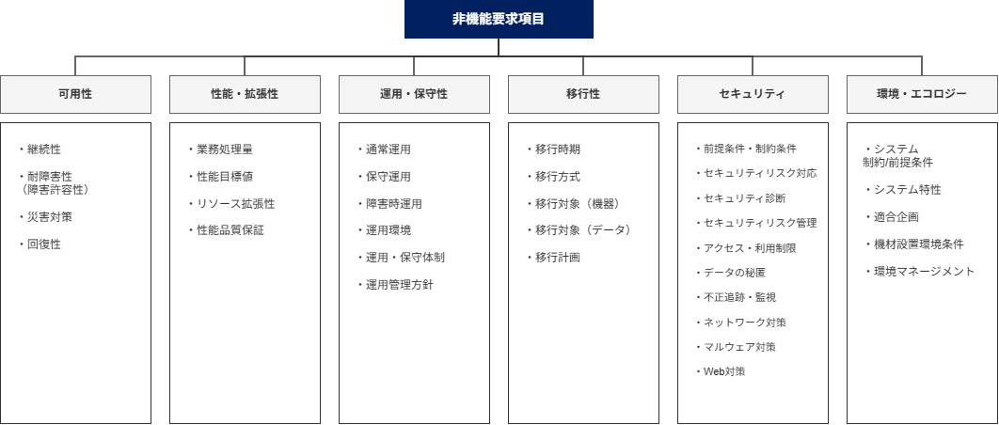
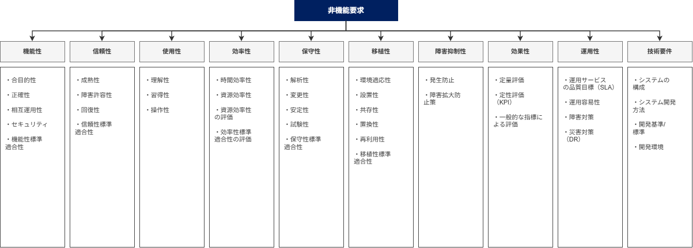
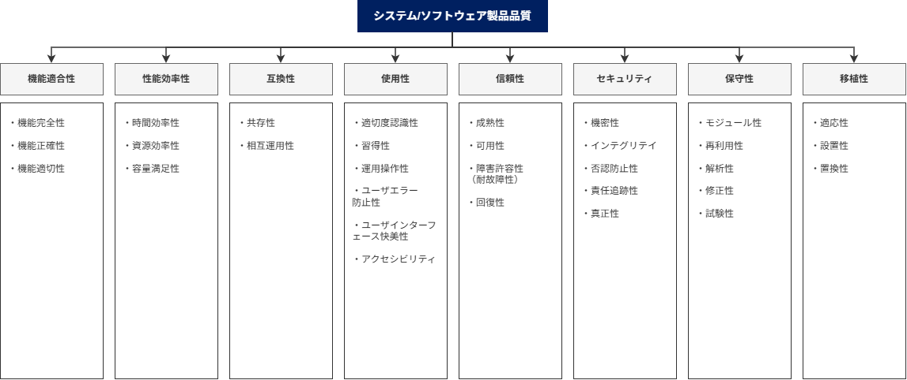

<page-title/>

## 非機能に類似する用語

非機能と同じような意味でよく使われる用語に「品質特性」や「アーキテクチャ特性」などがある。

- **非機能**  
  機能以外の特性を包括的に指す伝統的な呼び方である。
- **品質特性**  
   ISO/IEC 25010 のソフトウェア品質モデルに代表される考え方で「明示的ニーズまたは暗黙のニーズを満たすためのソフトウェア製品の能力」と定義されている。
- **アーキテクチャ特性**  
  「[ソフトウェアアーキテクチャの基礎](https://www.oreilly.co.jp//books/9784873119823/)[^1]」の中で、「ドメインによらない、設計に関する考慮事項をあきらかにするもの」「設計の構造的な側面に影響を与えるもの」「アプリケーションの成功に不可欠な重要なもの」と定められている。
- **イリティ**  
  可用性（Availability）、信頼性（Reliability）、保守性（Maintainability）など「-ility」で終わる特性を総称して「イリティ」と呼ぶ。

## 非機能フレームワーク

### IPA 非機能要求グレード

IPA（情報処理推進機構）が公開する「非機能要求グレード」は、システム基盤に対する発注者要求の「見える化」を目的に策定されたフレームワークで、ユーザーと開発者の間で非機能要求の認識が食い違うことを防ぐため、検討すべき項目を網羅的にリストアップしそれぞれの要求レベルを段階的に示しているのが特徴である。  
非機能要求項目は次の6つの大項目に分類され、その下に35の中項目、118の小項目、238のメトリクス（評価指標）が階層的に整理されている。

::: tip 現場での活用における注意点  
本グレードは長らく国内のデファクトスタンダードとして活用されているが、IPAにおける該当事業（更新・保守）は既に終了している。

- [非機能要求グレード本体（日本語版）使用条件 | アーカイブ | IPA 独立行政法人 情報処理推進機構](https://www.ipa.go.jp/archive/digital/iot-en-ci/jyouryuu/hikinou/ent03-b-1.html)

そのため、記載されている技術前提やメトリクスが、最新のクラウドアーキテクチャや開発手法の実態と合致しない部分も存在する。あくまで検討の漏れを防ぐためのベースラインと割り切り、AI要件など最新の技術トレンドに合わせてプロジェクト独自の要件へカスタマイズすることが不可欠であり、それが腕の見せ所である。  
:::

### JUAS 非機能要求仕様定義ガイドライン

JUAS（日本情報システム・ユーザー協会）が2008年に発行した「非機能要求仕様定義ガイドライン」は、IPA 非機能要求グレードと並んで国内でよく参照される。「ユーザー（発注者）視点」「検証可能性の重視」を特徴とし、非機能要件230項目について「確認すべき項目 / 確認すべきプロセス / 検証方法 / 必要なドキュメント」を整理している点が、要求レベルの提示に重きを置く IPA とは立脚点が異なる。大分類は次の10項目で、後述する ISO/IEC 9126（ISO/IEC 25010 の前身）の品質特性を下敷きに、ユーザー視点で再構成したものとなっている。  
ただし、2008年発行という時期もあり、クラウドサービスの普及やセキュリティインシデントの多様化など、近年のシステム開発のアプローチを必ずしも反映していない点には留意が必要である。

### ISO/IEC 25010 製品品質モデル

ISO/IEC 25010 はソフトウェアおよびシステムの品質モデルを定義する国際規格で、SQuaRE（Systems and software Quality Requirements and Evaluation）シリーズの中核をなす。ISO/IEC 9126 と ISO/IEC 14598 を統合した規格として2011年に発行され、2023年11月に大きな改訂が行われた（ISO/IEC 25010:2023）。 最新版の製品品質モデルは次の9つの品質特性で構成される。各品質特性はさらに副品質特性に細分化される。  
2011年版から大きく変わった点として、「使用性（Usability）」が「相互作用性（Interaction Capability）」に、「移植性（Portability）」が「柔軟性（Flexibility）」（移植性はその副特性に位置づけ）に再編され、新たに「安全性（Safety）」が独立した品質特性として追加された。

※図は2023年大改定前のものである。

### デジタル社会推進標準ガイドライン（群）

デジタル庁が策定する政府情報システムの整備・管理に関する政府共通ルールで、デジタル庁発足以前から内閣官房によって「デジタル・ガバメント推進標準ガイドライン」として運用されてきたものを継承・改称している。要件定義書に記載すべき非機能要件として、次の項目を定めている。

- ユーザビリティ及びアクセシビリティ
- システム方式
- 規模
- 性能
- 信頼性
- 拡張性
- 上位互換性
- 中立性
- 継続性
- 情報セキュリティ
- 情報システム稼働環境
- データマネジメントに関する事項
- テスト
- 移行
- 引継ぎ
- 教育
- 運用
- 保守

# 可用性の定義項目チェックリスト

可用性の厳密な定義項目と、設定例をまとめる。本編「可用性」の項目マップを、実務で使えるレベルまで具体化したものである。IPA 非機能要求グレードのような網羅的な確認をしたいときの叩き台として使うとよい。

ただし、すべてのシステムで全項目を埋める必要はない。多くのシステムは基本項目（運用スケジュール・目標稼働率・RTO/RPO）だけで足り、ミッションクリティカルなシステムほど下位の項目まで詰めていく。

**1\. 継続性 ― いつ・どれだけ使えるか**

| 分類             | 定義項目                 | 値の例                                                              |
| :--------------- | :----------------------- | :------------------------------------------------------------------ |
| 運用スケジュール | 運用時間（通常）         | 24時間365日無停止 / 業務時間内（9–17時） / 夜間のみ停止             |
|                  | 運用時間（特定日）       | 祝日・年末年始も通常どおり / 特定日のみ停止可                       |
|                  | 計画停止の有無・許容時間 | あり（月間最大 XX 時間） / なし（ゼロダウンタイム必須）             |
| 稼働率           | 目標稼働率               | 99％ / 99.9％ / 99.99％ / 99.999%                                   |
|                  | 計算条件の明記           | 計画停止を除く / 大規模災害を除く / 外部要因を除く / 月間・年間集計 |
| 目標復旧水準     | RTO（目標復旧時間）      | 2時間以内 / 4時間以内 / 1営業日以内 / 数日以内                      |
|                  | RPO（許容データ損失）    | ほぼゼロ / 日次（1営業日前） / 週次（5営業日前）                    |
|                  | RLO（目標復旧レベル）    | 全機能復旧 / 主要業務のみ / 縮退（参照のみ）                        |

**2\. 耐障害性 ― そもそも止まりにくくする**

| 定義項目                                   | 値の例                                                                         |
| :----------------------------------------- | :----------------------------------------------------------------------------- |
| 対象業務範囲                               | 全業務 / 外部向けオンライン系のみ / 内部バッチ系のみ                           |
| サーバー冗長化                             | 非冗長 / 負荷分散 / クラスタ / Active-Active / Multi-AZ                        |
| コンポーネント冗長化（電源・ディスク・NW） | RAID 相当 / 分散ストレージ / 複数 ISP                                          |
| SPOF 排除対象                              | 重要コンポーネント全て / サーバー・ストレージ・NW まで / 外部依存含む          |
| 同時障害耐性（＝業務継続の要求度）         | 単一障害時も継続 / 二重障害時も切替時間内で継続 / リージョン障害は DR に委ねる |
| サービス切り替え時間（フェイルオーバー）   | 60秒未満 / 5分以内 / 15分以内 / 60分以内                                       |
| フェイルオーバーの自動 / 手動               | 自動 / 手動（承認あり）                                                        |
| 縮退運用レベル（＝RLO と対応）             | フル機能 / 主要業務のみ / 参照のみ                                             |

**3\. 災害対策・BCP ― 大規模・広域障害への備え**

| 定義項目                       | 値の例                                                         |
| :----------------------------- | :------------------------------------------------------------- |
| DR サイトの種類                | ホット / ウォーム / コールドスタンバイ / クラウド Multi-Region |
| DR 発動基準・切替時間          | RTO に準拠 / 事前定義トリガー（地震規模・DC 全損など）         |
| 大規模災害時のシステム再開目標 | 1日以内 / 3日以内 / 1週間以内 / 1ヶ月以内 / 再開不要           |
| 復旧優先順位                   | Critical → High → Medium の順序と復旧順                        |

**4\. 可用性を支える運用・観測**  
これらは可用性そのものの定義というより運用保守性の項目だが、可用性の維持に直結するため参照として掲げる。

| 定義項目               | 値の例                                               |
| :--------------------- | :--------------------------------------------------- |
| 無停止保守の要否       | 月間最大 XX 時間の停止可 / ゼロ停止（Blue-Green 等） |
| 監視・検知時間         | 障害検知からアラートまで5分以内 / 自動検知必須       |
| 障害対応体制           | オンコール体制 / エスカレーション初動30分以内        |
| 可用性確認・テスト範囲 | 業務停止となる障害の全範囲 / 重要業務のみ            |
| 耐障害性テストの頻度   | 四半期1回 / 年2回 / Chaos Engineering 定期実施       |

[^1]: ソフトウェアアーキテクチャの基礎 Mark Richards （著）, Neal Ford （著）, 島田 浩二 （翻訳）
