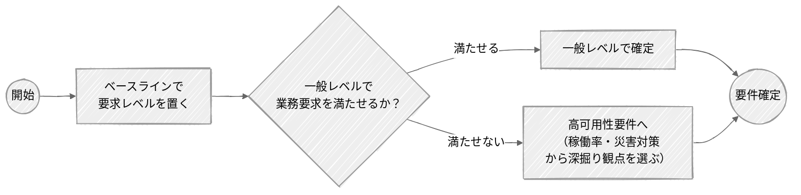
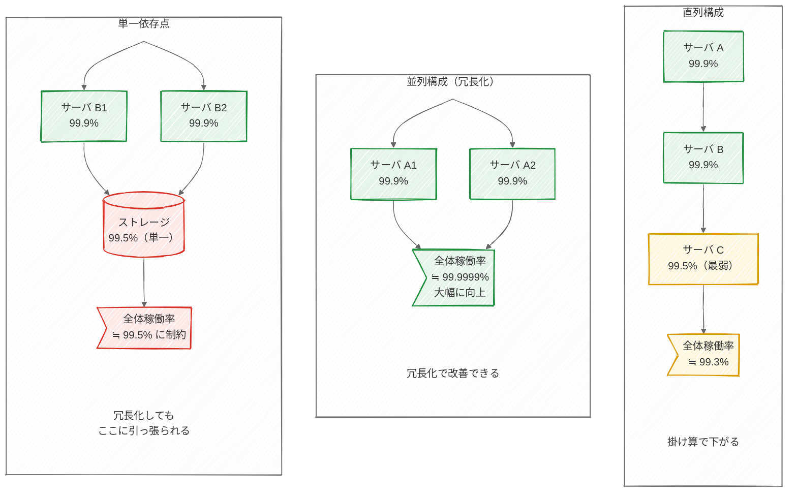

<page-title/>

ずっと止まっても大丈夫なシステムは存在しない。可用性はどのようなシステムでも必ず問われる非機能要件の入口である。

# 可用性とは

可用性は単一の指標ではなく、複数の項目からなる。本章ではこれらを段階的に扱う。

| 項目     | キーワード                             | 内容                                                           | 詳説                                                          |
| :------- | :------------------------------------- | :------------------------------------------------------------- | :------------------------------------------------------------ |
| 継続性   | 運用スケジュール・目標復旧水準・稼働率 | どの時間帯に・どれだけの割合で使え、障害からどこまで速く戻すか | 本章の中核。基礎は本節、深掘りは[高可用性要件](#高可用性要件) |
| 耐障害性 | 冗長化・単一障害点・フェイルオーバー   | 冗長化や単一障害点の排除で、そもそも止まりにくくする           | [高可用性要件](#高可用性要件)                                 |
| 災害対策 | DR・BCP                                | 大規模災害時の復旧と事業継続                                   | [高可用性要件](#高可用性要件)                                 |

なお、これらを厳密に定義するときの詳細な項目と値の例は、[Appendix「可用性の定義項目チェックリスト」](./appendix.md#可用性の定義項目チェックリスト)にまとめている。網羅的に詰める必要があるのは主にミッションクリティカルなシステムで、多くのシステムは基本項目だけで足りる。

可用性目標の中核は継続性である。これは次の3つで定める（IPA 非機能要求グレードの中項目「継続性」に対応する）。

| 項目             | 内容                                                                                                     |
| :--------------- | :------------------------------------------------------------------------------------------------------- |
| 運用スケジュール | そもそも稼働している必要がある時間帯（平日 9–17 時、24 時間 365 日など）                                 |
| 目標復旧水準     | 障害時にどれだけの時間で復旧するか（RTO＝目標復旧時間）、どの時点までデータを戻すか（RPO＝目標復旧時点） |
| 稼働率           | その運用スケジュールの中で、どれだけの割合でサービスを提供できるか                                       |

3つのうち出発点になるのが運用スケジュールである。とくに「24 時間 365 日止められないのか、それとも定期的にメンテナンスウィンドウ（計画停止の枠）を取れるのか」は、後段を大きく左右する。夜間や週末に止めてよいなら、その枠でメンテナンス・バッチ・切り替えを行え、設計やコストも楽になる。逆に 24/365 が求められると、無停止でのアップデートや冗長切り替えが前提になり、難度と費用が跳ね上がる。

運用スケジュールは、稼働率の分母（稼働を求める時間）を定める。計画停止をどう扱うか（稼働率の計算では停止時間に含めない）の前提にもなる。

これらを独立に扱わないのは、互いに依存するためである。運用スケジュールが決まらなければ稼働率の分母が定まらず、目標復旧水準が決まらなければ、停止時間の内訳（障害そのものの時間＋復旧処理の時間）も定まらない。

ただし、稼働率と目標復旧水準（RTO）は、受け持つ役割が違う。稼働率は一定期間の停止時間を合計した割合であり、「一度の障害でどれだけ長く止まるか」までは縛らない。例えば「稼働率 99.9％（年間約 8.7 時間まで停止可）」という同じ要件でも、次のどちらの止まり方でも満たせてしまう。

| 停止パターン         | 内容                                                         |
| :------------------- | :----------------------------------------------------------- |
| 細切れで止まる       | 深夜に1分ずつ、年間を通して合計 8.7 時間分が分散して発生する |
| 一度にまとめて止まる | 年間で最も重要な繁忙日に、8.7 時間をまるごと使い切る         |

どちらも稼働率は同じだが、事業が受ける痛みはまったく違う。そこで、一度の停止で業務が耐えられる長さは、稼働率とは別に RTO（目標復旧時間）で定める。両者は次のように補完し合う。

| 項目   | 内容                                   |
| :----- | :------------------------------------- |
| 稼働率 | 一定期間の停止の「累計」に上限をかける |
| RTO    | 一度の停止の「長さ」に上限をかける     |

稼働率は、期待（運用スケジュール）に対する提供割合である。注意したいのは、停止時間の数え方である。停止時間には、障害そのものの継続時間だけでなく、その後の復旧処理の時間も含む。

::: tip 稼働率の相場観  
24 時間 365 日運用での、稼働率と年間停止時間の目安を示す。

| 稼働率                      | 年間の停止許容時間（目安） |
| :-------------------------- | :------------------------- |
| 99％（ツーナイン）          | 約 3.6 日                  |
| 99.9％（スリーナイン）      | 約 8.7 時間                |
| 99.99％（フォーナイン）     | 約 52 分                   |
| 99.999％（ファイブナイン）  | 約 5 分                    |
| 99.9999％（シックスナイン） | 約 32 秒                   |

「9」が1つ増えるごとに停止許容は約 1/10 になり、必要なコストと構成の難度は跳ね上がる。まずはこの相場観を持っておきたい（どの水準を選ぶかは [一般レベルの可用性要件](#一般レベルの可用性要件)・[高可用性要件](#高可用性要件) で扱う）。

一般的な業務システムは 99.5〜99.9％ に収まることが多く、高可用性要件に進まないケースはこのあたりに着地する。99.99％ 以上は、金融・通信など可用性が重要ドライバとなる領域の水準である。  
:::

::: tip 稼働率を分かりやすく表現する例  
稼働率を「月あたり30分停止が何回か」で表現すると、相手によっては伝わりやすい。●1つが、30分の停止1回を示す。

| 1月 | 2月 | 3月 | 4月 | 5月 | 6月 | 7月 | 8月 | 9月 | 10月 | 11月 | 12月 | 総合停止時間 | 稼働率   |
| :-: | :-: | :-: | :-: | :-: | :-: | :-: | :-: | :-: | :--: | :--: | :--: | :----------- | :------- |
|  ●  |     |     |     |     |     |     |     |     |      |      |      | 30分         | 99.994％ |
|  ●  |     |     |     |     |     |  ●  |     |     |      |      |      | 1時間        | 99.989％ |
|  ●  |     |     |     |  ●  |     |     |     |  ●  |      |      |      | 1.5時間      | 99.983％ |
|  ●  |     |     |  ●  |     |     |  ●  |     |     |  ●   |      |      | 2時間        | 99.977％ |
|  ●  |     |  ●  |     |  ●  |     |  ●  |     |  ●  |      |  ●   |      | 3時間        | 99.966％ |
|  ●  |  ●  |  ●  |  ●  |  ●  |  ●  |  ●  |  ●  |  ●  |  ●   |  ●   |  ●   | 6時間        | 99.932％ |
| ●●  | ●●  | ●●  | ●●  | ●●  | ●●  |  ●  |  ●  |  ●  |  ●   |  ●   |  ●   | 9時間        | 99.897％ |
| ●●  | ●●  | ●●  | ●●  | ●●  | ●●  | ●●  | ●●  | ●●  |  ●●  |  ●●  |  ●●  | 12時間       | 99.863％ |
| ●●● | ●●● | ●●● | ●●● | ●●● | ●●● | ●●● | ●●● | ●●  |  ●●  |  ●●  |  ●●  | 16時間       | 99.817％ |

仮に、年1回30分であれば、フォーナイン（99.99％）を維持できるが、年2回になると維持できない。

:::

::: tip 稼働率の定義と計算  
稼働率は、稼働を求める時間のうち、実際に稼働できた時間の割合で表す。値が高いほど、期待に近い。

　稼働率（％）＝ _実際に稼働できた時間_ / _稼働を求める時間_ × 100

例えば 10 時間（600 分）の稼働を求める場合に、障害が 10 分続き、その復旧処理に 60 分かかったとすると、停止時間は合計 70 分。稼働率は (600 − 70) ÷ 600 × 100 ＝ 88.3％ となる。

なお、**計画メンテナンスによる停止は、この停止時間に含めない**。事前に告知し、運用スケジュールの外として扱うためである。含めてしまうと、計画停止のたびに稼働率が下がり、実態を表せなくなる。また、停止時間のうち見落とされやすいのは「復旧処理の時間」である。原因調査・切り戻し・データ復旧・業務再開の確認に時間がかかり、障害そのものより長くなる。停止時間を見積もるときは、この復旧処理を軽く見ない。  
:::

::: tip 信頼性（MTBF など）はどこで扱うか  
MTBF（平均故障間隔）や故障率といった伝統的な信頼性の指標は、本章では独立して扱わず、継続性（稼働率・RTO／RPO）に含めている。利用者が最終的に気にするのは、部品がどれくらいの頻度で壊れるかではなく、結果としてどれだけ止まらなかったか（稼働率）、壊れてもどれだけ早く戻せるか（RTO・RPO）だからである。稼働率は、故障間隔（MTBF）と平均修復時間（MTTR）を合わせた結果指標であり、そちらで充足する。

とくにクラウドでは、ハードウェアの信頼性は事業者が管理し、利用側には SLA や稼働率としてしか見えない。発注者自身が部品交換のためにサーバルームで作業する必要が無い以上、コンポーネントレベルの信頼性を定義したい場面は減っている。  
:::

::: tip 可用性と耐久性の混同に注意する  
可用性と耐久性は、似ているようで別物である。混同すると「冗長化したのだからデータも安全だ」といった誤解につながる。

|        | 問い                       | 効く対策                                     | 関連する指標 |
| :----- | :------------------------- | :------------------------------------------- | :----------- |
| 可用性 | サービスを使い続けられるか | 冗長化・フェイルオーバー                     | 稼働率・RTO  |
| 耐久性 | 預けたデータが失われないか | バックアップ・レプリケーション・複数拠点保管 | RPO          |

クラウドストレージは、この2つを別々の数字で公開している。例えば同じサービスでも、可用性は 99.9％ 台なのに対し、耐久性は 99.999999999％（イレブンナイン）といった桁違いの水準が示される。高い可用性はデータの保全を保証せず、高い耐久性は常時アクセスできることを保証しない。両者は別の要件として、別の手立てで確保する。  
:::

# 可用性要件の進め方

可用性をどこまで作り込むかは、時間・費用・業務要求のバランスで決める。すべてのシステムで精緻な設計が要るわけではない。判断は2段階で行う。まずベースラインで要求レベルを置く。それで業務要求を満たせるなら一般レベルで確定し、満たせないなら高可用性要件へ進む。

# 一般レベルの可用性要件 {#一般レベルの可用性要件}

多くのシステムにとって、可用性は特別に作り込む対象ではなく、標準的な作り方で十分に満たせる。ここでは、そうしたケースでの決め方を示す。ここで足りると判断できれば、次の[高可用性要件](#高可用性要件)には進まず、要件を確定してよい。

一般レベルでは、次の3ステップで要件を確定する。

1. **要求レベルを置く**  
   ベースライン（IPA 非機能要求グレードなら社会的影響度の3モデル：極大／大／限定的）から選ぶ（→ 第一部 [STEP6 ベースラインの設定](./overview.md#step6)）。停止しても影響が社内にとどまる、あるいは軽微な業務（社内の情報共有ツールなど）なら、影響度は「限定的」である。この場合、稼働率でいえば 99.5〜99.9％ が1つの目安になる（相場観の詳細は[可用性とは](#可用性とは)を参照）。
2. **標準構成で満たす**  
   冗長化（クラウドならマルチ AZ、オンプレなら機器の二重化）、単一障害点の排除、バックアップとリストアの整備。クラウドのマネージドサービスを素直に組めば、多くはこの水準に収まる。"特別に作り込む"のではなく、"標準から外さない"レベルである。
3. **実績で妥当性を確かめる**  
   数値ありきで決めず、実績と突き合わせる。現行システムがあれば稼働実績と障害履歴を振り返り、「実際どれくらい止まり、業務はどれだけ困ったか」を確認する（→ 第一部 [STEP2 ビジネスコンテキストの理解](./overview.md#step2)・[Who章：現行システムの運用者](./overview.md#who)）。新規なら類似システムの水準を拠り所にする。

顧客との合意も、このレベルでは重くない。「業務への影響は限定的なので、標準構成で稼働率○％程度を目標にします」と確認する程度でこと足りる。停止の痛みを丁寧に引き出したり、コストと水準の綱引きをしたりといった重い合意形成は、可用性が重要ドライバとなるケース（次章）で行う。

一方、次のいずれかに当てはまるなら、一般レベルで止めず[高可用性要件](#高可用性要件)へ進む。ただし、費用・合意形成・設計構築の負担は相応に増える。

| 判断基準                                     | 例                                                            |
| :------------------------------------------- | :------------------------------------------------------------ |
| ミッションクリティカル性が高い               | 決済、認証基盤、社会インフラ、祖業・基幹業務システム          |
| 事業側と構築側の期待値に大きなギャップがある | 「24時間365日絶対に止めるな」が技術的・予算的に非現実的な水準 |
| 過去に重大な障害・訴訟・信用失墜の実績がある | 同種システムで重大インシデントを起こした経験がある            |
| 妥当なベースラインが存在しない               | 前例のない新規事業、類似システムが社内外に無い                |
| 規制・コンプライアンス要求がある             | 重要インフラ15分野、金融、医療などの法令・ガイダンス上の要求  |
| 契約上の罰則・損害賠償リスクがある           | SLA 未達時に違約金や契約解除条項が存在する                    |

迷う場合は、まず"止まったときの痛み"の大小をざっくり掴んで見極めるとよい。

# バックアップとデータ保全 {#バックアップとデータ保全}

どのシステムでも、データが失われないための備えは必要である。可用性（使い続けられるか）とは別に、耐久性（データが失われないか）を支える土台であり、ミッションクリティカルかどうかに関わらず必ず詰める（→「可用性と耐久性の混同に注意する」）。

可用性の要件として決めるのは、次の水準・範囲である。

| 項目                      | 内容                                                                                           |
| :------------------------ | :--------------------------------------------------------------------------------------------- |
| 許容するデータ損失（RPO） | 障害時にどの時点まで戻せればよいか（継続性の要素。→[可用性とは](#可用性とは)）                 |
| データ保全の範囲          | リージョンや拠点の全損のような大規模障害に備え、別リージョンや別拠点へバックアップするかどうか |

一方、バックアップの取得頻度・世代管理・ジョブ監視・リストア訓練といった運用は運用保守性で、取得方式や保管先といった構成は設計で扱う。バックアップからのリストアでは間に合わないほど短い RTO や、無停止での切り替え（スタンバイサイト、マルチリージョン稼働）が要る場合は、[高可用性要件](#高可用性要件)の[災害対策（DR・BCP）](#災害対策と事業継続)で扱う。

# 高可用性要件

可用性が重要ドライバだと判明したら、一般レベルを超えて精緻に設計する。ここからは稼働率を軸に、事業の期待を実現可能な要件へ落とし込む道筋を扱う。

## 稼働率の4つの視点

「稼働率」という一語は、立場によって指すものが違う。同じ数字を議論しているつもりで、実は別の意味の稼働率を話してしまうと噛み合わない。いま4つのどれを論じているかを、関係者間で明確にする。

| 種別   | 位置づけ     | 意味                                           | 主な関心者               |
| :----- | :----------- | :--------------------------------------------- | :----------------------- |
| 要求値 | 事業上の期待 | 事業文脈から導かれる、止まりにくさへの期待     | 事業責任者・業務主管部署 |
| 要件   | 合意事項     | 目標値の合理性と未達時の改善責任を合意したもの | プロジェクト責任者       |
| 設計値 | 理論上限     | 要件を実現する構成が理論上出せる上限値         | アーキテクト             |
| 実績値 | 結果         | 運用で得られた実際の記録値                     | 運用部門                 |

この4つは単なる分類ではなく、事業の期待（要求値）を約束（要件）にし、設計（設計値）で裏づけ、運用（実績値）で検証していく一連の流れでもある。以下、視点ごとに勘所を示す。

### 要求値（事業の期待を引き出す）

要求値は事業の期待そのものであり、システムの内側ではなく事業の状況で決まる。これを踏まえずに数字を設定すると、以降の要件・設計値の議論が「根拠のない数字合わせ」になりやすい。要求水準は、主に「事業の局面」と「停止の影響度」によって変わる。

#### 事業の局面

可用性に投下できる予算は、局面によって次のように変わる。

| 局面   | 特徴                                                                                 |
| :----- | :----------------------------------------------------------------------------------- |
| 拡大期 | 可用性への投資を積極化する圧力が働く。「多少コストがかかっても止めるな」             |
| 縮小期 | コスト削減圧力で目標が下がりうる。「最低限で構わない」                               |
| 探索期 | 変化への対応力を優先し、最小限からはじめる。「まずは最小限で、事業の成り行きを見て」 |

加えて、システム自体のライフサイクルも効く。新規構築時は投資を得やすい一方、運用・保守や刷新前の時期になるほど予算は厳しくなり、可用性を上げる交渉は通りにくくなる。

#### 停止の影響度

停止が競合への顧客流出に直結したり、売上への影響が大きかったりするほど、高い稼働率が求められる。逆に、利用頻度の低い社内システムなどでは、コストとのバランスで水準を下げる判断も合理的である。

要求水準を引き出すときは、技術用語でなく「停止したときの痛み」で語ると、事業側と認識を合わせやすい。稼働率のような1つの数値だけでは、いつ・どのくらいの長さで止まるかまでは表せない（→[可用性とは](#可用性とは)）。だから、次のように「どんな止まり方が、どれだけ痛いか」を具体化しておく。

| 痛みの種類             | 具体的な状況             | 表現することば                   |
| :--------------------- | :----------------------- | :------------------------------- |
| 頻度の痛み             | 頻繁に停止する           | 「しょっちゅう止まる」           |
| 長さの痛み             | 停止時間が長い           | 「止まったら長い」               |
| タイミングの痛み       | 繁忙期・月末に止まる     | 「よりによって月末に止まる」     |
| 検知の痛み             | 止まったことに気づかない | 「気づいたら止まっていた」       |
| 回復の痛み（戻らない） | 復旧に時間がかかる       | 「直ったと思ったらまだ使えない」 |

::: tip 可用性への投資を、期待損失から見積もる  
可用性の要件は顧客が決めるものだが、コンサルタントとしては「どこまで投資すべきか」を経済的に見積もる視点を持っておきたい。

出発点は、停止による期待損失である。おおよそ「1回あたりの損失額 × 発生頻度」で見積もれる。損失には停止中の直接的な売上減だけでなく、レピュテーション低下による顧客離反や見込み顧客の取り逃がしも、ある程度は織り込める。

この期待損失が、可用性に投じてよい金額の目安になる。備えのコストが、それによって避けられる期待損失を下回るなら、ホットスタンバイやウォームスタンバイ、あるいは高い稼働率への投資は正当化できる。逆に、期待損失に見合わない過剰な投資は避ける（→ 心得「過剰品質を避ける」）。

この費用対効果の試算を顧客との議論で前面に出すかは状況によるが、常に念頭に置くことが、コンサルタントの役割である。  
:::

### 要件（実現できる約束として合意する）

要求値を、検証可能で実現可能な「要件」に変換して合意する。合意にあたっては、目標値が次の3点を満たすことを確認する（→ 第一部 [STEP10 ステークホルダー合意](./overview.md#step10)）。

- 業務要求に照らして合理的であること（なぜその水準なのかを、事業の根拠で説明できる）
- 達成できる設計が合理的に描けること（アーキテクチャとして実現可能である）
- 未達のときに、原因を説明し改善できること

要求値を要件に落とすときは、あわせて次の2点に留意する。

- **定性的な期待は必ず数値にすること**  
  「止まりにくいこと」のままではテストで合否を判定できず、認識のズレを生む（例: 稼働率 99.9％ 以上、年間停止時間 8.7 時間以内）。
- **機能ごとに水準を分けるか検討すること**  
  1つのシステムでも、決済機能と管理画面では停止したときの影響が違うため、同じ数値を当てはめない。

なお、要件は単独では確定できない。事業の期待（要求値）を、アーキテクチャの理論上限（設計値）と照らし合わせ、実現できる水準として確定する。

::: tip アンチパターン：可用性を「機能」として書いてしまう  
可用性は「どれくらい安定して・長く使えるか」という水準の話であって、作り込む機能そのものではない。慣れないうちは、可用性への期待を機能要件として書いてしまうことがある。

| 書き方            | 例                                                                                    |
| :---------------- | :------------------------------------------------------------------------------------ |
| ❌️ 機能として書く | 「障害時に自動で切り替わる機能を追加する」 「ログイン画面が常に表示されるようにする」 |
| ✅️ 水準として書く | 「稼働率 99.9％ 以上」 「フェイルオーバーの切り替わりは5分以内」                      |

機能として書くと、テストや SLA で「どこまで満たせば合格か」を定量的に判定できず、後工程で混乱する。自動切り替えのような仕組みは、あくまで水準を実現する手段であって、要件そのものではない（→ [第一部 What](./overview.md#what)）。  
:::

::: tip アンチパターン：技術的な実現手段まで要件に書いてしまう  
可用性の要件は、何を・どの水準で達成したいかに留める。どう実現するかといった具体的な構成は、設計フェーズの領分である。技術に明るい人ほど、要件定義の段階で作り方まで決めてしまいやすい。

| 書き方              | 例                                                                                          |
| :------------------ | :------------------------------------------------------------------------------------------ |
| ❌️ 実現手段まで書く | 「Kubernetes の Replica 数を3にする」 「DB は同期レプリケーションでフェイルオーバーさせる」 |
| ✅️ 水準で書く       | 「RTO 5分以内・RPO 1分以内」                                                                |

構成を要件で決め打ちすると、設計者の自由度を奪い、より良い実現手段が出にくくなる。手段が悪いのではなく、決める場所が違う。要件は水準まで、どう実現するかは設計へ委ねる（→ [第一部 STEP11 アーキテクチャ設計への反映](./overview.md#step11)）。  
:::

### 設計値（アーキテクチャの理論上限を見積もる）

設計値は、採用する構成が理論上どこまでの稼働率を出せるかの上限である。これは "設計" の話でもあるので、要件定義の趣旨からは外れる。ただし、知識としては押さえておくべきである。

見積もるときは、次の3点に注意する。

- **最弱リンクに気をつける**  
  全体の稼働率は、最も弱い要素に引っ張られる。直列構成では各要素の稼働率の掛け算になり、最も低い要素で頭打ちになる。冗長化（並列化）で引き上げられるが、並列化できない単一依存点があると、そこが上限を決める。オンプレではストレージがその単一依存点になりやすい。
- **現実的な水準に落とし込む**  
  99.999％（ファイブナイン）のような値は金融・通信など特定領域の水準で、一般の業務システムとはかけ離れる（相場観は[可用性とは](#可用性とは)を参照）。高い数字に引きずられて要件を置くと、当初のコスト感では実現できない構成を追うことになる。
- **SLA の限界を知っておく**  
  クラウドの SLA が示す停止時間は「サービスが応答するか」の話であって、「業務が正常に再開できるか」とは別物である。障害が収まった後の復旧処理の時間は SLA に含まれないため、設計段階で復旧のシナリオまで見通し、RTO に織り込んでおく。

::: tip 直列・並列構成と最弱リンク  
稼働率は要素の掛け算で決まる。冗長化（並列化）は大きく効くが、並列化できない単一依存点があると、そこで頭打ちになる。

:::

オンプレとクラウドでは、同じ「稼働率」でも数字の意味が違う点に注意する。

- **オンプレ**  
  製品の公表値は、部品の故障率予測・冗長設計・実績補正から導いた設計値であり、「製品そのものの稼働率」と理解して実務上問題ない。ただし IA サーバのように構成の組み合わせが多いものは非公開で計算も難しく、実際には仮想化基盤全体の稼働率で考えることになる。
- **クラウド**  
  公開値は、設計値というよりベンダーの財務上の防衛ライン（商用上の下限）に近い。実際の設計値はより高いはずだが開示されないため、鵜呑みにはせず「最悪でもこの水準」とみなす。その数字だと毎月どのくらい停止するかをタイムラインで描き、業務の期待に足りるかを確かめる。運用が始まったら、自分たちの実績値で見直していく。

また、障害は機器（ハコ）の故障だけではない。アクセス高騰を発端とするミドルウェアの不調や、特定条件で発生するバグなども起きる。原因の種類によって対策の型が異なるため、分けて考える。

| 障害の種類                                             | 主な対策                                                         |
| :----------------------------------------------------- | :--------------------------------------------------------------- |
| 機器（ハコ・ハードウェア）の故障                       | 公開情報から故障率を見積もり、冗長構成と機器の更改時期を計画する |
| アクセス高騰（負荷急増）によるミドルウェア不調         | 流量制御と、その対応をセットで設計する                           |
| ミドルウェアのバグ・不調（特定条件で発動するバグなど） | 外形監視と、切り替えの高速化で抑える                             |

設計値が事業の期待（要求値）に届かない場合、とりうる手は原理的に2つである。

- 別の耐障害機構（別リージョン・別クラウド、あるいはオンプレ併用）を持ち込むこと
- 業務側で吸収すること（復旧までの時間を前提に、代替運用や業務調整をあらかじめ用意する）

なお、冗長機構そのものが期待どおり働かない（フェイルオーバーに失敗する）可能性も織り込んでおく。

::: tip 冗長構成の半死への備え  
完全に停止すれば冗長構成は切り替わるが、完全には止まっていない"半死"の状態ではうまく切り替わらないことがある。例えば、10秒に1〜2回しか応答しない、応答は返ってくるが極端に遅い、といったケースである。単純な死活監視では切り替えや切り離しが起きない。1件ずつの遅れは停止と言うほどではなくても、積み重なると処理が追いつかなくなり、やがて業務が回らなくなる。

半死への対応は、要件と設計で受け持つ範囲を分けて考える。

- **要件**: 「業務影響で稼働率を数える」という方針に留める（→「実績値」）。応答時間やエラー率の閾値といった細部までは、要件には含めない
- **設計**: 半死を検知して切り離す作り込み。浅い死活監視ではなく処理の成否まで見る深いヘルスチェックや、閾値監視、サーキットブレーカによる切り離しなどがある

どこまで作り込むかは、業務にとって許容できない劣化はどこにあるかを起点に（→ 要求値の「痛み」）、コストと相談して決める。  
:::

### 実績値（運用で検証し、次に活かす）

実績値は、運用のなかで実際に記録された結果である。要求値・要件・設計値と突き合わせ、乖離があれば構成や要件を見直す。あわせて、次期システムの要求水準を定めるためのベースラインとして残す（→ [Why章「継承」](./overview.md#継承)）。

実績値を測るうえで、まず決めておきたいのが「何をもって停止とみなすか」である。基準にすべきは、部品やジョブが失敗したかではなく、利用者や業務に影響が出たかである。例えば夜間バッチが途中で失敗しても、定められたバッチウィンドウ内にリカバリでき、後続業務に影響が及ばなければ、稼働率を下げる停止とは数えない。

::: tip 稼働率をどう数えるか  
稼働率の数字は、運用が記録した障害の「検知〜復旧」時刻を積み上げて算定するのが一般的である。その際、何をもって停止とみなすかは、次の基準がある。

- **ヘルスチェックの応答可否**: 外形的に応答が返るかを見る方法。ただしこれだけだと、サービスは応答しているのに業務が回っていない状態を取りこぼす懸念がある
- **実リクエストの成功率**: 実際の処理が成功した割合から判定する。一定の閾値を下回っている時間帯を、利用不可として集計する

いずれにせよ、何を停止として数えるかで数字は変わるため、測り方も要件合意の前提として揃えておく（→ 第一部 [STEP10 ステークホルダー合意](./overview.md#step10)）。  
:::

なお、要求値は一度決めたら固定ではない。事業や利用のされ方が変われば求められる可用性も変わるため、見直す機会をあらかじめ決めておく。ただし「どれだけ変わったら見直すか」を精密に定義するのは難しいので、次の二本立てで構える。

- **定期の点検**: 年1回や予算・計画の節目など、定点で「いまの要求水準は妥当か」を確認する
- **変化のトリガー**: 利用者数や取引量が想定を大きく超えた、事業の局面が変わった、重大障害や実績値の未達が出た、といった合図で臨時に見直す

とくに利用が伸びると、停止したときに影響を受ける人・取引が増え、停止の痛み（→ 要求値）そのものも大きくなる。同じ稼働率でも、以前は許容できた停止が許容できなくなる場合もある。

## 耐障害性

耐障害性は「そもそも止まりにくくする」ための設計である。ただし、その水準は設計者が独断で決めるものではなく、非機能要件として合意しておく部分がある。非機能要件は、外から見える結果（稼働率）だけでなく、内側の耐性水準やポリシーも含む。内側の話でも、次の2つの理由から要件定義中に決めておきたい。

- **受容するリスクの事業判断だから**: 例えば「リージョン全損は対象外とする」は、その障害が起きたときの損失を事業が受け入れるという判断であり、黙って設計に委ねてよいものではない
- **後続の設計を強く縛り、後戻りが高価だから**: マルチ AZ とマルチリージョンのどちらにするかは、構成の土台を決める重要な意思決定であるため

ただし、要件で決めるのは「どこまでの障害に耐えるか」という水準・範囲・方針までである。「どの AZ（アベイラビリティゾーン）を2つ選ぶか」「リトライ回数の上限」といった具体的な構成は設計に委ねる（→ アンチパターン「技術的な実現手段まで要件に書いてしまう」）。稼働率の目標は冗長化の必要性を示唆するが、どの障害範囲を対象とし、どのリスクを受容するかは、別立てで明示的に合意する。

次の表は、可用性まわりの項目を「外から見える結果か、内側の耐性か」で分類し、要件で決めることと設計に委ねることを整理したものである。

| 性質                               | 項目                         | 要件定義で決めること                                                       | 設計に委ねること               |
| :--------------------------------- | :--------------------------- | :------------------------------------------------------------------------- | :----------------------------- |
| 外形の結果指標                     | 稼働率                       | 目標水準（99.9％ など）                                                    | 到達させる構成全般             |
| 両方（利用者にも見え、設計も縛る） | RTO・サービス切り替え時間    | 許容する最大時間                                                           | フェイルオーバー方式の実装     |
|                                    | RPO                          | 許容するデータ損失                                                         | レプリケーション方式           |
|                                    | フェイルオーバーの自動／手動 | 自動か手動かの方針（RTO・運用体制・ガバナンスから決まる）                  | 検知の閾値・切り替え機構の実装 |
|                                    | 縮退運用レベル               | どこまで機能を落として継続してよいか                                       | 縮退の実装                     |
| 内側の耐性水準                     | 障害耐性の範囲               | どこまでの障害に耐えるか（例: 単一 AZ 障害は継続／リージョン全損は対象外） | AZ・リージョン構成の具体       |
|                                    | 単一障害点（SPOF）           | SPOF を許容しない方針                                                      | 各層の SPOF 特定と冗長化の具体 |

補足として、2点を押さえておく。

- **見落としやすい SPOF**: 認証基盤・DNS・共有ストレージは単一障害点になりやすく、しかも見落とされやすい。「SPOF を持たない」という方針を掲げたうえで、これらを設計で意識的に洗い出す
- **フェイルオーバーの見極め**: 切り替え中は利用者が一時的に使えず、停止時間の一部になるため、切り替え時間は設計任せにせず要件で押さえる。自動か手動かは、RTO が厳しいほど自動に寄る。手動だと、検知・判断・操作に人手が入って RTO を圧迫するためである。誤切り替えを避けて承認を挟むかは、運用・ガバナンスの判断で決まる

### 依存先が止まったときの振る舞い（縮退運転の是非）

外部 API・DB・認証基盤などの依存先が止まったとき、システムをどう振る舞わせるかは、要件で明示的に決める。大きく2つの選択肢がある。

- **止める**: 依存先が使えないと判断したら、機能全体を停止する。挙動が「動く・止まる」に絞られ、テストや運用も単純になる
- **縮退して続ける**: 一部だけ生かす（例: 更新は止めるが参照は継続する）。利用者への影響は小さくできるが、正常・縮退・復帰と状態が増え、その組み合わせをテストする必要がある。中途半端な継続は、古いデータの参照や、片系だけ更新された不整合を招きやすい

明確な理由がなければ、止める側に倒すほうが安全である。縮退を選ぶなら、「どの機能を・どんな条件で落とし・どう戻すか」を正規の設計・テスト対象として扱い、"とりあえず参照だけ生かす"といった成り行きの縮退にはしない。

## 災害対策と事業継続

拠点やリージョンの全体が使えなくなるような広域障害に備えるのが、災害対策（DR: Disaster Recovery・BCP: Business Continuity Plan）である。日々の障害と違い、システム単独では完結せず、事業をどう続けるか（BCP）と一体で考える。データが失われないための備え（→[バックアップとデータ保全](#バックアップとデータ保全)）は前提とする。そのうえで、ここでは「どれだけ速く・どこまで業務を再開するか」と「どこへ逃がすか」を決める。

### 復旧レベルを選ぶ

広域障害からどう復旧するかは、大きく4つのレベルに分かれる（AWS の災害対策戦略の分類が広く使われている）。どれを選ぶかは、許容できる復旧の遅さ（RTO）と失ってよいデータ量（RPO）で決まる。速く戻せる方式ほど、待機環境を厚く持つぶんコストは跳ね上がる。

| 方式                                  | 概要                                                                                          | RTO／RPO の目安          | コスト |
| :------------------------------------ | :-------------------------------------------------------------------------------------------- | :----------------------- | :----- |
| バックアップ＆リストア                | 待機環境は持たず、被災後にバックアップから環境を作って復旧する                                | RTO・RPO とも数時間〜    | 低     |
| パイロットライト                      | データは常時複製し、DB など中核だけ用意しておく。アプリ層は止めておき、被災時に起動・拡張する | RTO 数十分／RPO 数分     | 低〜中 |
| ウォームスタンバイ                    | 縮小版だが動く待機環境を常時稼働させ、被災時に本番規模へ拡張する                              | RTO 数分／RPO 数秒〜数分 | 中〜高 |
| マルチサイト（アクティブ/アクティブ） | 複数リージョンで本番を常時稼働させ、同時に処理する                                            | RTO・RPO ほぼゼロ        | 高     |

最も軽いバックアップ＆リストアは、[バックアップとデータ保全](#バックアップとデータ保全)で述べた備えを、被災時の復旧手段としてそのまま使うレベルである。より速い復旧が要るほど、パイロットライト・ウォームスタンバイ・マルチサイトへと待機環境を厚くしていく。

::: info 参考  
[AWS「クラウドにおける災害対策の戦略」](https://aws.amazon.com/jp/blogs/news/disaster-recovery-strategy-in-the-cloud/)  
:::

### 待機サイトをどこに置くか

どこへ逃がすか、つまり待機サイトをどのリージョンに置くかも、災害対策の要件として決めておく。大阪にするかシンガポールにするか、といった選択は、次の観点で判断する。

- **同時被災を避ける距離**: 本番と待機サイトが近すぎると、同じ地震や広域停電で共倒れになる。十分に離れたリージョンを選ぶ。ただし離すほど、後述のレイテンシとコストは増える
- **データ主権・法規制**: 国外のリージョンにデータを置いてよいかは、可用性ではなく制約・規制の判断である。個人情報の保護やデータの国外持ち出しに関する規制で、置ける場所が縛られることもある（→ 第一部 [STEP3 制約の洗い出し](./overview.md#step3)）。扱うデータによっては、準拠法が国内法か、国内所管の裁判所で係争できるかを契約時に確認する
- **レイテンシとコスト**: 遠いリージョンほど、平常時のデータ複製の遅延や、データ転送費・二重運用のコストが増える

とくに国内か国外かは、距離やコストより先に、データ主権の制約で選択肢が絞られやすい。技術的な最適地を探る前に、そもそもデータを置いてよい場所はどこかを確かめる。

### 事業継続（BCP）と揃える

災害対策は、システムを復旧させれば終わりではない。止まった業務をどの順で立て直し、その間どう事業を続けるかという事業継続（BCP）と揃えて、初めて意味を持つ。要件としては、次の2つを押さえる。

- **復旧業務の優先順位**: 被災時にすべてを同時には戻せない。どの業務から復旧させるか（例えば Critical → High → Medium）を事業の重要度で順位づけ、システムの復旧順序もこれに従わせる
- **業務・拠点・人の継続体制**: システムが復旧しても、業務を回す拠点・人員・手順が動かなければ事業は再開できない。代替拠点、要員、業務プロセスの継続まで含めて備える

::: tip 落とし穴: システムだけ突出させない  
マルチリージョンのような高価な冗長は、業務・組織・拠点の BCP（代替拠点）と整合していなければならない。システムだけレベルを上げても ROI が出ず、実運用でも機能しないためである。高可用オプションは、業務側の継続体制とセットで初めて意味を持つ（→ 第一部 [Where「全体最適」](./overview.md#全体最適)／[心得「過剰品質を避ける」](./overview.md#心得)）。  
:::

なお、災害をどう検知して DR をいつ発動するか・本番が復旧したあとどう切り戻すか・DR 訓練をどの頻度で行うか、といった点は運用要件で取り決めるとしてここでは触れない。網羅的な項目と値の例は、[Appendix「可用性の定義項目チェックリスト」](./appendix.md#可用性の定義項目チェックリスト)の災害対策・BCP を参照。
