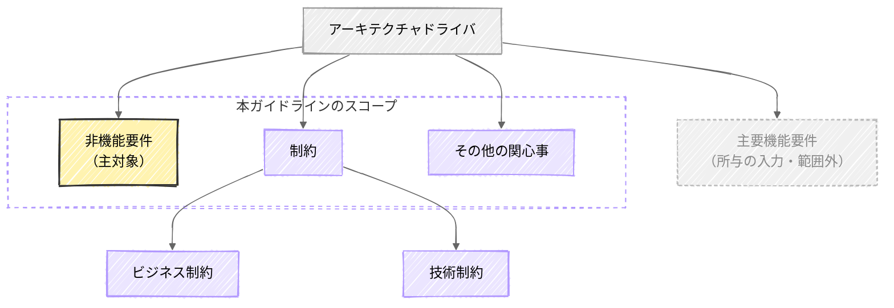
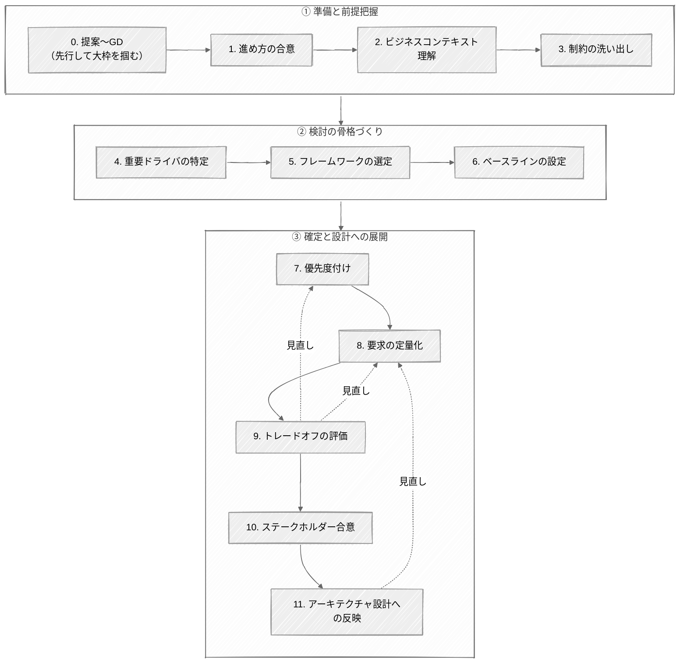

<page-title/>

# What（非機能要件とは何か） {#what}

## 非機能とは

機能と非機能の違いを整理すると、次の通りである。

| 区分   | 説明                                               | ECサイトでの例                                                                                                                                   |
| :----- | :------------------------------------------------- | :----------------------------------------------------------------------------------------------------------------------------------------------- |
| 機能   | システムの具体的な振る舞いやロジックそのもの       | ・商品一覧を取得する ・商品を購入する                                                                                                         |
| 非機能 | その機能がどのような品質で提供されるかを支える特性 | ・【性能】注文の確定結果がすぐ返ってくる ・【可用性】アクセスが多いときもダウンせず購入できる ・【セキュリティ】通信内容が第三者に漏れない |

非機能には、機能と対比した次の2つの性質がある。

- **横断的である**: 個々の機能に一対一で紐づかず、システム全体を横断する関心事である。そのため、画面や機能の洗い出しからは抜け落ちやすい
- **どの程度を問う**: 機能が「実現できる／できない」という二値であるのに対し、非機能は「どれだけ速いか」「どれだけ止まらないか」という度合いを問う。だからこそ、要件は定量的に表現する必要がある

::: tip 非機能に類似する用語  
「非機能」は「品質特性」「アーキテクチャ特性」「イリティ」などとも呼ばれる。各呼称の定義の違いは [Appendix: 非機能に類似する用語](./appendix.md#非機能に類似する用語) を参照。  
:::

::: info 参考  
[非機能テストを記号接地する](https://future-architect.github.io/articles/20260617a/)  
:::

## 非機能要件の位置づけ

システムのアーキテクチャは、いくつかの要因によって方向づけられる。こうした要因をアーキテクチャドライバと呼び、非機能要件はその代表的なひとつである。  
アーキテクチャドライバは次の要素から構成される。

非機能要件以外の要素は次の通りである。

- **主要機能要件**  
  アーキテクチャや技術選定、ひいてはインフラ構成やコストに影響を与えるユースケースを指す。実現のためにシステムの構造が大きく左右される機能が該当する。一見単純に見える機能でも、アーキテクチャを規定するのであれば含まれる。
  - **例1: 巨大ファイルのアップロード:** アプリサーバを経由する通常のアップロードではメモリやタイムアウトに乗り切らないため、S3への署名付きURL方式を採ることが多い。するとリクエストがアプリを通らず従来の同期的なウィルスチェックが効かなくなるため、アップロード後にS3イベントで非同期スキャンを走らせる仕組みや隔離用バケット、専用のネットワーク経路・IAM/バケットポリシーを別途設計する必要が生じ、インフラ構成とコストに波及する。
  - **例2: リアルタイムな通知:** 都度リクエストを投げるHTTPでは要件を満たせず、WebSocket などの常時接続が必要となると話が大きくなる。各接続を保持するステートフルな構成や、スケールアウト時のセッション共有やメッセージ配信のためのPub/Sub基盤、WebSocketに対応したロードバランサまで含めた設計が必要になる。
- **制約**  
  機能要件や非機能要件を実現するうえでの前提条件であり、次の2つに分けられる。
  - **ビジネス制約**: プロジェクトの予算やスケジュール、体制、社内規程、コンプライアンス要件など
  - **技術制約**: 使用する環境（CSP やオンプレ）、言語、フレームワーク、ライブラリの制約やセキュリティポリシーなど
- **その他の関心事**  
  チームメンバーのスキル、組織内のナレッジ、技術の採用実績、プロジェクト規模などが該当する。

### 本ガイドラインのスコープ

本ガイドラインは、アーキテクチャドライバのうち非機能要件を主対象とする。各要素の扱いは次の通りである。

| 要素           | 分類     | 本ガイドラインでの扱い                               |
| :------------- | :------- | :--------------------------------------------------- |
| 非機能要件     | 主対象   | 定義する成果物。                                     |
| 制約           | 考慮対象 | 非機能要件を左右する前提として、洗い出し・考慮する。 |
| その他の関心事 | 〃       | 〃                                                   |
| 主要機能要件   | 対象外   | 入力として参照するに留め、定義自体は範囲外とする。   |

## 非機能要件定義とは

本ガイドラインが対象とする「非機能要件定義」とは、単に品質特性の項目を一覧化する作業ではない。ビジネスの文脈や機能要件、既存の制約を入力・前提として踏まえたうえで、次の3つを行っていく営みである。

1. システムにとって本当に重要な非機能要件（またはアーキテクチャドライバ）を見極める
2. 曖昧な期待を定量的で検証可能な要件へ変換する
3. 関係者間で合意する

限られたコストと期間の中でトレードオフを見極め、何を優先し、何を諦めるかを関係者と合意することが重要である。

# Why（なぜ定義するのか） {#why}

機能要件を定義するだけでは、ビジネスが求めるシステム品質は担保できない。システムがどのような品質・状態で動作するかという非機能要件を明文化し、関係者と合意することには、主に次の5つの目的がある。これらは大きく、要求、実現、継承の3つに分けられる。

## 要求（何を、どれくらいの予算で作るかを決める）

1. **【要件定義】** 機能要件からは導出できない「暗黙の期待」を可視化するため
   - [What章](#what)で述べたとおり、非機能はシステムを横断する関心事で、画面や機能の洗い出しからは抜け落ちやすい。「いつでも使えて当然」といった暗黙の期待を明示的な要件として引き出すことで、「どこまでの品質を作るか」の認識のズレを防ぐ。
2. **【見積もり】** コスト・規模見積もりの根拠を与えるため
   - 性能・可用性・拡張性などの非機能要件は、必要なサーバ規模やサービス構成、冗長化の範囲を左右し、インフラの規模とコストを決める。非機能要件はインフラの償却費や運用委託料に直結する、いわば「費用を決めるもの」でもある。非機能要件が定まって初めて、精度のある費用・体制を見積もれる。

## 実現（正しく作り、保証する）

3. **【設計】** アーキテクチャの構造を決定し、致命的な手戻りを防ぐため
   - 非機能要件、特に性能・可用性・セキュリティ・拡張性は、インフラ構成やミドルウェア選定、データモデルといったシステムの構造そのものを規定する。そのため構築フェーズ以降に変更や追加が生じると、アーキテクチャレベルの見直しに直結し、多大なコスト増や遅延を招く。だからこそ早期に確定させる必要がある。
4. **【テスト】** 品質保証のための「非機能テスト」で客観的な基準を設けるため
   - 要求品質を満たすかの証明には、負荷テスト、セキュリティ診断、可用性テストなどが欠かせない。「レスポンスが速いこと」といった定性的な表現ではなく、「ピーク時の画面表示は90％が3秒以内」といった定量目標を定めて初めて、テスト計画の作成と客観的な合否判定ができる。

## 継承（引き継ぎや刷新に活かす） {#継承}

5. **【保守・刷新】** 保守運用や将来のシステム刷新に引き継ぐため
   - 明文化された非機能要件は、構築時だけでなく、その後の保守運用や次期システムへの刷新でも参照される資産になる。保守体制が交代しても「なぜこの可用性水準・構成なのか」という意図を伝える。リプレイス時には、次期システムの要求水準を定めるベースラインとなる。文書化されていなければ、後任は設計意図を推測で補うことになり、品質劣化や過剰・過小な作り込みを招く。

これら5つの目的を通じて、非機能要件定義は結果として、プロジェクトの実現性やコストのリスクを早期に潰しこむ活動にもなる。

::: tip アジャイル開発の場合  
開発方式が変わっても、ここまでの5つの目的は変わらない。アジャイルでも非機能要件を定義する必要性は失われない。むしろ「動くものを早く出す」を口実に非機能を後回しにすると、アーキテクチャ変更という土台からのやり直しに陥るリスクがある。変わるのは いつ・どの粒度で決めるか であって、実施の要否ではない。  
:::

## テストフェーズとの連携 {#テストフェーズとの連携}

非機能要件は、テストで検証されて初めて担保されたと言える。どの非機能要件が、どのテストで検証されるかの紐づけを理解しておきたい。これにより、次の双方向のチェックができる。

- **要件 → テスト**: 合意しようとしている要件が、テストで検証可能な数値目標になっているかを確認できる
- **テスト → 要件**: テスト計画から逆算して、抜けている非機能要件を洗い出せる

| 非機能要求項目           | テスト種別               | 主な検証項目                                     |
| :----------------------- | :----------------------- | :----------------------------------------------- |
| 可用性                   | 障害テスト               | 冗長性、フェイルオーバー、バックアップ＆リストア |
|                          | DR切替/切戻テスト        | RTO（目標復旧時間）、RPO（目標復旧時点）         |
| 性能・拡張性             | ボリュームテスト         | レイテンシ・限界データ量                         |
|                          | ラッシュテスト           | スループット                                     |
|                          | ストレステスト           | 限界負荷性能                                     |
|                          | スパイクテスト           | 突発負荷性能                                     |
|                          | ロングランテスト         | 耐久性                                           |
| 運用・保守性             | 運用テスト               | 監視アラート、計画停止、縮退稼働                 |
| 移行性                   | 移行テスト               | 環境移行、データ移行                             |
| セキュリティ             | 脆弱性診断テスト         | アプリケーション脆弱性                           |
|                          | ペネトレーションテスト   | 侵入可能性                                       |
|                          | アクセス権限・認証テスト | 権限制御                                         |
| 使用性・アクセシビリティ | アクセシビリティテスト   | 適合レベルごとの達成基準                         |

要件を定義したら、まずはそれがこの表のどこで検証されるかを確かめると良い。対応するテストが思い当たらない場合は、どのようにそれを検証するかをセットで考えるべきである。

# When（いつ合意すべきか） {#when}

非機能要件はいつ合意すべきか。結論から言えば、一度に決めきるのではない。フェーズの解像度に合わせて段階的に具体化し、できる限り早期にすり合わせる "シフトレフト" の考え方で行う。

というのも現場では、非機能要件を決めようとする時に、相反する2つの力が働くためである。

- **早く決めたい**: 非機能はアーキテクチャを規定するため、早期に固めたい
- **まだ決めきれない**: 要件定義の段階ではアーキテクチャ像が定まっておらず、詳細を決めきれない

後者に引きずられて「基本設計で決めればよい」と先送りすると、基本設計で「その要件にはインフラの抜本的な変更が必要」となり、予算超過やスケジュール遅延を招く。だからこそ段階的に、かつ早期に、大枠から見切っていく必要がある。

## フェーズごとの段階的具体化

| \#  | フェーズ                 | 粒度       | このフェーズで決めること               | 主なアクション                                                                                                                                                         |
| :-- | :----------------------- | :--------- | :------------------------------------- | :--------------------------------------------------------------------------------------------------------------------------------------------------------------------- |
| 1   | 提案〜グラウンドデザイン | 方針レベル | アーキテクチャの骨格と大枠の予算・体制 | ・重要ドライバを特定（クラウド/オンプレ、マルチリージョン要否、特別なセキュリティ要件（PCI-DSS準拠）など） ・コストとのトレードオフをビジネス層に提示し期待値を調整 |
| 2   | 要件定義                 | 数値レベル | 開発・テストの基準となる定量目標       | ・網羅的な洗い出し ・曖昧な表現（例: システムが止まらないこと）を定量値へ（例: RPO○時間・RTO○時間） ・利害関係者（開発、インフラ、運用、顧客）間で合意           |
| 3   | 基本設計以降             | 検証・確定 | 定義した要件の実現可能性               | ・PoC・負荷テスト ・セキュリティ診断で継続的に検証 ・現実と乖離すればビジネス側と再調整                                                                          |

全フェーズを通じて重要なのが期待値のコントロールである。確度の低い要件は、幅を持たせる・低めに置くなどしておきたい。実現できるか確かめないまま、背伸びした目標値（例: 可用性99.99％）を「確定」として約束してしまうと、後で下方修正する際に「なぜ下げるのか」の説明コストが大きいためである。目標は、上げる分には受け入れられやすいが、下げるのは難しい。

また、後続フェーズで手戻りが重なると、顧客に「あの時の合意は何だったのか」という不信を生み、信頼関係そのものを損なう。だからこそ、確度に応じて期待値を置き、万が一覆す必要があっても利害関係者へのサプライズを最小限に抑えることを意識すべきである。覆す必要がある場合も、カジュアルに申し出るのではなく、事業前提の変化や実測との乖離といった正当な理由を必ず添えて説明する。

## 合意の場をどう設計するか

非機能要件の合意は、想像以上に時間がかかる。仮に会議で同期的に議論すべき重点項目が20個あり、1項目20分で済むとしても6〜7時間。手戻りやバッファを見込めば十数時間に達する。週1回・1時間の会議なら十数回、2〜3か月に及び、要件定義フェーズに収まりきらない可能性がある。

だからこそ、次の2点が要る。

- **シフトレフト**: 合意の場を要件定義の後半に固めず、可能な限り前倒しで持ち始める
- **メリハリをつける**: 全項目を会議で均等に扱わず、重要な要件は同期で議論し、それ以外は書面・非同期で確認する（重要度による絞り込みは [How章 STEP4](#step4) を参照）

::: tip アジャイル開発の場合  
アジャイルでは、非機能要件を一度に確定させる必要はない。ただし、アーキテクチャを規定する重要な非機能ドライバ（性能・可用性・セキュリティ・拡張性）は、後回しにすると機能開発が誤った前提で積み上がり、後で崩れてしまう。そのため方針レベルでは早期の見極めが必要である。一方で数値目標を全て決めきる必要はない。幅を持たせて、スプリントの反復で継続的に具体化していく。  
:::

# Who（だれが主体で、だれと合意するのか） {#who}

非機能要件は、関係する利害関係者を漏れなく巻き込んで合意形成する必要がある。ただし、非機能要件を決めるモチベーションは通常システム構築側にしかない。そのため、構築側が主体性とオーナーシップを持って、議論をリードしなければならない。

## 巻き込むべき利害関係者

各利害関係者は、非機能要件の前提だけでなく、制約（予算・社内規程・技術標準・コンプライアンスなど）も持ち寄る。制約の出所は、非機能要件とは別の担当者（法務・CCoE・セキュリティ部門など）であることも多い（制約の洗い出しは [How章 STEP3](#step3) を参照）。

| 利害関係者                                   | 役割・提供する情報                                                                                                                                                           |
| :------------------------------------------- | :--------------------------------------------------------------------------------------------------------------------------------------------------------------------------- |
| 業務担当者                                   | 予算を計画し、システム停止時の影響度や業務ピーク時のトラフィック特性（イベントや決算期のアクセス増など）の前提を提示する。                                                   |
| IT部門（情シス）                             | 企業全体のセキュリティポリシー、ネットワークポリシー、全社標準規約、他システムとの連携制約などを提示する。                                                                   |
| セキュリティ部門                             | 全社セキュリティポリシー・規程に基づきリスク評価と承認を担う。昨今は情シスと分離され牽制の立場を取ることが多く、審査に時間がかかるため早めに巻き込みリードタイムを確保する。 |
| 運用保守の引き継ぎ先                         | リリース後に監視・運用する担当として、アラート通知要件、バックアップ頻度、障害時の対応フローなどを提示する。                                                                 |
| （リプレイスの場合） 現行システムの運用者 | トラフィック実績、過去の障害履歴、ボトルネックなど、机上では見えない生きたデータと課題を提供する。                                                                           |

## 担当者を特定し、合意する

利害関係者の"役割"は挙げられても、実際に誰がその役割を担うかは自明でないことが多い。まず役割ごとに該当者を探し、「誰が何に責任を持つか」を関係者間で決めることから始める。

該当者が不明の場合（例: 運用保守の引き継ぎ先が未定）は、構築側が仮説の上で想定を代弁し、後日引き継ぐ前提で進める。

::: tip 決裁権限が顧客の外・上位にあるとき  
顧客が持株会社傘下の事業会社、親会社を持つ子会社、あるいは外資系の日本支社である場合、非機能要件の決裁権限やポリシーが、目の前の顧客ではなく親会社・グローバル本社にあることがある。目の前の担当者と合意しても、上位でひっくり返るリスクがあるため、次を意識する。

- **決裁権限の所在を早期に確認する**: 目の前の担当者が最終決定者とは限らない。上位の承認が要るなら、その承認も合意プロセスに織り込む
- **上位・グローバルの制約を洗い出す**: 全社ポリシー、技術標準、データの居住性、調達ルールなど。見落とすと後で覆る（制約の洗い出しは [How章 STEP3](#step3) を参照）
- **リードタイムを見込む**: 時差・言語・海外の承認プロセスにより、合意・承認には時間がかかる。早めに着手する

:::

## 利害関係者との調整

非機能要件の合意窓口は、提案から要件定義まで、顧客側の同じ推進担当者になることが多い。非機能要件だけを要件定義とは別の担当者に切り出せるのは、リソースの潤沢な組織に限られる。通常は、要件定義を担うその人が非機能要件も扱う。

一方で、フェーズごとに巻き込むべき利害関係者が増えることは多い。

1. **提案〜グラウンドデザイン**
   - 窓口はリード担当者だが、予算・方針は事業責任者・経営層の承認を要する。場合によっては合意形成を促す資料作成を支援することもある
2. **要件定義**
   - 詳細を詰めるため、IT部門・運用部門が加わる場合もある
   - セキュリティ部門の承認は審査プロセスを伴い時間がかかるため、（1）〜（2）で早めに着手する
3. **基本設計以降**
   - 新たな合意相手は出ない。要件はFix済みで、乖離時のみメインの担当者と再調整する
   - （ここで非機能要件が"新たに"決まるのは、要件定義での詰めが甘かったサインである）

後から加わる相手（IT・運用など）には、それまでにリード担当者と合意した内容（優先度・停止影響など）を確実に共有する。また、（2）で誰を巻き込むかは、（1）のうちに段取っておくとよい。

# Where（適用範囲と境界をどう決めるか） {#where}

本章の「Where」は、個々の非機能要件がどこに適用されるか（要件ごとの適用箇所）を指すのではない。一段上のメタな視点である、**そもそも非機能要件を、システムのどの範囲について定義・保証するのか**を扱う。個別の要件を詰める前に、まず「定義の対象範囲」そのものを線引きする章である。

対象範囲は、システム構造の観点で、次の2つを定める。

| 項目         | 内容                                                         |
| :----------- | :----------------------------------------------------------- |
| 対象システム | 自システムと外部との責任分界点（どのシステムまで保証するか） |
| 対象環境     | 本番・検証・開発など、どの環境を、どのような前提で扱うか     |

## 対象システム（責任分界点）

システムは、単独で完結することは少ない。より大きなシステムの一部であったり、外部のシステムに依存していたりする。そのため非機能要件は、システム単体ではなく、こうした周囲との関係で定める必要がある。次の3つの視点で整理する。

### 全体を正とし、自分の範囲へ割り当てる

自分たちの構築範囲がシステム全体の一部（あるマイクロサービスやコンポーザブルな PBC など）である場合でも、まず全体の非機能要件（サービスレベル）を正とする。そこから自分たちの範囲が満たすべき要件を割り当てる。各要素で個別に決めた値を積み上げて全体を決めるのではない。全体のサービスレベルを、それを構成する各要素へ階層的に分解・設計していくことが肝要である。

ただし、割り当てた要件が各要素で実現可能かは、別途ボトムアップに検証する。要件の導出はトップダウン、実現性の確認はボトムアップ、と使い分ける。

### 保証する範囲を多段で整理する

外部に依存しているからといって「そこは範囲外」と切り捨てるのは、プロとして不十分である。外向きも含めて全体像を持ったうえで、保証する範囲を段階的に整理し、合意する。

1. **全体の非機能要件を、設計上は定義する**
   - 外部依存も含めた全体として目指す水準（例: 画面応答はエンドツーエンドで3秒以内）を描く
   - 保証できるか否かは別として、全体像を持つのがプロの責務である
2. **自分たちが保証・検証する範囲を切り出す**
   - そのうち、自システムが責任を持って担保し、非機能テストで検証する範囲を明確にする（例: 自システム内の処理は2秒以内）
3. **外部依存の扱いを決める**
   - 保証できない外部について、前提（外部の SLA・想定応答時間）と、障害時の振る舞い（一緒に止めるか、縮退継続か）を整理して合意する

### 外部に頭打ちされるなら、全体最適でレベルを調整する {#全体最適}

外部連携先に依存し、自分たちで制御できる範囲が限られる場合、自システムの領域だけ非機能レベルを高めても意味が薄い。全体の水準は、制御できない依存先に引っ張られて頭打ちになるためである。

例えば認証を外部IdP（Entra ID、Auth0 など）に依存する場合、IdP が停止すればログインできず、自システムをいくら高可用にしても全体は止まる。こうした依存先は「当たり前」すぎて見落とされやすい。全体の整合を見て、過不足のないレベルに調整する方が、投資対効果が高い。

## 対象環境

非機能要件、特にセキュリティやポリシー系の要件は、すべての環境に一律で適用されるわけではない。各環境が「外部とどれだけ接続しているか」「本番・機密データを扱うか」によって、適用すべき要件の範囲が変わる。

| 環境 | 特徴と要件適用方針                                                                                 |
| :--- | :------------------------------------------------------------------------------------------------- |
| 本番 | 実データ・外部接続・本番利用者が揃うため、要件をフルに適用する。                                   |
| 検証 | オンプレとの接続（専用線など）や実データを扱う場合、セキュリティ要件などは本番同様に適用する。     |
| 開発 | ネットワーク的に隔離され実データを持たないサンドボックスであれば、一部のポリシー制約は緩和できる。 |

環境ごとの前提は、後続フェーズの体制やインフラのボリュームにも直結する。どの要件を、どの環境に、どこまで適用するかを決めるため、各環境について少なくとも次の観点を確認する。

| 項目                   | 確認事項                                                                                                                                                                                                                                                 |
| :--------------------- | :------------------------------------------------------------------------------------------------------------------------------------------------------------------------------------------------------------------------------------------------------- |
| データ                 | 本番データの利用可否、マスキングの要否                                                                                                                                                                                                                   |
| 接続経路               | リモート接続の可否、接続元端末の制限                                                                                                                                                                                                                     |
| オンプレとの接続方式   | 専用線や VPN の要否。特に専用線は開通までのリードタイムが長いため、早期に見極めが必要。                                                                                                                                                                  |
| 監査                   | 監査ログの要否、保存要件（例: 本番は監査ログ必須）                                                                                                                                                                                                       |
| 権限                   | 各環境にアクセスできる担当者の範囲                                                                                                                                                                                                                       |
| クラウドアカウント構造 | ランディングゾーン・発行ルール・ガードレール（SCP など）の有無。新規アカウント作成の可否。 アカウント構造そのものの設計は基本設計の領域だが、要件定義段階ではどんな制約があるかという前提を確認する（発行・承認にリードタイムを要することも多いため） |

# How（非機能要件定義の実施） {#how}

本章では実際どのように非機能要件定義を進めるかを扱う。

## 心得

すべての品質を最高水準にはできない。限られたコストと期間の中で、個々の要件のレベルをどう決めるか。次の順に判断していく。まずトレードオフの構造を理解し（上げすぎには過剰品質という代償がある）、その中で重要な要件を見極め、決めた要件がその先へどう波及するかを見通す。

- **全てはトレードオフである**
  - 非機能要件には「全部を最高レベルで」という選択肢は存在しない。例えば、次のような関係がある
    - 可用性を99.99％まで引き上げれば、冗長化のコストと運用負荷が跳ね上がる
    - レスポンスを極限まで速くしようとすれば、アーキテクチャは複雑化し保守性が犠牲になる
    - セキュリティを強固にすれば、性能やユーザビリティが落ちる
    - 運用の柔軟性を高めれば、統制が緩む
  - ある品質を上げれば、別の品質、コスト、スケジュールのいずれかを必ず犠牲にする。そのため非機能要件を議論する際に避けるべきは、各項目を個別に判断することである。ひとつひとつは正しい判断に見えても、それが積み上がれば実現不可能なシステムになる
  - 要件を検討する際に「その代償として何を諦めるのか」を必ずセットで言語化することが望ましい
- **過剰品質を避ける**
  - 非機能要件は不足ばかりが問題視されるが、過剰も同じくらい大きな問題を引き起こす。念のため可用性を高くする、念のためデータを暗号化するなど、念のための積み重ねは複雑度を上げて開発・運用保守コストが嵩み、リリースまでのスピードを犠牲にする。常に要件の根拠を問い、明確でない場合は過剰である可能性を疑い、必要十分を見極める
- **重要な要件を見つける**
  - 単に非機能要件を一覧化しただけで満足してはいけない。トレードオフを見出した先に必要となるのが「システムにとって本当に重要な非機能要件はどれか」を見極める作業である
  - 重要な要件とは「あったほうがよい」ではなく「これが満たせなければシステムの存在意義が失われる」性質のものを指す。例えば、決済システムにとっての整合性と可用性、HFT（高頻度取引）システムにとってのレイテンシとスループットである
  - 重要な要件を明確にしておくことで、アーキテクチャ設計をはじめとするあらゆる意思決定において、関係者間でブレなく何を優先すべきかをクイックに判断するための土台にできる
  - 業務上のクリティカルな失敗シナリオを想像し、致命傷になり得るケースから非機能要件を逆算すると見えてくることが多い
- **非機能要件定義の先まで見通す**
  - 非機能要件定義は、それ単体で完結しない。決めた要件は、設計・構築・テスト検証へと波及する。要件を決めるときは、それがどんな設計を要し、コストや期間、後のテストにどう跳ね返るかを見通す必要がある。要件から設計を想像できてこそ、実現可能で過不足のない要件になる。逆に過剰な要件は、後工程のコストやスピードとして跳ね返る。その影響をビジネスゴールに照らして示し、抑えることも、リードする側の役割である（→「過剰品質を避ける」）

::: tip 「24時間365日」を安易に受け入れない  
顧客は「24時間365日止めたくない」「無停止更新にしたい」といった要求を、コスト感を伴わないまま口にしがちである。しかしこれらは高コスト・高難易度であり、本当に必要かを疑ってかかる。求められるまま呑む「御用聞き」ではなく、その水準が何を犠牲にするか（コスト・スケジュール・運用負荷）を示し、身の丈に合った現実解へ落とすのがプロの役割である。  
:::

## 手順

非機能要件定義では「膨大な項目の網羅性をどう担保し、合意するか」が難しい。すべてを頭から均等に合意しようとすると時間が足りないので、メリハリをつけて段階的に進める必要がある。

以下に、非機能要件を定義するための思考の順序を示す。提案〜グラウンドデザインで大枠を先行して掴み（[STEP0](#step0)）、要件定義フェーズ以降で各ステップを通して具体化・確定していく。ただし一方通行ではなく、後段の検討や検証の結果を受けて前段へ戻り、見直しながら固めていく（図の見直し矢印）。

### STEP0. 提案〜グラウンドデザイン（先行して大枠を掴む） {#step0}

- 重要ドライバに関連しそうなビジネス上の関心事や大枠の予算・体制といった方針レベルを粗く押さえる（→ [When章](#when)）
- 予算・方針を決める意思決定層を中心に、主要な利害関係者を特定・巻き込む（→ [Who章](#who)）

### STEP1. 進め方の合意 {#step1}

要件定義フェーズの入口として、このフローチャートにあるような進め方そのものを関係者と合意する。

### STEP2. ビジネスコンテキストの理解 {#step2}

非機能要件定義の着手前に、対象とするシステムがビジネス上どのような意味を持ち、どのような前提のもとで何を達成したいのかを明確に理解することが重要である。ビジネスコンテキストを理解せずに定義された非機能要件は判断軸を欠き、妥当性を問われたとき根拠が示せない。

具体的には、次のような観点を押さえておきたい。

| 観点                       | 具体例                                                                                                                                                                                                                                   |
| :------------------------- | :--------------------------------------------------------------------------------------------------------------------------------------------------------------------------------------------------------------------------------------- |
| ビジネスゴール             | このシステムで事業として何を成したいか。「新規事業で顧客数を一気に伸ばす（攻め）」「既存業務のコストを削る（守り）」「老朽システムを刷新し、スピードと保守性を取り戻す」など。攻めか守りかで、可用性・性能・拡張性への投資姿勢が変わる。 |
| ビジネス上のクリティカル度 | 止まったとき事業にどれだけ響くか。「決済・受発注のように、停止が即・売上と信用の毀損に直結する基幹業務」か「社内の情報共有のように、多少の停止は許容される業務」か。                                                                     |
| ユーザ像と利用規模         | 社内数百名の業務利用か、不特定多数の toC 数百万規模か（精緻な数値は [STEP8](#step8) で定量化する）。                                                                                                                                     |
| コストやスケジュール感     | 予算・納期がどの程度タイトか。潤沢か、厳しい上限があるか。                                                                                                                                                                               |
| 新規構築か現行刷新か       | 刷新なら、現行の実績値・障害履歴が使える（→ [Who章「現行システムの運用者」](#who)）。また、既知の課題の解消が焦点になる。新規なら、拠り所となる実績がなく、構築コストと見込み効果のバランスから水準を起こす。                            |

これらは非機能要件定義に着手する段階である程度明確になっていることが多く、関係者間の共通のメンタルモデルとなる。

### STEP3. 制約の洗い出し {#step3}

ビジネスコンテキストを理解したら、次に「すでに存在し、変更できない制約」を早期に洗い出す。[What章](#what)で触れたとおり、制約はビジネス制約と技術制約に分かれる。そのうち予算・スケジュール・体制などのビジネス制約は [STEP2](#step2) で大枠を把握しているとする。ここでは、後から発覚すると手戻りの大きい技術・規程系の制約を中心に押さえる。

なお制約の出所は、非機能要件とは別の担当者であることも多い（→ [Who章](#who)）。

#### 採用技術の事前決定が無いかの確認

教科書的には「非機能要件を定義した後に、それを満たすアーキテクチャや採用技術（例: AWS、Java、PostgreSQL など）を選ぶ」のが理想とされる。しかし実態としては、業界や組織の標準化戦略、既存ライセンス、ベンダーの都合などにより、要件定義の開始時点でコアの技術スタックやミドルウェア（例: JP1 など）が既に決まっているケースが多い。これらは議論の余地のない前提条件となり、後で発覚すると手戻りになるため、初期にこうした縛りがないかを確認する。

::: tip 既存技術スタックという"暗黙の制約"  
明文化された言語・フレームワークの縛りがなくても、既存システムとの整合そのものが事実上の制約になる。周囲がすべて Java なのに、ある部分だけ Python や Go を採ると、運用・保守・要員確保の負荷が上がり、選びにくい。ここには非対称性がある。**既存スタックを踏襲する場合、説明を省略できるが、そこから外れる選択には「なぜそれを選ぶのか」の説明責任が生じる**。この差を意識しておきたい。

新しい技術を試す組織の許容度（予算）は有限である。そのため、顧客組織に馴染みのない技術を導入する場合は、あれもこれもと広げず、効果の大きい領域に戦略的に絞り、前述の説明コストも織り込んだうえで可否を検討する。  
:::

::: tip ベンダーロックイン  
「特定ベンダーにロックインしたくない」「採用は GA 版に限る」「なるべくマネージドや SaaS に寄せたい」といった方針は、明文化されないまま技術選定を縛る、隠れた制約になりやすい。永続性（EOL リスク）への許容度も含め、組織のスタンスとして早期に確認しておく。

ただし、ロックインの回避が無条件で良いことではない。移植性を追えば、マネージドサービスがもたらす保守性・セキュリティ・スピードを手放し、逆にすれば依存は深まる。いずれもトレードオフであり、避けたいという考えを絶対要求にせず、便益と天秤にかけて必要な範囲を見極める（→ 心得「過剰品質を避ける」）。  
:::

#### 規定ドキュメントの確認

顧客組織内に次のような規定ドキュメント（ガイドライン・ポリシー）が存在するかどうかが、その後の検討作業量を大きく左右する。

- クラウド構築ガイドライン（CCoEなどが策定した標準ルール）
- 全社セキュリティポリシー
- システム運用標準基準書

これら規定ドキュメントの有無でアプローチが変わる。

- **ある場合**: 準拠が絶対条件となる。ゼロから非機能要件を考えるのではなく、「規定を遵守した上で、今回のシステム特有の要件をどう上乗せするか」という差分のアプローチをとる。
- **ない場合**: パブリッククラウドのベストプラクティス（AWS Well-Architected Frameworkなど）や、業界標準の基準を拠り所としてアーキテクチャ設計のベースラインを構築する。

### STEP4. 重要ドライバの特定 {#step4}

まず、このシステムで何を最優先するのかという方向を固め、そこからアーキテクチャ設計を左右する重要ドライバへ具体化する。関係者を集めて重点的に議論するのは、この重要ドライバである。それ以外の項目はベースライン（[STEP6](#step6)）や書面確認に委ねて、メリハリをつける。

#### システムのコンセプトを固める

重要ドライバを決めるために有効な問いは、「このシステムのコンセプトは何か？」である。ビジネスコンテキスト（[STEP2](#step2)）を踏まえてこの問いに答えることで、各要件を仮説として立てる際の "どちらへ寄せるか" の指針になる。答えは、例えば次のようなものである。

- 「EC セールのピークに耐える、性能・拡張性ファースト」
- 「絶対に障害で使えない時間を許容できない、可用性ファースト」
- 「運用・拡張のしやすさを最優先」
- 「とにかく情報流出を許さない、セキュリティファースト」
- 「コストをできる限り抑えたい」

コンセプトが定まっていると、要件どうしが競合したときの寄せ方が決まり（例: セキュリティファーストなら、性能と競合したらセキュリティを優先）、トレードオフの初期判断が速くなる（→ 心得「全てはトレードオフである」）。

#### アーキテクチャ設計に効く粒度まで掘る

コンセプトは「性能が大事」で止めず、アーキテクチャ設計の分岐に直結する具体的なレベルまで掘り下げる。ここが曖昧だと、設計フェーズで手戻りになる。

- **性能ファースト** → 処理の非同期化をどこまで許容するか（同期の即時応答が必須か、非同期・結果整合で許容されるか）
- **可用性ファースト** → どこまでの障害を無停止で耐えるか（マルチ AZ 冗長以上の、マルチリージョン／DR まで要るか）
- **セキュリティファースト** → マルチテナントの分離レベルをどこまで求めるか（論理分離で足りるか、DB・インスタンスレベルの物理分離まで要るか）

### STEP5. フレームワークの選定 {#step5}

非機能要件の項目は多岐にわたるため、ゼロから洗い出すのではなく、業界標準の「フレームワーク」をベースラインとして活用することが一般的である。詳細は [Appendix: 非機能フレームワーク](./appendix.md#非機能フレームワーク) を参照。

以下の手順で、検討の出発点とするフレームワークを選ぶ。

1. **既存フレームワークの有無を調査する**  
   顧客（もしくは自社）の組織内で、既に慣習的に利用されているフレームワークがあることも多い。そのため、まずはゼロベースで選定するのではなく、既存資産の流用から始めるのが現実的である。
2. **ドメインのデファクトスタンダードを基準に置く**  
   対象システムが属するドメインにおいて、所与の出発点として扱われるフレームワークがある場合はそれをベースに置く。例えば、国内の一般的な業務システムであれば「IPA 非機能要求グレード」や「ISO/IEC 25010」、政府系システムであれば「デジタル社会推進標準ガイドライン（群）」が該当する。
3. **システムの特性に合わせて足りない観点を補強する**  
   定めたベースを盲目的に採用するのではなく、システムの性質を踏まえて観点をブラッシュアップすることが腕の見せ所である。例えば「IPA 非機能要求グレード」はシステム基盤に特化しているため、エンドユーザ視点やアプリケーション視点（ユーザビリティ、アクセシビリティ、テスタビリティ、オブザーバビリティなど）をカバーしていない。システムの特性上これらが重要な意味を持つ場合は、「ISO/IEC 25010」などから観点を追加で取り込むか、独自項目として補強する。

ここで強調しておきたい。フレームワークは、大きな抜け漏れを防ぐための補完的な道具であって、それに沿って項目を上から埋めていくための台帳ではない。よくある罠は、項目が並んでいるとつい頭から順に埋めたくなり、消化することが目的化してしまうケースである。本来は、本当に重要な要件を見落とさないよう、検討の抜けを点検する網羅性チェックとして用いる。優先順位づけの主役はシステム固有の重要ドライバ（→ [STEP4](#step4)）に据える。

### STEP6. ベースラインの設定 {#step6}

個別の要件レベルを議論する前に、拠り所となる要求レベルのベースラインを仮置きする。ベースラインがないまま項目ごとに議論すると、ゼロから1つずつ妥当性を問うことになり、空中戦になりやすい。

ベースラインには、既存・類似システムの非機能要求や、フレームワーク（[STEP5](#step5)）が用意する標準モデルを使う。IPA 非機能要求グレードなら、3つのモデル（社会的影響度が極めて大きい／大きい／限定的）が用意されている。[STEP4](#step4) で見極めたコンセプト・重要度に最も合うものを選ぶ作業が、これに当たる。

ただし、こうした標準モデルは粒度が粗く、対象システムの実態と噛み合わないことも多い。あくまで初期値・網羅チェックと割り切り、そのまま当てはめない。ベースラインをもとに、システムの性質を踏まえて必要な部分を個別に調整していく。

### STEP7. 優先度付け {#step7}

重要ドライバとベースラインで洗い出した要件・制約を、フラットに扱わず、次の3レベルに分類して関係者間で認識を合わせる。ここで付けた優先度が、後段のトレードオフ評価（[STEP9](#step9)）で「どこを緩められるか」の交渉材料になる。

| 要件レベル | 定義・内容                                                                                                                                                             |
| :--------- | :--------------------------------------------------------------------------------------------------------------------------------------------------------------------- |
| Must要件   | 遵守が絶対条件。満たさなければプロジェクト自体が成立しない（例: 予算の上限、法規制の遵守）                                                                             |
| Should要件 | 強く求められるが、状況によっては交渉や代替案を提示できる条件（例: 目標とするレスポンスタイム）。要件を緩めて構築・ランニングコストを下げられるなら、交渉の余地は大きい |
| Want要件   | 必須ではないが、コストやスケジュールに余裕があれば実現したい条件（例: 将来の拡張に向けたリソース確保）                                                                 |

### STEP8. 要求の定量化 {#step8}

重要ドライバをはじめ、優先度付けした要件を具体的なシステムの目標値へと落とし込む。ここで立ちはだかるのが、「定性的なビジネスの要望を、システムの定量的なロジックに変換し、合意形成に持っていく」という翻訳の壁である。顧客から自然と具体的な数値（TPSやRTOなど）が出てくることは稀である。構築側がロジックを組み立てて合意へ導く必要がある。

#### 基礎数値

定量化の土台となるのが、ビジネス側から引き出す基礎数値である。利用者や業務そのものの洗い出しは機能要件定義で行われている前提で、ここではそれを入力に、非機能に効く数値を押さえる。

| 基礎数値   | 具体例                             | 影響する非機能                         |
| :--------- | :--------------------------------- | :------------------------------------- |
| 規模       | 利用者1万人・拠点50・データ量○TB   | 性能・拡張性（TPS など）の土台         |
| 地理的範囲 | 国内一拠点か、グローバルか         | ネットワーク環境（海外レイテンシなど） |
| 時間的範囲 | 平日日中のみか、24時間365日か      | 担保すべき稼働時間                     |
| ピーク特性 | 通常の何倍か（セール・決算期など） | ピーク時の性能目標                     |

現行システムがあれば、その実績値（トラフィック・障害履歴）が最良の基礎数値になる（→ [Who章「現行システムの運用者」](#who)）。新規構築なら、事業計画から見込みを起こす。

#### ヒアリングのコツ

顧客に「ピーク時のTPSは？」と専門用語で問いかけても、ハレーションを生むだけである。聞き方を工夫し、吸い出した情報を要件へ組み立てる必要がある。

- **目的を説明する**
  - 基礎数値の収集周りで顕著だが、なぜこの質問を受けているかが理解できていないと、協力姿勢にはなりにくい
  - 取得した基礎数値をどの様な目的で利用するか（システム要件に落とし込み、性能検証で担保するため）を必ず示す
- **仮説をもってリードする**
  - 非機能要件は、顧客に「どうしますか？」と受け身で尋ねても出てくるものではない
  - 顧客から具体的な数値が出てこない場合は、構築側から「御社の事業規模と今後の成長率を考慮すると、このような想定値になりますが実態と合っていますか？」と、叩き台となる仮説を必ず提示する。仮説がなければ、要件は引き出せない
- **計算式からストーリーを作る**
  - ビジネス要件から技術要件（TPS など）を導出する計算式を、顧客と共有する。例: 「ピーク時の想定同時接続1,000名 ÷ 10秒に1回クリック = 100 TPS」
  - ただし数値の算出で終わらせない。その数値が「なぜその水準なのか」「満たせない／満たすとシステムや利用者に何が起きるのか」まで語る。単なる穴埋めにせず、腹落ちする合意に持っていく

定量化のゴールは、テストで検証できる数値にすることである。目標値を置いたら、それが [Why章「テストフェーズとの連携」](#テストフェーズとの連携)のどのテストで確認できるかをセットで押さえる。対応するテストを描けない目標値は、定義がまだ曖昧なサインである。

### STEP9. トレードオフの評価 {#step9}

定量化・優先度付けした要件を、個別ではなく全体として突き合わせ、コスト・スケジュールの中で成立するかを評価する。単体で見ると妥当な要件でも、積み上げると実現不可能になることが多い（→ 心得「全てはトレードオフである」）。

評価は次の順で行う。

1. **競合を洗い出す**: どの要件どうしがぶつかるのかを明示する（例: 可用性↑はコスト↑、セキュリティ↑は性能・ユーザビリティ↓）。個別に見ていると気づけないため、一覧にして横断で見る
2. **重要ドライバを軸に裁定する**: 要件が競合したら、[STEP4](#step4) の重要ドライバ・コンセプトに照らしてどちらを立てるかを決める。コンセプトが「セキュリティファースト」なら、性能と競合したときはセキュリティを取る
3. **優先度で緩める要件を選ぶ**: コスト・スケジュールに収まらなければ、Should/Want から緩める。Must には手を付けない。「コスト」が最重要ドライバである場合、他の非機能要件（可用性や性能など）をどこまでShould/Wantに妥協・ダウングレードできるかが、アーキテクチャ設計の鍵となる

それでも全体が破綻する場合は、優先度付け（[STEP7](#step7)）や目標値（[STEP8](#step8)）に戻って水準を調整する。

### STEP10. ステークホルダー合意 {#step10}

評価を通った要件を、関係者と正式に合意し、確定させる。誰と・どの場で合意するかは [Who章](#who)・[When章](#when)を参照。

各目標値は、次の3点を満たして初めて「確定」とする。

1. **業務要求に照らして合理的か**: なぜその水準なのかを、ビジネスの根拠で説明できる
2. **実現可能か**: その値を達成できる設計が、合理的に描けている
3. **未達時に原因を説明し、改善できるか**: 達成できなかったとき、原因を追い、手を打てる

また、合意の対象は目標値そのものだけではない。その値を「どう測るか」という前提も、あわせて決めておく。測り方が曖昧なままだと、同じ実績を前にして達成・未達の判断が食い違う。例えば稼働率ではその計算式を要件合意の時点で明確にしておく（→ 第二部 [可用性](./availability.md)）。

合意した値は、根拠（重要ドライバ・基礎数値・トレードオフの結果）とセットで記録する。後段の設計や将来の保守でなぜこの値になったかを辿れるようにするためである（→ [Why章「継承」](#継承)）。

### STEP11. アーキテクチャ設計への反映 {#step11}

確定した非機能要件を、ドキュメント化して基本設計以降へ引き渡す。設計・検証の中で実現困難が判明したら、要件へフィードバックし、再調整する。
