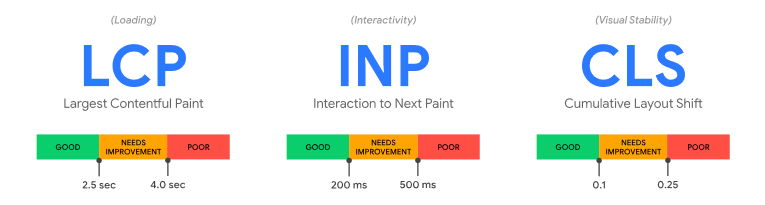
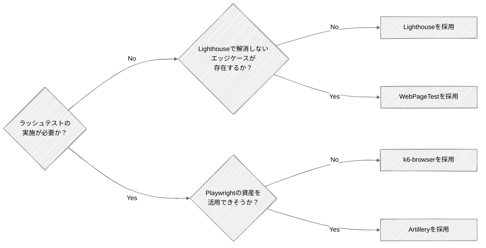

<page-title/>

本ページは、[はじめての性能テスト](./performance_test.md)のAppendixである。

# 画面の性能テスト

画面（UI）の性能テストを実施するかどうかは、システムの特性に応じて判断する。  
一般的にtoB向けの業務システムでは必須ではない。一方、toC向けのWebサービスなどユーザー体験がビジネスの価値に直結する場合は、画面性能指標の目標値を定めた上で性能テストを実施することが望ましい。

テストの分類や計画・準備などの本質的な進め方は、これまで説明してきた内容と変わらない。そのため、ここでは画面の性能テストならではのポイントをいくつか説明する。

## 性能指標

### Web Vitals

画面の性能指標として、処理時間項でも触れているweb.devが定義するWeb Vitalsを紹介する。

Web Vitalsとは、web.devが定義したWebページのユーザー体験を数値化する指標群である。「ページが速く表示されるか」「操作に素早く反応するか」「表示がガタつかないか」といった、ユーザーが体感する品質を客観的に測定できる。Web Vitalsが重要である理由は次の通りである。

- **ユーザー体験に直結する**: 表示が遅い、操作しても反応がない、レイアウトがズレるといった問題は、離脱率や売上に直接影響する
- **SEOに影響する**: GoogleはCore Web Vitalsを検索ランキングのシグナルとして使用しており、スコアが悪いと検索順位が下がり得る

### Core Web Vitals

Web Vitalsの中でも特に重要な3指標をCore Web Vitalsと呼ぶ。

各指標の意味と閾値は次の通りである。閾値は、優れたユーザー体験を提供するために満たす必要がある値として定義されている。

| 指標                                                 | 意味                                                                                                                                                               | 閾値                              |
| :--------------------------------------------------- | :----------------------------------------------------------------------------------------------------------------------------------------------------------------- | :-------------------------------- |
| **LCP（Largest Contentful Paint: 表示速度）**        | ページ内で最も大きなコンテンツ（メイン画像、見出しテキストなど）が画面に描画されるまでの時間。ユーザーが「このページ、表示された」と感じるタイミングに相当する       | ページの読み込み開始から2.5秒以内 |
| **INP（Interaction to Next Paint: 操作への応答性）** | ユーザーがクリック・タップ・キー入力などの操作をしてから、画面が次の描画を反映するまでの時間。ページ滞在中のすべての操作のうち、最も遅いものに近い値が報告される     | 200ms未満                         |
| **CLS（Cumulative Layout Shift: 視覚的な安定性）**   | ページの読み込み中や操作中に、要素が意図せず位置ズレを起こした量の累積値。例えば、記事を読んでいる最中に広告が挿入されてテキストが下にズレるような現象を数値化する | 0.1未満に保つ                     |

多くのユーザーに良好な体験を提供できていると判断するには、モバイル・PCの各デバイスにおいて、ページ読み込みの75パーセンタイル値が上記の閾値を満たしていることが推奨される。

### 推奨指標

性能テストの文脈では**LCPとINPに対して目標値を設定する**ことを推奨する。CLSはユーザー体験の文脈では重要であるが、性能指標とは異なるため対象外とする。

::: tip Web Vitals以外の性能指標

Web Vitalsには他にも性能指標が存在するが、それぞれ次の理由で画面性能指標としては採用しない。

- **FCP（First Contentful Paint）**  
  ページ上で最初のコンテンツ（テキストや画像など）が描画されるまでの時間を表す。FCPはローディングスピナーや空のヘッダーでも発火してしまうため実ユーザーの体感とはズレがあり、LCPで代替可能なため対象外とする。
- **TBT（Total Blocking Time）**  
  FCPの後にメインスレッドが入力の応答性を妨げるほど長くブロックされていた合計時間を表す。ラボ環境（ツールを使用し、一貫して制御された条件でページ読み込みをシミュレートできる環境）で計測する必要がある。有用な指標であるものの実ユーザー環境で測定できるINPで代替可能なため、対象外とする。
- **TTFB（Time to First Byte）**  
  リソースのリクエストからレスポンスの最初のバイトが到着するまでの時間を表す。先述の通り、サーバーとネットワークの性能指標であるため、画面の性能指標としては対象外とする。

:::

## 性能検証ツール

画面の性能検証では、サーバーのレスポンスタイムだけでなく、ブラウザ上でのレンダリングやユーザー操作の体感速度を測定する必要がある。

画面性能指標として推奨しているLCPとINPを測定できるツールを選定する。

決定木で分岐する各ツールについて、適用場面と選定理由は次の通りである。

- **[Lighthouse](https://github.com/GoogleChrome/lighthouse)**  
  ボリュームテストのみを実施する場合に使用し、単機能レベルでのLCP、INPのスコア化を推奨する。[WebPageTest](https://www.webpagetest.org/)や[sitespeed.io](https://www.sitespeed.io/)でも同様の計測はできる。ただし手軽さではLighthouseが一歩抜きん出ている。問題の切り分けや対策もLighthouse単体で十分実施できる。
- **WebPageTest**  
  Lighthouse単体では解消しないエッジケースが存在する場合に、利用を検討する。
- **[k6-browser](https://grafana.com/docs/k6/latest/using-k6-browser/)**  
  ボリュームテストに加えラッシュテストを実施しなければならない場合の第一候補とする。業界標準かつバックエンドテストとの統合が容易である。既にバックエンドの性能テストでk6を使用している場合は、導入コスト・維持コストの低減に繋げやすい。
- **Artillery**  
  k6を使用しておらず、かつPlaywrightの資産・知見を活用できそうな場合に、使用を検討する。ただし、性能テスト用のケースと通常のテストケースが完全一致することは実際には多くない。

各ツールの特徴を比較すると次の通りである。

|                    | Lighthouse                                                                         | WebPageTest                                                                                                                                                        | sitespeed.io                                                                     | k6-browser                                                         | Artillery                                                             |
| :----------------- | :--------------------------------------------------------------------------------- | :----------------------------------------------------------------------------------------------------------------------------------------------------------------- | :------------------------------------------------------------------------------- | :----------------------------------------------------------------- | :-------------------------------------------------------------------- |
| 提供元             | Google                                                                             | Catchpoint                                                                                                                                                         | OSSコミュニティ                                                                  | Grafana Labs                                                       | Artillery Software                                                    |
| 説明               | Chromeで実行できる単体レベルの画面性能検証においてはデファクトスタンダードなツール | Webサービス経由で利用でき、実機と実回線でテストできる本格的な解析ツール                                                                                            | Dockerベースで動作し、継続的なパフォーマンスモニタリングと自動化に特化したツール | k6にChromium制御を組み込んだツール                                 | Playwrightをスケール起動できるNode.js製のフルスタック負荷テストツール |
| ライセンス         | Apache 2.0                                                                         | Polyform Shield 1.0.0                                                                                                                                              | MIT                                                                              | AGPL-3.0                                                           | MPL-2.0                                                               |
| 実行方法           | Chrome DevTools / CLI / Node.js API                                                | Webサービス / プライベートインスタンス / API                                                                                                                       | CLI / Docker                                                                     | CLI / Docker / k6 Cloud / Kubernetes                               | CLI / Docker / Artillery Cloud / AWS Fargate                          |
| 対応端末           | ⚠️ PC                                                                              | ✅️ PC・モバイル実機[^9]                                                                                                                                            | ⚠️ PC（エミュレート）                                                            | ⚠️ PC（エミュレート）                                              | ⚠️ PC（エミュレート）                                                 |
| 対応ブラウザ       | ⚠️ Chromeのみ                                                                      | ✅️ Chrome / Safari / Firefox / Edge                                                                                                                                | ✅️ Chrome / Safari（macOSのみ） / Firefox / Edge                                 | ⚠️ Chromium（Chrome, Edge）系                                      | ✅️ Chrome / Safari / Firefox / Edge                                   |
| LCP/INP計測        | ✅️ 可能                                                                            | ✅️ 可能                                                                                                                                                            | ✅️ 可能                                                                          | ✅️ 可能                                                            | ✅️ 可能                                                               |
| レポーティング     | ✅️ 100点満点のスコアと色分けで非エンジニアにも直感的                               | ⚠️ 詳細なウォーターフォール図中心の専門家向けUI                                                                                                                    | ✅️ Grafana連携により美しいレポート画面を生成可能                                 | ✅️ Grafana連携により美しいレポート画面を生成可能                   | ⚠️ Cloud版または外部ツールでの整形が必要[^10]                         |
| 性能対策立案       | ✅️ 具体的な改善策をTODO形式で提示                                                  | ⚠️ 課題の発見・ボトルネックの特定まで                                                                                                                              | ✅️ Lighthouseなどの評価エンジンを内包                                            | ❌️ 測定結果の提示まで                                              | ⚠️ 課題の発見・ボトルネックの特定まで                                 |
| CIへの組み込み     | ✅️ 公式のLighthouse CI (LHCI)がある                                                | ⚠️ 可能だが大量実行は有料のAPIプランが必要                                                                                                                         | ✅️ CI/CDパイプラインへの統合を前提に設計されており容易                           | ✅️ GitHub Actionsなどの公式アクションが豊富であり容易              | ✅️ GitHub Actionsなどの公式アクションが豊富であり容易                 |
| ラッシュテスト対応 | ❌️ なし                                                                            | ❌️ なし                                                                                                                                                            | ❌️ なし                                                                          | ✅️ 可能                                                            | ✅️ 可能[^11]                                                          |
| 導入コスト         | ✅️ Chromeがあれば即時利用可能                                                      | ⚠️ Web上の公開テストは即時利用可能だがプライベート環境構築は手間                                                                                                   | ⚠️ Docker・Grafanaなどの知識が必要                                               | ⚠️ シナリオ作成と実行環境準備が必要                                | ⚠️ シナリオ作成と実行環境準備が必要                                   |
| 価格               | ✅️ 無料                                                                            | ⚠️ APIの大量利用やプライベート環境構築などのPro機能は有料                                                                                                          | ✅️ 無料                                                                          | ✅️ ツール自体は無料、実行環境の費用は発生                          | ⚠️ ツール自体は無料、実行環境やSaaS版の費用は発生                     |
| GitHubスター数     | 29.9k                                                                              | 3.2k                                                                                                                                                               | 5.0k                                                                             | 29.4k[^12]                                                         | 8.9k                                                                  |
| ユースケース       | コストを掛けずに画面性能検証を行いたい場合                                         | Lighthouseでは解決しない性能問題の原因を分析したい場合 / 自社プロダクトと競合プロダクトの速度を比較したい場合 / 一連のユーザージャーニーでボトルネックを探りたい場合 | CIで継続的に性能を確認したい場合                                                 | バックエンドの性能テストでk6を利用しており、高負荷を再現したい場合 | Playwrightを利用しており、高負荷を再現したい場合                      |

## チューニング

画面の性能テストにおけるチューニングでは、ネットワーク転送量を削減し、キャッシュを活用する。  
システム全体としては、アプリケーションロジックやデータベースレイヤーがボトルネックとなることが多い。そのため、それらの対応を検討した後、更なるチューニングの必要があれば実施する。

### データ転送量の削減

#### コンテンツ圧縮

HTML/CSS/JavaScript/画像などの静的リソースを圧縮して送信する。  
2026年4月時点ではgzipよりも圧縮率の高いBrotliに対応しているブラウザも多く、導入が推奨される。

::: tip Brotli

Brotliは2015年にGoogleがWeb向けに公開した圧縮アルゴリズムである。圧縮率はトップクラスであり、圧縮レベル次第ではgzipよりも高い圧縮効果を発揮する（テキスト系ファイルでは15％〜25％程度軽量化できる）。

主要なブラウザでもBrotliエンコーディングに対応しており、多くのCDN（Amazon CloudFront、Google Cloud CDN、Azure CDN）でも圧縮形式としてサポートしている。

:::

#### 画像の最適化

JPEGやPNGの代わりに、より圧縮率の高いWebPやAVIFを使用する。  
また、デバイス（スマホ・PC）に合わせて適切なサイズの画像を出し分ける（`<picture>` タグや `srcset` 属性の活用）。

詳細は「[Webフロントエンド設計ガイドライン \- 画像](https://future-architect.github.io/arch-guidelines/documents/forWebFrontend/web_frontend_guidelines.html#%E7%94%BB%E5%83%8F)」を参照されたい。

#### コードのMinify

Minifyによりファイルサイズを縮小する。Minifyでは、CSSやJavaScriptから不要な改行、スペース、コメントを削除し、変数名や関数名を短く置き換える。

詳細は「[Webフロントエンド設計ガイドライン \- Minify](https://future-architect.github.io/arch-guidelines/documents/forWebFrontend/web_frontend_guidelines.html#minify)」を参照されたい。

### キャッシュの活用

#### CDNの活用

HTML/CSS/JavaScript/画像などの静的リソースをエッジサーバーにキャッシュし、物理的に最も近いサーバーから応答を返却させる。

#### ブラウザキャッシュの制御

HTTPヘッダーの `Cache-Control` を適切に設定し、静的ファイルはブラウザに長期間キャッシュ（有効期限を長く設定）させる。

`ETag` や `Last-Modified` を用いて、ファイルに変更がない場合は「304 Not Modified」を返し、ダウンロードをスキップさせる。

詳細は「[Webフロントエンド設計ガイドライン \- キャッシュ](https://future-architect.github.io/arch-guidelines/documents/forWebFrontend/web_frontend_guidelines.html#%E3%82%AD%E3%83%A3%E3%83%83%E3%82%B7%E3%83%A5)」を参照されたい。

### ネットワーク通信の最適化

#### 画像の遅延読み込み（Lazy Load）

画面のファーストビュー（スクロールせずに見える範囲）に入っていない画像は、スクロールして近づくまで読み込みを遅延させる（`` の活用）。

#### HTTP/2またはHTTP/3の導入

HTTP/2・HTTP/3では、1つのコネクションで複数のリソースを並列して送受信（多重化）できるため、通信のオーバーヘッドを大幅に削減できる。

Amazon CloudFrontなど主要なCDNを用いている場合は設定変更のみでHTTP/2・HTTP/3化でき、導入自体は簡易である。実施の際は、次の理由からHTTP/2とHTTP/3双方の有効化を推奨する。

- **HTTP/2の弱点**: 通信環境が極端に悪い場合、一部のパケットのロスが発生すると、そのパケットが再送されるまで同一コネクション内の全てのデータ通信が一時的に停止してしまう
- **HTTP/3による解消**: HTTP/3ではこの問題が解消されており、双方を有効化することでHTTP/2のデメリットを補える

あわせて、並列リクエストによるメリットを活かすため、配信するファイルの粒度も次の通り調整する。

- CSSやJavaScriptを巨大な単一ファイルとしてビルド・配信するのではなく、分割して配信することを推奨する
- ただし、むやみに数百個まで分割すると先述のgzipやBrotliの圧縮効率が下がるため、過度な分割は避ける

# チェックリスト

## A. 計画時チェックリスト

テスト計画から準備完了までに確認すべき項目をまとめている。  
各項目は「決まっているか」「ステークホルダー間で合意できているか」の両面で確認することが望ましい。

### A-1. 目的とスコープ

- [ ] 性能テストの主目的が明確になっている（複数選択可）
  - [ ] 性能指標値の評価
  - [ ] 安定性・信頼性の評価
  - [ ] スケーラビリティの評価
  - [ ] 最適なキャパシティプランニング
  - [ ] その他
- [ ] 主目的に重みづけがされており、優先順位が明確である
- [ ] テスト対象システムの範囲が明確である
  - [ ] 外部システム / 共通基盤との連携の扱いが決まっている（含める / 含めない / スタブで代替）
  - [ ] フロントエンドの扱いが決まっている（含める / 含めない）

### A-2. システム諸元

- [ ] データ諸元が定義されている
  - [ ] DBの全テーブルについてレコード件数の見積もりがある
  - [ ] 取り扱うファイルの最大 / 平均サイズが定義されている
  - [ ] 何年後の状態（例. 3年後、5年後）を基準とするかが決まっている
- [ ] 負荷諸元が定義されている
  - [ ] 通常時 / ピーク時 / スパイク時など状態別に値が定義されている

### A-3. 目標値

#### スループット

- [ ] 算出根拠が明確である（既存システムのアクセスログ / 想定ユースケースなど）
- [ ] 安全係数（例. 2倍、3倍）が考慮されている
- [ ] 負荷状態（通常時 / ピーク時など）ごとに値が定義されている

#### 処理時間（オンライン処理）

- [ ] 業界標準の指標値（例. TTFB 800ms）やベースラインシステムを参照して妥当な値が定められている
- [ ] 機能特性ごとに目標値が細分化されている（コア系 / 標準系 / 管理系、参照 / 更新など）
- [ ] パーセンタイル値（例. p90、p95）で順守率が定められている
- [ ] 負荷状態（通常時 / ピーク時 / 縮退時）ごとに順守率が調整されている

#### 処理時間（バッチ処理）

- [ ] バッチウィンドウを基準に上限が決まっている
- [ ] 順守率は「再実行の余裕があるか」など運用面を含めた基準になっている

#### リソース使用率

- [ ] 対象コンポーネント（APサーバー、DBサーバー、キャッシュサーバーなど）ごとに定義されている
- [ ] CPU使用率、メモリ使用率は最低限定義されている
- [ ] 上限値（例. 通常時50-60％、ピーク時80％以下）が定義されている
- [ ] 下限値（過剰スペックを避けるため、例. ピーク時30-40％以上）が定義されている
- [ ] オートスケールのトリガー閾値と整合が取れている
- [ ] ワンショットのバッチサーバーについては「使い切る」前提の目標が別途定められている

### A-4. テストの段取りと完了基準

- [ ] 実施するテスト種別と順序が決まっている（推奨: ボリューム → ラッシュ → ロングラン → ストレス）
- [ ] スパイク性のあるシステムの場合、スパイクテストの実施が計画されている
- [ ] 各テストの完了基準（合格基準）が定義されている
- [ ] 各テストの対象機能 / シナリオが選定されている
  - [ ] ボリュームテストの対象機能が選定されている（原則全機能、優先度付け基準も明確）
  - [ ] ラッシュ / ロングラン / ストレスの対象シナリオが選定されている（スループット算出時の根拠と整合）
  - [ ] バッチ処理を含む時間帯のシナリオが組み込まれている
- [ ] 各機能 / シナリオの試行回数の方針がある（オンライン100回以上が目安）

### A-5. ツール選定

- [ ] 負荷ツールが選定されている
  - [ ] CI/CD組み込みやコード管理のしやすさが考慮されている
  - [ ] 想定する最大負荷を生成できる
- [ ] モニタリングツールが選定されている
  - [ ] APMの要否、外部監視サービスの可否を踏まえた判断になっている
  - [ ] 本番運用で利用するツールと揃えられている

### A-6. メトリクス

- [ ] インフラメトリクス（CPU、メモリ、ネットワークI/O、ディスクI/Oなど）が定義されている
- [ ] 利用するクラウドマネージドサービス固有のメトリクスが定められている
- [ ] DBメトリクスが定義されている（スロークエリ、待機イベント、コネクション状況など）
- [ ] ランタイムメトリクスが定義されている（ヒープ、GC、スレッド数など）
- [ ] サービス / アプリケーションメトリクス（Rate / Errors / Duration）が定義されている

### A-7. テスト環境

- [ ] 本番環境または同等構成の環境が確保されている
- [ ] 環境を占有して利用できる
- [ ] 本番同等のスペック・台数で構成されている
- [ ] 必要に応じて並行作業用に複数環境が確保されている

### A-8. スケジュール

- [ ] 計画 / 準備工数が、実行 / チューニング工数と同等以上に確保されている
- [ ] 長時間実行ケース（ロングランなど）の再実行リスクを織り込んだバッファがある
- [ ] 不確実性の高い特性（新規システム、複数処理方式の混在、マルチテナント、外部連携多数など）を踏まえたバッファがある
- [ ] テスト同士で相互影響するもの（例. ストレステストとロングランテスト）の並行実施を避けた計画になっている

### A-9. 環境構築・設定

- [ ] 負荷ツールを動かすコンピューティングリソースが構築されている
- [ ] 負荷ツールから各種リソース（DB、S3、SQSなど）へのリーチャビリティが確保されている
- [ ] ログレベルが本番相当（INFO以上が一般的）に設定されている
- [ ] キャッシュの有効化 / 無効化方針がテスト種別ごとに定められている
  - [ ] HTTPキャッシュの方針が定められている
  - [ ] アプリケーションキャッシュの方針が定められている
  - [ ] DBキャッシュの方針が定められている
- [ ] オートスケールの有効化 / 無効化方針がテスト種別ごとに定められている

### A-10. データ準備

- [ ] データ作成方法が決定されている（本番エクスポート / ファイルインポート / 手続き型SQL / INSERT / 実機能利用）
- [ ] 大量データ作成時の事前準備が検討されている
  - [ ] インデックス / 外部キー制約の一時削除が検討されている
  - [ ] DBスペックの一時増強が検討されている
  - [ ] autovacuumの停止と完了後のANALYZE/VACUUMが検討されている
- [ ] データパターンが現実的である
  - [ ] カーディナリティ（取りうる値のバリエーション）が適切である
  - [ ] スキュー（特定キーへの偏り）が現実に即している
  - [ ] 関連テーブルの件数比率が実態に近い

### A-11. テストスクリプト

- [ ] 事前処理 / テスト本体 / 事後処理が分離されている
- [ ] 計測対象に事前 / 事後処理の時間が混入しないようになっている
- [ ] 繰り返し実行可能（冪等）になっている
  - [ ] 一意制約のあるカラムに動的な値が生成されている
  - [ ] 事後処理またはリストアでクリーンアップ可能になっている
- [ ] 現実的な負荷パターンが再現されている
  - [ ] 思考時間が挟まれている
  - [ ] リクエストパラメータが分散されている（キャッシュヒット率の過大評価を防ぐ）

### A-12. その他の準備

- [ ] スタブが用意・有効化されている（外部依存がある場合）
  - [ ] 独立プロセス / サーバーとして稼働させる構成が原則となっている
  - [ ] 一定の遅延を含む応答を十分なスループットで返せる
- [ ] メトリクスダッシュボードが用意されている
  - [ ] 詳細モニタリング（例. CloudWatch Container Insights、RDS Database Insights）が有効化されている
  - [ ] DBの拡張機能（例. pg_stat_statements、auto_explain）が有効化されている
- [ ] 素振り（負荷ツールでのウォームアップ実行）が完了している
  - [ ] 目標RPSの数倍まで安定して負荷生成できる
  - [ ] VUに余裕がある / ファイル記述子やマシンリソースに余裕がある
- [ ] クラウドのクォータ緩和申請が必要に応じて完了している（実施1〜2週間前）
- [ ] DDoS的な負荷テストの場合はクラウド事業者への申請が完了している

## B. 実施後チェックリスト

各テスト実施後とレポーティング段階で確認すべき項目をまとめている。

「結果が完了基準を満たしているか」と「結果を正しく評価できるだけの情報が揃っているか」の両面で確認する。

### B-1. ボリュームテスト

- [ ] 対象機能の処理時間が目標値をクリアしている
- [ ] バッチ処理についてはスループット（必要な場合）も目標値をクリアしている
- [ ] 機能単位の処理時間内訳が把握できている（ネットワーク / アプリ / DB / 外部呼び出し）
- [ ] 問題箇所・改善余地のある箇所に対し分析・チューニングが行われている
- [ ] SQLの実行計画が確認され、インデックスや作業メモリの最適化が行われている
- [ ] 試行回数が十分（オンラインは100回以上を目安）に確保されている
- [ ] 最終確定したインフラ構成で再計測が行われている（構成が途中で変わった場合）

### B-2. ラッシュテスト

#### 性能指標値

- [ ] 全負荷パターン（通常時 / ピーク時 / 縮退時）で処理時間とスループットが目標値をクリアしている
- [ ] 機能単位で見ても、ボリュームテスト時からの劣化が許容範囲内である
- [ ] 同時アクセスに伴う性能劣化部分について分析・対応が行われている

#### リソース・エラー

- [ ] リソース使用率が目標値の範囲内に収まっている（上限・下限の両面）
- [ ] 同時アクセスに伴う意図しないエラーが発生していない
- [ ] エラー内訳が分析され、設計上許容されるものか異常かの切り分けができている
- [ ] メッセージキューを介した非同期処理がある場合、メッセージが滞留せず捌けている

#### キャパシティプランニング

- [ ] 性能要件を達成できる最小限の構成が比較検証されている
- [ ] APサーバーとDBサーバーなど、変数を1つずつ動かして比較検証されている
- [ ] スケールアップとスケールアウトの比較がされている（水平スケール優先が原則）

### B-3. ロングランテスト

#### 性能指標値

- [ ] 全期間にわたって処理時間・スループットが目標値をクリアしている
- [ ] 開始区間と終了区間の比較で劣化していない
- [ ] エラー率が時間とともに悪化していない

#### 安定性・信頼性

- [ ] メモリ使用率に右肩上がりの推移がない
- [ ] アプリケーションランタイムメモリ（ヒープなど）の時系列推移を確認し、リーク兆候がない
- [ ] DBコネクション、アプリケーションスレッドが枯渇せず、適切に解放されている
- [ ] GC（特にFull GC）の頻度・実行時間が極端に上がっていない
- [ ] 期間中に動くべき定期バッチが想定通り動作している
- [ ] テスト実行時間が、システムの連続稼働サイクル（または定期リフレッシュ間隔）を網羅している

### B-4. ストレステスト

#### スケーラビリティ

- [ ] 現行構成における限界性能（限界RPSなど）が特定できている
- [ ] 限界到達時のボトルネックコンポーネントが特定できている
- [ ] ボトルネックを増強することで性能が実際に向上することが検証できている
- [ ] 限界性能を超えた場合の増強ステップ（順序・対象）が整理されている

#### オートスケール

- [ ] スケールアウト・スケールインのトリガー閾値が期待通り発動している
- [ ] 閾値・継続期間・クールダウンの設定が、負荷変動スピードに対して適切である
- [ ] 新規ノードの立ち上がり時間が負荷増加スピードに追従できている
- [ ] スケールイン時のグレースフルシャットダウンが正しく動作している
- [ ] スケール上限・下限の設定値が妥当である

### B-5. レポーティング

#### 全体構成

- [ ] テスト概要が記載されている（目的、スコープ、カテゴリ、要件・目標値）
- [ ] 各テスト（ボリューム / ラッシュ / ロングラン / ストレス）の結果がそれぞれ整理されている

#### 各結果の品質

- [ ] 統計値（min/avg/p50/p80/p90/p95/max）が目標値とともに表形式で整理されている
- [ ] 時系列推移が必要な箇所はグラフキャプチャが添付されている
- [ ] グラフ上の異常箇所・気になる箇所には注釈・考察が補記されている
- [ ] 機能単位 / シナリオ単位の粒度で分析されている
- [ ] エラーが発生している場合、内訳と原因・対応方針が整理されている
- [ ] リソース使用状況がコンポーネント別に整理されている

#### ロングラン特有

- [ ] ランプアップ / ランプダウンを避けた区間で開始 / 終了の比較が行われている
- [ ] アプリケーションランタイムメモリの時系列グラフが添付されている
- [ ] GCの頻度・実行時間の推移が記載されている

#### キャパシティプランニング

- [ ] 各構成パターンの比較検証結果が表形式で整理されている
- [ ] 採用構成の選定根拠（性能要件達成・コスト効率）が明確である

#### 残存リスクと将来の見通し

- [ ] 限界性能と、将来的な負荷増加に対する増強ステップが明記されている
- [ ] 残存するリスク（未解消のチューニング項目、想定外の挙動など）が明文化されている

[^9]: US/EU/Asiaなどの粒度で実行ロケーションを選択できる他、5G/3Gなど回線を選ぶこともできる

[^10]: v2.0.22からCLIのHTML出力機能が削除されており、視覚化にはArtillery Cloudへ生データの送信またはGrafanaなど外部ツール連携が必要

[^11]: k6がネイティブで動くのに対し、ArtilleryはNode.jsで稼働する分負荷を掛ける側のリソース効率は劣る

[^12]: 2026.3時点ではk6本体に統合されており、k6のスター数を記載
