<page-title/>

::: warning 免責事項

- 有志で作成したドキュメントである。フューチャーには多様なプロジェクトが存在し、それぞれの状況に合わせて工夫された開発プロセスや高度な開発支援環境が存在する。本ガイドラインはフューチャーの全ての部署／プロジェクトで適用されているわけではなく、有志が観点を持ち寄って新たに整理したものである
- 相容れない部分があればその領域を書き換えて利用することを想定している。プロジェクト固有の背景や要件への配慮は、ガイドライン利用者が最終的に判断すること。本ガイドラインに必ず従うことは求めておらず、設計案の提示と、それらの評価観点を利用者に提供することを主目的としている
- 掲載内容および利用に際して発生した問題、それに伴う損害については、フューチャー株式会社は一切の責務を負わないものとする。掲載している情報は予告なく変更する場合がある

:::

# はじめに

性能はシステム全体の品質やユーザの利用体験を左右するため極めて重要である。

リリース直後にアクセスが集中してサイトが動かなくなったり、大量のデータ処理が終わらずに翌朝の業務に支障が出たりといったトラブルは後を絶たない。これらはすべて性能の問題であり、性能問題は性能テストによって事前に検出し、対処しなければならない。通常の機能テストとは別に「性能テスト」という専用の工程が必要とされるのは、机上での予測や開発環境での確認だけでは本番稼働時のリスクを排除できないためである。

しかしながら、性能テストは機能テストに比べて「何をどこまでやればいいのか」という基準が曖昧になりがちであり、場当たり的な実施に留まってしまうケースも少なくない。本ガイドラインは、性能テストの計画から実行、分析に至るまでの実践的なプロセスについてまとめたものである。

本ガイドラインの目的は次の通りである。

- 性能テストの経験がない人でも、ステップバイステップで手順を理解し、現場で実践できるようになる
- これまでなんとなく性能テストを実施していた人が、用語や考え方を体系的に理解し、理論にもとづいたテストを実践できるようになる

# 前提

本ガイドラインが想定しているシステムや環境は次の通りである。

## 対象システム

本ガイドラインはWebアプリケーションの性能テストを前提として記述している。具体的には、エンドユーザ（ブラウザ）からのHTTPリクエストを起点とするオンライン処理や、それらに付随して発生する非同期処理、裏側のバッチ処理等を想定している。

全体として主にサーバサイドの性能検証に焦点を当てているが、Webフロントエンドの性能（例. JavaScriptの実行速度、レンダリング速度）なども一部切り出して説明する。

## インフラ環境

オンプレミス環境ではなくAWS等のパブリッククラウド環境を想定している。

ただし、本ガイドラインに記載されている考え方の大部分はオンプレミス環境でも適用できるものである。オンプレミス固有の考慮事項などは、適宜補足を入れた上で説明する。

# 性能テストとは

## 性能テストの位置づけ

システムにおける「性能」とは、そのシステムがいかに効率よく安定して処理をこなせるかの能力である。性能テストとはさまざまな条件のもとで、この能力を評価するプロセスとなる。

性能はシステムにおいて「機能」ではなく「非機能」といわれる特性であり、性能テストは非機能テストの一種である。

非機能テストには性能テストのほか、アクセシビリティテスト、ユーザビリティテスト、セキュリティテスト、運用テストなどがある。

## 性能テストの分類

性能テストは、その実施条件と目的にもとづいていくつかの種別に分類できる。

前提として、性能テストの分類について一意的なものはない。さらに言えば性能テストという言葉自体も解釈に揺れがあり、負荷テストと同等の意味で使われることもあれば、負荷テストとは異なる別のテストを意味することもある。

本ガイドラインにおいては、性能に関するあらゆるテストを包括する概念として「性能テスト」という言葉を使用し、性能テストをその実施条件や目的に応じて5つに分類する。

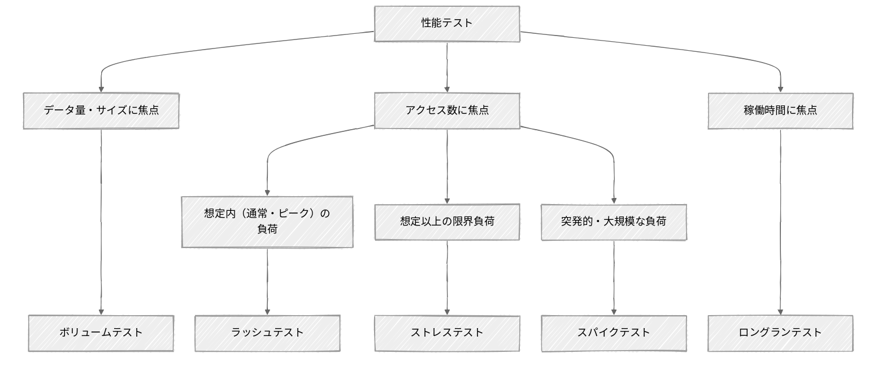

- **ボリュームテスト**  
  システムに対して大量のデータ（巨大なファイルやデータベースの大量レコードなど）を与え、システムがどのように動作するかを確認するテストを指す。同時アクセス数の負荷ではなく、純粋な「データ量」や「データサイズ」に焦点を当て、仕様で定められた限界データ量を処理する能力があるかを検証する。
- **ラッシュテスト（負荷テスト）**  
  システムに対して通常時、ピーク時に想定される負荷（同時アクセス数）をかけ、処理時間やスループットといった性能指標が要件や目標値を満たすことを確認するテストを指す。
- **ロングランテスト（耐久テスト）**  
  システムに対して一定の負荷を長時間（数時間～数日間）かけ続け、システムが安定して動作するかを確認するテストを指す。主に、長時間の稼働によってリソースの容量に問題が発生しないこと（例. メモリリークが発生しないか、DBコネクションやスレッドプールが枯渇しないか）を確認する。
- **ストレステスト（限界テスト）**
  システムが想定している以上の負荷（同時アクセス数や処理データ量）に対してどのように動作するかを確認するテストを指す。通常時、ピーク時の負荷を超えた場合のアプリケーションの動作を検証するとともに、システムがどれだけの負荷をサポートできるかを判断する。
- **スパイクテスト**  
  システムに突発的かつ大規模なトラフィック（同時アクセス数）の増加に対して、正常に動作するか、その後定常状態に戻るかを確認するテストを指す。例えば有名アーティストのチケットの販売やブラックフライデーなどのECキャンペーンなど、例外的なトラフィック量を伴う可能性があるシステムにおいて有用なテストとなる。

:::tip 性能テストのそのほかの分類

前述の通り、性能テストの分類や位置づけは、参照するガイドラインや書籍によって異なる。

ここでは参考として、ソフトウェアテスト分野における代表的な3つの文献で定義されているテストカテゴリを紹介する。

[**ISTQB/JSTQB（Foundation Level Specialist シラバス 性能テスト担当者）**](https://jstqb.jp/dl/JSTQB-SyllabusFoundation-PTSpecialist_Version2018.J01.pdf)

ISTQB/JSTQBの「Foundation Level Specialist シラバス 性能テスト担当者」は、ISTQB/JSTQBが2018年にリリースしたシラバスであり、性能テストの専門家向けに国際標準の基礎知識を体系化したものである。当シラバスでは、性能テストをあらゆる性能関連のテストを包括する用語と位置づけたうえで、テストの目的に応じて8つのカテゴリに分類[^1]している。

- **性能テスト（Performance Testing）**: システムやコンポーネントがさまざまな負荷にさらされたときの性能（応答性）に焦点を当てたあらゆるタイプのテストを含む包括的な用語
- **負荷テスト（Load Testing）**: 同時使用ユーザやプロセスによって生成される、予想される現実的な負荷レベルの増加に対応するシステムの能力を確認するテスト
- **ストレステスト（Stress Testing）**: 想定された限界に達した、あるいは限界を超えたピーク負荷や、リソースの可用性が低下した状況において、システムが処理する能力を確認するテスト
- **拡張性テスト（Scalability Testing）**: 現在指定されている性能要件に違反することなく、将来的なシステム成長（ユーザ数やデータ量の増加など）に対応する能力を判断するテスト
- **スパイクテスト（Spike Testing）**: 突然のピーク負荷に対してシステムが正しく応答し、その後、定常状態に戻る能力を確認するテスト
- **耐久テスト（Endurance Testing）**: 長期間の運用における安定性に焦点を当て、時間経過による性能低下や故障（メモリーリークなど）がないかを検証するテスト
- **コンカレンシーテスト（Concurrency Testing）**: 特定のアクションが同時に発生する状況（例. 多数のユーザによる同時ログインなど）がシステムに与える影響を確認するテスト
- **キャパシティテスト（Capacity Testing）**: 規定の性能目標を満たしつつ、システムがどれだけのユーザ数やトランザクション数をサポートできるかを判断するためのテスト

[**The Art of Software Testing**](https://a.co/d/0afdP1XG)

The Art of Software Testing（ソフトウェア・テストの技法）は、1979年に初版が発行されたソフトウェアテスト分野の名著である。当書籍ではシステムテストを15のカテゴリに分類しており、そのうち4つが性能に関するテストとして定義されている 。

- **性能テスト（Performance Testing）**: 特定の負荷においてプログラムがレスポンス要件やスループット要件を満たすかを確認するテスト
- **ボリュームテスト（Volume Testing）**: プログラムに通常時よりも大量のデータを与えた状態での挙動を確認するテスト
- **ストレステスト（Stress Testing）**: プログラムに通常時よりも大きな負荷（短期間に発生するアクティビティ）をかけた状態での挙動を確認するテスト
- **ストレージテスト（Storage Testing）**: プログラムが、システム（メモリ）および物理（ディスク）の両方におけるストレージ（記憶領域）の要件を正しく管理できているかを確認するテスト

[**Performance Testing Guidance for Web Applications**](<https://learn.microsoft.com/en-us/previous-versions/msp-n-p/bb924357(v=pandp.10)>)

Performance Testing Guidance for Web ApplicationsはMicrosoftによって2007年に作成された、Webアプリケーションの性能テストを体系的に実施するための包括的なガイドブックである。当ガイドブックでは性能テストは4つのカテゴリに分類されている。

- **性能テスト（Performance Test）**: 速度、スケーラビリティ、安定性を判断または検証するテスト
- **負荷テスト（Load Test）**: 通常時およびピーク時の負荷条件におけるアプリケーションの動作を検証するテスト
- **ストレステスト（Stress Test）**: 通常時やピーク時の負荷を超えて限界まで追い込まれた際のアプリケーションの動作を検証するテスト
- **キャパシティテスト（Capacity Test）**: パフォーマンス目標を満たしつつ、システムがどれだけのユーザ数やトランザクション数をサポートできるかを判断するためのテスト

:::

## 負荷の状態

システムの負荷状態は、通常時、ピーク時、スパイク時という「負荷の大きさ」による分類と、想定内の負荷、想定外の負荷という「予測可能性」による分類で整理されることが多い。

重要なのは、対象となるシステムの負荷状態を適切にパターン化し、関係者間で共有することである。例えばピーク時を想定内と考える人がいる一方で、ピーク時は通常時とは異なるのだから想定外と考える人がいるなど、解釈がばらつきやすいためである。パターンに応じて性能テストとしての合格基準や対応方針も変わり得るため丁寧にすり合わせる必要がある。

一般的な例として負荷の状態を次のように分類できる。

| 負荷の大きさ                                         | 予測可能性      | 例                                                  |
| :--------------------------------------------------- | :-------------- | :-------------------------------------------------- |
| 通常時（日常的に発生する平均的な負荷）               | 想定内          | 平日10:00\~17:00 平均500リクエスト/秒               |
| ピーク時（週末や夜間など定期的に訪れる最大の負荷）   | 想定内          | 毎月1日8:00\~9:00 平均2000リクエスト/秒             |
| スパイク時（非常に短期間において急激に発生する負荷） | 想定内 / 想定外 | 年2回の大型セール開始後10分間 最大5000リクエスト/秒 |

これはあくまで一例である。スパイクといっても、SNSでの拡散やDDoS攻撃などによる予測不可能なスパイクもあれば、ブラックフライデーのようなセールによる、ある程度予測可能なスパイクも存在する。また、通常時やピーク時といわれる中にもいくつかのパターンが存在し得る。

システムの特性に応じてパターンを見極め、定義することが望ましい。

::: tip 負荷という用語

システムにとっての負荷とは「システムの処理リソースを消費する要因」のことである。

この負荷は実行時に発生する動的な負荷と常に存在する静的な負荷に分類できる。

- **動的負荷**
  動的な負荷とは、実行時に発生し、終われば消える負荷を指す。これはさらに「頻度」と「規模」に分けて考えることができる。
  - 頻度：アクセス数やリクエスト数
  - 規模：1回あたりにやりとりされるペイロードサイズ/ファイルサイズ
- **静的負荷**
  静的な負荷とは、実行の有無にかかわらず、システムが常に抱えている負荷を指す。主にデータベースに蓄積されているデータ量が挙げられる。

このようにシステムに「負荷をかける」といってもいくつかの解釈がある。Web APIによるオンライン処理であればアクセス数を増やすことを意味するかもしれないし、ファイルを処理するバッチ処理であればファイルサイズを大きくすることを意味するかもしれない。

性能テストの文脈で **「負荷」という言葉を使うときは、その解釈が揺れないよう具体的に何を意味するのかを明示することが重要** である。

:::

## 性能指標

システムの性能を測る指標として代表的なものは「処理時間」と「スループット」である。

単純に「システムの性能が2倍改善された」といっても、処理時間が改善されたのか、スループットが改善されたのかで、その意味は異なるため、正確に違いを理解する必要がある。

### 処理時間

処理時間とは、その言葉の通り、ある処理の開始から終了までに要した時間のことである。この処理時間は、レイテンシ、レスポンスタイム、ターンアラウンドタイムなど、さまざまな用語で表現される。

ここではフロントエンドとバックエンドが分離した一般的なWebアプリケーションのオンライン処理を例として、処理時間がどのように定義されるのかを説明する。

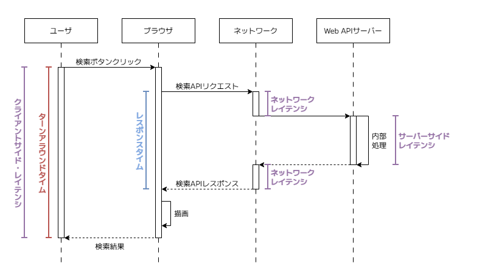

:::tip 用語定義の難しさ

注意すべきなのは、これらの用語には一意的な定義が存在しない点である。

文脈に応じて同じ意味で使われることもあれば、違う意味として区別されることもあり、さらに人やツールによって解釈が異なることも珍しくない。そのため、性能テストを計画・実行するにあたっては、これらの用語そのものに頼ることなく **「どの地点からどの地点までの処理時間を指しているのか」という定義を関係者間で共通認識として持つことが必要** である。

:::

#### レイテンシ

レイテンシとはデータの転送や処理における「遅延」や「待ち時間」を表す。レイテンシが高いという場合は遅延が大きく、低いという場合は遅延が小さいことを意味する。ネットワークの文脈では、データが送信元から送信先に到達するまでにかかる時間[^2]のことを指す。ネットワークレイテンシの計測においては、クライアントがリクエストを送信し、サーバからレスポンスを受信するまでにかかるラウンドトリップ時間（RTT: Round Trip Time）などが用いられる。

一方でSREの文脈では、レイテンシという言葉は単なるネットワークの遅延にとどまらず、サービスがリクエストを受けてからレスポンスを返すまでにかかる時間全体を指す指標として扱われる。また、この文脈でのレイテンシは計測するポイントによってその意味合いが異なる。

サーバサイド・レイテンシは、サーバ上で計測できるレイテンシであり、サーバがリクエストを受け取ってからレスポンスを返却するまでの内部の処理時間を指す。クライアント・レイテンシは、クライアント（ブラウザやアプリ）上で計測できるレイテンシであり、ネットワーク遅延や画面描画を含めた、ユーザが実際に体感する遅延に近い指標を指す。

#### レスポンスタイム / ターンアラウンドタイム

レイテンシに似た用語として、レスポンスタイムとターンアラウンドタイムがある。

レスポンスタイムとターンアラウンドタイムはISO/IEC 25023の中で時間効率性を表す指標として登場する。一般的に、レスポンスタイムとは、ユーザやシステムがリクエストを与えてからレスポンスが返るまでの時間を指すのに対し、ターンアラウンドタイムとは一連の処理の開始から完了までの時間を指す。

リクエスト・レスポンスを伴う処理においては基本的に「レスポンスタイム \< ターンアラウンドタイム」となる。例えばブラウザからWebページを要求する処理の場合は、Webサーバにリクエストを投げてからレスポンスとしてWebページが返却されるまでの時間がレスポンスタイムとなり、さらにそこからブラウザがWebページをレンダリングしてユーザに表示するまでを含めた時間がターンアラウンドタイムとなる。

::: tip バッチ処理における処理時間

複数のバッチ処理を束ねたJOBフローからなるバッチ処理における処理時間は次のとおりである。この例ではバッチ処理はワンショットタスクとしてコンテナで起動され、各バッチ処理はワークフローエンジンによってオーケストレーションされる。

この場合、コンテナ管理サービスにコンテナの起動依頼を投げてから、対象のコンテナが終了するまでをバッチ単位のターンアラウンドタイムと呼び、全てのバッチ処理の開始から終了までをJOBフロー全体のターンアラウンドタイムと呼ぶ。

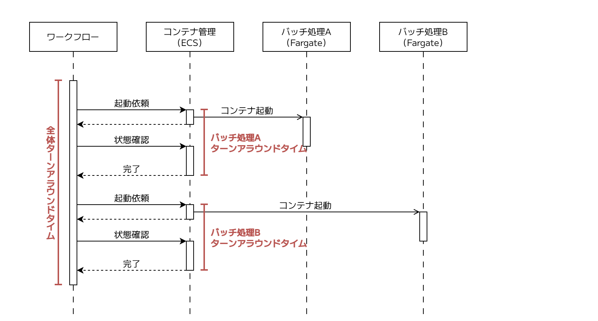

:::

### スループット

スループットとは単位時間当たりの処理量を表す。処理時間が「1つの処理に何秒かかるか」という応答性の指標であるのに対し、スループットは「秒間どれだけの処理をこなせるか」という処理能力の指標である。

スループットは、何を測定の対象とするかに応じて異なる単位で計測される。

#### リクエスト・スループット

オンライン処理において、もっとも一般的に用いられるスループットの指標であり、1秒あたりに処理できるリクエスト数を意味するRPS（Requests Per Second）という単位で表される。TPS（Transactions Per Second）という単位も同じような意味で利用されるが、複数のリクエストを束ねる業務処理単位としてのトランザクションを明確に指す場合のみTPSという単位を用いることが望ましい。

#### メッセージ・スループット

メッセージキューを介した非同期処理においては、単位時間当たりに処理できるメッセージ数（Messages Per Second）などがスループットの単位として用いられる。プロデューサーの視点に立つと、秒間どの程度のメッセージをキューに送信できるか、コンシューマーの視点に立つと、秒間どの程度のメッセージを処理しきれるかを表す。

#### バッチ・スループット

バッチ処理においては、単位時間あたりに処理できるデータ件数（1000万件/時間）やデータサイズ（10GB/時間）がスループットの単位として用いられる。バッチ処理を制御するワークフローエンジンがある場合、ワークフローエンジンの視点では単位時間あたりに処理できたタスクやJOB数がスループットとなる。

::: tip 処理時間とスループットの関係

処理時間とスループットには[リトルの法則](https://ja.wikipedia.org/wiki/%E3%83%AA%E3%83%88%E3%83%AB%E3%81%AE%E6%B3%95%E5%89%87)といわれる関係性がある。

```txt
同時処理数 = スループット × 処理時間
```

スループットと同時処理数は似て非なる概念である。

例えば、システム同時処理数が4の状況において、各リクエストが2秒で処理されている場合、スループットは 4 / 2 \= 2 RPSとなる。

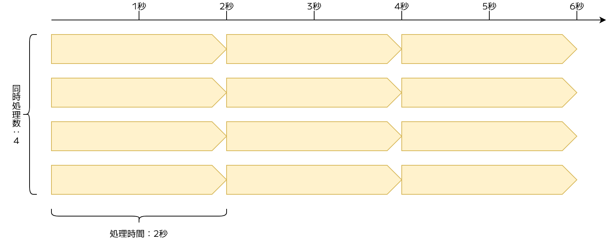

:::

## 性能テストのステップ

性能テストは、単にツールで負荷をかけるだけの作業ではない。計画から始まり、環境構築、実行、そして結果のレポーティングに至るまで、一連のプロセスを経て効果を発揮する。

本ガイドラインでは、性能テストの工程を以下の5つのステップに分けて解説する。

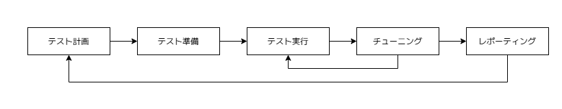

1. **テスト計画**: テストの目的、目標値、完了基準、スケジュールなど、テストを実施していくための計画を立案する。
2. **テスト準備**: テスト計画にしたがってテスト実施に必要な環境やスクリプトを準備する。
   具体的には、環境構築、データ準備、テストシナリオの作成などが挙げられる。
3. **テスト実行**: システムに負荷をかけ、各種性能指標を測定する。
4. **チューニング**: テスト実行中に取得したログやメトリクスからボトルネックを特定し、改善を実施したうえで再テストを実施する。
5. **レポーティング**: 一連のテストの実行結果を評価し、システムが本番運用に耐えられるかを報告する。
   あわせて、将来的な拡張性や残存するリスクについても明文化する。

なお、これらのステップは一度実施して終わりではない。各ステップを繰り返し行き来し、PDCAサイクルを回しながら精度を高めていくことが重要である。

# テスト計画

テスト計画の策定にあたって、考慮すべきポイントをいくつか示す。

## 目的を明確にする

テスト計画を策定するにあたって、まずは性能テストを何のために実施するのかを明確にする必要がある。

性能テストの代表的な目的は次の通りである。

| 分類           | 目的                           | 説明                                                                                                                                         |
| :------------- | :----------------------------- | :------------------------------------------------------------------------------------------------------------------------------------------- |
| ユーザ体験     | 性能指標値の評価               | システムの性能指標（処理時間やスループット）の計測値が要件や目標値を満たしているかを確認する                                                 |
| ユーザ体験     | 安定性・信頼性の評価           | 長時間稼働や急激な負荷変動に対しても、システムが異常終了せずに性能レベルを維持しつつ安定して動作し続けるかを確認する                         |
| システム最適化 | スケーラビリティの評価         | 将来的な成長によりユーザ数やデータ量が増大した際に、システムがスケール性を備えているか、どの部分をスケールさせれば性能が向上するかを確認する |
| システム最適化 | 最適なキャパシティプランニング | 性能要件を満たすための、コスト効率の良い最適なインフラ構成（スペックや台数）を導出する                                                       |

必ずしもここに挙げた全てを目的とする必要はない。プロジェクトに応じて、どの目的に重きを置くかを明確にすることが重要である。例えば、システムのリリースを最優先とする場合、本番想定の条件下での性能要件の達成（性能指標値の評価）に焦点を絞り、キャパシティプランニングの最適化は最低限に留めることも選択肢となる。

なお、これらの目的を達成するための具体的な手段として、分類した各種性能テストを次のようにマッピングできる。具体的にどのような順序でテストを進めていくべきかついては「[テストの段取りと完了基準を定める](#テストの段取りと完了基準を定める)」 にて説明する。

| 目的                           | ボリュームテスト | ラッシュテスト | ロングランテスト | ストレステスト | スパイクテスト |
| :----------------------------- | :--------------: | :------------: | :--------------: | :------------: | :------------: |
| 性能指標値の評価               |        ✅        |       ✅       |        ✅        |       ❌       |       ❌       |
| 安定性・信頼性の評価           |        ❌        |       ❌       |        ✅        |       ✅       |       ✅       |
| スケーラビリティの評価         |        ❌        |       ❌       |        ❌        |       ✅       |       ✅       |
| 最適なキャパシティプランニング |        ❌        |       ✅       |        ❌        |       ✅       |       ❌       |

## テスト対象となるシステムの範囲を明確にする

システムのどこからどこまでをテストの対象とするのかを明確にする必要がある。

性能テストは通常、システムの大部分を含むことになるため、何を含めるかというよりは、何を含めないかがポイントになる。

しばしば論点になるのは次の点である。

- **外部システムや共通基盤との連携**  
  性能テストのスコープには原則含めない。特に無許可で負荷をかけた場合、攻撃とみなされたり、高額な利用料金やシステムダウンなど意図せぬ影響を及ぼしたりする可能性が高い。例外的に、社内の別システムなど、連携先システムが性能テスト用の環境を提供している場合は、調整の上テストスコープに含める形も取り得る。
- **フロントエンドとの連携**  
  バックエンドの性能検証に焦点を当てる場合、一般的には後述する負荷ツールを用いてHTTPリクエストを直接サーバに投げるため、フロントエンドは含めない。ただし、画面のレンダリングやネットワークのレイテンシを含めたエンドツーエンドの体感速度を測ることが求められる場合は、バックエンドとは別スコープとして切り出したうえで個別に実施をすることが望ましい。

システムが複数の独立したサブシステム（サービス）から構成される場合は、一度に全てをひとまとめにするのではなく、サブシステムの単位で性能テストを実施してから全体を統合するというようにスコープを段階的に広げていく考え方も有効である。

## システム諸元を明確にする

システムにおける諸元とは、そのシステムの動作の前提条件となる具体的な仕様・数値のことである。

通常、システム諸元は要件定義の段階で定められるべきものだが、性能テスト計画の段階において、テストシナリオやテストデータに落とし込めるレベルの具体化が必要になることもある。性能テストの観点で重要になる諸元は次の通りである。

### データ諸元

システムが扱うデータの規模を指す。

具体的にはデータベースのレコード数や取り扱うファイルのサイズ（最大サイズ/平均サイズ）が挙げられる。データ諸元を定義する際は、システムが稼働から一定期間（例. 3年後、5年後）経過し、データが蓄積された状態を前提とし、可能な限りデータベースの全テーブル・取り扱う全ファイルのデータ規模を見積もった上で、テスト環境で再現することが望ましい。なお、既に稼働しているシステムが存在する場合は、本番環境のデータベースからデータの量や増加率を算出できる。

どちらのアプローチを取るにしても、性能テストとしてどの地点のデータ量を基準としてテストを実施するのか明確に定める必要がある。

### 負荷諸元

システムに対して外からどのような負荷がかかるのかを指す。

具体的には同時利用ユーザ数、同時アクセス数などが挙げられる。各数値は通常時、ピーク時、スパイク時など、負荷の状態と合わせて見積もることが望ましい。

:::tip 同時○○数

同時○○数という言葉は、解釈が揺れやすいので明確に定義する必要がある。

- **同時利用ユーザ数**  
  ある期間において、システムを利用しているユニークユーザ数を指す。
  「1分間にシステムにログインし、画面を開いているユニークユーザ数は10万人である」というように「期間」や「利用とみなす状態」を明確に定義することが望ましい。
- **同時接続数**  
  サーバがある瞬間に物理的に処理・維持しているコネクション数を指す。
  Webサーバやデータベースなど何に対するコネクションかを明確に定義することが望ましい。
- **同時処理数**  
  システムにおいて、ある瞬間にアクティブに処理を実行している処理数を指す。
  「処理時間とスループットの関係」で述べた通り、同時処理数はスループットとは異なる。同時処理数 \= スループット x 処理時間となる。

:::

## 目標値を明確にする

目標値は、性能テストにおける明確な合否の判定基準となる。

### スループット

スループットの目標値の定義にあたっては、処理時間の定義と同様、既に稼働している類似システムやリプレイス前の旧システムが存在する場合は、そのアクセスログ等から通常時やピーク時のスループットを算出し、利用することが望ましい。

ベースラインとなるシステムのスループットと同様のレベルを目指すのか、あるいは将来的な処理量の増加を見越してN倍を目指すのかによって、算出した値を補正する。ベースラインとなるシステムが存在しない場合は、負荷諸元となっている同時利用ユーザ数と想定ユースケース等から算出する。

::: info 例: タスク管理システムを題材にケース

- 1日（業務時間8時間）あたりの利用ユーザ数は約10,000人
- 1回の利用において （1）タスクの一覧検索を2回、（2）タスクの詳細検索を10回、（3）タスクのステータス変更を5回実施する
- 月初は8時～9時の1時間に利用が集中する

このような場合、目標となるスループットは次のように算出できる。

- 通常時スループット: 10,000人 × 17リクエスト / 8時間 / 3600 ≒ 5.9 RPS
- ピーク時スループット: 10,000人 × 17リクエスト / 1時間 / 3600 ≒ 47.2 RPS

なお、実際は8時間や1時間といった時間枠の中でもアクセスに波があるため、安全係数（例. 2倍や3倍）を掛け合わせた値を目標値とすることが一般的である。

- 通常時スループット: 5.9 RPS × 安全係数 2 \= 11.8 RPS
- ピーク時スループット: 47.2 RPS × 安全係数 2 \= 94.4 RPS

:::

### 処理時間

処理時間の目標値を定めるにあたってはいくつかのポイントがある。

#### （1） 目標値そのものの妥当性

目指すべき処理時間に絶対的な基準はない。例えば低遅延が命となる高頻度取引（HFT）やリアルタイム性の高いオンラインゲームのようなシステムであれば数十ms以内のレスポンスタイムが求められるのに対し、バッチ処理の結果照会や複雑な条件によるデータ検索であれば数百ms～数秒程度、あるいはそれ以上の待ち時間であっても許容されるなど、その基準は大きく異なる。

目標値を定義するにあたっては、いくつかのアプローチが考えられる。

はじめに、既に稼働している類似システムやリプレイス前の旧システムが存在する場合は、そのシステムの処理時間を測定し、それをベースラインとする。これにより、現行より処理時間を悪化させないという最低限の品質保証が可能になる。

このようなベースラインが利用できない場合は、業界標準の指標値を参考にすることができる。例えばGoogleが運営する[web.dev](https://web.dev/articles/ttfb?hl=ja)では、リソースのリクエストからレスポンスの最初のバイトが到達するまでの時間をTTFB（Time To First Byte）として定め、適切なスコア値を次のように定めている。

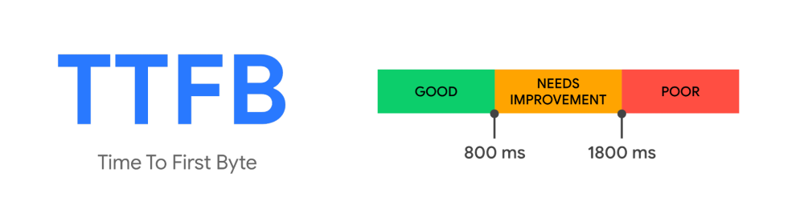

- 800ms未満 ：良好 （GOOD）
- 1800ms未満 ：要改善（NEEDS IMPROVEMENT）
- 1800ms以上 ：不良（POOR）

800msという目標値は多くの一般的なオンライン処理にとって厳しすぎる値ではなく、また易しすぎる値でもないと考えられるため、この数値をベースラインとして採用することは客観的な妥当性を確保する上では有効な手段である。ほかにもAPIのモニタリングツールを提供する[Odown](https://odown.com/blog/api-response-time-standards/)の記事では、Web APIの種類別に目安となる目標レスポンスタイムが紹介されている。

数値そのものの妥当性は議論の余地があるが、性能テストの担当者として、標準的なWeb APIは数百ms程度のレスポンスタイムが期待されていることを感覚値として持っておくことは重要である。

#### （2） 機能特性や負荷状態に応じた目標値

処理時間の目標値は一律ではなく、機能の重要度や特性、およびシステムが置かれている負荷状態に応じてきめ細かく設定することが望ましい。

前者の機能の重要度や特性という点に関しては、システムの核となる決済処理や注文登録といったミッションクリティカルな機能には厳しい目標値を設定する一方、レポート出力や管理画面の検索といった管理系の機能には、ある程度緩やかな目標値を許容するといった調整が必要である。また、データの整合性確保のためにオーバーヘッドが生じやすい更新処理と高速な応答が期待される参照処理では、その特性に合わせて個別に目標値を設定するのが一般的である。後者については、先述した負荷の状態（例. 通常時、ピーク時など）に応じて目標値を定めることが望ましい。

一般的には目標値そのものを個別定義するのではなく、後述する順守率を状態に応じて調整することが多い。例えばオンラインレスポンスであれば「通常時は95パーセンタイルで目標値が満たせること、ピーク時は90パーセンタイルで目標値が満たせること」という具合である。

#### （3） 目標値の順守率

オンライン処理においては、処理時間の目標値を平均値や最大値で定義するのではなく、パーセンタイル値（Percentile）として定義するのが一般的である。

平均値は、一部の極端に応答が速いリクエストや遅いリクエストの両方に数値が左右されてしまうため、大多数のユーザが実際に体験している待ち時間を正確に捉えられない。また、最大値もネットワークの瞬断といったアプリケーション側で制御不能なたった1回だけの遅延によってテスト全体が不合格判定となるリスクを孕んでおり、実態を評価する基準としては厳格すぎて現実的ではない。

そこで「95パーセンタイルが500ms以内」と定義することで、突発的なノイズ（5％）を許容しつつ、ほぼ全てのユーザに対して目標のパフォーマンスを保証できているかを評価できるようになる。

#### 目標値の設定例

（1）、（2）、（3）のポイントを踏まえて処理時間の目標値を定めるサンプルは次の通りである。

ここでは機能をミッションクリティカルなコア系、通常の機能である標準系、管理者向けの機能である管理系に分類し、さらにオンライン処理については取得系の処理なのか更新系の処理なのかで目標値を定めている。この分類はシステムの特性に応じて個別調整が必要である。

なお、計画段階できめ細かく目標値を設定することは望ましいが、処理時間の見通しについて不確実性が大きいのであれば期待値コントロールの観点から目標値に幅を持たせておく（例. 300ms〜800ms）ことも考えられる。ここで定めた目標値がステークホルダーの期待値となるため、後から目標値を変更することは困難であり、目標値を満たせなかった場合の説明責任も伴うためである。

オンライン処理の目標処理時間（例）

| 分類      | 操作   | 目標値 | 順守率（通常時） | 順守率（ピーク時） | 順守率（縮退時） |
| :-------- | :----- | :----- | :--------------- | :----------------- | :--------------- |
| コアAPI   | 取得系 | 300 ms | p95              | p90                | p80              |
| コアAPI   | 更新系 | 500 ms | p95              | p90                | p80              |
| 標準API   | 取得系 | 500 ms | p90              | p80                | p60              |
| 標準API   | 更新系 | 800 ms | p90              | p80                | p60              |
| 管理系API | 取得系 | 800 ms | p90              | p80                | p60              |
| 管理系API | 更新系 | 800 ms | p90              | p80                | p60              |

::: tip IPA 非機能要求グレードにおける性能要件

IPAの非機能要求グレード2018における性能目標値の項目は次の通りである。

オンラインレスポンス、バッチレスポンスのそれぞれにおいて、負荷の状態（通常時、ピーク時、縮退時）に応じて目標値の順守率を定める形式（= ポイント（3））となっており、具体的な目標値は特定の機能またはシステム分類毎に決めておくことが望ましい（= ポイント（2））とされている。

このことから（1）、（2）、（3）のポイントをおさえた目標値の定義ができるようになっていることがわかる。

ただし先述したとおり、システムにおける負荷状態のパターンは必ずしも通常時、ピーク時、縮退時の3つで表現できるとは限らないため、システムの特性に応じて適切なパターンを設定することが望ましい。

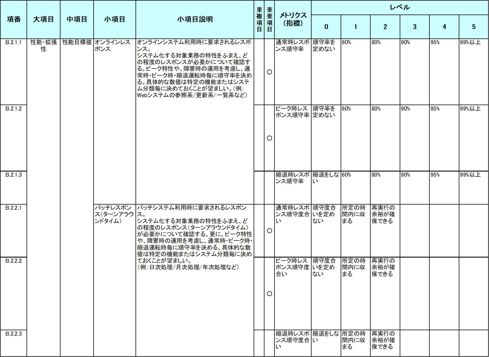

:::

::: tip バッチ処理における目標値の考え方

ここまではオンライン処理を前提に説明してきたが、バッチ処理は性質が異なるため、目標値の決め方にもいくつかの違いがある。ポイントは次の通りである。

- **目標処理時間はバッチウィンドウを基準に定める**  
  バッチの処理時間に関しては、バッチウィンドウ（バッチ処理のために利用できる時間）を基準に目標値を定めることが一般的である。例えば「0時から4時までの4時間以内に処理を完了させる」といった具合に、後続処理や業務開始時刻との兼ね合いから上限が決まる。
- **順守率はパーセンタイルではなく、ウィンドウへの収まり具合で定める**  
  バッチ処理の目的は、決められたバッチウィンドウ内に全件の処理を完了させることにある。そのため、個々の処理時間をパーセンタイルで評価するのではなく、処理時間がバッチウィンドウにどの程度の余裕をもって収まるか（例. 所定の時間に収まる / 再実行の余裕がある）を判断基準とする。

バッチ処理の目標処理時間（例）

| 分類       | 目標処理時間          | 順守率（通常時）         | 順守率（ピーク時）       | 順守率（縮退時） |
| :--------- | :-------------------- | :----------------------- | :----------------------- | :--------------- |
| コアバッチ | 4時間以内（0時～4時） | 再実行の余裕が確保できる | 再実行の余裕が確保できる | \-（縮退しない） |
| 標準バッチ | 8時間以内（0時～8時） | 所定の時間に収まる       | 所定の時間に収まる       | \-（縮退しない） |

:::

### リソース使用率

処理時間やスループットが目標値を満たしていても、その裏でCPUやメモリといったリソースが常時ひっ迫しているような状態では、わずかな負荷変動で性能が大きく劣化したり障害に至ったりするリスクがある。ただし、リソース使用率は低ければ低いほど良いというわけではない。

ピーク時にもリソースが大幅に余っている状態は、インフラ構成が過剰でコスト効率が悪いことを示唆する。そのため、リソース使用率には適正なレンジを目標値として定めることが望ましい。

#### 対象リソース

リソース使用率の目標値は、システムを構成するコンポーネントごと（アプリケーションサーバ、DBサーバ、キャッシュサーバなど）に定めることが望ましい。

目標値を定める対象は**CPU使用率、メモリ使用率を最低限必須**とする。これらはどのコンポーネントでも共通して重要であり、目標値として定量化しやすい。

::: tip

オンプレミス環境ではディスク使用率も目標値として定めることが多かった。

一方、クラウド環境ではアプリケーションサーバをステートレスに設計するのが一般的であり、データベースのストレージも自動拡張される構成が主流であるため、ディスク使用率を性能目標値として定める必要性は低い。

:::

#### 目標値の考え方

リソース使用率の目標値は、上限と下限の両面から定める。

- **上限値の目安**<br>
  上限側の目標値は、突発的な負荷変動を吸収するための余裕を確保する観点で定める。例えばCPU使用率が常時90％で推移している状態は、処理としては成立していても、一時的なアクセス急増に対して残されたキャパシティが乏しく、容易に性能劣化や障害に至る。一般的な目安としては通常時は50〜60%程度、ピーク時でも80%を超えないように設定することが多い。
- **下限値の目安**<br>
  ピーク時にもリソース使用率が極端に低い（例. CPU使用率が10％にも満たない）状態は、インフラ構成が過剰であることを示しており、コスト効率の観点から見直しの余地がある。特にクラウド環境では従量課金のため、過剰なスペック・台数はそのまま運用コストに直結する。ピーク時に最低でも30〜40%程度のリソース使用率に達する構成を目指す。

なお、オートスケールを構成している場合は、スケールアウト・スケールインそれぞれのトリガー閾値と目標値の整合を取る必要がある。 目標値と乖離していると、目標値を満たす前に過剰にスケールアウトが発動したり、リソースが大幅に余っていてもスケールインが発動しなかったりする。

::: tip ワンショットのバッチサーバはリソースを使い切ることが望ましい

先述した「通常時50〜60％、ピーク時でも80%以下」という目安は、オンライン処理のように継続的にリクエストを受け付けるサーバを前提としたものである。突発的な負荷変動に備えるための余裕を確保することが目的であり、常時余裕を持たせる必要がある。

一方、処理の開始時に起動して処理が終われば停止するワンショットのバッチサーバ（例. ECS RunTask）では、考え方が逆になる。処理中に外部からの突発的な負荷を受けることはないため、CPUを100％近くまで使い切ることがむしろ望ましい。使い切れていない場合は、並列度が不足している（マルチコアを活かせていない）か、I/O待ちでCPUが遊んでいる可能性が高く、処理時間の短縮余地があることを示している。

:::

## テストの段取りと完了基準を定める

テストの目的を達成するためにどのテストをどの順序で実施していくかを定める必要がある。

多くのケースに適用できる進め方として、先述した[テストの分類](#性能テストの分類)をベースに「1. ボリュームテスト」「2. ラッシュテスト」「3. ロングランテスト」「4. ストレステスト」の順序で進めていくアプローチを推奨[^3]する。

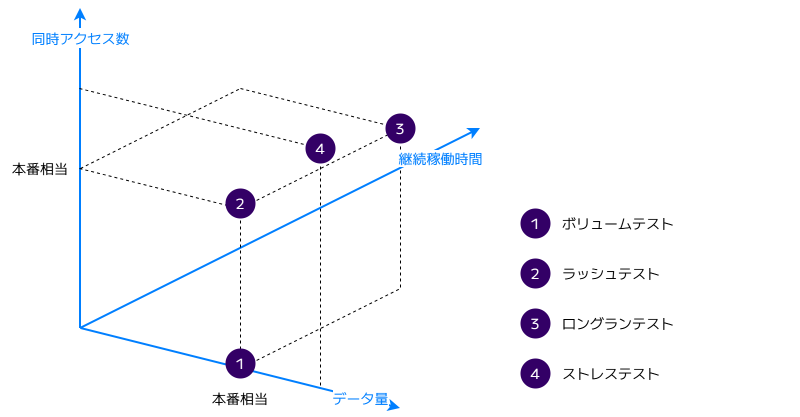

テストの観点を「データ量」から「データ量 x 同時アクセス数」そして「データ量 x 同時アクセス数 x 継続稼働時間」と段階的に変化させていくことで効率の良いテストが実現できる。各テストと前述した目的との対応は次の通りである。

|                | ボリュームテスト | ラッシュテスト | ロングランテスト | ストレステスト |
| :------------- | :--------------- | :------------- | :--------------- | :------------- |
| データ量       | 本番相当         | 本番相当       | 本番相当         | 本番相当以上   |
| 同時アクセス数 | 1                | 本番相当       | 本番相当         | 本番相当以上   |
| 継続稼働時間   | \-               | 数十分         | 数時間 \~ 数日   | 数十分         |
| テスト単位     | 機能単位         | シナリオ単位   | シナリオ単位     | シナリオ単位   |

なお、各テストは目的に対応する形で、何をもって完了とするかの完了基準を明確に定める必要がある。

## ボリュームテスト

本番相当のデータ量において機能単位でテストを実施する。データ量に焦点を当て、同時アクセスを発生させずに逐次実行したときの性能や動作を検証するテストとなる。

### テストの目的と完了基準

ボリュームテストは機能単位の「性能指標値の評価」が主な目的となる。

#### 性能指標値の評価

オンライン処理は処理時間、バッチ処理は処理時間とスループット[^4]を計測対象とする。

また性能指標値の評価と合わせて機能単位での処理時間の分析やチューニングを実施することが望ましい。

::: info 完了基準

- [ ] 対象機能の処理時間およびスループットが目標値をクリアしていること
- [ ] 機能単位に処理時間の内訳（例. ネットワークレイテンシ、アプリケーション処理、データベース処理）が明らかになっており、問題箇所や改善が見込めそうな箇所に対して分析やチューニング（例. RDBを利用する場合は、SQLの実行計画を取得した上で、インデックスが適切に利用されているか、作業用メモリが十分に足りているかといった観点での最適化）が行われていること

:::

### テスト対象機能の選定

ボリュームテストの対象は、原則全機能とする形が望ましい。後続のラッシュテストやロングランテストでは主要な業務シナリオをベースに機能を絞ることを想定しているため、本テストで全機能を網羅的に検証しておくことがシステム全体の性能を担保する上で最も効果的かつ効率的だと考えるためである。

ただし人的・時間的なリソースが限られている場合は、次のように機能の重要度や利用頻度の観点（ブラックボックス観点）や複雑さの観点（ホワイトボックス観点）で優先度をつけることもできる。

- ビジネス上の重要度や利用頻度が低い機能（例. 管理者向けの機能）を対象外とする
- 処理が極めてシンプルな機能（例. 内部処理が単一テーブルに対するPKアクセスだけの機能）は対象外とする

::: tip ボリュームテストにおけるリクエストのパターン

リクエストパラメータに応じてSQLを動的に組み立てる（例. 検索条件指定してデータ取得するAPI）機能などは、リクエストパラメータに何を指定するかがパフォーマンスに大きく影響する。

全リクエストパターンを網羅する必要はないが、典型的なケースと最悪のケースそれぞれのパターンに対応できることが望ましい。例えば一覧検索においては、通常指定される検索条件による検索と性能上重いと考えられる検索（例. 全件検索や広範囲のレンジにおける検索、大きなOFFSET指定が必要な深いページングによる検索など）の2パターンをテストするということが考えられる。

:::

なお、ボリュームテストに画面（UI）を含めるかどうかという論点がある。業務システム向けのWebアプリケーションであれば、画面のレンダリング速度よりもWeb APIのレスポンスタイムが支配的であるため、Web APIのみのボリュームテストに絞って性能テストを行うことが効率的である。一方で、複雑なロジックを持った画面が存在したり、画面の性能がビジネス価値に直結したりするなど画面を含めたターンアラウンドタイムが性能要件として重視される場合は、画面を含めてボリュームテストを行うことが望ましい。

画面の性能テストについては「[APPENDIX: 画面（UI）の性能テスト](#l#appendix-画面-ui-の性能テスト)」にて説明する。

### テストの試行回数

ボリュームテストにおける各機能の試行回数の基準は次の通りである。

- **オンライン処理**  
  全てのテストはスクリプト化して負荷ツールから繰り返し実行することを前提に、原則として100回以上を基準とする。
  試行回数を十分に確保することで、ランダムなノイズの影響が薄まり、統計上信頼性の高い性能指標値をできる。る。
- **バッチ処理**  
  オンライン処理と異なり1回の実行コスト（処理時間）が大きく、統計上の揺らぎよりも処理データ量による影響が支配的であるため、1回の実行とする。

::: tip 試行回数の妥当性

試行回数の妥当性は測定結果の標準誤差から判断ができる。

標準誤差とは一言で言えば「測定した平均値が、真の平均値からどれくらいズレている可能性があるか」を表す指標である。標準誤差は標準偏差（データのばらつき）÷ √試行回数で求められ、試行回数を増やすほど標準誤差は小さくなり、より精度の高い測定結果を得ることができる。別の言い方をすると、処理速度のばらつきが大きい機能の場合は、信頼性の高い結果を得るためにより多くの試行回数が求められる。

性能テストにおける標準誤差の明確な基準はないが、相対標準誤差（=標準誤差/平均値）が1％以下を目指すことが望ましい。例えば、平均応答時間が500ms、標準偏差が50ms（標準的なばらつきが±50ms程度）のオンライン処理を例に、試行回数と標準誤差が実務上何を意味するかをシミュレーションする。

試行回数が100回の場合、標準誤差は5.0ms（= 50/√100）、相対標準誤差は1％（= 5.0ms/500ms）となる。これは95%信頼区間において±9.8ms（=1.96 \* 5ms）の誤差があることを意味し、ある測定の平均と別の測定の平均が最大で19.6ms（=9.8 \* 2）程度変動し得ることを意味する。なお、10回の試行回数では相対標準誤差は3.2%（ブレ幅は約62ms）、1,000回の試行回数では相対標準誤差は0.3%（変動幅は6.2ms）となる。

このように相対標準誤差が1％以下の場合は、実質的な変動幅は4.0%以下になるため、性能テストの信頼性として十分な水準にあることが直感的にも理解できる。

| 試行回数 | 標準誤差 | 相対標準誤差 | 実質的な変動幅  |
| -------- | -------- | ------------ | --------------- |
| 10回     | 15.8ms   | 3.2%         | 62ms（12.4％）  |
| 100回    | 5.0ms    | 1.0%         | 19.6ms（3.9％） |
| 1,000回  | 1.6ms    | 0.3%         | 6.2ms（1.2％）  |

:::

## ラッシュテスト

本番相当のデータ量に加え、本番相当の同時アクセス負荷（例. 通常時、ピーク時、縮退時）をかけて性能や動作を検証する。通常、同時アクセス負荷は単一機能に限定されず、一連の業務シナリオに沿って複数の機能が並行して実行されるため、実際の利用シーンにもとづいた機能群（シナリオ）を対象にテストを実施する。

### テストの目的と完了基準

ラッシュテストは「性能指標値の評価」「最適なキャパシティプランニング」が主な目的となる。ボリュームテストにおいても「性能指標値の評価」を目的としていたが、次の通り観点が異なる点に留意する。

#### 性能指標値の評価

処理時間、スループット、リソース使用率、エラー率を計測対象の指標とする。ボリュームテストが機能単体のロジックの最適化に焦点を当てているのに対し、ラッシュテストでは同時アクセスによる共有リソース（例. スレッドやDBコネクションなど）の競合や枯渇など同時アクセスが発生した場合に生じるボトルネックの解消に焦点を当てる。

::: info 完了基準

- [ ] 処理時間およびスループットが定義した全ての負荷パターンにおいて目標値をクリアしていること
- [ ] リソースの使用率が目標値の範囲内に収まっていること
- [ ] 同時アクセスに伴う意図しないエラーが発生していないこと
- [ ] メッセージキューを介した非同期処理が起動する場合は、メッセージが滞留せずに捌けていること
- [ ] 機能単位に処理時間の内訳（例. ネットワークレイテンシ、アプリケーション処理、データベース処理、外部サービス呼び出し）が明らかになっており、ボリュームテストとの差分が特定できていること
- [ ] 同時アクセスに伴う性能劣化部分（上記の差分）に対して分析や対応が行われていること

:::

#### 最適なキャパシティプランニング

目標とするピーク時のトラフィックに対して、最もコスト効率の良い最適なインフラ構成を導出する。

::: info 完了基準

- [ ] 性能目標値を達成できる最小限の構成（台数とスペック）が比較検証の結果示されていること

:::

### テスト対象シナリオの選定

テスト対象のシナリオは全てのユースケースを網羅する必要はない。システムに対してアクセス負荷をかけたときの挙動を確認することが主な目的であり、機能単位の最適化はボリュームテストで実施しているため、極力少ないシナリオで目的が達成できることが望ましい。シナリオは、スループットの目標値を導出した際のアプローチにもとづいて組み立てると良い。

- ベンチマークとなる既存システムがありアクセスログ等から目標スループットを導出した場合、シナリオも同じく既存のアクセスログ等から呼び出されている主要な機能をピックアップし、組み立てる
- 新規システムなど想定のユースケースにもとづいてスループットを定めた場合、当該の想定ユースケースにもとづいて、シナリオを組み立てる

なお、シナリオの策定にあたってはオンライン処理のみに焦点が偏りやすいが、バックグラウンドで走るバッチ処理を忘れてはならない。オンライン処理とバッチ処理が並行して動く時間帯があるならば、ラッシュテストにおいてもそのようなケースをシナリオとして想定し、ピーク時のトラフィックを再現するテストの実行中に必ず対象のバッチをバックグラウンドで実行し、検証を行う。

### 最適なインフラ構成の導出方法

次の方針にもとづき、最適なインフラ構成を決定する。

- 性能要件を満たしかつリソースの使用率に余裕がある場合は、より低いスペックで同様に検証し、問題がなければより低いスペックを優先する
- 水平スケールが可能な場合、より低いスペックのノードを多数配置する構成を優先（例. 2vCPU/8GB x 2台 よりも 1vCPU/4GB x 4台を優先）する

:::tip インフラ構成が確定した場合のボリュームテストの再実行

ラッシュテストの結果として最適なインフラ構成（サーバスペックや台数）が確定した場合、その構成のもとでボリュームテストを再実行することが望ましい。

ボリュームテスト実施時の構成と最終的に確定した構成が異なる場合、機能単位の処理時間にも変動が生じる可能性があり、最終構成での計測値を改めてベースラインとして押さえておく必要があるためである。

このように性能テストは、インフラ構成の変更や設定の見直しに伴って繰り返し実行する場面が多い。

再実行のたびに手作業での準備が発生するようでは効率が悪いため、すべてのテストはスクリプト化し、低コストで再実行できる状態を維持しておく必要がある。

:::

## ロングランテスト

本番相当のデータ量において、本番相当の同時アクセス負荷を長時間かけて性能や動作を検証する。ラッシュテストと異なり、ピーク時の負荷をかけ続ける必要はなく、通常時の負荷で検証を実施すればよい。

### テストの目的と完了基準

ロングランテストは「性能指標値の評価」「安定性・信頼性の評価」が主な目的となる。

#### 性能指標値の評価

ラッシュテストと同じく処理時間、スループット、リソース使用率、エラー率を計測対象の指標とする。

::: info 完了基準

- [ ] 処理時間およびスループットが目標値をクリアしていること
- [ ] リソースの使用率が目標値の範囲内に収まっていること
- [ ] 長時間稼働に伴う意図しないエラーが発生していないこと
- [ ] メッセージキューを介した非同期処理が起動する場合は、メッセージが滞留せずに捌けていること

:::

#### 安定性・信頼性の評価

長時間の連続稼働においてシステムが異常終了することなく安定して動作し続けていることを確認する。

::: info 完了基準

- [ ] メモリの使用率をはじめ各種リソースの使用率に右肩上がりの推移がみられないこと
- [ ] データベースのコネクションやアプリケーションのスレッドが枯渇せず、適切に開放されていること
- [ ] GCの頻度や実行時間が極端に上がっていないこと

:::

### テスト対象シナリオの選定

テスト対象のシナリオはラッシュテストで利用したシナリオをそのまま利用して問題ない。

ただし稼働時間が数十分のラッシュテストと異なり稼働時間が長時間になるため、定期的に実行されるバッチ処理などは通常のスケジュール通り、ロングランテストの裏で動いていることが望ましい。

### ロングランテストの実行時間

実行時間は原則そのシステムの連続稼働時間を満たすことが望ましい。

例えば、日中に稼働し夜間は必ず停止（または再起動）するシステムであれば、その稼働時間を網羅することで1サイクル内でのリソース推移を十分に検証できる。ただし24/365の無停止システムにおいては、どの程度の時間テストを実行すれば妥当かを定義するのは難しい。ミッションクリティカルなシステムでは1週間以上かけてテストを実施するケースもあるが、究極的にはどれほど期間を延ばしたところで、数ヶ月〜数年単位でしか表面化しない微細なリソースリーク等のリスクをゼロにはできない。

ロングランテストに割ける工数や環境維持コストには限界があるため、**日次でのローリングデプロイやB/Gデプロイによる無停止での定期的なリフレッシュを組み込むことを推奨**する。これにより各インスタンスの状態は24時間ごとにリセットされるため微細なリークが仮にあったとしても致命的な障害を防ぐことができ、ロングランテストの実行時間も24時間で十分に妥当だといえる。

## ストレステスト

本番相当のデータ量や同時アクセス数を超えて、通常想定しない負荷をかけたときのシステムの動作を確認する。

### テストの目的と完了基準

ストレステストは「スケーラビリティの評価」「最適なキャパシティプランニング」が主な目的となる。

#### スケーラビリティの評価

システムがスケール性を備えているか、どの部分をスケールさせれば性能が向上するかを確認する。

::: info 完了基準

- [ ] 負荷増加時にボトルネックとなるコンポーネントが特定できていること
- [ ] 特定したボトルネックをスケールアップないしスケールアウトすることで、性能が実際に向上することが検証できていること
- [ ] オートスケールを構成している場合、設定した閾値に従ってスケールアウト・スケールインが期待通り発動し、負荷の変動を安定して受け止められていること

:::

#### 最適なキャパシティプランニング

ラッシュテストで導出した現在のインフラ構成を起点として、現在のインフラ構成における限界性能を把握し、将来的な負荷の増加に対してインフラ構成をどのように変えていくかの見通しを立てる。

::: info 完了基準

- [ ] 現在のインフラ構成における限界性能（限界スループット等）が特定できていること
- [ ] 限界性能を超える負荷が発生した場合に取るべき増強ステップ（どのコンポーネントをどの順序で増強するか）が整理されていること

:::

### スケール特性（ボトルネック）の把握

ストレステストは、システムのボトルネックが検出されるまで、ピーク時のアクセス負荷を基準に段階的に負荷を上げていき、性能限界に到達するまで各地点での性能指標を計測する。また、ボトルネックとなっている部分を増強することでシステムの性能が向上することを確認する。

これにより、現在のインフラ構成での限界性能と、限界到達時にスケールすべきポイントを把握できる。

| 同時アクセス数      | AP：サーバ構成  | AP：CPU使用率 | AP：メモリ使用率 | DB：サーバ構成   | DB：CPU使用率 | DB：メモリ使用率 |
| :------------------ | :-------------- | ------------- | ---------------- | :--------------- | ------------- | ---------------- |
| 50 RPS              | 2vCPU/8GB x 4台 | 40%           | 20%              | xlarge x 1台     | 60%           | 80%              |
| 100 RPS             | 2vCPU/8GB x 4台 | 60%           | 40%              | xlarge x 1台     | 80%           | 80%              |
| 150 RPS（性能限界） | 2vCPU/8GB x 4台 | 60%           | 60%              | xlarge x 1台     | 🚨100%        | 80%              |
| 200 RPS             | 2vCPU/8GB x 4台 | 80%           | 60%              | 2xlarge x 1台 🆙 | 60%           | 80%              |

この表の例では、現在のインフラ構成（APサーバ 2vCPU/8GB × 4台、DBサーバ xlarge × 1台）における限界性能が150 RPSであり、限界到達時のボトルネックがDBサーバのCPUであることを把握できる。あわせて、ボトルネックとなったDBサーバを2xlargeにスケールアップすることで200 RPSまで処理が可能になることが確認できる。

### オートスケールの確認

クラウド環境のシステムにおいては、負荷の変動に応じてリソースを自動的に増減させるオートスケールを組むことが多い。

オートスケールは構成しただけでは期待通りに機能するとは限らないため、ストレステストの中でオートスケールがトリガーされるまで負荷を上げ続け、設定通りに機能することを確認する必要がある。具体的な確認観点は次の通りである。

- **スケールアウト・スケールインのトリガー**
  - 負荷の上昇や低下に伴って設定した閾値（例. CPU使用率70％超過が2分間継続）に達したタイミングでスケールアウト・スケールインが期待通り発動すること
  - 閾値や継続期間、クールダウン期間の設定値が、負荷の増加・減少スピードに対して適切である（スケールアウトとスケールインが繰り返し発動したりしない）こと
- **スケールアウト時の挙動**
  - 新規ノードの起動・ヘルスチェック完了・ロードバランサーへの組み込みまでの立ち上がり時間が負荷の増加スピードに対して十分であること
  - ロードバランサーやサービスディスカバリによって新規ノードへトラフィックが適切に配分されること
  - スケールアウト後にシステム全体として性能が向上しており、エラー率が閾値内に収まっていること
- **スケールイン時の挙動**
  - スケールインによって縮退対象となったノードが、処理中のリクエストを正しく完了させてから停止（グレースフルシャットダウン）すること
  - 縮退後の残存ノードで引き続き負荷を適切に受け止められていること
- **スケール範囲の妥当性**
  - 設定した最小ノード数・最大ノード数が適切であることを確認する。最大ノード数に張り付いてもなお負荷を受け止めきれない場合は上限値の引き上げを検討し、逆に最大ノード数まで到達する前に別の箇所(データベース等)がボトルネックになる場合は、上限値が過剰でないかを見直す

## テストツールを選定する

### 負荷ツール

組織やプロジェクト内で使い慣れているツールがあるのであれば、そのツールを利用するのが良い。

もしフラットにツールの選定するのであればk6の利用を推奨する。主な推奨ポイントは次の通りである。

- テストがコードベース（JavaScript）で作成できるため、通常のソースコードと同様にバージョン管理ができ、CI/CDに組み込みやすい
- Go言語でつくられており、非常に効率の良い負荷の生成が可能（理論上は30,000〜40,000の同時ユーザ負荷を生成でき、[単一インスタンスで300,000RPS以上の処理が可能](https://grafana.com/blog/k6-vs-jmeter-comparison/#performance-benefits-in-practice)）

調査時: 2026/03/19

|                | JMeter                                              | k6                                                                 | Gatling                                                          | Vegeta                                                                 | AWS DLT                                                              |
| :------------- | :-------------------------------------------------- | :----------------------------------------------------------------- | :--------------------------------------------------------------- | :--------------------------------------------------------------------- | :------------------------------------------------------------------- |
| 説明           | Java製OSS負荷テストツール \- 多機能で利用実績も多い | Go製OSS負荷テストツール \- 省リソース、JSで記述しCI/CD統合に優れる | Scala製OSS負荷テストツール \- コードで記述、HTMLレポートがリッチ | Go製OSS CLI負荷テストツール\- HTTP特化、シンプルで手軽だが機能は限定的 | AWSの分散負荷テストサービス \- AWS上で大規模・サーバレス実行を自動化 |
| 記述方法       | XML （GUIで生成）                                   | JavaScript                                                         | Scala/Java/JavaScriptなど                                        | 設定ファイル/CLI引数                                                   | JMeter/k6/Locustに対応                                               |
| GUI            | あり                                                | なし                                                               | なし                                                             | なし                                                                   | あり                                                                 |
| プロトコル     | ✅️ HTTP/SOAP/JDBCなど多数（拡張可）                 | ⚠️ HTTP/WebSocket/gRPCなど（拡張可）                               | ⚠️HTTP/WebSocket/gRPCなど（拡張可）                              | ❌️ HTTP特化                                                            | ✅️ 多くのプロトコルに対応                                            |
| 実行効率       | ⚠️ 低（OSスレッドベース）                           | ✅️ 高                                                              | ✅️ 高                                                            | ✅️ 高                                                                  | ✅️高                                                                 |
| シナリオ準備   | ✅️ GUI記録機能あり、直感的                          | ✅️ コード記述、har-to-k6等あり                                     | ✅️ コード記述、レコーダーあり                                    | ✅️ 非常にシンプルな設定                                                | ✅️ JMeter・k6・Locustに対応                                          |
| 環境準備       | ⚠️ Javaインストール・設定必要                       | ✅️ 単一バイナリ配置のみ                                            | ⚠️ Java/Scala環境設定必要                                        | ✅️ 単一バイナリ配置のみ                                                | ⚠️ 環境のデプロイが必要                                              |
| 分散構成対応   | ✅️ コントローラ/ワーカー方式                        | ❌️ 手動での分散実行（k8s operatorあり）                            | ❌️ 手動での分散実行                                              | ❌️ 手動での分散実行                                                    | ✅️AWS Fargate                                                        |
| レポート       | ✅️ GUI表示、HTMLレポート、CSV/XML/JTL出力           | ✅️ 標準出力、JSON出力、CloudWatch連携                              | ✅️ HTMLレポート自動生成                                          | ⚠️ 標準出力、CSV/JSON出力                                              | ✅️コンソール表示、CloudWatch連携                                     |
| 商用サービス   | ✅️ あり                                             | ✅️ あり（k6 Cloud）                                                | ✅️ あり（Gatling Enterprise）                                    | ❌️ なし                                                                | ✅️                                                                   |
| 習熟コスト     | ⚠️ 独自GUIが複雑                                    | ✅️ シンプルで容易                                                  | ⚠️ 独自DLSが複雑                                                 | ✅️ シンプルで容易                                                      | ⚠️ AWSインフラ知識が必要                                             |
| GitHubスター数 | 9.1k                                                | 29.4k                                                              | 6.8k                                                             | 24.7k                                                                  | \-                                                                   |

## 計測対象のメトリクスを具体化する

性能テストにおいて、問題の原因を特定し、実行結果を正しく評価するためには、あらかじめ収集すべきメトリクスを具体化しておくことが必要である。

これらの指標は性能テストのためだけのものではなく、本来はシステム運用の監視設計として定められるべきものである。すでに監視設計が存在する場合は、計測対象となっているメトリクスをベースとしつつ、性能テストの特性に合わせて詳細なメトリクスを肉付けしていく。

もしこの時点で監視設計が未整備であれば、本番運用を見据えてこのタイミングで具体化しておく必要がある。

### インフラメトリクス

代表的なメトリクスとして、CPU使用率、メモリ使用率、ディスク使用率、ネットワークI/O、ディスクI/Oが挙げられる。

クラウドのマネージドサービスを利用する場合は、サービスごとに取得できるメトリクスが定められているため、それぞれ選定が必要である。

#### AWSサービス

RDSとECSにおいて性能テストで監視すべき代表的なメトリクスについてのみ整理する。

その他、AWSの主要なサービスにおいてモニタリング対象とすべき代表的なメトリクスは[AWS設計ガイドライン](https://future-architect.github.io/arch-guidelines/documents/forAWS/aws_guidelines.html#cloudwatch-metrics-%E3%83%A1%E3%83%88%E3%83%AA%E3%82%AF%E3%82%B9%E7%9B%A3%E8%A6%96)を参考にされたい。

| サービス             | メトリクス名                     | 説明                                             |
| :------------------- | :------------------------------- | :----------------------------------------------- |
| RDS（Amazon Aurora） | CPUUtilization                   | CPU使用率                                        |
|                      | FreeableMemory                   | 使用可能なメモリ量                               |
|                      | Read Latency / Write Latency     | ディスクI/Oにかかる平均時間                      |
|                      | ReadIOPS / WriteIOPS             | 1 秒あたりのディスクI/O オペレーションの平均回数 |
|                      | DatabaseConnections              | データベースとクライアント接続数                 |
|                      | CommitLatency                    | コミット操作を完了するのにかかる平均時間         |
|                      | FreeLocalStorage                 | 使用できるローカルストレージの量                 |
|                      | SwapUsage                        | 使用したスワップ領域の量                         |
| RDS Proxy            | ClientConnections                | クライアントとRDS Proxy間の接続数                |
|                      | DatabaseConnectionsBorrowLatency | DBコネクションを取得するのにかかる時間           |
| ECS                  | CPUUtilization                   | クラスタ/サービスレベルでのCPU使用率             |
|                      | MemoryUtilization                | クラスタ/サービスレベルでのメモリ使用率          |
|                      | NetworkRxBytes / NetworkTxBytes  | クラスタ/サービスレベルでの受信/送信バイト数     |
|                      | RunningTaskCount                 | クラスタ/サービスレベルでの起動中のタスク数      |
|                      | TaskCpuUtilization               | タスクレベルでのCPU使用率                        |
|                      | TaskMemoryUtilization            | タスクレベルでのメモリ使用率                     |
|                      | TaskEphemeralStorageUtilization  | タスクレベルでのエフェメラルストレージの使用率   |

#### データベース（PostgreSQL）

性能テストにおいてモニタリングすべきメトリクスは次の通りである。詳しくは[PostgreSQL設計ガイドライン](https://future-architect.github.io/arch-guidelines/documents/forDB/postgresql_guidelines.html#%E3%83%A1%E3%83%88%E3%83%AA%E3%82%AF%E3%82%B9%E7%9B%A3%E8%A6%96%E9%A0%85%E7%9B%AE)を参考にされたい。

| メトリクス名       | 説明                                                  | 主な用途                                   |
| :----------------- | :---------------------------------------------------- | :----------------------------------------- |
| pg_stat_statements | 実行された全てのSQL文のプラン生成時と実行時の統計情報 | スロークエリの分析                         |
| pg_stat_activity   | 現在のプロセスの活動状況に関する情報                  | 待機イベントの分析、コネクション滞留の検知 |

### ランタイムメトリクス

インフラメトリクスに加えて、アプリケーションランタイム固有のメトリクスを収集することで、内部の振る舞いをより多角的に把握することが可能となる。

使用する言語やランタイムに応じて、以下のメトリクスを収集・分析の対象とする。

#### Java

- **ヒープ使用量**
  ヒープメモリの使用量を見ることでメモリリークの有無やGCによる回収量を確認する。
  内訳としてYoung領域とOld領域それぞれの使用量を計測し、それぞれの領域が持つ役割の違いから、メモリ効率を評価する。
  - **Young領域**
    新規オブジェクトが割り当てられる領域。この領域の使用量が急増し、頻繁にMinor GCが発生している場合は、アプリケーション内での一時的なオブジェクト生成が過剰になっていないかを確認する。
  - **Old領域**
    Young領域で回収されず長期生存したオブジェクトが格納される領域。この領域が右肩上がりに増加し続け、Full GCが発生しているにもかかわらず十分なメモリが回収されない場合は、メモリリークの可能性が高い。
- **GC実行時間 / 実行回数**
  ガベージコレクションによるアプリケーションの停止時間（Stop-the-world）とその頻度を計測する。スループットの低下やレスポンスタイムのスパイクを評価するために、Minor GCとFull GC（Major GC）の両方を区別して捉える必要がある。
- **Threadカウント**
  アプリケーション内で生成・維持されているスレッドの数と状態（例. RUNNABLE, BLOCKED, WAITING）を計測する。

#### Node.js

- **ヒープ使用量**
  V8エンジンのヒープメモリの使用量。Javaと同様に世代別に使用量を計測する。
- **イベントループの遅延**
  ベントループの1回転にかかる遅延時間を計測する。
  この数値が高い場合、CPU負荷の高い計算処理や同期的なI/O処理によって、後続のリクエスト処理が待たされていることを示す。レスポンスタイム悪化の直接的な原因となるため、重要視すべき指標である。

#### Go

- **ヒープ使用量**
  ヒープメモリの使用量を見ることでメモリリークの有無やGCによる回収量を確認する。
- **GC実行時間 / 実行回数**
  ガベージコレクションによるアプリケーションの停止時間（Stop-the-world）とその頻度を計測する。
- **Goroutine数**
  実行中のGoroutine（軽量スレッド）の総数を計測する。処理終了後に数が右肩上がりに増え続けている場合は、Goroutineリークの可能性が高い。

### サービス・アプリケーションメトリクス

エンドユーザに直結するメトリクスとしてREDメトリクス（Rate / Errors / Duration）を収集・分析の対象とする。

- **Rate（トラフィック量）**
  単位時間あたりのリクエスト量を表す。性能テストにおいて想定する負荷がかけられているかを確認する。
- **Errors（エラー率）**
  リクエストの失敗率を表す。負荷の増加に伴い、エラーが増加していないかを確認する。
- **Duration（処理時間）**
  リクエストの処理時間を表す。エンドツーエンドの処理時間だけでなく、データベースに対するクエリ実行時間や、外部のWeb APIの呼び出し時間といった個々のスパンでどの程度時間がかかっているかドリルダウンで確認できることが望ましい。

なお、REDメトリクスをエンドポイント単位やスパン単位で詳細に取得するには、分散トレーシングを伴うAPM（Application Performance Monitoring）の導入が最も効果的な手段となる。インフラ監視ツール単体では、CPU使用率がスパイクしていることは把握できても、その原因（どのエンドポイントの、どのクエリが、どのスパンで時間を要しているか）までは人間がログやソースコードを調査しない限り追跡できない。APMを導入することで、エンドポイントごとのレイテンシ、データベースクエリの実行時間、外部API呼び出しの遅延、エラーや例外の発生箇所などが、コードに手を加えることなく可視化される。

具体的なAPMのツールについては、次の「モニタリングツールを選定する」にて説明する。

## モニタリングツールを選定する

モニタリングツールは、性能テスト中のシステムの挙動を可視化し、ボトルネックの特定や改善検証を支える基盤となる。原則として、本番運用で利用するツールをそのまま性能テストでも使用する。性能テストで得た知見（各メトリクスの平常値、注意すべき閾値など）を、そのまま本番運用の監視設計に引き継ぐことができるためである。

モニタリングツールの選定においては、APMが必要か否か、外部からの監視を許容するか否かが大きな基準となる。APMの優先順位が低い場合は、CloudWatch等クラウドネイティブのモニタリングツールで十分である。APMが必要になった段階でDatadogやNew Relicの導入を検討[^5]する。

APMの優先順位が高い場合は、DatadogかNew Relicの導入を検討する。両者の大きな違いは課金体系であり、Datadogがサーバ単位の課金となるのに対し、New Relicはユーザ数と取り込みデータ量での課金となる。基本的にはシステムサイズ（サーバ数）と運用保守体制規模には正の相関があるはずなので、機能豊富かつ学習コストが低いDatadogが第一選択肢となるが、見積もりの結果として長期的にNew Relicが安価となる場合はNew Relicの選択もありえる。

なお、オンプレミス環境の場合やベンダーロックインを避けたい場合はPrometheusを選択する。

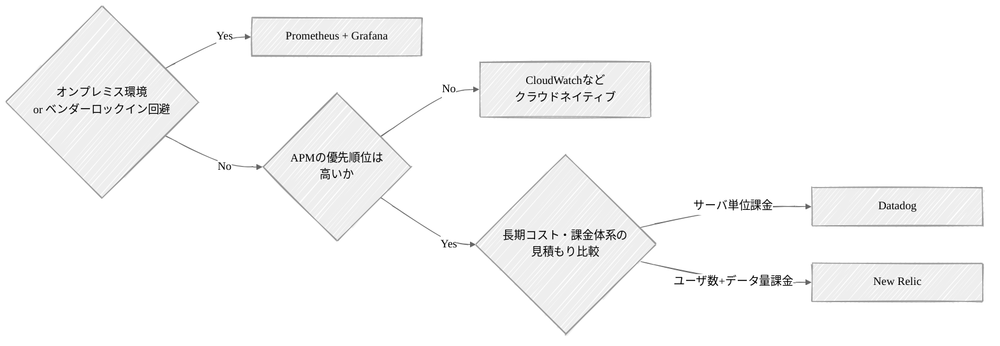

調査時: 2026/03/19

|                          | CloudWatch                                                                                                    | Datadog                                                                                                                                                                                 | New Relic                                                                                                      | Prometheus \+ Grafana                                                                                                                          |
| :----------------------- | :------------------------------------------------------------------------------------------------------------ | :-------------------------------------------------------------------------------------------------------------------------------------------------------------------------------------- | :------------------------------------------------------------------------------------------------------------- | :--------------------------------------------------------------------------------------------------------------------------------------------- |
| 提供元                   | AWS                                                                                                           | Datadog                                                                                                                                                                                 | New Relic                                                                                                      | OSSコミュニティ                                                                                                                                |
| 説明                     | AWS標準のモニタリングツール。 インフラ構築の必要がなく、追加設定無しで使用可能。                              | インフラからアプリ性能まで直感的なUIで統合監視できる、SaaS型オブザーバビリティの現在のデファクトスタンダード。 クラウド・オンプレ問わず、エージェントを一つ入れるだけで設定が完了する。 | アプリケーション内部の遅延やエラーの特定（APM）において非常に高い分析力を持ち、Datadogと双璧をなすSaaSツール。 | OSSモニタリングツールの代表格。 Kubernetesの監視においては世界標準となっており、ベンダーロックイン回避の優先度が高い場合は有力な選択肢となる。 |
| 形態                     | クラウドネイティブ                                                                                            | SaaS                                                                                                                                                                                    | SaaS                                                                                                           | OSS                                                                                                                                            |
| インフラメトリクス監視   | ✅️ AWSリソースは設定不要                                                                                      | ✅️ コンテナ/OSレベルまで詳細                                                                                                                                                            | ⚠️\~✅️ APMよりだが十分可能                                                                                     | ✅️ k8s/コンテナの標準                                                                                                                          |
| アプリケーション性能監視 | ⚠️ X-Ray連携。専用ツールに劣る                                                                                | ✅️ 導入が容易で強力                                                                                                                                                                     | ✅️ APMの老舗。非常に詳細                                                                                       | ⚠️ 別途OpenTelemetry等が必要                                                                                                                   |
| 分散トレーシング         | ⚠️\~✅️ X-Rayにて対応                                                                                          | ✅️ APMとシームレスに連携                                                                                                                                                                | ✅️ APMとシームレスに連携                                                                                       | ⚠️ 別途Jaeger/Tempo等が必要                                                                                                                    |
| ログ監視                 | ✅️ CloudWatch Logsで一元管理可能                                                                              | ✅️ 検索が高速だが保管料注意                                                                                                                                                             | ⚠️\~✅️ データ取り込み枠を消費                                                                                  | ⚠️ 別途Loki等の構築が必要                                                                                                                      |
| ユーザ体験監視           | Synthetics等で対応                                                                                            | ✅️ ユーザの画面操作まで録画可                                                                                                                                                           | ✅️ 詳細なフロントエンド監視                                                                                    | ❌️ OSS単体では非対応                                                                                                                           |
| 外部連携                 | ⚠️\~✅️ログフィルターを介してlambdaを発火可能。 プリセットがあるわけではないので、コード作成の手間は発生する。 | ✅️ 800以上の連携プリセット                                                                                                                                                              | ✅️ 多数の連携プリセット                                                                                        | ⚠️\~✅️ OSSのプラグインが豊富だが手動設定                                                                                                       |
| マルチクラウド           | ❌️ 基本的にAWS専用                                                                                            | ✅️ AWS, GCP, Azure対応                                                                                                                                                                  | ✅️ AWS, GCP, Azure対応                                                                                         | ✅️ 構成次第でどこでも可能                                                                                                                      |
| オンプレミス             | ⚠️                                                                                                            | ✅️                                                                                                                                                                                      | ✅️                                                                                                             | ✅️ 閉域網・オフライン環境も可                                                                                                                  |
| 導入コスト               | ✅️ AWS環境ならエージェント不要                                                                                | ⚠️\~✅️ エージェント1つで一括収集 直感的なGUI。学習コスト最低                                                                                                                            | ⚠️ エージェント導入が必要 高度な分析にはNRQLの学習要                                                           | ❌️ \~ ⚠️ 各種Exporterの構築・設計が必要（PromQLという独自言語が必須）                                                                          |
| 価格                     | 従量課金 メトリクス数、ログデータ量                                                                           | ホスト/コンテナ数 ＋ 機能ごとの従量課金 マイクロサービス化等でサーバ/コンテナ台数が増えると高騰                                                                                         | ユーザ数(画面を見る人) ＋ 取り込みデータ量 監視画面を見るエンジニア・関係者の人数が増えると高騰                | 無料 (OSS) ※サーバインフラ代のみ                                                                                                               |
| ユースケース             | APMの優先順位が低い場合                                                                                       |                                                                                                                                                                                         |                                                                                                                | 外部との通信がしにくい閉域網での統合監視                                                                                                       |

## テスト環境を決定する

性能テストを実施する環境を決定する必要がある。原則として本番環境と同等の構成を持つ環境を利用することが求められる。

新規に構築しているシステムであれば、リリース前の本番環境をそのまま利用することも選択肢となる。本番環境が利用できない場合でも、IaCによるインフラの構築が常識となっているクラウドインフラにおいて、本番環境と同等の環境を再現することは決して難しくない。 また、可能であれば複数環境を性能テスト用に構築し、利用できることが望ましい。性能テストは複数のテストをパラレルに実行しづらいため、利用できる環境が多いほど、複数人での作業がスケールし、短期間での完了を目指すことができる。

環境を利用するにあたっての注意点は次の通りである。

- **環境の占有を前提とする**
  性能テストは、システムに限界に近い負荷をかけたり、長時間稼働させたりすることが前提となる。そのため、他のテストと環境を共有してはならない。
  時間帯の指定による使い分け（例. 午前はシナリオテスト、午後は性能テストで利用する）も原則避けるべきである。
  特に、システムテストフェーズとして性能テストを実施する場合、多くのテスト（例. シナリオテスト、セキュリティテスト、障害テスト）が同時並行的に実施されるため、全体計画として環境の調整を行う。
- **サーバの台数やスペックを落とさない**
  オンプレミスのシステムでしばしば採用されていた「予算の都合でスペックを半分にしてテストし、結果を2倍にして見積もる」といった手法は、クラウド時代のシステムでは推奨されない。クラウドは従量課金のため、テスト期間中だけ本番構成を立ち上げることで、コストを最小限に抑えつつ本番同等の検証が可能だからである。

## スケジュールを立てる

性能テストにかかる工数や期間の正確な見積もりは難しい。

その代表的な要因として、性能上の課題はその特性上、根本的な原因を特定することに時間がかかったり、その対応にあたってアーキテクチャレベルで再検討が必要になったりするなど不確実性が高いことが挙げられる。

性能テストは多くの不確実性を伴うため、スケジュールに余裕を持たせることと、プロジェクトの早期から計画や準備などに着手することを心がけたい。具体的にどの程度の期間が妥当であるかを一概に定めることはできないが、100〜200機能を有する新規システムにおいては、数名の担当チームで最低でも2カ月程度を見込んでおきたい。

スケジュールを立てる上で意識したいポイントをいくつか取り上げる。

- テストの計画や準備（環境構築、データ準備、スクリプト準備など）は、テストの実行およびチューニングと同程度、もしくはそれ以上の工数がかかる
- テストの推進にあたっては、システムと業務双方の広い理解が必要になるため、チーム横断的なコミュニケーションが必要になることが多く、やりとりのオーバーヘッドが大きくなることがある
- 各テストの実行にあたって、相互影響を避けなければならない（例. ストレステストとロングランテストを同時に実施することはできない）ものが多く、パラレルに進行しづらい
- 長時間実行されるバッチのテストやロングランテストなど1ケースの消化に数時間～数日単位でかかるものがあり、わずかなトラブルで中断した場合でも、再実行で数日単位の遅延が発生する（例えば3日間かけて行うロングランテストに問題があった場合、単純に再実行するだけで3日間 x 2 \= 6日間を必要とする）
- 次のような特性を持つシステムの場合は特に不確実性が高く、工数が膨れやすいためバッファを厚めに確保する
  - 既存のシステムのリプレイスではなく、全く新しい新規のシステムである
  - オンライン処理だけではなく、非同期処理、バッチ処理など複数の処理方式が混在している
  - マルチテナントアーキテクチャを採用しており、ノイジーネイバーなど特殊な考慮が必要
  - 他システムやSaaSとの連携など、外部システムとの連携ポイントが多い

## その他計画上のポイント

### プレ性能検証の要否と実施タイミング

プレ性能検証とは、本番同等の環境・シナリオを用意する正式な性能テストとは異なり、最小限の構成で性能リスクの有無を早期に見極める簡易検証である。

新しいアーキテクチャの採用時や超大規模なデータ量・トラフィック量が想定される場合はプロジェクト早期のプレ性能検証が有効となる。性能上のリスクが高いポイントがある場合、結合テストや総合テストの段階で性能問題が見つかると、データ構造やアーキテクチャの変更が必要になり、修正コストが甚大となってしまうリスクがある。

#### 推奨実施タイミング

| フェーズ       | タイミング           | 目的                                                                                                               |
| :------------- | :------------------- | :----------------------------------------------------------------------------------------------------------------- |
| RD（要件定義） | アーキテクチャ決定時 | 選定した技術スタックや構成（データベース、キュー、SaaS、その他インフラ）で、目標とするスループットが出るか確認する |
| PG（開発）初期 | コア機能の実装直後   | 最も複雑なビジネスロジックや、大量データ・トラフィックを扱う処理が、単体レベルで重すぎないか確認する               |

#### 進め方のコツ

プロジェクト早期では検証環境が整っておらず、また投入可能工数が限られているケースが多いため、検証ポイントを絞ってクイックに検証を行うことが推進上のコツとなる。検証ポイントは最重量・最頻出・最重要を基準に選定する。

| 観点   | 概要                                                  | 説明                                                                                                                                                                   | 具体例                                                                                                             |
| :----- | :---------------------------------------------------- | :--------------------------------------------------------------------------------------------------------------------------------------------------------------------- | :----------------------------------------------------------------------------------------------------------------- |
| 最重量 | データ量・計算量が多い機能                            | 例えば、億件データを扱うケースを検証する。必ずしも億件まで行かずとも、選定アーキテクチャ・サイジングと比較して大量と考えられる場合は、数百万件でも検証対象となり得る。 | 全店舗・全倉庫の在庫データ（数千万〜億件）の棚卸集計・在庫引当 数百万SKUの商品カタログに対する複合条件での横断検索 |
| 最頻出 | リクエスト量・トランザクション量が多い機能            | ユーザ数のスパイクが発生しうる場合やセンサーからの大量トラフィックが発生するケースを検証する。                                                                         | ハンディターミナルからの入出荷スキャン（数千RPS） タイムセール開始時のアクセス集中（数万RPS）                      |
| 最重要 | ユーザ使用量が多い機能 / 競合プロダクトとの差別化機能 | UXの生命線となる機能の操作性が期待通りかを検証する。特定の機能だけでmsレベルの目標値を求めるなど、後続の機能設計に影響が出るケースも考えられる。                       | POSレジの会計処理（遅延がレジ待ち行列に直結） 商品詳細ページの表示速度（遅延が離脱率・売上に直結）                 |

その他、プレ性能テストを進める上でのコツは次の通りである。

- **データ量だけは本番相当量にする**  
  最重量が絡むテストの場合、データだけは本番相当量とすることを推奨する。多くのデータベースではデータ量次第でインデックスの効きが変わるため、データが少ない環境での性能検証は、全くの無意味になるリスクがある
- **ステップ負荷で屈折点だけを確認する**  
  プレ性能テストは通常の性能テストとは異なり、完全を追い求める必要はない。時間のかかるロングランテストは後回しにし、接続数を 1 → 5 → 10 → 20 と段階的に増やし、どこでレスポンスが急激に悪化するかの屈折点だけを特定する
- **その他インフラは最小限にする**  
  プレ性能検証ではメインの検証対象以外のインフラは必要ではなく、最小構成のスペックで良い

::: tip
プレ性能テストを粗性能テストや素性能テストと呼ぶこともある。
:::

# テスト準備

## 環境を構築する

性能テスト計画で定めたとおり、本番環境ないしは本番環境と同等の環境（例. ステージング環境）を利用することが前提となる。既に環境が存在するのか、IaCが整備されており環境展開するだけなのか、IaCのコード開発から必要なのかによって工数は大きく変わる。後述する負荷ツールを用いた素振りなど、他のテスト準備作業のクリティカルパスとなるため、余裕を持ったスケジュールを心がけたい。

性能テストとしての環境構築ならではの注意点は次の通りである。

### 負荷ツール環境を整備する

性能テストでは試験対象のシステムだけでなく、負荷ツールを稼働させるためのコンピューティングリソースの構築が必要になる。

また負荷ツールからアクセスする各種リソース（例. データベース、オブジェクトストレージ、メッセージキュー等）へのリーチャビリティを確保するよう権限やポリシーの設定を行う。

### ログレベルを合わせる

性能テストにおけるアプリケーションのログレベルは、本番運用時の設定と揃えることを原則とする。

一般的なWebアプリケーションでは INFO 以上が妥当な水準となる。DEBUG や TRACE といった詳細なログレベルを有効化したまま性能テストを実施すると、本番環境では発生しない大量のログ出力がI/O負荷として上乗せされ、正しく性能を評価できない可能性がある。チューニングフェーズで原因調査を目的に、特定パッケージや特定機能に絞って一時的にログレベルを下げることは問題ない。ただし、最終的な性能評価のための計測は本番相当のログレベルに戻した上で再実施することが望ましい。

### キャッシュの有効化・無効化

性能テストでは、各種キャッシュの扱いがテスト結果の妥当性に大きく影響する。

各キャッシュの特性とテストの目的に応じて、有効化・無効化の方針をあらかじめ定め、適用する必要がある。

| キャッシュ種別             | ボリュームテスト | ラッシュテスト | ロングランテスト | ストレステスト |
| :------------------------- | :--------------- | :------------- | :--------------- | :------------- |
| HTTPキャッシュ             | 無効             | 有効           | 有効             | 有効           |
| アプリケーションキャッシュ | 目的に応じて判断 | 有効           | 有効             | 有効           |
| DBキャッシュ               | 有効             | 有効           | 有効             | 有効           |

#### HTTPキャッシュ

CDNやAPIゲートウェイで保持されるWeb APIのHTTPレスポンスのキャッシュを指す。

HTTPキャッシュにヒットしたリクエストはバックエンドのアプリケーションサーバに到達しないため、扱い方によって計測結果が大きく変わる。ボリュームテストにおいては、機能そのものの処理時間を計測し、チューニングすることが目的であるため、HTTPキャッシュは無効化することが望ましい。キャッシュが有効なままだと、リクエストの大部分がバックエンドに届かず、機能の本来の性能が評価できない。

ラッシュテスト、ロングランテスト、ストレステストにおいては、本番運用に近い状態でシステム全体の性能を評価することが目的であるため、HTTPキャッシュは本番運用時と同じ設定で有効化する。ただし、テストシナリオが画一的なリクエストパラメータを繰り返し送るような構造になっていると、本来発生し得ない高いキャッシュヒット率となり、バックエンドの負荷が過小評価される。シナリオ作成時にリクエストパラメータを十分に分散させ、想定通りのキャッシュヒット率となっていることを確認する必要がある。

#### アプリケーションキャッシュ

アプリケーションプロセス内のローカルキャッシュや、Redis、Valkey、memcached等の分散キャッシュを指す。

ボリュームテストにおいては、評価したい対象に応じて方針が変わる。データベースアクセスを含めた素の処理時間を計測したい場合は、キャッシュを無効化するか、毎回クリアされた状態でテストを実施する。一方、対象機能がキャッシュ前提で設計されており、本番運用時にも常にキャッシュにヒットすることが想定される場合は、キャッシュが乗った状態でテストを実施する。

#### DBキャッシュ

データベースの `shared_buffers` などのバッファキャッシュを指す。

クラウドのマネージドサービスを使用する場合、根本的に無効化やクリアすることが困難であるケースがあり、有効化したまま運用することを基本とする。本番運用時もDBキャッシュは常にウォームな状態が定常的であり、テスト時もこれを再現することが妥当だからである。

### オートスケールの有効化・無効化

オートスケールが有効な状態でテストを実施すると、テスト中にサーバの台数が変動し、どの構成で計測した結果なのかが曖昧になる。

そのため、ボリュームテストやラッシュテストなど構成を固定した状態での性能を評価したい場合は、オートスケールを無効化する（または最小ノード数 \= 最大ノード数として固定する）ことが原則となる。一方で、ロングランテストやストレステストなど本番運用と同等の状態でシステムの安定性を確認したい場合やオートスケールの動作そのものを検証したい場合はオートスケールを有効化する。

|                | ボリュームテスト | ラッシュテスト | ロングランテスト | ストレステスト |
| :------------- | :--------------- | :------------- | :--------------- | :------------- |
| オートスケール | 無効             | 無効           | 有効             | 有効           |

## データを用意する

システム諸元として算出したデータ量にもとづき、テスト環境にデータを投入する。

ここではリレーショナルデータベース（Amazon Aurora PostgreSQL）にデータを投入することを想定して、考慮すべきポイントをいくつか示す。

### データの作成方法

性能テストとして利用するデータは、トランザクションデータをはじめ、そのデータ量は膨大になる可能性がある。

数百万件、数千万件のデータとなると、単純にINSERT文を発行するだけでは莫大な時間がかかってしまうため、データをどのように作成（増幅）するか工夫が必要となる。データの作成方法は次のフローで判断すると良い。

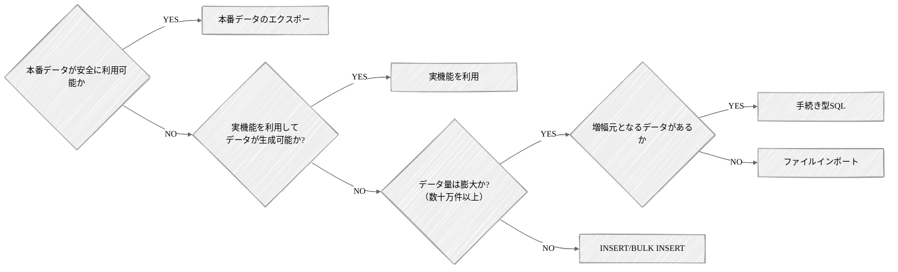

#### 本番データのエクスポート/インポート

本番環境のデータをエクスポートし、それをテスト環境にインポートして利用できる場合、データの再現度という観点では一番正確なアプローチとなる。

ただし、本番環境のデータには個人情報やそれに類する秘匿情報が含まれている可能性があり、扱いは慎重にならなければならない。

セキュリティポリシー上、根本的に本番環境のデータの持ち出しが認められていない場合も多い。また、仮にポリシーがなかったとしても秘匿性の高い情報をそのままテスト環境で利用するのは論外である。秘匿性の高い情報を除外・マスクした上でエクスポートできる、セキュアにデータを利用できる仕組みがある場合や、根本的に秘匿性の高いデータを含まない場合にのみ、本番データの利用を検討することが望ましい。

#### ファイルインポート

データをCSV形式などのファイルで用意し、データベースの機能を用いて、データを一括でロードするアプローチとなる。

Amazon Aurora PostgreSQLを利用している場合、① psql の \\copy コマンドを利用する方式と ② [aws_s3 拡張機能](https://docs.aws.amazon.com/ja_jp/AmazonRDS/latest/UserGuide/USER_PostgreSQL.S3Import.InstallExtension.html)を利用する方式の2つがある[^6]。

|                    | \\copy コマンド                                | aws_s3 拡張機能                               |
| :----------------- | :--------------------------------------------- | :-------------------------------------------- |
| ファイルの配置場所 | psqlクライアント                               | Amazon S3                                     |
| 実行主体           | psqlクライアント                               | Aurora エンジン（内部処理）                   |
| 転送速度           | ネットワーク帯域に依存                         | 高速                                          |
| セットアップ       | 不要（psql による接続のみ）                    | 必要（IAMロール, バケット, 拡張機能の有効化） |
| 安定性             | クライアント \~ データベースの接続断で中断する | データベース内部処理のため安定している        |
| 圧縮ファイル       | \-                                             | gzip形式を解凍できる                          |

#### 手続き型SQL（PL/pgSQL）

データベース内部で完結して大量のレコードを直接生成するアプローチとなる。

アプリケーションプログラムからSQL文を繰り返し発行する方法と比較して、アプリケーションとデータベース間の通信回数が抑えられるため、効率的な処理が可能となる。例えばあるユーザのデータを100万人分のデータに増やすというように増幅元となるデータが存在し、そのデータの主キーを変えながら繰り返し増幅していくようなケースでは非常に有効な手段となる。

#### INSERT / BULK INSERT

アプリケーションプログラムやスクリプトから、標準的なSQL文を用いてデータを投入するアプローチとなる。

SQL文の解析やネットワークのオーバーヘッドが大きいため、大量データの投入には不向きである。データが小規模（多くて数万件まで）な場合や、複雑なロジックを通してSQL文を生成しながらデータを正確に作成したいケースにおいて利用することが望ましい。

#### 実機能を利用

データ投入のためのツールやスクリプトを新規に用意せずとも、システムが持つ実機能を利用してデータを作成できる場合がある。

例えばバッチ処理によってオンライン処理で参照するデータが生成されるもの（例. I/Fファイルの集信）や、その逆でオンライン処理の実行によりデータが生成されるもの（例. 実行履歴などのトランザクションデータ）などが考えられる。このような場合、既存の実機能が利用できないか、まず検討すると良い。既存機能では時間が膨大にかかる、柔軟にデータが用意できないといった制約がある場合は、データ投入用の機能を用意する。

### 大量データ作成時の事前準備

数百万件から数千万件規模の大量データを効率的に作成するために、事前準備として効果的な手法は次の通りである。

- **インデックスを一時的に削除する**  
  インデックスを張ったままだとデータの投入ごとにインデックスの更新処理が走り、書き込み負荷が増大する。
  PKインデックスを含めてデータ投入前にインデックスを削除しておき、全てのデータ投入が完了した後でインデックスを再作成する
- **外部キー制約を削除する**  
  投入される各レコードに対して参照整合性のチェックが実施されるのを防ぐ。
  インデックスと同様、全てのデータ投入が完了した後で外部キー制約を再作成する
- **データベースのスペックを増強する**  
  大量データの投入にあたっては、CPUやメモリをはじめ、特に書き込みIOPSがボトルネックになる。
  データ投入時のみインスタンスタイプをスケールアップし、投入後に元に戻す
- **autovavuumを停止する**  
  大量データの投入中はVacuumが頻繁にトリガーされ、不要なI/Oを消費する。
  作業中はVacuumを停止し、投入完了後に手動で ANALYZE と VACUUM を実行する。

### データパターンの考え方

データを準備するにあたって、単にレコード件数を揃えるだけでなく、どのような分布や属性を持つデータを用意するかを検討しなければならない。

不適切なデータパターンでテストを実施すると、インデックスが適切に利用されなかったり、実行計画が本番環境と大きく乖離したりすることで、正しい評価ができなくなる恐れがある。

データパターンを検討するにあたって考慮すべきポイントは次の通りである。

- **カーディナリティ（多重度）**  
  カーディナリティとはカラムに含まれるユニークな値のバリエーションのことである。
  例えばユーザの属性として「出身の都道府県」があるとき、カーディナリティは47（都道府県）となるようにデータを作成する必要がある。
  全都道府県を作成するのが面倒だからといって、全て関東の1都6県だけにしてはならない。
- **スキュー（偏り）**  
  スキューとは特定のキーへのデータの集中や分布の偏りのことである。
  特にインデックスが設定されているカラムや、パーティションキーとして利用しているカラムにおいては、適切な偏りを心がける。
  先ほどの都道府県の例では、カーディナリティが47であっても、特定の県だけが全体の99％を占めていたり、全ての比率が均等であったりしてはならない。
  出身の都道府県であれば、人口統計にもとづきその比率が決定されることが望ましい。ほかにも履歴などのトランザクションデータは日付を持つことが一般的だが、特定の日付にデータが偏ることは望ましくない。
- **関連テーブルの比率**  
  関連テーブルの比率とは、親テーブル/子テーブルや交差テーブルなど1:NやN:Nの関係性を持つテーブルのレコード件数比のことである。
  この比率が実態と乖離すると、結合処理時にメモリ上に展開されるデータ量やループ処理の回数が変わり、実行計画が変わり得る。

## テストスクリプトを用意する

選定した負荷ツールを用いてテストを実行するためのテストスクリプトを用意する。

テストスクリプトの品質は、テストの信頼性や再現性に直結するため、単に負荷をかけるだけのスクリプトを書くのではなく、いくつかの観点を押さえて作り込む必要がある。

### テストシナリオの基本構造

スクリプトは一般的に次の3つのフェーズに分けて構成する。

- **事前処理**  
  テスト本体の実行に必要な準備。
  ユーザ認証によるトークン取得、テスト対象データのIDの採番、ランダムなリクエストパラメータの生成などが該当する。事前処理の結果はテスト本体の各リクエスト内で参照できるようにしておく。
- **テスト本体**  
  実際に負荷をかける処理を実装する。
  計測対象となる処理はこのフェーズに含め、事前処理や事後処理の時間が計測結果に混入しないように注意する。ラッシュテストなどでシナリオとして複数機能を順番に呼び出す場合は、機能間の関連性（例. 一覧検索で取得したIDを詳細取得のリクエストに渡す）を正しく表現する。
- **事後処理**  
  テスト実行後に残ったデータやリソースのクリーンアップを行う。
  テスト実行中に作成された一時データの削除、認証セッションの解除などが該当する。

ツールによってこれらのフェーズをサポートする機能は異なる（例. k6の場合は setup/default/teardown）が、考え方は共通である。

### 繰り返し実行可能にする

テストスクリプトはボリュームテスト・ラッシュテスト・ロングランテスト・ストレステストといった各テストで同じスクリプトを繰り返し実行することが前提となる。 特にチューニングフェーズでは、修正と再テストを何度も繰り返すため、「1回目は動くが2回目以降は動かない」「前回のデータが残っていると失敗する」といったシナリオは致命的である。

繰り返し実行可能（= 冪等）なシナリオを作成するためのポイントは次の通りである。

- **動的なデータ生成**  
  一意制約のあるカラムにリクエストごとに一意の値を生成して投入する。
  UUIDやタイムスタンプ、VU番号とイテレーション番号の組み合わせなどを活用する。
- **事後処理によるクリーンアップ**  
  テスト中に作成したデータは事後処理で削除するか、別途クリーンアップスクリプトを用意しておく。ただしロングランテストのように長時間大量のデータを投入し続けるテストでは、クリーンアップよりもテスト後にデータベースをリストアする方が効率的なケースも多い。

### 現実的な負荷パターンを再現する

本番環境での実態に近い負荷をかけるためには、次のような観点で現実性を意識する必要がある。

- **思考時間（Think Time）の設定**  
  実際のユーザは画面操作と画面操作の間に考える時間や入力する時間が発生する。これを無視して連続的にリクエストを投げ続けると、実態からかけ離れた過剰な負荷となる。シナリオ上でのリクエスト間隔には適切な思考時間を挟むことが望ましい。
- **リクエストパラメータの分散**  
  同じパラメータを繰り返し投げると、アプリケーションやデータベースのキャッシュに過剰にヒットしてしまい、実態よりも良い結果が出てしまう。検索条件や参照IDはランダムに分散させる、あるいは本番のアクセスログの傾向にもとづいて分布を調整することが望ましい。

## スタブを用意（有効化）する

性能テスト対象のシステムが外部システムに依存しており、かつ外部システムを性能テストの範囲に含めない場合は、スタブを用意（有効化）する必要がある。

これには大きく次の2つのアプローチがある。

- 独立したプロセスやサーバとして用意する（推奨）
- スタブオブジェクトとしてプログラムレベルで差し替える

基本的には、接続待ちやネットワークI/Oの挙動を含めて、実態に近い負荷を再現できる前者のアプローチを推奨する。ただし工数や環境の制約および対象機能の影響度などを考慮して前者での実現が難しい場合は、後者のアプローチも許容する。

どちらのアプローチを採用するにあたっても、リクエストに対して一定の遅延（設定可能なスリープ等）を含めた正常応答を、十分なスループットで返却できるように構成することが望ましい。

## メトリクスダッシュボードを用意する

性能テスト計画で定めたメトリクスを一元的に可視化・分析するためのダッシュボードを構築する。

先述したメトリクスの定義と同じく、ダッシュボードは性能テストのためだけのものではなく、システムの運用監視の文脈で構築されるべきものである。

すでにダッシュボードが存在する場合は、そのダッシュボードをベースとしつつ、必要に応じてテスト用途でのメトリクスを肉付けしていく。新規に構築するシステムにおいては運用監視基盤の設計・構築が並行して進んでおり、この段階でダッシュボードが存在しないという可能性もある。事前に運用監視基盤の設計・構築担当者とコミュニケーションを取りながらスケジュールや分担について調整することが望ましい。

### AWSを利用する場合の考慮ポイント

性能テストにおいては、ボトルネックを正確に把握するために、標準設定よりも詳細なメトリクスを収集するオプションを有効化することが望ましい。

これらの設定は別途メトリクス料金やログ保存料金が発生するため、本番環境ではコストとの兼ね合いになるが、本番環境で有効化しない場合であっても性能テスト期間においては原因特定にかかる工数を最小化することを優先し、フルスペックでの監視構成を推奨する。

| サービス   | 設定                                                         | 設定単位              |
| :--------- | :----------------------------------------------------------- | :-------------------- |
| Amazon EC2 | 詳細モニタリングを有効化する                                 | インスタンス          |
|            | オブザーバビリティが強化されたContainer Insightsを有効化する | クラスタ              |
| Amazon RDS | 拡張モニタリングを有効化する                                 | クラスタ/インスタンス |
|            | Database Insights アドバンスドを有効化する                   | クラスタ/インスタンス |
| Amazon S3  | リクエストメトリクスを有効化する                             | バケット              |

### データベース（PostgreSQL）を使用する場合の考慮ポイント

PostgreSQLでは、拡張機能を有効化することで、クエリの実行統計や実行計画を詳細に収集できる。

| 名前               | 説明                                     |
| :----------------- | :--------------------------------------- |
| pg_stat_statements | 実行統計を収集するための拡張機能         |
| auto_explain       | 自動的に実行計画をログに記録する拡張機能 |

## 素振りする

環境構築が完了したら選定した負荷ツールを利用して試験対象のシステムと疎通する。

疎通対象の機能は極力シンプルなものを利用する。ヘルスチェック用のAPIを用意しているのであればそれを利用する形が良い。また、単なる疎通だけでなく、負荷ツール自体が、計画している最大負荷を安定して生成できるかを確認することが望ましい。

例として先述したタスク管理システムのピーク時スループットの47.2 RPS（ここでは分かりやすく50 RPSとする）を実現するためのk6の設定を示す。

```ts
export const options = {
  scenarios: {
    warmup: {
      executor: "ramping-arrival-rate", // RPSベースで段階的に負荷を上げる
      startRate: 0, // 0 RPSからスタート
      timeUnit: "1s", // RPSの単位は1秒あたり
      preAllocatedVUs: 25, // 初期VU数（レスポンスタイムが 0.5 秒と仮定して 50 / 2 = 25）
      maxVUs: 250, // 最大VU数（初期VU数の5倍程度を指定）
      stages: [
        { target: 50, duration: "30s" }, // 30秒かけて 0 RPS -> 50 RPS へ
        { target: 50, duration: "30s" }, // 30秒間 50 RPS をキープ
        { target: 100, duration: "30s" }, // 30秒かけて 50 RPS -> 100 RPS へ
        { target: 100, duration: "30s" }, // 30秒間 100 RPS をキープ
        { target: 150, duration: "30s" }, // 30秒かけて 100 RPS -> 150 RPS へ
        { target: 150, duration: "30s" }, // 30秒間 150 RPS をキープ
      ],
    },
  },
};
```

これは目標値となるRPSの3倍程度まで安定して負荷がかけられるか段階的に（50 RPS \-\> 100 RPS \-\> 150 RPS）確認している。

最大負荷を安定して生成できるかという点においては、次の観点を満たせば問題ないと判断できる。

- 目標RPSが達成できている（dropped_iterationsが発生していない）
- VUに十分なバッファがある
- k6を実行しているマシンのリソース（CPU・メモリ）やファイル記述子に余裕がある

なお、この時点でサーバが負荷に耐えられない場合は、レスポンスタイムの悪化に伴いvusがmaxVUs（250）付近まで爆発的に増加するという挙動になる。

このような場合、サーバが性能テストに耐えうる状態になっていないため、原因特定の上、サーバインフラのスペック増強などを行う。素振りにおいては極めてシンプルな機能を利用しているため、ここで目標負荷に耐えられない場合は、アプリケーションの実装以前にインフラやネットワークにボトルネックがある可能性が高い。

## クラウドサービスへの各種申請

### Amazon Web Services（AWS）

#### テスト実施自体の申請

通常の負荷ツールを用いてAWSのサービスに対して負荷をかける場合、事前申請は原則不要となる。

ただしフラッド攻撃やリフレクション攻撃など大量のトラフィックを用いて意図的に過負荷状態にしようとするテストはDDoSテストとみなされるため、DDoSのシミュレーションが必要な場合はAWSへの問い合わせが必要となる。詳細は次のポリシーを確認すること。

- [Amazon EC2 テストポリシー](https://aws.amazon.com/jp/ec2/testing/)
- [DDoS シミュレーションテストポリシー](https://aws.amazon.com/jp/security/ddos-simulation-testing/)

#### 各種サービスクォータの緩和申請

性能テストで負荷をかけるにあたって、AWSのクォータ制限がボトルネックになるケースが想定される。

あらかじめ制限に引っかかると予想される場合、実施の1週間～2週間前までを目安に緩和申請を行うことが望ましい。

代表的なものは次のとおりである。

| サービス               | 設定                                                    | デフォルト値 |
| :--------------------- | :------------------------------------------------------ | :----------- |
| Elastic Load Balancing | ロードバランサーキャパシティユニット（LCU per Region）  | 0            |
| AWS Fargate            | 同時実行vCPU数（Fargate On-Demand vCPU resource count） | 4,000        |
| AWS Lambda             | 同時実行数（Concurrent executions）                     | 1,000        |
| Amazon API Gateway     | リクエストスロットリング（Throttle rate）               | 10,000       |

# テスト実行・チューニング

計画・準備が完了したら、テスト計画で定めた段取りにしたがって性能テストを実施する。想定通りの性能が出ない場合はボトルネックを特定し、チューニングを行い、再度テストを実行する。このサイクルを繰り返しながら目標性能に到達させていくのがこのフェーズである。

意識すべき基本方針は次の通りである。

- **事実（ファクト）にもとづいて判断する**  
  「このクエリが遅そう」「このロジックが重そう」といった勘や印象にもとづいた対応は避ける。性能問題は直感と実測が大きく乖離することが珍しくない。常にメトリクスやログ、プロファイリング結果といった計測データを根拠として判断する。
- **最大のボトルネックから潰す**  
  システム全体の性能は、その時点で最も大きなボトルネックに引きずられる形で決まる。それ以外の箇所をいくら最適化しても、システム全体の性能はほぼ改善しないため、影響度の大きいボトルネックから順に対処することが効率的である。
- **一度に1つの仮説だけを検証する**  
  性能問題の原因調査にあたって、複数の変更を同時に加えることは避ける。例えばスレッドプール数とインデックスを同時に変更すると、どちらの変更がどの程度効果があったのか、あるいは逆に性能を悪化させたのかが切り分けられなくなる。修正 → 計測 → 評価を1つずつ積み上げることで、ボトルネックの構造と施策の効果を正確に把握できる。

ここでは、特に重要なボトルネックの特定と解消に焦点を当てて説明する。

## ボトルネックを特定する

ボトルネックの特定は、性能目標が未達の場合の原因調査だけでなく、処理時間の短縮やリソース効率化といったチューニングそのものを目的とする場合にも、最初に実施すべきステップとなる。

いずれの場合においても、やみくもに打ち手を試すのではなく、どこに原因があるかを特定することから始める。原因が特定できていない状態でのチューニングは、効果の薄い対応を繰り返す結果となり、貴重なテスト期間を浪費することになる。

具体的には次のステップで進めていく。

1. **現状の性能値を定義する**  
   現状の性能値と目指す水準を数値で明確にし、目標値との乖離（例. p95が500msに対し1,200ms）を押さえる。
2. **どのレイヤで時間がかかっているかを特定する**  
   分散トレーシングや個別ログから1リクエストの処理時間を分解し、APIゲートウェイ、アプリケーションサーバ、DBサーバ、外部サービスといったレイヤのうち、どこで時間が費やされているのかを把握する。
3. **レイヤ内で具体的な箇所まで絞り込む**  
   特定したレイヤの中でさらに具体的に時間がかかっている箇所を絞り込む。アプリケーションサーバならメソッドトレース、データベースならスロークエリログや実行計画、外部サービスなら応答時間と呼び出し回数などを確認する。
4. **仮説を立てる**  
   絞り込んだ箇所について、原因と対策案を合わせて言語化する。この仮説を次の「ボトルネックを解消する」の出発点とする。

## ボトルネックを解消する

ボトルネックが特定できたら、仮説にもとづいてチューニングを実施する。

チューニングポイントは多岐にわたるが、 ここではアプリケーションサーバ / ランタイム、アプリケーションロジック、DBサーバ、DBスキーマ / DBクエリの各レイヤにおける代表的なチューニング観点を紹介する。

### アプリケーションサーバ / ランタイムのチューニング

アプリケーションサーバやランタイム層では、リクエストを処理するプロセスやスレッドの構成、ランタイムのメモリ管理といった観点でチューニングを行う。コードに手を入れず、設定値の調整で性能を改善できることが多い領域である。

#### スケーリング

CPU・メモリがボトルネックとなっている場合、スケールアップまたはスケールアウトによってリソースを増強することを検討する。アプリケーションサーバはステートレスに設計することが一般的であり、水平方向に分散しやすいため、スケールアウトが基本的な打ち手となる。ただし、1リクエストあたりのリソース消費が大きい処理などスケールアウトで解消しにくいケースではスケールアップが効果的となる。

なお、スケールアップ / スケールアウトはコストに直結するため、安易に実施するのではなく、後述する観点で最適化を実施した上で判断することが望ましい。

::: tip Fargate利用時の性能のばらつき

ECS on Fargateでタスクを起動すると、AWSのバックエンドにある複数の世代のCPUのいずれかに割り当てられる。同じタスク定義（vCPU・メモリ）を指定しても、割り当てられるCPU世代によって差が生じる現象が知られており、一部のコミュニティでは「CPUガチャ」と呼ばれている。

これにより、性能テストでは同じテストを再実行しても結果が安定しない、チューニング前後の効果が比較しにくいというような事象が発生し得る。

公式にはCPU世代を指定する手段は提供されていないため、実務上の対応としては、複数回タスクを起動し直して計測し、平均値や中央値で評価することで影響を緩和する。性能の安定性が最優先となる場合は、FargateではなくEC2やECS Managed Instanceでの運用も検討する。

:::

#### スレッドプール / ワーカープロセス数

アプリケーションサーバ（例. Tomcat / Puma / uWSGI）のスレッド数・ワーカー数は、同時処理能力に直結する。CPUコア数と処理の性質（CPUバウンドかI/Oバウンドか）を踏まえて設定する。I/Oバウンドな処理が中心の場合は、コア数の倍以上のスレッドを割り当てることでリソースを有効活用できるケースが多い。

なお、単純にスレッド数を増やせばスループットが線形に向上するわけではなく、DBコネクションやHTTPコネクションといった下流のリソースの競合がボトルネックになる点に留意する。

#### DBコネクション

アプリケーションがデータベースへのアクセスに利用するコネクションプールの設定は、同時処理能力に直結する。スレッドプールを増やしてもスループットが向上しないケースの多くは、その先のコネクションプールが不足していることに起因する。

コネクションプールサイズは、上流のスレッド数とデータベース側の最大コネクション数の両方を踏まえて設定する。スレッド数を超えるコネクションは使われず、データベース側の上限を超えるコネクションは滞留するだけで、いずれも有効に機能しない。また、安定性を重視するなら、コネクションプールの最小サイズと最大サイズは同じ値に設定することを推奨する。

最小値が低いと、負荷の立ち上がり時にコネクションが順次確立されることで初期のレスポンスタイムが悪化したり、負荷の変動に応じてコネクションの生成・破棄が頻繁に発生してデータベース側のオーバーヘッドが生じたりする。最小値 \= 最大値とすることで、コネクション数が安定し、データベース側のリソース使用も予測しやすくなる。ただし、平常時にもプール分のコネクションを保持し続けるため、アプリケーションサーバの台数が多い場合は、台数 × プールサイズがデータベース側の上限を圧迫しないよう設計する必要がある。

::: tip Go（`database/sql`）におけるコネクションプール

Goの `database/sql` パッケージにおけるコネクションプール設定は、他言語と考え方が異なる点に留意する。

`SetMaxOpenConns` のデフォルトは無制限、`SetMaxIdleConns` のデフォルトは2であり、並列性の高いアプリケーションではこのままだとコネクションの生成と破棄が頻繁に繰り返される。

[公式ドキュメント](https://go.dev/doc/database/manage-connections)では、並列性に応じて `SetMaxIdleConns` を引き上げることに加え、`SetConnMaxIdleTime` を組み合わせることで、バースト時には多くのアイドルコネクションを許容しつつ、平常時には自動的に縮退させる弾力的なプール構成が示されている。

加えて、Auroraのフェイルオーバーや経路上のネットワーク機器のタイムアウトを考慮し、`SetConnMaxLifetime`を併せて設定することが望ましい。短すぎるとコネクションの再作成頻度が上がり性能が劣化するため、数分〜1時間程度を目安に調整する。

:::

#### ランタイム（Java）

Javaランタイムのチューニングでは、主にメモリに関するパラメータがポイントとなる。

- **ヒープメモリ**  
  ヒープが小さすぎると頻繁にGCが発生しスループットが低下するだけでなく、ヒープ不足により `OutOfMemoryError` が発生し、アプリケーションが正常に動作しなくなる可能性がある。
  従来は `-Xms` / `-Xmx` で初期ヒープサイズと最大ヒープサイズを絶対値で指定していたが、コンテナ環境では1コンテナ1プロセスが基本となるため、`-XX:InitialRAMPercentage` や `-XX:MaxRAMPercentage` / `-XX:MinRAMPercentage` といったパラメータを利用して、コンテナのメモリに対する割合でヒープサイズを指定することが望ましい。
  また、初期ヒープサイズと最大ヒープサイズは同じ値に設定することが望ましい。起動後のヒープ拡張に伴うGCの発生を避けられるだけでなく、ヒープの使用量をコンテナに割り当てたメモリ上限と整合させることで、ヒープ拡張時に物理メモリを超えてOOM Killerによってコンテナが強制終了されるといった意図しない事態を防ぐことにもつながる。
- **Metaspace**  
  クラスメタデータが配置される領域で、ヒープとは別に管理される。
  デフォルトでは上限がなくOSメモリを圧迫し続けるため、`-XX:MaxMetaspaceSize` で明示的に上限を設定することが望ましい。Spring Bootなどリフレクションにより動的なクラス生成を多用するフレームワークを利用している場合、長時間稼働によってMetaspaceが徐々に増え続けることがあり、ロングランテストで挙動を確認する必要がある。
- **GCアルゴリズム**  
  JavaではGCアルゴリズムが選択可能であるが、通常のWebアプリケーション（ヒープサイズが数GB程度）であれば、デフォルトのG1GCから変更する必要はまずない。ヒープサイズが数十GBを超える大容量メモリを扱うアプリケーション（例. 分散処理基盤、インメモリキャッシュ）で、かつGC停止時間を極小化したい場合はZGCの採用を検討する。
  なお、GCアルゴリズムの変更はアプリケーションの挙動に大きな影響を与えるため、性能テストで十分に検証した上で採用することが望ましい。

#### コンテナイメージの軽量化

アプリケーションをコンテナで提供する場合、イメージサイズが大きいとスケールアウト時のPull時間がスケール速度に影響する。マルチステージビルドや軽量ベースイメージの利用を検討する。性能テストの文脈では、オートスケールの立ち上がり時間が負荷の増加スピードに追従できるかという観点で効いてくる。

::: tip Javaアプリケーションにおけるjlinkの活用

Javaアプリケーションをコンテナで提供する場合、従来はJRE（Java Runtime Environment）を同梱する方式が一般的だったが、Java 9以降は jlink を用いてアプリケーションが実際に利用するモジュールだけを含むカスタムランタイムを構築する方式が選択肢となる。

不要なモジュールを排除できるため、JREを丸ごと同梱する場合と比較してコンテナイメージを大幅に小さくできる。OpenJDK本家もJava 9以降、汎用的なJREをレガシーとみなし、jlink によるカスタムランタイムの利用を推奨[^7]している。ただし利用しているフレームワーク（例. Spring Boot）や動的に読み込まれるモジュールが多いアプリケーションでは、必要なモジュールの特定が難しく削減効果が限定的となる場合もあるため、適用可否は特性を踏まえて判断する必要がある。

:::

### アプリケーションロジックのチューニング

アプリケーションロジックでは、処理の実行方式やデータの取得・返却の仕方といった観点でチューニングを行う。

効果は大きいものの修正コストも大きいため、全体的な対応方針を定めた上で実施することが望ましい。

#### N+1問題の解消

GraphQLやO/Rマッパ利用時などにしばしば発生する典型的なアンチパターンであり、一覧取得したエンティティに対してループの中で関連エンティティを個別にクエリ発行してしまう問題である。Eager LoadingやJOINクエリ、IN句を用いた一括取得への書き換えで解消する。

#### 並行処理

1つのリクエスト処理の中で、独立して実行可能な複数の処理（例. 複数の外部API呼び出し、依存関係のないDB問い合わせ）を直列で実行している場合、これらを並行実行に書き換えることで全体のレスポンスタイムを短縮できる。 特にI/O待ち時間が支配的な処理では、並行化の効果が大きい。

一方で、並行処理は例外のハンドリングやトランザクション境界をはじめとしてコードの複雑度を引き上げる。そのため、場当たり的に並行化を適用するのではなく、どのようなケースで並行処理を採用するかという方針をシステム全体で定めた上で、個別機能への適用を判断することが望ましい。

#### キャッシュの利用

参照頻度が高く、更新頻度の低いデータは、キャッシュにより大幅に性能改善が見込める。

キャッシュにはローカルキャッシュ、分散キャッシュ（例. Redis / Valkey / memcached）、HTTPキャッシュ（例. CDN / API Gateway）などいくつかの形態があるため、特性に応じて使い分ける。ただし、キャッシュの導入可否や配置場所といった方針は、本来はシステムアーキテクチャ設計の段階で判断されているべきものである。特に分散キャッシュサーバの新規導入はアーキテクチャ上の大きな変更となり、広範囲の設計見直しが必要となるため、性能テストの段階の打ち手として現実的でない。

性能テストのチューニングにおいては、キャッシュの処理方式があらかじめ整備されている前提で、どのデータをキャッシュに乗せるか、どの程度のTTLを設定するかといったパラメータレベルの調整に留めることが望ましい。

#### 非同期化

同期的にレスポンスを返す必要がない処理（例. メール送信、帳票生成）は、メッセージキュー（例. Amazon SQS）を介して非同期化することで、オンライン処理のレスポンスタイムを改善し、スループットを向上させることができる。

ただし非同期化は、リトライ戦略やDLQ設計、結果整合性を前提とした補償処理など、システム全体のアーキテクチャに広く波及する。キャッシュと同様、本来はアーキテクチャ設計の段階で判断されているべきものであり、性能テストの段階で打ち手として新規に持ち込むのは現実的ではない。基盤があらかじめ整備されている前提で、どの処理を非同期化するか、ワーカーの並列度をどう設定するかといったパラメータレベルの調整に留めることが望ましい。

#### ページング

一覧系の参照処理で大量のデータを一度に返している場合、ページングを導入することでレスポンスタイムとメモリ使用量の双方を改善できることがある。

代表的なページング方式には、オフセット・リミット方式やカーソル方式があるが、各方式の特徴については「[Web API設計ガイドライン \- ページング](https://future-architect.github.io/arch-guidelines/documents/forWebAPI/web_api_guidelines.html#%E3%83%98%E3%82%9A%E3%83%BC%E3%82%B7%E3%82%99%E3%83%B3%E3%82%AF%E3%82%99)」を参照されたい。オフセット・リミット方式のページングを既に採用している場合でも、深いページングによる性能劣化が発生することがあるため、その場合はカーソル方式への切り替えや、そもそも深いページングを発生させないUIへの見直しを検討すると良い。

::: tip 最後のページへのリンクは避けるべき

オフセット・リミット方式では、レスポンスにデータの総件数を含めることで、クライアントは「全 1,000 件中 201〜300 件を表示」といった表示や、「最初」「前へ」「次へ」「最後」といったページングUIを実現できる。しかし、大量のデータを扱う場合には「最後のページ」へのリンクを提供することがパフォーマンス面で問題となる可能性がある。 その理由としては、一般的なリレーショナルデータベースにおけるOFFSET/LIMITは、内部的には「先頭から順番にスキャンして、指定された件数をスキップする」処理が行われるためである。膨大なデータ量に対して最後のページとなるオフセットを指定する場合は、末尾まで辿る処理コストがかかると考えられる。

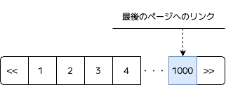

最後のページへのリンクがエンドユーザにとって必要性が低いと考えられる場合はリンク自体を省略し、必要性が高い場合には検索結果の昇順・降順を切り替えて先頭のページから移動できるようにするなど、処理コストが極力かからないような設計が望ましい 。

:::

#### 部分レスポンス

参照系のAPIが常にエンティティの全項目を返している場合、クライアントが実際には必要としない項目までを無駄に転送することになり、各種リソースの無駄遣いにつながる。クライアントが必要な項目のみを指定できる部分レスポンス（例. fieldsパラメータによる指定）を導入することで、これらのコストを削減できる。

全APIに一律で導入すると実装・保守のコストが大きくなるため、項目数が多く転送量の削減効果が大きい処理に絞って適用することが望ましい。 このような設計はGoogleが提供するWeb API[^8]でも採用されている。

#### ログの最適化

ログ出力は一見軽い処理に見えるが、リクエストごとに通る経路やループ内で大量に呼ばれている場合、文字列の組み立てやI/Oがレスポンスタイムやスループットを大きく低下させる要因になり得る。アプリケーションロジックの個々の処理に明確な遅延要因が見当たらないにもかかわらず性能が伸びない場合は、ログ出力を疑うと良い。代表的な見直し観点は次の通りである。

- **頻繁に呼ばれるログの削減**  
  ループ内で1件ずつ出しているログは、サンプリング（例. 1万件ごとに1件）やループ外での集計出力に切り替える。
- **遅延評価の徹底**  
  ログレベルの判定前に文字列連結や `toString()` が走らないように、ロガーが提供する遅延評価の仕組みを利用する。
  例えばJavaではSLF4Jのプレースホルダを利用する。
- **非同期ロギング**  
  同期的にI/Oが走るロガーを利用している場合は、ログ出力を非同期化し、I/O待ちがリクエスト処理時間に乗らないようにする。
  例えばJavaのLogbackではAsyncAppenderを利用する。
- **巨大なペイロードの除外**  
  リクエスト/レスポンスのボディやオブジェクトを丸ごと出力しているログは、通常時は必要な項目のみに絞り、エラー時など調査が必要な場面に限ってフルダンプを出力する。

ログ設計の段階で押さえておくべき指針については「[ログ設計ガイドライン \- 性能](https://future-architect.github.io/arch-guidelines/documents/forLog/log_guidelines.html#%E6%80%A7%E8%83%BD)」を参照されたい。

### DBサーバのチューニング

DBサーバでは、インスタンスのスケーリングやレプリカ構成、DBエンジンのパラメータといった観点でチューニングを行う。RDBはスケールアウトが難しく、多くのシステムにおいて最終的なボトルネックとなりやすい部分である。

#### スケーリング

CPU・メモリ・ディスクI/Oがボトルネックとなっている場合、スケールアップを検討する。RDBはアプリケーションサーバと異なり、状態を持つため水平方向に分散させることが難しく、インスタンスタイプを上げるスケールアップが基本的な打ち手となる。

ただしアプリケーション側のクエリやスキーマが非効率なままリソースだけを増強しても根本的な解決にはならないため、後述するパラメータの最適化やスロークエリの解消といったチューニングを実施した上で判断することが望ましい。

#### リードレプリカ

参照系のワークロードが多い場合、リードレプリカを追加し、参照クエリを分散させることでプライマリの負荷を軽減できる。

ただし、レプリケーション遅延による読み取り不整合が許容できるかは機能ごとに判断が必要である。一時的な不整合が許容できない場合は、書き込み直後の参照（例. 登録後の登録内容確認）はプライマリに向けるなどのルーティング設計を組み込むアプローチもある。

詳細については「[PostgreSQL設計ガイドライン \- リードレプリカ](https://future-architect.github.io/arch-guidelines/documents/forDB/postgresql_guidelines.html#%E3%83%AA%E3%83%BC%E3%83%88%E3%82%99%E3%83%AC%E3%83%95%E3%82%9A%E3%83%AA%E3%82%AB)」を参照されたい。

#### パラメータ

DBのエンジンに応じたパラメータの最適化を行う。PostgreSQLのチューニング対象となる主要なパラメータには次のものがある。

| 名前            | 説明                                                                                         |
| :-------------- | :------------------------------------------------------------------------------------------- |
| fillfactor      | テーブルやインデックスに新しいデータを挿入する際にページにどれだけ空きスペースを残すかの設定 |
| shared_buffers  | データをキャッシュするために使用する共有メモリバッファのサイズ                               |
| work_mem        | ソートやハッシュ処理などの中間データを保持する作業用メモリのサイズ                           |
| plan_cache_mode | プリペアド文において、汎用プランとカスタムプランのどちらを使用するかの制御                   |

詳細については「[PostgreSQL設計ガイドライン \- パラメータ](https://future-architect.github.io/arch-guidelines/documents/forDB/postgresql_guidelines.html)」を参照されたい。

#### VACUUM / ANALYZE の調整

更新・削除が多いテーブルではデッドタプルが蓄積し、性能が劣化する。

PostgreSQLではVACUUMで不要領域を回収し、ANALYZEで統計情報を最新化するautovacuumがデフォルトで有効になっているが、デフォルトの設定だと想定通りにVACUUMが動かないといったケースがある。そのような場合は、次のようなautovacuumの閾値を個別に調整することが有効となる。

| 名前                           | デフォルト値 | 説明                                                         |
| :----------------------------- | :----------- | :----------------------------------------------------------- |
| autovacuum_vacuum_threshold    | 50           | VACUUMを起動するために必要な最低限の不要領域のレコード数     |
| autovacuum_vacuum_scale_factor | 0.2          | VACUUMを起動するために必要な最低限の不要領域のレコードの割合 |

また、バッチ処理による大量データ投入・削除後は後処理として `ANALYZE` を実行して統計情報を更新し、プランナが適切な実行計画を選択できる状態を維持することも有効である。

### DBスキーマ / DBクエリのチューニング

#### スロークエリの特定

DBクエリのチューニングはボトルネックとなっているクエリを特定することから始まる。

PostgreSQLでは次のパラメータを設定することで一定時間を超えたクエリとその実行計画をログに出力できる。閾値を下げすぎるとログ出力自体が書き込みI/Oを圧迫しボトルネックとなるため留意する。

| 名前                          | 設定値（例） | 説明                                      |
| :---------------------------- | :----------- | :---------------------------------------- |
| log_min_duration_statement    | 300000       | 5分以上のクエリをログに出力する           |
| auto_explain.log_min_duration | 300000       | 5分以上のクエリの実行計画をログに出力する |
| auto_explain.log_format       | text         | ログ出力の形式をTEXT形式とする            |

なお、ログは個別のスロークエリを把握するのに有効だが「閾値には達しないが大量に実行されているクエリ」などを見逃しやすい。pg_stat_statementsを合わせて利用することで、実行回数・累積実行時間・平均実行時間といった統計情報にもとづいてクエリを抽出でき、次のような観点で分析できる。

- 実行回数が極端に多いクエリ
- 累積実行時間が長い（システム全体への影響が大きい）クエリ

ログに出力されないクエリに対しては EXPLAIN (ANALYZE, BUFFERS) を手動実行して実行計画を取得する。

#### インデックスの作成

WHERE句、JOIN条件、ORDER BY、GROUP BYで利用されるカラムなどにインデックスを作成することで参照時の性能を向上できる。ただしインデックスは更新時のオーバーヘッドを伴うため、更新頻度の高いテーブルに過剰なインデックスを張るのは避ける。

詳細については「[PostgreSQL設計ガイドライン \- インデックス設計](https://future-architect.github.io/arch-guidelines/documents/forDB/postgresql_guidelines.html#%E3%82%A4%E3%83%B3%E3%83%86%E3%82%99%E3%83%83%E3%82%AF%E3%82%B9)」を参照されたい。

#### パーティショニング

データ量が巨大（数百万レコード以上）かつデータ改廃が必要になるトランザクションテーブルはパーティション化することが望ましい。

詳細については「[PostgreSQL設計ガイドライン \- パーティション設計](https://future-architect.github.io/arch-guidelines/documents/forDB/postgresql_guidelines.html#%E3%83%8F%E3%82%9A%E3%83%BC%E3%83%86%E3%82%A3%E3%82%B7%E3%83%A7%E3%83%B3%E8%A8%AD%E8%A8%88)」を参照されたい。

#### バッチインサートとバルクインサート

大量のデータを登録する処理ではINSERTの実行方式によって性能が大きく変わる。1件ずつINSERTを発行する方式は1件ごとにクライアント / サーバ間の往復が発生するため、件数の増加に従い処理時間が極端に遅くなる。

これを回避する方式としてバルクインサートとバッチインサートがある。

|                  | バルクインサート                                                    | バッチインサート                                                                                                           |
| :--------------- | :------------------------------------------------------------------ | :------------------------------------------------------------------------------------------------------------------------- |
| 概要             | 1つのINSERT文に複数行のVALUES句を指定して複数件を同時に登録する方式 | 同一のINSERT文に対する複数のパラメータセットを束ねてサーバへ送信する方式                                                   |
| 仕組み           | 1つのINSERT文に複数行のVALUES句を指定するSQL文法そのものの機能      | PostgreSQLの拡張クエリプロトコル（Extended Query Protocol）に代表されるSQLのパース・バインド・実行を分離して実行できる機能 |
| 利用手段         | 任意のSQLクライアント（特別なクライアント機能を必要としない）       | プロトコル機能に対応したDBドライバ（例. JDBCの `PreparedStatement.addBatch()` / PreparedStatement.executeBatch()）         |
| SQL文のサイズ    | 件数に比例して増加                                                  | 固定                                                                                                                       |
| メモリ使用量     | 件数に比例して増加                                                  | 安定                                                                                                                       |
| 適切なデータ件数 | 数十件まで                                                          | 数百件～                                                                                                                   |

原則として**バッチインサートを採用**する。バルクインサートは件数が数十件以下に限定される処理や、計測の結果バッチインサートを上回る性能が確認でき、かつメモリ・CPU使用量の増加を許容できる場合にのみ採用する。

利用しているライブラリによってはバッチインサートにおいては何件ごとにデータベースに送信するかを制御することができる。最適なバッチサイズとしては1000件を推奨する。（参考：[uroboroSQL ベストプラクティス](https://future-architect.github.io/uroborosql-doc/best_practices/#%E6%9C%80%E9%81%A9%E3%81%AA%E3%83%8F%E3%82%99%E3%83%83%E3%83%81%E3%82%B5%E3%82%A4%E3%82%B9%E3%82%99)）

#### クエリの最適化

同じ結果を返すクエリであっても、SELECTにおけるワイルドカードの使用を避けたり、`NOT IN` ではなく `NOT EXISTS` を使ったりすることでクエリ自体の性能を最適化できる。

詳細については「[SQLコーディング規約（PostgreSQL） \- パフォーマンス性](https://future-architect.github.io/coding-standards/documents/forSQL/SQL%E3%82%B3%E3%83%BC%E3%83%87%E3%82%A3%E3%83%B3%E3%82%B0%E8%A6%8F%E7%B4%84%EF%BC%88PostgreSQL%EF%BC%89.html#sql-%E3%82%B3%E3%83%BC%E3%83%86%E3%82%99%E3%82%A3%E3%83%B3%E3%82%AF%E3%82%99%E8%A6%8F%E7%B4%84-%E3%83%8F%E3%82%9A%E3%83%95%E3%82%A9%E3%83%BC%E3%83%9E%E3%83%B3%E3%82%B9%E6%80%A7)」を参照されたい。

#### ヒント句による実行計画の制御

データベースのクエリプランナは統計情報にもとづいて最適な実行計画を自動的に選択するが、統計情報の偏りやクエリの複雑さによって意図しない実行計画が選択され、性能が劣化するケースがある。このような場合、ヒント句（PostgreSQLの場合はpg_hint_plan拡張によって提供される）を用いることで、結合方式やスキャン方式、結合順序などを明示的に指定し、実行計画を制御できる。

ヒント句はあくまで最終手段であり、まずは統計情報の更新やインデックスの見直し、クエリそのものの書き換えで解消できないかを検討すべきである。ヒント句による固定化は、将来的なデータ量や分布の変化に追従できなくなるリスクを伴うためである。

詳細については「[PostgreSQL設計ガイドライン \- SQLチューニング](https://future-architect.github.io/arch-guidelines/documents/forDB/postgresql_guidelines.html#sql%E3%83%81%E3%83%A5%E3%83%BC%E3%83%8B%E3%83%B3%E3%82%AF%E3%82%99%E6%96%B9%E9%87%9D)」を参照されたい。

# レポーティング

性能テストを一通り実施し終えたら、テスト結果を分析した上でレポーティングを実施する。

## レポーティングに含めるべき内容

1. テスト概要（テスト計画の抜粋）
   - 性能テストの目的
   - 性能テストのスコープ
   - 性能テストのカテゴリ
   - 性能要件・目標値
2. ボリュームテスト結果
3. ラッシュテスト結果
4. ロングランテスト結果
5. ストレステスト結果

## ボリュームテストのレポーティング

### オンライン処理

オンライン処理は機能単位の処理時間をレポートする。

最小（min）、最大（max）、平均（avg）、中央値（p50）のほかに、性能要件や目標値に応じたパーセンタイル値での処理時間を記載する。

| 機能名         | 目標値 | min    | avg    | p50    | p80    | p90    | p95    | max    | 判定 |
| :------------- | ------ | ------ | ------ | ------ | ------ | ------ | ------ | ------ | ---- |
| タスク一覧取得 | 500    | 80.24  | 112.72 | 103.46 | 118.48 | 145.72 | 179.61 | 234.26 | ✅   |
| タスク詳細取得 | 500    | 70.01  | 94.71  | 91.07  | 105.16 | 108.31 | 112.06 | 272.72 | ✅   |
| タスク登録     | 800    | 116.69 | 347.55 | 330.95 | 371.13 | 414.08 | 446.03 | 550.56 | ✅   |
| タスク更新     | 800    | 126.63 | 160.69 | 160.53 | 169.09 | 177.27 | 182.03 | 217.60 | ✅   |
| タスク削除     | 800    | 350.00 | 437.29 | 422.56 | 455.67 | 480.21 | 548.00 | 798.22 | ✅   |
| …              | …      | …      | …      | …      | …      | …      | …      | …      | …    |

※ 処理時間の単位：ms

### バッチ処理

バッチ処理は、機能単位の処理時間とバッチ・スループット（目標値として定めている場合のみ）をレポートする。

バッチ処理はオンライン処理と異なり、大量の試行回数を必要としないため、最小・最大・平均などの統計値を記載する必要はない。

| 機能名             | 目標処理時間 | 実測処理時間 | データ件数 | 件/秒      | データサイズ | MB/秒     | 判定 |
| :----------------- | -----------: | -----------: | ---------- | ---------- | ------------ | --------- | :--: |
| タスク集計         |         60分 |     45分12秒 | 2,500万件  | 9,218件/秒 | 5.0GB        | 1.89MB/秒 |  ✅  |
| タスクファイル受信 |         30分 |     27分45秒 | …          | …          | …            | …         |  ✅  |
| タスクファイル送信 |         30分 |     20分23秒 | …          | …          | …            | …         |  ✅  |

## ラッシュテストのレポーティング

ラッシュテストの結果は、シナリオ単位に処理時間・スループット・エラー率・リソース使用率を整理する。

ボリュームテストとは異なり、同時アクセス負荷をかけた状態での性能指標値を示すことが目的である。

### シナリオの性能指標

シナリオごとに、スループットとエラー率を負荷パターン別に整理する。

#### シナリオ全体

| シナリオ名    | 負荷     | 目標RPS  | 実測RPS  | エラー率 | 判定 |
| :------------ | -------- | -------- | -------- | -------- | :--: |
| シナリオ（1） | 通常時   | 11.8 RPS | 12.1 RPS | 0.00%    |  ✅  |
| シナリオ（1） | ピーク時 | 94.4 RPS | 94.8 RPS | 0.02%    |  ✅  |
| シナリオ（1） | 縮退時   | 5.9 RPS  | 6.2 RPS  | 0.04%    |  ✅  |
| シナリオ（2） | 通常時   | …        | …        | …        |  …   |
| …             | …        | …        | …        | …        |  …   |

#### 機能単位

シナリオ全体のRPSだけでなく、各機能が実際にどの程度のスループットで呼び出され、どの処理時間で応答できたかを機能単位で整理する。

例. シナリオ（1） 機能単位詳細（ピーク時）

| 機能                 |  割合 |  実測RPS | エラー率 |     目標値 | mix | ave | p50 | p80 | p90 | p95 | max | 判定 |
| :------------------- | ----: | -------: | -------: | ---------: | --: | --: | --: | --: | --: | --: | --: | :--: |
| タスク一覧検索       | 11.8% | 11.2 RPS |   0.007% | （p90）300 |  92 | 178 | 168 | 205 | 245 | 278 | 412 |  ✅  |
| タスク詳細検索       | 58.8% | 55.9 RPS |   0.002% | （p90）300 |  28 |  65 |  58 |  76 |  98 | 125 | 215 |  ✅  |
| タスクステータス変更 | 29.4% | 27.9 RPS |    0.05% | （p90）500 | 198 | 378 | 365 | 432 | 485 | 548 | 720 |  ✅  |

※ 処理時間の単位：ms

機能単位での確認ポイントは次の通りである。

- ボリュームテスト時の処理時間と比較して大きく劣化している機能があれば、同時アクセス下での競合（ロック待ち、コネクションプール待ち、共有リソースの奪い合いなど）が発生している可能性が高く、追加で分析する
- 特定の機能に偏ってエラーが発生している場合は、原因を確認、対策

### リソースの使用状況

各負荷パターンにおける主要コンポーネントのリソース使用率を記載する。

例. 通常時負荷（11.8RPS）

| コンポーネント          | スペック                    | 台数 | メトリクス   | 目標値   | min | ave | max | 判定 |
| :---------------------- | :-------------------------- | :--: | :----------- | -------- | --- | --- | --- | :--: |
| APサーバ（ECS/Fargate） | 1vCPU/2GiB                  |  4   | CPU使用率    | 30％-60% | 58% | 68% | 82% |  ✅  |
|                         |                             |      | メモリ使用率 | 30％-60% | 35% | 55% | 62% |  ✅  |
| DBサーバ（Aurora）      | 2vCPU/16GiB（db.r8g.large） |  1   | CPU使用率    | 30％-60% | 52% | 62% | 78% |  ✅  |
|                         |                             |      | メモリ使用率 | 30％-60% | 52% | 62% | 66% |  ✅  |

例. ピーク時負荷（94.4RPS）

| コンポーネント          | スペック                    | 台数 | メトリクス   | 目標値   | min | ave | max | 判定 |
| :---------------------- | :-------------------------- | :--: | :----------- | -------- | --- | --- | --- | :--: |
| APサーバ（ECS/Fargate） | 1vCPU/2GiB                  |  4   | CPU使用率    | 30％-80% | 58% | 68% | 82% |  ✅  |
|                         |                             |      | メモリ使用率 | 30％-80% | 35% | 55% | 62% |  ✅  |
| DBサーバ（Aurora）      | 2vCPU/16GiB（db.r8g.large） |  1   | CPU使用率    | 30％-80% | 52% | 62% | 78% |  ✅  |
|                         |                             |      | メモリ使用率 | 30％-80% | 52% | 62% | 66% |  ✅  |

リソース使用率は表による統計値の整理に加えて、時系列でのグラフキャプチャを併載することが望ましい。統計値は傾向と振れ幅を端的に示すことができる一方で、「いつ瞬間的にスパイクしたのか」「負荷の立ち上げに対してリソース使用率が滑らかに追従しているか」といった時系列の挙動は表からは読み取れないためである。CloudWatchなどモニタリングツールのダッシュボードのキャプチャをそのまま貼り付ける形で十分である。

その上で、グラフ上で気になる箇所（突発的なスパイク、想定外の落ち込み、徐々に上昇するトレンドなど）には、吹き出しや注釈で原因や考察を補記することが望ましい。例えば「12:30頃のCPUスパイクは裏側の日次バッチ起動と一致」「14:00頃のメモリ低下はGCによる回収」といった形で、読み手が一見して異常と感じる挙動に対して、これは想定された挙動である / 既に原因を特定済みであるという解釈を添える。

### エラー内訳

エラー率が0％でない場合は、エラーの分析と対策が必要である。

そのエラーが「設計上許容されるもの（例. リトライで成功する一時的な競合）」なのか「本番運用上問題となる異常」なのかを判別し、後者は0％になるよう対応することが望ましい。

| ステータス | 件数 | 割合   | 原因                             | 対応方針                                     |
| :--------- | ---- | ------ | :------------------------------- | :------------------------------------------- |
| 504        | 27件 | 0.018% | ALBアイドルタイムアウト到達      | 30秒から60秒に調整済み                       |
| 500        | 3件  | 0.002% | 起動直後のDBコネクション取得失敗 | コネクションプールのウォームアップ処理を追加 |
| 429        | 12件 | 0.008% | レート制限による意図的な拒否     | 設計通りの挙動のため対応不要                 |
| 合計       | 42件 | 0.028% |                                  |                                              |

### 最適なインフラ構成の検討結果

最適なインフラのスペックや台数の選定にあたっての比較検証結果を整理する。

例えばアプリケーションサーバとDBサーバから構成される場合、それぞれのサーバを同時に変更すると、それぞれの影響を正確に把握できないため、片方を固定し、片方の構成を変更する形で段階的に検証を進めることが前提となる。

具体的には次のような進め方が期待される。

1. DBサーバを十分なスペックで固定し、アプリケーションサーバの最小構成を検証する
2. 1で決定したアプリケーションサーバ構成のもと、DBサーバの最小構成を検証する

#### アプリケーションサーバの構成検討結果

DBサーバを十分なスペック（例. 4vCPU/32GiB：db.r8g.xlarge）で固定し、アプリケーションサーバの構成を変えながらピーク時負荷（94.4 RPS）における性能要件と目標リソース使用率（30％-80%）を満たす最小構成を探る。

| \#  | スペック   | 台数 | RPS | 処理時間 | CPU（min / avg / max） | メモリ（min /avg/max） | 月額コスト | 評価                 |
| :-: | :--------- | :--: | :-: | :------: | ---------------------: | ---------------------: | ---------- | :------------------- |
|  1  | 1vCPU/2GiB |  1   | ❌  |    ❌    |      82％ / 95% / 100% |       65％ / 78% / 85% | $32        | スペック不足         |
|  2  | 1vCPU/2GiB |  2   | ✅  |    ✅    |       45％ / 68% / 82% |       42％ / 55% / 62% | $64        | 最適                 |
|  3  | 1vCPU/2GiB |  3   | ✅  |    ✅    |       28％ / 45% / 58% |       32％ / 42% / 48% | $96        | 過剰（コスト効率悪） |
|  4  | 2vCPU/4GiB |  2   | ✅  |    ✅    |       22％ / 35% / 48% |       28％ / 38% / 42% | $128       | 過剰（コスト効率悪） |

#### DBサーバの構成検討結果

アプリケーションサーバを決定した構成（1vCPU/2GiB × 2台）で固定し、DBサーバの構成を変えながらピーク時負荷（94.4 RPS）における性能要件と目標リソース使用率（30％-80%）を満たす最小構成を探る。

| \#  | スペック                     | 台数 | RPS | 処理時間 | CPU（min/avg/max） | メモリ（min/avg/max） | 月額コスト | 評価                 |
| :-: | :--------------------------- | :--: | :-: | :------: | -----------------: | --------------------: | ---------- | :------------------- |
|  1  | 1vCPU/8GiB（db.r8g.medium）  |  1   | ❌  |    ❌    |  78％ / 92% / 100% |      62％ / 75% / 80% | $108       | スペック不足         |
|  2  | 2vCPU/16GiB（db.r8g.large）  |  1   | ✅  |    ✅    |   42％ / 62% / 78% |      58％ / 62% / 66% | $216       | 最適                 |
|  3  | 4vCPU/32GiB（db.r8g.xlarge） |  1   | ✅  |    ✅    |   18％ / 32% / 45% |      38％ / 45% / 48% | $432       | 過剰（コスト効率悪） |

なお、これらの表は構成パターンごとの選定根拠を示すサマリであり、性能要件（RPS・処理時間）達成の可否とリソース使用率の概況のみを記載している。各構成における機能単位の処理時間（min/avg/p50/p80/p90/p95/max）やエラー率などの詳細指標は、前述の「シナリオ単位の性能指標」と同様の形式でパターンごとに別途整理する形が望ましい。

## ロングランテストのレポーティング

ロングランテストのレポーティングの形式は基本的にラッシュテストのレポーティング形式に準ずる。

ただし、ロングランテストは長時間稼働における安定性・信頼性の評価が主目的となるため、テスト全期間における統計値だけでなく、各指標の時系列推移がレポーティングに含まれているとより望ましい。

### シナリオの性能指標

ラッシュテストと同様、シナリオごとに、処理時間、スループット、エラー率を整理することに加え、時系列での指標値の推移を記載する。

例. シナリオ（1）の時系列推移

| 経過時間 | 実測RPS  | エラー率 | 判定 |
| -------- | -------- | -------- | :--: |
| 0h \- 1h | 12.1 RPS | 0.00%    |  ✅  |
| 1h \- 2h | 12.0 RPS | 0.02%    |  ✅  |
| 2h \- 3h | 12.1 RPS | 0.01%    |  ✅  |
| 3h \- 4h | 12.2 RPS | 0.01%    |  ✅  |
| …        | …        | …        |  …   |

判定にあたっては、各区間の絶対値が目標値を満たしているかに加えて、開始区間と終了区間での差分が許容範囲に収まっているかを確認する。

機能単位の処理時間の時系列推移は機能数によってはレポート量が膨大になるため、全区間のレポーティングは不要と判断するが、開始区間の平均レスポンスタイムと終了区間の平均レスポンスタイムを算出し、その差分が問題ないかを確認しておくと良い。

例. 機能単位の詳細

| 機能                 |  割合 |  実測RPS | エラー率 |     目標値 | mix | ave | p50 | p80 | p90 | p95 | max | 開始 | 終了 | 判定 |
| :------------------- | ----: | -------: | -------: | ---------: | --- | --- | --- | --- | --- | --- | --- | ---- | ---- | ---- |
| タスク一覧検索       | 11.8% | 11.2 RPS |   0.007% | （p90）300 | 92  | 178 | 168 | 205 | 245 | 278 | 412 | 175  | 180  | ✅   |
| タスク詳細検索       | 58.8% | 55.9 RPS |   0.002% | （p90）300 | 28  | 65  | 58  | 76  | 98  | 125 | 215 | 65   | 64   | ✅   |
| タスクステータス変更 | 29.4% | 27.9 RPS |    0.05% | （p90）500 | 198 | 378 | 365 | 432 | 485 | 548 | 720 | 374  | 381  | ✅   |

※ 処理時間の単位：ms

:::tip 開始区間・終了区間の選び方

開始区間と終了区間は、テストの先頭と末尾をそのまま採用するのではなく、負荷が安定してかかっている区間から選択することが望ましい。

テスト開始直後はランプアップ（負荷の段階的な立ち上げ）の途中であったり、JITコンパイルやキャッシュのウォームアップが効いていなかったりすることで、本来の定常状態とはかけ離れた値が観測されることがある。同様に、テスト終了直前はランプダウンで投入RPSが下がり始めていたり、最後のリクエストの応答待ちで件数が極端に少なくなったりするため、平均値が大きくぶれてしまう。 例えば 24時間のロングランテストにおいては、ランプアップ・ランプダウンの時間に応じて、開始区間として 1h \- 2h、終了区間として 22h \- 23h のように、両端を避けた区間を選択することが望ましい。

:::

### エラー内訳

エラー内訳の整理形式は、ラッシュテストのレポーティングに準ずる。

ただしロングランテストでは、エラー率の絶対値だけでなく、時間の経過と共にエラー率や特定のエラー種別の発生件数が悪化していないかを併せて確認することが望ましい。短時間のラッシュテストでは観測されない、低頻度かつ長時間稼働で表面化するエラー（例. 接続プールの枯渇、リソースリークに伴うタイムアウト、特定の時間帯にのみ発生するバッチとの競合）を拾い上げることが目的となる。

### リソースの使用状況

ラッシュテストと同様、主要コンポーネントのリソース使用率の統計値とグラフキャプチャをレポートする。

リソース使用率については、他と同様に開始区間と終了区間の平均値の差分を併せて確認することで、リソース消費の劣化があるかどうかを判断する。

| 対象                    | スペック                    | 台数 | メトリクス   |   目標値 | min | ave | max | 開始 | 終了 |  差分 | 判定 |
| :---------------------- | :-------------------------- | :--: | :----------- | -------: | --: | --: | --: | ---: | ---: | ----: | :--: |
| APサーバ（ECS/Fargate） | 1vCPU/2GiB                  |  2   | CPU使用率    | 30％-60% | 58% | 68% | 82% |  41% |  43% | \+2pt |  ✅  |
|                         |                             |      | メモリ使用率 | 30％-60% | 35% | 55% | 62% |  48% |  47% | \-1pt |  ✅  |
| DBサーバ（Aurora）      | 2vCPU/16GiB（db.r8g.large） |  1   | CPU使用率    | 30％-60% | 52% | 62% | 78% |  37% |  39% | \+2pt |  ✅  |
|                         |                             |      | メモリ使用率 | 30％-60% | 52% | 62% | 66% |  54% |  56% | \+2pt |  ✅  |

#### アプリケーションランタイムメモリ

ロングランテストにおいては、リソースの使用状況の中でもアプリケーションランタイムのメモリ使用量の推移が特に重要な観点となる。

| 対象                    | スペック   | 台数 | メトリクス      |   min |   ave |   max | 判定 |
| :---------------------- | :--------- | :--: | :-------------- | ----: | ----: | ----: | :--: |
| APサーバ（ECS/Fargate） | 1vCPU/2GiB |  2   | ヒープ使用量    | 320MB | 480MB | 720MB |  ✅  |
|                         |            |      | Metaspace使用量 | 142MB | 146MB | 150MB |  ✅  |

ランタイムメモリについては、GCのタイミング次第で値が大きくぶれるため開始区間、終了区間の比較はあまり意味のあるものにはならない。統計値だけでなく、ヒープ使用量の時系列推移グラフ（GCによるノコギリ波形が確認できるもの）を必ず記載する。GC直後のベースラインを線で結んだときに右肩上がりとなる場合は、メモリリークの強い兆候として優先的に原因分析する。

#### GC実行状況

アプリケーションランタイムメモリと合わせてGCの頻度・実行時間が時間の経過と共に悪化していないかを確認する。

特に Full GC（Major GC）の頻発は、メモリリークの兆候を示すため重要視する。

| 経過時間 | Minor GC 回数 | Minor GC 平均時間 | Full GC 回数 | Full GC 平均時間 | 判定 |
| :------- | ------------: | ----------------: | -----------: | ---------------: | :--: |
| 0h-1h    |           142 |              18ms |            0 |               \- |  ✅  |
| 1h-2h    |           145 |              19ms |            0 |               \- |  ✅  |
| …        |             … |                 … |            … |                … |  …   |
| 23h-24h  |           148 |              20ms |            1 |            142ms |  ✅  |

::: tip Full GC が一度も発生していない場合

Full GC の発生回数が少ないことは一般的には望ましい状態だが、ロングランテスト全体を通じて Full GC が一度も観測されていない場合はむしろ注意が必要である。

Full GC が一度も発生していない状態では、ヒープ（Old領域）の単調増加がリークによるものなのか、それとも単に Full GC が走っていないだけなのかを切り分けることができない。ロングランテスト中に Full GC が一度も発生しないケースとしては、ヒープサイズに対して負荷が軽すぎる、テスト時間がヒープを埋めるのに対して十分でない、といった可能性がある。このような場合は、テスト時間の延長、負荷の引き上げ、ヒープサイズを意図的に小さくした追加検証の実施などにより、Full GC を少なくとも複数回発生させた状態でベースラインの推移を確認することが望ましい。

:::

## ストレステストのレポーティング

ストレステストのレポーティングでは、システムの限界性能、限界に達した際のボトルネックとそれを解消するための増強手段、およびオートスケールの動作状況を整理する。性能要件達成の合否判定が中心であるラッシュテストやロングランテストとは異なり、「現在のインフラ構成でどこまで負荷に耐えられるか」「将来的な負荷増加に対してどのコンポーネントをどの順序で増強していくか」という見通しを示すことが主目的となる。

### 限界性能とボトルネックの特定

ピーク時負荷（例. 94.4 RPS）を基準に段階的にRPSを引き上げ、各段階における性能指標とリソース使用率を記録する。

処理時間が目標値を超える、リソースが飽和するといった事象が発生した時点を性能限界とし、そのときにボトルネックとなるコンポーネントを特定する。

| \#  |  投入RPS |   実測RPS | エラー率 | 処理時間 | AP：CPU使用率 | AP：メモリ使用率 | DB：CPU使用率 | DB：メモリ使用率 |
| :-: | -------: | --------: | -------: | -------: | ------------: | ---------------: | ------------: | ---------------: |
|  1  | 94.4 RPS |  94.6 RPS |    0.02% |    412ms |           65% |              55% |           62% |              64% |
|  2  |  150 RPS | 150.2 RPS |    0.04% |    528ms |           78% |              58% |           78% |              65% |
|  3  |  200 RPS | 200.3 RPS |    0.08% |    685ms |           82% |              60% |           92% |              68% |
|  4  |  250 RPS | 238.5 RPS |    4.85% |  1,820ms |           84% |              62% |        🚨100% |              70% |

この例では現行構成における限界性能は 約238 RPS（目標ピーク値の約2.4倍）であり、限界到達時のボトルネックはDBサーバのCPUであることを確認した。アプリケーションサーバはこの段階でもCPU・メモリともに余裕があり、アプリケーションサーバ側の追加スケールでは限界性能を引き上げられないことが分かる。

### オートスケールの動作確認

オートスケールを構成している場合は設定した閾値に従ってスケールアウト・スケールインが期待通り発動することを検証し、レポートする。

具体的には次のような観点を盛り込んでレポートすると良い。

- トリガー閾値（例. CPU使用率70％超過が2分間継続）に対する実測値
- 新規ノードの起動時間
- ヘルスチェック完了 \~ LB組込みの時間
- スケール後のトラフィック分散、性能向上、エラー率

# APPENDIX: 画面（UI）の性能テスト

画面の性能テストを実施するかどうかは、システムの特性に応じて判断する。

一般的にtoB向けの業務システムでは必須ではないが、toC向けのWebサービスなど利用者のユーザ体験がビジネスの価値に直結する場合は、画面性能指標の目標値を定めた上で性能テストを実施することが望ましい。

テストの分類やテストの計画・準備などの本質的な進め方は、これまで説明してきた内容と変わらないため、ここでは画面の性能テストならではのポイントをいくつか説明する。

## 性能指標

### Web Vitals

画面の性能指標として、処理時間項でも触れているweb.devが定義するWeb Vitalsを紹介する。

Web Vitalsとは、Googleが定義したWebページのユーザ体験を数値化する指標群である。「ページが速く表示されるか」「操作に素早く反応するか」「表示がガタつかないか」といった、ユーザが体感する品質を客観的に測定できる。Web Vitalsが重要である理由は次の通りである。

- **ユーザ体験に直結する**: 表示が遅い、操作しても反応がない、レイアウトがズレるといった問題は、離脱率や売上に直接影響する
- **SEOに影響する**: GoogleはCore Web Vitalsを検索ランキングのシグナルとして使用しており、スコアが悪いと検索順位が下がり得る

### Core Web Vitals

Web Vitalsの中でも特に重要な3指標をCore Web Vitalsと呼ぶ。

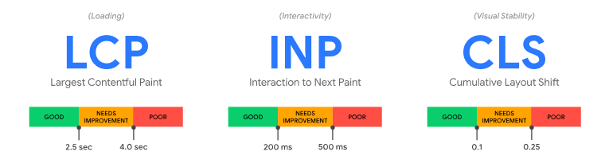

多くのユーザに良好な体験を提供できていると判断するには、モバイル・PCの各デバイスにおいて、ページ読み込みの75パーセンタイル値が次の各指標の閾値を満たしていることが推奨される。

- **LCP（Largest Contentful Paint: 表示速度）**  
  ページ内で最も大きなコンテンツ（メイン画像、見出しテキストなど）が画面に描画されるまでの時間を表す。
  ユーザが「このページ、表示された」と感じるタイミングに相当する。
  優れたユーザエクスペリエンスを提供するには、ページの読み込み開始から2.5秒以内にLCPを実現する必要があると定義されている。
- **INP（Interaction to Next Paint: 操作への応答性）**  
  ユーザがクリック・タップ・キー入力などの操作をしてから、画面が次の描画を反映するまでの時間を表す。
  ページ滞在中のすべての操作のうち、最も遅いものに近い値が報告される。
  優れたユーザエクスペリエンスを提供するには、ページのINPを200ms未満にする必要があると定義されている。
- **CLS（Cumulative Layout Shift: 視覚的な安定性）**  
  ページの読み込み中や操作中に、要素が意図せず位置ズレを起こした量の累積値を表す。
  例えば、記事を読んでいる最中に広告が挿入されてテキストが下にズレるような現象を数値化する。
  優れたユーザエクスペリエンスを提供するには、ページのCLSを0.1未満に保つ必要があると定義されている。

### 推奨指標

性能テストの文脈では**LCPとINPに対して目標値を設定する**ことを推奨する。CLSはユーザ体験の文脈では重要であるが、性能指標とは異なるため対象外とする。

::: tip Web Vitals以外の性能指標

Web Vitalsには他にも性能指標が存在するが、それぞれ次の理由で画面性能指標としては採用しない。

- **FCP（First Contentful Paint）**  
  ページ上で最初のコンテンツ（テキストや画像など）が描画されるまでの時間を表す。 FCPはローディングスピナーや空のヘッダーでも発火してしまうため実ユーザの体感とはズレがあり、LCPで代替可能なため対象外とする。
- **TBT（Total Blocking Time）**  
  FCPの後にメインスレッドが入力の応答性を妨げるほど長くブロックされていた合計時間を表す。ラボ環境（ツールを使用し、一貫して制御された環境でページ読み込みをシミュレートできる環境）で計測する必要がある。有用な指標であるものの実ユーザ環境で測定可能なINPで代替可能なため、対象外とする。
- **TTFB（Time To First Byte）**  
  リソースのリクエストからレスポンスの最初のバイトが到着するまでの時間を表す。先述の通り、サーバとネットワークの性能指標であるため、画面の性能指標としては対象外とする。

:::

## 性能検証ツール

画面の性能検証では、サーバのレスポンスタイムだけでなく、ブラウザ上でのレンダリングやユーザ操作の体感速度を測定する必要がある。

画面性能指標として推奨しているLCPとINPが測定可能なツールを選定する。

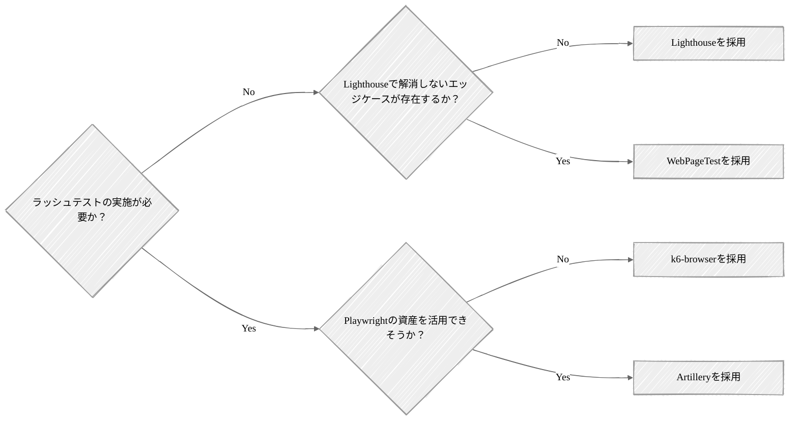

ボリュームテストのみの実施が必要な場合は[Lighthouse](https://github.com/GoogleChrome/lighthouse)を使用し、単機能レベルでのLCP、INPのスコア化を推奨する。

[WebPageTest](https://www.webpagetest.org/)や[sitespeed.io](https://www.sitespeed.io/)でも同様の計測は可能だが、手軽さという意味ではLighthouseが一歩抜きん出ている。問題の切り分けや対策もLighthouse単体で十分実施可能だが、それでも解消しないエッジケースが存在する場合はWebPageTestの利用を検討する。

ボリュームテストに加えラッシュテストを実施しなければならない場合、業界標準かつバックエンドテストとの統合が容易な [k6-browser](https://grafana.com/docs/k6/latest/using-k6-browser/)を第一候補とする。既にバックエンドの性能テストでk6を使用している場合は導入コスト・維持コストの低減に繋げやすい。

k6を使用していない場合かつ、Playwrightの資産・知見を活用できそうな場合はArtillleryの使用を検討する。ただし、性能テスト用のケースと通常のテストケースが完全一致するケースは実際には多くない。

調査時: 2026/03/19

|                    | Lighthouse                                                                         | WebPageTest                                                                                                                                                        | Sitespeed.io                                                                     | k6-browser                                                         | Artillery                                                            |
| :----------------- | :--------------------------------------------------------------------------------- | :----------------------------------------------------------------------------------------------------------------------------------------------------------------- | :------------------------------------------------------------------------------- | :----------------------------------------------------------------- | :------------------------------------------------------------------- |
| 提供元             | Google                                                                             | Catchpoint                                                                                                                                                         | OSSコミュニティ                                                                  | Grafana Labs                                                       | Artillery Software                                                   |
| 説明               | Chromeで実行できる単体レベルの画面性能検証においてはデファクトスタンダードなツール | Webサービス経由での利用が可能な実機と実回線を使ってテストできる本格的な解析ツール                                                                                  | Dockerベースで動作し、継続的なパフォーマンスモニタリングと自動化に特化したツール | k6にChromium制御を組み込んだツール                                 | laywrightをスケール起動できるNode.js製のフルスタック負荷テストツール |
| ライセンス         | Apache 2.0                                                                         | Polyform Shield 1.0.0                                                                                                                                              | MIT                                                                              | AGPL-3.0                                                           | MPL-2.0                                                              |
| 実行方法           | Chrome DevTools / CLI / Node.js API                                                | Webサービス / プライベートインスタンス / API                                                                                                                       | CLI / Docker                                                                     | CLI / Docker / k6 Cloud / Kubernetes                               | CLI / Docker / Artillery Cloud / AWS Fargate                         |
| 対応端末           | PC                                                                                 | ✅️ PC・モバイル実機[^9]                                                                                                                                            | PC（エミュレート）                                                               | PC（エミュレート）                                                 | PC（エミュレート）                                                   |
| 対応ブラウザ       | ⚠️ Chromeのみ                                                                      | ✅️ Chrome / Safari / Firefox / Edge                                                                                                                                | ✅️ Chrome / Safari（macOSのみ） / Firefox / Edge                                 | ⚠️ Chromium（Chrome, Edge）系                                      | ✅️ Chrome / Safari / Firefox / Edge                                  |
| LCP/INP計測        | ✅️ 可能                                                                            | ✅️ 可能                                                                                                                                                            | ✅️ 可能                                                                          | ✅️ 可能                                                            | ✅️ 可能                                                              |
| レポーティング     | ✅️ 100点満点のスコアと色分けで非エンジニアにも直感的                               | ⚠️ 詳細なウォーターフォール図中心の専門家向けUI                                                                                                                    | ✅️ Grafana連携により美しいレポート画面を生成可能                                 | ✅️ Grafana連携により美しいレポート画面を生成可能                   | ⚠️ Cloud版または外部ツールでの整形が必要[^10]                        |
| 性能対策立案       | ✅️ 具体的な改善策をTODO形式で提示                                                  | ⚠️ 課題の発見・ボトルネックの特定まで                                                                                                                              | ✅️ Lighthouse等の評価エンジンを内包                                              | ❌️ 測定結果の提示まで                                              | ⚠️ 課題の発見・ボトルネックの特定まで                                |
| CIへの組み込み     | ✅️ 公式のLighthouse CI (LHCI)がある                                                | ⚠️ 可能だが大量実行は有料のAPIプランが必要                                                                                                                         | ✅️ CI/CDパイプラインへの統合を前提に設計されており容易                           | ✅️ GithubActions等の公式アクションが豊富であり容易                 | ✅️ GithubActions等の公式アクションが豊富であり容易                   |
| ラッシュテスト対応 | ❌️ なし                                                                            | ❌️ なし                                                                                                                                                            | ❌️ なし                                                                          | ✅️ 可能                                                            | ✅️ 可能[^11]                                                         |
| 導入コスト         | ✅️ Chromeがあれば即時利用可能                                                      | ⚠️Web上の公開テストは即時利用可能だがプライベート環境構築は手間                                                                                                    | ⚠️Docker・Grafana等の知識が必要                                                  | ⚠️ シナリオ作成と実行環境準備が必要                                | ⚠️ シナリオ作成と実行環境準備が必要                                  |
| 価格               | ✅️ 無料                                                                            | ⚠️APIの大量利用やプライベート環境構築などのPro機能は有料                                                                                                           | ✅️ 無料                                                                          | ✅️ ツール自体は無料、実行環境の費用は発生                          | ⚠️ ツール自体は無料、実行環境やSaaS版の費用は発生                    |
| Githubスター数     | 29.9k                                                                              | 3.2k                                                                                                                                                               | 5.0k                                                                             | 29.4k[^12]                                                         | 8.9k                                                                 |
| ユースケース       | コストを掛けずに画面性能検証を行いたい場合                                         | Lighthouseでは解決しない性能問題の原因を分析したい場合 / 自社プロダクトと競合プロダクトの速度の比較したい場合 / 一連のユーザジャーニーでボトルネックを探りたい場合 | CIで継続的に性能を確認したい場合                                                 | バックエンドの性能テストでk6を利用しており、高負荷を再現したい場合 | Playwrightを利用しており、高負荷を再現したい場合                     |

## チューニング

画面の性能テストにおけるチューニングでは、ネットワーク転送量の削減やキャッシュを活用する。

システム全体としてはアプリケーションロジックやデータベースレイヤがボトルネックとなることが多いので、それらの対応を検討した後、更なるチューニングの必要があれば実施する。

### データ転送量の削減

#### コンテンツ圧縮

HTML/CSS/JavaScript/画像などの静的リソースを圧縮して送信する。

2026年4月時点ではgzipよりも圧縮率の高い Brotliに対応しているブラウザも多く、導入が推奨される。

::: tip Brotli

Brotliは2015年にGoogleがWeb向けに公開した比較的新しい圧縮アルゴリズムである。圧縮率に関してはトップクラスであり、圧縮レベル次第ではgzipよりも高い圧縮効果を発揮（テキスト系ファイルでは15％〜25%程度軽量化が可能）する。

主要なブラウザでもBrotliエンコーディングに対応しており、多くのCDN（AWS CloudFront、 GoogleCloud Cloud CDN、 Azure CDN）でも圧縮形式としてBrotliをサポートしている。

:::

#### 画像の最適化

JPEGやPNGの代わりに、より圧縮率の高いWebPやAVIFを使用する。

また、デバイス（スマホ・PC）に合わせて適切なサイズの画像を出し分ける対応（`<picture>`タグや`srcset`属性の活用）も考えられる。

詳細は「[Webフロントエンド設計ガイドライン \- 画像](https://future-architect.github.io/arch-guidelines/documents/forWebFrontend/web_frontend_guidelines.html#%E7%94%BB%E5%83%8F)」を参照されたい。

#### コードのMinify

CSSやJavaScriptから不要な改行、スペース、コメントを削除し、変数名や関数名を短い名前に置き換える（Minify）ことによりファイルサイズを縮小する。

詳細は「[Webフロントエンド設計ガイドライン \- Minify](https://future-architect.github.io/arch-guidelines/documents/forWebFrontend/web_frontend_guidelines.html#minify)」を参照されたい。

### キャッシュの活用

#### CDNの活用

HTML/CSS/JavaScript/画像などの静的リソースをエッジサーバにキャッシュし、物理的に一番近い距離にあるサーバから応答を返却させる。

#### ブラウザキャッシュの制御

HTTPヘッダーの `Cache-Control` を適切に設定し、静的ファイルはブラウザに長期間キャッシュ（有効期限を長く設定）させる。

`ETag` や `Last-Modified` を用いて、ファイルに変更がない場合は「304 Not Modified」を返し、ダウンロードをスキップさせる。

詳細は「[Webフロントエンド設計ガイドライン \- キャッシュ](https://future-architect.github.io/arch-guidelines/documents/forWebFrontend/web_frontend_guidelines.html#%E3%82%AD%E3%83%A3%E3%83%83%E3%82%B7%E3%83%A5)」を参照されたい。

### ネットワーク通信の最適化

#### 画像の遅延読み込み（Lazy Load）

画面のファーストビュー（スクロールせずに見える範囲）に入っていない画像は、スクロールして近づくまで読み込みを遅延させる（\の活用）。

#### HTTP/2またはHTTP/3の導入

HTTP/2・HTTP/3では、1つのコネクションで複数のリソースを並列して送受信（多重化）できるため、通信のオーバーヘッドを大幅に削減できる。

AWS CloudFrontなど主要なCDNを用いている場合は設定変更のみでHTTP/2・HTTP/3化が可能であり、導入自体は簡易である。実施の際は、HTTP/2とHTTP/3双方の有効化を推奨する。HTTP2では通信環境が極端に悪い場合、一部のパケットのロスが発生すると、そのパケットが再送されるまで同一コネクション内の全てのデータ通信が一時的に停止してしまう。HTTP/3ではこの問題が解消されており、HTTP/2とHTTP/3双方を有効化することでこのデメリットを補うことができる。また、並列リクエストによるメリットを活かすため、CSSやJavaScriptを巨大な単一ファイルとしてビルド・配信するのではなく、分割して配信することを推奨する。ただし、むやみに数百個まで分割すると先述のgzipやBrotliの圧縮効率が下がるため、過度な分割は避ける。

# APPENDIX: チェックリスト

## A. 計画時チェックリスト

テスト計画から準備完了までに確認すべき項目をまとめている。

各項目は「決まっているか」「ステークホルダー間で合意できているか」の両面で確認することが望ましい。

### A-1. 目的とスコープ

- [ ] 性能テストの主目的が明確になっている（複数選択可）- [ ] 性能指標値の評価 - [ ] 安定性・信頼性の評価 - [ ] スケーラビリティの評価 - [ ] 最適なキャパシティプランニング - [ ] その他
- [ ] 主目的に重みづけがされており、優先順位が明確である
- [ ] テスト対象システムの範囲が明確である - [ ] 外部システム/共通基盤との連携の扱いが決まっている（含める/含めない/スタブで代替）- [ ] フロントエンドの扱いが決まっている（含める/含めない）

### A-2. システム諸元

- [ ] データ諸元が定義されている - [ ] DBの全テーブルについてレコード件数の見積もりがある - [ ] 取り扱うファイルの最大/平均サイズが定義されている - [ ] 何年後の状態（例. 3年後、5年後）を基準とするかが決まっている
- [ ] 負荷諸元が定義されている - [ ] 通常時 / ピーク時 / スパイク時など状態別に値が定義されている

### A-3. 目標値

#### スループット

- [ ] 算出根拠が明確である（既存システムのアクセスログ / 想定ユースケースからの算出など）
- [ ] 安全係数（例. 2倍、3倍）が考慮されている
- [ ] 負荷状態（通常時 / ピーク時など）ごとに値が定義されている

#### 処理時間（オンライン処理）

- [ ] 業界標準の指標値（例. TTFB 800ms）やベースラインシステムを参照して妥当な値が定められている
- [ ] 機能特性ごとに目標値が細分化されている（コア系 / 標準系 / 管理系、参照 / 更新など）
- [ ] パーセンタイル値（例. p90、p95）で順守率が定められている
- [ ] 負荷状態（通常時 / ピーク時 / 縮退時）ごとに順守率が調整されている

#### 処理時間(バッチ処理)

- [ ] バッチウィンドウを基準に上限が決まっている
- [ ] 順守率は「再実行の余裕があるか」など運用面を含めた基準になっている

#### リソース使用率

- [ ] 対象コンポーネント（APサーバ、DBサーバ、キャッシュサーバなど）ごとに定義されている
- [ ] CPU使用率、メモリ使用率は最低限定義されている
- [ ] 上限値（例. 通常時50-60％、ピーク時80%以下）が定義されている
- [ ] 下限値（過剰スペックを避けるため、例. ピーク時30-40％以上）が定義されている
- [ ] オートスケールのトリガー閾値と整合が取れている
- [ ] ワンショットのバッチサーバについては「使い切る」前提の目標が別途定められている

### A-4. テストの段取りと完了基準

- [ ] 実施するテスト種別と順序が決まっている（推奨: ボリューム → ラッシュ → ロングラン → ストレス）
- [ ] スパイク性のあるシステムの場合、スパイクテストの実施が計画されている
- [ ] 各テストの完了基準（合格基準）が定義されている
- [ ] 各テストの対象機能 / シナリオが選定されている - [ ] ボリュームテストの対象機能が選定されている（原則全機能、優先度付け基準も明確）- [ ] ラッシュ / ロングラン / ストレスの対象シナリオが選定されている（スループット算出時の根拠と整合）- [ ] バッチ処理を含む時間帯のシナリオが組み込まれている

- [ ] 各機能 / シナリオの試行回数の方針がある（オンライン100回以上が目安）

### A-5. ツール選定

- [ ] 負荷ツールが選定されている - [ ] CI/CD組み込みやコード管理のしやすさが考慮されている - [ ] 想定する最大負荷を生成できる能力がある
- [ ] モニタリングツールが選定されている - [ ] APMの要否、外部監視サービスの可否を踏まえた判断になっている - [ ] 本番運用で利用するツールと揃えられている

### A-6. メトリクス

- [ ] インフラメトリクス（CPU、メモリ、ネットワークI/O、ディスクI/O など）が定義されている
- [ ] 利用するクラウドマネージドサービス固有のメトリクスが定められている
- [ ] DBメトリクスが定義されている（スロークエリ、待機イベント、コネクション状況など）
- [ ] ランタイムメトリクスが定義されている（ヒープ、GC、スレッド数など）
- [ ] サービス / アプリケーションメトリクス（Rate / Errors / Duration）が定義されている

### A-7. テスト環境

- [ ] 本番環境または同等構成の環境が確保されている
- [ ] 環境を占有して利用できる
- [ ] 本番同等のスペック・台数で構成されている
- [ ] 必要に応じて並行作業用に複数環境が確保されている

### A-8. スケジュール

- [ ] 計画/準備工数が、実行/チューニング工数と同等以上に確保されている
- [ ] 長時間実行ケース（ロングランなど）の再実行リスクを織り込んだバッファがある
- [ ] 不確実性の高い特性（新規システム、複数処理方式の混在、マルチテナント、外部連携多数など）を踏まえたバッファがある
- [ ] テスト同士で相互影響するもの（例. ストレステストとロングランテスト）の並行実施を避けた計画になっている

### A-9. 環境構築・設定

- [ ] 負荷ツールを動かすコンピューティングリソースが構築されている
- [ ] 負荷ツールから各種リソース（DB、S3、SQS等）へのリーチャビリティが確保されている
- [ ] ログレベルが本番相当（INFO以上が一般的）に設定されている
- [ ] キャッシュの有効化 / 無効化方針がテスト種別ごとに定められている - [ ] HTTPキャッシュの方針が定められている - [ ] アプリケーションキャッシュの方針が定められている - [ ] DBキャッシュの方針が定められている

- [ ] オートスケールの有効化 / 無効化方針がテスト種別ごとに定められている

### A-10. データ準備

- [ ] データ作成方法が決定されている（本番エクスポート / ファイルインポート / 手続き型SQL / INSERT / 実機能利用）
- [ ] 大量データ作成時の事前準備が検討されている - [ ] インデックス / 外部キー制約の一時削除が検討されている - [ ] DBスペックの一時増強が検討されている - [ ] autovacuumの停止と完了後のANALYZE/VACUUMが検討されている
- [ ] データパターンが現実的である - [ ] カーディナリティ（取りうる値のバリエーション）が適切である - [ ] スキュー（特定キーへの偏り）が現実に即している - [ ] 関連テーブルの件数比率が実態に近い

### A-11. テストスクリプト

- [ ] 事前処理 / テスト本体 / 事後処理が分離されている
- [ ] 計測対象に事前 / 事後処理の時間が混入しないようになっている
- [ ] 繰り返し実行可能（冪等）になっている - [ ] 一意制約のあるカラムに動的な値が生成されている - [ ] 事後処理またはリストアでクリーンアップ可能になっている

- [ ] 現実的な負荷パターンが再現されている - [ ] 思考時間が挟まれている - [ ] リクエストパラメータが分散されている（キャッシュヒット率の過大評価を防ぐ）

### A-12. その他の準備

- [ ] スタブが用意・有効化されている（外部依存がある場合）- [ ] 独立プロセス / サーバとして稼働させる構成が原則となっている - [ ] 一定の遅延を含む応答を十分なスループットで返せる
- [ ] メトリクスダッシュボードが用意されている - [ ] 詳細モニタリング（例. AWS Container Insights、RDS Database Insights）が有効化されている - [ ] DBの拡張機能（例. pg_stat_statements、auto_explain）が有効化されている
- [ ] 素振り（負荷ツールでのウォームアップ実行）が完了している - [ ] 目標RPSの数倍まで安定して負荷生成できる - [ ] VUに余裕がある / ファイル記述子やマシンリソースに余裕がある
- [ ] クラウドのクォータ緩和申請が必要に応じて完了している（実施1〜2週間前）
- [ ] DDoS的な負荷テストの場合はクラウド事業者への申請が完了している

## B. 実施後チェックリスト

各テスト実施後とレポーティング段階で確認すべき項目をまとめている。

「結果が完了基準を満たしているか」と「結果を正しく評価できるだけの情報が揃っているか」の両面で確認する。

### B-1. ボリュームテスト

- [ ] 対象機能の処理時間が目標値をクリアしている
- [ ] バッチ処理についてはスループット（必要な場合）も目標値をクリアしている
- [ ] 機能単位の処理時間内訳が把握できている（ネットワーク / アプリ / DB / 外部呼び出し）
- [ ] 問題箇所・改善余地のある箇所に対し分析・チューニングが行われている
- [ ] SQLの実行計画が確認され、インデックスや作業メモリの最適化が行われている
- [ ] 試行回数が十分（オンラインは100回以上を目安）に確保されている
- [ ] 最終確定したインフラ構成で再計測が行われている（構成が途中で変わった場合）

### B-2. ラッシュテスト

#### 性能指標値

- [ ] 全負荷パターン（通常時 / ピーク時 / 縮退時）で処理時間とスループットが目標値をクリアしている
- [ ] 機能単位で見ても、ボリュームテスト時からの劣化が許容範囲内である
- [ ] 同時アクセスに伴う性能劣化部分について分析・対応が行われている

#### リソース・エラー

- [ ] リソース使用率が目標値の範囲内に収まっている（上限・下限の両面）
- [ ] 同時アクセスに伴う意図しないエラーが発生していない
- [ ] エラー内訳が分析され、設計上許容されるものか異常かの切り分けができている
- [ ] メッセージキューを介した非同期処理がある場合、メッセージが滞留せず捌けている

#### キャパシティプランニング

- [ ] 性能要件を達成できる最小限の構成が比較検証されている
- [ ] APサーバとDBサーバなど、変数を1つずつ動かして比較検証されている
- [ ] スケールアップとスケールアウトの比較がされている（水平スケール優先が原則）

### B-3. ロングランテスト

#### 性能指標値

- [ ] 全期間にわたって処理時間・スループットが目標値をクリアしている
- [ ] 開始区間と終了区間の比較で劣化していない
- [ ] エラー率が時間とともに悪化していない

#### 安定性・信頼性

- [ ] メモリ使用率に右肩上がりの推移がない
- [ ] アプリケーションランタイムメモリ（ヒープ等）の時系列推移を確認し、リーク兆候がない
- [ ] DBコネクション、アプリケーションスレッドが枯渇せず、適切に開放されている
- [ ] GC（特に Full GC）の頻度・実行時間が極端に上がっていない
- [ ] 期間中に動くべき定期バッチが想定通り動作している
- [ ] テスト実行時間が、システムの連続稼働サイクル（または定期リフレッシュ間隔）を網羅している

### B-4. ストレステスト

#### スケーラビリティ

- [ ] 現行構成における限界性能（限界RPS等）が特定できている
- [ ] 限界到達時のボトルネックコンポーネントが特定できている
- [ ] ボトルネックを増強することで性能が実際に向上することが検証できている
- [ ] 限界性能を超えた場合の増強ステップ（順序・対象）が整理されている

#### オートスケール

- [ ] スケールアウト・スケールインのトリガー閾値が期待通り発動している
- [ ] 閾値・継続期間・クールダウンの設定が、負荷変動スピードに対して適切である
- [ ] 新規ノードの立ち上がり時間が負荷増加スピードに追従できている
- [ ] スケールイン時のグレースフルシャットダウンが正しく動作している
- [ ] スケール上限・下限の設定値が妥当である

### B-5. レポーティング

#### 全体構成

- [ ] テスト概要が記載されている（目的、スコープ、カテゴリ、要件・目標値）
- [ ] 各テスト（ボリューム / ラッシュ / ロングラン / ストレス）の結果がそれぞれ整理されている

#### 各結果の品質

- [ ] 統計値（min/avg/p50/p80/p90/p95/max）が目標値とともに表形式で整理されている
- [ ] 時系列推移が必要な箇所はグラフキャプチャが添付されている
- [ ] グラフ上の異常箇所・気になる箇所には注釈・考察が補記されている
- [ ] 機能単位 / シナリオ単位の粒度で分析されている
- [ ] エラーが発生している場合、内訳と原因・対応方針が整理されている
- [ ] リソース使用状況がコンポーネント別に整理されている

#### ロングラン特有

- [ ] ランプアップ / ランプダウンを避けた区間で開始 / 終了の比較が行われている
- [ ] アプリケーションランタイムメモリの時系列グラフが添付されている
- [ ] GCの頻度・実行時間の推移が記載されている

#### キャパシティプランニング

- [ ] 各構成パターンの比較検証結果が表形式で整理されている
- [ ] 採用構成の選定根拠（性能要件達成・コスト効率）が明確である

#### 残存リスクと将来の見通し

- [ ] 限界性能と、将来的な負荷増加に対する増強ステップが明記されている
- [ ] 残存するリスク（未解消のチューニング項目、想定外の挙動など）が明文化されている

# 参考文献

- [The Art of Software Testing](https://amzn.asia/d/07XXYV2q)
- [The Art of Application Performance Testing](https://a.co/d/02IcQKwY)
- [Amazon Web Services負荷試験入門 ―クラウドの性能の引き出し方がわかる](https://gihyo.jp/book/2017/978-4-7741-9262-8)

[^1]: カッコ内の英語は[原文](https://astqb.org/assets/documents/ISTQB-CTFL-PT-Syllabus-2018.pdf)の記載にもとづいている

[^2]: https://aws.amazon.com/jp/what-is/latency/

[^3]: スパイクテストについては割愛するが、システムにスパイク性がある場合は、ストレステストと合わせてスパイクテストを実施する形が望ましい

[^4]: 性能目標値としてバッチ・スループットを定めていない場合は処理時間のみで問題ない

[^5]: 2024年にAmazon CloudWatch Application SignalsがGAとなり、OpenTelemetryと組み合わせてAPMを実現できるようになったが、未検証のため割愛する

[^6]: PostgreSQL標準のCOPYコマンドも同様の機能を提供するが、DBサーバローカルのファイルを読み込んでロードする仕組みのため、Amazon Auroraでは使用できない

[^7]: https://adoptium.net/news/2021/12/eclipse-temurin-jres-are-back

[^8]: https://googlecode.blogspot.com/2010/03/making-apis-faster-introducing-partial.html

[^9]: US/EU/Asiaなどの粒度で実行ロケーションを選択できる他、5G/3Gなど回線を選ぶこともできる

[^10]: v2.0.22からCLIにてHTML出力機能が削除されており、視覚化にはArtillery Cloudへ生データの送信またはGrafana等外部ツール連携が必要

[^11]: k6がネイティブで動くのに対し、ArtilleryはNode.jsで稼働する分負荷を掛ける側のリソース効率は劣る

[^12]: 2026.3時点ではk6本体に統合されており、k6のスター数を記載
