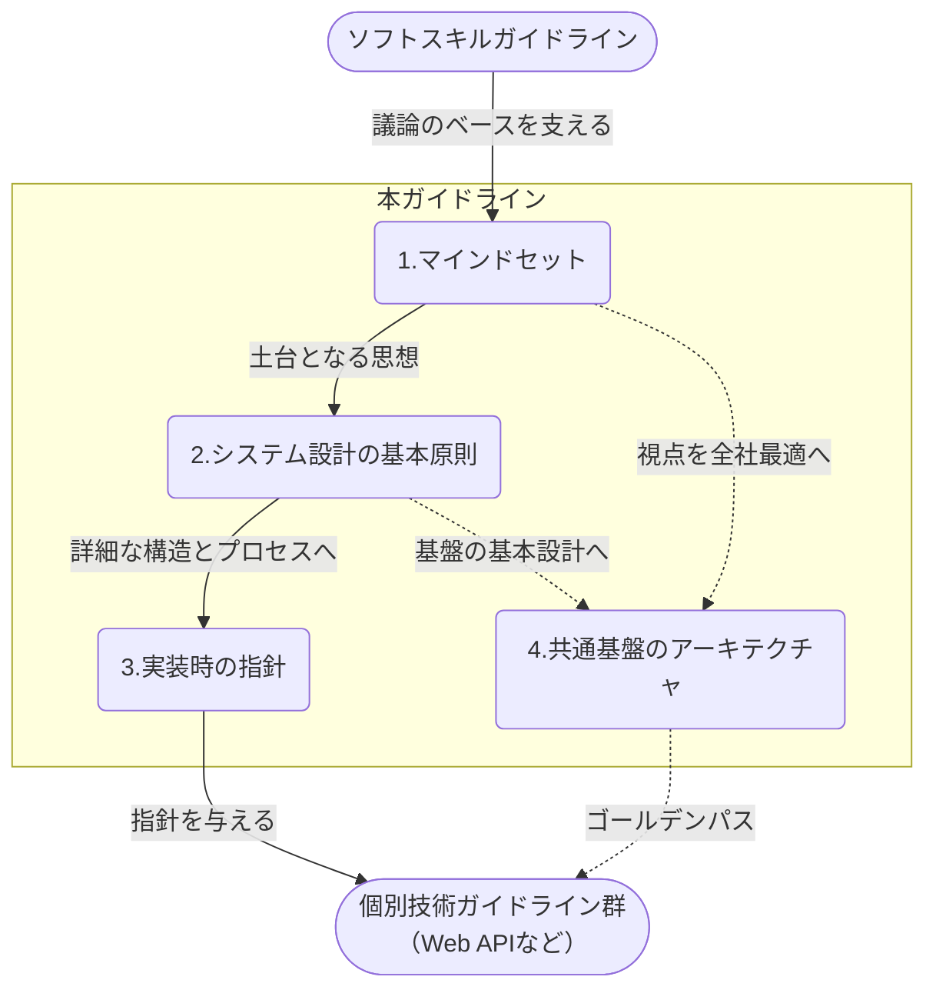

## はじめに

アーキテクチャ設計は、プロジェクトの成否を左右する大きな意思決定である。一度定めた根幹を覆すことは許容しがたい手戻りを生むため、責任とプレッシャーは計り知れない。

本ガイドラインは、そうした重圧の中にあるアーキテクトにとっての「道標」となることを目指して策定された。多くのプロジェクトで培われてきた、困難な状況を打破するための普遍的な考え方を中心にまとめている。迷った際には先人の知恵（原理原則）や心得（考え方）に立ち返り、プロジェクトにとってのスイートスポットの探求に役立てれば幸いである。

::: warning 免責事項

- 有志で作成したドキュメントである。フューチャーには多様なプロジェクトが存在し、それぞれの状況に合わせて工夫された開発プロセスや高度な開発支援環境が存在する。本ガイドラインはフューチャーの全ての部署／プロジェクトで適用されているわけではなく、有志が観点を持ち寄って新たに整理したものである
- 相容れない部分があればその領域を書き換えて利用することを想定している。プロジェクト固有の背景や要件への配慮は、ガイドライン利用者が最終的に判断すること。本ガイドラインに必ず従うことは求めておらず、設計案の提示と、それらの評価観点を利用者に提供することを主目的としている
- 掲載内容および利用に際して発生した問題、それに伴う損害については、フューチャー株式会社は一切の責務を負わないものとする。掲載している情報は予告なく変更する場合がある

:::

## 本ガイドラインの位置付けと構成

本ガイドラインは、[ソフトスキル](https://future-architect.github.io/arch-guidelines/documents/forSoftSkill/softskill_guidelines.html)ガイドラインや[テクニカルライティングガイドライン](https://future-architect.github.io/arch-guidelines/documents/forTechnicalWriting/technical_writing_guidelines.html)を土台としつつ、各技術領域で適切なトレードオフ判断を行うための「思考の型」を提供する位置づけとなる。

内部構造は、アーキテクトのマインドセット→システム設計の基本原則（マクロなアーキテクチャ）→実装時の指針（ミクロなアーキテクチャ）→共通基盤のアーキテクチャ といった4分類で構成されている。

## 謝辞

このアーキテクチャガイドラインの作成には多くの方々にご協力いただいた。心より感謝申し上げる。

- **作成者**: 真野隼記、武田大輝、宮崎将太、亀井隆徳、山口真明、中村立基、清水雄一郎、澁川喜規
- **レビュアー**: 募集中

---

次のページ: [アーキテクチャ原則ガイドライン](./principle_guidelines.md)
