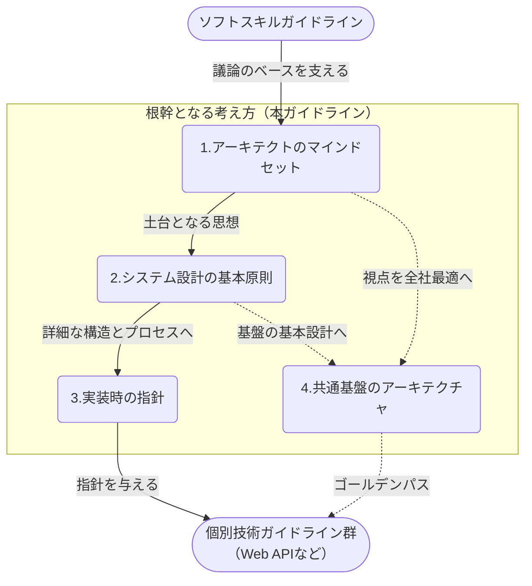
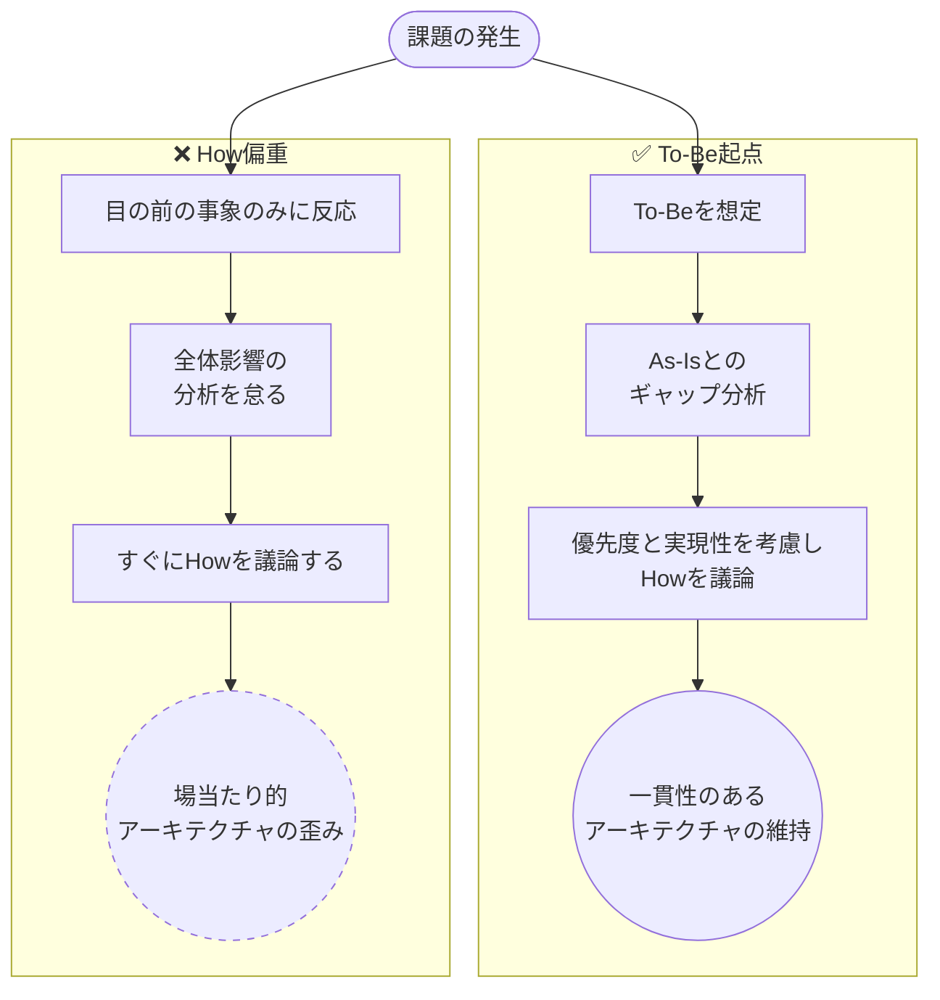
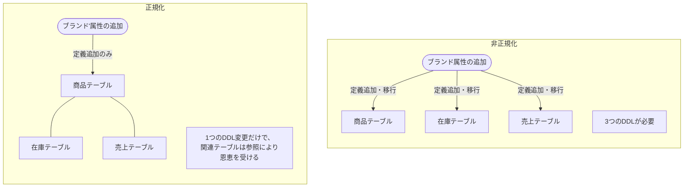
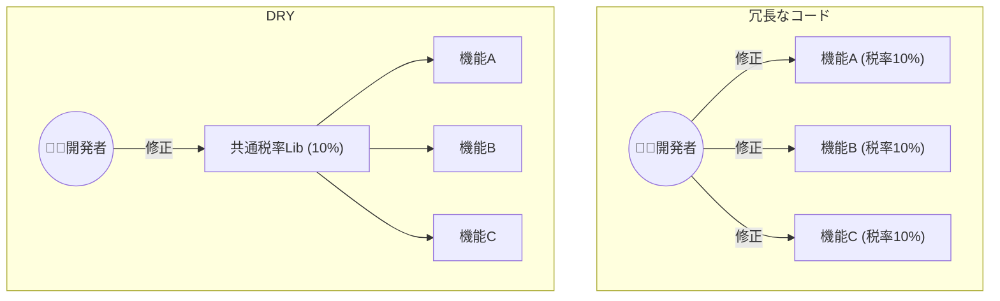
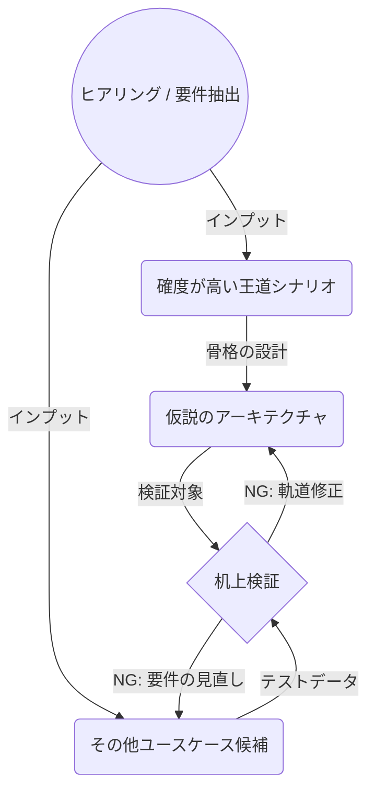

<page-title/>

::: warning 免責事項

- 有志で作成したドキュメントである。フューチャーには多様なプロジェクトが存在し、それぞれの状況に合わせて工夫された開発プロセスや高度な開発支援環境が存在する。本ガイドラインはフューチャーの全ての部署／プロジェクトで適用されているわけではなく、有志が観点を持ち寄って新たに整理したものである
- 相容れない部分があればその領域を書き換えて利用することを想定している。プロジェクト固有の背景や要件への配慮は、ガイドライン利用者が最終的に判断すること。本ガイドラインに必ず従うことは求めておらず、設計案の提示と、それらの評価観点を利用者に提供することを主目的としている
- 掲載内容および利用に際して発生した問題、それに伴う損害については、フューチャー株式会社は一切の責務を負わないものとする。掲載している情報は予告なく変更する場合がある

:::

# はじめに

アーキテクチャ設計は、プロジェクトの成否を左右する大きな意思決定である。一度定めた根幹を覆すことは許容しがたい手戻りを生むため、責任とプレッシャーは計り知れない。

本ガイドラインは、そうした重圧の中にあるアーキテクトにとっての「道標」となることを目指して策定された。多くのプロジェクトで培われてきた、困難な状況を打破するための普遍的な考え方を中心にまとめている。迷った際には先人の知恵（原理原則）や心得（考え方）に立ち返り、プロジェクトにとってのスイートスポットの探求に役立てれば幸いである。

## 本ガイドラインの位置付けと構成

本ガイドラインは、[ソフトスキル](https://future-architect.github.io/arch-guidelines/documents/forSoftSkill/softskill_guidelines.html)ガイドラインや[テクニカルライティングガイドライン](https://future-architect.github.io/arch-guidelines/documents/forTechnicalWriting/technical_writing_guidelines.html)を土台としつつ、各技術領域で適切なトレードオフ判断を行うための「思考の型」を提供する位置づけとなる。

内部構造は、アーキテクトのマインドセット→システム設計の基本原則（マクロなアーキテクチャ）→実装時の指針（ミクロなアーキテクチャ）→共通基盤のアーキテクチャ といった4分類で構成されている。



## アーキテクチャとは

アーキテクチャには、データ、アプリケーション、インフラなど様々な分類が存在する。本ガイドラインでは特定の領域に限定せず、ソフトウェアシステム全体にわたる「構造」を決定づけるすべてをアーキテクチャと定義する。

優れたアーキテクチャが備えるべき特徴は以下の通り。

- システムの本来の目的であるユースケースを中核として支える構造を備えている
- フレームワークや実行環境など、外部要素に依存しない
- システムの本質的な振る舞いや構造を明確に説明できる

::: tip ISO/IEC/IEEE 42010  
国際標準化機構（ISO）、国際電気標準会議（IEC）、および米国電気電子学会（IEEE）が共同で策定したアーキテクチャ記述の国際基準である。

- **役割**: アーキテクチャの思考、記述、共有方法に関する「思考の枠組み」を提供するメタ標準
- **目的**: 特定のスタイルや方法論の規定ではなく、ビジネスとシステムを結びつける全体構想の定義
- **定義**: 「環境におけるシステムの基礎となる概念や特性。また、要素と関係性、設計と進化の原則の中に具体化されるもの」

:::

# アーキテクトのマインドセット

アーキテクトは決して受け身であってはならない。常に自分なりの仮説を持ち、周囲の要求や要望を真摯に受け止めつつも、その声に流されすぎない確固たるスタンスが必要である。

このようなビジネスの推進における基礎的なマインドセットを前提とした上で、本章ではさらに「ソフトウェアアーキテクト」としてシステムと向き合う際に求められる特有の思考法と姿勢を紹介する。

## 見えていない制約を見つける

アーキテクトにとって、アーキテクチャ設計時に、明文化された機能・非機能要件だけではなく、まだ言語化されていない隠れた制約条件や要件を探し出すことも求められる。設計の前提となる重要な要件が後から出てくると、最悪根幹から方針を変える必要が出てくる。顧客はITのプロではない。そのため、ITのプロである我々に潜在的な要件を引き出してくれると通常考える。その期待を裏切らないよう振る舞うべきである。

初期段階で表出しにくい要件の例をあげる。

| 分類                   | 項目                 | 考慮すべき観点と具体例                                                                                                                                        |
| :--------------------- | :------------------- | :------------------------------------------------------------------------------------------------------------------------------------------------------------ |
| ビジネス変化           | 利用者の増加         | サービス成長に伴うユーザー数（同時接続数）やアクセス数の変化。一般的には5年後の予測を考える。ヒット予測は困難なため、仮説を立てて要件をピン留めする必要がある |
|                        | 海外展開             | 将来的な海外市場への展開の有無。存在する場合は、多言語対応、マルチテナント、各種法令（GDPRなど）への対応を確認                                                |
|                        | 組織変更             | 企業向けシステムにおける、部署やグループ会社の再編の有無。再編が発生した場合にシステムとしてどのように対応すべきか                                            |
| 既存資産や外部への依存 | 移行の制約           | 既存システムからの業務およびデータ移行要件。データモデルの大幅な変更やDB分割を行った場合、現実的な移行が可能かどうかで選択肢が制約される                      |
|                        | 既存資産の制約       | 既存システムとの連携方式に関する技術的制約。例えば相手先がリアルタイム応答に非対応の場合、どのようにデータ整合性を守るかなどの考慮が必要                      |
|                        | 依存サービスの継続性 | 利用を想定している外部サービスやOSSが、将来的にEOL（サポート終了）を迎えるリスク                                                                              |
| 運用・コストの制約     | 予算                 | 構築の進行に伴うコスト上振れリスクと、費用対効果の厳格化。計画上の上限予算を把握し、抑えるべきところは抑える（オーバースペックを防ぐ）                        |
|                        | BCP / DR             | データバックアップや災害復旧の要求レベル。構築するシステム単体ではなく、全社的なBCP/DR計画に準拠して整合性を取る                                              |
|                        | 運用要件             | 引き継ぎ先のチームや企業の体制、スキルセット。運用担当者が扱いやすい技術選定や、運用手順書の作成が求められる                                                  |

要件のチェックには「はじめての非機能要件定義ガイドライン（※今後作成予定）」を参考にすること。IPAの非機能要求グレードの項目を元にしても良いが、インフラ寄りであるため、アーキテクチャ設計向けにはアレンジが必要となる。

::: tip 制約によるデザイン
制約が増えることは、直感に反して設計を容易にする。あらゆる制約から解き放たれた状態では無数の選択肢が存在するため、逆に決めることが難しい。むしろ「オンプレミスは利用しない」「特定ベンダーへのロックインを避ける」といった制約が大きいほど、議論のスコープを絞りこむことができるため、探索すべき解の空間が狭まる。

適度な制約は設計者の創造性を引き出し、より洗練された設計を導く。これを「制約によるデザイン」と呼ぶ。アーキテクトは制約を忌避するのではなく、設計の羅針盤として能動的に定義し、上手く活用すべきである。
:::

## 要件を盛りすぎたオーバースペックに気をつける

潜在的な要件を探り当てることは重要だが、それはすなわち全ての要件を完璧に網羅する必要があるという訳ではない。あらゆるリスクに備えようとすると、オーバースペックに陥りやすい。

特に、非機能要件グレードなどの体系的なチェックリストを用いると、項目を埋めること自体をゴールにしてしまう危険がある。チェックリストの空欄を埋めること自体は目的ではなく、本来ビジネス上のMUST要件である事項の見落としが無いかという確認のために行っているのであれば、あえて条件を緩めて柔軟性を持たせる設計に倒しておくことも重要である。

## あるべきを考え、そこで思考停止しない

システム構築や運用で課題が出ると、その課題をどう解決するか（Howの実現方針）から考えてしまいがちである。特に開発フェーズが進み、スケジュールが厳しい中で追加の機能要望や仕様変更が必要になると、この傾向は顕著になる。アーキテクチャ全体を見直すことは途方もないし、なんとかタスクを消化してスケジュールを守りたいという気持ちが強くなるためである。

しかし、そもそも本来どうあるべきか（To-Be）という全体観が欠如した状態でのHowの議論は、場当たり的な設計を生み、長期的にはアーキテクチャを歪める原因となる。

そのため、1つ1つの課題に対して、まず理想的なあるべき姿は何かを描き出すことが不可欠である。そして、その理想と現状（As-Is）との間にあるギャップを可視化し、埋めるための施策を打つことこそが、王道である。



### あるべき姿を絵に描いた餅にしない

あるべき姿を描くと、現実とギャップが非常に大きい場合がある（ギャップが大きすぎるからこそ、目の前の具体的な課題解決のみに向き合いたくなる側面もある）。しかし、いったんあるべきを描けたとしてもそこで思考停止してはならない。理想のアーキテクチャに囚われすぎると、実現コストが非現実的になり、実効性が欠如したご意見番になってしまう。

実践のための入り口に立つためには、「その泥臭いギャップを埋める作業を、具体的にだれがいつまでに対応するのか」まで想像を進める必要がある。何事も構想を形にするためには、それなりのリソース（スキル、時間、コスト、体力、忍耐力）が要求される。アーキテクトは以下のような批判的な問いを自らに立てなければならない。

- それを自分が行えるのか？
- 他のメンバーにお願いしてやりきれるか？
- そこまでやる、費用対効果は本当にあるのか？
- 優先度は今なのか？

ここで満額回答はムリ。「では、どうするか？」 という思考に至ることも多い。次に行うべきは着地点の検討である。

### 着地点を探る

全てを一度にやろうとすると、他のタスクも含めた全体のスケジュールが破綻することも多い。アーキテクトは、理想を追い求めつつも、現実的な制約の中で「最適な着地点」をセットで考え抜く必要がある。

- **優先順位**: ギャップを埋める手段のうち、どれから、どの優先度で、どこまでやるべきか。最小の労力で早期に成果を出すための現実的な流れを考える。一般的には、ステップ論が重要で、ステップのどこまで今回対応し、いつから残りを着手するか検討する
- **次善案の許容**: 理想の追求があまりに大変な場合、現実的に実現可能な現状より良くなる事前案に着地すべきか、いっそ何もしないかを決める。この時、次善案は実現コストが高いと、事前案を採用する意味がないため、対応コストはシビアに見極めが必要である
- **コスト意識を持つ**: 対応案を考えるのも時間がかかる。対応案を考える時間は、もっと価値を生む時間（機能開発など）に使えるかもしれない。通常、着地点は時間をかけ過ぎず、利害関係者を集めて早期に決める必要がある

アーキテクトの仕事は、美しい理想論を語ることではない。あるべき姿を北極星として掲げつつも、現場の泥臭い現実と向き合い、どこに着地させるかを決めて推進することにある。この時、どのような取りうる案は何があるのか、トレードオフ構造になるのかなど主体的に動く必要がある。

## 迷ったら選択肢を増やす（発散と収束）

要件や制約がクリアになっても、自由度が高すぎることで、設計の手が止まってしまうことがある。なぜそのアーキテクチャ構成にしたのか？ という必然性を自分自身でも説明できず、思考が堂々巡りをしてしまうためである。

この時、最初から1つの正解に辿り着こうと思ってはならない。ビジネスと同様、アーキテクチャにも唯一の正解は存在しない。迷った時は思考を止めず、あえて選択肢を発散させることが突破口となる。

捨てた案の数がアーキテクトの自信になる。

- 意思決定の根拠は検討過程にある
  - アーキテクチャの意思決定は極めて重い。その重圧に耐え、自信を持ってこれが最適解であると言い切るためには、どれだけ多くの代替案を検討し、論理的に捨ててきたかという事実が必要である
- 選択肢は多ければ多いほど良い
  - 多数の設計案を出し尽くし、それらを複数の観点（コスト、性能、保守性、チームのスキルなど）で比較して収束させる。捨てた案の数だけ裏付けが今日異なる
- 利害関係者への質問にも動じない
  - アーキテクチャについてのシニアメンバーから問い合わせがあったとしても、深く考えずに出てくる疑問は所詮ありふれている
  - 可能な限り案を出し尽くした状態であれば、基本的にどのような質問が来ても考慮済みであるため、余裕を持って回答できる

なお、もし案を1つに絞りきれない場合は、2, 3の最終候補をまとめ、それを叩きに議論すれば良い。

アーキテクチャ設計は発散と収束の繰り返しである。手が止まったら、まずは回り道無しにコスパよく正解を探そうするのではなく、選択肢を広げることに全力を注ぎ、テーブルの上にカードを出し尽くしてから、最善の選択を選ぶためにトレードオフを評価すべきである。

::: tip 選択肢を強制的に広げるテクニック

無から有を生み出すのが難しい場合は、既存のアイデアを機械的に変化させるフレームワークを活用すると良い。

- SCAMPER法  
  現在の有力な案に以下の7つの質問をぶつけて別の案を強制的に生み出すテクニックである。
  - Substitute（代用する）: RDBをNoSQLで代用したらどうなるか？ サーバをサーバレスに代用したら？
  - Combine（組み合わせる）: バッチ処理とストリーミング処理を組み合わせたら？
  - Adapt（適応させる）: 他の業界や別プロジェクトの成功パターンをこのドメインに適応できないか？
  - Modify（修正・拡大・縮小）: トラフィックが想定の10倍（あるいは10分の1）だったらどう構成を変えるか？
  - Put to other uses（別の使い道）: このデータ連携基盤を、将来の機械学習パイプラインとしても使えないか？
  - Eliminate（削減する）: この中間レイヤー（ラッパーやキャッシュ）を完全に削除したら何が起きるか？
  - Reverse/Rearrange（逆転・再編成）: プッシュ型の通信をプル型に逆転させたら？ クライアントとサーバの責務を入れ替えたら？
- ロジックツリーとMECEによる整理  
  選択肢が散らかってきたら、ロジックツリーを用いて構造化する。例えば「状態をどこに持つか？」というテーマに対し、「クライアント側」「エッジ側」「BFF層」「バックエンド層」「DB層」と対象ごとにグルーピングして整理する。これにより、検討の抜け漏れを発見しやすくなる。

:::

## 「今は時間がないので暫定対応とする」は空約束

構築フェーズにおいて、アーキテクチャ方針からの逸脱や、テストケースの漏れなどをレビューで指摘した際、「今は忙しいので一旦暫定とし、後で直す」という返答を受けることが多々ある。様々な実績を元に結論づけるが、これは空約束である。

同様に「運用にて対応する」も危険である。発言したメンバーは運用保守フェーズでは離任している場合もあり、責任を後任に転嫁しているとも言える。また、長期的に属人化・現場の疲弊・メンバーの離職につながりかねない高リスクな対応である。

発生理由は機能開発メンバーとインセンティブが一致しないためである。

- 機能開発メンバーにとっての主目的は「期日通りの機能開発/リリース」であり、長期的な保守性や非機能要件は副次的な関心事になりやすい。そのため、一度動くものができてしまえば、後から自発的に技術的負債を返済するインセンティブは働きにくい
- 後から変更しようとすると、再テストや（正常に動いているにも関わらずアーキ要因での）変更リスクを許容できるかという話になり、ますます腰が重くなる

そのため、アーキテクトは次のようなアクションをとる必要がある。

- **仕組みとして暫定対応を不可能にする**  
  CIを整え、アーキテクチャ方針などはLinterに組み込み、解決しないとマージ不可とする。テストケース漏れなど完全に対応できないが、レビュアーの定性的な判断の余地を減らすことで、やるべきことをやらなくても済ませてしまう状況を無くす
- **負債の可視化とエスカレーション**  
  口約束で終わらせず、最低限の防衛策として必ずIssueを起票し、「いつまでに誰が対応するか」の期限を明確にすること。また、対象メンバーに別の上長がいる場合は、必須タスクとして申告し、正式なリソース調整を行う
- **マネジメントコストの損益分岐点を見極める**  
  Issueの進捗を追いかけ、再三の督促といったマネジメントコストは存外に高い。督促に時間を割いている間に、そのメンバーがプロジェクトからリリースされる方が早いこともザラである。諦めることも選択の1つである
- **自ら巻き取る決断**  
  一方的な指摘や終わりのない督促によって、アーキテクト自身の精神衛生が悪化するのであれば、いっそ自ら手を動かして巻き取ってしまう方がプロジェクト全体としては早く、確実である。最終手段であるが選択肢から外す必要もない
- **正当な評価を下す**  
  アーキテクトが巻き取った事実や、ルールを無視して看過できない技術的負債を残した事実は有耶無耶にしてはならない。品質軽視の姿勢や依頼事項をスルーする意識の欠如として、対象メンバーのパフォーマンス評価は適切にフィードバックや反映するべきである
- **運用保守コストを想定する**  
  運用保守の現場を想定し、想定されるメンバーの数・スキルレベルで永続するプロダクト・ドキュメント・仕組みを作る。システムとはプログラムの塊ではなく、運用保守を含めたサービスそのものであることを肝に銘じる。暫定対応、運用で回避も結局はどこかでドキュメント化し引き継ぐ必要がある。引き継ぎにもコストは掛かる。同じコストであれば大元を直した方が良い

::: tip AI時代の「時間がない」とは  
かつて「時間がない」というのは一定の説得力があったが、現代のAIツールが普及した開発環境下では、単なる手抜きかスキル不足による言い訳に近しくなる。スキル不足と思わしきときは適切にフォローアップし、建設的に状況を改善することを検討する。
:::

# システム設計の基本原則

システム設計において最も警戒すべきは、将来を案じすぎた過剰設計（オーバーエンジニアリング）と、目先の要件のみを追った過少設計である。個人のエゴや独自性を排し、ビジネスの変化に合わせて段階的に成長できる柔軟性がある進化的アーキテクチャを目指す、基本原則を紹介する。

## 過剰にしない/過少にしない

将来の変化に対して備えすぎたアーキテクチャはシステムの複雑度を上げ、開発コストや運用コストを不必要に高めてしまう（オーバーエンジニアリング）。一方で目先の要件だけを追ったアーキテクチャは、変化に対する柔軟性や機動力を損なう。アーキテクトは変化に適用しやすく、必要十分なバランスを取れた「進化的アーキテクチャ」 / 「ゴルディロックスアーキテクチャ」を目指す必要がある。

アーキテクトは往々にして課題を過剰に見積もり、複雑な設計に舵を切りやすい。常に小さくシンプルに始めるほうに意識し、引力をかけ続けると良い。

このバランスの取り方に正解はなく、まさにアーキテクトの腕の見せ所である。代表例をいくつか示す。

### （1） サービス分割のバランス（マイクロサービスとモノリス）

過剰にサービスを分割しすぎた結果、複雑に絡み合う分散システムが生まれ、開発スピードが損なわれ、運用保守コストが増大するといったマイクロサービスの失敗例は後を立たない。一方、思考停止で構築されたモノリスはシステム全体の密結合を招き、柔軟性を失いかねない。

このような状況に対するバランスの取り方として、将来的なマイクロサービスへの移行を視野に入れつつ、境界を明確に定義したモジュラモノリスなど、変更に強いモノリスから開始する方法が考えられる。

### （2） 抽象化のバランス

アプリケーションアーキテクチャにおける過剰な例としては、クリーンアーキテクチャなどを用いた過度な抽象化がある。一方で、抽象化を一切行わないという選択もまた、多くのケースで現実的ではない。

将来的に変更や拡張が入りそうな、不安定な部分を見極め適切な抽象化を行う。これにより、コアロジックを安定した抽象に依存させ、変化に強いアプリケーションを実現できる。

::: tip ちょうどいいバランスを指す用語

- **進化的アーキテクチャ**: 最初から完璧な構造を目指すのではなく、ビジネス要件や技術の変化に合わせて、段階的かつ安全に構造を進化（リファクタリング）させることができるアーキテクチャ
- **ゴルディロックスアーキテクチャ**: イギリスの童話『ゴルディロックスと3匹のくま』（熱すぎず冷たすぎず、ちょうどいいスープを選ぶ話）に由来する言葉。「過剰でも過少でもない、そのプロジェクトにとってちょうどいい塩梅」の設計を指す。松竹梅でいう竹案

:::

## アーキテクチャの再構築を事前に計画する

5年後、10年後の変化を見越した完璧なアーキテクチャの設計は不可能である。特に新規システムの構築では、事業成長や利用状況の不確実性が非常に高い。初期段階から最終形態を見据えて作り込もうとすると、システム構成は必然的に過剰となり開発期間は長期化、リリース（市場投入）の遅延を招きかねない。

そのため、アーキテクトは「最初から完璧なものを作る」のではなく、利用状況や事業のフェーズに応じて「段階的にアーキテクチャを作り変える」という大方針を採るべきである。

このアプローチを成功させるための要点を紹介する。

- ステークホルダーとの事前合意
  - システムは後から作り変える（リアーキする）という前提を、あらかじめステークホルダーと合意しておく
- 再構築ポイントを見積もりしておく
  - 場当たり的な改修を避けるため、将来どの部分を作り変える必要があり、それにどれほどのインパクトが生じるかを事前に想定しておく
  - 例: DB拡張ロードマップとして、「初期リリースから数年後まではRDBMS1台のスケールアップで対応できるが、利用者数やデータ量が増えてくるとデータベースのシャーディングの導入やKVSへの移行する」という計画を持っておく
- やらないことを意思決定する
  - 将来の再構築ポイントを明確に設けることで、今何をやるべきで、今何をやらないべきかの境界線が可視化され、スコープの合意形成が容易になる

## アーキテクチャで個性を出そうとしない

アーキテクチャ設計において、個性を出すことはアンチパターンである。 良いアーキテクチャとは、自己主張は強くなく、無難で、枯れたくらいでちょうどよい。画期的な創意工夫で圧倒的な開発生産性や性能を生み出す設計もあるが、しばしばピーキー（変化対応力が弱く）である。ほとんどのケースで運用観点の配慮が薄く、保守に困り、次のリプレイス時に技術的負債になりがちである。

標準を重んじるため、2つの原則がある。

- **驚き最小の原則を守る**
  - 一風変わった設計や独自のアーキテクチャは、作成した本人には学びが大きい。しかし、新規参画者の視点では「なぜこんな構成になっているのか？」と映り、学習コストと高い認知負荷を強いる
  - 彼らのキャリアにとっても一般的なシステム設計の経験を積無事ができる方が嬉しいはずである。オレオレなアーキテクチャの経験は反面教師にはなれど汎用性が低く、キャリア形成の観点で好ましくない
- **イノベーショントークンは計画的に使う**
  - システムの中で、リスクを取って新しい挑戦をする箇所（イノベーショントークン）は限定的であるべきである。ビジネスの競争優位に直結しない足回りの部分は、徹底して標準的で実績のある技術を選ぶといった、選択と集中が求められる。例えば、理由があってDBを攻めたのであればその他の部分は実績がある技術を使うなど、メリハリを効かせる

アーキテクチャの個性を採用すべきかどうかについて、3つの判断基準を紹介する。

::: info ✅️許されるケース（ビジネス課題を解決するための個性）  
そのシステムがビジネス上の明確な競争優位を獲得するため（例：他社にない特異なマルチテナント要件、極限の低レイテンシ、特殊なハードウェアとの連携など）に、標準を逸脱して独自のアーキテクチャを組むことは、正しい「選択と集中」である。ドメインの核となる部分には、大いに知恵を絞り、自ら設計すべきである。この場合、「なぜこれが必要だったのか？」という問いに容易に解答できる。  
:::

::: info ❌️ 許されないケース（履歴書駆動開発）  
最新のバズWordを使いたい、自分の経歴を飾るために、新しい構成を試したいといった個人のエゴを、顧客のシステムに持ち込んではならない。アーキテクトの腕の見せ所は、技術の目新しさではなく、ビジネス課題をどれだけ確実かつシンプルに解決したかにある  
:::

::: info ⚠️警戒すべきケース（技術的な課題解決を理由とした個性）  
例えば、 「独立したデプロイを可能とするためチームごとに3\~5個のマイクロサービスを構築する方針とする」「開発生産性を高めるために、クリーンアーキテクチャの改良版を考案した」などがある。独自のルールを作り出すと、発案者には達成感があるが、標準のレールから外れるため、公式ドキュメントが存在せず、新規参画者に対する学習コストが上昇してしまう。もちろん、運用保守のオーバーヘッドが大きくなる

世の中のデファクトスタンダードから外れたオレオレアーキテクチャは、生成AIのコンテキストから外れることを意味する。AIによる強力なコーディング支援や自動リファクタリングの恩恵を手放すことは、現代では致命的である  
:::

## データファースト vs ドメイン(オブジェクト)ファースト

昨今のシステム設計では、ドメイン駆動設計（DDD）などのドメインオブジェクトからデータモデルを落とすといった設計の流れが取られることがある。しかし、システムの寿命を考慮した場合、初期段階ではデータモデルの安定化に比重を上げるべきである。短期間で破棄されるPoC等でない限り、まずはデータ設計に注力し、アプリケーションはそのデータに対する薄いラッパーとして実装するのが望ましい。変更がある場合に、アプリケーションコードでラップして隠そうとするのではなく、データモデルをきちんと修正していくことにコストをきちんとかけるべきである。

なぜデータファーストなのか、理由を説明する。

- **データはシステム最大の資産:** 基幹システムにおいて、データは数十年にわたって保持される。データはDBやOSより寿命が長い。アプリケーションはデータのライフサイクルの中で、何度か更新されるというケースもある
- **データモデルの変更コストが大きい:** アプリケーションはストートレスであるため無停止デプロイなどの更新しやすいが、データベース構造の変更は難しいため（変更のロックを最小化するためには複雑な手順が必要となる）
- **負債の連鎖を防ぐ**: データ構造が不適切だと、それを隠蔽するための複雑なアプリケーションコードが必要になる。結果として性能劣化を招き、最悪の場合はCQRSの導入やアプリケーション側でのトランザクション再実装といった、本来不要な複雑な機構が必要となる。データモデルの不備をアプリケーションコードでラップして誤魔化してはならない

システムを長期的に安定させるため、データ設計における指針を説明する。

- **用語とドメインを統一する**
  - 論物辞書などドメインの用語整理をモデルレベルで整合性を取り、一貫性を持たせる（Single Source of Truthを確立する）。アプリケーションの境界＝ドメイン境界であるとして安易に分割せず、まずは概念的に統一されたドメインの構築に全力を注ぎ、システム間でもなるべくドメインを共通化し、システム間I/Fなどがシンプルに保つ
- **ドメイン知識をデータ構造で表現する**
  - ドメイン知識はアプリケーションコードの中だけではなく、データモデルの構造や制約として表現する。データをほぼそのままの構造でDWHに格納して分析や活用、監査するといった多目的利用もある。アプリケーション側でドメインを表現していると、その活用の幅を狭めることになる。またデータマイグレーションの容易性など、運用面も負荷が下がる
- **クエリー性能を意識する**
  - 適切に正規化されていれば、データ更新（INSERT、UPDATE）で問題になることは少ないが、大量のデータの参照（SELECT）は、想定外のボトルネックになりやすい。そのため、クエリーしやすいデータ構造を意識する。DBのスケールアップはシステム全体の運用コストを上げるため、最終手段として残しておく
- **トランザクション境界を可視化する**
  - DFDなどを書いてみて、データの更新や変更、取得が同時に行われる範囲を正確に把握する。将来的なサービス分割を見据える場合、トランザクションの境界を意識しそれに沿ってDB分割することで、サービス間の独立性が高まる
- **AIコーディングの恩恵**
  - データ構造がきちんと安定していれば、そこに対するクエリーの作成とその呼び出しのアプリケーションコードはAIを使えば安定して行える

## 技術選定の3原則

アーキテクトのリソースを最適配分するため、対象領域の「揮発性」「重要性」「独自性」に応じて設計スタンスを使い分けると良い。すべての領域をゼロから設計するのではなく、真に注力すべき領域を見極めることが重要である。

- **揮発性の高い領域は、流行に従う**
  - 対象: UIフレームワーク、CI/CDツール群など
  - 指針: 技術の移り変わりが速く、数年で刷新される可能性が高い領域。あえて主流のものを選択し、そのエコシステムに身を任せる。独自の作り込みによる特定の技術へのロックインを回避し、薄く使う（密結合を避ける）ことで、学習コストとリプレイスコストを最小化する
- **重要な基盤領域は、標準に従う**
  - 対象: 認証、DB選定など
  - 指針: システムの根幹を支え、長期的な安定稼働が求められる重要な領域。ここでは業界標準や枯れた技術（ベストプラクティス）を選択する。独自の工夫や車輪の再発明を排し、予見可能性と保守性を担保することで、システム全体のリスクを最小化する
- **競争優位を担う事業領域は、自ら設計する**
  - 対象: ビジネスロジック、独自の提供価値など
  - 指針: 顧客に提供する独自の価値であり、競争優位を生む源泉となる領域。汎用的なフレームワークや既存の型に安易に当てはめるのではなく、アーキテクトが最も知恵を絞り、自らの手で最適解を導き出す。注力すべき「スイートスポット」であり、ビジネスにおける差別化に直結する領域

::: info 参考  
[これをエンジニアの言葉にしてみる。「どうでもいいことは流行に従い](https://x.com/koriym/status/1111851003404386305)  
:::

## 連携パターンを知る（Enterprise Integration Patterns）

システムを疎結合に保ち、スケーラビリティを高める現代のアーキテクチャにおいて、システム間連携の重要性はかつてなく高まっている。[I/F設計ガイドライン](https://future-architect.github.io/arch-guidelines/documents/forIF/if_guidelines.html)はその助けになるが、各連携の仕組みを独自にゼロから考案することは危険である。

システム間連携における課題とその解決策は、すでに[Enterprise Integration Patterns](https://www.enterpriseintegrationpatterns.com/)（EIP）などで体系化されている。これら先人の知識をできるかぎり活用すべきである。

### 名付けられた方式を使うことの価値

連携方式に名前がついている（例えば、Publish-Subscribe、Message Router、Dead Letter Channelなど）ことには、大きな意味があると認識すべきである。

- パターンの名前を通じて、その方式のよく知られたトレードオフや制約が明確になる
- 標準的な命名を設計に流用することで、チームや関係者の認識齟齬を防ぐことができる
- 標準的な方式を採用することで、個人・組織で知識や運用における知見を安全に積み重ねていくことができる。独自の「オレオレ連携方式」では、この知見の蓄積は望めない

### 分散システム特有の概念を学ぶ

パターンを学ぶ過程で、マイクロサービスアーキテクチャなど分散システム連携特有の概念に自然と触れることができる。古来より一般的に発生する課題に対して、どのように対策が講じられてきたかを学ぶことで、視座が高い視点で課題に向き合うことができるようになる。

- メッセージの到達保証レベル: ネットワーク越しにデータを送る以上、通信エラーは必ず発生する。これに伴うメッセージ到達保証レベル（QoS）のケア
- 冪等性: 再送に備えて処理は複数実行される可能性がある。そのため冪等性の担保は重要である

### 全てを覚える必要はない

EIPは数十種類のパターンが存在するが、暗記する必要はない。重要なのは、システム間連携には確立されたパターンのカタログが存在するという事実である。

実務である連携方式を思いついた場合、それにどのような名前がついていそうか辞書的に逆引きすることで、どのような検討事項や類似の案との比較が容易になる。

# 実装時の指針

マクロなアーキテクチャを適切に描けても、実装時にその意図を軽視した場当たり的な対応が繰り返されると、システムが当初想定した潜在的な非機能は容易に劣化する。アーキテクチャは図を描いて終わりではなく、コードと環境に正しく落とし込み、保守可能な状態を維持する仕組みがあって初めて価値を生む。本章ではシステムを具体化するための、設計の劣化を仕組みで防ぐ指針について紹介する。

## 薄いラッパーの功罪

腐敗防止層という名分で、外部ライブラリなどに対して独自の薄いラッパーを被せたくなる場面も多い。しかし、個別プロジェクトレベルにおいて、多くの場合で費用対効果がマイナスになることも多い。

::: warning ⚠️本指針の対象外
ただし、組織横断で専門チームが保守する共通フレームワーク等は、コード/ドキュメント双方の品質が高く、提供者側にとっての「規模の経済」や、利用者側にとっての「経験の経済」が働く。また、採用実績の豊富さから抽象化の漏れも低く押さえられていると考えられる。そのため、本指針の対象外とする。
:::

薄いラッパーがもたらす事が多い代表的な4つの負債

| 負の理由                           | 説明                                                                                                                                                                                                                                                                          |
| :--------------------------------- | :---------------------------------------------------------------------------------------------------------------------------------------------------------------------------------------------------------------------------------------------------------------------------- |
| 1.学習・AI生成効率の低下           | 外部ライブラリを直接使えば、公式ドキュメントやコミュニティの知見を活用できる。薄いラッパーはプロジェクト独自のオレオレAPIであるため、新規参画者への学習コストが高い。また、AIの文脈理解やコード生成の精度が低下させる懸念がある                                               |
| 2.認知負荷と不具合混入リスクの増大 | 担当者が「自分が作りやすいため」という局所的な視点でのラッパー作成は控えるべきである。プロジェクト内で「生APIを叩くコード」と「ラッパーを経由するコード」が乱立すると、「なぜここは使い分けているのか？」という無駄な認知負荷を後任者に与え、実装の揺れによるバグの温床となる |
| 3.隠蔽の形骸化                     | 利用ライブラリがv2 \-\> v3にアップデートされるようなケースでは、そもそも薄いラッパーでは影響度を極小化できず、結局呼び出し元に波及せざるを得ないケースも多い。この場合はメリットが享受できず、認知コストだけを支払い、トータルではマイナスである                              |
| 4.直接書き直す方が安価             | 近年のライブラリは破壊的変更に慎重であり、過去よりも発生頻度は低いと考えられる。 無理に隠蔽するよりも、変更時に素直に書き直したほうが安い                                                                                                                                     |

ラッパー適用の判断基準は次の通り。

- ❌️バリデーション（Zod, Valibotなど）やUIライブラリは、ライブラリを直接呼び出すべき
  - 型や機能が複雑すぎるため、これらをラップしようとすると必ず、漏れのある抽象化を引き起こすため
- ❌️生APIを直接使わせると開発者が間違えやすい」という懸念がある場合、ラッパーをプロジェクト固有で作るのではなく次の手段でカバーすべきである
  - **教育**: 開発ガイドラインの整備やサンプルコードの提示でカバーする。特にサンプルコードがあれば救済できるケースは多い。ガイドラインはAIにも読み込ませる
  - **標準仕様の採用**: 独自のラッパーを作るのではなく、第三者が定めた標準仕様（PHP-FIGなど）が存在する場合は、それを第一の選択肢とすべき。ライブラリ側の拡張ポイント（フックやミドルウェア）があれば、その活用を第一にすること
- ⚠️不安定な外部依存の場合は、検討の余地あり
  - 破壊的変更の多さが既知である外部APIなど、防波堤が真に機能しそうな場合

どうしてもプロジェクトにラッパーの導入を決断する場合は、中途半端な運用を避け、次のルールを徹底する。

1. **開発ガイドラインへの明記**: この処理には必ずこのラッパーを用いることをルール化する。サンプルコードも複数提供し、使い分けを明記する
2. **Linter等による機械的制約**: 生APIの直接呼び出しをCIで検知し、弾く仕組みを構築する
3. **既存コードの全面的な是正**: コードベース上の「生API呼び出し」を特定し、ラッパーへ一斉置換する
4. **OSS化の検討**: 可能であれば独立したパッケージとして切り出して、OSSとして公開するレベルや一般的な課題解決ができる形まで昇華させる

::: tip Deep Module と Shallow Module から見る薄いラッパー  
名著『A Philosophy of Software Design』ではモジュールの設計品質を測るために、次の概念が提唱されている。

- **Deep Module**: 提供する強力な機能に対して、インタフェースが非常にシンプルで学習コストが低いモジュール（学習コスト＜提供価値）
- **Shallow Module**: 提供する機能や恩恵が乏しいにもかかわらず、独自のインタフェースを学ぶコストが高いモジュール（学習コスト＞提要価値）

外部APIをそのまま横流しするだけの「薄いラッパー」は、典型的な Shallow Module である。開発者は「元のライブラリの仕様」と「プロジェクト独自のラッパーの仕様」の両方を脳内に保持しなければならず、認知負荷が二重にかかる。新たに共通関数やラッパー層を切り出す際は、「このモジュールは、独自のインタフェースを学習させるコストを上回るほどの恩恵を提供できているか？」を常に自問すべきである。単なる横流しであれば、無用な中間層を排除し、生APIを直接呼び出させるのが正しい。

逆に当初は薄いラッパーだが、将来的に育つことがほぼ確定している場合はラッパーも正当化される。例えば、認証周りは開発時にログイン不要にするなど分岐が増えることが多く、この場合はDeep Moduleに成長しやすい。  
:::

::: info 参考

- [設計の考え方 \- インターフェースと腐敗防止層編 \#phpconfuk / Interface and Anti Corruption Layer \- Speaker Deck](https://speakerdeck.com/okashoi/interface-and-anti-corruption-layer)
- [私は薄いラッパーが嫌いだ｜uhooi](https://sizu.me/uhooi/posts/rfiec62u46u4)
- [“A Philosophy of Software Design” を30分でざっと理解する / Understand roughly "Philosophy of Software Design" in 30 minutes \- Speaker Deck](https://sizu.me/uhooi/posts/rfiec62u46u4)

:::

## DRY（Don’t Repeat Yourself）

DRYとは「繰り返しを避けよ」と訳される。その意味するところは「すべての知識はシステム内において、単一かつ明確な、そして信頼できる表現になっていなければならない」という原則である。現実の業務ルールやポリシーを正確に捉え、それをシステム上の1箇所で過不足なく表現することを目的とする。

DRYの本来の目的は「変更コストの削減と整合性の維持」である。しかし、見た目が同じという理由だけで機械的にコード重複を統合すると、無関係な処理同士が密結合し、1箇所の変更が広範囲に予期せぬバグを誘発するリスクを生む。共通化すべきかどうかの見極めは、対象の仕様が「同一の意思決定」に基づいているか、「偶然一致しているだけ」かで判断する。ビジネス上の意味が完全に同一であり、将来に仕様変更があったとしても同時に変更される。つまり、ライフサイクルが完全に同じ場合はDRYにすべきである。

なお、DRYの対義語としてWETがある。Write Everything Twice（すべて2回書け）やWe Enjoy Typing（タイピングを楽しもう）などの皮肉交じりの略語として知られるが、文脈によっては「独立性を保つための戦略的な重複」を意味する。重複を許容しWETな実装にしておくと、将来の仕様変更に対してそれぞれが独立してシンプルに対応できる。

::: info ✅️calculateOrderTotal(order) の例はDRYにすべき  
注文合計金額が 「（商品代金合計 − クーポン値引き）＋ 送料 ＋ 消費税」になっており、決済画面・注文完了メール・マイページの購入履歴など複数の利用箇所があるとする。将来的な仕様変更で、「特定のキャンペーン中は、送料を計算する前に値引きを適用する」がでたとしても、3箇所同時に変更すべきである。逆に一箇所でも変更が漏れると、画面とメールで請求金額が異なると言った問題が生じる。このため、注文金額の計算は、システム全体で同一の意思決定である必要があるため、 `calculateOrderTotal(order)` のように共通化すべきである。  
:::

::: info ❌️calculateTenPercent(amount) はWETにすべき  
初回購入キャンペーンの割引（10％オフ）とプラチナ会員への常時割引（10%オフ）はどちらも、「金額x0.9」であり同一の計算ロジックである。そのため`calculateDiscountPrice(amount)` という関数で共通化したが、これは非推奨である。理由は、例えば新規顧客獲得のため新規購入キャンペーンの割引率を30％に引き上げることを想定すると分かりやすい。この場合、VIP会員の割引率まで意図せず30%オフとなり、影響範囲が広いということになる。本来は、「新規獲得のマーケティング施策」と「顧客ロイヤリティ施策」は全く別のビジネス的な意思決定で管理されるため、ライフサイクルが異なる。異なるライフサイクルのものは一緒に管理してはならない。別々のまま独立させておくことが正しい。  
:::

::: tip DRYの適用範囲（コード以外の適用）  
DRYの考えは、ソースコードに限定されない。例えば、最上流の設計情報を正（SSoT）とみなせば、コードやテストの一部分は、設計情報のフォーマットが変更されたものだとみなすことが出来る。コードやテストも一から記述するのではなく、設計と同じ情報を再表現することを減らすために、自動メンテナンスなどの仕組みを整えるのもDRYの適用例である。  
:::

## ETC（Easier To Change）

ETCとは『[達人プログラマー: 熟達に向けたあなたの旅](https://www.amazon.co.jp/%E9%81%94%E4%BA%BA%E3%83%97%E3%83%AD%E3%82%B0%E3%83%A9%E3%83%9E%E3%83%BC-%E7%AC%AC2%E7%89%88-%E7%86%9F%E9%81%94%E3%81%AB%E5%90%91%E3%81%91%E3%81%9F%E3%81%82%E3%81%AA%E3%81%9F%E3%81%AE%E6%97%85-David-Thomas/dp/4274226298)』で提唱された、システムの変更が容易になるように設計せよという原則である。「良い設計は悪い設計よりも変更しやすい」という、良い設計を判断する価値観を提供する。変化の激しい現代では「今持っている情報は、明日には間違っているかもしれない」ことが多々ある。だからこそ「間違いや変化が判明したときに、いかに速やかに、低コストで修正できるか」というETCの観点はシステムの寿命を大きく左右する。

ETCの考え方は、アーキテクチャやコードだけでなく、エンジニアリングプロセスのあらゆる場面に適用できる。

::: info 例1: データモデルにおけるETC（正規化 / ERD）  
正規化することによって仕様変更に対する影響範囲を最小化できる。



:::

::: info 例2: ソースコードにおけるETC  
先述の正しいDRYとして、1つの知識は一箇所に実装することで、修正漏れを防ぎ変更を容易にする。



:::

## 設定と規約

ソフトウェア開発において、アプリケーションの振る舞いやコンポーネントの関係をどのように定義するかは、開発効率と保守性を左右する重要なテーマである。  
この問題に対する代表的な手段として、「明示的な設定」と「設定より規約（CoC）」という2つのパラダイムが存在する。

- **明示的な設定**（Configuration）
  - アプリケーションの設定を、コードや設定ファイル（XML/JSON/YAMLなど）で明示的に宣言する手法。メリットは透明性と制御性であり、開発者が意図的に挙動を定義するため、ブラックボックス化を回避できる
- **設定より規約**（CoC: Convention over Configuration）
  - フレームワークやプラットフォームが提供する標準ルールに従うことで、設定の記述を省略する手法。標準ルールに従う限り、良くも悪くもシステムが空気を読み、ベストプラクティスで動作する。しかし、標準ルールから逸脱する場合は個別設定やハック的な実装が必要となり、高コスト化することもある

::: tip 歴史的な遷移  
ソフトウェアの開発手法は、その時代の苦痛を解決する形で進化してきた。これら2つのパラダイムも極端な振り子を経て現在のバランスが取れた状態に至っている。

- 1990年代後半から2000年代前半: XMLによる設定地獄
  - J2EEや初期.NET Frameworkでは、共通的な関心事が `web.xml` など膨大なXMLにより管理されていた。共通的な関心事を設定ファイルに外出しすること自体は有用だと思われたが、この時代はソースコードにもXMLと同等の内容を記述する必要があり、ソースコード・XML・マッピング定義の三重管理が状態化。IDEのコンパイルチェックも効かず、属性名の定義ミスも頻繁に発生、不要な設定もデットコードとして残留していた
- 2000年代後半～: Ruby on Railsを始めとするCoCの普及
  - Ruby On Railsは「設定より規約」というスローガンを掲げ、徹底的な規約化によって多くの設定ファイルを排除、XML地獄から解放された。ファイル名やクラス名からフレームワークが構成を自動予測する圧倒的な手間の少なさで（例: `Order` というモデルクラスを作成すれば、自動的に `orders` というDBテーブルにマッピングされ、主キーは `id` であると見なされる）、スタートアップを中心に爆発的に普及。CakePHP・Django、初期のSpring等多くのフレームワークに影響を与えた
- 近年: 明示性の再評価
  - 時を経るごとにCoC規約が高度に複雑化し、フレームワークの内部処理がブラックボックス化しコードに書かれていない暗黙知が新規参画者にとって問題となった。「Explicit is better than implicit（明示的であることは、暗黙的であるよりも良い）」というPythonの哲学が再評価され、領域ごとにバランスをとる手段が主流になっている。

:::

### レイヤー別のトレンド（2026年3月時点）

現代のデファクトスタンダードは、CoCの「手軽さ」と明示的設定の「透明性」を組み合わせたハイブリッド型へ移行している。

- **バックエンド**
  - JavaのSpring Bootは、AutoConfigurationなど様々なアノテーションでデフォルト設定を自動で適用しつつ、開発者がBean定義などを明示的に設定すれば、即座にそれを優先されるというオプトアウト可能な規約を実現している
  - PythonのFastAPIでは、関数の引数に型を明示することで、バリデーションやAPIドキュメント生成が自動で行われる。これは明示性が規約を駆動するという新しい形での融合と言える
- **フロントエンド**
  - ReactやVue.jsといったUIライブラリは、ルーティング・SSR・ビルド設定など、明示的に構成する必要がある
  - Next.jsやNuxtは、構成の複雑さを解決するためにファイルシステムベースのルーティングなどの強い規約を導入することで、開発者が構成に迷う時間を減らし、標準的なアプリケーション構築手法を提示している

### 適正ケースの判断基準

設定と規約は二者択一ではなく、プロジェクトの特性に応じて最適なバランスを選択する。

| プロジェクト特性 | MVP / PoC                                                                                                                            | 基幹システム                                                                        |
| :--------------- | :----------------------------------------------------------------------------------------------------------------------------------- | :---------------------------------------------------------------------------------- |
| システム寿命     | 短期〜中期（数カ月〜1,2年程度）                                                                                                      | 長期（数年〜十数年）                                                                |
| チーム要件       | 特定のフレームワークに精通した少人数チーム。暗黙知の共有が容易な環境。                                                               | メンバーの入れ替わりや、別チームへの引き継ぎ が発生する環境。                       |
| 推奨アプローチ   | 強いCoC                                                                                                                              | CoCと明示的な設定ハイブリッド                                                       |
| 推奨理由         | 意思決定の回数を減らし、市場投入速度を最大化するため。                                                                               | 長期的な保守性と、新規参画者への透明性を確保するため。                              |
| 内在的なリスク   | 規約から外れた特殊要件の実装時に、ハック的なコードが蔓延し技術的負債となる。システムの成長に合わせてリアーキが必要になる可能性あり。 | 設定ファイルやボイラープレートコードが肥大化し、本質的なロジックが見えにくくなる 。 |
| 代表的な技術例   | Ruby on Rails, Nuxt.js, Next.js                                                                                                      | Spring Boot, FastAPI, React, Vue.js                                                 |

アーキテクトは両者が抱える「罠」を深く理解しておかなければならない。

CoCの最大の罠は、暗黙知という形で負担を将来に先送りしている点にある。開発者はコードに書かれていない規約をすべて脳内にロードする必要があり、システムの規模がある一点を超えると呪いへと変わり、デバッグが困難となる。 逆に明示的な設定の罠は、情報の洪水によって本質が見失われる点にある。冗長な設定ファイルは重要なビジネスロジックを覆い隠し、些末な定義変更に時間を奪われる。

設定と規約はどちらか一方が正しいという二者択一の問題ではない。多くの場合領域ごとに最適な選択は異なり、それぞれについて規約の簡潔さと明示の明快さのバランスが重要となる。

::: tip 生成AIの普及と設定・規約  
アーキテクチャ設計における規約と明示的設定の議論は、記述コストと設定の透明性の天秤によって語られてきた。  
しかし、生成AIの普及により、双方のデメリットはデメリットとは言えなくなってきていると言って良い。使用する技術要素のバージョンが明らかであれば、Context7 MCPやDevDocs MCP等のリファレンスを通じて、規約ベースであっても明示的な設定ベースであってもコードの状況を適切に理解できる。

AIが普及した現代において避けるべきは、**標準の規約から外れているにもかかわらず、明示的な設定としてコードに落とし込まれていない独自の暗黙知**である。AIは世の中のデファクトスタンダードや明文化された設定は読み解けるが、プロジェクト固有の暗黙のローカルルールを推論できない。  
:::

## 開発環境構築準備の基礎

プロジェクトの規模拡大に応じて、開発基盤を統制することの重要度は増す。チーム規模が大きくなれば属人的なレビューで当初の方針を100％完全に防ぐことは難しい。AIコーディング時代の圧倒的な生産量を持ってすればなおさらである。そのため、CIパイプラインをプロジェクトの初期段階で構築し、機械的な統制を敷くことが不可欠である。

### アーキテクチャ保護の自動化

システムの変更に伴うアーキテクチャの劣化を自動で検知し、設計の健全性を維持するための仕組みが「アーキテクチャ適応度関数」である。アーキテクチャ適応度関数とは、アーキテクチャが非機能要件や設計制約に対する目標値を満たしているかを、客観的かつ自動的に評価する仕組みであり、「循環参照がない構造であること」「ドメイン層が特定のインフラに依存していないこと」といった特性/要件をCI/CDパイプライン上で自動検証する仕組み全般を指す。  
本ガイドラインが定める設計制約は、以下の3つの原則に従い、適応度関数として自動化されることを推奨する。

1. **検証の自動化**: アーキテクチャの制約は、目視のレビューに頼るのではなくコードとして定義する。例えば「ドメイン層はインフラ層に依存してはならない」という構造的ルールを、テストコードとして記述し自動検証できる状態を構築する
2. **即時フィードバック**: アーキテクチャの逸脱は、後から修正するほどコストが増大する。定期的な監査ではなく、開発環境でのコーディング時やローカルビルド時にエラーを検知し、即座にフィードバックを得られる仕組みを構築する
3. **CI/CD統合**: 例外を許容しないよう、すべてのコミットやPull Requestに対してCIパイプライン上で適応度関数を実行し、アーキテクチャ特性が常に維持されていることを継続的に証明する

::: info アーキテクチャ保護の実現手段の例

- **静的解析**: ESLint、Pylint、golangci-lintなどを実行し、依存関係の制御（インポートの禁止ルールなど）を行う。より複雑な依存関係のグラフ解析が必要な場合は、dependency-cruiserなどの専用ツールを組み込む
- **専用フレームワーク**: ArchUnit、ArchUnitTSなどを用いて、「特定のレイヤーのクラスは特定の命名規則に従う」「特定のインタフェースを必ず実装する」といった、ドメイン特化のアーキテクチャ制約を、ユニットテストと同様に記述する
- **AI自動コードレビュー**: 人間によるレビュー負荷を低減する為、PR/MRの内容がアーキテクチャガイドラインに準拠しているかAIに自動チェックする

:::

### Walking Skeletonによる早期パイプラインの確立

本格的な機能実装フェーズを開始する前に、システム全体を貫く最小限のE2Eの経路とデプロイパイプラインを確立しておくプラクティスが「Walking Skeleton」である。以下の原則に従い、技術的な不確実性（インフラ設定、デプロイメント、コンポーネント間の通信など）を潰しこむことを目的とする。

1. **技術的リスクの排除優先:** 複雑なビジネスロジックを実装する前に、フロントエンド、バックエンド、データベース、外部APIといったアーキテクチャ全体をまたぐ通信が正しく行えるかを検証する
2. **E2Eでの自動デプロイ:** ローカル環境で動くだけでなく、ソースコードのコミットをトリガーとして、本番環境（検証環境）まで自動でビルド・テスト・デプロイされるCI/CDパイプラインを初期段階で開通する
3. **フィードバックサイクルの早期確立:** システムが常に「デプロイ可能で動く状態」を維持する。骨格構築後は、漸進的にビジネス機能を追加していく開発スタイルをとる

::: tip ウォーターフォール型開発における適用タイミング  
Walking Skeltonは本来アジャイルのアプローチである。ウォーターフォールで適用する場合は、基本設計（方式設計・アーキテクチャ設計）フェーズの中～終盤から、詳細設計フェーズ（多数の開発メンバーが担当機能の本格的な実装を開始する手前）にかけて、プロジェクトの技術的な意思決定を担うメンバーが少人数で集中的に実施すると良い。  
:::

## AIコーディング時代の標準化

従来のシステム標準化の目的は、モジュール化や規約の統一により「人間の認知負荷を下げる」ことであった。しかし、生成AIによるコードの量産化を前提とする現代において、標準化はAIモデルの認知的負荷（コンテキストサイズ）を最適化し、ノイズ除去やハルシネーションを防ぐことが主目的となる。

アーキテクチャの前提となる認知対象は、人間中心からAI中心へと変化している。

| 比較軸           | 従来の人間中心アーキテクチャ                          | AIコーディング時代のアーキテクチャ               |
| :--------------- | :---------------------------------------------------- | :----------------------------------------------- |
| 設計の主眼       | 人間の可読性、保守性、認知負荷の低減                  | AIのトークン効率、文脈の局所化、解析容易性       |
| 情報の処理方法   | 開発者が全容を俯瞰し、必要なファイルを検索・往復      | AIに対して必要な文脈のみを自動的に抽出・注入     |
| ドキュメント形式 | 人間向けのWikiや仕様書                                | マシンリーダーブルなマークダウンやルールファイル |
| 分割の境界       | 技術的関心事単位（Controller、Service、Repository等） | ビジネスドメイン機能単位                         |

この変化に適応し、AIのパフォーマンスを最大化するために、アーキテクトは以下の観点でプロジェクトの標準化を再定義する必要がある。

- **タスク分割を前提とした境界設計**
  - 「Webアプリを作って」ではなく、「この入力データから特定の出力を返す関数（またはコンポーネント）を作って」と指示できるよう、システムをより小さい明確な境界で分割しておく
- **影響を局所化する高凝集・疎結合**
  - 変更理由が同じものは一箇所にまとめ、他のモジュールへの依存を減らす。そうすることで、AIが読むべき周辺ファイルを最小化し、安全かつ正確に修正が実行できる
- **コロケーション原則に基づく、ディレクトリ構成**
  - 機能単位で関連するファイル（API、UI、ロジック、型定義など）を同じディレクトリ内に近く配置することで、機能追加・修正時にAIに渡すコンテキストを最小化でき、トークンの消費を押さえることにも繋がる

```sh
/src
  /features
    /auth               # 認証機能に関連する全てをここに集約
      /api              # APIエンドポイント定義
      /components       # UIコンポーネント
      /hooks            # ロジック（Custom Hooks）
      /types            # 型定義
      /utils            # この機能専用のユーティリティ
    /payment
     ...
  /shared               # 全機能で共有される真の共通部品
    /ui                 # Design Systemに基づくAtomicコンポーネント
    /lib                # 外部ライブラリのラッパー
```

- **コンテキストファイルの設置**
  - リポジトリのルートに、AI専用の指示書（アーキテクチャの概要、コーディング規約、禁止事項等）を配置し、AIエディタ等のシステムプロンプトとして読み込ませる準備を行う。これにより、開発者が毎回プロンプトで前提条件を説明する「コンテキスト負債」を解消する
- **マシンリーダーブルな辞書**
  - AIは一般的な文脈の推論は得意だが、顧客固有のドメイン用語や、日本語概念の英訳の取扱いは苦手である。アーキテクトは用語集や開発方針を策定したガイドラインの用意に絞り、先述のコンテキストの準備に注力すべきである。その上で細かすぎる変数名や関数名等の局所的なプロンプトは避けるべきである
- **レビュー自動化**
  - AIによる高速なコード生成は、放っておくと初期の統制されたアーキテクチャから逸脱していくリスクを孕んでいる。セキュリティの考慮事項やテストの検証手順において、AIが順守すべき評価指標をコンテキストファイルとして定義し、AI自身に一次レビューを実施させることで品質を統制し、持続可能性を保つ

::: tip AIの量産化のレールに乗らない高難度・非標準の機能に直面した場合  
すべてを標準ガイドラインへ当てはめることに固執せず、統制された例外対応として扱うことを許容する。

- **エスケープハッチ:** すべての要件を完璧にカバーするのではなく、「標準の枠組みから安全に抜け出して独自実装を行える仕組み（エスケープハッチ）」を選択する。無理に共通部品や自動生成ツールを拡張してシステム全体を歪めるのではなく、局所的に独自実装するアプローチすることで、フレームワークやツールをシンプルに保つことができる
- **階層的分割による複雑性の極小化:** 高難度で複雑な機能は、入出力を明確にした小さな関数やコンポーネントへと階層的に分割する。それにより、その一部だけでもAIによるコード生成や標準パターンの適用範囲内に収められる（量産レールに戻せる）可能性が高まる。
- **ADR（アーキテクチャ意思決定レコード）:** 標準から逸脱して独自実装した箇所については、必ずADRに「なぜ標準から外れる必要があったのか」という背景と正当性を記録し、将来の保守担当者に文脈が正確に伝わるようにする。

:::

# 共通基盤のアーキテクチャ

共通基盤は、組織の様々な「期待」を一身に背負う存在である。その期待の大きさゆえに「将来のあらゆるユースケース」に応えようと機能を詰め込みすぎ、基盤そのものが過度に複雑化・肥大化してしまうリスクを常に抱えている。巨大化した基盤は柔軟性やスピード感を失い、組織の足を引っ張る存在になりかねない。

本章では、共通基盤に対する過剰な要求を上手くさばき、肥大化の罠を回避するための原則を解説する。

## 共通基盤化の是非

共通基盤を新規で導入する動機は、次の3つに大別される。基盤は構築だけではなくその維持に大きなコストがかかるため、それぞれの場合で本当に共通基盤を構築すべきか、その是非を問う必要がある。

エンタープライズシステムにおいて基盤化が検討される主な動機は以下の3つに大別できる。それぞれに特有の罠が存在する。

- **重複投資の排除とリソース集約**
  - **目的**: 各システムが個別に似たような仕組みを作ることを防ぎ、全社の投資効率を上げること
  - **例**: 各システム間でN対Nの連携をするのではなく、単一のDWHにデータを集約するハブ＆スポーク型など
  - **落とし穴:** 構築コストの重複は防げるが、全システムが依存する単一障害点となるため、結果として「高い可用性」や「高レベルの運用体制」が求められる。そのため、相当数のシステムが相乗りしなければトータルでペイしない。利用システムが少ない見込みであれば、重複投資を許容してでも各システムに作らせた方が身軽である
- **監査・セキュリティ・ガバナンスの強制**
  - **目的:** 各システムの「ベストエフォート」や「開発者の性善説」に依存せず、全社で必達とすべきルールをシステム的に強制すること
  - 例: 共通認証基盤、監査ログの強制収集、ジョブ基盤、AIエージェント基盤など
  - **落とし穴:** コンプライアンスの観点から「やらざるを得ない」ケースが大半だが、統制のみを目的とした基盤は現場の負担が大きく、デリバリー速度の低下やコスト高に繋がるリスクがある。後述するコンセプト設計や周知/教育コンテンツ作成などのフォローが必須である
- **品質・開発生産性の向上（各システムのペイン主導）**
  - **目的**: 「開発環境を作るのが大変」といった現場のペインを解消すること
  - **落とし穴:** これを目的とした基盤構築は懐疑的であるべきである。例えば過去、CI/CD環境の構築は大変であったが、現代ではそれらの技術的課題の大半はパブリッククラウドやSaaSが解決している。クラウドの特定の機能をラップし、少し社内向けに使いやすくしただけのものの基盤化は慎重になるべきである。付加価値が小さいのであれば直接そのクラウドを利用するほうが楽であり、基盤に依存するリスクのほうが大きくなる。また、機能アップデート対応などの追随も難しく、将来的な負債になる懸念も大きい

推奨は以下の通り。

- 共通基盤の構築には慎重になり各システムでの個別実装、またはクラウド・SaaSの直接利用に委ねることを第一の選択とすべき
  - 自社専用の共通基盤を維持し続ける運用コスト（非機能要件の担保、クラウドの進化への追従、利用者へのサポート対応など）が高いため
- 次のいずれかの条件を満たす場合は、共通基盤化を検討する
  - 多数のシステム（できれば10以上）が相乗りすることが確実である場合。運用コストを上回るコストメリット（規模の経済）がでると考えられる
  - 全社的なセキュリティやコンプライアンスの観点から、システム的な強制力を持たせざるを得ない場合

## 共通基盤におけるプロダクトオーナー視点

全社共通基盤や横断的なプラットフォーム（認証、データ連携、ログ基盤など）を構築する際、アーキテクトにはプロダクトオーナーとしての視点が求められる。テナントである各システムから寄せられる個別の要件をすべて満たそうとする御用聞きは、基盤を不用意に複雑化し持続可能性を失わせる。そのため、マーケットイン的な発想は大事にしながらも、プラットフォームとして何をやるべきで、何を行わないべきかプロダクト思考での線引が必要である。

- **利用者の要望ヒアリングと真因の分析**
  - 素直に個別機能を作るのではなく、課題の真因を深堀り分析し、汎化した機能を作りそれで課題解決できないか検討する
  - 個別機能を作り込みすぎると、特定のシステムからしか利用されず、全社投資として基盤構築する大義が薄れる
- **やらないことの線引をはっきりさせる**
  - 各システム側からすると、本来その基盤が持つべき機能かどうかは関係なく、自分たちに利がある立場で様々な要望を出してくる
  - プラットフォームとして本当に持つべき汎用的な機能かどうかで判断し、特殊なビジネスロジックや特定のドメインに依存した処理は、勇気を持って「No」とする
- **標準インタフェースの提供に徹する**
  - 利用システムの内部事情を基盤側が知る必要のない、汎用的で疎結合なインタフェースを提供する。基盤側は「標準フォーマットで受け取って処理するだけ」が基本である
- **SLAの配慮/高いサービスレベル**
  - 基本的に複数のシステムから利用されるため、高い可用性が求められる
  - アップデートする時にも、そのような配慮が必要となる
- **セルフサービス化を前提とする**
  - 基盤を利用や変更の際、いちいち基盤チームの作業を介在させてはならない。利用システム側が自律的に設定できるセルフサービス機能を初期段階から組み込み、社内SaaSのような位置付けを目指す

もちろん、利用者の要望に対して単にNoを言うだけでは不満が高まるため、全社最適のためにプラットフォーム側が泥を被るときもある。その場合は、プラットフォーム本体に直接実装するのではなく、アドオンのような付属機能として展開することで、本体側を守るといった考え方がある。プラットフォームが何を行うべきで、何を対象外とするかは、コンセプト設計に他ならない。これは機能拡張を繰り返すことで磨かれることでもあるが、最初から仮説で良いので持っておくことが望ましい。

## 基盤のコンセプトメイキング

基盤化の決断の次には、「何をすべきか」 「何をしないか」というコンセプトを設計する必要がある。

共通基盤の主目的は「投資効率」と「ガバナンス」である。しかし、「全社データ集約」や「セキュリティ統制の徹底」といった経営の論理をそのままコンセプトとして掲げても、各システム側にとっては何をどこまでしてくれるか不明瞭であり、つまり不確実性が高い存在のままである。そのため、個別システム側から見るとプロジェクト推進上のリスクとなってしまい、思わぬ反発を食らうことも多い。

そのため、アーキテクトは、基盤というプロダクトのオーナー以下のステップでコンセプトを研磨しなければならない。

1. **コアバリュー定義**
   - ガバナンスや投資効率の要件を、いかにして「現場が楽になる仕組み」に変換するかを設計する
   - 「監査ログを必ず送信せよ（統制）」ではなく、「この標準ライブラリ（あるいはサイドカー）を組み込めば、面倒な監査要件やネットワーク要件を意識せずに済む」という状態を目指す。この「ルールの隠蔽と自動化」で役割分担の境界をクリアにする思想が重要である
2. **スコープからの逆説的な「何をしないか」の定義**
   - コアバリューが定まれば、何をしないかは逆説的に導き出される。 「社内ネットワークとクラウドの摩擦をなくすこと」がコンセプトであれば、「AWSのマネージドDBのパラメータ設定をラップすること」や「各システム固有の複雑なビジネスロジックの変換」は明確にスコープ外にする。共通基盤は、何では”ない” と宣言することもまた、重要である
3. **境界線上の要件によるコンセプトの研磨**
   - 運用が始まると、各システムからスコープに入るか入らないか、微妙なラインの要望が寄せられる。各要望は面倒と思わずコンセプトの仮説を洗練させるための貴重なフィードバックとして扱うと良い
   - ❌️拒否すべき: その要望が特定のシステムに強く依存し、基盤の汎用性を損なうだけであれば、勇気を持って拒否する
   - ✅️取り込むべき: 他のシステムにも恩恵をもたらす普遍的な課題解決であれば、適切に抽象化して基盤に取り込む

## ユースケースはアーキテクチャの単体テストデータ

ユースケースが定まらないとアーキテクチャが描けない、アーキテクチャ（制約や構造）がないと現実的なユースケースが思いつかないという、鶏と卵のジレンマは、基盤系サービスの設計初期によく問題になる。

これを解消する考え方として、「ユースケースをアーキテクチャのテストデータとして扱う」という考え方がある。この場合は要件定義とアーキテクチャ設計は直接したウォーターフォール的な手続きではなく、仮説と検証を繰り返すフィードバックループの関係となる。

初期に洗い出された「特定のユースケース」を正のインプットとしてアーキテクチャをガチガチに組み上げてしまうと、少し要件が変わったり、新たなユースケースが追加された瞬間に破綻する柔軟性のないシステムに陥ってしまう。個別要件への過剰最適化は、アーキテクチャを脆くする。これは、ユースケースという学習データに適合しすぎた機械学習における過学習と同じ状態である。

「標準的なMVCフレームワークで作るから、アーキテクチャでそこまで悩むことはない」という意見もある。確かにアプリケーション内部の構造はある程度固定できるが、システム全体のアーキテクチャ（同期/非同期の境界、コンポーネントの分割、外部連携方式など）は要件によって大きく変動する。加えてアーキテクチャは一度構築すると、後からアジャイル的にクイックに作り直すことが難しく、手戻りコストが大きい。だからこそ、実装に入る前の「机上検証」が肝要となる。

ユースケースを元に基盤を設計する場合は、次の手順で設計と検証のループを回すべきである。



1. **仮説でシステムの骨格を考える**
   1. もっとも基本的に、システムとして正常系の王道シナリオのみをインプットとして、それを実現するためのベースとなるアーキテクチャのドラフトを描く。この時点では細部にこだわらず、全体のデータの流れやコンポーネントの責務分割に注力する
   2. このとき、前述のプロダクトオーナー視点で、プロダクトとしてどうあるべきかという発想で設計することがコツである
   3. この時のユースケースは仮説の中でもっとも確度が高いものを利用する
2. **深掘りしたユースケースによるテスト**
   1. 別途、エッジケース、異常系、バッチ処理、将来の拡張シナリオなど「深掘りしたユースケース一覧」を作成する。これをテストデータのように扱い、1で描いたアーキテクチャに対して検証し、設計が成立するか（無理な依存関係や非機能的なボトルネックが発生しないか）を机上で検証する
   2. 2\. ここでの深掘りユースケースは、あくまで仮説のテストとして扱う。もし異常系などのエッジケースが「絶対に発生する確定要件」であるならば、それに合わせてアーキテクチャを作り込んでよい。しかし、不確実が高い仮説の段階で細かい異常系にまで適応させると、ユースケース自体を見直すという目的が果たせなくなってしまう
3. **アーキテクチャの軌道修正**
   1. テストが通らない場合、アーキテクチャの仮説を修正するか、仮説で立てたユースケース側を再検討する
   2. 2のユースケースの中には、初期のアーキテクチャと全く適合しない要件もしばしば出てくる。この場合はそのユースケースをMVPからスコープアウトするといった議論が可能となる

未成熟なユースケースを全て正しいとしてアーキテクチャを固めるのではない。ユースケース自体の不確実性が高いのであれば、仮説ベースのアーキテクチャと不確実性が高いユースケースを突き合わせて、ユースケース自体の確度を高めることに意味がある。ユースケースによる検証を繰り返すことで、語りすぎない、無難で堅牢なアーキテクチャへと洗練されていく。

## 基盤のブランディング

コンセプトが固まった後は、ユーザーたる各システム担当者へ認知させ、利用を促進する必要がある。特にガバナンス主導で作られた基盤は「使わされるもの」という印象を持たれやすい。だからこそ、近年のプラットフォームエンジニアリングにおいて重要視されるPlatform as a Productの思想を注入し、基盤を社内向けの魅力的なサービスとしてブランディングする視点を活用すると良い。

- **キャッチコピー**
  - 利用者目線に立つと、巨大なプラットフォームが「自分たちにどこまで何をしてくれるのか」を理解するのは難しい。詳細な仕様書を読ませる前に、その基盤の価値を一言で理解できるキャッチコピーの策定し、利用者の認知負荷を下げることも効果的である
  - ❌️悪い例: 「全社共通のセキュアなコンテナオーケストレーション環境を提供する基盤」
  - ✅️良い例: 「Dockerfileを書くだけで、全社セキュリティ基準を満たした本番環境が手に入る」。このレールに乗れば圧倒的に楽ができるという提供価値をシンプルに言語化することで、利用者の認知負荷を下げ、オンボーディングを加速させる
- **サービス名**
  - 「データ蓄積基盤」「共通認証基盤」「統合ログ監視基盤」といった無機質で機能的な名称は、利用者に「お堅いインフラ設備」「ルールで縛る管理システム」という印象を与え、愛着が湧かない。そのため、具体的なサービス名（プロダクト名）を命名すべきである
  - 例: 開発者ポータルであれば「DevHub」とか可視化ツールであれば「future-dashboard」など
- **ロゴ**
  - サービス名が決まると、専用のロゴやアイコンを作成するのも有効である
  - システム構成図にロゴを載せることで、浸透しているかどうかの目安としても動く
- **周知**
  - 「〇〇基盤を使ってください」と通達するのではなく、新しいサービス『future-dashboard』をリリースしましたとアピールする。このプロダクトとしての振る舞いが、利用者の愛着を生み、結果として基盤の持続的な成長を支える原動力となる

# 謝辞

このアーキテクチャガイドラインの作成には多くの方々にご協力いただいた。心より感謝申し上げる。

- 作成者: 真野隼記、武田大輝、宮崎将太、亀井隆徳、山口真明、中村立基、清水雄一郎、澁川喜規
- レビュアー: 募集中
