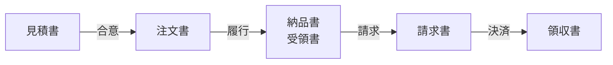
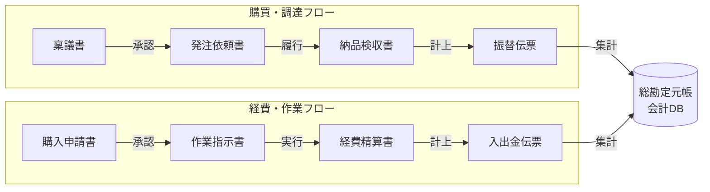
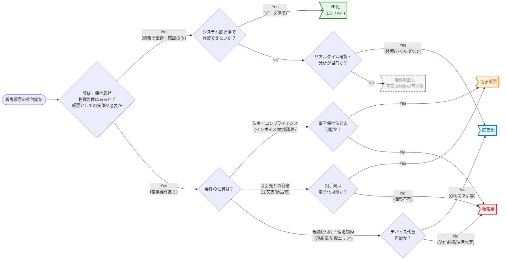
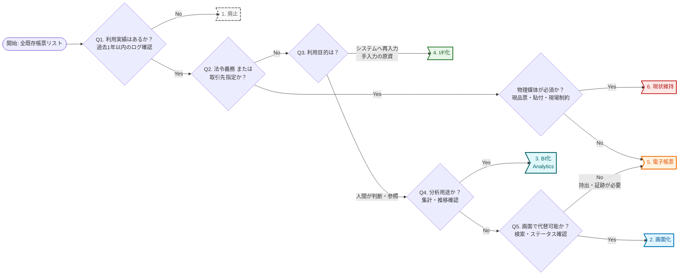

<page-title/>

::: warning 免責事項

- 有志で作成したドキュメントである。フューチャーには多様なプロジェクトが存在し、それぞれの状況に合わせて工夫された開発プロセスや高度な開発支援環境が存在する。本ガイドラインはフューチャーの全ての部署／プロジェクトで適用されているわけではなく、有志が観点を持ち寄って新たに整理したものである
- 相容れない部分があればその領域を書き換えて利用することを想定している。プロジェクト固有の背景や要件への配慮は、ガイドライン利用者が最終的に判断すること。本ガイドラインに必ず従うことは求めておらず、設計案の提示と、それらの評価観点を利用者に提供することを主目的としている
- 掲載内容および利用に際して発生した問題、それに伴う損害については、フューチャー株式会社は一切の責任を負わないものとする。掲載している情報は予告なく変更する場合がある

:::

# はじめに

帳票とは企業の経営活動に関わる書類で、**帳簿**と**伝票**の総称を指す。帳票の起源は古く、人類が経済活動の中で契約が発生した瞬間から合意内容を残すために存在したと考えられる。媒体は粘土板、紙、PDFなどの電子データに変化したが、本質的な役割は変わっていない。

- **記録と合意形成:** ある時点の受注、請求、納品などの取引状態を記録し、契約者間の合意形成の証とする
- **法的・税務への対応:** 監査や税務処理において、ビジネス活動の正当性を証明する正データとなる

昨今のIT/DX化でペーパーレスがなされ、紙の帳票は減っているが、電子帳簿保存法やインボイス対応などで、帳票自体の重要性は以前と変わらない。帳票を学ぶことは、単なる出力機能の実装に留まらず、ITコンサルタントとして必要な次のスキルを得ることができる。

1. **業務知識**: 優れた帳票は、ビジネスの本質的なデータ構造を映し出す。帳票を設計することは、業務フローとデータモデルの不整合を発見し、良いドメインモデルを見つけることに繋がる
2. **利用者視点の獲得**: 帳票はエンドユーザーが見るために生成するため、システム全体のUI/UXに大きく影響する。また、その帳票を用いてどのような業務フローにするかなど高い視座で考える起点となる

帳票設計は、枯れた技術ではなく、今なおビジネスとシステムを繋ぐコア技術である。本ガイドラインがそうした帳票設計の品質向上の一助となれば幸いである。

# 帳票とは

本ガイドラインでは、システムが出力する帳簿や伝票などを示すファイルのうち「人間が利用する前提の文書」でレイアウトが固定化され、出力された瞬間から内容が変化せず、視認性を担保した成果物を帳票と定義する。なお、元々人間が読み取れる形式であるが、実際は出力後に相手先がOCRなどで自動で取り込んでいたとしても帳票であることには変わりないとする。人間に加えてAIエージェントが内容を参照する場合も、人間による確認・承認するプロセスが含まれるならば帳票と見なす（あくまで人間を主たる利用者と定義する）。一方で、AIエージェントだけで処理が完結し、人間がその内容を直接確認しない場合はI/Fとして扱う。

対象とする帳票の媒体:

- 紙
- PDF
- Excel（罫線などのレイアウト、印刷範囲、改ページが存在するもののみ）

対象外とするもの:

1. **CSV/Excelのデータ出力:** 一覧や明細データのCSV/Excelダウンロード機能がある。これは二次利用を前提とした「素材」としての出力でありレイアウトに意味はないため、帳票とは別であるとする。なお、ExcelダウンロードはCSVのようにテーブルデータをそのまま出力する場合を指し、レイアウトを組んで視認性を高めたものはExcel帳票として扱う
2. **印刷用CSSを適用したWeb画面**: ブラウザの印刷機能を用いたHTML出力は、ユーザーの環境（ブラウザの種類、余白設定、フォント設定）によってレイアウトが変化し、厳密な再現性を保証することが困難であるため、本ガイドラインでは帳票として扱わずUIの一種として見なす（[電子帳票](#電子帳票) 章を参照）
3. **SVG帳票**: SVGを用いたベクター描画は、座標指定による厳密なレイアウトが可能であり、PDFの代替技術として注目されている。しかし、改ページ制御の実装難易度や、開発・保守に関するナレッジが蓄積されきっていないという現状を鑑み、本ガイドラインの範囲外とする

## 帳票の分類体系

帳票定義は、業務的な役割と、それを具現化するレイアウト形式の2つの側面から分類できる。

### 業務分類

帳票は「誰に」「何のために」出力するかで分類できる。この分類は、非機能要件（デザイン、セキュリティ、保存義務）を決定する基準となる。

| 概要                                                                                     | 分類                                                                                                                                                         | 例                                                                                                                                       |
| :--------------------------------------------------------------------------------------- | :----------------------------------------------------------------------------------------------------------------------------------------------------------- | :--------------------------------------------------------------------------------------------------------------------------------------- |
| 取引の証明や通知として顧客へ送付する書類。デザイン性と、証憑としての正確性が求められる   | 証憑（取引が成立した事実を証明する根拠書類。税務調査等で重要視される）                                                                                       | 【商流】 見積書、注文書、納品書、請求書、領収書  【契約】基本契約書、秘密保持契約書、覚書                                             |
|                                                                                          | 顧客レポート（サービスの利用状況などを通知するもの）                                                                                                         | 利用明細書、残高証明書、運用レポート                                                                                                     |
| 社内の業務指示、記録、内部統制のために用いる書類。デザインよりも網羅性や効率が優先される | 伝票（取引発生の都度、その内容を記録し、会計仕訳の根拠となる書類。会計ルールに基づき、3伝票制（入金・出金・振替）や5伝票制（＋仕入・売上）などが採用される） | 入金/出金伝票（現金の出入りを記録）、振替伝票（現金以外の掛取引などを記録）、仕入/売上伝票（商品売買の事実を記録）                       |
|                                                                                          | 帳簿（取引の事実を網羅的・時系列に記録したもの）                                                                                                             | 仕訳帳、総勘定元帳（※現代ではデータベースのトランザクションログや元帳テーブルがその役割を担う）                                          |
|                                                                                          | 現場指示・管理（業務オペレーションを回すための書類。物理的なモノと紐づくケースが多い）                                                                       | 【物流製造】 ピッキングリスト、生産指示書、現品票、配送ルート表 【管理】在庫一覧表、棚卸表（※これらはタブレットなどへの移行推奨領域） |
| 行政への届出や法令遵守のために作成する書類。様式や保存期間への厳格な準拠が求められる     | 税務・労務（人事給与システム等から出力される行政届出書類）                                                                                                   | 源泉徴収票、給与支払報告書、社会保険届出書、労働者名簿                                                                                   |
|                                                                                          | 産業特有の義務（特定業法に基づき作成・保存が義務付けられているもの）                                                                                         | 製造記録、法定点検記録簿                                                                                                                 |

帳票ごとに以下の様な観点でIT/DX推進化の検討を求められることが多い。

対内帳票は社内で完結するため、取引先との合意形成が不要である。したがって、BPRの難易度は相対的に低く、効果を出しやすい傾向にある。

- **リスト:** 紙やPDFからBIやWeb画面化へ目指したい
- **現場指示:** 紙のピッキングリストや作業指示書は、ハンディターミナルやタブレットへ移行できると、リアルタイムな実績収集が可能となる

対外帳票は、取引先との関係性や、税務上の証憑となるため、勝手な廃止はできない。

- **PDF化:** 郵送コスト削減のため、PDF生成＋メール/Web配信へ移行できないか検討する
- **データ化:** 最終的には、データ連携（I/F化）を目指すのが理想形である。取引先との調整は容易でないため、慎重かつ長期的な視点で取り組む

法定/公的帳票は、「法律が変わればフォーマットも変わる」ため、改修コストも意識する。可能な限り自社開発せず、パッケージやSaaSなどを活用するアーキテクチャ戦略も考える。

かつて物理的な冊子であった仕訳帳・元帳などの帳簿は、現代においてはデータベースそのものである。電子帳簿保存法の要件を満たしたDB設計（訂正削除履歴の保持など）を行っていれば、監査等で必要な場合にのみ、CSVなどで出力できれば十分と考えることができる。

::: tip 帳票のライフサイクル  
帳票は単独で存在するのではなく、業務プロセスの中で姿を変えながら流れていく。

対外帳票の基本サイクルイメージ:

これらの帳票は、元となるデータ（商品、数量、単価）はほぼ同一で、状態、件名が変わっているだけである場合が多い。こういった俯瞰した立場での構造の理解をすることは重要である。

一方で対内帳票は、下図のように意思決定から始まり、業務の実行報告を経て、最終的に会計データへと変換されていく流れとなる。

:::

### 表現形式

業務要件を物理的または電子的に出力する際のレイアウトパターンがある。

| 形式     | データ構造 | 特徴・実装要件                                                                                                       | 代表例                                   |
| :------- | :--------- | :------------------------------------------------------------------------------------------------------------------- | :--------------------------------------- |
| 単票     | 1 : 1      | 1つのデータセットをレイアウトで固定、明細行の増減考慮は不要                                                          | 配送伝票、会員申込書、源泉徴収票、入館証 |
| 鑑・明細 | 1 : N      | 固定のヘッダー部と、可変の明細部で構成される。明細数がページ枠を超えた場合の自動改ページ制御や合計欄の表示制御が必要 | 請求書、納品書、見積書、注文書           |
| リスト   | N          | データを一覧形式で連続出力する。グループヘッダーや集計行を含むことが多い。デザイン性は低い                           | 在庫一覧表、チェックリスト、ログレポート |
| ラベル   | N          | 特殊サイズや連続用紙に、小さな単票レイアウトを繰り返し出力する。バーコードを含むことが多い                           | 配送ラベル、商品タグ、SCMラベル          |

鑑・明細は最も実装難易度が高く、「明細が1行溢れたら次ページへ送る」「最終ページにのみ合計欄を出す」など様々な要件があり、HTML/CSSでの制御が難しいとされる。

リストに関しては、以前は「管理用」として大量に印刷されていたが、現代では他の手段で代替を考えるべき帳票である。「紙で出力してマーカーでチェックする」業務は、「画面でフィルタリングしてチェックボックスで消し込む」か「Excelでピボットテーブル分析する」などへの移行が考えられる。

# 新規帳票の作成について判断基準

新規サービス開発や既存業務のデジタル化で帳票出力を求められる場合は多い。しかし、一般的に帳票は一度定着すると業務プロセスと密接に絡み合い、後になっての変更や廃止が困難になる。そのため、帳票を安易に新規作成することは避けるべきである。

帳票化は以下の優先順で考える。

1. **作らない:** その帳票は本当に必要か考える。念のために用意しておくというレベルであれば作成しない
2. **I/F化:** システム間連携（EDI、API）で完結できないか考える。人間を介在させずシステムに直接渡す方が業務効率は高まる
3. **画面化:** リアルタイムな確認や分析が目的であれば、静的な帳票よりも、検索・ドリルダウンが可能なBIツールや管理画面化を検討する
4. **帳票化:** 上記いずれも適用できない場合に初めて、帳票としての設計を考える

以下の条件/要件の場合は、逆に帳票化を考える。

- 法令・コンプライアンス要件
  - 法律や公的なガイドラインにより、特定の様式での保存・交付が義務付けられている場合
  - 例: インボイス、領収書、財務諸表
  - 紙ではなく電子データ（PDF等）での保存を第一に検討する
- 取引先との合意
  - 企業間や顧客に取引の内容を確定させ、言った言わないのトラブルを防止するための「契約」としての性質を持つ場合
  - 例: 注文書、契約書、納品受領証
  - 相手先の受け入れ体制に依存する。自社が電子化を望んでも、取引先が紙や特定フォーマットを要求する場合、ビジネス継続の観点から帳票化が必要となる
- 現物との紐付け
  - 「モノ」と情報の移動を同期させる必要がある場合
  - 例: 配送伝票、現品票、ピッキングリスト、入館証
  - 判断: デバイス（タブレット等）の持ち込みが困難な現場や、荷物に貼付する必要がある場合は、物理的な紙帳票が最適解となる
  - ※入館証はQRコード化しつつスマホ画面で代替するなど、技術的な回避策があるかも検討の余地がある
- デバイス利用が難しい場合
  - 工場など油で汚れるような環境や、防爆エリアや手袋などでタッチパネル操作が不可などの場合

判定フローは以下のイメージである。

::: tip BCP（事業継続計画）と帳票の役割  
高度に統合されたシステムは効率的だが、災害やランサムウェア被害などによるシステムダウン時には、その依存性の高さが仇となる。この際、「ローテクな帳票」が最後の砦として機能するケースがある。

- 独立したデータの実体化: PDFやExcel/CSVとして出力された帳票は、基幹システムが停止しても、ローカルPCや標準的なビューアがあれば閲覧・加工・情報伝達が可能である
- 縮退運転の許容: 例えば受注システムが全停止した場合で、直近の「注文一覧Excel」や「在庫表CSV」があれば、電話やメールベースでの手動受注対応（つまりオフライン業務）へ切り替えることができる

平時の効率化だけでなく、有事の際に「どのデータがあれば ”最低限の業務” を継続できるか」を考慮し、あえてCSVやExcelといった汎用的な形式での出力を、BCP対応機能の一部として組み込む判断も必要である。  
:::

::: tip 業務プロセスにおける「紙」の功罪  
「紙の帳票」が業務フローに介在することは、基本的に非効率と見なされる。

- **ロケーションの制約:** 物理的な紙はその場に行かないと確認できないため、リモートワークと相性が悪い。郵送や社内便のリードタイムが発生し、業務スピードも低くなる
- **見やすさの代償**: 紙はデバイス不要で即座に閲覧でき、一覧性や視認性も高い。しかし検索性と再利用性が低い
- **目視チェックの負荷**: 紙の目視チェックは、疲労や熟練度の差によるミスが起こり得る。OCRによって、AIエージェントによるチェックも可能であるが、それであれば最初から電子化しておけばよい

最終的に紙の形式で保存する必要がある場合は別として、そうでない場合は紙の持つ局所的な見やすさだけではなく、業務プロセス全体かつ将来的なAIによる自動化を見据えて未来像を描くべきである。  
:::

# 既存帳票への対応

システムのリプレースなど既存帳票が存在する場合は、業務プロセスを見直す機会と捉えることができる。また、安易に現行踏襲とせず、今の時代に合った方針とするという方針が否定されることはまずない。一方で取引先との都合や法的制約などで一律不要・一律電子化にはできないため、見極めが重要である。

推奨は以下の通り。

- 既存帳票の棚卸しを実施し全量を把握する
  - 設計書、ソースコード解析、ワークフローエンジン、実行ログなどから、信頼性がある帳票一覧を作成する
- 現行通りを正とせず、ログや利用実績・印刷実績に基づく定量的な判断する
  - 「使うかもしれない」という定性的な意見だけを根拠としない。生成しても誰も参照・印刷・ダウンロードしていない帳票は断捨離する

洗い出した帳票について、以下のいずれかの移行方針を決定する。

1. 廃止: 利用実績がない、または代替手段が既にある場合。移行対象外とする
2. 画面化: 参照頻度は高いが、証跡としての重要度は低い場合。ダッシュボードや検索画面化する
3. BI化: 分析用途であればBIにデータ連携して見てもらう
4. I/F化: 後続システムへの入力として使われている場合は、帳票にする必要はない。
5. 電子帳票: 法的要件、または対外的な証跡として必須の場合。現行が紙であれば、PDFやHTML帳票化を検討
6. 現状維持: 既存の出力形式に従う

判定フローは以下のイメージである。

特に、取引先に対して出力している場合は必ず調整が必要であり、商流によってはかなり難しい現実がある。その場合は、それが制約で現状維持となることも珍しくなく、当然でもある。

切り替えの大方針の推奨は以下の通り。

- 内部利用の帳票は原則「画面化」「BI化」を検討する
  - 社内稟議、月次報告、在庫確認など、社内で完結する業務については、原則として帳票を作成せず、ワークフローシステムやダッシュボードへ移行する。情報のリアルタイム性と検索性を優先し、DX化を促進する
- 隠れ帳票への対応
  - システム外で運用されているExcelマクロ、AccessといったEUC（エンドユーザーコンピューティング）へのシステム化要件を含めると工数が膨大になることが多い。原則としてシステム移行対象外とし、CSV/Excelなどのデータソース提供に留め、ユーザー責任とすると言った線引を最初に議論する
- 取引先との紙帳票からの電子化は「段階的移行」を検討する
  - B2B取引において、流通BMSや全銀EDIシステムのような標準化されたデータ交換基盤への移行が理想であるが、取引先がいる話であることから調整は困難である
  - 当面は現行踏襲にすることを受け入れ、中長期的な視点で徐々に改善していくということを受け入れる。現/新の並行稼働など移行計画についても、取引先と調整する

# 電子帳票

電子帳票化の出力形式はPDF、SVG、HTML、Excelなどの選択肢がある。それぞれの特徴を下表でまとめる。

| \#             | PDF                                                            | Excel                                                              | SVG                                                                             | HTML                                                   |
| :------------- | :------------------------------------------------------------- | :----------------------------------------------------------------- | :------------------------------------------------------------------------------ | :----------------------------------------------------- |
| 説明           | 環境非依存で見た目のレイアウト保証が容易。証跡として価値が高い | ユーザーによる二次加工・分析を前提とする。レイアウトの厳密性は低い | 座標指定によりWeb上で厳密なレイアウトが可能。プレプリント紙への重ね打ち等に強い | 閲覧性は高いが、レイアウト保障は難しい                 |
| レイアウト保障 | ✅️                                                             | ⚠️                                                                 | ✅️ 座標指定のためズレない                                                       | ❌️ユーザー設定に影響                                   |
| 改ざん防止     | ✅️ 電子署名など                                                | ❌️ 誤変更の恐れ                                                    | ⚠️テキストベースのためソース編集は可能                                          | ⚠️誤入力は防げるが、開発者ツールから変更は容易         |
| データ二次利用 | ❌️解析にハードルがある                                         | ✅️容易                                                             | ⚠️ 文字情報は持つが、構造は視覚的                                               | ⚠️構造によっては容易                                   |
| 開発コスト     | ❌️ 高い。SVFなど専用ツール                                     | ⚠️複雑なレイアウトでなければ、比較的、容易である                   | ❌️ (高い) 改ページ制御等を自前実装する必要がある                                | ⚠️ CSS Paged Mediaの進化で簡易帳票であれば選択しやすい |

推奨は以下の通り。

- 原則、電子帳票にはPDFを選択する
  - 厳密な印刷が必要な場合や、証跡として残す必要がある場合は、最も確実なレイアウトを組めるため
  - SVGは改ページ制御を含めた開発ナレッジが未熟であるため、原則採用しない
  - HTMLは厳密なレイアウトの調整が難しいため、帳票形式としては利用しない
- 入力フォーム用途であればExcelを選択する
  - 取引先指定の請求書フォーマットや、回答を記入して返送してもらう調査票など、「相手先に入力・加工してもらう」必要がある場合にのみExcelを選択する。ただし、この場合はWebフォーム化を第一に検討する。Web画面を作る時間/予算がない、オフラインで作業したい等の理由がある場合にExcelを採用する

## PDF帳票

PDF（Portable Document Format）は、環境に依存せず紙と同じレイアウトを再現できるフォーマットであり、対外的な証憑や保存義務のある帳簿の出力に採用される。

### フォント埋め込み

PDFの強みはどこで開いても同じ見た目であることだが、閲覧環境（PC、スマホ、OS）に同じフォントがない場合、代替フォントが適用され文字化けやレイアウト崩れの懸念がある。一方で、フォント情報の埋め込みはファイルサイズが大きくなるというトレードオフがある。

| 観点   | 案A: 全埋め込み            | 案B: サブセット埋め込み          | 案C: 埋め込みなし                 | 案D: ソフトフォント・画像化      |
| :----- | :------------------------- | :------------------------------- | :-------------------------------- | :------------------------------- |
| 内容   | フォントファイル全体を内包 | 使用文字のグリフのみ抽出して内包 | 閲覧端末のフォントを参照          | 文字を画像や図形データとして描画 |
| 再現性 | ✅️ 確実                    | ✅️ 確実                          | ⚠️ 環境に依存（崩れる可能性あり） | ✅️ 確実（見た目は保たれる）      |
| サイズ | ❌️ 肥大化する              | ⚠️ 文字数に比例して増加          | ✅️ 最も小さい                     | ⚠️ 解像度や文字量による          |
| 検索性 | ✅️ テキスト検索可          | ✅️ テキスト検索可                | ✅️ テキスト検索可                 | ❌️ 不可（画像扱いとなるため）    |

推奨は以下の通り。

1. 案Cを第一に検討する
   - 帳票数によっては大量出力や長期保存、NW帯域への負荷が無視できない差となるため
   - Windows環境で標準的なフォント（MS明朝、MSゴシック等）を使用する場合や、新聞製作システムのように閲覧端末や印刷する場合はプリンタの環境が統制されている（専用フォントが導入済み）場合は、埋め込みなしで十分な品質が担保できると考えられるため
2. 次の場合は、該当する場合に限り、他案を採用する。
   - 外字・特殊文字がある場合: 案Bまたは案Dを採用する。特定の帳票ミドルウェア（SVF等）では、外字をソフトフォント（ビットマップ）やSVG（ベクター画像）として埋め込む機能（案D）が、有効な場合が多い
   - 厳密なデザイン再現が必要な場合: 閲覧者の環境が予測できない（スマホやMac等が混在する）一般消費者向けの帳票では、案Bを検討し、レイアウト崩れを防ぐ

::: tip ファイルサイズへの影響（目安）  
日本語フォント（数千文字収録）を含むPDFを出力する場合、埋め込み設定によってファイルサイズは以下のように変化する。

- 案A: \+3MB ～ 10MB程度（※フォントデータのサイズがそのまま加算されるため非常に重い）
- 案B: \+数百KB程度（※使用する文字種によるが、実用的な範囲に収まる）
- 案C: \+0KB（※PDF本体のデータ量のみ）

「埋め込みなし」と「全埋め込み」ではサイズが桁違いになることを意識し、安易な埋め込みは避けるべきである。  
:::

::: tip 画像データの組み込みに注意  
ロゴや印影などの画像を含む場合、高解像度のビットマップをそのまま埋め込むとサイズ増大の原因となる。生成ライブラリ側で適切なdpi（印刷用300dpi、閲覧用150dpi等）へのダウンサンプリングすると良い。  
:::

### 電子署名

デジタル化された帳票は複製や改ざんが容易である。誰が作ったか（真正性）と改変されていないか（完全性）を担保するためには、単にPDFに署名データを埋め込むだけでなく、合意形成のワークフローや監査ログを含めた包括的な管理が求められる。

| 観点      | 案A: 自前実装 (PAdES)     | 案B: 簡易パスワード保護       | 案C: 保護なし        | 案D: SaaS利用                                                                                                                                                         |
| :-------- | :------------------------ | :---------------------------- | :------------------- | :-------------------------------------------------------------------------------------------------------------------------------------------------------------------- |
| 内容      | 長期署名規格を自前で実装  | PDF標準の閲覧・権限パスワード | セキュリティ設定なし | 電子契約サービス等を利用する。請求書や契約書のPDF生成までは本システムで行い、署名および締結ワークフローはAPI経由でSaaS（DocuSign、CloudSignなど）へ委譲する設計を指す |
| 法的効力  | ✅️ 高（証拠能力あり）     | ❌️ 低（改ざん検知不可）       | ❌️ なし              | ✅️ 高（証拠能力あり）                                                                                                                                                 |
| 開発/運用 | ❌️ 高（証明書管理・実装） | ✅️ 低                         | ✅️ 低                | ✅️ 低（API連携のみ）                                                                                                                                                  |
| WF/監査   | ❌️ 自前構築が必要         | ❌️ なし                       | ❌️ なし              | ✅️ サービスに包含                                                                                                                                                     |

なお、案D（SaaS利用）は機能の比較ではなくソリューションの比較となるが、実質的な選択肢としてここに含める。

推奨は以下の通り。

- 対外的な契約書・法的証拠が必要な場合、案Dの選択を検討する
  - 電子署名法やインボイス制度に対応するには、署名技術だけでなく「本人確認」「認定タイムスタンプ」「長期保存」「監査ログ」等の要件が複雑であり、自前実装（案A）はセキュリティリスクと保守コストが高すぎるため
- 社内業務向け帳票の場合、案Cを採用する
  - 閲覧パスワード等は、RPAやOCR等の後続処理を阻害するため安易に設定しない。社内セキュリティはファイルサーバーやシステムのアクセス権限で担保する

::: tip 参考：長期保存規格（PDF/A）と電子帳簿保存法  
10年以上の保存が求められる文書において、長期保存用規格である、PDF/Aが話題になることがある。PDF/A（Portable Document Format / Archive）とは電子文書を数十年といった長期間にわたって保存し、将来も確実に閲覧可能にすることを目的としている規格である（ISO 19005）。フォント埋め込み、パスワードや外部ファイルへのリンク、音声/動画の埋め込み利用が不可である。

しかし、電子帳簿保存法においてPDF/Aは必須要件ではない。同法では「見読可能性」、つまりPC画面や書面で整然と確認できることが担保されていれば、通常のPDFで問題ないとされる。実務上も、ファイルサイズ肥大化や機能制約（暗号化不可など）のデメリットが大きいため、特段の要件がない限り採用する必要はない。  
:::

## Excel帳票

Excel帳票はデータの二次利用性が特徴であるが、帳票に関してはそれが必ずしも行うべきでないこともあり注意が求められる。

### 生成方式とテンプレート管理

プログラムからExcelを生成する際、レイアウト（罫線、フォント等）をどう定義するかが保守コストに直結する。

| 観点     | 案A: コード描画方式    | 案B: テンプレート方式                |
| :------- | :--------------------- | :----------------------------------- |
| 内容     | プログラムですべて構築 | xlsxファイルを読み込みデータ流し込み |
| 開発効率 | ❌️ 低（記述量が多い）  | ✅️ 高（Excel上でデザイン可）         |
| 保守性   | ❌️ 低（ビルドが必要）  | ✅️ 高（ファイルの差替えのみ）        |

推奨は以下の通り。

- 案Bを選択する。帳票レイアウトはエンドユーザーからの微調整要望が頻発する領域であり、Excel操作で修正可能なテンプレート方式が圧倒的に運用コストを低減できるため

::: tip テンプレートファイルの外部参照に注意  
開発者がローカルPCでテンプレートを作成する際、無意識に別ブック（テストデータ等）を参照する数式が含まれてしまうことがある。これが本番環境に残るとエラーの原因となる。リリース前に目視チェックや、外部参照先にアクセスできない環境でのファイルオープンの確認することを忘れないようにする。なお、数式内の `[Book1.xlsx]` のような記述が外部参照である。テンプレート化する際は、値をペーストするなどして参照を断ち切る必要がある。  
:::

### 改ページの是非

「1ページごとの合計（ページ計）を出したい」「特定の行数で必ず改ページしたい」という要望は多いが、Excelにおいて印刷結果を厳密に制御することは難しい。

| 観点       | 案A: Excelで厳密制御                           | 案B: Excelで成り行き                         | 案C: PDF化                          |
| :--------- | :--------------------------------------------- | :------------------------------------------- | :---------------------------------- |
| 内容       | 改ページ位置やページ計をプログラムで計算し挿入 | 印刷設定はユーザーに委ね、データは連続させる | 印刷用レイアウトとしてPDFを生成する |
| 再現性     | ❌️ 低（プリンタ依存でズレる）                  | ⚠️ 環境による                                | ✅️ 確実                             |
| 開発コスト | ❌️ 高（行計算ロジックが複雑）                  | ✅️ 低                                        | ⚠️ 中                               |

推奨は以下の通り。

- 原則として案B、要件が厳しい場合は案Cを選択する
  - ExcelはプリンタドライバやOSの解像度設定によって「1ページに収まる行数」が変化するため、プログラムで制御してもユーザー環境ではズレるリスクが高い
  - 「ページ計」や「厳密な改ページ」が必須要件である場合は、ExcelではなくPDF帳票（案C）とすべきである

### Excel方眼紙の是非

紙のレイアウトを忠実に再現したい要望と、データを活用したい要望は対立する。日本固有の複雑なレイアウトをどう表現するかが論点である。

| 観点       | 案A: リスト形式             | 案B: 方眼紙形式        | 案C: ハイブリッド            |
| :--------- | :-------------------------- | :--------------------- | :--------------------------- |
| 特徴       | 1列=1項目のDB形式           | 全列を極細にしセル結合 | 印刷用とデータ用シートを分割 |
| 印刷再現   | ❌️ 低                       | ✅️ 高                  | ✅️ 高                        |
| データ活用 | ✅️ 高（ソート・フィルタ可） | ❌️ 低（加工困難）      | ✅️ 高                        |

推奨は以下の通り。

- 案Aを原則、選択するとする。 システム出力のExcelは別のシステムで再取り込みをスルことも多く、データ構造を破壊する方眼紙形式は避けるべきであるため
  - 見た目重視ならPDF、データ重視ならExcelリストという使い分けを基本とする
  - 方眼紙形式は、スクリーンリーダーでの読み上げが困難であり、アクセシビリティの観点からも推奨されない

### マクロ（VBA）の取り扱い

ボタンによる再計算や画面遷移などの要望に対し、マクロ付きExcelが候補に挙がることがあるが、セキュリティ動向との兼ね合いが問題となる。

| 観点   | 案A: マクロ実装 (.xlsm)     | 案B: サーバー処理                  |
| :----- | :-------------------------- | :--------------------------------- |
| 内容   | VBAを記述したファイルを配布 | ロジックはサーバーで処理し値を出力 |
| 安全性 | ❌️ ブロックされる可能性大   | ✅️ 安全                            |
| 保守性 | ❌️ 属人化しやすい           | ✅️ システム管理下にある            |

推奨は以下の通り。

- 案Bを選択する。 Mark of the Web等のセキュリティ強化により、マクロ付きExcelの配布は運用トラブルの温床となる懸念があるため
  - ロジックはシステム側で完結させる様な役割境界とする方が良い
  - どうしても動的な挙動が必要な場合は、ExcelではなくWebアプリケーション上の機能として実装することを検討する

### 計算式（関数）の埋め込み

合計欄や消費税計算などを、Excelの数式（`=SUM(A1:A10)` 等）で出力するか、計算済みの「値」で出力するかが論点となる。数式を利用するとテンプレート（フォーム）側にビジネスロジック（例えば端数の切り捨てなどのロジック）が入ってしまうためその観点では避けたい。一方で、改ページがありページ単位で合計金額を表示したいなどの場合は、改ページロジックと同期を取ってサーバー側で計算することは難しく、`SUM(A1~A20)`といった動数式で対応するほうが楽である。どこまでフォームにビジネスロジックを持たせるかは悩ましいポイントである。

| 観点         | 案A: 数式（Formula）埋め込み               | 案B: 値（Value）埋め込み                 |
| :----------- | :----------------------------------------- | :--------------------------------------- |
| 内容         | テンプレートまたはプログラムで数式をセット | サーバー側で計算し、結果の数値のみセット |
| 整合性       | ⚠️ 端数処理等がExcel仕様に依存する         | ✅️ システムの計算結果と一致              |
| 改ページ対応 | ✅️ 容易                                    | ⚠️ 改ページ単位で集計する必要がある      |

推奨は以下の通り。

- 原則として案B（値埋め込み）を第一に検討する
  - 端数処理（切り捨て・四捨五入）のロジックがExcelとサーバー側で異なると、システム上の金額と合わなくなるリスクがある
  - フォーム側にはビジネスロジックを持たせないという原則がある
- ただし、計算ロジックが合計欄で `=SUM(A1:A10)` のように、シンプルであれば開発生産性を考え案Aを採用しても良い。この場合、利用する計算は、単純な四則演算に留めるなどの方針を設ける
  - 特に改ページでページ単位の合計金額などは、保守性などを考慮しフォーム側にロジックを持たせることは利がある

### 保護設定と暗号化

ファイルの内容を勝手に書き換えられたくない、あるいは第三者に見られたくないというニーズに対し、どのレベルの保護を適用するかが論点である。

| 観点   | 案A: 読み取り専用推奨     | 案B: シート保護          | 案C: 読み取りパスワード   |
| :----- | :------------------------ | :----------------------- | :------------------------ |
| 目的   | 誤操作（上書き）防止      | レイアウト・数式破壊防止 | 機密情報の漏洩防止        |
| 強制力 | ⚠️ なし（ダイアログのみ） | ✅️ あり（編集不可）      | ✅️ あり（閲覧不可）       |
| 副作用 | ✅️ ほぼなし               | ⚠️ フィルタ等不可        | ❌️ 自動化不可・通知の手間 |

推奨は以下の通り。

- 共有フォルダ配置用には案A、レイアウト厳守の請求書等には案Bを採用する
- 機密情報の送付には案Cを検討するが、可能であればWebからのダウンロードに誘導し、ファイル自体のパスワード管理は避けること
- 書き込みパスワードの設定は、システム出力帳票においては運用が煩雑になるだけでメリットが薄いため、原則不要とする

### 文字コード

システム内部、データベース、出力ファイル間で文字コードが不統一であると文字化けの原因となる。

推奨は以下の通り。

- 内部処理から出力まで UTF-8 で統一する
  - Excelファイル（.xlsx）の内部XMLはUTF-8であり、最も互換性が高いため

### ライブラリ利用時の注意

Apache POIなどのライブラリは、標準的な使用法ではファイル全体をメモリに展開するため、大量データ出力時にメモリ枯渇を引き起こすリスクがある。

以下の点に注意する。

- 明細行数が不定または数千行を超える可能性がある場合は、DOMに全て展開せずストリーミング型で処理する
  - 設計段階で、ヘッダー・単純明細リストといった、出力に適したレイアウトを採用するように調整する
- Excelのスタイル定義数上限（6.4万）回避のため、ループ内でスタイルオブジェクトを生成せず、シングルトンとして使い回すことに注意する

# 紙帳票

デジタル化が進む現代においても、物理的な実体を持つ「紙」が業務上、不可欠な場面は存在する。しかし、紙帳票はプリンタ制約などのハードウェア依存や物理的な制御など、ベテランが集まれば話題が尽きないほど考慮点が多い。

## 印刷方式

紙帳票の印刷には次の2方式が存在する。

| \#               | （1）オンデマンド印刷                                                                                           | （2）自動印刷                                                                                                      |
| :--------------- | :-------------------------------------------------------------------------------------------------------------- | :----------------------------------------------------------------------------------------------------------------- |
| 概要             | ブラウザでPDFを表示し、ユーザーの操作をトリガーにプリンタで印刷する方式。オフィスのプリンタ印刷で行うことが多い | システムがバックグラウンドで直接プリンタへ印刷要求を行う方式。オフィスのプリンタ印刷とセンター印刷の両方がありえる |
| 結合度           | ✅️ 疎結合。システムはプリンタを知る必要がない                                                                   | ❌️ 密結合。特定メーカー・機種に強く依存する                                                                        |
| 処理性能         | ❌️ 不向き。数千枚のPDFをブラウザで開くとPCが固まる                                                              | ✅️ 最速。データ量が最小限であり、物理限界まで速度が出る                                                            |
| レイアウト再現性 | ✅️ 高い。PDF規格により保証される                                                                                | ✅️ 精密。ドット単位、給紙トレイ、カッター等の物理制御が可能                                                        |
| 専用用紙         | ❌️ 不向き                                                                                                       | ✅️ 対応可能                                                                                                        |
| 保守性           | ⚠️ ブラウザのPDFビューア仕様変更に影響を受ける場合がある                                                        | ❌️ プリンタ生産終了時に、アプリ改修や帳票作り直しが発生する                                                        |
| プレビュー要件   | ✅️ 容易                                                                                                         | ✅️プリンタ直接制御の場合、プレビュー用のPDFを別途作成する必要がある                                                |

推奨は以下の通り。

- （1）を第1に選択する。印刷の数や頻度が少ない場合に適する。窓口業務や対面販売、ラベルの個別発行などが想定
  - ユーザーにHTML・PDF経由で印刷の有無を判断させたほうが、段階的なペーパーレスにも有用であるため
  - システム側で印刷実行/用紙切れ対応/紙詰まり対応などのプリンタ制御する手間がなくなるため
  - サーバーはPDF生成までに徹し、印刷処理やプレビューはユーザーPCに任せることで、プリンター機種変更がシステムに影響を与えない、疎結合な構成とできるため
- （2）は業務上の必然性がある場合に限定する
  - 郵送用に大量の一括出力、無人倉庫での自動発行、即時性が求められる製造ラインなど、「人による操作の隙がない」プロセスに限定して採用する
  - この方式を選択する場合、後述する「プリンタ制御方式」節に従い、ハードウェア依存を低減するよう設計すること
  - 基本的に当社実績が多数ある、SVFの利用を第一に考える

## プリンタ制御方式

TBD 自動印刷を採用した場合、プリンタが詰まったり用紙切れの場合のエラーハンドリングや業務運用について（SNTPトラップの利用有無など）

## 用紙

紙帳票で利用する用紙は大別すると3分類ある。

| \#  | 分類     | 概要                                                                                 | 主な用途                               | 対応プリンタ                        |
| :-- | :------- | :----------------------------------------------------------------------------------- | :------------------------------------- | :---------------------------------- |
| 1   | カット紙 | A4、B5など、定型サイズに断裁された単票用紙。最も一般的で汎用性が高い                 | ・請求書、見積書 ・社内ドキュメント    | ・レーザー ・インクジェット         |
| 2   | 連続紙   | ミシン目で繋がり、左右に搬送用の送り穴がある用紙。折りたたまれた状態で箱に入っている | ・大量一括出力 ・複写伝票（納品書等）  | ・ドットインパクト ・ラインプリンタ |
| 3   | ロール紙 | トイレットペーパー状に巻かれた用紙。印刷後にカッターで切り離すか、手でちぎる         | ・レシート ・物流ラベル ・入場チケット | ・サーマルプリンタ ・ラベルプリンタ |

上記の形状に対し、どのような加工や素材が使われているかでコストと運用が変わる。

1. プレプリント有無
   - 無地: 何も印刷されていない紙。システム側で罫線やロゴを含めてすべて印刷する
   - プレプリント: あらかじめロゴ、罫線、約款などが印刷所によって印刷された用紙。システムからは文字のみを印字する。大量印刷時のトナーコスト削減や、カラーロゴの再現に使われる
2. ミシン目・パンチ穴などの加工有無
   - 切り離し用のミシン目や、ファイリング用のパンチ穴があらかじめ加工されたもの
3. 複写（カーボン）
   - ノーカーボン紙: 筆圧や衝撃を加えると発色する紙。ドットインパクトプリンタでの打撃が必須となる
4. 感熱（サーマル）
   - 感熱紙: 熱を加えると黒く発色する特殊紙。インクやトナーが不要でランニングコストは安いが、長期保存に弱い。主にロール紙（レシート）で利用される

用紙を出発点とした論点は存在しない。用紙選定については、要件に応じて適切に選択する。

## ハードウェア（プリンタ）保守

帳票システムの寿命は長い。一度稼働すれば10年、20年と使い続けられることも珍しくない。しかし、その出力先となる物理的なプリンタの市場環境は近年縮小傾向にあり、複写伝票に不可欠な「ドットインパクトプリンタ」や、基幹業務用の「連続帳票ページプリンタ」などは事業撤退や統合が進んできている。大手メーカーであっても、特定のレガシー機種については「在庫限り」や「保守終了予定」のアナウンスが相次いでいる。ハードウェアの供給継続性にも気を配って機種を選定する必要がある。

留意点には次のような観点がある。

- ドライバの互換性
  - クライアントOS（Windows）のバージョンアップで、ドライバが提供されないままといった古いプリンタがある。過去のものを使い続ける場合は、ドライバ対応状況に気をつける必要がある
- 保守契約
  - 専用プリンタの保守契約（5年/10年など）は、本体価格と同等かそれ以上に高額なケースがある
  - 予算組みについては長期的な視点で計画を組んでおく必要がある。システム寿命よりもハードウェア寿命が組むことを前提にリプレース予算を確保する

## 印刷フォント

紙への印刷において、フォントデータが「どこ」に存在するかは、印刷速度とネットワーク負荷に大きな影響を与える。

| 方式         | （1） クライアント描画（画像モード）                             | （2） プリンタフォント（テキストモード）                              |
| :----------- | :--------------------------------------------------------------- | :-------------------------------------------------------------------- |
| 概要         | PCまたはサーバー側でイメージ（画像）を作成し、プリンタへ送信する | テキストコードのみを送信し、プリンタ内部のフォントROMを使って描画する |
| フォント配置 | PC / サーバー / PDF内                                            | プリンタ本体（ハードウェア）                                          |
| データ量     | ❌️ 大（数MB〜/ページ）                                           | ✅️ 極小（数KB/ページ）                                                |
| 印刷速度     | ⚠️ 遅い（転送・展開に時間がかかる）                              | ✅️ 最速（プリンタのスペック上限が出る）                               |
| 汎用性       | ✅️ 高い（どのプリンタでも出せる）                                | ❌️ 低（専用のフォント搭載機が必要）                                   |

（2）のように、プリンタまでテキストで送信する場合は、プリンタ側に必要なフォントをインストールする必要がある。

推奨は以下の通り。

- 自動印刷（大量一括出力）の場合は、（2）プリンタフォント の利用を第一に検討する
  - 数千枚の帳票を画像データとして送るとネットワーク帯域を圧迫し、印刷完了まで数時間を要する懸念があるため

# 表示制御

TBD 1,000（カンマ有無）、右寄せ/左寄せ、ルビ、0埋め有無、マイナス表示（-△▲1,000）などを追記予定。

# 保存要件

TBD 法定基準。電子帳票（電帳法の要件）、印刷帳票の保管場所など留意事項を追記予定。

# 性能

TBD 以下を追記予定。

- 電子帳票: 非同期化・並列化
- 紙帳票: サーバ性能（スプールファイル作成）、サーバ→プリンタへのネットワーク帯域、プリンタの印刷性能（PPM）、レイアウトによる印刷スピード、センター大量印刷時のPDF/直接制御について触れる

# セキュリティ

TBD 以下を追記予定。

- 電子帳票: [PDFの印刷許可/不許可設定](https://helpx.adobe.com/jp/acrobat/desktop/protect-documents/protect-with-passwords/restrict-printing-editing-and-copying-pdfs.html)
- 紙帳票: プリンタ認証。金券扱いになるなどで再印刷は不許可（上長承認必須など）、この場合はPDF印刷不可にしたり、【再印刷】というラベルが追加

# ドキュメント

TBD 帳票一覧（種別、用紙種別、業務担当者、利用先などの記載すべき項目） / 帳票設計書について追記予定。

# テスト

TBD 全体テスト計画に準ずる。紙帳票固有の事情としては、単体テストで印字テストをしておくべきで、STなど後続フェーズにできる限り回すべきではない旨を追記予定。

# 謝辞

このアーキテクチャガイドラインの作成には多くの方々にご協力いただいた。心より感謝申し上げる。

- 作成者: 真野隼記
- レビュアー: 井上拓、椎名祐介、藤野圭一、澁川喜規、宮崎将太
