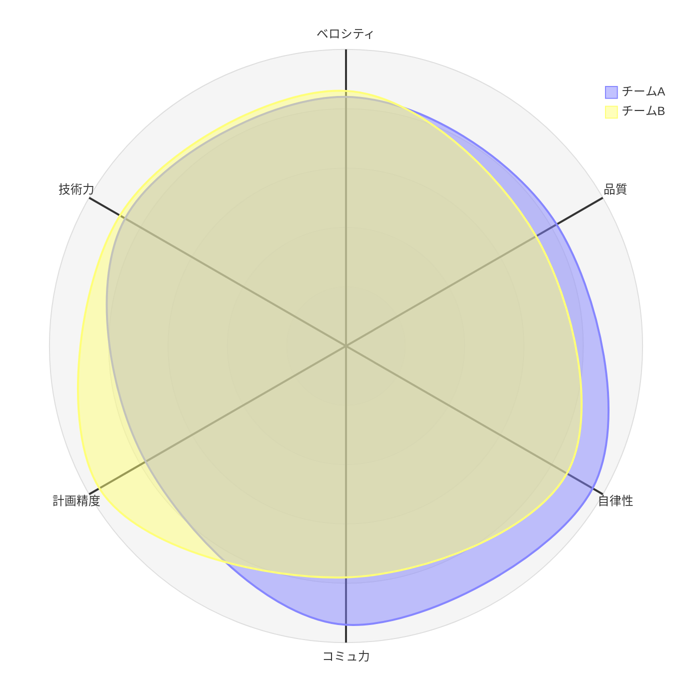
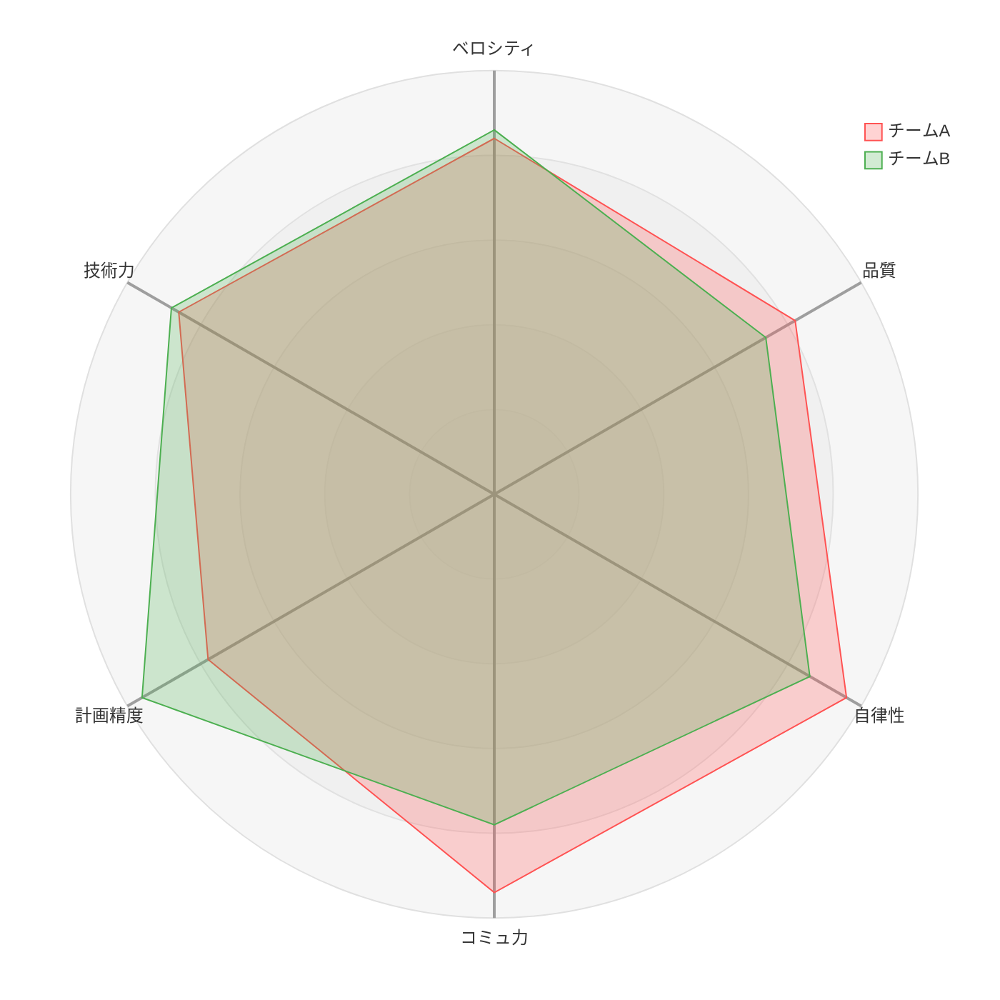
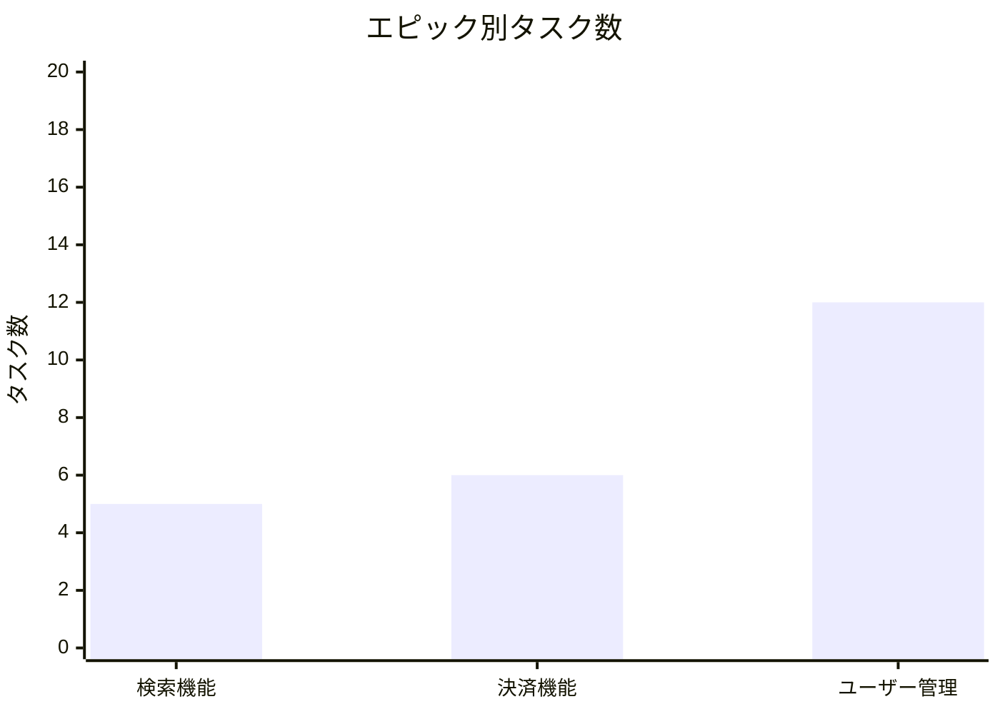
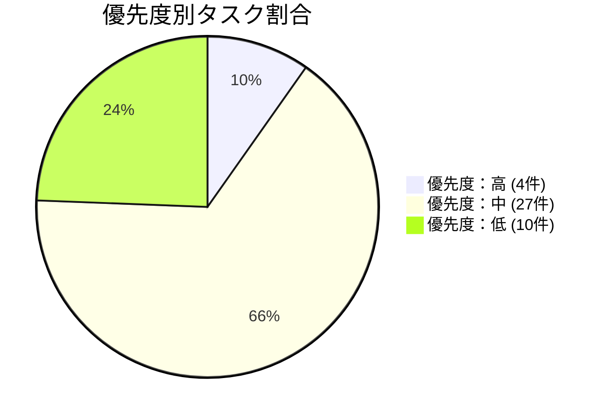
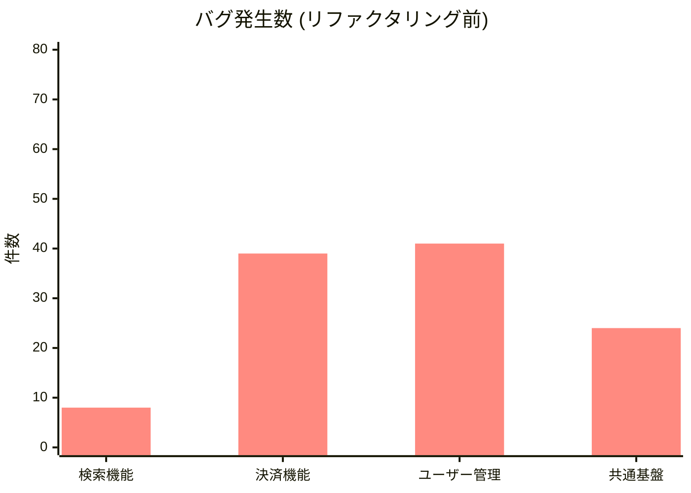
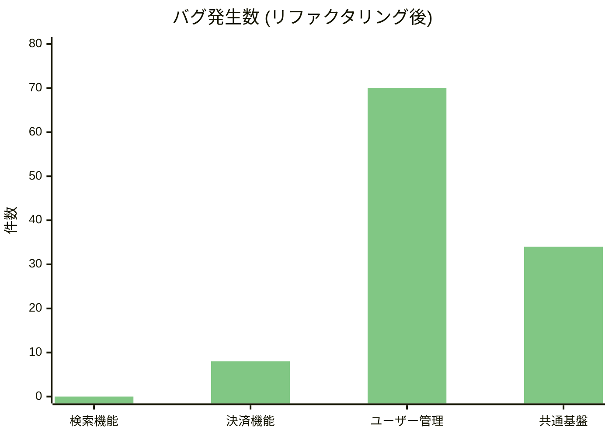

ご提示いただいた「案2：アジャイル開発のタスク・プロジェクト管理」の題材に沿って、ブログ記事全体を書き換えました。

「優先度（高・中・低）」や「スクラム成熟度」といった、開発現場で日常的に使われる言葉に置き換えることで、読者がより自分事として捉えやすい内容になっています。

---

# Mermaid.jsで「それっぽい」レポートグラフを作る実践Tips

## はじめに

Markdownでプロジェクトの進捗報告やチームの振り返り資料をまとめていると、「ここにグラフがあれば一目で伝わるのに」という場面に出くわします。Excelを開いてグラフを作り、画像として貼り付ける——それでもいいのですが、テキストベースのレポートの中に画像ファイルが混ざると、更新のたびに再生成が必要で、差分管理もしづらくなります。

[Mermaid.js](https://mermaid.js.org/)はMarkdown内にテキストでグラフを記述でき、GitHub・GitLab・Notion・Docusaurusなど多くのプラットフォームで標準サポートされています。Jupyter Notebookのような環境構築も不要で、**Markdownが書ける場所ならどこでもプレビューできる**のが最大の強みです。

筆者はアジャイル開発のプロジェクト管理レポート作成でMermaid.jsを多用しており、その過程で「公式ドキュメントには書いていないが、実務で必要になる小技」がいくつも溜まりました。本記事ではそのナレッジを共有します。

## 環境

- Mermaid.js v11+（`radar-beta`、`xychart-beta`が利用可能）
- 表示確認: VS Code（Markdown Preview Mermaid Support拡張）、GitHub

---

## 1. レーダーチャート（radar-beta）

### 基本形

多軸の評価結果を一目で比較したい場合に有効です。例えば、チームの「スクラム成熟度」を複数の観点で評価し、2つのチームの強みを重ねて比較するといった用途です。



````markdown

````

### Tips 1: スコアを百分率に変換する

radar-betaは数値をそのままプロットします。5.0満点の評価スコア（例: 4.2）をそのまま渡すと、0〜5の狭い範囲に全データが集中して差が見えません。

**解決策**: `スコア × 20` で百分率に変換し、`max 100` / `min 0` を指定します。

```
4.2 → 84,  3.7 → 74,  4.8 → 96
```

これにより、軸間のわずかな差が視覚的に明確になります。

### Tips 2: 曲線の色を制御する

デフォルトの配色は見づらいことがあります。`cScale0`/`cScale1`で曲線ごとの色を指定できます。



````markdown
```mermaid
---
config:
  theme: default
  themeVariables:
    cScale0: "#FF5252"
    cScale1: "#4CAF50"
    ...
  radar:
    curveTension: 0
---
radar-beta
    graticule polygon
    ...
```
````

| 設定 | 効果 |
|---|---|
| `cScale0` / `cScale1` | 1番目・2番目の曲線の色 |
| `curveOpacity: 0.25` | 塗りつぶしの透過度。0に近いほど透明 |
| `curveTension: 0` | 曲線の張力。0で直線的（折れ線）に |
| `graticule polygon` | 目盛線を円ではなく多角形に（レーダーらしい見た目） |

### Tips 3: 凡例はラベルに埋め込む

radar-betaには凡例（legend）機能がありません。曲線名に括弧で平均値等を埋め込むのが実用的です。

```
curve d["チームA (平均 4.4)"]{84, 84, 96, 94, 82, 86}
curve c["チームB (平均 4.2)"]{86, 74, 86, 78, 96, 88}
```

---

## 2. 棒グラフ（xychart-beta）

### 基本形



````markdown

````

これだけなら簡単ですが、**優先度別の積上げ棒グラフ**を作ろうとすると壁にぶつかります。

### 最大の制約: 積上げ（stacked）非対応

xychart-betaは**ネイティブの積上げ棒グラフをサポートしていません**。複数の`bar`シリーズを定義すると、並列ではなく**重ね描画**されます。

これを逆手にとって「疑似積上げ」を実現します。

### Tips 4: 累積値で疑似積上げを実現する

エピック別・優先度別の残タスク数が以下の場合を考えます。

| | 検索機能 | 決済機能 | ユーザー管理 |
|---|---|---|---|
| 優先度：高 | 0 | 0 | 2 |
| 優先度：中 | 2 | 4 | 7 |
| 優先度：低 | 4 | 0 | 0 |

素朴にそのまま書くと、3本の棒が重なって意味不明になります。代わりに**累積値**を使います。

```
「低」の棒 = 高 + 中 + 低（= 合計タスク数）
「中」の棒 = 高 + 中
「高」の棒 = 高
```

こうすると、「中」の棒は「低」の棒の「内側」に重なり、「高」の棒はさらにその内側に重なります。結果として**色が層になり、積上げに見える**わけです。

上記の例では:

```
bar "低" [6, 4, 9]  ← 0+2+4, 0+4+0, 2+7+0
bar "中" [2, 4, 9]  ← 0+2,   0+4,   2+7
bar "高" [-1, -1, 2] ← 後述（0の扱いについてはTips 5参照）
```

描画順は**後に書いたシリーズが手前**に来ます。「低」を最初に書き（最も外側）、「高」を最後に書く（最も内側）のがポイントです。

### Tips 5: 中間ゼロは -1 に置換する

累積値が0になるカテゴリがあると、Mermaid.jsの描画で**色の割当がずれる**ことがあります。

```
bar "高" [0, 0, 2]  ← 検索機能と決済機能が0
```

この場合、0の棒が見えないにもかかわらず色のインデックスが消費され、意図した配色にならないことがあります。

**解決策**: 中間の0を`-1`に置換します。

```
bar "高" [-1, -1, 2]
```

`-1`は`y-axis 0 --> 20`の範囲外なのでレンダリングされませんが、シリーズの要素数は維持されるため色割当が正しく機能します。

### Tips 6: 末尾ゼロはトリミングする

末尾が0の場合は、要素自体を省略することで余計なスペースを避けられます。

```
# 「高」が検索機能にだけ1件ある場合
bar "高" [1]           ← 決済, ユーザー管理の0は省略

# 「高」が検索機能と決済機能にある場合
bar "高" [1, 1]        ← ユーザー管理の0は省略
```

**まとめると**:

| ケース | 対応 |
|---|---|
| 中間の0 | `-1`に置換 |
| 末尾の0 | トリミング（要素を省略） |
| 途中シリーズが全0 | **全要素を`-1`にして行を残す** |

### Tips 7: 色の指定は plotColorPalette

棒グラフの色は`plotColorPalette`で指定します。シリーズの定義順（`bar`の記述順）に対応します。

```mermaid
---
config:
  theme: base
  themeVariables:
    xyChart:
      plotColorPalette: "#fff4dd, #ffd8b1, #FF6E40"
---
xychart-beta
    title "エピック別 優先度別残タスク数"
    x-axis ["検索機能", "決済機能", "ユーザー管理"]
    y-axis "タスク数" 0 --> 10
    bar "低" [6, 4, 9]
    bar "中" [2, 4, 9]
    bar "高" [-1, -1, 2]
```



疑似積上げでは「外側ほど薄く、内側ほど濃く」するのが自然です。「高」を最も濃い色にすると、対応すべきタスクが視覚的に目立ちます。

---

## 3. 円グラフ（pie）の注意点

### Tips 8: スライスは値の大きい順に自動ソートされる

Mermaid.jsの`pie`チャートは、定義順に関わらず**値の大きい順にスライスを並べ替えます**。



ここでは`高 → 中 → 低`の順に書いていますが、レンダリングされると**中 → 低 → 高**の順（値の降順）にスライスが並びます。

### Tips 9: 順序を制御したいなら棒グラフを使う

円グラフはスライスの順序を固定できません。「優先度：高」を常に特定の色（赤など）にしたい場合、データの値によって色の割当番号（`pie1`, `pie2`...）が変わってしまうため、メンテナンスが困難になります。

実務で「高→中→低の順で見せたい」場合は、前述の棒グラフ（疑似積上げ含む）を使う方が適切です。

---

## 4. Before/Afterの比較表現

### Tips 10: 同一カテゴリのBefore/Afterは上下2段で表現する

xychart-betaはグループ化（横並べ）ができません。そのため、リファクタリング前（Before）と後（After）のバグ発生数を比較したい場合などは、グラフを2つ並べます。

**OK: 上下2段のグラフに分離し、Y軸を統一する**





ポイントは**Y軸の上限を揃えること**（`0 --> 80`）です。これにより、棒の長さだけで直感的に「改善したかどうか」を比較できるようになります。

---

## おわりに

Mermaid.jsは「テキストで書ける手軽さ」が最大の強みですが、積上げ棒グラフや凡例、スライスの順序制御といった実務で欲しい機能に一部制約があります。

しかし、今回紹介した**疑似積上げ・-1置換・上下2段比較**といったテクニックを使えば、これらの制約を回避して、メンテナンス性の高い「それっぽい」レポートをMarkdown内で完結させることができます。

特にAIツール（Claude等）との相性は抜群です。「このタスクデータをMermaidの疑似積上げ棒グラフにして」と頼めば、累積値の計算からコード生成まで一瞬で終わります。ぜひ、日々の進捗報告や振り返り資料に取り入れてみてください。
