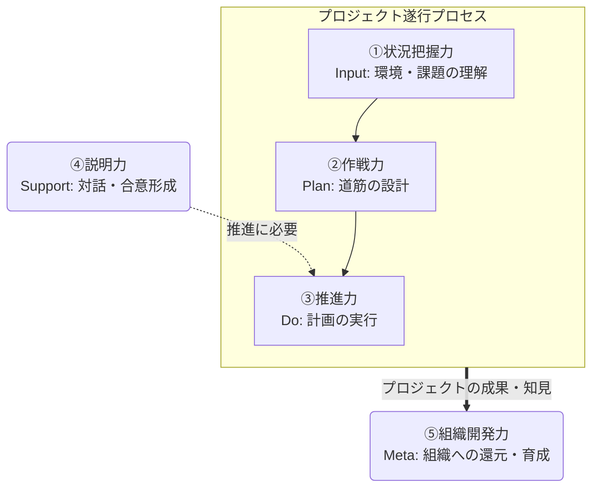

## はじめに

現代のソフトウェアアーキテクトの役割は、技術的に正しく設計するだけにとどまらない。ビジネスと技術、多様な利害関係者を繋ぎ、プロジェクトの成功に向けて主体的・能動的に推進することが求められる。フューチャーにおいてもアーキテクトは、純粋な実装力や最新技術トレンドへの追随といったハードスキルだけでなく、プロジェクト経験などに裏打ちされた豊富な知見に加え、立ち振舞いなどのソフトスキル（コンサルスキル、ビジネススキル）が重視されている。

本ガイドラインは、この**非技術的な領域**に焦点を当て、アーキテクトがプロジェクトを成功に導き、提供価値を最大化するために不可欠なソフトスキルを体系化し定義することを目的とする。

対象者は、アーキテクトを目指すミドルクラスのコンサルタントを想定している。技術特化型のスペシャリストキャリアについてはここでは想定せず、技術力をビジネス視点やソフトスキルを利用してレバレッジを効かせることができる、ジェネラリスト型のアーキテクトに求められるソフトスキルに焦点を当てている。

::: warning 免責事項

- 有志で作成したドキュメントである。フューチャーには多様なプロジェクトが存在し、それぞれの状況に合わせて工夫された開発プロセスや高度な開発支援環境が存在する。本ガイドラインはフューチャーの全ての部署／プロジェクトで適用されているわけではなく、有志が観点を持ち寄って新たに整理したものである
- 本ドキュメントは実験的な位置づけであり、現時点では社内にて教育・採用・評価などで運用されていない
- 相容れない部分があればその領域を書き換えて利用することを想定している。プロジェクト固有の背景や要件への配慮は、ガイドライン利用者が最終的に判断すること。本ガイドラインに必ず従うことは求めておらず、設計案の提示と、それらの評価観点を利用者に提供することを主目的としている
- 掲載内容および利用に際して発生した問題、それに伴う損害については、フューチャー株式会社は一切の責務を負わないものとする。掲載している情報は予告なく変更する場合がある

:::

## ガイドラインの構成

アーキテクトがコンサルタントとしてプロジェクト業務で活躍するために必要なソフトスキルを、以下の5分類でまとめる。

1. 状況把握力
2. 作戦力
3. 推進力
4. 説明力
5. 組織開発力

それぞれの関係性は以下。

なお、思考法（ロジカルシンキング、デザインシンキング、クリティカルシンキング）やメタスキル（キャッチアップ能力、好奇心、成長意欲など）は5つ全てに共通する基盤として位置づけられ、直接スキル定義としての記載はしない。

## 謝辞

このアーキテクチャガイドラインの作成には多くの方々にご協力いただいた。心より感謝申し上げる。

- **作成者**: 真野隼記、永井優斗
- **レビュアー**: 武田大輝、佐藤一馬、澁川喜規、赤坂優太、井上拓、清水利博

---

次のページ: [ソフトスキルガイドライン](./softskill_guidelines.md)
