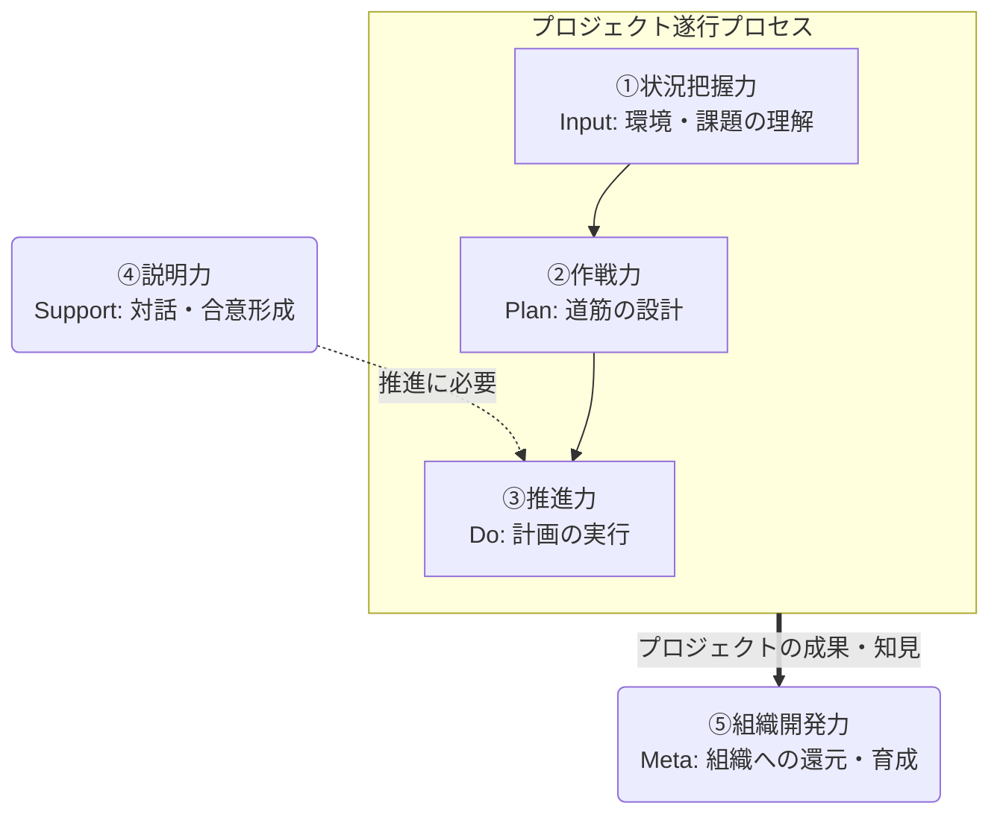

<page-title/>

::: warning 免責事項  
利用について以下の点に注意してください。

- フューチャー株式会社の有志で作成したドキュメントである
- 本ドキュメントは実験的な位置づけであり、現時点では社内にて教育・採用・評価などで運用されていない
- 掲載内容および利用に際して発生した問題、それに伴う損害については、フューチャー株式会社は一切の責務を負わないものとする
- 掲載している情報は予告なく変更する場合がある

:::

# はじめに

現代のソフトウェアアーキテクトの役割は、技術的に正しい設計を行うだけにとどまらない。ビジネスと技術、多様な利害関係者を繋ぎ、プロジェクトの成功に向けて主体的・能動的に推進することが求められる。フューチャーにおいてもアーキテクトは、純粋な実装力や最新技術トレンドへの追随といったハードスキルだけでなく、プロジェクト経験などに裏打ちされた豊富な知見に加え、立ち振舞いなどのソフトスキル（コンサルスキル、ビジネススキル）が重視されている。

本ガイドラインは、この**非技術的な領域**に焦点を当て、アーキテクトがプロジェクトを成功に導き、提供価値を最大化するために不可欠なソフトスキルを体系化し、定義することを目的とする。

対象者は、アーキテクトを目指すミドルクラスのコンサルタントを想定している。技術特化型のスペシャリストキャリアについてはここでは想定せず、技術力をビジネス視点やソフトスキルを利用してレバレッジを効かせることができる、ジェネラリスト型のアーキテクトに求められるソフトスキルに焦点を当てている。

# ソフトスキルとは

本ガイドラインにおいて「ソフトスキル」とは、アーキテクトが技術的な専門性（ハードスキル）を組織やビジネスの文脈で最大限に発揮し、プロジェクトを成功に導くために必要な、対人関係・思考・行動に関わる汎用的な能力と定義する。ハードスキルとソフトスキルは、車輪の両輪となるものである。

# アーキテクトに期待されること

優れたアーキテクチャを設計できたとしても、それを顧客やチームに納得させ、実行に移すことができなければ、ビジネス価値は生まれない。  
本ガイドラインにおいて、（シニアな）アーキテクトは大きく以下のような振る舞いが期待されるとする。

- 営業活動
  - 商談の場で自社の技術力・開発力などの特徴・ケイパビリティ・魅力を伝えること
  - 技術的な課題、悩み事項への助言、相談に応え建設的な議論を行うことができる
- プロジェクトにおける技術的な意思決定を主体的に行える「リーダーシップ」を取ること
  - 難しい課題に対して、道筋を立てることができる
  - 不確実性が高い状況に置いても、仮説ベースであるべき技術方針を検討、提案できる
- プロジェクトリーダー視点で、技術領域を任せられる
  - 例えば、非機能要件定義や主要技術の選定などを、契約事項やスケジュールを意識して自律的に推進できる
  - 非機能要件に対して、どのような要件を重視しトレードオフを鑑みて選定したか、利害関係者に対して説明責任を持つ
  - プロジェクトとして自社への期待値を理解して、何を抑えておくべきか把握している
- 前に出て、合意形成に向けた決定事項を作れる
  - 両者が気になる観点を理解し納得できる着地点を見出す。よっぽどのことがなければ決定事項はひっくり返らない
  - 分かりやすい説明ができることや、論理的かつ伝わりやすい資料化を行える
- チームの開発生産性の最大化
  - 開発の仕組みや運用ルールを考え、技術面での意思決定を行いチームを主導できる
  - 品質や生産性をどのように向上させるか作戦を考え、実行する
  - 開発計画の策定やタスク化を行い、技術面でのリスクマネジメントを取る
  - アーキチームのチーム、タスクのマネジメント
- 育成
  - 若手をナレッジトランスファーし引き継ぎ、自身は別の領域を切り開き貢献する
- 技術ブランディング
  - 技術的な発信はプロジェクトリーダーにはできない。外部発信を行い魅力を伝える

なお、ここではアーキテクトがプロジェクト管理の全てを行うのではなく、プロジェクトリーダー（PL）と協力して推進に当たることを想定している。マネジメントなどは必要に応じてPLからの補助を求めることができるが、技術的な意思決定などのリーダーシップなどはPLでは難しいため、アーキテクトが責任を持って行うべきである。なお、開発チーム（アーキチーム）などのサブユニットのマネジメントは行うこと想定としている。

# ガイドラインの構成

アーキテクトがコンサルタントとしてプロジェクト業務で活躍するために必要なソフトスキルを、以下の5分類でまとめる。

1. 状況把握力
2. 作戦力
3. 推進力
4. 説明力
5. 組織開発力

それぞれの関係性は以下。

なお、思考法（ロジカルシンキング、デザインシンキング、クリティカルシンキング）やメタスキル（キャッチアップ能力、好奇心、成長意欲など）は5つ全てに共通する基盤として位置づけられ、直接スキル定義としての記載はしない。

# スキルレベル

大分類ごとにスキルを定義する。レベルは以下の定義とする。

1. レベル1: 【認識】重要性や基本的な概念を理解している。上位者や他のメンバーの指示・サポートがあれば、その役割の一部を担うことができる状態。アーキテクトとしてまず押さえておくべきレベル
2. レベル2: 【実践】独力で標準的なレベルで遂行できる。状況に応じて適切な手法を選択し、安定した成果を出せる状態。シニアなアーキテクトが到達すべきレベル
3. レベル3: 【指導】卓越した知見を持ち、他者を指導・育成できる。または、組織標準となる新しい手法や仕組みを生み出し、周囲に影響を与えている状態。通常のアーキテクトの枠組みを超えたステージを目指す場合に必要となるレベル

全てレベル2以上を必須とするものではない。得意分野に応じて濃淡がありつつ、苦手領域でもレベル1を維持することでチームとして補完し合える状態を想定する。

また、一部の項目では「-」としているが、これはPLと役割が強く重複することと、アーキテクトに対して過剰な要求レベルに見えてしまい、萎縮してしまうことを配慮してオミットしたことを示している。もちろん、「-」であってもこのレベルに達することができれば強い武器になるため、不要と断じているわけではない。

# ①状況把握力

どれだけ高い技術力を有していても、状況把握が間違っていれば顧客に対してビジネス的な価値を生むことはできない。また、意思決定における制約は技術以外にも、予算・納期・契約範囲があり、顧客の企業文化・組織間の力関係の理解や配慮無しでは、期待した成果を出すことが困難となる場合がある。

## 業務知識

アーキテクチャはビジネス目標の「射影」であるべきであり、あるべき機能要求/非機能要求を正しく定義するためには顧客と同じ目線・課題意識を持つ必要がある。それによって、技術的な正しさだけではなく、ビジネス的にも妥当であるかを確認する。

| 項目       | レベル1 (認識)                                                     | レベル2 (実践)                                                                                                                       | レベル3 (指導)                                                                       |
| :--------- | :----------------------------------------------------------------- | :----------------------------------------------------------------------------------------------------------------------------------- | :----------------------------------------------------------------------------------- |
| 業界知識   | プロジェクトが関わる業界構造や概念的なビジネスモデルを理解している | 業界トレンドや主要な課題を把握して、他業界と比較して解釈、比較して語ることができる                                                   | \-                                                                                   |
| 事業理解力 | 業界の一般的なビジネスモデルを説明できる                           | 担当プロジェクトに関わる顧客固有のビジネスモデルや、主な収益源、バリューチェーンの概要を説明できる                                   | \-                                                                                   |
| 業務理解力 | 概念レベルの主要な業務フローを理解している                         | 高難易度な機能やプロジェクトの根幹となる機能について、その背景となる業務フローのアクターの業務や意思決定の内容について理解できている | プロジェクトに関連する業務フローの全体像を把握し、何がどこに影響するか理解できている |

## 顧客理解

プロジェクトの成功のためには、体制図に必ずしも現れない組織力学や人間関係、さらには背景となる経営目標や顧客固有の企業文化・価値観にも気を配る必要がある。顧客のプロトコルに合わせた進め方・言葉の表現を取ることで、認識齟齬を減らし、より本質的な議論に集中しやすくなる。これらを組み合わせることでリスクを軽減させる。

| 項目           | レベル1 (認識)                                                                                                                           | レベル2 (実践)                                                                                     | レベル3 (指導)                                                                                                             |
| :------------- | :--------------------------------------------------------------------------------------------------------------------------------------- | :------------------------------------------------------------------------------------------------- | :------------------------------------------------------------------------------------------------------------------------- |
| 経営目標の理解 | 中期経営計画や経営陣の外部発信を確認し、どのようなロードマップを計画しているか把握する                                                   | \-                                                                                                 | \-                                                                                                                         |
| 企業文化の理解 | 顧客の公式情報（企業理念、IR情報など）や、会議での様子から、基本的な価値観や仕事の進め方（例：スピード重視か、合意形成重視か）を認識する | 顧客の価値観や仕事の進め方に合ったやり方を、自分なりに模索し適切な温度感で接することができる       | \-                                                                                                                         |
| 組織力学の理解 | プロジェクトの公式な意思決定プロセスを理解している。                                                                                     | プロジェクトの非公式なキーマンを特定し、ハレーションを起こさないよう相談・作戦を考えることができる | 自身の提案を通すために、どの担当者にいつ何を伝えるべきか、必要な段取りや根回しを戦略的に行え、チームメンバーに指示ができる |

## 関係理解

プロジェクトは自社と顧客との契約に基づいている。その契約上の範囲・制約から外れた支援は、本来やるべきことを不明確にするためリスクであるし、同時に関係性を歪としてしまう懸念がある。やった方が良いことであっても、現場レベルで対処してしまうと双方のリーダー層に情報が上がらなくなり、長期的な判断を見誤る可能性がある。困ったときには手を差し伸べるべきだが、本来やるべきことをちゃんと行った上で、価値を提示しつつ行うべきである。ただし、現場視点からの改善提案は歓迎すべきものであり、付加価値を提供できる場合はドンドン発信すべきである。

| 項目       | レベル1 (認識)                                                                                 | レベル2 (実践)                                                                                             | レベル3 (指導) |
| :--------- | :--------------------------------------------------------------------------------------------- | :--------------------------------------------------------------------------------------------------------- | :------------- |
| 案件の理解 | 案件が始まった背景、経緯、課題と訴求ポイント、全体計画からの位置づけを理解している             | \-                                                                                                         | \-             |
| 契約の理解 | プロジェクトの契約スコープを理解し、自身の作業がスコープ内外のどちらに該当するかを判断できる。 | 契約上、必要な成果物や状況が何であるか理解し、次フェーズに向けて計画的にアクションを取ることができる       | \-             |
| 提案       | 契約スコープを理解し、スコープ外の作業が発生した場合は適切に対応（追加契約の提案等）できる。   | 関連する領域への価値提供ができそうれあれば、プロジェクトの新規獲得に向けて、案件の種まきを行うことができる | \-             |

# ②作戦力

プロジェクトを成功に導くためには道筋を自ら描く必要がある。特に不確実な状況下においては探索的に課題・リスク・制約を見出し、実現性が上がるように計画と体制を作り出すことで、場当たり的な対応を無くし安定しつつ持続可能性が高いプロジェクト運営を実現する。

## 構想力

だれも正解を持っておらず、ゴールすら不明瞭な状態でもプロジェクトが始まる場合がある。この時、あるべき姿を仮説ベースで言語化し、そのために解くべき課題が何か、どのように対応すべきかを提示し、プロジェクトを具体化して実現に導く必要がある。課題が不明瞭な場合は現時点の想定で進めた時に、未来にどのような問題が発生しそうか想像を膨らまし仮説ベースで発見、定義する。課題が明確であればその対策を仮説ベースで案を出し、プロジェクトのクリティカルポイントにあるか、後で対応すれば良いか線引する。アーキテクトは主に技術的観点でこれらを行う必要がある。

| 項目       | レベル1 (認識)                                                                                                   | レベル2 (実践) | レベル3 (指導) |
| :--------- | :--------------------------------------------------------------------------------------------------------------- | :------------- | :------------- |
| ゴール設定 | プロジェクト（タスク）の成功と言える具体的な目標を設定し、チーム内外の認識を揃え、実効可能性を高めることができる | \-             | \-             |
| 課題抽出   | プロジェクト推進上で問題になり得る課題を、想像力を膨らまして探索的に見つけることができる                         | \-             | \-             |

## 計画力

プロジェクトのゴールに向けてリソース、期限、各種の制約条件をもとにして実行可能な計画に落とし込むことで、致命的な考慮漏れや手戻りが発生するリスクを軽減することができる。プロジェクト全体の計画はPLの手助けを得ることもできるが、アーキテクトも技術的観点で計画の素案作成、レビュー、調整を行う必要がある。

| 項目               | レベル1 (認識)                                                                                                                            | レベル2 (実践)                                                                                       | レベル3 (指導) |
| :----------------- | :---------------------------------------------------------------------------------------------------------------------------------------- | :--------------------------------------------------------------------------------------------------- | :------------- |
| 計画作成力         | プロジェクト全体のスケジュールやマイルストーンを立て、勝ち筋を作ることができる仕事の順序やリソース配分を考えることができる                | \-                                                                                                   | \-             |
| リスクマネジメント | 主に技術的な課題に対してチームを巻き込み、早期に対応案を練ることができる                                                                  | \-                                                                                                   | \-             |
| 体制構築           | チームのケイパビリティを見て、求められている期待値が達成できなさそうであれば、エスカレーションを上げて、by-nameで候補者を出すことができる | プロジェクトの目標達成のために最適なチーム構成と各役割の責任を定義し、キーマンのアサインを主導できる | \-             |

# ③推進力

アーキテクトには評論家などの立場に留まらず、描いた戦略を絵に描いた餅にせず、最後までやり抜いて着地させる実行力が求められる。困難な局面でも当事者意識を持って広い視点から決断を下すことと、チーム全体の進捗やリスクを管理するマネジメントの双方が必要となる。

## リーダーシップ

アーキテクトは、やりたいことや仕様が明確に決まっていなかったとしても、ではその状況がどうすれば前進するかを考え、チームを導く立場である。不確実な状況下でも自ら先頭に立ち、何をすべきか意思決定する。また、影響力が大きな決断をするため、提言だけではなく当事者意識を持って具体的に最後までやりぬくことが求められる。

| 項目           | レベル1 (認識)                                                                                               | レベル2 (実践)                                                                                                                                                                                                               | レベル3 (指導)                                                                                                                           |
| :------------- | :----------------------------------------------------------------------------------------------------------- | :--------------------------------------------------------------------------------------------------------------------------------------------------------------------------------------------------------------------------- | :--------------------------------------------------------------------------------------------------------------------------------------- |
| 不確実性耐性   | 仕様や前提が不明確な場合、確認・具体化するよう自ら働きかけることができる。                                   | 計画通りに進まない状況でも冷静さを失わず、代替案を提示してチームをリードできる。不明瞭な状況を少しずつ具現化するため、自ら推進することができる                                                                               | \-                                                                                                                                       |
| オーナーシップ | 技術選定や処理方針などの設計、判断で発生した課題に対し、他責にせず、自らの責任として対応に当たることができる | 将来発生しうる課題を予測し、中途半端な技術的負債を残さないよう、最後まで当事者意識を持ってアーキテクチャ全体の意思決定と実装を主導できる。採用技術について、将来負債になったとしても、その時点のベストを尽くしたと説明できる | \-                                                                                                                                       |
| ディレクション | プロジェクトの大義とチームの果たすべき役割を、チームメンバーに浸透するように務める。                         | チームがプロジェクトの趣旨と外れた方向性に進みそうになるなどの岐路に立った時に、流されるのではなく、本来の大義やミッションに立ち返りつつ、現実的かつ達成可能な目標を再設定する。                                             | \-                                                                                                                                       |
| 意思決定       | 上位者やチームの技術的決定の背景や理由の合理性を自分なりの言葉で解釈し、自分なりの改善点を提示できる         | 担当範囲において、複数の選択肢を比較検討し、根拠を持って業務方針・技術方針の意思決定を行うことができる。                                                                                                                     | \-                                                                                                                                       |
| 動機づけ       | プロジェクトの大義を理解し、チームの目標達成に対し、前向きな姿勢で貢献する。                                 | プロジェクトメンバーに、プロジェクトの経営的・業務的・技術的な大義や意義を魅力的に語ることができる。                                                                                                                         |                                                                                                                                          |
| 巻き込み力     | プロジェクト外の有識者に対して、質問や相談を行うことができる                                                 | 社内外の有識者を巻き込み、自身やチームの不足した部分について、支援を相談する場を作ることができる                                                                                                                             | 自身が関連する複数のプロジェクトで、有識者のヘルプを調整したり、所属するプロジェクトメンバーを社内最適の視点でフォローに回すことができる |

## プロジェクトマネジメント

アーキテクトは、プロジェクトの枠組みの中で動くことから各アーキタスクの作業見積もりやWBS（週単位など概念レベルを想定）の作成や、メンバーへの作業指示などを受け持つことになる。

| 項目         | レベル1 (認識)                                                                                                                                                 | レベル2 (実践)                                                                                                                                                     | レベル3 (指導)                                                                                                                                                                                                                                                                                                                                                 |
| :----------- | :------------------------------------------------------------------------------------------------------------------------------------------------------------- | :----------------------------------------------------------------------------------------------------------------------------------------------------------------- | :------------------------------------------------------------------------------------------------------------------------------------------------------------------------------------------------------------------------------------------------------------------------------------------------------------------------------------------------------------- |
| WBS策定      | 個別のアーキタスクの見積もりを自分なりの根拠を持って提示することができる                                                                                       | アーキ領域のタスクをWBSに分解し、チームが見積もり可能な粒度で提示できる。                                                                                          | プロジェクト全体視点で依存関係やクリティカルパスを考慮、アーキ視点で全体計画にフィードバックや改善提案ができる。                                                                                                                                                                                                                                               |
| 進め方の合意 | 上位者やチームが決定したプロジェクトの進め方（フェーズ分け、マイルストーンなど）の意図を理解し、自身のタスクがその中でどのような位置づけにあるかを説明できる。 | 目標達成までのマイルストーン、検証ポイント、進め方の選択肢（例：先行開発の設置など）を複数立案し、関係者と議論の上で最適な進め方を合意形成できる。                 | どの部分まで「進め方」を合意とるか自分なりの最適パターンを持っており、案件特性ごとに使い分けることができる。                                                                                                                                                                                                                                                   |
| タスク依頼   | 依頼されたタスクの目的や背景をメンバーに腹落ちさせた上で、期限設定を合意して作業指示ができる。                                                                 | メンバーのスキルや負荷状況を考慮し、タスクの目的を伝えた上で、適切な粒度や難易度にタスクを分解して依頼できる。                                                     | メンバーの成長（ストレッチ）を考慮したタスクアサインを行い、適切な委任とフォローアップを通じてチーム全体の遂行能力を高めることができる。                                                                                                                                                                                                                       |
| 予実管理     | メンバーのタスク進捗が進捗が予定通りに進んでいないことを検知し、対応策を提示し問題発生を事前に押さえ、リスクを軽減させる。                                     | 遅延したタスクがあれば継続/後回し/巻き取りなどの計画組み換えを行うことができる。また、チームのタスク状況を把握・分析し、ボトルネックがあれば特定して解消に動ける。 | チームメンバーの、潜在的なリスクを自律的に洗い出し、事前に簡単な対策（例：代替案の準備）を講じた上でタスクアサインする。特に、若手メンバーへのタスクアサイン時には、その達成を支援するための具体的なチェックポイントやバックアッププランを計画に織り込んでおく。また、プロジェクト全体のタスク進捗を管理し、計画との乖離があれば、リカバリープランを提示する。 |

## チームマネジメント

アーキテクトは、開発チームや場合によってはアーキチームのリーダーポジションになるため、プロジェクトのサブリーダー的なチームマネジメント力が求められる。

| 項目       | レベル1 (認識)                                                                 | レベル2 (実践)                                                                                 | レベル3 (指導)                                                                                                   |
| :--------- | :----------------------------------------------------------------------------- | :--------------------------------------------------------------------------------------------- | :--------------------------------------------------------------------------------------------------------------- |
| 役割分担   | 小規模なタスクにおいて、メンバーのスキルを考慮した役割分担を提案できる。       | チーム全体の目標達成のため、メンバーのスキルや志向を考慮した最適な役割分担を決定する           | 成長期待も踏まえ成果の最大化する枠組みに適時組み換え、調整する                                                   |
| チーム運営 | チームのルールやプロセスを理解し、遵守させる。                                 | チーム内の非効率な点やコミュニケーションの問題に気づき、改善案を提案できる。                   | チームの生産性と心理的安全性を両立させるための仕組み（定例、情報共有ルール等）を設計し、定着させることができる。 |
| 調整力     | チームメンバー同士のタスク遂行を円滑にするため、タスク調整を行うことができる。 | 自身のチームと顧客・他チーム間の連携において、窓口として円滑なコミュニケーションを維持できる。 | 顧客の他部署と発生した利害対立の根本原因を分析し、中立的かつ建設的にファシリテートし着地点を見出すことができる。 |

# ④説明力

アーキテクトは、技術だけやっていれば良いのではなく、チーム内外の利害関係者と円滑に連携し、納得感のある合意形成を図ることが必要である。合計性のためには相手の聞きたいことを捉え、相手の立場や知識レベルに合わせて分かるように論理的に組み立て要点を伝える必要がある。

## 価値訴求

アーキテクトは前に出て、技術的な提案がビジネスにどのような影響、制約、効果を与えるかを言語化し、利害関係者の納得と合意を獲得する必要がある。合意した内容はよほどの理由がない限りは覆らず、それを前提にして次の議題に移ることができる。積み重ねた決定事項の質と量が、アーキテクトのプロジェクトにとっての価値といっても過言ではない。

| 項目               | レベル1 (認識)                                                                                                                                     | レベル2 (実践)                                                                                                                                                             | レベル3 (指導)                                                                                                                                                                            |
| :----------------- | :------------------------------------------------------------------------------------------------------------------------------------------------- | :------------------------------------------------------------------------------------------------------------------------------------------------------------------------- | :---------------------------------------------------------------------------------------------------------------------------------------------------------------------------------------- |
| 魅力づけ           | 会議の目的を理解し、自身なりの意見や見解を述べることができる。                                                                                     | 「なぜこのアーキテクチャなのか、進め方なのか」を一貫した物語として構成し、聞き手の共感と納得と支持を得ることができる。                                                     | \-                                                                                                                                                                                        |
| 論点設定           | 将来的な課題となりえる論点を、懸念点としてチームに共有し対応方針を相談できる。                                                                     | 次に何を検討・決定すべきかを自ら見つけ、関係者に問題提起し、議論のテーマとして設定し、関係者を巻き込み解決へ導くことができる                                               | \-                                                                                                                                                                                        |
| 仮説立案           | 原因分析やFit & Gapなどから、解決に向けた複数の仮説を作ることができる。提示された選択肢のメリット・デメリットを理解できる。                        | 仮説の精度を高めるために、必要な前提条件の作成や、事実の収集、有識者のヒアリングや壁打ちなどを行い、複数の解決策を立案できる                                               | \-                                                                                                                                                                                        |
| 比較整理           | 提示された複数の選択肢について、それぞれのメリット・デメリットを説明できる。                                                                       | 意思決定者（顧客など）の判断軸を想定し、複数の選択肢を多角的に比較・評価する資料を作成し、推奨案を論理的に説明できる。                                                     | \-                                                                                                                                                                                        |
| 合意形成           | 担当者レベルで、意思決定に必要な情報を揃えて、アーキテクチャ方針や作業の方向性などについて合意を得ることができる。                                 | いつ、だれに、どのようなタイミングで合意形成を得ておくべきか、主体的に考えて行動できる。また、難しい局面でも関係者の懸念を事前に把握し、論点を整理した上で議論に設計できる | 大きな方向性で合意形成をなすことで、その枠内であれば信頼関係の上で進めることができるといった、大きな枠組みを形成できる。「xxxさんが言うなら～」という論理を超越した信頼関係を構築できる。 |
| 期待値コントロール | 自身・チームの作業の進捗状況や課題について、正しく報告した上で、実現可能なことと困難なことを明確に伝え、関係者と期待値をすり合わせることができる。 | \-                                                                                                                                                                         | \-                                                                                                                                                                                        |

## コミュニケーション

アーキテクトは普段、専門性が高い用語を扱うが、それを相手の前提知識や立場に合わせて表現を変える認識齟齬無く的確に伝えることが求められる。逆に相手の要求要望を正しく捉え、それを技術的要求に変換することが必要である。それを行うためには様々なコミュニケーション上の工夫を凝らす必要がある。

| 項目               | レベル1 (認識)                                                                                                                                                   | レベル2 (実践)                                                                                                                                                                 | レベル3 (指導)                                                                                                                           |
| :----------------- | :--------------------------------------------------------------------------------------------------------------------------------------------------------------- | :----------------------------------------------------------------------------------------------------------------------------------------------------------------------------- | :--------------------------------------------------------------------------------------------------------------------------------------- |
| 簡潔さ             | 定例などの報告の場で、PREPなどを意識して結論から先に話し、要点をまとめて伝えることができる。事実と推測の分離など、目的に沿った基本的な自分なりに型を作れている。 | 相手の興味関心や、聞き手の知識レベルに合わせて要点を絞り、構造的かつ簡潔かつ分かりやすく説明できる。                                                                           | あえて、突っかかるようなフックポイントをもうけ、相手の反応を予測して必要な回答を予め準備、共感・意思決定を高速化する。                   |
| 表現力             | 顧客目線（非IT技術者）に応じて内容、表現、粒度を明確に使い分けようと意識する                                                                                     | 適切なデフォルメや比喩、または抽象度を高めた表現を用いて、論点上の本質をうまく説明できる                                                                                       | \-                                                                                                                                       |
| ドキュメント力     | 背景や決定経緯を含んだ、論理的で迷わせない、構造化されたドキュメントを作成できる                                                                                 | 最も伝えたいメッセージを伝えるため視覚的にも美しいスライドを作ることができる                                                                                                   | \-                                                                                                                                       |
| 傾聴力             | 相手の話を遮らずに最後まで聞き、不明点を質問できる。議事録から主要な論点を把握できる。真意を推測できる。                                                         | 発言の背景にある意図や懸念事項を汲み取り、言語化して確認できる。顧客の非言語的なサイン（表情や声のトーン）からも情報を読み取れる。                                             | \-                                                                                                                                       |
| 対話力             | 相手の話を最後まで聞きつつ、発言の意図を汲み取り、適切な質問を通じて対話を深めることができる。                                                                   | 発言の真意や、より本質的な課題定義などを元に、より深い議論に導くことができる。                                                                                                 | 超抽象的な議論や、意見が対立する厳しい場面でも、相手への敬意を保ちながら建設的な対話をリードし、相互理解を促進できる。                   |
| 質問力             | 不明点や曖昧な点を解消するために、具体的な事実を確認する質問（5W1H）ができる。認識齟齬の発生リスクを最小化した伝え方ができる。質問の意図を明確にできる。         | 相手の発言の背景にある意図や前提を引き出すための、深掘りする質問ができる。オープンクエスチョンとクローズドクエスチョンを意図的に使い分ける。                                   | 相手自身も気づいていない潜在的な課題やニーズを引き出すような、本質を問う質問（仮説質問、視点を変える質問など）を投げかけることができる。 |
| ファシリテーション | 会議のアジェンダ事前共有や、ゴールを明確にするなど事前準備を怠らず、円滑な会議進行を行える                                                                       | 目的が曖昧な会議や、関係者が多い会議でも目的・論点・ゴールを整理し、参加者の意見を引き出しながら発散と収束を適切にコントロールしながら、参加者全員が納得する結論を導き出せる。 | \-                                                                                                                                       |

# ⑤組織開発力

プロジェクト単体の成功を超えて、組織全体の持続可能な成長に貢献することでアーキテクトとして1段上のステージに進むことができる。自身の知見をアセット化して展開することや、後進メンバーの育成、対外的な技術ブランディングなどを通じて、組織のケイパビリティを引き上げる。

アーキテクトは膨大な知識体系を必要とする高い専門性がある職種であり、ビジネスをスケールさせるために必要とされるが、その確保がボトルネックになりやすい。アーキテクトとして成長するためには（決定したアーキテクチャの良し悪しが見えてくるのにはフェーズが進んだ後や、時の試練が必要となるため）長い時間が必要である。そのため、現場第一主義に固執し、ナレッジのドキュメント化を怠ると組織のスケール拡大に人材確保が間に合わない。座学だけでは完全に理解することは難しいため、実践で学ぶことは必須であることはいつの時代でも変わらない。しかし、それはそうとしても実践から作られた現場目線の学習コンテンツや設計アセットを残し、知の高速道路を用意することもまた、現代のアーキテクトには必須である。それにより、実践での学習効率・成長曲線を上げ、組織全体の能力を向上させ、また自身はもっと新しい領域で活躍することが期待される。

## タレントマネジメント

アーキテクトは専門性が高く、組織全体の技術力を担保するために、適切な人材を獲得し、正しく評価し、育成するサイクルを回す責任がある。プロジェクト管理としての要員管理ではなく、メンバーの中長期的な個人のキャリアと組織の成長をリンクさせることで、競争力の強化に貢献が求められる。

| 項目 | レベル1 (認識)                                                                                                                                         | レベル2 (実践)                                                                                                           | レベル3 (指導)                                                                   |
| :--- | :----------------------------------------------------------------------------------------------------------------------------------------------------- | :----------------------------------------------------------------------------------------------------------------------- | :------------------------------------------------------------------------------- |
| 採用 | 書類選考・採用面接を積極的に引き受ける。                                                                                                               | 採用面接官として、候補者のスキルやカルチャーフィットを適切に見極めるための、判断基準を自分なりの視点で言語化、体系化する。 | チームや部署の採用計画を主導し、求める人物像の策定や母集団形成のための施策を打つ |
| 育成 | 技術的な質問に丁寧に回答する。コードレビューなどで具体的なフィードバックを行い成長を支援できる。定期的な1on1でメンバーの課題や不満を引き出し改善に導く | メンバーのスキルやキャリア志向を理解し、適切な裁量とストレッチなタスクを渡すことができる                                 | \-                                                                               |
| 評価 | メンバーの成果を客観的に観察し、本人の納得感のあるフィードバックを実施できる                                                                           | 自身に専門性が無い領域においてもメンバーと目標設定とその達成率から納得感がある評価を実施できる                           | \-                                                                               |

## ナレッジマネジメント

アーキテクチャ設計領域のタスクは、プロジェクト視点ではオンリーワンであることが多く属人化しやすい課題がある。しかしこの属人的な知見を組織の資産として形式知化し、循環させることで、組織全体の技術力の底上げに繋がるため、意識的に取り組むことが重要である。口では言うのは容易であるが、プロジェクト機密情報が含まれない形で汎化・一般化させつつ、再利用性が高いドキュメントに落とし込む能力が求められる。
アーキテクトはこういった、SECIモデルなどのフレームワークにも熟知し実践する必要がある。

| 項目                   | レベル1 (認識)                                                                                               | レベル2 (実践)                                                                                                                                                    | レベル3 (指導)                                                                                                     |
| :--------------------- | :----------------------------------------------------------------------------------------------------------- | :---------------------------------------------------------------------------------------------------------------------------------------------------------------- | :----------------------------------------------------------------------------------------------------------------- |
| アセット化             | プロジェクト内で再利用可能なコードや設計パターンを抽出し、他の人が理解できるような形でチーム内外に展開できる | チームやプロジェクトの成果物を再利用性を高めるように汎化、標準化し、PJ外で再利用可能なアセットとして昇華させ、その活用を推進できる                                | 作成したアセットをセールスメニューとして組み込んだり、AI自動化への展開、全社教育など二次利用まで踏み込んで活用する |
| ナレッジトランスファー | チーム内での悩みや課題に対し、適切なアセットのリンクを即座に提供できる。                                     | チーム内で任意のメンバー同士が、アセット情報を提供/受領できる環境を作る。また、アセットそのものの改善サイクルが回るように、要望や修正依頼を出すような文化を作る。 | アセット作成のタスクフォースを立ち上げ、PJの枠組みを超えてアセットを作成できる。                                   |

## 組織文化力の向上

アーキテクトは技術的リーダーでもあるため、心理的安全性を高め、メンバーが自律的に挑戦し、相互に学び合う健全な組織風土を醸成することに主導的な立場で関与できる、ほぼ唯一の存在である。率先してオープンマインドした発言や振る舞い、自己研鑽する姿勢を見せることで健全な組織文化を育む。心理的安全性は単に仲良くするという意味ではなく、建設的な内容であれば耳の痛いネガティブフィードバックを伝えても関係性が壊れない、議論と人格を分けられる状態を作るということも含む。

| 項目         | レベル1 (認識)                                                                   | レベル2 (実践)                                                                                                                                                                                                                     | レベル3 (指導)                                                                                     |
| :----------- | :------------------------------------------------------------------------------- | :--------------------------------------------------------------------------------------------------------------------------------------------------------------------------------------------------------------------------------- | :------------------------------------------------------------------------------------------------- |
| 心理的安全性 | チームメンバーに対し、敬意を持って接し、オープンなコミュニケーションを心がける。 | 適度に、自身の失敗や弱みを率先して開示し、他者が発言しやすい雰囲気を作る。ネガティブな報告であっても、まず報告した事自体を礼賛するなど、バランスに留意する。多少の雑談などを許容し、そこで出された潜在的なリスクを潰し込んでいく。 | チーム内で意見の対立や失敗が起きても、それを学びの機会としてポジティブに捉える文化を醸成する。     |
| 自己研鑽支援 | 自身の学びや知見をチームに共有し、相互に学び合う雰囲気作りに貢献する。           | メンバーの自己研鑽を促進するため、適切なトレーニング/カンファレンス/技術ブログ執筆への参加を促すことができる。                                                                                                                     | チーム全体のスキル向上のための勉強会やトレーニングを企画・実行し、学習する文化を自身でリードする。 |

## ブランディング

組織の技術力や先進的な取り組みを社内外に戦略的に発信し、市場における認知度と求心力を高めることは、アーキテクトが主導すべき役割の1つである。

| 項目     | レベル1 (認識)                                         | レベル2 (実践)                                                               | レベル3 (指導)                                                                                   |
| :------- | :----------------------------------------------------- | :--------------------------------------------------------------------------- | :----------------------------------------------------------------------------------------------- |
| 外部登壇 | 自身の学びや知見をチーム内や社内ブログなどで発信する。 | 社外の勉強会やイベントで登壇し、自社の技術や取り組みについて発信する。       | 登壇や執筆活動を継続し、社外に専門家として認知される。後進の登壇・執筆を支援し、機会を提供する。 |
| 発信文化 | メンバーに技術ブログ寄稿などを進める。                 | PJ業務から外部発信化可能なテーマやコンテンツを抽出し、依頼することができる。 | 執筆や登壇など、メンバーへ外部露出の登壇機会を創出することができる。                             |

# 謝辞

このアーキテクチャガイドラインの作成には多くの方々にご協力いただいた。

- 作成者: 真野隼記
- レビュアー: 武田大輝、佐藤一馬、澁川喜規、赤坂優太、井上拓、清水利博

皆様のご尽力なしには、本ガイドラインは完成しなかった。深く感謝する。
