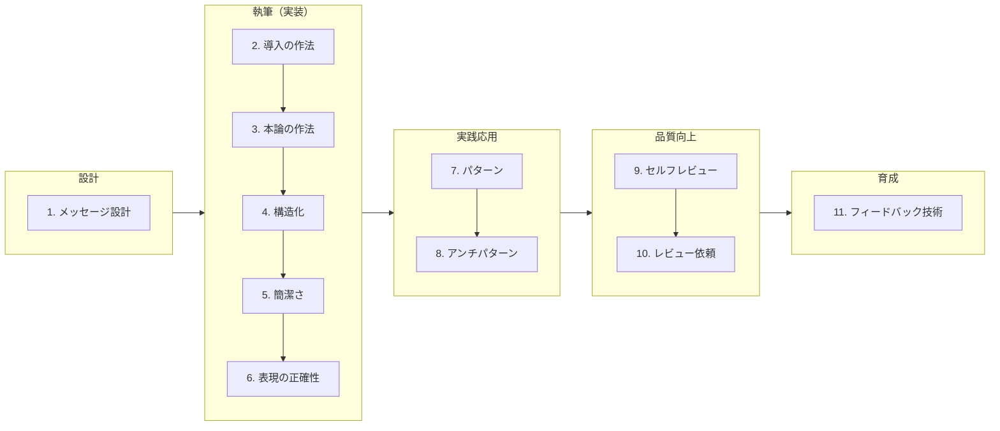

## はじめに

テックリードやアーキテクトにとって、どれだけ優れた設計案を描けても、関係者に伝わり実行されなければ価値を生まない。そのため、純粋なIT技術力と並んで「説明力」が重要である。

報告や提案などの実務において、第一報の多くはドキュメントやチャットを通じた文章（ライティング）である。構造化された簡潔な文章は、受け手の時間を奪わず正確な情報を伝達し、非同期での合意形成を促進する。

本ガイドラインが扱うのは、情緒的な散文や単なる文章の作法ではない。専門概念を構造化し、判断に足る情報を示し意思決定を推進するための技術である。

**本ガイドラインで扱う文書の前提** 
次のように多岐を想定している。その文章のコンテキストごとに求められる期待や文量が異なるが、なるべく一般的に適用できる事項から紹介している。

- **日常的なコミュニケーション**: チャットメッセージ、コミットメッセージ
- **プロジェクトの推進・合意形成**: 提案書、報告書、設計書
- **不特定多数への技術発信**: 技術ブログ、雑誌の記事、書籍

::: info 参考  
[ソフトスキルガイドライン](https://future-architect.github.io/arch-guidelines/documents/forSoftSkill/softskill_guidelines.html)でも、4つ目のスキル分類を「説明力」とした。  
:::

::: warning 免責事項

- 有志で作成したドキュメントである。フューチャーには多様なプロジェクトが存在し、それぞれの状況に合わせて工夫された開発プロセスや高度な開発支援環境が存在する。本ガイドラインはフューチャーの全ての部署 / プロジェクトで適用されているわけではなく、有志が観点を持ち寄って新たに整理したものである
- 相容れない部分があればその領域を書き換えて利用することを想定している。プロジェクト固有の背景や要件への配慮は、ガイドライン利用者が最終的に判断すること。本ガイドラインに必ず従うことは求めておらず、設計案の提示と、それらの評価観点を利用者に提供することを主目的としている
- 掲載内容および利用に際して発生した問題、それに伴う損害については、フューチャー株式会社は一切の責務を負わないものとする。掲載している情報は予告なく変更する場合がある

:::

## 本書の構造

本ガイドラインは、ソフトウェア開発のライフサイクルになぞらえた構造となっている。実際の目次はフラットな章立てだが、概念的には以下の5つのフェーズを辿るように構成されている。

1. **設計**
   - 書き出す前に読み手との期待値を合わせ、伝えるべきメッセージと文脈を定義する
2. **執筆（実装）**
   - **導入の作法**: 情報の非対称性を埋め、読み手がスムーズに本論へ入れるよう前提を整える
   - **本論の作法**: PREPやSTARなどの型を用い、結論や状況から述べて意思決定や理解を促す
   - **構造化:** 複雑な情報を直感的に伝えるため、箇条書きや表の使い分け、論理的な構造に応じた図解パターンを活用する
   - **簡潔さ:** 相手の時間を奪わず正確に伝達するため、一文一義の徹底や冗長な表現の削減など、情報密度を最大化させる
   - **表現の正確性:** 読み手の認知負荷を下げ、誤解を防ぐための正しい用語選択や、認識を揃えるための具体例の適切な使い方を扱う
3. **実践応用**
   - 実務ですぐに使える型（パターン）や、アンチパターンを紹介する
4. **品質向上**
   - セルフレビューやレビュー依頼の方法を押さえる
5. **育成**
   - 他者の文章をレビューし、チーム全体の書く力を育てるためのフィードバック技術を学ぶ

## 参考文献

- 照屋・岡田（2001）『ロジカル・シンキング』東洋経済新報社
- 木下是雄（1981）『理科系の作文技術』中央公論新社

## 謝辞

このアーキテクチャガイドラインの作成には多くの方々にご協力いただいた。心より感謝申し上げる。

- **作成者**: 真野隼記、Tiffany Chan、高瀬陸、内堀航輝、宮崎将太、小橋昌明、亀井隆徳、戸井田拓斗、武田大輝、清水雄一郎、赤坂優太、澁川喜規、長谷川寛人
- **レビュアー**: 辻大志郎

## Articles

- 2026.08.19 [テクニカルライティングガイドラインを公開しました](https://future-architect.github.io/articles/20260819a/)

次のページ: [テクニカルライティングガイドライン](./technical_writing_guidelines.md)

