<page-title/>

::: warning 免責事項

- 有志で作成したドキュメントである。フューチャーには多様なプロジェクトが存在し、それぞれの状況に合わせて工夫された開発プロセスや高度な開発支援環境が存在する。本ガイドラインはフューチャーの全ての部署／プロジェクトで適用されているわけではなく、有志が観点を持ち寄って新たに整理したものである
- 相容れない部分があればその領域を書き換えて利用することを想定している。プロジェクト固有の背景や要件への配慮は、ガイドライン利用者が最終的に判断すること。本ガイドラインに必ず従うことは求めておらず、設計案の提示と、それらの評価観点を利用者に提供することを主目的としている
- 掲載内容および利用に際して発生した問題、それに伴う損害については、フューチャー株式会社は一切の責務を負わないものとする。掲載している情報は予告なく変更する場合がある

:::

# はじめに

テックリードやアーキテクトにとって、どれだけ優れた設計案を描けても、関係者に伝わり実行されなければ価値を生まない。そのため、純粋なIT技術力と並んで「説明力」が重要である。

報告や提案などの実務において、第一報の多くはドキュメントやチャットを通じた文章（ライティング）である。構造化された簡潔な文章は、受け手の時間を奪わず正確な情報を伝達し、非同期での合意形成を促進する。

本ガイドラインが扱うのは、情緒的な散文や単なる文章の作法ではない。専門概念を構造化し、判断に足る情報を示し意思決定を推進するための技術である。

**本ガイドラインで扱う文書の前提**<br>
次のように多岐を想定している。その文章のコンテキストごとに求められる期待や文量が異なるが、なるべく一般的に適用できる事項から紹介している。

- **日常的なコミュニケーション**: チャットメッセージ、コミットメッセージ
- **プロジェクトの推進・合意形成**: 提案書、報告書、設計書
- **不特定多数への技術発信**: 技術ブログ、雑誌の記事、書籍

::: info 参考  
[ソフトスキルガイドライン](https://future-architect.github.io/arch-guidelines/documents/forSoftSkill/softskill_guidelines.html)でも、4つ目のスキル分類を「説明力」とした。  
:::

# 本書の構造

本ガイドラインは、ソフトウェア開発のライフサイクルになぞらえた構造となっている。実際の目次はフラットな章立てだが、概念的には以下の5つのフェーズを辿るように構成されている。

1. **設計**
   - 書き出す前に読み手との期待値を合わせ、伝えるべきメッセージと文脈を定義する
2. **執筆（実装）**
   - **導入の作法**: 情報の非対称性を埋め、読み手がスムーズに本論へ入れるよう前提を整える
   - **本論の作法**: PREPやSTARなどの型を用い、結論や状況から述べて意思決定や理解を促す
   - **構造化:** 複雑な情報を直感的に伝えるため、箇条書きや表の使い分け、論理的な構造に応じた図解パターンを活用する
   - **簡潔さ:** 相手の時間を奪わず正確に伝達するため、一文一義の徹底や冗長な表現の削減など、情報密度を最大化させる
   - **表現の正確性:** 読み手の認知負荷を下げ、誤解を防ぐための正しい用語選択や、認識を揃えるための具体例の適切な使い方を扱う
3. **実践応用**
   - 実務ですぐに使える型（パターン）や、アンチパターンを紹介する
4. **品質向上**
   - セルフレビューやレビュー依頼の方法を押さえる
5. **育成**
   - 他者の文章をレビューし、チーム全体の書く力を育てるためのフィードバック技術を学ぶ

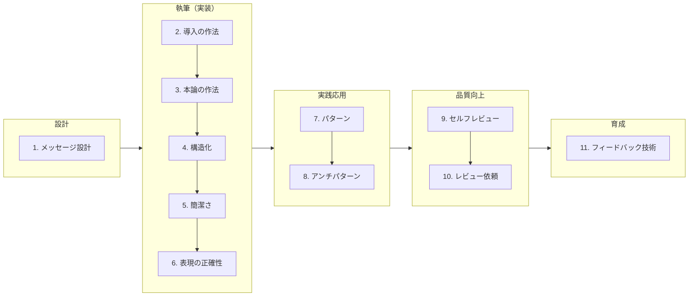

# メッセージ設計

## メッセージ作成の方針

文章を書き始める前に、いきなり本文を書き出すのではなく、次の観点で全体の流れや粒度を設計する。

- **読み手の期待値と粒度を合わせる**  
  読み手の期待値とずれた文章は、ライティング技術を駆使してもNGとなる（例: チャットなのに長すぎる、設計書なのに粗すぎるなど）。まずは求められる粒度と分量を正しく把握する
- **1次元のテキストを目次で構造化する**  
  文章は上から下へ1次元で読まれるため、情報の順序が理解度を左右する。チャットなどの短文を除き、まずは目次を作成し、情報を伝える順番を設計してから本論の執筆に入る
- **単独で読める資料を前提とする**  
  コンサルタントやアーキテクトが作成する資料は、アップルの発表会のようなトークを補助するスライドではなく、事前・事後に配布して、それ単体で内容が伝わるドキュメントが基本となる。ただし、いずれの形式であっても、目次から作成するという手順に変わりはない

::: tip 目次設計におけるAI活用の注意点  
目次作成の段階でAIとの壁打ちは効果的である。ただし、AIは内容を膨らませがちなので、情報過多に注意すること。AIは大量の文章を作成できるが、人間が理解できる時間と認知リソースには限界がある。  
:::

## 5W1Hで解像度を上げる

上長やクライアントに判断や承認を求めたい場合は多い。依頼事項を整理した後は必ず、5W1H（いつまでに・だれに・何を・どうしてほしいか）を明確に定義しているか確認する。ここで重要なのは、書き手ではなく相手の立場に立って考えることである。

1. **だれに依頼したいか**（Who）
   - その依頼や確認は、だれに行いたいか。複数人であっても構わないのでby-nameで名前を出す
2. **相手はそれを意思決定できる権限があるか？**（Who）
   - 相談相手を間違えていないか確認する。権限のない相手に判断を求めても、困惑させるだけである
3. **相手が意思決定に必要な「判断材料」が充足しているか？**（What/Why）
   - 「AとBどちらが良いですか？」「IAMロールを追加してよいですか？」とだけ聞かれても、相手は “知らんがな” となり判断できない。それによる影響度・リスク・作業時間・代替案など、相手が意思決定を下すために必要な比較材料を提示する責任は、書き手にある
   - もし、前提情報を揃えられない場合は、裏取りから実施する。ここをスキップしても拗れるだけである
4. **対象範囲は明確か？**（Where）
   - 「どこ」があると影響度が正しく伝わる。「エラーが発生しました」ではなく「本番環境の〇〇画面で発生しました」といった具合に、対象となる環境やスコープ（場所）を明示する必要がある
   - 資料パスやチケットなどのURLで共有することで、相手の探すコストを減らす
5. **希望の期限と、デッドラインを伝える**（When）
   - 作業者の立場として都合が良い期限と、最遅の期限（それを超過すると間に合わず業務影響がある期限）を伝えることで、読み手側に優先度を考える余地を与えることができる
   - やりたいことはOKだが、期限が短すぎてNGということは十分にありえる。また期限の意識がない「持ち帰っての検討」はPJを間延びさせるだけである
6. **相手に「どういうアクション」をとってほしいか明記しているか**（How）
   - 単なる「状況の共有」なのか、「A案かB案かの選択」なのか、「作業の承認（Approve）」なのか、相手に求める具体的なアクションを明記する。ここが曖昧だと「で、私はどうすればいいの？」と相手の時間を奪うことになる
   - このチェックは、一度書いた文章に対して、相手目線でSo what（だから何？）に回答できるかを確認すると良い

5W1Hがふわっとすると、どれほど美しい文章であっても、業務を前進させるという目的を果たすことはできない。仕様を説明した設計ドキュメントであっても、だれの何をどうやって解決するために作成するかなど、5W1Hでチェックすると、より芯を捉えたドキュメントを作成する手助けになる。

## 事実だけでなく見解まで述べる（空・雨・傘）

メッセージを設計する際、論理展開の基本となるフレームワークが「空・雨・傘」である。

- **空（事実）**: 空に黒い雲が出ている（客観的な状況、調査結果。事実を共有する）
- **雨（解釈）**: 雨が降りそうだ（事実に基づく分析や課題の特定）
- **傘（見解）**: 傘を持っていこう（取るべきアクションの提案）

実務の報告において、事実や推測（空・雨）だけで止まってしまうケースが多い。「〇〇について調査したところ、▲▲に課題がありました」という報告だけでは、読み手に「で、自分はどうすべきか？」をゼロから考えなければならない。アクションの立案を相手に丸投げすることは、書き手が介在する付加価値が低いことを意味する。相手が知りたいのは、「あなたがどうしたいのか（そのための承認をもらいたいのか）」あるいは「私は何をすればよいのか」という「傘」の部分である。

::: tip 「傘」が欠けていないかのチェック  
自分が伝えようとしているメッセージが単なる事実の羅列になっていないかを確認するために、前項の5W1Hがそのまま使える。「誰に」「何をしてほしいか」の要件を満たそうとすれば、自然と傘（見解）が必要になるためである。  
:::

::: tip 純粋な情報共有の場合のマナー  
もし、現時点では傘（アクション）まで考えが至らない場合や、純粋な情報共有が目的である場合は、文章の冒頭で「これはInformation（共有）ですが〜」「ご報告のみですが〜」と前置きするのがマナーである。これにより、読み手は「自分がアクションを考える必要がある」または「判断はまだ不要である」と認識し、適切な心構えで情報をインプットできる。  
:::

## やったことや挙動の羅列は価値が低い

設計書、PR（Pull Request）、定例資料において、「システムは〇〇の処理を行う」「今週は××を実装した」と、ただシステムの挙動や作業内容をツラツラと並べるだけの文章は、読み手にとって価値が低く、正直なところ退屈である。

ソースコードを読めばわかるWhat（何を作ったか）や、チケットを見ればわかる「やったこと」を日本語に翻訳するだけでは、書き手が介在する意味が薄い。ドキュメントの目的に立ち返り、読み手が真に必要としている情報に焦点を当てる必要がある。

- **目的が「設計の妥当性評価や将来の保守」である場合**
  - 例: 設計書など。システムの仕様をブラックボックス化しないことを目的として記述することが多い
  - 単なる機能の説明ではなく「どこが設計上の重要な意思決定だったのか」「他の設計案とどのように比較し、なぜその手段を選択したのか」という「Why」 を記述すべきである
- **目的が「レビューや承認」である場合**
  - 例: PRや提案書など
  - 「Aのライブラリを追加しました」という作業の羅列ではなく、「現状どのような課題やリスクがあり、この変更によってそれをどう回避・解決しようとしているのか」という見通しを述べる。その上で、必要に応じて詳細な実装内容を補足すれば良い
- **目的が「成果や進捗の共有」である場合**
  - 例: 進捗報告やリリースノートなど
  - どれだけ手を動かしたかという作業量ではなく、その作業によって「利用者の利便性をどう上げたか、どのような技術的価値を生み出したか」を第一に記載する。自分たちの目線に寄りすぎず、読み手の関心事に沿っているかを忘れないようにする

特に、フォーマットが決まっている設計書や繰り返しの定例資料などは、当初立てた目的を意識し続けないと、漫然と項目を埋めるだけの不毛な作業となり形骸化しやすい。「自分が書こうとしている内容は、このドキュメントの目的に合致しているか？」を常に検証する。その報告を聞いて相手が「で？（私に何をして欲しいの？）」とならないよう、So what（だから何？）を意識する。

この話をすると高確率で「工数が..」という話になる。真実、工数が無く形骸化が是正できないのであれば、思い切ってそのルールを簡略化するとか、業務を断捨離化する方向に倒すのも取り得なくもない。あなたがリーダーであればそういった意思決定を主導してみると良い。メンバーの場合は1on1などでそれとなく相談してみると良い。

# 導入の作法

## 文章の導入部は情報の非対称性に気をつける

冒頭の1文は読み手がすでに知っていて、「はい、その通りです」と同意できる情報を記載する。なお、この「同意」は文章全体のメッセージに対しての同意ではなく、あくまで導入の1文目に対してのものである。

- 未知の新情報をいきなり混入させない
- 相手の知識レベルに合わせる（非専門家相手に前提知識を省略しない、専門家相手に長すぎる背景説明をしない）

書き手と読み手の間に存在する情報の非対称性を埋めることで、文章の唐突さや難解さを軽減し、読み手に「文章を読む準備」を促すことができる。

::: info 例: 唐突なアクション要請

- ❌ **NG**  
  〇〇の設定を至急変更してください。
- ✅ **OK**（ラベルは説明のため便宜的に付与している）  
  （既知の合意）先日の定例で合意したセキュリティ強化の件です。  
  （要請）手順が整いましたので、〇〇の設定変更をお願いします。

:::

::: info 例: 非専門家への専門用語による門前払い

- ❌ **NG**  
  マイクロサービス化が拡張性不足の解消に寄与します。
- ✅ **OK**（ラベルは説明のため便宜的に付与している）  
  （既知の課題）現在、アクセス増加時にサイトが重くなる課題があります。  
  （前提知識を提供したうえでの新情報）これを解決するため、システムの一部を切り出して独立させる『マイクロサービス』という手法を提案します。

:::

## コミュニケーションで間が空いたときは「文脈」を提供する

顧客のキーマンや上長は、日々圧倒的な情報量を処理している。そのため、自分が強い関心を持っている事案以外、「前回までに何を話し合い、どう決着したか」を詳細には覚えていないことが多い。 相手が記憶している前提で進めると、認識のズレや「そもそもこれって何の話だっけ？」と確認のラリーが発生し、前提や文脈の特定に時間を要する。

数日ぶりに再開するSlackのスレッドや、長期間オープンになっている課題チケットの更新、あるいは定期的な報告書を作成する際は、相手が完全に文脈を忘れているという前提で冒頭で補足する。

- **前回までの振り返りを入れる**
  - これまでの決定事項やTODOの状況を最初に短く示すことで、読み手はスムーズに本論に入ることができる  
    ::: info 例
    「前回は〇〇が論点となり、A案で進めることで合意しました。今回はその残課題である××についてです。」  
    :::
- **定期的に「全体感」を示す**
  - 個別の技術的な議論や詳細なタスク報告が続くと、読み手は「今、全体の中でどのフェーズの話をしているのか」を見失いやすい。大まかな矢羽を含んだスケジュール（いつまでに・何をやるか）の中で現在地を示すなど、俯瞰的な全体感を定期的に提示すると良い

# 本論の作法

## 意思決定や承認を求める場合は結論から述べる（PREP）

アーキテクチャの選定や仕様変更の調整など、多忙なキーマンから「Yes/No」の意思決定を引き出したい時には、PREP（Point:結論→ Reason:理由→ Example:具体例 → Point:再結論）が便利である。キーマンは基本的に作業過程（How）や苦労話に興味はない。結局どうしたいのか？（結論）と、なぜそれに同意すべきなのか（根拠）をまず示すべきである。

::: info 例: リリース方針の変更打診
✅️ **OK**（ラベルは説明のため便宜的に付与している）<br>

（結論）今回のリリースでは、新機能の追加ではなく既存機能の改善を優先する。  
（理由）理由は、直近のユーザーアンケートで操作性への不満が多く挙がっているためである。  
（具体例）実際にログを確認したところ、直帰率の高いページでは入力フォームの操作ステップが多く、直接的な離脱要因になっていることが判明した。  
（再結論）したがって、まずは既存機能の改善を優先させてほしい。
:::

## 相談やエスカレーションは状況から述べる（STAR）

本番環境でのシステム障害、どうしても解決できないバグの相談など、相手に状況の把握と急ぎの支援を求めるときは、STAR（Situation:状況→ Task:課題→ Action:行動→ Result:結果）が便利である。障害時に「DBをトランケートさせてください」と結論だけ伝えても、相手は「ちょっと待って、そもそも何が起きていて、影響範囲は何だっけ？」となる。この場合は何が起きているか状況を同期する必要がある。

::: info 例: 本番障害の一次報告とエスカレーション
✅ **OK**（ラベルは説明のため便宜的に付与している）<br>
（状況）本番環境にデプロイした後、一部ユーザーでログインができない事象が発生している。  
（課題）影響範囲の特定と、早急な原因の切り分けが必要な状態である。  
（行動）まずエラーログを確認して認証APIのレスポンスを調査し、さらにキャッシュの影響を疑ってCDN設定も確認した。  
（結果）しかし現時点では問題は見つかっておらず、引き続き環境変数の差分を確認している段階である。
:::

# 構造化

原則として、**構造化が可能であれば、常に構造化すべきである。** たとえそれによって散文としての流麗さや文章の流れが多少損なわれたとしても、構造化を優先する。

コンサルタントやアーキテクトが扱う課題は、往々にして複雑に絡み合っている。情報を分類・ラベル付けして抽象化することで、問題の全体像ははるかに捉えやすくなる。 読み手であるクライアントや上長の関心事は、細かな実行レベルの詳細よりも、「問題の構造」や「解決の方向性」を正しく把握し、大枠をチェックすることにある場合も多い。そのため、複雑な情報を構造化すること自体が我々の付加価値であると認識すると良い。

## 構造化フォーマットの選び方

情報を構造化する際は、要素間の関係性に応じて適切なフォーマットを選択する。 その際、情報がより整理され関係性が明確になる上位のフォーマット（表 ＞ ラベル付きリスト ＞ 番号付きリスト ＞ 箇条書き）の順に適用できないかを検討することが望ましい。ただし、要素間に明確な比較軸や順序がないにもかかわらず、無意味に上位の構造を適用する必要はない。

1. **表**
   - 適用基準: 複数の項目に共通の比較軸や属性（ネスト構造）がある場合
   - 効果: 縦横の軸で情報を網羅的に整理でき、情報の抜け漏れや差異が最も視覚的に伝わる
2. **ラベル付きリスト**
   - 適用基準: 情報の抽象度や粒度が異なり、単純な並列では並べられない場合。
   - 効果: 適切なラベル（見出し）を与えて階層化することで、複雑な情報を意味のかたまりごとに整理できる
3. **番号付きリスト**
   - 適用基準: 手順、時系列、優先順位など、要素の「順序」に明確な意味がある場合。並び替えても意味が通じる場合は、番号を付けない
   - 効果: 読み手にステップや重要度の順番を正確にガイドできる。
4. **箇条書き**
   - 適用基準: 要素の粒度（抽象度）が揃っており、単に並列に列挙できる場合
   - 効果: 散文で書くよりも視認性が高まり、要素の数が一目でわかる

::: tip リストの先頭記号の使い分け  
箇条書きにする際、項目の性質に合わせて先頭の記号を使い分けると、意図が伝わりやすくなる。

- 「・（中点）」や「-（ハイフン）」: 順序に意味がない、並列の要素を列挙する場合
- 「1. 2\. 3.」などの数字: 操作手順、順序があるもの、または「2番目の項目についてですが～」と特定の項目を指し示して議論したい場合
- 「A. B. C.」や「松・竹・梅」など: 特定の選択肢やプランを提示し、読み手に比較・選択を促す場合

:::

## 構造化の記述ルール

情報をただ並べるのではなく、一貫性を持たせて整理することで、読み手が内容の差異にのみ集中できるようにする。

### 要素の粒度を揃える

同じ階層にある要素は、視点（主語）や品詞（文末）を統一する。

::: info 例: 粒度を揃える

- ❌ **NG** （主語が混在）
  1. ブラウザで権利画面を開く（ユーザー視点）
  2. IDとパスワードを入力する（ユーザー視点）
  3. ログイン完了画面が表示される（システム視点）
  4. 設定変更ボタンを押下する（ユーザー視点）
- ❌ **NG** （語尾が統一されていない）
  - システム要件を確認する（動詞）
  - 最新版インストーラーの準備（名詞）
  - 管理者権限で実行する（動詞）

:::

### MECEさを保つ

箇条書きや見出しを使って情報を整理した際、「設計、開発、CI/CD」のように抽象度の違うものが同列に並んでいると、読む気を失いアウトプットとしては論外である。レベル感を揃え、漏れやダブりが無い状態、つまりMECEを保つ必要がある。粒度が細かい要素が混ざっている場合は、上位の概念でネストさせる。

::: info 例: MECEにする

- ❌ **NG** （粒度がバラバラでダブりがある）  
  次期システムの非機能要件として、以下の対策を実施する。
  - 可用性の向上
  - セキュリティの強化
  - SQLインジェクションへの対応（←これだけ具体化されており、「セキュリティ」とダブっている）
  - パフォーマンス要件
- ✅ **OK** （レベル感が揃っている）  
  次期システムの非機能要件として、以下の対策を実施する。
  - 可用性の向上
  - セキュリティの強化
    - SQLインジェクションへの対応（←下位階層の具体例としてネストする）
    - クロスサイトスクリプティングへの対応
  - パフォーマンス要件の達成

:::

ただし、実務においては、あらゆる観点を網羅すること自体が目的ではない。例えばライブラリ選定では、「安全性」「保守性」「利便性」「コミュニティの成熟度」などの主要な軸で比較する。理論上は他にも観点は挙げられるが、多くの場合、意思決定に本質的な影響を与える要素を押さえていれば十分である。

### 導入文を置く

リストや表の直前には、必ず内容を説明する一文を置く。読み手がこれから提示される情報が、前提条件なのか作業手順なのかと言った役割を認識した上で、読み始めることができるからである。

::: info 例: 1行目の導入文により、リストの役割を明確にする

- ✅️ **OK**  
  本作業を開始する前に、以下の前提条件を満たしているか確認する。
  - サーバーの管理者権限があること
  - 開発用端末にブラウザがインストールされていること
  - 社内VPNへ接続済みであること

:::

### 項目単体で意味が通じるように書く

リストや表の項目は、そこだけを拾い読みしても意味が理解できるように記述する。前後の文脈を遡らせるような指示語（「これ」「前述の通り」など）の使用や、極端な省略表現は避ける。

::: info 例: 文脈依存が大きすぎる項目

- ❌ **NG** （指示語や言葉足らずで、内容が不明瞭）
  - これを適用する
  - 前述の構成図を参照する
- ✅ **OK** （項目単体で意味が通じる）
  - セキュリティパッチを本番環境へ適用する
  - システム構成図（2.1節を参照）を確認する

:::

## 避けるべき記述方法

構造化は情報を整理するのに有用だが、乱用すると本来あったはずの情報の関係性が消え、かえって読みづらくなってしまう。

### 文章を細切れにしただけの箇条書きにしない

一連の文章を単に短く切り離して並べると、論理関係（因果関係や接続詞の意図）がなくなり、かえって理解しづらくなる。各項目がどういう意味を持っているのかを表すラベルを付けることで、情報の構造を明確にする。

::: info 例: 論理関係が破綻した箇条書き

- ❌ **NG** （論理関係が分断され、意図が伝わりにくい）
  - システムを再起動する
  - 設定が反映されない場合がある
  - 30秒待機してから再度試みる
- ✅ **OK** （情報の役割ごとにラベルを付け、関連する文をまとめている）
  - 【依頼】システムを再起動する
  - 【補足】設定が反映されない場合があるため、30秒待機してから再度試みる

:::

### 原因と結果をネストで表現しない

階層構造は原則、包含関係を示す分類のために使い、「原因→結果」のような論理のつながりをインデントで表現しない。因果関係を示す場合は1文の文章で書くか、同列の項目として並べ、ラベルで役割を明示する。

::: info 例: 原因と結果をネストで表現した箇条書き

- ❌ **NG** （因果関係をネストで表現）
  - 未定義のパラメータが入力された
    - → 予期せぬ例外が発生
- ✅ **OK** （シンプルに1文にする）
  - 未定義パラメータの入力によって予期せぬ例外が発生しました。
- ✅️ **OK** （ラベルを付けて同列の項目として並べる）
  - 【原因】未定義のパラメータが入力された
  - 【結果】予期せぬ例外が発生

:::

# 簡潔さ

テキストコミュニケーションの質は、「相手がいかに短時間で、正しく内容を理解し、次のアクションに移れるか」で決まる。読み手の時間を奪わないための工夫は、相手へのリスペクトであると同時に、自分と相手、双方にとって業務効率を引き上げる。

## コミュニケーションの入口を整える

まずは相手がメッセージに触れる瞬間の負荷を下げる。

### 件名だけで内容が判別できるようにする

メール、GitLab、Redmineなど、件名/表題については内容を具体化する。中身を見なくても判断できるようにする。多忙なキーマンは通知一覧の件名だけを見て対応の優先順位を決めているため、「〜について」といった曖昧な表現は避ける。

::: info 例: 件名だけで何も判断できない

- ❌ **NG** （中身を開かないと目的やアクションがわからない）
  - 〇〇画面について
  - 〇〇画面のダウンロードボタンについて確認
- ✅ **OK** （画面名・対象・アクションがすべて含まれている）
  - 〇〇画面：「ダウンロード」ボタンの表示有無の確認
  - 確認：〇〇画面の「ダウンロード」ボタンの表示有無
  - 【〇〇画面】ダウンロードボタンの表示有無の確認

:::

※補足：【 】や \[ \] などのプレフィックス（接頭辞）記号の使用は、プロジェクト内のルールに準拠する。

### 主題文から書き始める

件名がない場合でも、一文目で目的（確認・相談・報告）を明示する。読み手が、何の話でどういったスタンスで読めば良いのか？という疑問を最初に解消する。

::: info 例: スタンスの事前共有  
目的を最後に書くと、読み手は「ただの共有かな？」と気を抜いて読んでしまい、最後にアクションを求められて「もう一度最初から読み直す」という無駄な時間を費やすことになる。

- ❌ **NG**（最後まで読まないと、確認や提案など、相手に求めているアクションが不明）  
  〇〇機能ですが、現状XXとなっています。しかし、△△のように操作をすると問題が発生しますので、◇◇のようにしたいと考えます。いかがでしょうか？
- ✅ **OK**  
  【相談】〇〇機能の◇◇の仕様について相談したいです。現状XXとなっています。しかし、△△のように操作をすると問題が発生するため、◇◇にしたいと考えます。ご意見をお聞かせください。
  :::

## 問いへの「スタンス」を明確にする

書き手の付加価値を上げるための答え方の作法である。

### Yes/Noクエスチョンは結果から回答する

Yes/Noクエスチョンの問いには、まず結果を提示する。説明はその後に行う。事実だけを並べてYes/Noという判断を相手に委ねさせず、自身で責任を持って回答することで、書き手が介在する付加価値を上げる。

::: info 例: 「ゲストユーザーでも資料はダウンロードできますか？」への回答  
言い訳や調査過程を前に置かず、直球で結果を返すことで、相手は最短時間で次のアクションに移ることができる。

- ❌ **NG**（最後まで読まないと質問の回答が分からない。）  
  ダウンロードボタンの権限を確認したところ、現在は会員のロールのみ許可フラグが立っています。  
  このため、ゲストユーザーですと、ボタンが非表示になるため、ダウンロードはできません。
- ✅ **OK**  
  ゲストユーザーはダウンロードできません。  
  現状の仕様では権限が正社員に限定しているためです。

:::

### 問いに対して直接的な回答を行う

状況説明に終始せず、問われた要素（いつ、誰が、何を）に対して直接回答する。相手は進捗状況や作業の過程、苦労話が知りたいのではない。たとえ現時点で答えが出せない場合は、「未定である（答えられない）」という事実をまず伝えるべきである。

::: info 例: 「いつまでに〇〇ボタンの仕様は確定しますか？」への回答
「いつ」という問いに対して、状況説明や言い訳を返すと、相手は「で、結局いつなの？」と再度質問ラリーをしなければならなくなる。

- ❌ **NG**（状況の説明に終始しており、「いつ」という問いへの直接的な回答が欠けている）  
  現在、〇〇チームに確認をしているところで、まだ返事がきていないです。後ほどリマインドを入れておきます。
- ✅ **OK**  
  現時点では未定です。本日17時の進捗会議後に改めて回答します。

:::

## 文章を研ぎ澄ます

具体的な執筆テクニックを述べる。

### 情報密度を最大化する

冗長な文章で読み手にとって退屈で、本来伝えたいメッセージを埋没させてしまう懸念すらある。まずは次のルールに従うと良い。ただし、構造化できるのであれば常に構造化を優先する。

- **短い言葉で済むなら、長い言葉を使わない**
- **削れる言葉があるなら、常に削る（不要な修飾語や比喩を避ける）**
- **能動態を使える時に、受動態を使わない**

::: info 生成AI（LLM）を活用する際の注意点  
AIは過剰に修飾子を付けがちであり、無くても意味は通じることが大半である。そのため、削ぎ落とす推敲は必須である。  
:::

::: info 例: 文字数を削り、受動態を能動態にする

- ❌ **NG**（81文字）  
  昨日発生したエラーにつきましては、設定ファイルの記述ミスが原因であると確認されました。  
  そのため、インフラチームによって正しい値への修正対応が実施された形となります。
- ✅ **OK**（45文字）  
  昨日のエラーは、設定ファイルの記述ミスが原因でした。インフラチームが正しい値に修正しました。

:::

::: info 参考  
[https://x.com/mizchi/status/1150089882930253824?s=19](https://x.com/mizchi/status/1150089882930253824?s=19)  
:::

### 一文に多くの情報を詰め込みすぎない

長い文章は「文中の各要素のつながりが不明確になる」「修飾関係がねじれる」などの問題が発生し「結局この文で何が言いたいのか?」が不明瞭になりやすい。目安として一文は、50～60文字程度を上限とする。ただし、杓子定規に守る必要はなく、読み返したときに引っ掛かった箇所の文字数を確認して調整すると良い。

不必要な要素や繰り返しがあれば削除すれば簡潔になる。それらが無い場合は、複数の文に分割する、箇条書きなどの構造化を試みる。

::: info 例: 削除・分割・構造化で対処する
不必要な繰り返しを削っても長い場合は、文を分割するか、箇条書きによる構造化を行う。

- ❌ **NG**  
  一時的な通信失敗が発生した場合の再試行ロジックについては、最大5回までのリトライを試行する設定を行うことは、短時間での過度なリクエスト集中を回避しつつ、最終的なログ到達率を最大化させるという結果になります。（103文字）
- ✅ **OK**  
  一時的な通信失敗に対しては、最大5回の再試行を行います。この設定により短時間でのリクエスト集中を回避できます。結果として、サーバーへの負荷を抑えながらログの到達率を最大化できます。（28, 27, 35文字）

:::

### 並列する要素は箇条書きと体言止めを活用する

複数の要素を並べる際は、文章の中に埋め込まず箇条書きを用いる。その際、各項目を「体言止め」にすると、視認性を高め、誤読を防止しやすくなる。

::: info 例: 情報の埋没と視認性の向上
文章で記述すると要素の境界線が曖昧になり、読み飛ばしや認識漏れのリスクが高まる。

- ❌ **NG**  
  今回の修正範囲は、ログインボタンの色の変更と、ログアウトボタンの配置の調整、それからマイページへのリンクの追加です。
- ✅ **OK**  
  今回の修正範囲は以下の通りです。
  - ログインボタンの配色変更
  - ログアウトボタンの配置調整
  - マイページへのリンク追加

:::

### 接続詞を減らし、文を短く切る

「～ので」「～が」などの接続詞で文を繋ぎすぎると、情報の優先順位が不明瞭になる。一文一義を意識する。

::: info 例: 完了報告と注意喚起の混在
文を繋ぎすぎると、読み手は「結局、何が一番重要な情報なのか」を判断するのに時間がかかる。

- ❌ **NG** （接続詞が多く、完了報告なのか注意喚起なのかが伝わりにくい）  
  〇〇機能の修正が完了しましたので、テスト環境に反映しましたが、
  一部データが古いままなので、確認の際は注意してください。
- ✅ **OK**  
  〇〇機能の修正が完了し、テスト環境へ反映しました。
  ただし、一部データが古いため、確認の際はご注意ください。

:::

### 「～が」を逆接以外で使わない

「～が」は、逆接にも使えるが、単純に文をつなげる際にも使える。逆接以外のつなぎ方で用いると、読み手が要素間の関係を把握しにくくなるため、避けたほうが良い。

::: info 例: 曖昧な接続による予測の混乱  
「～がありますが、」と書かれると、読み手は「何か欠点があるのかな？」と身構えてしまう。

- ❌ **NG**（「～が」は読み手が続きを予測しにくい）  
  〇〇機能を実装する方法にはライブラリAとライブラリBがありますが、
  ライブラリAが一般に広く使われています。
- ✅ **OK**  
  〇〇機能を実装する方法にはライブラリAとライブラリBがあります。
  中でもライブラリAが一般に広く使われています。

:::

### 長い名詞句の使いすぎ・無生物主語に注意する

名詞中心の文章や、主語が人間や生き物ではない文章は、特に生成AIの出力に含まれがちである（英語の学習データの影響であろう）。これらはフォーマルな印象を与えるという効果を持つ一方で、だれが何をするのか？ という直感的な理解を妨げる。そのため、動詞を中心とした自然な日本語へ書き換えるべきである。

::: info 例: AI特有の「重たい名詞句」 解消

- ❌ **NG**（"手動でモデルを選択する手間"など、長めの名詞句の使いすぎ）  
  GPT-5のモード切り替えシステムにより、ユーザーは手動でモデルを選択する手間から解放され、常にコスト効率と精度の最適なバランスを享受できるようになった。
- ✅ **OK**  
  GPT-5は自動的にモードを切り替える。そのため、ユーザーは手動でモデルを選択しなくても良くなり、使用コストと精度のトレードオフの中で適切なモデルを自動的に使用できる。

:::

::: info 例: AI特有の「無生物主語」の解消

- ❌ **NG**（無生物主語、目的語が長い名詞句になっている）  
  Claude 4の核心的機能である「Extended Thinking」モードは、モデルが自らコードを実行し、ウェブを検索し、ファイルを読み書きしながら、必要に応じて自身の計画を修正する能力を提供する 。
- ✅ **OK**  
  Extended ThinkingモードはClaude 4の新機能である。このモードでは、モデルが自律的にコードを実行し、ウェブを検索し、ファイルを読み書きしながら、必要に応じて自分自身の計画を修正する。
  :::

# 表現の正確性

## 用語

### 相手の言葉に合わせる

用語選定時の原則は、読み手が普段使っている言葉に合わせることとする。ドキュメントの目的は「学術的な正確さ」を示すことではなく、相手に正しく伝わり、「意思決定」を促すことだからである。

::: info 例: データ管理の責任者を指す場合

- ❌️ **NG**: IT業界の標準用語である「データスチュワード」
- ✅️ **OK**: 顧客社内で浸透している「データ管理者」

:::

もし技術的な専門用語をそのまま使った場合、顧客はそのドキュメントを社内の関係者（経営層など）へ説明する際、いちいち馴染みのある言葉に「翻訳」して話さなければならなくなる。技術とビジネスの橋渡し（翻訳）は本来アーキテクトの責務であり、その翻訳作業の認知負荷を顧客に押し付けてはならない。相手の社内調整がスムーズに進むような言葉選びを心がける。

### 専門用語を正しく用いる

用語を正しく使うことは読者の認知負荷を下げ、誤解を防ぐために重要である。同じ概念に対して異なる言葉を使う表記ゆれや、異なる概念に同じ言葉を使ったりすることは、読者の混乱を招き、ドキュメントの信頼性を損なう。

用語は以下の3点を基準として選択する。

1. **正確性**  
   対象を過不足なく表現できており、仕様書や公式ドキュメントの定義と乖離していないか。

   ::: info 例: 用語は正確に利用する
   - ❌ **NG**: 管理画面のAPIは、ユーザーのロールを"認証"してから処理を実行する。
   - ✅ **OK**: 管理画面のAPIは、ユーザーのロールを"認可"してから処理を実行する。

   :::

2. **一貫性**  
    文中で同じ呼び方を維持できているか。また、1つの概念に対し、1つの用語が1対1で対応しているか。もし揺れがあった場合、読み手は何か意図があるのか、余計な推測を強いられてしまう。

   ::: info 例: ユーザー・アカウント・お客様の揺れ
   - ❌**NG**<br>
     あるページでは「ユーザーがシステムにログインする」と書かれていたのに、その他のページでは「アカウントのパスワードをリセットする」や「お客様の利用履歴を出力する」など場所によって同じ対象を指す用語が異なって表現されている

3. **適合性**  
   読者の知識レベルや文脈に適しているか。プロジェクト用語、業界標準、顧客用語の優先順位が妥当か確認する。
   - 顧客向け： 相手が日常的に使っている用語に合わせる。
   - 開発者向けドキュメント: 業界標準の技術用語を優先し、曖昧さを排除する

:::tip 一貫した用語を使用する  
関数の途中で変数名を変えるとコンパイルエラーになるのと同様に、文書の途中で用語を変更するとあなたの考えは（読み手の頭の中で）コンパイルできなくなります。[Google Technical Writing](https://developers.google.com/tech-writing/one/words?_gl=1*1kkuhw7*_up*MQ..*_ga*MTk5MDE2Mjk2NC4xNzY5OTk2NTMw*_ga_SM8HXJ53K2*czE3Njk5OTY1MjkkbzEkZzAkdDE3Njk5OTY1MjkkajYwJGwwJGgw#use_terms_consistently)  
:::

### 略称

専門用語が多いドキュメントでは、読み手の前提知識を過信せず、情報の非対称性を解消するように努める。

1. **略称を初めて用いる際、正式名称を併記する**
   - 例: 「Identity and Access Management（IAM）の設定を確認する。IAMポリシーは……」
   - 例外: APIやLLMなどの世間一般的に意味が自明となった用語や限られた読者向けに共通認識のある固有名詞の略称については正式名称を追記する必要はない
2. **略称の利用是非**
   - 略称の濫用は正確性を損ね、読者の認知負荷が高まる可能性がある
   - 推奨: 元の単語より略称になることで劇的に短くなる場合、かつ文書中の出現回数が多いときのみ略称の利用を検討する
3. **用語集を活用する**
   - プロジェクト固有のドメイン用語や、一般的なIT用語でも文脈によって意味が変わるものは、必ず「定義」セクションを設けるか用語を利用するページ内で「定義」を記述すること
   - 推奨: ドキュメントの冒頭、あるいは独立したページに「用語定義テーブル」を作成する

### 抽象度の高い用語に注意する

文脈によって複数の解釈が可能な用語は、認識齟齬の温床となる。特に、ビジネス側とエンジニア側で同じ言葉が異なる定義で使われている場合は、致命的な設計漏れの原因にもなり得る。

::: info 例: トランザクションの解釈

1. **ビジネス観点**: ユーザーが「商品をカートに入れ、決済し、注文完了メールを受け取る」までの一連の業務的な処理の単位
2. **システム観点**: データベースにおけるACID特性を満たす不可分なデータ操作の単位（COMMIT / ROLLBACKの対象）

トランザクションとだけ書くのではなく、修飾語を補うか別の言葉で具体化することで、何をどこまで保証するのかを明確にすると良い。

- ❌ **NG**（DBのデータは戻るが、外部APIによる決済処理や送信済みのメールはどう扱うのかが不明瞭）  
  「エラー発生時、トランザクションをロールバックする。」
- ✅ **OK**（システム境界を明確にする）  
  「DBトランザクションをロールバックした上で、決済基盤に対してビジネスエラー（取消）のAPIを非同期でコールし、業務的な整合性を担保する。」
  :::

::: tip よくある「多義語」についての紹介

- サービス: ビジネスが提供する「商品」か、あるいは「マイクロサービス」や「Linuxのデーモンプロセス」か
- ユーザー: 画面を操作する「エンドユーザー」か、APIを叩く「システムアカウント」か、DBの「ユーザーテーブルの1レコード」か
- 環境: 物理的な「ハードウェア」か「開発・検証・本番」という区分か

:::

### 文脈が曖昧な用語に注意する

一般的なIT用語には時代と共に意味が変遷している用語があるので注意する。システム知見に乏しい読者や不特定多数の読者を対象にする場合は、文脈上の意味が明確になるように説明することを推奨する。

::: info 例: 「バックログ」の解釈レベル

1. **単なる作業ログ（履歴）や進行中のタスクのリスト**
   - ❌ 誤用のため非推奨
2. **未対応の作業リスト（単なるToDoリスト）**
   - ⚠️ チーム内での呼び方であればよいが正確な用法でないため非推奨
3. **優先順位や期日を持つ未処理のタスクまたは機能要求のリストの総称**
   - **✅** 正しい意味で使われているため推奨
4. **アジャイル開発における「プロダクトバックログ」または「スプリントバックログ」**
   - **✅** アジャイル開発の文脈であれば、どちらの意味で言及しているのかを明示的に使い分ける

:::

曖昧さを含む用語を使用する場合は、それが何であるか（What it is）だけでなく、何を含まないか（What it is NOT）を前提や注釈として併記することで読み手との認識の境界が明確になる。

::: info 例: 性能指標の表記

- ✅ **OK**: 「本計画書における「性能」はオンラインレスポンス時間を指し、夜間バッチの処理時間は含まない。」
  :::

※検証の観点やスコープ（対象・対象外）を明示する図や表を作成するとより効果的である。

## 具体例

具体例は抽象的な概念と読み手の認識を一致させる有効な手段だが、過剰な使用はノイズとなり伝達効率を下げる。

### 具体例を利用するべきケース

#### 抽象的な表現が複数の解釈を許してしまう場合

定性的な表現による解釈のブレを防ぐには、数値化（例: 「大容量」→「10MB以上」）が原則である。しかし、厳密な定義が困難な場合は代表的なケースを例示し、期待値やアウトプットの方向性をすり合わせる。

::: info 例: 期待するレベル感や方向性をすり合わせる

- ✅️ **OK**（具体的な事象を添えることで定性的な判断基準のレベル感を揃えられる）  
  業務中に重大なインシデント（例: 顧客情報の誤送信、認証情報の漏洩等）が発生した場合は、ただちに上長へエスカレーションすること。
- ✅️ **OK**（漠然とした要求でも、例を1つ提示するとアウトプットの方向性を明確にできる）  
  明日の打ち合わせに向けて、新機能を採用した場合の懸念点（例: 既存のバッチ処理のパフォーマンスに影響が出ないか等）を洗い出しておいてください。

:::

#### 境界値や異常系の振る舞いを定義する場合

正常系は直感的に理解しやすいが、境界値や異常系（エッジケース）は、解釈が分かれやすい。具体的な状況を例示し、認識の齟齬を防ぐ。

::: info 例: エッジケースの説明が不明瞭

- ❌ **NG**  
  クーポンの有効期限日は、終日利用可能とする。
- ✅ **OK**  
  クーポンの有効期限日は、終日利用可能とする。
  （例: 有効期限が「3月31日」の場合、3月31日 23:59:59の決済完了までを適用対象とし、4月1日 00:00:00以降の決済は適用外とする）

:::

### 具体例を控えるべきケース

#### 読み手にとって自明な事実である場合

読み手と既に共通認識が取れている概念への例示は、本質的に伝えたいことを埋没させてしまう。また、"あえて" 記載したのではないか？という不要な推測を生むリスクもある。

::: info 例: プロジェクト内で「機密情報」の定義が合意されている場合に、一部の項目だけを例示する

- ❌ **NG**（メールアドレスの記載がないのはなぜか？ といった疑問が出るリスクがある）  
  機密情報（例: 顧客の氏名、住所、電話番号、生年月日など）をローカルPCに保存しないこと。

:::

::: tip 認識の「漏れ」を完全に排除したい場合  
「例示」はあくまで代表例であり、網羅性は保証されない。対象範囲を厳密に定義し、1つの認識漏れも許されない状況では、中途半端な具体例を挟むのではなく、以下の手法を選択する。

- 定義済みドキュメントへの参照: 「詳細は『セキュリティ規定 第2章』を参照」など一本化する
- 箇条書きによる全量列挙
- 包含・除外条件の明示: 「～を含む全項目」「～を除く全てのデータ」のように境界条件を定義する

:::

#### 例示よりも「構造化」が適している場合

特殊な業務ルールなど、具体例の理解に「説明のための説明」を要する場合、散文での例示はかえってノイズになるため避ける。複雑な条件分岐を含む場合は、無理に文章で説明せず決定表や状態遷移図等の「構造化」を検討する。

::: info 例: 文章での説明より図表での説明が適する

- ❌ **NG**  
  送料はユーザーランク等で変動します。例えばゴールド会員は常に無料、シルバー会員は5,000円以上で無料（キャンペーン中は3,000円以上で無料）、それ以外は500円です。通常会員は……（以下、複雑な説明が続く）
- ✅ **OK**  
  送料はユーザーランクと購入金額に応じて変動します。詳細は以下の表の通りです。  
  （※表の内容は割愛）

:::

# パターン

## 論理構造と図解パターン

情報の性質に応じた適切な論理構造とその図解パターンを選択すると、複雑な概念を直感的に理解させることができ、情報の抽象化と具象化の往復を円滑にすることができる。

一般的に認知されている整理パターンを紹介する。

**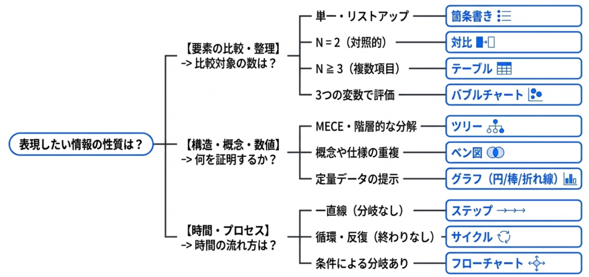**

<div class="img_mini">

- **箇条書き**  
  初歩的ではあるものの、箇条書きは基礎的な情報整理に有用である。  
  情報の受け手からしても、散文で書かれているよりも視認性が高まり、要素の数が一目でわかるメリットがある。
  スライドにおいては、デフォルト機能の箇条書きを使うよりも、種々のオブジェクトやアイコンを配置することでより視認性を上げることができる。箇条書きした結果、対象が同質である場合は対比・マトリクスに変化させることで、より論理構造を明確化させることもできる。
- **対比（変化）**  
  対比は二つの対照的な要素を並置し、その差異あるいは変化を強調する際に有用である。  
  現行システムと次期システム、あるいは現状（AsIs）とあるべき（To-Be）といった比較がこれに該当する。対比スライドを設計する際は、縦軸または横軸に明確な比較項目を設け、読み手の視線が左右に往復しながら情報の差異を抽出できるように配置する。この際、情報の重要度に応じて文字の大きさや色にコントラストをつけることで、情報の優先順位を明示することが肝要である。  
  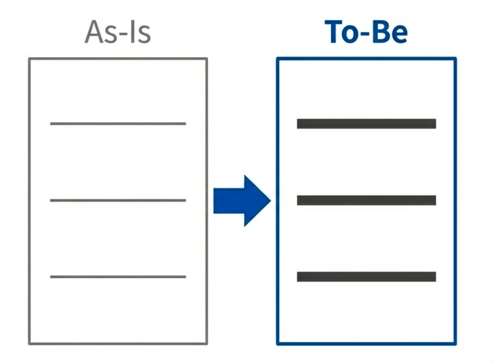  
  ::: tip バブルチャート  
  主要な評価要素が３つ程度であり、他段階の変化を視覚的に示したい場合はバブルチャートも有用である。  
  バブルチャートでは、縦軸と横軸によるマトリクス的なポジショニングに加え、円（バブル）の大きさという3つ目の変数を同時に表現することができる。  
  :::  
  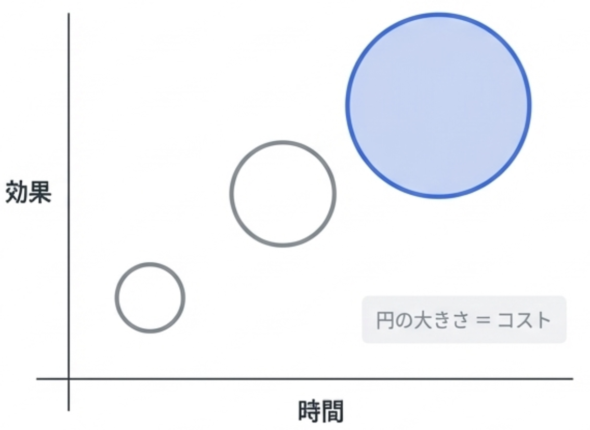
- **テーブル**  
  比較対象が三つ以上になる場合は、テーブル型と呼称する。  
  前述した対比の要素がN個に増えるだけではあるものの、判断要素が対比より多くなることが大きな違いとなる。テーブルの場合は情報が肥大化しやすいため、比較した結論を◯/×/△で表現したり、背景色を変えることで認知負荷を下げることがコツである。  
  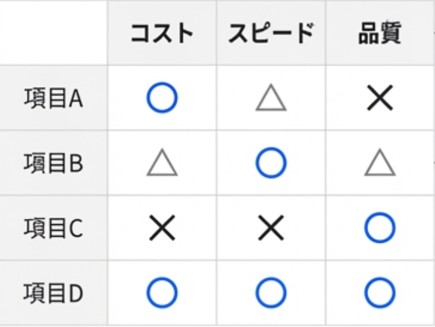
- **ベン図**  
  ベン図はシステム間の互換性、業務範囲の重複、データの整理など、概念的な重なりを表現するのに適している。テクニカルな文脈では、各円のラベルを簡潔にし、重なり合う部分（インターフェースや共通仕様）に視線が向くよう配色を工夫する。  
  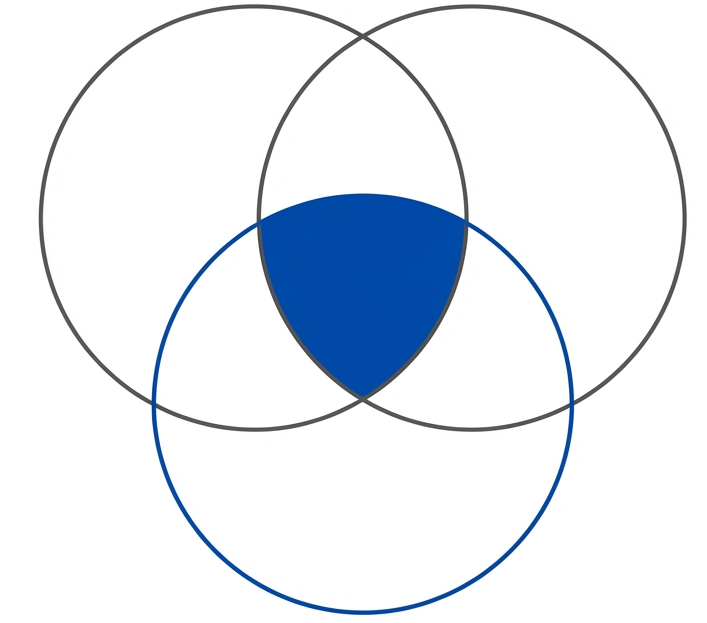
- **グラフ**  
  数値がある程度明らかな場合、グラフによる図示で視認性及び説得力を向上させることができる。  
  主要なグラフの使い分けは以下のとおり。
  - 円グラフ: 全体の割合を示したい場合
  - 棒グラフ: 数値同士の比較
  - 折れ線グラフ: 数値の遷移

  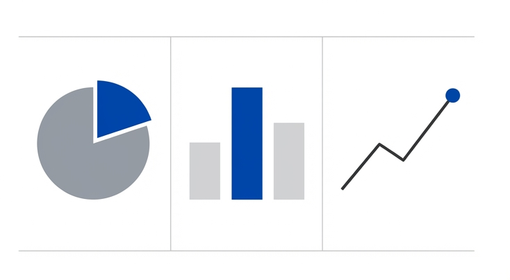

- **ツリー**  
  問題の分解や組織構造を図示する場合はツリー型を用いることもできる。  
  ツリー型は上位概念から下位概念への流れるような論理性を提供でき、MECEさを示す説明にも有用である。スライド上では、左から右、あるいは上から下へと階層が深まるように配置し、視覚的な一貫性を保つことが求められる。

  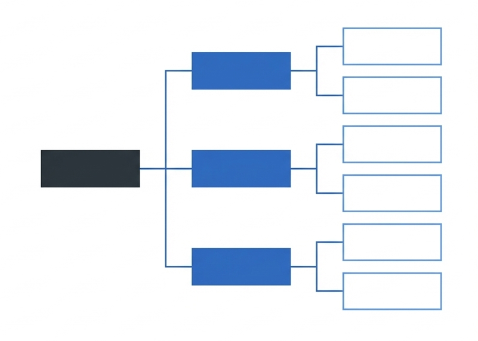

- **ステップ**  
  一連のプロセスや手順を、順序立てて直線的に示す場合はステップ図として表すことができる。  
  目標到達までの道のりや、マニュアル的な作業手順を、順を追って一つずつ確実に理解させる。読み手に今はどの段階か、次は何をするかという見通しを与えることができる。  
  フローチャートよりも単純な分岐を伴わない一直線の進行を表現する際に用いる。  
  
- **サイクル**  
  PDCAサイクルやアジャイル開発のイテレーション、システムのライフサイクルなど、終わりがなく継続的に繰り返されるプロセスを円環状に配置するパターン。  
  スライド化の場合は、循環の向きを明確に示し、認知負荷を下げる目的でサイクル要素は3\~6程度に留める。  
  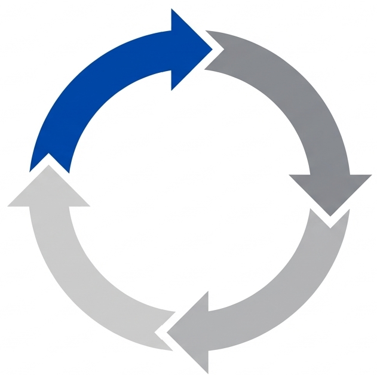
- **フローチャート**  
  業務手順、システム処理の流れ、意思決定の分岐などを、図形（ボックスや菱形）と矢印を用いて順序立てて表現する。複雑な手順や、「Aの場合はB、Cの場合はD」といった条件ごとの振る舞いを直感的に理解させることができる。  
  図表化の際は、人間の視線誘導に逆らわないよう、上から下、または左から右へ一貫した流れを作ること。  
  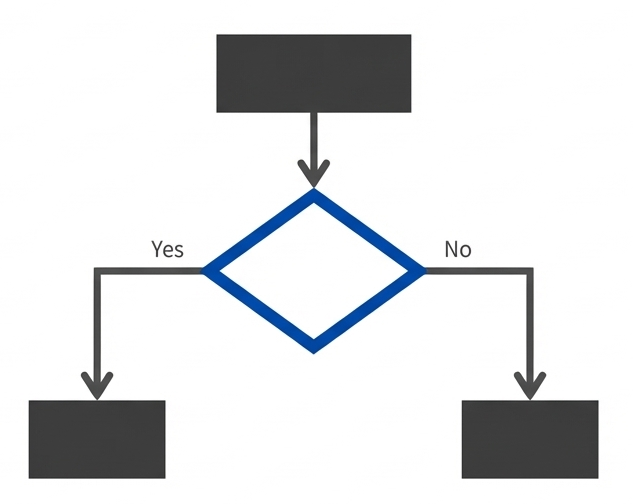

</div>

## テンプレートの引き出しを持っておく

例えば報告書・設計書・非機能グレード表など、期待されるテンプレートがあるのであればそれを活用して時短で構造を決めて、中身の方に時間を割くようにする。ただし、官僚的にならないように不要な項目は省くなど過不足なく情報が伝えられるように心がける。

型をどれだけ引き出しに入れておけるかが、質の高い文章を効率よく生産するうえでのポイントとなる。毎回、ロジカル・シンキングの原理原則からボトムアップで作成するのは労力がかかりすぎる。また、型がないと、AIに文章を作らせるままでアウトプットの品質が安定しない、ということにもなりかねない。

### 最小限のメッセージの型を覚える

業務上の「他者に行動を促す」か「自分の行動の許可を得る」メッセージを送信する場合、メッセージの型を覚えておくと便利である。

::: info 例: `[型]  = (依頼事項や確認事項）＋ その意図`

- ✅️ **OK**（行動を促したい場合）  
  @member 機能Aを参考に、機能Bの実装を進めてください。来週から機能Cの実装を進めたいため。

- ✅️ **OK** （許可を得たい場合）  
  @leader 明日の13時から、打ち合わせの時間を入れさせてください。タスクAの進め方について確認したいです。

:::

他にも、以下のように5W1Hなどを参考に、追加したパターンも引き出しに持っておくと良い。

- `[型]  = （依頼事項）+ 意図 + 期日 + エスカレーション条件（XXが無理そうならXXまでにコメントください）`

# アンチパターン

一見問題がないように見えても、ユーザー目線でのユーザビリティを下げたり、長期的なドキュメントの品質を損なうようなアンチパターンが存在する。

## ユーザビリティの低下

テクニカルライティングではドキュメントの内容がユーザーにとって利用しやすいことが重視される。内容の理解を直接妨げない場合でも、コマンドの再利用や手順の実行において不便を生じさせることがある。ドキュメントを実用的にするという観点で避けることを推奨する。

### テキストのスクリーンショット

テクニカルライティングにおいてはコマンドプロンプトやターミナルなどのCLIの動作を取り扱うことも少なくない。その中でコマンドなどをテキストとして載せるのではなく、CLIのウィンドウなどをスクリーンショットとして載せてしまう人がいる。これは次の理由で避けるべきである。

- コピー＆ペーストができないため、自身の環境で実行時に不便
- ページ内検索できず不便

一方でフォントのデザインの確認など、テキストであっても見た目に対して言及が必要な場合についてはこの限りではない。

### 指示語のリンクを使用する

「ここ」や「こちら」などの指示語にハイパーリンクを設定する場合がある。これは次の理由で避けるべきである。

- ユーザーはリンク先の内容がわからず、可読性が低下する
- ページ内検索がしにくい

::: info 例: 指示語のリンク

- ❌ **NG**  
  詳細は[こちら]()を参照してください
- ✅ **OK**  
  詳細は[API認証の設定手順]()を参照してください。

:::

### コマンド実行に不要な情報をコードブロックに残す

コマンド実行などをコードブロックとして扱う場合に下記のよう不要な情報をコードブロックに残すことは避けるべきである

- `$` `#` `>` などのプロンプト記号
- 操作を説明するテキスト

入力と出力を区別したい、という意図としてプロンプト記号を残しているのであれば、テキストで入力と出力結果がわかるようにするべきである。また、操作を説明するようなテキストはコードブロック外に記載するべきである。

::: info 例: コードブロック

**❌ NG**

````text
```shell
gitでリポジトリをクローンする
$git clone https://example.com/hoge.git...Cloning into 'hoge'...
```
````

**✅ OK**  
gitでリポジトリをクローンする

````text
```shell
git clone https://example.com/hoge.git...
```
````

出力結果

````text
```shell
Cloning into 'hoge'...
```
````

:::

### 保守性の低下

テクニカルライティングにおいて理想的であるのは、時間が経ってもその内容が有効的であり続け、再編集などを必要としないことである。下記の例は保守性を低下させ、時間と共に内容の有効性を低下させてしまう要素である。

### 時間に依存する表現を使用する

例えば、使用するライブラリなどのバージョンを表す際に「最新バージョン」と記載されていることがある。当然のことではあるが、「最新」「現在」などの時間に依存する表現は、時間の経過により意味が変化する。そのため、可能な限りバージョンや、具体的な条件を記載するべきである。

::: info 例: バージョン未記載

- ❌ **NG**  
  最新のNode.jsをインストールしてください。
- ✅ **OK**  
  Node.js 20系で動作確認済み。

:::

### 外部サイトのリンクを多用する

参考情報として別サイトのリンクを添付し、閲覧することを促すことは、原則避けるべきである。

- いつまで閲覧可能であるかが他サイトに依存し、保守性が低下する
- 参考時と同じ情報が記載されているかが他サイトに依存し、保守性が低下する
- どの部分を参考にさせるか読者自身に依存する形になり、読者への負荷を引き上げる

理想としては必要な部分をリンク先から引用し、引用元としてリンク先のURLを添付するような形である。もしくは嚙み砕いたうえで作成者自身が説明することである。

::: info 例: 外部サイトの閲覧を促すこと

- ❌ **NG**

  ```txt
  OAuthの説明については下記のサイトを参照のこと。
  https://exmaple.com/hoge
  ```

- ✅ **OK**

  ```txt
  > OAuth認証は~な技術であり、〇〇である。
  引用元：https://exmaple.com/hoge
  ```

:::

### GUIの操作を位置だけで説明する

手順などを記載する際にGUI上の操作の記載が必要になる場合もある。その際に「右上」や「左側」などの位置だけで説明をすると、UI変更や画面サイズの違いなどによって説明が成立しなくなる場合がある。そのため、可能な限りボタン名やメニュー名などの、UI上の位置と比べて不変的な説明を併記することが望ましい。

::: info GUI操作の例

- ❌ **NG**  
  右上のボタンをクリック
- ✅ **OK**  
  右上のCreate Projectをクリック

:::

# セルフレビュー

## 自己点検の観点

レビュー依頼の前に必ず次の観点で推敲する。

1. **新しい示唆があるか？**  
   自分が書いた内容に、読み手にとって新しい発見やアクションを促す示唆（空・雨・傘における『傘』）が含まれているかを確認する。専門家としての付加価値はここにある。  
   もし新しい示唆を出す余地がなく、単なる事実の共有に過ぎないと判断した場合は、無理に引き伸ばさず、冒頭で「ご報告（Information）ですが」と宣言してさらっと流す形に修正する。
2. **過去の経緯と整合性がとれているか？**  
   前回までの報告や、過去のドキュメントの合意事項と矛盾していないかを確認する。  
   もし検証の結果や状況の変化によって「前回の方針から変更」が生じている場合は、しれっと内容を変えるのではなく、意図的にその「差分」を強く強調し、なぜ変更に至ったのか（Why）という理由を必ず明記する。
3. **読み手にとって「サプライズ」になっていないか？**  
   顧客や上長からの「当初の依頼事項」に対して、結果的にまったく異なる結論やメッセージになっていないかを確認する。  
   検討の過程で方針が転換すること自体は問題ないが、読み手の期待値と大きくズレる（ネガティブ・ポジティブ問わずサプライズになる）場合は、唐突に結論を突きつけるのではなく、そこに至った経緯と理由を最も丁寧に説明する構造にし、納得感を得るための外堀を埋める。

# レビュー依頼

## どこを見て欲しいのか確認する

レビューをお願いするタイミングではまだ完成品でないことも多いはずである。そのため、完成度が高い部分と、まだこれからでメモ書き程度の個所が散在している可能性が高い。依頼時に「どこを、どのレベルで見てほしいのか」を伝えないと、レビュー内容のミスマッチが発生し、リードタイムが不必要に長くなってしまう。

依頼者は、現在のドキュメントの状態に合わせて、以下のどの観点でフィードバックが欲しいのか示す必要がある。

- **内容の範囲や着地点**: 書く内容の範囲や結論の方向性を確認したいのか？
- **構成**: 内容の構成や相手に伝わる順序を確認したいのか？
- **表現**: 言葉選びが適切か？ 図や表が直感的に理解できそうかを確認したいか？
- **最終確認**: 誤字脱字、編集漏れを確認したいのか？

::: info 例: レビュー依頼のテンプレ活用  
「〇〇の構成案を作成しました。現在は構成と結論の方向性を確認したいフェーズです。細かい文言の修正は後ほど行うため、まずはロジックに破綻がないかを中心にレビューをお願いします。」  
:::

ポイントがずれている指摘をすると、指摘された人がいつまでも完成にたどり着かない、リードタイムが長くなって行くなどの弊害が発生する可能性がある。

# フィードバック技術

テクニカルライティングに限らず文章一般に言えることだが、書き手が独力でうまく書けるようにはなることは稀である。本人の努力が必要なのはもちろんだが、他者からの効果的なフィードバックも欠かせない。

ここでは、フィードバックする側のスタンスと3つのテクニックについて説明する。

## 「成果物の完成」と「書けるように育成」のバランス

フィードバックする側は、「成果物を仕上げる」ことと「書けるように育てる」ことという、異なる目的に同時に向き合うことになる。

フィードバックする側の姿勢として大切なのは、「いま自分はどちらにどれくらいの軸足を置いているのか？」ということを自覚し、相手と合意しておくことである。どちらを重視するかという点に優劣はなく、「自覚的になっていること」と「相手との間に共通認識ができていること」が重要である。

「成果物を仕上げる」ことと「書けるように育てる」ことでは目的が異なるため、フィードバックの方法も変わってくる。

| スタンス       | 目的                   | フィードバック方法                                                         |
| :------------- | :--------------------- | :------------------------------------------------------------------------- |
| デリバリー重視 | 成果物の品質や納期優先 | 誤字や不適切な表現を直接修正する。更内容の意図や理由をフィードバックする。 |
| 育成重視       | 書き手のスキル向上     | 違和感の理由を伝え、できる限り本人に考えさせることに時間を使う。           |

自覚や共通認識が欠けると、フィードバックする側と相手の双方のメンタルを削ることになってしまう。

## テクニック①: 実際の文章の前にメッセージ文を書いてもらう

実際の文章を書く前に、その文章の設計図にあたる「メッセージ文」を書くということを習慣化させる。メッセージ文は次の3点を表現した文のことである。詳細は本ガイドラインの「[メッセージ設計](#メッセージ設計)」を参照すること。

1. 何の件について
2. だれに
3. 何をしてほしい／どう感じてほしい

::: info 例: 「アクセス権限制御のために新しくユーザーグループが必要」を伝えたいメッセージ文
メッセージ分は、「アクセス権限について相談」ではなく「◯◯画面のアクセス制御について、顧客のAさんに、管理用のユーザーグループを新規に払い出してほしい」がメッセージ文になる。

- **❌ NG:** アクセス権限についての相談
- **❌ NG:** 新規払い出しの依頼
- **✅ OK:** ◯◯画面のアクセス制御について、顧客のAさんに、管理用のユーザーグループを新規に払い出してほしい。

:::

メッセージ文は、その文章によって達成したい目標とも言える。  
実際の文章が実装だとすると、メッセージ文はそれに先立つ設計にあたる。

### 読み手の行動として書く

メッセージ文は、「払い出してほしい」のように「読み手の」行動として書くことが重要である。  
普通は、「アクセス権限について相談」や「新規に払い出してもらうよう依頼」のように、「書き手の」行動として書いてしまいがちである。

その文書によって達成したい目標は、（書き手ではなく）読み手の行動や思考を引き出すことのはずである。  
したがって、メッセージ文は「読み手の」行動として書くことが重要である。

::: info 例: 読み手の行動として書く

- ❌ **NG**（書き手の行動となり不十分）  
  〇〇画面のアクセス権限について相談したい。
- ✅ **OK**（読み手の行動となっている）  
  〇〇画面のアクセス制御について、顧客Aさんに、管理用ユーザーグループの新規払い出しを承諾してほしい。

:::

### 脳内想像ゲームを防ぐことができる

メッセージ文には、書き手が「フィードバックする側の正解を当てるゲーム」に陥るのを防ぐという効果がある。

- **メッセージ文がない場合（基準点がレビュアーの脳内）**
  - 書き手は、指摘を受けながら「レビュアーは何を望んでいるのか？」を推測し続けることになり、メンタルが消耗する。なにより「うまく書けるようになる」ことにつながらない
- **メッセージ文がある場合（基準点が外部に共有されている）**
  - 「このメッセージ（ゴール）を達成するために、今の文章は最適か？」という**共通の評価基準**を見ながら、両者が協力して文章を改善できる

::: info フィードバックの始め方  
実際の文章（実装）を見る前に、まずはメッセージ文（設計）を確認する。このゴール設定で合っているか？という合意が取れてから細部をレビューすることで、大幅な手戻りを回避できる。

- **❌ NG例:** 最初に実際の文章を見てあれこれ言う。
- **✅ OK例:** 実際の文章の前にメッセージ文を見る。まず、メッセージ文についてフィードバックする。

:::

## テクニック②: メッセージ文から見出しを作ってもらう

メッセージ文が書けると、そこから見出し（アウトライン）を作ることができる。実際の文章を書く前に、メッセージ文と何をどの順序で書くべきかという見出しまで認識あわせができると、それらを基準点にして効果的なフィードバックができる。

### 読み手の疑問を先回りする

メッセージ文は「読み手へのお願い」である。もし、このメッセージ文をそのまま読み手に伝えたとしたら、相手の頭にはどのような疑問が浮かぶか想像させてみる。その疑問への回答こそが、ドキュメントに含めるべき内容となる。読み手が抱いた疑問が回答され、自身の疑問が解決すると「わかった、やりましょう」となるはずだからである。

- メッセージ
  - 顧客のAさんに「管理用ユーザーグループを新規に払い出してほしい」と直接伝える
- 読み手が抱くと思われる疑問（推測）
  - なぜやらなきゃいけないの？
  - いつまでにやらなきゃいけないの？
  - どうやってやるの？

### 疑問を見出しに変換する

読み手が抱く疑問を体言止めに変換すると、それがドキュメントの見出しになる。

| 疑問                 | 見出し     |
| -------------------- | ---------- |
| なぜ必用なのか？     | 依頼の背景 |
| いつまでにやるのか？ | 実施期限   |
| どうやってやるの？   | 作業手順   |

このように、メッセージ文を書くことで「読み手にやってほしいこと」を明確にすると、文章の構成も決まってくる。

実際の文章に対して直接フィードバックする前に、メッセージ文と見出しに対してフィードバックする。そうすると、「設計」の段階でつまづいているのか、「実装」の部分でつまづいているのかがはっきりするため、効果的なフィードバックになる。

::: tip 見出しのブラッシュアップ方法
出てきた見出しを、本ガイドラインの「[本論の作法](#本論の作法)」にしたがってチェックしてみるとさらに効果的である。  
:::

## テクニック③: 実際の文章・メッセージ文・本ガイドラインのV字でフィードバックする

メッセージ文を導入することによって、フィードバックとは、「実際の文章」を頂点にして「メッセージ文」「ガイドライン」との間で作られるV字のうち、どの辺は繋がっていて、どの辺は途切れているかを、書き手に伝える行為だと言え換えられる。

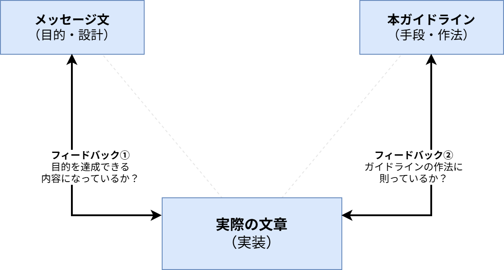

::: info 例: 「繋がり」に着目した具体的なフィードバックコメント

- **メッセージ文（目的）とのズレを指摘する**
  - **❌ NG :** 「この文章、よくわからないよ」
  - **✅ OK:** 「この文章は、◯◯と読めるけど、それってメッセージ文で狙っていることと合っている？」
- **ガイドライン（作法）とのズレを指摘する**
  - **❌ NG:** 「ガイドラインのとおり書いて」
  - **✅ OK:** 「この文章の◯◯の部分は、ガイドラインの◯◯という部分に沿ってないから直してね」

:::

### フィードバックする側の役割

書くという行為は、実際は書いたものを読んでなおすことの繰り返しである。しかし、書き手が自分自身の文章を「客観的な読み手の視点」で読むことは慣れないと難しい。

フィードバックする側の役割は、解像度の高い0番目の読み手として、「その文章が読み手にどう映るか」を報告することである。書き手はレビューを通じて読み手の視点を疑似体験し、次第に「読み手に伝わる解像度」を自分の中にインストールできるようになる。

::: info 例: フィードバックではないもの

- ❌️**NG**: 「わかりにくい」「ガイドライン読んでから書いて」
  - 読み手がどう映るかの情報が含まれないため、改善のヒントが含まれない
- ❌️**NG**:「わかりやすかった」「スッと入ってきた」
  - 肯定的な反応であっても、メッセージ文やガイドラインとの繋がりが示されておらず、再現性が生まれない

:::

これらは、フィードバックする側が、読み手としての責務を放棄している、あるいは、読み手としての力不足を露呈していると言える。フィードバックする側こそが、「解像度高く読める」読み手として鍛錬し、本ガイドラインを深く理解／実践できるようになる必要がある。

# 参考図書

- 照屋・岡田（2001）『ロジカル・シンキング』東洋経済新報社
- 木下是雄（1981）『理科系の作文技術』中央公論新社

# 謝辞

このアーキテクチャガイドラインの作成には多くの方々にご協力いただいた。心より感謝申し上げる。

- 作成者: 真野隼記、Tiffany Chan、高瀬陸、内堀航輝、宮崎将太、小橋昌明、亀井隆徳、戸井田拓斗、武田大輝、清水雄一郎、赤坂優太、澁川喜規、長谷川寛人
- レビュアー: 辻大志郎
