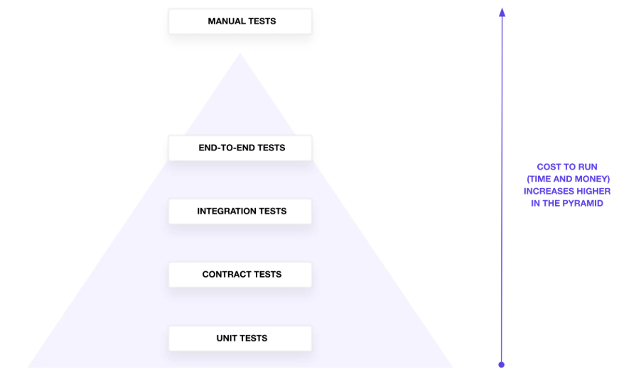

<page-title/>

本ガイドラインは、世の中のシステム開発プロジェクトのために無償で提供する。  
ただし、掲載内容および利用に際して発生した問題、それに伴う損害については、フューチャー株式会社（以下、フューチャー）は一切の責務を負わないものとする。  
また、掲載している情報は予告なく変更する場合があるため、あらかじめご了承いただきたい。

::: warning 免責事項: 有志で作成したドキュメントである

- フューチャーには多様なプロジェクトが存在し、それぞれの状況に合わせて工夫された開発プロセスや高度な開発支援環境が存在する。本ガイドラインはフューチャーの全ての部署／プロジェクトで適用されているわけではなく、有志が観点を持ち寄って新たに整理したものである
- 相容れない部分があればその領域を書き換えて利用することを想定している
  - プロジェクト固有の背景や要件への配慮は、ガイドライン利用者が最終的に判断すること
- 本ガイドラインに必ず従うことは求めておらず、設計案の提示と、それらの評価観点を利用者に提供することを主目的としている

:::

# はじめに

Terraformはインフラを宣言的にコード管理するツールであるが、特に大規模なシステムでは扱うリソース数が増え、必然的にTerraformコードも複雑化する傾向にある。Terraformの可読性が低下すると、作業効率の低下だけではなく影響度が大きいミスを誘発する懸念がある。

また、Terraformは活発に機能開発が継続されており新しい機能／記述方法もリリース毎に追加されている。これは嬉しい反面、新規開発者が悩むポイントも増えたと言える。関連して、チームやプロジェクトごとに設計方針が異なる場合も多く、Terraformの熟練者であってもそれぞれのコードベースに慣れるまで時間を要することも往々にしてある。

本ガイドラインは、各開発者が悩むポイントを軽減し、可読性や保守性、安全性を高めるルールをまとめ、設計のベースラインとするために作成された。それにより、生産性の向上・レビュー負荷の軽減・ナレッジやツールの横展開の支援・技術レベルの底上げを目指すものとする。

# 適用範囲

対象とする技術は以下を想定している。

- Terraform 1.10+
- OSS利用のみ（HCP Terraformは利用しない）
- AWS、Google Cloud、Azureなどのクラウドサービスに対しての利用

また、利用者は以下の技術を理解しているとし、本ガイドラインではこれらについて解説はしない。

- 基本的なTerraformの知識と理解
- Gitの基本的な知識
- CI/CDの基本的な知識

また、本ガイドラインの適用範囲は、Terraformの設計、開発時に利用することを想定している。クラウドサービス上の技術選定、サービス設計の手法については本ガイドラインで対象外とする。関連するドキュメントとして以下がある。適時参照すること。

::: info 参考

- [AWS設計ガイドライン](https://future-architect.github.io/arch-guidelines/documents/forAWS/aws_guidelines.html)
- [AWSインフラ命名規約](https://future-architect.github.io/coding-standards/documents/forAWSResource/AWS%E3%82%A4%E3%83%B3%E3%83%95%E3%83%A9%E3%83%AA%E3%82%BD%E3%83%BC%E3%82%B9%E5%91%BD%E5%90%8D%E8%A6%8F%E7%B4%84.html)
- [Gitブランチフロー規約](https://future-architect.github.io/coding-standards/documents/forGitBranch/git_branch_standards.html)

:::

# 用語について

- ルートモジュール
  - terraformコマンドを実行するディレクトリ上にある .tf リソース
- モジュール
  - 本ガイドラインでは、ルートモジュールから利用される子モジュールのことを指す

# 命名規則

2024年3月30日に、HashiCorp社から念願のスタイルガイド（[Style Guide | HashiCorp Developer](https://developer.hashicorp.com/terraform/language/style)）が発表された。

原則これに準ずることを推奨する。

例えば、以下のような記載がある。

- アンダースコア区切り（例: `example_variable_name`）
- リソース種別をリソース名に含めない
- リソース タイプと名前を二重引用符で囲む

✅ 良い点:

```tf
resource "aws_instance" "web_api" {...}
```

❌ 悪い例:

```tf
resource aws_instance webAPI-aws-instance {...}
```

# 基本文法

コーディング規約の基本的な内容を示す。

## コメント

ソースコードのコメントを入れる方法は3種類ある。

| #                         | （1） `#`                                        | （2） `//`                                        | （3） `/* */`                          |
| :------------------------ | :----------------------------------------------- | :------------------------------------------------ | :------------------------------------- |
| 説明                      | 1行のコメントを入れる場合に使われる              | `#` と同じ様に1行のコメントを入れる場合に使われる | 複数行のコメントを入れる場合に使われる |
| VS Codeショートカット利用 | ✅️複数行にまたがる場合でも、エディタの補完が効く | ー                                                | ー                                     |
| 公式ガイドの見解          | ✅️推奨                                           | ⚠️互換性のための存在                              | ⚠️互換性のための存在                   |

推奨は以下の通り。

- 公式の推奨通り、コメントは `#` を用いる
- 複数行にまたがる場合も、エディタの補完が効く`#` を利用する

## 変数

Terraformの変数には以下の2種類がある。

| #                    | （1）[Input Variables](https://developer.hashicorp.com/terraform/language/values/variables) | （2）[Local Values](https://developer.hashicorp.com/terraform/language/values/locals) |
| :------------------- | :------------------------------------------------------------------------------------------ | :------------------------------------------------------------------------------------ |
| 項目                 | Terraformの入力値を定義するために使用する。モジュールではほぼ必須で扱う                     | Terraform設定内でのみ使用される内部の値を定義するために使用する                       |
| 外部から上書き       | ✅️可能                                                                                      | ❌️不可                                                                                |
| 式の利用             | ❌️不可。他のVariableを参照しての新しいVariable定義や関数の利用不可                          | ✅️他のLocal Valuesから新しいLocal Valueを定義可能で、関数や式展開を利用可能           |
| 環境ごとの値切り替え | ✅️ `-var`、`-var-file`オプションか、`terraform.tfvars` か、環境変数 `TF_VAR_xxx` で指定する | ✅️マップなどで環境別に保持                                                            |

推奨は以下の通り。

- 外部からのインプットにしたい場合のみ、Input Variablesを利用する
  - バージョン管理可能とするため、環境変数 `TF_VAR` ではなく、 `-var-file` を利用する
- Input Variablesを利用する場合は、公式Style Guideにも記載している通り、全ての変数に `type` と `description` を含める
  - `terraform-docs` でドキュメントを生成可能となるメリットもある
- ファイル内で閉じて利用する変数は、Local Valuesを利用する

## コレクション型

Terraformではコレクション型として、tuple、list、map、objectといったデータ形式が提供されている。  
それぞれの特徴は以下の通りであり、用途に合わせて利用する形式を選択すること。

| #            | tuple              | list                                                            | map                                                                        | object                                                                     |
| :----------- | :----------------- | :-------------------------------------------------------------- | :------------------------------------------------------------------------- | :------------------------------------------------------------------------- |
| 説明         | 固定長の要素のペア | 同じ型で任意数の要素を保持                                      | キーと値のペア。タグのようなフラットな構造で利用                           | 異なる型のプロパティを持つ複数の属性を格納する。構造的なデータの場合に利用 |
| 宣言         | `["v1", "2"]`      | `["v1", "v2"]`                                                  | `{ k1 = "v1", 2 = "v2" }`                                                  | `{ attr1 = "v1", attr2 = "v2" }`                                           |
| 要素の参照   | `tuple[0]`         | `list[0]`                                                       | map["key"]                                                                 | `object.attr1`                                                             |
| 可変性       | ✅️不可変           | ⚠️可変                                                          | ⚠️可変                                                                     | ✅️不可変                                                                   |
| 型の混在     | ✅️可能             | ❌️不可 ※`list(any)`は互換性のために存在するため、原則使用しない | ❌️値の型が全て同じ ※`map(any)`は互換性のために存在するため、原則使用しない | ✅️可能                                                                     |
| for_each相性 | ❌️向かない         | ⚠️setに変換する必要                                             | ✅️良い                                                                     | ⚠️mapに変換する必要                                                        |

▼例: tupleの宣言（型混在）

```tf
variable "example_tuple" {
  type = tuple([string, number, bool])
  default = ["hello", 42, true]
}
```

▼例: listの宣言

```tf
variable "instance_types" {
  type    = list(string)
  default = ["t2.micro", "t2.small", "t2.medium"]
}
```

▼例: mapの宣言

```tf
variable "map" {
    default = {
        key1 = "value1"
        key2 = "value2"
    }
}
```

▼例: objectの宣言

```tf
variable "object" {
    type = object({
        key1 = string
        key2 = number
    })
    default = {
        key1 = "value1"
        key2 = 1
    }
}
```

またこれらは組み合わせて使用できる。

▼例: map(object)の宣言

```tf
variable "map_object" {
    type = map(object({
        key1 = string
        key2 = number
    }))
}
```

推奨は以下の通り。

- 並び順に意味を持ち、値の意味が不明瞭になりがちな、`tuple` は利用せず、代わりに`list` `map` `object` を利用する
- 値の型が固定化できない場合は、`map` ではなく `object` を利用する
- モジュールの引数には、キーが明示的に宣言できるため `map` ではなく `object` を利用する
- `list` `list(any)` は利用せず、 `list(string)` などの型宣言する
- `map` `map(any)` は利用せず、 `map(string)` などの型宣言する

::: info 参考
[Types and Values](https://developer.hashicorp.com/terraform/language/expressions/types#maps-objects)
:::

## any型

[Type Constraints](https://developer.hashicorp.com/terraform/language/expressions/type-constraints#dynamic-types-the-any-constraint) に 「anyは動的にデータを処理する場合にのみ使用する。それ以外では常に正確な型制約を記述する」とある。

推奨は以下の通り。

- 原則 `any` は利用しない
- できる限り、`object` など具体的な型に代替できないか考える（`any` では入力間違えする余地が増えてしまうため）

✅️ variableをobjectで定義

:::code-group

```tf [variables.tf]
variable "s3_buckets" {
  type = map(object({
    bucket_name = string
    acl = string
    versioning = object({
      enabled = bool
    })
  }))
}

resource "aws_s3_bucket" "buckets" {
  for_each = var.s3_buckets

  bucket = each.value.bucket_name
  acl    = each.value.acl

  versioning {
    enabled = each.value.versioning.enabled
  }
}
```

:::

:::code-group

```tf [terraform.tfvars]
s3_buckets = {
  bucket_name1 = {
    bucket_name = "my-logs-bucket"
    acl = "private"
    versioning = {
      enabled = true
    }
  }
  bucket_name2 = {
    bucket_name = "my-archive-bucket"
    acl = "private"
    versioning = {
      enabled = false
    }
  }
}
```

:::

❌️ variableにanyを安易に利用し、存在しないキーを指定してしまう例

:::code-group

```tf [variables.tf]
variable "s3_buckets" {
  type = any
}

resource "aws_s3_bucket" "buckets" {
  for_each = keys(var.s3_buckets)

  bucket = var.s3_buckets[each.key]["bucket_name"]
  acl    = var.s3_buckets[each.key]["acl"]

  versioning {
    enabled = var.s3_buckets[each.key]["versioning"]["enabled"]
  }
}
```

:::

:::code-group

```tf [terraform.tfvars]
s3_buckets = {
  bucket_name1 = {
    bucket_name = "my-logs-bucket"
    acl = "private"
    versioning = {
      enabled = true
    }
  }
  bucket_name2 = { # 存在しないキーを持つ
    bucket = "my-archive-bucket" # 誤ったキー名
    acl = "private"
    versioning_enabled = false # 誤った構造
  }
}
```

:::

## リソース属性参照

[References to Values](https://developer.hashicorp.com/terraform/language/expressions/references#references-to-resource-attributes) に記載があるように、 `{resource種別}.{resource名}.{属性}` の形式でリソース名を参照できる。

```tf
resource "aws_lambda_function" "foo_example_api" {
  # ...中略...
  environment {
    variables = {
      DYNAMO_TABLE_ORDER : aws_dynamodb_table.foo_example_order.name, # DynamoDBのテーブル名を環境変数に指定
    }
  }
}
```

推奨は以下の通り。

- ハードコードではなく、できる限りリソース属性参照を利用する
  - 存在しない値を指定してしまうというミスを減らすことが可能なため

## countとfor_each

動的に複数のリソースを作成する手段として、`count` がよく使われていたがいくつかの課題があった。2019年8月リリースの `v0.12.6` で `for_each` 構文が追加され、動的リソース作成の適用範囲が広がった。しかし、公式のStyle Guideには [count と for_each は控えめに使用する](https://developer.hashicorp.com/terraform/language/style#code-style) とあるように、込み入った作りにすると可読性は低下する。そのため使い所を考える必要がある。

| #                      | （1）count                                                                             | （2）for_each                                                                                                                     |
| :--------------------- | :------------------------------------------------------------------------------------- | :-------------------------------------------------------------------------------------------------------------------------------- |
| 説明                   | リソースやモジュールを特定の数だけ作成する場合に利用する                               | リソースやモジュールを一意のキーと関連付けて作成する場合に利用する                                                                |
| ステートの保持方法     | 配列                                                                                   | マップ（配列をfor_eachにわたす場合は、[toset](https://developer.hashicorp.com/terraform/language/functions/toset)する必要がある） |
| ループ時のアクセス方法 | [count.index](https://developer.hashicorp.com/terraform/language/meta-arguments/count) | [each.key, each.value](https://developer.hashicorp.com/terraform/language/meta-arguments/for_each#the-each-object)                |
| リソース削除時の挙動   | ❌️途中の項目を削除すると配列の詰め替えが発生し、再作成となる                           | ✅️ユニークなキーで管理するため問題ない                                                                                            |
| リソース追加時の挙動   | ❌️項目追加で配列の詰め替えが発生し、再作成となるため、<br>最後尾に追加する必要がある   | ✅️同上                                                                                                                            |
| キーの制約             | ✅️数値のみで特に注意点はない                                                           | ⚠️キーはknown value（plan時点で確定した値）である必要がある                                                                       |

推奨は以下の通り。

- 原則、 `count` ではなく `for_each` を利用する
  - `for_each` のキーにリソース属性参照した値を設定する場合は、依存する属性が常にknown valueである場合のみを許容する
  - `count` の利用は、リソース作成有無 (0/1) の場合にのみ絞る。例えば、ルートモジュール上でdev環境はリソースを作成しないといった定義に用いる

▼例: countの利用

```tf
resource "aws_instance" "foo_example_webapi" {
  count = "dev" == var.environment ? 0 : 1  # dev環境では作成しない
  # ...中略...
}
```

::: info 参考

- [Terraform の count と for_each の使い分け — tellme.tokyo](https://tellme.tokyo/post/2022/06/12/terraform-count-for-each/)
- [Terraformerとしてコードを書いて思うこと | フューチャー技術ブログ](https://future-architect.github.io/articles/20211029a/)
- [Terraform for_eachの堅牢な使い方 - Paper2 Blog](https://paper2.hatenablog.com/entry/2024/12/28/173440#%E9%87%8D%E8%A6%81%E3%81%AA%E5%88%B6%E7%B4%84%E3%82%AD%E3%83%BC%E3%81%AFknown-value%E3%81%A7%E3%81%AA%E3%81%91%E3%82%8C%E3%81%B0%E3%81%84%E3%81%91%E3%81%AA%E3%81%84)

:::

## for_eachの2重ループ

for_eachの2重ループは、次の2つのうちどちらかを指すことが多い。

1. for_eachを付けたリソースにおいて、[Dynamic Blocks](https://developer.hashicorp.com/terraform/language/expressions/dynamic-blocks) でfor_eachを使う方法
2. ネストした変数を元に、擬似的に多重のfor_eachを実現する方法

▼例: Dynamic Blocks で for_eachを用いる

```tf
locals {
  servers_with_ebs = {
    server1 = {
      name            = "server1"
      instance_type   = "t2.micro"
      ebs_block_device = [
        {
          device_name = "/dev/sdh"
          volume_size = 8
        }
      ]
    }
    server2 = {
      name            = "server2"
      instance_type   = "t2.small"
      ebs_block_device = [
        {
          device_name = "/dev/sdh"
          volume_size = 16
        }
      ]
    }
  }
}

resource "aws_instance" "example" {
  for_each = local.servers_with_ebs

  ami           = "ami-1234567890abcdef0"
  instance_type = each.value.instance_type

  dynamic "ebs_block_device" {
    for_each = each.value.ebs_block_device

    content {
      device_name = ebs_block_device.value.device_name
      volume_size = ebs_block_device.value.volume_size
    }
  }
}
```

（2）の下表で示す設計パターンがある。

| #          | flatten利用パターン                                                                                                                                           | module利用パターン                                                                                     |
| :--------- | :------------------------------------------------------------------------------------------------------------------------------------------------------------ | :----------------------------------------------------------------------------------------------------- |
| 説明       | ネストした構造を、[flatten](https://developer.hashicorp.com/terraform/language/functions/flatten)でフラットなSETまたはMAPに変換した後、for_eachを呼ぶパターン | 元のネストした構造のうち、呼び出し元で親要素のfor_eachを回し、module側で子要素のfor_eachを回すパターン |
| 設計難易度 | ✅️moduleを作らなくても済む分、楽である                                                                                                                        | ❌️module設計が必要                                                                                     |
| 可読性     | ❓️moduleが無い分、見通しは良い                                                                                                                                | ❓️フラット化した変数宣言がない分、見通しが良い                                                         |

▼例: flatten利用パターン

```tf
locals {
  instances = {
    "ap-northeast-1a" = [
      { name = "foo_app1", type = "t2.micro" },
    ],
    "ap-northeast-1c" = [
      { name = "foo_app1", type = "t2.micro" },
      { name = "foo_app2", type = "t2.micro" },
    ]
  }

  ec2_instances = flatten([
    for zone, instances in local.instances : [
      for instance in instances : {
        zone    = zone
        name    = instance.name
        type    = instance.type
      }
    ]
  ])
}

resource "aws_instance" "foo_example" {
  for_each = { for idx, val in local.ec2_instances : "${val.zone}-${val.name}" => val }

  ami               = "ami-1234567890abcdef0"
  instance_type     = each.value.type
  availability_zone = each.value.zone

  tags = {
    Name = each.value.name
  }
}
```

▼例: module利用パターン

:::code-group

```tf [main.tf]
locals {
  instances = {
    "ap-northeast-1a" = [
      { name = "foo_app1", type = "t2.micro" },
    ],
    "ap-northeast-1c" = [
      { name = "foo_app1", type = "t2.micro" },
      { name = "foo_app2", type = "t2.micro" },
    ]
  }
}

module "ec2_instances" {
  source = "./modules/multiple_ec2"

  for_each  = local.instances

  zone      = each.key
  instances = each.value
}
```

:::

:::code-group

```tf [modules/multiple_ec2/main.tf]
variable "zone" {
  type = string
}

variable "instances" {
  type = list(object({
    name = string
    type = string
  }))
}

resource "aws_instance" "example" {
  for_each          = { for idx, instance in var.instances : idx => instance }
  ami               = "ami-1234567890abcdef0"
  instance_type     = each.value.type
  availability_zone = var.zone

  tags = {
    Name = "${var.zone}-${each.value.name}"
  }
}
```

:::

推奨は以下の通り。

- for_eachを付けたリソースにおいて、Dynamic Blocks で for_eachを利用することの制限はない。可読性などを考慮して適切に利用すること
- ネストした変数の繰り返し処理は、原則、flattenを利用し、コードベースをシンプルに保つ
- モジュール化の是非は[モジュール](#モジュール)章を参考にする

::: info 参考
[Terraformでネストしたloopを書く](https://zenn.dev/wim/articles/terraform_nest_loop)
:::

## For Expressions

[For Expressions](https://developer.hashicorp.com/terraform/language/expressions/for)は式である。入力は `list` `set` `tuple` `map` `object` を受け付け、出力は `[ for ]` は `tuple` を、`{ for }` は `object` を返す。

▼例: リストからマップ `{"alice" = 5, "bob" = 3, "charlie" = 7}` を出力

```tf
variable "names" {
  type    = list(string)
  default = ["alice", "bob", "charlie"]
}

output "name_lengths" {
  value = { for name in var.names : name => length(name) }
}
```

`for` は `if` と組み合わせて使用できる。AND条件やOR条件も設定可能である。

▼複雑なforの例

```tf
locals {
  employees = [
    { name = "Alice", age = 28, department = "HR", experience = 3, full_time = true },
    { name = "Bob", age = 32, department = "IT", experience = 6, full_time = true },
    { name = "Charlie", age = 24, department = "IT", experience = 2, full_time = false },
    { name = "David", age = 29, department = "Finance", experience = 4, full_time = true },
    { name = "Eva", age = 35, department = "IT", experience = 4, full_time = true }
  ]

  # 従業員リストから以下のいずれかの条件に一致する従業員だけを抽出する：
  # - 年齢が30歳以上かつフルタイムの従業員
  # - 部門がITであり、かつ経験年数が5年未満の従業員
  filtered_employees = [for emp in local.employees : emp if (emp.age >= 30 && emp.full_time) || (emp.department == "IT" && emp.experience < 5)]
}

output "filtered_employees" {
  value = local.filtered_employees
}
```

推奨は以下の通り。

- for の乱用は可読性を下げるため、必要以上に利用しすぎない。特にif条件がAND/OR条件で複雑な場合は、複数のforに分割することも検討する
- for を用いて複雑な条件で作成された変数は、適時output しておき、後でトレース可能にする
- ロジックの条件は、コード上適切なコメントを入れる

# プロジェクト共通なタグ

AWS Providerではデフォルトのタグを設定できる。全てのリソースに振り下ろして良い内容である場合は、Provider側で定義することで、各リソース側の定義をシンプルに保つことができる。なお、各リソース側で同名のタグ名を指定した場合は、各リソース側の値が優先して使用される。

▼例: `default_tags` に共通的なタグを設定

```tf
provider "aws" {
  region = "ap-northeast-1"

  default_tags {
    tags = {
      Env     = "dev",
      System  = "Foo",
      Owner   = "FooTeam",
    }
  }
  ignore_tags {
    keys = ["StartAt", "EndAt"]
  }
}
```

推奨は以下の通り。

- プロジェクトで用いる共通的なタグはProvider側で定義する
- 共通的なタグの値の上書きは一部のリソースであれば許容する

::: warning Azure Providerのデフォルトタグ  
Azure Providerには2025年1月時点で、デフォルトタグのサポートが存在しない。  
[Support for Default Tags · Issue #13776 · hashicorp/terraform-provider-azurerm · GitHub](https://github.com/hashicorp/terraform-provider-azurerm/issues/13776)  
:::

::: info 参考

- [Terraform で構築した AWS リソースにタグを一括付与する方法 (default_tags) | yuu26-memo](https://blog.yuu26.com/terraform-aws-default-tags/)
- [かゆいところに手が届く、Terraformの書き方 (configuration_aliasesの使い方) - Qiita](https://qiita.com/kaedemalu/items/d148c86f901f654f2930)

:::

# IAM Policyの書き方（AWS）

[TerraformでIAM Policyを書く方法5つ | DevelopersIO](https://dev.classmethod.jp/articles/writing-iam-policy-with-terraform/) にあるように、IAM Policyの管理方法には複数の手法が考えられる。

| #                        | （1）JSONファイル                                                                                      | （2）ヒアドキュメント                              | （3）jsonencode                                     | （4）Data Source                                                                                                                                     |
| :----------------------- | :----------------------------------------------------------------------------------------------------- | :------------------------------------------------- | :-------------------------------------------------- | :--------------------------------------------------------------------------------------------------------------------------------------------------- |
| 説明                     | fileやtemplatefileの関数で、JSONファイルを読み取る方式。外出ししたJSONファイルを共有したい場合に有効。 | ヒアドキュメントでJSONを記載する方式。ファイル分割 | HCL形式でポリシーを記載し、jsonencodeで変換する方式 | Data Sourceの[iam_policy_document](https://registry.terraform.io/providers/hashicorp/aws/latest/docs/data-sources/iam_policy_document)を利用する方式 |
| 一覧性                   | ❌️別ファイル                                                                                           | ✅️同一ファイル                                     | ✅️同一ファイル                                      | ❌️別ファイル（リソース種別ごとにファイルを分ける方針に従った場合）                                                                                   |
| コードハイライト         | ✅️                                                                                                     | ❌️テキスト扱いのため                               | ✅️                                                  | ✅️                                                                                                                                                   |
| コメント                 | ⚠️`//` で可能                                                                                          | ⚠️`//` で可能                                      | ✅️可能                                              | ✅️可能                                                                                                                                               |
| エディタによるコード補完 | ❌️（JSON Schemaがあれば可能？）                                                                        | ❌️不可                                             | ❌️不可                                              | ✅️                                                                                                                                                   |

推奨は以下の通り。

- 一覧性は犠牲になるが、Terraformの文法や慣習に沿って開発ができる、（4）Data Source を用いる

# Data Sourceの引数に他のリソースを直接参照させない

[Terraformでコードを変更していないリソースが known after apply となってしまう場合にどうすればよいか - 電通総研 テックブログ](https://tech.dentsusoken.com/entry/2023/08/07/Terraform%E3%81%A7%E3%82%B3%E3%83%BC%E3%83%89%E3%82%92%E5%A4%89%E6%9B%B4%E3%81%97%E3%81%A6%E3%81%84%E3%81%AA%E3%81%84%E3%83%AA%E3%82%BD%E3%83%BC%E3%82%B9%E3%81%8C_known_after_apply_%E3%81%A8%E3%81%AA%E3%81%A3) にも記載があるように、[Data Sources](https://developer.hashicorp.com/terraform/language/data-sources#data-resource-dependencies) には以下の仕様がある。

- Data Sourceの引数が他のリソースを直接参照している場合、参照先のリソースがData Sourceの depends_on に含まれている場合と同じように扱われる
  - ≒ Data Sourceが直接参照しているリソースに変更がある場合、それらの変更が適用されたあと、Data Sourceの読み取りが再実行される
  - ≒ Data Source自体を変更していないのに、リソースが known after apply という差分が出てしまう

対応策は、[#data-resource-dependencies](https://developer.hashicorp.com/terraform/language/data-sources#data-resource-dependencies) に記載があるように、Local変数を経由すると良い。

推奨は以下の通り。

- Data Sourceの引数に他のリソースは直接参照させず、Local変数経由とする

✅️ EC2のパブリックIPをセキュリティグループで利用する場合に、Data SourceにはLocal変数経由で参照させる例

```tf
resource "aws_instance" "example" {
  ami           = "ami-1234567890abcdef0"
  instance_type = "t2.micro"
}

# Local ValueにリソースのIDを格納
locals {
  instance_id = aws_instance.example.id
}

# Data SourceでLocal Valueを参照
data "aws_instance" "example_info" {
  instance_id = local.instance_id
}

# セキュリティグループの定義
resource "aws_security_group" "example_sg" {
  # ... 中略 ...

  ingress {
    from_port   = 80
    to_port     = 80
    protocol    = "tcp"
    cidr_blocks = [data.aws_instance.example_info.public_ip + "/32"]
  }
}
```

❌️直接Data Sourceに他のリソースを直接参照した例

```tf
resource "aws_instance" "example" {
  ami           = "ami-1234567890abcdef0"
  instance_type = "t2.micro"
}

# Data Sourceで直接リソースを参照
data "aws_instance" "example_info" {
  instance_id = aws_instance.example.id
}

# セキュリティグループの定義（EC2に変更があった場合 known by apply が出る）
resource "aws_security_group" "example_sg" {
  # ... 中略 ...

  ingress {
    from_port   = 80
    to_port     = 80
    protocol    = "tcp"
    # Data Sourceから取得したパブリックIPを参照
    cidr_blocks = [data.aws_instance.example_info.public_ip + "/32"]
  }
}
```

# スタンドアローンリソースとインライン

[aws_route_table](https://registry.terraform.io/providers/hashicorp/aws/latest/docs/resources/route_table) のように、スタンドアローンのリソースと、インラインで定義できるリソースの2種類が提供されている場合がある。例であげたルートテーブルの場合は、共存が不可能であるためどちらかを選択する必要がある。

▼例1: スタンドアローンリソース

```tf
resource "aws_vpc" "example" {...}

resource "aws_internet_gateway" "example" {...}

resource "aws_route_table" "example" {
  vpc_id = aws_vpc.example.id
}

resource "aws_route" "example_route" {
  route_table_id         = aws_route_table.example.id
  destination_cidr_block = "0.0.0.0/0"
  gateway_id             = aws_internet_gateway.example.id
}
```

▼例2: インラインの例

```tf
resource "aws_vpc" "example" {...}

resource "aws_internet_gateway" "example" {...}

resource "aws_route_table" "example" {
  vpc_id = aws_vpc.example.id

  route {
    cidr_block = "0.0.0.0/0"
    gateway_id = aws_internet_gateway.example.id
  }
}
```

| #        | （1）スタンドアローンリソース                                                | （2）インライン                                                                  |
| :------- | :--------------------------------------------------------------------------- | :------------------------------------------------------------------------------- |
| 説明     | ルートが独立したリソースとして定義されるため、個々のルートを直接管理する方針 | ルーティングテーブルとそのルートが一か所にまとまっているため、関連性が明確である |
| 可読性   | ❌️ルーティングテーブルとルートが分かれているため、関連性は比較的把握しにくい | ✅️手動で操作したルールがある場合は、インラインルールの方が定義を見つけやすい     |
| 影響範囲 | ✅️ルートごとにリソースを個別更新できる                                       | ❌️ルート追加で、ルートテーブル全件を再作成するplan結果となる                     |

推奨は以下の通り。

- （1）スタンドアローンリソースを利用する
  - 可読性は多少低下するが、ルート追加などの作業で、余計な差分が出てしまい運用負荷が上がってしまうことを避けるため
  - クラスタリングソフトなど、IaC以外から変更がある場合は実用上（1）にする必要がある。そういった要件にも対応できるよう防御的にしたいため
  - インラインでdynamicブロックなどを用いてループさせる場合、パラメータがまして複雑になることを避けるため

::: info 参考
[r/aws_route_table vs r/aws_route - by shigemk2](https://www.shigemk2.com/entry/2023/11/17/193407)
:::

# 機密情報

APIアクセスキーやDBパスワードのような機微に扱うべき情報は、Git管理**外**（≒Terraformコード上に直接記述しない）で管理することが望ましい。Terraformにおける機密情報は以下の2パターンある。

1. Terraform外で生成された情報（例: 契約したSaaSサービスのAPIキー）
2. Terraformでインフラ構築する際に作成されるもの（例: `random_password` で生成したDBのパスワード）

それぞれの管理方針について説明する。

## Terraform外で生成された機密情報の扱い

Terraformでは機密情報をGit管理せずに扱うためのいくつかの機能や手法が存在する。

| #        | （1）環境変数                                                                                                                                         | （2）Data Sources                                                                                                                | （3）Ephemeral Value | （4）Terraform外で管理                                                                                                      |
| :------- | :---------------------------------------------------------------------------------------------------------------------------------------------------- | :------------------------------------------------------------------------------------------------------------------------------- | :------------------- | :-------------------------------------------------------------------------------------------------------------------------- |
| 説明     | `TF_VAR_{変数名}` という形式で、Terraform上の変数として利用可能。v0.14で追加された、sensitive属性をtrueにすると、terraform planのマスキング表示が可能 | data構文でシークレットストア（AWS Secrets Manager、GCP Secret Manager、Azure KeyVaultなど)の情報を指定し、実行時に認識させる方法 | v1.10で追加。        | 対象項目をignore_changesに指定し、tfファイルでダミーの初期値を指定、Terraform外（またはlocal-execなど）で目的の値に更新する |
| tfコード | ✅️除外可能                                                                                                                                            | ✅️除外可能                                                                                                                       | （調査中）           | ✅️除外可能                                                                                                                  |
| plan表示 | ✅️マスキング。sensitive=true                                                                                                                          | ❌️表示される                                                                                                                     | （調査中）           | ✅️除外可能                                                                                                                  |
| ステート | ❌️平文で保存                                                                                                                                          | ❌️平文で保存                                                                                                                     | （調査中）           | ✅️除外可能（※操作状況によってはstateに取り込まれる可能性は残る）                                                            |

推奨は以下の通り。

- ステートに機密情報を残しにくい、「（4）Terraform外で管理」を選択する

## Terraformでインフラ構築する際に作成された機密情報

Terraformを利用してパスワードなどの機密情報を作成する場合がある。下表のような分類が存在する。

| #        | （1）サービス組み込みの方法                                                | （2）[random_password](https://registry.terraform.io/providers/hashicorp/random/latest/docs/resources/password)   |
| :------- | :------------------------------------------------------------------------- | :---------------------------------------------------------------------------------------------------------------- |
| 説明     | AWS RDSにおける `manage_master_user_password` のような仕組みを利用する方法 | `random_password` は暗号化乱数ジェネレータを利用する。sensitive=trueで、`terraform plan` のマスキング表示が可能。 |
| 汎用性   | ❌️クラウドサービス側の対応次第                                             | ✅️一般的に利用が可能                                                                                              |
| tfコード | ✅️除外可能                                                                 | ✅️除外可能                                                                                                        |
| plan表示 | ✅️除外可能                                                                 | ✅️random_passwordの場合はsensitive無しで、マスキング可能                                                          |
| ステート | ✅️排除可能                                                                 | ❌️平文で保存                                                                                                      |

推奨は以下の通り。

- 可能であれば（1）を採用する
  - [Terraform で AWS に DB を構築するとき manage_master_user_password を使っていますか？](https://tech.dentsusoken.com/entry/terraform_manage_master_user_password) にあるようにAWS RDSは `manage_master_user_password` の利用する
  - [Azure Container AppsのSecret管理とIaC](https://zenn.dev/aishift/articles/01ac0622cff568) にあるように、Azureデータベースサービス は`Azure Key Vault Reference`を利用する
- （2）はステートに機密情報が残ってしまうため、それが許容できる場合のみに利用する。許容できない場合は「１．Terraform外で生成された機密情報の扱い」節を参考に、Terraform外で管理できないか検討する

::: info 参考

- [セキュアなTerraformの使い方 ～ 機密情報をコードに含めず環境構築するにはどうしたらいいの？ - Speaker Deck](https://speakerdeck.com/harukasakihara/sekiyuanaterraformfalseshi-ifang-ji-mi-qing-bao-wokodonihan-mezuhuan-jing-gou-zhu-surunihadousitaraiifalse)
- [[Terraform] 誤解されがちなignore_changesの動き・機密情報はstateに保持されるのか？ | DevelopersIO](https://dev.classmethod.jp/articles/note-about-terraform-ignore-changes/)
- [Terraform 1.10がGAになり、Ephemeral Valuesが使えるようになりました | DevelopersIO](https://dev.classmethod.jp/articles/terraform-1-10-is-now-generally-available/)

:::

# 削除保護

`terraform plan` で表示されるリソース数が多い場合に、本来削除すべきではないリソースを誤って削除（または、削除してからの再作成）してしまい、データ消失してしまうなどの懸念がある。そのため、影響度が大きいリソースに対しては、誤操作を防ぐためのガードレールを入れておくことが好ましい。

代表的な手法を下表にあげる。

| #              | （1）クラウドリソース上の削除保護を有効化                                                                                                                                                         | （2）lifecycleブロックの [prevent_destroy][r_lifecycle]を有効化                                                                                                                         | （3）IAM権限で保護                                                                                                            |
| :------------- | :------------------------------------------------------------------------------------------------------------------------------------------------------------------------------------------------ | :-------------------------------------------------------------------------------------------------------------------------------------------------------------------------------------- | :---------------------------------------------------------------------------------------------------------------------------- |
| 説明           | AWSでは、EC2、ALB、RDS、DynamoDBなどで、 [enable_deletion_protection][enable_deletion_protection] や[deletion_protection][deletion_protection] を有効にすると、一度無効化にしないと削除不可となる | `lifecycle {prevent_destroy = true}` を指定することで、リソースの再作成を伴うapplyをエラーで落とすことができる                                                                          | IAM権限で削除操作自体を制限する。特定のリソースのみ削除権限のハードルを上げる設計や、タグと組み合わせて保護する設計が存在する |
| 視認性         | ✅️管理コンソール上で、設定状況が確認可能                                                                                                                                                          | ⚠️Terraformコード上で確認                                                                                                                                                               | ❌️IAM権限と突き合わせが必要                                                                                                   |
| 汎用性         | ❌️対応しているリソースは一部である                                                                                                                                                                | ✅️任意のリソースに適用可能 <br> ✅️Terraform上で一貫性がある定義が可能                                                                                                                   | ✅️削除したくない任意のリソースに対する変更権限をなくすことが可能                                                              |
| ルールの強制力 | ✅️Terraform外の操作であっても有効                                                                                                                                                                 | ❌️Terraform操作のみが保護対象 <br> ❌️リソース定義がファイルに残っている場合のみ有効。リソース定義ごとファイルから削除した場合は、prevent_destroy=falseにしてapplyを経由せずに削除される | ✅️IAM権限で誤操作防止できるため、強い制約を適用できる                                                                         |
| 運用コスト     | ✅️クラウドプロバイダーが提供する機能で多くのユースケースに向いており、一律有効化しても害は少ない                                                                                                  | ❌️どのリソースに付与するか設計ポリシーが必要                                                                                                                                            | ❌️設計コスト、運用コストが高い <br> ❌️誤設定の懸念がある                                                                      |

[enable_deletion_protection]: https://registry.terraform.io/providers/hashicorp/aws/latest/docs/resources/lb#enable_deletion_protection-1
[deletion_protection]: https://registry.terraform.io/providers/hashicorp/aws/latest/docs/resources/db_instance#deletion_protection-1
[r_lifecycle]: https://developer.hashicorp.com/terraform/tutorials/state/resource-lifecycle

推奨は以下の通り。

- （1）に該当する削除保護は、一律有効に設定する
- （2）prevent_destroy=trueは1の削除保護が存在せず、かつ再作成がありえるが、再作成されたら困るリソースのみに設定する。例えば、AWSでは一部のEC2やAPI Gatewayなどが該当する。削除されたら困るかつ再作成されることはないリソースに対しては、視認性を下げるだけのため指定する必要はない
- （3）重要なS3バケットやVPCネットワーキング系が該当するが、IAM権限の設計が複雑化し、運用難易度が上がるためこれの利用は最低限に抑える

▼例: クラウドリソースの削除保護を有効化

```tf
resource "aws_db_instance" "important_db" {
  # 中略
  deletion_protection = true
}
```

▼例: prevent_destroy = true の例

```tf
resource "aws_s3_bucket" "important_bucket" {
  # 中略
  lifecycle {
    prevent_destroy = true
  }
}
```

::: info 参考

- [prevent_destroy does not prevent destruction when removing a resource from the configuration · Issue #17599 · hashicorp/terraform · GitHub](https://github.com/hashicorp/terraform/issues/17599)
- [terraform applyをより安全に実行するためにできること](https://blog.mmmcorp.co.jp/2022/10/31/terraform-apply-safely/) のように、タグとIAM権限で保護する手法がある
- [AWS S3でバケット自体も中身も削除禁止のバケットを作る - もりはやメモφ(・ω・ )](https://blog.morihaya.tech/entry/2019/02/02/112211) のように、本気で消したくないのは、IAM権限でRootアカウント以外は削除不可とする設計が可能

:::

# 環境分離

::: tip 環境識別子

[AWSインフラ命名規約 | Future Enterprise Coding Standards](https://future-architect.github.io/coding-standards/documents/forAWSResource/AWS%E3%82%A4%E3%83%B3%E3%83%95%E3%83%A9%E3%83%AA%E3%82%BD%E3%83%BC%E3%82%B9%E5%91%BD%E5%90%8D%E8%A6%8F%E7%B4%84.html#%E7%92%B0%E5%A2%83%E8%AD%98%E5%88%A5%E5%AD%90) から、環境識別子は以下の通り。本ガイドラインもこれに則る。

| 識別子 | 説明                  |
| :----- | :-------------------- |
| dev    | 開発環境(development) |
| stg    | 検証環境(staging)     |
| prod   | 本番環境(production)  |

:::

Terraformで複数のデプロイメント環境を切り替える方法は下表のように複数案存在する。ここでのバックエンド分離とは、ステートを環境ごとに別のオブジェクトストレージに配備することを指す。

| #                | （1）ディレクトリ分離                                                                                                                                                                         | （2）ワークスペース分離                                                                                                                                                                                            | （3）変数ファイル分離                                                             |
| :--------------- | :-------------------------------------------------------------------------------------------------------------------------------------------------------------------------------------------- | :----------------------------------------------------------------------------------------------------------------------------------------------------------------------------------------------------------------- | :-------------------------------------------------------------------------------- |
| 説明             | 環境ごとに異なるディレクトリを作成する方法。環境ごとに差分が大きくなりえる場合に有効。通常はモジュールと組み合わせることが多い。[Googleのベストプラクティス][google_practice]で推奨されている | Workspaceを利用し、同一構成で異なる状態を管理する方法。環境毎の差分が少なく抑えられる場合に有効。[公式][workspace]では単一のバックエンドを利用するときに利用するとあり、環境分離に用いることはやんわり否定している | 環境ごとに変数ファイルを用意し、apply時に指定する方法。`-var-file` 指定が少し手間 |
| 環境切替手段     | `cd dev`                                                                                                                                                                                      | `terraform workspace select dev`                                                                                                                                                                                   | `terraform apply -var-file="env/dev.tfvars"`                                      |
| 誤操作対策       | 環境名のディレクトリが表示されるよう、.bashrc などを調整                                                                                                                                      | .bashrcなどにワークスペース表示するロジックを追加                                                                                                                                                                  | ❓️ -var-file の環境名を確認                                                       |
| モジュール化     | ほぼ必須（ファイルコピーを抑えるため）                                                                                                                                                        | 任意                                                                                                                                                                                                               | 任意                                                                              |
| バックエンド分離 | ✅️可能                                                                                                                                                                                        | ✅️`terraform -chdir=env/dev init` で可能                                                                                                                                                                           | ✅️`terraform -chdir=env/dev init` で可能                                          |
| 柔軟性           | ✅️環境ごとに完全に分離されたファイルを持つため、カスタマイズが容易                                                                                                                            | ❌️全環境で同一の構成を保つ必要がある場合がある。countで微調整は可能                                                                                                                                                | ❌️全環境で同一の構成を保つ必要がある場合がある。countで微調整は可能               |
| 保守性           | ✅️モジュールを用いることで、環境毎に愚直にファイルコピーされることは無くなる                                                                                                                  | ✅️実体は全環境で1つにできるため、統制を図りやすい                                                                                                                                                                  | ✅️実体は全環境で1つにできるため、統制を図りやすい                                 |
| 設定値の一覧性   | ⚠️環境ごとにファイルが別                                                                                                                                                                      | ✅️locals.tf などに集約                                                                                                                                                                                             | ⚠️環境ごとにファイルが別                                                          |
| 環境間差異の確認 | ✅️main.tf をdiffで可能                                                                                                                                                                        | ⚠️countで環境切り替えの有無を確認                                                                                                                                                                                  | ⚠️countで環境切り替えの有無を確認                                                 |
| 環境増加の対応   | ✅️環境別のルートモジュールに対して、main.tf などのエントリーポイントを追加                                                                                                                    | ✅️ワークスペースを追加するコマンド実行で済む                                                                                                                                                                       | ✅️変数ファイルの追加のみ                                                          |

[google_practice]: https://cloud.google.com/docs/terraform/best-practices/root-modules?hl=ja
[workspace]: https://developer.hashicorp.com/terraform/cli/workspaces#when-not-to-use-multiple-workspaces

▼例: （1）ディレクトリ分離

```sh
infrastructure
┝ terraform
   ┝ aws
      ┝── env
      │   ┝── dev               # 環境単位
      │   │   ┝── app           # ステート単位
      │   │   │   ┝── main.tf   # module_name1～N を呼び出す
      │   │   │   └── xxxx.tf   # backend.tf、providers.tf、terraform.tf、locals.tf、variables.tf など
      │   │   └── network
      │   ┝── stg
      │   └── prod
      └── modules
          ┝── module_name1
          ┝── module_name2
          └── ...
```

▼例: （2）ワークスペース分離（（1）と比較すると、envフォルダ無し）

```sh
infrastructure
┝ terraform
   ┝ aws
      ┝── app             # ステート単位
      │   ┝── main.tf     # module_name1～N を呼び出す
      │   └── xxxx.tf     # backend.tf、providers.tf、terraform.tf、locals.tf、variables.tf など
      ├── network
      └── modules
          ┝── module_name1
          ┝── module_name2
          └── ...
```

▼例: （3）変数ファイル分離（（2）と比較すると、ステート単位にenvフォルダと.tfvarsが追加）

```sh
infrastructure
┝ terraform
   ┝ aws
      ┝── app             # ステート単位
      │   ┝── main.tf     # module_name1～N を呼び出す
      │   ┝── xxxx.tf     # backend.tf、providers.tf、terraform.tf、locals.tf、variables.tf など
      │   └── env
      │       ┝── dev.tfvars  # dev環境の変数ファイル
      │       ┝── stg.tfvars  # stg環境の変数ファイル
      │       └── prod.tfvars # prod環境の変数ファイル
      ├── network
      └── modules
          ┝── module_name1
          ┝── module_name2
          └── ...
```

推奨は以下の通り。

- （1）ディレクトリ分離 を選択する
  - ワークスペースを用いないため、Terraform の学習コストを多少なり下げることができる
  - 特定の環境だけにリソースを追加する必要がある場合、count分出来はなくルートモジュール側に追加できる脱出ハッチがあり、柔軟性がある
  - モジュールと組み合わせることで、デプロイメント環境ごとの統制も図りやすい
- ワークスペースを環境分離で利用することは公式ドキュメントの記述から非推奨である考えられるため
  - `count = var.environment == "dev" ? 0 : 1` といったコードの頻出により、可読性が低下するため
  - count制御の場合、どの環境にどのリソースがデプロイされているかの把握が、（1）のディレクトリ分離より下がるため

::: tip Terraform Stacks

- [Terraform Stacksの構成要素を図解してみる | DevelopersIO](https://dev.classmethod.jp/articles/terraform-stacks-illustration/)
- [Terraform Stacks の機能と使い方を紹介 - APC 技術ブログ](https://techblog.ap-com.co.jp/entry/2024/10/21/190000)

:::

::: tip ワークスペース分離を採用した場合  
過去の経緯などで（2）ワークスペース分離を採用しているチームも多く、実際これを採用して困ったという話もあまり聞かない。  
ワークスペース分離の場合、locals.tf は全環境で共用する。そのため環境別の値を保持する場合は以下の例にあるように、変数＞環境の順で定義する

▼Local Valuesの例

```tf
locals {
  ec_order_api = {
    log_level = {
      dev  = "debug"
      stg  = "info"
      prod = "info"
    }
  }
}

resource "aws_lambda_function" "example" {
  # ...中略...
  environment {
    variables = {
      LOG_LEVEL = local.ec_order_api.log_level[terraform.workspace]
    }
  }
}
```

:::

::: tip ワークスペース分離を採用した場合、ローカル変数の環境別管理
もし、locals、variableなどに環境情報をまとめる場合は、上記の順番で記載すること。

✅ 良い点:

```tf
locals {
  vpc_cidr = {
    dev  = "192.168.16.0/22"
    stg  = "10.177.16.0/22"
    prod = "10.175.16.0/22"
  }
}
```

❌ 悪い例:

```tf
locals {
  vpc_cidr = {
    prod = "10.175.16.0/22"
    stg  = "10.177.16.0/22"
    dev  = "192.168.16.0/22"
  }
}
```

:::

# マルチリージョン

マルチリージョン構成は以下の分類ができる。

| #    | （1）一部のサービスのみ利用                                                                                           | （2）待機系として構築                                                                        |
| :--- | :-------------------------------------------------------------------------------------------------------------------- | :------------------------------------------------------------------------------------------- |
| 説明 | us-east-1など一部のリージョンでのみ利用可能なサービスを利用するため、部分的に他リージョンでリソースを構築するパターン | BCP/DR対策として、メインのリージョンと同等のサービスを、WARM/HOTスタンバイさせておくパターン |

（1）の場合は、以下のように `alias` を指定できる。

```tf
provider "aws" {
  region = "ap-northeast-1" # メインリージョン
}

provider "aws" {
  alias  = "ue1"
  region = "us-east-1" # 別リージョン
}

# 実際にリソースに定義する場合
resource "aws_hogehoge" "sample_resource" {
  provider = aws.ue1
  ...
}
```

（2）の場合は、 [サービスの多国展開を支えるTerraform構成 | フューチャー技術ブログ](https://future-architect.github.io/articles/20240315a/) を参考にする。

::: info 参考

- [かゆいところに手が届く、Terraformの書き方 (configuration_aliasesの使い方) - Qiita](https://qiita.com/kaedemalu/items/d148c86f901f654f2930)
- [Terraform連載2024を開始します & TerraformにおけるDR戦略を考える | フューチャー技術ブログ](https://future-architect.github.io/articles/20240311a/)

:::

# ファイル粒度

ファイルをどの粒度で作成するかについて、複数の手法が存在する。

|            | （1）main.tf 集約                                                                              | （2）論理グループ化                                                                     | （3）リソース種別分離                                                                                                                             |
| :--------- | :--------------------------------------------------------------------------------------------- | :-------------------------------------------------------------------------------------- | :------------------------------------------------------------------------------------------------------------------------------------------------ |
| 例         | main.tf <br>---<br>backend.tf <br>providers.tf <br>terraform.tf <br>locals.tf <br>variables.tf | network.tf <br>storage.tf <br>db.tf <br>compute.tf <br>---<br> ・・・                   | s3_bucket.tf <br>s3_bucket_acl.tf <br>s3_bucket_cors_configuration.tf <br>---<br> ・・・                                                          |
| 説明       | main.tfにリソース定義を一括で記載するケース。                                                  | 何かしらの論理グループごとにmain.tfを分割したパターン。論理グループの作成粒度が肝となる | Terraformのリソース種別ごとにファイルを分割するパターン。例えば、S3バケットを新規作成する場合も、複数のファイルへ定義の追加が必要となる場合がある |
| 設計難易度 | ⚠️中規模以上ではモジュール運用が必須                                                           | ⚠️ファイル粒度の設計が必要。                                                            | ✅️容易                                                                                                                                            |
| 運用難易度 | ✅️容易                                                                                         | ⚠️論理グループの設計によっては、後で再設計が必要となる懸念                              | ✅️容易                                                                                                                                            |
| 拡張性     | ✅️モジュール運用前提であれば柔軟に拡張可能                                                     | ⚠️設計時の見積もり以内であればハマるが、想定外のリソース追加に弱い                      | ✅️最小粒度に近く、拡張に強い                                                                                                                      |

推奨は以下の通り。

- （1）main.tf 集約を採用する（公式ガイドに則り、`main.tf` `backend.tf` `providers.tf` `terraform.tf` `locals.tf` `variables.tf` などを作成する）
  - ルートモジュールは、「環境分離」がディレクトリ分離である限り、保守運用観点から原則子モジュールを呼び出す。子モジュールが適切な抽象化がなされていれば、リソース数は爆発しないはずである
  - 子モジュールは、モジュール標準構成に則ると（1）となる

::: tip もし環境分離にワークスペースを用いた場合  
もし環境分離にワークスペースを採用した場合は、ルートモジュールは（3）を、子モジュールは（1）を採用する。ワークスペース利用時は、環境毎のコード統制を取るために、モジュール化を行う積極的なモチベーションは低いと考えられる。そのため、リソース定義が増える傾向にあるためである。

（3）の粒度でファイルを作成したが、もしリソース数が多い場合は別の軸でファイルを分割したくなる。推奨は以下の通り。

- 機能分類など論理グループを元に分割を許容する。
  - 例: `lambda_function_foo.tf` と `lambda_function_bar.tf`
- ファイル分割に及ぶ前に、[リソースの宣言順](#リソースの宣言順) 章のグループ化でしのげないか検討する。ファイル分割は最後の手段とする

:::

# リソースの宣言順

[resource-order](https://developer.hashicorp.com/terraform/language/style#resource-order) に記載があるように、コード内のリソースの定義順はTerraformの実行に影響を与えず、読みやすいよう整理すると良い。Terraformのリソース定義の宣言順は、リソース間に依存関係があれば、依存関係の親から子の順番に記載することが望ましいとされる。リソース定義間の依存が存在しない場合の、宣言順は以下のパターンが考えられる。

| #      | （1）グループ化なし                                                                                     | （2）グループ化あり                                                                                                                                 |
| :----- | :------------------------------------------------------------------------------------------------------ | :-------------------------------------------------------------------------------------------------------------------------------------------------- |
| 説明   | .tfファイルに記載する際に、機能分類などの単位で論理的にグルーピングせず、作成しようとした順に並べる方式 | 機能分類などを元に、コメントなどを工夫しリソースの定義順をグルーピングする方式                                                                      |
| 可読性 | ❌️どこに何があるかわかりにくい                                                                          | ✅️わかりやすい                                                                                                                                      |
| 難易度 | ✅️容易である                                                                                            | ❌️どのような分類にするか設計の余地があり、後々破綻のリスクがある <br>❌️誤った分類に記載してしまうリスクがあり、チームメンバーの合意形成や教育が必要 |

推奨は以下の通り。

- .tfファイルあたり20を超えるなど、リソース数が多くなりそうであれば、機能分類などでグループを作り、コメントで区切る

▼例: コメントでAWS Lambdaを2つのグループに分類

```tf
# ==============================
# グループ 1: ユーザ管理機能
# ==============================

resource "aws_lambda_function" "user_create" {...}

resource "aws_lambda_function" "user_delete" {...}

# ==============================
# グループ 2: オーダー管理機能
# ==============================

resource "aws_lambda_function" "order_create" {...}

resource "aws_lambda_function" "order_cancel" {...}
```

グループ化の有無に関わらず、リソース定義の並び順についてはいくつかの方針が考えられる。

| #      | （1）作成順                              | （2）アルファベット順                    | （3）セマンティック                                            |
| :----- | :--------------------------------------- | :--------------------------------------- | :------------------------------------------------------------- |
| 説明   | リソースの定義は基本的に追記する方式。   | アルファベット順に並べる方式。           | 重要度順や、CRUD順など何かしらの意味を持たせる方式             |
| 可読性 | ⚠️場合によっては理解しにくい可能性がある | ✅️マネジメントコンソールに近い表示となる | ✅️ハマれば理解しやすい                                         |
| 難易度 | ✅️運用は容易                             | ✅️運用は容易                             | ❌️どのような順序にして意味をもたせるか、一定の設計スキルが必要 |

推奨は以下の通り。

- リソース間に依存関係があれば、依存関係の親から子の順番に記載する
- 原則、（1）の作成順で構築する
  - 通常、重要なリソースから順番に作成していくと考えられるため
  - 適切なグループ分けがなされている前提であれば、作成順で十分可読性が高いと考えられるため
  - アルファベット順にしてリソースを途中に差し込むと、Git上のdiffが見にくくなる割に、可読性などに大きく影響しないため
- `variables.tf` の変数は、アルファベット順に記載する
  - [Style Guide](https://developer.hashicorp.com/terraform/language/style#file-names) にそのように推奨されているため
- 以下のリソースの場合は、1に従う必要はない
  - Amazon CloudWatch Logsのように、ある別リソースに対となるようなリソースである場合は、親側のリソース順に合わせて記載する
  - 例えば、CloudWatch Logsの定義を忘れていて後で追加した場合も、親側のリソース順と同じになるように入れ替える

# リソースのパラメータ順

[resource-order](https://developer.hashicorp.com/terraform/language/style#resource-order) に記載がある順序に加え、一部拡張した記載順を推奨する。

1. 存在すれば、countやfor_each
2. リソースが定義するノンブロックパラメータ
   1. ノンブロックパラメータ同士は、マニュアルの記載順にする（★拡張部分）
3. リソースが定義するブロックパラメータ
4. lifecycle
5. depends_on
6. タグなど、全リソース共通的に指定可能なパラメータ（★拡張部分）

▼例: パラメータ順序の例

```tf
resource "aws_instance" "example" {
  count         = 2

  ami           = "ami-0c55b159cbfafe1f0"
  instance_type = "t2.micro"

  network_interface {
    device_index = 0
    network_interface_id = "eni-12345678"
  }

  lifecycle {
    prevent_destroy = true
  }

  depends_on = [aws_vpc.main]

  tags = {
    Name = "example-instance"
  }
}
```

# シンボリックリンク

Terraformのコード管理で、複数のステート間で共有したいリソース定義の管理目的で、シンボリックリンクを用いると便利な場合があるが、いくつかトレードオフが存在する。

| 観点   | シンボリックリンク導入による効果                                                                                           |
| :----- | :------------------------------------------------------------------------------------------------------------------------- |
| 整合性 | ✅️複数のステートで同一定義である必要があるファイルを、重複で作成すること無く一元的に管理できる                             |
| 可読性 | ❌️初見ではどこにシンボリックリンクが利用されているか、ドキュメントが無いと構造や依存関係を理解しにくい                     |
| 拡張性 | ❌️ステートごとにわずかに差異がある場合に、対応できない。その場合は、シンボリックリンクではなく、実ファイルに置き換えが必要 |
| 移植性 | ✅️相対パスで記載すればディレクトリ依存はしない。Windowsでも利用可                                                          |

推奨は以下の通り。

- シンボリックリンクのシンボリックリンクは禁止とする（可読性、保守性を維持するため）
- シンボリックリンクの元ファイルは、ルートフォルダか `shared` フォルダにあるファイルのみに限る
- シンボリックリンク可能なファイルは `terraform.tf` 、 `providers.tf`、のみとする
  - `providers.tf` も、`default_tags` がステート間で異なる場合は共有不可とする

▼例: シンボリックリンクの利用

```sh
infrastructure
┝ terraform
   ┝ aws
   ┝ env
       ┝ terraform.tf  # 一元管理させたい定義の実体
       ┝ providers.tf  # 同上
       ┝ dev
           ┝ terraform.tf -> ../terraform.tf
           ┝ providers.tf -> ../providers.tf
           ┝ network
           ┝ app
       ┝ stg
       ┝ prod

```

# ファイルレイアウト

[JSON Configuration Syntax](https://developer.hashicorp.com/terraform/language/syntax/json) にあるように、Terraform は `.tf` （HCL）だけではなく、JSONでも記載できる。この場合は、`.tf.json` という拡張子が推奨される。コード生成する場合、JSONの方が扱いやすい場合があるとされる。

推奨は以下の通り。

- 原則、JSON形式の出力は許可しない。`.tf` 形式で出力する
  - 出力したコードも、通常チームでコードレビューする必要があり、少しでも可読性を上げたいため
  - JSON形式でもコメントは `//` プロパティで可能だが、少し独自な仕様であるため（【参考】 [JSON Configuration Syntax](https://developer.hashicorp.com/terraform/language/syntax/json#comment-properties)）
- 以下の場合に全て該当する場合は、部分的に JSON形式を許容する
  - Terraformコードがツールから作成され、直接開発者がメンテナンスしない運用フローが確立されている場合
  - どうしても、 `.tf` （`.hcl`）形式の出力が難しい場合

# モジュール

モジュール（module）を用いることで、特定の構造を持ったTerraform構成ファイルを再利用可能にできる。ローカルモジュールとサードパーティモジュール（外部モジュール）の2通りを指すが、本ガイドラインでは特に明記しない限りはローカルモジュールを指すとする。本ガイドラインでは、環境分離にディレクトリ分離を推奨するため、それに則ると基本的にはモジュール形式でインフラを構築することになる。

## モジュールディレクトリ構成

[Standard Module Structure](https://developer.hashicorp.com/terraform/language/modules/develop/structure) に従い、以下の構成とする。ファイル粒度はリソース種別ごとにする必要はなく、`main.tf` に集約する。

▼推奨ディレクトリ構成

```tf
├── modules/                         # モジュールディレクトリ
    ├── module_name1/
    └── module_name2/
        ├── main.tf                  # 空であっても生成
        ├── variables.tf             # 空であっても生成（descriptionの記入が必須）
        ├── outputs.tf               # 空であっても生成（descriptionの記入が必須）
        ├── README.md                # ツールによって自動生成させる
        └── examples/
            └── example_usage/
                ├── main.tf          # 使用例の定義
                └── terraform.tfvars # 使用例の変数定義
```

::: tip ステートを分離した場合のmodules配下のディレクトリ設計  
`app` `network` などでステートを分離した場合、それぞれからしか呼ばれないモジュールが大半である。その場合、 `modules/app` `modules/network` といった構成を取りたくなるかもしれないが、フラットで管理する。モジュールの命名で区別がつくことが多いため支障は無い。  
:::

## モジュール化対象

モジュールをどのような粒度で作成すべきかの設計が必要である。観点としては再利用性などをはじめ、いくつかポイントがある。

推奨は以下の通り。

- デプロイ・破棄・更新頻度が同等である（≒ライフサイクルが同じである）リソースを同じモジュールとする
- ライフサイクルが異なるものは、将来的な拡張性を高めるためにモジュールを分離する
- 単一のリソースをラップしたモジュール（抽象度が低いモジュール）は作成しない（例えば、5～10リソース以上を目処とする。具体的な数値はチームごとに決定する）
  - モジュールの抽象度が低い場合は、環境毎の `main.tf` に直接記載する
  - ただし、for_each化したリソースから呼ばれている場合は1箇所から呼ばれていてもモジュール化を許容する
  - 全てモジュール化しようといった、原理主義化しない（良い抽象化が思いつかない場合は、環境毎のmain.tf に直接書いて良い）

## ネストモジュール

以下のようにモジュールから別のモジュールを読み込む事が可能である。これにより、コードがスリム化し開発初期の生産性を向上できる可能性がある。

▼モジュールから別のモジュールを読み込む例（modules/module_name1/main.tf）

```tf
module "module2_instance" {
  source = "../module2"
  # ...中略...
}

// 他のリソースの定義やモジュールの内容
resource "example_resource" "example" {
  name = "example_name"
}
```

推奨は以下の通り。

- [Module Composition](https://developer.hashicorp.com/terraform/language/modules/develop/composition#module-composition) にあるように、できる限りフラットなモジュール構成を採用する
  - モジュールから別のモジュールを読み込むことを原則、禁止する。モジュール変更による影響度調査を簡易化させる
  - 例えば、モジュールAとモジュールBの共通部分をモジュールCに切り出し、A、BからCを参照させることは行わない

## 入力設計

モジュールは入力パラメータによってカスタマイズ可能とできる。一方で、どこまで柔軟に対応すべきか検討の余地がある。また、入力チェックも記述可能である。

▼入力パラメータの例

```tf
variable "instance_count" {
  description = "デプロイするEC2インスタンスの数"
  type        = number
  default     = 1

  validation {
    condition     = var.instance_count > 0
    error_message = "インスタンスの数は1以上にする必要があります。"
  }
}
```

推奨は以下の通り。

- できる限り、入力パラメータの数を減らす（少なければ少ないほど良い）
  - 利用者の認知負荷を減らす・コードオーナーの保守運用負荷を減らす・実装の複雑度を下げる、という目的のため
- その上で入力パラメータは、できる限りデフォルト値を設定とし、パラメータ指定なしでも動くようにする
  - ただし、誤ったリソース作成がなされる可能性がある場合は、必須入力とすべきである
- 変数の型やdescriptionは明示的に記載する
- validationは可能な限り設定する

::: info 参考
[Terraform Module Designs - Speaker Deck](https://speakerdeck.com/tmknom/terraform-module-designs)
:::

## 機能配置

モジュール側にどの程度まで機能をもたせるか、議論が生まれる場合がある。よく出てくる内容を下表にまとめる。

| No  | 項目                                         | 対応方針                                                                                                                                                                                                                                                                                                                                                                                                            |
| :-- | :------------------------------------------- | :------------------------------------------------------------------------------------------------------------------------------------------------------------------------------------------------------------------------------------------------------------------------------------------------------------------------------------------------------------------------------------------------------------------ |
| 1   | 特定のデプロイメント環境だけ作成する、しない | モジュール定義側で、countによる切り替えはNGとする。呼び出し側で制御すること                                                                                                                                                                                                                                                                                                                                         |
| 2   | リソースがなければ作成するかどうか           | [Conditional Creation of Objects](https://developer.hashicorp.com/terraform/language/modules/develop/composition#conditional-creation-of-objects) に記載されている通り、モジュールが必要とするリソースが無い場合にモジュール側で作成させるのではなく、呼び出し元に作成させる。逆にアンチパターンは、モジュール側でリソースが存在するかどうかを判定してcountで切り替える形式だが、複雑になるためこの設計は不可とする |

## バージョン管理

ローカルモジュール（自リポジトリからのみしか参照しない）の場合は、バージョン管理の追加考慮は不要である（Gitで他のコードと同等に管理する）。

もし、作成したモジュールを公開（例えば、社内の他チームが利用できるようにプライベートリポジトリに公開）する場合は、バージョン管理が必要である。セマンティックバージョニング（major.minor.patch）を基本として、モジュールの外部仕様が変わった場合はmajorを、互換性がある変更の場合はminorを、バグ修正の場合はpatchバージョンを更新する。

## サードパーティモジュールの利用方針

[Terraform Registry](https://registry.terraform.io/) などで公開されているモジュールを利用すると、開発生産性や品質が向上する可能性がある。一方で、どのように活用するか方針が無いと設計の揺れが発生し、運用上の一貫性を欠いてしまう。

推奨は以下の通り。

- 原則、利用禁止とする
  - プロジェクト固有の拡張が必要な場合に、対応できないケースが多い
    - サードパーティモジュールからリソースの差異がある場合のハンドリングが難しいため
  - モジュールの削除、非公開化のリスクがある
    - コードのフォークなどで緩和可能だが、保守運用が発生しメリットが減少する
    - 予期しないモジュールの更新により、期待したリソースの作成ができなくなることを防ぐため
  - 可読性の向上のため
    - サードパーティモジュールは汎用的に書かれていることが多く、自身で不要なパラメータについてもチェック対象になりうるため
- 以下の条件に複数一致する場合は、利用を許容する
  - 技術検証（PoC）など限定された期間でのみ利用する
  - 何よりクイックなインフラ構築が優先される場合
  - サードパーティモジュールで作成できる構成をそのまま利用する場合

# カスタムメッセージ

[precondition、postcondition](https://developer.hashicorp.com/terraform/language/expressions/custom-conditions)を利用することで、事前条件、事後条件を設定できる。`validation`との違いを下表にまとめる。

| #              | validation                                             | precondition                                        | postcondition                                                                  |
| :------------- | :----------------------------------------------------- | :-------------------------------------------------- | :----------------------------------------------------------------------------- |
| 説明           | variable に1つ以上のvalidationブロックを利用して記載。 | 前提条件の検証をする場合に用いる。                  | リソースがある条件を満たしていることを保証するには、postconditionを用いる      |
| 導入バージョン | v0.13.0                                                | v1.2.0                                              | v1.2.0                                                                         |
| 記述可能な場所 | `variable`                                             | `resource` `data` `output`                          | `resource` `data` `output`                                                     |
| 参照可能な値   | 自身の値のみ                                           | 他のオブジェクトも参照可能                          | 他のオブジェクトも参照可能                                                     |
| 実行タイミング | `terraform plan`                                       | `known after apply` な値が無いなら `terraform plan` | `known after apply` な値が無いなら `terraform plan`                            |
| 失敗時の挙動   | `terraform plan` が失敗                                | `terraform apply`が失敗                             | 該当のリソースは作成され、自動で破棄されない。それ後続のリソース作成は停止する |

▼precondition、postconditionの例

```tf
resource "aws_instance" "example" {
  instance_type = "t3.micro"
  ami           = data.aws_ami.example.id

  lifecycle {
    precondition {
      condition     = data.aws_ami.example.architecture == "x86_64"            # x86_64のみ許容する例
      error_message = "The selected AMI must be for the x86_64 architecture."
    }

    # The EC2 instance must be allocated a public DNS hostname.
    postcondition {
      condition     = self.public_dns != ""                                    # DNSが必須にする例
      error_message = "EC2 instance must be in a VPC that has public DNS hostnames enabled."
    }
  }
}
```

推奨は以下の通り。

- `validation`
  - [モジュール](#モジュール) 章の入力設計の方針に従うこと
- `precondition`
  - `validation` に寄せることができる場合は `validation` でチェックする
  - `validation` でチェックが不可な、その他のオブジェクトを参照したチェックを行いたい場合に利用する
  - 原則、モジュールを開発する場合に利用する
- `postcondition`
  - できる限り、`validation` `precondition` 側にチェック処理を寄せる
  - 原則、モジュールを開発する場合に利用する

::: info 参考
[Terraform連載2024 Terraformにおける変数の制御について | フューチャー技術ブログ](https://future-architect.github.io/articles/20240313a/)
:::

# ステート保管方法

ステートファイルは誤削除や破損すると復旧が困難である。また[機密情報](#機密情報) 章のとおり、機微な情報が含まれる場合に備え、適切な管理が必要である。

ステートの保管方法として、ローカルまたはリモートステートの方法が考えられる。

| #        | （1）ローカル保存                                             | （2）リモートステート化                                  |
| :------- | :------------------------------------------------------------ | :------------------------------------------------------- |
| 説明     | 自PCのローカルディスクに保存する。Git管理と合わせることが多い | クラウドのオブジェクトストレージ等に保存する             |
| 手軽さ   | ✅️Backendの設定・構築が必要なくすぐに始められる               | ❌️事前にBackendとなるオブジェクトストレージの設定が必要  |
| 共同開発 | ❌️複数人で作業ができない                                      | ✅️複数人で同じ環境のステートを共有し共同開発できる       |
| 堅牢性   | ❌️破損・紛失の可能性大                                        | ✅️オブジェクトストレージの機能によりバックアップを行える |
| 機密性   | ❌️機微な情報が含まれるため漏洩の可能性が高まる                | ✅️オブジェクトストレージの権限設定で防御可能             |

推奨は以下の通り。

- （2）のリモートステート化が必須
- オブジェクトストレージにステートを保管する
- ステート専用のバケットを用意しアクセス権を適切に設定する（他用途のバケットに相乗りしない）
- バケットには削除保護や、バージョニング設定を必須とする（古いバージョンも改廃せず、無期限で良い）
- ロックを使用することを必須とする
  - 以前はロック機能を使用するためにDynamoDBが必要だったがv1.10から不要になった
  - （例）[Terraform v1.10 からは S3 Backend の State Lock に DynamoDB が必要なくなる](https://zenn.dev/terraform_jp/articles/terraform-s3-state-lock)

また、リモートステートの場合、デプロイメント環境ごとのステートファイルをどのように管理すべきか、中央集権型または分離型の方式が考えられる。

| #            | （1）中央集権型                                                                                                    | （2）分離型                                                                                                                        |
| :----------- | :----------------------------------------------------------------------------------------------------------------- | :--------------------------------------------------------------------------------------------------------------------------------- |
| 説明         | ステートファイルを一か所のストレージで集中管理する                                                                 | 環境別・ロール別で管理する。オブジェクトストレージも環境別に分離する                                                               |
| 管理コスト   | ✅️prod環境等で厳重に管理することでアクセス権限の管理を容易にする                                                   | ❌️管理対象が分散し手間が増える                                                                                                     |
| セキュリティ | ✅️prod環境等で厳重に管理することでアクセス権限の管理を容易にする                                                   | ✅️環境別にアクセス権を与えることで、きめ細かい権限管理を実現 <br> ✅️分散管理することで破壊的な操作や外部攻撃からの影響を限定できる |
| 柔軟性       | ❌️全環境、一律であるためデプロイメント環境によって、承認フローが同一とならざるを得ないため、開発推進の面でマイナス | ✅️開発環境だけ、手動でのデプロイを許容するといった柔軟な対応が可能                                                                 |

推奨は以下の通り。

- （2）の環境別(prod,stg,dev)に分けて管理する
  - CI/CDでの利用を想定すると相性が良いため

# ステートの粒度

同一デプロイメント環境に対して、ある論理的なグループに従ってTerraformのステートを分割することがある。  
ステートの分割は下表のようなメリット、デメリットがある。

| 観点             | ステートを細かく分割する                                                                                 | ステートを大きな単位で持つ                                             |
| :--------------- | :------------------------------------------------------------------------------------------------------- | :--------------------------------------------------------------------- |
| 実行速度         | ✅️早くなる                                                                                               | ❌️利用していないリソースのチェックも走るため、時間がかかる             |
| 並列作業         | ✅️ステートファイルごとに複数メンバーが異なる設計にできれば、コンフリクトなどが避けられ、作業効率が上がる | ⚠️作業がバッティングして同期的に作業する必要があるかもしれない         |
| 影響度調査       | ✅️上手く分割できていれば、調査範囲が限定できる                                                           | ⚠️何か不具合があった場合、調査範囲が広くなる傾向にある                 |
| セキュリティ     | ✅️ステートファイルごとにレビュープロセスや実行プロセスを柔軟に切り替えやすい                             | ⚠️一律の作業プロセスになりやすい                                       |
| リソース参照     | ❌️ハードコードになり、変更に脆弱である                                                                   | ✅️リソース参照可能で、terraform validateなどで早期に不整合の検知が可能 |
| 横断対応         | ❌️機能横断的な対応を入れる場合は、ステート数だけ作業を繰り返す必要がある                                 | ✅️一括対応が可能                                                       |
| バージョンアップ | ❌️分割する度に、対象が増加                                                                               | ✅️一括対応が可能                                                       |

ステートファイルの分割観点は例えば以下がある。

| 分割観点     | 説明                                                                                                                                                                                       |
| :----------- | :----------------------------------------------------------------------------------------------------------------------------------------------------------------------------------------- |
| 技術レイヤー | ネットワーク、アプリなどのレイヤーで分ける方針                                                                                                                                             |
| サービス観点 | システム内のサービスや論理コンポーネント単位で分ける方針。例えば、メインとなるアプリと、データ分析などチームが異なる場合は、デプロイしたいタイミングを含めライフサイクルが異なる場合が多い |

推奨は以下の通り。

- 以下の技術レイヤーごとに分離する
  - ネットワーク（共有部分）、システム管理（クラウドアカウント設定、踏み台）、各アプリケーションの3レイヤーで分割（あるいは、ネットワークとその他の2レイヤーに分割）。ネットワークなど一度作成したらめったに変更しないものと、アプリで利用するコンピュート系は、ライフサイクルが大きく異なるため、一緒にするべきではない
  - アプリで用いるコンピュート系リソースと、DB系リソースは分離する必要はない（結合度が高く、同じ単位で管理すると多くのケースで都合が良い）
- 開発チームが異なる（オーナーが異なる）場合は、ステートを分ける。同一チームで開発する場合は、ステートを分離する必要はない

以下に例を上げる。

▼構成例

```sh
infrastructure
┝ terraform
   ┝ aws
       ┝ dev
           ┝ network
           ┝ management
           ┝ app
           ┝ analysis
```

::: tip アプリケーション側のリソースから、ネットワーク 側のリソースを参照したい場合  
例えば、アプリとネットワークでステートを分離すると、アプリ側のリソースからネットワーク側のリソースを参照したい場合に、リソース属性参照ができなくなる。簡易的にはハードコードすることで解決可能だが、存在しないリソース名を指定しても気が付きにくいなど、保守運用上、課題が多い。

本ガイドラインは以下のように、[DataSources](https://developer.hashicorp.com/terraform/language/data-sources)（データソース）を利用することを推奨する。

✅️推奨例

```tf
data "aws_subnet" "foo_example" {
  filter {
    # タグ名でサブネットを取得する例
    name = "tag:Name"
    values = ["your-subnet-tag-name"]
  }
}
```

DataSourcesで [terraform_remote_state](https://developer.hashicorp.com/terraform/language/state/remote-state-data) を用いてリモートステートを参照する方法もあるが、異なるステートの参照権限が必要な点、ステート間の依存関係が強くなりステートの統廃合などの保守性が下がる点、呼び出される側のステートでoutput定義が必要な点などがあるため、非推奨とする。

❌️リモートステートの利用は非推奨

```tf
data "terraform_remote_state" "vpc" {
  backend = "s3"
  config = {
    bucket = "your-terraform-state-bucket"
    key    = "path/to/network/terraform.tfstate"
    region = "us-east-1"
  }
}

output "subnet_id" {
  value = data.aws_subnet.selected.id
}

data "aws_subnet" "foo_example" {
  id = data.terraform_remote_state.vpc.outputs.subnet_id
}
```

:::

# IaC対象領域

## リモートステートの保持バケット

リモートステートを管理するためのバケットは、 `terraform init` する前に必要であるため、通常はTerraform構築対象外とすることが多い。それゆえ、コンソール画面経由や、CLI経由で作成するチームも多い。一方で `backend=false` とし、ステートファイルをgit commitして管理することも考えられる。これを行うメリットは、インフラ構築をTerraformで統一することで、運用手順書などの作成を極小化できることなどがある。

▼リモートステートを保持するバケットの作成案

|                | （1）手組み                                                                                  | （2）backend無しのterraformコマンド経由                                                                                                                                                                                                                                                                                    |
| :------------- | :------------------------------------------------------------------------------------------- | :------------------------------------------------------------------------------------------------------------------------------------------------------------------------------------------------------------------------------------------------------------------------------------------------------------------------- |
| 説明           | バケットを手動（管理コンソールまたはCLI）で作成する方式                                      | Terraform経由で、リモートステート用のバケットも作成する方法。 `-backend=false` にし、ステートファイルはGitコミットする方式。ステートファイルをGitコミットするのは避けた方が良い手順だが、バケットのみであれば1人しか操作しないためまず問題ない。あとから、terraform init -backend-configでバックエンドを指定することも可能 |
| 構築コスト     | ✅️構築は楽である                                                                             | ❌️少しトリッキーな運用が必要                                                                                                                                                                                                                                                                                               |
| 引き継ぎコスト | ❌️バケットオプション（世代数やバックアップ設定）などの設定が、手順書などに記録する必要がある | ✅️構築手順書を最小化できる                                                                                                                                                                                                                                                                                                 |
| 一貫性         | ❌️CLIやシェルスクリプトなど、インフラ構築のパターンが増えてしまう                            | ✅️Terraform上に完結することができる（各種インフラ設定がTerraformコード上に残る）                                                                                                                                                                                                                                           |

推奨は以下の通り。

- （2）のbackend無しのterraform実行でバケットを作成する
  - 構築をできる限りコードベースで管理することの利点が大きく、デメリットが少ないため
  - 通常、複数の環境を構築する必要があるため、手動の手順を最小限にとどめておくことの利点が大きいため
- ただし、Terraform経由での構築に統一するというポリシーに魅力を感じない場合、実利的に（1）を選択しても良い

## Terraform構築対象

Terraformを用いてIaC化する利点は数多く存在するが、以下の条件に一致する場合はメリットが少ないのでは無いかと議論になる場合がある。

- インフラの変動がほとんど無く、ネットワーク関係のリソースなど誤って変更されるリスクがあるもの
- 一時的な用途で作成し、用事が済み次第すぐ削除するもの
- IAMユーザなど、メンバーの増減でTerraformコードの修正/レビュー/適用の負荷が高い場合

推奨は以下の通り。

1. 原則、prod環境に対しての全リソースに対してIaC化を必須とする
   1. クラウドリソースの状況がコード化されていることに価値があるため
   2. 運用引き継ぎなどを考慮し、一貫性のある構築手順に統一にしたいため
   3. 静的解析、一貫性のあるレビューフローにより、人為的ミスが入る余地を極力無くすため
   4. IaC化されていない野良リソースの混在を減らし、統制を図るため
2. dev環境などで試行錯誤を伴う構築については、管理コンソールやCLI経由での作成をしても良いが、最終的にはIaC化する
   1. 動作検証や疎通確認などは、仮説検証サイクルを早めるためにIaCを経由せずリソースの作成／削除をしても良い
   2. 検証が済み次第、IaC化する

上記に則り、冒頭の懸念に対しては以下の考えとする。

- ネットワークなどほぼ変動が無く、IaC化により予期せぬ変更リスクがあるケースについて
  - ライフサイクルが異なるリソースは、ステートを分け適切なフォルダに分離することや、ブランチルール、`CODEOWNERS` ファイルによるレビュアーの指名などの承認フローを踏むことでリスクを軽減する
- 一時的な用途で作成するもの
  - 一時的な用途であっても、Prodやそれに準じるデプロイメント環境において、定められた承認フローを踏まず作成して良いものは無いと考えられる
  - 一時的な用途だと当初想定していても、後日再び必要になる場合も多く、一度IaC化しておくことで後々楽になる場面も多い
- IAMユーザなど、ライフサイクルが異なるリソースについてIaC化のコストが高い点
  - どうしても負荷が高い場合も、ステートを分け適切なフォルダに分離、ブランチ運用を簡略化（例えば、featureブランチからリリース化とするなど）などのルールを設定する
  - ユーザの棚卸しは必ず、定期的に行う必要があるため、どのタイミングでユーザを追加したなどの証跡が、他のクラウドリソースと同様の形で残ることが望ましい

# Providerが対応していない場合

AWS、Google Cloud、Azureなどクラウドでは新機能が活発にリリースされ、上手く取り入れることが競争力に繋がる。TerraformのProviderも新機能が出る度に開発が行われるが、Providerが未リリースの機能を利用したい場合がある。もちろん、Provider側の開発にコントリビューションするなど様々な活動が考えられるが、業務では何かしらの手段で凌ぐ必要がある場合が多い。

このような場合は以下の対応案が考えられる。

| #          | （1）Terraform以外の手段で凌ぐ                                                                                                  | （2）terraform_dataとlocal-exec                                                                                 |
| :--------- | :------------------------------------------------------------------------------------------------------------------------------ | :-------------------------------------------------------------------------------------------------------------- |
| 説明       | Provider側の対応ができるまで、シェルスクリプト・Ansibleなどで管理する。Provider側が対応したら、過渡期対応のスクリプトを削除する | Terraformの `terraform_data` と `local-exec` プロビジョナを利用し、スクリプトを実行してリソースを作成・管理する |
| 構築コスト | ✅️構築の難易度が最も低く、急ぎ利用可能                                                                                          | ❌️Terraformのお作法に沿ったスクリプト設計が必要（destroyも実装するなど）                                        |
| 運用性     | ❌️インフラ構築がTerraformだけに閉じず学習コストや、運用手順書などのマニュアル化が求められる                                     | ✅️Terraformで一元管理が可能で、運用コストを下げられる                                                           |
| 学習コスト | ❌️Ansibleなどを利用する場合は、学習コストがかかる                                                                               | ⚠️terraform_dataの理解が必要                                                                                    |

推奨は以下の通り。

- 最新のバージョンでもProviderが対応していないは、（2）terraform_dataとlocal-exec を利用して構築する
- Providerが正規で対応している場合は、terraform_dataを利用せず正規の機能で定義する
- terraform_dataとlocal-execを利用する場合は、下表の設計ルールに従う

▼terraform_dataとlocal-execを用いる場合のルール

| No  | 項目                                                   | 説明                                                                                                                                                                                      |
| :-- | :----------------------------------------------------- | :---------------------------------------------------------------------------------------------------------------------------------------------------------------------------------------- |
| 1   | 実行コマンドが複数行になる場合は、別ファイルに切り出す | 複数行に及ぶ場合は、ヒアドキュメントではなく、スクリプトとして切り出す。1行のコマンドだけであれば、埋め込んでも良いが、オプションが長くなると可読性が長くなるため、別ファイル化を推奨する |
| 2   | スクリプトの格納場所                                   | `{.tfファイルがあるディレクトリ}/scripts/` 配下に統一                                                                                                                                     |
| 3   | ファイル名                                             | 作成: `create_xxx_resource.sh` 削除: `delete_xxx_resource.sh`                                                                                                                             |
| 4   | 権限                                                   | 実行権限を忘れないこと。特にWindowsユーザはGit上で権限情報もコミットすること。 `git update-index --add --chmod=+x [filename]`                                                             |
| 5   | スクリプトのLinter                                     | スクリプトには[ShellCheck](https://future-architect.github.io/articles/20210329/)などの静的解析をかける                                                                                   |
| 6   | terraform_data                                         | `terraform_data` の命名は一貫性を持たせる。例えば、`custom_xxx_resource` など                                                                                                             |
| 7   | パラメータは環境変数を利用                             | スクリプトに渡すパラメータは、環境変数として渡す                                                                                                                                          |
| 8   | destroyも対応する                                      | 作成だけではなく、削除も対応することで、環境の破棄も簡易的にする                                                                                                                          |
| 9   | トリガー                                               | スクリプトのハッシュ値が変更した場合にも対応する                                                                                                                                          |

▼null_resource+local-execの例

```tf
resource "terraform_data" "custom_xxx_resource" {
  provisioner "local-exec" {
    command     = "./scripts/create_custom_xxx_resource.sh"
    environment = {
      CUSTOM_PARAM = "my-fixed-value"
    }
  }

  provisioner "local-exec" {
    when        = destroy
    command     = "./scripts/delete_custom_xxx_resource.sh"
    environment = {
      CUSTOM_PARAM = "my-fixed-value"
    }
  }

  triggers_replace = [
    filehash("scripts/create_custom_resource.sh"),
    filehash("scripts/delete_custom_resource.sh")
  ]
}
```

::: tip null_resourceではなく、terraform_data を利用する  
terraform_dataはTerraform 1.4で追加された機能で、null_resourceと機能的に互換性があるとされる。組み込みであるためnull_resourceと異なりプロバイダーのインストールが無いなど、構成を少しばかりシンプルに保つことができる  
:::

::: info 参考
[Terraform v1.4のリリースノートを眺める | フューチャー技術ブログ](https://future-architect.github.io/articles/20230407a/)
:::

# バージョニング

## 新規開発時のバージョン選定

その時点の最新バージョンを利用すること。

## バージョン固定

Terraform上で管理すべきバージョンは以下2種類存在する。

1. Terraform自体のバージョン
2. Providerのバージョン

それぞれについて方針を記載する。

なお、モジュールについてのバージョンは[モジュール](#モジュール)章を参照すること。

### 1. Terraform自体のバージョン管理

Terraformはバージョンアップとともに、新しい構文や機能のサポートが追加されることが多く、チーム内で異なるバージョンを利用しているメンバーがいると、ある人の環境では動くが、他の人の環境では動かないといった問題がでてきてしまう。また、何かTerraformを用いたインフラ構築で不具合が出た際の再現性にも難があるため、利用バージョンの管理方式は重要である。例えば、以下のように `required_version` を指定することで、`1.10.0` 以上 `1.11.0` 未満であることを強制できる（※ `~>` の挙動については [Version Constraints](https://developer.hashicorp.com/terraform/language/expressions/version-constraints) を参照）。他にもバージョンの完全一致を求める `=1.10.0` や、一定のバージョン以上であればメジャーバージョン違いも許容する `>= 1.10.0` などを指定する流派がある。

```tf
terraform {
  required_version = "~> 1.10.0"
  required_providers {
    aws = {
      source  = "hashicorp/aws"
      version = "5.83.1"
    }
    http = {
      source  = "hashicorp/http"
      version = "3.4.5"
    }
  }
}
```

チーム編成にも寄るが、クラウドインフラは複数のチームを横断的に対応することも多く、チームごとにTerraformのバージョンアップの追随ポリシーが異なることもあるので、バージョン管理ツールを導入することがベターである。

バージョン管理については[tfenv](https://github.com/tfutils/`tfenv`) や [tenv](https://github.com/tofuutils/tenv)を用いることが多い。どちらも `.terraform-version` ファイルに以下のようにバージョンを記載することで、利用バージョンを固定する（`tfenv`を全員がインストールしていれば、バージョンを上げて`tfenv`上で新しいバージョンのTerraformのインストールを行ってくれる）ことができる。

▼.terraform-version の例

```tf
1.10.4
```

推奨は以下の通り。

- `required_version` での指定は、 `= x.y.z` のように完全一致させる
  - 実際に利用するバージョンは `.terraform-version` で制御するため、同期を取ることで不要な混乱を防ぐ
  - メンバー間やCI・ローカル環境間で、パッチバージョン違いによる挙動の差を無くす
  - メジャー、マイナー、パッチのどのバージョンアップでも、 `required_version` と `.terraform-version` の両方を変更するという運用で統一するため（パッチバージョンアップの場合は、 `required_version` の変更はしなくても良い、とすると手順漏れが出やすいため
- Windowsの場合はWSL上で開発する方針であることかつ、OpenTofuを利用しない場合は、枯れた`tfenv`を利用する
  - `tfenv`自体を更新する作業が発生した場合に面倒であるため、枯れた方が管理上、利便性が高い場面が多いため
  - `tfenv`で困る場合は、`tenv` を導入する

### 2. Providerのバージョン管理

公式のスタイルガイド（[Style Guide](https://developer.hashicorp.com/terraform/language/style#version-pinning)）では、Providerはメジャーバージョン、マイナーバージョンを固定することが推奨とある。

推奨は以下の通り。

- パッチバージョンまで完全一致で固定する
  - ローカルとCIなどのバージョン差異による、動作差異を極小化したいため
  - Terraform自体のバージョン管理と整合性を合わせたいため

コード例は「1. Terraform自体のバージョン管理」を参照すること。

## バージョンアップポリシー

Terraform自体は2～3回/年のペースで、新しいマイナーバージョンがリリースされる。 [Support Period and End-of-Life (EOL) Policy – HashiCorp Help Center](https://support.hashicorp.com/hc/en-us/articles/360021185113-Support-Period-and-End-of-Life-EOL-Policy) によれば、最新のマイナーバージョンから2リリース以内かつ最大2年間の範囲で、不具合修正や脆弱性対応がなされるとある。記事中にもベストプラクティスは、最新から2リリース以内のバージョンを利用することとある。

これとは別に、現場でよく採用されるバージョンアップの運用には以下3パターンが存在する。

| 観点         | （1）塩漬け運用                                                                                                                                                | （2）定次バージョンアップ                                                                                       | （3）常に最新バージョン追随                                                                                                                                                                                                                   |
| :----------- | :------------------------------------------------------------------------------------------------------------------------------------------------------------- | :-------------------------------------------------------------------------------------------------------------- | :-------------------------------------------------------------------------------------------------------------------------------------------------------------------------------------------------------------------------------------------- |
| 説明         | 基本的にはバージョンを固定し運用する。TerraformやProviderの新しいバージョンを利用する必要がある場合のみ、スポットの作業でバージョンを上げる                    | 1～4回/年の間隔で、定期的にバージョンアップする運用。予めバージョンアップ対応を計画時に埋め込みやすい利点がある | 最新のTerraformがリリースされ、周辺のエコシステムの対応が出揃ったタイミングでバージョンを上げるパターン                                                                                                                                       |
| 運用コスト   | ✅️最小である                                                                                                                                                   | ⚠️契約時や、当初作業計画に織り込んでおく必要がある                                                              | ❌️リリースタイミングが読み切れないことが多く、計画への組み込みがしにくい。利用するProvider種別によっては頻度も高い <br> ❌️Terraformリリースしてすぐのタイミングでは、不具合対応に寄るパッチリリースが多く、業務利用として安定性には懸念がある |
| 開発生産性   | ❌️新しい機能が使えず、AIコード支援範囲が低下、調査工数が余計にかかるリスク <br> ❌️VScodeのエクステンションによるバリデーションチェックと一致しなくなる         | ✅️一定間隔で新バージョンの利用が可能となり、生産性が高まりやすい                                                | ✅️最新機能を利用でき、開発生産性を上げることに繋げやすい <br> ❌️Terraformリリースしてすぐのタイミングでは、不具合対応に寄るパッチリリースが多く、業務利用として安定性には懸念がある                                                           |
| 作業難易度   | ❌️一度に大きくバージョンを上げることが多く、事故や予期せぬ不具合による調査工数がかかることが多い（それにより、さらにバージョンアップに消極的になる懸念がある） | ✅️影響度切り分けが比較的行いやすく、ナレッジ蓄積が可能                                                          | ✅️影響度切り分けが最も行いやすく、ナレッジ蓄積が可能                                                                                                                                                                                          |
| セキュリティ | ❌️脆弱性が含まれるバージョンを利用し続けるセキュリティ上のリスク                                                                                               | ⚠️一定の間隔で更新することで、リスク軽減できる                                                                  | ✅️常に最新のセキュリティ対応が入ったバージョンを利用できる                                                                                                                                                                                    |

推奨は以下の通り。

- （2）の一定周期でのバージョンアップ方式を採用する
  - セキュリティ観点でも、脆弱性が含まれるバージョンを使用し続けるのはガバナンス上、問題とされることが多い
  - 3ヶ月～半年程度の間隔で定期的に行うことで、経験を積み、バージョンを上げることに対して自信をつける
  - 一定間隔で組み込むことで、計画にも組み込みやすい
  - Terraform自体と、Providerの2つのバージョンを合わせて実施するか、あるいは交互に上げるなど、詳細なルールはチームにマッチした方法を検討すると良い

::: info 参考
[チーム開発におけるTerraformバージョンアップ戦略 - TECHSCORE BLOG](https://blog.techscore.com/entry/2023/12/15/080000)
:::

## 自動バージョン更新ツール

DependabotやRenovateを利用することで、TerraformやProviderの新しいバージョンが出たタイミングで、BOTからプルリクエストを作成させることができる。

推奨は以下の通り。

- バージョンアップは「バージョンアップポリシー」節で記載通り、定次で行う方針である。そのためBOTによるプルリクエスト通知は行わない
  - バージョンアップを行う時期を予め決めておくこと方針であるため、ノイズにしかならないため

::: info 参考
[Dependabot で Terraform Provider を自動的にアップデートしよう - kakakakakku blog](https://kakakakakku.hatenablog.com/entry/2024/02/29/215713)
:::

## バージョンアップ時の動作検証

Terraformについてはマイナーアップデートの対応がメインだと仮定する。リリースノートから変更内容を確認し、破壊的変更などが無いことを確認。そのうえで、dev、stgなど環境別にplan、applyで適用し、アプリケーションの動作に影響が無いことを確認したのち、prod環境に適用する。

作業フローは以下が参考になる。

▼[「楽」する前のTerraformバージョンアップ方針と運用整理（とポエム） - 東京ガス内製開発チーム Tech Blog](https://tech-blog.tokyo-gas.co.jp/entry/2024/05/07/113451) の記事から引用


# テスト

2023年10月にリリースされた v1.6.0で `terraform test` がリリースされた。これにより、サードパーティ製のテストフレームワークである [Terratest などを](https://terratest.gruntwork.io/)扱う場合より、容易にテストを実行しやすい環境が整ってきた。`terraform test` で用いる run ブロックは、commandフィールドの値によって、 `plan` の結果のみでテストを行うか、`apply` で実際にリソースを作成した値でテストを行うか決定できる。

:::code-group

```tf [s3_bucket.tf]
resource "aws_s3_bucket" "test001" {
  bucket = "${var.environment}-${local.project_name}-test001"
}
```

:::

:::code-group

```tf [s3_bucket.tftest.hcl]
run "test" {
  command = plan

  assert {
    condition     = aws_s3_bucket.test.bucket == "${}-${local.project_name}-test"
    error_message = "S3 bucket name did not match expected"
  }
}
```

[Testing HashiCorp Terraform](https://www.hashicorp.com/blog/testing-hashicorp-terraform) の記事によると、Terraformのテストは下図の分類がなされる。上位になればなるほど踏み込んだテストができるが、実行に時間がかかる。

▼Testing HashiCorp Terraform から引用したテストピラミッド



下表で自動テストの4分類についてまとめる。

| #            | （1）ユニットテスト                                                                                               | （2）コントラクトテスト                                                                                                                                                                                                                          | （3）インテグレーションテスト                                     | （4）エンドツーエンドテスト                                                                                                                                                                                                                        |
| :----------- | :---------------------------------------------------------------------------------------------------------------- | :----------------------------------------------------------------------------------------------------------------------------------------------------------------------------------------------------------------------------------------------- | :---------------------------------------------------------------- | :------------------------------------------------------------------------------------------------------------------------------------------------------------------------------------------------------------------------------------------------- |
| 別名         | 単体テスト                                                                                                        | 契約テスト                                                                                                                                                                                                                                       | 結合テスト                                                        | E2Eテスト                                                                                                                                                                                                                                          |
| 説明         | リソースやモジュールに対して、`terraform test` の `plan` モードで実行し、例えばリソース名などが想定通りか確認する | モジュールに対するテスト。Input variable validation や [Preconditions and Postconditions](https://developer.hashicorp.com/terraform/language/expressions/custom-conditions?product_intent=terraform#preconditions-and-postconditions) で検証する | 複数のTerraformモジュールやリソースが正しく連携して動作するか確認 | [Check blocks](https://developer.hashicorp.com/terraform/language/checks)を用いて構築したインフラリソースの検証を行う。例えば、特定のエンドポイントにHTTPリクエストを送信し、ステータスコードが200であることや、証明書の期限チェックなどを検証可能 |
| 記述方法     | .tftest.hcl ファイル                                                                                              | .tf ファイル                                                                                                                                                                                                                                     | .tftest.hcl ファイル                                              | .tf ファイル                                                                                                                                                                                                                                       |
| 利用コマンド | `terraform test` (command=plan)                                                                                   | `terraform plan` `terraform apply`                                                                                                                                                                                                               | `terraform test` (command=apply)                                  | `terraform plan` `terraform apply`                                                                                                                                                                                                                 |
| テストサイズ | Large（※モック化しない場合）                                                                                      | Large                                                                                                                                                                                                                                            | Large                                                             | Large                                                                                                                                                                                                                                              |

補足として、（4）エンドツーエンドテストで、以下のようなインフラ監視に近い項目も検知可能である。

- AWS Budgetsで予算を超過していないか
- IAMロールがN日以上、未使用な状態になっていないか
- GuardDutyで脅威が検出されていないか

しかし、上記の項目はインフラ監視の仕組みと重複するケースもあり、機能配置を検討する必要がある。

推奨は以下の通り。

- `terraform test` （ユニットテスト、インテグレーションテスト）に原則、頼らない
  - 通常、インフラ構築後にアプリケーションの動作確認を行い、要件を満たせれば良いはずである（逆に、Terraform上ではIaCとして想定通りの構築ができたとしても、アプリケーションが動かない場合は修正が必要となる）
  - プラットフォームエンジニアリングのように、特定のインフラ環境を生成するようなサービスを提供する。つまり、インフラ作成そのものが重要である場合は、`terraform test` を利用すると良い
- （1）ユニットテスト（※もし、実施する場合）
  - カレントディレクトリまたは、`tests/` にテストコードが配備可能だが、カレントディレクトリに配備すること
  - リソース種別単位のファイル名の規則に従っている場合、`s3_bucket.tftest.hcl` といったファイル名にする
  - テスト対象は、文字列結合や関数など複雑なロジックが入っているリソースやモジュールのみに絞り、テストコード量は必要最小限に絞ること（運用コストが高いため）
- （2）コントラクトテスト
  - [モジュール](#モジュール) 章の入力設計の方針に従うこと
- （3）インテグレーションテスト（※もし、実施する場合）
  - カレントディレクトリまたは、`tests/` にテストコードが配備可能だが、カレントディレクトリに配備すること
  - リソース種別単位のファイル名の規則に従っている場合、`s3_bucket.tftest.hcl` といったファイル名にする（ユニットテストと同一ファイルに混在することもありえる）
  - リソースを create & destroy するため非常にコストが高いため、できる限り作成しない
  - mockの扱いについては、学習コストが高いため、費用対効果をよく確認して利用する
- （4）エンドツーエンドテスト
  - インフラ監視と重複する項目はテストしない
    - terraformコマンドにインフラ構築で、保証したい内容のみを記述する。例えば監視側で検知すると、多くはチケット管理システムに起票され、運用フローに乗せて対応するが、terraform側のE2Eテストで検知した場合には、即時対応するか手動でチケット登録する必要があり手間である
  - 信用しすぎない
    - `terraform plan` や `terraform apply` で実行されるため、例えば証明書の期限チェックなどの用途で用いると、そのタイミングでterraformコマンドを実行している必要がある。プロジェクトライフサイクルによっては、リリース周期が長くなっている場合も考えられ、これに頼った運用は危険である。必要であれば別の仕組みで、定常運用化しておく必要がある
    - ※CI側で1日1回、 `terraform plan` を実施し、なにか検知すれば自動で管理システムに起票する仕組みを整えるなどで緩和可能であるが、目的に対して手段が重厚である

::: tip リンター  
テスト以外の品質の高め方としては、リンターを用いたセキュリティやポリシーの検証も行われている。[リンター](#リンター)章を確認すること。  
:::

::: info 参考

- [Test Sizes](https://testing.googleblog.com/2010/12/test-sizes.html)
- [Terraform連載2024 テストとモックを使ってみる | フューチャー技術ブログ](https://future-architect.github.io/articles/20240321a/)
- [Terraformテスト入門 - Speaker Deck](https://speakerdeck.com/msato/terraform-test)

:::

# 性能

`terraform plan` や `terraform apply` はコストが高い処理であり、特に手動操作で試行錯誤するタイミングでは想像以上に作業時間が膨れてしまうことが多い。3つの対応案が考えられる。本ガイドラインではいかに示す対応案を、適時取り入れて利用することを推奨する。

## リモートステートの最適化

`terraform state` などのコマンドで、リモートステートを分離／統合ができる。ある程度、インフラ構築が固まってきたタイミングで、変更タイミング（ライフサイクル）などを基に、リモートステートの粒度を見直すと良い。

▼リモートステートのpull、編集、push、削除が可能である

```sh
terraform state pull
terraform state mv {操作対象}
terraform state push
terraform state rm {削除対象}
```

::: info 参考

- [Command: state mv](https://developer.hashicorp.com/terraform/cli/commands/state/mv?optInFrom=terraform-io)
- [複数の Terraform リソースを一度に別の tfstate ファイルに移動する](https://zenn.dev/toshikish/articles/61db8661cb28ba)

:::

## terraform planで計画ファイルを作成

以下のようにすることで、`terraform plan` で作成した計画ファイルを再利用してapply実行速度を向上できる。

```sh
terraform plan -out plan.tfplan
terraform apply plan.tfplan
```

## 並列実行

次のように、並列オプション（デフォルト:10）が指定できる。環境にもよるが、20、30などの値を試してみても良い。

```sh
terraform plan --parallelism=20
terraform apply --parallelism=20
```

なお、 以下のように環境変数での指定も可能である。

```sh
$ export TF_CLI_ARGS_plan=20
```

# 権限管理

セキュリティなど様々な観点から、権限の扱いは「[最小権限の原則](https://ja.wikipedia.org/wiki/%E6%9C%80%E5%B0%8F%E6%A8%A9%E9%99%90%E3%81%AE%E5%8E%9F%E5%89%87)」が基本である。Terraformに関しては大きく分けて、plan、applyの2種類の実行タイミングがあり、planはプルリクエスト作成時にCI/CD上でエラーにならないことをチェックするなどの用途で実行頻度が高い。また、Terraformによるクラウドリソース構築は、planの場合はシステムが扱う全リソースの参照権限や、applyの場合は書き込み権限が必要であり、システム全体で非常に強力な権限を付与する必要がある。

terraformのplanやapplyの実行は、下表の権限付与の方針が考えられる。

|              | （1）最小権限の原則を追求                                                                                                                                                                                                    | （2）強めの権限を付与                                                                                 |
| :----------- | :--------------------------------------------------------------------------------------------------------------------------------------------------------------------------------------------------------------------------- | :---------------------------------------------------------------------------------------------------- |
| 説明         | 利用するクラウドリソースに絞って権限を付与する方式                                                                                                                                                                           | 利用予定のサービスを絞らず、予め全リソースの参照／操作可能な権限を付与する方式                        |
| セキュリティ | ✅️最もセキュアであると言える                                                                                                                                                                                                 | ❌️Terraform実行を行うサーバやアカウントが不正アクセスを受けた場合、より広範囲の被害に繋がる懸念がある |
| 安全性       | ✅️予期しないリソースの作成を防ぐことができる                                                                                                                                                                                 | ❌️tflintなど静的解析側や、レビューで防ぐ必要がある                                                    |
| 開発生産性   | ❌️新しいサービスを利用する度に権限見直しが必要であるため、開発生産性が下がる                                                                                                                                                 | ✅️権限不足によりリソース作成ができないといった事象を減らすことができ、開発生産性を高めやすい          |
| 難易度       | ❌️どのサービスを利用するか、Terraform構築前に一覧化しておく必要がある（AWSでは[Pike](https://github.com/JamesWoolfenden/pike)というツールで緩和可能） ❌️必要なリソース権限の全てを正確把握する必要があり、経験値が求められる | ✅️初級～中級者にも優しい                                                                              |

推奨は以下の通り。

- セキュリティインシデント調査時のためコンソールログイン用のアカウントとは別にterraform専用アカウントを用意する
- 特にCI上において、planとapplyの実行ロールは分離する
  - applyできる権限があればplanも可能だが、plan専用の権限を作成し両者を分離した方が、よりセキュアであると言える
- 同一デプロイメント環境における、リモートステートごとに、実行ロールを分けない
  - リモートステートはシステムのライフサイクルによって統廃合されることもあり、実行ロールが陳腐化しやすいため
  - ただし、リモートステートごとに所有者となるチームが異なる場合は、分離した方が良い
- 権限付与については、（2）の方式を許容する
  - Terraform実行のために本当に必要なサービスに絞り込むことは、コストが高く通常見合った効果が得られないため
  - ただし、インフラチームとアプリチームが分離しており、アプリチーム側に権限を払い出す場合は、（1）に寄せる方がベターである場合もある

AWSでterraform planのみ実行できるようにする例を示す。ReadOnlyAccessとS3のロック権限（conditional writesする権限）が必要である。

- ReadOnlyAccessのAWS管理ポリシー
- リモートステートのロック用に、以下のS3カスタムポリシー

```json
{
  "Version": "2012-10-17",
  "Statement": [
    {
      "Effect": "Allow",
      "Action": ["s3:ListBucket", "s3:GetObject"],
      "Resource": [
        "arn:aws:s3:::your-remote-state-bucket",
        "arn:aws:s3:::your-remote-state-bucket/*"
      ]
    },
    {
      "Effect": "Allow",
      "Action": ["s3:PutObject", "s3:DeleteObject"],
      "Resource": "arn:aws:s3:::your-remote-state-bucket/*"
    }
  ]
}
```

::: info 参考

- [Terraform v1.10 からは S3 Backend の State Lock に DynamoDB が必要なくなる](https://zenn.dev/terraform_jp/articles/terraform-s3-state-lock)
- [[AWS × Terraform] plan できるけど apply できない GitOps な IAM ユーザポリシーの設定方法 | DevelopersIO](https://dev.classmethod.jp/articles/terraform-iam-policy-not-apply-but-plan/)

:::

# Terraform実行環境

ローカル端末上で `terraform plan` や `terraform apply` を許容すると、開発生産性を上げやすいがセキュリティの懸念がある。CI/CDワークフローでTerraformでの操作を自動化すると、人為的ミスが混入するリスクを減らすことができるが、試行錯誤しながらインフラ構築したい場面では俊敏性が下がる。踏み台サーバ上でterraformコマンドの実行を絞ることのメリットも複数ある。実行環境ごとの特徴を下表で説明する。

| 項目           | （1）CI/CD内で実行                                                                                                                                                                 | （2）踏み台サーバで実行                                                                                                                                                                    | （3）ローカルPCで実行                                                                   |
| :------------- | :--------------------------------------------------------------------------------------------------------------------------------------------------------------------------------- | :----------------------------------------------------------------------------------------------------------------------------------------------------------------------------------------- | :-------------------------------------------------------------------------------------- |
| 説明           | 手動でのTerrafom操作を無くし、CI/CD上でterraformのplan、applyを実行する方法。Gitワークフローでレビュー承認済みのみリリースするなど、厳格に管理できる。2、3と組み合わせることが多い | 特定のIPアドレスからのみアクセスを許可するなどセキュリティを強化可能。デプロイメント環境ごとに踏み台サーバを用意することが多い（dev, stgは相乗りだったとしても、prodは分離する必要がある） | ローカルでTerraformコードを修正し、そのままplanやapplyが実行可能                        |
| 開発生産性     | ❌️試行錯誤を伴う構築には比較的不向き                                                                                                                                               | ✅️踏み台サーバ接続が少し程度                                                                                                                                                               | ✅️最速である                                                                            |
| 誤操作防止     | ✅️手動ミスを減らせる                                                                                                                                                               | ❌️awscli経由で直接操作可                                                                                                                                                                   | ❌️awscli経由で直接操作可 <br> ❌️Gitコミット無しで実行できてしまうなど、証拠が残りにくい |
| セキュリティ   | ✅️クレデンシャルの流出に強い                                                                                                                                                       | ✅️IP制限が可能 ✅️クレデンシャルの流出に強い                                                                                                                                                | ❌️他の案に比べてセキュリティリスクが高い                                                |
| 費用           | ❌️CI/CD費用                                                                                                                                                                        | ❌️踏み台サーバ費用                                                                                                                                                                         | ✅️                                                                                      |
| 引き継ぎコスト | ✅️CI/CDの定義ファイルがコミットされているため、明示的                                                                                                                              | ❌️手動操作が入る分、運用マニュアル化が必須                                                                                                                                                 | ❌️手動操作が入る分、運用マニュアル化が必須                                              |

推奨は以下の通り。

- 全てのデプロイメント環境において、ローカルPCでの `terraform apply` 操作は原則禁止として、（2）の踏み台サーバでの実行を基本とする
  - IP制限や証跡を残すことで、リスク軽減や緊急時対応を可能とする
- （2）の踏み台サーバはterraformの実行のみを許可し、他の作業では利用しない環境とする  
  (applyが実行できる権限はとても強い権限を持つため、当該サーバの利用はTerraform用途のみとし、他用途で利用されてないかの監視が必須なため。そのため、できるだけCI/CDを利用することを推奨する)
- ローカルPC上は、dev環境でのplan操作のみ許容する
  - 開発生産性のため
- CI/CD上でのplan、applyは開発生産性の観点で、できる限り取り入れる。これ1本に統一することは必須ではない
  - 詳細は[開発フロー](#開発フロー)章を参考にすること
- どの方法であってもAWSであればAWS Config、AWS CloudTrail等にて変更の証跡を保存し追跡できるようにすること

実行可能な操作を、Terraform実行環境別にまとめると下表となる（凡例 ✅️実行可能 ❌️実行不可）

| 環境                            | dev      |           | prod     |           | 説明                                                                                                                                                                          |
| :------------------------------ | :------- | :-------- | :------- | :-------- | :---------------------------------------------------------------------------------------------------------------------------------------------------------------------------- |
|                                 | plan実行 | apply実行 | plan実行 | apply実行 |                                                                                                                                                                               |
| 1. ローカルPC                   | ✅️       | ❌️        | ❌️       | ❌️        | planのみ可能                                                                                                                                                                  |
| 2. 踏み台サーバ（環境毎に分離） | ✅️       | ✅️        | ✅️       | ✅️        | 手動での実行は踏み台サーバを経由することで、IP制限や証跡を残す。ローカルPCでapplyが可能であると抜け道となるため、許容させない                                                 |
| 3. CI/CD                        | ✅️       | ✅️        | ✅️       | ✅️        | 必要に応じて、CI/CDに組み込む。CI/CDでprod環境までapply可能にすると、踏み台サーバ側の権限が不要に見えるが、緊急対応のため、手動操作の脱出ハッチも残しておくほうがベターである |

## CI/CD内で実行

GitHub ActionsなどのCI/CDパイプラインでのterraformコマンドを実行するためには、何かしらの手段で認証する必要がある。代表的な方式に以下の2つの方法がある。

|              | （1）環境変数による連携                                                                                                                                                                        | （2）OpenID Connect連携                                                                                                                                              |
| :----------- | :--------------------------------------------------------------------------------------------------------------------------------------------------------------------------------------------- | :------------------------------------------------------------------------------------------------------------------------------------------------------------------- |
| 説明         | CI/CDパイプラインに必要なクレデンシャルやアクセスキーを環境変数として設定する                                                                                                                  | CI/CDパイプラインにクレデンシャルを直接渡さずに、OIDC連携でIAM ロールが使えるようにさせる方式                                                                        |
| 初期構築     | ✅️直感的であり最も容易                                                                                                                                                                         | ❌️比較すると複雑である                                                                                                                                               |
| セキュリティ | ❌️CI/CD上の環境変数が、他のユーザから想定外のアクセスや、ログなどに誤出力される懸念がある <br> ❌️登録した環境変数が、別の想定外のCI/CDパイプラインでも利用される懸念があるが、その検知が難しい | ✅️クレデンシャルの保存が不要となり、利用するトークンは一時的に発行されるものであるため、不正利用のリスクを低減可 <br> ✅️特定のブランチに限定するなど細かな制御が可能 |

推奨は以下の通り。

- （2）のOpenID Connectを利用する。初期構築コストは少しばかり高いかも知れないが、一度対応すればそれ以降の運用コストは高くないため

::: info 参考
[Terraform とGitHub Actions | フューチャー技術ブログ](https://future-architect.github.io/articles/20230405a/)
:::

## 踏み台サーバで実行

監査ログなど必要な証跡を残すといった対応のため、特定のデプロイメント環境に対する `terraform apply` はAWSにおけるEC2サーバ上でのみに絞るといった運用を取る場合がある。このときは以下の設定や構成にすることを推奨する。

- 作業用ユーザは利用者毎に作成する（共有アカウントを使用しない）
- 認証はEC2にIAMロールをアタッチする（個別のアクセスキーなどを利用しない）

## ローカル端末で認証

ローカルPC上で `terraform plan` や `terraform apply` を、どのデプロイメント環境まで許可するかは、[Terraform実行環境](#terraform実行環境) 章を参考にする。仮にローカルPC上で実行を許容する場合は、利用するアクセスキーは強い権限を保持することとなる。そのためキーの漏洩はリスクが高く、安全なキーの保管や認証が必要である。各クラウドサービスのプラクティスは下表の通り。

| #        | AWS                             | Google Cloud                                                | Azure                                                                                                         |
| :------- | :------------------------------ | :---------------------------------------------------------- | :------------------------------------------------------------------------------------------------------------ |
| MFA化    | ✅️必須                          | ✅️必須                                                      | ✅️必須                                                                                                        |
| 認証手法 | 対話型ログイン(aws login)を使用 | 対話型ログイン(gcloud auth application-default login)を使用 | 対話型ログイン(az login)を使用する。サービスプリンパル <クライアントシークレット or X509 証明書> は使用しない |

::: tip MFA化  
Terraformに限った話ではなく、クラウドのアカウント認証はMFAを取り入れておくことが望ましい。  
:::

::: info 参考

- AWSはこれまでシークレットアクセスキーを使用する方法が一般的だったが、「aws login」コマンドがリリース(2025/11/20)されたためプラクティスを変更

:::

# 開発フロー

Terraformを用いたGitブランチフローの例を下図で示す。図で示すように、どのブランチにマージされることが（あるいはGitタグが作成されることが）、どのデプロイメント環境に `terraform apply` することを示すかを定める必要がある。また、プルリクエストの前後で `terraform apply` まで行うべきかどうかといった論点もある。


Gitブランチフローの詳細は、[Gitブランチフロー規約 | Future Enterprise Coding Standards](https://future-architect.github.io/coding-standards/documents/forGitBranch/git_branch_standards.html#terraform%E3%81%AF%E3%83%AC%E3%83%92%E3%82%99%E3%83%A5%E3%83%BC%E4%BE%9D%E9%A0%BC%E6%99%82%E7%82%B9%E3%81%A6%E3%82%99%E3%81%A8%E3%82%99%E3%81%93%E3%81%BE%E3%81%A6%E3%82%99%E7%A2%BA%E8%AA%8D%E3%81%97%E3%81%A6%E3%81%8A%E3%81%8F%E3%81%B8%E3%82%99%E3%81%8D%E3%81%8B) を確認すること。

推奨は以下の通り。

- CI/CD時にdev環境に対して、 `terraform apply` を実行し、予期しない差分が無いか、プランが想定通りか開発者とレビュアー双方が確認可能とする
- CI/CDで、プルリクエスト作成時に、静的解析（`terraform validate` `tflint` `trivy`）などを実行する。[リンター](#リンター)章を参照する
- developブランチマージ後は、CI/CDでdev環境に `terraform apply` する
- mainブランチマージ後、ステージング環境に `terraform apply` する
- ステージングでの動作確認が問題なければ、プロダクション環境に `terraform apply` する

## VS Code拡張

2025年1月時点での推奨を紹介する。

| ツール                                                                                                                     | 説明                                                                                                          |
| :------------------------------------------------------------------------------------------------------------------------- | :------------------------------------------------------------------------------------------------------------ |
| [HashiCorp Terraform - Visual Studio Marketplace](https://marketplace.visualstudio.com/items?itemName=HashiCorp.terraform) | HashiCorp社が提供する公式ツール。コードハイライト、補完、検証、フォーマットなど総合的に開発支援を行ってくれる |

## フォーマッタ

[terraform fmt](https://developer.hashicorp.com/terraform/cli/commands/fmt) を利用する。`-recursive` オプションで、再帰的にフォーマットが可能である。

▼フォーマット実行例

```sh
terraform fmt -recursive
```

## リンター

`terraform fmt` に従っているかは、 `-check` オプションで確認が可能である。CIで未フォーマットの場合に落としたい場合は利用すると良い。 `terraform validate` は必須で実行する。`tflint`は必須で実行する。`tfsec` は `trivy`の移行を推奨しているため利用しない。`trivy` は`CRITICAL` `HIGH` は最低でもチェックする。

▼リンター実行例

```sh
terraform fmt -check
terraform validate
tflint
trivy --exit-code 1 --ignorefile .trivyignore.yml config --severity CRITICAL,HIGH ./
```

[KICS](https://docs.gitlab.com/ee/user/application_security/iac_scanning/)(IaC脆弱性コードチェック) の実行は必要に応じて追加する。

::: tip ワークスペース利用の場合  
[TF_WORKSPACE](https://developer.hashicorp.com/terraform/cli/config/environment-variables#tf_workspace) の環境変数で利用しているTerraform ワークスペースの設定ができる。ワークスペースを利用している場合は `dev` をチェックする。

```sh
TF_WORKSPACE=dev terraform validate
TF_WORKSPACE=dev tflint
```

:::

## コミットフック

[Style Guide](https://developer.hashicorp.com/terraform/language/style#code-style)に、コミット前に [Git pre-commit hooks](https://git-scm.com/book/en/v2/Customizing-Git-Git-Hooks) で `fmt` と `validate` の実施が推奨とある。その他のリンターを加えると、待ち時間が長くなるため、最低限にする。validateは実行速度が気になる場合はdevのみに絞っても良い。

▼コミットフックで実行するコマンド例

```sh
terraform fmt
terraform validate
```

pre-commitの構築は、 [pre-commit](https://terraform-docs.io/how-to/pre-commit-hooks/) を利用しても良い。利用しない場合は、以下のような手順を踏む。

1. `.githooks/pre-commit` フォルダにスクリプトを追加し、gitコミット
2. `chmod +x .githooks/pre-commit` で権限付与
3. `git config --local core.hooksPath .githooks` でコミットフックのパスを設定

## CI/CD

「開発フロー」に記載したように、なるべく自動化することを推奨する。また、[terraform-docsでドキュメントの自動生成 - とことんDevOps](https://devops-blog.virtualtech.jp/entry/20230310/1678416395)  
 のように、ドキュメント生成もCIサービス上で行うことが望ましい。

プルリクエスト時のCIチェック内容は、[Anonymized, secure and free Terraform Cost Estimation](https://github.com/antonbabenko/terraform-cost-estimation) といったコスト観点も存在する。適宜取り入れること。  
また、必要に応じて、[tfprovidercheck - 危険な Terraform Provider の実行を防ぐ 仕組み](https://zenn.dev/shunsuke_suzuki/articles/tfprovidercheck-introduction)を導入する。

# targetの使い所

`terraform apply` 時に `--target` オプションを付けることで、操作対象のリソースを絞り込むことが可能となる。複数のリソースを指定する場合は、`{}`内にカンマ区切りで設定できる。

```sh
terraform apply --target={aws_instance.example1,aws_security_group.example2,aws_s3_bucket.example3}
```

`--target` を指定することは、柔軟なapplyが可能となるが、以下のデメリットが存在する。

- Git側のコードベースと、デプロイされたインフラリソースに差異が発生し、一貫性が損なわれる
- `terraform apply` 時の運用コストが増大する（どのリソースを--targetで絞り込むべきか考慮が必要かつ、targetの記載ミスも考えられる）
- 属人化が進む

推奨は以下の通り。

- featureブランチからterraform applyをするGitブランチ運用になっている場合、dev環境においては、target運用を許容する
- 原則、stgはtargetによる絞り込みを許可しない
  - stgで動作確認を長期間行う必要がある場合など一時的とし、恒常的な運用としない
- いかなる場合も、prod環境では、targetによる絞り込みは許可しない
  - コードベースとインフラリソースの一貫性を重視する。もし、applyしたくないリソースがコミットされていれば、それを削除する方があるべきである

::: tip for_eachのリソースを指定する場合、  
`-target` 指定するときに for_each のキーを指定すると、ダブルクオーテーションが悪さしてエラーになってしまうハマりどころがある。これを回避するためには、`-target='aws_instance.foo_example_webapi["test"]'` のようにシングルクオーテーションをダブルクオーテーションで囲う必要がある。  
:::

# リポジトリ構成

[バージョン管理に関するベスト プラクティス | Google Cloud](https://cloud.google.com/docs/terraform/best-practices/version-control?hl=ja#team-boundaries) に記載がある通り、リポジトリはチームの境界に基づいて設計されるべきで、「承認要件と管理要件が異なる構成は、異なるソース管理リポジトリに分割する」という原則がある。

一般的に、Terraformを含んだコードのリポジトリ構成には次の案がある。

|                  | （1）アプリとインフラ分割                                                                                                                                                          | （2）アプリとインフラ統合                                                                                                                                                                          |
| :--------------- | :--------------------------------------------------------------------------------------------------------------------------------------------------------------------------------- | :------------------------------------------------------------------------------------------------------------------------------------------------------------------------------------------------- |
| 説明             | Terraformコードを含めてインフラを、アプリケーションコードとは異なるリポジトリで管理する方針。アプリ/インフラのみに特化しやすい（逆に言うと、お互いの領域に無関心になる懸念もある） | Terraformコードを含めてインフラを、アプリケーションコードと同一リポジトリに管理する方針。infrastrucutreフォルダ配下にTerraformなどのインフラ系のコードを配置して、アプリケーションコードと区別する |
| 整合性管理       | ❌️アプリ／インフラ両方を修正する必要がある改修（例えば、アプリで利用する環境変数の追加など）の場合、複数のプルリクエストの同期が必要であり、整合性の維持が難しい                   | ✅️アプリ／インフラ両方を修正する必要がある改修（例えば、アプリで利用する環境変数の追加など）の場合、1リポジトリのプルリクエストで同期を取ってレビュー・マージできる                                |
| 運用保守性       | ✅️インフラのみ移管するといったことが実施しやすい                                                                                                                                   | ❌️部分的な運用引き継ぎが実施しにくい                                                                                                                                                               |
| 適性があるチーム | ✅️インフラ（基盤）チームと、アプリケーションチームを分け適切な権限管理をしたい場合 ✅️アプリ／インフラのみ、別チームに引き継ぐことが考えられると言った要件がある場合に向いている    | ✅️アプリメンバーがTerraformを含めたインフラリリースまで担当する、フルスタック志向なチーム編成の場合                                                                                                |

推奨は以下の通り。

- アプリ開発メンバーもTerraformを触る必要がある場合は、（2）の統合する案を採用する
- インフラリリース作業のメンバーを特定メンバーに絞りたい場合や、アプリまたはインフラのみ別チームへ引き継ぎが考えられる場合は、（1）を選定する

# ディレクトリ構成

ディレクトリ構成は以下の観点で変動する。

- リポジトリ構成（アプリケーションとIaCコードを共用するかどうか）
- 環境分離の方式
- ステートの単位
- 構築対象のサービスやリソース種別

システム開発において、システムは変化し続けるものであるとし、拡張に強い形式であることが望ましい。そのため、以下のようにTerraform以外のIaCツールの利用や、複数クラウドを利用する想定のディレクトリ構成を組むことを推奨する。例えば以下のような形式となる。

▼ディレクトリ構成例

```sh
infrastructure                      # アプリケーションコードとリポジトリを共用している場合は、infrastructureフォルダを作成する
┝ ansible
┝ terraform                        # Terraformのコードを集約
   ┝ gcp                           # 利用クラウドサービス単位（Google Cloud)
   ┝ aws                           # 利用クラウドサービス単位（AWS)
      ┝── env
      │   ┝── dev                  # 環境単位
      │   │   ┝── app              # ステート単位
      │   │   ┝── network
      │   │   ┝ ・・・
      │   ┝── stg
      │   └── prod
      └── modules
          ┝── module_name1

```

# .gitignore

ローカルPCでも、限られた環境（dev環境など）で限られた操作（`terraform plan` など）を許容するケースがあり、`terraform init` などで生じたキャッシュファイルをGit管理にするかどうか検討する必要がある。公式としては、[Dependency Lock File (.terraform.lock.hcl)](https://developer.hashicorp.com/terraform/language/files/dependency-lock#dependency-installation-behavior) にある通り、v0.14.0から追加されるようになった`.terraform.lock.hcl` というロックファイルもGit管理が推奨だが、チームメンバーでWindows/Linux/Macなど複数プラットフォームを扱っていると、ハマりどころも多い。

推奨は以下の通り。

- `.gitignore` は原則、 [Terraform.gitignore](https://github.com/github/gitignore/blob/main/Terraform.gitignore) の内容を利用する
- `.terraform.lock.hcl` も `.gitignore` に追加し、Git管理対象外とする
- [バージョン固定](#バージョン固定)章のとおり、パッチバージョンまでバージョンを明示的に固定する方針のため、ロックファイルをチームで共有する強い理由が存在しないため
- 上記の前提として、バージョン管理が適切ではないProviderやModuleなどを利用しないこと

# 参考資料

- [Terraform を使用するためのベスト プラクティス | Google Cloud](https://cloud.google.com/docs/terraform/best-practices-for-terraform?hl=ja)
- [コードベースの構造と組織のベストプラクティス - AWS 規範ガイダンス](https://docs.aws.amazon.com/ja_jp/prescriptive-guidance/latest/terraform-aws-provider-best-practices/structure.html)
- [最低限のTerraformコード規約を定義した | Zenn](https://zenn.dev/coconala/articles/create_code_policy)

# 謝辞

このアーキテクチャガイドラインの作成にあたり、多大なるご協力をいただきました皆様に心より感謝申し上げます。

- **作成者**（真野隼記、牛田隆之、前原応光、伊藤太斉、金澤祐輔、天明昂輝、神崎林太郎）

皆様のご尽力なしには、本ガイドラインの完成はなしえませんでした。改めて深く感謝いたします。
