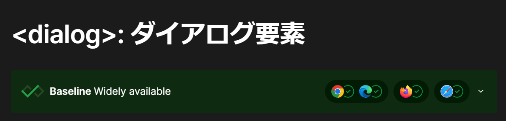

<page-title/>

本ガイドラインは、世の中のシステム開発プロジェクトのために無償で提供致します。  
ただし、掲載内容および利用に際して発生した問題、それに伴う損害については、フューチャー株式会社は一切の責務を負わないものとします。  
また、掲載している情報は予告なく変更することがございますので、あらかじめご了承下さい。

# はじめに

昨今のWebフロントエンド領域は、単なるHTML、CSS、JavaScriptでのページ制作から、React、Vue.jsなどのモダンなフレームワークを活用した大規模かつ動的なWebアプリケーションの構築へと変化している。これにより、開発の効率化とユーザー体験（UX）が向上する一方で、設計の考慮点も多様化している。また、セキュリティ、アクセシビリティなどより多面的な品質も求められている。

本ガイドラインでは、Webフロントエンド設計における考慮点・設計パターン・推奨手法を提示し、開発チームが設計方針を決めるための土台を提供する。これにより、設計における悩むポイントを軽減し、開発生産性と品質の向上を目指すものとする。また、共通の設計方針をスタート地点にすることで、開発チーム間での設計方針の不要な揺れを減らし、組織内でのナレッジシェアを促進し、知見を蓄積することを手助けする。

# 前提条件

本ガイドラインは、Webフロントエンドの開発者・アーキテクトを対象とする。

以下の項目は解説しない。

- 基本的なWeb技術に関する知識（HTML、CSS、JavaScript、HTTP通信など）
- React、Vue.jsなどのフレームワークの基礎知識

# 適用範囲

ブラウザ上で動作するWebフロントエンドを対象とし、バックエンド（サーバーサイド）は対象外とする。また、一般的にフロントエンド領域に含まれることもある以下の領域も対象外とする。

- CDN（Contents Delivery Network）
- BFF（Backend For Frontend）

Web APIの設計については、[Web API設計ガイドライン](/documents/forWebAPI/web_api_guidelines.html) を参考にすること。

また、本ガイドラインは基本的に、**業務アプリケーションの開発** を想定して作成している。例えば大規模なtoC向けサービスと比較して、以下のような特性を持つことが多い点を考慮しているためである。

- 権限管理が細かく、所属部署や役職で表示内容が細かく変わる、データの更新頻度が高いなどの理由で、CDN等を用いた積極的なキャッシュ戦略の効果が限定的
- 複雑なデータ入力フォームや、多機能なテーブル表示など、状態管理やUI制御が複雑になりやすい
- 利用するデバイスは比較的、絞り込みやすい

# 免責事項

::: warning 有志で作成したドキュメントである

- フューチャーアーキテクトには多様なプロジェクトが存在し、それぞれの状況に合わせて工夫された開発プロセスや高度な開発支援環境が存在する。本規約はフューチャーアーキテクトの全ての部署／プロジェクトで適用されているわけではなく、有志が観点を持ち寄って新たに整理したものである
- 相容れない部分があればその領域を書き換えて利用することを想定している
  - プロジェクト固有の背景や要件への配慮は、ガイドライン利用者が最終的に判断すること
- 本ガイドラインに必ず従うことは求めておらず、設計案の提示と比較するための観点を利用者に提供することを主目的としている

:::

# 用語

- Webフロントエンド: ブラウザ上で動作するWebアプリケーションでユーザーが操作するUI部分のこと
- 静的ファイル: Webブラウザで表示するために必要なHTML、CSS、JavaScript、画像、動画などのファイル
- SPA: Single-page applicationの略。はウェブアプリの実装方法の一種で、単一のウェブ文書のみを読み込み、別の内容を表する際には フェッチなどの JavaScript API を通じて本文の内容を更新するもの
- OSS: オープンソースソフトウェア
- B/Gデプロイ: Blue/Greenデプロイメントの略。システムのダウンタイムを最小限に抑えてリリースするデプロイ手法のこと。本番環境（Blue環境）とは別に、新しいバージョン（Green環境）を構築し、ロードバランサーなどでトラフィックを切り替えることで、新旧の環境を同時に稼働させ、切り替え後の動作確認やロールバックを容易に行うことといったこと指す
- LB: Load Balancerとは、トラフィックを複数のサーバに分散するミドルウェアのこと
- FaaS: Function as a Service の略。イベントに応じてコードを実行できるサーバーレスアーキテクチャのこと。AWS Lambdaが有名

# 本ガイドラインの構成について

大まかに以下の1～8の流れで構成されている。

1. 構成方針（ホスティング、レンダリング方式、コンポーネント設計など）
2. 要件（対応ブラウザ、サポートバージョンなど）
3. 動作方針（バリデーション、ルーティング、状態管理など）
4. 表示制御（レスポンシブ、画像など）
5. オフライン対応（PWAやオフライン判定方式など）
6. 認証認可（認証方式、認可方針など）
7. 開発（静的解析など）
8. テスト（テスト方針など）

# ホスティング方式

## SPAのホスティング

CSR（Client Side Rendering）を前提とするSPAのホスティングにはいくつかのパターンが考えられる。

AWSを前提として各パターンを下表で比較する。

| #                        | （1）CloudFront+S3                                                            | （2）ALB+S3                                                                                                           | （3）LB+Webサーバー                                                                   |
| :----------------------- | :---------------------------------------------------------------------------- | :-------------------------------------------------------------------------------------------------------------------- | :------------------------------------------------------------------------------------ |
| 説明                     | S3をオリジンとしてコンテンツを配信する方式。                                  | S3をオリジンとし、インタフェース型VPCエンドポイントを利用する方式                                                     | Webサーバー（nginxなど）をオリジンとする方式                                          |
| 閉域対応                 | ❌️インターネット経由となる                                                   | ✅️プライベートな配信が可能                                                                                           | ✅️プライベートな配信が可能                                                           |
| 性能                     | ✅️CDNのエッジロケーション利用が可能                                          | ❌️常にS3直接アクセスのため、オーバーヘッドが大きい                                                                   | ⚠️Webサーバーのキャッシュが利用可能                                                   |
| サーバー管理             | ✅️フルマネージド                                                             | ✅️フルマネージド                                                                                                     | ❌️Webサーバーの保守運用が必要                                                        |
| 運用費用                 | ✅️                                                                           | ✅️                                                                                                                   | ❌️Webサーバーの費用                                                                  |
| SPAルーティング          | ✅️CloudFrontでindex.htmlへのフォールバックにより、ヒストリーモード対応が可能 | ❌️ALBではindex.htmlへのフォールバックが不可                                                                          | ✅️Webサーバー設定によりindex.htmlへのフォールバックが可能                            |
| レスポンスヘッダーの変更 | ✅️CloudFrontのレスポンスヘッダーポリシーで任意のヘッダー追加が可能           | ⚠️2024年11月よりALBで特定のセキュリティヘッダー（HSTSなど）を追加可能                                                 | ✅️Webサーバー設定で任意のヘッダー追加が可能                                          |
| B/Gデプロイ              | ✅️S3に新旧コンテンツを配備、CloudFrontディストリビューション切り替えで実現   | ❌️ALBのターゲットはS3のVPCエンドポイントのIPベースになる。バケットやオブジェクトごとにルーティング切り替えはできない | ✅️新しいコンテンツを内包したWebサーバーを構築。ALBターゲットグループの切り替えで実現 |

推奨は以下の通り。

- プライベート（閉域）SPA: (3) を選択する
  - 閉域ネットワークからのアクセスに対応しつつ、SPAルーティングや柔軟なレスポンスヘッダー設定、B/Gデプロイが可能であるため
  - （２）は制約が多いためSPAホスティングとしては不向きである
- インターネット公開SPA: (1) を選択する
  - CDNによる高性能な配信、フルマネージドによる運用負荷の低減、比較的低コスト、SPAルーティングやヘッダー追加への柔軟な対応が可能であるため

::: tip S3単体で静的Webサイトをホスティング
最もシンプルな方式は、S3単体で静的Webサイトをホスティングすること（ウェブサイトエンドポイント）である。

この方式は簡易的な検証などでは利用可能であるが、以下の機能上の制約があるため、本ガイドラインでは比較対象からは除外している。

- HTTPSをネイティブでサポートしない（HTTPのみ）
- カスタムレスポンスヘッダー（HSTSなど）の追加ができない
- B/Gデプロイの実現が困難

:::

## SSRのホスティング

本節ではNext.jsまたはNuxtのSSR（Server Side Rendering）を対象とする。このホスティングにはいくつかのパターンが考えられる。

| #                            | （1）Nodeサーバー（Fargate等）                                                                                   | （2）FaaS（Lambda等）                                                    |
| :--------------------------- | :--------------------------------------------------------------------------------------------------------------- | :----------------------------------------------------------------------- |
| 説明                         | コンテナ等で常駐型のNodeサーバーを構築する方式                                                                   | FaaS上でNode.jsによるSSRを実行する方式                                   |
| 運用費用                     | 常時稼働分の固定コスト                                                                                           | 従量課金                                                                 |
| 応答速度                     | ✅️高速                                                                                                          | ⚠️初期応答はコールドスタートにより遅くなる可能性あり                     |
| サーバー管理                 | ❌️Nodeサーバーの保守運用が必要<br>（Fargate等を採用することでコンテナのデータプレーンはフルマネージドにできる） | ✅️フルマネージド                                                        |
| スケーラビリティ             | ❌️手動またはオートスケール構成が必要                                                                            | ✅️自動スケーリング                                                      |
| ローカル環境との整合性       | ✅️本番環境と一致しやすい                                                                                        | ⚠️FaaS環境特有の違いがでやすい                                           |
| ビルド・デプロイなどの柔軟性 | ✅️フレームワーク依存が少なく自由度が高い                                                                        | ✅️Nitroなどのツールを利用することで簡単にビルド・デプロイが可能         |
| 静的コンテンツの配信         | ✅️Nodeサーバーで配信可能                                                                                        | ⚠️Lambdaコストが従量課金で発生するため、CloudFront \+ S3などの併用が必須 |

推奨は以下の通り。

- システムとしてサーバーの運用保守体制が確保でき、安定性を重視する場合は（1）Nodeサーバー方式を選択する
- システム全体としてサーバーレスな構成を採用する場合やトラフィックが不定（例. 極端にトラフィックが少ない期間が存在する）でコスト削減の引力が強い場合は（2）を選択する

# レンダリング方式

レンダリング方式としてClient Side Rendering（CSR）とServer Side Rendering（SSR）を下表で比較する。

| #                     | CSR                                                                                                                                                                                                                       | SSR                                                                                                                  |
| :-------------------- | :------------------------------------------------------------------------------------------------------------------------------------------------------------------------------------------------------------------------ | :------------------------------------------------------------------------------------------------------------------- |
| 説明                  | サーバーは空のHTMLとJavaScriptを返却し、ブラウザ上でJavaScriptを実行することで、クライアントサイドでHTMLをレンダリングする方式                                                                                            | サーバー側でHTMLを生成し、レンダリング済みのHTMLをクライアントに送信する方式                                         |
| 実現方式              | Vite, Create React App等で構築されたSPA                                                                                                                                                                                   | Next.js、Nuxt.js、Angular Universal                                                                                  |
| 描画性能（初回）      | ❌️初回表示はクライアント（ブラウザ）側で行われるため、ページ全てがダウンロードされるまで表示が遅延する傾向。コンテンツフルペイント（FCP）・インタラクティブまでの時間（TTI）などの主要な指標に悪影響を与える可能性あり   | ✅️サーバー側でページが生成され、完全なHTMLが送信されるため、CSRよりは高速となる                                     |
| 描画性能（2回目以降） | ✅️初期ロード後は、サーバーとの通信なしに高速な画面遷移が可能                                                                                                                                                             | ⚠️差分描画は可能なものの、HTMLを生成する必要があるのでオーバーヘッドが大きい                                         |
| SEO                   | ⚠️コンテンツが含まれない状態で配信されるので、SEO対策が必要となる。検索エンジンがJSをうまく処理できない場合、一部のコンテンツがインデックスされない可能性がある。※1                                                       | ✅️完全なHTMLを最初から提供できるため、検索エンジンに優しい仕様。検索エンジンにとって解析が容易なため、SEO効果が高い |
| スケーラビリティ      | ✅️大量のリクエストにも対応しやすいため、非常に高いスケーラビリティを持つ。ブラウザが大部分の処理を担当するため、サーバーにかかる負荷が少ない                                                                             | ⚠️サーバー側での処理が多いため、通常スケーラビリティは低くなる。サーバーリソースの増強が必要になる                   |
| セキュリティ          | ⚠️標準的なセキュリティ対策が求められる。クライアント側で実行されるコードが多いため、クロスサイトスクリプティング（XSS）などに対する対策が重要となる。依存ライブラリが増える傾向にありサプライチェーンアタックに注意が必要 | ⚠️標準的なセキュリティ対策が求められる。サーバー側の処理が多いため、サーバー自体のセキュリティも重要                 |
| ランニングコスト      | ✅️静的なリソースとしてのホスティングとなるので、ランニングコストは低い                                                                                                                                                   | ⚠️サーバー負荷が高い分だけフロントエンドとしてのランニングコストは高くなる可能性あり                                 |

※1 GoogleやBingなど主要なクローラーはJSを解釈するが、その利用しているChromium のバージョンやリソースのタイムアウト値など、詳細な仕様は公開されていない。

推奨は以下の通り。

- SEO効果や初期表示速度（Core Web Vitals等）が強く要求されるToCサービスであればSSRを検討する
- 高度なインタラクティブ性など表現力が強く要求される場合は、開発がよりシンプルに行えるCSRを検討する
- 上記いずれも優先する場合はハイブリッドレンダリングも考えられるが、複雑度上昇による開発・維持管理コストを考慮に入れる

::: info 参考

- [JavaScript SEO の基本を理解する | Google 検索セントラル | Documentation](https://developers.google.com/search/docs/crawling-indexing/javascript/javascript-seo-basics?hl=ja)
- [The new evergreen Bingbot simplifying SEO by leveraging Microsoft Edge](https://blogs.bing.com/webmaster/october-2019/The-new-evergreen-Bingbot-simplifying-SEO-by-leveraging-Microsoft-Edge/)

:::

::: tip ハイブリッドレンダリングについて

ハイブリッドレンダリングとは、複数のレンダリング手法（主にSSRとCSR）を組み合わせ、性能とUXの最適化を目指すレンダリング手法である。アプリケーションの異なる部分（例えば、特定のページやコンポーネント）や、異なる状況（例えば、初回ロード時とその後のユーザインタラクション時）に応じて、最適なレンダリング戦略を柔軟に選択し適用できる点が大きな特徴といえる。例えば、SEO が特に重要なランディングページや製品詳細ページには SSR を適用し、ユーザの操作頻度が高いダッシュボードのような部分には CSR を適用するなど、きめ細やかな最適化が可能になる。

CSRとSSRを相互に補完できるソリューションであるが、以下のデメリットもある。

- ❌️部分的なSSRが必要になり、システムランニングコスト費用が増加する
- ❌️開発、保守、デバッグの複雑性とコストの増加
- ❌️特定の技術要素への依存による、技術スタックの制約や学習コストの発生

:::

::: tip SSG/ISR

最新情報を扱わなくて良い場合はSSG（Static Site Generation）やISR（Incremental Statice Regeneration）のような静的ページ生成の採用も考えられる。

- SSG: Webページを事前に生成しておき、ユーザがアクセスしたときにサーバーから生成済みの静的なHTMLファイルを提供する手法を指す。ビルド時にコンテンツがレンダリングされ、それ以降はその静的ファイルをそのまま提供するため、高い性能を実現できる
- ISR: 静的サイト生成（Static Site Generation、 SSG）の利点を活かしつつ、動的なコンテンツの更新を可能にする手法。主にNext.jsで採用されている技術で、特定のページをバックグラウンドで適切なタイミングで再生成することで、静的サイトの性能と動的サイトの柔軟性を両立する

ドキュメントサイトや製品情報ページなど、情報更新頻度が低い場合にこれらの採用も検討する。

:::

# コンポーネント設計

現代のWebアプリケーション開発では、複雑なUIと多様な機能への対応が求められている。従来のモノリシックなフロントエンド開発では、UIやデータアクセスといった複数機能が一つの大きなコードベースに統合されやすかった。その結果、機能間の結合度が高まり、複数の開発チームが単一のコードベースを変更することになるため、保守運用が困難になる傾向があった。これに対し、コンポーネントベースアーキテクチャはUIを機能ごとに小さく独立し、再利用可能な部品へ分割する手法である。これにより、保守性・テスト容易性を高め、大規模なアプリケーション開発においてもチーム間の開発生産性や統制を保ちやすくする。

フロントエンドにおけるコンポーネントは、その役割や特性の違いから「共通コンポーネント」と「業務コンポーネント」に区別することが多い。

| 基準                     | 共通コンポーネント                                               | 業務コンポーネント                                                         |
| :----------------------- | :--------------------------------------------------------------- | :------------------------------------------------------------------------- |
| 主な役割                 | アプリケーション全体で一貫した外観と操作性を提供するUI基盤       | 特定の機能やビジネスドメイン固有のロジックとデータをカプセル化             |
| 利用範囲                 | アプリケーション横断的に複数の機能で使用される                   | 特定の機能やモジュール内でのみ使用される                                   |
| ビジネスロジックへの依存 | 低い：特定のビジネスルールやデータモデルに直接依存しない         | 高い：特定のビジネスルールやデータモデルに直接組み込まれている             |
| 汎用性                   | 高い：様々なコンテキストで再利用可能                             | 低い：特定の用途に特化しており、他での再利用は想定されにくい               |
| チームの所有権           | アーキチームや、複数のチームにまたがる場合がある                 | 特定の機能開発チーム                                                       |
| 例                       | ボタン、入力フィールド、ダイアログ、アイコン、ナビゲーションバー | ユーザプロファイルウィジェット、製品リストコンポーネント、財務報告テーブル |

## 共通コンポーネント

基本的に共通コンポーネントは特定ドメイン要素を含まない汎用的な名称で構成される。また、OSSのデザインシステムを導入している場合、既に用意されているケースが大半である。

▼共通コンポーネント例（画像引用：[Components — Material Design 3](https://m3.material.io/components)）

| #                | 例                               | 説明                                                                                                                                                             |
| :--------------- | :------------------------------- | :--------------------------------------------------------------------------------------------------------------------------------------------------------------- |
| カード           |   | 単一の主題に関するコンテンツをまとめて表示するコンテナとなるコンポーネント。コンテンツを一覧で表示する際に、特定情報群をグルーピングして提示したい場合などに利用 |
| 入力テキスト     |   | テキスト入力用の入力フォーム。登録画面等において、名前や住所等を1行以内でテキスト入力する場合などに利用                                                          |
| セレクトボックス |  | 選択用入力フォーム。ある特定の項目のみに入力内容を制限したい場合などに利用                                                                                       |
| チェックボックス |   | 複数項目から選択する入力フォーム。複数項目を選択したい場合。1つの選択肢において、ON/OFFを切り替えたい場合などに利用                                              |
| ボタン           |  | 主にアクション実行や画面遷移等のトリガーとして利用。画面内のイベントを実行したい場合に塗りやアウトライン、カラー等で用途を使い分けて利用。                       |
| メニュー         |    | 画面遷移のリンクを提示する。複数リンクを束ねてまとめておきたい場合ニ利用。メニュー内の仕様によってサブメニュー等階層構造を取る場合もある                         |

::: tip デザインパターンの活用  
再利用可能で柔軟なUI要素を作成するために、確立されたデザインパターン（ex：[ファクトリー](https://zenn.dev/morinokami/books/learning-patterns-1/viewer/factory-pattern)、[モジュール](https://zenn.dev/morinokami/books/learning-patterns-1/viewer/module-pattern)、[複合（高階）コンポーネント](https://zenn.dev/morinokami/books/learning-patterns-1/viewer/compound-pattern)、[レンダープロップ](https://zenn.dev/morinokami/books/learning-patterns-1/viewer/render-props-pattern)）を活用する 。例えば、ファクトリーパターンを使用してさまざまな種類のフォームフィールドを動的に作成したり 、高階コンポーネントを使用して既存のコンポーネントの機能を強化したりできる。デザインパターンはベストプラクティスをカプセル化し、コード効率を促進、より保守性と拡張性を高めることができる。  
:::

## 業務コンポーネント

業務コンポーネントは、特定の機能またはビジネスドメインに特化して作成され、それぞれの要件を満たす固有のビジネスロジックを含む。

▼業務コンポーネント例（画像引用：[Tailwind CSS Product Lists](https://tailwindcss.com/plus/ui-blocks/ecommerce/components/product-lists), [Tailwind CSS Shopping Carts \- Official Tailwind UI Components](https://tailwindcss.com/plus/ui-blocks/ecommerce/components/shopping-carts)）

| #                      | 例                                       | 説明                                                                                                                                                               |
| :--------------------- | :--------------------------------------- | :----------------------------------------------------------------------------------------------------------------------------------------------------------------- |
| 商品リストグリッド一覧 |     | 複数の商品をサムネイル画像と簡単な情報を並べて表示。カテゴリページや検索結果ページで、ユーザに複数の商品について、イメージ画像と併せて一覧で見せたい場合などに利用 |
| 商品購入サマリ         |  | 現在カートに入っている商品の概要を表示。ユーザがサイト内を回遊中に、常にカートの中身を意識できるように表示したい場合などに利用。                                   |

推奨は以下の通り。

- コンポーネントの再利用性や保守性を高めるため、UI（表示）の制御ロジックとビジネスロジックをできる限り分離する
- アプリケーションの成長に伴い、当初は特定の機能向けだったロジックやUI要素が、他の機能でも有用となる可能性がある。機能追加や改修などのタイミングで業務コンポーネント化に向けての抽出や汎化を行う

### 共通コンポーネントの実装方針

共通コンポーネントは、実際のプロジェクト要件・組織構成・保持資産等を総合的に考慮して下表を参考に実装方針を策定する。

|              | 既存コンポーネントライブラリの活用                                                                                                                                                                                                                                                                  | ハイブリッドアプローチ                                                                                                                                                                                                                                                                                                                                                                                                                                                                                                                                                         | フルスクラッチ                                                                                                                                                                                                                                  |
| :----------- | :-------------------------------------------------------------------------------------------------------------------------------------------------------------------------------------------------------------------------------------------------------------------------------------------------- | :----------------------------------------------------------------------------------------------------------------------------------------------------------------------------------------------------------------------------------------------------------------------------------------------------------------------------------------------------------------------------------------------------------------------------------------------------------------------------------------------------------------------------------------------------------------------------- | :---------------------------------------------------------------------------------------------------------------------------------------------------------------------------------------------------------------------------------------------- |
| 説明         | Material UI、Ant Design、Chakra UI、Bootstrap componentsなどの確立されたサードパーティライブラリを利用し、主に外観（テーマ設定、CSSオーバーライド）や軽微な動作をカスタマイズするアプローチ                                                                                                         | **ヘッドレスUIライブラリ:** Radix UI、Headless UI、React Aria等の利用。これらは動作、アクセシビリティ、状態管理処理を提供するが、スタイルは完全に開発チームに委ねられる。<br> **既存ライブラリの拡張:** サードパーティライブラリのコンポーネントをラップ/拡張して、特定の機能を追加や特定のプロパティパターンを強制する。ただし、ライブラリのコアには依然として依存する <br>**プリミティブに基づく内部共有ライブラリ:** カスタム共通コンポーネントを構築するが、生のHTML/CSSから始めるのではなく、低レベルのプリミティブライブラリ(ex:styled-system、Tailwind CSS等)を利用する | コアコンポーネントの構造やロジックについて、包括的なサードパーティUIライブラリに依存せず、基本的なHTML要素やフレームワークのプリミティブから、完全に社内で共通コンポーネントを開発するアプローチ                                                |
| Pros         | ✅️開発速度の向上<br> ✅️組み込みのアクセシビリティ対応<br> ✅️クロスブラウザ互換性 <br>✅️豊富な開発ドキュメント<br> ✅️大規模なコミュニティサポート<br> ✅️確立されたデザインパターンへの準拠&一貫性の確保                                                                                        | ✅️純粋なスクラッチと比較して開発を加速しつつ、高度な制御を維持する為、デザイン自由度とロジックやアクセシビリティ活用をバランスよく享受可能<br> ✅️既存資産活用や中程度のカスタマイズで実現可能                                                                                                                                                                                                                                                                                                                                                                                | ✅️HTML/CSS/JSに対する完全な制御<br> ✅️最適化された性能（未使用のコード/機能の極小化）<br> ✅️自社ブランドを踏襲したデザイン方針への完全な適合 <br>✅️コンポーネント内部に対するチームの深い理解<br> ✅️ベンダーロックインの回避               |
| Cons         | ❌️カスタマイズの制約（ライブラリのコアデザイン/構造から大幅に逸脱することが困難または不可能な場合あり）<br> ❌️バンドルサイズの肥大化リスク<br> ❌️ベンダーロックインのリスク<br> ❌️ライブラリ固有のAPIやカスタマイズシステムの学習コスト<br> ❌️十分なカスタマイズが行われない場合の汎用的な外観 | ❌️一部スタイリングにおいては完全自作、かつライブラリの学習コストが発生する<br> ❌️場合によっては、プロジェクト固有の複雑化や依存関係における脆弱性に注意が必要                                                                                                                                                                                                                                                                                                                                                                                                                | ❌️多大な初期開発時間と工数 <br>❌️高度なフロントエンド専門知識（アクセシビリティ、クロスブラウザ互換性、性能最適化を含む）の要求 <br>❌️継続的なメンテナンス負担（バグ修正、機能強化、ドキュメント作成）、ガバナンスが弱い場合の潜在的な不整合 |
| ユースケース | 市場投入までの時間を優先するプロジェクト                                                                                                                                                                                                                                                            | 完全なライブラリが提供するものよりも多くのデザイン制御を望むが、すべて（特に複雑なロジック/アクセシビリティ）をゼロから構築することは避けたいプロジェクト                                                                                                                                                                                                                                                                                                                                                                                                                      | 非常にユニークなUI/UX要件を持つプロジェクトや、高度なフロントエンド専門知識と利用可能なリソースを持つチーム制御                                                                                                                                 |

推奨は以下の通り。

- まず既存コンポーネントライブラリの活用を第一に検討する
- 既存コンポーネントが、要件に耐え得るかの判断基準に沿って、ハイブリッドアプローチを検討する

## コンポーネント実装方針

昨今のフロントエンド開発はフレームワークの利用が主流であり、命名規則やディレクトリ構造はそれに依存する部分が大きい。本ガイドラインは基本的にフレームワークが推奨する規則・構成に準拠することを推奨する。

下記は参考となる考え方の提示に留める。

### 命名規則

コンポーネント、そのプロパティ（props）、イベント、および関連ファイルに明確な命名規則を定義して適用する。名前は説明的で簡潔であり、コンポーネントの目的と機能を反映している必要がある。

- 命名規則
  - コンポーネントファイル/クラス：`PascalCase`
  - プロパティとイベント：`camelCase`
  - CSSクラスとフォルダ名：`kebab-case`
- 命名の観点
  - コンポーネントの種類や役割を示す (例: メインボタン=`ButtonPrimary`, 検索フォーム\=`InputSearch`)
  - 関連するドメインや機能を示す (例: ユーザプロフィールカード=`UserProfileCard`, 受注リスト項目=`OrderListItem`)
- 注意点
  - 他の開発者にとって不明瞭な略語や曖昧な用語の使用は避ける

::: tip コンポーネントの設計原則とアンチパターン

一般的に、コンポーネント設計は以下の点に注意すると良い。

| 原則                      | 説明                                                                                                                                                                                                                                                             |
| :------------------------ | :--------------------------------------------------------------------------------------------------------------------------------------------------------------------------------------------------------------------------------------------------------------- |
| モジュール性と カプセル化 | コンポーネントは、明確に定義された機能とインタフェースを持つ自己完結型の単位である。その為、内部実装の詳細を隠蔽し、ユーザの視点からブラックボックス化することで独立性が促進され、変更が行われたときに意図しない副作用のリスクが軽減される                       |
| 再利用性                  | パラメータ化と構成オプションにより、アプリケーションの様々な部分や将来のプロジェクトにおいて、多様なコンテキストに適応できるようになり、再利用性が向上する。コンポーネントを一度構築して複数回使用することで、時間とリソースが節約され、一貫性の確保が実現できる |
| 保守性                    | コンポーネントを小さく保ち、一貫したコーディング標準と命名規則に従うことで、デバッグと変更が容易である。また、小さく焦点を絞ったコンポーネントは、複雑な依存関係を持つ可能性が低くなる                                                                           |
| 拡張性                    | 小さく独立したコンポーネントを組み合わせて複雑なUIを構築できるため、深い継承階層よりも柔軟性が高くなる。大規模なフロントエンドを管理可能で独立してデプロイ可能な単位に分割する方法を提供するマイクロフロントエンドといったアーキテクチャパターンも適用可能である |

逆に、以下のようなアンチパターンもよく話題に上がる。

| アンチパターン                     | 説明                                                                                                             | 解決策                                                                                                                                 |
| :--------------------------------- | :--------------------------------------------------------------------------------------------------------------- | :------------------------------------------------------------------------------------------------------------------------------------- |
| 神オブジェクト                     | 単一責任原則に違反して、過剰な知識や処理を行うコンポーネント                                                     | コンポーネントを、特定の責任を持つより小さく、焦点を絞ったコンポーネントに分割する                                                     |
| 密結合                             | 互いに過度に依存しているコンポーネント。変更が困難になり、アプリケーションの他の部分を破損させるリスクが高まる   | 明確なインタフェースでコンポーネントを設計し、直接的な依存関係を最小限に抑える。依存性注入やイベント駆動型通信などの手法を使用する     |
| マジックナンバー                   | 説明なしにハードコードされた値を使用すること。コードの理解と保守が困難になる                                     | 意味のある名前を持つ定数または構成変数を使用す。                                                                                       |
| 過剰なエンジニアリング             | 単純な問題に対して不必要に複雑な設計を作成すること。不要な複雑さと性能のオーバーヘッドにつながる                 | コンポーネントをシンプルに保ち、そのコア機能に焦点を当てる。本当に必要な場合にのみ複雑さを追加する                                     |
| アクセシビリティの無視             | アクセシビリティ要件を考慮しないこと。身体的不自由のある人にとってアプリケーションが使いにくくなる               | 設計プロセスの最初からアクセシビリティに関する考慮事項を組み込む。WCAGガイドラインに従い、支援技術を使用してコンポーネントをテストする |
| ビジネスロジックとUIロジックの混在 | UIコンポーネントに過度のビジネスロジックを直接埋め込むこと                                                       | ビジネスロジックを専用のサービスまたはモジュールに分離し、UIコンポーネントをプレゼンテーションに集中させる                             |
| 一貫性のないスタイリング           | 一貫したスタイリングアプローチの欠如。まとまりのない、プロフェッショナルではないユーザーインタフェースにつながる | 包括的なスタイルガイドを確立し、CSS-in-JSライブラリまたはCSSモジュールを使用してコンポーネント固有のスタイルを管理する                 |
| 曖昧なリンクのラベル付け           | 「ここをクリック」のような一般的なリンクラベルを使用し、コンテキストを提供しないこと                             | リンク先またはアクションを示す明確で説明的なリンクラベルを使用する                                                                     |
| 小さなリンクターゲット             | インタラクティブ要素が小さすぎること。特にモバイル端末の様なタッチデバイスで使いづらさの問題を引き起こす         | インタラクティブ要素に適切なパディングがあり、最小限のタッチターゲットサイズを満たしていることを確認する                               |

:::

## ディレクトリ構造

共通コンポーネントと業務コンポーネントを、明確なディレクトリ構成として分離する。一貫した構造を取ることでファイル検索が簡易化し、コンポーネント間の関係性が明確になる。次にプロジェクト規模ごとの推奨構成を紹介する。

### 小規模プロジェクトの場合

コンポーネント、フック、サービス、およびその他の関連ファイルを専用の`features`フォルダ内にグループ化するといった機能ベースの分離を推奨する。`core`ディレクトリにグローバルサービス、ユーティリティ、および構成を格納し、`shared`ディレクトリに複数の機能で使用される再利用可能なUIコンポーネントおよびその他のロジックを格納するような構成も可能である。

```text
src/
├── core/
│   ├── services/
│   └──...
├── shared/
│   ├── components/
│   └──...
├── features/
│   ├── dashboard/
│   │   ├── components/
│   │   └──...
│   ├── users/
│   │   ├── components/
│   │   └──...
├──...
├── assets/
└──...
```

### 大規模プロジェクトの場合

エンタープライズといった大規模アプリケーションの場合、拡張性がありモジュール化されたディレクトリ構造が必要である。例としてビジネスドメインや主要機能を中心としたディレクトリ構成の採用を推奨する。各モジュールは自己完結しており、独自のコンポーネント等が含まれ、モジュール間は疎結合である。

```sh
src/
├── app/        # メインアプリケーションのエントリ
├── features/
│   ├── products/
│   │   ├── components/
│   │   ├── schemas/
│   │   ├── server/
│   │   └──...
│   ├── users/
│   │   ├── components/
│   │   ├── server/
│   │   └──...
├── lib/        # グローバルユーティリティ
├── api/        # グローバルAPIクライアント
├── database/   # グローバルデータベースアクセス
├── components/ # グローバルな、真に共有されたUI
└── utils/      # グローバルなユーティリティ関数
```

# URLパス設計

各画面のURLパスは、リソース中心の設計（対象の画面が操作するリソースを意識した設計）を推奨する。REST API との親和性が高く、エンドユーザーに対して視認性・判読性の高い URL を提供できるメリットがある。

具体的なパスの設計例は下表の通り。リソースベースのパスに加えて、そのリソースに対するアクション（例. 新規作成：new 更新：edit 承認：confirm）をパスで表現する。

| 画面種別                 | パス構成                      |
| :----------------------- | :---------------------------- |
| ホーム画面               | `/`                           |
| ログイン画面             | `/login`                      |
| 一覧画面                 | `/orders`                     |
| 詳細画面（新規作成）     | `/orders/new`                 |
| 詳細画面（参照）         | `/orders/{order_id}`          |
| 詳細画面（編集）         | `/orders/{order_id}/edit`     |
| 詳細画面（承認）         | `/orders/{order_id}/confirm`  |
| 一覧画面（親子関係あり） | `/orders/{order_id}/products` |

## パス設計の原則

### パスの基本構成

- リソース中心設計：リソース＝データやサービスを表現し、一意の識別子（URI）を持つ。リソースを表す単語は複数形で表現する
  - ✅️ `/orders/{order_id}`
- コレクションはその項目を階層構造で表現する
  - ❌️ `/customers/order/{order_id}`
  - ✅️ `/customers/{customer_id}/orders/{order_id}`

### 一貫性のある命名規則

- URLはケバブケース、パラメータはキャメルケースを使用する
- URLの末尾にスラッシュは付与しない
- 例
  - ❌️ `/systemOrders`
  - ❌️ `/system_orders`
  - ❌️ `/system-orders/{order_id}`
  - ❌️ `/system-orders/{OrderId}`
  - ✅️ `/system-orders`
  - ✅️ `/system-orders/{order_id}`

### 名詞ベースのURI

- 操作を表す動詞例: `search`, `get`, `delete`）は避け、リソースを表現する名詞を使用する
- リソース名は、意味が通じる範囲で省略せず、明確に記述する
- 例
  - ❌️ `/orders/search?cond1=xxx&cond2=yyy`
  - ❌️ `/orders/{order_id}/detail`
  - ❌️ `/orders/{order_id}/p`
  - ✅️ `/orders/{order_id}/products`

### 代替URL

- 同じコンテンツを表現する代替URLの数は原則、禁止とする
- 例
  - 以下のURLが同一の製品ページを示す状態は避ける
    - ❌️ `/product/black-t-shirt`
    - ❌️ `/product?id=1234`

::: warning IDトークンなどをパスパラメータに含めない
セキュリティの観点から、セッションIDの代替としてトークンを利用してAPIアクセスする場合も、パスパラメータに含めてはならない。HTTPヘッダーを利用できないか検討する。

**参考**: [アプリケーション固有の「ロジックの脆弱性」を防ぐ開発者のためのセキュリティ観点 \- Speaker Deck](https://speakerdeck.com/flatt_security/apurikesiyongu-you-no-rozitukunocui-ruo-xing-wofang-gukai-fa-zhe-notamenosekiyuriteiguan-dian?slide=37)
:::

::: tip SEOの考慮
インターネット公開するサービスでは、SEOの観点から極力無駄な階層を含めず、シンプルで直感的な階層構造にする。

- ✅️ECサイトの例：`/category/subcategory/product-name`
- ✅️ニュースサイトの例：`/year/month/day/article-title`

ノイズとなり検索エンジンが解釈しづらくなるため、意味を持たない文字列は含めない。

- ❌️悪い例: `https://example.com/r_b57f2c0522378b5f30db33ae88ddf19f`

ただし、これは第三者からアクセス可能な画面が前提であり、秘匿性の高い画面については、セキュリティ上推測困難なURLパスとすることが望ましい。

:::

## クエリパラメータ

- 検索フォーム、フィルターの条件は検索ボタンや適用ボタンが押されるたびに、それらの情報をクエリパラメータに設定する。それによって、他の人へ結果の共有をURLを通して行える
- フロントエンドのプログラムから扱うときはURLSearchParamsクラスを使ってパース、更新すること
- 原則、`?value`ではなく `?key=value`を使用する。URLパラメータを使用することでサイト構造が把握しやすくなり、クローリングやインデックス登録に寄与するため
  - ❌️ `/orders/1/product?2`
  - ✅️ `/orders/1/product?product_id=2`
- 同じパラメータは重複させる（過去にあったウェブアプリケーションフレームワークによっては別の型式を使うことがあるが、URLSearchParamsは推奨パターンしか作成できない）
  - ✅️ `/orders/1/product?type=pattern1&type=pattern2`
  - ❌️ `/orders/1/product?type=pattern1,pattern2`
- トラッキングコード、ユーザーに基づく相対的な値（location=nearby、time=last-week）、現在時刻などの一時的なパラメータに内部的にリンクさせない。URLの有効期間の短縮や同一ページに対する重複URLの発生に繋がる可能性がある
  - ❌️ `/orders/1/product?session=452991833`
  - ✅️ `/orders/1/product?location=JP`
- URLに絶えず変化する値（タイムスタンプ等）の属性値は含めない
  - 例: タイムスタンプにより`/about?now=12:34am`と`/about?now=12:35am`の場合、表示対象が同じページでも異なるURLとして扱われる可能性がある

::: warning セッションIDをパラメータに含めない
セッションIDをURLパラメータに格納していると、ブラウザの Referer 送信によってURLをリンク先のサイトへ送信される。これはセッション・ハイジャックの懸念がある。Cookieの利用を検討する。
:::

# 対応ブラウザ

Webフロントエンド開発において、対応ブラウザの数や種類によって、開発ワークフローの効率性・デバッグの容易さ・品質に大きな影響を与える為、適切に選定する必要がある。

コアブラウザセットとは、開発者がWebアプリケーションの動作確認を行う上で、特に重要視する主要なブラウザ群を指す。ここに含まれるブラウザで利用率の大部分を占める。そのため、全てのブラウザを網羅的にテストすることが現実的でない場合に、最低限サポートすべきブラウザを定義したい場合に利用しやすい。

（2025年3月時点）コアブラウザセットは[WebDX Community Group](https://web-platform-dx.github.io/web-features/)により、が定められている。

- Google Chrome (デスクトップ/Android)
- Apple Safari (Mac OS/iOS)
- Microsoft Edge (デスクトップ)
- Mozilla Firefox (デスクトップ/Android)

その他の観点としては、市場シェア・利用統計を見ることが多い。またOSやデバイス（デスクトップ/モバイル）毎の特性や要件も考慮する必要がある。

▼主要ブラウザのシェア率（調査日:2025年3月。[StatCounter](https://gs.statcounter.com/browser-market-share/desktop-mobile-tablet/worldwide/)を利用。Market Share Typ:Browser(Desktop,Mobile,Tablet,Console)、Region:Worldwide、Period:From Feb 2024 To Feb 2025）

| #                    | Google Chrome                                                       | Apple Safari                                             | Microsoft Edge                                        | Mozilla Firefox                                                           |
| :------------------- | :------------------------------------------------------------------ | :------------------------------------------------------- | :---------------------------------------------------- | :------------------------------------------------------------------------ |
| **シェア率（％）**   |                                                                     |                                                          |                                                       |                                                                           |
| ・全プラットフォーム | 66.3                                                                | 18.0                                                     | 5.3                                                   | 2.6                                                                       |
| ・デスクトップ       | 65.6                                                                | 8.7                                                      | 13.7                                                  | 6.2                                                                       |
| ・モバイル           | 67.6                                                                | 22.8                                                     | 0.4                                                   | 0.5                                                                       |
| **OS別サポート有無** |                                                                     |                                                          |                                                       |                                                                           |
| ・Windows            | ✅️                                                                 | ❌️                                                      | ✅️                                                   | ✅️                                                                       |
| ・Mac OS             | ✅️                                                                 | ✅️                                                      | ✅️                                                   | ✅️                                                                       |
| ・Android            | ✅️                                                                 | ❌️                                                      | ✅️                                                   | ✅️                                                                       |
| ・iOS                | ✅️                                                                 | ✅️                                                      | ✅️                                                   | ✅️                                                                       |
| Pros                 | ✅️高いシェア率<br> ✅️マルチプラットフォーム<br> ✅️豊富な拡張機能 | ✅️Apple製品との親和性<br> ✅️表示速度<br> ✅️消費電力小 | ✅️スクリーンショット標準搭載<br> ✅️MS製品との親和性 | ✅️豊富な拡張機能<br> ✅️リソース消費量<br> ✅️スクリーンショット標準搭載 |
| Cons                 | ❌️リソース消費量大                                                 | ❌️OS依存度大                                            | ❌️OS依存度大                                         | \-                                                                        |
| コアブラウザ対象     | ✅️                                                                 | ⚠️Mac OS/iOSの場合                                       | ⚠️Windowsの場合                                       | ❌️                                                                       |

推奨は以下の通り。

- サポート対象とするブラウザをミニマムに絞る
  - サポートするブラウザを増やすと、少なくない工数が掛かるため
  - セキュリティの観点から、セキュリティ更新がされているOSとそれがサポートしているブラウザのみに絞るべきであるため
  - デバイス毎の利用シェア率、OS別サポート状況を考慮してサポート対象を決定する
- 具体的なブラウザの選定
  - 広く利用されている `Google Chrome` は基本的にサポート対象に含める
  - `Windows`の場合、`Microsoft Edge`を対象外とすることを検討する
  - `iOS`の場合は標準ブラウザである `Apple Safari` を対象に含める
  - `MacOS`の場合、`Chrome` に絞れないか検討する
  - `Mozilla Firefox` はシェアの低さから、サポート外にできないか検討する

# サポートバージョン

Webアプリケーション開発において、ブラウザのサポートバージョンを適切に設定することは、セキュリティや安定性の観点から重要である。サポート範囲を広げすぎると開発・テストコストが増大し、逆に狭すぎると多くのユーザーが利用できなくなる可能性がある。ブラウザのバージョンサポートの前提として、エバーグリーンブラウザ（Evergreen browsers）の存在がある。

エバーグリーンブラウザとは、自動で最新版にアップデートされるブラウザのことである。近年はOSのバージョンとブラウザのバージョンは独立しており、ブラウザは自動更新のケースが多い為、ユーザーはあまり意識せずに最新のセキュリティと機能を利用できる状態を保つことができる。

コアブラウザセットの中では以下がエバーグリーンブラウザに該当する。

- Apple Safari (macOS)
- Google Chrome (desktop)
- Microsoft Edge (desktop)
- Mozilla Firefox (desktop)

エバーグリーンブラウザを利用することによるメリットは以下がある。

- **UXの向上**: 最新の機能や性能改善が自動的に提供されるため、常に快適なブラウジング体験が得られる
- **セキュリティの向上**: 最新のセキュリティパッチが自動的に適用されるため、脆弱性に対するリスクが軽減される
- **Web標準への対応**: 最新のWeb標準に迅速に対応するため、開発者は常に最新の技術を利用できる

続いて、モバイルのブラウザサポートの前提情報について説明する。

- Apple Safari (iOS)
  - iOSのバージョンとSafariのバージョンは密接に紐づいている。そのためサポートするiOSバージョンが決まれば、Safariのサポートバージョンも自動的に定まる
- Google Chrome (Android) & Mozilla Firefox (Android)
  - 自動更新するかどうかをユーザーが選択できる仕様である。しかし自動更新が有効化されていても実は自動更新されていないケースもある。自動更新が有効化されているかどうかが認識しづらいため注意する

推奨は以下の通り。

- **デスクトップ**
  - エバーグリーンブラウザの場合は最新バージョンとその1つ前までのバージョンをサポートする
  - Firefox(Windows/Mac/Linux)をサポートする必要がある場合は、最新バージョン or 延長サポート版(最大1年) をサポートする
- **モバイル**
  - 要件によって対象とする検証機のサポートしているOSバージョンを絞り込み、それ以上のバージョンを対象とする
    - Android(含む組み込みブラウザ): Chrome最新版のみ
    - iOS Safari(含むSFSafariViewController): 最新18.x（2025年3月現在）
  - 業務アプリケーション向け
    - 原則、セキュリティ更新がされているバージョンのみをサポート対象とする
    - 古いバージョンをサポートする必要があるのはモバイルのSafariのみである
    - 最終的なサポート範囲は、セキュリティパッチ対応・企業ごとのサポートポリシー・導入端末によって決定する（サポート対象を絞り込めないか整理する）
  - コンシューマーアプリケーション向け
    - ユーザーによってはストレージがない等の理由でバージョンアップをしていない場合もあるが、基本的に最新のセキュリティ対応がされているブラウザをサポート対象とする

# ブラウザ機能

Web 開発は、ブラウザという共通のプラットフォーム上で動作するアプリケーションを構築する点に特徴がある。しかし、ブラウザの種類やバージョンは多岐にわたり、それぞれがサポートする API (機能) に差異がある。この差異を無視して開発を進めると、特定のブラウザでしか動作しない、あるいは意図した動作をしない Web アプリケーションが生まれてしまう可能性がある。そのため、どのようなAPIを利用するかの基本方針を決めておく必要がある。

[Web Platform Baseline](https://developer.mozilla.org/ja/docs/Glossary/Baseline/Compatibility)（以下、BaseLine）は、Webプラットフォームの機能（**web-features**）のブラウザ間の相互運用性（**Interoperability**）を示す指標で、Web 開発におけるある機能に対して、ブラウザのサポート状況を明確にすることを目的としている。

対象となるブラウザは以下である。

- Chrome (デスクトップ、Android)
- Edge (デスクトップ)
- Firefox (デスクトップ、Android)
- Safari (デスクトップ、iOS)

Baseline は、機能のサポート状況に応じて、以下の3つの区分に分けられる。

- `Widely Available` (広く利用可能な機能)
  - 主要なブラウザで利用可能になってから30ヶ月以上経過し
  - 安心して利用できる安定した機能セットとみなされる
- `Newly Available` (新たに利用可能になった機能)
  - 主要なブラウザで利用可能になってから30ヶ月以内の機能
  - 最新安定版のブラウザやデバイスで動作が保証されるが、古いブラウザでは動作しない可能性がある
- `Limited availability` （制限付き利用可能）
  - 対象ブラウザの内一部でのみ利用可能な状態で、Baselineに乗っていないとされる
  - 実験的な機能や、将来的に仕様が変更される可能性のある機能

また、上記とは別に `Newly Available` `Limited availability` には、以下の条件の1つ以上が該当する場合に[Experimental](https://developer.mozilla.org/ja/docs/MDN/Writing_guidelines/Experimental_deprecated_obsolete#%E5%AE%9F%E9%A8%93%E7%9A%84) というマークが付く。

- レンダリングエンジンの有効な実装が1つだけ
- 環境設定やフラグなどの設定変更によってのみ対応する
- 定義している仕様が、後方互換性のない方法で大幅に変更される可能性がある

一般的に、サポート対象のブラウザベンダーやバージョンを絞っている場合でも、Baselineに準拠した機能選定は重要な意味を持つ。特にエンタープライズ向けの開発では長期的な安定性や保守性が求められるため、標準に基づいた実装にすることで、将来のブラウザアップデートやWeb標準の変化に対してより耐性の高いコードベースを維持できる。また、社内ポリシーやセキュリティ要件により特定機能が制限される環境でも一貫した動作を保証し、予期せぬ互換性問題のリスクを軽減できる。さらに、開発チーム内での共通理解を促進し、コードの一貫性と品質向上も期待できる。

推奨は下表の通り。

| #                      | 機能の採用方針                                                                                                                                                                                                                                                                                                                      |
| :--------------------- | :---------------------------------------------------------------------------------------------------------------------------------------------------------------------------------------------------------------------------------------------------------------------------------------------------------------------------------- |
| `Widely available`     | ✅️利用可。余裕があればフォールバックも実装できるとベター                                                                                                                                                                                                                                                                           |
| `Newly available`      | ⚠️総合的に判断して採用する。判断基準の例としては次の通り。<br> ・Experimentalではない<br> ・システムにおいて重要なロジックが、その機能に依存していない <br>・フォールバックが用意できる <br>・プロジェクトでサポートするブラウザの最新安定版で動作が保証されている <br>・ユーザが積極的にブラウザのバージョンを更新する見込みがある |
| `Limited availability` | ❌️本番環境での採用は見送った方がよい                                                                                                                                                                                                                                                                                               |

より簡易的な方針としては以下を推奨する。

- `Widely available` とExperimentalではない `Newly available` の機能は原則、利用可
- Experimentalである `Newly available` と `Limited availability` の機能は原則、利用不可
- Experimentalである `Newly available` のうち、フォールバック手段が存在するなどでリスクが低く、利用することで開発生産性や保守性が高く向上すると見込まれる場合のみ、アーキチームと導入について個別相談する

▼Baselineステータスから判断OKとした例 （※作成日: 2025/02/21）

| #          | （1）[\<dialog\> 要素](https://developer.mozilla.org/ja/docs/Web/HTML/Element/dialog) | （2）[:has()](https://developer.mozilla.org/ja/docs/Web/CSS/:has)                                                                                                                                               |
| :--------- | :------------------------------------------------------------------------------------ | :-------------------------------------------------------------------------------------------------------------------------------------------------------------------------------------------------------------- |
| 画像       |                                                                 |                                                                                                                                                                                              |
| ステータス | `Widely available`                                                                    | `Newly available`                                                                                                                                                                                               |
| 説明       | `Widely available` であり多くのブラウザサポートあり                                   | `Widely available` で無いが、主要ブラウザで幅広くサポートあり。                                                                                                                                                 |
| 判断例     | ✅️採用OK                                                                             | ✅️`:has()` 関数が登場するまではJS頼りになっていた親要素の状態に基づくスタイリングをCSSのみで実現でき、宣言的な実装が可能となり、性能向上、保守性の改善に繋がる。本ガイドラインとしては採用しても良いと判断する |

▼Baselineステータスから判断NGとした例 （※作成日: 2025/02/21）

| #          | （3）[popover属性](https://developer.mozilla.org/ja/docs/Web/HTML/Global_attributes/popover)                                                                          | （4）[abs() 関数（CSS）](https://developer.mozilla.org/ja/docs/Web/CSS/abs) |
| :--------- | :-------------------------------------------------------------------------------------------------------------------------------------------------------------------- | :-------------------------------------------------------------------------- |
| 画像       |                                                                                                                                                |                                                          |
| ステータス | `Newly available` かつExperimental                                                                                                                                    | `Limited availability`                                                      |
| 説明       | 有用な機能であり、主要ブラウザで幅広くサポートされている。しかい、Experimentalマークが付いているため、PoCレベルではプロジェクト毎の判断で良いが、本番での採用は非推奨 | FirefoxとSafariでのみサポート                                               |
| 判断例     | ❌️Experimentalであるため本番での採用は非推奨                                                                                                                         | ❌️採用NG                                                                   |

::: tip Baselineの確認方法  
[mdn web docs](https://developer.mozilla.org/ja/docs/Web): Mozilla社がホストしているOSSのドキュメント。先述のケーススタディで使用した画像はこのドキュメントからの引用。  
「この機能のBaselineのステータスはどうなっているのか？」をざっくり確認したい場合に役立つ。

[Can I use…](https://caniuse.com/): Can I use はWebプラットフォーム上の機能のInteroperabilityの状況を、ブラウザの「種類 x バージョン」のマトリックスで確認できるWebサービス。以下は FaviconのSVGサポート状況をCan I useで確認した2025年3月時点の例である。SafariでSVG形式のFaviconを使用できる時期は遠そうだということが見て取れる。


[Web Platform Status Dashboard](https://webstatus.dev/): Web Platform Status Dashboardは、主要なブラウザベンダーが提供するWebプラットフォームの機能やAPI実装状況を一覧化した便利なツール。Chrome、Edge、Firefox、Safariなど各ブラウザでの対応状況や標準化の進捗を視覚的に確認でき、クロスブラウザ対応の計画を立てる際の重要な情報源となる。加えて、実験的機能や将来実装予定の機能についても知ることができるため、最新のWeb技術動向を把握するのに役立つ。


:::

::: info 参考

- [Baseline](https://web.dev/baseline?hl=ja)
- [Baseline (互換性) \- MDN Web Docs 用語集: ウェブ関連用語の定義](https://developer.mozilla.org/ja/docs/Glossary/Baseline/Compatibility)

:::

# 解像度

[レスポンシブ対応](#レスポンシブ対応) 章にあるように、全ての解像度に対応した画面デザインを作成するのは、仕様検討やテスト追加などの工数が膨大であり費用対効果が悪い。そのため対応する必要がある解像度の想定を持つ必要がある。解像度の想定が存在しないと、画面レイアウトの検討でも議論が発散しがちであり最初に決めることが重要である。

## 対応デバイス

作成するシステムがどのような環境で利用されるか、明確化する。以下のようにどのデバイスが利用されるか洗い出す。

- スマートフォン（Android、iPhone）
- タブレット（iPad、Androidタブレット）
- PC（デスクトップ、ラップトップ）
- その他（TV、デジタルサイネージ）

利用デバイスが分かれば、それぞれの物理解像度（1920×1080など）と、デフォルトスケール（150％など）から、推奨論理解像度（1280×720など）の入力となる情報を収集すべきである。昨今は4Kディスプレイ（3820×2160など）の利用も広がっており、物理解像度だけではなくスケーリング値も重要である。大体の4Kディスプレイでもデフォルトスケールが200%などと設定されており、論理解像度が1920×1080程度に収まるような傾向にある。

モバイルは、端末の傾きによって縦と横がローテーション（回転）する機能がある。[ScreenOrientation: lock()](https://developer.mozilla.org/ja/docs/Web/API/ScreenOrientation/lock) で回転をロックできる。縦持ちのみサポート（横は画面が崩れても対応しない。強い要望が出た場合は別途相談の上で対応の是非を検討）するなど要件を決める必要がある。

推奨は以下の通り。

- 画面デザイン上の最低スペックは、論理解像度で1280×720（1920×1080でスケールが推奨値の150％）などと定義する
  - この解像度では横スクロール無しで一部のテーブルを除き原則、業務上必要な項目を表示できるようにする、といった合意形成をしていく
  - 物理解像度・スケーリング・論理解像度の話は少し複雑であるため、用語はAppendixなどにまとめて前に出しすぎないように注意する
- モバイルの回転について
  - 回転の要件について、合意形成する
  - 基本的に縦画面対応を前提にし、可能であれば横は対応しない方向で調整する（ロック化を検討する）
- 「1366×768**以上**」といった書き方をせず、基準となる想定解像度（例: 1920×1080、スケーリング100%時の論理解像度）は1つに定める -これにより、1つに定めた想定解像度に最適化したデザインやテストを行いコストを抑制できる。それ以上の解像度のときに操作不能になったり情報が隠れたりしないように最低限の動作保証はする（見た目がグッとくるようなレイアウト調整は行わない）、という方針にする。大は小を兼ねない（高解像度が低解像度の表示を兼ねるわけではない）。

::: info 参考
[画面の解像度の要件定義の話 | フューチャー技術ブログ](https://future-architect.github.io/articles/20211207a/)
:::

## ウィンドウサイズ

ブラウザのウィンドウは、原則、フルスクリーン想定で定義する。複数のウィンドウによる操作は、ズームなどで調整してもらうとする。ブラウザはユーザーにより任意サイズに変更可能であるため、もし前節で定義した想定解像度を下回った場合は、はみ出した部分をスクロールバーで表示する。

## ズーム

ブラウザのズームは、スケーリングと似ているがそのブラウザウィンドウ（タブ）内のみに影響する。原則、100％を想定すると定義すると良い。ユーザーによっては90%、110%など変更する場合があると思うが、情報が不用意に隠れないようにし操作が継続できるよう最低限保証する程度にする。また、ズームの値によって定義した想定解像度を下回った場合は、はみ出した部分をスクロールバーで表示する。

## Viewport

ビューポートとは、Webページがブラウザ上で表示される領域のことである。以下のようにmetaタグで指定される。

▼ビューポートの設定例

```html
<meta name="viewport" content="width=device-width, initial-scale=1.0" />
```

推奨は以下の通り。

- `width=device-width`
  - ブラウザの表示領域の幅を、デバイスの論理的な幅（CSSピクセルでの幅）に合わせる
  - width=1200など特定の値に固定できるが、レスポンシブでなくなるため非推奨
- `initial-scale=1.0`
  - 初期のズーム倍率を1（100％）に設定する
  - initial-scale=0.8 などあえて縮小表示させることもできるが、通常ユーザーが困惑するため非推奨
- その他
  - `minimum-scale` `maximum-scale` など最小・最大のズーム倍率も設定可能だが、UXやアクセシビリティの観点から指定は非推奨

::: info 参考
[Statconter](https://gs.statcounter.com/screen-resolution-stats) でブラウザのViewportのシェアを調べることができる
:::

# 国際化対応

国際化対応（i18n: Internationalization）とは、ソフトウェアを複数の地域や言語に対応できるように設計することを指す。フロントエンドの世界ではUIテキストや日付、数値のフォーマット、通貨表示などをユーザーの言語設定に応じて動的に切り替えることが可能な仕組みを指す。

## 多言語対応をすべきかどうか

単一の言語にしか対応しなくてよい要件だとしても、i18nの仕組みを導入しておくことを推奨する。

主要なWebフロントエンドフレームワークに対応した高機能なi18nライブラリは充実しており、仕組み自体は数行のコード追加で実現可能なためである。言語をハードコードしてしまうと後から多言語に対応する際の修正コストが膨大になるため、あらかじめ言語ファイルを切り出しておくことが望ましい。

- React: `react-intl` `react-i18next`
- Vue.js: `vue-i18n` `unplugin-vue-i18n`
- Angular: `@ngx-translate/core`

## 言語設定

言語設定は、「アプリ内で保持する方式」と「ブラウザの言語設定（Navigator.language）を利用する方式」の2つが考えられるが、特別な理由がない限りはブラウザの言語設定を利用する方式を推奨する。理由は次の通り。

- UXの一貫性を保つため
  - ユーザーはブラウザの言語設定を一度行えばすべてのウェブサイトがその言語で表示されることを期待している。アプリケーションごとに個別に言語を設定するのは、ユーザーにとって手間がかかりUXがバラバラになる
- 標準的な動作に従うことで直感的な操作が可能なため
  - ブラウザの言語設定はユーザーが慣れているインタフェースであり、アプリごとに個別の設定があると、どこで言語を変更するのかわかりにくくなる
- 設計をシンプルにするため
  - OSやブラウザの設定を参照することで、アプリ側で言語設定のUIや設定値の永続化などを考える必要がない

::: warning アプリ側で言語設定を保持する例外ケースとは

ただし次のようなケースにおいては例外的にアプリ側で言語設定を保持する方式を検討する。

- ユーザーが複数の言語を頻繁に切り替えるケース
- 選択可能な言語を明示的に絞り込んだ状態でユーザーに提示したい場合

:::

# バリデーション

バリデーションはユーザーによる誤入力からシステムを保護し、適切なメッセージをフィードバックすることで自ら修正できるようにすることでUX向上にも寄与する。一般的にフォーム入力はユーザーへの作業負荷が高く、特にtoC向けのサービスでは不適切なバリデーションによってユーザーがサービスの利用をやめてしまうこともあり、離脱率にも直結する。業務システムにおいても一貫性を持ったバリデーション設計を行うことで、業務効率を上げることができる。アクセシビリティの観点でも重要である。

## バリデーション原則

フロントエンドで実施するバリデーションについて、基本方針をまとめる。

- 入力条件と一致したバリデーションを行う
  - 条件が複数存在する場合（「64文字以下」かつ「英数字混在」など）、すべての条件に対して検証する
  - 表示している入力条件より緩い・強いバリデーションには行わない
  - ユーザーが指示に守ったのにエラーメッセージを出してしまうことを避けるべきであるため
- エラーメッセージの表示タイミングを最小化する
  - （1）インラインバリデーション \-\> （2）クライアントサイドのフォーム送信時バリデーション \-\> （3）サーバーサイドバリデーションと最大で3回、エラーメッセージが表示されると、ユーザーの作業負荷が高まる
  - （1）を用いる場合は、（2）や（3）ができるかぎり発生しない作りとする
  - DBチェックが必要な場合も、（1）にて非同期でサーバーサイドのチェック用のAPIを呼び出することで、（3）でのエラーを減らすことができる

::: info 参考
[2024年版 HTMLで作るフォームバリデーション \- ICS MEDIA](https://ics.media/entry/240418/)
:::

### クライアントバリデーションとサーバーサイドバリデーション

通常、バリデーションは、クライアントサイドとサーバーサイドの両方で実施することが多い。表層上のチェック内容は似通っているため、どちらか一方のみの実装で良いのでは無いかという疑問を持つことも多い。しかし、下表のように目的は大きく異なる。

| #            | （1）クライアントサイドバリデーション                                                                              | （2）サーバーサイドバリデーション                                                                                                                                                                                                |
| :----------- | :----------------------------------------------------------------------------------------------------------------- | :------------------------------------------------------------------------------------------------------------------------------------------------------------------------------------------------------------------------------- |
| 説明         | クライアントサイド（ブラウザ上）で行う入力チェック。必要に応じてサーバー通信を行うチェックをすることがある         | サーバーサイドで行う入力チェック。クライアントサイドと重複したチェック内容であっても、悪意のあるユーザーがクライアントサイドで行うべきチェックを迂回した場合の対策として、サーバーサイドでも同等以上のチェックを行うべきである。 |
| 目的         | ユーザーに即時フィードバックすることによるUX向上                                                                   | システムとしてのデータ整合性維持やセキュリティ対策（XSSなど）                                                                                                                                                                    |
| 実行環境     | ブラウザ                                                                                                           | Webサーバー                                                                                                                                                                                                                      |
| 特徴         | サーバー通信無しで動作可能なので、高速にチェック可能                                                               | DBアクセスができる関係上、クライアントサイド以上のチェックを行うことが多い                                                                                                                                                       |
| 副次的な効果 | クライアントサイドで検知できる入力ミスを含む通信をなくせるため、サーバー負荷を（いくばくか）軽減できる可能性はある | ー                                                                                                                                                                                                                               |

そのため、UXの要件を無視できるのであれば（1）は無視して、（2）のみ実装することはありえる。逆に②を実装せず①のみに絞ることは、セキュリティ上看過できないため、選択できない。

推奨は以下の通り。

- クライアントサイド・サーバーサイドの両方でバリデーションを行う
  - UX観点で（1）、システム保護の観点で（2）

::: info 参考

- [Client-side form validation \- Learn web development | MDN](https://developer.mozilla.org/en-US/docs/Learn_web_development/Extensions/Forms/Form_validation)
- サーバーサイドのバリデーションについては、 [Web API設計ガイドライン \> バリデーション章](https://future-architect.github.io/arch-guidelines/documents/forWebAPI/web_api_guidelines.html#%E3%83%8F%E3%82%99%E3%83%AA%E3%83%86%E3%82%99%E3%83%BC%E3%82%B7%E3%83%A7%E3%83%B3) に記載している

:::

## バリデーションロジックの同期

フロントエンド/サーバーサイドの両方でバリデーションを行うと、そのロジックの同期を取る必要がある。例えば、サーバーサイドのみ入力値の最大桁数を小さくすると、フロントエンド側のバリデーションは成功したのに、サーバーサイドでエラーが発生するためユーザーを混乱させてしてしまう。

ロジックの同期方法については、いくつかの方式が考えられる。

| #                                   | （1）コード共有                                                                                                                                                                           | （2）スキーマファイルとコード生成                                                                                                      | （3）レビュー担保                                                                                                              |
| :---------------------------------- | :---------------------------------------------------------------------------------------------------------------------------------------------------------------------------------------- | :------------------------------------------------------------------------------------------------------------------------------------- | :----------------------------------------------------------------------------------------------------------------------------- |
| 説明                                | クライアントサイドとサーバーサイドで、JavaScript（TypeScript）やwasmのコードを共有する方法。バックエンドもNode.jsなどで構築するか、バックエンドの各言語でJSやwasmを実行させる仕組みが必要 | JSON SChemaやOpenAPI定義ファイルを共有し、クライアントとサーバーのコードを生成する方法                                                 | 設計書やスキーマファイルを元に、クライアントサイド・サーバーサイドで独立してバリデーションを実装し、レビューなどで担保する方式 |
| 同期の強制力                        | ✅️高い                                                                                                                                                                                   | ✅️高い                                                                                                                                | ❌️開発者のレベルに依存する。静的解析で緩和可能                                                                                |
| 制約                                | ❌️サーバーサイドの技術選定に制約がある                                                                                                                                                   | ⚠️コード生成ツールの品質に依存しがち                                                                                                   | ✅️自由度が高い                                                                                                                |
| 開発難易度                          | ❌️コードをどのように共有するか、設計が難しい                                                                                                                                             | ❌️生成したコードの学習コストが高い                                                                                                    | ✅️クライアントサイド、サーバーサイドで独立して実装可能                                                                        |
| フォーム送信時 バリデーション親和性 | ✅️                                                                                                                                                                                       | ✅️得意                                                                                                                                | ✅️個別の作り込みが可能                                                                                                        |
| インラインバリデーション親和性      | ⚠️共有可能だが、設計が必要（純粋な関数として実装するなど）                                                                                                                                | ❌️コード生成のカスタマイズが必要。例えばJSON Schemaから項目レベルのスキーマ情報を取得し、その単位でバリデーションコードを背制するなど | ✅️同上                                                                                                                        |
| エラーメッセージ                    | ⚠️サーバーサイドとクライアントサイドでエラーメッセージ内容を切り替えたい場合は、メッセージコード管理などが必要となる                                                                      | ⚠️コード生成系のエラーメッセージはUXが高いとは言えない場合が多い。カスタマイズで緩和可能                                               | ✅️個別の作り込みが可能                                                                                                        |

推奨は以下の通り。

- 採用技術が、フルスタックJavaScript（TypeScript）で無い限りは（1）の採用は不可とする
  - サーバーサイドがJava、Go、Pythonであったとして、それぞれJavaScriptの組み込みエンジンが存在するが、実行速度や安定性に懸念があるため
- OpenAPIによるコード生成はクライアントサイド・サーバーサイドの両面で推奨する。クライアントサイドにおいてはこれを用いて、フォーム送信時バリデーションを実施する
  - サーバーサイドへの通信（Web API呼び出し）は、SDKが提供されていない限りは、OpenAPI定義からのコード生成を用いたほうがベターである
- インラインバリデーションについては、スキーマファイルからの自動生成が利用するバリデーションライブラリと相性が良い場合のみ実施する。もし、コード生成にカスタマイズが必要であったり、`x-` 始まりの拡張設定だらけになるなど個別対応が増える場合は、コード生成にこだわらず（3）の方針を取る

## インラインバリデーション

ユーザーが送信ボタンを押下する前に、リアルタイムに入力値を検証することを「インラインバリデーション」と呼ぶ。フォーム送信時に行うチェックとの違いを下表にまとめる。サーバーサイドバリデーションを加えて3種類のバリデーションタイミングがある。

| #          | （1）インラインバリデーション                                                                        | （2）フォーム送信時バリデーション                    | （3）サーバーサイドバリデーション                              |
| :--------- | :--------------------------------------------------------------------------------------------------- | :--------------------------------------------------- | :------------------------------------------------------------- |
| 実行箇所   | クライアントサイド                                                                                   | クライアントサイド                                   | サーバーサイド                                                 |
| 説明       | 特定のセクションや入力項目群ごとにバリデーションを行うこと。<br>ライブバリデーションと呼ぶこともある | 全ての入力項目に対するバリデーションを一括で行うこと | システムとして保護しデータ整合性を保つために行うバリデーション |
| タイミング | 入力中 or フォーカスアウト                                                                           | フォームボタン押下時                                 | （2）の後、リクエストをサーバーが受信時                        |
| 実装コスト | ⚠️比較的高い                                                                                         | ✅️比較的低い                                        | ✅️（2）+α                                                     |
| UX         | ✅️適切に実施することでユーザー負荷を下げることができるとされる                                      | ⚠️適切なインラインバリデーションより低い場合がある   | ⚠️適切なインラインバリデーションより低い場合がある             |

推奨は以下の通り。

- UXの観点では一部の項目だけ（1）を行うのではなく、①を取り入れる場合は全項目に対して行う
  - インラインバリデーションが存在する項目とそうではない項目が混在した場合、エラーを全て解消したのにフォーム送信時のバリデーションエラーがさらに表示される可能性がある。これはユーザーの混乱を招くため
- 導入パターンは、[インラインバリデーションの実施タイミング](#インラインバリデーションの実施タイミング) を参考に決めること

## インラインバリデーションの実施タイミング

インラインバリデーションの場合、チェックタイミングが以下の2パターン考えられる。

- 入力中（リアルタイム）
- フォーカスアウト

UX観点ではチェックタイミングについて、バリデーション種別別に以下のプラクティスがあるとされる。

- 必須入力チェック
  - フォーカスアウト時にチェックする
  - ただし、フォーカスアウトしたが、一度も入力をしてなかった場合はエラーメッセージを出すべきではない
    - VeeValidateにおける、 `touched` かつ `dirty` な状態であること
  - 有効な入力値になった時点で消える（フォーカスアウト無しで消える）ことが望ましい
- 数値・文字種別チェック
  - HTMLのInput typeでデバイスに対して制御可能であるため、入力中のチェックは不要
  - 有効な入力値になった時点で消える（フォーカスアウト無しで消える）ことが望ましい
- 桁数チェック
  - 入力中のチェックを行う（例えば、自己紹介文の最大桁数チェックなど）
  - 有効な入力値になった時点で消えることが望ましい
- その他
  - 初期表示時に最初からエラーを表示しない
  - ユーザーから見て答えが明らかではない入力、例えばユーザーIDやパスワード（特にアルファベット・数字・記号を混在や指定や桁数の指定がある場合）は、入力中チェックを行う
  - 氏名、住所、電話番号、メールアドレスなどユーザーから見て答えが明らかである入力に対しては、フォーカスアウト時に行う
  - どちらも、有効な入力値になった時点で消えることが望ましい

推奨は、UX重視とするか、リリース速度/工数削減を優先するかによって、以下の案をベースに方針を決めること。なお、入力中のバリデーションは実装コストが高いという前提で記載している。

| #                                          | UX重視                                                                | バランス型1 松案                                                                                           | バランス型2 梅案                                | リリース速度重視（MVP）                                                                       |
| :----------------------------------------- | :-------------------------------------------------------------------- | :--------------------------------------------------------------------------------------------------------- | :---------------------------------------------- | :-------------------------------------------------------------------------------------------- |
| 説明                                       | 最もUXが良くなる作り込みを行う                                        | 費用対効果を見て部分的に導入する。入力中バリデーションは実装パターンを増やし工数増のため基本的に実施しない | 費用対効果を見て部分的に導入する                | 最低限の機能以外を削ぎ落としたリリース最優先の方式。MVP想定で徐々にバランス型に寄せていく想定 |
| 入力中インラインバリデーション             | ✅️行う                                                               | ❌️行わない                                                                                                | ❌️行わない                                     | ❌️行わない                                                                                   |
| フォーカスアウト時インラインバリデーション | ✅️行う                                                               | ✅️行う                                                                                                    | ⚠️複雑な入力条件を必要とするフィールドのみ行う  | ❌️行わない                                                                                   |
| フォーム送信時バリデーション               | ✅️行うが、インラインバリデーションを通過していれば、通常発生しない） | ✅️行うが、インラインバリデーションを通過していれば、通常発生しない                                        | ✅️行う                                         | ✅️HTML検証のみで行う                                                                         |
| HTML検証                                   | ⚠️無効化                                                              | ⚠️無効化                                                                                                   | ⚠️無効化                                        | ✅️有効化                                                                                     |
| サーバーサイドバリデーション               | ✅️行うが、フロントエンド側を通過していれば通常、発生しない           | ✅️行うが、フロントエンド側を通過していれば通常、発生しない                                                | ✅️行う。メインのチェックはサーバーサイドとなる | ✅️行う。メインのチェックはサーバーサイドとなる                                               |

::: info 参考

- [Inline Validation in Web Forms](https://alistapart.com/article/inline-validation-in-web-forms/) によると、適切なインラインバリデーションで、成功率が22％増加、エラーが22%減少、満足度が31%上昇、完了までの時間が42%短縮するなど高い効果あるという検証結果が出た
- [Inline Validation in Online Forms \- Should You Use It?](https://www.zuko.io/blog/inline-validation-in-online-forms)
- [10 Design Guidelines for Reporting Errors in Forms](https://www.nngroup.com/articles/errors-forms-design-guidelines/) の「7. Don’t Validate Fields Before Input is Complete」に、入力が終わっていない段階でエラーを出されるとユーザーはイライラするという解説がある
- [[UI/UX] バリデーションの発火タイミングとボタン制御について \- Qiita](https://qiita.com/bmjuggler/items/2e1803cc42c828701594)
- [間違えると逆効果？入力ミスをその場で知らせる「リアルタイムアラート」のトリセツ | UI改善ブログ by f-tra](https://f-tra.com/ja/blog/column/7644)

:::

## ボタンの有効化

インラインバリデーションを実施する場合、エラーがあるときサブミットボタンを非活性化するかどうかが設計上の論点となる場合がある。  
判断材料の1つとしてアクセシビリティがある。[ボタン（アクセシビリティ）](https://design.digital.go.jp/components/button/accessibility/#h2-%E7%84%A1%E5%8A%B9%E3%83%9C%E3%82%BF%E3%83%B3%EF%BC%88disabled%EF%BC%89%E3%81%AF%E3%82%BF%E3%83%96%E3%83%95%E3%82%A9%E3%83%BC%E3%82%AB%E3%82%B9%E3%81%A7%E3%82%A2%E3%82%AF%E3%82%BB%E3%82%B9%E3%81%A7%E3%81%8D%E3%81%AA%E3%81%84) では以下のような記載がある。

> HTMLのdisabledコンテンツ属性が指定されたボタンやフォームコントロールは、スクリーンリーダーで「無効」 「使用不能」などと読み上げられるものの、キーボード操作のタブフォーカスではアクセスできません。そのため、ロービジョンのユーザーがスクリーンリーダーとキーボード操作を併用している際など、無効ボタンの位置を正確に把できないい場合があるという、アクセシビリティ上の問題があります。また無効ボタンには、ユーザーからは見えているのになぜ押せないのかが分からないというように、ユーザービリティ上の問題もあります

推奨は以下の通り。

- アクセシビリティの観点から、ボタンを非活性化はさせない
- インラインバリデーションを実施する場合も、フォーム送信時のバリデーションも行う（両方のタイミングで行う）

## バリデーションメッセージ

バリデーションメッセージによって、ユーザーは次に何をすべきか判断しアクションする。そのため、誤解を生まないように適切な表示する必要がある。

### メッセージ内容

以下の点に注意すること。

- **具体的にする**: 「エラーが発生しました」ではなく、どうすればよいか分かるように記述する
- **簡潔にする**: 長文にならないよう、意味が通じるのであれば思い切って短くすることも考える
- **前向きにする**: 「間違っています」ではなく、「もう一度入力してください」のように、否定したりユーザーを責めるのではなく、再入力を促す表現にする

▼メッセージ例

```text
❌️エラーが発生しました。フォームを確認してください
✅️パスワードは8文字以上にしてください

❌️ユーザー名が入力エラーにより無効です。もう一度正しいフォーマットで入力してください。
✅️ユーザー名は5文字以上15文字以下で、英数字のみ利用できます

❌️年齢が間違っています。正しい年齢を入力してください
✅️年齢は0以上である必要があります
```

::: tip JSONスキーマによるチェック  
[Ajv](https://ajv.js.org/) といったライブラリを用いることで、JSONスキーマを用いた入力チェックが可能である。この場合は機械的なメッセージとなり何が悪かったかユーザーに伝わりにくいため、Ajvでは以下のように `errorMessage` 属性を追加すると良い。エラーメッセージもユーザー向けのコンテンツの1つであるため、心を込めて分かりやすく提示する。

```js
// JSON Schemaの定義例
const schema = {
  type: "object",
  properties: {
    username: {
      type: "string",
      minLength: 5,
      maxLength: 15,
      errorMessage: {
        type: "ユーザー名は文字列である必要があります。",
        minLength: "ユーザー名は5文字以上で入力してください。",
        maxLength: "ユーザー名は15文字以下で入力してください。",
      },
    },
    age: {
      type: "integer",
      minimum: 0,
      maximum: 150,
      errorMessage: {
        type: "年齢は整数である必要があります。",
        minimum: "年齢は0歳以上である必要があります。",
        maximum: "年齢は150歳以下である必要があります。",
      },
    },
  },
  required: ["username", "age"],
  errorMessage: {
    required: {
      username: "ユーザー名は必須です。",
      age: "年齢は必須です。",
    },
  },
};
```

:::

::: info 参考
[反感を買うエラーメッセージのパターン](https://u-site.jp/alertbox/hostile-error-messages)
:::

### 表示位置

エラーメッセージの表示位置は、下表のパターンが考えられる。

| #            | （1）インライン                  | （2）上部・下部                                    | （3）ツールチップ                                | （4）モーダル/ダイアログ                                       |
| :----------- | :------------------------------- | :------------------------------------------------- | :----------------------------------------------- | :------------------------------------------------------------- |
| 説明         | 入力欄の直下や横に表示する       | フォーム全体の上部か下部にまとめて表示する         | フォーカスまたはマウスオーバーした場合に表示する | 入力ページとは別にモーダルやダイアログでメッセージを表示させる |
| 視認性       | ✅️良い                          | ✅️良い                                            | ❌️エラーメッセージを見落とす可能性              | ⚠️エラーが発生したことは強調できる                             |
| 具体性       | ✅️紐付けが分かりやすい          | ⚠️複数のエラーが合った場合、問題箇所の把握が不明確 | ✅️紐付けが分かりやすい                          | ⚠️複数のエラーが合った場合、問題箇所の把握が不明確             |
| 表示スペース | ⚠️エラーメッセージ用の余白が必要 | ⚠️エラーメッセージ用の余白が必要                   | ✅️スペースの節約にはなる                        | ✅️スペースの節約にはなる                                      |
| 認知負荷     | ✅️特に無し                      | ⚠️問題箇所の特定コストがある                       | ⚠️マウスオーバーなどの手順                       | ❌️ユーザー操作が中断するため、負荷が高い                      |

推奨は以下の通り。

- 原則、（1）を選択する
  - フォームが長い場合（スクロールが必要な場合）、（2）の上部/下部だとエラー箇所を見つけにくい問題がある
  - フォームが短い画面しか存在しないのであれば、（2）を選択しても良い
- より、UXを高めるには（1）、（2）を組み合わせる方式も考えられる
  - 上部に発生したエラーの一覧を表示し、インラインも表示する
  - フォームの長さによっては有効な場面があるが、実装コストも上がってしまうため導入箇所は見極めが必要である

## HTML制約検証

HTML5では、クライアントサイドで実施すべきいくつかのバリデーションを、JavaScriptを用いず行えるようになった。

| #                  | （1）HTML制約検証                                                                                                                                        | （2）JavaScriptによるバリデーション                              |
| :----------------- | :------------------------------------------------------------------------------------------------------------------------------------------------------- | :--------------------------------------------------------------- |
| 説明               | `<input>` タグのtypeや属性に意味的に最も適切な制約を記載する方法。[制約検証](https://developer.mozilla.org/ja/docs/Web/HTML/Constraint_validation)と呼ぶ | ここではJavaScriptで任意のバリデーション処理を実装することを指す |
| 実行タイミング     | フォーム送信時                                                                                                                                           | 任意（入力中、フォーカスアウト、フォーム送信時など）             |
| サーバーサイド通信 | ❌️不可                                                                                                                                                  | ✅️任意                                                          |
| 実装コスト         | ✅️容易                                                                                                                                                  | ⚠️個別実装が増える                                               |
| 柔軟性             | ❌️限られた検証のみ                                                                                                                                      | ✅️任意のチェックが可能                                          |

[\<input\>: 入力欄（フォーム入力）要素 | MDN](https://developer.mozilla.org/ja/docs/Web/HTML/Element/input) にも記載があるように、input typeの例には以下がある。適切に型を選択することで、例えば10キー入力を表示や、フォーム送信時に一致したデータ型でない場合に失敗させることができる。

- 日付: `date`
- メールアドレス: `email`
- 数値: `number`
- 電話番号: `tel`

また、検証関連属性は [制約検証 | MDN](https://developer.mozilla.org/ja/docs/Web/HTML/Constraint_validation) もまとめがあるが、代表的な属性に以下がある。

- 必須チェック: `required`
- 最大文字数: `maxlength`
- 最小文字数: `minlength`
- 最大値: `max`
- 最小値: `min`
- 正規表現チェック: `pattern`

HTML制約検証可能なバリデーションは、HTMLに寄せるのか、あるいはJavaScriptに１本化すべきか設計上の論点になることもある。

推奨は以下の通り。

- バリデーションロジックは、基本的にJavaScript上で実装する（Zodなど何かしらライブラリを用いることを推奨する）
- アクセシビリティの観点から、HTML上の型や検証関連属性も適切に設定する（必須、桁数、最小最大、正規表現など）
- [novalidate](https://developer.mozilla.org/ja/docs/Web/HTML/Element/form#novalidate) 属性を付けて、HTML側の検証を無効化しておく
- エラーメッセージも [aria-errormessage \- アクセシビリティ | MDN](https://developer.mozilla.org/ja/docs/Web/Accessibility/ARIA/Attributes/aria-errormessage) にある通り、`aria-errormessage` で記載する

### JavaScriptによるバリデーション

型・桁・最大最小・パターン系以外の独自バリデーションでの注意点をまとめる。

| 分類     | 項目             | 例                                                                                                                                             | サーバー利用 | 注意事項                                                                                                                                                                                                                                                                         |
| :------- | :--------------- | :--------------------------------------------------------------------------------------------------------------------------------------------- | :----------- | :------------------------------------------------------------------------------------------------------------------------------------------------------------------------------------------------------------------------------------------------------------------------------- |
| 単項目   | ロジックチェック | クレジットカードのチェックサム検証など                                                                                                         |              | 特に無し                                                                                                                                                                                                                                                                         |
|          | DB重複チェック   | ユーザー名の重複チェックや、メールアドレスの登録済みかどうかのチェック                                                                         | ✅️必須      | ・入力中に行うとサーバー負荷が高くなるため、フォーカスアウト時に行う ・メールアドレスの場合は、ログイン・パスワードを忘れた場合の誘導などの表示を検討する ・メールアドレスの場合、特定のメールアドレスが利用済みであることが把握できるため、Rate Limitを厳しく行うなど考慮が必要 |
| 複数項目 | 一致チェック     | パスワードやメールアドレスの、初回入力と確認用入力の一致確認                                                                                   |              | ・UX観点で本当に必要なのか議論がある（少しでもサポートセンターなどへの問い合わせを減らしたいというビジネス要求もある） ・確認用入力欄に対して入力時チェックを行うことがベター ・完全一致のみにで実装し、大文字小文字を無視するなどロジックは入れない                             |
|          | 連動チェック     | 特定の入力値に依存する他の入力値の制御。例えば「支払い方法」で「クレジットカード」を選択すると、「カード番号」の入力欄が表示されるなどのケース |              | 通常の画面操作ではエラーが発生しないと、複数項目の関連チェックは行わなくても良い                                                                                                                                                                                                 |

# 画面間パラメータ連携

画面表示に必要なパラメータを保持し、受け渡す方法は複数あり、下表の基準で使い分ける。

ダイレクトな URL のアクセス時に引き渡す必要があるパラメータは、パスパラメータまたはクエリパラメータでの表現が必要となる。

| #                  | パスパラメータ                                                               | クエリパラメータ                                                             | オンメモリ                                                                         | Web ストレージ                                                                     |
| :----------------- | :--------------------------------------------------------------------------- | :--------------------------------------------------------------------------- | :--------------------------------------------------------------------------------- | :--------------------------------------------------------------------------------- |
| 用途               | リソースの識別子                                                             | リソースを新規作成、参照、更新・削除、承認する際の前提となる条件             | アプリケーション内部で利用する一時的なデータ（主に画面間共通データ）               | アプリケーション内部で利用する長期的なデータ（主に画面間共通データ）               |
| 例                 | ID                                                                           | 検索条件                                                                     | APIレスポンスなどのキャッシュ                                                      | ユーザー設定など、比較的軽量で永続的な画面共通データ                               |
| URL表現            | URL に含まれる                                                               | URL に含まれる                                                               | URL に含まれない                                                                   | URL に含まれない                                                                   |
| リロード時         | ✅️維持される                                                                | ✅️維持される                                                                | ❌️維持されない                                                                    | ✅️維持される                                                                      |
| ブラウザ履歴       | ✅️残る                                                                      | ✅️残る                                                                      | ❌️残らない                                                                        | ❌️残らない                                                                        |
| 得意なユースケース | ✅️簡単に共有や再アクセスをしたい<br> ✅️URLにて見せてもよいデータを扱いたい | ✅️簡単に共有や再アクセスをしたい<br> ✅️URLにて見せてもよいデータを扱いたい | ✅️複雑に構造化されたデータ扱いたい<br> ✅️URLにて見せてはいけないデータを扱いたい | ✅️複雑に構造化されたデータ扱いたい<br> ✅️URLにて見せてはいけないデータを扱いたい |

アプリケーション内部で取り扱うデータの取り扱いについては、[状態管理](#状態管理) や [キャッシュ](#キャッシュ) 章においても言及がある。

# ルーティング

Webフロントエンドのルーティングは、レンダリングや各フレームワークの仕様と密接に結びついている。また、各フレームワークが推奨するレンダリング方法やルーティングの仕様は、時代と共に変化する。Next.jsやNuxtなどのフレームワークを使用する場合、基本的にはフレームワークが推奨する標準的な方法で実装することが推奨される。

SPAにおいては、ルーティングのモードとして主にハッシュモードとヒストリーモードが存在する。

| #                | （1）ハッシュモード (hash)                          | （2）ヒストリーモード (history)                                    |
| :--------------- | :-------------------------------------------------- | :----------------------------------------------------------------- |
| URLの形式例      | `https://example.com/#/about`                       | `https://example.com/about`                                        |
| SEO              | 非最適（`#`以降をクローラーが認識しない場合がある） | 最適                                                               |
| サーバー側の設定 | 不要（静的なファイルサーバーでも動作）              | `index.html` へのフォールバックが必要                              |
| ブラウザ互換性   | レガシーブラウザに対応                              | ほとんどのブラウザで使用可能（HTML5 History API のサポートが必要） |

推奨は以下の通り。

- （2）を利用する（現代のWebアプリケーション開発においては、ヒストリーモードを使用するのが一般的であるため）

# 状態管理

状態管理とは、アプリケーション内のデータの保持・更新・同期を管理する仕組みを指す。Webアプリケーションの開発において、共有・更新されるデータの管理は、しばしば複雑さの根源となる。状態管理を適切に行わない場合には、以下のような問題が発生しやすくなる。

- データの不整合に伴う予期せぬバグ
- 性能劣化
- 開発生産性の低下

特にアプリケーションの規模が大きくなると、これらの問題はより深刻化し、機能追加や改修を困難にする。保守性の高いアプリケーションを効率的に開発するためには、適切な状態管理を行う必要がある。

## 状態の種類と責務

アプリケーションの状態は、その特性や影響範囲に応じて、適切に分類し管理する必要がある。 本ガイドラインでは、状態を下表の3つに分類する。

| 項目     | （1）UIの状態                                                                         | （2）アプリケーションの状態                                                           | （3）サーバーの状態                                                   |
| :------- | :------------------------------------------------------------------------------------ | :------------------------------------------------------------------------------------ | :-------------------------------------------------------------------- |
| 説明     | 特定のコンポーネントに紐づく一時的なデータ                                            | アプリケーション全体で共有される状態                                                  | サーバーと同期が必要なデータ                                          |
| 例       | ・モーダルの開閉状態<br> ・フォームの入力値<br> ・タブの選択状態<br> ・リストの並び順 | ・ユーザー情報<br> ・アプリケーション設定<br> ・テーマ設定<br> ・グローバルな検索条件 | ・APIレスポンスデータ<br> ・マスタデータ<br> ・トランザクションデータ |
| スコープ | コンポーネント内                                                                      | アプリケーション全体                                                                  | アプリケーションとサーバー間                                          |

これらの分類は厳密なものではなく、アプリケーションによっては、これらの分類に当てはまらない状態や、複数の分類にまたがる状態も存在する可能性がある。 しかし、状態を分類することで、それぞれの状態がどこで管理されるべきか、どのような手法で管理するのが適切かを判断する上で、有用な指針となる。

## 状態管理の手法

状態管理手法は、アプリケーションの要件や規模に応じて適切に選択する必要がある。 手法の選択を誤ると、開発効率の低下や性能問題、保守性の低下などを引き起こす可能性がある。

状態管理手法は大きく以下の3つに分類される。

1. **ローカル状態管理**: 単一のコンポーネントやページで完結する状態管理
2. **グローバル状態管理**: アプリケーション全体で共有される状態管理
3. **サーバー状態管理**: サーバーと連携する状態管理

### ローカル状態管理

ローカル状態管理は、特定のコンポーネント内でのみ使用される状態を管理する手法である。コンポーネントの内部状態や、UIの状態（モーダルの開閉、フォームの入力値など）の管理に適している。

| #            | コンポーネント内状態                              | カスタムフック                                       | コンテキスト                             |
| :----------- | :------------------------------------------------ | :--------------------------------------------------- | :--------------------------------------- |
| 説明         | コンポーネント自身で状態を管理する                | 関連する状態とロジックをフックとして分離             | 特定のコンポーネントツリー内で状態を共有 |
| 特徴         | ✅️シンプルで理解しやすい<br> ✅️影響範囲が限定的 | ✅️ロジックの再利用が可能<br> ✅️テストが容易        | ツリー内で状態共有                       |
| ユースケース | 単純なフォーム、トグルボタンの状態                | データ取得と管理、複雑なフォーム管理、検索フィルター | テーマ設定、言語設定                     |

### グローバル状態管理

グローバル状態管理は、アプリケーション全体で共有される状態を管理する手法である。アプリケーションの状態（ユーザー情報、アプリケーション設定など）の管理に適している。

| #            | 単一ストア                                        | 複数ストア                                                |
| :----------- | :------------------------------------------------ | :-------------------------------------------------------- |
| 説明         | アプリケーション全体の状態を1つのストアで管理     | 機能や領域ごとに複数のストアを用意                        |
| 特徴         | ✅️デバッグが容易<br> ✅️状態の把握が容易         | ✅️機能間の分離が容易                                     |
| ユースケース | ・小規模アプリケーション<br> ・シンプルな状態構造 | ・中〜大規模アプリケーション<br> ・独立した機能が多い場合 |

### サーバー状態管理

サーバー状態管理とは、サーバーから取得したデータ(APIレスポンスなど)の取得、キャッシュ、更新、およびサーバーとの同期を管理する手法である。 データの取得、ローディング状態、エラーハンドリング、データの再取得、楽観的更新、バックグラウンド更新などを扱う。

| #            | 専用ライブラリ                                                                                | 状態管理ライブラリとAPIクライアントの組み合わせ                                                       |
| :----------- | :-------------------------------------------------------------------------------------------- | :---------------------------------------------------------------------------------------------------- |
| 説明         | サーバー状態管理に特化した機能を提供するライブラリを使用する                                  | 汎用的な状態管理ライブラリと、`axios`や`Workspace`などのAPIクライアントを組み合わせて使用する         |
| 特徴         | ✅️ローディング状態やエラー状態の管理を容易にする<br> ✅️キャッシュを利用して性能を向上させる | ✅️既存の状態管理の仕組みを活用できる<br> ❌️コード量が増加する傾向がある                             |
| ユースケース | ・オフライン対応が必要となる場合<br> ・楽観的更新やバックグラウンド更新などの高度な機能が場合 | ・状態管理ライブラリを既に導入している場合<br> ・サーバー状態管理専用ライブラリを導入するほどではない |

## グローバル状態管理とサーバー状態管理の関係性

グローバル状態管理は、クライアントサイドでアプリケーション全体の状態を管理するのに対し、サーバー状態管理はサーバーサイドでデータを管理する。サーバー状態管理はグローバル状態管理と捉えることもできるが、クライアントサイドとサーバーサイドの役割分担によって性質が異なる。

- **クライアントサイド**: サーバーから取得したデータを一時的に保存し、アプリケーション全体で共有する
- **サーバーサイド**: データを永続的に保存し、クライアントからの要求に応じて提供する

## 状態管理手法の選定

状態管理の手法は多岐にわたるため、プロジェクトの状況に合わせて最適なものを選択することが重要である。

下表の観点を総合的に見て、プロダクトにとって最適なバランスを見つけることが重要である。

| 観点                               | 考慮点                                                                                                                                                                                             |
| :--------------------------------- | :------------------------------------------------------------------------------------------------------------------------------------------------------------------------------------------------- |
| **状態の特性とスコープ**           | ・管理対象となる状態の種類（ローカル状態、共有状態、サーバーキャッシュ状態）とその割合<br>・状態の更新頻度<br>・状態間の依存関係の複雑性<br>・状態が影響を及ぼす範囲（コンポーネント数、機能範囲） |
| **アプリケーションの規模と複雑性** | ・現在のコンポーネント数や機能数<br>・将来的なアプリケーションの拡張・複雑化の見込み                                                                                                               |
| **チームのスキルセットと経験**     | ・開発チームメンバーのフレームワーク標準機能への習熟度<br>・特定状態管理ライブラリの使用経験<br>・新しい技術に対する学習コストの許容度                                                             |
| **非同期処理とデータフェッチ要件** | ・API連携の頻度と複雑さ<br>・キャッシュ、バックグラウンド更新、同期、楽観的更新などのデータ管理要件の有無<br>・ローディング状態やエラー状態の管理を効率化する必要性                                |
| **セキュリティ**                   | ・状態として管理する情報に機密情報が含まれるか<br>・機密情報が含まれる場合、アクセス制御やマスキングなどのセキュリティ対策が必要か                                                                 |

推奨は以下の通り。

- 人数規模などの基準ではなく、アプリケーションの特性や管理すべき状態の性質に基づき選択する
- シンプルさの重視し、現時点で不要な複雑な状態管理ツールの早期導入は避ける
- 段階的に導入する。初期段階から重厚な仕組みを導入しない。アプリケーションの成長や複雑性の増加に応じて変化させる
- フレームワークが提供する標準機能（ローカル状態管理、Context API、Provide/Injectなど）での対応を第一に検討する
- サーバー状態管理には、TanStack Query (React Query / Vue Query) や SWR などの専用ライブラリ導入を推奨する。これらはデータフェッチ、キャッシュ、同期等の効率化に寄与する
- アプリケーション状態管理は、サーバー状態とは分離して管理することを推奨する。標準機能、または必要に応じて軽量なUI状態管理ライブラリ（Zustand, Pinia, Jotaiなど）の利用を検討する
- Web Storage / URL Query Parameter との連携
  - 状態の永続化や共有のため、これらのブラウザ技術との連携や使い分けを考慮する
  - URL Query Parameter
    - 検索条件やフィルター設定など、URLを通じて他者と共有可能にしたい状態に適する
  - localStorage
    - ユーザー設定や作業中の下書きなど、ブラウザを閉じても保持したい状態に適している。同一オリジンであれば、異なるタブ間でも共有される
  - sessionStorage
    - 現在のタブ内でのみ有効な一時的な状態に適している。タブを閉じるとデータは消去される。 これらのストレージへのアクセスは、状態管理ライブラリのロジック内で行い、コンポーネントからストレージ操作の詳細を隠蔽し、関心を分離すること
- チーム内での一貫性の維持
  - プロジェクト内で複数の状態管理手法が無秩序に混在することは避ける（ただし、サーバー状態管理とUI状態管理のように、責務の異なるライブラリを意図的に組み合わせることは許容しうる）。選定した理由と利用方針を明確にし、ドキュメント化して、メンバーが容易に参照できるようにすること

::: warning 避けるべきパターン（アンチパターン）

状態管理の設計において、特に避けるべき代表的なパターン（アンチパターン）は以下の通りである。

- グローバル状態の過剰な使用
  - [問題点] アプリケーションのあらゆる状態をグローバルに管理すると、変更の影響範囲が不明瞭になり、デバッグや保守が困難になる。また、不要な再レンダリングによる性能劣化を招く可能性
  - [回避策] 状態が必要とされるスコープを適切に見極め、可能な限り**コンポーネント内に閉じる**（ローカル状態として管理する）ことを検討する。コンポーネントツリー内の複数コンポーネントで共有する必要がある場合でも、より限定的なスコープでContext API（React）やProvide/Inject（Vue）の利用を検討し、グローバル状態への安易な昇格を避ける。
- 不必要な状態管理ライブラリの導入
  - [問題点] シンプルな状態管理で十分なケースにおいて、複雑な外部ライブラリを導入すると、コードが冗長になり、開発者の学習コストが増加する。また、ライブラリ自体のオーバーヘッドにより、性能劣化する可能性
  - [回避策] まずはフレームワークの標準機能で要件を満たせないかを十分に検討する。ライブラリを導入する場合でも、プロジェクトに応じた、必要最小限の機能を持つものを選択する

:::

# キャッシュ

キャッシュ（Cache）は、データを一時的に保存・再利用することで、データ取得・通信に伴う処理の負荷を軽減し、性能を向上させる仕組みである。キャッシュを適切に活用することで性能の向上やUXの改善、サーバー負荷の低減が期待できる。しかし、機密データのキャッシュは漏洩リスクを高め、更新頻度の高いデータの長期間キャッシュはデータの不整合やバグの原因となる。そのため、キャッシュの用途や特性に応じた設計を行い最適な戦略を策定することが重要である。

本ガイドラインでは、ブラウザキャッシュとアプリ内キャッシュの利用方針について説明する。概要は下表の通り。

| 項目           | ブラウザキャッシュ                                                             | アプリケーションキャッシュ                                                             |
| :------------- | :----------------------------------------------------------------------------- | :------------------------------------------------------------------------------------- |
| 主な対象データ | 静的リソース（CSS、JavaScript、画像など）                                      | APIレスポンス、ユーザーデータ、設定値                                                  |
| 管理方法       | 自動管理（ブラウザ依存）                                                       | 明示的な管理（開発者依存）                                                             |
| 自由度         | HTTPヘッダーで制御可能だが、動作はブラウザに依存                               | アプリケーションロジックに基づき柔軟に管理可能。ただし、各手法で容量や利用可否が異なる |
| 複雑性         | ヘッダー設定のみで対応可能であり、指定自体はシンプル。適切な管理には設計が必要 | キャッシュ戦略の設計はもちろん、それに沿った実装が必要                                 |
| セキュリティ   | HTTPヘッダーで制御可能（`Cache-Control: no-store` など）                       | 保存データを暗号化する、または重要なデータは保存しないなど適切な対応が必要             |

## ブラウザキャッシュ

ブラウザキャッシュは、CSS・JavaScript・画像などの静的リソースやAPIレスポンスを一時的にブラウザに保存し、同じリソースの再取得を避ける仕組みである。ブラウザキャッシュには主にメモリキャッシュとディスクキャッシュの2種類が存在し、ブラウザが自動で選択・管理する。

- **メモリキャッシュ:** 高速でアクセスできるが、ブラウザの終了や特定条件（メモリ逼迫やバックグラウンド化など）でデータが消失する
- **ディスクキャッシュ**: ディスクに保存され、有効期限内であればブラウザ終了後の次回アクセス時にも利用される

HTTPヘッダー（`Cache-Control`, `ETag`, `Last-Modified` など）を利用すると、キャッシュの有効期限や動作を細かく制御できる。例えば、 `Cache-Control: max-age=31536000` を指定することで、静的ファイルを長期（この場合1年間）キャッシュできる。また、`ETag` や `Last-Modified` による変更検知を利用すると、リソースが変更されていない場合に `304 Not Modified` を返して通信量を節約することも可能である。

## アプリケーション内でのデータキャッシュ

アプリケーション内でのデータキャッシュは、APIレスポンスやアプリケーション内のデータを保存・再利用することで効率化を図る仕組みである。ブラウザキャッシュとは異なり、開発者が明示的に管理する必要がある。柔軟な設定が可能であるが、データの用途や保存期間（一時的/永続的）、更新頻度など、アプリケーションごとの要件に合わせて最適な保存方法を選択する必要がある。

主な手法は以下の通り。

| 手法                         | データ形式/構造                  | 永続性                 | 保存容量   | 操作   | 備考                                                                                                                                                                                                                                                                                                          |
| :--------------------------- | :------------------------------- | :--------------------- | :--------- | :----- | :------------------------------------------------------------------------------------------------------------------------------------------------------------------------------------------------------------------------------------------------------------------------------------------------------------ |
| Web Storage (localStorage)   | シンプルなキー・バリュー         | ブラウザを閉じても保持 | 数MB程度   | 同期   | ユーザー情報など。手軽だが容量制限あり。大容量データには不向き                                                                                                                                                                                                                                                |
| Web Storage (sessionStorage) |                                  | タブ閉じると消失       |            |        | 一時的な状態保持など。localStorageより短命で良い場合に利用                                                                                                                                                                                                                                                    |
| IndexedDB                    | オブジェクトストア, インデックス | 永続                   | 大容量可   | 非同期 | 大量データ、構造化データ、オフライン利用、インデックス検索                                                                                                                                                                                                                                                    |
| オンメモリキャッシュ         | JavaScript変数/オブジェクト      | ページリロードで消失   | メモリ依存 | 同期   | 頻繁にアクセスするデータ、短期間の保持、状態管理連携。最近のSPAフレームワークでも一般的に採用されており、メモリキャッシュを効率的に活用するライブラリも多数存在する。<br>状態管理と併せて活用されることも多く、データのフェッチやキャッシュを統一的に管理するライブラリ（例: SWR, TanStack Query など）も多い |

これらは排他的なものではなく、状況に応じて組み合わせて使用されることもある。たとえば、頻繁にアクセスされるデータをオンメモリに保持しつつ、永続性が求められるデータをIndexedDBやWeb Storageに保存することで、性能やUXを向上できる。

## キャッシュ利用時の注意点

キャッシュ利用時の推奨や注意事項は以下の通り。

- 静的リソースのキャッシュはブラウザキャッシュを用いる
- APIレスポンス、ユーザーデータ、設定値のキャッシュはアプリケーションキャッシュを用いる
- データの一貫性と整合性
  - 意図せず古いキャッシュが使用されることを防ぐために、キャッシュの保持期間を適切に設定する
  - ブラウザキャッシュ: バージョニングやキャッシュバスティングを活用することでキャッシュの利用有無や有効期限を管理する
  - アプリケーションキャッシュ: データの同期処理や更新フローを適切に設計する
- セキュリティ
  - 機密データがキャッシュされることで漏洩リスクが生じるため、そもそも保存しない（`Cache-Control: no-store`を使用）ようにしたり、適切な暗号化を検討する
  - ログアウト時にキャッシュを破棄する等の対応も検討する

::: tip その他のキャッシュ

本書では詳細を割愛するが、Webフロントエンドに関連する領域には、他にもさまざまなキャッシュ手法が存在する。

- CDNキャッシュ
  - 静的リソースをグローバルに分散キャッシュし、配信速度を向上させる仕組み
- サービスワーカーやCache API
  - オフライン対応や高度なキャッシュ戦略を可能にするブラウザ機能
- フロントエンドフレームワークにおけるキャッシュ機能
  - React の `useMemo` や Vue の `computed` など、計算やレンダリングを効率化するための機能

:::

# オフライン対応

Webアプリケーションは通常、インターネット等のネットワーク通信を介してデータのやりとりを行う。 しかし、目的によっては、ネットワーク通信ができない場合にもユーザーが機能の一部を利用できるようにしたい場合がある。 サービスワーカー等の「PWA（Progressive Web Apps）」と総称される仕組みを利用することで、Webアプリケーションをオフライン対応させることができる。また、PWAの仕組みを使えば、スタンドアローン化やプッシュ通知などネイティブアプリに近いUXを提供できる。

## PWA技術の注意点

PWA技術はWebアプリの延長でオフライン対応やネイティブアプリに近い機能が使える点で便利だが、いくつかの注意点がある。

### ネイティブアプリ（モバイル／デスクトップ）を完全に代替することはできない

- PWAはWeb技術を基盤としているため、ハードウェアやOSに深く依存する機能は制限される
- ネイティブアプリは各OSのアプリストアを通じて配布されるため発見されやすくインストールも容易だが、PWAはブラウザを通じてWebサイトからインストールする必要がある
- OSやブラウザのアップデートによって、PWAの動作が予期せず変更されるリスクがある
- 操作感やヘッダー・フッターの制限など、ネイティブアプリと同水準のUI/UXは再現しにくく、あくまでWebサイトの延長である印象をユーザーに与える。したがって、本格的なスタンドアローンアプリとしてのUI/UXを導入する必要のある場合は、ネイティブのモバイルアプリ（クラスプラットフォーム）の採用を推奨する

### Webフロントエンド全体に影響する

- PWA技術によるオフライン対応は、しばしばデータストア層やロジックを2重に持つことになりやすい。したがってデータ構造やビジネスロジックを変更する際の横展開方針を整備する必要がある
- サービスワーカーが通信のプロキシとして入る場合、オフライン対応に無関係な箇所にも広く影響を与える可能性がある。したがって、テストやロギングのしくみを慎重に整備したり、フロントエンドシステム全体への影響を考慮した工数想定が必要である

## PWA技術の各観点と基本方針

### 静的ファイルのキャッシュ

オフラインでページを表示するためには静的ファイルをブラウザにキャッシュする必要がある。

キャッシュには、通常のHTTPキャッシュであるブラウザキャッシュと、サービスワーカーによって制御されるサービスワーカーキャッシュがある。オフライン対応では、ビジネスロジックとキャッシュ戦略が依存する場合が多く、複雑な要件に対応できるサービスワーカーキャッシュの利用を前提に設計する。

▼キャッシュ戦略と用途

| #                    | Cache-only❌         | Cache-first          | Network-only❌         | Network-first ✅                                                               | Stale-while-revalidate                                                     | Cache-then-network                                                                 |
| :------------------- | :------------------- | :------------------- | :--------------------- | :----------------------------------------------------------------------------- | :------------------------------------------------------------------------- | :--------------------------------------------------------------------------------- |
| 説明                 | キャッシュのみを使用 | 常にキャッシュを優先 | 常にネットワークを優先 | ネットワークが利用可能ならネットワークを優先し、オフライン時はキャッシュを使用 | キャッシュを返しつつ、ネットワークから最新データを取得してキャッシュを更新 | キャッシュを返しつつ、ネットワークから最新データを取得してキャッシュとページを更新 |
| オンライン時の利用   | ❌                   | ✅                   | ✅                     | ✅                                                                             | ✅                                                                         | ✅                                                                                 |
| オフライン時の利用   | ✅                   | ✅                   | ❌                     | ✅                                                                             | ✅                                                                         | ✅                                                                                 |
| 最新データを反映する | ❌                   | ❌                   | ✅                     | ✅                                                                             | ❌最新の反映が1段階遅れても問題ない場合は選択可                            | ❌最新との不整合が一時的に生じても問題ない場合は選択可                             |

オフライン用途のキャッシュ戦略としては、通常のWebアプリケーションではNetwork-firstを推奨する。ただし、toCやドキュメントサイトなどで静的コンテンツの配信が中心であり、最新のデータ取得が不要である場合はCache-firstやCache-then-network、Stale-while-revalidateを選択してもよい。Cache-onlyは静的データ更新が困難になり、Network-onlyはそもそもオフライン状態で利用できなくなるため、Webアプリのオフライン化用途では非推奨である。

### ブラウザストレージ（データ永続化）

オフライン化に利用できるブラウザストレージの種別

| #                                          | （1）LocalStorage                  | （2）IndexedDB                                           |
| :----------------------------------------- | :--------------------------------- | :------------------------------------------------------- |
| 概要                                       | シンプルなキー・バリューストレージ | 構造化されたデータを格納できるドキュメント型データベース |
| 同期／非同期                               | 同期                               | 非同期                                                   |
| 対象データ                                 | テキストデータ                     | 構造化データ（テキスト・バイナリ）                       |
| JavaScript（メインスレッド）からのアクセス | ✅️可                              | ✅️可                                                    |
| サービスワーカーからのアクセス             | ❌不可                             | ✅可                                                     |

推奨は以下の通り。

- オフライン機能ではサービスワーカーを利用したり、非同期でのデータ操作や様々なデータ形式の保存が考えられるため、初めから（2）の利用する

### サーバー側ビジネスロジックの代替

通常はサーバー側で行うビジネスロジックを代替したり、ブラウザストレージの操作ロジックを実装する方法として次の2つの方法が考えられる。

| #    | （1）クライアントサイドJavaScript（メインスレッド）で実装                                                                                                      | （2）サービスワーカーで実装                                                                                                                                                                                                                                                  |
| :--- | :------------------------------------------------------------------------------------------------------------------------------------------------------------- | :--------------------------------------------------------------------------------------------------------------------------------------------------------------------------------------------------------------------------------------------------------------------------- |
| 概要 | この方法では、通常のクライアントJavaScript（フレームワークやUIライブラリの管理するJavaScript）のロジックに、条件分岐などを用いてオフライン用ロジックを組み込む | この方法では、通常のクライアントJavaScriptからのAPI呼び出しはそのままに、サーバー側ロジックの代替をサービスワーカーに実装する。サービスワーカーは、APIリクエストのプロキシとして機能する                                                                                     |
| Pros | ✅️問題の生じやすいサービスワーカーにロジックをのせないので、不具合リスクを軽減できる                                                                          | ✅️オフライン時のロジックがサービスワーカーに集約され、APIリクエストのインタフェースを変更する必要がない                                                                                                                                                                     |
| Cons | ❌️オフライン時のロジックが各機能やコンポーネントに分散する                                                                                                    | ❌️APIリクエストがサービスワーカー経由になることで、デバッグや問題切り分けの複雑性が増す<br> ❌️サービスワーカーのみにオフライン機能全てを実装することはできないので、結局通常のクライアントサイドJavaScriptをオフライン対応化することになり、分離のメリットは薄くなりやすい |

推奨は以下の通り。

- Webアプリケーション全般を新規構築する場合には（1）を推奨する
- 既存のWebアプリケーションの一部にオフライン機能を追加する場合には、（2）の採用も許容する

### スタンドアローン化

ウェブアプリマニフェストと呼ばれるファイルに設定情報を記載することで、スタンドアローンアプリとして起動できる。

ウェブアプリマニフェストの設定は比較的簡易であるから、オフライン対応していることをユーザーにわかりやすく示すため（オフライン状態でブラウザを開くことが直感的でないと感じるユーザーも多い）にも、できる限りの対応が好ましい。

アプリケーション全体のごく一部のみにオフライン機能を提供する場合は、スタンドアローン化を必ずしも行わない方針が考えられる。しかし、オフライン対応ページへの遷移手段がブックマークやURL直接入力などに限られてしまう。したがってシステム外でのユーザー手順を訓練しづらいtoCサービスやSaaSではスタンドアロン化を推奨する。

## PWAの具体的な導入方針

### ライブラリの利用

各Webフロントエンドフレームワーク／ライブラリ（Vue.js、React、Next.jsなど）に応じて、PWAやストレージを容易に導入するためのライブラリが存在する。利用できるライブラリがある場合は、それを積極的に利用する。

- 理由: サービスワーカーやストレージは直接扱うとバグを生みやすく、デバッグもしづらい。基本的なユースケースに合わせたラッパーが用意されていることが多いので、できるだけ基盤部分の独自実装を避け、ライブラリのインタフェースを利用する。

推奨ライブラリは次のとおり。

- ReactやVueでViteを利用している場合: vite-pwa
- Next.jsを利用している場合: next-pwa
- フレームワークのエコシステムのライブラリを使わない場合は、サービスワーカーのAPIをラップしたライブラリであるworkboxを直接導入する（上記のライブラリにも依存として含まれている）

### オフライン判定とオフライン機能への切替

ネットワークがオフラインかどうかを判定するには次の2つの方法がある。

| #    | navigator.onLine                                                                             | リクエストを投げネットワークエラーをキャッチして判定                                                                                                                                                                                                                                                                                                                                                                                                                      |
| :--- | :------------------------------------------------------------------------------------------- | :------------------------------------------------------------------------------------------------------------------------------------------------------------------------------------------------------------------------------------------------------------------------------------------------------------------------------------------------------------------------------------------------------------------------------------------------------------------------ |
| 説明 | navigator.onLineはリアルタイムでのオンライン状態を正確に反映しないため、原則として利用しない | ・実際にWeb APIにリクエストを投げ、ネットワークエラーをキャッチすることでオフライン状態を判定する<br> ・既存のAPIリクエストを送るタイミングではない箇所で、オフライン状態を判定したい場合は、API側などにヘルスチェック用エンドポイントを設定することで検知できる<br> ・ただし、ヘルスチェック用エンドポイントでネットワーク状態を判定した直後に、同じ状態が維持されているとは限らないため、その後のリクエストに対してもネットワークエラーに対するハンドリングは必要である |

推奨は「リクエストを投げネットワークエラーをキャッチして判定」である。

オフライン機能の切替は、次の2つの方法がある。

|          | ネットワーク状態を判定して自動で切り替え                                                                                                          | UIを通してユーザーが明示的に切り替える                                                                                                                            |
| :------- | :------------------------------------------------------------------------------------------------------------------------------------------------ | :---------------------------------------------------------------------------------------------------------------------------------------------------------------- |
| 切替方法 | ・ネットワークがオフライン判定された場合、オフライン用のロジックを実行する<br> ・ネットワークがオンラインに復帰したときに、同期関連処理を実行する | ・オンラインモードとオフラインモードをスイッチで切り替えられるようにする<br> ・オンラインモードに復帰したとき、またはその他のタイミングで　同期関連処理を実行する |
| Pros     | ✅️モードの切替が不要で、ユーザーに直感的でわかりやすい<br>（オフライン時には専用のUIを表示することでよりわかりやすくなる）                       | ✅️モードの切替により、オフライン時とオンライン時の機能とUIを分離できる                                                                                           |
| Cons     | ❌️オフライン専用UIの自動切換が遅れると、オフライン時に制限される操作を一時的に利用できてしまう懸念                                               | ❌️オンラインモード・オフラインモードの仕様は複雑で非直感的になりやすく、UXが悪化する                                                                             |

推奨は、「ネットワーク状態を判定して自動で切り替える」である。

### 認証認可

オフライン時は、サーバーやOpenID ConnectのIDプロバイダー等との通信を行えない一方で、ユーザー情報をオフライン時のロジックやUIでも継続して利用したい場合が多い。

基本的な方針は次のとおり。

- トークンまたはサーバーから取得したクライアント向けのユーザー情報をブラウザストレージに格納しておき、オフラインモード時はこの情報を参照する。ログインやトークンの更新時に毎回ブラウザストレージの情報を更新する
- オンライン化に関わらず、サーバー側でリクエストデータ内のユーザー情報とリクエスト元の検証されたユーザー情報が一致していることのチェックが存在することを確認する

### テスト

PWA関連実装のテストは、通常のWebアプリケーションのテスト方針に従い、各種テスティングフレームワークやE2Eテスティングツールを利用して行う。加えて、オフラインの状態判定や切替、サービスワーカーの動作確認といった基盤箇所の動作確認は、定期的に目視で行うことを推奨する。

### ロギング

留意点、推奨は以下の通り。

- サービスワーカーのロジックで不具合が発生する場合に、どの断面のサービスワーカーが適用されているかブラウザのデベロッパーモードからは判断しにくい場合がある。そこでサービスワーカーのバージョンを一意に特定できる情報をログ等に出力することが好ましい。例えば、CIでのビルド・デプロイ時にGitコミットハッシュをサービスワーカーバージョンとして環境変数に埋め込む方式がある
- オフライン機能のログには、サーバーログなどと同様に、処理の起点で生成したトレースIDなど追跡可能な情報を組み入れておき、同時に操作したストレージのデータなどにも格納することでトラブル時の追跡を可能にすることを推奨する
- オフライン機能のログは、オンライン時にはSentryなどの監視ツールに連携することを推奨する

### デプロイ

Webフロントエンドの静的ファイルに対するアクセス方法が複数存在する場合（例: CDN経由とLB経由など）は、HTTPキャッシュやリダイレクトの設定などにより、特定の方法では意図しない挙動が発生する場合がある。そのため全デプロイ方式でインフラ構成を変更するたびに動作確認することを推奨する。

# レスポンシブ対応 {#レスポンシブ対応}

スマートフォンやタブレット端末の普及により、システムに対して様々なデバイスからアクセスがなされるようになった。レスポンシブ対応することで、以下のメリットがあるとされる。

- 様々なデバイスから利用が可能となりUX、ユーザー満足度が向上する
- PC用・モバイル用・タブレット用といった、デバイス別の機能を開発する必要がなくなり、コスト削減およびリードタイムを短くできる
- SEO対策になる（2021年3月からGoogleがPCでしか表示できないコンテンツをインデックスしないという声明を出しており、モバイルファーストの重要性が増している）
- 社内システムにおいて、モバイル対応でワークフロー承認などの対応速度が向上し、業務効率の向上が望める

レスポンシブ対応で主に必要な作業は以下がある。

- 視認性を上げるためのレイアウト調整
- タッチ操作（あるいはマウスクリック）に最適化するよう、ボタンやリンクの配置設計
- フォントサイズをデバイスごとに読みやすい大きさに設定
- 画像サイズの最適化
  - 解像度別に複数の画像を作成および、マークアップで設定
- CSS、JavaScriptのサイズ調整
  - モバイルでは特に表示速度が重要となるため、PCよりシビアに軽量化が求められる
  - 通信量が下げることにも繋がり、ユーザーに対するメリットもある

対応すべきデバイスを増やせば増やすほど、サポートする全てのデバイス・画面サイズでのレイアウト崩れがないか確認するといったテスト工数も発生するため、対象を絞れるだけ絞った方が開発期間を短くしつつ品質を上げやすい。追加開発のリリース速度にも当然ながら影響を与える。

## ブレークポイント

ブレークポイントとは画面サイズに応じて コンテンツの表示レイアウトを変化させるポイントのことである。CSSを用いたブレークポイントは、下表の2つの方式のどちらかで設定される。

他の手法として、JavaScript側で表示幅によってレイアウトを変化させる方法や、ユーザーエージェント（以下、UAとする）を異なるテンプレートを読み込む方法が考えられる。また、UAを元にサーバーサイドで応答を切り替える手法が考えられる（サーバーサイド切り替えは、SPAではなくNuxt.jsやNext.jsなどが存在する想定）。JavaScript以降の手法は、実装コストが高く、UAの信頼性の低さ（正確な判定が難しく、タブレットとデスクトップの境界定義が難しい）、SEOへの影響度把握が難しい点、リサイズに対しては非対応になる、JavaScript方式はサーバーサイドレンダリングで利用できないなどの副作用もあり、比較からは除外する。

| #                | （1）メディアクエリ                                                                                            | （2）コンテナクエリ                                                                                        |
| :--------------- | :------------------------------------------------------------------------------------------------------------- | :--------------------------------------------------------------------------------------------------------- |
| 説明             | ビューポート（画面全体）のサイズ、デバイスの種類、解像度などの条件に基づいてスタイルを適用する方法             | 特定の要素（コンテナ）のサイズや属性に基づいてスタイルを適用する方法                                       |
| 適用箇所         | サイト全体のレイアウトやナビゲーション切り替えなど、画面サイズに基づき全体的な変更に適する。グローバルな視点。 | 特定のコンポーネント（グリッド内のアイテムなど）のサイズに応じての、スタイル変更に適する。ローカルな視点。 |
| ブラウザサポート | ✅️ほぼ全てのブラウザでサポート                                                                                | ✅️2023年に主要ブラウザでサポート                                                                          |
| 例               | `media (max-width: 30em) {...}`                                                                                | `@container (width \> 15em){...}`                                                                          |

▼メディアクエリ・コンテナクエリの動作概念  

※画像は [CSS コンテナークエリー | MDN](https://developer.mozilla.org/ja/docs/Web/CSS/CSS_containment/Container_queries) から

推奨は以下の通り。

- 特性が異なるため、（1）、（2）は特徴に応じて使い分け（併用）する
- サイト全体の基本的なレイアウト調整の場合は、（1）を利用する。例えばサイト全体のブレークポイント（768px、1024pxなど）を設定し、大まかなレイアウトを決定する
  - 例
    - ナビゲーションバーを、モバイルではハンバーガーメニューに、デスクトップでは横並びにする
    - モバイルやPCでフォントサイズを調整する
    - 大きな画面で余白を大きくする
  - 理由: ビューポートサイズに基づいて調整する必要があるため
- （1）の調整の後、（2）のコンポーネント単位で調整する
  - カードやウィジェットなどをコンテナサイズに応じて調整する。表示項目が少なくレイアウトがシンプルな画面であれば、（2）の調整が不要な場合もある
  - 例
    - ビューポートが768px以上でグリッドレイアウトを適用しつつ、グリッド内のアイテムはコンテナクエリで調整する

## Tailwind CSS を用いたブレークポイント

CSSフレームワークではこれらを表現した仕組みが用意されていることが多い。Tailwind CSS 4.0では、[メディアクエリに5つ](https://tailwindcss.com/docs/responsive-design#overview)、[コンテナクエリに13](https://tailwindcss.com/docs/responsive-design#container-size-reference)のデフォルト値が用意されている。

▼例: Tailwind CSSのメディアクエリのプレフィックス

| プレフィックス | 最小幅         | CSS                               |
| :------------- | :------------- | :-------------------------------- |
| `sm`           | 40rem (640px)  | `@media (width >= 40rem) { ... }` |
| `md`           | 48rem (768px)  | `@media (width >= 48rem) { ... }` |
| `lg`           | 64rem (1024px) | `@media (width >= 64rem) { ... }` |
| `xl`           | 80rem (1280px) | `@media (width >= 80rem) { ... }` |
| `2xl`          | 96rem (1536px) | `@media (width >= 96rem) { ... }` |

▼例: Tailwind CSSのコンテナクエリのプレフィックス（抜粋）

| プレフィックス | 最小幅        | CSS                                 |
| :------------- | :------------ | :---------------------------------- |
| `@3xs`         | 16rem (256px) | `@container (width >= 16rem) { … }` |
| `@2xs`         | 18rem (288px) | `@container (width >= 18rem) { … }` |
| `@xs`          | 20rem (320px) | `@container (width >= 20rem) { … }` |
| `@sm`          | 24rem (384px) | `@container (width >= 24rem) { … }` |
| `@md`          | 28rem (448px) | `@container (width >= 28rem) { … }` |
| `@lg`          | 32rem (512px) | `@container (width >= 32rem) { … }` |

▼コンテナクエリの例（sm 以上で3列、lg 以上で4列のグリッドにするイメージ）

```html
<div class="@container">
  <div class="grid grid-cols-1 @sm:grid-cols-3 @lg:grid-cols-4">
    <!-- コンテンツ -->
  </div>
</div>
```

コンテナクエリは rem や px 以外にも、Tailwind CSS特有ではなくCSSの機能として下表のような相対単位を指定できる（他にも cqmin や cqmax などがある）。

| 単位 | 名称                   | 説明                                                                                                    |
| :--- | :--------------------- | :------------------------------------------------------------------------------------------------------ |
| cqw  | Container Query Width  | コンテナの物理的な幅（水平方向）の1%                                                                    |
| cqh  | Container Query Height | コンテナの物理的な高さ（垂直方向）の1%                                                                  |
| cqi  | Container Query Inline | コンテナ要素のインラインサイズの1％。通常は幅だが、書字方向によって変化する。例えば縦書きでは高さになる |
| cqb  | Container Query Block  | コンテナ要素のブロックサイズの1％。通常は高さだが、書字方向によって変化する。例えば縦書きでは幅になる   |

Tailwindのデフォルト設定ではcqw cqh に直接対応するユーティリティが用意されていないため、tailwind.config.js でカスタマイズするか、インラインで直接指定する必要がある。

推奨は以下の通り。

- （Tailwind CSSを利用する前提で）個別の要件が無ければ、Tailwind CSSのデフォルトで用意されたプレフィックスを用いる
  - 命名規則も、メディアクエリの場合は sm md lg などに従う方が良い
- デフォルトのpx値などはCSSファイルで拡張できる。微調整が必要に応じて実施する
  - その際、 sm を 500にするなどの微修正に留め、意味合いが異なる混乱をもたらすような値にはしない（例えば、sm を 1280にするなど）
- もし、ブレークポイントを拡張する場合はプレフィックス名を明確にする
  - 例: メディアクエリの場合は 3xl を単純に追加するか、 mobile tablet desktop など簡潔で直感的に分かりやすい命名に置き換える
- 既存のプレフィックス名の上書きについて
  - Tailwind CSSにおいて、既存プレフィックス（smなど）への上書きは可能である。プロジェクト開発初期で対象デバイスが明確であれば上書する
  - もし、読みきれない場合は上書きを無くし、カスタム名で対応する（途中で変更すると影響範囲が大きいため、上書きしない方が良い）
- 性能について
  - コンテコンテナクエリのネストも性能劣化の懸念がある（当然、保守性にも良くない）ため、ネスト数は1,2レベルに収めることが推奨
  - ナクエリは動的にコンテナサイズを監視する必要があるため、多用すると性能に悪影響がある
  - 使用するクエリの数は必要最低限にする
    - 必要なレイアウト変更するときのみ、ブレークポイントを設定する
- コンテナクエリのブレークポイントを、絶対的な幅で指定したい場合は @3xs などのデフォルトプレフィックスを指定する。割合で指定したい場合は cqi cqb を用いる
- 将来的な多言語対応の可能性を考慮し、できるかぎり論理的な単位である cqi cqb を利用する

✅️プレフィックスを指定している例

```html
<div class="w-full sm:w-3/4 md:w-1/2 lg:w-1/4">...</div>

<p class="text-base sm:text-lg md:text-xl">...</p>

<div class="mt-2 sm:mt-4 md:mt-6">...</div>
```

❌️プレフィックスを未指定の例

```html
<div class="w-64">...</div>

<p class="text-lg">...</p>

<div class="mt-4">...</div>
```

✅️適切なブレークポイント（sm md lg のみに絞った運用）

```html
<div class="@container">
  <div class="@md:flex @lg:gap-4">最適化された適用</div>
</div>

<div class="@container">
  <div class="p-2 text-sm @md:text-lg @lg:flex @lg:gap-4 @lg:bg-blue-500">
    <p>このテキストとレイアウトはコンテナ幅で変わります。</p>
  </div>
</div>
```

❌️過剰なブレークポイント（コンテナの幅（cqw）と高さ（cqh）に基づくブレークポイントを過剰に設定した例。ここまで必要なケースは稀だと思われる）

```html
<div class="@container">
  <div
    class="p-2
              @[10cqi]:text-sm
              @[20cqi]:text-base
              @[30cqi]:text-lg
              @[40cqi]:text-xl
              @[50cqi]:text-2xl
              @[60cqi]:text-3xl
              @[70cqi]:text-4xl
              @[80cqi]:text-5xl
              @[90cqi]:flex
              @[100cqi]:gap-4
              @[50cqb]:bg-blue-500"
  >
    <p>このテキストとレイアウトはコンテナ幅で変わります。</p>
  </div>
</div>
```

## モバイルファースト

2C、2B向けのサービスでは、モバイル対応が必須と言っても良い。レスポンシブ対応としてはモバイルファーストのブレークポイントを設計すると、Tailwind CSSを含むCSSフレームワークと相性が良いことが多い。[Responsive design \- Tailwind CSS](https://tailwindcss.com/docs/responsive-design#targeting-mobile-screens) では以下のように、プレフィックス無しの定義をモバイルにし、より大きなブレークポイントで上書きするとある。

✅️プレフィックス無しをモバイルに、より大きなブレークポイントで上書き

```html
<div class="text-center sm:text-left"></div>
```

❌️sm をモバイルターゲットに利用

```html
<div class="sm:text-center"></div>
```

Tailwindを扱う上では、こうしたポリシーに従いレイアウトを構築することが望ましい。

業務システムに対してもDX、働き方改革などのテーマでモバイルから行える業務を増やしたいという要望は根強い。しかし、業務システムの特徴として、扱う項目数が多いことが多い点が課題になることがある。表示項目や入力項目が多いため、モバイル対応のために、ナビを隠したりフォントサイズの調整程度では、十分ではない画面が存在する場合がある。これに対してはいくつかの方針が考えられる。

| #        | （1）hidden切り替え                                                                                | （2）別画面（セパレート化）                                                                                                                                                                                                               | （3）モバイルアプリ                                                                                                                                                                       |
| :------- | :------------------------------------------------------------------------------------------------- | :---------------------------------------------------------------------------------------------------------------------------------------------------------------------------------------------------------------------------------------- | :---------------------------------------------------------------------------------------------------------------------------------------------------------------------------------------- |
| 説明     | PCではテーブル、モバイルではリスト表示といったタグ構造レベルの切り替えをhiddenで表示制御する方式。 | 一部の画面のみ、モバイル専用として構築するケース。表示項目を細かく調整することが多いため、いっそ別画面として切り出すほうが、開発コストを下げれ、保守性も良くなる場合がある。URLベース切り替えや、UAベースなど複数の実装パターンが存在する | モバイルで行うべき業務ユースケースに特化しようとすれば、通知、オフライン対応、GPS、カメラ操作などが必要になることが多い。そうした将来性を見越してモバイルアプリとして開発しておくパターン |
| 難易度   | ✅️ページ内に閉じて開発可能                                                                        | ⚠️個別に画面遷移を調整するなど、サイト全体の方針設計も必要                                                                                                                                                                                | ❌️モバイルに適したユースケースの抽出、設計が必要となる                                                                                                                                   |
| 開発量   | ✅️最も抑えられる可能性がある                                                                      | ⚠️技術スタックとしては一般的なWebアプリケーション開発と同様                                                                                                                                                                               | ❌️モバイル領域の技術スタックが新しく追加されるため、非常に重い対応となる。対応すべきデバイス種別数でさらに工数増                                                                         |
| 保守量   | ✅️一箇所にまとめられる                                                                            | ⚠️本来同じ機能を持つ画面を複数保守する必要があり、何かの変更で2画面以上の修正が必要となる                                                                                                                                                 | ❌️Webともバイルで二重に修正が必要                                                                                                                                                        |
| UX       | ✅️（2）と同等の自由度がある                                                                       | ✅️任意に作り込み可能                                                                                                                                                                                                                     | ✅️任意に作り込み可能                                                                                                                                                                     |
| 性能     | ⚠️hiddenで表示されない構造も応答するため、性能劣化の懸念                                           | ✅️必要最小限                                                                                                                                                                                                                             | ✅️                                                                                                                                                                                       |
| テスト性 | ✅️同一画面なので、レイアウトのテストが行いやすい                                                  | ⚠️画面が別であるためテスト対象も増大                                                                                                                                                                                                      | ⚠️アプリ審査などが入るため、Webとモバイルのリリースタイミングのズレから、テスト                                                                                                           |

推奨は以下の通り。

- 2B、2C向けサービス、業務システムを問わず、モバイルファーストでCSSの定義する（モバイル要件が無くても、プレフィックス無しはモバイルとする）
- PC想定だった業務システムをモバイル対応する際、できる限り表示項目を減らすなどの手法で考えられないかまず考える
- もし、表示項目を減らすなどの方針で対応できない場合は、（1）の方式の導入を検討する（①～（3）の中で工数が低くなると考えられるため）
- （1）で対応できない場合は、（2）の導入を検討する。ページの概念として別画面化がふさわしい場合のみ②を選択する
- （3）は、モバイル特化したユースケースの存在が出てきた場合にのみ検討する

::: tip PC画面のモバイル対応の是非

扱う項目数が多い業務システムに対しては、レスポンシブ対応ではなくモバイルで行う補助的な業務のニーズがあるかという点が重要である。全業務ユースケースをモバイルに最適化するのではなく、モバイル化で業務効率化がなされ投資対効果に見合うかで判断する。ユースケースを達成するために必要な画面遷移にある画面のみ、モバイルに最適化していくと良い。その際、既存の構成に大きな影響が入らない、（1）案は有力なアプローチである。

:::

# 画像

フロントエンドWebアプリケーションにおける画像はブランド表現や情報伝達の核であり、その管理と配信はシステム性能、運用効率およびアクセシビリティ等に深く関わる重要な要素である。

本章では画像に関する各データフォーマットの特性比較に基づき用途に応じた選択基準を明確にする。さらに、実装における最適化やアクセシビリティ等のベストプラクティスを示し、開発における品質と性能の両立を手助けする。

▼主な画像形式の特徴

| #   | 形式 | タイプ   | 一般的な利用シーン                                       | 圧縮方式    | 透過（Alpha） | アニメーション | 色数                    | スケーラビリティ | ブラウザ対応 |
| :-- | :--- | :------- | :------------------------------------------------------- | :---------- | :------------ | :------------- | :---------------------- | :--------------- | :----------- |
| 1   | JPEG | ラスター | 写真・複雑なグラデーションを持つ画像                     | 非可逆      | ❌️           | ❌️            | 1677万色                | ❌️              | ✅️          |
| 2   | PNG  |          | ロゴ・図版・透過が必要なグラフィック・スクリーンショット | 可逆        | ✅️           | ✅️            | 1677万色                | ❌️              | ✅️          |
| 3   | GIF  |          | 単純なアニメーション・非常に色数の少ないグラフィック     | 可逆        | ⚠️            | ⚠️             | 最大256色               | ❌️              | ✅️          |
| 4   | WebP |          | 写真・グラフィック・アニメーション                       | 非可逆/可逆 | ✅️           | ✅️            | 1677万色                | ❌️              | ✅️          |
| 5   | AVIF |          | 写真・グラフィック・アニメーション                       | 非可逆/可逆 | ✅️           | ✅️            | 1677万色 HDR/広色域対応 | ❌️              | ⚠️           |
| 6   | APNG |          | 透過付きの高品質なアニメーション                         | 可逆        | ✅️           | ✅️            | 1677万色                | ❌️              | ✅️          |
| 7   | SVG  | ベクター | ロゴ・アイコン・図・スケーラブルなイラスト               | 可逆        | ✅️           | ✅️            | 1677万色                | ✅️              | ✅️          |

推奨は以下の通り。

- ブランド要素（ロゴ、アイコン）
  - SVGを利用とする。SVGはベクター形式のため拡大・縮小してもシャープな表示と正確な色表現を維持でき、ブランドの一貫性を最も確実に担保できる
  - SVGが用意できない場合、色と透過性を維持しつつファイルサイズを削減できる WebPやAVIFを採用する。ファビコンのようにWebPやAVIFが採用できない場合は代わりにPNGを採用する
- 写真、製品画像、複雑なバナー
  - AVIFまたはWebPを利用する
  - 従来この用途で長い間使われてきたJPEGよりも高い圧縮率でファイルサイズを削減できるため、性能向上につながる
  - 高い色精度やHDR表現が求められる場合は、AVIFの利用を検討する
- 図版、スクリーンショット、UI要素（透過含む）
  - 「写真、製品画像、複雑なバナー」と同様、AVIFまたはWebPを利用する
- アニメーション
  - 性能、保守性、アクセシビリティ等の観点から問題が生じやすいため、アニメーション付きの画像は原則利用しない。代わりにCSSアニメーションやJavaScriptによるインタラクション、あるいは動画を採用する
  - 画像形式のアニメーションがどうしても必要な場合は、フルカラー対応で圧縮効率の高いWebPかAVIF、APNGを検討する

::: info 参考
[https://developer.mozilla.org/ja/docs/Web/Media/Guides/Formats/Image_types](https://developer.mozilla.org/ja/docs/Web/Media/Guides/Formats/Image_types#avif_%E7%94%BB%E5%83%8F)
:::

::: tip 実装におけるベストプラクティスの紹介

- **\<picture\> 要素を活用する**
  - `<picture>` 要素は、AVIFやWebPなどの最新フォーマットを対応ブラウザに提供しつつ非対応ブラウザにはJPEGやPNGなどの従来の形式を表示させるためのHTML要素である
  - 各 `<picture>` 要素で画像形式やメディア条件を指定し、ブラウザは自身が解釈できる最初のリソースを選択する
  - これにより最新技術の恩恵を受けつつ、幅広いブラウザ互換性を確保する「プログレッシブエンハンスメント」を実現できる
  - 内部 `` 要素は最終的なフォールバックとして機能し、`alt` 属性による代替テキストを提供する役割を担う（後述）
- **レスポンシブイメージにする**
  - `srcset` 属性で複数の解像度の画像ファイルを指定し、sizes 属性で様々な表示領域サイズにおける画像の幅をブラウザに伝える手法
  - デバイスの画面サイズや解像度に適したサイズの画像だけがダウンロードされ、無駄なデータ転送量を削減する
  - 高解像度ディスプレイ（例：Retina）にはより鮮明な画像を、低解像度や狭い画面にはより軽量な画像を提供でき、性能向上につながる
- **画像を最適化する**
  - 画像の最適化は使用する画像フォーマットに関わらずファイルサイズを削減し品質を維持するための重要なプロセスである
  - 専用のツールを用いて最適な圧縮設定の適用や不要なメタデータ（例：Exif情報）の削除するとページの読み込み速度が向上する
  - レスポンシブイメージを実装する前に、そもそものもととなる画像自体を最適化しておくことが基本
- **遅延読み込みを行う**
  - ページ表示時に必ずしも必要ではない画像（特にファーストビュー外に配置される画像）の読み込みを、ユーザーがスクロールしてその画像が表示領域に近づくまで遅延させることができる
  - `` 要素に `loading=”lazy”` 属性を追加するだけで多くのモダンブラウザで簡単に実装可能
  - 初期ページの読み込みに必要なリソースを減らすことでページの表示開始までの時間を短縮し、体感速度を向上させる効果がある
- **アクセシビリティに配慮する**
  - `` 要素の `alt` 属性は画像の内容を的確に伝えるためのテキスト情報を提供し、Web アクセシビリティの根幹をなす要素である
  - 支援技術はこのテキストを読み上げることで視覚障がいを持つユーザーに画像情報を伝える
  - 画像の内容や機能を簡潔かつ正確に記述し、装飾目的で情報価値のない画像には `alt=””` を設定して、支援技術が無視できるようにする必要がある

:::

# OGP

OGP（Open Graph Protocol）は、ウェブページのメタデータを指定し、ソーシャルメディアプラットフォーム上でリンクが共有された際に、適切なタイトル、説明文、サムネイル画像などを表示することを可能とするプロトコルである。以下のような `meta` タグを使用する。

```html
<meta property="og:title" content="ページのタイトル" />
<meta property="og:description" content="ページの説明" />
<meta property="og:image" content="画像のURL" />
<meta property="og:url" content="ページのURL" />
```

OGPにおいて、以下のような設計論点が存在する。

- **サムネイル画像**: アスペクト比や解像度要件
- **メタデータの一貫性**: 各ページで一貫したメタデータを設定するか、それともページごとに異なる内容を設定するか
- **多言語対応の是非**: 各言語に応じたOGPタグを設定するかどうか
- **優先度**: サイト全体のOGPタグと個別ページのOGPタグの使い分けについて、使い分けの運用ルール

OGPを用いたリンク情報の展開は、通常プラットフォームのバックエンド側で行われる（クライアントサイドでは無い）。


そのため、リンク先の情報が例えばイントラネット内のコンテンツである場合は、通常OGPの展開はできない（※プラットフォームがイントラネット内で構築されていれば別であるが、稀な構成だと思われる）。ネットワーク的に到達できたとしても、認証・認可済みでないと参照できないコンテンツの場合も同様に、プラットフォームはOGP情報を取得できないためプレビュー表示ができない。


推奨は以下の通り。

- 企業ネットワークでのみ利用されるサービスの場合、リンクをSNSに共有することは通常ない。そのためOGP設定は不要である
  - OGP設定があっても、SNSサービス側のバックエンドがリンク先に到達できないため意味がない
- 2B向けのSaaSサービスを提供している場合、ほとんどのコンテンツはプライベートであり、権限が無いと参照できない。そのためOGP設定は不要である
- 2C向けのサービスの場合は、SNS利活用のため積極的に利用すべきである

::: tip 2C向けサービスの場合  
[【2024年版】全SNSにオールマイティーなOGP画像サイズはこれだ！（X、Threads対応）](https://bluetraff.com/ogp_thumbnail/) によると、画像はJPG/PNG形式、サイズは1200✕630pxが最適とある。かつ画像はトリミングされた表示がなされるため、テキストなどの配置に注意すること。
:::

# ファビコン

ファビコンとは Favorite Icon の略でブラウザのタブやブックマークのシンボルとして使用される画像を指す。

ファビコンとして使用可能な画像データの形式にはさまざまな形式があるが、SVG 形式を基本とし、SVG で対応できないケースにおいては PNG 形式を補助的に使用する形を推奨する。

| #                    | SVG                                                                | PNG                                     | ICO                                                |
| :------------------- | :----------------------------------------------------------------- | :-------------------------------------- | :------------------------------------------------- |
| 形式                 | ベクター                                                           | ラスター                                | ラスター                                           |
| 解像度               | ✅️単一ファイルであらゆる解像度に対応可能                          | ✅️複数ファイルの用意で公開ぞ対応が可能 | ❌️256 \* 256まで                                  |
| ファイルサイズ       | ✅️小さい                                                          | ⚠️普通                                  | ❌️大きい                                          |
| 複数サイズ対応       | ✅️単一のSVGファイルで対応可能                                     | ⚠️サイズごとに別ファイルを作成          | ⚠️単一のICOファイルに複数サイズを格納              |
| ブラウザ対応         | ⚠️モダンブラウザに対応（IE/Safari非対応）                          | ✅️ほぼ全てのブラウザに対応             | ✅️ほぼ全てのブラウザに対応                        |
| Apple Touch Icon対応 | ❌️非対応                                                          | ✅️推奨                                 | ❌️非対応                                          |
| PWA対応              | ❌️非対応                                                          | ✅️推奨                                 | ❌️非対応                                          |
| ダークモード対応     | ✅️CSSにより単一ファイルで対応可能                                 | ✅️複数ファイルを用意することで対応可能 | ✅️複数ファイルを用意することで対応可能            |
| アニメーション対応   | ✅️CSS/JSで対応可能                                                | 非対応                                  | 非対応                                             |
| W3Cによる標準化      | ✅️SVGの仕様は標準化ありだが、ファビコン用途では標準化されていない | ✅️W3C標準                              | ❌️Microsoft独自ファイル形式で、標準化されていない |

ファビコンに広く使用されてきたファイル形式として ICO (Microsoft Windows Icon) 形式が挙げられるが、当該の形式は採用しない。ICO 形式は Microsoft がもともと Windows システムのデスクトップアイコン用に設計した Microsoft 独自のファイル形式であり、ファビコンのファイル形式として長い歴史を持っている。しかしながら W3C の標準として PNG 形式が推奨フォーマットになってからは、互換性や最適化の面でその優位性はなくなり、今ではレガシーブラウザをサポートするケースを除き ICO 形式を使用する必要性はなくなったと考えられる。

主要なデバイスやブラウザに対応するための、最小限のファビコンセットは次の通り。

| ファイル             | 用途                            | 補足                                                                                                       |
| :------------------- | :------------------------------ | :--------------------------------------------------------------------------------------------------------- |
| icon.svg             | モダンブラウザ用                |                                                                                                            |
| apple-touch-icon.png | Appleデバイスのタッチアイコン用 | 180×180の画像が必要                                                                                        |
| icon-192.png         | PWAホーム画面用                 | 192×192の画像が必要                                                                                        |
| icon-512.png         | PWAスプラッシュ画面用           | 512×512の画像が必要                                                                                        |
| manifest.webmanifest | PWA用のマニフェストファイル     | ウェブアプリとしてのメタデータを定義するためのJSONファイル。icon-192.pngおよびicon-512.pngへのリンクを含む |
| favicon.ico          | レガシーブラウザ用              | 6×16に縮小されるとぼやけてしまう場合を除き、32×32画像1個だけにすることを推奨                               |

▼HTMLの記述例

```html
<link rel="icon" href="/favicon.ico" sizes="32x32" />
<link rel="icon" href="/icon.svg" type="image/svg+xml" />
<link rel="apple-touch-icon" href="/apple-touch-icon.png" />
<link rel="manifest" href="/manifest.webmanifest" />
```

▼manifest.webmanifestの記述例

```js
{
  "icons": [
    { "src": "/icon-192.png", "type": "image/png", "sizes": "192x192" },
    { "src": "/icon-512.png", "type": "image/png", "sizes": "512x512" }
  ]
}
```

# ダークモード

ダークモードとはサイトを暗い配色に切り替える機能を指し、視覚的な疲れを軽減し、夜間や暗い場所などの低照度環境での使用を快適にできる。ダークモードにより、OLED（有機発光ダイオード）を搭載したディスプレイ（一部のiPhoneやPixelなど）では、消費電力を抑える効果もある。

ダークモードの設定方法は主に以下の2パターンが存在する。

| #          | （1）ボタン切り替え                                                                    | （2）ユーザーのOS設定                                                                             |
| :--------- | :------------------------------------------------------------------------------------- | :------------------------------------------------------------------------------------------------ |
| 説明       | テーマの切り替えボタンをサイト上に設置し、ユーザーによって明示的に切り替えてもらう方法 | ユーザーのOS設定に基づいて自動的にダークモードを適用する方法。CSSメディアクエリを利用して実現する |
| 自動設定   | ❌️明示的に設定する必要                                                                | ✅️OS設定を引き継げる                                                                             |
| 柔軟性     | ✅️任意に切り替え可能                                                                  | ❌️デバイス設定を変更する必要がある                                                               |
| 開発コスト | ✅️比較的容易（多少のJSコードが必要）                                                  | ✅️CSSに閉じるため容易                                                                            |

▼例: （1）のボタン切り替えの例

```css
:root {
  --bg-color: #ffffff;
  --text-color: #000000;
}

[data-theme="dark"] {
  --bg-color: #000000;
  --text-color: #ffffff;
}

body {
  background-color: var(--bg-color);
  color: var(--text-color);
}
```

```js
function toggleTheme() {
  const currentTheme = document.documentElement.getAttribute("data-theme");
  const newTheme = currentTheme === "dark" ? "light" : "dark";
  document.documentElement.setAttribute("data-theme", newTheme);
}

// ボタンなどにイベントリスナーを追加
document
  .getElementById("theme-toggle-btn")
  .addEventListener("click", toggleTheme);
```

▼例: （2）のCSSメディアクエリを用いる方法の例

```css
@media (prefers-color-scheme: dark) {
  body {
    background-color: #000000;
    color: #ffffff;
  }
}

@media (prefers-color-scheme: light) {
  body {
    background-color: #ffffff;
    color: #000000;
  }
}
```

推奨は以下の通り。

- アクセシビリティ観点でダークモードの提供を第一に考える
  - 視覚障害（白内障など）や色覚異常ユーザーにとって視認性を上げる効果がある（参考リンクより）
  - ダークモードはデザインの調整が必要となるため、工数増になる。少なくともロードマップに入れておくと良い
- デフォルト設定は（2）を利用し、（1）の手動切替のスイッチも用意するハイブリッド型にする
  - ユーザーにダークモードが利用可能であることに気づかせるため（ほとんどのユーザーはダークモードへ切り替えるスイッチを探すことが無い）
- ユーザー設定を保存し、いつでもテーマを切り替えられるようにする
- ダークモードでデザインをテストする
  - テキストやオブジェクトの視認性の確認
  - 画像の背景は透過させる方がベターである（JPGよりPNG、SVG、WebPなどを用いて背景透過させる）

::: tip 【補足】（1）、（2）のハイブリッド方式の動作について

- ユーザーの明示的な操作（意図）を最優先する
- ユーザー操作が存在しない場合のみ、OS設定（メディアクエリ）に基づく

つまり、以下の操作時は、5の動作はダークモードで表示すべきである。

1. ユーザーがOS設定でダークモードにする
2. ユーザーが初めてアプリを開きライトモードに切り替える
3. ユーザーがアプリ操作でダークモードに戻す
4. ユーザーがOS設定をライトモードにする
5. ユーザーがアプリを開いた場合の表示モードは、ライトモード/ダークモードのどちらにすべきか？
   - ⇛ 3の操作を優先しダークモードで表示する

:::

::: info 参考

- [ダークモード：ユーザーの考え方と避けるべき課題](https://u-site.jp/alertbox/dark-mode-users-issues)
- [ダークモード/ダークテーマの意外なアクセシビリティ効果:スマートフォンの包摂的なアプリ開発](https://styz.io/contents/dark-mode-accessibility-benefits-apps#index_M7iYklCF)

:::

## 状態の保持

ダークモードの設定を前節の「（1）ボタン切り替え」にした場合、カラーモードをどこで保持すべきか下表の設計案が考えられる。

| #                                  | （1）Local Storage                                                                       | （2）Cookie                                                       | （3）メモリ                               | （4）サーバーサイド                                                      |
| :--------------------------------- | :--------------------------------------------------------------------------------------- | :---------------------------------------------------------------- | :---------------------------------------- | :----------------------------------------------------------------------- |
| 説明                               | ローカルストレージに状態を保持、起動時にローカルストレージからカラーモードを読み取る方式 | Cookieに状態を保持、起動時にCookieからカラーモードを読み取る方式  | JavaScript上の変数に保持する方法          | セッション管理を通じて、ユーザーごとの設定をサーバー側で一元管理する方法 |
| 永続性                             | ✅️ブラウザを閉じても利用可能                                                            | ✅️ブラウザを閉じても利用可能                                     | ❌️ブラウザを閉じたり、リロードで失われる | ✅️ブラウザを閉じても利用可能                                            |
| オフライン                         | ✅️動作可能                                                                              | ✅️動作可能                                                       | ✅️動作可能                               | ❌️不可                                                                  |
| 有効期限                           | ✅️制約なし                                                                              | ✅️最大で約68年                                                   | ✅️制約なし                               | ✅️制約なし                                                              |
| プライベートブラウジングモード対応 | ⚠️モダンブラウザの場合は、セッションストレージ相当として利用可能                         | ✅️利用可能                                                       | ✅️利用可能                               | ✅️利用可能                                                              |
| Cookie無効化設定時                 | ❌️利用不可                                                                              | ❌️利用不可                                                       | ✅️利用可能                               | ✅️利用可能                                                              |
| デバイス間の設定共有               | ⚠️別ブラウザ、デバイス設定と独立                                                         | ⚠️別ブラウザ、デバイス設定と独立                                  | ❌️他のタブと共有不可                     | ✅️別のブラウザ、デバイスからでも同一状態を復元可能にできる              |
| 他サービスとの設定共有             | ⚠️オリジンごとに保持するため、異なるドメイン間でカラーモードの共有不可                   | ⚠️同左                                                            | ⚠️同左                                    | ✅️オリジンが異なっても同一のからモードを提供可能                        |
| 性能                               | ✅️良い                                                                                  | ⚠️保存/読み取りは良いが、サーバー通信時にCookieが送信されてしまう | ✅️最速である                             | ❌️サーバー通信が必要な分、不利                                          |
| インフラ費用                       | ✅️                                                                                      | ✅️                                                               | ✅️                                       | ❌️保持データが増えるため、インフラ費用増加の要因となる                  |

推奨は以下の通り。

- 「別のブラウザやデバイスで設定を共有したい」 「異なるドメイン間で設定を共有したい」 といった要件がない場合は、（1）を選択する
  - ブラウザの設定でCookie無効化がなされた場合、Local Storageも間接的に利用不可となるため、（3）にフォールバックすることも検討する（try catchで制御するようなイメージ）
- 「別のブラウザやデバイスで設定を共有したい」 「異なるドメイン間で設定を共有したい」 のいずれかの要件が存在する場合は、（4）を選択する（選択肢は無い）。この場合は、（1）との組み合わせができないか検討する
- カラーモードをサーバーサイドでも利用したい場合（サーバーサイドでカラーモード特有のコンテンツを応答したい場面など）は、（2）の利用を検討する（（1）でもLocal Storageから読み出した設定値をサーバーサイドに送信することは可能だが、Cookie送信の方が考慮事項を減らせると考えられるため）
- （3）はリロードなどでリセットされてしまうため、利用しない

::: info 参考

- [ウェブストレージ API の使用 #利用可能かどうかの検証](https://developer.mozilla.org/ja/docs/Web/API/Web_Storage_API/Using_the_Web_Storage_API#%E5%88%A9%E7%94%A8%E5%8F%AF%E8%83%BD%E3%81%8B%E3%81%A9%E3%81%86%E3%81%8B%E3%81%AE%E6%A4%9C%E8%A8%BC)
- [ウェブストレージ API #プライベートブラウジング\_シークレットモード](https://developer.mozilla.org/ja/docs/Web/API/Web_Storage_API#%E3%83%97%E3%83%A9%E3%82%A4%E3%83%99%E3%83%BC%E3%83%88%E3%83%96%E3%83%A9%E3%82%A6%E3%82%B8%E3%83%B3%E3%82%B0_%E3%82%B7%E3%83%BC%E3%82%AF%E3%83%AC%E3%83%83%E3%83%88%E3%83%A2%E3%83%BC%E3%83%89)

:::

# 認証

認証は大別して次の4つの方式がある。

## 外部のOpenID ConnectのIDプロバイダーを利用し、フロントエンドだけで行う

- ウェブサーバーはIdPが発行したJWTトークンの検証をきちんと行う必要がある(issuer、期限、署名）
- 認可などのアプリケーション固有情報はトークンに含まれるユーザーのIDなどを元に、アプリケーション固有のDBを引きに行く実装が必要となる
- EntraIDの場合はアクセストークンの寿命が短く設定されているため、EntraIDにリクエストを飛ばして行う検証の重要性は低い
- ログアウト時はIdP側のログアウトエンドポイントに飛ばす必要がある

| フロントエンド作業                                                                                                                                                                                                                                                                                                    | サーバサイド作業                                                                                                                                                                                              |
| :-------------------------------------------------------------------------------------------------------------------------------------------------------------------------------------------------------------------------------------------------------------------------------------------------------------------- | :------------------------------------------------------------------------------------------------------------------------------------------------------------------------------------------------------------ |
| ・認証とJWTトークン取得、トークンリフレッシュなど（ライブラリを使うなら起動時の呼出のみ）<br>・サーバーリクエスト時にJWTトークンを付与して送信<br>・ログアウトはIdPのログアウトAPIを呼び出しつつ、自分の状態のリセット<br>・JWTトークンをパースして必要な情報を得る。必要な情報がなければ追加でサーバーに問い合わせる | ・リクエスト時のJWTトークンを検証する。トークンがなかったり不正な場合はエラーを返す<br>・検証のためにIdPの証明書を取得<br>・IdP提供の情報を使う場合はトークンEndPointで定期的に最新のトークンを取得し確認する |

::: info 参考
[MSAL.jsを使ってウェブフロントエンドだけでAzureAD認証する](https://future-architect.github.io/articles/20221118a/)
:::

## 外部のOpenID ConnectなどのIDプロバイダーを利用し、コールバックをサーバーで受け、サーバーがセッションCookieを発行する

- 署名用の証明書の管理が必要となる
- Cookieとしてセッション管理が行えるため、フロントエンドの改ざんでキーが盗まれるリスクが減る
- IdP側のトークンはサーバー内で保持する。トークン寿命が長い場合は定期的にトークンエンドポイントにアクセスし、トークンの妥当性を検証する
- ログアウト時はIdP側のログアウトエンドポイントに飛ばす必要がある

| フロントエンド作業                                           | サーバサイド作業                                                                                                                                                                                                                              |
| :----------------------------------------------------------- | :-------------------------------------------------------------------------------------------------------------------------------------------------------------------------------------------------------------------------------------------- |
| フロントエンド側で必要な情報はすべてサーバー側に問い合わせる | ・Cookieを持っていない場合はリダイレクトをしてIdPのログインフローをキックする<br>・IdPのコールバックを受けてCookieを発行<br>・ログアウトではCookie削除<br>・IdP提供の情報を使う場合はトークンEndPointで定期的に最新のトークンを取得し確認する |

## 外部のOpenID ConnectなどのIDプロバイダーを利用し、コールバックをサーバーで受け、サーバーがJWTトークンを発行する

- JWTトークンに認可などのアプリケーション固有の情報が乗せやすい
- 署名用の証明書の管理が必要となる
- ウェブサーバーは自前で発行したJWTトークンの検証をきちんと行う必要がある(issuer、期限、署名）
- IdP側のトークンはサーバー内で保持する。トークン寿命が長い場合は定期的にトークンエンドポイントにアクセスし、トークンの妥当性を検証する
- ログアウト時はIdP側のログアウトエンドポイントに飛ばす必要がある

| フロントエンド作業                                                                                                                     | サーバサイド作業                                                                                                                                                                                                                                                                                                                                                   |
| :------------------------------------------------------------------------------------------------------------------------------------- | :----------------------------------------------------------------------------------------------------------------------------------------------------------------------------------------------------------------------------------------------------------------------------------------------------------------------------------------------------------------- |
| JWTトークンをパースして必要な情報を得る<br>・サーバーリクエスト時にJWTトークンを付与して送信<br>・ログアウトは自身の持つトークンを削除 | ・リクエスト時のJWTトークンを検証する。トークンを持っていないか、不正な場合はリダイレクトをしてIdPのログインフローをキックする<br>・IdPのコールバックを受けて、フロントエンド側の必要な情報をクレームに入れたJWTトークンを発行<br>・JWTトークンの署名や検証用の証明書の管理<br>・IdP提供の情報を使う場合はトークンEndPointで定期的に最新のトークンを取得し確認する |

## 自前でID/パスワード入力を実装する

- 多くの社内でAD運用していたり、EntraIDを利用しているため、別途実装する必要は基本的になく、IT統制的にもデメリットが大きい
- AD管理されていないアルバイトや外部委託メンバーを管理する必要がある場合にEntraIDと平行して実装することはありえる

| #   | フロントエンド作業           | サーバサイド作業 |
| :-- | :--------------------------- | :--------------- |
| 1   | 超大変である。詳細は省略する | 同左             |

## 比較

それぞれの特徴を下表にまとめる。

| #    | 1. OpenID Connectをフロントエンドのみで実施。IdPのJWTをそのまま利用                                                                                                                                                                                                                                                                                                     | 2. OIDC利用。サーバー側でコールバックを受けてCookie発行                                                                                 | 3. OIDC利用。サーバー側でコールバックを受けてJWTを発行                           | 4. 自前でID・パスワードを管理してログインさせる                                                                         |
| :--- | :---------------------------------------------------------------------------------------------------------------------------------------------------------------------------------------------------------------------------------------------------------------------------------------------------------------------------------------------------------------------- | :-------------------------------------------------------------------------------------------------------------------------------------- | :------------------------------------------------------------------------------- | :---------------------------------------------------------------------------------------------------------------------- |
| Pros | ✅️JWTトークンにある情報であればサーバーに問い合わせずに済む                                                                                                                                                                                                                                                                                                            | ✅️Cookieを使うので必要以上に多くの情報を露出させずに済む<br> ✅️サーバー側のセッションストレージを活用しやすい <br>✅️ログアウトが簡単 | ✅️自前でJWTトークンを作れるため、必要な情報を盛り込める <br>✅️ログアウトが簡単 | ✅️自由度が高い                                                                                                         |
| Cons | ❌️フロントは認可コード+PKCE必須<br> ❌️JWTトークンのカスタマイズができないため、必要な情報をすべてIdPに登録するか、検証時にマスタ参照する必要がある <br>❌️厳密なログアウトができないためIdPのトークン寿命を短くするなどの対策が必要<br> ❌️トークンをフロントが消してもIdP側のセッションは残っており、再ログインが容易なため、IdPのログアウトも忘れずに行う必要がある | ❌️フロント側で必要な情報があればAPIを構えて返す必要がある                                                                              | ❌️証明書の管理が面倒                                                            | ❌️安全のためには2FA, パスキーなども整備しないといけないため、非推奨<br> ❌️リスト型攻撃への対応を考えるとIdPを使うべき |

B2CであればX、Facebookなど多数の外部ログイン機能を実装することがありえるが、登録メールアドレスでの名寄せなどは安易に行わないこと。可能であればCognito、Auth0、Firebaseなどを利用する。

# 認可

認可とは「何を許可するか」を確認するプロセスであり、認証されたユーザーが特定のオペレーションに対して権限を持っているかを確認することである。Webフロントエンドにおいては主に「特定の画面に遷移できるか」 「ある画面内において特定のUIコンポーネントが表示できるか」といった制御が行われる。

## 認可の目的

フロントエンドにおける認可の目的はUX向上であり、ユーザーが権限のない操作を誤って行わないよう、行動を制限することが目的となる。セキュリティの観点からは意味をもたない（ユーザーがコードを改ざんできてしまう）ため、セキュリティの観点からは必ずバックエンド側で認可を実現する必要がある。

例えばフロントエンドで特定画面の表示を制限していたとしても、その画面に紐づくAPIの呼び出しに対してバックエンドで認可していなければ、セキュリティ上の防御は成立しない。

## 認可の対象

フロントエンドにおける認可の制御対象は、主に次の通り。

- 画面に対するアクセス制御
- 画面の中におけるコンポーネントの可視性制御

画面内におけるコンポーネントの認可制御はできる限り最小限になるよう画面単位を設計する（同一画面内で複雑な認可行うのではなく、画面自体を分ける）ことが望ましい。画面に対するアクセス制御はナビゲーションガードなどで一元的にコントロールできるが、画面内における制御は、基本的に個別制御となるため、複雑さが増しやすい。

## 認可の管理

パーミッション（アクセス権限）の定義をフロントエンド側で保持するか、バックエンド側で保持するかという設計判断が存在する。例えば、あるユーザーが遷移可能な画面の一覧はどこで定義すべきだろうか。

認可情報の管理体系にはさまざまなアプローチがあるが、ここではロールベースのアクセス制御（ロールはパーミッションを束ね、ユーザーにはロールが紐づく）を前提として説明する。

判断軸としてはまず「認証方式」に大きく依存する。

認証結果として返却されるトークンにロールIDのようなパーミッションを特定するための情報が含まれない場合は、認証後にフロントエンドからバックエンドに問い合わせて自身の持つパーミッションを取得せざるを得ない。セッション/Cookieベースの認証となるB1の方式はこのケースに該当する。また外部のIdPと直接やり取りするAの方式においても、トークンの中に任意のロールIDを含められない場合は、バックエンドへの問い合わせが必要となる。

パーミッションの特定に必要なロールIDをトークンの中に含められるB2などの方式においては、フロントエンド側でパーミッション（ロールIDと遷移可能な画面の紐づき）を管理し、フロントエンドの世界で認可制御を完結させる方式がシンプルであり、第一に検討することを推奨する。

ただし、業務担当者がロールそのものやロールIDとパーミッションの紐づきを管理画面等からメンテナンスしたい要件がある場合はバックエンド管理をしてAPI経由で制御させる必要があるため、要件に応じてトレードオフを考慮しながら判断することが望ましい。

# Minify

Minifyとは以下のような処理を行うことで、コードの動作を変えずにファイルサイズを小さくすることである。

- 空白、改行、コメントの削除
- 変数名や関数名を短い名前に置き換え（結果として、簡易的な難読化の効果もあり）

Minifyにより、以下の効果があるとされる。

- 転送時間の短縮・ネットワーク帯域の節約（特にモバイル環境では重視されることが多い）
- コードを難読化することで、解析の難易度を上げ攻撃者へのヒントを減らす
- 性能向上（ブラウザの解析するコード量を減らすため、性能向上の可能性があるとされる）
- 余計な開発情報流出の防止（結果的にTODOコメントなどが消されるため、開発ロードマップの情報が漏れることを防ぐ）

一方で、開発者にとってはMinifyによりデバッグが困難となり、何か課題が生じた場合の調査速度・対応速度が低下してしまう懸念がある。その場合は、ソースマップを利用すると元のコードを参照しながらのデバッグが可能となる。当然ながらソースマップを提供した場合は、難読化の効果はなくなる。

ブラウザがソースマップを取得する方法は、以下の3種類がある。一般的には1のファイル末尾のコメントで対応することが多い。

1. （トランスパイルやMinifyされた）ファイルの末尾に `//# sourceMappingURL` コメントを追加
2. レスポンスヘッダーに `SourceMap: <url>` を追加
3. ブラウザに手動でソースマップを登録

::: info 参考

- [Warning: \-file- is being assigned a //# sourceMappingURL, but already has one \- JavaScript](https://developer.mozilla.org/ja/docs/Web/JavaScript/Reference/Errors/Already_has_pragma)
- [SourceMap \- HTTP | MDN](https://developer.mozilla.org/en-US/docs/Web/HTTP/Headers/SourceMap)
- [デベロッパー リソース: ソースマップの表示と手動読み込み | Chrome DevTools](https://developer.chrome.com/docs/devtools/developer-resources?hl=ja)

:::

Minify+ソースマップの提供で性能向上と調査速度の両立は図れるが、開発時においてはMinify分のビルドが余計にかかるため、ファイル編集後にブラウザで確認するまでの時間が長くなる。特に頻繁にビルドとデバッグを繰り返すような開発時ではMinifyを入れない方がビルド速度に多少は有利と考えられる。

Minifyやソースマップ生成は、Vue.jsまたはReactを用いていると、`Vite` か `Next.js` で行うと考えられる。これらのツールでは、開発環境モードでのビルドと、本番環境モードでのビルドが存在する。適切に選択するとベストプラクティスの設定が適用される。各モードのデフォルトの挙動を下表に示す。

| #            | Vite                                      |                                           | Next.js                 |                                           |
| :----------- | :---------------------------------------- | :---------------------------------------- | :---------------------- | :---------------------------------------- |
| 分類         | 開発環境モード                            | 本番環境モード                            | 開発環境モード          | 本番環境モード                            |
| コマンド例   | `vite build --mode development`           | `vite build`                              | `next dev`              | `next build`                              |
| Minify       | ❌️ビルド時間短縮のため                   | ✅️様々な最適化でバンドラウサイズが最小化 | ❌️ビルド時間短縮のため | ✅️様々な最適化でバンドラウサイズが最小化 |
| ソースマップ | ✅️ `source-map` （別ファイルとして生成） | ❌️作成されない                           | ✅️`source-map`         | ❌️作成されない                           |

Viteに関しては、ビルドオプション `build.sourcemap` には下記の設定ができる。通常はtrue/falseのみを設定する。

| 設定値          | デフォルト | 説明                                                                                                                                                                                       |
| :-------------- | :--------- | :----------------------------------------------------------------------------------------------------------------------------------------------------------------------------------------- |
| true(boolean)   |            | ソースマップが別ファイルで作成                                                                                                                                                             |
| false(boolean） | ✅️        | ソースマップが作成されない                                                                                                                                                                 |
| inline          |            | ソースマップはData URIとして追加                                                                                                                                                           |
| hidden          |            | trueと同じくソースマップが別ファイルで生成されるが、バンドルファイルの末尾コメントに記述されない。Sentry連携などで利用する場合がある<br>（連携後に別途、削除するなど運用が入る場合がある） |

各デプロイメント環境とビルドモードの組み合わせの推奨は下表の通り。

▼設定例

| #               | ローカル環境                                         | 開発環境                                                                                                             | 検証環境                                                                                                                                                                       | 本番環境                                                                                                                                                                                                                                                  |
| :-------------- | :--------------------------------------------------- | :------------------------------------------------------------------------------------------------------------------- | :----------------------------------------------------------------------------------------------------------------------------------------------------------------------------- | :-------------------------------------------------------------------------------------------------------------------------------------------------------------------------------------------------------------------------------------------------------- |
| 識別子          | local                                                | development(dev)                                                                                                     | staging(stg)                                                                                                                                                                   | production(prod)                                                                                                                                                                                                                                          |
| Minify          | ❌️                                                  | ✅️                                                                                                                  | ✅️                                                                                                                                                                            | ✅️                                                                                                                                                                                                                                                       |
| ソースマップ    | ✅️                                                  | ✅️※デバッグ用に生成する                                                                                             | ❌️                                                                                                                                                                            | ❌️                                                                                                                                                                                                                                                       |
| viteコマンド    | `vite build --mode development`                      | `vite build`                                                                                                         | `vite build`                                                                                                                                                                   | `vite build`                                                                                                                                                                                                                                              |
| Next.jsコマンド | `next dev`                                           | `next build`                                                                                                         | `next build`                                                                                                                                                                   | `next build`                                                                                                                                                                                                                                              |
| 説明            | 開発生産性を最大化するために、ビルド速度最大化を狙う | Minifyによる不具合検出のためと、デバッグ可能とするため、開発環境で有効にしておく。ソースマップは完全な状態で出力する | 本番環境と同一の設定であるべきである。もし、本番環境が `hidden` 設定の場合、検証環境ではソースマップを削除せず、デバッグ時に利用する余地を残すという、亜種パターンも考えられる | 性能観点、簡易的な難読化目的でMinifyを実施。デバッグ性については、Gitでのリリース管理をしているため、Stg以前で再現可能であることが多いと想定。Sentryのようにエラーレポート連携する場合は、`hidden` 設定で生成し、連携後に必ずファイル削除してデプロイする |

ただし、閉域でのみ利用する企業内システムにおいては、本番環境もソースマップもMinifyファイル末尾のコメントで追加を許容する場合もある。組織・プロジェクトのセキュリティポリシーに従い検討すること。

# CORS対応のローカル開発サーバー

アプリケーション全体のホスティング構成として、大別するとWeb API設計ガイドラインに記載したように [サブドメインとサブパス](https://future-architect.github.io/arch-guidelines/documents/forWebAPI/web_api_guidelines.html#%E3%82%B5%E3%83%95%E3%82%99%E3%83%88%E3%82%99%E3%83%A1%E3%82%A4%E3%83%B3%E3%81%A8%E3%82%B5%E3%83%95%E3%82%99%E3%83%8F%E3%82%9A%E3%82%B9) の2通りが考えられる。サブドメインで分離すると、CORS対応のためOPTIONSメソッドをWeb API側で実装する必要がある。

Amazon API Gatewayのように、APIゲートウェイ側でOPTIONSメソッドを応答できる場合は、利用した方がリソース効率は高いといえるので、積極的に採用すべきである。一方でこの場合は、ローカル環境で動かす場合に、ナイーブな構成にするとWeb API側にOPTIONSメソッドを返す実装が存在しないため動作せず、OPTIONSメソッドを実装すると本来不要なコードをローカル環境のために追加する必要が出てしまい、混乱を生みがちである。

開発環境対応として、主要な対策を下表にまとめる。

| #            | （1）Web APIのアプリをCORS対応させる                                                                                      | （2）nginxなどリバースプロキシで同一ドメインとして構築                                                     | （3）フロントエンドの開発サーバーのプロキシ機能を利用                                                      |
| :----------- | :------------------------------------------------------------------------------------------------------------------------ | :--------------------------------------------------------------------------------------------------------- | :--------------------------------------------------------------------------------------------------------- |
| 説明         | ローカル環境で必要なOPTIONSメソッドをシンプルに追加。デプロイメント環境では不要になるコードだが、動作しないため実害は無い | nginxなどのリバースプロキシを配備しルーティングすることで同一ドメインとすることで、CORS対応を不要とする    | ViteなどのAPIリクエストをバックエンドに転送（プロキシ）する機能を利用する方法                              |
| 構成要素     | ✅️増えない                                                                                                               | ❌️nginxなどの知識が必要                                                                                   | ⚠️すでにViteを使っていれば変化無し                                                                         |
| コード保守性 | ❌️本来不要なアプリケーションコードが追加となり、認知負荷が高まる                                                         | ✅️コード追加無し                                                                                          | ✅️コード追加無し                                                                                          |
| 環境の同一性 | ⚠️API GWが処理するCORSを、アプリ側が実施                                                                                  | ⚠️API GWと同様のリバースプロキシ層が存在するが、プリフライトリクエストは飛ばないため、性能ペナルティは無し | ⚠️API GWと同様のリバースプロキシ層が存在するが、プリフライトリクエストは飛ばないため、性能ペナルティは無し |

▼（3）の実現をViteで行う例

```js
import { defineConfig } from "vite";
import react from "@vitejs/plugin-react";

// https://vitejs.dev/config/
export default defineConfig({
  plugins: [react()],
  server: {
    proxy: {
      // '/api' で始まるパスへのリクエストをプロキシ
      "/api": {
        target: "http://localhost:8080", // ローカルAPIサーバーのアドレス
        changeOrigin: true, // オリジンを変更
        rewrite: (path) => path.replace(/^\/api/, ""), // '/api' を削除して転送
      },
    },
  },
});
```

推奨は以下の通り。

- 手軽さとより一般的な開発スタックであると考えられる（3）を推奨する
- すでにnginxが導入されており、追加の学習コストなどに抵抗がなければ（2）を採用しても良い
- 本番環境では不要なCORS処理ロジックがバックエンドコードに含まれることに抵抗が無い、それにより混乱するメンバーがいない（ミドルウェアを実装する担当者が限られているなど）であれば、（1）を選択しても良い

::: info 参考
[Viteの開発環境でリバースプロキシを利用して開発環境のAPIと通信する](https://zenn.dev/monkutarekun/articles/1d75b6978715b5)
:::

# 静的解析

静的解析とは、プログラムの実行を伴わずにソースコードを解析し、潜在的な問題や構文・スタイルの不備を検出する手法である。主に以下のようなツールが該当する。

- 型チェック（Webフロントエンド開発においては TypeScript など）
- Linter（コードスタイルや構文エラーの検出）
- フォーマッター（コード整形）

## なぜ静的解析を行うのか

静的解析を導入する目的は、主に以下の3点である。

- 品質の担保
- コードの均質化
- 開発・構成方針の明文化

ルールに依存した運用では、周知不足やミスにより、ルールが守られないケースが発生しやすい。このようなヒューマンエラーを防ぐには、ルールではなく仕組みによって担保することが効果的である。

静的解析を活用すれば、コードのチェックや適用を自動化できるため、属人性を排除し、安定した開発プロセスを実現できる。例えば、import の順序やパスの書き方といったコード構成のルールも、静的解析を通じて明文化が可能となる。さらに静的解析はCI（継続的インテグレーション）との連携によっても活用される。例えば、Pull Request 作成時に静的解析を GitHub Actions などで自動実行し、問題が検出された場合はマージをブロックするような運用が可能である。

このように、人の運用に頼るのではなく仕組みによって品質と一貫性を維持する体制を構築することは、長期的に見て保守性の高いコードベースの実現や、技術的負債の蓄積の抑制につながる。

## Webフロントエンドにおける静的解析の種類

Webフロントエンド開発における静的解析の主な手法や技術要素は以下のとおりである。

- **型チェック**
  - 型に起因するエラーを未然に防ぐ
  - 例
    - TypeScript による型安全の担保
- **Linter**
  - コード規約に基づいたチェックを行い、一貫性のあるコードを保つ
  - 例
    - JavaScript/TypeScript: `ESLint` `biome` など
    - CSS: `Stylelint` など
    - その他、JSON・YAML・Markdown 等の周辺ファイルにも各種 Linter が存在
- **フォーマッター**
  - コードスタイルを自動整形し、見た目の統一と差分の削減を図る
  - 例
    - `prettier` `biome` などによる自動整形
- **補助的ツール**
  - 静的解析を補完し、コードの変更時に自動でチェックを行う仕組みや、プロジェクトの構成・依存関係の健全性を維持する仕組みを提供する
  - 例
    - コミットフックによる自動実行: `lefthook` `lint-staged` などを用いた、コミット時の Linter や フォーマッター の自動実行
    - 依存パッケージの健全性チェック: `knip` `depcheck` などを用いた、未使用or未インストールの依存パッケージの検出
    - 依存関係の可視化: `madge` などを用いた、ファイル間の依存関係の視覚的な表示

## 取り組み方

静的解析の環境は、なるべくプロジェクトの初期段階で構築すべきである。後から導入する場合、既存のコード全体に多数のエラーが検出され、導入のハードルが高くなってしまうため。

ただし、すでに運用中のプロジェクトであっても、段階的に導入を進めることで十分な効果が期待できる。対象範囲を限定しながら部分的に適用し、徐々に広げていくことで着実に改善できる。

また、Linter や フォーマッター の設定は最初に一度決めて終わりではない。プロジェクトの成長や技術スタックの変化に応じて、ルールを定期的に見直し、最適化していくことが重要である。

## 導入時の考慮事項と注意点

静的解析を導入する際には、利便性と影響の両面から慎重に検討する必要がある。以下の観点を踏まえ、チームの合意形成と運用設計することが望ましい。

- **開発体験への影響:** 実行速度が遅かったり、実装スタイルに合わないルールがあると、開発効率が低下する可能性がある。エディタ上でリアルタイムにフィードバックが得られるかどうかも重要な要素である
- **ルール設計と合意形成:** チームのスキルセットや開発方針に合わないルールを定めてしまうと、かえって開発効率を損なう可能性がある。考え方の違いが出やすい領域であるため、目的とルールを共有し、チーム全体で納得したうえで運用することが重要である
- **設定の分かりやすさと運用のしやすさ:** 設定が複雑になると属人化しやすく、メンテナンスが困難になる。なるべくシンプルで納得しやすい設定にすることが望ましい。ツール推奨のルールセットや世の中で広く使われているルールセットを利用することを基本とし、その上で必要に応じて微調整する形で進める

# テスト

## テスト方針

テスト方針を決めるうえで、「テスティングピラミッド」や、より現代的な解釈である「テスティングトロフィー」の考えは重要である。どちらも、テストコードの実行速度・保守運用性・信頼性などのバランスをどのように扱うべきかを示している。

| #    | （1）テストピラミッド                                                                                                                                        | （2）テストトロフィー                                                                                                                                                                              |
| :--- | :----------------------------------------------------------------------------------------------------------------------------------------------------------- | :------------------------------------------------------------------------------------------------------------------------------------------------------------------------------------------------- |
| 図   |                                                                                                                                  |                                                                                                                                                                         |
| 説明 | 高速なユニットテストを土台に、より結合度の高いコンポーネント/インテグレーションテスト、最も高価で実行速度の遅い E2E テストを少数行う方式。単体テストを重視。 | コンポーネント/インテグレーションテスト（ユーザー視点での動作を検証すること）をより重視する。ユニットテスは実装の詳細に依存し脆いこととと、E2Eテストはコストが高いため、過度に依存しないようにする |
| 参考 | [Test Pyramid](https://martinfowler.com/bliki/TestPyramid.html)                                                                                              | [The Testing Trophy and Testing Classifications](https://kentcdodds.com/blog/the-testing-trophy-and-testing-classifications)                                                                       |

本ガイドラインでは、フロントエンド開発と相性が良いとされる（2）のテストトロフィーの考えに則る。あるテスト種別に偏重するのではなく、それぞれのテスト種別のメリットを最大限に引き出すようにバランスを取り、より価値が高いテストの作成を目指す。

推奨は以下の通り。

- `vitest` を利用し、テストトロフィにおけるユニットテストを実施する
  - 外部入出力が無い、純粋なビジネスロジックの関数は単体テスト対象とする
  - ビジネスロジックをテストしやすいように、フックやコンポーザブルにできる限り切り出す
- `React Testing Library` や `Vue Testing Library` を利用し、コンポーネントテスト（インタラクションテスト）を実施する
  - ユーザーの視点からテストする。コンポーネントが「どのように」動作するかではなく、「何をするか」に焦点を当てて、レンダリングとインタラクションをテストする。例えば、コンポーネントのStateや内部関数をテストせず、UIをテストする
    - 例: ユーザーがボタンをクリックしたときの挙動を再現し、表示がXからYに変化することを確認する
  - 外部サービスに依存する部分は、できる限り書かない。どうしても必要な場合はモックを利用する
- `Playwright`を用いてE2Eテストを実施する
  - 作成・実行・保守が高コストであるため、ユニットテスト・コンポーネントテストでカバーできる部分には導入しない
  - 以下のような画面に導入を検討する
    - 複雑な画面（複数のAPI呼び出し・複数コンポーネント・状態変更が多い）で、組み合わせることで動作が壊れるリスクが高い場合
    - 業務上、最も根幹なユースケース（クリティカルなユーザージャーニー）に必要な画面
  - ページング・ページ遷移を伴うテストは、E2Eテストでカバーする（コンポーネントテストでは確認しにくいため）
  - VRT (Visual Regression Test)
    - （作成予定）
- A11yテスト
  - [axe-core](https://github.com/dequelabs/axe-core) などを用いてコンポーネントテスト、E2Eテストを組み合わせて自動化する
    - ただし、100％は目指さない
    - axe-coreを使用すると、 WCAG (Web Content Accessibility Guidelines) 準拠の問題（HTMLの構文、ARIA属性の使用方法、基本的な色のコントラスト、フォーム要素のラベル付けなど）を平均57％自動的に検出できるとREADMEにある
  - スクリーンリーダーテスト、キーボードナビゲーションテストは、手動確認を検討する

テスト観点の例を下表に上げる。どのテストで何を確認するか整理しておくことを推奨する（フロントエンドに閉じず、テスト計画として準備しておく）。

| 分類                   | テスト観点                                                                    | Unit | Integration                                                  | E2E                                      | 手動テスト |
| ---------------------- | ----------------------------------------------------------------------------- | ---- | ------------------------------------------------------------ | ---------------------------------------- | ---------- |
| ビジネスロジック       | ビジネスロジック、ユーティリティ関数                                          | ✅   |                                                              |                                          |            |
|                        | カスタムフック、状態管理などの内部ロジック                                    | ⚠️   | ✅ロジックを利用するコンポーネント経由でテストすることを推奨 |                                          |            |
| ユーザー向けの振る舞い | インタラクション（クリック、入力等）による表示の変化                          |      | ✅                                                           |                                          |            |
|                        | コンポーネント間の状態連携とUI変化                                            |      | ✅                                                           | ⚠️                                       |            |
|                        | ページ遷移と表示確認（Integrationの場合はモックルーターを利用）               |      | ✅                                                           |                                          |            |
|                        | API用いたデータ取得/更新フロー（Integrationの場合はAPIモックを利用）          |      | ⚠️ロジックが入る場合に記述                                   | ⚠️APIの問い合わせが重要な場合はE2Eで確認 |            |
| シナリオ               | 主要なユーザーストーリー (ログイン、商品購入など)で、複数ページ遷移を含む場合 |      |                                                              | ✅                                       |            |
| A11y                   | HTML構造のチェック                                                            |      | ✅                                                           | ✅                                       | ✅         |
|                        | キーボード操作                                                                |      | ✅                                                           | ✅                                       | ✅         |
|                        | スクリーンリーダー                                                            |      |                                                              |                                          | ✅         |

【参考】例えば、下図の（1）→（5）の一連の流れはコンポーネントテストで確認する（※画像は [フロントエンドでTDDを実践する（理論編）- Qiita](https://qiita.com/taneba/items/48db2ad9cf10ad644908) より）


::: info 参考
[テストピラミッド万歳 | POSTD](https://postd.cc/long-live-test-pyramid/)
:::
